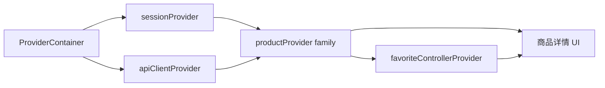
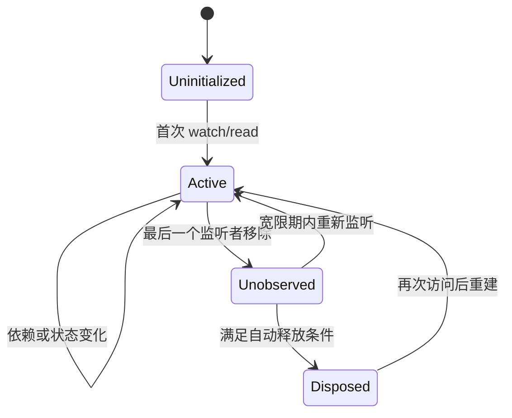

# Flutter Riverpod：Provider 图、生命周期与异步状态工程实践

> 本文面向已经理解 Flutter 声明式 UI 和基本状态设计的读者。重点不是罗列 Riverpod API，而是回答：Provider 图如何运行、状态由谁持有、订阅如何驱动重建、异步任务如何处理刷新与竞态，以及测试和资源释放应放在哪里。

---

## 一、Riverpod 解决的核心问题

一个商品详情页通常同时依赖商品数据、登录会话、收藏状态、库存流和埋点服务。如果直接把它们塞进一个页面 `State`，页面会承担依赖组装、缓存、并发控制、错误处理和 UI 状态等过多职责。

Riverpod 把这些对象声明为一张可组合的 Provider 图：



这张图独立于 `BuildContext`。Flutter UI 通过 `ProviderScope` 接入容器，通过 `WidgetRef` 订阅图中的节点；测试、命令行程序或纯 Dart 代码也可以直接创建 `ProviderContainer`。

### 核心结论

1. Provider 是对值的声明和访问入口，不等于其中缓存的状态值，也不等于 Widget。
2. `ProviderContainer` 持有 Provider 图的运行时状态、依赖关系、Override 和 Observer；`ProviderScope` 将 Container 接入 Widget Tree。
3. `ref.watch` 声明响应式依赖，`ref.read` 获取当前值但不建立持续订阅，`ref.listen` 用于观察变化并执行受控副作用。
4. `Provider` 适合只读派生值或服务；`StateProvider` 只适合简单状态；复杂同步业务使用 `NotifierProvider`，复杂异步业务使用 `AsyncNotifierProvider`。
5. `FutureProvider` 和 `StreamProvider` 适合“根据依赖获得异步结果”，但不适合承载大量业务命令。
6. `autoDispose` 表示无监听者后允许销毁 Provider 状态，不等于底层网络请求必然被取消。
7. `family` 是参数化 Provider；参数的相等性决定缓存身份，不受控的参数集合可能形成无界缓存。
8. `invalidate` 使旧状态失效并在需要时重新计算；`refresh` 通常等价于失效后立即读取新状态。精确返回类型以项目 Riverpod 版本为准。
9. Override 是依赖替换机制，适合环境装配与测试；Observer 是观测机制，不应改变业务状态。
10. Riverpod 管理的是状态依赖和生命周期，不会自动解决业务状态建模、请求幂等、缓存一致性或异步竞态。

---

## 二、版本与代码风格边界

Riverpod 的核心概念较稳定，但不同主版本以及是否使用 `riverpod_generator`，会影响生成类名、`Ref` 的具体类型、注解参数和部分辅助 API。

本文采用现代 `Notifier` / `AsyncNotifier` 风格的手写声明：

```dart
final cartProvider =
    NotifierProvider<CartNotifier, CartState>(CartNotifier.new);
```

没有混用旧项目常见的 `StateNotifierProvider`。旧 API 并非在所有版本中都不可用，但新代码应根据项目锁定的 Riverpod 主版本选择一种统一风格。升级前应查阅对应版本迁移文档，不能只替换类名。

---

## 三、四个核心对象如何协作

### 3.1 Provider：声明节点

Provider 描述“如何创建一个值”，自身通常声明为顶层 `final`：

```dart
final apiClientProvider = Provider<ApiClient>((ref) {
  return ApiClient(baseUri: Uri.parse('https://api.example.com'));
});
```

顶层声明不会使值变成不可控的全局单例。真正的值保存在具体 Container 中；两个 Container 可以得到两套隔离状态。

### 3.2 ProviderContainer：运行时状态容器

```dart
final container = ProviderContainer();

try {
  final client = container.read(apiClientProvider);
  // 使用 client
} finally {
  container.dispose();
}
```

Container 的主要职责包括：

- 保存已创建节点的状态；
- 记录 Provider 之间的依赖和监听关系；
- 应用 Override；
- 向 Observer 报告变化；
- 在失效、自动释放或整体销毁时执行清理。

生产 Flutter 应用通常不手动创建根 Container，而是使用 `ProviderScope`：

```dart
void main() {
  runApp(
    const ProviderScope(
      child: App(),
    ),
  );
}
```

不要在 Widget 的 `build()` 中反复创建 Container。那会割裂 Provider 图，并使缓存、订阅和状态在重建时丢失。

### 3.3 Ref：访问 Provider 图

`Ref` 不是 `BuildContext`，它代表当前 Provider 或消费者与 Container 交互的能力。

| API | 是否建立响应式依赖 | 典型用途 |
|---|---:|---|
| `ref.watch(provider)` | 是 | 构建派生状态或 Widget UI |
| `ref.read(provider)` | 否 | 事件回调中发送命令、一次性读取 |
| `ref.listen(provider, ...)` | 建立监听 | 导航、提示、日志等副作用 |

Provider 内部还可通过当前版本提供的生命周期回调注册资源清理，例如 `ref.onDispose`。相关回调的完整集合和触发细节应以锁定版本文档为准。

### 3.4 ProviderScope / ConsumerWidget：Flutter 接入层

```dart
class ProductTitle extends ConsumerWidget {
  const ProductTitle({super.key, required this.productId});

  final String productId;

  @override
  Widget build(BuildContext context, WidgetRef ref) {
    final title = ref.watch(
      productProvider(productId).select(
        (value) => value.valueOrNull?.name,
      ),
    );
    return Text(title ?? '加载中');
  }
}
```

`.select` 只订阅投影结果。当商品对象的其他字段变化但名称相等时，该 Widget 可避免相应重建。选择结果应是稳定、可比较的不可变值；对可变 List 原地修改会破坏变化判断。

---

## 四、Provider：只读依赖与派生状态

基础 `Provider` 适合：

- Repository、Client、配置等依赖；
- 从其他 Provider 派生的同步只读值；
- 将复杂状态投影成便于 UI 消费的结果。

```dart
final cartTotalProvider = Provider<Money>((ref) {
  final items = ref.watch(
    cartProvider.select((state) => state.items),
  );
  return items.fold(Money.zero, (sum, item) => sum + item.subtotal);
});
```

当 `items` 变化时，总价重新计算；读取总价的 UI 不需要知道购物车内部结构。

不要在 Provider 创建函数中执行没有清理机制的定时器、订阅或全局注册。如果创建了资源，应明确所有权并注册释放：

```dart
final socketProvider = Provider<InventorySocket>((ref) {
  final socket = InventorySocket.connect();
  ref.onDispose(socket.close);
  return socket;
});
```

---

## 五、StateProvider：只用于简单可变状态

`StateProvider` 适合筛选标签、排序方式、页签索引等缺少业务规则的简单值：

```dart
enum ProductSort { recommended, priceAscending, newest }

final productSortProvider =
    StateProvider<ProductSort>((ref) => ProductSort.recommended);
```

读取状态：

```dart
final sort = ref.watch(productSortProvider);
```

更新状态的精确语法会随 Riverpod 版本变化，常见写法是读取对应 Notifier 后修改：

```dart
ref.read(productSortProvider.notifier).state = ProductSort.newest;
```

### 5.1 何时不应使用 StateProvider

错误方向：让多个 Widget 任意修改“订单状态字符串”。这样无法集中保证状态迁移是否合法。

当更新需要校验、记录、异步调用或多个字段原子变更时，应升级为 `NotifierProvider`，将命令和不变量封装在 Notifier 内部。

---

## 六、NotifierProvider：同步业务状态

购物车状态需要不可变更新、库存约束和集中命令：

```dart
final cartProvider =
    NotifierProvider<CartNotifier, CartState>(CartNotifier.new);

class CartNotifier extends Notifier<CartState> {
  @override
  CartState build() => const CartState(items: []);

  void addItem(CartItem item) {
    final index = state.items.indexWhere(
      (current) => current.productId == item.productId,
    );

    if (index == -1) {
      state = state.copyWith(items: [...state.items, item]);
      return;
    }

    final nextItems = [...state.items];
    nextItems[index] = nextItems[index].increaseQuantity();
    state = state.copyWith(items: nextItems);
  }

  void remove(String productId) {
    state = state.copyWith(
      items: [
        for (final item in state.items)
          if (item.productId != productId) item,
      ],
    );
  }
}
```

这里 UI 只能调用 `addItem`、`remove` 等业务命令，而不是任意替换 `state`。不可变对象也使变更判断、测试和日志更可靠。

### 6.1 `build()` 不是 Widget build

Notifier 的 `build()` 用于创建初始状态和声明依赖：

```dart
@override
CartState build() {
  final userId = ref.watch(currentUserIdProvider);
  return CartState(ownerId: userId, items: const []);
}
```

依赖变化可能导致该 Provider 重新创建状态。不要假设 Notifier 实例永久存在，也不要把必须持久化的数据只放在内存状态中。

---

## 七、AsyncNotifierProvider：异步业务状态

`AsyncNotifierProvider` 适合既要加载数据，又要暴露刷新、保存、重试等业务命令的场景。其状态通常是 `AsyncValue<T>`。

```dart
final productRepositoryProvider = Provider<ProductRepository>((ref) {
  throw UnimplementedError('在应用入口 Override');
});

final productControllerProvider = AsyncNotifierProvider.family<
    ProductController, Product, String>(ProductController.new);

class ProductController extends FamilyAsyncNotifier<Product, String> {
  late String _productId;

  @override
  Future<Product> build(String productId) async {
    _productId = productId;
    final repository = ref.watch(productRepositoryProvider);
    return repository.fetchProduct(productId);
  }

  Future<void> rename(String name) async {
    final previous = state.valueOrNull;
    if (previous == null) return;

    final optimistic = previous.copyWith(name: name);
    state = AsyncData(optimistic);

    try {
      final repository = ref.read(productRepositoryProvider);
      final saved = await repository.rename(_productId, name);
      state = AsyncData(saved);
    } catch (error, stackTrace) {
      state = AsyncError(error, stackTrace);
      // 是否回滚到 previous 是产品语义，不能由框架替你决定。
    }
  }
}
```

> `FamilyAsyncNotifier`、构造方式和泛型签名在不同 Riverpod 主版本或代码生成模式中可能不同。示例表达的是职责划分；请按项目 `pubspec.lock` 对应文档调整声明语法。

### 7.1 AsyncValue 是状态，不只是包装器

UI 至少要处理 Loading、Data、Error：

```dart
class ProductBody extends ConsumerWidget {
  const ProductBody({super.key, required this.productId});

  final String productId;

  @override
  Widget build(BuildContext context, WidgetRef ref) {
    final product = ref.watch(productControllerProvider(productId));

    return product.when(
      loading: () => const Center(child: CircularProgressIndicator()),
      data: (value) => ProductContent(product: value),
      error: (error, stackTrace) => ErrorPanel(
        message: '商品加载失败',
        onRetry: () => ref.invalidate(
          productControllerProvider(productId),
        ),
      ),
    );
  }
}
```

真实产品还应区分首次加载、带旧数据刷新、分页追加失败和静默后台刷新。不同版本的 `AsyncValue` 提供不同便利字段，使用前应核对其语义，避免把刷新时的旧数据直接替换成全屏 Loading。

---

## 八、FutureProvider 与 StreamProvider

### 8.1 FutureProvider：声明式异步查询

当需求只是“由参数和依赖计算一次异步结果”，没有复杂命令时，`FutureProvider` 更简单：

```dart
final productProvider = FutureProvider.autoDispose
    .family<Product, String>((ref, productId) async {
  final repository = ref.watch(productRepositoryProvider);
  return repository.fetchProduct(productId);
});
```

它适合详情查询、配置加载、权限检查。若需要乐观更新、分页、保存状态或多个操作阶段，应使用 `AsyncNotifierProvider` 建模。

### 8.2 StreamProvider：持续数据流

```dart
final stockProvider = StreamProvider.autoDispose
    .family<StockQuote, String>((ref, sku) {
  final repository = ref.watch(stockRepositoryProvider);
  return repository.watchStock(sku);
});
```

`StreamProvider` 将流事件映射为异步状态，并与 Provider 生命周期连接。但要确认 Repository 的 Stream 类型：

- 单订阅流是否允许多个消费者；
- 取消订阅是否关闭底层 WebSocket；
- 断线是否重连以及如何退避；
- 错误后 Stream 是继续还是终止；
- 应用前后台切换时是否暂停。

不要因为 UI 订阅自动释放，就推断服务端连接一定关闭。资源释放取决于 Stream 和 Repository 的实现。

---

## 九、autoDispose：缩短状态生命周期

`autoDispose` Provider 在没有监听者后进入可释放状态。它常用于路由级详情、搜索建议和参数化查询：

```dart
final searchProvider = FutureProvider.autoDispose
    .family<List<Product>, String>((ref, keyword) async {
  final repository = ref.watch(productRepositoryProvider);
  return repository.search(keyword);
});
```

其典型生命周期是：



精确宽限时机与版本实现有关，工程上应依赖“允许在失去监听后释放”这一契约，而不是依赖具体微任务或帧数。

### 9.1 autoDispose 不等于取消 Future

Dart `Future` 本身没有通用取消能力。Provider 被释放只意味着它不再保留和发布结果，底层 HTTP 请求是否停止取决于客户端是否支持取消。

支持取消的客户端应显式绑定生命周期：

```dart
final productProvider = FutureProvider.autoDispose
    .family<Product, String>((ref, productId) async {
  final cancelToken = RequestCancelToken();
  ref.onDispose(cancelToken.cancel);

  final repository = ref.watch(productRepositoryProvider);
  return repository.fetchProduct(
    productId,
    cancelToken: cancelToken,
  );
});
```

还要区分“用户取消”与“网络失败”，避免取消被记录成错误告警或触发无意义重试。

---

## 十、keepAlive：有条件地保留缓存

对成功结果希望短期复用、失败结果希望离开页面后释放，可以在 `autoDispose` Provider 内按条件保活：

```dart
final catalogProvider = FutureProvider.autoDispose<Catalog>((ref) async {
  final repository = ref.watch(catalogRepositoryProvider);
  final catalog = await repository.fetchCatalog();

  // 具体返回对象及 close 能力取决于 Riverpod 版本。
  final link = ref.keepAlive();
  ref.onDispose(() {
    // Provider 最终销毁时清理其他自有资源。
  });

  return catalog;
});
```

`keepAlive` 不是免费的性能优化。它会延长状态和其引用对象的存活时间，可能导致：

- 数据过期却一直复用；
- 大对象占用内存；
- `family` 参数过多时积累大量缓存；
- 用户切换后误用前一用户的数据。

缓存必须定义失效条件，例如超时、用户变化、主动刷新、写操作成功或应用内存压力。若当前版本返回可关闭的 KeepAlive Link，可结合定时器关闭；定时器本身也要在 `onDispose` 中取消。

---

## 十一、family：参数决定 Provider 身份

`family` 可以理解为从参数到 Provider 实例的映射：

```dart
final orderProvider = FutureProvider.autoDispose
    .family<Order, OrderQuery>((ref, query) {
  return ref.watch(orderRepositoryProvider).fetchOrder(
        userId: query.userId,
        orderId: query.orderId,
      );
});

final class OrderQuery {
  const OrderQuery({required this.userId, required this.orderId});

  final String userId;
  final String orderId;

  @override
  bool operator ==(Object other) =>
      other is OrderQuery &&
      other.userId == userId &&
      other.orderId == orderId;

  @override
  int get hashCode => Object.hash(userId, orderId);
}
```

如果每次 build 都创建一个没有值相等语义的参数对象，逻辑上相同的查询可能被视为不同身份，造成重复请求和缓存增长。

对搜索关键词还应先标准化和防抖。不要为用户每次按键永久保留一个 family 节点；搜索类 Provider 通常应搭配 `autoDispose`。

---

## 十二、invalidate 与 refresh

两者都用于重新计算，但意图不同：

### 12.1 invalidate：声明旧值失效

```dart
ref.invalidate(productProvider(productId));
```

如果仍有监听者，Provider 会按框架调度重新计算；没有监听者时，通常等到下次需要再创建。它适合写操作成功后让相关查询缓存失效：

```dart
await repository.updateFavorite(productId, true);
ref.invalidate(productProvider(productId));
ref.invalidate(favoriteListProvider);
```

### 12.2 refresh：失效并立即读取

常见语义可理解为：

```dart
final next = ref.refresh(productProvider(productId));
```

它适合下拉刷新后立即获得新一轮结果。不同 Provider 类型和 Riverpod 版本的返回值不同，不应把示意代码当作跨版本固定签名。

### 12.3 不要制造刷新风暴

如果 A watch B，B watch C，反复 invalidate C 会沿依赖图触发重算。批量写操作应在事务或业务操作完成后统一失效相关根节点，而不是循环中逐条刷新整个列表。

---

## 十三、Provider Override：替换依赖，而非添加分支

Override 可以在 Container 或 Scope 边界替换 Provider 实现。

### 13.1 应用入口装配

```dart
void main() {
  final repository = RemoteProductRepository(
    api: ProductApi.production(),
  );

  runApp(
    ProviderScope(
      overrides: [
        productRepositoryProvider.overrideWithValue(repository),
      ],
      child: const App(),
    ),
  );
}
```

业务 Provider 依赖抽象 Repository，不需要判断 `isTest` 或 `isMock`。

### 13.2 局部 Scope

嵌套 `ProviderScope` 可为一个功能子树替换配置，但要谨慎：同一 Provider 在不同 Container/Scope 中可能拥有不同状态。跨 Scope 传递 Notifier 或缓存对象会使所有权难以判断。

### 13.3 测试隔离

```dart
test('加载指定商品', () async {
  final fakeRepository = FakeProductRepository(
    products: {'p-1': const Product(id: 'p-1', name: 'Keyboard')},
  );

  final container = ProviderContainer(
    overrides: [
      productRepositoryProvider.overrideWithValue(fakeRepository),
    ],
  );
  addTearDown(container.dispose);

  final product = await container.read(
    productProvider('p-1').future,
  );

  expect(product.name, 'Keyboard');
});
```

部分版本提供专用测试 Container 辅助 API。无论使用哪种方式，都应确保测试结束后 dispose，并避免多个测试共享可变 Container。

---

## 十四、ProviderObserver：观测而非控制

Observer 适合记录 Provider 创建、更新、失败和销毁，帮助调试状态流：

```dart
class AppProviderObserver extends ProviderObserver {
  // 方法名和参数签名随 Riverpod 主版本变化，
  // 请按当前版本覆盖对应回调。
}
```

Observer 的工程边界：

- 不在 Observer 中触发业务写操作，否则可能形成递归更新；
- 不记录 Token、用户隐私或完整业务对象；
- 对高频 Provider 采样，避免日志本身造成性能问题；
- Release 环境控制级别与上传量；
- 使用稳定 Provider 名称或业务标签，避免只依赖内部调试字符串。

Observer 能证明“状态发生了变化”，不能单独证明是哪段 UI 慢。重建、布局、绘制和光栅化仍要结合 Flutter DevTools 的 Timeline、Widget rebuild profiling 和目标设备数据分析。

---

## 十五、异步并发、竞态与取消

Riverpod 会管理 Provider 计算的版本，但业务命令中的并发仍需显式设计。

### 15.1 常见竞态

用户连续搜索 `fl` 和 `flutter`：第二个请求先返回，随后第一个请求返回并覆盖 UI，形成旧结果回写。

如果使用 `family(keyword)`，每个关键词是不同节点，UI 切换订阅后旧节点不会直接成为新节点的值；配合 `autoDispose` 和底层取消可减少浪费。

但在同一个 Notifier 的命令里手动发起多个请求时，仍应使用序号或取消令牌：

```dart
class SearchController extends AsyncNotifier<List<Product>> {
  int _requestId = 0;

  @override
  Future<List<Product>> build() async => const [];

  Future<void> search(String keyword) async {
    final currentRequest = ++_requestId;
    state = const AsyncLoading();

    try {
      final repository = ref.read(productRepositoryProvider);
      final result = await repository.search(keyword);

      if (currentRequest != _requestId) return;
      state = AsyncData(result);
    } catch (error, stackTrace) {
      if (currentRequest != _requestId) return;
      state = AsyncError(error, stackTrace);
    }
  }
}
```

这能阻止旧结果提交，但不会停止底层请求。需要节省网络和服务端资源时，还要使用客户端支持的取消机制。

### 15.2 重试必须有边界

自动重试应考虑：

- 只重试可恢复错误，如部分超时或 5xx；
- 指数退避并加入抖动；
- 设置最大次数或总时长；
- 用户取消、鉴权失败和参数错误通常不重试；
- Provider dispose 时终止定时器和后续尝试；
- 写请求重试前确认幂等键和服务端语义。

Riverpod 的某些版本提供 Provider 级重试配置，但策略和默认值属于版本相关能力，应核对当前版本后再使用。

---

## 十六、副作用应使用 ref.listen

Widget 构建描述 UI，不适合直接弹 SnackBar 或导航：

```dart
class CheckoutPage extends ConsumerStatefulWidget {
  const CheckoutPage({super.key});

  @override
  ConsumerState<CheckoutPage> createState() => _CheckoutPageState();
}

class _CheckoutPageState extends ConsumerState<CheckoutPage> {
  @override
  Widget build(BuildContext context) {
    ref.listen(checkoutProvider, (previous, next) {
      final error = next.error;
      if (error != null) {
        ScaffoldMessenger.of(context).showSnackBar(
          const SnackBar(content: Text('提交订单失败')),
        );
      }
    });

    final checkout = ref.watch(checkoutProvider);
    return CheckoutContent(isSubmitting: checkout.isLoading);
  }
}
```

注意避免对同一个持续 Error 在重建后重复提示。可以监听状态迁移、消费一次性事件，或在状态中加入明确的操作 ID。异步回调使用 `context` 前仍应确认 Widget 挂载状态；Riverpod 不替代 Flutter 的 `mounted` 生命周期规则。

---

## 十七、性能：优化订阅，而不是猜测

Riverpod 可以缩小重建范围，但 Provider 数量多不等于性能差。真正需要观察的是状态更新频率、订阅粒度、派生计算成本和 Widget 重建成本。

### 17.1 常见优化方式

```dart
final itemCount = ref.watch(
  cartProvider.select((state) => state.items.length),
);
```

其他原则包括：

- 将独立变化的状态拆成语义清晰的节点；
- 使用不可变状态，避免原地修改导致无法识别变化；
- 重计算昂贵时使用派生 Provider，让依赖图负责缓存；
- 不在 `build()` 中执行网络请求或命令；
- 不把整个巨型页面状态传给只显示一个角标的 Widget；
- 对文本输入等高频源在业务边界防抖，而不是每次按键请求网络。

### 17.2 验证方法

性能结论应在目标真机的 Profile 模式验证：

1. 使用 DevTools Timeline 记录真实交互；
2. 打开 Widget rebuild profiling，定位重建次数和范围；
3. 用 Observer 的采样日志关联状态更新时间，但不要全量打印大对象；
4. 分别观察 UI 线程构建/布局/绘制和 Raster 时间；
5. 按设备刷新率判断预算：60 Hz 约 16.7 ms，120 Hz 约 8.3 ms；
6. 优化后以同设备、同数据、同操作重新采样比较。

Debug 模式的编译、断言和调试开销不能用于得出发布性能结论。

---

## 十八、常见错误与修复

### 18.1 在事件回调里 watch

错误：把 `watch` 当成任意位置都可调用的读取 API。

修复：UI 构建阶段用 `watch` 声明依赖；按钮回调中用 `read` 获取 Notifier 并发送命令。

### 18.2 用 read 显示会变化的数据

```dart
final count = ref.read(cartProvider).items.length;
```

这不会让 Widget 随购物车变化而重建。显示状态应使用 `watch` 或 `select`。

### 18.3 在 build 中发送命令

```dart
@override
Widget build(BuildContext context, WidgetRef ref) {
  ref.read(productControllerProvider('p-1').notifier).reload();
  return const LoadingView();
}
```

每次重建都可能再次请求。初始加载应放在 Provider 的构建逻辑中，用户刷新由事件触发，Widget 生命周期特有动作则使用合适的 ConsumerState 生命周期方法。

### 18.4 用 StateProvider 承载复杂业务

如果任何 Widget 都能写订单状态，就无法保证 `paid` 不会回到 `pending`。使用 Notifier 暴露受约束的 `pay()`、`cancel()` 命令。

### 18.5 假设 autoDispose 会取消一切

Provider 状态释放、Stream 取消订阅、HTTP 请求取消是三个层次。必须逐层验证底层库的取消和资源释放行为。

### 18.6 family 参数不稳定

缺少 `==` / `hashCode` 的对象、当前时间或随机值会制造不同 Provider 身份。参数应不可变、语义稳定且可比较。

### 18.7 把所有状态都放进 Riverpod

`TextEditingController`、`FocusNode`、动画控制器和只属于单个 Widget 的短生命周期 UI 状态，通常仍由 StatefulWidget/Hook 持有更自然。跨组件共享、需要测试或依赖业务服务的状态才更适合进入 Provider 图。

### 18.8 Observer 记录敏感数据

状态日志可能包含用户资料、Token 和订单信息。生产 Observer 应脱敏、采样并限制保留期限。

---

## 十九、方案选择：Riverpod 不是唯一答案

| 维度 | Provider | Riverpod | BLoC/Cubit |
|---|---|---|---|
| 依赖作用域 | Widget Tree / Context | Container 与 Provider 图 | 通常由 DI/Widget Scope 组装 |
| 状态表达 | 对象类型与监听器 | Provider、Notifier、AsyncValue | Event/Method、State、Stream |
| 异步状态 | 需自行或借助 Provider 类型建模 | Async Provider / AsyncNotifier | 显式 State 与事件转换 |
| 测试替换 | 包裹 Provider Tree | Container Override | 注入 Bloc/Repository |
| 学习成本 | 较低 | 中等，需理解生命周期图 | 中等到较高，约束更显式 |
| 适合场景 | 中小项目、已有 ChangeNotifier 模型 | 强组合、异步查询、多环境测试 | 强事件流、严格团队规范 |

选择应考虑团队经验、已有代码、状态复杂度、调试要求和迁移成本。对简单页面，`setState` 往往比引入全局状态框架更合适。

---

## 二十、可执行的工程落地清单

1. 先按 Ephemeral、Route、Feature、Application State 分析生命周期。
2. Repository 和平台服务用只读 Provider 注入。
3. 简单筛选值使用 StateProvider，复杂规则使用 Notifier。
4. 纯查询使用 FutureProvider/StreamProvider，带命令的异步流程使用 AsyncNotifier。
5. 路由级或高基数 family 默认评估 autoDispose。
6. 为请求取消、超时、重试、竞态和幂等分别设计，不依赖框架猜测。
7. 写操作完成后只 invalidate 真正受影响的查询节点。
8. 在 Composition Root Override 抽象依赖，测试中每例创建隔离 Container。
9. 用 ref.listen 承载受控 UI 副作用，用 Observer 做脱敏观测。
10. 在 Profile 模式和目标设备测量重建及帧耗时后再优化。

---

## 总结

Riverpod 的关键不是“没有 `BuildContext` 的 Provider”，而是以 `ProviderContainer` 为运行时边界，建立一张可组合、可替换、可观察的状态依赖图。

真正需要记住的是：用 `watch` 表达依赖，用 `read` 发送命令，用 `listen` 处理副作用；按复杂度选择 Provider 类型；通过 `autoDispose`、`keepAlive` 和 `family` 设计缓存生命周期；用 invalidate/refresh 表达失效意图；通过 Override 隔离环境和测试。与此同时，网络取消、竞态、重试、缓存一致性和敏感日志仍是业务工程问题，Riverpod 只能提供组织这些问题的结构，不能替你作出正确设计。

---

## 问答复盘

### Q1：顶层声明 Provider 是否意味着创建了全局单例？

**答：** 不意味着。顶层变量是 Provider 的声明，具体值和状态保存在 `ProviderContainer` 中；不同 Container 可以拥有隔离实例。

### Q2：`ref.watch`、`ref.read` 和 `ref.listen` 的核心区别是什么？

**答：** `watch` 声明响应式依赖，`read` 一次性读取而不持续订阅，`listen` 观察变化并执行回调。显示状态通常 watch，事件发送命令通常 read，导航和提示通常 listen。

### Q3：何时应从 StateProvider 升级为 NotifierProvider？

**答：** 当状态更新包含校验、多个字段原子修改、业务不变量或需要统一命令入口时就应升级。StateProvider 适合没有复杂规则的简单值。

### Q4：FutureProvider 和 AsyncNotifierProvider 如何选择？

**答：** 只有“根据依赖查询结果”时优先 FutureProvider；还要暴露保存、分页、乐观更新、重试等命令时使用 AsyncNotifierProvider。

### Q5：autoDispose 后，正在执行的 HTTP 请求一定停止吗？

**答：** 不一定。它释放的是 Provider 状态；请求是否停止取决于 HTTP 客户端和 Repository 是否提供取消机制，并通过 `onDispose` 显式连接。

### Q6：keepAlive 是否应该用于所有成功请求以提高性能？

**答：** 不应该。它会延长缓存和引用对象的生命周期，必须同时定义过期、用户切换、主动失效和内存成本，否则可能保留陈旧数据或形成无界缓存。

### Q7：为什么 family 参数必须具有稳定的相等性？

**答：** 参数参与 Provider 身份和缓存定位。逻辑相同但不相等的参数会创建不同节点，导致重复请求、状态不共享和缓存增长。

### Q8：invalidate 与 refresh 的边界是什么？

**答：** invalidate 表达“旧状态失效”，通常按是否被监听决定何时重算；refresh 通常表示失效后立即读取新状态。具体返回类型和调度细节要以项目版本为准。

### Q9：用户快速输入搜索词时，只使用 AsyncNotifier 就能避免旧请求覆盖新结果吗？

**答：** 不能保证。若多个命令请求共享同一状态，需要请求序号或取消令牌阻止旧结果提交；底层资源取消还要由网络客户端支持。

### Q10：ProviderObserver 能否用来实现状态同步或自动修复？

**答：** 不应这样使用。Observer 应保持观测职责，记录脱敏、采样后的生命周期和错误；在回调中修改业务状态容易产生递归和隐式耦合。

---

## 延伸知识

- Flutter Widget、Element 与 `ProviderScope` 的生命周期关系；
- 不可变状态、值相等与结构共享；
- `AsyncValue` 的刷新、重载与旧数据展示策略；
- HTTP 取消、幂等键、指数退避与缓存一致性；
- Riverpod 代码生成、Lint 和版本迁移；
- DevTools Timeline、Widget 重建分析与状态可观测性。
