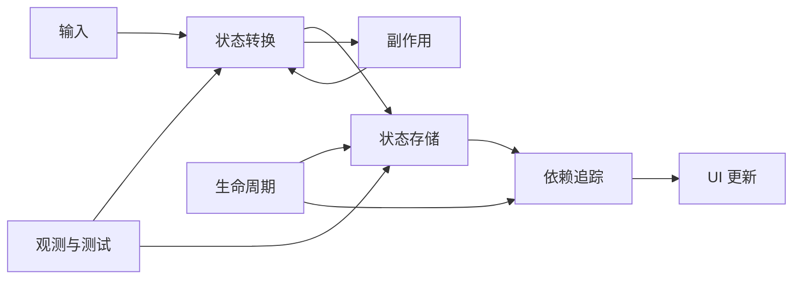
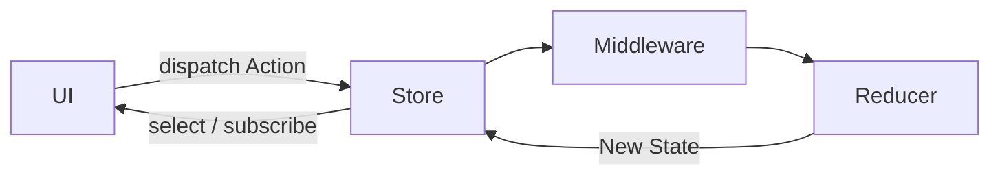
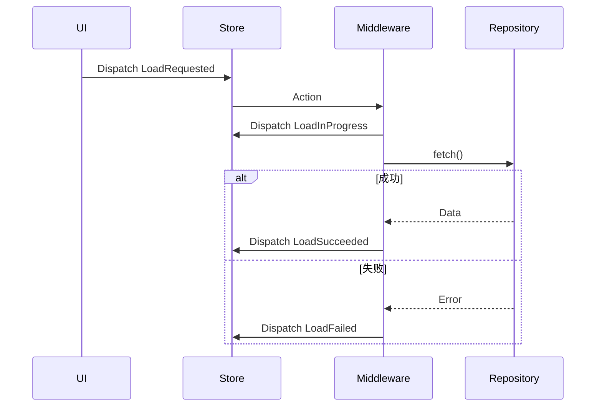
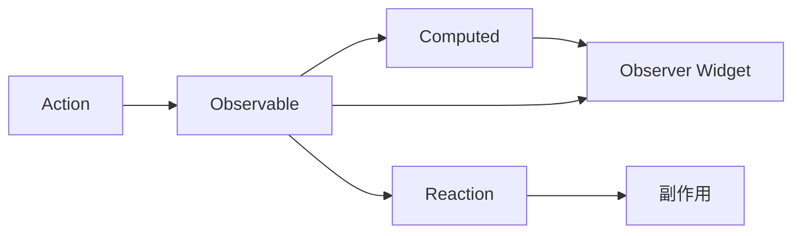
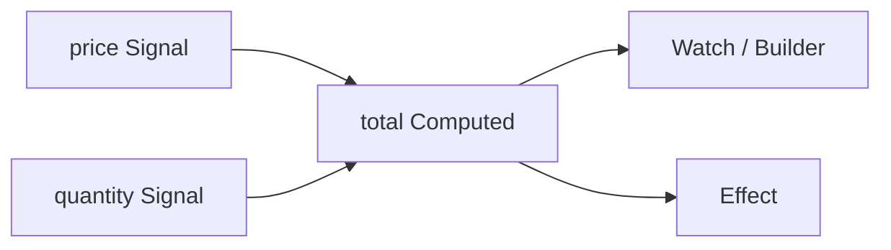
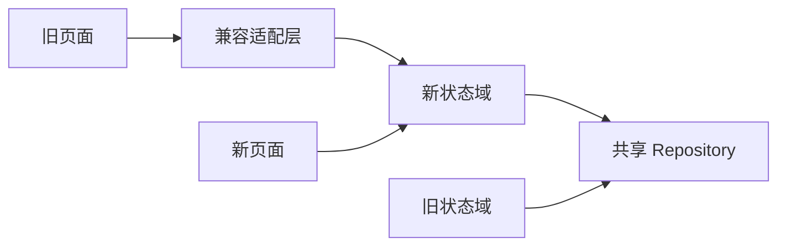

# Flutter 状态管理其他方案：Redux、MobX、GetX、Signals 与迁移选型

> Flutter 状态管理没有脱离场景的“最优框架”。本文不把 Redux、MobX、GetX 和 Signals 写成四份 API 清单，而是比较它们如何表达状态、依赖、更新、副作用和生命周期，并给出可执行的选型、迁移、调试与验证方法。

---

## 一、先确定问题，再选择工具

团队说“当前状态管理不好用”时，真正的问题可能完全不同：

- 页面状态散落，没人知道谁拥有数据；
- 网络结果、表单草稿和全局会话混在一起；
- 任意对象都能修改共享状态；
- 异步请求存在重复提交或旧结果覆盖；
- 页面退出后 Controller、Reaction 或 Stream 没有释放；
- 状态变化无法回溯，线上问题无法复现；
- 一个高频字段让整个页面反复重建；
- 框架同时承担路由、依赖注入和状态管理，边界难以测试。

更换 Package 只能改变表达方式，不能自动修复状态所有权、数据一致性和生命周期设计。

### 核心结论

1. Redux 强调单一 Store、Action、Reducer 和单向数据流，适合需要严格可预测性、审计和集中治理的状态。
2. MobX 通过 Observable、Computed、Action 和 Reaction 自动追踪依赖，表达简洁，但团队必须理解反应边界和资源释放。
3. GetX 提供响应式状态、简单更新、依赖管理和路由等多种能力；便利性较高，但过度使用全局查找会隐藏依赖与生命周期。
4. Signals 以细粒度响应式原语表达 Signal、Computed 和 Effect；Flutter 并没有统一内建的通用 Signals 状态管理 API，具体能力取决于所选 Package。
5. Provider 数量、Store 数量或样板代码多少都不是单独的选型标准，应比较状态复杂度、生命周期、并发、测试、调试和团队约束。
6. 响应式依赖追踪能减少手写订阅，不会自动解决异步竞态、缓存一致性、重试、取消和错误建模。
7. 状态管理迁移应按业务域渐进替换，并保持一个状态只有一个可写事实源；双向同步两套 Store 是最危险的过渡状态。
8. 调试必须能回答“谁在何时因什么输入把状态从什么变成什么”，不能只打印最终 State。
9. 性能优化要在目标设备的 Profile 模式测量 Widget 重建、计算开销和帧耗时，而不是根据框架宣传推断。
10. 小范围 Ephemeral State 继续使用 `StatefulWidget`、`ValueNotifier` 或控制器，通常比提升到应用级框架更合理。

---

## 二、统一比较模型

不同框架术语不一样，但可以用相同问题比较：



选型时至少回答：

- 状态由谁持有，写入口在哪里？
- UI 如何声明依赖，更新粒度是什么？
- 同步与异步状态如何建模？
- 副作用在哪里执行，如何取消？
- 页面、功能域和应用级状态何时创建与释放？
- 如何替换依赖和隔离测试？
- 状态变化能否记录、关联和复现？
- 团队是否能长期遵守框架约束？

---

## 三、Redux：显式单向数据流

Redux 的稳定思想可以概括为：



### 3.1 核心对象

- Store：保存当前状态并负责分发；
- State：应用或业务域的不可变状态快照；
- Action：描述发生了什么；
- Reducer：根据旧 State 与 Action 计算新 State；
- Middleware：处理日志、异步、鉴权、持久化等横切逻辑；
- Selector：从 Store 投影出消费者需要的派生状态。

具体 Flutter Redux Package 的 Widget、Middleware 签名和维护状态会随生态变化。下面使用接近通用 Redux 的示意代码，实际项目应核对选定 Package 文档。

### 3.2 Reducer 必须保持纯粹

```dart
sealed class CartAction {
  const CartAction();
}

final class CartItemAdded extends CartAction {
  const CartItemAdded(this.item);
  final CartItem item;
}

CartState cartReducer(CartState state, Object action) {
  return switch (action) {
    CartItemAdded(:final item) => state.copyWith(
        items: [...state.items, item],
      ),
    _ => state,
  };
}
```

Reducer 不执行网络请求、不读当前时间、不生成随机数，也不修改旧集合。相同输入应得到相同输出，才能可靠测试、回放和调试。

### 3.3 异步放在哪里

常见做法是 Middleware 拦截意图 Action，调用 Repository，再分发成功或失败 Action：



Middleware 需要自行处理取消、去重、乱序结果和重试。Redux 的单向流不会自动保证最后请求获胜。

### 3.4 Redux 的收益与代价

收益：

- 更新入口和状态转换高度显式；
- Action 日志易于审计；
- Reducer 易做确定性测试；
- 适合跨页面共享、规则复杂且要求回溯的业务状态；
- Selector 可以集中复用派生逻辑。

代价：

- Action、Reducer、State 和 Middleware 类型较多；
- 将局部状态全部放入根 Store 会造成巨型状态树；
- 异步流程容易散落在 Middleware 与多组 Action 中；
- 团队若绕过 Reducer 保存可变对象，会破坏整个模型；
- Store 级持久化需要版本迁移和敏感数据治理。

Redux 不等于“一个应用只能有一个物理 Store”。稳定原则是每个状态域有明确事实源和单向更新，不应为了教条把所有页面临时状态放到根 Store。

---

## 四、MobX：自动依赖追踪

MobX 通常由以下概念构成：

- Observable：可观察状态；
- Computed：从 Observable 派生并缓存的值；
- Action：修改状态的语义边界；
- Reaction：Observable 变化后执行副作用；
- Observer：读取 Observable，并在依赖变化时更新 UI。



### 4.1 Store 示例

Flutter MobX 项目常使用注解与代码生成。具体注解、Mixin 和生成命令以项目锁定的 `mobx`、`flutter_mobx`、`mobx_codegen` 版本为准：

```dart
abstract class CartStoreBase with Store {
  @observable
  ObservableList<CartItem> items = ObservableList<CartItem>();

  @computed
  Money get total => items.fold(
        Money.zero,
        (sum, item) => sum + item.subtotal,
      );

  @action
  void add(CartItem item) {
    items.add(item);
  }
}
```

示例展示的是概念结构，不代表所有 MobX 主版本可直接编译。代码生成项目还需要把生成文件纳入 CI 校验，防止源文件与生成结果不一致。

### 4.2 依赖是在执行读取时建立的

Observer 构建过程中实际读取了哪些 Observable，就追踪哪些依赖：

```dart
Observer(
  builder: (_) => Text('${cartStore.items.length}'),
)
```

如果把读取移到 Observer 外部，Observer 可能无法追踪：

```dart
final count = cartStore.items.length;

return Observer(
  builder: (_) => Text('$count'),
);
```

这里 Builder 内没有读取 Observable，`count` 只是旧快照。修复方式是在 Observer 的追踪范围内读取。

### 4.3 Computed 与 Reaction 不能混用

Computed 应是纯派生值，不执行导航、网络或写操作。Reaction 用于副作用：

```dart
late final ReactionDisposer disposeErrorReaction;

void bindReactions() {
  disposeErrorReaction = reaction<String?>(
    (_) => errorMessage,
    (message) {
      if (message != null) errorReporter.report(message);
    },
  );
}

void dispose() {
  disposeErrorReaction();
}
```

Reaction 是资源，必须明确创建和释放位置。页面重建时重复创建 Reaction 会造成重复执行与内存泄漏。

### 4.4 MobX 的收益与代价

收益：

- 状态、派生值和 Action 写法紧凑；
- 自动追踪实际读取依赖，适合细粒度 UI；
- 领域对象可以保持较自然的面向对象表达；
- Computed 减少重复派生逻辑。

代价：

- 更新链路部分隐式，开发者需理解追踪上下文；
- Action 边界不严格时，任意位置都可能修改 Observable；
- Reaction 生命周期容易遗漏；
- 可变集合和深层 Observable 会增加推理成本；
- 代码生成增加构建与升级维护工作。

---

## 五、GetX：便利能力与边界治理

GetX 生态通常同时提供：

- 响应式状态，如 Rx 值与观察 Widget；
- 简单状态更新，如 Controller 配合局部 Builder；
- 依赖注册与查找；
- 路由、国际化等其他能力。

这些能力可以单独使用。状态管理、依赖注入和路由是否全部采用 GetX，应分别评估，避免因为 Package 提供了能力就把应用所有边界耦合在一起。

### 5.1 响应式更新示意

```dart
class CartController extends GetxController {
  final items = <CartItem>[].obs;

  Money get total => items.fold(
        Money.zero,
        (sum, item) => sum + item.subtotal,
      );

  void add(CartItem item) {
    items.add(item);
  }
}
```

UI 常通过对应版本提供的响应式 Builder 读取 Rx 值。精确语法、Worker API、Controller 生命周期策略应以所用 GetX 版本为准。

### 5.2 响应式与简单更新是两种模型

GetX 中常见两类更新：

- 响应式模型：UI 读取 Rx 值并自动追踪；
- 显式更新模型：Controller 调用更新，指定 Builder 重建。

同一功能域应有一致规范。随意混用可能导致开发者无法判断某字段变化会自动触发、需要手动更新，还是二者都会触发。

### 5.3 全局查找会隐藏依赖

```dart
class CheckoutController extends GetxController {
  final repository = Get.find<CheckoutRepository>();
}
```

写法很短，但依赖没有出现在构造函数中：

- 单元测试必须预先配置全局注册表；
- 阅读类定义无法知道创建条件；
- Key 冲突或注册顺序可能在运行时暴露；
- Controller 的作用域和所有权不直观。

更可测试的方式是构造函数注入，并只在 Composition Root 负责查找与组装：

```dart
class CheckoutController extends GetxController {
  CheckoutController({required CheckoutRepository repository})
      : _repository = repository;

  final CheckoutRepository _repository;
}
```

### 5.4 生命周期必须显式设计

使用 GetX 依赖能力时，需要核对当前版本中注册策略、路由绑定、永久实例、延迟创建和自动移除的准确语义。尤其要检查：

- 页面退出后 Controller 是否释放；
- Worker、StreamSubscription、Timer 是否在 `onClose` 中取消；
- 全局实例是否意外持有 Context、Widget 或页面资源；
- 测试之间是否重置注册表；
- 多 Navigator、嵌套路由和 Web URL 场景下 Scope 是否符合预期。

### 5.5 GetX 的收益与代价

收益是接入快、API 集中、较少样板代码，适合团队明确规范下快速开发。代价是便利 API 容易扩大隐式全局状态，且状态、路由与依赖生命周期可能互相耦合。项目规模越大，越需要限制全局查找、定义 Binding 边界并保持业务层不依赖 UI/路由 API。

---

## 六、Signals：细粒度响应式原语

Signals 通常包含三个原语：

- Signal：保存可读写值；
- Computed Signal：根据其他 Signal 派生；
- Effect：依赖变化后执行副作用。



Flutter SDK 存在 `Listenable`、`ValueNotifier` 等响应式基础，但截至本文写作范围，并不存在一个可视为所有 Flutter 项目统一标准的通用 Signals 状态管理 API。社区 Package 在函数名、生命周期、异步能力和 Widget 集成方面不同，必须选择具体实现后核对文档。

### 6.1 概念示例

```dart
final quantity = signal(1);
final unitPrice = signal(Money.fromCents(1999));
final total = computed(() => unitPrice.value * quantity.value);
```

这只是常见概念语法，不承诺对任意 Signals Package 可编译。

### 6.2 细粒度不等于零成本

Signals 可以只通知读取了相关值的消费者，但成本仍包括：

- 依赖图的建立与维护；
- Computed 重新计算；
- Effect 调度；
- Widget Build、Layout、Paint 和 Raster；
- 大量细小 Signal 的所有权与清理。

如果一个 Computed 每次执行都遍历数万条数据，细粒度通知也无法消除计算成本。

### 6.3 Effect 的危险边界

Effect 适合日志、持久化或外部同步，但必须避免：

- Effect 写回自身依赖，形成循环；
- 在 Widget build 中反复创建 Effect；
- 用多个 Effect 双向同步同一状态；
- 忽略异步 Effect 的旧结果和取消；
- 把导航等一次性动作建模成永久布尔 Signal。

### 6.4 Signals 的收益与代价

收益是原语小、组合直接、依赖粒度细，适合局部派生关系密集的交互界面。代价是架构约束较少：大型项目仍需自行规定 Store、Repository、异步状态、副作用和生命周期边界。Package 生态和版本稳定性也应纳入长期维护评估。

---

## 七、四种方案的横向比较

| 维度 | Redux | MobX | GetX | Signals |
|---|---|---|---|---|
| 更新入口 | Dispatch Action | Action 修改 Observable | Controller 方法/Rx/显式更新 | 写 Signal |
| 依赖追踪 | Selector 与订阅 | 自动追踪 Observable | Rx 追踪或手动更新 | 自动追踪 Signal |
| 数据流显式度 | 高 | 中等 | 取决于规范 | 中等 |
| 异步模型 | Middleware 等自行组织 | Action/Reaction 自行组织 | Controller/Worker 自行组织 | Async 原语或自行组织 |
| 生命周期 | Store/订阅显式管理 | Store/Reaction 显式管理 | 注册策略与路由 Binding | Owner/Scope/Disposer 依实现而定 |
| 调试回放 | Action/Reducer 适合 | 需借助 Spy/日志 | 需统一日志规范 | 依赖图和 Effect 需工具支持 |
| 样板代码 | 较多 | 中等，常含生成代码 | 较少 | 较少 |
| 主要风险 | 巨型 Store、Action 膨胀 | 隐式依赖、Reaction 泄漏 | 全局耦合、生命周期隐藏 | Effect 混乱、生态差异 |

表格描述一般倾向，不是绝对性能排序。相同框架在不同状态设计和 Widget 拆分下可能表现完全不同。

---

## 八、状态管理方案选型

### 8.1 按状态类型选，而不是全项目一刀切

| 状态类型 | 优先考虑 |
|---|---|
| 单 Widget 动画、焦点、展开 | StatefulWidget、控制器、ValueNotifier |
| 页面表单与简单交互 | Cubit、Notifier、Signals、局部 Store |
| 复杂事件状态机 | BLoC、Reducer/Redux |
| 跨页面共享业务状态 | Riverpod、BLoC、Redux、受控 MobX Store |
| 高频细粒度派生 UI | Selector、MobX、Signals 或拆分后的 Provider |
| Server State | 带缓存、失效、重试和取消语义的专门数据层 |

状态管理框架不应直接承担所有 Server State 策略。分页、过期时间、缓存键、离线一致性和后台刷新仍需要 Repository 或专门查询层设计。

### 8.2 选型评分维度

可以按团队项目权重评分：

1. 状态转换复杂度；
2. 异步并发与取消需求；
3. 生命周期和 Scope 数量；
4. 可测试性与依赖替换；
5. 状态追踪和审计要求；
6. 性能与状态更新频率；
7. 团队经验和招聘成本；
8. Package 维护、版本升级和生态风险；
9. 代码生成与 CI 成本；
10. 与现有架构的迁移成本。

不要用 Demo 开发速度作为唯一指标。更有效的技术验证应实现同一个真实垂直切片：加载、刷新、保存、错误、取消、重复点击、测试和页面退出，然后比较代码与运行证据。

### 8.3 何时保持现状

如果当前方案的主要问题可以通过明确 Scope、拆分巨型 State、修复异步竞态和补充测试解决，全面迁移通常不是最高收益选项。框架迁移会带来培训、双栈维护、回归和调试工具重建成本。

---

## 九、状态管理迁移：渐进替换而不是大爆炸

### 9.1 先建立迁移清单

迁移前记录：

- Store/Controller/Provider 的创建和销毁位置；
- 所有读写入口；
- 跨功能依赖；
- Stream、Timer、Reaction 和请求资源；
- 持久化状态及 Schema；
- 路由、副作用和埋点；
- 关键状态序列测试；
- 性能基线和线上错误基线。

没有这些信息，迁移很容易改变隐含行为。

### 9.2 按业务域建立边界



迁移一个完整功能域，包括状态、写入口、测试和生命周期。共享 Repository 可以作为稳定边界，但不要让新旧状态层双向复制全部状态。

### 9.3 保持单一可写事实源

危险做法：旧 Store 监听新 Store，新 Store 又监听旧 Store。任何延迟、错误或相等性差异都会形成循环和分叉。

过渡期应指定唯一写入方：

- 旧 UI 通过 Adapter 调用新 Store；或
- 新 UI 暂时只读旧 Store；
- 数据只沿一个方向映射；
- Adapter 在功能迁移完成后删除。

### 9.4 迁移持久化状态

Redux Store、MobX Store 或 GetX Controller 中的持久化数据可能包含版本化 JSON。切换模型时必须：

- 定义 Schema Version；
- 编写向前迁移或安全清除策略；
- 保护 Token、隐私和加密材料；
- 测试旧版本升级、降级和损坏数据；
- 不直接序列化框架内部对象。

### 9.5 迁移完成标准

不仅是“页面能打开”，还包括：

- 旧写入口已删除；
- 临时 Adapter 已收敛；
- 状态序列与错误路径测试通过；
- 资源无重复订阅和泄漏；
- 深链、返回栈和状态恢复行为一致；
- Profile 指标无显著回退；
- 日志、告警和调试工具已切换。

---

## 十、状态调试与追踪

### 10.1 一条有效状态记录包含什么

```json
{
  "timestamp": "2026-07-30T10:30:00.123Z",
  "feature": "checkout",
  "instanceId": "checkout-route-42",
  "trigger": "CheckoutSubmitted",
  "previous": "editing",
  "next": "submitting",
  "operationId": "submit-8f2c",
  "durationMs": 3
}
```

示例字段不要求记录完整 State。生产环境应避免用户资料、Token、支付信息和大对象；对字段做白名单、脱敏、采样与保留期限控制。

### 10.2 不同方案的观测入口

- Redux：Action、Reducer 前后 State 摘要、Middleware 耗时；
- MobX：Action、Reaction、Observable 变化与错误；
- GetX：Controller 生命周期、业务命令、Rx/更新触发；
- Signals：Signal 写入、Computed 重算、Effect 调度；
- 通用层：Repository 请求 ID、Trace ID、缓存命中和错误分类。

框架日志应与网络 Trace 和 UI Timeline 使用同一个 Operation ID，才能从点击一路关联到请求和最终 State。

### 10.3 状态快照不是完整复现

只保存 State 无法复现时间、随机数、网络响应和外部存储变化。Redux Action 回放也只有在 Reducer 纯粹、外部输入被记录且版本一致时才可靠。

需要复现时应记录：

- 有序输入；
- 必要外部响应摘要；
- 应用和状态 Schema 版本；
- 时间与随机源；
- Feature Flag 和环境配置；
- 严格脱敏后的初始条件。

### 10.4 Observer 不能改变业务

日志钩子、Spy、Middleware Observer 或 Effect 调试器不应为了“修复”状态而发送写操作，否则会引入仅在观测开启时发生的行为。观测层应尽量只读、失败隔离且可关闭。

---

## 十一、性能与验证方法

### 11.1 常见性能根因

- 订阅粒度过大，微小更新重建整个页面；
- Selector、Computed 中执行昂贵遍历；
- 高频输入产生大量 Action、Reaction 或 Effect；
- State 复制巨大集合；
- 日志序列化完整 State；
- Store 生命周期过长，缓存和 Reaction 不释放；
- 同一数据在多套状态框架中重复保存与同步。

### 11.2 测量流程

1. 在目标真机的 Profile 或 Release 等价观测环境复现；
2. 用 DevTools Timeline 区分 Build、Layout、Paint 和 Raster；
3. 开启 Widget rebuild profiling 确认实际重建范围；
4. 对 Action、Reaction、Signal 更新或 Controller 命令做采样计数；
5. 测量 Selector/Computed 的执行频率和耗时；
6. 使用内存快照检查 Store、Controller、Reaction 是否在路由退出后释放；
7. 在相同数据、设备和交互下进行前后对照。

屏幕刷新率决定帧预算：60 Hz 约 16.7 ms，120 Hz 约 8.3 ms。减少状态通知只影响链路的一部分，若瓶颈在图片解码或 Raster，替换状态框架通常不会解决问题。

---

## 十二、测试策略

### 12.1 Redux

- Reducer 做表驱动纯函数测试；
- Middleware 使用 Fake Repository 验证 Action 顺序；
- Selector 验证派生和相等性；
- 持久化 Store 测试 Schema 迁移。

### 12.2 MobX

- Action 后断言 Observable 与 Computed；
- 使用可控异步依赖验证旧结果不覆盖；
- 验证 Reaction 创建一次并在 dispose 后不再触发；
- CI 检查生成文件是否最新。

### 12.3 GetX

- 优先构造函数注入测试 Controller；
- 每个测试重置全局注册状态；
- 验证 `onInit`、`onReady`、`onClose` 相关资源；
- 分开测试状态、Binding 和路由行为。

### 12.4 Signals

- 验证 Computed 结果和重算条件；
- 验证 Effect 执行次数和销毁；
- 测试循环依赖与异步乱序保护；
- Widget 测试确认观察范围没有读取遗漏。

测试不应只验证最终值，还应覆盖更新次数、完成顺序、错误、取消和资源释放。

---

## 十三、常见误区与修复

### 13.1 用框架统一所有状态

动画控制器、焦点和局部展开状态通常不需要进入全局 Store。按生命周期下沉状态能降低共享和清理成本。

### 13.2 把响应式当作线程安全

Dart Isolate 内的响应式调度不等于数据库事务或多请求原子性。共享写入仍需版本、锁、事务或服务端约束。

### 13.3 MobX/Signals Effect 中双向同步

A 写 B、B 又写 A 容易产生循环。应保留一个事实源，另一端使用纯 Computed 或单向 Adapter。

### 13.4 GetX 全局查找遍布业务层

隐藏依赖使测试和生命周期不可见。把全局查找限制在组装边界，业务对象使用构造函数注入。

### 13.5 Redux 保存所有服务对象

Store State 应是可比较的业务数据，不应塞入 Socket、Repository、Context 或控制器。服务放在 Middleware/Composition Root，并明确释放。

### 13.6 只比较样板代码

短代码可能把复杂度隐藏到运行时依赖追踪和全局注册。应比较真实功能的错误、取消、测试、调试和升级成本。

### 13.7 一次性重写迁移

大爆炸迁移会同时改变状态、依赖、路由和 UI，难以定位回归。按功能域迁移并保持单向兼容边界。

### 13.8 全量记录 State

这会泄露敏感信息并增加 CPU、内存和网络开销。只记录状态类型、关键摘要、操作 ID 和受控差异。

---

## 十四、工程选型建议

### 14.1 更适合 Redux 的情况

- 业务状态转换需要严格审计；
- 团队愿意接受显式 Action/Reducer 约束；
- 需要稳定的状态回放或集中治理；
- 共享状态复杂，但局部状态仍能保持局部。

### 14.2 更适合 MobX 的情况

- 团队熟悉自动依赖追踪；
- 领域对象和派生关系较多；
- 能建立 Action、Reaction 与 Dispose 规范；
- 接受代码生成和相应升级成本。

### 14.3 更适合 GetX 的情况

- 团队需要快速交付并已形成严格 Scope/Binding 规范；
- 能限制全局查找和跨层路由调用；
- 对所采用版本的维护状态、平台行为和测试方式已有验证。

### 14.4 更适合 Signals 的情况

- 界面有大量局部、细粒度派生关系；
- 团队希望使用较小响应式原语；
- 能自行补齐 Store、异步状态和副作用架构；
- 已验证所选 Package 的生命周期、DevTools、Web/Desktop 和长期维护能力。

### 14.5 混合使用的边界

同一应用可以混合方案，例如应用业务状态用 BLoC，局部交互用 ValueNotifier。但同一份业务数据不能在 Redux、MobX 和 GetX 各保存一个可写副本。混合的正确单位是状态域与生命周期，而不是同一状态的多套镜像。

---

## 十五、发布前检查清单

1. 每个状态都有明确 Owner、Scope 和释放时机。
2. 共享状态只有一个可写事实源。
3. 派生值通过 Selector/Computed 计算，而不是手工同步副本。
4. 异步请求处理取消、超时、错误、重试和旧结果。
5. 写操作定义幂等或冲突策略。
6. Reaction、Effect、Worker、Subscription 和 Timer 都有清理路径。
7. 业务层不持有 `BuildContext` 或直接导航。
8. 测试覆盖状态序列、乱序完成和资源释放。
9. 状态日志脱敏、采样并关联 Operation ID。
10. 性能结论来自目标设备 Profile 数据。

---

## 总结

Redux、MobX、GetX 和 Signals 的根本差异，在于它们如何约束写入口、追踪读取依赖以及管理副作用。Redux 用显式 Action 与 Reducer 换取可预测性；MobX 用自动追踪换取简洁表达；GetX 用集成便利降低接入成本，但更依赖团队治理全局边界；Signals 提供细粒度原语，但大型工程仍需自行建立状态与生命周期架构。

选型不应从“哪个最流行”开始，而应从状态类型、输入复杂度、生命周期、异步并发、测试和观测要求开始。迁移时按业务域渐进替换，坚持单一可写事实源，并使用 Adapter 保持单向兼容。最后用状态轨迹、资源释放测试和目标设备 Profile 数据验证结果，才能把状态管理从框架偏好变成可维护的工程决策。

---

## 问答复盘

### Q1：Redux 最重要的工程约束是什么？

**答：** 状态只能通过明确 Action 和纯 Reducer 转换。若直接修改旧 State 或在 Reducer 中执行 IO，就会破坏可预测性、回放与测试能力。

### Q2：MobX 的 Observer 为什么有时不更新？

**答：** 常见原因是 Observable 的读取发生在 Observer 追踪范围之外，或集合被以不受观察的方式修改。依赖是在 Builder 实际执行读取时建立的。

### Q3：Computed 和 Reaction 的边界是什么？

**答：** Computed 产生纯派生值，Reaction 执行外部副作用。Computed 不应写状态或调用网络，Reaction 则必须明确创建和销毁。

### Q4：GetX 的全局查找为什么会影响可测试性？

**答：** 依赖不再出现在构造函数中，测试必须依赖全局注册顺序和清理。将查找限制在组装层并采用构造函数注入能恢复显式依赖。

### Q5：Signals 的细粒度更新是否一定比 Redux 更快？

**答：** 不一定。性能取决于更新频率、Computed 成本、Widget 结构以及 Layout/Raster 瓶颈，必须在目标设备 Profile 模式测量。

### Q6：状态管理迁移期间可以让新旧 Store 双向同步吗？

**答：** 不建议。双向同步容易循环、延迟和分叉。应指定唯一写入方，通过单向 Adapter 兼容，并在迁移完成后删除 Adapter。

### Q7：Redux Action 回放能否完整复现线上问题？

**答：** 不能天然保证。还需记录必要外部输入、版本、时间和配置，并保证 Reducer 纯粹；网络、存储和随机结果不会仅凭 Action 自动复现。

### Q8：响应式框架能否自动解决旧网络结果覆盖新结果？

**答：** 不能。仍需取消令牌、请求序号、switch-to-latest 语义或版本检查，并明确底层请求是否真正取消。

### Q9：混合使用多种状态方案时最重要的边界是什么？

**答：** 按独立状态域和生命周期划分，并保证每份业务数据只有一个可写事实源。不要为同一状态建立多个可写镜像。

### Q10：一次有效的选型 PoC 应验证什么？

**答：** 应实现真实垂直流程，包括加载、刷新、保存、错误、取消、重复输入、页面退出、测试、日志和性能测量，而不只是计数器 Demo。

---

## 延伸知识

- 单向数据流、Event Sourcing 与 CQRS 的边界；
- Reactive Streams、依赖追踪和背压；
- 状态机、不可变数据与结构共享；
- Server State 缓存、失效和离线一致性；
- 分布式 Trace、操作 ID 与隐私安全；
- Flutter DevTools 重建分析、内存快照与 Timeline。
