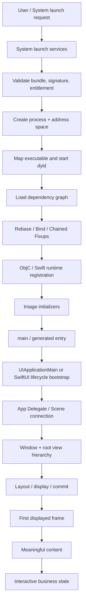
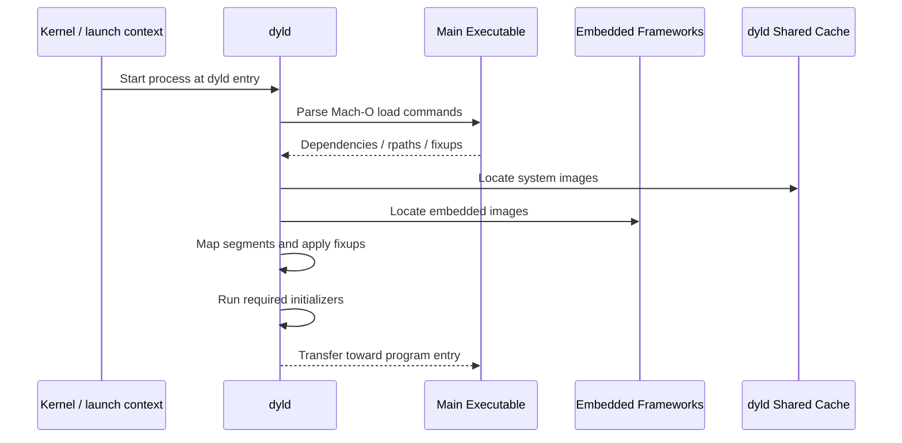
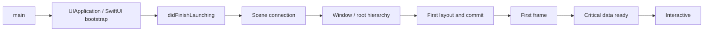
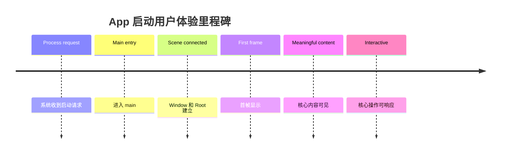
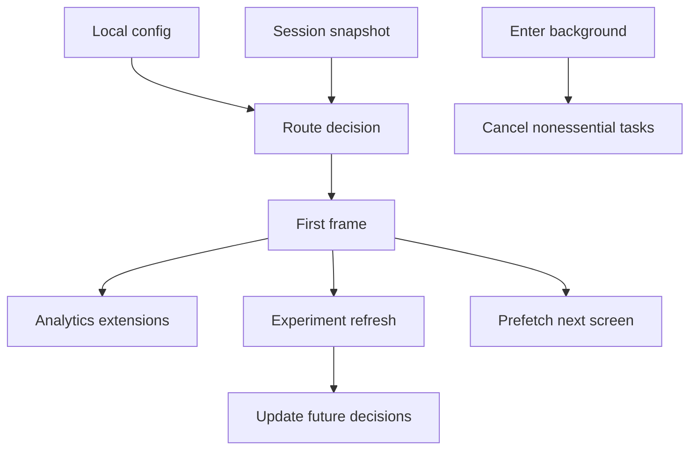
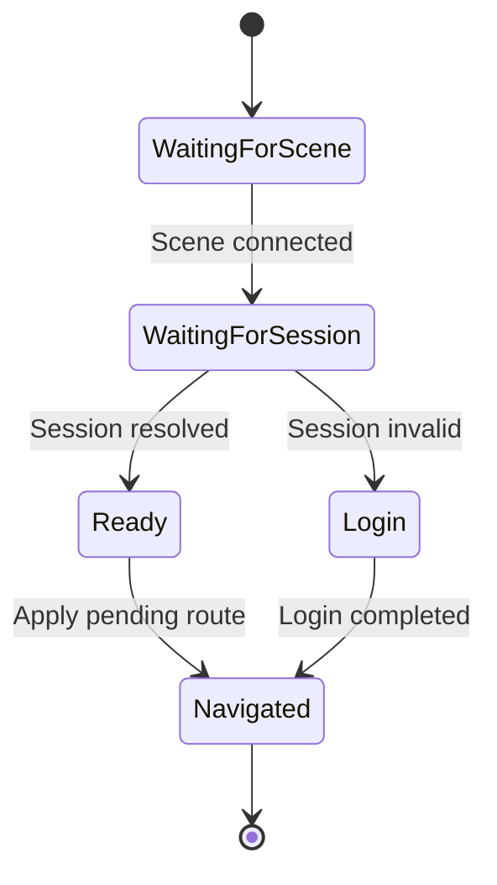

# iOS 应用启动：从进程创建、dyld 到首帧与可交互

> 用户点击图标后，系统并不是直接调用 `application(_:didFinishLaunchingWithOptions:)`。在业务代码运行前，系统要创建进程、验证并映射 Mach-O、启动 dyld、装载依赖、完成符号修复和语言运行时注册；进入 `main` 后，UIKit 或 SwiftUI 才创建应用对象、Scene、Window 和首屏。首帧已经提交也不代表数据齐全、主线程空闲或用户可以完成关键操作，因此启动治理必须同时测量系统阶段、首帧和业务可交互状态。

---

## 一、本文解决什么问题

iOS 工程中常见这些问题：

- 点击 App 图标到 `main` 之前发生了什么？
- Process Creation、Code Signing 和 Sandbox 在启动中分别负责什么？
- dyld Loading 为什么受动态 Framework、Fixup 和初始化器影响？
- Objective-C `+load`、`+initialize`、C++ Global Constructor 和 Swift Global 分别何时执行？
- `main`、`UIApplicationMain` 和 App Delegate 是什么关系？
- iOS 13 引入 Scene 后，App Delegate 是否还负责 Window 生命周期？
- SwiftUI `@main App` 是否绕过 UIKit？
- Pre-main 与 Post-main 如何划分，能否只看一项判断启动性能？
- Cold、Warm、Prewarmed 与 Resume Launch 如何区分？
- 首帧、首个有意义内容和首个可交互帧是否是同一指标？
- 为什么启动优化后 Xcode 本机更快，线上用户却没有改善？

这些问题的主线是：**系统把磁盘上的已签名 App 转换为可运行进程，框架再把进程转换为可展示、可交互的应用状态。**

本文以 iOS 13 之后 Scene 生命周期与现代 SwiftUI/UIKit 工程为主，并说明旧生命周期边界。示例与工具说明在 2026-07-31 使用 Xcode 26.1.1、Apple Swift 6.2.1 验证。进程服务、dyld 闭包、预热策略、UIKit/SwiftUI 内部初始化和系统指标字段会随 iOS/Xcode 演进；内部实现需固定系统版本，工程结论应以公开 API、真机测量和发布数据为准。

### 核心结论

1. App Launch 是系统请求、进程创建、Mach-O 装载、Runtime 初始化、应用入口、Scene/Window 建立和首屏渲染组成的流水线，不是单个 Delegate Callback。
2. 新进程启动前，系统要确认 Executable、Architecture、Code Signature、Entitlement、Sandbox 与环境满足要求；失败可能在 `main` 前终止，业务日志完全来不及输出。
3. dyld 映射主 Executable 和依赖 Image，应用 Rebase/Bind/Chained Fixups 并运行必要初始化。动态 Image 数只是影响因素之一，不能脱离 Fixup、初始化和 Shared Cache 下结论。
4. Objective-C `+load` 和 C/C++ Constructor 可能发生在 `main` 前；`+initialize` 通常是 Class 首次使用时的延迟初始化，不属于固定 Pre-main 清单；Swift Global/Static Initialization 也需按声明语义和首次访问分析。
5. `main` 是用户进程的语言入口。UIKit App 通常调用 `UIApplicationMain`；Swift 的 `@main`/`@UIApplicationMain` 或 SwiftUI `App` 会由编译器生成/选择入口，不能再同时手写冲突的 `main`。
6. `UIApplicationMain` 建立 `UIApplication`、Delegate 和 Event Loop 等 UIKit 基础，但其精确内部调用顺序是私有实现；业务只应依赖公开生命周期 Callback。
7. iOS 13+ 多 Scene 架构下，App Delegate 管进程级事件，Scene Delegate 管每个 UI Scene 的连接、前后台和 Window；单进程可同时存在多个 Scene。
8. SwiftUI `App` 是声明式应用入口，在 iOS 上仍运行于系统应用/Scene 生命周期之上；可通过 `scenePhase`、`UIApplicationDelegateAdaptor` 等适配 UIKit 能力，但不能假设 SwiftUI 完全绕过 UIKit 基础设施。
9. Pre-main 是常用诊断划分，不是所有工具都使用同一时间边界；Post-main 也应继续拆成框架初始化、Scene 建立、首帧和业务就绪。
10. Cold、Warm 和 Resume 没有脱离工具/实验条件的万能定义。Resume 通常复用仍存在的进程；Cold/Warm 新启动必须明确设备缓存、预热、安装后首次启动和系统状态。
11. First Frame 只证明有一帧提交/显示，不能证明真实内容稳定或输入可处理。工程上应额外定义 First Meaningful Content 与 Time to Interactive，并明确业务判定条件。
12. 启动性能必须在 Release/Profile、目标真机、固定 OS 和可重复场景下测量，并结合 Xcode Instruments、MetricKit/Organizer 与业务 Signpost 观察分布。

---

## 二、完整启动流水线



关键异常路径：

- 签名或 Entitlement 不合法：进程可能无法创建/执行；
- Mach-O 架构或 Minimum OS 不匹配：装载失败；
- Dynamic Library 找不到：dyld 在业务入口前终止；
- Initializer 崩溃/死锁：看似“点击即闪退”，但未进入 `main`；
- App/Scene 配置错误：进入 UIKit 后无法建立正确 UI；
- 主线程启动任务过重：首帧或交互超时，可能触发 Watchdog。

---

## 三、Process Creation：App 如何成为一个进程

用户、系统通知、Deep Link、后台任务等都可能产生 Launch Request。系统的应用与进程管理基础设施会根据当前状态决定：

- 创建新进程；
- 唤醒/恢复已存在但挂起的进程；
- 把事件交给当前运行进程；
- 因策略、资源或权限拒绝启动。

SpringBoard、FrontBoard、RunningBoard、launchd 等组件的具体分工随系统版本演进。应用层应把它们视为系统 Launch/Process Management，不依赖私有进程名或内部 XPC 协议。

### 3.1 新进程启动的关键条件

系统需要处理或确认：

- Bundle Identifier 与 Executable；
- 目标 Architecture 和平台；
- Mach-O Minimum OS；
- Code Signature 与 Nested Code；
- Provisioning/Entitlement 的设备运行权限；
- Sandbox Profile 与 Container；
- Environment、Arguments 和系统启动上下文；
- 内存、进程配额及系统策略。

这些动作不都由同一个组件在一个函数内完成。稳定结论是：**业务入口前已经存在完整安全和装载前置条件。**

### 3.2 创建地址空间与主线程

系统为进程建立虚拟地址空间、线程和初始执行上下文，映射主 Executable，并把控制权交给动态链接器入口。之后 dyld 才能按 Mach-O Load Command 处理依赖。

主线程在应用入口前已经存在，但此时还没有业务理解中的 Root View Controller 或 SwiftUI View Tree。

### 3.3 启动前失败如何诊断

若 `main` 第一行日志都不存在，应优先检查：

- Device Console/Crash Report 中 dyld 或 Code Signature 错误；
- `Library not loaded` 和 `Symbol not found`；
- Architecture/Platform Slice；
- Entitlement、Provisioning 与 Container；
- C/C++ Constructor、Objective-C `+load` 崩溃；
- Static Initializer 死锁或递归；
- Watchdog/Resource Termination，而不是只查 App Delegate。

---

## 四、dyld Loading：从 Mach-O 到可执行映像

dyld 读取主 Executable 的 Load Command，构建 Dynamic Dependency Graph，并处理系统与嵌入 Framework。



### 4.1 dyld 的主要工作

- 定位主 Executable 依赖；
- 从 Shared Cache 使用系统 Image；
- 映射 Mach-O Segment；
- 验证平台、架构和装载约束；
- 应用 Rebase/Bind 或 Chained Fixups；
- 注册/协调 Objective-C 与 Swift Metadata；
- 按依赖关系运行 Image Initializer；
- 最终进入程序入口。

具体顺序、预计算闭包和并行策略属于 dyld 版本实现。

### 4.2 动态 Framework 数量不是唯一指标

启动成本还受这些因素影响：

- 每个 Image 的 Fixup 数量和布局；
- Objective-C Class/Category/Selector Metadata；
- Swift Metadata 与 Protocol Conformance；
- `+load`、C++ Constructor 等 Initializer；
- Page Fault 和磁盘/文件缓存状态；
- Shared Cache 命中；
- Code Signature 页面验证；
- 设备 CPU、存储、内存压力和温度；
- 系统是否已有 Launch Closure/预热状态。

“把动态库数量从 N 降到 M 可节省固定毫秒”不是可移植结论，必须用目标 App 测量。

### 4.3 Static Framework 也可能影响 Pre-main

静态链接虽然没有独立 dyld Image，但合入主 Executable 的代码、Metadata、Category 和 Initializer 仍会影响：

- 主 Mach-O 大小；
- Fixup 与 Objective-C 注册量；
- Dead Stripping 结果；
- `+load`/Constructor 数量；
- Page Fault 和 Code Signature 页面。

因此“全部改静态即可消除启动成本”同样不成立。

---

## 五、Runtime Initialization：语言运行环境何时准备

dyld 装载 Image 后，Objective-C Runtime、Swift Runtime 和各语言 Initializer 开始协作。

### 5.1 Objective-C Class 与 Category 注册

Mach-O 中包含 Objective-C Class、Category、Protocol、Selector 等 Metadata。Runtime 在 Image 装载过程中读取并注册这些信息，使消息发送、Class 查找和 Category 附加可用。

大量 Objective-C Metadata 会增加注册和 Fixup 工作，但实际瓶颈需通过启动分析确认。

### 5.2 `+load`

Objective-C Runtime 会在 Image 装载阶段调用实现了 `+load` 的 Class/Category。它发生得早，可用于极少数需要在消息正常使用前安装的 Runtime 行为，但风险很高：

- 发生在 `main` 前；
- 不能依赖完整 App/Scene 生命周期；
- 多模块顺序复杂；
- 重任务直接增加启动时长；
- 锁、递归和跨模块调用容易死锁；
- 崩溃时业务监控可能尚未初始化。

普通 SDK 初始化、埋点、数据库和网络配置不应放在 `+load`。

### 5.3 `+initialize` 不等于 `+load`

`+initialize` 通常由 Objective-C Runtime 在 Class 第一次收到相关消息前惰性触发，并具有同步/继承相关语义。它可能发生在 `main` 前，也可能很晚，取决于首次使用。

因此：

- 不能把全部 `+initialize` 时间固定归入 Pre-main；
- 隐藏在首次业务调用中的 `+initialize` 可能造成首屏卡顿；
- 实现应轻量、线程安全并调用正确的 Superclass 语义；
- 现代代码优先显式初始化或 `dispatch_once`/Swift Static Lazy 语义，而不是依赖复杂 `+initialize` 副作用。

### 5.4 C/C++ Global Constructor

带 Constructor Attribute 的 C 函数和 C++ Namespace-scope Object Constructor 可能在 `main` 前运行：

```c
__attribute__((constructor))
static void installRuntimeHooks(void) {
    // 必须极轻量，且不依赖应用 UI 已建立。
}
```

它们常见于底层 SDK 和 Runtime Hook。应建立清单并禁止网络、磁盘扫描、线程等待和业务对象图创建。

### 5.5 Swift Global 与 Static Initialization

Swift Global Variable、Type Static Property 和 Lazy Initialization 的具体时机取决于声明与首次访问。许多 Swift Global/Static 采用线程安全的惰性初始化，不意味着所有值都在 `main` 前构造。

```swift
enum AppServices {
    static let analytics = AnalyticsService()
}
```

`analytics` 通常在首次访问时初始化。若第一次访问发生在首屏路径，成本会表现为 Post-main/业务阶段延迟。不要把 Lazy Initialization 当成成本消失，只是改变发生位置。

### 5.6 Runtime Initialization 的工程原则

- 无必要不使用 `+load`/Constructor；
- 全局初始化不执行 I/O；
- 初始化函数幂等且无循环依赖；
- 避免持有全局锁等待主线程/其他初始化器；
- 将 SDK 注册拆成“必要核心”和“首帧后延迟”；
- 对首次访问 Lazy Cost 做 Signpost，而不是只看 Pre-main。

---

## 六、`main`：业务进程的语言入口

传统 Objective-C UIKit App 的 `main.m`：

```objc
int main(int argc, char *argv[]) {
    @autoreleasepool {
        return UIApplicationMain(
            argc,
            argv,
            nil,
            NSStringFromClass(AppDelegate.class)
        );
    }
}
```

Swift UIKit 工程通常由 `@main` App Delegate 生成入口：

```swift
import UIKit

@main
final class AppDelegate: UIResponder, UIApplicationDelegate {
    // ...
}
```

### 6.1 `main` 的边界

到达 `main` 表示：

- 主 Executable 和必要依赖已装载到可执行状态；
- 必要 Fixup 和早期 Initializer 已完成；
- 进程与主线程已经存在；
- 但 UIApplication、Scene、Window 和首屏不一定已经创建。

### 6.2 `@main` 做了什么

`@main` 标记程序入口类型，编译器按该类型约定生成/选择入口。UIKit `UIApplicationDelegate`、SwiftUI `App` 和自定义 `static main()` 的入口规则不同。

同一 Executable 只能有一个顶层 Entry Point。不能同时保留手写 `main.swift` 和另一个冲突的 `@main` 类型。

### 6.3 最早业务埋点并不等于进程起点

在 `main` 第一行记录时间，只能测量 `main` 之后；Pre-main 已经结束。要获取系统级 Launch Duration，应结合 XCTest Metric、Instruments、MetricKit/Organizer 等，而不是用 `Date()` 反推完整启动。

---

## 七、`UIApplicationMain`：UIKit 应用基础设施入口

`UIApplicationMain` 是 UIKit App 的关键 Bootstrap。公开职责可以概括为：

- 创建/取得 `UIApplication` Subclass；
- 创建 App Delegate；
- 处理应用配置与启动上下文；
- 建立 Main Event Loop；
- 协调 Application/Scene 生命周期；
- 持续分发触摸、系统和生命周期事件，直到进程结束。

精确内部对象创建顺序、Run Loop 设置和私有 Class 不属于公共契约。

### 7.1 为什么 `UIApplicationMain` 通常不返回

它启动应用 Event Loop，正常运行期间持续处理事件。只有进程生命周期结束等情况下才离开。业务代码不应在其返回后安排清理逻辑，应使用生命周期和对象 `deinit`/资源管理 API。

### 7.2 自定义 `UIApplication` Subclass

`UIApplicationMain` 可接收 Principal Class Name，但业务很少需要 Subclass `UIApplication`。全局覆盖 `sendEvent` 等行为会影响所有事件并增加兼容风险。优先使用 Gesture、Control、Window、Scene 或系统公开观测点。

### 7.3 Main Run Loop 与首帧

进入 UIKit 后，主线程需要返回 Run Loop，系统才能顺畅处理布局、Display、Transaction Commit 和输入事件。若 `didFinishLaunching` 或 Scene 建立中同步执行重任务，可能：

- 推迟首帧；
- 阻塞触摸；
- 延迟系统 Snapshot 替换；
- 触发 Launch Watchdog；
- 造成首帧后长时间假死。

启动代码的目标不是“所有初始化完成后才让 Run Loop 工作”，而是尽快建立最小可用 UI，再调度非关键任务。

---

## 八、App Delegate：进程级应用生命周期

App Delegate 仍负责一组进程级/应用级事件。典型入口：

```swift
import UIKit

@main
final class AppDelegate: UIResponder, UIApplicationDelegate {
    func application(
        _ application: UIApplication,
        didFinishLaunchingWithOptions launchOptions: [
            UIApplication.LaunchOptionsKey: Any
        ]?
    ) -> Bool {
        configureEssentialServices()
        return true
    }
}
```

### 8.1 `didFinishLaunching` 应做什么

只做首屏前必须完成的工作：

- 安装必须在首个请求前生效的安全/网络配置；
- 初始化轻量日志和 Crash 采集核心；
- 迁移首屏必需且无法延后的极小状态；
- 注册需要立即响应的系统能力；
- 配置 Scene 所需依赖入口。

不应无条件做：

- 同步网络请求；
- 全量数据库扫描/迁移；
- 初始化所有 Feature SDK；
- 读取大量文件和图片；
- 等待 Dispatch Group/Semaphore；
- 在主线程解压/解密大资源；
- 预创建所有 Tab 页面。

### 8.2 App Delegate 与 UI 生命周期的变化

iOS 13+ 使用 Scene 时，App Delegate 不再天然拥有唯一 Window，也不应把每次前后台 UI 事件都当成整个进程事件。是否调用某些旧式 Application Callback 取决于 Scene 配置和系统版本。

### 8.3 Launch Options 与外部入口

Push、URL、User Activity、Background Fetch 等入口在不同生命周期和系统版本下可能交给 App Delegate、Scene Delegate 或专门 API。处理器应：

- 幂等；
- 可在依赖未完全准备时排队；
- 区分新进程启动与运行中事件；
- 避免重复导航；
- 验证外部输入；
- 在 Scene 未连接时不强行操作 Window。

---

## 九、Scene Delegate：每个 UI Scene 的生命周期

iOS 13+ 多窗口模型把 UI 实例抽象为 `UISceneSession`/`UIScene`。一个 App Process 可以有零个、一个或多个 Scene。

```swift
final class SceneDelegate: UIResponder, UIWindowSceneDelegate {
    var window: UIWindow?

    func scene(
        _ scene: UIScene,
        willConnectTo session: UISceneSession,
        options connectionOptions: UIScene.ConnectionOptions
    ) {
        guard let windowScene = scene as? UIWindowScene else { return }

        let window = UIWindow(windowScene: windowScene)
        window.rootViewController = RootViewController()
        self.window = window
        window.makeKeyAndVisible()
    }
}
```

### 9.1 App 与 Scene 的职责

| 维度 | App Delegate | Scene Delegate |
|---|---|---|
| 生命周期范围 | Process/Application | 单个 UI Scene |
| Window | Scene 架构下不应假设唯一 Window | 通常持有对应 Scene Window |
| 前后台 | 进程级事件与兼容 Callback | Scene Active/Inactive/Background |
| 外部入口 | 部分 App 级入口 | 与具体 Scene 连接/导航相关入口 |
| 多窗口 | 协调 Session 配置 | 管理每个窗口实例状态 |

### 9.2 `willConnectTo` 与首屏

这里常完成：

- 建立 Window；
- 创建最小 Root View Hierarchy；
- 注入 Scene-scope Dependency；
- 恢复该 Scene 的 UI State；
- 处理 Connection Options；
- 触发首次 Layout/Render。

如果 Root Controller 初始化同步创建大量 Child、加载数据库或发起阻塞请求，Post-main 会显著变长。

### 9.3 多 Scene 的启动边界

- Process 已存在时连接新 Scene，不是完整 Cold Launch；
- 恢复某 Scene 与恢复整个 Process 不同；
- Scene 可断开但 Process 继续存在；
- 共享 Singleton 要区分 App-scope 与 Scene-scope；
- Deep Link 需要决定复用、创建或选择哪个 Scene；
- 启动指标应明确测的是 Process Launch 还是 Scene Connection。

---

## 十、SwiftUI `App`：声明式入口如何接入系统生命周期

SwiftUI App 使用 `@main`：

```swift
import SwiftUI

@main
struct StoreApp: App {
    var body: some Scene {
        WindowGroup {
            RootView()
        }
    }
}
```

SwiftUI 根据 `Scene` 声明建立系统 Scene 与 View Hierarchy。在 iOS 上，它仍依赖平台应用、Window/Scene、Event Loop 和渲染基础设施，只是把入口与生命周期暴露为声明式模型。

### 10.1 `App` 初始化不应承载重任务

```swift
@main
struct StoreApp: App {
    @State private var bootstrapState = BootstrapState.loading

    var body: some Scene {
        WindowGroup {
            RootView(state: bootstrapState)
                .task {
                    await bootstrapIfNeeded()
                }
        }
    }
}
```

需要注意：

- `App`、Property Wrapper 和 Root View 构造可能多次求值/参与状态更新；
- View 初始化应保持轻量和无副作用；
- `.task` 可能因 View Identity 变化取消并重启；
- Bootstrap 必须幂等并响应 Cancellation；
- 首屏关键数据应有明确 Loading/Error/Retry 状态；
- 不要在 `body` 中同步 I/O。

### 10.2 `scenePhase`

```swift
@Environment(\.scenePhase) private var scenePhase

var body: some Scene {
    WindowGroup { RootView() }
        .onChange(of: scenePhase) { _, newPhase in
            lifecycleCoordinator.handle(newPhase)
        }
}
```

`scenePhase` 反映 SwiftUI Scene 的阶段，不等于进程生命周期所有事件。处理应幂等，避免每次 Active 都重复注册或迁移。

### 10.3 `UIApplicationDelegateAdaptor`

需要 Push Registration、Background Session 或第三方 UIKit SDK 时，可适配 App Delegate：

```swift
final class AppDelegate: NSObject, UIApplicationDelegate {
    func application(
        _ application: UIApplication,
        didFinishLaunchingWithOptions launchOptions: [
            UIApplication.LaunchOptionsKey: Any
        ]? = nil
    ) -> Bool {
        true
    }
}

@main
struct StoreApp: App {
    @UIApplicationDelegateAdaptor(AppDelegate.self)
    private var appDelegate

    var body: some Scene {
        WindowGroup { RootView() }
    }
}
```

Adaptor 是互操作边界，不应让 SwiftUI Feature 反向依赖全局 App Delegate。把 Delegate 事件转换为 Typed Service/Event Stream 更易测试。

---

## 十一、Pre-main 与 Post-main

### 11.1 Pre-main

工程中通常把 Process Start 到 `main` Entry 之间称为 Pre-main，主要包括：

- 系统进程与安全准备的一部分；
- dyld 装载依赖；
- Segment Mapping/Page Fault；
- Rebase/Bind/Chained Fixups；
- Objective-C/Swift Metadata 注册；
- `+load`；
- C/C++ Constructor；
- 必要 Image Initializer。

不同工具可能从不同起点计时，Xcode 展示项和内部分类也会随版本变化。因此报告必须注明 Tool、Xcode、iOS、Device 和 Metric Definition。

### 11.2 Post-main

Post-main 不应作为一个不可拆黑盒：



每段可能由不同 Owner 负责：

- Platform Team：dyld、Framework、Runtime Initializer；
- App Shell：Delegate、Scene、Dependency Container；
- Feature Team：Root Screen 构造和首屏数据；
- Infrastructure：DB、Network、Config、Experiment、SDK；
- Design/Rendering：首屏层级、图片和布局。

### 11.3 预热（Prewarming）边界

某些 iOS 版本/设备状态下，系统可能提前执行部分进程启动工作，以降低未来用户感知延迟。预热能到达的阶段和环境标记属于系统策略，不能假设每次发生或固定停在某个内部函数。

业务要求：

- 启动早期逻辑必须无用户可见副作用；
- 不因“进程被创建”就记录一次真实打开；
- 不在缺少 Scene/用户动作时导航或弹窗；
- Analytics 区分 Process Start、Scene Activation 和真实 Session；
- 不依赖某个未公开 Environment Variable 判定所有预热情况。

---

## 十二、Cold、Warm 与 Resume Launch

这些术语在性能工具、团队和文献中定义可能不同。必须先写实验条件。

### 12.1 Cold Launch

可操作定义：App Process 不存在，相关文件页面和系统缓存尽量不命中，需要创建新进程并完成完整装载路径。

但真实设备很难保证绝对“全冷”：

- dyld Shared Cache 常驻；
- 文件系统缓存可能保留；
- 安装后首次启动有额外工作；
- 系统可能预热；
- 后台服务状态不同。

因此应写“终止进程后的冷启动场景”及控制方法，而不是宣称完全清空所有系统缓存。

### 12.2 Warm Launch

常用定义：App Process 不存在，但 Binary/Data Page 或 dyld 相关缓存仍较热，新进程创建仍发生，只是部分 I/O/准备成本降低。

也有工具把其他场景称为 Warm。报告应明确：

- 启动前是否手动终止；
- 是否刚启动过同版本 App；
- 是否重启设备；
- 是否安装后首次运行；
- 是否等待冷却；
- 是否观察到系统预热。

### 12.3 Resume Launch

Resume 通常指 App Process 仍存在，可能处于 Suspended/Background，系统恢复调度并让 Scene 回到 Foreground/Active。

它通常不经历：

- 新进程创建；
- 主 Executable 全量重新装载；
- `main`；
- `didFinishLaunching`。

但会发生 Scene/Application 生命周期回调、UI 更新、过期数据刷新和资源重建。Resume 慢不应归因到 Pre-main。

### 12.4 场景对比

| 场景 | 进程创建 | `main` | Scene 激活 | 典型关注点 |
|---|---:|---:|---:|---|
| Cold | 是 | 是 | 是 | dyld、Initializer、首屏完整路径 |
| Warm 新进程 | 是 | 是 | 是 | 缓存命中后的真实新进程路径 |
| Prewarmed 后激活 | 可能已提前发生部分工作 | 视系统策略/观察定义 | 是 | 副作用和会话归因 |
| Resume | 否 | 否 | 是 | 恢复、数据刷新、主线程卡顿 |
| 新建第二 Scene | 否 | 否 | 新 Scene 连接 | Scene-scope 初始化 |

表中的 Prewarming 必须按对应 iOS/测量证据解释，不可作为稳定公开时序。

---

## 十三、首帧、有效内容与首个可交互帧

### 13.1 First Frame

First Frame 通常表示 App 建立 Window/View Hierarchy，并让第一帧经过 Layout/Display/Commit 后显示。系统或工具对起止点的精确定义可能不同。

首帧可能只是：

- Launch Screen 后的空壳；
- Skeleton；
- Loading Indicator；
- 没有真实数据的 Navigation/Tab；
- 仍被主线程长任务阻塞的静态画面。

因此“首帧更快”不一定改善完成任务的体验。

### 13.2 First Meaningful Content

这是业务自定义指标，应明确哪些内容构成“有意义”：

- 首页核心列表至少显示缓存/网络首屏；
- 商品页标题、价格和主图可见；
- 消息页显示会话摘要；
- 登录页输入框和提交入口已展示。

不同页面不能共用一个模糊的“页面完成”事件。

### 13.3 Time to Interactive

iOS 没有一个适用于所有 App 的公开统一 TTI API。团队需要定义首个可交互状态，例如：

- 关键按钮已启用；
- Main Thread 没有持续 Long Task；
- Tap 可在预算内获得反馈；
- 必要 Session/Config 已就绪；
- 首屏 Blocking Overlay 已移除；
- 用户可以完成核心首步操作。

### 13.4 指标时序



优化不能通过“提前上报完成事件”实现。每个 Marker 必须绑定可验证 UI/状态条件。

---

## 十四、启动代码的正确分级

### 14.1 Critical Before First Frame

只有阻止首屏安全、路由或基本渲染的任务：

- 最小依赖容器；
- 本地 Session 快照；
- 必需的安全策略；
- 首屏 Root Route 决策；
- 最小 Crash/Logging 基础；
- 数据库 Schema 的必要兼容检查。

### 14.2 Can Run After First Frame

- 非首屏 SDK；
- 非关键缓存清理；
- Experiment/Remote Config 更新（先使用本地快照）；
- 图片预热；
- Analytics 扩展模块；
- 后续 Tab/Feature 预加载；
- 诊断数据上传。

### 14.3 On-demand

- Feature 首次进入时初始化；
- 大模型/地图/音视频引擎；
- 非当前账户能力；
- 低频数据库；
- Debug/Developer Tool。

### 14.4 延迟不等于随意并发

把所有工作 `DispatchQueue.global().async` 会造成：

- CPU/磁盘争抢影响首屏；
- 初始化依赖竞态；
- 主线程回调风暴；
- 用户快速进入 Feature 时未就绪；
- 生命周期进入后台后任务继续；
- 错误无法归因。

应建立 Bootstrap Task Graph：



任务需要声明依赖、Queue/Actor、超时、取消、失败降级和是否阻塞首屏。

---

## 十五、工程实现：可取消、幂等的 Bootstrap

```swift
actor AppBootstrapper {
    enum State {
        case idle
        case running(Task<Void, Never>)
        case finished
    }

    private var state: State = .idle

    func startIfNeeded() async {
        switch state {
        case .finished:
            return
        case .running(let task):
            await task.value
        case .idle:
            let task = Task { [weak self] in
                guard let self else { return }
                await self.run()
            }
            state = .running(task)
            await task.value
            state = .finished
        }
    }

    private func run() async {
        async let config: Void = refreshConfig()
        async let analytics: Void = prepareAnalytics()

        _ = await (config, analytics)
    }

    private func refreshConfig() async {
        guard !Task.isCancelled else { return }
        // 使用本地快照启动；远端失败不阻塞首屏。
    }

    private func prepareAnalytics() async {
        guard !Task.isCancelled else { return }
    }
}
```

示例表达幂等和并发结构，不代表所有初始化都应放入 Actor。真实工程还需：

- 记录每个 Task 起止与结果；
- 设置网络超时；
- 避免 `Task.detached` 丢失 Actor/优先级语义；
- 处理 App 进入后台后的取消策略；
- 区分“完成”“失败但降级”和“需重试”；
- 避免任务强持有已失效 Scene；
- 对账户切换重置 Scope。

### 15.1 不要阻塞主线程等待异步任务

错误：

```swift
let semaphore = DispatchSemaphore(value: 0)

Task {
    await loadRemoteConfig()
    semaphore.signal()
}

semaphore.wait() // 启动主线程可能死锁或触发 Watchdog
```

修复：先使用本地配置渲染，远端完成后通过状态更新影响后续决策；确实必须等待的安全数据应使用有超时的异步启动状态页，而不是阻塞 Run Loop。

### 15.2 路由必须容忍依赖未齐

Deep Link 可能在 Scene Connection 时到达，而账户、实验和数据仍未完成。Route Coordinator 应维护状态机：



重复 URL/User Activity 必须去重，Scene 销毁后取消 Pending Route。

---

## 十六、测量方法与工具

### 16.1 测量环境

启动性能必须记录：

- Device 型号、存储容量和电池状态；
- iOS 版本；
- Xcode/Swift/SDK；
- Release/Profile 配置和 Architecture；
- App Version、Commit、依赖；
- 安装后首次、Cold、Warm、Resume 场景；
- 网络类型和账户数据量；
- 设备温度、低电量模式、后台负载；
- 样本次数、P50/P90/P95，而不是只报平均值。

模拟器适合功能诊断，不适合代表真机 dyld、存储、签名、GPU 和调度性能。

### 16.2 Instruments App Launch

使用 Instruments/Xcode 启动模板观察：

- Process 与 Thread 时间线；
- dyld/Initializer；
- Main Thread Call Tree；
- File I/O/Page Fault；
- UIKit/SwiftUI Layout/Rendering；
- 首帧前 Long Task；
- Signpost 区间。

工具分类会随 Xcode 变化，应保存 Trace 与版本，不只截一张总时长截图。

### 16.3 XCTest 启动测量

UI Test 可以使用启动性能 Metric（具体 API 可用性以当前 Xcode 为准）：

```swift
import XCTest

final class LaunchPerformanceTests: XCTestCase {
    func testLaunchPerformance() throws {
        if #available(iOS 13.0, *) {
            measure(metrics: [XCTApplicationLaunchMetric()]) {
                XCUIApplication().launch()
            }
        }
    }
}
```

测试应固定 Launch Argument、清理/保留数据策略和网络 Stub。UI Test 启动环境与 App Store 用户不同，适合 CI 回归，不应替代线上分布。

### 16.4 OSLog Signpost

```swift
import os

private let launchLog = OSLog(
    subsystem: "com.example.store",
    category: "Launch"
)

func loadCriticalState() {
    os_signpost(.begin, log: launchLog, name: "CriticalState")
    defer {
        os_signpost(.end, log: launchLog, name: "CriticalState")
    }

    // 加载首屏必需状态
}
```

Signpost Name 应稳定且低基数，不包含用户 ID、URL Token 或敏感信息。异步跨线程区间应使用 Signpost ID 或现代 `Logger`/Signposter API（按部署版本选择）。

### 16.5 MetricKit 与 Organizer

MetricKit/Organizer 可提供真实用户聚合启动与 Hang 等数据，但：

- 数据是聚合/延迟上报，不适合单次本地调试；
- 指标字段和可用系统版本会演进；
- 样本受设备、系统和用户行为分布影响；
- 版本对比要控制发布比例和用户群；
- 需要同时看 Regression 分位数与 Crash/Hang，不能只追求均值。

### 16.6 业务里程碑

建议记录：

- Process/Main 可观测起点；
- Scene Connected；
- Root View Ready；
- First Meaningful Content；
- First Interaction Enabled；
- 首次 Tap Response；
- Bootstrap Task 结果。

不要伪造系统 Process Start。业务无法直接获得的起点应使用系统 Metric，对自定义 Marker 只报告其真实范围。

---

## 十七、启动优化的正确顺序

### 17.1 先按阶段归因

1. 失败是否在 `main` 前；
2. Pre-main 是 Image/Fixup 还是 Initializer；
3. `didFinishLaunching` 是否主线程重任务；
4. Scene/Root 构建是否层级过深；
5. 首帧后是否仍不可交互；
6. 数据、图片、数据库和网络谁阻塞 Meaningful Content；
7. Resume 是否被错误纳入 Cold Launch。

### 17.2 常见优化手段与代价

| 手段 | 可能收益 | 主要代价/风险 |
|---|---|---|
| 移除未使用动态 Framework | 减少 Image/依赖工作 | 需要依赖审计和回归 |
| 合并动态模块 | 降低装载边界 | 增量构建、团队 Ownership 和代码复制变化 |
| 删除 `+load`/Constructor | 降低 Pre-main | 需重构 Hook 安装时机 |
| 延迟非关键 SDK | 更快首帧 | 首次使用需等待，事件可能排队 |
| 首屏 Skeleton/缓存 | 更快内容感知 | 一致性、过期和闪烁处理 |
| Lazy 创建非当前 Tab | 减少 Root 构建 | 首次切换成本转移 |
| 数据库迁移分段 | 减少启动阻塞 | Schema 兼容和事务复杂度 |
| 并行异步任务 | 缩短关键路径 | 资源争抢、竞态、取消复杂度 |

### 17.3 优化必须验证用户结果

至少同时比较：

- System Launch Duration；
- First Frame；
- Meaningful Content；
- Interactive；
- Hang/Watchdog；
- Crash；
- CPU、I/O、Memory 峰值；
- 首次进入延迟 Feature 的耗时；
- Build Size 和维护成本。

把成本从 Launch 转移到用户第一次点击后，不一定是优化。

---

## 十八、常见误区与错误案例

### 18.1 App 启动从 `didFinishLaunching` 开始

错误。此前已经完成进程创建、dyld、Fixup、Runtime 注册、Initializer、`main` 和 UIKit Bootstrap 的部分工作。

### 18.2 所有 `+initialize` 都属于 Pre-main

错误。它通常在 Class 首次使用时惰性触发，可能发生于任意业务阶段。

### 18.3 Swift Static Property 一定在 `main` 前初始化

错误。许多 Swift Global/Static 使用线程安全 Lazy Initialization，成本发生在首次访问点。

### 18.4 动态 Framework 越少，启动一定按比例变快

错误。成本还由 Fixup、Metadata、Initializer、页面缓存和业务主线程工作决定，必须实测。

### 18.5 `UIApplicationMain` 只是调用 App Delegate

错误。它建立 UIKit Application 和 Event Loop，并协调完整生命周期；Delegate 只是公开扩展点之一。

### 18.6 使用 Scene 后 App Delegate 不再有用

错误。App Delegate 仍处理进程级和部分系统能力；Scene Delegate 负责具体 UI Scene 生命周期。

### 18.7 SwiftUI App 完全绕过 UIKit

错误。在 iOS 上 SwiftUI 仍运行在系统应用、Scene、Window、Event 和渲染基础设施之上，只是暴露不同编程模型。

### 18.8 首帧出现就代表启动完成

错误。首帧可能只是空壳或 Loading，主线程仍可能阻塞。还需定义 Meaningful Content 和 Interactive。

### 18.9 把任务异步化就一定改善启动

错误。无治理并发会争抢 CPU/I/O、制造竞态和回调风暴。应按 Critical Path、依赖和取消策略调度。

### 18.10 Warm Launch 与 Resume 是同一件事

错误。Warm 新进程通常仍经过 `main`；Resume 复用已有进程，不经过完整 Process Creation 和 Pre-main。

### 18.11 本地一次启动更快即可证明优化成功

错误。需要固定环境、多次采样、分位数、线上指标和 Crash/Hang 回归，并排除缓存与预热差异。

---

## 十九、测试与验证方法

### 19.1 启动矩阵

- 安装后首次启动；
- 终止进程后的 Cold 场景；
- 刚启动过后的 Warm 新进程；
- Background/Suspended Resume；
- Push、URL、Universal Link 和 User Activity 启动；
- 无网络、慢网络和 DNS/TLS 失败；
- 未登录、已登录、Session 过期；
- 小数据与大数据账户；
- 数据库升级/迁移；
- 新 Scene 和 State Restoration。

### 19.2 异常与取消

- Remote Config 超时；
- Keychain Protected Data 暂不可用；
- 数据库损坏/磁盘空间不足；
- App 启动中迅速进入后台；
- Scene 在 Bootstrap 中断开；
- 用户快速点击 Deep Link；
- 重复启动事件和 Push；
- SDK 初始化失败后的降级；
- Task Cancellation 后不更新失效 UI。

### 19.3 性能回归门槛

CI 可对稳定真机池设置：

- Launch Metric P50/P90 回归阈值；
- Main Thread Long Task 数量；
- 首帧前同步 I/O；
- Dynamic Image/Initializer 数量变化；
- Binary Size 与 Link Map Diff；
- First Meaningful Content 自定义 Metric；
- Watchdog/Hang 零回归要求。

阈值应基于历史噪声和业务预算，不使用跨设备统一绝对数字。

---

## 二十、总结

iOS 应用启动需要从系统、二进制、框架和业务四层共同理解：

1. 系统收到 Launch Request 后决定创建或恢复进程，并验证 Bundle、签名、Entitlement、架构和 Sandbox 条件。
2. 新进程由 dyld 装载主 Executable 和依赖，完成映射、Fixup、Runtime 注册和必要 Initializer。
3. Objective-C `+load`/C++ Constructor 可能发生在 `main` 前；`+initialize` 和 Swift Lazy Static 则取决于首次使用。
4. `main` 是语言入口，UIKit 通常进入 `UIApplicationMain`，Swift `@main` 和 SwiftUI `App` 由编译器建立相应入口。
5. `UIApplicationMain` 建立应用与 Event Loop；App Delegate 管进程级事件，Scene Delegate 管每个 UI Scene 和 Window。
6. SwiftUI `App` 提供声明式 Scene，但仍接入 iOS 平台生命周期；重任务不应放在 `App`/View 构造或 `body`。
7. Pre-main 只是诊断分段，Post-main 还需拆解到 Scene、首帧、有效内容和可交互状态。
8. Cold、Warm、Prewarmed、Resume 和新 Scene 连接是不同路径，测量报告必须先定义场景。
9. 首帧不等于用户可用。启动治理应同时跟踪 First Frame、Meaningful Content 和 Interactive。
10. 初始化任务必须按关键路径分级，具备幂等、超时、取消、失败降级和生命周期处理。
11. 性能结论必须来自 Release 真机、多次采样、线上分布和 Crash/Hang 联合验证。

---

## 问答复盘

### Q1：点击图标后，App Delegate 是最先执行的业务入口吗？

**答：** 不是。系统先创建进程，dyld 装载 Mach-O、修复符号并运行必要初始化，随后进入 `main` 和 UIKit/SwiftUI Bootstrap，才到 Delegate 生命周期。

### Q2：哪些代码可能在 `main` 前执行？

**答：** Objective-C `+load`、C/C++ Constructor 和必要 Image Initializer 等。`+initialize` 与许多 Swift Static 通常按首次使用惰性执行，不能全部算作 Pre-main。

### Q3：`UIApplicationMain` 的核心职责是什么？

**答：** 建立 `UIApplication`、Delegate 和 Main Event Loop，并协调 Application/Scene 生命周期和事件分发。内部精确顺序属于 UIKit 实现。

### Q4：iOS 13+ App Delegate 与 Scene Delegate 如何分工？

**答：** App Delegate 主要负责进程/Application 级事件；Scene Delegate 管理每个 UI Scene 的连接、Window 和前后台状态。一个进程可有多个 Scene。

### Q5：SwiftUI `@main App` 是否不再需要 UIKit 生命周期知识？

**答：** 不是。SwiftUI 在 iOS 上仍建立于系统 App/Scene/Window/Event 基础设施之上，Push、后台任务和部分 SDK 仍可能需要 UIKit Adapter。

### Q6：Warm Launch 和 Resume 的关键区别是什么？

**答：** Warm 新启动通常仍创建新进程并经过 `main`，只是缓存较热；Resume 复用已有进程，只恢复调度和 Scene 生命周期。

### Q7：为什么首帧指标不能代表启动已经完成？

**答：** 首帧可能只是空壳或 Loading，核心内容和输入处理尚未就绪。应额外定义 Meaningful Content 与 Interactive 条件。

### Q8：把所有 SDK 初始化放到后台线程是否是正确优化？

**答：** 不是。无约束并发会争抢 CPU/I/O 并产生依赖竞态。应按首屏关键路径、线程要求、超时和取消策略调度。

### Q9：如何判断启动变慢发生在 Pre-main 还是业务阶段？

**答：** 使用 Instruments/Xcode 系统 Launch Metric 划分进程和 dyld 阶段，再用 Signpost 拆解 `main` 后 Delegate、Scene、Root、数据与交互里程碑。

### Q10：启动优化发布前至少应验证什么？

**答：** 在目标真机 Release 配置覆盖 Cold/Warm/Resume、外部入口、弱网和迁移场景，比较分位数、首帧、可交互、CPU/I/O/内存以及 Crash、Hang、Watchdog。

---

## 延伸知识

- **应用生命周期**：App State、Scene State、Suspension、Termination、State Restoration 与幂等事件处理。
- **后台执行**：Background Task、BGTaskScheduler、Background URLSession、Push 与系统预算。
- **启动性能**：dyld、Initializer、Page Fault、Link Map、App Launch Instrument 与 MetricKit。
- **渲染首帧**：Run Loop、Core Animation Transaction、Layout、Commit、Render Server 与 Display。
- **架构实践**：Bootstrap Task Graph、Scene-scope Dependency、Deep Link 状态机与降级策略。
