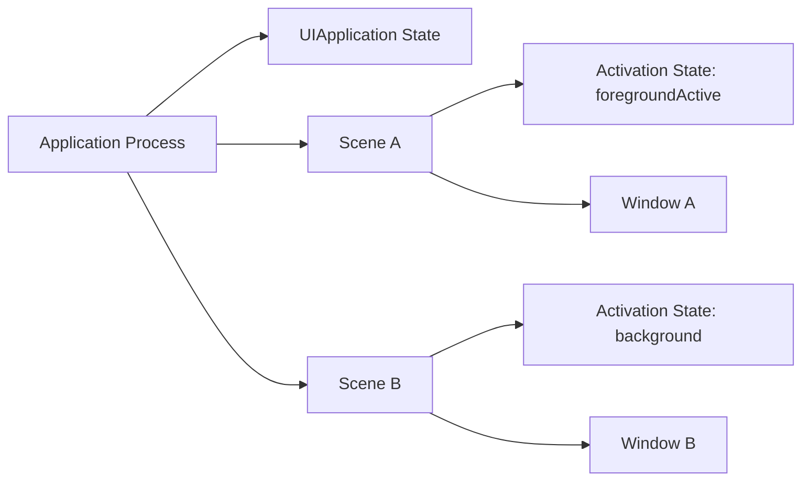
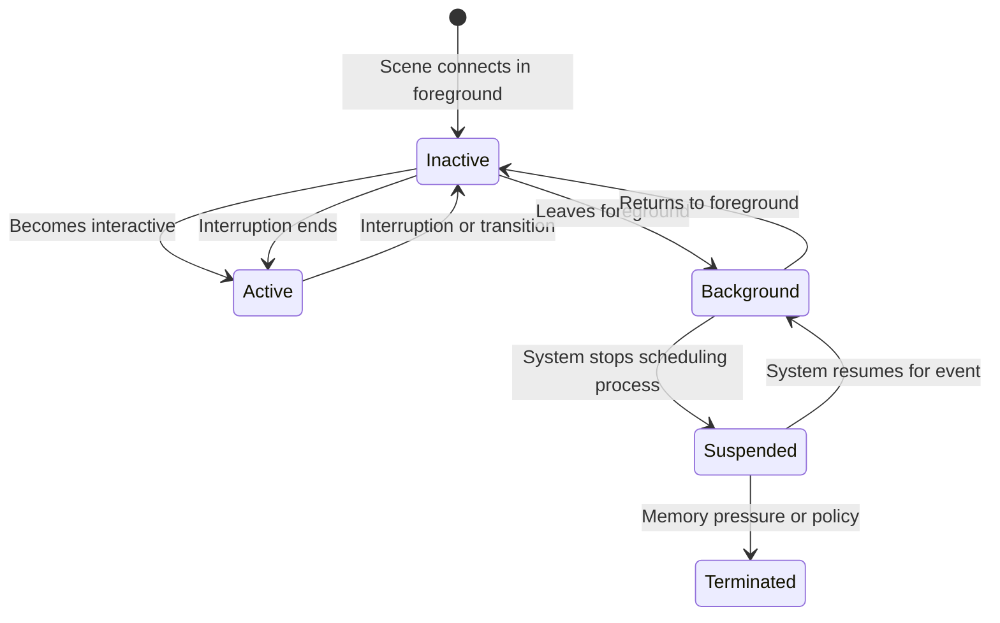
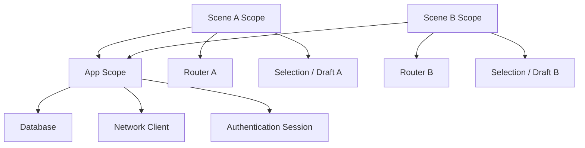
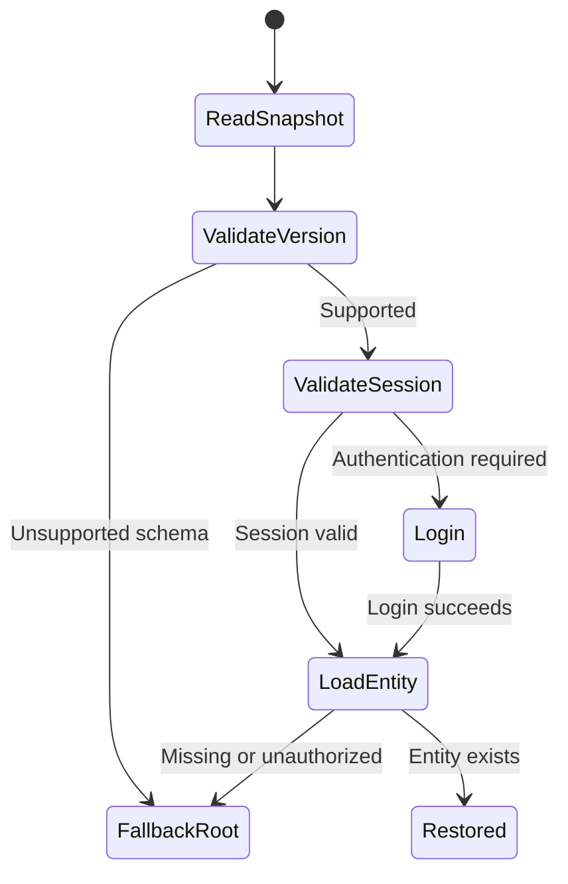

# iOS 应用生命周期：从 App、Scene 状态到挂起、恢复与终止

> iOS 生命周期不是一条“启动、后台、终止”的单线流程。进程有自己的 Application State，每个 Window Scene 又有独立的 Activation State；一个进程可以同时承载多个 Scene，其中一个 Active、另一个 Background。进入后台只意味着获得有限时间完成收尾，之后可能被 Suspension，也可能在没有任何回调的情况下被系统终止。可靠的工程设计不能依赖“最后一次保存机会”，而要让状态持续落盘、事件幂等、任务可取消，并能从任意中断点恢复。

---

## 一、本文解决什么问题

iOS 工程中经常遇到这些问题：

- `UIApplication.State` 与 `UIScene.ActivationState` 有什么区别？
- `inactive` 是后台状态吗，控制中心、来电和系统弹窗时会发生什么？
- iPad 多窗口下，一个 Scene 进入后台是否代表整个 App 进入后台？
- `applicationDidEnterBackground` 后还能执行多久？
- Background Task 是否保证代码执行完成？
- App 进入 Background 后何时被 Suspension，有没有“即将挂起”回调？
- 用户划掉 App、系统回收内存和 Crash 的 Termination Callback 是否相同？
- State Restoration 应保存 View Controller，还是保存业务状态？
- Memory Warning 到来后应释放什么，能否等警告后再治理内存？
- 设备锁定时 Keychain、数据库和文件为什么有时不可读？
- 为什么生命周期 Callback 重复触发后会重复注册、重复上传或破坏状态？

这些问题的共同主线是：**系统只通知状态变化和提供有限执行机会，不承诺应用按理想顺序完整走完生命周期。**

本文以 iOS 13+ Scene-based Lifecycle 为主，同时说明传统 App Delegate Callback。示例在 2026-07-31 使用 Xcode 26.1.1、Apple Swift 6.2.1 验证。Multi-window 能力、SwiftUI Observation、Background Budget、Memory Pressure 和 State Restoration 行为会随 iOS、设备、Capability 与系统策略变化；公开 Callback 是契约，具体调度时长和内部进程管理不是。

### 核心结论

1. App State 描述进程级应用状态，Scene State 描述单个 UI Scene 的连接和激活状态。iOS 13+ 多窗口工程必须优先按 Scene 管 UI，不能假设全局唯一 Window。
2. Active 表示接收事件并可正常交互；Inactive 是短暂或受系统干扰的前台过渡状态；Background 表示 UI 不在前台，但进程可能仍短暂执行、执行获批后台模式或即将挂起。
3. 进入 Background 不等于立即 Suspension。系统通常给应用有限时间完成必要收尾；时长由系统决定，不是固定秒数契约。
4. `beginBackgroundTask` 只请求额外的有限完成时间，不保证任务完成，也不是通用后台调度 API。必须实现 Expiration Handler，并确保 `endBackgroundTask` 恰好执行一次。
5. Suspension 表示进程仍驻留但线程不再被调度。没有可靠的“即将 Suspension”Callback，所有必要持久化必须在状态变化前持续完成或在 Background 机会内尽快完成。
6. Termination 可能发生在前台、后台或挂起状态。系统回收挂起进程、用户强制退出、Watchdog、Crash 等路径不保证调用 `applicationWillTerminate`。
7. State Restoration 应保存重建 UI 所需的最小、版本化业务标识和导航意图，而不是序列化整个对象图、网络响应或敏感凭证。
8. Memory Warning 是降低可回收内存的信号，不是终止前必达通知。缓存必须有预算和自动淘汰，关键状态不能只在收到警告时保存。
9. Protected Data Availability 由设备锁定状态和 Data Protection Class 共同决定。不能把“设备锁定”简单等同于“所有文件不可读”，也不能假设后台唤醒时受保护数据一定可用。
10. 多次 Active/Background、Scene 重连、重复 Notification 和进程恢复都是正常场景。生命周期处理器必须幂等、可重入、可取消，并区分 App-scope 与 Scene-scope 资源。
11. 生命周期测试必须覆盖多 Scene、锁屏、内存压力、后台超时、无终止回调恢复和外部入口，而不只点击 Home 再返回。

---

## 二、两套状态机：App 与 Scene



在多 Scene App 中可能同时出现：

- Scene A 在前台 Active；
- Scene B 已连接但处于 Background；
- 进程整体仍在运行；
- 共享网络层和数据库仍属于同一个 Process；
- 每个 Scene 有独立 Navigation、Selection 和 Restoration State。

### 2.1 生命周期分层

| 层级 | 典型对象 | 管理内容 |
|---|---|---|
| Process/Application | `UIApplication`、App Delegate | 进程级启动、后台能力、系统服务、全局资源 |
| Scene | `UISceneSession`、`UIScene`、Scene Delegate | 单窗口连接、激活、前后台和恢复 |
| Window/UI | `UIWindow`、View Controller、SwiftUI Scene/View | 展示、交互、导航和局部状态 |
| Feature/Domain | Store、Repository、Use Case | 业务状态、持久化、一致性和取消 |

生命周期 Callback 不应直接承担全部业务逻辑。更稳妥的方式是把事件转换为明确的 Domain Event，再由各 Scope 的 Coordinator 处理。

---

## 三、App State：进程级应用状态

`UIApplication.State` 常见值：

```swift
switch UIApplication.shared.applicationState {
case .active:
    break
case .inactive:
    break
case .background:
    break
@unknown default:
    break
}
```

### 3.1 `.active`

App 在前台并可接收事件。多 Scene 环境下，具体哪个 Window 可交互仍需检查 Scene Activation State，不能只靠 Application State 选择 UI。

### 3.2 `.inactive`

App 在前台，但暂时不接收正常用户事件或处于过渡。可能出现在：

- 前台到后台/后台到前台的过渡；
- 系统级界面打断；
- Control Center/Notification Center 等覆盖场景；
- 某些电话、认证或多任务转换。

具体触发条件会随系统交互演进。稳定原则是：Inactive 可能很短，也可能返回 Active，不应把它直接当作“必须保存并关闭全部资源”的后台状态。

### 3.3 `.background`

App 不在正常前台交互状态。进程可能：

- 正在执行 Background Transition 收尾；
- 持有有限 Background Task 时间；
- 运行获批的 Background Mode；
- 处理 Background URLSession/Push 等系统事件；
- 即将被 Suspension；
- 因系统策略保持短暂可运行。

`.background` 描述状态，不代表无限执行权限。

### 3.4 状态查询只是瞬时快照

读取 `applicationState` 后，状态可能立即变化。异步流程不能用一次查询做长期保证：

```swift
guard UIApplication.shared.applicationState == .active else { return }
await loadData()
// 此时可能已经进入后台。
```

需要在提交 UI 更新、使用 Protected Resource 或启动高成本任务前重新验证上下文，并响应 Cancellation/Lifecycle Event。

---

## 四、Scene State：每个窗口的激活状态

`UIScene.ActivationState` 常见值：

- `.unattached`；
- `.foregroundInactive`；
- `.foregroundActive`；
- `.background`。

```swift
func sceneDidBecomeActive(_ scene: UIScene) {
    lifecycleCoordinator.activate(sceneID: scene.session.persistentIdentifier)
}

func sceneWillResignActive(_ scene: UIScene) {
    lifecycleCoordinator.deactivate(sceneID: scene.session.persistentIdentifier)
}

func sceneDidEnterBackground(_ scene: UIScene) {
    lifecycleCoordinator.background(sceneID: scene.session.persistentIdentifier)
}
```

### 4.1 `.unattached`

Scene 未连接到 App，不能假设 Window、Root Controller 或 SwiftUI Scene Storage 可用。Session Metadata 可能仍由系统保留，用于未来重连。

### 4.2 `.foregroundInactive`

Scene 可见但暂时不 Active。适合暂停输入驱动动画、游戏控制和实时交互，但不要销毁所有 UI State，因为它可能很快恢复。

### 4.3 `.foregroundActive`

该 Scene 在前台接收事件。Scene-scope Timer、渲染和输入可恢复，但仍应考虑 Reduce Motion、Low Power Mode 和页面可见性，不能仅凭 Active 启动所有任务。

### 4.4 `.background`

该 Scene 已不在前台。保存其导航/编辑状态、停止 UI-only Work，并释放可重建的 Scene-scope Resource。若另一个 Scene Active，Process 和 App-scope Service 仍可能正常运行。

### 4.5 Scene Disconnect 不等于 Process Termination

`sceneDidDisconnect` 表示系统释放该 Scene 与 App 的连接，原因可能是资源回收或用户关闭窗口。Session 可能未来重连，也可能被用户永久丢弃。

应：

- 释放与 Window/Scene 强绑定的资源；
- 保留可恢复的轻量状态；
- 取消 Scene-scope Task；
- 不关闭全局数据库/网络层，除非没有其他 Consumer 且由 App-scope 管理；
- 在 Session Discard Callback 中清除永久废弃的 Restoration Data。

---

## 五、Active、Inactive 与 Background 的执行语义



这是一张工程状态图，不是 UIKit 内部实现图。多 Scene 时，每个 Scene 有独立分支，Process Suspension 则影响整个进程。

### 5.1 Active → Inactive

适合：

- 暂停输入/游戏循环；
- 停止敏感内容展示；
- 暂停高频 UI 动画；
- 记录轻量状态快照。

不适合：

- 无条件关闭数据库；
- 注销用户；
- 清空整个导航；
- 取消无法恢复的关键事务；
- 重复注册系统通知。

### 5.2 Inactive → Background

适合尽快：

- 持久化未保存编辑；
- 结束/申请有限 Background Time；
- 释放 Camera、Microphone 等前台资源（按业务和系统 API）；
- 停止 Display Link、UI Timer；
- 保存 Scene Restoration Activity；
- 对敏感 UI 准备隐私遮罩/系统 Snapshot 状态。

### 5.3 Background → Inactive → Active

恢复时应：

- 重新验证 Session 和 Protected Data；
- 检查数据是否在后台/其他 Scene 改变；
- 处理时间跨度和过期缓存；
- 恢复可见页面任务；
- 消费排队 Deep Link/Push；
- 去重 Notification 和 Analytics Session；
- 避免一次 Active 重复创建 Service。

---

## 六、Multi-window：一个进程，多套 UI 生命周期

iPadOS 和支持多窗口的平台允许同一 App 建立多个 `UISceneSession`。每个 Scene 可以展示不同文档、账户上下文或导航栈。

### 6.1 Scope 必须明确



典型 App-scope：

- Database/Repository；
- Authentication；
- Network Client；
- Shared Cache；
- Background Scheduler；
- Global Configuration。

典型 Scene-scope：

- Window/Root Controller；
- Router/Navigation Path；
- 当前文档/Tab/Selection；
- Scene-specific Draft；
- 可见页面 Task；
- State Restoration Activity。

### 6.2 全局 Singleton 的多窗口风险

如果全局 `AppRouter.shared` 保存“当前 Navigation Controller”，第二个 Scene 会覆盖第一个，导致 Deep Link 跳到错误窗口。

应使用 Scene Identifier 定位上下文：

```swift
struct SceneContext {
    let sessionID: String
    let router: SceneRouter
}

@MainActor
final class SceneRegistry {
    private var contexts: [String: SceneContext] = [:]

    func register(_ context: SceneContext) {
        contexts[context.sessionID] = context
    }

    func remove(sessionID: String) {
        contexts.removeValue(forKey: sessionID)
    }
}
```

### 6.3 Scene Session 的创建与丢弃

App Delegate 可提供 Scene Configuration，并在用户丢弃 Session 时清理状态。Discard Callback 可能批量提供多个 Session，不应只清理当前 Window。

### 6.4 多 Scene 数据一致性

两个 Scene 可能编辑同一实体：

- 使用单一持久化事实源；
- 变更带 Version/Revision；
- UI 订阅 Store 更新；
- 冲突时执行 Merge 或提示；
- 草稿区分 Scene/Document ID；
- 写入使用事务；
- 不在 Scene Background 时无条件覆盖较新数据。

---

## 七、Background Time：有限完成时间

App 进入后台后，系统通常给予短暂机会完成必要工作。若普通收尾需要更多时间，可以申请有限长度 Background Task：

```swift
import UIKit

@MainActor
final class BackgroundSaveCoordinator {
    private var taskID: UIBackgroundTaskIdentifier = .invalid
    private var saveTask: Task<Void, Never>?

    func saveIfNeeded() {
        guard taskID == .invalid else { return }

        taskID = UIApplication.shared.beginBackgroundTask(
            withName: "PersistDraft"
        ) { [weak self] in
            Task { @MainActor [weak self] in
                self?.saveTask?.cancel()
                self?.finish()
            }
        }

        guard taskID != .invalid else { return }

        saveTask = Task { [weak self] in
            defer { self?.finish() }
            await DraftStore.shared.flushPendingWrites()
        }
    }

    private func finish() {
        saveTask = nil

        guard taskID != .invalid else { return }
        UIApplication.shared.endBackgroundTask(taskID)
        taskID = .invalid
    }
}
```

示例表达生命周期配对。真实 `DraftStore` 应支持 Cancellation/事务，并避免 Main Actor 上执行磁盘 I/O。

### 7.1 Background Task 的语义

- 请求有限延长时间完成用户发起的工作；
- 系统可拒绝并返回 `.invalid`；
- 可用时间不是固定常量；
- Expiration Handler 到达时应立即停止非必要工作并清理；
- 必须调用 `endBackgroundTask`；
- 任务结束后 App 仍可能被 Suspension；
- 它不适合周期刷新、长时间上传或无限驻留。

### 7.2 `backgroundTimeRemaining`

它是瞬时估计，不应设计成“还剩 N 秒就一定能完成”的倒计时契约。系统可根据资源压力调整。算法应随时可中断，并保存 Progress/Checkpoint。

### 7.3 与专用 Background Mode 区分

Background Audio、Location、Background URLSession、BGTaskScheduler 等有各自 Entitlement、触发条件和系统预算。`beginBackgroundTask` 不能替代这些机制。下一篇“后台执行”应单独展开。

---

## 八、Suspension：进程存在，但代码不运行

Suspended Process 的地址空间通常仍保留，但线程停止被调度。系统可在未来快速恢复，也可直接回收进程。

### 8.1 没有可靠“即将挂起”回调

App 收到 Background Callback 后，不能等待一个 `willSuspend` 再保存。系统可能在 Background Time 用完后挂起，也可能因资源/策略更快处理。

必须：

- 编辑状态持续增量保存；
- 数据库写入使用事务；
- 网络任务可重试/幂等；
- 文件使用临时文件 + Atomic Replace；
- 关键日志及时 Flush，但不阻塞主线程；
- Task 能从 Checkpoint 恢复；
- Scene State 在状态变化时更新，而不是仅终止时更新。

### 8.2 Suspension 期间不会发生什么

普通代码不会继续计时执行：

- `Timer` 不会按墙钟持续回调；
- Dispatch Queue 不会继续跑普通任务；
- 内存中 Deadline 需要在恢复时按当前时间重新计算；
- Socket/Server State 可能过期；
- UI Snapshot 不代表 View 仍实时更新。

专用系统后台机制例外，但也由系统在获批条件下恢复/调度进程，而不是 Suspended 线程自行运行。

### 8.3 恢复后的时间跳跃

```swift
struct SessionClock {
    private(set) var lastActiveAt: Date?

    mutating func didBecomeActive(now: Date = Date()) -> TimeInterval? {
        defer { lastActiveAt = now }
        guard let lastActiveAt else { return nil }
        return now.timeIntervalSince(lastActiveAt)
    }
}
```

恢复时应使用墙钟/单调时钟语义重新判断 Token、缓存和倒计时，不能假设暂停期间经过时间为零。对于 Duration 测量优先使用 Monotonic Clock；业务过期通常需要 Wall Clock，并考虑系统时间变化。

---

## 九、Termination：终止不保证通知

进程可能因为：

- 用户从 App Switcher 强制退出；
- 系统内存压力回收挂起进程；
- Watchdog；
- Crash/Abort/Fatal Error；
- Code Signature/Sandbox 违规；
- 系统更新、设备重启；
- 开发调试器终止；
- 后台资源违规。

### 9.1 `applicationWillTerminate` 的边界

该 Callback 可在部分前台终止路径出现，但不可靠：

- 已挂起进程被回收时不会先唤醒执行清理；
- Crash 不会走正常生命周期；
- Watchdog 可能直接杀进程；
- Force Quit 行为与系统版本/状态有关；
- 测试环境的 Stop 与线上终止不同。

因此不能在其中做唯一一次：

- 保存用户数据；
- 提交交易；
- 关闭远端 Session；
- 上传关键日志；
- 释放服务端锁；
- 写入“本次会话正常结束”的唯一标记。

### 9.2 Crash-safe/Termination-safe 持久化

可靠状态应：

- 每次用户确认操作后写入；
- 编辑草稿 Debounce + Background Flush；
- 写入事务化；
- 文件带版本、校验和；
- 允许检测上次未完成 Operation；
- 服务端 API 使用 Idempotency Key；
- 启动时执行 Recovery/Reconciliation。

### 9.3 Force Quit 的系统语义

用户强制退出可能影响后续 Background Delivery，具体影响因 Background Mode 和系统策略而异。业务不能承诺 Force Quit 后继续收到所有静默事件。应在下次前台启动对账。

---

## 十、State Restoration：恢复用户任务，而不是恢复内存

State Restoration 的目标是让用户回到合理任务上下文，而不是序列化进程 Heap。

### 10.1 应保存什么

- Scene/Document Identifier；
- Navigation Destination 的稳定 ID；
- 选中的 Tab/Filter；
- 可安全恢复的编辑 Draft ID；
- Scroll Anchor/Selection（确有价值时）；
- 是否需要重新鉴权/刷新；
- Schema Version。

不应保存：

- Access Token/密码；
- 整个 View Controller Graph；
- 大型网络响应副本；
- 无版本的 Class Name；
- 临时 Pointer/Object Identity；
- 不能校验来源的 Deep Link Payload。

### 10.2 Scene Restoration Activity

UIKit Scene 可通过 `NSUserActivity` 表达恢复意图：

```swift
struct DocumentRoute: Codable {
    let documentID: String
    let selectedSection: String?
}

func stateRestorationActivity(
    for scene: UIScene,
    route: DocumentRoute
) -> NSUserActivity {
    let activity = NSUserActivity(
        activityType: "com.example.document"
    )
    var userInfo: [AnyHashable: Any] = [
        "documentID": route.documentID
    ]
    if let selectedSection = route.selectedSection {
        userInfo["selectedSection"] = selectedSection
    }
    activity.addUserInfoEntries(from: userInfo)
    return activity
}
```

实际 `userInfo` 值应使用可安全序列化的 Property-list/NSSecureCoding 兼容类型，并避免敏感数据。恢复时必须校验 ID、账户权限、Schema 和资源是否仍存在。

### 10.3 恢复状态机



恢复不是无条件跳转。账户切换、权限变化、数据删除和 App 版本升级都必须有 Fallback。

### 10.4 SwiftUI 状态保存

- `@SceneStorage`：适合 Scene 相关的小型可恢复值；
- `@AppStorage`：基于 UserDefaults 的 App-scope Preference，不适合大型/敏感状态；
- Domain Store：保存真实业务实体和 Draft；
- `NSUserActivity`/平台 Scene API：表达跨会话任务恢复。

Property Wrapper 不是持久化架构。需要 Schema Migration、加密、一致性和冲突处理时应使用明确 Repository。

---

## 十一、Memory Warning：释放可重建资源

UIKit 可通过 Delegate、View Controller Callback 或 Notification 暴露内存警告。收到时应尽快降低可回收占用。

```swift
final class ImageCacheController {
    private let cache = NSCache<NSString, UIImage>()
    private let notificationCenter: NotificationCenter
    private var token: NSObjectProtocol?

    init(notificationCenter: NotificationCenter = .default) {
        self.notificationCenter = notificationCenter
        token = notificationCenter.addObserver(
            forName: UIApplication.didReceiveMemoryWarningNotification,
            object: nil,
            queue: .main
        ) { [weak self] _ in
            self?.cache.removeAllObjects()
        }
    }

    deinit {
        if let token {
            notificationCenter.removeObserver(token)
        }
    }
}
```

### 11.1 应释放什么

- 可从磁盘/网络重建的 Decode Image；
- Offscreen Render Cache；
- 不可见页面的大型 View/Model Cache；
- 临时 Buffer；
- 非当前文档预览；
- 可重新创建的昂贵派生数据；
- 后台预取结果。

### 11.2 不应释放什么

- 未持久化用户编辑；
- 正在提交事务的唯一数据；
- 恢复所需但没有落盘的状态；
- 仍被渲染/访问的对象；
- 释放后立即同步重建、造成更大峰值的缓存；
- 无法安全重建的加密上下文/句柄（应按 API 生命周期管理）。

### 11.3 Memory Warning 不是可靠预告

系统可因内存压力直接终止后台/挂起进程，也可能在没有应用级 Warning 的情况下发生 Jetsam。缓存应主动：

- 设置 Count/Cost Limit；
- 按页面可见性淘汰；
- 收到 Thermal/Memory Pressure 调整；
- 避免峰值复制；
- 使用 Instruments Allocations/Leaks/VM Tracker；
- 分析 MetricKit/Jetsam 诊断（按系统可用性）。

### 11.4 多 Scene 内存治理

后台 Scene 仍可能持有完整 View Tree 和图片。Scene 进入 Background/Disconnect 时应释放其可重建资源，但不能误删另一个 Active Scene 正在使用的共享缓存。共享 Cache 需要引用/成本策略，而不是由任一 Scene 全量清空。

---

## 十二、Protected Data Availability

iOS Data Protection 会根据文件 Protection Class 和设备锁定状态控制密钥可用性。App 需要处理“进程被唤醒，但某些受保护数据暂不可访问”。

### 12.1 查询与 Callback

```swift
func applicationProtectedDataDidBecomeAvailable(
    _ application: UIApplication
) {
    protectedDataCoordinator.resumePendingWork()
}

func applicationProtectedDataWillBecomeUnavailable(
    _ application: UIApplication
) {
    protectedDataCoordinator.pauseAndSeal()
}
```

也可查询：

```swift
let available = UIApplication.shared.isProtectedDataAvailable
```

Notification/API 具体选择应按 UIKit/SwiftUI 架构封装，不让 Feature 直接散布全局查询。

### 12.2 文件保护级别决定行为

常见 Data Protection 语义包括：

- 仅设备解锁时可访问；
- 首次解锁后保持可访问，直到重启；
- 文件打开后即使锁定仍可继续访问等。

准确常量和平台行为应查当前 Foundation/Apple Platform Security 文档。不能用单一“锁屏后文件都不可读”概括。

### 12.3 Keychain 也有 Accessibility 边界

Keychain Item 的 Accessibility Class 决定锁定/首次解锁/迁移等条件。后台 Push 或 BGTask 在设备重启后首次解锁前运行时，某些凭证可能不可用。

处理策略：

- 把“受保护数据不可用”作为可恢复状态，不当作数据损坏；
- 不删除读取失败的数据库/Token；
- 暂停依赖任务并等待 Availability Event；
- 避免无限重试和 Crash Loop；
- 区分 `errSecInteractionNotAllowed` 等状态与真实 Missing Item；
- 不为了后台方便降低敏感数据保护级别，除非安全评估明确允许。

### 12.4 数据库边界

SQLite/Core Data/自研数据库文件若受保护，锁定切换可能影响新连接、Page Read 或写入。已有 File Descriptor 的行为取决于 Protection Class 和系统规则。

应：

- 在 Protected Data 即将不可用时完成短事务；
- 不保持超长写事务；
- 对连接错误分类；
- 恢复后重新验证连接；
- 使用 WAL/Checkpoint 策略时测试锁屏和异常终止；
- 加密数据库同时考虑 Data Protection 与自有 Key 可用性。

---

## 十三、生命周期事件必须幂等

生命周期不是 Exactly-once Event Stream。Callback 可能重复、快速反转、在多个 Scene 并发发生，进程也可能在中间被终止。

### 13.1 常见非幂等错误

- 每次 Active 都重复注册 Notification；
- 每次 Background 都重复上传相同事件；
- 多个 Scene 同时关闭全局 Database；
- Resume 时重复创建 Timer/Task；
- Deep Link 在 App Delegate 和 Scene Delegate 各导航一次；
- 恢复时重复提交上次 Pending Transaction；
- `endBackgroundTask` 调用两次或遗漏；
- Scene Disconnect 清空整个账户状态。

### 13.2 状态驱动 Coordinator

```swift
actor LifecycleCoordinator {
    enum ProcessState: Equatable {
        case foreground
        case background
    }

    private var processState: ProcessState?
    private var activeSceneIDs: Set<String> = []

    func setSceneActive(_ sceneID: String, active: Bool) async {
        if active {
            activeSceneIDs.insert(sceneID)
        } else {
            activeSceneIDs.remove(sceneID)
        }

        let nextState: ProcessState = activeSceneIDs.isEmpty
            ? .background
            : .foreground

        guard nextState != processState else { return }
        processState = nextState

        switch nextState {
        case .foreground:
            await resumeSharedServices()
        case .background:
            await pauseSharedServices()
        }
    }

    private func resumeSharedServices() async {
        // 幂等恢复共享服务。
    }

    private func pauseSharedServices() async {
        // 幂等暂停共享服务。
    }
}
```

这是简化模型。真实 Process State 不能只由 Active Scene 推导，因为 App 可能因 Background Mode 运行，也可能存在 Foreground Inactive Scene。示例重点是：使用状态集合去重，而不是让每个 Callback 直接重复操作共享资源。

### 13.3 幂等设计方法

- Handler 接受目标状态，不接受“盲目 Toggle”；
- 注册函数内部判断 Token/状态；
- 每项 Background Operation 有稳定 ID；
- 服务端写 API 使用 Idempotency Key；
- 本地迁移记录 Version/Transaction；
- Task 保存 Handle，可取消和等待；
- Scene-scope Resource 按 Session ID 管理；
- 状态落盘使用 Atomic/Transactional Write；
- Callback 顺序异常时有 Guard/Fallback；
- `@unknown default` 处理未来 Enum Case。

### 13.4 可重入与竞态

生命周期 Callback 多在 Main Thread，但它们触发的异步任务会跨 Actor/Queue。一次 Background Flush 尚未完成，Scene 可能已经 Active。

任务应带 Generation/Token：

```swift
actor RefreshController {
    private var generation = 0

    func refresh() async {
        generation += 1
        let current = generation

        let result = await repository.fetch()
        guard current == generation else { return }

        await store.apply(result)
    }

    func invalidate() {
        generation += 1
    }
}
```

真实代码还应保存并取消 `Task`，Generation Check 用于防止不支持取消的底层操作返回旧结果。

---

## 十四、SwiftUI 生命周期实践

```swift
struct RootView: View {
    @Environment(\.scenePhase) private var scenePhase
    @State private var lifecycleTask: Task<Void, Never>?

    var body: some View {
        ContentView()
            .onChange(of: scenePhase) { _, phase in
                lifecycleTask?.cancel()
                lifecycleTask = Task {
                    await handle(phase)
                }
            }
            .onDisappear {
                lifecycleTask?.cancel()
            }
    }

    private func handle(_ phase: ScenePhase) async {
        switch phase {
        case .active:
            await model.resumeIfNeeded()
        case .inactive:
            await model.pauseInteraction()
        case .background:
            await model.persistPendingChanges()
        @unknown default:
            break
        }
    }
}
```

### 14.1 View 生命周期不等于 App 生命周期

`onAppear`/`onDisappear` 受 View Identity、Navigation、Conditional Rendering 影响，可能多次发生。不能用 Root View `onDisappear` 作为唯一 Background/Termination 保存点。

### 14.2 `scenePhase` 是 Scene 语义

多 Window 下，每个 SwiftUI Scene 可能有自己的阶段。共享服务应由 App-scope Coordinator 汇总，而不是任一 View 直接暂停所有全局能力。

### 14.3 Task 生命周期

- `.task` 会随 View Identity 取消；
- `Task {}` 需要自行保存 Handle 或依赖结构化父任务；
- Background 后 Task 不一定有时间完成；
- Actor Isolation 不能替代业务幂等；
- 恢复时旧 Task 结果需丢弃；
- UI State 更新应回到正确 Actor/Observation Context。

---

## 十五、工程实践：生命周期资源清单

每类资源需要明确 Owner、Scope 和状态行为：

| 资源 | Scope | Inactive | Background | Resume | Termination Recovery |
|---|---|---|---|---|---|
| UI Animation | Scene | 暂停 | 停止 | 恢复可见项 | 重建 |
| Draft | Scene/Document | 增量保存 | Flush | 合并最新版本 | 从事务记录恢复 |
| Database | App | 保持 | 完成短事务 | 校验连接 | WAL/事务恢复 |
| Network Request | Feature | 视交互暂停 | 取消/转后台机制 | 重试/对账 | Idempotency Key |
| Camera/Microphone | Scene | 暂停敏感采集 | 释放 | 重新授权/配置 | 重建 Session |
| Timer | Scene/Feature | 暂停 UI Timer | 停止 | 按当前时间重算 | 不依赖内存计数 |
| Cache | App/Scene | 保持 | 淘汰低优先级 | 按需重建 | 可丢弃 |
| Analytics | App | 记录过渡 | Flush 有界批次 | 开启/续接 Session | 下次启动补传 |

### 15.1 生命周期事件总线的边界

使用 Notification/Event Bus 可以解耦，但容易：

- 无序；
- 重复订阅；
- 隐式全局依赖；
- 无法等待关键收尾；
- 无法区分 Scene；
- 错误被吞掉。

推荐让 App/Scene Delegate 调用 Typed Coordinator，Coordinator 再分发结构化状态，并保留 Task Handle 和结果。

### 15.2 不要同步等待所有模块

进入 Background 时遍历所有模块并用 Semaphore 等待会阻塞 Main Thread。应给任务分级：

- 必须同步完成的极小内存快照；
- 可在有限 Background Task 中异步 Flush；
- 可由 Background URLSession/BGTask 接管；
- 可丢弃并在恢复后重建。

---

## 十六、常见误区与错误案例

### 16.1 App State 与 Scene State 是同一件事

错误。App State 是进程级状态，Scene Activation State 属于单个 UI Scene；多窗口下它们不能一一对应。

### 16.2 Inactive 就是 Background

错误。Inactive 常是前台短暂中断或过渡，可能直接回到 Active。应暂停交互而不是销毁全部状态。

### 16.3 进入 Background 后 App 还有固定 30 秒

错误。可用时间由系统动态决定，版本和资源状态不同。Background Task 也只是有限请求，必须响应 Expiration。

### 16.4 进入 Background 后 Timer 会继续准确计时

错误。进程 Suspension 后普通 Timer/Queue 不执行，恢复时必须根据当前时间重算。

### 16.5 系统终止前一定调用 `applicationWillTerminate`

错误。挂起进程回收、Crash、Watchdog 等路径通常没有正常终止回调。数据必须持续保存。

### 16.6 State Restoration 就是序列化 View Controller

错误。应保存版本化业务标识和导航意图，再从当前事实源重建 UI，并处理账户/权限/数据变化。

### 16.7 等 Memory Warning 再限制 Cache 即可

错误。系统可能无 Warning 直接回收进程。缓存应始终有 Cost Budget、淘汰策略和后台 Scene 清理。

### 16.8 设备锁定后所有文件都不可访问

错误。可用性取决于 Data Protection Class、是否首次解锁以及文件打开状态等。必须按资源配置测试。

### 16.9 每次 Active 重新初始化所有 SDK 更安全

错误。会导致重复注册、Timer、Session 和事件。初始化与 Resume 是不同操作，必须幂等。

### 16.10 SwiftUI `onDisappear` 可以替代 Background Callback

错误。View 消失受导航和 Identity 影响，也可能在 App 仍 Active 时发生；进程终止也不保证调用。

### 16.11 一个 Scene 进入后台就应关闭全局数据库

错误。其他 Scene 可能仍 Active。共享资源应由 App-scope/引用状态管理。

---

## 十七、测试与验证方法

### 17.1 状态转换矩阵

- Active → Inactive → Active；
- Active → Inactive → Background；
- Background → Foreground Inactive → Active；
- Background → Suspension → Resume；
- Scene Connect/Disconnect/Reconnect；
- 创建第二窗口、关闭一个窗口；
- 一个 Scene Active、另一个 Background；
- Push/Deep Link 指向不同 Scene。

### 17.2 终止与恢复

- 前台强制终止；
- Background 后从 App Switcher 移除；
- Xcode Stop 与非调试终止分别测试；
- 模拟 Crash/Watchdog 后恢复；
- 使用内存压力测试后台回收；
- 不调用终止 Callback 的情况下校验草稿/事务；
- 恢复旧 Schema、缺失实体和账户切换。

### 17.3 Background Time

- `beginBackgroundTask` 返回 `.invalid`；
- Expiration 在写入中到达；
- Active 后任务仍在回调；
- 多次 Background 事件；
- `endBackgroundTask` 恰好一次；
- 磁盘满、数据库锁、取消和进程被杀；
- 任务重启后的 Idempotency/Reconciliation。

### 17.4 Protected Data

- 设备重启后首次解锁前；
- 锁屏前后打开/关闭数据库连接；
- 不同 File Protection Class；
- Keychain Accessibility 组合；
- Background Push/BGTask 在受保护数据不可用时；
- Availability 恢复后的重试；
- 错误不可被误判为“用户已退出”或“数据损坏”。

### 17.5 Memory

- 大图、多 Scene 和后台页面；
- 收到 Memory Warning 后 Cache 降低；
- 无 Warning 的后台 Jetsam 恢复；
- Instruments Allocations/VM Tracker；
- Memory Graph 检查 Scene Disconnect 后泄漏；
- MetricKit Memory/Jetsam Diagnostic（按版本）；
- 释放后首次恢复峰值和卡顿。

### 17.6 自动化断言

对 Lifecycle Coordinator 进行状态机单测：

- 相同事件重复输入不重复副作用；
- 乱序输入有定义结果；
- 两个 Scene 的 Active 集合正确；
- 旧异步结果不覆盖新状态；
- Cancel 后不再更新 Store；
- Restoration Migration 可回退；
- Background Operation 使用稳定 ID。

---

## 十八、总结

iOS 应用生命周期的核心不是背 Delegate 方法，而是建立状态、Scope 和恢复模型：

1. App State 描述进程级应用状态，Scene State 描述单窗口状态；多 Scene 下必须分别管理。
2. Active、Inactive、Background 是不同语义。Inactive 可短暂回到 Active，Background 也不代表立即停止执行。
3. Background Time 有限且不保证完成，Expiration Handler 与 `endBackgroundTask` 配对是硬要求。
4. Suspension 没有可靠预告，普通 Timer/Queue 不再执行；恢复时必须按真实时间和外部状态对账。
5. Termination 可能没有 Callback，`applicationWillTerminate` 不能承载唯一保存逻辑。
6. State Restoration 保存最小、版本化、可验证的业务意图，从当前事实源重建 UI，而不是恢复旧内存对象图。
7. Memory Warning 只是一种压力信号，缓存需要持续预算治理，多 Scene 还要避免误删共享资源。
8. Protected Data Availability 取决于保护级别和锁定状态，后台任务必须能等待、降级并安全重试。
9. 生命周期事件会重复、反转和并发发生。处理器必须幂等、可重入、可取消，并使用 App/Scene/Feature Scope。
10. 测试必须覆盖多窗口、后台超时、无终止回调、锁屏、内存压力和状态恢复失败，而不是只验证理想顺序。

---

## 问答复盘

### Q1：App State 与 Scene State 最关键的区别是什么？

**答：** App State 是进程级状态，Scene State 属于单个 UI 窗口。一个进程可同时有多个处于不同状态的 Scene。

### Q2：Inactive 时是否应该执行与 Background 完全相同的清理？

**答：** 不应该。Inactive 可能只是短暂系统干扰并直接回到 Active，通常暂停交互即可；持久化和资源释放应按实际 Background/Scene 状态决定。

### Q3：`beginBackgroundTask` 能否保证数据库写入完成？

**答：** 不能。它只请求有限执行时间，系统可拒绝或提前 Expire。写入必须事务化、可取消，并能在下次启动恢复。

### Q4：App 进入 Background 后什么时候变成 Suspended？

**答：** 没有公开固定时刻或可靠 `willSuspend` 回调。系统根据后台权限、任务和资源策略决定，应用应尽快完成必要收尾。

### Q5：为什么不能在 `applicationWillTerminate` 保存唯一草稿？

**答：** 挂起进程回收、Crash 和 Watchdog 等路径不会保证调用它。草稿应持续增量保存，并在 Background 机会内 Flush。

### Q6：State Restoration 为什么应保存实体 ID 而不是整个页面对象？

**答：** ID 可用当前数据、权限和版本重新验证；旧页面对象可能包含过期数据、失效引用和不兼容 Class Layout。

### Q7：没有收到 Memory Warning 是否说明内存安全？

**答：** 不是。系统可能直接回收后台进程。需要持续设置 Cache Budget、避免峰值，并监控 Jetsam/Memory Diagnostic。

### Q8：Protected Data 不可用时应该删除打不开的数据库吗？

**答：** 不应该。它可能只是设备锁定或首次解锁前的临时状态。应暂停依赖任务，等待可用事件后重试并分类错误。

### Q9：多 Scene 工程为什么不能使用全局唯一 Router？

**答：** 每个 Scene 有独立 Window 和 Navigation。全局 Router 会让第二个窗口覆盖第一个，导致路由进入错误 Scene。

### Q10：如何保证生命周期处理幂等？

**答：** 以目标状态驱动而不是 Toggle，保存注册/任务 Token，按 Scene ID 管 Scope，使用事务和 Idempotency Key，并丢弃过期异步结果。

---

## 延伸知识

- **后台执行**：Background Task、BGTaskScheduler、Background URLSession、Audio、Location 与系统配额。
- **应用启动**：Process Creation、dyld、Pre-main、Scene Connection 和首帧指标。
- **状态架构**：App/Scene/Feature Scope、单一事实源、事务、幂等与冲突合并。
- **数据安全**：File Protection、Keychain Accessibility、Protected Data 和 App Group Container。
- **稳定性治理**：Watchdog、Jetsam、MetricKit、Crash Recovery 与状态恢复演练。
