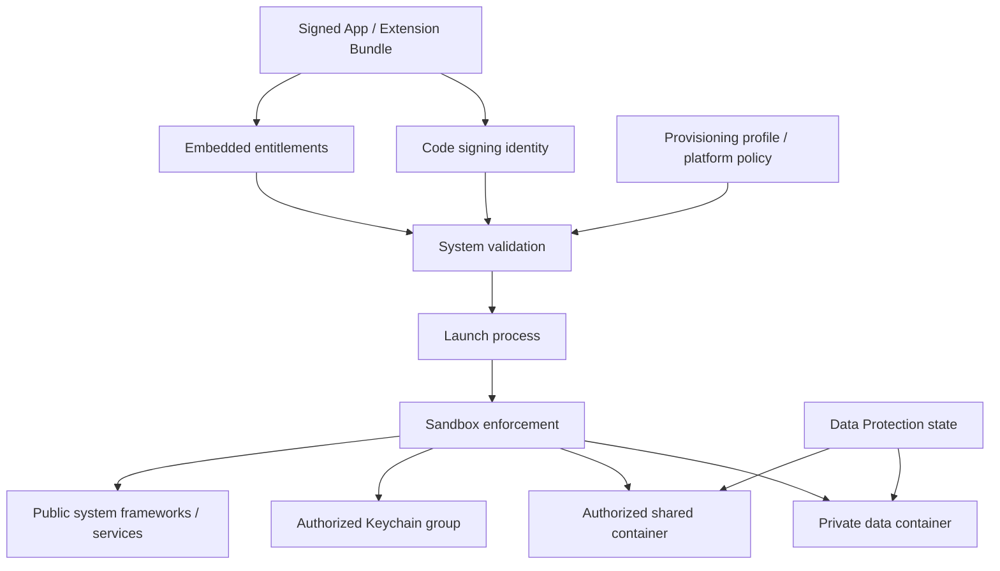
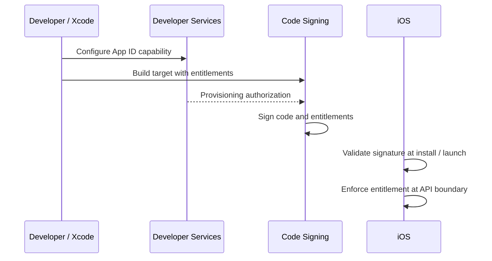
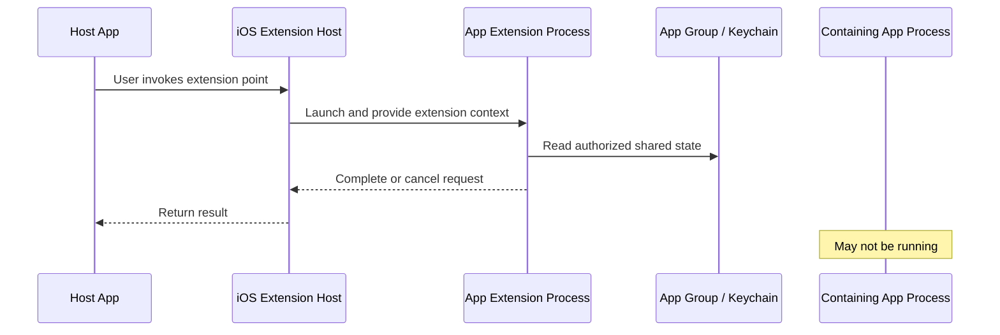
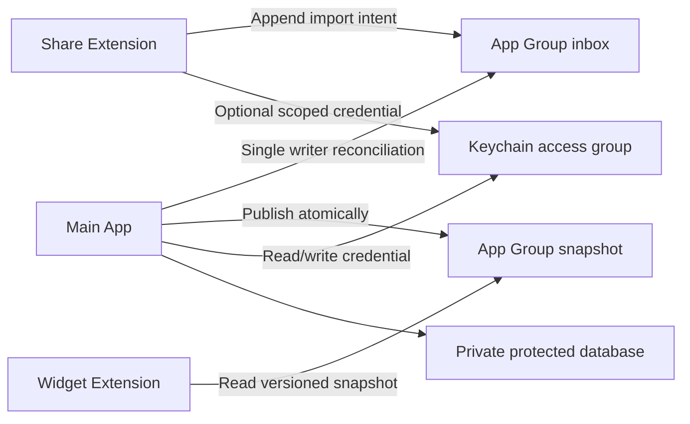

# iOS 沙盒与系统边界：从容器、Entitlement 到扩展进程与数据保护

> iOS 沙盒不是一个“禁止访问其他目录”的单一规则，而是代码签名身份、Entitlement、进程 Sandbox Profile、文件系统容器、Data Protection 和隐私政策共同形成的边界。App 与 Extension 即使来自同一工程，也通常运行在不同进程和容器中；跨边界访问必须通过系统授予的能力、共享容器或受控 IPC 完成，不能依赖路径、单例或实现细节绕过。

---

## 一、本文解决什么问题

iOS 工程中常见这些问题：

- App Bundle 与 Data Container 分别存什么，哪些目录可能被备份或清理？
- 为什么不能持久化 Sandbox 的绝对路径？
- Xcode 中打开 Capability 后，Entitlement、签名和 Provisioning Profile 如何协作？
- App Group 是否等于一块支持并发读写的共享数据库？
- Widget、Share Extension 能否直接访问主 App 的单例、内存和数据库连接？
- App Extension 与主 App 之间是函数调用、XPC，还是文件共享？
- Keychain Access Group 和 App Group 有什么区别？
- File Protection 在设备锁定、重启后首次解锁和后台唤醒时如何影响读写？
- Privacy Manifest 是否等同于系统隐私权限弹窗？
- 模拟器上可用的路径访问和进程通信，为什么到真机或发布签名后失败？

这些问题的共同主线是：**每次跨越文件、进程、身份或隐私边界，都必须明确资源所有者、授权依据、通信协议、失败方式和生命周期。**

本文以现代 iOS App 与 App Extension 工程为主。示例在 2026-07-31 使用 Xcode 26.1.1、Apple Swift 6.2.1 和 iOS Simulator SDK 验证。Sandbox 的具体 Profile、系统服务内部 XPC 接口、容器物理路径及系统调度策略属于实现细节；工程代码只应依赖 Apple 公开 API、签名契约和对应平台版本文档。

### 核心结论

1. App Sandbox 以进程为执行主体，依据代码签名身份和有效 Entitlement 限制文件、服务、硬件及 IPC 访问；“同一开发者”不等于进程可任意互访。
2. App Bundle 是已签名、运行时只读的代码与资源容器；Data Container 保存应用可写数据。两者路径都不应被硬编码或长期持久化。
3. `Documents`、`Library/Application Support`、`Library/Caches` 和 `tmp` 的持久性、备份语义不同。数据应按可重建性、用户价值与安全要求选目录，而不是统一写入 Documents。
4. Capability 是 Xcode 的工程配置入口；Entitlement 是签入可执行文件、供系统校验的能力声明。声明不等于必然获权，还要与 App ID、Provisioning Profile、系统策略和运行环境一致。
5. App Group 让同一 Team 下、被明确授权的多个 Target 访问共享容器和部分共享偏好，但不提供事务、锁、迁移或并发一致性保证。
6. App Extension 是独立 Bundle、独立进程和独立生命周期。它不能直接访问主 App 内存；共享状态应通过 App Group、Keychain Access Group 或系统规定的请求/响应通道传递。
7. XPC 是 Apple 平台的进程间通信基础设施，但 iOS 第三方 App 不能把 macOS 自定义 XPC Service 模型原样搬过来。应使用具体扩展点和公开框架暴露的通信契约。
8. Keychain Access Group 共享的是 Keychain Item 的访问身份，不是文件目录。查询必须使用一致的 Access Group、Service/Account 与 Accessibility，并正确处理设备锁定和迁移边界。
9. File Protection 对文件内容执行静态数据保护。Protection Class 决定密钥何时可用；后台执行不代表受保护文件此刻一定可读。
10. Privacy Manifest 描述 Required Reason API、数据收集与 Tracking 等声明，和运行时权限授权、`Info.plist` Usage Description 不是一回事，三者可能同时需要。
11. 真正可靠的边界设计必须把拒绝访问、容器缺失、锁定不可用、扩展超时、进程被杀和多进程竞争当作正常路径测试。

---

## 二、先建立完整安全模型



关键路径是：构建时把身份和能力声明签入产物，安装与启动时由系统校验，运行时再由 Sandbox 和各系统服务执行访问控制。任何一层不匹配，都可能导致安装失败、启动失败或 API 返回拒绝，而不是自动降级为无限访问。

应区分四类边界：

| 边界 | 隔离对象 | 常见跨越方式 | 典型失败 |
|---|---|---|---|
| 文件边界 | Bundle、私有容器、共享容器 | `FileManager`、Security-scoped URL、App Group | 无权限、文件不存在、保护数据不可用 |
| 进程边界 | App、Extension、系统服务 | Extension Context、公开 Framework、系统 IPC | 对端退出、超时、取消、协议错误 |
| 身份边界 | Team、App ID、Access Group | Entitlement、签名、Provisioning | `containerURL` 为 `nil`、Keychain 拒绝 |
| 隐私边界 | 用户数据、受保护 API | Usage Description、用户授权、Privacy Manifest | 用户拒绝、声明不完整、审核/分发问题 |

Sandbox 不是数据加密的同义词。它主要限制“谁能访问”；File Protection、Keychain 和应用层加密处理“数据在什么条件下可被解密”。设备已解锁、进程已被攻破或数据主动上传到服务端后，威胁模型又不同。

---

## 三、App Sandbox 与 Container

### 3.1 Bundle Container：已签名的只读输入

App Bundle 包含 Executable、Framework、资源、`Info.plist`、签名信息等。运行中的 App 应把它视为只读：

```swift
guard let configURL = Bundle.main.url(
    forResource: "DefaultConfiguration",
    withExtension: "json"
) else {
    throw ConfigurationError.missingBundledDefault
}

let bundledData = try Data(contentsOf: configURL)
```

不要尝试在 Bundle 内保存登录态、下载内容或修改配置。除了写入通常会失败，修改已签名内容也破坏了签名模型。需要修改的默认数据应在首次使用时复制到 Data Container。

### 3.2 Data Container：按语义选择目录

| 目录 | 适合内容 | 持久性与备份语义 |
|---|---|---|
| `Documents` | 用户创建且不可轻易重建的文档 | 持久；通常参与备份 |
| `Library/Application Support` | App 管理的持久业务数据、数据库 | 持久；通常参与备份 |
| `Library/Caches` | 可重新下载或计算的缓存 | 系统可清理；不应作为唯一数据源 |
| `tmp` | 当前操作的短期中间文件 | 系统可清理，App 也应主动清理 |

通过系统 API 每次解析 URL：

```swift
struct StorageLocations {
    let fileManager: FileManager

    func applicationSupportDirectory() throws -> URL {
        let url = try fileManager.url(
            for: .applicationSupportDirectory,
            in: .userDomainMask,
            appropriateFor: nil,
            create: true
        )
        return url.appendingPathComponent("Records", isDirectory: true)
    }
}
```

容器根路径可能在重装、恢复、系统迁移或不同运行环境中改变。因此数据库只保存相对路径或业务标识，需要使用时再从当前容器根拼接。把 `/var/mobile/Containers/...` 写入数据库，是典型的“当前设备可用、迁移后失效”。

### 3.3 备份排除不是缓存目录替代品

一个持久但可重新生成的大文件若必须位于 Application Support，可以按 Apple API 设置不参与备份；但这不改变其磁盘生命周期，也不代表系统会像 Cache 一样自动清理：

```swift
var values = URLResourceValues()
values.isExcludedFromBackup = true
var fileURL = persistentDerivedFileURL
try fileURL.setResourceValues(values)
```

目录选择应先表达生命周期，再单独配置备份策略。不要用“排除备份”掩盖错误的数据分类。

---

## 四、Capability、Entitlement 与代码签名

这三个概念常被混用：

- **Capability**：Xcode 中启用能力的配置体验，可能修改 Entitlements、`Info.plist`、Framework 链接和开发者后台配置。
- **Entitlement**：签入 Executable 的键值声明，例如 App Group、Keychain Access Group、Push Environment。
- **Provisioning Profile**：开发/分发授权材料之一，包含允许的 App ID、证书关系和部分 Entitlement 约束。



“Entitlements 文件里有这个键”并不足以证明运行时具备能力。排查应检查最终签名产物，而非只检查源码工程文件：

```bash
codesign -d --entitlements :- Payload/Example.app
security cms -D -i Payload/Example.app/embedded.mobileprovision
```

输出可能包含签名和账号标识，不应未经处理上传到公开日志。不同签名方式和平台的产物结构也可能不同，应以当前 Xcode 与 Apple 文档为准。

### 4.1 最小权限原则

只为确有需求的 Target 开启能力：

- 主 App 需要 App Group，不代表所有 Extension 都应加入；
- Widget 只读展示数据时，不应获得写入敏感凭证的 Keychain Group；
- Debug 与 Release 的 App ID、Group ID 和环境要显式管理；
- 删除功能时同步移除不用的 Entitlement、URL Scheme 和隐私声明。

Entitlement 增加的是可访问面，也增加配置、审核、迁移和故障排查成本。

---

## 五、App Group：共享的是容器，不是一致性协议

App Group 可让被同一 Group Identifier 授权的 App 与 Extension 获取共享 Container：

```swift
enum SharedContainer {
    static let identifier = "group.com.example.reader"

    static func url(fileManager: FileManager = .default) throws -> URL {
        guard let url = fileManager.containerURL(
            forSecurityApplicationGroupIdentifier: identifier
        ) else {
            throw SharedContainerError.notAuthorized(identifier)
        }
        return url
    }
}
```

`nil` 应作为配置或签名错误处理，不能强制解包。Group Identifier 必须与 Apple Developer 配置、各 Target Entitlement 和最终签名一致。

### 5.1 多进程并发是默认事实

主 App 和 Widget 可能在不同进程中同时读写。普通的“写临时文件再替换”能避免读到半个文件，但不能解决两个 Writer 的业务冲突：

```swift
struct SharedSnapshotStore {
    let directory: URL

    func save(_ data: Data) throws {
        try FileManager.default.createDirectory(
            at: directory,
            withIntermediateDirectories: true
        )
        let destination = directory.appendingPathComponent("snapshot.json")
        try data.write(to: destination, options: [.atomic])
    }
}
```

`.atomic` 主要降低单次替换留下部分内容的风险，不是跨进程事务锁。多 Writer 场景还要设计：

- 单一 Writer，其他进程只提交 Intent；
- 文件协调或数据库自身支持的多进程访问机制；
- Schema Version 与 Migration Owner；
- 冲突规则、幂等写入和崩溃恢复；
- Extension 时间耗尽时的中断点。

`UserDefaults(suiteName:)` 适合少量偏好和快照，不适合当高并发消息队列或强一致数据库，也不能依赖历史上的手动 `synchronize()` 作为一致性保证。

### 5.2 通知不是数据本身

跨进程通知最多表达“某件事可能变化了”。接收方唤醒后仍应从持久化数据源重新读取、校验版本，并容忍通知合并、延迟或丢失。不要把正确性建立在“每条通知必达且严格有序”上。

---

## 六、App Extension：独立进程、短生命周期

App Extension 是嵌入主 App 包中的独立 Target，但运行时通常由系统按 Extension Point 拉起：



Containing App 可能没有运行，Extension 也不能通过主 App 单例获取服务。两者代码复用应通过 Framework/Swift Package 完成，但共享代码不代表共享对象实例。

Extension 设计应满足：

1. 输入来自 `NSExtensionContext` 或对应 Extension Framework，先校验类型、大小和可用性。
2. 工作可取消、可超时，不能假设有无限后台时间。
3. 重要数据先写入一致的持久化边界，再报告完成。
4. 不可使用被 App Extension 禁止的 API；编译通过也不代表所有 API 在该 Extension Point 合法。
5. 主 App 下次启动时通过幂等 Reconciliation 消化 Extension 结果。

### 6.1 XPC 的正确边界

XPC（Cross-Process Communication）是 Darwin/Apple 平台的 IPC 基础之一，系统 Framework 和 Extension Hosting 会使用相关基础设施。但对 iOS 第三方 App，工程应依赖公开的高层契约，例如：

- `NSExtensionContext` 与 Item Provider；
- `NSFileProvider` 等具体 Extension Framework；
- App Group 共享文件；
- 系统定义的 URL、Background Transfer 或 Notification 机制。

不能假设可以像 macOS 一样部署任意常驻 XPC Service，也不应调用私有 XPC 接口。IPC 的内部传输格式、守护进程名称和调度细节不是稳定契约。

---

## 七、Keychain Access Group：共享凭证身份

Keychain Item 由 Security Framework 管理，不位于普通 App Group 目录中。Access Group 决定哪些签名身份可以查询某组 Item。

下面示例展示读取共享 Token 的关键参数和错误分支：

```swift
import Security

enum SharedCredentialStore {
    static let accessGroup = "ABCDE12345.com.example.shared-credentials"

    static func readToken(account: String) throws -> Data? {
        let query: [String: Any] = [
            kSecClass as String: kSecClassGenericPassword,
            kSecAttrService as String: "com.example.session",
            kSecAttrAccount as String: account,
            kSecAttrAccessGroup as String: accessGroup,
            kSecReturnData as String: true,
            kSecMatchLimit as String: kSecMatchLimitOne
        ]

        var result: CFTypeRef?
        let status = SecItemCopyMatching(query as CFDictionary, &result)

        switch status {
        case errSecSuccess:
            guard let data = result as? Data else {
                throw CredentialError.invalidResult
            }
            return data
        case errSecItemNotFound:
            return nil
        case errSecInteractionNotAllowed:
            throw CredentialError.protectedDataUnavailable
        default:
            throw CredentialError.security(status)
        }
    }
}
```

工程注意点：

- Access Group 通常包含 Team Identifier 前缀，使用最终签名配置中的准确值；
- 写入与读取查询的 `class`、`service`、`account`、`accessGroup` 必须形成稳定主键；
- Accessibility Class 决定锁屏、首次解锁和设备迁移语义；
- 带用户在场、Biometry 或 Access Control 的 Item，Extension/后台上下文未必能弹出交互；
- Keychain 不是大型 Blob 数据库，也不是跨进程事件总线。

App Group 解决共享文件，Keychain Access Group 解决共享 Keychain 身份；两者不可互相替代。

---

## 八、File Protection：设备状态也是 I/O 前置条件

iOS Data Protection 使用不同 Protection Class 控制文件密钥何时可用。常见语义包括：

| Foundation 选项 | 核心语义 | 典型选择 |
|---|---|---|
| `.completeFileProtection` | 设备锁定后不可访问 | 高敏感且无需锁屏后台访问的数据 |
| `.completeFileProtectionUnlessOpen` | 已打开文件可继续使用，创建新文件受限制 | 持续写入且需谨慎评估锁屏行为的流式场景 |
| `.completeFileProtectionUntilFirstUserAuthentication` | 重启后首次解锁前不可用，之后锁屏仍可用 | 确需锁屏后台访问的持久数据 |
| `.noFileProtection` | 不使用 Data Protection Class 提供的锁定保护 | 极少数明确接受风险的非敏感数据 |

具体可用性和 API 名称应以目标 SDK 文档为准。不要仅凭名称为整个数据库目录批量降级保护等级。

创建敏感文件时显式设置保护：

```swift
func writeSensitiveData(_ data: Data, to url: URL) throws {
    try data.write(to: url, options: [.atomic, .completeFileProtection])
}
```

同时监听 Protected Data 可用性，但不能只靠通知保证正确性：

```swift
func loadWhenAvailable(from url: URL) throws -> Data {
    guard UIApplication.shared.isProtectedDataAvailable else {
        throw StorageError.protectedDataUnavailable
    }
    return try Data(contentsOf: url)
}
```

检查之后设备状态仍可能变化，因此最终 I/O 错误必须保留。Background Push、BGTask、Extension 和 App 启动恢复都应支持“数据暂不可用”：延迟处理、记录可重试 Intent，并避免把它误判成“文件损坏”后覆盖数据。

数据库还要确认数据库文件、WAL、SHM、临时文件和备份是否具有一致且符合预期的保护策略。只保护主数据库文件可能留下旁路。

---

## 九、Privacy Manifest 不等于权限弹窗

Privacy Manifest 通常使用 `PrivacyInfo.xcprivacy`，用于声明 App/SDK 的部分隐私实践，例如：

- 使用的 Required Reason API 类别及获准原因；
- 收集的数据类型及用途；
- 数据是否关联用户；
- Tracking 声明与相关 Domain。

它与以下机制相互关联但职责不同：

| 机制 | 回答的问题 | 结果 |
|---|---|---|
| Sandbox / Entitlement | 该签名进程是否具备系统能力 | 系统允许或拒绝 API/资源访问 |
| Usage Description | 为什么向用户请求相机、定位等权限 | 系统弹窗展示说明；缺失可能导致失败 |
| Runtime Authorization | 用户当前是否授权 | API 返回授权状态或受限结果 |
| Privacy Manifest | App/SDK 使用特定 API、收集数据的声明是什么 | 构建、分发、审核与隐私报告依据之一 |

Privacy Manifest 不能替代 `NSCameraUsageDescription`，填写 Manifest 也不会自动取得照片或定位授权。反过来，用户已授权也不意味着 Required Reason API 和数据收集声明可以省略。

### 9.1 第三方 SDK 也是你的供应链边界

集成 SDK 时至少检查：

- SDK 是否包含有效 Privacy Manifest 和签名要求；
- 声明是否与实际版本及使用方式匹配；
- 是否调用 Required Reason API；
- 是否新增 Tracking、Domain、数据收集或跨境传输；
- 未启用的 SDK 功能能否关闭，数据能否最小化；
- 升级后 Manifest Diff 和 App Privacy 答案是否需要更新。

不要复制模板理由来“通过检查”。Required Reason 必须对应真实功能和 Apple 当前允许的理由；政策会演进，应在每次发布前查阅当前官方文档和 Xcode/分发检查结果。

---

## 十、常见错误与修复

### 10.1 错误：保存绝对 Sandbox 路径

```swift
// 错误：容器根路径变化后记录失效。
userDefaults.set(fileURL.path, forKey: "draftPath")
```

修复方式是保存相对路径或业务 ID：

```swift
userDefaults.set("drafts/2026-07-31.json", forKey: "draftRelativePath")
```

读取时从当前 Application Support 或 App Group Container 重新解析，并防止 `..` 等路径逃逸。

### 10.2 错误：把 App Group 当共享内存

两个进程各自缓存同一 JSON，再覆盖写入，会产生 Lost Update。修复方式是明确单一 Writer 或引入适合多进程的存储协调，并为数据增加 Version、Migration 与冲突处理。

### 10.3 错误：Extension 等主 App 处理完成

主 App 可能没有运行，也没有保证会因 Extension 写入立刻启动。Extension 应完成自己的最小事务并返回；主 App 以后通过持久化 Intent 对账。

### 10.4 错误：把 `errSecItemNotFound` 当作所有 Keychain 错误

Access Group 配置错误、设备锁定、交互不允许和参数错误具有不同含义。吞掉 OSStatus 会把授权问题误诊为“用户未登录”。应分类映射错误，并在日志中避免输出 Token。

### 10.5 错误：后台读取失败后重建空数据库

锁定造成的 Protected Data 不可用是暂时状态。把它当损坏并创建空库可能覆盖或分叉真实数据。应保留原文件，等待可用后重试，并把不可恢复的格式损坏走独立修复流程。

### 10.6 错误：只更新主 App 的 Privacy Manifest

Extension、动态 Framework 和第三方 SDK 也可能产生独立声明与合并结果。发布检查必须针对 Archive 中实际嵌入的全部产物，而不只是仓库顶层文件。

---

## 十一、工程设计：为边界建立显式协议

一个包含主 App、Widget 和 Share Extension 的内容应用，可以这样划分：



推荐约束：

1. 主 App 是业务数据库和 Schema Migration 的唯一所有者。
2. Share Extension 只写不可变、带唯一 ID 的 Import Intent，不直接修改主数据库。
3. 主 App 幂等消费 Intent，成功提交数据库后再标记/删除消息。
4. Widget 只读取原子发布的版本化 Snapshot，不持有主数据库写权限。
5. Keychain Group 只共享 Extension 必需的最小凭证；能用一次性、限权 Token 时不共享主 Session。
6. 所有 Payload 都有 Schema Version、大小上限和解码失败隔离。
7. 每个进程都容忍对端不运行、重复运行和执行中被终止。

### 11.1 边界协议应包含什么

- **身份**：哪个 Target/Team/Access Group 可以访问；
- **数据模型**：Version、必填字段、兼容策略和大小限制；
- **一致性**：谁写、如何提交、如何去重、何时清理；
- **安全**：敏感等级、Protection Class、最小凭证和日志脱敏；
- **生命周期**：超时、取消、进程终止和设备锁定；
- **可观测性**：不含隐私数据的 Request ID、错误类别和处理阶段。

把这些约束封装在共享 Package 中可以减少编码差异，但 Package 仍不能替代运行时授权和多进程测试。

---

## 十二、测试与验证方法

### 12.1 验证最终产物，而不只看工程配置

对 Archive/导出的 App 检查：

- 主 App 与每个 Extension 的签名和 Entitlement；
- App Group、Keychain Access Group 的 Identifier 是否一致；
- `PrivacyInfo.xcprivacy` 是否随正确 Target 打包；
- Extension 的 `Info.plist`、Extension Point 与允许 API；
- Release 配置是否误用了 Debug Group 或开发环境服务。

### 12.2 真机边界测试矩阵

| 场景 | 应验证的行为 |
|---|---|
| 首次安装、升级、卸载重装 | Container 初始化、Migration、Keychain 留存假设 |
| 锁屏、重启后首次解锁前 | File Protection 与 Keychain Accessibility |
| 主 App 未运行时启动 Extension | 无单例依赖、Intent 可独立落盘 |
| App 与 Extension 同时写入 | 无部分文件、Lost Update 可检测或避免 |
| Extension 被取消或系统终止 | 临时文件清理、幂等恢复 |
| App Group/Access Group 故意配错 | 明确错误而非 Crash 或静默丢数据 |
| 磁盘空间不足、文件损坏 | 原子提交、错误传播和恢复策略 |
| Release/TestFlight 构建 | 签名、权限、隐私声明与线上配置一致 |

模拟器适合快速验证路径和协议，但不能替代真机的签名、Data Protection、Keychain、内存压力与 Extension 调度验证。

### 12.3 性能必须在边界两侧测量

App Group 或 Keychain 慢时，不要先凭感觉更换存储：

1. 用 Signpost 分别记录编码、文件协调、I/O、解码和 UI 更新时间；
2. 在 Release/Profile、目标真机和真实数据规模上采样分布；
3. 区分冷文件缓存、锁竞争、Protection 不可用和 Extension 启动时间；
4. 修改协议后对比 P50/P95、失败率、数据大小和能耗；
5. 检查优化是否牺牲一致性、保护等级或隐私最小化。

未经测量，不能断言 App Group、Keychain 或某种数据库“天然慢”。

---

## 十三、总结

iOS 系统边界的本质是基于身份和显式授权的最小访问：Bundle 提供已签名只读代码，Data Container 保存私有可写数据，App Group 与 Keychain Access Group 分别开放受控的文件和凭证共享。Capability 帮助配置能力，最终仍由代码签名、Entitlement、Provisioning 和系统策略共同决定权限。

App Extension 是独立进程，不能依赖主 App 内存或生命周期；XPC 的底层存在不等于第三方可以依赖私有 IPC。跨进程共享必须设计版本、原子提交、并发规则、超时和恢复。File Protection 把设备锁定状态带入 I/O 前置条件，Privacy Manifest 则把 API 与数据实践带入构建和分发合规边界。

真正需要记住的是：**容器不是协议，Entitlement 不是权限保证，通知不是数据，后台执行不是数据可用，隐私声明也不是用户授权。每一条边界都要以最终签名产物和真机失败路径验证。**

## 问答复盘

### Q1：Sandbox 是否意味着 App 的所有文件都已加密？

**答：** 不是。Sandbox 主要做访问隔离；文件内容在锁定状态下是否可解密由 Data Protection Class 等机制决定，敏感业务还可能需要 Keychain 或应用层加密。

### Q2：为什么不能把当前 Data Container 的绝对路径保存到数据库？

**答：** Container 根路径不是稳定业务标识，重装、恢复、迁移或运行环境变化后可能改变。应保存相对路径或业务 ID，再从系统返回的当前容器 URL 解析。

### Q3：Xcode 已打开 App Groups，为什么 `containerURL` 仍可能返回 `nil`？

**答：** Capability UI 只是配置入口。Group ID 还必须存在于对应 App ID，写入每个 Target 的有效 Entitlement，并与最终签名和 Provisioning 一致；运行环境不匹配也会失败。

### Q4：App Group 和 Keychain Access Group 的核心区别是什么？

**答：** App Group 提供共享文件容器和相关偏好 Suite；Keychain Access Group 授权多个签名 Target 查询同组 Keychain Item。前者不是敏感凭证保险箱，后者也不是通用文件系统。

### Q5：`.atomic` 写入是否解决主 App 与 Extension 的并发写冲突？

**答：** 否。它主要避免一次文件替换暴露部分内容，不能防止两个 Writer 先后覆盖形成 Lost Update。仍需单一 Writer、协调机制或支持多进程事务的存储方案。

### Q6：Extension 能否调用共享 Framework 中的单例与主 App 通信？

**答：** 能编译并调用同一份代码，但两个进程各有独立单例和内存，不能由此共享状态。通信必须使用 Extension Point 提供的上下文、共享容器或其他公开系统机制。

### Q7：后台任务读取数据库失败，是否应当创建新数据库恢复？

**答：** 不能直接这样做。先区分 Protected Data 暂不可用、文件权限、磁盘错误和真实损坏；锁定造成的暂时失败应延迟重试，贸然建空库可能覆盖或分叉有效数据。

### Q8：Privacy Manifest、Usage Description 和用户授权能否互相替代？

**答：** 不能。Manifest 声明 API 与数据实践，Usage Description 解释权限用途，Runtime Authorization 表示用户选择。一个功能可能需要同时满足三层要求。

### Q9：Widget 只读主 App 数据时，最稳妥的共享方式是什么？

**答：** 通常由主 App 原子发布小型、版本化 Snapshot 到 App Group，Widget 只读并容忍旧数据或缺失。是否直接共享数据库要依据数据库的多进程支持、迁移所有权和一致性要求评估。

### Q10：沙盒能力为什么必须用 Release 真机或 TestFlight 再验证？

**答：** 模拟器和 Debug 签名不能完整代表发布时的 Provisioning、Entitlement、Data Protection、Keychain 与 Extension 调度。最终权限取决于实际签名产物和系统环境。

## 延伸知识

- Security-scoped URL、Document Picker 与外部文件访问
- `NSItemProvider` 的异步数据传递与安全校验
- Keychain Accessibility、Access Control 与 Secure Enclave
- App Extension Programming Guide 与各 Extension Point 生命周期
- Background URLSession 的系统进程边界与恢复标识
- Code Signing、Hardened Runtime 与平台安全模型差异
- SQLite WAL、多进程访问与文件协调
- Required Reason API、SDK Signature 与软件供应链治理
