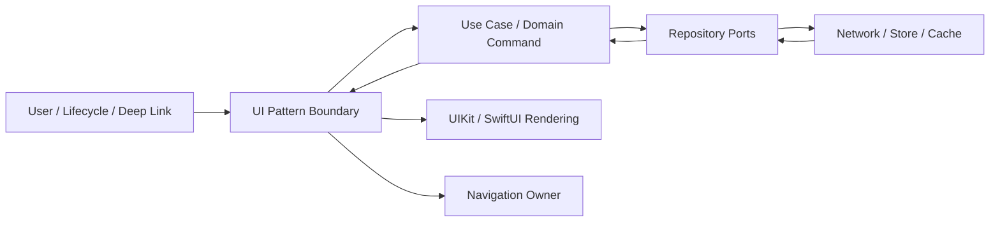
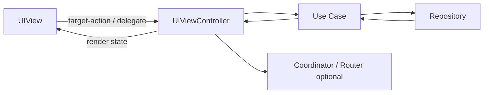
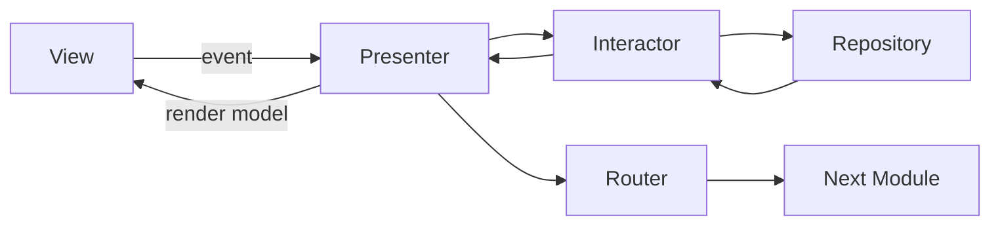
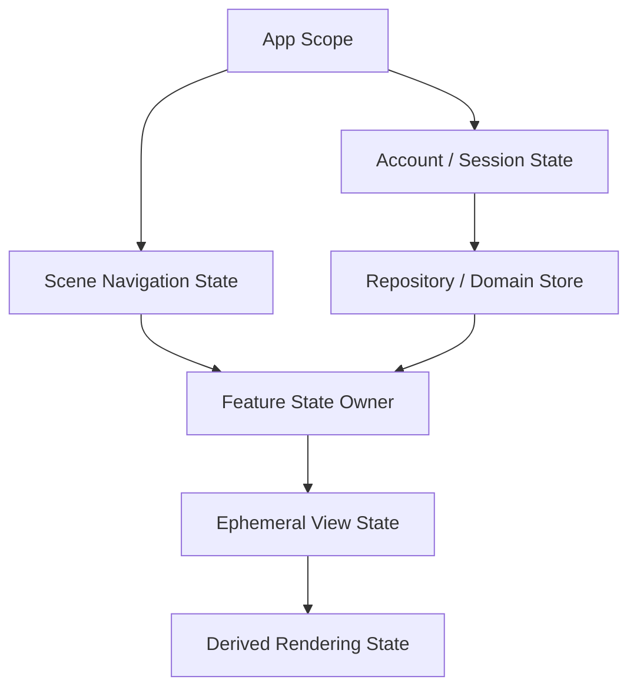

# iOS UI 架构模式：从 MVC、MVVM 到 UDF、TCA 与 VIPER

> UI 架构模式解决的是“状态、事件、副作用和导航如何在界面边界协作”，不是替代业务分层、数据库事务或网络治理。MVC、MVVM、Coordinator、Redux/UDF、TCA 和 VIPER 都能写出可靠系统，也都能因状态多份、依赖隐藏和生命周期失控而失败。选择模式前，先明确 State Owner、Effect Owner、Navigation Owner 和 Feature Scope，再比较模式带来的约束是否值得团队承担。

---

## 一、问题背景：同一功能可以有多种正确结构

考虑一个文章 Feature：

- 列表首次加载、下拉刷新和分页；
- 点击文章进入详情；
- 收藏使用乐观更新，失败后对账；
- Deep Link 可直接打开详情；
- 未登录时先展示登录，再继续原导航意图；
- 页面退出后取消只属于页面的请求；
- 离线状态展示本地数据与同步状态。

不同 UI 架构都必须回答相同问题：

1. 列表、选中项、加载和错误状态由谁拥有？
2. 用户点击如何变成业务 Command？
3. 网络、数据库观察、Timer 和 Analytics 在哪里执行？
4. Effect 完成后如何避免旧结果覆盖新状态？
5. 导航是命令还是可恢复状态？
6. 页面、Scene、账号和 App 级对象分别活多久？
7. 单元测试替换哪些边界，如何控制时间和异步顺序？

如果这些问题没有答案，换成更流行的模式只会改变类型名称。

本文以 Swift 6、iOS 17+ 为示例基线，同时覆盖 UIKit 与 SwiftUI。The Composable Architecture（TCA）是持续演进的第三方架构库；本文只讲其稳定概念，不绑定某个版本的具体宏或 API。采用时应以项目锁定版本的官方文档和 Migration Guide 为准。

### 核心结论

1. MVC 的问题不是 Controller 必然庞大，而是职责未拆分；小型页面使用 MVC 往往最直接。
2. MVVM 将 View State 与展示逻辑移到 ViewModel，但不会自动提供单向数据流、导航治理、依赖注入或副作用取消。
3. Coordinator 把跨页面流程和 UIKit 转场所有权上移，适合与 MVC/MVVM/UDF 组合；它不应成为第二个业务 Store。
4. Redux/UDF 用 `State -> View -> Action -> Reducer -> State` 建立单向更新，Reducer 应保持纯净，Effect 独立执行并回送 Action。
5. TCA 将 State、Action、Reducer、Effect、Dependency、Store、组合和测试形成统一工具体系；收益来自一致约束，代价是框架学习、建模和版本迁移。
6. VIPER 通过 View、Interactor、Presenter、Entity、Router 强拆职责，适合边界稳定、团队协作严格的复杂 Feature，不适合无差别套用到简单页面。
7. 状态只能有一个权威 Owner，其他层持有 Snapshot、Binding 或 Derived State。两份可写状态最终会互相覆盖。
8. Side Effect 必须有身份、生命周期、取消、错误和结果回流规则，不能偷偷写在 Reducer、Computed Property 或 View Render 中。
9. Navigation State 应保存语义 Route 和稳定 ID，不保存 View Controller、ViewModel 或完整响应；UIKit 命令栈还需与 Route State 对账。
10. 测试替身应放在 I/O、时间、UUID、权限和导航边界，不必为每个纯类型制造 Protocol。
11. 模式选择取决于 Feature 状态复杂度、并发流程、团队规模和长期维护成本，而不是文件数量或简历关键词。

---

## 二、模式不是分层：先确定共同边界



MVC、MVVM、UDF 等主要改变 `UI Pattern Boundary` 内部结构。外部依然需要 Use Case、Repository、网络与存储边界。把 URLSession 或 Core Data 直接搬进 ViewModel/Reducer，不会因为类型名变了就符合分层。

### 2.1 选择前先量化复杂度

- 独立可写状态有多少，是否存在 Impossible State？
- 同时运行的 Effect 有多少，是否需要取消/合并/防抖？
- 页面是否支持 Deep Link、状态恢复和多步骤流程？
- 多人是否频繁修改同一 Feature？
- 是否需要精确重放 Action 和断言状态演进？
- 团队是否能稳定维护 Reducer、Coordinator 或模块契约？

简单静态详情页与离线协同编辑器，不应承担相同架构成本。

---

## 三、MVC：框架对象明确，职责需要主动拆分

经典 MVC：

- **Model**：领域数据和业务能力，不等于网络 DTO；
- **View**：显示与输入，不决定业务；
- **Controller**：协调生命周期、事件、Model 和 View。

UIKit 天然以 `UIViewController` 为生命周期和容器边界，因此 MVC 符合平台结构。Massive View Controller 是实现失控的结果，不是 MVC 的定义。



### 3.1 Controller 应保留什么

- View Lifecycle 与 View Hierarchy；
- 输入事件适配；
- 请求 Use Case 并提交 UI State；
- Child Controller 和 Transition 协调；
- 页面级 Task/Subscription 的 Owner。

应移出：

- JSON/数据库映射；
- 跨页面业务流程；
- 复杂领域规则；
- 重试、Token Refresh、离线同步；
- 可复用格式化和纯状态转换。

### 3.2 适用边界

适合状态少、交互线性、UIKit 生命周期主导的页面。若 Controller 同时维护复杂表单、多个异步 Effect 和可恢复导航，继续拆成 ViewModel/Store 或引入 Coordinator 会更清楚。

---

## 四、MVVM：View State 与展示逻辑的 Owner

MVVM 通常让 ViewModel：

- 接收 View Event；
- 调用 Use Case/Repository；
- 将 Domain Value 映射为 View State；
- 持有页面 Task 与订阅；
- 输出可观察状态。

View 只绑定状态并发送意图。SwiftUI 的声明式更新很容易与 MVVM 配合，但 `Observable`/`@Observable` 本身不是 MVVM，也不决定状态所有权。

```swift
import Observation

@MainActor
@Observable
final class ArticleDetailViewModel {
    enum State: Equatable {
        case loading
        case content(ArticleDetailState)
        case failed(message: String)
    }

    private let load: LoadArticleUseCase
    private let toggleFavorite: ToggleFavoriteUseCase
    private var task: Task<Void, Never>?

    private(set) var state: State = .loading

    init(
        load: LoadArticleUseCase,
        toggleFavorite: ToggleFavoriteUseCase
    ) {
        self.load = load
        self.toggleFavorite = toggleFavorite
    }

    func appeared(articleID: UUID) {
        task?.cancel()
        task = Task {
            do {
                let article = try await load.execute(id: articleID)
                try Task.checkCancellation()
                state = .content(ArticleDetailState(article))
            } catch is CancellationError {
                return
            } catch {
                state = .failed(message: present(error))
            }
        }
    }

    deinit { task?.cancel() }
}
```

### 4.1 MVVM 不自动解决的问题

- ViewModel 可以照样变成 Massive ViewModel；
- 双向 Binding 可形成隐式写入和反馈循环；
- 多个 ViewModel 可能复制同一业务状态；
- Navigation 若散落在 View Closure 中仍不可恢复；
- Effect 若没有 ID/取消策略仍会发生旧结果覆盖；
- Repository/Use Case 依赖仍需 Composition Root 注入。

当 Event 和 State Transition 数量增加，可在 ViewModel 内引入显式 Reducer，而不必立刻采用完整 Redux 框架。

---

## 五、Coordinator：流程和导航的所有者

Coordinator 常与 MVC/MVVM 组合，用于：

- 创建页面并注入依赖；
- Push/Present/Dismiss；
- 多步骤流程，如登录后继续结算；
- Deep Link 解析后的导航决策；
- Child Coordinator 生命周期；
- Scene-scope Navigation State 与恢复。

```swift
@MainActor
protocol ArticleListRouting: AnyObject {
    func showArticle(id: UUID)
    func showLogin(continuation: RouteIntent)
}

@MainActor
final class ArticleCoordinator: ArticleListRouting {
    private let navigationController: UINavigationController
    private let factory: ArticleFeatureFactory
    private var children: [UUID: AnyObject] = [:]

    func showArticle(id: UUID) {
        let controller = factory.makeDetail(articleID: id)
        navigationController.pushViewController(controller, animated: true)
    }
}
```

### 5.1 Coordinator 不应拥有第二份业务状态

Coordinator 可保存 Route/Flow State，但 Article 内容、收藏和同步状态仍由 Repository/Feature Store 拥有。若 Coordinator、ViewModel 和 View Controller 都能修改同一个字段，会形成多个事实源。

### 5.2 生命周期陷阱

- Parent 强持有 Child，Child 完成后必须移除；
- Closure/Delegate 避免 Child 与 Parent 循环强引用；
- Interactive Pop 可能取消，不能只在 `viewWillDisappear` 判断完成；
- 多 Scene 不应扫描全局“当前 Navigation Controller”；
- UIKit Stack 与 Route State 要在手势返回、恢复和外部 Deep Link 后对账。

---

## 六、Redux 与 Unidirectional Data Flow

Unidirectional Data Flow（UDF）通常包含：

```text
State -> View -> Action -> Reducer -> New State -> View
                         -> Effect -> Action
```

State 是唯一快照，Action 描述发生了什么，Reducer 是同步纯函数，Effect 执行外部工作并把结果重新包装为 Action。

```swift
struct ArticleFeatureState: Sendable, Equatable {
    var articles: [Article] = []
    var isLoading = false
    var error: ArticleFeatureError?
    var requestRevision = 0
}

enum ArticleFeatureAction: Sendable, Equatable {
    case reload
    case response(revision: Int, Result<[Article], ArticleFeatureError>)
    case cancel
}

enum ArticleFeatureEffect: Sendable, Equatable {
    case load(revision: Int)
    case cancelLoad
}

func reduce(
    state: inout ArticleFeatureState,
    action: ArticleFeatureAction
) -> [ArticleFeatureEffect] {
    switch action {
    case .reload:
        state.requestRevision &+= 1
        state.isLoading = true
        state.error = nil
        return [.cancelLoad, .load(revision: state.requestRevision)]

    case let .response(revision, result):
        guard revision == state.requestRevision else { return [] }
        state.isLoading = false
        switch result {
        case let .success(articles): state.articles = articles
        case let .failure(error): state.error = error
        }
        return []

    case .cancel:
        state.requestRevision &+= 1
        state.isLoading = false
        return [.cancelLoad]
    }
}
```

Reducer 不执行网络、不读取当前时间、不生成随机 UUID，也不捕获 View。它只根据旧 State 和 Action 产生新 State 与 Effect Description，因此可确定性测试。

### 6.1 UDF 的收益

- 状态写入路径集中；
- Action 日志便于复现；
- 旧异步结果可用 Revision/Effect ID 拒绝；
- 父子 Feature 组合与状态恢复更明确；
- Reducer 测试不依赖 UI/网络。

### 6.2 UDF 的成本

- Action 和 State 可能膨胀；
- 简单 Binding 需要转成 Action；
- 大 State 的观察粒度和拷贝语义需要设计；
- Effect Runtime、取消 ID 和依赖环境需要统一；
- Debug Log 可能泄露敏感 State/Action；
- 不恰当的 Global Store 会扩大更新与团队耦合。

UDF 不等于所有 App 只有一个 Store。通常按 Feature/Scene 切分 Local Store，再由 Parent 组合必要 State 和 Action。

---

## 七、The Composable Architecture：完整约束体系

TCA 以 UDF 为基础，提供一套组合式工具来表达：

- Feature `State` 与 `Action`；
- Reducer 与 Child Feature Composition；
- Effect、Cancellation 和 Dependency；
- Store 与 View Observation；
- Navigation/Presentation State；
- Test Store 驱动 Action、State 与 Effect 断言。

本文只使用这些概念。具体 `@Reducer`、Observation、Dependency 和 Navigation API 会随版本变化，代码应以锁定的 Package Version 为准。

### 7.1 适用场景

- Feature 多、异步流程复杂且需要一致的 Effect Cancellation；
- 团队愿意统一 State/Action/Reducer 建模；
- 高度重视确定性测试和 Feature Composition；
- Navigation、Sheet、Alert 也希望纳入状态驱动；
- 可承担框架升级与培训。

### 7.2 不适用或谨慎场景

- 极小页面、生命周期简单；
- 团队尚未理解 UDF，却只复制模板；
- 已有稳定架构，迁移收益不明确；
- 业务状态被强行全部放进单个巨大 State；
- 第三方框架依赖政策或版本升级成本不可接受。

采用 TCA 不会替代 Repository、数据库 Transaction、请求幂等和 Domain Rule。Reducer 中也不应直接操作 `NSManagedObject` 或把非 Sendable SDK 对象塞进 State。

---

## 八、VIPER：强边界适合强协作需求

VIPER 常见职责：

- **View**：渲染与输入；
- **Interactor**：业务用例；
- **Presenter**：把 View Event 与 Interactor Result 转换；
- **Entity**：业务数据；
- **Router**：导航和模块组装。



### 8.1 收益

- 角色和接口明确，便于多人并行；
- View 与业务/导航可独立测试；
- 大型 Feature 的职责审计直接；
- Router 提供清晰模块入口。

### 8.2 代价

- 类型和 Wiring 多，简单页面样板显著；
- Presenter/Interactor 容易出现一行转发；
- Entity 的归属可能与真正 Domain Module 冲突；
- Protocol 过细会让测试和重构脆弱；
- Router 若同时组装依赖和持有全局状态会失控。

VIPER 更适合高复杂度、边界稳定、团队已有统一生成/审查规范的模块。对只展示一个静态列表的 Feature，全套 VIPER 往往成本高于收益。可以吸收其职责思想，而不必逐字母建类型。

---

## 九、状态所有权：所有模式的共同底座



### 9.1 按生命周期确定 Owner

| 状态 | 推荐 Owner | 不应由谁长期拥有 |
| --- | --- | --- |
| 登录账号/权限 | Account Session | Cell、临时页面 |
| 文章事实与同步状态 | Repository/Domain Store | ViewModel 的复制数组作为权威源 |
| 当前导航路径 | Scene Coordinator/Feature Store | 全局 Singleton、任意 Child View |
| 页面筛选和加载 | Feature Model/Store | Repository 全局状态 |
| 输入框焦点/动画进度 | View/Presentation | Domain Entity |
| 格式化文本 | Derived View State | 重复持久化为第二事实源 |

### 9.2 借用不等于拥有

SwiftUI `@Environment`、Binding 或 UIKit Delegate 只提供访问通道，不决定创建和销毁。Owner 必须强持有状态并定义 Scope；Child 借用后不能反向决定全局生命周期。

### 9.3 避免双向同步两份 State

如果 ViewModel 和 Coordinator 各有 `selectedArticleID`，再用 Notification 相互同步，就已经有竞态。选择一个 Owner，另一个接收 Snapshot/Binding 或发送 Action。Derived State 应从源状态计算，不再可写保存。

---

## 十、Side Effect：把外部世界隔离在可取消边界

Side Effect 包括：

- 网络、数据库、文件、Keychain；
- Clock、Timer、Random、UUID；
- Analytics、日志、通知；
- Navigation、Clipboard、Haptic；
- 系统权限和第三方 SDK Callback。

每个 Effect 应有：

```text
Trigger Action
Owner / Scope
Effect ID
Input Snapshot
Cancellation Policy
Timeout / Retry Policy
Result Action
Stale Result Guard
Cleanup
```

### 10.1 Reducer 纯净，Effect Runner 执行

UDF 中 Reducer 返回 Effect Description，Runtime 执行后发送 `.response`。MVVM 中 ViewModel 可持有 Task，但仍应把网络细节委托给 Use Case。MVC 中 Controller 同样应持有页面 Task，并在生命周期结束取消。

### 10.2 Effect 不应藏在哪里

- SwiftUI `body` 或 UIKit `layoutSubviews`；
- Computed Property / Formatter；
- Reducer 同步函数；
- Domain Entity Setter；
- `didSet` 中隐式网络请求；
- 无 Owner 的 Fire-and-forget `Task {}`。

Analytics 也是 Effect。Action/State 全量日志可能包含 Token、搜索词和个人数据，应使用字段允许列表和采样，而不是默认记录整个 State。

---

## 十一、Navigation State：命令式栈与声明式路径

Navigation 有两种常见表达：

- **Command-driven**：Coordinator 执行 Push/Present；
- **State-driven**：Route/Path/Sheet State 描述当前导航树，UI 与状态同步。

```swift
enum ArticleRoute: Hashable, Codable, Sendable {
    case detail(articleID: UUID)
    case edit(articleID: UUID)
    case login(continuation: RouteIntent)
}
```

Route 保存重建页面所需的稳定 ID，不保存 `UIViewController`、ViewModel、Repository 或完整 Article。恢复时还要重新验证账号、权限和实体是否存在。

### 11.1 谁拥有 Navigation

- App Root：登录/登出导致的 Root Flow；
- Scene：每个 Window 的独立路径；
- Feature：Feature 内部页面和 Modal；
- View：仅局部、短生命周期 Presentation State。

UIKit Coordinator 可维护语义 Route State，但必须在 Interactive Pop、系统 Dismiss 和状态恢复后与实际 Stack 对账。SwiftUI `NavigationStack` 虽然 State-driven，也要防多处同时写 Path 和 Sheet。

### 11.2 Deep Link 是 Intent，不是直接 Push

Deep Link Parser 输出 Typed Intent；Navigation Owner 检查 Session、Feature Flag、权限和数据，再决定 Route。若需登录，保存可验证的 Continuation Intent，而不是保存旧 View Controller Closure。

---

## 十二、测试替身：替换不确定边界

高价值替身包括：

- Repository/Use Case Stub；
- Test Clock；
- Deterministic UUID/Random；
- Permission Client；
- Navigation Spy；
- Analytics Recorder；
- Controllable Effect Gate。

```swift
protocol ArticleLoading: Sendable {
    func load() async throws -> [Article]
}

actor ArticleRepositoryStub: ArticleLoading {
    private let result: Result<[Article], ArticleError>
    private(set) var loadCount = 0

    init(result: Result<[Article], ArticleError>) {
        self.result = result
    }

    func load() async throws -> [Article] {
        loadCount += 1
        return try result.get()
    }
}
```

Test Double 应符合真实 Contract，包括取消、顺序、错误和 Actor 隔离。一个永远同步成功的 Fake 无法验证旧请求覆盖、Loading 中取消和并发 Refresh。

### 12.1 各模式的测试重点

| 模式 | 重点 |
| --- | --- |
| MVC | Lifecycle Event、Controller-View Adapter、Task 清理 |
| MVVM | Event -> View State、取消、旧结果、错误映射 |
| Coordinator | Route Decision、Child 生命周期、交互返回对账 |
| UDF/Redux | Action -> State + Effect、Effect Result、取消 ID |
| TCA | Reducer Composition、Dependency、Effect 与 Navigation State |
| VIPER | Presenter/Interactor Contract、Router Invocation、Wiring |

Snapshot/UI Test 验证渲染，不替代 Reducer/Use Case 的业务测试。End-to-end Test 验证组装，不应承担所有错误组合。

---

## 十三、模式横向比较

| 维度 | MVC | MVVM | Coordinator | Redux/UDF | TCA | VIPER |
| --- | --- | --- | --- | --- | --- | --- |
| 核心关注 | Controller 协调 | View State/展示逻辑 | 流程与导航 | 单向状态演进 | 完整组合式 UDF 工具 | 强角色分离 |
| 状态集中度 | 取决于实现 | ViewModel 级 | 不应拥有业务状态 | Store/Feature State | Store/Feature State | Presenter/View State |
| Effect 约束 | 自行设计 | 自行设计 | 主要导航 Effect | 明确 Effect Runtime | 框架统一 | Interactor 执行 |
| 导航 | Controller/外接 Router | 常需 Coordinator | 核心职责 | Action/Route State | 状态化工具 | Router |
| 测试粒度 | 中等 | ViewModel 较好 | 路由决策明确 | Reducer 高确定性 | 工具体系完整 | 角色接口明确 |
| 样板/学习 | 低 | 低到中 | 中 | 中到高 | 高 | 高 |
| 适合 | 简单 UIKit 页面 | 中等 Feature | 多页面流程 | 复杂状态与 Effect | 统一 UDF 团队 | 强边界大模块 |

Coordinator 不是 MVC/MVVM/UDF 的替代项，而是可横向组合的 Navigation Pattern。TCA 是对 UDF 的具体、完整工具实现；采用它意味着接受库的约束和升级成本。

---

## 十四、团队复杂度成本

### 14.1 认知成本

- 新成员需要理解多少角色和数据流？
- 从 Button Tap 到 Network Effect 需要跳转多少文件？
- 错误和取消路径是否一眼可追踪？
- 架构词汇是否在团队中含义一致？

### 14.2 协作成本

- 多人修改同一个 Giant Reducer/ViewModel/Presenter 是否冲突？
- Feature 是否有 Owner 和 Public Contract？
- 代码生成与模板是否掩盖实际职责？
- 架构升级是否需要全仓同步修改？

### 14.3 运行与构建成本

- Global Store 是否造成无关观察更新？
- State 是否包含大对象导致比较/复制/日志成本？
- Protocol/Generic/宏组合是否影响增量构建？
- Effect Runtime 是否产生悬空任务或重复订阅？

不要凭感觉断言某模式“性能更好”。应测量 SwiftUI Body Evaluation、UIKit Update、Reducer 耗时、State Observation、内存和构建时间。多数 UI 卡顿的根因仍可能是图片、布局、数据库 Fetch 或主线程 I/O。

---

## 十五、方案选择方法

### 15.1 小型 UIKit 页面

选择 MVC + Use Case，必要时外接 Coordinator。Controller 保持生命周期和 UI 协调，业务规则移出。不要为一个静态页面创建完整 Store 或 VIPER 五件套。

### 15.2 中等 SwiftUI Feature

MVVM 或局部 UDF 都合适。状态少、交互线性时使用 MainActor ViewModel；Action 和并发 Effect 增长后引入 Reducer、Effect ID 和 Route State。

### 15.3 大型状态密集 Feature

Redux/UDF 或 TCA 能提供一致状态流、Effect Cancellation 和确定性测试。按 Feature 切分 State/Reducer，不创建整个 App 的巨型 Store；Domain/Data 仍保留独立边界。

### 15.4 多步骤跨模块流程

使用 Coordinator/Router 作为上层流程 Owner。内部 Feature 可各自使用 MVC、MVVM 或 UDF，通过 Typed Route/Result 通信。

### 15.5 强流程团队与稳定模块

VIPER 可提供严格角色和并行协作，但应审查每个角色是否有真实职责。简单模块可采用轻量变体，不以模板完整度作为质量指标。

---

## 十六、渐进式演进

不要一次重写整个 App：

1. 找到重复可写状态，指定唯一 Owner；
2. 把网络/数据库从 View/Controller 移到 Use Case/Repository；
3. 为页面 Task 加 Owner、Cancellation 和 Revision；
4. 把跨页面 Push/Present 上移 Coordinator 或 Route State；
5. 将复杂 ViewModel Transition 提取成纯 Reducer；
6. 为 Clock、UUID、Repository、Navigation 注入 Test Double；
7. 在新复杂 Feature 试点 UDF/TCA/VIPER，记录缺陷率、测试速度和开发成本；
8. 只有证据支持时扩大采用范围。

模式可以共存，但同一个 Feature 内的 State Mutation 规则应统一。最危险的组合不是“UIKit + SwiftUI”，而是一半双向 Binding、一半 Reducer、一半 Notification 都能改同一状态。

---

## 十七、常见误区与修复

### 17.1 ViewModel 等于所有非 View 代码

**问题：** 网络、存储、业务、导航和日志全部进入 ViewModel，形成 Massive ViewModel。

**修复：** ViewModel 只管 View State 与事件，业务交给 Use Case，数据交给 Repository，导航交给 Route Owner。

### 17.2 Coordinator 保存业务对象副本

**问题：** Coordinator 与 Repository/Store 形成双事实源，返回页面后状态互相覆盖。

**修复：** Coordinator 保存 Route 和稳定 ID，业务对象由领域 Store 拥有。

### 17.3 Reducer 内直接启动 Task

**问题：** Reducer 不再纯净，测试、取消和结果顺序不可控。

**修复：** Reducer 返回 Effect Description，由 Runtime 执行并发送 Result Action。

### 17.4 全 App 只有一个巨大 Store

**问题：** 状态、观察和团队修改耦合，任意 Feature 都能访问过宽数据。

**修复：** 按 App/Scene/Feature Scope 组合 Local Store，Public State/Action 最小化。

### 17.5 用框架替代业务建模

**问题：** TCA/VIPER/MVVM 只规定协作方式，不理解幂等、权限、冲突和事务。

**修复：** Domain Rule、Use Case、Repository 和服务端协议继续独立设计。

---

## 十八、发布前检查清单

### 18.1 状态与事件

- 每份可写状态是否只有一个权威 Owner；
- View State 与 Domain State 是否分离；
- Derived State 是否避免重复持久化；
- Event/Action 是否表达事实或用户意图；
- Impossible State 是否通过 Enum/State Machine 消除。

### 18.2 Effect 与生命周期

- 每个 Effect 是否有 Owner、ID、取消和 Result；
- 页面结束是否清理 Task/Subscription；
- 旧结果是否通过 Revision/Identity 拒绝；
- Timeout/Unknown Outcome 是否进入对账，而非伪装失败；
- Analytics/Action Log 是否脱敏。

### 18.3 导航与测试

- Navigation Owner 是否符合 App/Scene/Feature Scope；
- Route 是否只包含稳定 ID，可恢复并重新验证权限；
- UIKit 手势返回是否与 Route State 对账；
- Test Clock、Repository、Navigation 和 Effect Gate 是否可注入；
- 模式样板和学习成本是否与 Feature 复杂度匹配。

---

## 十九、总结

MVC、MVVM、Coordinator、Redux/UDF、TCA 和 VIPER 没有脱离场景的优劣排序。MVC 适合直接的平台协调，MVVM 管理 View State，Coordinator 管流程与导航，UDF 用 Reducer 约束状态演进，TCA 提供完整的组合与测试体系，VIPER 适合需要强角色边界的复杂模块。

真正跨模式稳定的原则是：状态有唯一 Owner，Effect 有生命周期和结果回流，导航有语义状态和 Scope，依赖从 Composition Root 注入，业务规则不进入 UI 框架。选择最少但足够的约束，并通过竞态测试、团队交付和运行指标验证，而不是让模式名称替代工程判断。

---

## 问答复盘

### Q1：MVC 是否必然导致 Massive View Controller？

**答：** 不必然。问题来自 Controller 承担业务、数据和导航等过多职责。小型页面配合 Use Case/Repository 与可选 Coordinator，MVC 可以很清晰。

### Q2：使用 `@Observable` 是否意味着项目采用了 MVVM？

**答：** 不意味着。它只提供 Observation；是否为 MVVM 取决于 ViewModel 是否拥有 View State、接收事件并隔离展示逻辑与依赖。

### Q3：Coordinator 与 MVVM 是互斥方案吗？

**答：** 不是。MVVM 处理页面状态和展示，Coordinator 处理跨页面流程与导航，两者经常组合。

### Q4：UDF 中为什么 Reducer 不应直接发网络请求？

**答：** Reducer 应是可重复的纯状态转换。网络属于 Effect，需要独立执行、取消并把结果包装成 Action，测试才能确定性验证。

### Q5：采用 TCA 后是否不再需要 Repository 和 Use Case？

**答：** 仍然需要相应边界。TCA 组织 UI State、Action、Reducer、Effect 和 Dependency，不替代数据一致性、业务规则与服务端协议。

### Q6：VIPER 最适合什么场景？

**答：** 适合职责复杂、边界稳定、多人协作且团队接受较高 Wiring/Protocol 成本的 Feature。简单页面全套使用容易产生空转发。

### Q7：Navigation State 中为什么只保存稳定 ID？

**答：** View Controller、ViewModel 和响应对象不可可靠编码或恢复。稳定 ID 可在恢复时重新查询数据，并重新验证账号、权限和实体存在性。

### Q8：页面退出时取消 Task，是否应删除已经进入 Outbox 的操作？

**答：** 通常不应。页面 Task 属于 Presentation 生命周期，Durable Operation 属于业务状态；撤销需要显式 Command 和补偿协议。

### Q9：测试替身是否越多越好？

**答：** 不是。优先替换 I/O、时间、随机、权限和导航等不确定边界。纯 Value 和稳定算法直接使用，避免 Protocol/Mock 过度膨胀。

### Q10：如何判断复杂架构模式带来了真实收益？

**答：** 比较缺陷复现、竞态覆盖、测试速度、变更影响范围、多人冲突、构建时间和新成员学习成本，而不是统计类型或测试数量。

---

## 延伸知识

- **状态建模**：Domain/View State、Impossible State、Reducer、异步结果过期与乐观回滚；
- **分层与依赖**：Repository、Use Case、Dependency Rule、Composition Root 与模块边界；
- **SwiftUI 状态流**：Observation、Binding、Environment、Identity 与 NavigationStack；
- **并发工程**：MainActor、Cancellation、Revision、Actor Reentrancy 与可控竞态测试；
- **模块化**：Feature/Core/Interface Module、跨模块导航、Build Time 和 Ownership。
