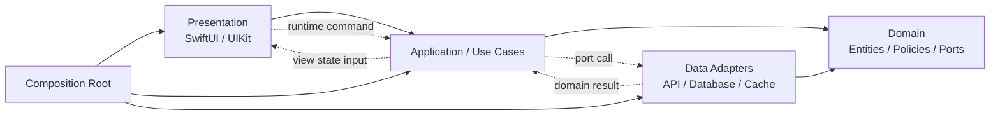
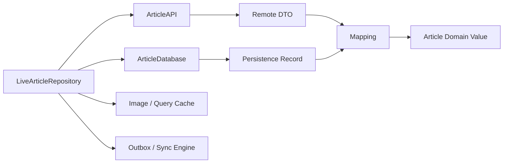
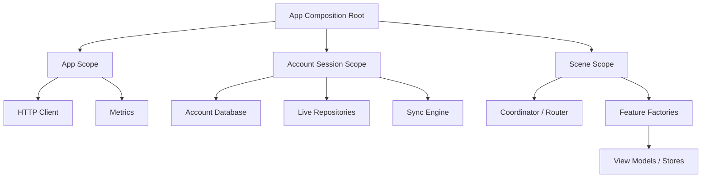
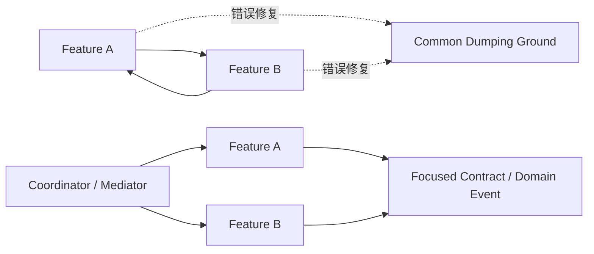

# iOS 分层与依赖设计：从业务边界到 Composition Root

> 分层的价值不是让项目出现更多 `Manager`、Protocol 和文件夹，而是让变化停留在正确边界：UI 框架变化不改业务规则，存储和网络实现不泄漏到 Feature，测试可以替换外部系统，依赖对象只在一个 Composition Root 中组装。Dependency Rule 约束的是源码认知和编译依赖方向，不是要求运行时数据只能单向流动。

---

## 一、问题背景：代码为什么会越改越难

一个文章收藏功能最初可能只有一个 View Controller：

```text
Button -> URLSession -> JSONDecoder -> UserDefaults -> reloadData()
```

随着需求增长，它开始支持 SwiftUI、离线缓存、多账号、乐观更新、Widget 和后台同步。若仍把所有逻辑写在页面中，会出现：

- View 直接拼 URL、解析错误并操作 Core Data Context；
- Domain Model 引入 SwiftUI、UIKit、URLSession 或 SwiftData；
- 每个页面各自实现缓存、重试和 Token 刷新；
- `Repository` 变成包含几十个无关方法的全局对象；
- Protocol 到处都是，但 Live 实现仍通过 Singleton 隐式获取；
- 测试必须启动数据库和网络才能验证一条收藏规则；
- Feature A 导入 Feature B，B 又反向导入 A；
- 为解决循环依赖创建一个不断膨胀的 `Common` 模块。

本文解决以下问题：

- Presentation、Domain 和 Data 各自应拥有何种状态与规则？
- Dependency Rule 是“外层依赖内层”，还是所有调用只能向内？
- Repository 应抽象数据来源，还是生成通用 CRUD？
- 何时值得创建 Use Case，何时只是无意义转发？
- Dependency Injection 与 Service Locator 有何区别？
- Composition Root 为什么应尽量唯一且靠近 App 入口？
- Module Boundary 与目录分组、Swift Package 有什么区别？
- Public API 如何防止框架类型和实现细节外泄？
- 循环依赖应通过职责调整解决，还是抽取 Shared Module？

本文以 Swift 6、iOS 17+ 为示例基线，原则同时适用于 UIKit 与 SwiftUI。示例使用 Protocol、Actor 和 `@MainActor` 表达隔离边界；实际诊断受 Swift Language Mode、SDK Annotation 与模块设置影响，应在项目工具链下开启 Complete Strict Concurrency 验证。

### 核心结论

1. Presentation 负责 View State、用户事件和 UI 生命周期，不拥有网络协议、数据库 Schema 或跨页面长期业务事实。
2. Domain 负责业务词汇、不变量和决策，尽量由无 UI/存储框架依赖的 Sendable Value 构成。
3. Data 负责远端、本地、缓存、同步和错误映射，不能把 DTO、Managed Object 或 HTTP 细节泄漏给 Domain/UI。
4. Dependency Rule 约束源码依赖指向稳定的业务抽象。运行时控制流可以外出调用 Adapter，再把结果返回内层。
5. Repository 是领域语义的数据边界，不应机械生成 `create/read/update/delete` 或成为所有数据源的巨型门面。
6. Use Case 适合封装跨实体、跨 Repository、权限、事务或可复用业务流程；单纯一行转发不必强制包装。
7. Dependency Injection 是从外部提供协作者，Constructor Injection 最易验证。环境容器和全局 Singleton 容易退化为 Service Locator。
8. Composition Root 负责选择 Live/Test 实现、配置生命周期和组装对象图；业务代码不应在内部重新组装依赖。
9. Module Boundary 是职责、所有权和 Public Contract 的边界，不等于每层都必须成为独立 Swift Package。
10. Public API 应最小化并使用领域 Value/Protocol，避免暴露 UIKit、Core Data、SwiftData、第三方 SDK 和内部错误类型。
11. 循环依赖是边界或所有权模糊的信号。优先重画职责、反转依赖或通过中介协议通信，而不是把代码搬进 `Common`。

---

## 二、总体结构：源码依赖向内，数据流可以往返



实线表示源码/构建依赖，虚线表示运行时调用和数据返回。Data Adapter 实现 Domain/Application 定义的 Port，因此源码上是 Data 依赖抽象，而不是 Domain 依赖 URLSession 或数据库实现。Composition Root 知道所有具体类型，是依赖图唯一允许“看见外层细节”的位置。

### 2.1 三层还是四层

简单 Feature 可用 Presentation、Domain、Data 三层；当业务流程较多时，可把 Application/Use Case 独立出来：

- **Domain**：纯业务规则和实体；
- **Application**：用例编排、事务边界、权限与 Port；
- **Infrastructure/Data**：技术实现；
- **Presentation**：交互与界面状态。

不需要为了模板制造空层。判断标准是变化原因和测试边界，而不是某种架构图规定了几层。

---

## 三、Presentation：把 UI 状态与业务事实分开

Presentation 包含：

- View/View Controller/Scene；
- ViewModel、Presenter 或 Store；
- Loading、Empty、Error、Selection 等 View State；
- 用户 Event 到 Command 的转换；
- 页面 Task、订阅、导航和可访问性状态；
- Domain Result 到本地化展示模型的映射。

Presentation 不应直接知道：

- API Path、Header、Status Code；
- Core Data Entity、`NSManagedObjectContext`、SwiftData `ModelContext`；
- Keychain Query、SQLite SQL；
- Token Refresh、Retry、Cache Invalidation 实现；
- 跨设备冲突的底层协议。

```swift
@MainActor
final class ArticleListModel {
    enum State: Equatable {
        case idle
        case loading
        case content([ArticleRowState])
        case empty
        case failed(message: String)
    }

    private let loadArticles: LoadArticlesUseCase
    private var loadTask: Task<Void, Never>?
    private(set) var state: State = .idle

    init(loadArticles: LoadArticlesUseCase) {
        self.loadArticles = loadArticles
    }

    func reload() {
        loadTask?.cancel()
        state = .loading
        loadTask = Task {
            do {
                let articles = try await loadArticles.execute()
                try Task.checkCancellation()
                state = articles.isEmpty
                    ? .empty
                    : .content(articles.map(ArticleRowState.init))
            } catch is CancellationError {
                return
            } catch {
                state = .failed(message: present(error))
            }
        }
    }

    deinit {
        loadTask?.cancel()
    }
}
```

`@MainActor` 保护 UI 状态，却不自动取消 Unstructured Task，因此 Model 持有 Handle。`present(error)` 负责本地化和场景文案，网络层返回结构化错误，不直接弹 Toast。

### 3.1 View State 不是 Domain Model

Domain `Article` 可包含 ID、标题、收藏事实和 Revision；`ArticleRowState` 则包含截断文本、图标、可访问性标签和按钮是否可用。把后者放进 Domain 会让业务层依赖 UI；把服务器 DTO 直接用于 View 又会让后端字段变化传播到整个界面。

---

## 四、Domain：业务语言与不变量

Domain 层应表达产品真正关心的概念：Article、Draft、Favorite Intent、Sync Conflict、Permission、Revision，而不是 HTTP `200` 或数据库 Row。

```swift
struct Article: Sendable, Equatable, Identifiable {
    let id: UUID
    var title: String
    var isFavorite: Bool
    var revision: Int
}

enum FavoriteDecision: Sendable, Equatable {
    case apply(newValue: Bool, basedOnRevision: Int)
    case reject(reason: FavoriteRejection)
}

struct FavoritePolicy: Sendable {
    func decide(
        article: Article,
        requestedValue: Bool,
        permissions: ArticlePermissions
    ) -> FavoriteDecision {
        guard permissions.canEdit else {
            return .reject(reason: .forbidden)
        }
        return .apply(
            newValue: requestedValue,
            basedOnRevision: article.revision
        )
    }
}
```

这类纯规则不需要 MainActor、URLSession 或数据库即可测试。Domain 不一定“完全没有 Foundation”，`UUID`、`Date` 等 Value 可合理使用；重点是不依赖外层框架和 I/O 实现。

### 4.1 Domain Service 的边界

当规则不自然属于单个 Entity，可用 Domain Service/Policy。不要把所有函数都叫 Service，更不要让 Domain Service 内部访问 Singleton API。需要外部数据的规则通过参数或 Port 获取，让依赖在签名中可见。

---

## 五、Data：协调外部事实与本地状态

Data 层包括：

- API Client、Request/Response DTO；
- Core Data/SwiftData/SQLite/File/Keychain Adapter；
- Cache 与 Cache Invalidation；
- Repository Live 实现；
- Outbox、同步器与冲突映射；
- Transport/Storage Error 到领域错误的转换。



Data 层不能把 `ArticleResponseDTO`、`ArticleMO` 或 `ArticleRecord` 直接返回给上层。Mapper 是 Anti-corruption Boundary：验证字段、处理旧 Schema，并构建合法 Domain Value。

### 5.1 Data Source 不是 Repository

- Remote Data Source 处理 API 协议；
- Local Data Source 处理数据库/文件；
- Repository 决定读取本地、刷新远端、事务写入、缓存与同步的一致性策略。

若把每个 Data Source 都叫 Repository，调用方仍要自己组合缓存和网络，抽象没有承担一致性责任。

---

## 六、Dependency Rule：依赖稳定抽象，而不是目录方向

Dependency Rule 的目标是让不稳定技术细节依赖稳定业务策略：

```text
UIKit / SwiftUI ----> Application / Domain
URLSession Adapter --> Application / Domain Port
SwiftData Adapter ---> Application / Domain Port
```

运行时 Use Case 当然会调用 Repository 实现，关键是编译期 Use Case 只认识抽象。具体实现由 Composition Root 注入。

### 6.1 抽象放在哪里

Protocol 通常放在使用者一侧，即定义业务所需能力的 Domain/Application 模块，而不是提供实现的 Infrastructure 模块：

```swift
protocol ArticleRepository: Sendable {
    func observeArticles() -> AsyncStream<[Article]>
    func refresh() async throws
    func setFavorite(
        articleID: Article.ID,
        value: Bool,
        expectedRevision: Int
    ) async throws
}
```

接口使用领域语言，没有 `URLRequest`、`NSManagedObject` 或 `ModelContext`。实现模块导入这个 Protocol 并适配实际系统。

### 6.2 Dependency Inversion 不等于 Protocol Everywhere

以下情况无需抽象：

- 模块内部不会替换的纯 Value/算法；
- 标准库和稳定系统 Value；
- 没有边界价值、只有一个调用点的一行转发；
- Protocol 仅逐方法复制 Concrete Type，且使用方仍依赖实现语义。

抽象应隔离真实变化、I/O 或 Ownership，不是为提高 Protocol 数量。

---

## 七、Repository：围绕领域集合和一致性语义

Repository 给上层一种“访问领域集合”的错觉，但内部可能组合本地数据库、网络、缓存和同步队列。它应明确：

- 谁是 UI 直接读取源与跨设备权威源；
- Freshness、Stale 和 Loading 如何表达；
- 写操作是即时确认、Optimistic 还是 Durable Pending；
- Timeout/Unknown Outcome 如何对账；
- 多账号如何隔离；
- 取消如何传播；
- 错误如何映射。

### 7.1 避免 Generic CRUD Repository

```swift
// 问题：没有表达查询、事务、版本或同步语义。
protocol Repository {
    associatedtype Model
    func create(_ value: Model) async throws
    func read(id: String) async throws -> Model?
    func update(_ value: Model) async throws
    func delete(id: String) async throws
}
```

收藏、下单、同步草稿和读取分页的约束完全不同。更好的 API 使用业务 Command：`setFavorite(expectedRevision:)`、`submitOrder(idempotencyKey:)`、`resolveConflict(...)`。这让调用方无法轻易绕过不变量。

### 7.2 Repository 生命周期

Repository 往往拥有数据库观察、Sync Engine 或 Cache，生命周期可能是账号级而非页面级。页面只借用它，不应在每次 View 重建时创建。账号切换时 Composition Root/Session Scope 应停止旧任务、关闭 Store 并创建新 Graph。

---

## 八、Use Case：业务流程的显式入口

Use Case 适合以下情况：

- 编排多个 Repository/Service；
- 执行权限、业务 Policy 与事务；
- 处理幂等、补偿或同步状态；
- 同一流程由多个 UI 入口复用；
- 需要独立测试和审计。

```swift
struct ToggleFavoriteUseCase: Sendable {
    let repository: any ArticleRepository
    let permissions: any ArticlePermissionProvider
    let policy: FavoritePolicy

    func execute(article: Article) async throws {
        let access = try await permissions.permissions(for: article.id)
        let decision = policy.decide(
            article: article,
            requestedValue: !article.isFavorite,
            permissions: access
        )

        switch decision {
        case let .apply(value, revision):
            try await repository.setFavorite(
                articleID: article.id,
                value: value,
                expectedRevision: revision
            )
        case let .reject(reason):
            throw FavoriteError.rejected(reason)
        }
    }
}
```

Use Case 不是 UI Helper，也不返回本地化字符串。异步 Use Case 必须传播 Cancellation，不捕获页面对象，并在跨 `await` 后考虑 Revision 是否仍有效。

### 8.1 何时省略 Use Case

如果 Feature 只是读取 Repository 的一个稳定 Stream，没有额外规则或复用价值，ViewModel 可直接依赖 Repository Port。为每个 Repository 方法制造同名 Use Case 会增加导航和构造成本，却没有新增边界。

---

## 九、Dependency Injection：让依赖可见

### 9.1 Constructor Injection 优先

```swift
final class ArticleFeatureFactory {
    private let repository: any ArticleRepository

    init(repository: any ArticleRepository) {
        self.repository = repository
    }

    @MainActor
    func makeListModel() -> ArticleListModel {
        ArticleListModel(
            loadArticles: LoadArticlesUseCase(repository: repository)
        )
    }
}
```

构造函数明确对象在有效状态下需要什么，测试无需修改全局变量。Method Injection 适合单次输入，Property Injection 适合框架创建对象后必须补齐的窄边界，但会引入“尚未注入”的非法状态。

### 9.2 Environment 与 Service Locator

SwiftUI Environment 适合沿 View Tree 传递已由上层拥有的依赖，但不自动确定实例生命周期。若业务代码可随时调用：

```swift
ServiceContainer.shared.resolve(ArticleRepository.self)
```

依赖从函数签名消失，测试顺序与全局状态耦合，这就是 Service Locator 风险。即使使用 DI Container Library，也应只在 Composition Root 解析，向业务对象仍使用 Constructor Injection。

### 9.3 Factory Closure 与生命周期

需要每次创建新页面对象时，可注入 `@Sendable` Factory Closure；需要账号级 Singleton 时，由 Session Scope 缓存实例。不要让 Container 默认 Scope 决定业务生命周期，Owner 必须显式设计。

---

## 十、Composition Root：唯一组装位置

Composition Root 通常位于 App 入口、Scene/Session 创建处或每个独立 Extension 的入口。它负责：

- 读取 Build/Runtime Configuration；
- 创建 URLSession、Database、Keychain Adapter；
- 组装 Repository 和 Use Case；
- 建立 App/Account/Scene/Feature Scope；
- 选择 Live、Preview、Test 实现；
- 启动和停止 Sync/Monitoring；
- 注入 Root View/Coordinator。



### 10.1 Scope 与清理

- App Scope：配置、共享 Transport、日志；
- Account Scope：Token、账号数据库、Repository、Sync Engine；
- Scene Scope：Navigation、窗口状态；
- Feature Scope：ViewModel、页面 Task 和临时状态。

注销不是只把 Token 设为 `nil`。Root 应取消账号任务、等待或终止 Sync、关闭 Store、清理账号缓存，再释放整个 Account Graph。这样比让每个 Service 监听全局 Logout Notification 更可验证。

### 10.2 每个进程都有自己的 Root

Widget、Share Extension 和主 App 是独立进程，应各自组装最小依赖图。Extension 不应初始化完整 App Graph，也不能依赖主 App 内存 Singleton；共享通过 App Group/Keychain Access Group 和版本化协议完成。

---

## 十一、Module Boundary：先逻辑隔离，再决定物理拆分

模块边界回答：

- 谁拥有这组业务能力？
- 允许哪些模块导入它？
- Public Contract 是什么？
- 数据和资源如何跨边界？
- 谁负责发布、测试与迁移？

一个目录不是编译边界；Swift Target/Package 才能由编译器强制访问控制和依赖图。但过早把每个小层拆成 Package 会增加 Manifest、资源、构建设置、Mock 和跨模块泛型成本。

### 11.1 合理拆分信号

- 稳定业务边界和明确 Owner；
- 需要阻止反向 Import；
- 多个 App/Extension 复用；
- 独立构建、测试或发布收益明确；
- API 足够小且变化节奏独立；
- 编译性能证据支持拆分。

### 11.2 不应拆分的信号

- 只有一两个类型且只被单 Feature 使用；
- API 尚未稳定，拆分导致频繁跨包修改；
- 为满足架构图而形成大量一行 Adapter；
- 所有模块都依赖一个巨大的 `Core/Common/Utils`；
- 无 Owner，无 Public API Review，也无依赖规则检查。

后续“模块化与依赖管理”会展开 Feature/Core/Interface Module 与 Build Time；本文只关注架构职责和依赖方向。

---

## 十二、Public API：边界应小而有语义

模块 Public API 包括 `public` 类型、Protocol、Error、Resource、Notification、URL Route 和可序列化 Payload。每个公开符号都会形成兼容和认知成本。

### 12.1 不要泄漏实现类型

```swift
// 问题：上层被迫依赖 Core Data。
public func fetchArticles() async throws -> [ArticleMO]

// 改进：返回领域值或受控快照。
public func fetchArticles() async throws -> [Article]
```

同样，不应让 Feature API 暴露 `URLRequest`、`HTTPURLResponse`、SwiftData Model、第三方 SDK Callback 或内部 DI Container。边界错误映射为稳定的 Public Error Category，并保留必要的 Retry/Conflict 信息。

### 12.2 Interface Segregation

读取页面只需 `ArticleReading`，编辑流程才需 `ArticleEditing`。把 40 个方法放进一个 Protocol，会迫使 Test Double 实现无关成员，也让依赖权限过宽。按消费者能力拆分小接口，但避免拆成每个方法一个 Protocol。

### 12.3 `internal` 是默认值

Swift 的 `internal` 默认访问控制很适合模块封装。只有跨模块确需使用的符号才 `public`；实现类可保持 `internal`，由 Public Factory 返回 Public Protocol/Value。`open` 允许外部继承/覆写，承诺更强，应谨慎使用。

---

## 十三、循环依赖治理：先找错误的所有权



### 13.1 常见根因

- A 直接创建 B 的页面，B 又调用 A 的 Service；
- Domain 导入 Data Model，Data 又导入 Domain；
- 两个 Feature 共享了一个真正属于第三个业务域的概念；
- Navigation 与业务处理混在 Feature；
- Public API 暴露实现类型，迫使调用方反向导入；
- “工具类”持有 Feature 状态，变成隐式中心。

### 13.2 治理手段

1. **重新划归所有权**：共享概念属于哪一业务域，由 Owner 模块提供；
2. **依赖反转**：高层定义所需 Port，低层实现；
3. **Coordinator/Mediator**：跨 Feature 导航和流程由更高层编排；
4. **Domain Event/Command**：通过小型版本化 Contract 通信，不互相访问内部对象；
5. **Interface Module**：仅在有稳定跨模块契约时抽取，不放实现；
6. **Merge Modules**：若两者总是一起变化且无法形成独立 API，可能本来就是一个边界。

异步事件会降低直接依赖，却引入顺序、重复、丢失、生命周期和错误传播问题。进程内 Notification 不是可靠消息队列；关键业务仍需明确 Command Result 或 Durable Outbox。

### 13.3 自动检查依赖图

在 CI 中禁止不允许的 Import/Target Dependency，输出 Dependency Graph，并检测 Cycle。仅靠 Code Review 很难在大仓库持续维护方向。检查规则要有 Owner 和例外到期时间，避免永久白名单。

---

## 十四、错误、取消与并发如何跨层传播

### 14.1 Error Mapping

```text
URLError / Database Error
    -> Data Error Category
    -> Domain/Application Error
    -> Presentation Message + Recovery Action
```

每层只转换自己理解的信息。Data 保留 `retryAfter`、`unknownOutcome`、`conflictRevision` 等决策字段；Domain 表达权限或不变量；Presentation 决定文案。不要过早压成 String，也不要把完整敏感 Error Body 传遍全栈。

### 14.2 Cancellation

取消从 Presentation Owner 向 Use Case、Repository、Transport/Storage 传播。中间层不使用 `try?` 吞取消。页面取消等待不等于撤销 Durable Outbox；需要业务撤销时调用明确 Use Case。

### 14.3 Actor Isolation

- UI Model：`@MainActor`；
- Token/Cache/Sync Coordinator：适合 Actor；
- Core Data：遵守 Context Queue + `perform`；
- SwiftData：ModelContext/`@ModelActor`；
- 跨层 Value/DTO：`Sendable`；
- 不给 Framework Model 随意添加 `@unchecked Sendable`。

架构分层不会自动解决 Data Race。每个边界仍需明确 Owner、Executor、Task Lifecycle 和 Actor Reentrancy 后的不变量。

---

## 十五、测试策略：按边界替换，不复制整个实现

| 测试层 | 使用的依赖 | 主要验证 |
| --- | --- | --- |
| Domain Unit | 纯 Value / Policy | 不变量、边界条件 |
| Use Case Unit | Repository/Permission Stub | 编排、错误、取消、权限 |
| Repository Integration | Stub Server + 临时真实 Store | 映射、事务、缓存、同步 |
| Presentation Unit | Use Case Stub + Test Clock | View State、旧结果、生命周期 |
| End-to-end | Live Graph/Test Backend | 模块契约和用户流程 |

Test Double 应模拟 Contract，而不是复刻内部算法：

- Stub 返回预设结果；
- Spy 记录 Command 与顺序；
- Fake 提供简化但真实的行为模型；
- Mock 严格交互验证应少用，避免重构脆弱。

测试取消、Timeout 和竞态时注入 Clock、Gate 和 Stable IDs。不要通过全局 Singleton Swap 影响并行测试，也不要只使用 In-memory Database 后宣称 Migration/Transaction 已验证。

---

## 十六、成本与适用边界

### 16.1 分层的收益

- 技术实现可替换且影响范围可控；
- Domain Rule 可快速测试；
- UI 和 Data 可并行演进；
- 依赖和 Ownership 可审计；
- Extension/Widget 可组装最小 Graph；
- 故障更容易定位到边界。

### 16.2 分层的成本

- Mapping、DTO、Protocol 和 Composition 代码；
- 跨层导航与调试路径增加；
- Public API 与版本治理成本；
- 过度抽象会隐藏简单逻辑；
- 模块拆分可能增加 Build 配置与泛型编译成本；
- 团队必须共同理解规则，否则目录迅速腐化。

### 16.3 规模适配

- **小型单页面工具**：Feature 内分 UI/Logic/Data 即可，无需多个 Package；
- **中型 App**：按 Feature + 共享 Platform Adapter，建立 Composition Root 和 Repository Port；
- **大型多团队 App**：明确 Domain/Feature Owner、Interface Module、依赖图 CI 和 API Review；
- **快速原型**：允许暂时合并层，但保留业务与 I/O 的可分离边界，记录升级触发条件。

架构复杂度应由变化频率、团队并行、测试需求和风险驱动，而不是代码行数或流行模式。

---

## 十七、常见误区与修复

### 17.1 每层只做一行转发

**问题：** 增加文件和调用链，没有隔离变化或表达规则。

**修复：** 只在存在独立职责、策略或测试边界时增加层；简单读取可直接依赖 Repository Port。

### 17.2 Domain Model 引入 SwiftData/UIKit

**问题：** 业务规则被 Context、Actor、UI 和 Deployment Target 绑定。

**修复：** Persistence/UI Model 留在 Adapter/Presentation，通过 Mapper 转为 Domain Value。

### 17.3 用 Singleton 作为 Dependency Injection

**问题：** 依赖和生命周期隐藏，测试互相污染，账号切换难以释放旧 Graph。

**修复：** Composition Root 创建 Scoped Instance，Constructor Injection 传入使用方。

### 17.4 为解决 Cycle 创建 Common 模块

**问题：** Common 会吸收业务状态和实现，所有模块反而共同依赖一个不稳定中心。

**修复：** 重画 Ownership，使用小型 Contract、Dependency Inversion、Coordinator，必要时合并本属同一边界的模块。

### 17.5 Repository 返回数据库对象

**问题：** 上层被迫遵守 Context 隔离与持久化生命周期，Data 实现无法替换。

**修复：** 返回 Domain DTO/Value 或受控观察接口，在 Repository 内完成 Mapping。

---

## 十八、工程落地步骤

1. 画出现有 Runtime Flow 和 Compile-time Import Graph；
2. 按业务能力标记 State Owner 与变化原因；
3. 把 UI、业务规则和 I/O 直接耦合处列为边界候选；
4. 在消费者侧定义最小 Port，先用现有实现适配；
5. 建立唯一 Composition Root 和 App/Account/Scene/Feature Scope；
6. 将 DTO/Managed Object 映射为 Domain Value；
7. 为 Error、Cancellation、Revision 和 Unknown Outcome 定义跨层 Contract；
8. 按真实复用/Owner 决定是否拆物理模块；
9. 在 CI 检测禁止 Import、Cycle 和 Public API 增长；
10. 用构建时间、修改影响范围、测试速度和故障指标验证收益。

重构应按业务 Slice 渐进完成，不要先创建所有空目录再搬文件。每一步保持可构建、可测试，并避免在没有指标时同时重写 UI、网络和数据库。

---

## 十九、发布前检查清单

### 19.1 职责

- Presentation 是否只持有 View State 和 UI 生命周期；
- Domain 是否不依赖 UI、Network、Database 实现；
- Data 是否隐藏 DTO、Store Model 和外部 SDK；
- Use Case 是否真正表达流程，而非机械转发；
- Repository 是否有领域语义和一致性契约。

### 19.2 依赖与生命周期

- Protocol 是否位于消费者/策略侧；
- 所有 Live 实现是否只在 Composition Root 组装；
- App/Account/Scene/Feature Scope 是否明确；
- 注销和 Scene 销毁是否取消任务并释放 Graph；
- Extension 是否使用独立最小 Composition Root。

### 19.3 模块与质量

- Public API 是否最小且不泄漏实现类型；
- Dependency Graph 是否无 Cycle 和非法反向 Import；
- `Common/Utils` 是否包含应归属具体 Owner 的业务代码；
- Test Double 是否验证 Contract、支持取消和并发；
- 分层收益是否通过测试速度、构建时间或变更范围验证。

---

## 二十、总结

iOS 分层设计的核心是稳定边界和依赖方向。Presentation 管交互与 View State，Domain 管业务语言和不变量，Data 管外部系统与一致性，Application/Use Case 在需要时编排流程。Repository 以领域语义隐藏数据来源，Dependency Rule 让实现依赖抽象，Composition Root 则成为唯一具体组装位置。

模块化只是加强边界的工具，不是分层的起点。先明确 Ownership、Public API、错误/取消和生命周期，再决定是否拆 Target 或 Package。遇到循环依赖时应调整职责、反转依赖或引入中介 Contract，而不是扩大 Common。好的架构不会消除复杂度，而会让每类复杂度有明确 Owner、可测试入口和有限传播范围。

---

## 问答复盘

### Q1：Dependency Rule 是否要求运行时调用永远只能从外层进入内层？

**答：** 不是。它约束源码依赖方向。内层运行时可通过自己定义的 Port 调用外层 Adapter，结果再返回；内层不需要导入具体实现。

### Q2：为什么 Repository Protocol 通常定义在使用者一侧？

**答：** 抽象应表达业务层真正需要的能力。Data 模块实现它，这样技术实现依赖稳定策略，而 Domain/Application 不依赖 Data 细节。

### Q3：每个 Repository 方法都需要对应一个 Use Case 吗？

**答：** 不需要。Use Case 适合有编排、权限、事务、复用或独立规则的流程；一行转发只增加认知成本。

### Q4：SwiftUI Environment 是否等于 Dependency Injection？

**答：** 它可以传递依赖，但不自动解决创建者和生命周期。实例仍应由 Composition Root/上层 Owner 创建；业务层随时解析全局 Environment 则可能退化为 Service Locator。

### Q5：为什么 Composition Root 可以依赖所有具体模块？

**答：** 它的唯一职责就是选择实现并组装对象图，是系统最外层的 Wiring Code。业务代码不应复制这种知识。

### Q6：Repository 可以直接返回 `NSManagedObject` 或 SwiftData `@Model` 吗？

**答：** 跨层通常不应。它会泄漏 Context/Executor 和存储生命周期。应返回 Domain Value/DTO，或在受控 UI 边界明确使用框架观察能力。

### Q7：拆成多个 Swift Package 是否说明架构已经分层？

**答：** 不说明。Package 只能强化编译边界；若职责、Public API 和依赖方向错误，只会把耦合变成跨包耦合并增加配置成本。

### Q8：两个 Feature 循环依赖时，最先应该做什么？

**答：** 重新检查 Ownership 和流程编排。常见修复是上移 Coordinator、在消费者侧定义小型 Contract、提取真实共享 Domain，或合并本就不可分的边界。

### Q9：给所有 Concrete Type 加 Protocol 是否能提升可测试性？

**答：** 不能保证。只有隔离真实 I/O、变化或 Ownership 的 Protocol 才有价值；逐方法复制实现会增加维护和脆弱 Mock。

### Q10：页面退出后，分层架构会自动取消底层请求吗？

**答：** 不会。Presentation Owner 必须取消 Task，Use Case、Repository 和 Transport 继续传播取消；Durable Outbox 等业务操作是否撤销则由单独用例决定。

---

## 延伸知识

- **UI 架构模式**：MVC、MVVM、Coordinator、Redux/UDF、TCA 与 VIPER 的适用边界；
- **状态建模**：Domain/View State、State Machine、Reducer、Derived State 与过期异步结果；
- **模块化与依赖管理**：Feature/Core/Interface Module、Build Time、Resource 与 Ownership；
- **并发边界**：MainActor、ModelActor、Sendable、Cancellation 与 Actor Reentrancy；
- **数据边界**：Repository、Offline-first、Transactional Outbox 与 Conflict Resolution。
