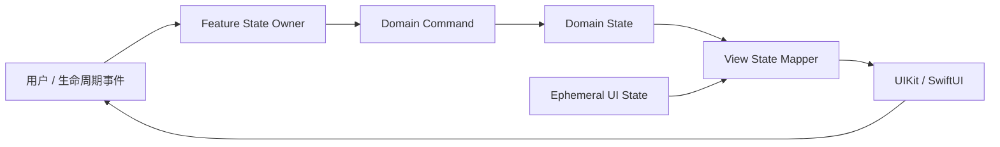
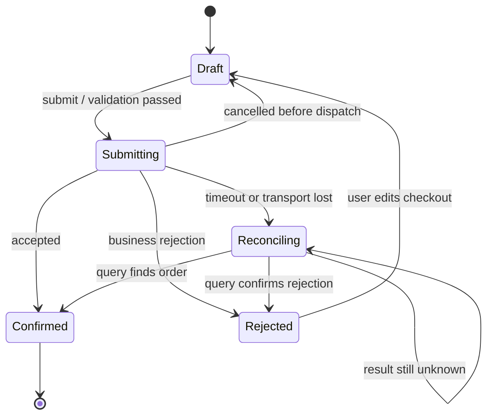
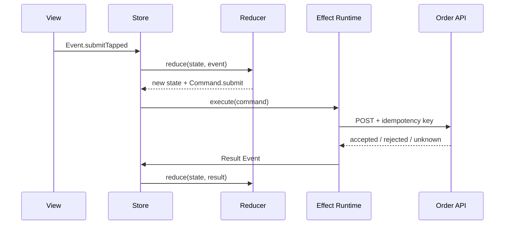
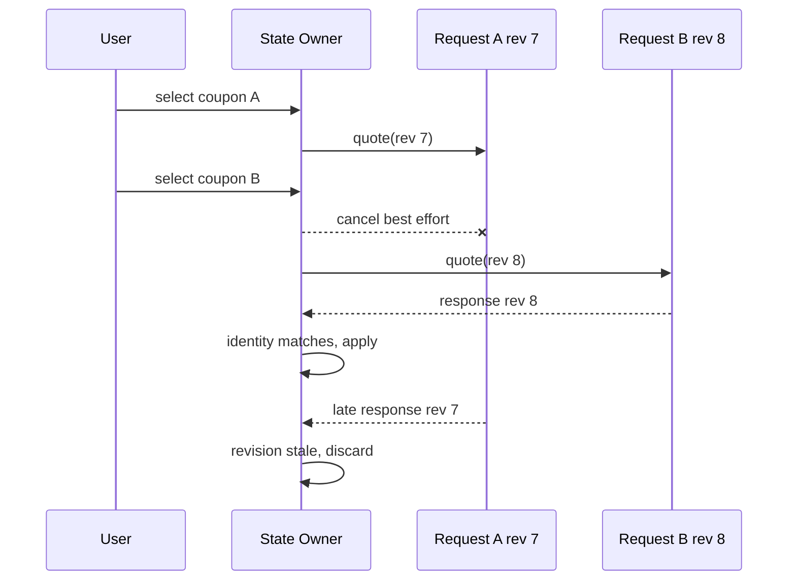
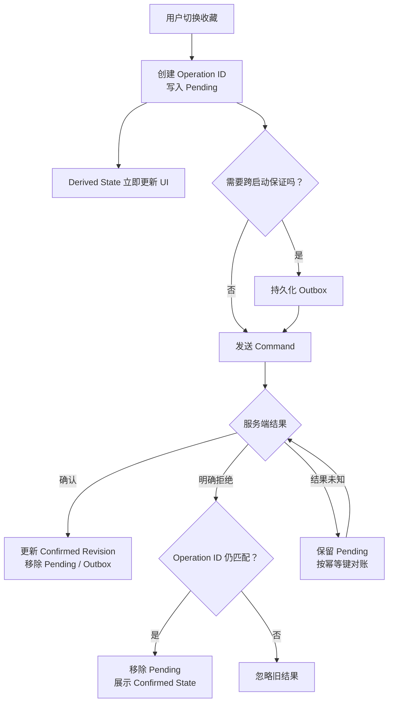

# iOS 状态建模：从 Impossible State 到异步一致性

> 状态建模不是把页面属性集中进一个 `State` 结构体，而是明确“哪些事实由谁拥有、能以何种事件改变、哪些组合合法、异步结果何时仍然有效”。可靠的模型让非法状态难以表达，让状态转换可测试，并为取消、旧响应、乐观更新和失败恢复留下明确路径。

---

## 一、问题背景：Bug 往往藏在状态组合里

考虑一个离线可用的订单确认页：

- 首次进入时加载商品、地址与价格；
- 用户可切换优惠券，系统异步重新计价；
- 点击提交后生成订单，网络超时不能简单判断失败；
- 收藏商品采用乐观更新，失败时回滚；
- 页面退出后取消展示层请求，但已持久化的待提交操作仍要继续同步；
- App 重启后恢复草稿，账号切换后不能复用旧 Session 数据。

若用一组互不约束的布尔值描述页面，很快会出现：

```swift
var isLoading = false
var isEmpty = false
var isSubmitting = false
var errorMessage: String?
var order: Order?
```

这些字段允许 `isLoading == true`、`isEmpty == true`、`order != nil`、`errorMessage != nil` 同时成立。开发者必须在每条赋值路径上维持隐含不变量，任何漏改都会产生 Impossible State（业务上不可能或不应允许的状态）。

本文以 Swift 6、iOS 17+ 为示例基线，原则同时适用于 UIKit、SwiftUI、MVVM 和单向数据流（Unidirectional Data Flow，UDF）。示例中的状态类型与 Reducer 是自定义的轻量模型，不依赖特定架构库；若使用 TCA 等第三方库，应以项目锁定版本的文档为准。

### 核心结论

1. Domain State 表达业务事实与不变量，View State 表达某个界面的展示快照；两者可以映射，但不应互相冒充。
2. 按生命周期区分 Persistent、Session 与 Ephemeral State，决定其 Owner、存储、清理和恢复策略。
3. `Loading / Content / Empty / Error` 通常是互斥阶段，应优先用关联值枚举表达，而不是多个布尔值。
4. State Machine 必须列出状态、事件、守卫条件和副作用；非法迁移应被拒绝或记录，而非悄悄修补。
5. Derived State 应从权威事实计算，不重复持久化；昂贵计算可缓存，但缓存需要明确失效依据。
6. Event 描述已经发生的输入，Command 表达希望系统执行的意图；Command 可能失败、取消或产生未知结果。
7. Reducer 负责纯状态转换和 Effect 描述，不直接访问网络、数据库、当前时间或随机数。
8. 取消请求不能阻止服务端已经完成；通过请求身份、Revision 和业务实体身份拒绝过期结果。
9. 乐观更新不是“先改 UI，失败改回来”这么简单，还需要 Operation ID、基线、并发合并、持久 Outbox 与对账策略。
10. 状态模型的质量应通过转换测试、竞态测试、恢复测试和观测数据验证，而不是仅看类型是否优雅。

---

## 二、先区分 Domain State 与 View State

### 2.1 Domain State：业务世界中的事实

Domain State 应使用业务语言描述可跨界面复用的事实和规则，例如：

```swift
struct Checkout: Equatable, Sendable {
    enum Submission: Equatable, Sendable {
        case draft
        case submitting(operationID: UUID)
        case awaitingReconciliation(operationID: UUID)
        case confirmed(orderID: UUID)
        case rejected(reason: RejectionReason)
    }

    var cart: Cart
    var shippingAddress: Address?
    var selectedCouponID: UUID?
    var quote: Quote?
    var submission: Submission
}
```

`awaitingReconciliation` 很重要：请求超时或连接断开只说明客户端没有收到确定结果，不代表服务端没有创建订单。Domain State 需要表达这种“结果未知”，而不是强行归类为失败。

Domain State 通常不应包含：

- `UIColor`、`UIImage`、`UIViewController` 或 SwiftUI `View`；
- 本地化后的提示文案；
- Skeleton 是否显示、Sheet 是否展开；
- `URLSessionTask`、数据库 Context 等技术对象；
- 仅为某个布局服务的行高和动画标记。

### 2.2 View State：界面当前如何呈现

View State 是 Domain State、权限、Feature Flag 和本地交互状态的展示投影：

```swift
struct CheckoutViewState: Equatable, Sendable {
    enum Screen: Equatable, Sendable {
        case loading
        case content(Content)
        case empty(message: String)
        case failed(message: String, canRetry: Bool)
    }

    struct Content: Equatable, Sendable {
        var rows: [CartRowViewState]
        var totalText: String
        var submitTitle: String
        var canSubmit: Bool
        var isSubmitting: Bool
    }

    var screen: Screen
    var focusedField: Field?
    var presentedSheet: Sheet?
}
```

同一份 Domain State 可以映射为 iPhone、iPad、Widget 或 VoiceOver 不同的 View State。View State 中出现格式化文案没有问题，但它不应反向成为订单金额、提交结果等业务事实的唯一来源。

### 2.3 两者如何同步



关键路径是：View 发送事件，唯一 Owner 执行转换；业务 Command 更新 Domain State；Mapper 联合 Domain 与局部 UI 状态生成 View State。View 不应绕过 Owner 直接修改 Domain State，Mapper 也不应产生网络或数据库副作用。

---

## 三、按生命周期分类：Persistent、Session 与 Ephemeral

状态的生命周期比“放在哪个属性包装器里”更重要。

| 类型 | 示例 | 典型 Owner | 结束与恢复 |
| --- | --- | --- | --- |
| Persistent State | 草稿、已提交操作、同步游标 | Repository / Durable Store | 跨进程恢复，需 Schema 与迁移 |
| Session State | 当前账号、授权能力、内存缓存 | Account Session / Scene Session | 登出、账号切换或 Session 失效时清除 |
| Ephemeral State | 焦点、拖拽进度、Toast、Sheet | View / Feature Store | 页面或 Scene 结束时丢弃 |

### 3.1 Persistent State 不等于“所有状态落盘”

只有进程结束后仍有业务价值、且能可靠恢复的事实才应持久化。持久化会引入 Schema、迁移、加密、容量、损坏恢复和多进程一致性成本。把 `isLoading` 或格式化字符串写入磁盘，恢复后通常已经失真。

待提交操作应保存业务 Command 的必要参数、幂等键和创建时间，而不是保存一个运行中的 `Task`：

```swift
struct PendingOrderSubmission: Codable, Sendable {
    let operationID: UUID
    let checkoutID: UUID
    let quoteRevision: Int
    let idempotencyKey: String
    let createdAt: Date
}
```

### 3.2 Session State 必须绑定身份

内存缓存若没有账号身份和环境信息，登出再登录另一账号时可能泄漏前一个账号的数据。缓存键至少应包含其真实隔离维度，例如 `accountID + resourceID + locale`。Token 等敏感凭据应按安全需求放入 Keychain，而不是因为“要跨启动”就统一使用 `UserDefaults`。

### 3.3 Ephemeral State 也需要 Owner

键盘焦点适合由 View 或 Feature 拥有；跨页面路由由 Scene/Coordinator 拥有；短暂 Toast 不应进入 Domain。SwiftUI 的 `@State`、`@SceneStorage`、Observation 与 UIKit 属性只是承载手段，不自动决定状态分类。

---

## 四、Loading、Content、Empty、Error：先判断是否互斥

典型首次加载可以建模为：

```swift
enum Loadable<Value: Equatable & Sendable>: Equatable, Sendable {
    case idle
    case loading
    case content(Value)
    case empty
    case failed(message: String)
}
```

但这不是万能模板。已有内容的后台刷新失败时，若切换到全屏 `failed`，用户会失去仍然可用的数据。更准确的模型可以把“内容阶段”和“刷新活动”拆成两个正交维度：

```swift
struct ArticleListState: Equatable, Sendable {
    enum Content: Equatable, Sendable {
        case initial
        case loading
        case empty
        case loaded([ArticleSummary])
        case unavailable(message: String)
    }

    enum Refresh: Equatable, Sendable {
        case idle
        case refreshing(requestID: UUID)
        case failed(message: String)
    }

    var content: Content = .initial
    var refresh: Refresh = .idle
}
```

原则不是“凡状态必用 Enum”，而是：

- 互斥阶段用 Enum，消除非法组合；
- 真正独立、可以同时存在的维度分别建模；
- Error 要说明影响范围：全屏失败、局部失败还是后台刷新失败；
- Content 与 Empty 的判断基于业务语义，而非简单 `items.isEmpty`。过滤结果为空与数据源本身为空，通常需要不同提示和操作。

---

## 五、State Machine：把隐含流程变成显式迁移

订单提交不是一个 `isSubmitting` 布尔值，而是一台有限状态机。



图中的 `cancelled before dispatch` 有严格边界：客户端取消只在 Command 尚未越过不可撤销边界时才能确定回到 `Draft`。一旦请求可能抵达服务端，就必须依赖幂等键查询最终结果，不能仅因本地 Task 被取消而允许重复创建订单。

### 5.1 状态机的四个组成部分

1. **State**：系统现在处于什么阶段；
2. **Event**：已经发生了什么；
3. **Guard**：当前条件是否允许迁移；
4. **Effect**：迁移后需要请求外部世界做什么。

```swift
enum SubmissionEvent: Equatable, Sendable {
    case submitTapped(operationID: UUID)
    case accepted(operationID: UUID, orderID: UUID)
    case rejected(operationID: UUID, reason: RejectionReason)
    case outcomeUnknown(operationID: UUID)
    case reconciliationFound(operationID: UUID, orderID: UUID)
}
```

事件携带 `operationID`，因此旧操作的结果不能错误完成新操作。Guard 则验证地址、库存快照、计价 Revision 与提交状态。

### 5.2 非法迁移怎么处理

对外部重复回调或旧结果，可明确忽略并记录诊断信息；对内部不变量破坏，测试环境应尽早失败。不要在所有非法迁移上使用 `fatalError`，因为生产环境中的远端重复消息、恢复数据和乱序结果本来就可能发生，需要可恢复处理。

---

## 六、Impossible State：让类型替你维护不变量

### 6.1 关联值靠近其有效状态

错误信息只在失败时有效，订单 ID 只在确认后有效。把它们放进对应 Case：

```swift
enum PaymentState: Equatable, Sendable {
    case notStarted
    case authorizing(attemptID: UUID)
    case authorized(paymentID: UUID)
    case declined(reason: DeclineReason)
    case outcomeUnknown(attemptID: UUID)
}
```

这比 `isPaid + isPaying + paymentID? + error?` 更难构造矛盾状态，也迫使调用方穷举处理新增阶段。

### 6.2 类型不能替代所有运行时校验

“金额必须大于零”“优惠券适用于当前商品”“服务器 Quote 尚未过期”依赖运行时数据，不能只靠 Enum 证明。可使用可失败构造器或 Domain Command 集中维护：

```swift
struct OrderAmount: Equatable, Sendable {
    let minorUnits: Int64

    init?(minorUnits: Int64) {
        guard minorUnits > 0 else { return nil }
        self.minorUnits = minorUnits
    }
}
```

目标不是让非法状态在任何情况下都无法出现，而是缩小可写入口，让校验位置明确且可测试。

---

## 七、Derived State：保存事实，不保存可推导副本

假设状态已经保存 `items`、`shippingFee` 和 `discount`，就不应再保存一份可独立修改的 `displayTotal`：

```swift
struct Quote: Equatable, Sendable {
    var itemSubtotal: Decimal
    var shippingFee: Decimal
    var discount: Decimal

    var total: Decimal {
        itemSubtotal + shippingFee - discount
    }
}
```

Derived State 的收益是消除同步路径。常见派生项包括：

- `canSubmit`：地址有效、Quote 新鲜且当前未提交；
- `isEmpty`：已完成首次加载且数据源为空；
- 排序、过滤后的展示集合；
- 按钮标题、Badge、权限提示；
- 某个 Child Feature 的局部投影。

### 7.1 何时缓存派生结果

如果派生计算经过测量确实昂贵，可以 Memoization，但缓存键必须覆盖所有输入，失效规则必须明确。对大量列表，应先用 Instruments 或 Signpost 测量计算次数和耗时，再决定增量索引、数据库查询或缓存；不要因 Computed Property “看起来会重复执行”就预先复制状态。

服务端 Quote 是带 Revision 和有效期的业务事实，不是本地金额字段的普通派生结果。价格、税费等由服务端裁决时，客户端本地计算只能用于预览，提交仍需绑定服务端 Quote。

---

## 八、Event 与 Command：事实和意图区分开

Event 与 Command 在不同架构中命名可能不同，但语义应清楚：

- **Event**：已经发生，例如 `submitTapped`、`sceneBecameActive`、`quoteResponseReceived`；
- **Command**：请求执行，例如 `submitOrder`、`refreshQuote`、`persistOutboxOperation`；
- **Effect Result Event**：外部执行结果重新进入状态机，例如 `submissionAccepted`。



Reducer 不假装 Command 已经成功。它先把状态推进到 `submitting`，Runtime 执行外部 I/O，再将结果作为新 Event 回送。这样调用方向单一，失败和取消也成为正常状态转换。

Command 名称应表达业务意图，而不是 UI 控件，例如使用 `submitOrder`，不要使用 `didTapBlueButton`。相反，原始 View Event 可以保留交互语义，由 Reducer 判断它是否产生 Command。

---

## 九、Reducer：纯转换与 Effect 描述

Reducer 的核心形式是：

```text
(旧 State, Event) -> (新 State, [Effect Description])
```

下面的示例只展示提交主链路：

```swift
struct CheckoutFeature: Sendable {
    struct State: Equatable, Sendable {
        var checkoutID: UUID
        var quoteRevision: Int
        var hasValidAddress: Bool
        var submission: Submission = .draft
    }

    enum Submission: Equatable, Sendable {
        case draft
        case submitting(operationID: UUID)
        case reconciling(operationID: UUID)
        case confirmed(orderID: UUID)
        case rejected(message: String)
    }

    enum Event: Equatable, Sendable {
        case submitTapped(operationID: UUID)
        case submitAccepted(operationID: UUID, orderID: UUID)
        case submitRejected(operationID: UUID, message: String)
        case submitOutcomeUnknown(operationID: UUID)
    }

    enum Effect: Equatable, Sendable {
        case submit(
            checkoutID: UUID,
            quoteRevision: Int,
            operationID: UUID
        )
        case reconcile(checkoutID: UUID, operationID: UUID)
    }

    static func reduce(state: inout State, event: Event) -> [Effect] {
        switch event {
        case let .submitTapped(operationID):
            guard state.hasValidAddress,
                  case .draft = state.submission else { return [] }

            state.submission = .submitting(operationID: operationID)
            return [.submit(
                checkoutID: state.checkoutID,
                quoteRevision: state.quoteRevision,
                operationID: operationID
            )]

        case let .submitAccepted(operationID, orderID):
            guard case .submitting(operationID) = state.submission else {
                return []
            }
            state.submission = .confirmed(orderID: orderID)
            return []

        case let .submitRejected(operationID, message):
            guard case .submitting(operationID) = state.submission else {
                return []
            }
            state.submission = .rejected(message: message)
            return []

        case let .submitOutcomeUnknown(operationID):
            guard case .submitting(operationID) = state.submission else {
                return []
            }
            state.submission = .reconciling(operationID: operationID)
            return [.reconcile(
                checkoutID: state.checkoutID,
                operationID: operationID
            )]
        }
    }
}
```

Reducer 没有读取 `Date.now`、生成 UUID、调用 Repository 或启动 `Task`。时间、UUID、网络和数据库由外部注入；测试可以输入固定 Event，精确断言状态与 Effect。

### 9.1 Runtime 才拥有异步任务

Effect Runtime 需要处理：

- Effect ID 与同类任务取消策略；
- Task 的 Owner 和优先级；
- Error 到领域 Result Event 的映射；
- 超时与“结果未知”的区别；
- 页面退出、账号切换和 App 后台化；
- 日志脱敏与 Trace ID；
- 将 Result Event 送回正确 Store/Actor。

Store 若被 UI 观察，通常由 `@MainActor` 隔离；网络 Repository 可以是 `Sendable` 类型或 Actor。`@MainActor` 只约束隔离访问，不意味着 Reducer 中可以执行同步磁盘 I/O 或昂贵计算。

---

## 十、异步结果过期：Cancellation 不等于时序正确

用户快速切换优惠券 A、B，两个计价请求可能按 B、A 的顺序返回。仅取消 A 不够，因为：

- 请求可能已发送，服务端仍会执行；
- 某些 API 不响应 Swift Task 取消；
- 回调可能已进入队列；
- 缓存或数据库观察也会产生旧快照。

### 10.1 使用 Revision 和 Identity 验证结果

```swift
struct QuoteRequest: Equatable, Sendable {
    let checkoutID: UUID
    let revision: Int
    let couponID: UUID?
}

struct QuoteResponse: Equatable, Sendable {
    let request: QuoteRequest
    let quote: Quote
}

mutating func apply(_ response: QuoteResponse) {
    guard response.request.checkoutID == checkoutID,
          response.request.revision == quoteRevision,
          response.request.couponID == selectedCouponID else {
        return
    }
    quote = response.quote
}
```

每次影响计价的输入变化都递增 `quoteRevision`。结果必须同时匹配业务实体、Revision 和关键输入。只比较“最后一个 Task”可能在页面复用、账号切换或同 ID 不同环境时仍然出错。



取消用于节省资源，Revision 用于保证正确性，两者职责不同。

### 10.2 Actor Reentrancy 仍需重新验证

Actor 方法在 `await` 时允许其他任务进入。即使 State Owner 是 Actor，`await` 前读取的条件也可能在恢复时失效。因此应在 `await` 后重新比较 Revision 或 Operation ID。串行隔离解决数据竞争，不自动解决逻辑竞态。

---

## 十一、乐观更新与回滚：把待确认操作建模出来

收藏按钮常采用乐观更新：用户点击后立即变化，网络失败再恢复。但直接记录一个 `oldValue` 存在问题：失败返回前用户可能又点击了一次，旧请求的回滚会覆盖新意图。

### 11.1 显式区分确认状态和待处理操作

```swift
struct FavoriteState: Equatable, Sendable {
    struct Pending: Equatable, Sendable {
        let operationID: UUID
        let desiredValue: Bool
        let baseRevision: Int
    }

    var confirmedValue: Bool
    var confirmedRevision: Int
    var pending: Pending?

    var displayedValue: Bool {
        pending?.desiredValue ?? confirmedValue
    }
}
```

用户看到 `displayedValue`，服务端确认事实保存在 `confirmedValue`。某个请求失败时，只能清理由相同 `operationID` 标识的 Pending；如果用户已经产生新操作，旧失败不能回滚新状态。

### 11.2 完整流程



如果业务要求离线继续操作或 App 退出后重试，Pending Command 必须进入持久化 Outbox。若只是非关键的瞬时 UI 偏好，可以由 Feature Task 管理，不必承担持久化成本。

### 11.3 Rollback 也可能失败

回滚不是总能恢复到旧世界：库存、权限或服务端版本可能已经改变。常见策略包括：

- **明确拒绝**：移除 Pending，回到最新 Confirmed State，并给出局部错误；
- **冲突**：拉取服务端新版本，按业务规则合并或请求用户选择；
- **结果未知**：保留 Operation ID，通过幂等查询对账；
- **连续切换**：合并为最终期望值，或按顺序发送并验证 Revision；
- **关键交易**：不要用简单 UI 回滚伪装事务，使用服务端幂等、状态查询和补偿流程。

乐观更新适合成功率高、反馈应即时且操作可对账的场景。付款、永久删除等高风险操作若缺乏幂等与补偿协议，不应只靠客户端乐观状态保证正确性。

---

## 十二、状态所有权与作用域

状态应由与其生命周期最接近、又能维护完整不变量的对象拥有：

```text
App Scope       配置、全局能力，不应塞入所有 Feature 数据
Scene Scope     导航栈、窗口选择、多窗口草稿引用
Account Scope   当前身份、权限、账号缓存与同步会话
Feature Scope   页面流程、请求 Revision、局部 Selection
View Scope      焦点、动画、手势瞬时进度
Repository      持久业务事实、缓存与同步元数据
```

“单一事实源”不等于所有状态放进一个全局 Store。它意味着对某项事实只有一个权威可写 Owner。其他位置可以持有只读 Snapshot、Binding、ID 或 Derived State。

SwiftUI Binding 暴露的是写入通道，应只提供子 View 真正有权修改的局部状态。UIKit Delegate、Closure 和 Notification 同样可能形成隐式多写入口；跨模块事件应使用类型化契约，并明确谁接受和裁决状态改变。

---

## 十三、常见错误与修复

### 13.1 用多个布尔值描述互斥阶段

**问题：** `isLoading`、`hasError`、`isEmpty` 可同时为真。

**修复：** 用带关联值的 Enum 表达互斥阶段；仅把真正正交的刷新、分页等维度拆开。

### 13.2 Domain Model 保存格式化 View 文案

**问题：** 业务状态被 Locale 和界面变化污染，也无法供其他端复用。

**修复：** Domain 保存金额、状态码和领域原因，View State Mapper 负责本地化和展示。

### 13.3 Reducer 内启动 `Task`

**问题：** 转换不再纯净，执行顺序、取消与测试不可控。

**修复：** Reducer 返回 Effect Description，由 Runtime 执行并把结果转换成 Event。

### 13.4 只靠 Task Cancellation 防止旧响应

**问题：** 取消是 Best Effort，已经发出的请求或 Actor 恢复仍可能写入旧结果。

**修复：** 同时校验 Entity Identity、Request ID、Revision 和当前状态。

### 13.5 乐观失败直接赋值 `oldValue`

**问题：** 旧请求失败会覆盖用户后续操作。

**修复：** 分离 Confirmed 与 Pending State，结果只处理匹配的 Operation ID，并按 Revision 对账。

### 13.6 将所有状态持久化

**问题：** 恢复出过期 Loading、错误文案和 UI 细节，增加迁移与隐私风险。

**修复：** 只持久化跨启动仍有业务意义的事实和 Durable Command，恢复时重新派生 View State。

---

## 十四、测试与验证方法

### 14.1 Reducer 转换表测试

对每个 `(State, Event)` 断言新 State 和 Effect，至少覆盖：

- 合法迁移；
- Guard 拒绝；
- 重复 Result；
- 错误 Operation ID；
- 新增 Enum Case 的穷举处理；
- Error、Cancellation 与 Unknown Outcome。

```swift
import Testing

@Test
func staleSubmissionResultDoesNotConfirmNewOperation() {
    let checkoutID = UUID()
    let oldOperationID = UUID()
    let currentOperationID = UUID()
    let orderID = UUID()
    var state = CheckoutFeature.State(
        checkoutID: checkoutID,
        quoteRevision: 3,
        hasValidAddress: true,
        submission: .submitting(operationID: currentOperationID)
    )

    let effects = CheckoutFeature.reduce(
        state: &state,
        event: .submitAccepted(
            operationID: oldOperationID,
            orderID: orderID
        )
    )

    #expect(state.submission == .submitting(
        operationID: currentOperationID
    ))
    #expect(effects.isEmpty)
}
```

### 14.2 可控竞态测试

不要用真实 `sleep` 猜测返回顺序。使用可注入 Repository、Test Clock 或 Continuation Gate：先启动 Revision 7，再启动 Revision 8；先释放 8 后释放 7，验证最终状态仍是 8。还应覆盖页面消失、账号切换、Store 释放和 Task 取消。

### 14.3 持久化与恢复测试

- 在写 Outbox 后、发请求前终止进程；
- 服务端成功但客户端未记录结果时终止；
- 重启后以相同幂等键查询或重试；
- Schema 升级、数据损坏与账号切换；
- Pending 与服务端 Revision 冲突。

### 14.4 性能如何测量

状态建模本身不保证更快。应在目标设备、Release 或接近 Release 的配置下测量：

- Reducer 单次与批量处理耗时；
- SwiftUI Body Evaluation 或 UIKit Diffable Snapshot 应用次数；
- State 复制、比较和 Action 日志带来的 CPU/内存；
- 大列表 Derived State 的计算次数；
- Observer 范围是否导致无关界面更新。

用 Instruments 的 Time Profiler、Points of Interest/Signpost、Allocations 和 SwiftUI Instrument 定位成本。记录设备、系统版本、构建配置、数据规模、样本次数和统计口径，再比较优化前后结果。不要用 Debug 模式的一次体感宣称某状态框架更快。

### 14.5 生产观测

可记录经过脱敏和限量的：

- 非法或被忽略的状态迁移计数；
- Stale Result 丢弃率；
- Pending Operation 年龄与对账耗时；
- 乐观回滚率和冲突率；
- Unknown Outcome 最终分布。

不要把完整 State、Token、地址、支付数据或用户输入直接写入日志。Operation ID 和 Trace ID 也应按隐私与保留策略治理。

---

## 十五、工程落地步骤

1. 列出现有可写字段、持有者和生命周期，找出重复事实源；
2. 将状态分为 Persistent、Session、Feature 与 View Ephemeral；
3. 标记互斥字段组合，改为关联值 Enum；
4. 为关键业务流程画 State Machine，补齐失败、取消和未知结果；
5. 把可推导字段改为 Derived State，明确昂贵计算的测量方法；
6. 将输入统一为 Event，将外部工作描述为 Command/Effect；
7. 提取纯 Reducer，依赖从 Effect Runtime 或 Use Case 注入；
8. 为异步请求加入 Entity Identity、Revision 和 Operation ID；
9. 为乐观更新设计 Confirmed/Pending/Outbox/对账，而非只保存旧值；
10. 用转换表、受控乱序、进程恢复和生产指标验证模型。

不必一次把所有 ViewModel 改写为 Redux。可以先从事故最多的流程开始：消除互斥布尔值、给异步结果加 Revision，再逐步提取纯转换。状态复杂度低的静态页面，简单 ViewModel 或 Controller 已经足够。

---

## 十六、总结

状态建模的核心是把事实、生命周期和合法迁移写进类型与边界。Domain State 维护业务不变量，View State 服务具体呈现；Persistent、Session 与 Ephemeral State 分别由合适 Scope 管理；互斥阶段用状态机消除 Impossible State，Derived State 避免产生第二份事实源。

面对异步系统，Reducer 的纯净只是起点。Command 必须有 Owner、身份、取消和结果回流；Revision 拒绝旧响应；未知结果通过幂等查询对账；乐观更新通过 Confirmed、Pending 和 Outbox 管理确认与回滚。最终应以竞态、恢复、性能与生产观测验证模型是否可靠，而不是以 State 类型的数量衡量架构质量。

---

## 问答复盘

### Q1：Domain State 与 View State 的根本区别是什么？

**答：** Domain State 表达业务事实和不变量，View State 是面向特定界面的展示投影。金额和订单状态属于 Domain，本地化文案、焦点和 Sheet 属于 View。

### Q2：`Loading / Content / Empty / Error` 是否总应放进同一个 Enum？

**答：** 只有互斥阶段才应放在同一 Enum。已有内容时的后台刷新错误可与 Content 同时存在，应作为独立正交维度建模。

### Q3：为什么 `isLoading + data? + error?` 容易产生 Impossible State？

**答：** 它允许多个互相矛盾的字段组合，正确性依赖每条赋值路径手工维护。关联值 Enum 能让数据只存在于有效阶段，并迫使调用方穷举处理。

### Q4：Derived State 是否永远不能缓存？

**答：** 可以缓存，但要先证明计算成本真实存在，并让缓存键覆盖所有输入、失效规则可验证。缓存仍是派生副本，不能成为新的权威事实。

### Q5：Event 和 Command 有什么边界？

**答：** Event 描述已经发生的输入，Command 表达希望外部系统执行的意图。Command 可能失败、取消或结果未知，其结果应作为新的 Event 回到状态机。

### Q6：Reducer 为什么不应直接调用 Repository 或读取当前时间？

**答：** 这些操作引入副作用和不确定性，使同一输入无法稳定得到同一输出。Reducer 应返回 Effect 描述，时间、UUID 和 I/O 通过 Runtime 注入。

### Q7：取消旧 Task 后还需要 Revision 吗？

**答：** 需要。取消只是节省资源的 Best Effort，无法保证请求未执行或回调不再到达；Revision 和 Identity 才负责拒绝过期结果。

### Q8：使用 Actor 是否自动消除了异步结果覆盖？

**答：** 没有。Actor 防止数据竞争，但方法在 `await` 时可重入，恢复后原条件可能失效，仍需比较 Revision 或 Operation ID。

### Q9：收藏请求失败时，为什么不能直接恢复点击前的值？

**答：** 用户可能已经进行了下一次操作。只有失败结果的 Operation ID 仍与当前 Pending 匹配时才能回滚，否则会用旧失败覆盖新意图。

### Q10：提交订单超时后应立即回到可提交状态吗？

**答：** 通常不应。超时可能是结果未知，服务端可能已经创建订单。应保留幂等键进入对账状态，确认未创建后才允许安全重试。

---

## 延伸知识

- **UI 架构模式**：MVVM、UDF、TCA、状态所有权与 Effect Runtime；
- **Swift Concurrency**：结构化并发、取消传播、Actor Reentrancy 与 `Sendable`；
- **数据一致性**：事务、幂等、Outbox、冲突检测与迁移恢复；
- **SwiftUI 更新机制**：Observation、Identity、Binding、Derived View 与更新范围；
- **测试设计**：Test Clock、依赖注入、可控 Continuation 与状态机属性测试。
