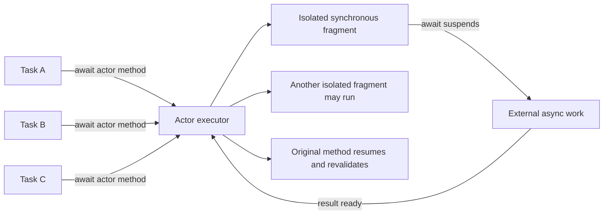
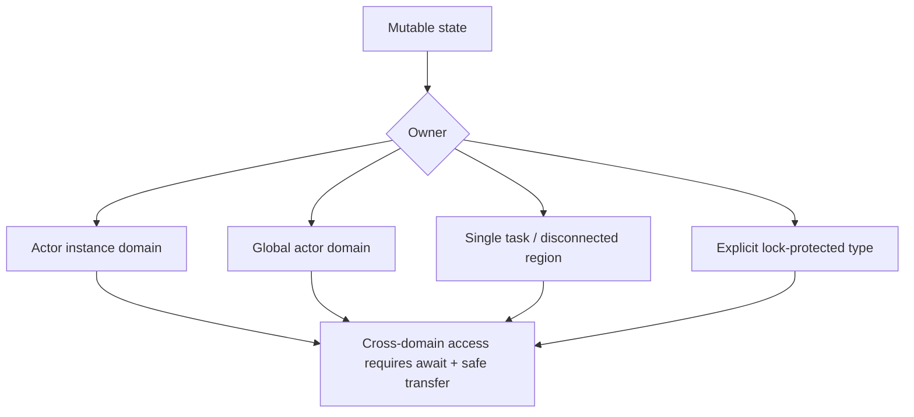
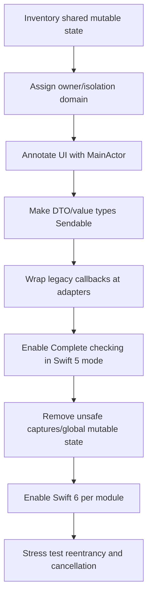

# Swift Actor 隔离：从数据竞争安全到重入竞态治理

> Actor 的核心不是“内部自带一把锁”，而是让可变状态属于一个编译器可检查的隔离域：只有运行在该 Actor 上的代码可以直接访问隔离状态，跨域调用必须经过异步边界，传递的值还要满足 `Sendable` 等安全契约。Actor 可以消除大量 Data Race，却不保证一个 `async` 方法从头到尾原子执行；每个 `await` 都可能允许其他任务进入并改变状态。工程上必须同时设计隔离边界与业务不变量，否则代码虽然通过 Swift 6 严格并发检查，仍会发生旧请求覆盖、新账号读到旧缓存或重复提交。

---

## 一、本文解决什么问题

Swift 6 工程中经常遇到这些问题：

- Actor 是否等价于 Serial Dispatch Queue 或 Mutex？
- Actor 方法是否固定在同一线程执行？
- 为什么跨 Actor 调用一个没有写 `async` 的方法仍要 `await`？
- Actor 能否保证 `await` 前读取的状态在恢复后仍有效？
- `@MainActor` 是否只用于 View Controller，网络和 ViewModel 应如何分层？
- `MainActor.run`、`Task { @MainActor in }` 和给类型标 `@MainActor` 有什么差别？
- 多个数据库 Service 如何共享一个 Global Actor，而不是各自创建 Actor？
- 什么是 Isolation Domain，值跨域时为什么需要 `Sendable`？
- `Sendable` 是否意味着对象绝对不可变或内部没有 Lock？
- 为什么 `@unchecked Sendable` 能消除编译错误，却可能留下真实 Data Race？
- `nonisolated` 能访问哪些成员，何时会破坏封装？
- Objective-C Delegate 没有并发标注、回调线程不固定时，如何进入 MainActor？
- Swift 5 Language Mode 只有 Warning，Swift 6 为什么变成 Error？
- `@preconcurrency import` 是兼容手段，还是线程安全修复？
- Xcode 26/Swift 6.2 的 Default Actor Isolation 设置为何会改变同一段源码的诊断？

这些问题需要同时区分三层安全：

1. **Memory Safety / Data Race Safety**：是否存在未同步的并发读写；
2. **Isolation Correctness**：代码是否在正确 Actor/Global Actor 上访问状态；
3. **Business Consistency**：跨 `await` 后结果是否仍属于当前请求、账号和状态版本。

本文以 Swift 6 Language Mode、Complete Strict Concurrency、iOS 17+ 为主要验证基线，示例按 Xcode 26.1.1、Apple Swift 6.2.1 与 iOS Simulator SDK 编写。Swift Concurrency 的 Executor、Job Queue、Priority Escalation、Region-based Isolation 分析和 MainActor 与 Main Thread 的底层调度细节会随 Toolchain 演进；文章依赖的是语言公开隔离语义。编译诊断还受 Swift Language Mode、`SWIFT_STRICT_CONCURRENCY`、Default Actor Isolation、Upcoming Features、SDK Annotation 与第三方模块标注影响，迁移时必须记录实际 Build Settings。

### 核心结论

1. Actor 是引用类型和隔离域。Actor-isolated Mutable State 只能由该 Actor 上的代码直接访问；外部调用经过 Actor Executor 调度，不能把 Actor 理解为固定线程。
2. Actor 同一时刻不会并发执行两个 Actor-isolated Synchronous Fragment，但 `await` 会把方法切成多个可重入片段。Actor 防 Data Race，不保证整个 Async Method 原子。
3. 跨 Actor 调用即使目标方法声明中没有 `async`，调用点也通常需要 `await`，因为调用方必须异步等待目标 Actor 获得执行机会。
4. MainActor 是标准 Global Actor，用于隔离 UI 和其他主执行域状态。Async MainActor Code 由 MainActor Executor 调度；不要用 `Thread.isMainThread` 替代编译期隔离契约。
5. 给整个 UI Model 标 `@MainActor` 通常比零散给 Setter 加标注更清楚，但同步 CPU 重任务若写在其隔离方法中仍会阻塞主执行环境；网络 Await 本身通常不会在等待期间占用 Main Thread。
6. `MainActor.run` 同步地执行一个 MainActor-isolated Async Context 片段并等待结果；`Task { @MainActor in }` 创建新的 Unstructured Task，调用方不自动等待，错误、取消和顺序语义不同。
7. Custom Global Actor 让多个类型共享同一个语义隔离域，适合数据库/特定旧 SDK 等必须串行访问的系统边界。不要为所有业务创建一个巨大全局 Actor。
8. Isolation Domain 可以是 Actor Instance、Global Actor、Nonisolated Context 或 Task-owned Region。跨域传递值必须证明不会产生并发别名，通常通过 `Sendable`、Actor Reference 或编译器 Region Analysis 完成。
9. `Sendable` 表示值可以安全跨并发域传递，不等于 Deeply Immutable。Value Type 通常要求成员 Sendable；Reference Type 可通过不可变状态、内部同步或 Actor Isolation 达成。
10. Actor Type 本身可安全作为引用跨域传递，因为其隔离状态仍需通过 Actor Boundary 访问；这不意味着内部属性可以从外部直接读写。
11. `@Sendable` Closure 限制捕获值必须可安全跨域。捕获 UIView、Mutable Class 或未隔离变量通常会在 Swift 6 报错，而不是靠 Weak Capture 自动变安全。
12. `@unchecked Sendable` 是开发者对编译器的人工承诺，不添加 Lock、Copy 或 Runtime Check。只有经过审计且所有可变状态受同步保护时才能使用。
13. Actor Reentrancy 要求 `await` 后重新验证 Version、Identity、Authorization 和 Invariant。典型修复包括 Revision、In-flight Task Coalescing、两阶段提交或把不可分割状态变更留在无 `await` 的隔离片段。
14. `nonisolated` 成员不需要 Actor Hop，适合只依赖 Sendable Immutable Data 的协议要求、日志标识和纯计算。它不能无保护访问 Actor-isolated Mutable State。
15. Objective-C Callback 的 Queue/Thread 与调用次数必须按 API 文档处理。对任意线程回调使用 `nonisolated` Adapter，复制/验证 Sendable Input 后显式 Hop 到 MainActor/Actor；`Task { @MainActor in }` 会改变为异步调度。
16. `MainActor.assumeIsolated` 只适合外部契约已保证当前就在 MainActor、但编译器无法表达的窄边界；错误假设可能触发 Runtime Failure，不能用来绕过未知线程 Callback。
17. Swift 5 Mode 的 Warning 或 `@preconcurrency` 抑制不代表代码安全。Swift 6 将更多潜在 Data Race 提升为 Error；迁移应先画状态所有权和隔离边界，再处理诊断。
18. 编译器能证明 Data Race Safety，但不能证明业务时序正确。Actor 中的余额检查、Token 刷新、页面请求等跨 Await 流程仍需要状态机和并发测试。

---

## 二、Actor 隔离的执行模型



Actor 保证的是 Actor-isolated Fragment 不并发重叠访问状态，而不是：

- 每个 Actor 独占一条 Thread；
- 方法按调用墙钟时间严格 FIFO 完成；
- Async Method 从入口到 Return 不可插入其他任务；
- 自动取消重复请求；
- 自动维护业务事务。

Runtime 可以在不同 Thread 上执行同一 Actor 的不同片段。隔离正确性应由类型系统表达，不依赖 Thread ID 或 Queue Label。

---

## 三、Actor：把可变状态放进明确所有者

### 3.1 基本 Actor

```swift
actor InventoryStore {
    private var quantities: [UUID: Int] = [:]

    func quantity(for productID: UUID) -> Int {
        quantities[productID, default: 0]
    }

    func restock(productID: UUID, amount: Int) throws {
        guard amount > 0 else { throw InventoryError.invalidAmount }
        quantities[productID, default: 0] += amount
    }
}
```

外部访问：

```swift
let current = await inventory.quantity(for: productID)
try await inventory.restock(productID: productID, amount: 5)
```

`quantity` 和 `restock` 的声明不含 `async`，但跨 Actor 调用需要等待其隔离域可执行，因此调用点是 `await`。若从 `InventoryStore` 的另一个 Isolated Method 调用，则已在同一隔离域，不需要 Hop。

### 3.2 Actor Reference 与状态

Actor Reference 可以在 Task/Actor 之间共享，安全性来自访问受隔离，并非复制 Actor。不要暴露内部 Mutable Reference：

```swift
// 高风险设计：返回的可变引用可能逃出隔离域。
actor BadStore {
    private var buffer = NSMutableData()
    func rawBuffer() -> NSMutableData { buffer }
}
```

在 Complete Strict Concurrency 下，这类 Non-Sendable Result 跨边界会受到诊断。修复是返回 Sendable Value Snapshot、在 Actor 内完成操作，或用独立同步类型明确所有权。

### 3.3 Actor 不是数据库事务

Actor 只串行化进程内隔离片段，不能替代：

- 数据库 Transaction/Constraint；
- 跨进程 File Lock；
- Server Idempotency；
- 多设备一致性；
- Durable Storage。

库存 Actor 的内存检查与 Server 扣减之间存在 Await 时，仍需要服务端原子性。

---

## 四、MainActor：UI 与主执行域隔离

### 4.1 类型级 MainActor

```swift
@MainActor
final class ProfileViewModel {
    enum State {
        case idle
        case loading
        case loaded(Profile)
        case failed(String)
    }

    private(set) var state: State = .idle
    private var loadTask: Task<Void, Never>?

    func load(userID: UUID) {
        loadTask?.cancel()
        state = .loading

        loadTask = Task { [weak self] in
            guard let self else { return }
            do {
                let profile = try await repository.profile(id: userID)
                try Task.checkCancellation()
                state = .loaded(profile)
            } catch is CancellationError {
                return
            } catch {
                state = .failed(error.localizedDescription)
            }
        }
    }

    deinit {
        loadTask?.cancel()
    }
}
```

整个类型隔离后，调用方、Closure 和协议实现的要求更明确。`Task` 在 MainActor Context 中创建，继承 MainActor Isolation；网络请求 Await 期间 Actor 可执行其他任务。Repository 的同步重 CPU 工作不能偷偷写在 MainActor 方法里。

### 4.2 `MainActor.run`

```swift
let profile = try await repository.profile(id: userID)

await MainActor.run {
    viewModel.apply(profile)
}
```

调用方 Await MainActor Closure 完成后再继续，适合从 Nonisolated Async Context 提交一个短 UI 片段。若大量操作都要反复 `MainActor.run`，通常说明类型/方法应该直接声明 `@MainActor`。

### 4.3 `Task { @MainActor in }`

```swift
Task { @MainActor [weak viewController] in
    viewController?.show(result)
}
```

它创建一个新的 Unstructured Task：调用点立即继续，错误和取消不自动回传，多个 Callback 的任务顺序也不应被当作事务保证。只用于 Callback Adapter 等边界，并由生命周期/Identity 防晚到。

### 4.4 MainActor 与 Main Thread

对现代 Async Swift Concurrency Code，MainActor 是主执行隔离契约，UIKit/UI 工作应依赖它。仍需理解边界：

- 旧 Swift 5 同步调用链可能缺少完整隔离检查；
- Objective-C Runtime 不理解 Swift Actor Annotation；
- `@MainActor` 同步 Closure 被错误地从未检查旧 API 调用时，诊断取决于 Annotation/Language Mode；
- 不应因为 `Thread.isMainThread == true` 就认为当前拥有 MainActor Isolation；
- 也不应通过 `DispatchQueue.main.async` 到处代替类型级 MainActor 设计。

---

## 五、Global Actor：多个类型共享一个隔离域

### 5.1 定义 Custom Global Actor

```swift
@globalActor
actor DatabaseActor {
    static let shared = DatabaseActor()
}

@DatabaseActor
final class UserRecordStore {
    private var records: [UUID: UserRecord] = [:]

    func record(id: UUID) -> UserRecord? {
        records[id]
    }

    func save(_ record: UserRecord) {
        records[record.id] = record
    }
}

@DatabaseActor
struct DatabaseMigration {
    static func runIfNeeded() throws {
        // Access the same database isolation domain.
    }
}
```

两个类型标同一 Global Actor 后可以在该域内同步协作，外部调用需要 Await。

### 5.2 Global Actor 的适用范围

适合：

- 一个不支持并发访问的数据库连接/旧 SDK；
- 多个类型必须共享同一串行域；
- 跨类型协议明确要求同一 Isolation。

不适合：

- 把整个 Data Layer 全放一个 Actor，导致无关业务互相阻塞；
- 用 Global Actor 掩盖 Repository 的线程安全问题；
- 在 Global Actor 内执行长同步 I/O/CPU；
- 把跨进程一致性误当进程内串行。

### 5.3 MainActor 是 Global Actor

MainActor 是语言/标准库提供的 Global Actor。`@MainActor` 类型之间共享同一主隔离域，而不是每个 ViewModel 拥有独立 Actor Queue。

---

## 六、Isolation Domain：谁可以同步访问这份状态



### 6.1 Actor Instance 是不同隔离域

```swift
let first = InventoryStore()
let second = InventoryStore()
```

两个 Actor Instance 各自隔离，可以并发执行。Actor Type 相同不代表共享同一 Serial Domain；需要共享域时传同一 Instance 或使用 Global Actor。

### 6.2 隔离成员分类

- Actor Stored Mutable Property：Actor-isolated；
- Actor Instance Method：默认 Actor-isolated；
- `@MainActor`/Custom Global Actor Member：对应 Global Actor-isolated；
- `nonisolated` Member：不属于 Actor Executor；
- Local Immutable Value：通常属于当前 Task/Region；
- Lock-protected Class：编译器不自动理解所有自定义同步，可能需审计后的 Sendable Conformance。

### 6.3 Region-based Isolation

现代 Swift 编译器可在部分场景证明一个 Non-Sendable Value 尚未形成并发别名，从而允许安全 Transfer。诊断能力随 Toolchain 演进，不应通过“当前编译器没报错”推导类型可任意跨任务共享；公开 API 仍应优先设计清晰 Sendable Value/Actor Ownership。

---

## 七、Sendable：跨隔离传递的类型契约

### 7.1 Value Type

```swift
struct SearchRequest: Sendable {
    let query: String
    let page: Int
    let accountID: UUID
}
```

成员均可安全跨域，编译器可检查合成 Conformance。若包含 Non-Sendable Mutable Class，Conformance 会失败或需要重新设计。

### 7.2 Reference Type

安全的 Final Immutable Reference：

```swift
final class APIEndpoint: Sendable {
    let baseURL: URL
    let headers: [String: String]

    init(baseURL: URL, headers: [String: String]) {
        self.baseURL = baseURL
        self.headers = headers
    }
}
```

Reference Type 也可内部用 Lock 保护可变状态：

```swift
final class CancellationFlag: @unchecked Sendable {
    private let lock = NSLock()
    private var cancelled = false

    func cancel() {
        lock.withLock { cancelled = true }
    }

    var isCancelled: Bool {
        lock.withLock { cancelled }
    }
}
```

这里使用 `@unchecked`，因为编译器无法验证 Lock Protocol。审计要求：所有访问都在 Lock 内、没有返回内部 Mutable Reference、Callback 不在持锁时调用、Subclass 不可破坏不变量。

### 7.3 Actor Reference

Actor Reference 可以跨域传递；调用其 Isolated Method 仍需 Await。Actor 内部 Non-Sendable State 没有逃逸时可以安全存在。

### 7.4 `@Sendable` Closure

```swift
func perform(
    operation: @escaping @Sendable (SearchRequest) async throws -> Void
) {
    // Store or execute across concurrency domains.
}
```

`@Sendable` 限制 Capture：

```swift
var count = 0

Task.detached {
    // Swift 6: concurrently capturing/mutating local var is unsafe.
    count += 1
}
```

Weak Capture 只改变 Retention，不使 Mutable Object 自动 Sendable。UIView Weak Reference 仍然只能在 MainActor 上使用。

### 7.5 Sendable 不保证业务正确

一个 `struct TransferRequest: Sendable` 可安全复制到多个 Task，但两次请求仍可能重复扣款。Sendable 解决跨域 Memory Safety，不解决 Idempotency、Authorization 或 Transaction。

---

## 八、Data Race Safety：Actor 能解决什么

### 8.1 Data Race 定义

当多个并发执行上下文访问同一内存位置，至少一个是 Write，且缺少有效同步，就可能发生 Data Race。结果包括：

- 读取撕裂/旧值；
- Collection 内部损坏；
- Use-after-free；
- 难以复现的 Crash；
- Undefined Behavior。

Actor、Lock、Atomics、Immutable Value Transfer 都可建立同步/所有权边界。

### 8.2 Actor 串行化隔离片段

```swift
actor Counter {
    private var value = 0

    func increment() {
        value += 1
    }

    func snapshot() -> Int {
        value
    }
}
```

多个 Task 并发 `await counter.increment()` 不会同时修改 `value`。但调用完成顺序不应被用于业务排序，除非另有 Sequence/ID Contract。

### 8.3 Data Race 与 Race Condition

```text
Data Race：无同步并发访问同一内存，语言级不安全。
Logical Race：每次访问都隔离正确，但事件顺序造成错误业务结果。
```

Actor 重点解决前者；Reentrancy、重复提交和旧结果覆盖属于后者。

---

## 九、Reentrancy：await 把方法切成多个事务片段

### 9.1 典型余额竞态

```swift
actor Wallet {
    private var balance: Decimal
    private let paymentService: PaymentService

    func pay(amount: Decimal) async throws {
        guard balance >= amount else { throw PaymentError.insufficientFunds }

        try await paymentService.authorize(amount: amount)

        balance -= amount
    }
}
```

两个 `pay` 调用都可能在第一个 Await 前看到足够 Balance，然后都去授权，恢复后分别扣款。没有 Data Race，但业务不变量被破坏。

### 9.2 修复不能只加 Actor

方案取决于业务：

- **预留再 Await**：先在 Actor 内扣减/冻结额度，失败后补偿；
- **状态机**：记录 Pending Payment ID，禁止冲突操作；
- **Revision**：Await 后检查状态版本，不匹配则拒绝提交；
- **合并 In-flight Task**：相同 Key 共享一次操作；
- **Server Transaction/Idempotency**：最终一致性由服务端保证；
- **无 Await Critical Fragment**：把本地不可分割变更放在同步 Actor Method。

### 9.3 预留模式

```swift
actor Wallet {
    private var available: Decimal
    private var reservations: [UUID: Decimal] = [:]

    func pay(amount: Decimal) async throws {
        let paymentID = UUID()
        try reserve(amount: amount, paymentID: paymentID)

        do {
            try await paymentService.authorize(
                id: paymentID,
                amount: amount
            )
            commit(paymentID: paymentID)
        } catch {
            rollback(paymentID: paymentID)
            throw error
        }
    }

    private func reserve(amount: Decimal, paymentID: UUID) throws {
        guard available >= amount else {
            throw PaymentError.insufficientFunds
        }
        available -= amount
        reservations[paymentID] = amount
    }

    private func commit(paymentID: UUID) {
        reservations[paymentID] = nil
    }

    private func rollback(paymentID: UUID) {
        guard let amount = reservations.removeValue(forKey: paymentID) else {
            return
        }
        available += amount
    }
}
```

本地不变量改善了，但生产支付仍需 Server Idempotency、超时后的未知状态查询、App Crash 后 Durable Reservation 和补偿重试。内存 Actor 不是金融事务。

### 9.4 Actor 不承诺公平性/严格 FIFO

Runtime Scheduling、Priority、Suspension 和 Reentrancy 会影响执行顺序。若业务要求 Order，应显式建 Sequence Number、Queue State Machine 或 Durable Log。

---

## 十、nonisolated：从隔离域中安全地拿出成员

### 10.1 适合纯值描述

```swift
actor ImageCache: CustomStringConvertible {
    nonisolated let name: String
    private var entries: [URL: Data] = [:]

    init(name: String) {
        self.name = name
    }

    nonisolated var description: String {
        "ImageCache(\(name))"
    }
}
```

`description` 不需要 Await，因为只读取不可变、可安全访问的 `name`。不能在其中读取 `entries.count`，因为 `entries` 是 Actor-isolated Mutable State。

### 10.2 Protocol Conformance

某些同步 Protocol Requirement 不能 Await Actor。可选方案：

- Requirement 只需 Immutable Snapshot：实现为 `nonisolated`；
- Protocol 本身标 Actor/Global Actor；
- 提供 Async Requirement；
- 用 Adapter 缓存 Sendable Snapshot；
- 不让 Actor 直接 Conform。

不要为满足同步 Protocol 把 Mutable State 标成 `nonisolated(unsafe)`。

### 10.3 `nonisolated(unsafe)`

它抑制部分隔离检查，不添加同步。只适合底层代码已由外部 Lock/Runtime Contract 严格保护、且团队能审计的迁移边界。优先把同步封装到独立 Sendable Type，避免在 Actor 内开安全后门。

### 10.4 Nonisolated Async 的执行语义

Nonisolated Async Function 不拥有该 Actor 的隔离访问权；它的具体 Executor 行为受到 Swift Language Mode/Upcoming Feature 影响。不要用它作为“后台线程”注解，只将其用于不依赖 Actor State、输入输出满足 Sendable 的逻辑。

---

## 十一、跨隔离调用：Hop、传值与批量接口

### 11.1 Actor Hop

```swift
let snapshot = await store.snapshot()
await MainActor.run {
    viewModel.apply(snapshot)
}
```

每次 Hop 都有调度和 Reentrancy 语义。性能关键循环不要逐元素 Hop：

```swift
// 较差：N 次跨 Actor 调用。
for id in ids {
    results.append(await store.record(id: id))
}

// 更清晰：一个批量隔离操作。
let results = await store.records(ids: ids)
```

先测量再优化；批量 API 还应控制返回数据量和复制成本。

### 11.2 传递 Snapshot，而不是暴露内部对象

```swift
struct SessionSnapshot: Sendable {
    let accountID: UUID
    let accessTokenExpiry: Date
    let revision: Int
}
```

Snapshot 让调用方读到一个一致版本，但它会过期。操作提交时仍需带 Revision/Token 再验证，不能长期持有 Snapshot 认为 Actor State 不再变化。

### 11.3 `isolated` Parameter

```swift
func clearExpiredEntries(
    in cache: isolated ImageCache,
    before date: Date
) {
    cache.removeEntries(before: date)
    cache.recordMaintenance(date: date)
}
```

`isolated` Parameter 让整个函数借用某个 Actor 的隔离域，多个调用可在一次 Hop 内完成。一个函数不能同时借用两个不同 Actor 的隔离域；跨两个 Actor 的原子事务仍需重新设计 Ownership。

### 11.4 避免 Ping-pong

Actor A Await B，B 又频繁 Await A，会产生大量 Hop 和复杂重入。通常说明状态边界切得过细。可以：

- 合并强耦合状态到一个 Owner；
- 传 Sendable Snapshot；
- Parent Orchestrator 协调，避免 Actor 相互回调；
- 用 Batch Command/Result；
- 将纯计算变为 Nonisolated Sendable Function。

---

## 十二、Objective-C 回调桥接

### 12.1 问题：Objective-C 不认识 Swift Isolation

旧 Delegate/SDK 可能：

- 未标 Callback Queue；
- 可从任意 Thread 回调；
- 回调多次或重入；
- 传入 Non-Sendable Mutable Object；
- 取消后仍晚到；
- Protocol Requirement 是同步 Nonisolated。

不能仅给 Delegate 类型加 `@MainActor` 就假设 Runtime 自动切到 Main Thread。

### 12.2 Nonisolated Adapter → MainActor

```swift
@MainActor
final class DownloadViewModel: NSObject {
    private var revision = 0
    private(set) var progress: Double = 0

    nonisolated func downloader(
        _ downloader: LegacyDownloader,
        didUpdateProgress progress: Double,
        revision callbackRevision: Int
    ) {
        let normalized = min(max(progress, 0), 1)

        Task { @MainActor [weak self] in
            guard let self else { return }
            guard revision == callbackRevision else { return }
            self.progress = normalized
        }
    }
}
```

Adapter 在任意线程可进入，只对 Sendable Value 做纯归一化，然后创建 MainActor Task。它改变了同步时序：Delegate 返回时 UI 可能尚未更新。若回调顺序关键，应通过单一 Adapter Actor/Sequence Number 串行处理，而不是假设多个 Task 的调度顺序。

### 12.3 Non-Sendable 参数

若 Callback 传 `NSMutableData`、UIKit Object 或 SDK Mutable Model，不应直接捕获进 `@Sendable` Task。可选：

- 在 Callback Contract 允许的线程内复制成 `Data`/Sendable DTO；
- 让 SDK 固定回调到 Main Queue，再在 MainActor 窄边界验证；
- 写 Lock-protected Adapter，内部生成 Value Snapshot；
- 向 SDK 请求原生 Async/Sendable API。

复制也要考虑数据量和性能，不能把数百 MB Buffer 每个 Progress Callback 都复制。

### 12.4 `MainActor.assumeIsolated`

```swift
nonisolated func legacyCallbackGuaranteedOnMainThread() {
    MainActor.assumeIsolated {
        applyLegacyUpdate()
    }
}
```

只有官方/自有 API Contract 明确保证当前就在 MainActor-compatible Main Execution Context 时才使用，并在测试中验证。未知线程 Callback 应异步 Hop，而不是 Assume。

### 12.5 `@preconcurrency` Conformance/Import

它用于迁移尚未具备现代并发标注的模块或协议，降低/延迟部分诊断责任，但 Runtime 行为不变。使用时应：

- 建 Adapter Boundary；
- 记录 Callback Queue/Ownership；
- 加 Thread/Isolation Assertion 和 Stress Test；
- 跟踪上游 SDK 更新；
- 不把整个 App 的 Import 都永久标注后遗忘。

---

## 十三、编译语言模式差异

### 13.1 三个相互独立的维度

| 维度 | 影响 |
|---|---|
| Swift Language Mode | 哪些语言规则成为 Error/默认语义 |
| Strict Concurrency Checking | Minimal/Targeted/Complete 的诊断覆盖 |
| Default Actor Isolation | 未显式标注声明默认落在哪个隔离域 |

同一 Toolchain 中，Target A/B 的设置不同就可能得到不同诊断。Code Review 必须知道文件属于哪个 Module/Target。

### 13.2 Swift 5 Mode

开启 Strict Concurrency 后可逐步得到 Sendable/Actor Warning，但某些潜在问题仍只警告或受兼容规则放宽。代码“编译通过”不代表能安全迁移到 Swift 6。

### 13.3 Swift 6 Mode

Swift 6 将 Complete Concurrency Checking 下的许多潜在 Data Race 提升为 Error，并更严格检查：

- Non-Sendable Value 跨隔离；
- `@Sendable` Closure Capture；
- Actor-isolated Protocol Conformance；
- Global/Static Mutable State；
- MainActor Call；
- `deinit`/Closure/Task Transfer 等生命周期边界。

具体诊断随 Swift 6.x 改进，不能把某个版本的错误文本写进 Architecture Contract。

### 13.4 Default Actor Isolation

现代 Xcode/Swift 支持为 Module 选择 Default Isolation（例如 MainActor 或 Nonisolated，具体选项/名称以当前 Toolchain 为准）。App/UI Module 选择 MainActor Default 可减少样板，但也会：

- 让未显式标注的类型/函数成为 MainActor-isolated；
- 影响 Protocol Conformance 和 Test；
- 让纯计算意外需要 Hop；
- 与 Package/Framework 的 Nonisolated Default 产生边界诊断。

Library 通常更需要显式、最小化 Isolation，避免把调用方强制到 MainActor。

### 13.5 迁移策略



不要从批量添加 `@unchecked Sendable` 开始。先修正 Ownership，再处理 Compiler Diagnostics。

---

## 十四、工程案例：会话状态、缓存与 UI 的隔离边界

### 14.1 Domain Model

```swift
struct SessionSnapshot: Sendable, Equatable {
    let accountID: UUID
    let displayName: String
    let revision: Int
}

actor SessionStore {
    private var snapshot: SessionSnapshot?
    private var revision = 0

    func current() -> SessionSnapshot? {
        snapshot
    }

    func replace(accountID: UUID, displayName: String) -> SessionSnapshot {
        revision += 1
        let next = SessionSnapshot(
            accountID: accountID,
            displayName: displayName,
            revision: revision
        )
        snapshot = next
        return next
    }

    func clear() {
        revision += 1
        snapshot = nil
    }

    func isCurrent(_ candidate: SessionSnapshot) -> Bool {
        snapshot == candidate
    }
}
```

Actor 防止 Session 内存状态并发破坏，Snapshot 可安全跨域传递。

### 14.2 MainActor UI Model

```swift
@MainActor
final class AccountViewModel {
    enum State {
        case signedOut
        case loading
        case signedIn(SessionSnapshot)
        case failed(String)
    }

    private let sessionStore: SessionStore
    private let profileService: ProfileService
    private var loadTask: Task<Void, Never>?
    private(set) var state: State = .signedOut

    func load(accountID: UUID) {
        loadTask?.cancel()
        state = .loading

        loadTask = Task { [weak self] in
            guard let self else { return }
            do {
                let profile = try await profileService.profile(id: accountID)
                try Task.checkCancellation()

                let snapshot = await sessionStore.replace(
                    accountID: accountID,
                    displayName: profile.displayName
                )
                try Task.checkCancellation()

                guard await sessionStore.isCurrent(snapshot) else { return }
                state = .signedIn(snapshot)
            } catch is CancellationError {
                return
            } catch {
                state = .failed(error.localizedDescription)
            }
        }
    }

    func signOut() {
        loadTask?.cancel()
        loadTask = Task { [weak self] in
            guard let self else { return }
            await sessionStore.clear()
            state = .signedOut
        }
    }

    deinit {
        loadTask?.cancel()
    }
}
```

### 14.3 案例中的重入问题

若 `load(accountA)` Await 网络期间调用 `signOut()`，仅取消未必能终止不可取消请求；`Task.checkCancellation()` 和 Session Current Check 一起防止 A 重新覆盖 Signed-out UI。

但上面代码仍需更严格产品策略：

- `signOut` 与 `load` 是否共享同一个 Operation Revision；
- Account B 登录后，A 是否可能先写 SessionStore 再被 Check 拒绝；
- Token/Keychain 清理是否 Durable；
- Server Session Revoke 失败如何处理；
- App 重启如何恢复。

更稳妥可让 SessionStore 持有 Operation Revision/Expected Account，把“仅当当前操作仍匹配时 Replace”做成一个无 Await Isolated Commit：

```swift
actor SessionStore {
    private var operationRevision = 0
    private var snapshot: SessionSnapshot?

    func beginOperation() -> Int {
        operationRevision += 1
        return operationRevision
    }

    func commit(
        _ candidate: SessionSnapshot,
        operation: Int
    ) -> Bool {
        guard operation == operationRevision else { return false }
        snapshot = candidate
        return true
    }

    func invalidateOperationsAndClear() {
        operationRevision += 1
        snapshot = nil
    }
}
```

这把 Check-and-Set 留在同一个无 Await Actor Fragment 内，消除“外部先 Check 后 Set”的窗口。真正登录态还需 Keychain/Server 的一致性协议。

### 14.4 隔离矩阵

| 数据/行为 | 隔离域 | 跨域形式 | 防重入策略 |
|---|---|---|---|
| UI State | MainActor | MainActor Method/Task | Task Handle + Revision |
| Session Snapshot | SessionStore Actor | Sendable Value | Operation Revision |
| Database Record | DatabaseActor | Batch Method/DTO | DB Transaction |
| Profile Network | Nonisolated Sendable Service | Async Result | Cancellation + Request ID |
| Legacy Callback | Nonisolated Adapter | Copy DTO + Actor Hop | Sequence/Revision |

---

## 十五、常见误区与修复

### 15.1 错误：Actor 就是一条固定线程

**问题：** 依赖 Thread-local 或 Thread ID。

**修复：** Actor 是隔离/Executor 抽象，Runtime 可用不同线程执行不同片段；依赖 Actor Contract。

### 15.2 错误：Actor Async Method 从头到尾原子

**问题：** Await 前检查、Await 后提交，期间状态已被其他任务改变。

**修复：** Await 后重验 Revision/Invariant，或使用预留、状态机和无 Await Commit Fragment。

### 15.3 错误：MainActor 会把同步 CPU 重任务自动移到后台

**问题：** 大循环/解码仍阻塞 UI。

**修复：** MainActor 只隔离主执行状态；CPU Work 使用 Sendable Input 在合适 Nonisolated Service/Task 中执行。

### 15.4 错误：`Task { @MainActor in }` 等于 `MainActor.run`

**问题：** 前者新建 Unstructured Task 且调用方不等待，改变 Error/Cancel/Order。

**修复：** 需要顺序结果时 `await MainActor.run` 或直接声明 MainActor API；Callback Fire-and-hop 才谨慎用 Task。

### 15.5 错误：Sendable 等于 Deeply Immutable

**问题：** 忽略内部 Lock/Actor 或引用成员。

**修复：** Sendable 表示跨域传递安全；具体通过 Value Semantics、Immutable Final Class、内部同步或 Actor 达成。

### 15.6 错误：Weak Capture 使 Non-Sendable 对象可安全跨域

**问题：** Weak 只解决 Retention，不解决并发访问。

**修复：** UIView 等仍在 MainActor 使用；跨域传 Sendable Snapshot/ID。

### 15.7 错误：给所有类型加 `@unchecked Sendable`

**问题：** 只是关闭编译器保护，真实 Data Race 仍存在。

**修复：** 先用 Value/Actor/Lock 重建 Ownership；仅对已审计同步封装使用 Unchecked。

### 15.8 错误：nonisolated 是性能优化注解

**问题：** 为减少 Await 暴露 Mutable State。

**修复：** 只用于不依赖隔离状态的纯逻辑/Immutable Member；批量 API 才是减少 Hop 的常规方法。

### 15.9 错误：Objective-C Callback 标 MainActor 后 Runtime 自动跳主线程

**问题：** Objective-C 不执行 Swift Actor Hop，旧协议 Annotation 也可能缺失。

**修复：** 按文档验证 Queue，在 Nonisolated Adapter 复制 Sendable Input，再显式 Hop；未知线程不使用 AssumeIsolated。

### 15.10 错误：Swift 5 Mode 没报错说明代码安全

**问题：** 兼容模式可能只有 Warning/放宽检查。

**修复：** 开启 Complete Strict Checking，逐模块迁移 Swift 6，并用压力测试验证 Logical Race。

### 15.11 错误：Actor 能替代服务端/数据库事务

**问题：** Actor 只保证单进程内隔离片段。

**修复：** Durable/跨设备一致性仍依赖数据库 Transaction、唯一约束、Idempotency 和 Server State Machine。

---

## 十六、测试与验证

### 16.1 编译期验证

建议迁移阶段使用：

- Swift 6 Language Mode（分模块推进）；
- Complete Strict Concurrency；
- Warning 视为 CI Failure（在迁移豁免列表外）；
- 明确 Default Actor Isolation；
- 审计每个 `@unchecked Sendable`、`nonisolated(unsafe)` 和 `@preconcurrency`；
- Public API 的 Sendable/Actor Annotation 做 Source Compatibility Review。

### 16.2 重入测试

用 Controllable Suspension Point 构造确定顺序：

1. Operation A 读取状态并暂停；
2. Operation B 改变状态/注销/切账号；
3. 恢复 A；
4. 断言 A 被 Revision/Invariant 拒绝；
5. 断言无旧 UI/缓存提交；
6. 覆盖 Success、Error、Cancel 和 Timeout。

不要只用随机 Sleep 猜竞态。

### 16.3 Objective-C Bridge 测试

- 从 Main/Background/Concurrent Queue 回调；
- 同步重入 Callback；
- 连续多次/乱序 Callback；
- Cancel 后晚到；
- Non-Sendable 参数复制边界；
- Owner Deinit 后 Callback；
- `assumeIsolated` 边界加 Executor/Thread Precondition（按 API Contract）。

### 16.4 工具

| 工具 | 能发现 | 不能证明 |
|---|---|---|
| Swift 6 Compiler | 许多跨隔离/Sendable 问题 | 业务 Logical Race 全部正确 |
| Thread Sanitizer | 部分运行时 Data Race | 未覆盖路径无 Race |
| Swift Concurrency Instrument | Task/Actor Hop/Wait/Continuation | 服务端一致性 |
| Time Profiler | Actor 上长同步工作 | 所有时序不变量 |
| System Trace | Thread/Executor/Lock Scheduling | Actor 业务状态含义 |
| Memory Graph | Task/Closure/Adapter Retain Cycle | 取消协议正确 |

### 16.5 性能验证

Actor Hop 通常不是第一优化目标。先测量：

- MainActor Long Synchronous Fragment；
- Actor Queue/Executor 等待；
- A↔B Ping-pong Hop 次数；
- 批量接口前后 P95/P99；
- Snapshot Copy/Allocation；
- Lock-based Sendable Wrapper Contention；
- Task/Callback Burst；
- UI Hitch 与能耗。

不要为了减少 Hop 把隔离移除，除非有数据证明并有等价安全方案。

---

## 十七、方案选择清单

| 问题 | 优先方案 | 警惕 |
|---|---|---|
| 独立可变业务状态 | Actor Instance | 跨 Await 不变量 |
| UI/ViewModel 状态 | MainActor | 同步重 CPU Work |
| 多类型共享串行 SDK/DB | Custom Global Actor | 巨大全局瓶颈 |
| 跨域 DTO | Sendable Value | Snapshot 过期 |
| 线程安全 Mutable Class | Actor 或审计后的 Lock Wrapper | 滥用 unchecked |
| 同步协议描述 | nonisolated Immutable Member | 读取隔离 Mutable State |
| 多次跨 Actor 操作 | Batch API / isolated Parameter | Ping-pong、双 Actor 事务 |
| Objective-C 任意线程回调 | Nonisolated Adapter + Explicit Hop | AssumeIsolated、乱序 |
| 迁移旧 SDK | 窄范围 @preconcurrency Adapter | 永久关闭诊断 |

---

## 十八、总结

Actor 隔离把“谁能访问状态”提升为类型系统契约。Actor Instance、MainActor 和 Custom Global Actor 分别适合独立状态、UI 主执行域和跨类型共享系统边界；跨域调用通过 Await 和 Sendable Value 建立安全通道。Actor 不是线程，也不是数据库事务。

`Sendable` 描述跨域传递安全，`@Sendable` 约束 Closure Capture。Value Semantics、Immutable Reference、Lock Wrapper 和 Actor 都可以形成安全实现；`@unchecked Sendable` 只是一份人工承诺，绝不是修复动作。

Actor 的最大工程边界是 Reentrancy。Await 会把方法分成多个隔离片段，期间其他任务可以改变状态。检查后执行、余额预扣、Token 刷新、页面加载都必须用 Revision、Reservation、In-flight Task 或无 Await Commit Fragment 维护业务不变量。

Objective-C 和旧 SDK 是隔离最薄弱的边界。Callback Queue、可变参数、次数和取消必须先验证，再通过 Nonisolated Adapter 复制成 Sendable DTO 并显式 Hop。`assumeIsolated` 与 `@preconcurrency` 只能用于已证明的窄边界。

最后，Swift 6 编译通过只证明更多 Data Race 被排除，不证明业务顺序正确。真正可靠的并发系统需要严格编译设置、可控重入测试、Bridge 压力测试和 Instruments 证据共同守护。

## 问答复盘

### Q1：Actor 是否等于一条 Serial Queue 或固定线程？

**答：** 不等于。Actor 是语言级隔离域，由 Executor 调度；不同隔离片段可能运行在不同线程，代码不能依赖 Thread Identity。

### Q2：为什么跨 Actor 调用同步声明的方法仍需要 await？

**答：** 调用方必须等待目标 Actor 获得执行机会。方法内部虽无 Suspension，跨隔离 Hop 本身是异步等待边界。

### Q3：Actor 能否保证一个 async 方法从入口到返回原子执行？

**答：** 不能。每个 `await` 都可能允许其他任务进入；Actor 只串行化隔离同步片段，恢复后必须重验状态和不变量。

### Q4：MainActor.run 与 Task { @MainActor in } 有什么区别？

**答：** `MainActor.run` 会 Await MainActor Closure 完成；`Task` 创建新的 Unstructured Task，调用方不自动等待，Error、Cancel 和 Order 语义不同。

### Q5：两个同类型 Actor Instance 是否共享一个隔离队列？

**答：** 不共享。每个 Actor Instance 是独立隔离域，可并发执行；需要跨类型/实例共享域时使用同一 Actor Instance 或 Custom Global Actor。

### Q6：Sendable 是否表示对象绝对不可变？

**答：** 不表示。它表示跨并发域传递安全；可通过不可变 Value/Reference、内部 Lock 或 Actor Isolation 实现，但业务一致性仍需另行设计。

### Q7：weak 捕获能否让 UIView 安全进入 Detached Task？

**答：** 不能。Weak 只改变引用生命周期，UIView 仍属于 MainActor/UI 隔离；应跨域传 Sendable ID/DTO，并回 MainActor 使用 View。

### Q8：nonisolated 最适合什么场景？

**答：** 不依赖 Actor Mutable State 的同步协议要求、不可变标识和纯计算。它不是绕过 Await 或提高性能的通用开关。

### Q9：Objective-C Delegate 文档保证主线程回调时能否使用 MainActor.assumeIsolated？

**答：** 只可在契约明确且测试验证的窄 Adapter 使用；若线程未知或可能变化，应显式异步 Hop，错误 Assume 可能导致 Runtime Failure。

### Q10：Swift 6 Complete Checking 通过后为何仍要测试竞态？

**答：** 编译器主要证明隔离和 Data Race Safety，无法证明 Await 前后业务状态仍有效。旧结果覆盖、重复支付和账号切换属于 Logical Race，必须用状态机和可控重入测试验证。

## 延伸知识

- Swift Concurrency Runtime：Executor、Job、Task Scheduling 与 Priority Escalation；
- Region-based Isolation：`sending`、Transfer Analysis 与 Diagnostic 演进；
- Swift 6.2 Migration：Default Actor Isolation 与 Approachable Concurrency 设置；
- Atomics 与 Lock：Memory Ordering、Critical Section 和 Sendable Wrapper；
- Distributed Actor：远程边界、序列化与失败模型；
- 数据库事务：Actor Isolation 与 ACID/跨进程一致性的区别；
- 并发工程实践：请求取消、Token 刷新合并和 Continuation 状态机；
- Objective-C Interop：Delegate Queue、`@preconcurrency` 与 SDK Annotation。
