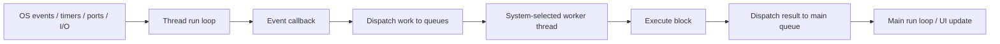
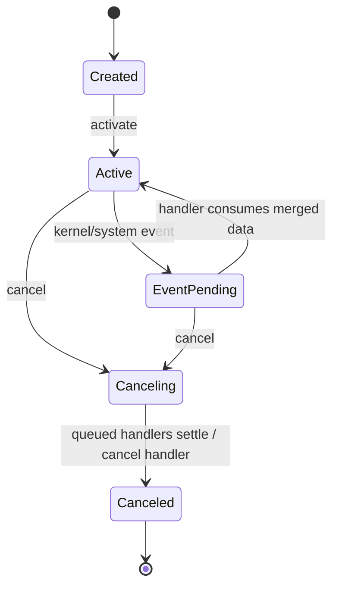
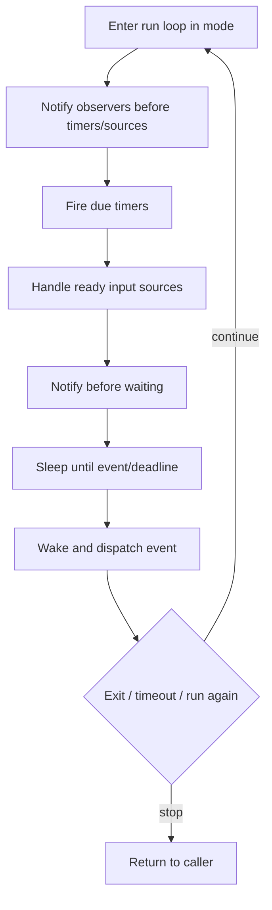
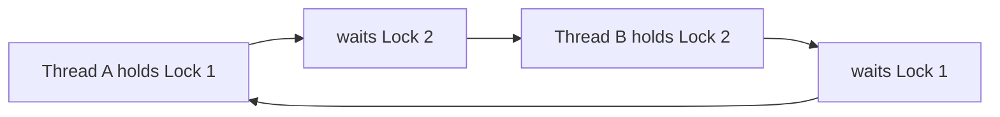
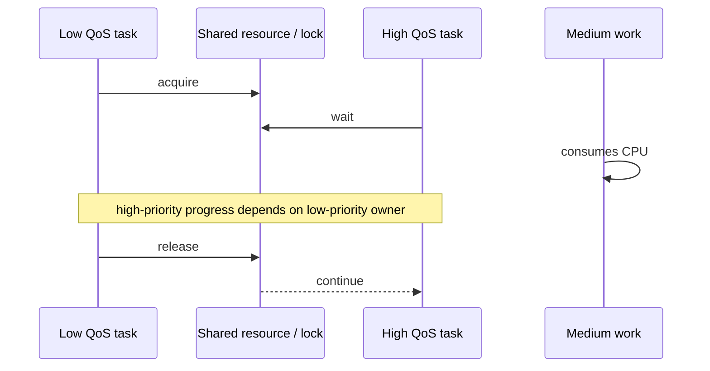
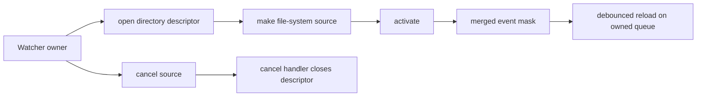

# GCD 与 Run Loop：从队列调度、事件循环到死锁诊断

> Grand Central Dispatch（GCD）解决“工作以什么依赖和服务质量被调度”，Run Loop 解决“一个线程如何等待并分发端口、输入源、Timer 与观察事件”。Dispatch Queue 不是 Thread，Concurrent Queue 也不是“每个任务创建一条线程”；Run Loop 不是 Task Queue，更不会自动让工作并行。工程上真正重要的是执行顺序、等待关系、QoS、取消与资源所有权：同一套 API 既能把主线程从 I/O 中解放出来，也能因 `sync`、Semaphore、错误 Mode 或失衡的 Group 让界面永久卡死。

---

## 一、本文解决什么问题

iOS 工程中经常出现这些问题：

- Serial Queue 是否等于固定绑定一条 Thread？
- Concurrent Queue 是否保证任务按提交顺序完成？
- `sync` 与 `async` 的差别只是“是否创建新线程”吗？
- 为什么在 Main Thread 调用 `DispatchQueue.main.sync` 会死锁？
- Main Queue、Main Thread 与 `MainActor` 是否完全等价？
- 给后台工作设置 `.userInteractive` 是否一定更快？
- 多个网络回调如何用 `DispatchGroup` 汇总，错误和取消如何处理？
- Semaphore 能否替代 Lock、Operation Queue 或并发限流器？
- Barrier 为什么在自建 Concurrent Queue 有效，在 Global Queue 上却不能当私有隔离边界？
- Dispatch Source 为什么需要 Activation/Cancel Handler，文件描述符由谁关闭？
- `Timer` 滚动时不触发是 Bug，还是 Run Loop Mode 选择结果？
- Timer 的 Interval 是否等于精确执行时刻，Tolerance 有什么价值？
- Secondary Thread 为什么创建了 Timer 却没有回调？
- 卡顿是 Main Thread 忙、等待锁、死锁还是优先级反转？

本文以 Darwin 平台的 libdispatch、Foundation RunLoop/Timer 与 UIKit 主线程模型为主。示例按 Xcode 26.1.1、Apple Swift 6.2.1 与 iOS Simulator SDK 编写，以 Swift 6、iOS 17+ 为主要验证基线。GCD Thread Pool 尺寸、Work-stealing、QoS Override/Donation、Run Loop 内部 Observer 顺序、UIKit/SwiftUI 私有 Source 和 MainActor Executor 实现都不是稳定业务契约；文章只依赖公开语义。Swift Concurrency 的 Task Tree、Actor 与 Sendable 会在后续模块单独展开。

### 核心结论

1. Dispatch Queue 是工作提交与排序抽象，不是 Thread。系统决定用哪些 Worker Thread 执行；一个 Serial Queue 的不同任务也不应依赖 Thread-local State 或固定 Thread Identity。
2. Serial Queue 保证同一队列中的 Block 不并发执行，并按入队顺序开始；Concurrent Queue 允许多个 Block 重叠执行，通常保留 Dequeue/Start Ordering，但完成顺序不保证。
3. `sync` 表示调用者等待 Block 完成，`async` 表示入队后立即返回；它们不等于“当前线程/新线程”。`sync` 可能内联执行，`async` 也可能复用已有线程。
4. Main Queue 是绑定主线程执行的 Serial Dispatch Queue，适合 UIKit/UI 状态提交。MainActor 是 Swift Concurrency Isolation Contract，通常与主执行环境协作，但不能把两套类型和调度语义简单视为同一个 API。
5. QoS 表达用户价值、延迟敏感度和能耗意图，不是线程优先级数字或“越高越快”按钮。滥用 `.userInteractive` 会抢占资源、增加能耗，并制造优先级反转。
6. Dispatch Group 只跟踪一组工作何时全部离开，不传播 Result、Error 或 Cancellation。手动 `enter`/`leave` 必须严格平衡，通常用 `defer` 保证。
7. Semaphore 是计数同步原语，`wait` 会阻塞当前线程。它适合有限的同步边界或底层资源槽位，不应在 Main Thread 等待，也不应作为异步业务流程的默认互斥/取消方案。
8. Barrier 在团队拥有的自建 Concurrent Queue 上建立“之前完成、期间独占、之后再开始”的边界。它不让任意外部访问自动安全，Global Queue 也不是可由业务独占的隔离域。
9. Dispatch Source 将系统事件、Timer、Signal 或 File Descriptor 活动合并后投递到指定 Queue。Source 有明确的 Activation、Event、Cancellation 和底层资源所有权，取消不等于事件 Handler 已同步停止。
10. 每条 Thread 都可有 Run Loop，但只有真正运行它才会处理 Source/Timer；Main Run Loop 由 App Framework 驱动，临时后台线程不会因为创建 Timer 自动常驻。
11. Run Loop Mode 决定某一轮处理哪些 Source/Timer。`.common` 是 Common Modes 集合的标记，不是一条独立并发通道；把 Timer 加入 Common Modes 会让它在 Tracking 等 Common Mode 中继续触发，但也会增加滚动时主线程工作。
12. Timer 只保证“不早于合理的 Fire Date 被调度”，不保证精确执行。Run Loop 忙、Mode 不匹配、线程未调度和系统合并都会延迟；重复 Timer 不会为了补齐所有错过次数无限追赶。
13. Deadlock 是等待依赖成环；最典型是主队列同步等待自身、Serial Queue 同步等待自身和 ABBA Lock Ordering。Timeout 只能让部分等待失败，不会自动修复依赖设计。
14. Priority Inversion 是高优先级工作等待低优先级工作持有的资源。应缩短 Critical Section、避免跨 Queue/Actor 持锁、匹配 QoS，并用 System Trace 找真正 Owner，而不是盲目提高所有 QoS。
15. GCD/Run Loop 工程代码必须定义取消、超时、错误、生命周期和清理。Block 入队后无法靠一个 Boolean 可靠“撤回”，Source/Timer/Observer 也必须由明确 Owner 停止并释放。

---

## 二、统一执行模型：Queue 调度工作，Run Loop 等待事件



两者协作但职责不同：

| 维度 | Dispatch Queue | Run Loop |
|---|---|---|
| 核心职责 | 调度 Block/Work Item | 在线程上等待并分发 Source/Timer |
| 并发 | Serial/Concurrent Queue + 系统线程池 | 单个 Run Loop 所在线程串行处理回调 |
| 生命周期 | Queue 可长期存在，Block 按需执行 | 必须进入 `run` 才处理事件 |
| 等待方式 | `sync`/Group/Semaphore 等可能阻塞 | 无事件时高效休眠，事件到达唤醒 |
| 常见错误 | 数据竞态、死锁、线程爆炸、QoS | Mode 不匹配、Timer 不触发、线程无法退出 |

Run Loop 回调中可以向 Dispatch Queue 提交工作；Dispatch Block 也可以安排 Timer/Source。但“把任务放进 Run Loop”和“提交到 Dispatch Queue”不是同一个操作。

---

## 三、Serial 与 Concurrent Queue

### 3.1 Serial Queue：互斥执行边界

```swift
final class ImageMemoryCache {
    private let queue = DispatchQueue(
        label: "com.example.image-cache"
    )
    private var storage: [String: UIImage] = [:]

    func image(for key: String) -> UIImage? {
        queue.sync { storage[key] }
    }

    func insert(_ image: UIImage, for key: String) {
        queue.async { [weak self] in
            self?.storage[key] = image
        }
    }
}
```

同一 Serial Queue 中的访问不会并发重叠，因此可以形成 State Isolation。但这个示例仍有边界：

- `image(for:)` 会阻塞调用线程，不应在内部执行昂贵工作；
- 若从 Cache Queue 内再次同步调用 `image(for:)`，会自锁；
- 异步 `insert` 后紧接其他 Queue 的读取，要理解入队顺序与跨队列关系；
- `UIImage` 和跨并发域传递在 Swift 6 中还要遵循 SDK 的 Sendability/Actor Diagnostics；
- 新代码可考虑 Actor，但 Actor Reentrancy 与 Task Cancellation 也有另一套规则。

Serial Queue 不是递归锁，也不保证使用同一 OS Thread。

### 3.2 Concurrent Queue：允许重叠，不保证完成顺序

```swift
let processingQueue = DispatchQueue(
    label: "com.example.thumbnail-processing",
    qos: .userInitiated,
    attributes: .concurrent
)

for request in requests {
    processingQueue.async {
        generateThumbnail(for: request)
    }
}
```

如果任务耗时不同，后提交的任务可以先完成。业务若要求结果按输入顺序展示，应显式带 Index/ID 汇总，而不是依赖 Completion Order。

### 3.3 Concurrent 不等于无限并发

GCD 根据系统负载和 QoS 调度 Worker，不承诺“一任务一线程”或固定并发数。反过来，大量相互阻塞的 Block 可能促使系统增加线程，造成 Thread Explosion、Context Switch 和内存压力。

不要在大量并发 Block 中同步等待网络、Semaphore 或其他 Queue。需要可控并发时，应使用适合的 OperationQueue、Swift Task Group 限流、专用资源池或系统异步 API，并测量实际负载。

### 3.4 Target Queue

多个私有 Queue 可以设置同一 Target Queue，建立共享的执行/隔离层级和 QoS 关系。但 Target Queue Configuration 必须在 Queue 开始使用前设计清楚；不要把它当成可随时切换的线程绑定 API。

---

## 四、Main Queue：UI 执行边界

### 4.1 Main Queue 的公开语义

提交到 `DispatchQueue.main` 的 Block 在 App 主线程串行执行：

```swift
imageLoader.load(url: url) { result in
    DispatchQueue.main.async {
        guard cell.representedID == itemID else { return }
        cell.apply(result)
    }
}
```

正确性不仅是“回主线程”，还包括：

- Cell/View 仍存在；
- Identity 未改变；
- 请求未被更新版本取代；
- Error/Placeholder 状态明确；
- 回调不会在同一帧集中淹没 Main Queue。

### 4.2 Main Queue 不等于所有主线程代码都在 Main Queue Block 中

UIKit Event、Run Loop Source、Objective-C Callback 和系统 Framework 可以直接在主线程调用，而不一定表现为某个显式 `DispatchQueue.main.async` Block。判断 UI 隔离应依赖 API Contract/MainActor Annotation，而不是只检查“当前队列标签”。

### 4.3 MainActor 与 Main Queue

`@MainActor` 声明 Swift Concurrency Isolation；跨隔离调用需要 `await` 或在已隔离上下文执行。`DispatchQueue.main` 是 libdispatch Queue。它们通常共享主执行环境，但：

- 类型系统只理解 Actor Isolation，不理解任意 Queue Label；
- `DispatchQueue.main.async` 不传播 Structured Cancellation；
- Task Priority 与 QoS 映射不是一一公开契约；
- Actor 方法可能在 Reentrancy 点让其他任务进入；Serial Dispatch Block 不会在 Block 内自动重入。

不要用 GCD Queue 检查替代 Swift 6 隔离设计。

---

## 五、Sync 与 Async：等待关系比线程更重要

### 5.1 `sync`

```swift
let value = stateQueue.sync {
    state.currentValue
}
```

调用者直到 Closure 返回才继续。执行可能由当前 Thread 参与，也可能由系统调度；业务不能依赖具体 Thread。核心代价是 Caller's Progress 被阻塞。

### 5.2 `async`

```swift
processingQueue.async {
    let result = process(input)
    DispatchQueue.main.async {
        apply(result)
    }
}
```

调用点入队后返回，Closure 之后执行。它不自动提供：

- Cancellation；
- Result/Error Propagation；
- Lifetime Binding；
- Backpressure；
- 顺序化跨多个 Queue 的 Completion。

这些必须由 Work Item、Owner、Group/Operation/Task 或业务协议补充。

### 5.3 Async 不等于“马上执行”

Queue 可能因前序工作、QoS、系统负载或 Target Queue 而延迟。不要写出依赖“异步 Block 一定在下一行之前开始”的竞态代码。

### 5.4 避免无意义 Queue Hop

```swift
DispatchQueue.global().async {
    DispatchQueue.main.async {
        updateUI()
    }
}
```

若没有后台工作，这只是增加调度和时序复杂度。只有确实需要隔离昂贵 CPU/I/O 时才 Hop，并让 API 清楚表达 Result、Error 与 Cancellation。

---

## 六、QoS：表达工作的用户价值

### 6.1 QoS 类别

| QoS | 典型场景 | 不适用 |
|---|---|---|
| `.userInteractive` | 正在进行、直接决定当前交互帧的极短工作 | 图片批量预取、日志上传 |
| `.userInitiated` | 用户正在等待的明确操作 | 长期后台维护 |
| `.default` | 无更明确分类 | 用于逃避设计 |
| `.utility` | 可见进度的较长任务、导入导出 | 当前帧 UI 计算 |
| `.background` | 用户不等待的维护、索引、清理 | 即将显示的资源 |
| `.unspecified` | 继承/未指定语义 | 作为“最低优先级”误用 |

QoS 同时影响调度、I/O、Timer 和能耗策略，具体映射由系统决定。

### 6.2 QoS 传播与 Override

系统可能沿同步依赖、Queue/Block 配置传播或临时提升 QoS，以缓解某些反转，但规则复杂且不是业务正确性的保证。不能故意让高优先级任务等待 `.background` Block，再假设系统一定 Donation。

### 6.3 常见错误

- 所有 Queue 都设 `.userInteractive`；
- Prefetch QoS 高于 Visible Request；
- Main Thread 等低 QoS Queue 的 `sync`；
- 在高 QoS Block 中启动大批无界并发任务；
- 为了“更快”频繁手工 Override，而没有测量。

QoS 应从“用户是否正在等待、多久可见、能否暂停”推导。

---

## 七、Dispatch Group：等待一组工作，不管理结果

### 7.1 `async(group:)`

```swift
let group = DispatchGroup()
let queue = DispatchQueue.global(qos: .userInitiated)

for item in items {
    queue.async(group: group) {
        process(item)
    }
}

group.notify(queue: .main) {
    renderSummary()
}
```

GCD 自动在 Block 前后维护 Group 计数。`notify` 不阻塞调用线程，适合 UI 完成通知。

### 7.2 Callback API 的 enter/leave

```swift
func loadDashboard(completion: @escaping () -> Void) {
    let group = DispatchGroup()

    group.enter()
    profileService.load { _ in
        defer { group.leave() }
        // Store result under a synchronized owner.
    }

    group.enter()
    messageService.load { _ in
        defer { group.leave() }
        // Store result under a synchronized owner.
    }

    group.notify(queue: .main, execute: completion)
}
```

每次 `enter()` 必须恰好对应一次 `leave()`。漏 `leave` 会永不完成，多 `leave` 属于程序错误。所有 Success/Error/Cancel Callback 都要走到 `defer`；还要防止底层 API 错误地多次回调。

### 7.3 Group 不提供什么

- 不存储每个 Result；
- 不传播第一个 Error；
- 不取消其他工作；
- 不限制并发数；
- 不保证 Completion 顺序；
- `wait()` 不会运行等待中的 Main Queue Callback 来“帮忙完成”。

现代异步结果聚合可优先考虑 Structured Concurrency Task Group；旧 Callback 系统使用 Dispatch Group 时必须另建线程安全 Result Aggregator 和 Cancellation Policy。

### 7.4 避免 Main Thread `wait()`

```swift
// 错误：完成回调若需要 Main Queue，会直接死锁。
group.wait()
```

即使不死锁，也会阻塞 UI。优先 `notify`。底层同步 API 确实需要 Wait 时要设置 Timeout、明确所在 Queue，并保证完成路径不依赖等待线程。

---

## 八、Semaphore：计数器，不是万能并发工具

### 8.1 基本语义

`DispatchSemaphore(value: n)` 表示最多可消耗的 n 个 Permit：

```swift
let slots = DispatchSemaphore(value: 3)

workerQueue.async {
    guard slots.wait(timeout: .now() + 2) == .success else {
        reportTimeout()
        return
    }
    defer { slots.signal() }

    useLimitedSynchronousResource()
}
```

适合保护“同时只能有 N 个同步使用者”的底层资源。但要注意：

- `wait` 阻塞 Thread；
- `signal` 不是 Owner-specific Unlock，任意路径都能误 Signal；
- Timeout 后不能再 `signal` 未取得的 Permit；
- Critical Section 内不能无限等待另一个依赖；
- Main Thread 不应 Wait。

### 8.2 用 Semaphore 把异步 API 变同步的风险

```swift
// 高风险反模式
let semaphore = DispatchSemaphore(value: 0)
service.load {
    semaphore.signal()
}
semaphore.wait()
```

若 Callback 回到当前 Queue/Main Queue，就会死锁；即使没有，Thread 会在整个网络期间被浪费，取消和超时也更复杂。应保留异步结构，或桥接到 `async/await`。

### 8.3 Semaphore 与 Lock

Binary Semaphore 技术上能实现互斥，但它没有 Lock Ownership 语义，错误 Signal 更难发现。保护极短同步 Critical Section 优先使用适合平台的 Lock/Unfair Lock；隔离可变状态可用 Serial Queue/Actor；异步并发限制使用不阻塞线程的 Async Limiter。

### 8.4 Metal Frames in Flight

Semaphore 的合理工程例子是限制 Metal Frames in Flight：CPU 获取一个 Frame Slot，Command Buffer 完成后归还。仍需确保每个 Error/Drawable Failure 路径都正确归还，且 Wait 不在 Main Thread 无界阻塞。

---

## 九、Barrier：自建 Concurrent Queue 上的读写边界

### 9.1 读并发、写独占

```swift
final class ConfigurationStore {
    private let queue = DispatchQueue(
        label: "com.example.configuration",
        attributes: .concurrent
    )
    private var values: [String: String] = [:]

    func value(for key: String) -> String? {
        queue.sync { values[key] }
    }

    func setValue(_ value: String?, for key: String) {
        queue.async(flags: .barrier) { [weak self] in
            self?.values[key] = value
        }
    }
}
```

Barrier Block 开始前，该 Queue 先前提交的工作完成；Barrier 期间同一 Queue 的其他 Block 不并发执行；结束后后续工作才可开始。

### 9.2 Barrier 的隔离边界

只有所有 `values` 访问都经同一个私有 Queue，保护才成立。以下行为会破坏隔离：

- 外部直接持有并修改 Dictionary/Reference Element；
- Callback 把内部 Mutable Object 暴露出去；
- 另一个 Queue 直接访问同一变量；
- Barrier Block 启动异步子工作后立即返回，却以为子工作仍独占。

### 9.3 不要在 Global Queue 建 Barrier

Global Concurrent Queue 被全进程共享，业务不能把它变成自己的独占读写域。Barrier Flag 在 Global Queue 上不能提供与私有 Concurrent Queue 相同的隔离保证。需要 Barrier 时创建并拥有专用 Concurrent Queue。

### 9.4 是否值得读写并发

读操作极短、写频繁或数据量很小时，Concurrent + Barrier 的管理成本可能不比 Serial Queue 好。先从简单正确的 Serial Isolation 开始，确认读竞争是瓶颈再升级并测量。

---

## 十、Dispatch Source：把系统事件合并到 Queue

### 10.1 Source 生命周期



新 Source 配置 Event/Cancel Handler 后再 `activate()`。Event 可能被合并，Handler 次数不一定等于 Kernel Event 次数。`cancel()` 是异步生命周期信号，不表示调用返回时 Handler 已不可能执行。

### 10.2 Timer Source

```swift
final class Heartbeat {
    private let queue = DispatchQueue(
        label: "com.example.heartbeat",
        qos: .utility
    )
    private var source: DispatchSourceTimer?

    func start() {
        guard source == nil else { return }

        let timer = DispatchSource.makeTimerSource(queue: queue)
        timer.schedule(
            deadline: .now() + 1,
            repeating: .seconds(30),
            leeway: .seconds(3)
        )
        timer.setEventHandler { [weak self] in
            self?.sendHeartbeatIfNeeded()
        }
        timer.setCancelHandler {
            // Release resources owned by the source if needed.
        }
        source = timer
        timer.activate()
    }

    func stop() {
        source?.cancel()
        source = nil
    }

    private func sendHeartbeatIfNeeded() {}

    deinit {
        source?.cancel()
    }
}
```

Heartbeat 还要受 App/Scene Lifecycle、Network Reachability、Authentication 和 Server Policy 控制。App 进入 Background 后普通 Timer 不保证继续执行，不能用它实现必须准点的后台任务。

### 10.3 File System Source 与资源所有权

监听 File Descriptor 时：

1. Open Descriptor；
2. 创建 Source；
3. Event Handler 读取 `source.data` 表示合并后的事件 Mask；
4. Cancel Handler 中关闭 Descriptor；
5. Owner 停止时 Cancel Source。

Dispatch Source 通常不会替业务自动关闭传入的 File Descriptor。不能在 Source 仍可能处理事件时提前 Close，也不能 Cancel 后永不释放 Descriptor。

### 10.4 DispatchWorkItem 取消不是抢占

`workItem.cancel()` 设置取消状态，尚未开始的调度可能被跳过，但已运行的 Block 不会被系统强制终止。Block 必须在安全点检查 `isCancelled`，底层 I/O 也要有自己的 Cancel API。Dispatch Source Cancel 同样是协作式生命周期，不是同步杀线程。

---

## 十一、Run Loop：线程上的事件泵

### 11.1 每线程一个 Run Loop 对象

Run Loop 与 Thread 关联：

- Main Thread 的 Run Loop 由 Application Framework 启动和管理；
- Secondary Thread 可以按需获取 Run Loop，但必须显式运行；
- Run Loop 无 Source/Timer 时可能立即返回；
- Run Loop 一次在所属 Thread 上串行分发回调；
- Run Loop 本身不提供并行执行。



这是概念阶段图。具体 Observer Activity 顺序可以通过公开 `CFRunLoopActivity` 理解，但 UIKit/Core Animation 私有 Source 和内部调度不能成为业务依赖。

### 11.2 为什么后台 Timer 不触发

```swift
Thread.detachNewThread {
    let timer = Timer.scheduledTimer(
        withTimeInterval: 1,
        repeats: true
    ) { _ in
        print("tick")
    }

    RunLoop.current.run()
    timer.invalidate()
}
```

如果不运行 `RunLoop.current`，Scheduled Timer 没有事件泵处理。这个示例又引出生命周期难题：如何停止 Run Loop、从哪个线程 Invalidate、如何保证 Thread 退出。现代工程通常优先 Dispatch Source、Operation 或 Swift AsyncSequence，而不是为一个 Timer 长期维护裸 Thread。

### 11.3 Autorelease Pool

系统管理的 Thread/Queue 通常有 Autorelease Pool 边界，但自建长生命周期 Thread 的循环需要控制临时 Objective-C 对象释放。大量循环工作可用 `autoreleasepool {}` 缩短峰值，前提是通过 Allocations 证明临时对象确实累积。

---

## 十二、Run Loop Mode：决定这一轮处理哪些事件

### 12.1 Default 与 Tracking

主 Run Loop 在普通交互时常运行 Default Mode，UIScrollView Tracking 期间会切换到 Tracking 相关 Mode，以优先处理 Touch/Scroll。只注册在 Default Mode 的 Timer 可能在滚动期间暂停，结束后再触发。

这不是 Timer 丢失，而是当前 Mode 不处理该 Timer。

### 12.2 Common Modes 是集合标记

```swift
RunLoop.main.add(timer, forMode: .common)
```

这表示 Timer 被关联到当前标记为 Common 的 Modes，而不是创建名为 Common 的并行 Mode。具体哪些 Mode 属于 Common Set 由 Framework 配置，不应硬编码私有 Mode 名称。

### 12.3 是否应该把 Timer 放 Common

取决于语义：

- 倒计时 Label 滚动时仍需视觉更新，可以考虑 Common；
- Auto Carousel 在用户拖动时继续切页会破坏交互，应暂停；
- 数据轮询没必要在滚动关键帧抢 Main Thread，可用后台 Source/异步调度；
- CADisplayLink 是否放 Common 要结合滚动期间是否需要渲染。

“Timer 滚动时暂停”不能一律用 `.common` 修复。

### 12.4 Mode 与 Source 必须匹配

调用 `run(mode:before:)` 只处理该 Mode 注册的 Source/Timer。若 Mode 没有 Source，Run Loop 可能直接返回。Nested Run Loop 和手动 Pump Main Run Loop 容易制造 Reentrancy，业务代码不应通过循环 `RunLoop.current.run(until:)` 等待异步结果。

---

## 十三、Timer：时间到了也要等线程可执行

### 13.1 Timer 不保证准点

Timer 的 Fire Date 到达后只是变为 Eligible，实际 Callback 要等：

- Run Loop 运行匹配 Mode；
- 所在线程被调度；
- 前一个 Callback/主线程工作结束；
- 系统 Timer Coalescing；
- App Lifecycle 允许执行。

因此 Timer 不适合做精确音视频时钟、加密 Token 到秒级强制失效判断或后台准点任务。业务 Deadline 应在触发时读取当前 Absolute Time 重新计算，而不是靠 Tick 次数累加。

### 13.2 Tolerance

```swift
let timer = Timer(timeInterval: 60, repeats: true) { _ in
    refreshNonCriticalBadge()
}
timer.tolerance = 5
RunLoop.main.add(timer, forMode: .default)
```

Tolerance 允许系统在不早于 Fire Date 的前提下合并唤醒，降低能耗。非关键周期任务应给合理 Tolerance；当前交互帧 Animation 不应由低精度 Timer 驱动。

### 13.3 Retain Cycle

Scheduled Timer 被 Run Loop 持有，Timer 又可能强持有 Target/Closure：

```swift
timer = Timer.scheduledTimer(withTimeInterval: 1, repeats: true) {
    [weak self] _ in
    self?.updateClock()
}
```

即使 Closure Weak Capture，Owner 仍应在 View Disappear/Stop/Deinit 显式 `invalidate()`，否则无意义 Timer 可能继续存活并唤醒线程。

### 13.4 Foundation Timer、Dispatch Timer 与 Display Link

| 工具 | 适用 | 不适用 |
|---|---|---|
| `Timer` | Run Loop 绑定的 UI/普通周期事件 | 精确时钟、后台保证 |
| `DispatchSourceTimer` | 指定 Queue 的计时事件、Leeway | 必须随 Run Loop Mode 暂停的 UI 语义 |
| `CADisplayLink` | 与显示机会同步的动画/渲染 | 低频网络轮询、墙钟 Deadline |
| `ContinuousClock`/Task Sleep | Swift Concurrency 延迟与超时 | 精确媒体同步（取决于需求） |

选择依据是时间语义、执行上下文、生命周期和取消，而不是 API 新旧。

---

## 十四、Deadlock：等待图形成环

### 14.1 Main Queue 同步等待自身

```swift
// 在 Main Thread 执行：必然无法完成。
DispatchQueue.main.sync {
    updateUI()
}
```

Main Thread 等 Main Queue Block 完成，而该 Block 只能等 Main Thread 空闲后执行，形成环。

修复不是无脑改成 `async`；先判断当前 API 是否本就应在 MainActor，或调用者是否需要同步 Result。UI API 可声明 `@MainActor`，让类型系统表达隔离。

### 14.2 Serial Queue 同步等待自身

```swift
stateQueue.async {
    stateQueue.sync {
        readState()
    }
}
```

外层 Block 未结束，内层无法开始。Dispatch Queue 不自动支持递归同步。

### 14.3 ABBA Lock Ordering



修复方式：

- 全局统一 Lock Ordering；
- 缩小 Critical Section；
- 不在持锁时调用外部 Callback/Delegate；
- 合并 Ownership，减少跨对象锁；
- 用 Serial Isolation/Actor 改写共享状态；
- Debug 用 Thread Sanitizer、System Trace 和 Pause Backtrace 定位等待图。

### 14.4 Group/Semaphore 间接死锁

主线程 `group.wait()`，而 Group 中任务完成前需要 `DispatchQueue.main.async`；或 Queue 中所有 Worker 都在 Semaphore Wait，真正 Signal Work 无线程可运行，都可能形成资源饥饿/死锁。

不要只搜索代码中的两个 `sync`。应画出“谁持有什么、谁等待谁、完成信号在哪执行”。

### 14.5 Timeout 不是完整修复

Timeout 可避免永久阻塞并提供错误路径，但超时后的底层 Work 可能继续执行、稍后回调或占用资源。必须定义：

- 超时是否触发取消；
- 晚到结果如何丢弃；
- Permit/Group Count 是否正确；
- 业务是否可重试和幂等；
- 资源何时释放。

---

## 十五、Priority Inversion：高优先级为何等低优先级

### 15.1 形成条件



若 Low QoS Owner 无法及时被调度，高 QoS Work 就被间接降速。系统同步原语可能做 Priority Donation/Override，但并非所有自定义依赖、Semaphore、跨进程或异步 Callback 都能正确推断。

### 15.2 常见工程来源

- Main Thread 同步读取 Background Queue State；
- UserInitiated 请求等待 Background Cache 写入；
- 高 QoS Image Decode 等低 QoS File I/O；
- Lock 内执行网络/磁盘/复杂计算；
- Operation/Queue 依赖 QoS 配置反向；
- 高优先级任务等待低优先级 Timer 才 Signal。

### 15.3 修复原则

1. 消除同步等待，优先异步 Result Flow；
2. 缩短锁持有时间，不在锁内 I/O/Callback；
3. 让 Producer QoS 匹配 Consumer Urgency；
4. Visible/Pending/Prefetch 分级；
5. 限制无关 Medium Work 并发；
6. 用 System Trace 查看实际 Thread QoS、Wait 和 Owner；
7. 不把所有任务提高到最高 QoS，这只会制造新的竞争。

Priority Inversion 与 Deadlock 不同：前者最终可能完成但延迟异常，后者依赖环无法自然推进。

---

## 十六、工程案例：可取消搜索防抖与目录变更监听

### 16.1 搜索防抖

使用 `DispatchWorkItem` 可以在旧 Callback 架构中实现协作式防抖。关键是每个请求拥有自己的 Cancellation Token，后台 Block 不跨隔离读取 Coordinator 的可变状态：

```swift
struct SearchResult: Sendable {
    let id: String
    let title: String
}

protocol SearchIndex: Sendable {
    func lookup(
        _ query: String,
        isCancelled: () -> Bool
    ) -> [SearchResult]
}

final class CancellationFlag: @unchecked Sendable {
    private let lock = NSLock()
    private var cancelled = false

    func cancel() {
        lock.withLock { cancelled = true }
    }

    var isCancelled: Bool {
        lock.withLock { cancelled }
    }
}

@MainActor
final class SearchCoordinator {
    private let workerQueue = DispatchQueue(
        label: "com.example.search",
        qos: .userInitiated
    )
    private let searchIndex: any SearchIndex
    private var pendingWorkItem: DispatchWorkItem?
    private var pendingCancellation: CancellationFlag?
    private var revision = 0

    init(searchIndex: any SearchIndex) {
        self.searchIndex = searchIndex
    }

    func queryDidChange(_ query: String) {
        pendingWorkItem?.cancel()
        pendingCancellation?.cancel()
        revision += 1
        let requestRevision = revision

        guard !query.isEmpty else {
            render(results: [])
            return
        }

        let cancellation = CancellationFlag()
        let index = searchIndex
        let workItem = DispatchWorkItem {
            guard !cancellation.isCancelled else { return }
            let results = index.lookup(
                query,
                isCancelled: { cancellation.isCancelled }
            )
            guard !cancellation.isCancelled else { return }

            DispatchQueue.main.async { [weak self] in
                guard let self else { return }
                guard self.revision == requestRevision else { return }
                self.render(results: results)
            }
        }

        pendingWorkItem = workItem
        pendingCancellation = cancellation
        workerQueue.asyncAfter(
            deadline: .now() + .milliseconds(250),
            execute: workItem
        )
    }

    func stop() {
        pendingWorkItem?.cancel()
        pendingCancellation?.cancel()
        pendingWorkItem = nil
        pendingCancellation = nil
    }

    private func render(results: [SearchResult]) {}
}
```

`DispatchWorkItem.cancel()` 与 `CancellationFlag` 都是协作式取消：已经进入 `lookup` 的工作只有在算法主动检查时才会尽快结束。Revision 则处理底层工作无法取消或 Completion 已排队的晚到结果。`@unchecked Sendable` 是人工承诺，只有 `CancellationFlag` 的全部 Mutable State 确实被 Lock 保护才能成立。新代码通常更适合用 `.task(id:)`、Task Cancellation 和 Actor 实现，但请求 Identity 原则不变。

### 16.2 Directory Dispatch Source

配置文件目录变化监听的所有权：



事件表示“目录可能发生了某类变化”，不一定携带完整业务 Diff。Handler 应重新读取/校验配置，并通过短防抖合并 Burst。读取失败保留最后已知良好配置，解析成功后再原子替换；取消时停止 Timer/Work Item 并在 Cancel Handler 关闭 Descriptor。

### 16.3 生命周期矩阵

| 资源 | Owner | 启动 | 取消/停止 | 晚到处理 |
|---|---|---|---|---|
| Search Work Item | Search Coordinator | Query Change | 新 Query/页面结束 | Revision 丢弃 |
| File Source | Config Watcher | Feature/App Active | Owner Stop/Deinit | Handler 检查状态 |
| File Descriptor | Config Watcher/Source | Start | Source Cancel Handler | 只关闭一次 |
| Debounce Timer | Watcher | Event Burst | Reload/Stop | Generation 丢弃 |
| Parsed Config | Config Store | Parse Success | 新版本替换 | Version 校验 |

---

## 十七、常见误区与修复

### 17.1 错误：Queue 就是一条 Thread

**问题：** 依赖 Thread-local、Thread ID 或“一 Queue 一线程”。

**修复：** 把 Queue 当执行顺序/隔离抽象；Thread 由系统调度，必须 Thread-affine 的 API 使用其明确 Thread/Run Loop Contract。

### 17.2 错误：Concurrent Queue 按提交顺序完成

**问题：** 耗时不同导致结果乱序。

**修复：** 用 Index/ID 汇总，或在独立 Serial Commit 阶段按业务顺序应用。

### 17.3 错误：Async 会创建新线程

**问题：** 推断 Thread Identity 和时机。

**修复：** Async 只保证调用者不等待，系统决定何时在哪个 Worker 执行。

### 17.4 错误：所有工作提高到 userInteractive 会更快

**问题：** 争抢关键资源、耗电并导致反转。

**修复：** 按用户是否正在等待选择 QoS，可见请求优先于 Prefetch/维护任务。

### 17.5 错误：Dispatch Group 会自动收集错误和取消

**问题：** Group 只计数，Partial Failure 被静默忽略。

**修复：** 另建同步 Result/Error Aggregator 和明确 Cancel Policy，或使用 Structured Task Group。

### 17.6 错误：Semaphore 能安全同步任何异步 API

**问题：** 阻塞 Thread、回调同 Queue 死锁、Timeout 后晚到结果难处理。

**修复：** 保留异步 Flow；Semaphore 只用于边界明确的同步计数资源。

### 17.7 错误：Global Queue 上 Barrier 能保护全局状态

**问题：** Global Queue 是共享资源，不是业务私有隔离域。

**修复：** 创建私有 Concurrent Queue，并确保所有读写都经过它。

### 17.8 错误：Cancel Dispatch Source 后 Handler 绝不会再执行

**问题：** Cancel 是异步生命周期，已排队 Handler/事件可能仍有竞态。

**修复：** Handler 检查 Owner 状态，Cancel Handler 负责最终资源释放，操作设计为幂等。

### 17.9 错误：Timer 每秒回调一次就能计算倒计时

**问题：** Run Loop 忙、Mode 和系统合并会延迟。

**修复：** 每次用当前 Monotonic/Wall-clock 与 Deadline 重新计算剩余时间，不累加 Tick Count。

### 17.10 错误：把 Timer 加到 Common Modes 永远正确

**问题：** 滚动期间增加 Main Thread 工作或破坏交互语义。

**修复：** 根据任务是否应在 Tracking 期间运行决定 Mode，非 UI 轮询移出 Main Run Loop。

### 17.11 错误：Timeout 能修复死锁

**问题：** 依赖环仍存在，底层工作可能继续并晚到。

**修复：** 消除等待环，并设计超时后的取消、幂等、资源释放和结果丢弃。

---

## 十八、测试与诊断方法

### 18.1 并发正确性测试

- 同一操作并发调用数百/数千次；
- 随机化 Queue、Delay、成功/失败顺序；
- Group 每条分支都 Leave；
- Semaphore Timeout 不多 Signal；
- Barrier 外没有旁路访问；
- Source Start/Stop 重复调用幂等；
- Timer 在 Default/Tracking/Common Mode 行为符合预期；
- 页面释放后 Timer/Source/Callback 不再更新 UI；
- 取消后旧结果不覆盖新状态。

测试“跑 100 次没崩”不能证明无 Data Race，但可以配合 Sanitizer 和不变量断言扩大暴露概率。

### 18.2 工具

| 工具 | 用途 |
|---|---|
| Thread Sanitizer | 发现部分 Data Race，不证明无竞态 |
| Main Thread Checker | UIKit Main Thread 违规 |
| Time Profiler | Block/Callback CPU Stack |
| System Trace | Queue/Thread 调度、QoS、Wait、Priority Inversion |
| Points of Interest | Group、Source、Timer、业务阶段关联 |
| Memory Graph | Timer/Source/Closure Retain Cycle |
| Pause + Backtrace | Deadlock 时查看所有线程等待关系 |

### 18.3 死锁诊断

1. 卡住时 Pause Process；
2. 找 Main Thread Stack，是 `dispatch_sync`、Lock、Semaphore 还是 Group Wait；
3. 找被等待 Queue/Lock 的 Owner；
4. 继续追 Owner 正等待什么；
5. 画 Wait-for Graph；
6. 检查 Queue Label、QoS 和 Callback Target；
7. 修改依赖方向而不是只换成 Async 掩盖；
8. 添加回归测试/Precondition。

### 18.4 性能测量

在真机 Profile/Release 中记录：

- Main Queue Block Duration/Backlog；
- Worker Thread 数与 Context Switch；
- QoS 与 Run Queue；
- Lock/Semaphore Wait Duration；
- Timer Wakeup Frequency/Tolerance；
- 后台任务 CPU/Energy；
- Source Event Coalescing；
- 对帧 Hitch 和 App Responsiveness 的影响。

并发更多不等于更快。最终比较吞吐、尾延迟、能耗、内存和 UI 响应。

---

## 十九、方案选择清单

| 需求 | 优先工具 | 警惕 |
|---|---|---|
| 简单顺序状态隔离 | Serial Queue / Actor | Queue 内自同步调用 |
| 大量独立 CPU Work | Concurrent Queue / Task Group | 无界并发、线程竞争 |
| 一组 Callback 全完成 | Dispatch Group | Result/Error/Cancel 需另管 |
| N 个同步资源槽 | Semaphore | 阻塞 Main Thread、失衡 Signal |
| 读并发写独占 | 私有 Concurrent Queue + Barrier | Global Queue、旁路访问 |
| 文件/信号/Timer 事件 | Dispatch Source | Activation、Cancel、FD Ownership |
| 主线程 UI Timer | Foundation Timer | Mode、Tolerance、Retain Cycle |
| 帧同步 | CADisplayLink | 不是固定帧率 Timer |
| 现代异步流程 | Swift Structured Concurrency | 需理解 Actor/Sendable/Reentrancy |

---

## 二十、总结

GCD 的核心是工作依赖和调度，不是手工管理线程。Serial/Concurrent 描述同一 Queue 内是否允许重叠执行，Sync/Async 描述调用者是否等待，QoS 描述用户价值。Group、Semaphore 和 Barrier 分别处理计数完成、同步资源槽与私有并发队列写边界，职责不可互换。

Run Loop 是线程事件泵。只有运行中的 Run Loop 才能处理注册到当前 Mode 的 Source 与 Timer；Common Modes 是集合语义。Timer 到点只代表可以被调度，不代表准时执行，业务倒计时必须基于真实 Deadline 重新计算。

并发工程最危险的不是 API 写错，而是等待和所有权不清：Main Queue Sync、自队列 Sync、Group/Semaphore 回调依赖和 ABBA Lock 都会形成等待环；高优先级等待低优先级资源则形成 Priority Inversion。诊断要画出 Queue、Thread、Lock、Source 和 Callback 的真实依赖。

所有异步资源都要有 Owner：Work Item 如何取消、Group 如何平衡、Source 何时 Activate/Cancel、File Descriptor 谁关闭、Timer 何时 Invalidate、晚到结果如何丢弃。做到这一点，GCD 与 Run Loop 才是可靠的执行基础，而不是偶发卡死和生命周期泄漏的来源。

## 问答复盘

### Q1：Dispatch Queue 是否固定对应一条 Thread？

**答：** 不对应。Queue 描述工作顺序和调度语义，系统选择 Worker Thread；Serial Queue 的不同 Block 也不能依赖固定 Thread Identity。

### Q2：Concurrent Queue 是否保证任务按提交顺序完成？

**答：** 不保证完成顺序。任务可以并发重叠，耗时较短的后提交任务可能先完成；结果顺序要用 Index/ID 显式恢复。

### Q3：`sync` 与 `async` 的本质区别是什么？

**答：** 调用者是否等待 Block 完成。它们不等于“当前线程”和“新线程”，具体执行线程由系统决定。

### Q4：为什么 Main Thread 调用 `DispatchQueue.main.sync` 会死锁？

**答：** Main Thread 等待 Main Queue Block 完成，而该 Block 又必须等待 Main Thread 空闲才能开始，等待关系成环。

### Q5：Dispatch Group 能否自动传播 Result、Error 和 Cancellation？

**答：** 不能。Group 只跟踪计数归零；结果、错误、取消和线程安全聚合必须另行设计，手动 Enter/Leave 还要严格平衡。

### Q6：Semaphore 与 Lock 最容易混淆的边界是什么？

**答：** Semaphore 是计数 Permit，Wait 会阻塞线程且没有 Ownership Unlock 语义；短同步互斥优先合适的 Lock，异步流程不要靠 Semaphore 强行同步化。

### Q7：Barrier 为什么应使用私有 Concurrent Queue？

**答：** Barrier 只协调同一受控 Queue 中前后 Block。Global Queue 被共享，旁路访问也不受保护，因此不能形成业务独占隔离域。

### Q8：Timer 在 UIScrollView 滚动时暂停，是否应一律加入 Common Modes？

**答：** 不应。先判断滚动期间是否应该执行；加入 Common 会占用 Tracking 期间的主线程，Auto Carousel 等任务反而应暂停。

### Q9：取消 DispatchWorkItem 或 Dispatch Source 后，正在执行的 Handler 会立即停止吗？

**答：** 不会保证。取消是协作式生命周期信号；运行中的代码要检查状态、调用底层取消，并用 Revision/Identity 丢弃晚到结果。

### Q10：Priority Inversion 与 Deadlock 有什么区别？

**答：** Priority Inversion 是高优先级工作等待低优先级 Owner，通常最终可完成但延迟异常；Deadlock 是等待依赖成环，无法自然推进。

## 延伸知识

- Swift Concurrency：Structured Task、Cancellation、Continuation 与 AsyncSequence；
- Actor Isolation：MainActor、Sendable、Reentrancy 与跨隔离调用；
- CFRunLoop：Source 0/1、Observer、Wake Up 与 Stop；
- OperationQueue：Dependency、Cancellation、Max Concurrent Count；
- os_unfair_lock/NSLock：Ownership、Critical Section 与公平性边界；
- URLSession：Delegate Queue、Callback Thread 与 Task Cancellation；
- Dispatch I/O：Channel、Watermark 与分段 I/O；
- App Responsiveness：Main Thread Hang、Watchdog、MetricKit 与 System Trace。
