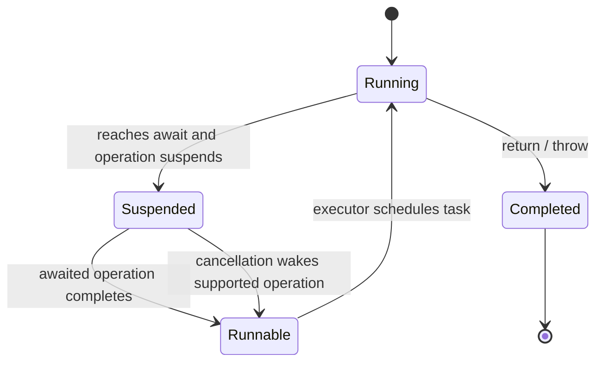
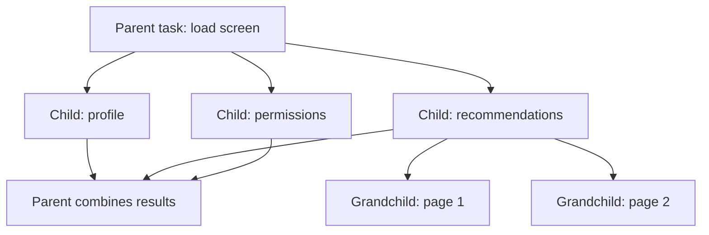
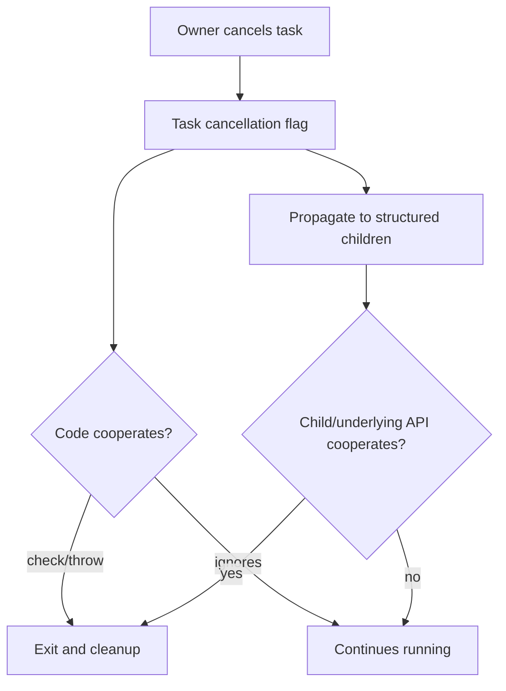
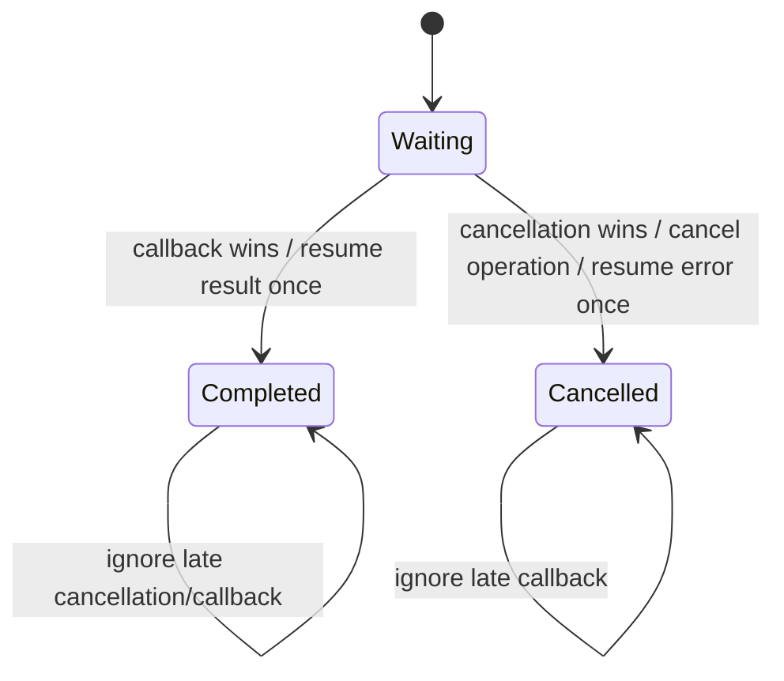

# Swift Concurrency：从结构化任务树到取消与异步序列

> Swift Concurrency 的核心不是把 Completion Closure 改写成 `await`，而是让异步工作的生命周期、错误、取消、优先级和隔离关系进入语言模型。结构化并发要求子任务不能逃出父作用域，形成可推理的 Task Tree；`Task {}` 与 `Task.detached` 则创建需要显式管理的非结构化工作。`await` 只表示潜在暂停点，不保证切线程，也不会自动解决数据竞态。只有把任务所有权、取消协作、Continuation 单次恢复和 AsyncSequence 结束语义设计清楚，异步代码才真正比 Callback 更安全。

---

## 一、本文解决什么问题

Swift Concurrency 代码看起来线性，但真实工程仍会遇到：

- `async` 函数是否自动在后台线程运行？
- `await` 是否一定切换线程，暂停时 Thread 在做什么？
- 顺序写两个 `await` 与 `async let` 的行为有何不同？
- Parent Task 取消后，`async let`、Task Group 和 `Task {}` 谁会自动收到取消？
- Task Group 中一个 Child 失败后，其他 Child 是否立即停止？
- 为什么 `Task.cancel()` 后网络、Decode 或循环仍在执行？
- `Task { @MainActor in ... }` 能否替代所有 UI 生命周期管理？
- `Task.detached` 为什么容易丢失 Actor Context、Task-local 和优先级语义？
- Task Priority 是否等于 GCD QoS，设置 `.high` 是否必然先执行？
- Callback 如何用 Checked Continuation 安全桥接，若回调两次或永不回调会怎样？
- Continuation 桥接如何处理“取消与回调同时发生”的竞态？
- `AsyncStream` 的 Buffer 会不会无限增长，Consumer 退出后 Producer 如何停止？
- 页面退出、搜索词变化、账号切换时，如何阻止旧任务覆盖新状态？

这些问题围绕同一个原则：**异步工作必须属于某个生命周期，所有潜在暂停点都要重新验证状态，取消与结果提交都必须协作。**

本文以 Swift 6 Language Mode、iOS 17+ 为主要验证基线，示例按 Xcode 26.1.1、Apple Swift 6.2.1 与 iOS Simulator SDK 编写。部分 API 在更早 Swift/iOS 已提供，但 Strict Concurrency Diagnostics、Sendability Annotation、Foundation Overlay 和默认 Actor Isolation 会随 Swift/Xcode/Build Setting 演进。本文聚焦 Task Model；Actor、Global Actor、`Sendable`、Reentrancy 和 Objective-C Isolation 将在下一模块深入讲解。Runtime Executor 数量、Task Scheduling、Priority Escalation 与 Thread Mapping 不是公开契约。

### 核心结论

1. `async` 表示函数可能暂停，不表示它自动在 Background Thread 执行。它在当前 Isolation/Executor Context 中开始，运行到 Suspension Point 后才可能让出执行资源。
2. `await` 标记潜在暂停点，不保证实际暂停或切换线程。恢复后也不保证回到暂停前的同一 Thread；Thread Identity 不能作为状态隔离依据。
3. 顺序 `await` 适合有数据依赖的步骤；彼此独立且都需要结果的操作可用 `async let` 并发启动。并发不是默认更快，资源竞争、Server Limit 和取消成本必须测量。
4. Structured Concurrency 让 Parent Scope 等待所有 Child 结束后才能退出，并传播 Task-local、Priority 和取消等结构语义。结构清晰不等于 Child 会被强制抢占停止。
5. `async let` 和 Task Group 创建 Child Task。Child Error、Result 与 Lifetime 被词法作用域约束；离开作用域前系统会处理尚未 Await 的 Child，包括必要的取消与等待。
6. Task Group 适合动态数量并发，结果按完成顺序产出，不按添加顺序。Throwing Group 遇到错误时如何取消剩余工作，取决于 Group Body 如何消费/抛出与退出，Child 仍需响应取消。
7. `Task {}` 创建 Unstructured Task。它通常继承当前 Actor Context、Task Priority 和 Task-local Values，但不形成自动随创建者结束/取消的 Child Lifetime；Owner 必须保存 Handle 并取消。
8. `Task.detached` 不继承 Actor Context、Task-local Values 或调用方 Priority（除非显式指定），适合真正独立且使用 Sendable Input 的工作。它不是“强制后台线程”API。
9. Cancellation 是协作式状态。`cancel()` 只标记任务并向结构化子任务传播；代码必须调用 Throwing Suspension API、`Task.checkCancellation()` 或检查 `Task.isCancelled`，并取消底层资源。
10. Cancellation Handler 的 `onCancel` 可能与 Operation 并发，必须同步安全、快速且不能依赖 Actor-isolated Mutable State 的无保护访问。
11. Task Priority 是调度 Hint 与依赖语义，不是执行顺序保证，也不与 GCD QoS 构成稳定一一映射。Priority Inversion 应从依赖/资源所有权修复。
12. Continuation 只负责把一次 Callback Suspension 接回 Async World，不提供自动取消、超时或线程安全。每条路径必须恰好 Resume 一次；回调多次和取消竞态需要显式状态机。
13. Checked Continuation 适合开发期发现漏 Resume/多 Resume 等 Misuse，但不能把不可靠的多次事件源包装成单值函数；多事件应使用 AsyncSequence。
14. AsyncSequence 通过 `for await` 逐个消费异步元素并自然表达 Backpressure，但具体取消、Buffer、错误和结束行为由 Sequence 实现决定。
15. `AsyncStream`/`AsyncThrowingStream` 的 Producer 必须处理 `onTermination`、Buffering Policy 和底层订阅取消，否则 Consumer 结束后仍可能泄漏资源或无限积压。
16. 页面任务提交 UI 前必须重新验证 Owner/Identity。结构化取消能降低旧结果风险，但无法取消的底层工作、忽略取消的代码和 Unstructured Task 仍需要 Revision/Request ID 防旧覆盖。

---

## 二、从 Callback 到 async/await：改变的是控制流模型

### 2.1 Callback Pyramid 的问题

```swift
profileService.load(userID: userID) { profileResult in
    switch profileResult {
    case .success(let profile):
        recommendationService.load(profile: profile) { recommendationResult in
            DispatchQueue.main.async {
                completion(recommendationResult)
            }
        }
    case .failure(let error):
        completion(.failure(error))
    }
}
```

难点不是缩进，而是：

- Completion 是否恰好一次；
- Error 从哪条路径传播；
- 外层取消如何传到底层；
- 页面释放后谁阻止回调；
- Queue/Actor Context 是否正确；
- 多请求的先后顺序。

Async 版本把单值控制流放回 `return`/`throw`：

```swift
func loadRecommendations(userID: UUID) async throws -> [Recommendation] {
    let profile = try await profileService.load(userID: userID)
    try Task.checkCancellation()
    return try await recommendationService.load(profile: profile)
}
```

这让 Error Propagation 与顺序依赖更清楚，但 Cancellation 是否真的停止 Service，仍取决于底层实现。

### 2.2 Async Function 的三个状态



Task Suspended 时不应占用一条 Thread 等待。恢复后进入 Runnable，何时执行由 Executor/Scheduler 决定。若你在 Async Function 中调用阻塞式 I/O、Semaphore Wait 或 `sleep(3)`，Thread 仍被阻塞；加上 `async` 关键字不会自动变成非阻塞。

---

## 三、await：潜在暂停点，也是状态边界

### 3.1 await 不保证暂停

被 Await 的 Operation 可能立即有缓存结果，Task 可以继续；也可能 Suspension 后很久恢复。业务不能依赖 `await` 一定让其他任务运行，也不能假设 await 前后的代码原子执行。

### 3.2 await 后状态可能变化

```swift
@MainActor
final class ProductViewModel {
    private(set) var product: Product?
    private var revision = 0

    func load(productID: UUID) async {
        revision += 1
        let requestRevision = revision

        do {
            let loaded = try await repository.product(id: productID)
            guard requestRevision == revision else { return }
            product = loaded
        } catch is CancellationError {
            // Cancellation is an expected lifecycle outcome.
        } catch {
            guard requestRevision == revision else { return }
            present(error)
        }
    }
}
```

即使整个类型在 MainActor，`await` 期间其他 MainActor Task 仍可运行并修改 `revision`。这不是 Data Race，而是 Actor Reentrancy 带来的 Logical Race。后续 Actor 模块会展开。

### 3.3 不要用 Thread 判断恢复上下文

```swift
let before = Thread.current
await operation()
let after = Thread.current
```

两者相同或不同都不能证明隔离正确。应使用 Actor/Sendable Contract，而不是 Thread-local 假设。只有明确 Thread-affine 的底层 C/Run Loop API 才需要按其文档绑定线程。

---

## 四、Structured Concurrency 与 Task Tree

### 4.1 Task Tree



结构化 Parent Scope 在 Child 全部结束前不会完成。这个约束带来：

- Child 不会无意逃逸成后台遗留工作；
- Parent Error/Cancel 可沿树传播；
- Priority 与 Task-local Context 有明确继承；
- Result/Error 在词法 Scope 内汇总；
- Debugger/Profiler 更容易呈现因果关系。

### 4.2 Parent 取消不等于 Child 已停止

Parent 被 Cancel 后，结构化 Child 会看到 Cancellation State；但 CPU 循环、第三方 SDK 或自定义 Callback Bridge 若不检查取消，仍可能继续。Parent Scope 仍需等待 Child 真正结束，所谓“结构化”不会杀死 Thread。

### 4.3 先画生命周期，再选 API

| 工作 | 合理结构 |
|---|---|
| 页面加载必需的三项数据 | `async let` / Task Group Child |
| 动态 N 个图片变换 | Throwing Task Group + 限并发 |
| Button 点击触发一次保存 | Owner 持有的 `Task` Handle |
| App 级长期同步 | App Service 持有 Unstructured Task |
| 完全独立的纯 CPU 工具任务 | 谨慎 `Task.detached` |
| 多次 Delegate Event | AsyncStream |

“想并发”不是选择 Detached 的理由；先看任务是否属于当前 Scope。

---

## 五、Child Task 与 async let

### 5.1 顺序 await

```swift
let profile = try await loadProfile()
let messages = try await loadMessages()
```

第二项要等第一项完成。若它们没有数据依赖，这会增加总等待时间。

### 5.2 async let 并行启动

```swift
func loadDashboard() async throws -> Dashboard {
    async let profile = profileService.load()
    async let messages = messageService.loadUnread()
    async let permissions = permissionService.load()

    return try await Dashboard(
        profile: profile,
        messages: messages,
        permissions: permissions
    )
}
```

`async let` 声明时 Child 开始运行，读取值时 Await。三个 Child 都属于当前 Scope；函数不会让它们逃逸。

### 5.3 Error 与 Scope Exit

如果某个 Await 抛错并使 Scope 退出，尚未完成的 `async let` Child 会被取消并等待结束。Child 必须配合取消，否则函数仍可能迟迟不能返回。

不要在 `async let` Child 中启动另一个未管理的 `Task {}` 来绕过结构，这会破坏 Parent 能看到的生命周期。

### 5.4 并发的代价

把 1000 个独立请求写成 1000 个 Child 不等于高效：

- Server/Connection Pool 有上限；
- Decode/CPU/Memory Bandwidth 会竞争；
- Error 后剩余工作取消有成本；
- Completion 同时回到 MainActor 形成 Burst。

并发宽度应由资源约束决定，而不是输入数量决定。

---

## 六、Task Group：动态任务集合

### 6.1 基本 Throwing Task Group

```swift
func loadProducts(ids: [UUID]) async throws -> [UUID: Product] {
    try await withThrowingTaskGroup(
        of: (UUID, Product).self,
        returning: [UUID: Product].self
    ) { group in
        for id in ids {
            group.addTask {
                try Task.checkCancellation()
                return (id, try await repository.product(id: id))
            }
        }

        var products: [UUID: Product] = [:]
        for try await (id, product) in group {
            products[id] = product
        }
        return products
    }
}
```

Group 按 Child 完成顺序产生结果，因此用 ID 恢复对应关系。Dictionary 最终顺序不表达输入顺序；若 UI 要保持 `ids` 顺序，最后按 ID Array 映射。

### 6.2 Error 语义

当 `for try await` 取得某个 Child Error，Group Body 抛出并退出；作用域会取消仍在运行的 Child，并等待它们结束。注意：

- 错误只有在消费到时才被观察；
- 已完成的其他 Result 可能已被收集；
- Child Cancellation 仍是协作式；
- 是否允许 Partial Result 是业务决策。

若页面允许部分成功，应让 Child 返回 `Result`/领域状态而不是抛出整个 Group；如果任何失败都使整体无效，则 Throwing Group 更合适。

### 6.3 限制动态并发宽度

```swift
func transformImages(
    _ inputs: [ImageInput],
    maxConcurrentTasks: Int
) async throws -> [ImageOutput] {
    precondition(maxConcurrentTasks > 0)

    return try await withThrowingTaskGroup(
        of: (Int, ImageOutput).self,
        returning: [ImageOutput].self
    ) { group in
        var nextIndex = 0

        func addNext() {
            guard nextIndex < inputs.count else { return }
            let index = nextIndex
            nextIndex += 1
            let input = inputs[index]
            group.addTask {
                (index, try await transformer.transform(input))
            }
        }

        for _ in 0..<min(maxConcurrentTasks, inputs.count) {
            addNext()
        }

        var outputs = Array<ImageOutput?>(
            repeating: nil,
            count: inputs.count
        )

        while let (index, output) = try await group.next() {
            outputs[index] = output
            addNext()
        }

        return outputs.compactMap { $0 }
    }
}
```

这个滑动窗口最多保持指定数量 Child。生产代码要让 `ImageInput`、`ImageOutput` 和 Transformer 符合 Sendable/Isolation Contract，并在失败时接受尚未开始的输入不会执行。

### 6.4 `cancelAll()` 的用途

例如“多个镜像源谁先成功用谁”时，拿到第一个合法 Result 后调用 `group.cancelAll()`，但仍要退出 Scope 并等待其他 Child 收尾。CancelAll 不是立即释放所有网络连接的保证。

### 6.5 Task Group 不是并发 Mutable Collection

只有 Group Body 所在 Task 可以调用 `addTask`、`next`、`cancelAll` 等 Group API；不要把 Group 逃逸给 Child 或存储到属性。Child 通过 Result 返回数据，Parent 汇总。

---

## 七、Unstructured Task：Task Handle 必须有 Owner

### 7.1 `Task {}` 的继承与边界

```swift
@MainActor
final class CheckoutViewModel {
    private var submitTask: Task<Void, Never>?
    private(set) var state: State = .idle

    func submit(order: OrderDraft) {
        submitTask?.cancel()
        state = .submitting

        submitTask = Task { [weak self] in
            guard let self else { return }
            do {
                let receipt = try await service.submit(order)
                try Task.checkCancellation()
                state = .succeeded(receipt)
            } catch is CancellationError {
                guard state == .submitting else { return }
                state = .idle
            } catch {
                guard !Task.isCancelled else { return }
                state = .failed(error)
            }
        }
    }

    func cancel() {
        submitTask?.cancel()
        submitTask = nil
    }

    deinit {
        submitTask?.cancel()
    }
}
```

在 MainActor Context 中创建的 `Task {}` 继承 Actor Isolation，访问 `state` 无需额外 Hop。它仍是 Unstructured：创建它的 `submit` 返回后 Task 继续存在，必须由 ViewModel Handle 管理。

### 7.2 Fire-and-forget 的风险

```swift
Task {
    try await analytics.upload()
}
```

Handle 被丢弃后：

- 无法由 Owner 取消；
- Error 容易被忽略；
- 测试无法等待完成；
- App/Account 生命周期难协调；
- 重复调用可能并发上传。

真正 Fire-and-forget 工作也应交给长期 Service/Queue 统一拥有、去重和持久化。

### 7.3 Task Value

保存 Handle 可 Await Result：

```swift
let task = Task { try await repository.refresh() }

do {
    let snapshot = try await task.value
    apply(snapshot)
} catch {
    handle(error)
}
```

Await Unstructured Task Value 不会把它变成 Child，也不会自动让等待者取消时取消该 Task。若生命周期应绑定，优先 Structured Child；否则显式用 Cancellation Handler 传播。

---

## 八、Detached Task：真正脱离上下文的任务

### 8.1 与 Task.init 的差异

```swift
let checksumTask = Task.detached(priority: .utility) {
    try Task.checkCancellation()
    return checksum(of: immutableData)
}
```

Detached Task 不自动继承：

- 当前 Actor Isolation；
- Task-local Values；
- 调用方 Priority；
- 结构化 Parent Lifetime/Cancellation。

显式 `priority` 只是 Hint。输入必须可安全跨隔离传递，不能捕获 UIView、Non-Sendable Mutable Object 或 Actor-isolated State 后假装“搬到后台”。

### 8.2 适用场景

- 与调用者 Actor 无关的纯 CPU 计算；
- 使用 Immutable/Sendable Input；
- 有明确外部 Owner 保存 Handle；
- 确实不应继承 Task-local Request Context。

多数网络、页面加载、数据库和 UI 衍生任务都不需要 Detached。普通 `async` Function 已能在 Suspension 时释放线程；CPU 工作是否在 MainActor 执行应通过 Isolation 设计，而不是无脑 Detached。

### 8.3 Detached 仍属于 Cooperative Runtime

它不是新建专用 Thread，也不适合运行永久阻塞式 C API。阻塞调用需要使用该 API 推荐的专用 Thread/Queue 或异步封装，避免占住 Swift Concurrency Worker Pool。

---

## 九、Cancellation：请求停止，不是强制停止

### 9.1 三层取消



取消正确性至少包括：

1. Owner 在生命周期结束时调用 Cancel；
2. Task 在合理粒度检查；
3. 底层 URLSession/Database/Decoder 提供取消时调用；
4. `defer`/Cancellation Handler 清理资源；
5. 晚到结果用 Identity/Revision 丢弃。

### 9.2 检查方式

```swift
for chunk in chunks {
    try Task.checkCancellation()
    process(chunk)
}
```

`Task.checkCancellation()` 抛 `CancellationError`，适合 Throwing Function。不能抛时使用：

```swift
guard !Task.isCancelled else { return partialOrEmptyResult }
```

检查过密有成本，过稀响应慢；按工作 Chunk 和资源边界选择。

### 9.3 Task.sleep 与取消

```swift
try await Task.sleep(for: .milliseconds(300))
try Task.checkCancellation()
```

现代 Throwing Sleep 会在取消时抛出；若 `try?` 吞掉错误并继续请求，就破坏防抖：

```swift
// 错误：取消错误被吞掉后仍然搜索。
try? await Task.sleep(for: .milliseconds(300))
await search()
```

### 9.4 Cancellation Handler

```swift
try await withTaskCancellationHandler {
    try await operation.value()
} onCancel: {
    operation.cancel()
}
```

`onCancel` 不是 Async Closure，可能与 Operation 并发执行。`operation.cancel()` 必须 Thread-safe/Sendable；Handler 应快速，不直接访问未同步 Mutable State，也不能 `await`。

### 9.5 CancellationError 与业务错误

取消通常是页面退出、查询更新等预期控制流，不应作为用户可见“加载失败”或 Error Telemetry。可区分：

```swift
catch is CancellationError {
    return
} catch {
    present(error)
}
```

但底层 Framework 可能用自己的 Cancel Error（例如 Domain/Code）而非 `CancellationError`，Repository 层应规范化。

---

## 十、Task Priority：Hint、继承与反转

### 10.1 Priority 不是顺序保证

```swift
Task(priority: .high) { await loadVisibleImage() }
Task(priority: .background) { await warmDiskCache() }
```

`.high` 不保证先开始或先完成。实际还取决于：

- Task 是否 Runnable；
- 依赖和 Actor Availability；
- I/O/Server；
- CPU/GPU/Memory Resource；
- System Scheduling；
- 等待者带来的 Priority Escalation。

### 10.2 Inheritance

Structured Child 通常继承 Parent Priority；`Task {}` 通常继承当前 Priority；Detached 不自动继承。具体 Runtime 如何映射到 Thread QoS 不应成为业务假设。

### 10.3 Priority Inversion

高优先级 UI Task Await 一个低优先级 Cache Warm Task 时，Runtime 可能提升被等待 Task，但最好的设计通常是：

- 可见请求不要依赖非关键预热；
- 同一资源请求合并时支持等待者优先级；
- Critical Section 不跨 Await；
- 避免低优先级 Task 持有 Actor/Lock 做长计算；
- 不把全局任务都设为 High。

用 Instruments/System Trace 观察实际 Scheduling，而不是打印 `Task.currentPriority` 后下结论。

---

## 十一、Continuation：把单次 Callback 接回 async

### 11.1 基本 Checked Throwing Continuation

```swift
func requestAuthorization() async throws -> AuthorizationStatus {
    try await withCheckedThrowingContinuation { continuation in
        authorizationClient.request { result in
            continuation.resume(with: result)
        }
    }
}
```

前提是 Callback API 保证：

- 最终一定回调；
- 恰好回调一次；
- Result 的值可安全跨隔离；
- 不需要额外取消治理。

若这些前提不成立，Bridge 必须增加状态机。

### 11.2 恰好一次恢复

错误示例：

```swift
client.load { value, error in
    if let value {
        continuation.resume(returning: value)
    }
    if let error {
        continuation.resume(throwing: error)
    }
}
```

如果不可靠 API 同时给 Value 和 Error，会恢复两次。必须形成互斥分支，并对“不可能状态”选择明确 Error：

```swift
if let error {
    continuation.resume(throwing: error)
} else if let value {
    continuation.resume(returning: value)
} else {
    continuation.resume(throwing: BridgeError.missingResult)
}
```

Checked Continuation 对 Misuse 提供 Runtime Diagnostics，但不是静态证明。Unsafe Continuation 去掉检查开销，也去掉保护，只应在经过测量且契约已严格验证的低层热点考虑。

### 11.3 Continuation 不自动继承取消

Task 在等待 Continuation 时被 Cancel，Callback API 仍可能继续；若永不回调，Task 仍悬挂。完整桥接需要原子状态机协调：



状态机必须同步保护 Continuation、底层 Operation Handle 与 Completed Flag。`onCancel` 和 Callback 可能并发，不能用未加锁 Boolean。若 Foundation 已提供 Native Async API，优先使用系统实现而不是自己桥接。

### 11.4 Continuation 与 Actor

Continuation Closure 本身不是“切到 MainActor”的保证。Async Function 恢复后会按其 Isolation Context 继续，但 Callback 中访问外部 Actor State 仍要遵守隔离。将 Callback Result Resume 回去，不要在回调 Queue 中偷偷修改 UI。

---

## 十二、AsyncSequence：多值、异步、可结束的数据流

### 12.1 消费序列

```swift
func observeNotifications() async {
    let notifications = NotificationCenter.default.notifications(
        named: .accountDidChange
    )

    for await notification in notifications {
        guard !Task.isCancelled else { break }
        handle(notification)
    }
}
```

AsyncSequence 的元素在异步时刻到达。`for await` 在没有下一项时 Suspension，不阻塞 Thread。

### 12.2 AsyncThrowingSequence

网络字节、数据库流或解析流可能失败：

```swift
do {
    for try await event in eventStream {
        try Task.checkCancellation()
        await consume(event)
    }
} catch is CancellationError {
    // Expected shutdown.
} catch {
    await present(error)
}
```

具体 Sequence 在取消时是 Throw、正常结束还是继续，需要查看实现契约；`for await` 本身不自动赋予所有 Producer 正确取消行为。

### 12.3 AsyncStream 桥接多次回调

```swift
func updates() -> AsyncStream<LocationUpdate> {
    AsyncStream(bufferingPolicy: .bufferingNewest(1)) { continuation in
        let token = locationClient.observe { update in
            continuation.yield(update)
        }

        continuation.onTermination = { @Sendable _ in
            locationClient.removeObserver(token)
        }
    }
}
```

Buffering Policy 是业务语义：

- `.unbounded`：不丢数据，但慢 Consumer 可能无限涨内存；
- `.bufferingNewest(n)`：保留最新状态，适合位置/进度/UI Snapshot；
- `.bufferingOldest(n)`：保留最早未消费事件，新事件可能被丢弃。

订单事件、支付状态等不能随便丢，可能需要持久化日志、ACK/Offset 与真正的 Backpressure Protocol，而不是内存 AsyncStream。

### 12.4 Yield Result 与结束

Producer 可检查 `continuation.yield` Result，了解元素 Enqueued、Dropped 或 Stream Terminated（具体枚举以当前 SDK 为准）。结束时调用 `finish()`/`finish(throwing:)`；Consumer 提前退出会触发 Termination，Producer 必须取消 Delegate/Socket/Timer。

### 12.5 AsyncSequence Operator 与并发

`map`/`filter` 通常逐元素异步处理，不自动并行。若每个元素要并发转换，需要设计：

- 最大并发数；
- 是否保持输入顺序；
- Error/Cancel 策略；
- Buffer 与 Backpressure；
- Consumer 结束后子任务收尾。

不要为追求吞吐把无限事件流的每个元素都启动一个 Unstructured Task。

---

## 十三、工程案例：页面聚合加载与动态资源处理

### 13.1 页面 Owner

```swift
@MainActor
final class DashboardViewModel {
    enum State {
        case idle
        case loading
        case loaded(Dashboard)
        case failed(String)
    }

    private var loadTask: Task<Void, Never>?
    private var revision = 0
    private(set) var state: State = .idle

    func load() {
        loadTask?.cancel()
        revision += 1
        let requestRevision = revision
        state = .loading

        loadTask = Task { [weak self] in
            guard let self else { return }
            do {
                let dashboard = try await buildDashboard()
                try Task.checkCancellation()
                guard revision == requestRevision else { return }
                state = .loaded(dashboard)
            } catch is CancellationError {
                return
            } catch {
                guard revision == requestRevision else { return }
                state = .failed(error.localizedDescription)
            }
        }
    }

    func stop() {
        revision += 1
        loadTask?.cancel()
        loadTask = nil
    }

    private func buildDashboard() async throws -> Dashboard {
        async let account = accountService.currentAccount()
        async let messages = messageService.unreadMessages()
        async let cards = cardService.cards()

        return try await Dashboard(
            account: account,
            messages: messages,
            cards: cards
        )
    }

    deinit {
        loadTask?.cancel()
    }
}
```

这个结构有三层生命周期：

- ViewModel 持有 Unstructured Root Task Handle；
- Root Task 内的三个 `async let` 是 Structured Child；
- 页面结束 `stop()` 取消 Root，并递增 Revision 阻止不可取消结果晚到。

### 13.2 部分成功策略

如果 Messages 失败不应让 Account 页面整体失败，可以：

- Child 返回 `Result`；
- Repository 把可降级错误转为 Empty/Stale Cache；
- Dashboard State 分字段表达 Loading/Error；
- 关键 Account Error 仍抛出终止整体。

不要在最外层统一 `try?` 把所有 Error 吞成空数据，否则无法区分“没有消息”和“消息加载失败”。

### 13.3 列表资源限并发

Dashboard 卡片包含图片处理时，使用前述 Task Group 滑动窗口；Visible Card 优先、Prefetch 次之。页面取消时：

1. Root Task 标记 Cancel；
2. Group Child 收到取消；
3. ImageIO/URLSession/Transformer 协作取消；
4. 已提交且无法取消的工作完成后丢弃；
5. Texture/临时文件在 `defer` 或完成回调释放；
6. MainActor 只接受当前 Revision。

### 13.4 生命周期矩阵

| 工作 | Owner | 结构 | 取消 | 晚到防护 |
|---|---|---|---|---|
| 页面聚合加载 | ViewModel | Unstructured Root Handle | `stop`/重载 | Revision |
| Account/Messages/Cards | Root Scope | `async let` Child | Parent Propagation | Scope |
| N 张图片处理 | Group Scope | Task Group Child | `cancelAll`/Parent | ID + Scope |
| Delegate Event | AsyncStream Producer | Stream Subscription | `onTermination` | Stream Identity |
| Callback Single Result | Continuation Bridge | Suspended Task | State Machine | Resume Once |

---

## 十四、常见误区与修复

### 14.1 错误：async 函数自动在后台线程运行

**问题：** 在 MainActor Async Function 中执行重 CPU 循环，仍阻塞 UI。

**修复：** Async 只提供 Suspension Model；CPU 隔离要通过 Nonisolated Sendable Service、Task Group 或谨慎 Detached 设计并测量。

### 14.2 错误：await 一定切线程

**问题：** 依赖 Thread Identity 推断正确性。

**修复：** Await 只是潜在暂停点；使用 Actor/Sendable Isolation，不依赖暂停前后线程。

### 14.3 错误：两个顺序 await 会自动并发

**问题：** 独立请求被串行等待。

**修复：** 使用 `async let` 或 Task Group 明确创建 Child，同时评估资源限制。

### 14.4 错误：Task.cancel 会立即终止代码

**问题：** CPU 循环和不可取消 SDK 继续运行并晚到覆盖。

**修复：** 在安全点检查、取消底层操作、用 Defer 清理，并以 Revision/Identity 守住提交。

### 14.5 错误：Task {} 会自动随创建函数结束

**问题：** Unstructured Task 逃逸，页面退出后仍更新或占资源。

**修复：** 保存 Handle 并由明确 Owner 取消；能使用结构化 Child 时不要创建 Unstructured Task。

### 14.6 错误：Task.detached 等于后台线程

**问题：** 捕获非 Sendable UI/状态，丢失 Actor/Task-local/Priority 语义。

**修复：** Detached 只用于真正独立的 Sendable Work，并保存 Handle；不是线程 API。

### 14.7 错误：Task Group 结果按 addTask 顺序返回

**问题：** UI 数据错位。

**修复：** Result 携带 Index/ID，Parent 按业务顺序重建。

### 14.8 错误：把所有 Task Priority 设为 high

**问题：** 争抢 CPU/能耗，Prefetch 反压可见工作。

**修复：** Priority 表达用户价值；修复依赖反转而非全局提权。

### 14.9 错误：CheckedContinuation 自动处理取消和多回调

**问题：** 取消后 Callback 仍 Resume，或底层回调两次导致 Misuse。

**修复：** 用同步状态机竞争 Callback/Cancel，确保恰好 Resume 一次；多事件源改用 AsyncSequence。

### 14.10 错误：AsyncStream 默认不会丢也不会涨内存

**问题：** 无界 Buffer 遇到慢 Consumer 持续增长，或错误 Policy 丢关键事件。

**修复：** 根据状态/事件语义选择 Buffer，处理 Yield Result 和 onTermination；关键事件使用持久化/ACK。

### 14.11 错误：Actor 内 async 方法从头到尾原子

**问题：** Await 期间其他 Task 进入并改变状态，旧结果覆盖新意图。

**修复：** Await 后重新验证 Revision/Invariant；Actor 解决 Data Race，不自动解决 Logical Race。

---

## 十五、测试与验证

### 15.1 异步测试必须可控

避免真实 Sleep 和不确定网络：

- 注入 Clock，推进虚拟时间测试防抖/超时；
- Repository 使用 Controllable Stub；
- 显式 Resume 某个请求，制造旧请求晚到；
- 记录 Cancellation 是否传到底层；
- Task Handle 由测试 Await；
- AsyncStream 测试 Buffer/Finish/Termination；
- Continuation Bridge 测试 Success/Error/Cancel/Double Callback Defensive Logic。

### 15.2 必测竞态

1. 请求 A 开始，B 开始并取消 A，A 晚到；
2. 页面 Stop 与请求 Completion 同时发生；
3. Continuation Callback 与 Cancellation 同时发生；
4. Group 某 Child 抛错，其他 Child 忽略取消；
5. AsyncStream Consumer 提前 Break，Producer 继续 Yield；
6. Account 切换时旧 Task-local/Cache Result 到达；
7. Task Priority 不同但共享同一 Actor/Lock；
8. App Background 时长期 Task 的暂停、取消和恢复。

### 15.3 工具

| 工具 | 用途与边界 |
|---|---|
| Swift Compiler Strict Concurrency | Actor/Sendable 静态诊断，不证明无 Logical Race |
| Thread Sanitizer | 发现部分低层 Data Race，不能替代 Actor 设计 |
| Instruments Swift Concurrency | Task/Actor/Continuation Timeline，界面随 Xcode 变化 |
| Time Profiler | Async Stack、CPU Hotspot、阻塞调用 |
| System Trace | Thread/Executor Scheduling、Priority 与 Wait |
| Network/Points of Interest | 请求生命周期与页面阶段关联 |
| Memory Graph | Task/Closure/Stream Producer 生命周期泄漏 |

### 15.4 性能验证

Async/await 改写不自动提升性能。真机 Profile/Release 测量：

- Task 数量与创建频率；
- MainActor Hop/Backlog；
- Group 并发宽度；
- CPU Utilization/Thread Explosion；
- Cancellation Latency；
- Memory/Buffer Peak；
- End-to-end P50/P95/P99；
- 页面退出后残留 Network/CPU Work；
- Energy 与 Thermal。

---

## 十六、方案选择清单

| 需求 | 优先方案 | 警惕 |
|---|---|---|
| 单个顺序异步操作 | Async Function | 内部阻塞式调用 |
| 固定少量独立结果 | `async let` | 无界资源竞争 |
| 动态 N 个任务 | Task Group | 完成顺序、限并发、部分错误 |
| UI Action Root Task | Owner 持有 `Task` | Fire-and-forget、旧结果 |
| 独立纯 CPU Work | 谨慎 Detached | 捕获 Actor/Non-Sendable State |
| Callback 单次结果 | Checked Continuation | Resume Once、Cancel Race |
| Callback 多次事件 | AsyncStream/AsyncSequence | Buffer、Termination、Backpressure |
| 延迟/防抖 | Clock/Task Sleep + Cancellation | `try?` 吞取消 |
| 页面异步状态 | MainActor ViewModel + Revision | Await 后 Logical Race |

---

## 十七、总结

Swift Concurrency 的价值首先是结构。`async/await` 让单值异步控制流使用 `return` 与 `throw`；`async let` 和 Task Group 把并发工作放进有边界的 Task Tree；Parent Scope 对 Child 的完成、错误和取消负责。它们不保证切线程，也不把阻塞 API 自动变成非阻塞。

`Task {}` 和 `Task.detached` 是必要的逃生口，也最容易破坏结构。Unstructured Task 必须有 Owner 和 Handle；Detached 只应接受 Sendable Input 并用于真正脱离当前 Actor/Task Context 的工作。Fire-and-forget 不是无所有权。

取消是从 Owner 到代码再到底层资源的协作协议。Cancel Flag、Throwing Suspension、Cancellation Handler、底层 Operation Cancel 和 Revision Guard 缺一不可。Continuation 同样需要显式状态机确保 Callback/Cancel 竞争下恰好恢复一次。

AsyncSequence 把多值事件纳入异步迭代，但 Buffer、Backpressure、Failure、Finish 和 onTermination 仍是业务设计。任何无限事件源若没有终止与资源清理，都会成为隐藏的长期任务。

最终应通过 Swift 6 Strict Concurrency、可控竞态测试和 Instruments 验证。编译器能帮助阻止 Data Race，结构化并发能收紧生命周期，但 Await 后的状态失效、旧结果覆盖和业务顺序仍需要工程不变量来守住。

## 问答复盘

### Q1：`async` 函数是否自动在后台线程运行？

**答：** 不会。它表示函数可能暂停，并在当前 Isolation/Executor Context 开始；其中的同步 CPU/阻塞工作仍会占用当前执行资源。

### Q2：`await` 是否保证暂停并切换线程？

**答：** 不保证。操作可能立即完成而不暂停，恢复后也不保证是原线程；正确性应依赖 Actor/Sendable，而非 Thread Identity。

### Q3：`async let` 与顺序 `await` 的核心区别是什么？

**答：** `async let` 创建结构化 Child 并可让独立工作并发启动；顺序 `await` 等前一步完成后才开始下一步，适合存在数据依赖的流程。

### Q4：Parent Task 取消后 Child 是否会立即停止？

**答：** 不会保证立即停止。结构化 Child 会收到取消状态，但必须在 Suspension/检查点响应，并取消底层资源；Parent Scope 仍要等待 Child 收尾。

### Q5：`Task {}` 与 `Task.detached` 最容易混淆的边界是什么？

**答：** 两者都是非结构化 Task；`Task {}` 通常继承当前 Actor、Priority 和 Task-local，Detached 不自动继承这些 Context。两者都需要 Owner 管理 Handle。

### Q6：Task Group 的结果是否按任务添加顺序返回？

**答：** 不按添加顺序，而按完成顺序产出。结果必须携带 Index/ID，Parent 再恢复业务顺序。

### Q7：调用 `Task.cancel()` 后为什么请求仍可能完成？

**答：** 取消是协作式标记。代码和底层 API 若不检查/响应就会继续；因此还需取消底层操作，并用 Revision/Identity 丢弃晚到结果。

### Q8：Checked Continuation 为什么必须恰好 Resume 一次？

**答：** 不 Resume 会让等待 Task 永久悬挂，多 Resume 会违反 Continuation Contract。取消与 Callback 并发时必须用同步状态机竞争唯一完成权。

### Q9：AsyncStream 使用 `.unbounded` 是否总能保证事件不丢？

**答：** 它避免因容量主动丢弃，但慢 Consumer 会让内存持续增长，进程结束仍会丢失。关键事件需要持久化、ACK 和真正 Backpressure，而非无限内存队列。

### Q10：Actor 隔离中的方法是否从开始到结束原子执行？

**答：** 不一定。到 `await` 时可重入，其他 Task 能修改 Actor State；恢复后必须重新验证 Revision、Identity 和业务不变量。

## 延伸知识

- Actor 隔离：MainActor、Global Actor、Sendable、Reentrancy 与 Nonisolated；
- Swift 6 Migration：Strict Concurrency、Default Isolation 与 Preconcurrency Import；
- Clock：ContinuousClock、SuspendingClock、Duration 与可测试超时；
- Task-local Values：Trace ID、继承边界与 Detached Task；
- Async Algorithms：Debounce、Merge、Throttle、Buffer 与并发变换；
- URLSession Async API：取消传播、Delegate 与 Byte Stream；
- AsyncChannel/Backpressure：有界生产消费模型；
- Distributed Tracing：Task Tree、Signpost 与跨服务请求关联。
