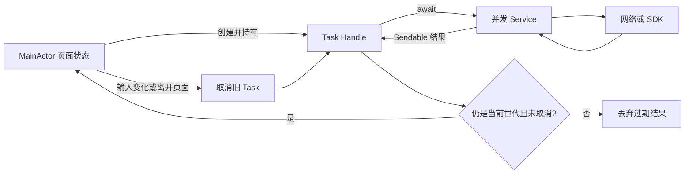
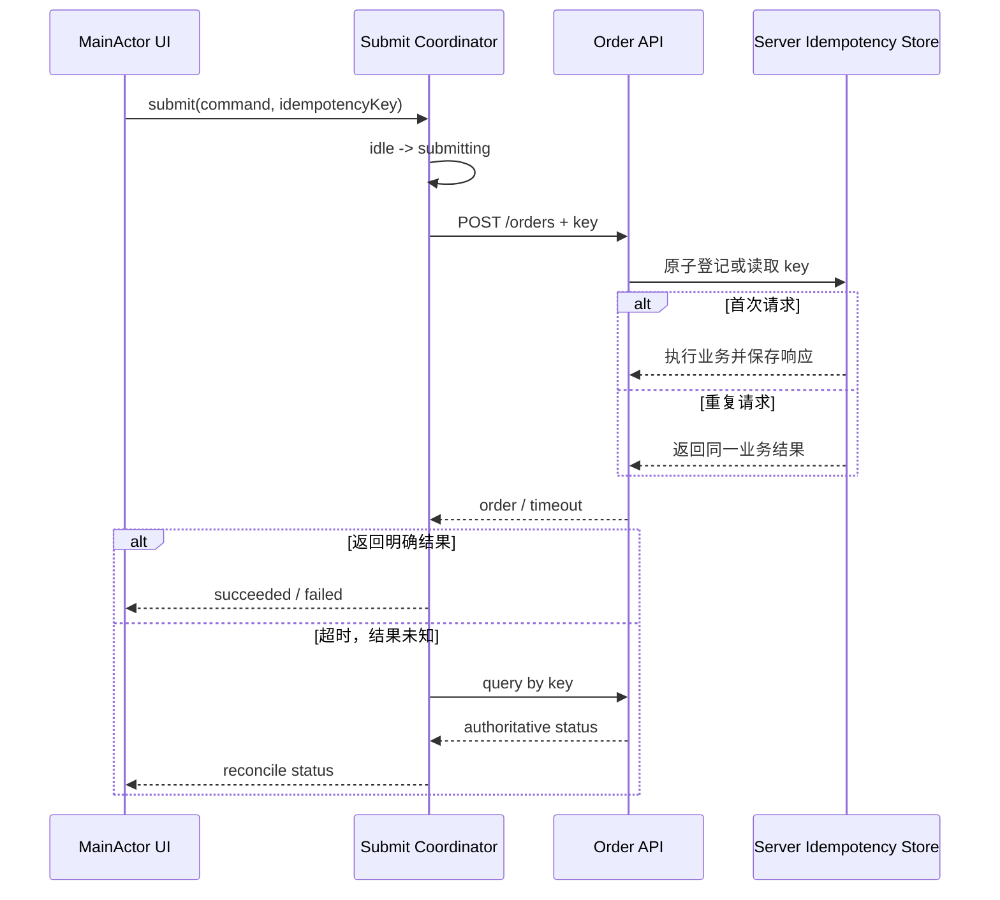

# iOS 并发工程实践：从取消、防抖到 Single-flight 与竞态测试

> 并发工程的目标不是“尽可能多地创建 Task”，而是让每一份可变状态都有明确的所有者，让任务的创建、取消和结束可追踪，并让结果在提交前再次证明自己仍然有效。`@MainActor` 和 Actor 解决的是隔离问题；请求世代、状态机、幂等键与 Single-flight 解决的是时序和业务一致性问题，两者不能互相替代。

---

## 一、问题背景：一个页面为何需要多层并发治理

考虑一个电商搜索页面：用户连续输入关键词，点击商品后提交订单；访问令牌过期时，多个接口同时收到 `401`，需要刷新 Token 后重试。页面退出、账号切换、弱网超时和 SDK 回调都可能在任意阶段发生。

这条链路至少包含以下独立问题：

- 搜索结果只能更新 UI，且旧关键词的结果不能覆盖新关键词；
- 页面销毁或输入变化后，旧请求应尽快取消；
- 快速输入需要防抖，但取消不能被错误吞掉；
- 连点、重试和网络超时不能产生两笔订单；
- 多个鉴权失败只能触发一次 Token 刷新；
- Actor 方法经过 `await` 后，之前检查过的状态可能已经改变；
- Callback 转为 `async` 时，取消与回调可能同时到达；
- 测试必须主动制造交错，而不是依赖偶然复现。

本文以 Swift 6 Language Mode、Complete Strict Concurrency、iOS 17+ 为示例基线。不同 SDK 的回调队列、取消语义和回调次数属于各自公开契约，接入时必须查阅当前版本文档；本文不假设所有 Callback 都在主线程，也不把 `Task.cancel()` 描述为强制中断。

### 核心结论

1. UI Model 通常应整体隔离到 `MainActor`；这保证访问域正确，却不会自动管理页面任务的生命周期。
2. Swift 取消是协作式信号。任务和底层 API 都必须观察取消，调用方还要避免提交已失效的结果。
3. 防抖是“静默期后启动”，请求取消是“停止已启动工作”，结果版本校验是“拒绝过期提交”；三者解决不同阶段的问题。
4. 重复提交治理必须同时覆盖客户端状态机、进行中请求策略、服务端 Idempotency Key，以及超时后的未知结果查询。
5. Token 刷新适合 Actor 内的 Single-flight：保存一个共享 `Task`，并发调用者等待同一个结果。等待者取消和共享任务取消必须制定明确策略。
6. Actor 防止未同步访问，但 Actor 是可重入的；每个 `await` 后都要重新验证账号、版本和业务不变量。
7. Checked Continuation 必须恰好恢复一次，也不会自动继承取消语义。Callback 与取消并发时需要受锁保护的单次完成状态。
8. Thread Sanitizer 能发现部分运行时 Data Race，不能证明没有逻辑竞态；它必须与严格并发检查和确定性并发测试配合。

---

## 二、先建立任务所有权与结果提交规则

并发代码失控通常不是因为缺少某个 API，而是因为回答不了三个问题：谁创建任务、谁取消任务、谁有权提交结果。



关键路径是：UI 隔离域持有非结构化任务的 Handle；任务调用 Service；返回后先检查取消和请求世代，再写 UI。异常路径包括主动取消、底层不响应取消、旧请求晚返回以及页面已不可见。即使底层请求无法立即停止，最后一道“提交校验”仍能防止错误状态进入界面。

### 2.1 `@MainActor` 管访问，不管生命周期

```swift
@MainActor
final class ProductSearchModel {
    private let service: ProductService
    private var searchTask: Task<Void, Never>?

    private(set) var products: [Product] = []
    private(set) var isLoading = false
    private(set) var errorMessage: String?

    init(service: ProductService) {
        self.service = service
    }

    deinit {
        searchTask?.cancel()
    }
}
```

将整个 Model 标为 `@MainActor`，比仅给某几个 Setter 标注更容易审计：UI 状态的读取和修改属于同一隔离域。`URLSession` 等异步操作在挂起期间不会因为调用方属于 MainActor 就持续占用主线程，但不要在 MainActor 隔离方法中执行图片解码、大 JSON 同步解析等 CPU 重任务。

这里保存 `Task` 不是多余的。`Task {}` 创建的是 Unstructured Task，不会因页面消失而自动取消；由 Owner 在新请求、退出页面或 `deinit` 时取消，才能形成清晰生命周期。对 SwiftUI，还应结合 `.task(id:)`，因为框架会在视图身份或 `id` 变化时取消关联任务，但任务内部依然要正确传播取消。

---

## 三、请求取消：取消执行与拒绝结果是两道防线

`Task.cancel()` 只设置取消状态。任务是否尽快结束，取决于它是否调用会抛出 `CancellationError` 的 API、主动执行 `Task.checkCancellation()`，以及底层操作是否支持取消。

```swift
func loadProduct(id: Product.ID) async throws -> Product {
    try Task.checkCancellation()
    let (data, response) = try await session.data(for: makeRequest(id: id))
    try Task.checkCancellation()
    return try validator.decode(Product.self, from: data, response: response)
}
```

`URLSession.data(for:)` 与任务取消具有系统提供的协作行为，但不能由此推导所有第三方 SDK 都会停止工作。若底层有独立 Cancel Handle，可用 `withTaskCancellationHandler` 把 Swift Task 的取消传递下去；Handler 可能与 Operation 并发执行，因此共享状态仍需同步。

调用方不要把取消当作业务错误展示：

```swift
do {
    let product = try await service.loadProduct(id: id)
    try Task.checkCancellation()
    self.product = product
} catch is CancellationError {
    return
} catch {
    errorMessage = error.localizedDescription
}
```

即使底层忽略取消，返回后检查取消也能阻止结果提交。取消因此有两层含义：尽量节省资源，以及保证已失效任务不再产生可见副作用。对于支付、下单等已发送到服务端的操作，客户端取消等待不等于服务端事务撤销，必须查询最终状态。

---

## 四、搜索防抖：静默窗口、取消与版本校验缺一不可

常见错误是吞掉 `sleep` 的取消异常：

```swift
// 错误：取消后 sleep 抛错，但 try? 吞掉异常，旧搜索仍会执行。
try? await Task.sleep(for: .milliseconds(300))
let result = try await service.search(keyword)
```

正确做法是让取消沿任务传播，并使用 Revision 防止不支持取消的旧请求晚到：

```swift
@MainActor
final class SearchModel {
    private let service: ProductService
    private var task: Task<Void, Never>?
    private var revision = 0

    private(set) var products: [Product] = []
    private(set) var errorMessage: String?

    init(service: ProductService) {
        self.service = service
    }

    func searchTextDidChange(_ rawText: String) {
        revision &+= 1
        let currentRevision = revision
        task?.cancel()

        let keyword = rawText.trimmingCharacters(in: .whitespacesAndNewlines)
        guard !keyword.isEmpty else {
            products = []
            return
        }

        task = Task { [service] in
            do {
                try await Task.sleep(for: .milliseconds(300))
                let result = try await service.search(keyword)
                try Task.checkCancellation()
                guard currentRevision == revision else { return }
                products = result
                errorMessage = nil
            } catch is CancellationError {
                // 用户继续输入属于预期控制流。
            } catch {
                guard currentRevision == revision else { return }
                errorMessage = error.localizedDescription
            }
        }
    }

    func stop() {
        revision &+= 1
        task?.cancel()
        task = nil
    }
}
```

这段代码有三道门：300 ms 静默窗口减少请求数；取消旧 Task 尽快停止工作；Revision 保证只有最新输入能提交。具体窗口没有通用最优值，应记录输入到结果的延迟、请求量、取消率和用户任务完成率，在真实设备与真实网络条件下调整，而不是引用未经测量的固定数字。

如果搜索流来自 Combine，`debounce` 与 `switchToLatest` 可以表达相同意图；使用 `AsyncSequence` 时也应选择具有最新值切换语义的实现。无论使用哪个框架，都要核对上游取消是否真正传递到网络层。

---

## 五、重复提交：按钮禁用不是幂等性

按钮禁用只能减少同一界面的连点，无法覆盖 VoiceOver 重复触发、多个入口、客户端重试、代理重放、请求超时或进程重启。下单等有副作用操作需要端到端治理。



客户端可用状态机禁止不合法跃迁：`idle -> submitting -> succeeded`，失败后依据错误类型进入 `retryableFailure` 或 `terminalFailure`。同一业务意图的重试必须复用同一个 Idempotency Key；用户明确创建一笔新订单时才生成新 Key。Key 不应从易碰撞字段临时拼接，服务端还要绑定用户、操作类型和有效期，并以事务或唯一约束原子处理。

需要特别区分两类重复：

- **相同业务意图**：合并、拒绝或返回已保存结果；
- **新的业务意图**：即使参数相同，也允许使用新 Key 再次提交。

请求超时只表示客户端没拿到答案，不表示服务端没成功。此时直接换 Key 重试会产生第二笔订单；正确流程是用原 Key 查询或重放，直到得到权威结果。若接口没有服务端幂等协议，客户端无法单方面提供跨进程、跨设备的 Exactly-once 保证。

---

## 六、Token 刷新合并：Actor 内实现 Single-flight

多个请求同时发现 Token 即将过期时，每个请求都刷新会导致刷新风暴；若服务端启用 Refresh Token Rotation，旧刷新请求还可能覆盖新凭证。Single-flight 的目标是同一会话同一时刻只有一个刷新任务，其余调用者共享结果。

```swift
actor TokenVault {
    private struct Flight {
        let id: UInt64
        let task: Task<Token, Error>
    }

    private let client: AuthClient
    private var token: Token?
    private var flight: Flight?
    private var nextFlightID: UInt64 = 0
    private var sessionGeneration: UInt64 = 0

    init(client: AuthClient) {
        self.client = client
    }

    func validToken() async throws -> Token {
        if let token, !token.isExpiringSoon {
            return token
        }
        return try await refreshToken()
    }

    private func refreshToken() async throws -> Token {
        if let flight {
            return try await flight.task.value
        }

        let generation = sessionGeneration
        let client = self.client
        nextFlightID &+= 1
        let flightID = nextFlightID
        let task = Task { try await client.refresh() }
        flight = Flight(id: flightID, task: task)

        do {
            let newToken = try await task.value
            guard generation == sessionGeneration else {
                throw AuthError.sessionChanged
            }
            token = newToken
            if flight?.id == flightID { flight = nil }
            return newToken
        } catch {
            if flight?.id == flightID { flight = nil }
            throw error
        }
    }

    func signOut() {
        sessionGeneration &+= 1
        token = nil
        flight?.task.cancel()
        flight = nil
    }
}
```

每次 Flight 都有独立 ID，清理时只清除自己。这可避免旧任务在 `await` 后恢复，错误清除新会话刚创建的 Flight。

这里的 `await task.value` 是 Actor 重入点。等待期间 `signOut()` 可以运行，所以恢复后必须检查 `sessionGeneration`。账号切换、刷新凭证轮换、Keychain 写入和内存状态更新应视为一个明确协议：只有当前 Generation 的结果才能落盘，写入失败不得把内存标成已持久化成功。

取消策略也要写进契约。通常一个 HTTP 请求的等待者被取消，不应直接取消大家共享的刷新任务；否则一个页面退出会让其他请求一起失败。可以让共享任务独立完成，或维护等待者计数，在最后一个等待者离开时才取消。若注销发生，则应由 `TokenVault` Owner 主动取消整个 Flight 并递增 Generation。

> `Task` 的结果共享不等于自动缓存。Flight 完成后要清理 Handle；成功 Token 的有效期由凭证状态管理，失败是否短暂缓存则需要结合退避策略，否则持续失败可能形成刷新风暴。

---

## 七、Actor 重入：通过编译不等于事务正确

Actor 保证同一时刻不会并发执行两段隔离的同步代码，但异步方法会被 `await` 分割。挂起时，其他任务可以进入 Actor 改变状态。

```swift
actor Inventory {
    private var reserved = Set<Product.ID>()

    func reserve(_ id: Product.ID) async throws {
        guard !reserved.contains(id) else { return }
        try await remoteInventory.reserve(id) // 重入点
        reserved.insert(id)                    // 前置判断可能已经过期
    }
}
```

修复方向取决于业务协议：

1. 在 `await` 前先进入 `.reserving` 状态，后续调用合并或拒绝；
2. 给操作分配 Revision/Generation，恢复后验证身份；
3. 让远端接口支持 Idempotency Key；
4. 把不可分割的本地状态变更放在不含 `await` 的隔离片段；
5. 若外部操作失败，执行显式回滚或进入可恢复状态，而不是假装整个异步方法具有事务性。

不要为了“避免重入”在 Actor 内调用信号量阻塞 Executor，这可能造成死锁、优先级问题和线程资源浪费。需要原子性的范围应缩小为同步状态转换，外部 I/O 则通过两阶段状态机协调。

---

## 八、Continuation：把单次 Callback 安全桥接为 async

`withCheckedThrowingContinuation` 只检查部分误用，它不会替你实现取消，也不能阻止 Callback 与 Cancellation Handler 同时恢复。Continuation 必须恰好恢复一次：零次会让任务永久挂起，多次是严重程序错误。

下面用 Lock 保护一个同步完成状态。锁只覆盖状态交换，不包围用户回调或 `resume`：

```swift
private final class OneShot<Output: Sendable>: @unchecked Sendable {
    private let lock = NSLock()
    private var continuation: CheckedContinuation<Output, Error>?
    private var terminalResult: Result<Output, Error>?

    func install(_ value: CheckedContinuation<Output, Error>) {
        let resultToResume = lock.withLock {
            if let terminalResult { return terminalResult }
            continuation = value
            return nil
        }
        if let resultToResume { value.resume(with: resultToResume) }
    }

    func finish(_ result: Result<Output, Error>) {
        let continuationToResume = lock.withLock {
            guard terminalResult == nil else { return nil }
            terminalResult = result
            let value = continuation
            continuation = nil
            return value
        }
        continuationToResume?.resume(with: result)
    }
}
```

此处 `@unchecked Sendable` 是一项需要审计的承诺：所有可变字段只能在同一把 Lock 下访问，且锁外才执行 `resume`。真实桥接还要保存 SDK Operation Handle，并在取消 Handler 中调用底层 `cancel()`，同时以 `.failure(CancellationError())` 竞争完成状态。先取消后安装 Continuation 的场景由 `terminalResult` 覆盖；先回调后取消则由单次完成 Guard 忽略第二次完成。

如果 API 会产生多个值、进度或长期事件，应使用 `AsyncStream` / `AsyncThrowingStream`，并在 `onTermination` 中注销订阅；不要反复恢复一个单值 Continuation。

---

## 九、Callback 桥接：先冻结数据，再跨隔离域

Objective-C Delegate 或第三方 SDK 的回调线程不可信时，Adapter 不应直接碰 UI，也不应把可变、Non-Sendable 对象捕获进 `@Sendable` Task。先在回调边界同步复制所需字段为 Sendable DTO，再显式进入目标 Actor：

```swift
struct ScanResult: Sendable {
    let code: String
    let timestamp: Date
}

final class ScannerAdapter: NSObject, LegacyScannerDelegate, @unchecked Sendable {
    private let sink: @Sendable (ScanResult) async -> Void

    init(sink: @escaping @Sendable (ScanResult) async -> Void) {
        self.sink = sink
    }

    nonisolated func scanner(_ scanner: LegacyScanner, didRead value: NSString) {
        let snapshot = ScanResult(code: value as String, timestamp: Date())
        Task { [sink] in
            await sink(snapshot)
        }
    }
}
```

`@unchecked Sendable` 不能机械添加。这里要求 Adapter 初始化后 `sink` 不再变化，并且 Delegate 生命周期由外部 Owner 管理；若 SDK 会并发调用其他可变字段，就必须加锁或改为 Actor Gateway。`Task { @MainActor in ... }` 是异步排队，不保证调用返回前 UI 已更新，多个来源的全局先后关系也不能凭直觉推断。

只有官方契约已保证当前就在 MainActor、但旧接口注解无法表达时，才可在极窄边界使用 `MainActor.assumeIsolated`。对“通常在主线程”的未知回调使用它，会把不确定性变成运行时失败。

---

## 十、并发测试：控制挂起点，验证所有关键交错

并发 Bug 不应靠循环一万次碰运气。可测试设计需要注入 Clock、网络 Client 和可控 Gate，让测试明确决定任务何时挂起与恢复。

以搜索为例，测试至少验证：

- 输入 A 后输入 B，A 晚返回也不能覆盖 B；
- 防抖窗口内不发请求，窗口结束后只发最新请求；
- 页面停止后不更新状态，也不展示取消错误；
- 服务不响应取消时，Revision 仍能拦住过期结果；
- 真正网络错误只由当前请求展示。

Token 刷新测试至少验证：

- 十个并发调用只触发一次 Refresh，所有等待者收到同一结果；
- 一个等待者取消不影响其他等待者；
- Refresh 挂起期间注销，旧结果不能写回；
- Refresh 失败后 Flight 被清理，后续请求能按策略重试；
- 旧 Flight 恢复时不能清除新 Flight。

Continuation 桥接应枚举 `callback -> cancel`、`cancel -> callback` 和两者并发三种情况，并断言底层 Operation 最多取消一次、Continuation 只完成一次。测试用 `withThrowingTaskGroup` 制造并发调用，用 Actor Recorder 记录事件，避免测试自身产生 Data Race。

对时间相关逻辑，优先注入 Swift `Clock` 或项目的 Test Clock，推进虚拟时间而非真实 `sleep`。这会让测试更快且确定。测试结束还应等待所创建的任务，避免悬空任务污染下一用例。

### 10.1 分层验证矩阵

| 验证手段 | 主要发现 | 不能证明 |
| --- | --- | --- |
| Swift 6 Strict Concurrency | 非 Sendable 跨域、隔离违规等静态问题 | 业务时序必然正确 |
| 单元测试与可控挂起点 | 指定交错下的逻辑竞态、取消与状态机错误 | 未枚举交错全部安全 |
| Thread Sanitizer | 实际执行路径上的部分 Data Race | Actor 重入、重复下单等逻辑竞态 |
| Instruments / System Trace | 线程占用、等待、调度与主线程卡顿证据 | 业务结果语义正确 |
| 服务端集成测试 | 幂等键、超时重放和状态查询协议 | 客户端生命周期完全正确 |

---

## 十一、Thread Sanitizer 的正确使用边界

Thread Sanitizer（TSan）通过运行时插桩检测实际执行到的未同步内存访问。可在 Xcode Scheme 的 Diagnostics 中启用，针对包含并发压力和关键交错的测试运行。它有明显运行开销，不应用于 Release 性能结论，也不应与正常耗时直接比较。

使用时遵循以下流程：

1. 在 Debug/Test 配置开启 TSan；
2. 运行高价值并发用例，而不只是启动 App；
3. 从报告中的两条冲突访问栈定位共享状态所有权；
4. 用 Actor、Lock 或不可变快照修复真实同步边界；
5. 添加能稳定覆盖该交错的回归测试；
6. 关闭 TSan 后，在目标设备的 Profile/Release 配置重新测量性能。

TSan 没有报告不代表没有竞态：未执行路径没有覆盖；Actor 内跨 `await` 的旧结果覆盖属于 Logical Race，内存访问本身可能完全同步；服务端重复提交更不属于内存 Data Race。反过来，不应通过随意添加 `@unchecked Sendable` 或关闭检查“修复”报告，这只会隐藏编译器信号。

---

## 十二、工程落地清单

### 12.1 设计阶段

- 为 UI、缓存、凭证和提交状态指定唯一 Owner 与隔离域；
- 区分 Child Task、Unstructured Task 和 Detached Task，写清取消传播；
- 为每个 `await` 标出恢复后需要重新验证的不变量；
- 为有副作用接口定义 Idempotency、重试和未知结果查询协议；
- 为共享异步工作定义 Single-flight 的成功、失败、取消和清理策略。

### 12.2 Code Review

- 是否出现 `try? await Task.sleep` 吞取消；
- 页面创建的 Task Handle 是否由页面或 Model 持有并取消；
- Callback 是否假设了未写进文档的线程或调用次数；
- Continuation 是否覆盖零次、多次、取消先到和回调先到；
- Actor 方法是否把 `await` 前的判断当作恢复后仍成立；
- `@unchecked Sendable` 是否有可审计的同步不变量；
- 超时重试是否错误生成了新的幂等键。

### 12.3 发布前验证

- 使用 Swift 6 Complete Strict Concurrency 构建目标模块；
- 用可控时钟和 Gate 覆盖关键交错；
- 开启 TSan 执行并发测试集；
- 在真实设备 Profile/Release 配置检查主线程与任务调度；
- 通过服务端集成测试验证重复请求与超时对账。

---

## 十三、总结

iOS 并发工程的核心是“所有权、生命周期、提交条件”。`MainActor` 让 UI 状态有明确隔离域；Task Handle 与协作式取消管理生命周期；Revision 拒绝过期搜索结果；客户端状态机与服务端 Idempotency Key 共同治理重复提交；Actor Single-flight 合并 Token 刷新，但必须防范重入和会话切换；Continuation 与 Callback 桥接则需要把线程、次数、取消和 Sendable 边界明确写进协议。

真正可靠的并发代码不会只依赖一种工具。编译器检查 Data Race Safety，状态机维护业务不变量，可控挂起点验证 Logical Race，TSan 检查实际运行路径上的未同步访问，服务端协议保证跨进程一致性。每一层都有能力边界，也都不能被另一层替代。

---

## 问答复盘

### Q1：把 ViewModel 标为 `@MainActor` 后，页面退出时网络任务会自动取消吗？

**答：** 不会。`@MainActor` 规定状态访问的隔离域，不管理 Unstructured Task 生命周期。页面或 Model 必须持有 Task Handle，并在输入变化、退出或销毁时取消。

### Q2：为什么搜索防抖不能写成 `try? await Task.sleep(...)`？

**答：** 因为 `sleep` 在取消时抛出 `CancellationError`，`try?` 会吞掉它并继续执行后续请求。应让异常退出当前任务，或显式捕获取消后立即返回。

### Q3：已经取消旧搜索请求，为什么还需要 Revision？

**答：** 取消是协作式的，底层 SDK 可能不响应或结果已在返回途中。Revision 是提交阶段的最终校验，确保只有当前输入对应的任务能更新状态。

### Q4：禁用提交按钮能否保证不会重复下单？

**答：** 不能。它只减少当前界面的连点，无法处理超时重试、多个入口、进程重启和网络重放。必须配合客户端状态机和服务端 Idempotency Key，并能查询未知结果。

### Q5：Token 刷新任务的一个等待者取消时，是否应取消共享任务？

**答：** 通常不应。共享刷新服务于多个请求，一个页面退出不应使其他请求失败。可让 Flight 独立完成或采用等待者计数；注销则由凭证 Owner 取消整个 Flight。

### Q6：Actor 已经串行保护状态，为什么 Token 刷新后还要检查 Session Generation？

**答：** Actor 方法在 `await` 处可重入。刷新挂起期间可能发生注销或账号切换，恢复后的结果虽没有 Data Race，却已属于旧会话，必须拒绝写回。

### Q7：Checked Continuation 是否会自动处理 Task 取消和重复回调？

**答：** 不会。取消需要通过 Cancellation Handler 传递到底层操作；取消与回调还要竞争一个受同步保护的单次完成状态，保证 Continuation 恰好恢复一次。

### Q8：Objective-C 回调声明为 `nonisolated` 后，可以直接修改 UI 吗？

**答：** 不可以。`nonisolated` 只表示不属于某个 Actor 隔离域。应先复制为 Sendable 快照，再显式 Hop 到 MainActor；只有文档明确保证的边界才考虑 `MainActor.assumeIsolated`。

### Q9：Thread Sanitizer 全部通过，是否说明并发实现正确？

**答：** 不能。TSan 只检查实际执行路径上的部分 Data Race，无法发现 Actor 重入导致的旧结果覆盖或服务端重复提交。还需要严格并发检查、确定性交错测试和集成测试。

### Q10：遇到 Actor 重入竞态，能否在 Actor 内用信号量包住整个异步流程？

**答：** 不应这样做。阻塞 Executor 可能引入死锁和线程资源问题。应把原子范围缩小为同步状态转换，并用 In-flight 状态、Revision、两阶段提交或幂等协议协调外部异步工作。

---

## 延伸知识

- **Structured Concurrency**：理解 Child Task 的作用域、错误和取消如何随父任务传播。
- **Swift 任务执行模型**：区分 Task、Job、Executor、Actor Isolation 与 OS Thread。
- **请求重试策略**：结合错误分类、Exponential Backoff、Jitter 与 Retry Budget，避免重试风暴。
- **分布式幂等性**：继续研究 Idempotency Record、唯一约束、事务边界和最终一致性对账。
- **可观测性**：用 `os_signpost`、Instruments 和关联 ID 串联 Task、网络请求、刷新 Flight 与服务端 Trace。
