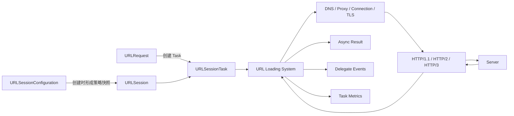
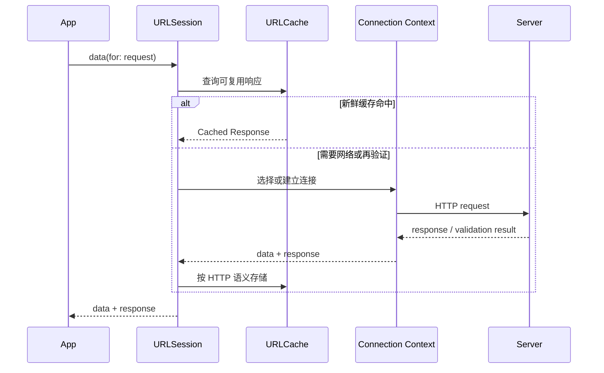
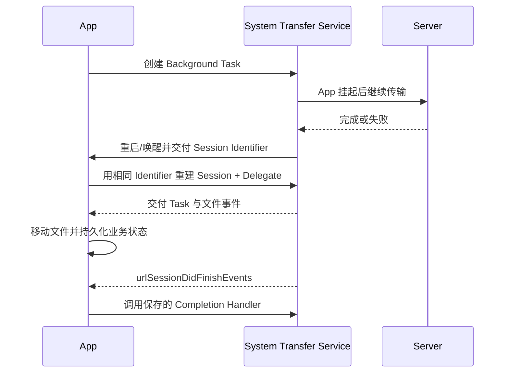

# iOS URL Loading System：从 URLSession 到缓存、认证与后台传输

> `URLSession` 不是一个简单的“发请求函数”，而是一次或一组传输任务的策略与资源边界：配置决定缓存、Cookie、超时和网络约束，Session 管理 Task、Delegate 与可复用连接，HTTP 语义决定响应能否缓存，系统与服务端共同协商 HTTP/2 或 HTTP/3。工程上应长期复用少量 Session，把每次请求的业务差异放进 `URLRequest`，再用响应校验、指标和生命周期治理补齐可靠性。

---

## 一、本文解决什么问题

一个看似简单的商品详情请求，背后至少有这些问题：

- `URLSession`、`URLRequest` 和 `URLSessionTask` 分别负责什么？
- `URLSession.shared` 能否承载所有请求，为什么不应每次新建 Session？
- 配置修改后为什么没有作用？`default`、`ephemeral` 和 `background` 如何选择？
- Async API 与 Delegate API 是替代关系，还是可以协作？
- 系统何时复用连接，应用能否强制使用 HTTP/2 或 HTTP/3？
- `cachePolicy` 是否能够无视服务端的 `Cache-Control`？
- Cookie、Bearer Token 和 Authentication Challenge 是同一种认证机制吗？
- App 进入后台后，普通 `data(for:)` 是否会一直运行？
- 如何证明请求慢在 DNS、建连、TLS、服务端等待还是数据传输？

本文以 Swift 6、iOS 17+ 为示例基线，结论优先依赖 Foundation 与 HTTP 的公开契约。连接池规模、调度算法、协议回退细节属于系统实现，可能随 OS、网络环境和服务端配置变化，不应写成固定线程数、固定连接数或绝对协议选择。

### 核心结论

1. `URLRequest` 是请求描述，`URLSessionTask` 是一次传输的可控实例，`URLSession` 是配置、Delegate、凭证、缓存及连接复用的上下文。
2. Session 创建时会使用 Configuration 的快照；创建后修改原 Configuration，不会重新配置已有 Session。
3. 应按策略边界复用少量 Session，而不是每次请求新建。复用有利于连接、Cookie、缓存与认证状态协作，也减少重复建连成本。
4. Async API 适合单次请求的线性控制流；Delegate 适合进度、流式数据、重定向、认证挑战、后台事件和细粒度生命周期控制，两者可在同一 Session 中配合。
5. `cancel()` 是协作式取消，已到达服务端的副作用不会被撤回；恢复下载需要服务器与响应条件支持，不能把 `cancel(byProducingResumeData:)` 当作必然可恢复。
6. HTTP/2、HTTP/3 由系统依据 URL、服务端能力、TLS、网络路径和系统策略协商。应用应通过 `URLSessionTaskMetrics` 观察实际协议，而不是假定。
7. `URLCache` 遵循请求 Cache Policy 与 HTTP 缓存语义。客户端策略不能把不可缓存的响应安全地变成可缓存，也不能用缓存替代业务数据一致性设计。
8. Cookie 由 `HTTPCookieStorage` 等机制管理；Bearer Token 通常由应用写入 Header；HTTP/TLS 认证挑战由 Delegate 处理，三者不能混为一谈。
9. Background Session 面向可由系统接管的 HTTP/HTTPS 上传下载，不是任意代码后台常驻机制；事件恢复、文件交付和 Completion Handler 必须完整闭环。

---

## 二、四层对象模型：从请求描述到传输结果



关键路径是：Configuration 定义 Session 级策略，Session 根据 Request 创建 Task，URL Loading System 处理缓存、代理、连接和协议传输，结果通过 Async 返回值或 Delegate 事件交付。异常路径可能在 URL 解析、DNS、连接、TLS、重定向、认证、HTTP 状态校验或响应解码中的任一阶段发生。

### 2.1 `URLRequest`：值类型请求描述

`URLRequest` 描述 URL、Method、Header、Body、Cache Policy 和 Timeout 等请求属性。它是值类型，适合在发送前由 Request Builder 构造并完成可审计的修改。

```swift
struct ProductRequestBuilder {
    let baseURL: URL

    func detail(id: String, accessToken: String) throws -> URLRequest {
        guard var components = URLComponents(
            url: baseURL.appending(path: "v1/products/\(id)"),
            resolvingAgainstBaseURL: false
        ) else {
            throw RequestError.invalidURL
        }
        components.queryItems = [URLQueryItem(name: "locale", value: "zh-CN")]

        guard let url = components.url else { throw RequestError.invalidURL }
        var request = URLRequest(url: url)
        request.httpMethod = "GET"
        request.setValue("application/json", forHTTPHeaderField: "Accept")
        request.setValue("Bearer \(accessToken)", forHTTPHeaderField: "Authorization")
        request.cachePolicy = .useProtocolCachePolicy
        request.timeoutInterval = 15
        return request
    }
}
```

查询参数应由 `URLComponents` 编码，不应直接拼字符串。Header 名称大小写不应承载业务语义。超时是失败边界，不是请求必然在精确秒数终止的实时定时器；Resource Timeout、Request Timeout、网络等待策略还会共同影响最终行为。

### 2.2 `URLSessionTask`：一次传输的状态载体

`URLSessionTask` 家族主要包括：

- `URLSessionDataTask`：把响应体作为内存数据或增量数据交付；
- `URLSessionDownloadTask`：下载到临时文件，适合大文件和后台下载；
- `URLSessionUploadTask`：上传 Data、文件或 Stream；后台上传应使用文件来源；
- `URLSessionWebSocketTask`：WebSocket 双向消息，不等同于普通 HTTP 请求响应。

通过 Completion Handler 创建的 Task 通常需要调用 `resume()`；`data(for:)` 等 Async API 会为调用者管理启动与等待。Task 提供 `cancel()`、优先级、进度和状态，但 Priority 是调度提示，不是服务质量保证。

### 2.3 `URLResponse` 不是成功证明

Transport 成功只意味着收到了响应，HTTP `404`、`429`、`500` 不会自动变成 `URLError`。业务层必须验证响应类型、状态码、Content-Type 和数据格式：

```swift
struct HTTPClient: Sendable {
    let session: URLSession

    func data(for request: URLRequest) async throws -> Data {
        let (data, response) = try await session.data(for: request)
        try Task.checkCancellation()

        guard let http = response as? HTTPURLResponse else {
            throw HTTPError.nonHTTPResponse
        }
        guard (200..<300).contains(http.statusCode) else {
            throw HTTPError.status(code: http.statusCode, body: data)
        }
        return data
    }
}
```

生产代码还应限制错误 Body 的内存与日志大小，对敏感字段脱敏，并把可重试错误、认证错误、限流和业务错误映射为 Typed Error。相关治理应放在下一模块“请求治理”，而不是堆进 Session Delegate。

---

## 三、Session Configuration：先定义策略边界

常用 Configuration 类型有三类：

| 类型 | 典型用途 | Cookie / Cache | 生命周期特点 |
| --- | --- | --- | --- |
| `default` | 普通前台 API、图片请求 | 使用持久化能力，具体受配置影响 | 随 App 进程运行 |
| `ephemeral` | 临时登录、隐私敏感或测试隔离 | 默认不向持久存储写 Cache、Cookie、Credentials | 内存态不等于业务数据自动安全 |
| `background(withIdentifier:)` | 系统接管的大文件上传下载 | 由后台传输策略管理 | 可跨 App 挂起或系统终止恢复事件 |

`ephemeral` 不是“绝不缓存任何内容”的同义词，它仍可能在内存中维护传输所需状态；敏感数据是否落盘还取决于应用自己的日志、数据库和文件处理。

```swift
func makeAPISession(delegate: URLSessionDelegate? = nil) -> URLSession {
    let configuration = URLSessionConfiguration.default
    configuration.waitsForConnectivity = true
    configuration.timeoutIntervalForRequest = 20
    configuration.timeoutIntervalForResource = 60
    configuration.requestCachePolicy = .useProtocolCachePolicy
    configuration.urlCache = URLCache(
        memoryCapacity: 32 * 1024 * 1024,
        diskCapacity: 128 * 1024 * 1024
    )
    configuration.httpCookieAcceptPolicy = .onlyFromMainDocumentDomain

    return URLSession(
        configuration: configuration,
        delegate: delegate,
        delegateQueue: nil
    )
}
```

创建 Session 后再改 `configuration.timeoutIntervalForRequest` 不会影响该 Session。若策略需要变化，应创建新的 Configuration 和 Session，并规划旧 Session 的 `finishTasksAndInvalidate()` 或 `invalidateAndCancel()` 生命周期。

`waitsForConnectivity` 允许任务在网络暂不可用时等待系统认为合适的连接机会，并通过 Delegate 报告等待；它不是无限等待，也不是离线队列。`allowsCellularAccess`、`allowsConstrainedNetworkAccess`、`allowsExpensiveNetworkAccess` 应结合业务大小和用户设置决定，不能仅用网络类型粗暴拒绝。

---

## 四、Delegate：事件、队列与生命周期

Async API 简化了单次结果处理，但以下场景仍需要 Delegate：

- 接收上传、下载或增量数据进度；
- 处理重定向和 Authentication Challenge；
- 获取 `URLSessionTaskMetrics`；
- 处理 Background Session 事件；
- 下载临时文件交付和 Resume Data；
- 实现按流消费而非一次性把整个 Body 放入内存。

`delegateQueue: nil` 时，Session 创建自己的串行 Operation Queue。自定义 Delegate Queue 时，回调并不因此属于 MainActor；若设置并发队列，还必须保护 Delegate 的共享可变状态。UI 更新应显式进入 MainActor。

```swift
final class MetricsDelegate: NSObject, URLSessionTaskDelegate, @unchecked Sendable {
    private let recorder: MetricsRecorder

    init(recorder: MetricsRecorder) {
        self.recorder = recorder
    }

    func urlSession(
        _ session: URLSession,
        task: URLSessionTask,
        didFinishCollecting metrics: URLSessionTaskMetrics
    ) {
        let snapshots = metrics.transactionMetrics.map(TransactionSnapshot.init)
        Task { [recorder] in
            await recorder.record(taskID: task.taskIdentifier, metrics: snapshots)
        }
    }
}
```

示例假设 `MetricsRecorder` 是 Actor，且 `TransactionSnapshot` 是只包含 Sendable 值的不可变快照。不要把可变 Foundation/Objective-C 对象直接跨隔离域长期持有。严格并发诊断会受 SDK 注解与 Swift 版本影响，`@unchecked Sendable` 只能在所有字段和回调路径均审计后使用。

### 4.1 Session 失效是显式生命周期事件

- `finishTasksAndInvalidate()`：不接受新 Task，等待现有 Task 结束后通知 Delegate；
- `invalidateAndCancel()`：取消未完成 Task 并使 Session 失效；
- `URLSession.shared` 由系统管理，应用不应对它调用失效方法。

Delegate Session 对 Delegate 有持有关系，因此临时创建 Session 并期待局部变量离开作用域自动释放可能形成意外长生命周期。应由网络容器持有并在业务边界显式失效。

---

## 五、取消、超时与重定向不是同一件事

Swift Task 取消会向支持并发的 URLSession Async 操作传播，但取消仍是协作式行为。网络数据可能已经发送，服务端也可能已提交事务。对下单、支付和上传确认等操作，取消等待后必须通过 Idempotency Key 查询最终状态。

```swift
func fetchImage(_ request: URLRequest) async throws -> Data {
    do {
        let (data, response) = try await session.data(for: request)
        try Task.checkCancellation()
        try validateImageResponse(response, data: data)
        return data
    } catch is CancellationError {
        throw CancellationError()
    } catch let error as URLError where error.code == .cancelled {
        throw CancellationError()
    }
}
```

是否将 `URLError.cancelled` 统一映射为 `CancellationError` 是 API 层契约选择，应保持一致。Timeout 说明在规定阶段内未完成，不说明服务端未处理；Redirect 则会产生新的 Transaction，可能改变 Method、认证信息和跨域安全边界。敏感 Header 是否跟随重定向必须审计，必要时通过 Delegate 拒绝或重建 Request。

下载任务的 Resume Data 只是恢复尝试所需信息，能否续传受服务端 Range、ETag/Last-Modified、临时文件和系统版本等条件影响。实现必须准备好 Resume 失败后完整重下，并验证最终文件的长度、类型或摘要。

---

## 六、连接复用与协议协商

反复创建 Session 会割裂可以共享的传输上下文，并可能增加 DNS、TCP/TLS 或 QUIC 建连成本。工程上通常按以下边界复用 Session：

- API 请求使用一个或少量策略一致的 Session；
- 图片/CDN 可按缓存、超时和 Header 策略拆分；
- 临时隐私流量使用 Ephemeral Session；
- 大文件后台传输使用稳定 Identifier 的 Background Session。

这不是要求“全 App 只能有一个 Session”。不同 Proxy、Cookie、Credential、缓存或网络访问策略应拆开；相同策略则不应按请求创建。



### 6.1 HTTP/2 与 HTTP/3 由系统协商

应用通常提供 HTTPS URL，URL Loading System 决定具体传输协议。HTTP/2 可在一条连接上多路复用多个 Stream；HTTP/3 基于 QUIC，并可能改善某些网络迁移和丢包场景。但“使用 HTTP/3 一定更快”不是可靠结论，收益取决于网络、服务端、连接复用和工作负载。

不要通过 User-Agent 或业务 Header 推断协议。应检查每个 Transaction Metric 的 `networkProtocolName`，并结合 `isReusedConnection`、DNS、Connect、Secure Connection、Request、Response 时间戳分析。一次 Task 因重定向、认证或缓存再验证可能包含多个 Transaction Metric。

系统是否选择 HTTP/3 受 OS 能力、服务端支持、TLS、Alt-Svc/DNS 提示、网络路径和系统策略影响。应用不应依赖某个未公开的固定回退顺序。

---

## 七、HTTP 缓存：Cache Policy 与服务端语义共同决定

缓存判断至少包含两层：

1. Request 的 `cachePolicy` 决定如何使用本地缓存和网络；
2. Response 的 `Cache-Control`、`Expires`、`ETag`、`Last-Modified`、`Vary` 等决定可缓存性、新鲜度和再验证。

常见 Policy 的工程含义：

| Cache Policy | 核心意图 | 主要风险 |
| --- | --- | --- |
| `.useProtocolCachePolicy` | 遵循协议默认语义 | 需要服务端正确配置 Header |
| `.reloadIgnoringLocalCacheData` | 忽略本地缓存并请求源端 | 增加网络与服务端负载 |
| `.returnCacheDataElseLoad` | 有缓存就返回，否则联网 | 可能返回已过期数据 |
| `.returnCacheDataDontLoad` | 只读缓存，不联网 | Miss 会直接失败 |
| `.reloadRevalidatingCacheData` | 尝试与源端再验证 | 可用性和行为需结合目标 OS 验证 |

`.returnCacheDataElseLoad` 并不保证缓存数据仍符合业务时效。库存、余额和权限等强一致数据不应因“命中更快”就无条件采用。对离线优先业务，应在业务缓存层保存数据版本、更新时间和来源，并明确展示 Stale 状态。

### 7.1 条件请求与 `304`

缓存过期但存在 Validator 时，系统可发送 `If-None-Match` 或 `If-Modified-Since`。服务端返回 `304 Not Modified` 后，可复用已有 Body 并更新元数据。应用通常看到的是 URL Loading System 合成后的可用响应，不应把所有缓存验证逻辑重复手写；若自建缓存，则必须正确处理 `Vary`、认证范围和用户隔离。

`URLCache` 容量是上限与策略输入，不保证某条响应一定保留。大对象、流式响应、请求方法和响应 Header 都会影响缓存。敏感用户响应应由服务端发送合适的 `Cache-Control`，客户端也要避免跨账号复用自建缓存 Key。

---

## 八、Cookie：存储策略、作用域与安全属性

Cookie 是否发送由 Domain、Path、Secure、Expires/Max-Age、SameSite 等属性以及 Session Configuration 共同决定。常见配置项包括：

- `httpCookieStorage`：Cookie 存储；
- `httpShouldSetCookies`：是否自动处理 Cookie；
- `httpCookieAcceptPolicy`：接受策略。

Ephemeral Session 默认使用非持久 Cookie 存储，适合临时会话隔离；若多个账号共享同一个持久 `HTTPCookieStorage`，注销时必须按域和业务契约清理，避免串号。Cookie 中的 `HttpOnly` 主要限制脚本访问，不意味着原生 App 内所有代码都无法接触存储；`Secure` 只允许安全传输，也不能替代服务端会话安全。

Cookie 认证与 `Authorization: Bearer ...` 是不同机制。后者通常由应用凭证层读取并写入 Request，Token 刷新需要 Single-flight；不要把访问 Token 塞进 URL Query，因为 URL 更容易进入日志、缓存和分析系统。

---

## 九、Authentication Challenge：认证空间中的决策

Challenge 可能来自服务端认证、代理认证、TLS Server Trust 或 Client Certificate。Delegate 收到 `URLAuthenticationChallenge` 后，需要选择：

- `.performDefaultHandling`：交给系统默认处理；
- `.useCredential`：提供匹配 Credential；
- `.cancelAuthenticationChallenge`：取消；
- `.rejectProtectionSpace`：拒绝当前 Protection Space，继续寻找其他处理；
- `.useCredential` 配合 `nil` 并非通用“忽略认证”手段。

```swift
final class AuthenticationDelegate: NSObject, URLSessionTaskDelegate {
    func urlSession(
        _ session: URLSession,
        task: URLSessionTask,
        didReceive challenge: URLAuthenticationChallenge,
        completionHandler: @escaping (URLSession.AuthChallengeDisposition, URLCredential?) -> Void
    ) {
        guard challenge.previousFailureCount == 0 else {
            completionHandler(.cancelAuthenticationChallenge, nil)
            return
        }

        completionHandler(.performDefaultHandling, nil)
    }
}
```

对 Server Trust，默认系统信任评估通常是正确起点。不能为了“解决测试证书问题”对所有证书返回信任，这会破坏 TLS 身份认证。Certificate Pinning、Client Certificate 和自定义 Trust Evaluation 有轮换、灾备、证书链与系统策略成本，应在“安全传输”模块单独设计。

HTTP `401` 携带的认证挑战与 OAuth Bearer Token 刷新也不应机械混用。很多 JSON API 更适合在 Response Validation 层识别业务认证失败，由 Token Vault 合并刷新，并对满足可重放条件的请求重试一次。带副作用或不可重放 Body 的请求不能无条件自动重试。

---

## 十、Background Transfer：系统接管传输，不是后台常驻

Background URLSession 适合大文件 HTTP/HTTPS 上传下载。传输可由系统进程管理，App 被系统挂起或终止后仍可能继续；完成时系统可重新启动 App 交付事件。它不允许任意业务代码持续运行，也不能替代 `BGTaskScheduler`、音频或定位后台模式。

```swift
func makeBackgroundSession(
    identifier: String,
    delegate: URLSessionDelegate
) -> URLSession {
    let configuration = URLSessionConfiguration.background(
        withIdentifier: identifier
    )
    configuration.isDiscretionary = false
    configuration.sessionSendsLaunchEvents = true
    configuration.allowsCellularAccess = true
    return URLSession(
        configuration: configuration,
        delegate: delegate,
        delegateQueue: nil
    )
}
```

Identifier 必须稳定且在应用中唯一；App Extension 与主 App 应使用不同 Background Session Identifier。后台上传应从文件创建，因为系统接管传输时不能依赖进程内 Data 或 Stream。下载完成回调给出的文件是临时文件，必须在回调返回前移动到沙盒内的持久位置，并处理文件冲突与磁盘错误。

### 10.1 事件恢复闭环



在 UIKit App 中，系统通过 App Delegate 的 Background URLSession 事件入口交付 Identifier 和 Completion Handler。应用必须保存 Handler，用相同 Identifier 重建 Session，处理完全部 Delegate 事件后在 `urlSessionDidFinishEvents(forBackgroundURLSession:)` 调用 Handler，让系统知道 UI Snapshot 等收尾工作可以进行。

用户从多任务界面强制退出 App 后，系统通常会取消该 App 的后台传输，并且不会仅因这些传输自动重新启动；下次用户启动时应对账并恢复可重试任务。系统终止、设备重启、网络限制和用户强退的行为边界不同，测试必须分别覆盖。

---

## 十一、性能与可观测性：先定位阶段，再谈优化

不要只记录“接口耗时 2 秒”。`URLSessionTaskMetrics` 可以提供一次 Task 中每个 Transaction 的阶段信息：

- Domain Lookup 起止；
- Connect 与 Secure Connection 起止；
- Request 发送与 Response 接收起止；
- Protocol Name、Proxy、Connection Reuse；
- Resource Fetch Type，例如 Network、Local Cache 或 Server Push 等系统报告值。

建议记录关联 Request ID、Task ID、Host、Method、Status、Payload Size、Protocol、Cache Source、是否复用连接和各阶段耗时。URL Query、Authorization、Cookie、请求体及响应体必须脱敏，错误 Body 还要限长。

性能验证应在目标设备、代表性 Wi-Fi/蜂窝/弱网条件下进行，区分冷连接和暖连接，分别统计 DNS、Connect、TLS、TTFB 与下载阶段的分位数。启用 TSan、Network Link Conditioner 或调试代理会改变时延，不能作为 Release 基准。

常见证据与可能方向：

| 观察 | 先验证 | 可能方向 |
| --- | --- | --- |
| Connect/TLS 持续高 | Session 是否反复创建、连接是否复用 | 复用 Session，检查服务端 Keep-Alive 与证书链 |
| TTFB 高 | 服务端 Trace、排队、Cache Miss | 优化服务端或 CDN，不要先改客户端线程 |
| 下载阶段高 | Body 大小、压缩、网络质量 | 分页、压缩、图片规格、流式处理 |
| 本应命中缓存却联网 | Response Header、Vary、Policy | 修正 HTTP 缓存契约与 Cache Key |
| HTTP/3 比例变化 | OS、网络、服务端发布与 Metrics | 分环境对比，不假定客户端强制协议 |

---

## 十二、常见误区与修复

### 12.1 每次请求创建一个 Session

**问题：** 割裂连接、缓存、Cookie、Credential 与 Metrics 生命周期，增加配置漂移。

**修复：** 按策略域长期复用少量 Session，每次差异放入 `URLRequest`。

### 12.2 只判断 `error == nil`

**问题：** HTTP `500` 仍可能没有 Transport Error，错误 HTML 也可能被当 JSON 解码。

**修复：** 分层验证 `HTTPURLResponse`、Status、Content-Type、Body 与业务 Error Envelope。

### 12.3 把 Cache Policy 当成强制缓存开关

**问题：** 忽略服务端 Cache-Control、Validator、Vary 和用户隔离，容易返回过期或串号数据。

**修复：** 遵循 HTTP 语义；离线业务另建带版本和新鲜度的业务缓存层。

### 12.4 在任意 Challenge 中信任证书

**问题：** 关闭了 TLS 身份校验，使中间人攻击成为可能。

**修复：** 默认使用系统 Trust Evaluation；自定义策略必须设计轮换、灾备和测试。

### 12.5 认为 Background Session 能运行任意代码

**问题：** Background Session 只让系统接管适合的网络传输，App 执行时间仍受系统管理。

**修复：** 用文件型 Upload/Download Task，完整实现 Identifier 恢复、文件移动和事件 Completion Handler。

---

## 十三、工程选择建议

- **普通 JSON API**：复用 Default Session，Async API 返回结果，统一 Response Validator 和 Metrics Delegate；
- **无痕或临时授权流**：Ephemeral Session，并审计应用自己的持久化与日志；
- **图片与媒体**：独立缓存策略，按大小选择 Data、Bytes 或 Download Task，避免大 Body 峰值；
- **大文件跨后台上传下载**：Background Session + File Task + 持久 Task 映射；
- **进度、重定向、认证和 Metrics**：使用 Delegate，不假设回调在 MainActor；
- **实时双向通信**：评估 WebSocket Task，并另行设计心跳、重连、前后台与消息顺序；
- **高一致性写操作**：URLSession 只负责传输，幂等、对账、重试与认证刷新由请求治理层负责。

---

## 十四、总结

URL Loading System 的可靠使用建立在清晰分层上：`URLRequest` 描述一次请求，`URLSessionTask` 表示一次传输，`URLSession` 承载共享策略和资源上下文，Delegate 补充事件与生命周期控制。长期复用策略一致的 Session，才能让连接复用、Cookie、缓存、认证和指标形成稳定边界。

HTTP/2 与 HTTP/3 是协商结果，缓存是客户端策略与服务端语义的共同结果，取消和超时也都不能撤回已经发生的服务端副作用。Background Session 只接管适合的上传下载，并要求应用正确恢复事件。工程优化应从 `URLSessionTaskMetrics` 和服务端 Trace 出发，先证明时间花在哪一阶段，再调整客户端、协议或服务端。

---

## 问答复盘

### Q1：`URLSession`、`URLRequest` 与 `URLSessionTask` 的核心区别是什么？

**答：** Request 是请求描述，Task 是一次传输实例，Session 是配置、Delegate、缓存、Cookie、认证与连接复用的上下文。策略相同的请求通常共享 Session。

### Q2：修改创建 Session 时使用的 Configuration，为什么已有请求不受影响？

**答：** Session 在初始化时使用 Configuration 的快照。后续修改原对象不会动态重配已有 Session；策略变化需要创建新 Session，并治理旧 Session 的失效。

### Q3：`URLSession.shared` 是否适合所有请求？

**答：** 不适合。它适合简单默认策略，但无法满足独立 Delegate、Ephemeral 隔离、Background Transfer 或定制 Cache/Cookie/网络约束。也不应为了定制而每次新建 Session。

### Q4：`data(for:)` 没抛异常，能否直接解码成功模型？

**答：** 不能。HTTP `4xx/5xx` 通常仍会正常返回 Data 与 Response。必须先验证 `HTTPURLResponse`、状态码和媒体类型，再解码业务模型或错误模型。

### Q5：如何确认请求实际使用了 HTTP/2 或 HTTP/3？

**答：** 查看 `URLSessionTaskMetrics.transactionMetrics` 中的 `networkProtocolName`。协议由系统、服务端和网络协商，不能根据 URL 或主观预期断言。

### Q6：设置 `.returnCacheDataElseLoad` 是否保证返回最新数据？

**答：** 不保证。它优先返回已有缓存，即使缓存已经过期。库存、余额等数据需要符合业务一致性的缓存和再验证策略，不能只靠 Cache Policy。

### Q7：Cookie、Bearer Token 和 Authentication Challenge 有何边界？

**答：** Cookie 按域和属性由 Cookie Storage 管理；Bearer Token 通常由应用写入 Authorization Header；Challenge 是服务端、代理或 TLS 认证决策入口。三者生命周期和重试方式不同。

### Q8：取消一个下单请求，是否意味着服务端不会创建订单？

**答：** 不意味着。取消只停止客户端继续等待或尽力停止传输，请求可能已经到达服务端。应使用 Idempotency Key 并查询权威状态。

### Q9：Background Session 与普通 Session 的关键区别是什么？

**答：** Background Session 可让系统服务接管适合的 HTTP/HTTPS 文件上传下载，并在 App 恢复后交付事件。它不是任意后台代码执行机制，需要稳定 Identifier 和完整事件恢复流程。

### Q10：接口慢时，为什么不应先增加并发或切换 HTTP/3？

**答：** 总耗时可能来自 DNS、TLS、服务端 TTFB 或 Body 传输。应先用 Task Metrics、服务端 Trace 和分环境数据定位阶段；盲目增并发可能加剧排队，HTTP/3 也不保证对所有网络更快。

---

## 延伸知识

- **请求治理**：API Client 分层、Typed Error、Retry、Backoff、Idempotency、Token Refresh 与 Rate Limit；
- **安全传输**：ATS、TLS Trust Evaluation、Certificate Pinning、Client Certificate 与 Request Signing；
- **HTTP 语义**：Safe/Idempotent Method、Conditional Request、Content Negotiation 与 Status Code；
- **网络诊断**：`URLSessionTaskMetrics`、Instruments、Network.framework Path 与服务端 Distributed Trace；
- **后台执行**：Background URLSession、`BGTaskScheduler`、系统预算和 App 生命周期恢复。
