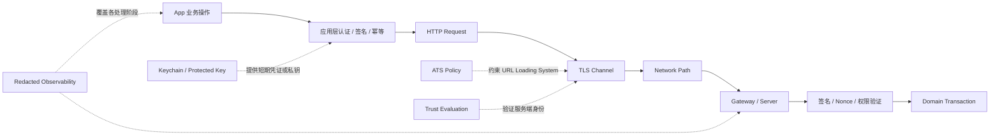
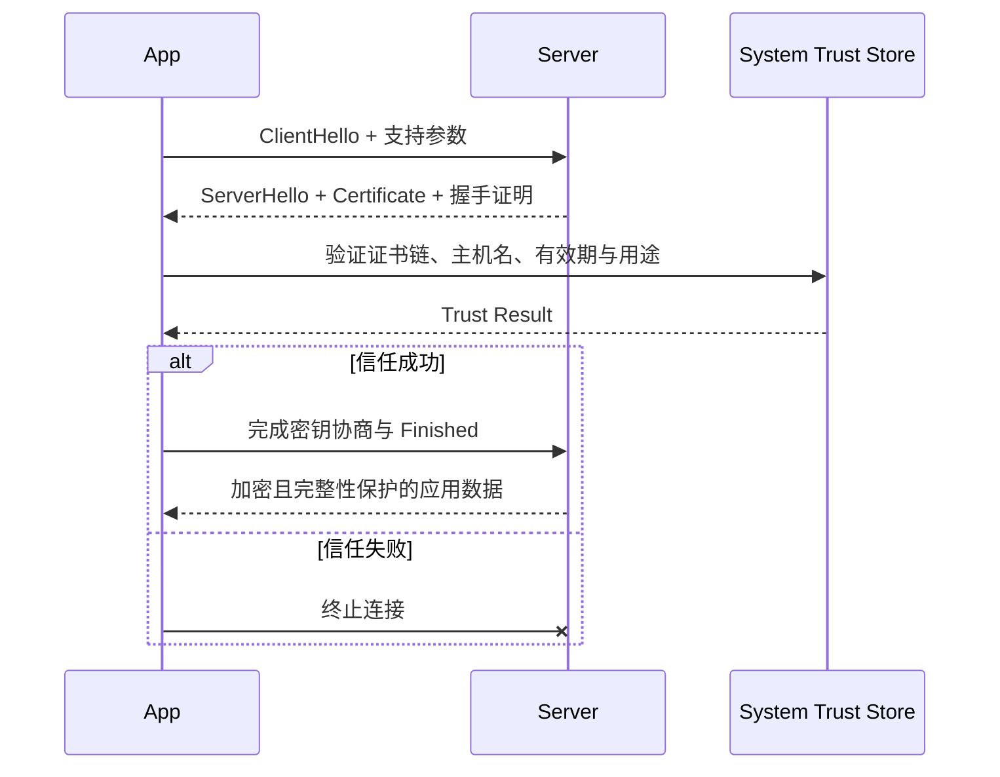
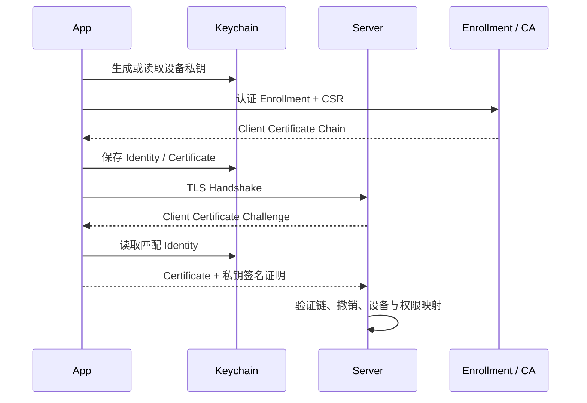

# iOS 安全传输：从 ATS、TLS 信任到请求签名与抗重放

> 安全传输不是“用了 HTTPS 就结束”。App Transport Security（ATS）约束传输基线，TLS 提供通道机密性、完整性和对端认证，Trust Evaluation 判断证书链与主机身份，应用层凭证表达用户或设备权限，请求签名与服务端状态共同抵抗业务请求重放。每层都只能解决自己的威胁，Pinning、Client Certificate 和 Network Extension 也不是越多越安全。

---

## 一、问题背景：先建立威胁模型，再选择机制

移动端网络链路可能面对：

- 不可信 Wi-Fi 或被动监听者读取明文流量；
- 主动中间人篡改响应、替换下载内容或冒充服务端；
- 错误配置的测试证书、代理或自定义 Trust Delegate 绕过身份校验；
- App 包中的静态 Secret 被逆向提取；
- Token、Cookie、个人数据进入日志、Crash 或分析平台；
- 合法请求被重复发送，造成重复支付、重复兑换或重复操作；
- 多账号、备份恢复、设备丢失导致本地凭证越权；
- 为了抓包、VPN 或过滤能力错误使用 Network Extension。

没有单一 API 能同时解决这些问题。工程设计必须先说明保护什么资产、攻击者控制什么边界，以及安全失败时选择 Fail Closed 还是允许受控降级。

本文以 Swift 6、iOS 17+ 为示例基线，优先依赖 Apple Security、Foundation 和公开的 HTTP/TLS 语义。密码套件选择、证书吊销检查、TLS 会话恢复、HTTP/3 的 TLS 集成等细节会随 OS 与网络条件变化，应用不应依赖未公开实现。安全策略还需结合当前 App Store、Entitlement、企业部署和后端规范复核。

### 核心结论

1. ATS 是 URL Loading System 的传输安全策略，不是端到端业务安全证明；例外应按域最小化，并记录移除计划。
2. TLS 保护传输中的机密性与完整性，并通过证书认证对端；它不防止服务端自身泄露、客户端被控制、日志泄密或合法业务请求重放。
3. Trust Evaluation 必须同时验证信任链、有效期、用途与主机名。默认系统评估通常最安全，不能用“接受任意 `serverTrust`”修复证书错误。
4. Certificate Pinning 缩小信任范围，却引入证书轮换、灾备、代理兼容和 App 更新滞后的可用性风险；没有成熟运营能力时不应默认启用。
5. Client Certificate 适合设备/组织强身份场景，不替代用户授权。私钥分发、轮换、撤销和 Keychain 生命周期是方案主体。
6. 无法把长期共享 Secret 安全藏在客户端二进制中。应使用短期凭证、Keychain、非导出密钥和服务端风控降低泄露影响。
7. 日志脱敏应采用字段允许列表，而不是事后用正则猜 Secret；URL、Header、Body、Error、Metrics 和第三方 SDK 都要纳入数据流审计。
8. Request Signing 只有与服务端时间窗口、Nonce/Request ID 去重、Body Digest、密钥身份和幂等协议结合，才能抵抗应用层重放。
9. Network Extension 是受 Entitlement 与系统生命周期约束的网络能力，不是绕过 ATS、读取任意 TLS 明文或让 App 永久后台运行的工具。

---

## 二、纵深防御：每一层保护什么



关键路径是：ATS 约束客户端是否允许建立不符合基线的连接；TLS 建立安全通道；Trust Evaluation 确认通道连接到预期身份；应用层认证与签名表达“谁在何时请求什么”；服务端再验证权限、重放状态与领域不变量。任何一层成功都不能推出其他层正确。

### 2.1 常见机制与威胁边界

| 机制 | 主要防护 | 不解决 |
| --- | --- | --- |
| ATS | 不安全传输与弱配置的默认约束 | 服务端入侵、Token 泄露、业务授权 |
| TLS + System Trust | 链路窃听、篡改、常规冒充 | 受信 CA 误签风险、终端日志泄密 |
| Certificate Pinning | 进一步限制可接受身份 | 服务端被控、App 内 Secret、业务重放 |
| Client Certificate | 客户端/设备的强凭证认证 | 用户权限和业务幂等 |
| Keychain / Secure Enclave | 降低本地凭证提取与滥用风险 | 已解锁设备上的所有攻击、服务端泄露 |
| Request Signing | 请求完整性、调用方证明的一部分 | 单独使用时的重放、设备完全失陷 |
| Nonce + Server State | 应用层重放检测 | 合法的新恶意请求、业务权限错误 |

---

## 三、App Transport Security：默认安全基线

ATS 是 Apple 平台对 URL Loading System 连接施加的安全策略。使用 `URLSession` 等高层 API 时，默认要求安全连接并对 TLS 配置提出基线要求。它的价值是让“不安全降级”需要显式声明，而不是让每个调用点自行决定。

### 3.1 不要用全局例外解决局部问题

典型危险配置是：

```xml
<!-- 错误示例：为解决一个测试地址而放开全部网络请求。 -->
<key>NSAppTransportSecurity</key>
<dict>
    <key>NSAllowsArbitraryLoads</key>
    <true/>
</dict>
```

这会显著扩大不安全传输面。正确方向是优先修复服务端 HTTPS；若确有兼容要求，使用精确 Domain Exception，并记录业务理由、数据敏感等级、负责人、到期时间和移除计划。例外域是否包含子域、是否允许明文和最低 TLS 条件都应逐项审计，不要复制来源不明的 `Info.plist` 片段。

ATS 还存在 Web Content、Local Networking 等不同场景键，但它们不是通用逃生开关。适用范围和审核要求可能随平台版本变化，应以当前 Apple 文档与构建目标为准。

### 3.2 ATS 的边界

- ATS 主要约束 URL Loading System；使用更低层网络接口时，应用仍要主动配置和验证 TLS；
- ATS 通过不代表服务端业务授权、安全 Header 和数据处理正确；
- ATS 例外不会让明文 HTTP 获得机密性或完整性；
- 开发抓包需求不应进入生产配置，可使用隔离的 Debug Scheme、测试设备与受控证书；
- 发布前应对最终归档产物的 `Info.plist` 检查，而不只查看源码模板。

可在 CI 中解析构建后的 plist，拒绝未批准的全局例外，并维护允许的域级例外清单。

---

## 四、TLS：安全通道的建立过程

TLS 握手的概念流程如下：



具体消息会因 TLS 版本、会话恢复、Client Certificate 和传输协议不同而变化，图中表达的是安全职责，不是固定报文清单。

TLS 主要提供：

- **Confidentiality**：传输内容不被路径上的被动观察者直接读取；
- **Integrity**：传输内容被篡改时可检测；
- **Server Authentication**：客户端通过证书与信任策略验证服务端身份；
- **Optional Client Authentication**：服务端可要求 Client Certificate。

TLS 不提供业务层 Exactly-once，也不能阻止拥有合法 Token 的恶意客户端发起新请求。HTTPS URL、Query、Host、请求大小与时序还可能进入客户端日志、代理、服务端或其他观测系统，因此敏感信息不应放进 URL Query。

### 4.1 不要手工固定密码套件推断性能

通过 URLSession 时，协议版本、密码套件与会话恢复通常由系统和服务端协商。应用应保持 OS 更新并修复服务端配置，而不是依赖未公开的客户端强制策略。需要证据时使用 `URLSessionTaskMetrics`、服务端 TLS 日志和受控扫描验证，不从一次抓包推广为所有 OS 与网络的结论。

---

## 五、Trust Evaluation：信任链与主机身份缺一不可

Server Trust 评估通常包含：

1. 证书链能否构建到受信 Anchor；
2. 当前时间是否在证书有效期内；
3. Key Usage / Extended Key Usage 是否允许服务端认证；
4. Policy 中的主机名是否与证书身份匹配；
5. 系统策略要求的算法、密钥长度和其他约束；
6. 吊销信息的获取与使用受系统策略、网络和证书配置影响，不能假设每次都在线查询。

默认 URLSession Trust Evaluation 已覆盖正常公网 HTTPS 场景。只有企业私有 PKI、Client Certificate 或经过论证的 Pinning 等场景才需要自定义 Challenge 处理。

```swift
final class DefaultTrustDelegate: NSObject, URLSessionTaskDelegate {
    func urlSession(
        _ session: URLSession,
        task: URLSessionTask,
        didReceive challenge: URLAuthenticationChallenge,
        completionHandler: @escaping (
            URLSession.AuthChallengeDisposition,
            URLCredential?
        ) -> Void
    ) {
        guard challenge.protectionSpace.authenticationMethod
                == NSURLAuthenticationMethodServerTrust else {
            completionHandler(.performDefaultHandling, nil)
            return
        }

        // 没有额外安全需求时，让系统完成主机名和证书链校验。
        completionHandler(.performDefaultHandling, nil)
    }
}
```

### 5.1 绝对禁止的“修复”

```swift
// 错误示例：只要拿到 serverTrust 就接受，等同于绕过服务端身份验证。
if let trust = challenge.protectionSpace.serverTrust {
    completionHandler(.useCredential, URLCredential(trust: trust))
}
```

拿到 `SecTrust` 对象不代表它已经可信。自定义评估时必须先配置与目标 Host 匹配的 SSL Policy，再调用 `SecTrustEvaluateWithError`，之后才执行额外 Pin 检查；不能用 Pin 检查替代系统链和主机名验证。

测试自签证书应通过受控测试 CA、专用测试设备信任配置或隔离环境解决，不能在生产 Delegate 中写“Debug Host 自动信任”。编译条件、远程开关和 Host 白名单配置都需要检查最终产物，防止测试逻辑进入 Release。

---

## 六、Certificate Pinning：收益、代价与正确失败方式

Pinning 在系统信任评估之外，再要求证书链中的证书或公钥材料与 App 内预期集合匹配。它可以降低某些受信 CA 误签、设备安装额外 Root CA 等风险，但也把证书运营状态编译进客户端。

### 6.1 Pin 什么

| 方案 | 优点 | 主要代价 |
| --- | --- | --- |
| Leaf Certificate Pin | 实现直观、范围最窄 | 每次换 Leaf 都可能要求发版 |
| Public Key / SPKI Pin | 可跨同一密钥续证 | 正确提取和算法标识复杂，换 Key 需预埋 |
| Intermediate CA Pin | 轮换空间更大 | 信任范围更宽，CA 链变化仍会故障 |

不要把 `SecKeyCopyExternalRepresentation` 的裸 Key Bytes 直接称为标准 SPKI Hash。SPKI 包含算法标识与 Key Material，规范化和多算法处理容易出错，应使用经过审计的实现并用真实证书链测试。

### 6.2 上线前必须具备的运营能力

- 至少预埋当前 Pin 和独立 Backup Pin；
- 新证书/密钥先进入重叠窗口，再切流，最后移除旧 Pin；
- 覆盖 CDN、灾备域名、证书链切换和不同区域；
- 监控 Pin Failure，但日志不得包含敏感证书数据或用户信息；
- 为旧 App 版本制定兼容周期，因为用户不会同时升级；
- 演练证书紧急轮换、Backup Pin 错误和服务端回滚；
- 明确 Fail Closed 行为以及核心业务不可用时的用户体验。

远程关闭 Pinning 不是可靠的唯一逃生通道：当 Pin 已阻断连接时，应用可能无法从同一后端获取关闭配置；若配置通道更弱，又会成为攻击面。高风险 App 可设计独立、同等级安全的恢复机制，但仍需预埋与演练。

### 6.3 何时不应使用

普通内容 App 若没有证书运营团队、后端域名复杂、依赖动态 CDN 或需要企业 TLS Inspection，Pinning 的可用性成本可能大于收益。系统 Trust Store、短期 Token、设备证明、服务端风控和良好日志治理通常是更先要完成的基础。

> Pinning 不能保护被攻陷的服务端，也不能把 App 内共享 Secret 变安全；在越狱/受控终端上，攻击者还可能修改客户端逻辑。它是纵深防御，不是绝对防护。

---

## 七、Client Certificate 与 mTLS

Mutual TLS（mTLS）在服务端证书认证之外，要求客户端在握手中提供 Certificate，并证明持有对应 Private Key。适合企业设备、B2B、高价值设备身份或受管环境，但不应作为普通用户登录的无成本替代。

### 7.1 典型流程



推荐由设备生成私钥并提交 Certificate Signing Request（CSR），而不是把同一个 `.p12` 和密码打包进 App。是否能使用 Secure Enclave 取决于密钥算法、生成方式和协议兼容性；Secure Enclave 不是任意 PKCS#12 私钥的导入容器。

处理 `NSURLAuthenticationMethodClientCertificate` Challenge 时，需要从 Keychain 获取 `SecIdentity` 和必要证书链，构造 `URLCredential(identity:certificates:persistence:)`。不可用、过期或撤销时应明确失败或重新 Enrollment，不能回退为内置共享证书。

### 7.2 生命周期与权限

- Enrollment 必须认证用户、设备或管理域；
- 私钥访问使用合适的 Keychain Accessibility 和 Access Control；
- 证书短期化并支持续期、撤销、设备解绑与账号切换；
- 服务端把证书身份映射为主体后仍需做业务 Authorization；
- 备份恢复、设备迁移和 App 重装行为必须明确测试；
- Client Certificate 的 Subject 不应被直接当成不可伪造业务角色。

---

## 八、Secret 管理：客户端没有真正的静态保险箱

凡是随 App Bundle 下发、写进源码、Build Setting、字符串混淆或远程配置后长期共享的 Secret，都可能被有能力的攻击者提取。混淆只提高分析成本，不改变“客户端持有即可读取”的安全模型。

### 8.1 不同数据应放在哪里

| 数据 | 推荐策略 | 注意事项 |
| --- | --- | --- |
| 公共 API Base URL / Client ID | 可放配置 | 它们通常不是 Secret，不要伪装成 Secret |
| Access Token | 短有效期，最小权限，按需存 Keychain | 防日志泄露、刷新与撤销 |
| Refresh Token | Keychain，限制可访问时机与账号绑定 | Rotation、注销、备份策略 |
| 设备私钥 | Keychain 生成；合适时使用 Secure Enclave | 非导出不等于无法被设备上授权使用 |
| 服务端 API Secret | 不放客户端 | 由 App Backend / BFF 持有 |
| 用户密码 | 尽量不持久保存 | 交给系统认证流程和服务端协议 |

Keychain 的 `kSecAttrAccessibleWhenUnlockedThisDeviceOnly` 等 Accessibility 选项影响锁屏访问、迁移和备份行为。选择必须结合后台任务是否需要凭证、设备锁定状态和恢复需求；不存在适合所有 Token 的固定选项。

使用 Access Control 绑定 Face ID/Touch ID 可以要求用户参与某些 Key 操作，但生物识别变化、Fallback、后台访问和测试都会受影响。不要用生物识别弹窗保护每个普通 API 请求。

### 8.2 缩小泄露半径

- 使用短期 Token、Audience/Scope 和服务端撤销能力；
- Refresh Token Rotation 检测重复使用；
- 高风险操作要求 Step-up Authentication；
- 结合 App Attest/DeviceCheck 等服务信号时，明确设备支持、失败和降级策略；
- 不把客户端证明当作绝对不可伪造身份，服务端仍做速率、异常和交易风控；
- 注销时清理账号凭证、Cookie、缓存、离线 Outbox 与内存引用。

---

## 九、敏感日志脱敏：从数据流源头治理

最可靠的日志策略是允许列表：只记录为诊断明确批准的字段，而不是先记录完整对象，再用正则替换看起来像 Token 的字符串。

### 9.1 默认禁止记录

- `Authorization`、Cookie、Refresh Token、Client Certificate 私钥材料；
- 完整 URL Query，尤其是 Token、手机号、邮箱、定位与搜索隐私；
- Request/Response Body 的密码、支付、身份和健康数据；
- Keychain 查询结果、签名原文中的 Secret、完整 Nonce Store；
- 未限长的 Error Body、HTML 错误页或二进制响应。

```swift
struct NetworkLogEvent: Sendable {
    let requestID: String
    let endpointName: String
    let method: String
    let statusCode: Int?
    let duration: Duration
    let responseByteCount: Int64
    let stableErrorCode: String?
}
```

记录稳定 Endpoint 名称，不记录带用户 ID 的 Path；记录 Body 大小和 Schema 版本，不记录 Body；记录 Token 来源和过期桶，不记录 Token 本身。必要的用户标识应使用有访问控制、轮换策略的服务端关联 ID，不能简单 Hash 低熵手机号后宣称匿名。

### 9.2 覆盖所有出口

日志审计不仅包括 `Logger`：

- Crash Report Breadcrumb；
- Analytics 与 A/B Experiment Property；
- Network Debugger、代理和 HAR；
- `URLSessionTaskMetrics` 附加字段；
- 第三方 SDK 自动采集；
- Push、Clipboard、Screenshot 和 Debug UI；
- 服务端 Access Log、CDN 与 WAF。

Debug 日志也会被截图、上传或进入 CI Artifact，不能默认安全。发布前应运行自动化扫描，并用 Canary Secret 验证各观测链路不会收集敏感值。

---

## 十、Replay Attack：TLS 之外的应用层问题

TLS 会保护当前安全会话中的记录完整性并处理协议层重放，但不能阻止攻击者重新提交一份曾经合法的应用层请求。例如拥有合法 Token 的恶意客户端，或从终端/服务端日志获取完整请求的人，可能再次调用“领取优惠券”。

### 10.1 抗重放协议需要哪些字段

```text
method
canonicalPath
canonicalQuery
signedHeaders
bodyDigest
timestamp
nonce or requestID
credentialID / keyID
```

服务端验证：

1. Key ID 是否有效并属于正确主体；
2. Timestamp 是否在允许窗口内；
3. Canonical Request 与 Signature 是否匹配；
4. Nonce/Request ID 是否已在窗口内使用；
5. Token、Scope、账号和业务权限是否满足；
6. 写操作的 Idempotency Key 与 Payload 是否一致。

仅检查 Timestamp 不足以阻止时间窗口内重放；仅检查 Nonce 但不持久化已用状态也无效。Nonce Store 需要原子“首次使用”语义、TTL、容量控制和多节点一致性。高风险操作的去重状态应与领域事务协调，避免“Nonce 已消费但业务未提交”或相反的裂缝。

### 10.2 Replay Protection 与 Idempotency 的区别

| 机制 | 目的 | 重复到达时 |
| --- | --- | --- |
| Replay Protection | 拒绝未经允许的重复授权请求 | 通常拒绝 |
| Idempotency | 让同一业务意图可安全重试 | 返回相同权威结果 |

网络 Timeout 后，客户端需要合法重放同一业务意图，因此不能一概拒绝相同请求。常见设计是每个 Retry 使用新的传输 Nonce/Signature，但复用同一个 Idempotency Key；服务端先验证请求新鲜与身份，再按 Idempotency Key 返回原业务结果。

---

## 十一、Request Signing：先定义规范化协议

Request Signing 的难点不是调用一个 HMAC 或 Signature API，而是客户端和服务端必须对完全相同的字节签名。


### 11.1 Canonicalization 必须明确

- Method 是否大写；
- Path 的 Percent-Encoding 和空路径规则；
- Query 的编码、排序、重复 Key 与空值规则；
- Header 名称大小写、空白折叠、重复 Header 与签名集合；
- Body 是原始 Bytes 还是重新编码后的 JSON；
- 空 Body 的固定 Digest；
- Timestamp 精度、时区和允许 Clock Skew；
- Algorithm 与 Key Version 如何声明和迁移。

不要接收业务对象后在两端各自重新序列化 JSON 再签名，Map 顺序、浮点、Unicode 和日期格式都可能不一致。应对最终发送的 Body Bytes 求 Digest，并将 Canonicalization 版本写入协议。

### 11.2 密钥模型决定安全上限

- **共享 HMAC Secret**：实现简单，但若同一 Secret 嵌入所有 App，任一客户端提取后即可伪造所有客户端；
- **每设备非对称密钥**：Private Key 可在设备生成且不导出，服务端保存 Public Key，但需要 Enrollment、Attestation、Rotation、Revocation；
- **服务端代签/BFF**：高价值服务端 Secret 留在可信后端，但增加一跳、会话与可用性依赖。

签名必须覆盖目标 Host/Path、关键 Header、Body Digest、Timestamp 与 Nonce，防止合法签名被换目标复用。验证失败应返回稳定但不过度泄露原因的错误；服务端内部日志保留关联 ID，而不是记录完整签名材料。

Request Signing 不能替代 TLS，因为不加密内容，也不自动保护响应；不能替代 Authorization，因为持有 Key 的主体仍可能无权执行操作；也不能替代 Idempotency，因为签名成功的重复业务请求仍需一致处理。

---

## 十二、Network Extension 的能力与边界

Network Extension 提供 Packet Tunnel、App Proxy、Content Filter、DNS 等受系统管理的能力，具体可用 Provider、平台和部署方式受 Entitlement 与 Apple 审批约束。它适合 VPN、企业过滤、特定代理和网络服务产品，不是普通 App 网络层的默认组成部分。

### 12.1 不能从 Network Extension 推出的结论

- Packet Tunnel 能看到 IP Packet，不等于能读取经过 TLS 加密的应用层明文；
- 安装 VPN/Profile 不等于可以绕过其他 App 的 TLS Trust 或 Pinning；
- Extension 由系统按规则启动和终止，不是让主 App 永久后台运行的方法；
- Extension 与容器 App 是不同进程和沙盒，内存对象不能直接共享；
- 使用 Network.framework 或 Socket 不会自动获得 URLSession 的 ATS、Cookie、Cache 和 Authentication Challenge 行为；
- `URLProtocol` 只能介入支持它的 URL Loading 流程，不是全设备抓包机制，也不是安全边界。

### 12.2 工程约束

- 先确认产品用途满足 Entitlement、平台和分发政策；
- App 与 Extension 通过 App Group/IPC 共享最少配置，凭证仍按最小权限存储；
- 配置更新要版本化并处理两个进程的并发与崩溃恢复；
- Extension 内存、CPU、后台时间和网络路径受系统预算约束；
- 用户关闭配置、系统重启、网络切换与 Provider 被终止都要恢复；
- 不记录其他 App 的敏感流量，遵循隐私披露、最小收集和数据保留要求。

如果目标只是保护本 App API，请优先使用 URLSession、系统 Trust、短期 Token 与请求治理。引入 Network Extension 会显著扩大权限、生命周期、隐私和审核成本。

---

## 十三、工程方案选择

### 13.1 普通互联网 App

- 使用 ATS 默认策略和系统 Trust Evaluation；
- 服务端正确配置 HTTPS、证书链与安全生命周期；
- Access Token 短期化，Refresh Token 放 Keychain 并支持 Rotation；
- 日志允许列表与端到端脱敏；
- 高副作用接口使用 Idempotency，必要时再评估签名与抗重放；
- 没有明确威胁和运营能力时不做 Pinning。

### 13.2 金融、企业或受管设备

- 基于正式 Threat Model 决定 Pinning、mTLS、设备密钥和 Attestation；
- 建立 Enrollment、Rotation、Revocation、Backup Pin 和灾备演练；
- 高风险操作使用 Step-up Authentication、Request Signing、Nonce 与服务端交易风控；
- 明确企业 TLS Inspection、代理和受管网络兼容策略；
- 把安全失败率、证书到期与签名验证错误纳入告警。

### 13.3 不适用的叠加

同时启用 Pinning、mTLS 和 Request Signing 并不自动形成三倍安全。若三者共享同一错误的身份来源、没有轮换、日志泄露 Token，复杂度反而增加故障和旁路风险。每个机制都应对应威胁、Owner、运营流程与可验证指标。

---

## 十四、测试与验证方法

### 14.1 ATS 与 TLS

- 在 CI 检查最终 Archive 的 ATS 配置和例外域；
- 使用合法、过期、主机名错误、不受信 CA、缺失 Intermediate 的测试证书；
- 验证系统 Trust 失败时连接确实 Fail Closed；
- 通过受控 TLS 扫描和目标 OS 真机测试协议兼容；
- 不把 Debug 代理证书安装状态带入生产结论。

### 14.2 Pinning 与 mTLS

- 当前 Pin、Backup Pin、未知 Pin、证书续期和 CA 链变化；
- CDN/灾备/区域域名及旧 App 版本矩阵；
- Client Certificate 缺失、过期、撤销、Keychain 锁定和重新 Enrollment；
- 用户取消生物识别、设备迁移、重装与账号切换；
- 服务端在证书认证成功后仍验证业务 Authorization。

### 14.3 签名与抗重放

- 官方 Golden Vector 固定 Canonical Request、Digest 与 Signature；
- Query 重复项、Unicode、空 Body、Header 空白、不同 JSON Bytes；
- Timestamp 边界、Clock Skew、Nonce 重放和多节点并发；
- Key Rotation 重叠窗口、撤销和未知 Key ID；
- Timeout 重试时新 Nonce + 原 Idempotency Key；
- Nonce 消费与领域事务故障注入。

### 14.4 日志泄露验证

向测试请求注入唯一 Canary Token，遍历设备日志、Crash、Analytics、Proxy、CI Artifact 和服务端观测系统，确认 Canary 不出现。静态正则扫描只能作为补充，因为编码、分段和第三方 SDK 可能绕过简单模式。

安全性能验证必须在目标真机的 Profile/Release 配置进行，分别测量冷/暖 TLS、证书评估、Keychain/Secure Enclave 操作与签名耗时。不得使用未经测量的固定性能数字；Pinning 或签名带来的耗时通常不是唯一成本，轮换与故障率同样需要观测。

---

## 十五、常见误区与修复

### 15.1 使用 HTTPS 就认为请求不可重放

**问题：** TLS 不阻止合法应用层请求被重新提交。

**修复：** 高风险请求加入 Timestamp、Nonce、签名与服务端去重；业务重试另用 Idempotency Key。

### 15.2 把 API Secret 混淆后放进 App

**问题：** 混淆只提高提取成本，所有安装实例仍共享可恢复 Secret。

**修复：** 长期 Secret 留在后端；客户端使用短期 Token 或每设备非对称密钥。

### 15.3 为了抓包在生产环境信任任意证书

**问题：** 直接破坏服务端身份验证，使中间人攻击可行。

**修复：** 隔离 Debug 配置和测试设备，Release 始终执行系统 Trust 与批准的附加策略。

### 15.4 只有一个 Pin 且没有轮换演练

**问题：** 证书或密钥变更会让已安装 App 无法联网，远程修复也可能不可达。

**修复：** 预埋独立 Backup Pin、重叠轮换、旧版本矩阵与灾备流程；能力不足时不启用 Pinning。

### 15.5 用 Network Extension 绕过普通网络设计

**问题：** 扩大权限、进程、隐私和系统生命周期复杂度，仍不能自动读取 TLS 明文或替代应用认证。

**修复：** 仅在 VPN、过滤等明确产品需求下使用；本 App API 优先采用 URLSession 与标准安全机制。

---

## 十六、发布前检查清单

### 16.1 配置与信任

- 最终产物是否存在全局 ATS 例外或过宽 Domain Exception；
- 所有生产域证书链、主机名和到期监控是否正常；
- Challenge Delegate 是否保留系统 Trust，而非直接 `.useCredential`；
- Pinning 是否有 Backup、轮换、灾备、旧版本与 Fail Closed 方案；
- mTLS Identity 是否按设备/主体隔离并支持撤销。

### 16.2 凭证与数据

- App Bundle、源码和远程配置是否包含长期共享 Secret；
- Token、Key 与证书是否使用合适的 Keychain 策略；
- 注销、账号切换、备份恢复和设备丢失流程是否覆盖；
- Logger、Crash、Analytics、Proxy 和服务端日志是否通过 Canary 测试；
- 第三方 SDK 的采集字段与保留策略是否审计。

### 16.3 签名与重放

- Canonicalization 是否版本化并有跨语言 Golden Vector；
- 签名是否覆盖 Method、目标、关键 Header、Body Digest、时间与 Nonce；
- 服务端是否原子消费 Nonce 并限制时间窗口；
- Idempotency 与 Replay Protection 是否分别定义；
- Key Rotation、撤销、Clock Skew 和多节点一致性是否测试。

---

## 十七、总结

iOS 安全传输是一组边界清晰的纵深防御。ATS 提供默认传输基线，TLS 与系统 Trust 保护通道并认证服务端；Pinning 和 mTLS 只应在明确威胁与成熟运营能力下加入。客户端无法安全隐藏全局静态 Secret，应通过短期凭证、Keychain、设备密钥、轮换和服务端风控缩小泄露影响。

应用层 Request Signing 必须建立在稳定 Canonicalization、密钥身份、Timestamp、Nonce 与服务端状态之上；它与 Idempotency 分工解决恶意重放和合法重试。日志脱敏覆盖完整数据流，Network Extension 则只用于符合权限与产品边界的网络能力。真正可靠的方案不仅能在正常路径握手成功，还能在证书轮换、凭证撤销、时钟偏差、重放攻击和系统终止时保持可解释、可恢复和可审计。

---

## 问答复盘

### Q1：启用 ATS 是否意味着 App 的网络通信已经完全安全？

**答：** 不意味着。ATS 约束 URL Loading System 的传输基线，但不验证业务授权、阻止 Token 泄露、解决日志安全或防止应用层重放。

### Q2：为什么拿到 `serverTrust` 后不能直接构造 `URLCredential` 接受？

**答：** `SecTrust` 只是待评估的信任对象，不代表证书链和主机名已通过。直接接受会绕过服务端身份验证，应使用系统默认评估或完整的自定义 Trust Policy。

### Q3：Certificate Pinning 是否一定比系统 Trust 更安全？

**答：** 不一定。它能缩小信任范围，但引入轮换、灾备和旧版本不可用风险。没有 Backup Pin、监控与演练时，整体风险可能更高。

### Q4：mTLS 认证成功后，服务端能否跳过用户权限检查？

**答：** 不能。Client Certificate 证明某个设备或主体持有私钥，不自动证明其有权执行当前业务操作，服务端仍要做 Authentication Mapping 与 Authorization。

### Q5：把共享 Secret 拆分、混淆后写进 App 是否足够安全？

**答：** 不足够。App 必须在运行时还原 Secret，攻击者也可分析或 Hook 获取。长期服务端 Secret 不应下发，客户端应使用短期 Token 或每设备密钥。

### Q6：Request Signing 为什么不能只签 Body？

**答：** 只签 Body 仍可能被替换 Method、Host、Path、Query 或关键 Header。签名应覆盖规范化目标、Body Digest、身份、时间与 Nonce。

### Q7：Timestamp 已限制五分钟窗口，为什么还需要 Nonce？

**答：** 攻击者仍可在五分钟内重复提交。Nonce/Request ID 配合服务端原子去重，才能检测窗口内重放。

### Q8：Replay Protection 与 Idempotency 是否可以共用一个概念？

**答：** 不应混同。前者拒绝未经允许的重复授权，后者让同一业务意图的合法重试返回相同结果；重试可使用新 Nonce，但复用原 Idempotency Key。

### Q9：使用 Packet Tunnel 后能否读取所有 App 的 HTTPS 明文？

**答：** 不能。Tunnel 通常看到网络 Packet，TLS Payload 仍加密；其他 App 的 Trust、Pinning、系统权限与隐私边界不会自动消失。

### Q10：如何验证日志脱敏没有遗漏第三方链路？

**答：** 使用唯一 Canary Secret 贯穿测试请求，检查设备日志、Crash、Analytics、网络调试、CI Artifact 和服务端观测系统；同时维护字段允许列表与静态扫描。

---

## 延伸知识

- **URL Loading System**：Authentication Challenge、Session Configuration、Task Metrics 与 Background Transfer；
- **请求治理**：Typed Error、Retry、Idempotency、Token Refresh、Rate Limit 与 Offline Outbox；
- **Apple Security Framework**：Keychain Services、Security.framework、CryptoKit、Secure Enclave 与 LocalAuthentication；
- **服务端安全**：PKI、Certificate Transparency、KMS/HSM、OAuth 2.0/OIDC、Nonce Store 与交易风控；
- **隐私工程**：Data Classification、Privacy Manifest、最小收集、Retention 与 Incident Response。
