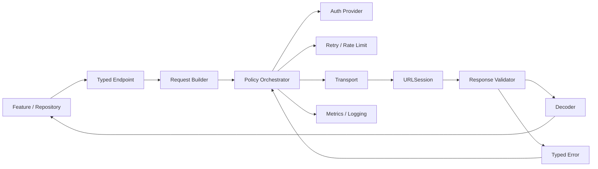
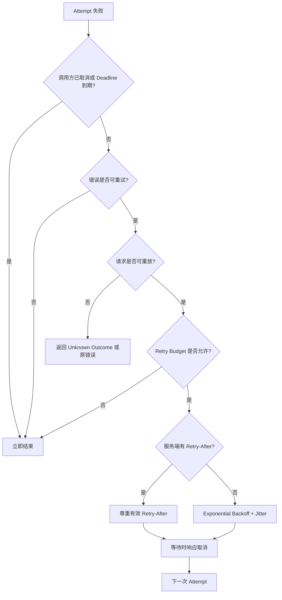
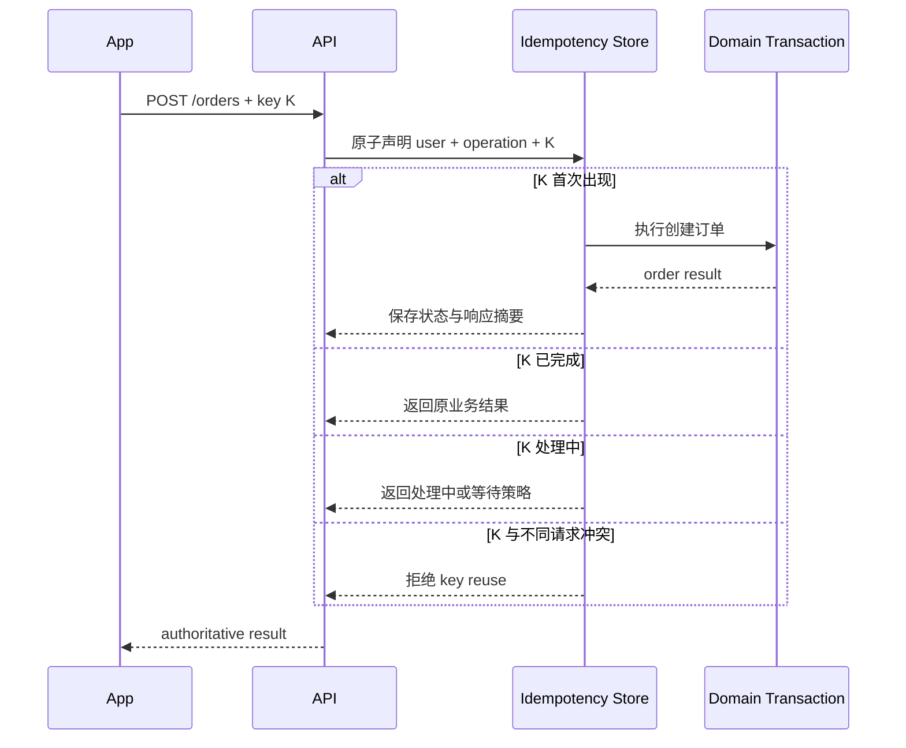
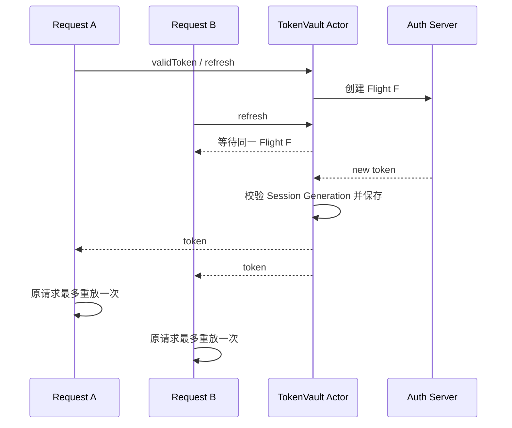

# iOS 请求治理：从 API Client 分层到重试、幂等与离线一致性

> 请求治理不是给 `URLSession.data(for:)` 外面套一个重试循环，而是为请求建立可验证的策略：谁负责构造与签名，哪些响应算成功，错误如何分类，什么操作允许重试，超时后结果是否未知，取消能否传播，认证刷新和限流如何合并，离线操作怎样持久化与对账。可靠性来自客户端状态机与服务端协议共同工作，不能由某个网络库单方面保证。

---

## 一、问题背景：传输成功不等于业务正确

同一个 App 中，下面两类请求看似都只是 HTTP 调用：

- 获取商品详情：失败后通常可以重试，旧缓存有时仍可展示；
- 创建订单：超时后不能直接再创建一次，旧缓存也没有权威意义。

如果把两者放进同一个“遇错重试三次”的工具方法，会迅速出现重复下单、Token 刷新风暴、`429` 重试风暴、页面退出后仍更新状态、离线队列重复执行等问题。

本文解决以下工程问题：

- API Client 如何分层，避免业务、协议和传输逻辑互相污染？
- 如何构造可测试、可签名且不会重复编码的 `URLRequest`？
- 为什么 HTTP `200` 也可能是错误，HTTP `500` 又不一定是 Transport Error？
- Typed Error 应保留哪些决策信息，又如何避免泄露敏感响应？
- 哪些请求可以重试，Exponential Backoff 与 Jitter 如何避免同步风暴？
- Timeout、Cancellation 与服务端事务状态有什么区别？
- Idempotency Key 的生命周期为何必须绑定“业务意图”？
- 多个并发 `401` 如何合并成一次 Token Refresh？
- 客户端如何尊重 `429 Retry-After` 并实施本地 Rate Limit？
- 弱网与离线状态下，应该等待、读缓存还是进入持久队列？

本文以 Swift 6、iOS 17+ 为示例基线。服务端状态码、Idempotency、Token Rotation、Rate Limit 与离线冲突协议必须由客户端和后端共同约定；示例不会把某种约定冒充 HTTP 或 Foundation 的默认保证。

### 核心结论

1. API Client 应分为 Endpoint/Request Builder、Transport、Response Validator/Decoder 和 Policy/Orchestrator；每层只有一个主要变化原因。
2. Request Builder 负责稳定编码 URL、Header 和 Body，但敏感凭证应尽量在发送前注入，日志与缓存键不得包含 Secret。
3. Response Validation 必须先区分 Transport、HTTP、Payload 和 Business Error，再决定重试、刷新认证或展示错误。
4. Retry 是受预算约束的策略，不是错误兜底。只有可重放请求才能自动重试；写操作还需要服务端 Idempotency。
5. Exponential Backoff 应设置上限并加入 Jitter；服务端提供合法 `Retry-After` 时应尊重，但仍受本地截止时间和取消控制。
6. Timeout 只说明客户端没按时得到结果，Cancellation 只说明客户端不再关心，两者都不能证明服务端没有执行副作用。
7. Token Refresh 使用 Single-flight 合并并发刷新；原请求最多按协议重放，不能形成 `401 -> refresh -> retry` 无限循环。
8. Rate Limit 同时包含服务端反馈和客户端主动整形。并发上限、请求速率与 Retry Budget 是不同控制维度。
9. `NWPathMonitor` 的网络状态只是提示，不是请求成功证明；离线写入只有在具备持久化、幂等、排序与冲突处理协议时才能排队。

---

## 二、API Client 分层：让策略有明确归属



关键路径是：Feature 选择 Typed Endpoint，Builder 生成请求，Orchestrator 注入认证并执行限流、发送和受控重试，Transport 只负责 I/O，Validator 把响应分类，Decoder 输出领域模型。异常路径回到 Policy，但只有符合条件的错误才能触发 Retry 或 Token Refresh。

### 2.1 各层职责

| 层 | 负责 | 不负责 |
| --- | --- | --- |
| Endpoint | Method、Path、Query、Body 类型、响应类型、策略元数据 | 执行网络与读取 Token |
| Request Builder | URL/Query/Header/Body 的确定性编码 | 重试、刷新 Token、业务状态 |
| Transport | 通过 URLSession 执行一次 Attempt | HTTP 成功判定与业务重试 |
| Validator / Decoder | Status、Content-Type、Error Envelope、模型解码 | 决定页面文案与无限重试 |
| Policy Orchestrator | Auth、Deadline、Retry、Backoff、限流、观测 | UI 生命周期和服务端事务 |
| Repository | 远端、本地缓存与领域模型协调 | TLS、Header 拼装等传输细节 |

网络层不要直接弹 Toast，也不要返回无法分类的 `Error` 字符串。UI 文案受场景和本地化影响；网络层应返回结构化错误，让上层决定展示、静默、重试或对账。

---

## 三、Typed Endpoint 与 Request Builder

Endpoint 应把请求描述和策略元数据放在一起，避免调用方忘记某个接口不可重试或需要幂等键。

```swift
enum HTTPMethod: String, Sendable {
    case get = "GET"
    case post = "POST"
    case put = "PUT"
    case patch = "PATCH"
    case delete = "DELETE"
}

enum ReplayPolicy: Sendable {
    case safe
    case idempotent
    case requiresIdempotencyKey
    case never
}

struct Endpoint<Response: Decodable & Sendable>: Sendable {
    let method: HTTPMethod
    let path: String
    let queryItems: [URLQueryItem]
    let body: Data?
    let replayPolicy: ReplayPolicy
    let requiresAuthentication: Bool
}
```

`GET` 通常是 Safe Method，但仍不能仅按 Method 字符串推断业务实现绝对无副作用；`PUT` 和 `DELETE` 在 HTTP 语义上是 Idempotent，却仍需后端正确实现。`POST` 并非天然不可重试，如果服务端支持 Idempotency Key，可以安全重放同一业务意图。

```swift
struct RequestBuilder: Sendable {
    let baseURL: URL
    let encoder: JSONEncoder

    func makeRequest<Response>(
        for endpoint: Endpoint<Response>,
        idempotencyKey: String? = nil
    ) throws -> URLRequest {
        guard var components = URLComponents(
            url: baseURL.appending(path: endpoint.path),
            resolvingAgainstBaseURL: false
        ) else {
            throw ClientError.invalidRequest(reason: "Invalid base URL")
        }
        components.queryItems = endpoint.queryItems.isEmpty
            ? nil
            : endpoint.queryItems

        guard let url = components.url else {
            throw ClientError.invalidRequest(reason: "Invalid URL components")
        }

        var request = URLRequest(url: url)
        request.httpMethod = endpoint.method.rawValue
        request.httpBody = endpoint.body
        request.setValue("application/json", forHTTPHeaderField: "Accept")
        if endpoint.body != nil {
            request.setValue("application/json", forHTTPHeaderField: "Content-Type")
        }
        if let idempotencyKey {
            request.setValue(idempotencyKey, forHTTPHeaderField: "Idempotency-Key")
        }
        return request
    }
}
```

示例中的 `JSONEncoder` 属性只有在初始化后不再修改且符合当前 SDK 的并发契约时才能跨域共享；更保守的做法是在 Builder 内按固定配置创建 Encoder，或用 Actor 隔离可变编码器。确定性请求签名还必须固定 JSON/Query 的规范化规则，不能假设普通 JSON Object 字段顺序稳定。

Builder 的测试应验证特殊字符、重复 Query、空值、日期、浮点数、Header 覆盖和 Body 编码失败。Access Token、设备证明等动态凭证应由发送层临近执行时注入，避免在排队期间过期。

---

## 四、Response Validation 与 Typed Error

一次请求至少经过四种失败域：

1. **Transport**：DNS、连接、TLS、断网、系统取消；
2. **HTTP Protocol**：`401`、`404`、`409`、`429`、`5xx`；
3. **Payload**：Content-Type 不符、Body 过大、JSON 损坏、Schema 不兼容；
4. **Business**：HTTP 成功但业务 Envelope 表示库存不足、版本冲突等。

```swift
enum ClientError: Error, Sendable {
    case invalidRequest(reason: String)
    case transport(code: URLError.Code)
    case timeout
    case cancelled
    case unauthorized
    case rateLimited(retryAfter: Duration?)
    case httpStatus(code: Int, requestID: String?)
    case decoding
    case business(code: String, requestID: String?)
    case unknownOutcome(operationID: String)
}
```

Typed Error 应保留决策所需的信息，例如 HTTP Status、稳定业务错误码、`Retry-After`、Request ID 和 Unknown Outcome 的 Operation ID。不要把完整 Error Body、Token、Cookie、个人数据或底层证书内容长期塞进 Error；调试信息也应限长和脱敏。

```swift
struct ResponseValidator: Sendable {
    func validate(data: Data, response: URLResponse) throws -> Data {
        guard let http = response as? HTTPURLResponse else {
            throw ClientError.httpStatus(code: -1, requestID: nil)
        }

        let requestID = http.value(forHTTPHeaderField: "X-Request-ID")
        switch http.statusCode {
        case 200..<300:
            return data
        case 401:
            throw ClientError.unauthorized
        case 429:
            throw ClientError.rateLimited(
                retryAfter: RetryAfterParser.parse(
                    http.value(forHTTPHeaderField: "Retry-After")
                )
            )
        default:
            throw ClientError.httpStatus(
                code: http.statusCode,
                requestID: requestID
            )
        }
    }
}
```

`Retry-After` 既可能是秒数，也可能是 HTTP Date；解析失败时不能当成零延迟。Content-Type 校验要容忍合法参数，例如 `application/json; charset=utf-8`，不应做完整字符串相等比较。空响应如 `204` 也不应强制走普通 JSON Model 解码。

### 4.1 错误分类决定策略，而不是文案

`URLError.notConnectedToInternet` 可能适合展示离线缓存，`timedOut` 可能允许读取请求重试，`401` 可能触发一次刷新，`429` 必须等待，`409` 可能要求拉取最新版本解决冲突。它们不应都被压扁成 `.networkError("请求失败")`。

---

## 五、Retry：先证明可重放，再决定重试



重试判断需要同时满足：错误可恢复、请求可重放、预算未耗尽、Deadline 尚有余量、调用方未取消。缺少其中任何一项，都不应自动重试。

### 5.1 常见错误的默认倾向

| 错误 | 默认倾向 | 必须补充的判断 |
| --- | --- | --- |
| DNS/连接暂时失败 | 可考虑重试 | 网络状态、Deadline、Budget |
| Timeout | 读取可重试，写入需谨慎 | 服务端是否可能已执行、幂等键 |
| `401` | 不直接 Backoff 重试 | 仅刷新一次 Token，再重放一次 |
| `408` / `429` | 可考虑等待后重试 | `Retry-After`、可重放性 |
| `500` / `502` / `503` / `504` | 可考虑重试 | 接口语义、服务端契约、预算 |
| `400` / `403` / `404` | 通常不重试 | 是否存在明确最终一致性协议 |
| 解码失败 | 通常不重试 | 灰度版本、Schema 与 Content-Type |
| 业务校验失败 | 按业务处理 | 不应由通用 Transport 重试 |

这些是默认策略，不是协议定理。例如 `404` 在异步创建资源的短暂一致性窗口中可能允许按业务协议轮询；`500` 对没有 Idempotency Key 的写请求则可能是 Unknown Outcome。

---

## 六、Backoff、Jitter 与 Retry Budget

固定间隔重试会让大量客户端同时再次打到刚恢复的服务端。常见退避上限可表达为：

```text
capDelay = min(maxDelay, baseDelay * 2^attempt)
fullJitterDelay = random(0 ... capDelay)
```

具体 `baseDelay`、`maxDelay` 和最大 Attempt 必须结合接口 SLO、用户可等待时间与服务端容量测量，不存在适合所有业务的固定数值。乘方还应防整数溢出，达到上限后不再增长。

```swift
struct RetryPolicy: Sendable {
    let maxAttempts: Int
    let baseDelay: Duration
    let maxDelay: Duration

    func delay(forRetry retry: Int, randomUnit: Double) -> Duration {
        precondition((0...1).contains(randomUnit))
        let exponent = min(retry, 20)
        let multiplier = 1 << exponent
        let cap = min(baseDelay * multiplier, maxDelay)
        return cap * randomUnit
    }
}
```

随机数应注入，测试才能验证边界。生产实现还要避免 Duration 计算溢出，并明确 Attempt 编号从 0 还是 1 开始。

Retry Budget 防止局部策略累积成全局放大：不仅限制单请求次数，也限制一段时间内重试流量占比或总量。重试等待必须使用可取消的 `Clock.sleep`；页面退出后继续睡眠和重试既浪费资源，也可能提交过期结果。

若服务端返回合法 `Retry-After`，通常优先于本地退避，但客户端仍应应用最大可接受等待、总体 Deadline 和取消。不能把极端 Header 无条件转换成内存中数天的悬空 Task；长等待应转为持久调度或向用户返回状态。

---

## 七、Idempotency：保证同一业务意图可安全重放

Idempotency 不是“按钮只能点一次”，也不是“相同参数永远只执行一次”。它要求同一个业务意图的重复请求得到相同权威结果，而新的业务意图仍可执行。



客户端规则：

- 用户首次发起业务意图时生成高熵 Key，并与本地 Operation Record 一起持久化；
- 网络重试、App 重启恢复和超时对账复用同一个 Key；
- 用户明确发起新的订单，即使参数相同，也生成新 Key；
- 请求参数变更后不能继续复用旧 Key；
- 超时后先按原 Key 查询或重放，不要贸然生成新 Key。

服务端规则：

- Key 至少绑定用户/租户、操作类型和规范化请求摘要；
- 通过唯一约束或事务原子登记，不能“先查再写”留下竞态；
- 保存处理中、成功与可判定失败状态，并定义过期时间；
- 相同 Key 配不同 Payload 必须拒绝；
- 返回原资源标识或可查询 Operation ID。

客户端内存去重只能减少当前进程的重复调用，无法覆盖崩溃、多设备或网关重放。真正的跨边界保证必须由服务端持久化协议提供。

---

## 八、Timeout：分清尝试、资源与业务截止时间

至少要区分三种时间边界：

- **Attempt Timeout**：单次网络尝试允许等待多久；
- **Resource Timeout**：整个资源传输的系统时间边界；
- **Operation Deadline**：包含刷新 Token、排队、所有重试和解析在内的业务总截止时间。

只设置 `URLRequest.timeoutInterval` 无法约束整个多次重试流程。Orchestrator 应在每次 Attempt 前计算剩余 Deadline，并拒绝启动注定无法完成的新重试。

Timeout 的语义也依赖操作类型：

- 读取超时：通常可在预算内重试；
- 幂等写入超时：复用 Key 重试或查询；
- 非幂等写入超时：返回 `unknownOutcome`，要求对账，不能伪装成明确失败；
- 文件传输：可能切换为 Background Transfer，而不是把前台 Timeout 无限拉长。

用 Task Group 与 `sleep` 自己实现 Timeout 时，必须取消并等待输掉竞态的 Child Task，避免悬空工作；同时要认识到取消底层网络仍是协作式。若系统 API 已有符合语义的 Timeout，应避免重复叠加多个互相矛盾的计时器。

---

## 九、Cancellation：停止等待、传播信号、阻止提交

取消需要贯穿整个调用链：View/Model 取消 Owner Task，Repository 和 API Client 不吞 `CancellationError`，Backoff Sleep 可取消，Transport 把取消传给 URLSession，结果提交前再次检查当前请求身份。

```swift
func execute<Response>(
    _ endpoint: Endpoint<Response>
) async throws -> Response {
    do {
        try Task.checkCancellation()
        let request = try await authorizedRequest(for: endpoint)
        let (data, response) = try await transport.send(request)
        try Task.checkCancellation()
        let validated = try validator.validate(data: data, response: response)
        return try decoder.decode(Response.self, from: validated)
    } catch is CancellationError {
        throw ClientError.cancelled
    } catch let error as URLError where error.code == .cancelled {
        throw ClientError.cancelled
    }
}
```

若公共 API 把取消映射为 `ClientError.cancelled`，上层就必须按它识别预期控制流；也可以原样抛 `CancellationError`，关键是全栈一致。不要用 `try?` 吞掉取消，不要把取消展示为红色错误，也不要因为调用方取消就撤销由其他请求共享的 Token Refresh Flight。

取消一个有副作用请求不等于回滚服务端操作。客户端还应保存 Operation ID/Idempotency Key，以便重新进入页面后查询最终状态。

---

## 十、Token Refresh Single-flight

多个请求并发收到 `401` 时，正确流程不是每个请求各自刷新：



治理规则包括：

1. Actor 内保存一个 In-flight Task 和 Flight ID；
2. 并发等待者共享结果，单个等待者取消通常不取消共享 Flight；
3. 注销或切换账号时递增 Session Generation，取消 Flight 并拒绝旧结果落盘；
4. Refresh Token Rotation 时协调 Keychain 与内存状态，不能让旧刷新覆盖新凭证；
5. 原请求标记 `hasRetriedAfterRefresh`，再次 `401` 直接结束，避免无限循环；
6. 只有 Body 可重放的请求才能自动重试，Stream 和非幂等操作需要单独协议；
7. Refresh 失败应分类：临时错误可受控重试，凭证失效进入重新登录，不可无限刷新。

Token Refresh 合并的 Actor 重入实现已在前置文章“并发工程实践”展开；本层重点是把它接入 Retry Decision，而不是让每个 Interceptor 隐式递归调用整个 Client。

---

## 十一、Rate Limit：服务端反馈与客户端主动整形

Rate Limit 不只是遇到 `429` 后 Sleep。完整治理包含：

- 解析 `Retry-After` 和服务端约定的剩余配额 Header；
- 按 Host、用户、Endpoint 或业务优先级选择限流维度；
- 用 Token Bucket/Leaky Bucket 等策略平滑突发；
- 限制同时进行的请求数，避免本地连接与内存拥塞；
- 给重试单独 Budget，防止失败流量挤占正常流量；
- 等待队列支持取消、Deadline、公平性和容量上限。

**并发上限**限制同时执行数量，**速率限制**限制单位时间启动数量，**Retry Budget**限制额外失败流量。三者解决的问题不同。

限流协调器适合由 Actor 持有状态，但不能在 Actor 内用信号量阻塞线程。请求获得 Permit 前异步挂起；取消或超时后从队列移除；完成后归还并发 Permit。实现还要防 Actor Reentrancy，恢复等待者时确保 Permit 只发放一次。

`429` 响应可能针对账号而非设备。单机本地限流无法推断其他设备消费的服务端配额，因此服务端反馈仍是权威信号。对后台同步和用户前台操作，应定义优先级与保留配额，避免后台任务耗尽交互预算。

---

## 十二、弱网与离线：网络状态不是布尔真相

`NWPathMonitor` 可以观察 Path 是否 Satisfied、是否 Expensive/Constrained 以及可用 Interface，但它只能说明当前系统路径状态，不证明目标 Host 可达、DNS 正常、TLS 成功或登录有效。不要先用 Monitor 判定“无网”就永久拒绝请求；真正的请求结果仍是事实来源。

弱网策略应按操作分类：

| 操作 | 弱网/离线策略 | 一致性要求 |
| --- | --- | --- |
| 商品展示 | 可展示带时间戳的 Stale Cache，后台刷新 | 标明数据新鲜度 |
| 搜索建议 | 取消旧请求，短 Deadline，可降级本地历史 | 最新输入胜出 |
| 创建订单 | 在线提交或进入明确的待提交状态 | Durable Key、幂等、对账 |
| 点赞等可合并操作 | 可设计 Outbox | 合并规则、版本冲突 |
| 支付确认 | 不应仅显示本地成功 | 查询服务端权威状态 |
| 大文件 | 支持断点或 Background Transfer | 校验文件与服务端状态 |

### 12.1 离线写入需要 Durable Outbox

内存数组不是离线队列。可靠 Outbox 至少要持久化：Operation ID、Idempotency Key、Payload 或引用、创建时间、依赖顺序、Attempt、Next Eligible Time、账号/租户、Schema Version 和当前状态。

状态可设计为：

```text
pending -> sending -> acknowledged
                -> retryableFailure -> pending
                -> conflict
                -> terminalFailure
```

App 崩溃时留下的 `sending` 不能直接生成新操作，应使用原 Key 向服务端对账。账号退出时必须隔离或清理对应 Outbox，不能让新账号发送旧账号数据。多个设备同时离线编辑还需要 Version、ETag、Revision 或领域合并规则；“恢复网络后按顺序重放”不能自动解决冲突。

### 12.2 `waitsForConnectivity` 与离线队列的边界

`waitsForConnectivity` 适合让当前 URLSession Task 等待系统认为可用的连接机会，但它不提供跨进程 Durable Queue、业务幂等或冲突解决。短生命周期页面请求通常仍应由页面取消；需要跨启动恢复的业务写入则使用持久 Outbox 或 Background Transfer。

---

## 十三、把策略组合成一次可审计执行

一次请求的推荐顺序如下：

1. 创建 Operation Context：Request ID、Deadline、Replay Policy、Idempotency Key；
2. 等待 Rate Limiter Permit，同时响应取消和 Deadline；
3. 临近发送时从 Token Vault 获取有效 Token；
4. Builder 构造本次 Attempt 的 Request 并注入动态 Header；
5. Transport 执行一次请求并采集 Metrics；
6. Validator 分类 Transport、HTTP、Payload 与 Business Result；
7. 若为首个可刷新 `401`，Single-flight 刷新后重放一次；
8. 若为可重试错误，检查 Replay Policy、Retry Budget 和剩余 Deadline；
9. 按 `Retry-After` 或 Backoff + Jitter 等待；
10. 成功解码，或返回 Typed Error / Unknown Outcome；
11. 归还 Permit，记录脱敏指标；调用方提交结果前再检查页面 Revision。

策略顺序不是随意的。比如先占用并发 Permit 再等待很长 Backoff 会浪费容量；认证刷新是否计入普通 Endpoint Rate Limit 也必须避免循环依赖；Metrics 要按 Attempt 和整体 Operation 分别记录，否则看不到重试放大。

---

## 十四、测试与验证

### 14.1 使用可控依赖

将 Transport、Clock、Random、Token Provider、Rate Limiter 和 Connectivity Hint 抽象为可注入依赖。测试不应真实 Sleep，也不应依靠外网服务制造偶然失败。

推荐测试矩阵：

- Builder：URL 编码、Header、Body、Idempotency Key 与非法输入；
- Validator：每类 Status、错误 Envelope、错误 Content-Type、空 Body、超大错误 Body；
- Retry：可重放与不可重放、最大 Attempt、Budget、Jitter 边界、`Retry-After`；
- Timeout：Attempt 未完成、Backoff 中 Deadline 到期、刷新期间到期；
- Cancellation：限流排队、Backoff、Transport、解码前和结果提交前；
- Token：十个并发 `401` 只刷新一次、注销竞态、第二次 `401` 不循环；
- Idempotency：Timeout 后复用原 Key、App 重启恢复、Payload 冲突；
- Offline Outbox：崩溃恢复、顺序依赖、账号切换、冲突与终态错误；
- Rate Limit：公平性、队列上限、取消归还 Permit、服务端配额反馈。

### 14.2 集成与故障注入

使用本地 Stub Server 或测试环境精确返回 `401`、`408`、`409`、`429`、`5xx`、延迟响应、半关闭连接和损坏 Body。Network Link Conditioner 可辅助模拟延迟与丢包，但不能替代协议级故障注入。

服务端集成测试必须证明：相同 Idempotency Key 并发到达只产生一个领域结果；Key 与不同 Payload 冲突会拒绝；处理中与完成态可查询；`Retry-After` 和配额 Header 符合契约。

### 14.3 观测指标

至少按 Endpoint 和网络环境观察：

- 首次成功率与最终成功率；
- Attempt 数分布、Retry Amplification 和 Retry Budget 消耗；
- Timeout/Cancel/Unknown Outcome 比例；
- `401` 数、Refresh Flight 数与合并率；
- `429` 数、限流排队时间与队列拒绝数；
- 离线 Outbox 深度、最老任务年龄、冲突和终态失败；
- DNS、Connect、TLS、TTFB 和下载阶段分位数。

优化必须在目标设备的 Profile/Release 配置和代表性网络下验证。不要用 TSan、代理或模拟器下的绝对耗时作为线上性能结论。

---

## 十五、常见误区与修复

### 15.1 所有错误统一重试三次

**问题：** 会重试参数错误、业务拒绝和不可重放写入，还可能形成流量放大。

**修复：** 同时检查 Error Classification、Replay Policy、Idempotency、Budget、Deadline 和 Cancellation。

### 15.2 Timeout 等于服务端失败

**问题：** 客户端只是没有及时拿到响应，服务端事务可能已成功。

**修复：** 写操作保存 Idempotency Key/Operation ID，返回 Unknown Outcome 并对账。

### 15.3 每个请求自己处理 `401`

**问题：** 并发刷新、Refresh Token Rotation 竞态和无限重试。

**修复：** 用 Token Vault Single-flight，并限制原请求只在刷新后重放一次。

### 15.4 有 `NWPathMonitor` 就不发请求

**问题：** Path 状态存在时序，而且不能证明目标服务可达。

**修复：** 把 Path 当作调度提示，Transport 结果作为事实；离线体验由缓存和 Outbox 设计。

### 15.5 把请求和响应完整写入日志

**问题：** Token、Cookie、个人数据和支付信息可能泄露，错误 Body 还可能造成日志放大。

**修复：** 使用允许列表字段、稳定错误码和关联 ID，Header/Query/Body 脱敏并限长。

---

## 十六、工程落地清单

### 16.1 接口契约

- Method 的 Safe/Idempotent 属性是否与服务端实现一致；
- 写接口是否提供 Idempotency Key、Operation 查询与冲突语义；
- Status、Business Error、`Retry-After` 和 Rate Limit Header 是否稳定；
- Token 过期、刷新、Rotation 和注销协议是否明确；
- 缓存新鲜度、离线冲突和数据版本由谁负责。

### 16.2 客户端实现

- Transport 是否只执行单次 Attempt；
- Retry 是否检查可重放性、Budget、Deadline 与取消；
- Backoff 是否有 Cap 和 Jitter，随机与 Clock 是否可测试；
- `401` 是否只触发 Single-flight 且最多重放一次；
- Timeout/Cancel 后有副作用操作是否进入 Unknown Outcome；
- Rate Limiter 队列是否有容量、公平性和取消清理；
- Outbox 是否持久化 Key、账号、版本、Attempt 和状态。

### 16.3 发布验证

- 执行严格并发检查和确定性交错测试；
- 注入各类 HTTP、Transport、Payload 和超时错误；
- 与服务端共同压测 Retry/Rate Limit/Idempotency；
- 在弱网、切网、后台、重启、注销和多账号场景对账；
- 检查日志脱敏、指标基数和 Unknown Outcome 告警。

---

## 十七、总结

请求治理的本质是把“传输一次”提升为“完成一个受约束的业务操作”。API Client 分层让 Builder、Transport、Validator 和 Policy 各自可测试；Typed Error 保留决策信息；Retry 只有在错误可恢复且请求可重放时才成立；Backoff、Jitter、Budget 与 Rate Limit 共同控制失败流量。

对于写操作，Timeout 和 Cancellation 都不能代表服务端失败，Idempotency Key 与对账接口才是安全重放的基础。Token Refresh 必须 Single-flight，离线写入必须 Durable，并处理账号隔离、顺序和冲突。最终可靠性来自客户端状态机、HTTP 语义、服务端事务与可观测性共同构成的闭环。

---

## 问答复盘

### Q1：为什么 Transport 不应该直接实现业务重试？

**答：** Transport 只知道一次 I/O 结果，不知道请求是否可重放、业务 Deadline、Idempotency 或用户是否仍需要结果。重试应由持有这些上下文的 Policy 层决定。

### Q2：HTTP `200` 是否一定可以解码为成功模型？

**答：** 不一定。还要验证 Content-Type、Body Schema 和业务 Envelope；某些服务会以 `2xx` 返回业务失败，空响应也可能需要专门模型。

### Q3：`GET` 请求是否可以无条件无限重试？

**答：** 不可以。即使请求可重放，也受 Cancellation、Deadline、Retry Budget、Rate Limit 和用户体验约束；服务端实现还可能违反 Safe Method 预期。

### Q4：Timeout 后为什么写请求可能进入 `unknownOutcome`？

**答：** 因为请求可能已经到达并被服务端提交，只是响应没有及时返回。没有权威查询前，客户端既不能断言成功，也不能断言失败。

### Q5：同一订单重试时应该生成新的 Idempotency Key 吗？

**答：** 不应该。同一业务意图的网络重试、超时对账和崩溃恢复必须复用原 Key；只有用户明确发起新的订单时才生成新 Key。

### Q6：Exponential Backoff 为什么还需要 Jitter？

**答：** 指数退避只拉开同一客户端的尝试，多个客户端仍可能同步重试。Jitter 随机化等待时间，降低恢复瞬间的同步流量峰值。

### Q7：一个等待原请求的页面取消后，是否应该取消共享 Token Refresh？

**答：** 通常不应。Refresh Flight 可能服务多个请求；单个等待者退出只取消自己的等待。注销或会话切换才由 Token Vault 取消共享 Flight。

### Q8：收到 `429` 后立刻按本地退避重试是否正确？

**答：** 不完整。应优先解析合法 `Retry-After`，同时检查 Deadline、取消和可重放性；还要用客户端限流和 Retry Budget 避免持续冲击服务端。

### Q9：`NWPathMonitor` 显示 `.satisfied` 是否证明请求一定能成功？

**答：** 不能。它只说明系统存在满足条件的网络路径，不证明目标 Host、DNS、TLS、认证和服务端可用。实际 Transport 结果才是事实来源。

### Q10：把离线写操作存进内存数组，联网后重放是否足够？

**答：** 不足够。进程终止会丢失操作，也没有账号隔离、幂等键、Attempt、排序和冲突状态。可靠离线写入需要 Durable Outbox 与服务端对账协议。

---

## 延伸知识

- **URL Loading System**：Session 配置、连接复用、HTTP 协商、缓存、认证挑战与后台传输；
- **安全传输**：ATS、TLS、Trust Evaluation、Certificate Pinning、Request Signing 与日志脱敏；
- **分布式一致性**：Idempotency Store、Transactional Outbox、Saga、Conflict Resolution；
- **可观测性**：`URLSessionTaskMetrics`、Correlation ID、Distributed Trace、Retry Amplification；
- **本地数据层**：Cache Freshness、Durable Queue、Schema Migration 与账号数据隔离。
