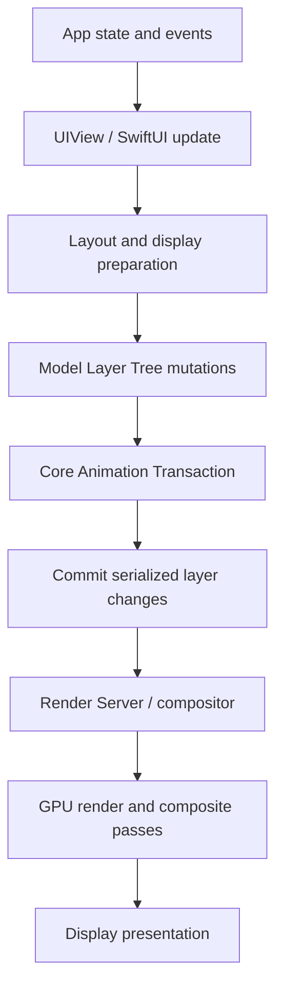
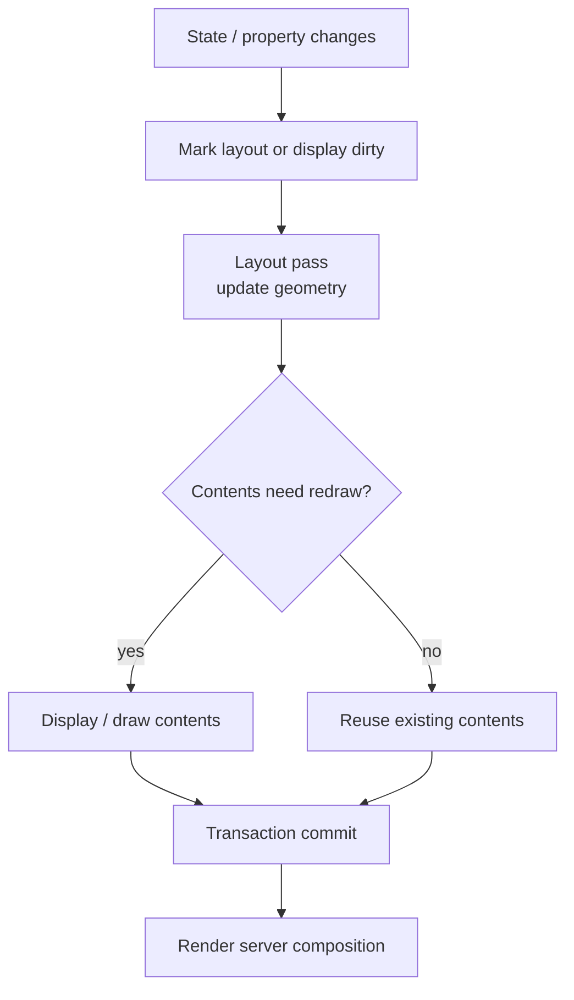
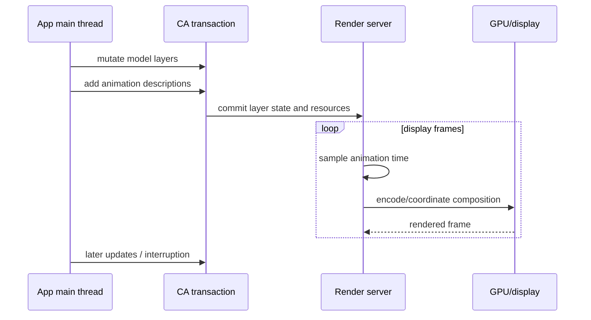

# Core Animation：从 Layer Tree、Transaction 到 Render Server

> Core Animation 不是一个“补间动画工具箱”，而是 Apple 图形栈中的内容缓存、几何描述、动画采样与合成基础设施。App 在主进程维护 Model Layer Tree，通过 Transaction 把本轮变化提交给系统；动画期间 Presentation Layer 提供接近当前画面的瞬时值，Render Server 使用提交后的渲染状态完成合成。理解这条管线，才能解释为什么修改 Layer 不等于立即出现在屏幕上、为什么动画结束后会跳回、为什么圆角或阴影有时产生额外 Render Pass，以及为什么卡顿既可能来自 CPU Commit，也可能来自 GPU 合成。

---

## 一、本文解决什么问题

iOS 工程中常见这些现象：

- 修改 `CALayer.position` 后，代码读到的是新值，屏幕上却仍在过渡；
- 给 Layer 添加 `CABasicAnimation`，动画结束后内容突然回到起点；
- 直接修改 Layer 属性有时自动动画，有时立即变化；
- `layoutSubviews`、`layoutSublayers(of:)`、`draw(_:)` 和 Layer Commit 的先后关系不清楚；
- 主线程工作不多，滚动时仍可能出现 GPU 合成压力；
- 圆角、Mask、Shadow、透明度和 Blend 被笼统归类为“离屏渲染”；
- 开启 `shouldRasterize` 后某个场景变快，滚动或缩放时反而模糊、抖动或更慢；
- 交互手势中断动画后，视觉位置、Model Layer 和业务状态不一致；
- SwiftUI Transaction、UIView Animation 与 `CATransaction` 被当成同一个对象。

这些问题都需要从完整渲染链路回答，而不是只记忆 `CABasicAnimation` 的属性。

本文聚焦 UIKit/Core Animation 公共语义。示例按 Xcode 26.1.1、Apple Swift 6.2.1 与 iOS Simulator SDK 编写，并以 iOS 17+ 为主要验证基线；多数 `CALayer`/`CAAnimation` API 在更早系统已存在。Render Server 的进程组织、内部 Render Tree 数据结构、缓存策略、具体 GPU Pass 合并与某种效果是否在特定硬件上离屏处理，都属于系统实现细节，会随 iOS、芯片、色彩格式和渲染后端变化。文章使用的是工程心智模型，性能结论必须在目标系统与真机上测量。

### 核心结论

1. `CALayer` 保存可提交的视觉状态和缓存内容，`UIView` 在其上增加事件、布局、语义与控制器协作。View 与 Layer 通常有关联，但 SwiftUI View、UIView、CALayer 和最终 Render Pass 不存在普遍的一一对应关系。
2. Model Layer 保存目标状态；Presentation Layer 在动画期间提供接近当前屏幕呈现的只读快照；Render Tree 是提交给合成系统使用的内部状态。三者职责不同。
3. Presentation Layer 只适合命中测试、动画接续等瞬时读取，不能作为业务事实源，也不能修改。它可能为 `nil`，返回值与实际扫描到屏幕的时刻也不构成强实时契约。
4. Transaction 将一批 Layer Tree 变化原子地提交，并携带 Duration、Timing Function、Completion 和是否禁用 Action 等上下文。线程上的当前 Transaction 与 SwiftUI `Transaction` 不是同一类型或同一层抽象。
5. 隐式动画来自 Layer 属性变化时的 Action Resolution。独立 Layer 常可产生默认隐式动画；UIView-backed Layer 通常由 UIKit 管理 Action，在普通属性修改中一般不会表现为默认隐式动画，UIView Animation Block 会提供相应动画上下文。
6. 显式 `CAAnimation` 描述某个 Key Path 如何随时间采样，但默认不会替你修改 Model Layer。若最终 Model Value 没有同步，动画移除后会回到旧状态。
7. Layout 决定子 Layer 的 Geometry，Display 生成或更新 Layer Contents，Commit 编码本轮树变化并交给系统。三者相关但不是同一个阶段，也不能假设每次提交都执行全部工作。
8. Render Server/Compositor 让动画采样与合成不必逐帧回到 App 主线程执行，但这不意味着所有动画都“免费”或主线程卡住时一切仍正常。布局、内容生成、提交、资源上传和后续交互仍可能依赖 App。
9. Offscreen Rendering 是为了完成某些效果而先渲染到中间缓冲区，再参与最终合成。它有额外 Pass、带宽和内存代价，但不是必然性能问题，也不能仅靠某个属性组合静态判定。
10. `shouldRasterize` 将子树合成为位图缓存，适合内容相对静止但整体反复变换/合成的场景；内容频繁变化、缩放、超大 Layer 或缓存命中差时可能适得其反。
11. Mask、Shadow 与透明 Blend 的成本来源不同：Mask 做像素裁剪，动态阴影可能需要推断轮廓，Alpha Blend 需要读取并混合背景。优化手段必须对应实际瓶颈。
12. 动画中断时要先定义业务终态，再协调 Model Value、Presentation Value 与 Animation 对象。只调用 `removeAllAnimations()` 不会自动把 Model 同步到当前视觉位置。
13. Core Animation 性能必须在真机、Profile/Release 配置下，用 Animation Hitches/Core Animation、Time Profiler、GPU 工具和 Signpost 联合测量；Simulator 不能代表目标 GPU 合成成本。

---

## 二、Core Animation 在 UI 渲染栈中的位置



Core Animation 主要负责四类工作：

- **Layer Tree 管理**：保存 Geometry、Opacity、Transform、Contents、Mask、Shadow 等可合成状态；
- **Transaction**：收集和提交同一批变化；
- **Animation**：定义属性随 Local Media Time 的插值和采样；
- **Composition**：把已有 Layer Contents 按几何、透明度、变换与效果组合成 Frame。

它不是通用业务状态系统，也不负责自动生成所有像素内容。文本排版、图片解码、Core Graphics Drawing、SwiftUI/UIKit Layout 等工作可能在提交前已经消耗 CPU；复杂 Filter、Mask、Blend 和大纹理又可能增加 GPU/Memory Bandwidth 压力。

---

## 三、Layer Tree：提交什么，系统就合成什么

### 3.1 CALayer 的核心职责

`CALayer` 常见属性可分为几组：

| 类别 | 代表属性 | 作用 |
|---|---|---|
| 几何 | `bounds`、`position`、`anchorPoint`、`transform` | 决定 Layer 尺寸和空间关系 |
| 内容 | `contents`、`contentsRect`、`contentsGravity`、`contentsScale` | 描述缓存内容如何显示 |
| 外观 | `backgroundColor`、`cornerRadius`、`borderWidth`、`opacity` | 控制合成外观 |
| 裁剪与遮罩 | `masksToBounds`、`mask` | 限制可见区域 |
| 阴影 | `shadowColor`、`shadowOpacity`、`shadowRadius`、`shadowPath` | 描述投影效果 |
| 层级 | `sublayers`、`zPosition` | 管理父子 Layer 与绘制顺序 |
| 动画 | `add(_:forKey:)`、`animation(forKey:)` | 管理显式动画对象 |

Layer 通常缓存已生成的内容位图或由系统管理的 Surface/Backing Store，再由合成阶段复用。这正是移动、缩放、旋转和改变透明度往往不必让 View 每帧重新执行 `draw(_:)` 的基础。

### 3.2 UIView 与 CALayer 的关系

每个普通 `UIView` 都有一个根 Layer。View 负责：

- Touch/Responder Chain；
- Auto Layout 和 `layoutSubviews`；
- Trait、Accessibility 与 View Controller 生命周期协作；
- 把许多 UIKit 属性映射到底层 Layer。

Layer 负责：

- 缓存内容；
- 维护合成所需的 Geometry/Visual Properties；
- 提供 Animation 与 Timing；
- 形成可提交的 Layer Hierarchy。

不要绕过 UIView 随意修改其 Backing Layer 的 `frame`/`position`，同时又让 Auto Layout 控制 View Frame。下一次 Layout 可能覆盖这些修改。若要动画布局约束，应修改 Constraint 并在 UIView Animation 中调用 `layoutIfNeeded()`。

### 3.3 Layer 的坐标关系

`bounds` 表示 Layer 自己坐标空间的可见矩形，`position` 表示 `anchorPoint` 在 Superlayer 坐标空间的位置。默认 `anchorPoint` 为 `(0.5, 0.5)`，因此 `position` 常对应 Frame Center，但 Frame 是由 Bounds、Position、Anchor Point 和 Transform 推导的便利属性。

当 Layer 存在非 Identity Transform 时，`frame` 不再适合作为精确设置几何的基础。更稳妥的做法是明确设置 `bounds`、`position` 和 `transform`。

---

## 四、Model、Presentation 与 Render Tree

```mermaid
flowchart LR
    M[Model Layer
target values] -->|transaction commit| R[Render Tree
compositor state]
    R -->|sample animation at time t| F[Presented frame]
    R -. approximate current values .-> P[Presentation Layer
read-only snapshot]
    M -->|presentation()| P
```

### 4.1 Model Layer：目标状态

平时持有的 `view.layer` 就是 Model Layer。它记录 App 认为属性最终应处于什么值：

```swift
let targetPosition = CGPoint(x: 280, y: 200)
cardView.layer.position = targetPosition
```

如果这次变化带动画，赋值完成后读取 `cardView.layer.position` 通常已经得到目标值，而不是屏幕上正在运动的中间值。

### 4.2 Presentation Layer：当前视觉近似值

```swift
if let currentLayer = cardView.layer.presentation() {
    let visualPosition = currentLayer.position
}
```

适用场景：

- 交互中断后从当前视觉位置接续；
- 动画期间进行更符合视觉结果的 Hit Test；
- 调试某个属性的插值过程。

边界：

- 它是只读快照，不应修改；
- Layer 尚未提交或不在已呈现树中时可能为 `nil`；
- 它不是业务状态，不能持久化或参与长期判断；
- 读取时刻与屏幕真正扫描显示的像素不保证完全一致。

### 4.3 Render Tree：合成系统内部状态

工程上常把提交后、供 Render Server 使用的 Layer State 称为 Render Tree。它有助于解释为什么 App 进程不需要逐帧修改 Model Layer，就能让已提交动画继续采样。但它不是供业务操作的公开对象树，内部结构和跨进程传输方式不应成为代码依赖。

### 4.4 三棵树最容易混淆的读写关系

| 问题 | 应查看 |
|---|---|
| 动画结束后应在哪里 | Model Layer / 业务状态 |
| 此刻看起来在哪里 | Presentation Layer（近似） |
| 系统实际如何组织合成 | 内部 Render State，不可直接访问 |
| 下一次动画从哪里开始 | 由 Animation 的 From/Current Presentation 和 Model Target 共同设计 |

---

## 五、Transaction：一批变化的提交边界

### 5.1 隐式 Transaction

对 Layer Tree 的修改总在某个 Transaction Context 中。没有显式调用 `CATransaction.begin()` 时，Core Animation 会使用隐式 Transaction，并在合适的 Run Loop 时机提交。多个同步属性修改因此可以合并，而不是每行赋值立即跨进程绘制一帧。

> Transaction Commit 的具体 Run Loop Observer、批处理与优化细节不是稳定业务契约。应依赖“变化会在事务边界提交”，不要依赖某个私有回调顺序。

### 5.2 显式 CATransaction

```swift
CATransaction.begin()
CATransaction.setAnimationDuration(0.35)
CATransaction.setAnimationTimingFunction(
    CAMediaTimingFunction(name: .easeInEaseOut)
)
CATransaction.setCompletionBlock {
    print("Committed animations completed")
}

badgeLayer.opacity = 0
badgeLayer.transform = CATransform3DMakeScale(0.8, 0.8, 1)

CATransaction.commit()
```

Transaction 可以嵌套，内层可覆盖 Duration、Timing Function 等部分配置。Completion 表示该事务关联的动画完成语义，不应当作网络、数据提交或业务成功的确认。

### 5.3 禁用 Action

初始化、复用和同步 Model Value 时，经常不希望产生隐式动画：

```swift
CATransaction.begin()
CATransaction.setDisableActions(true)
progressLayer.strokeEnd = progress
CATransaction.commit()
```

如果操作的是 UIView，也可以使用 UIKit 的：

```swift
UIView.performWithoutAnimation {
    view.layoutIfNeeded()
}
```

`UIView.performWithoutAnimation` 与 `CATransaction.setDisableActions(true)` 属于不同 API 层；不要写成不存在的 `CATransaction.performWithoutAnimation`。禁用的是本次 Action/Animation 生成，不是“禁止所有渲染”。属性仍会在事务提交后更新。

### 5.4 CATransaction 与 SwiftUI Transaction

两者都使用“Transaction”这个词，但抽象层不同：

- `CATransaction` 管理 Core Animation Layer Tree 变化和 Action；
- SwiftUI `Transaction` 携带一次声明式状态更新的 Animation/环境语义；
- UIView Animation API 由 UIKit 建立动画上下文，最终会落实到 View/Layer 变化。

框架之间会协作，但不能把 API 对象混用，也不能假设参数一一映射。

---

## 六、Implicit Animation：属性为何自动过渡

### 6.1 Action Resolution

当 Animatable Layer Property 改变时，Layer 会为对应 Event/Key 查找 `CAAction`。概念上的查找来源包括 Delegate、`actions` Dictionary、Style 和 Class Default Action；最终可能返回动画，也可能返回 `NSNull` 表示不执行 Action。

```swift
let layer = CALayer()
layer.backgroundColor = UIColor.systemBlue.cgColor
containerLayer.addSublayer(layer)

CATransaction.begin()
CATransaction.setAnimationDuration(0.25)
layer.opacity = 0.3
CATransaction.commit()
```

独立创建并加入树中的 Layer 通常能看到默认隐式动画。实际是否动画还取决于 Action Resolution、是否禁用 Action、Layer 是否已在可提交树中等条件。

### 6.2 为什么 UIView-backed Layer 平时不自动动画

UIKit 管理 View 的 Backing Layer Action。普通代码中直接设置 `view.layer.opacity` 或 UIView 属性，通常表现为立即更新；放在 `UIView.animate` 中时，UIKit 提供动画上下文：

```swift
UIView.animate(
    withDuration: 0.3,
    delay: 0,
    options: [.curveEaseInOut, .beginFromCurrentState]
) {
    cardView.alpha = 0
    cardView.transform = CGAffineTransform(scaleX: 0.9, y: 0.9)
}
```

不要把“所有 CALayer 属性默认都有隐式动画”当成 UIView 工程规则。还要注意，并非每个属性都可动画，也并非任意自定义对象属性都能自动插值。

### 6.3 自定义 Action

可以通过 Layer Delegate 或 `actions` Dictionary 为特定 Key 提供 Animation/Action。但在复用型组件中必须明确：

- 哪些变化来自初始配置，不应动画；
- 哪些来自业务更新，应动画；
- Cell 复用时如何重置；
- Reduce Motion 时如何降级；
- Action 是否会被 UIView Animation Context 覆盖或协调。

---

## 七、Explicit Animation：动画对象不等于最终状态

### 7.1 CABasicAnimation

正确的基本模式是先定义最终 Model Value，再添加从旧值到新值的动画：

```swift
func move(
    layer: CALayer,
    to target: CGPoint,
    duration: CFTimeInterval
) {
    let start = layer.presentation()?.position ?? layer.position

    CATransaction.begin()
    CATransaction.setDisableActions(true)
    layer.position = target
    CATransaction.commit()

    let animation = CABasicAnimation(keyPath: #keyPath(CALayer.position))
    animation.fromValue = start
    animation.toValue = target
    animation.duration = duration
    animation.timingFunction = CAMediaTimingFunction(name: .easeInEaseOut)
    layer.add(animation, forKey: "position")
}
```

这个顺序保证：

- Model Layer 立即记录 Target；
- Presentation 从当前视觉位置过渡到 Target；
- Animation 正常移除后，画面仍与 Model 一致。

### 7.2 常见错误：只添加动画

```swift
let animation = CABasicAnimation(keyPath: #keyPath(CALayer.opacity))
animation.fromValue = 1
animation.toValue = 0
animation.duration = 0.3
layer.add(animation, forKey: "fade")
```

若 `layer.opacity` 仍为 `1`，动画结束并移除后会重新显示。`fillMode = .forwards` 加 `isRemovedOnCompletion = false` 只是让动画效果长期覆盖 Model，并没有修复事实状态；它还会留下 Animation 对象、混淆命中测试和后续更新。业务 UI 通常应同步 Model Value，而不是依赖 Fill Mode 伪装终态。

### 7.3 Keyframe、Group 与 Spring

- `CAKeyframeAnimation`：沿 Path 或多个关键值采样；
- `CAAnimationGroup`：让多个 Animation 共享一组时间边界；
- `CASpringAnimation`：基于弹簧参数计算响应；
- `CAPropertyAnimation`：Basic/Keyframe 的抽象基类。

无论哪种显式动画，最终状态与动画描述仍是两件事。Group 也不会自动把所有 Child Animation 的终值写回 Model。

### 7.4 Additive Animation

Additive Animation 把动画值作为相对 Model Value 的偏移，适合叠加多个效果，但对状态推理和中断接续要求更高。若团队不能明确 Base Value、Additive Delta 和多动画组合关系，优先使用显式 From/To 与清晰 Model Target。

---

## 八、Layout、Display 与 Commit



这张图表示职责关系，不保证每帧固定完整执行。系统可以合并 Dirty Region、跳过无变化阶段或复用已有 Contents。

### 8.1 Layout：更新几何

UIKit 常见入口：

- `setNeedsLayout()`：标记后续布局；
- `layoutIfNeeded()`：在当前上下文中推动待处理 Layout；
- `layoutSubviews()`：View 调整子 View；
- `layoutSublayers(of:)`：Layer Delegate 调整子 Layer；
- `CALayer.layoutManager`：自定义 Layer Layout。

Layout 改变 Frame/Bounds/Position，不等于重新生成 Contents。一个图片 Layer 平移时通常可以复用纹理。

### 8.2 Display：生成内容

当 Layer 需要新的 Backing Content 时，可通过以下路径生成：

- 直接设置 `contents`；
- Layer Delegate 的 `display(_:)` 提供内容；
- `draw(_:in:)` / UIView `draw(_:)` 使用 Core Graphics 绘制；
- 专用 Layer（如 `CAShapeLayer`、`CATextLayer`）按自身机制生成内容。

`setNeedsDisplay()` 只标记需要重绘，通常不会在调用点立刻同步绘制。重绘大位图、复杂 Path 或文本可能造成 CPU Cost 和 Memory Allocation，应先测量。

### 8.3 Contents Scale

自定义 Layer 绘制若 `contentsScale` 与目标 Screen Scale 不匹配，可能模糊或浪费像素：

```swift
drawingLayer.contentsScale = view.window?.screen.scale ?? UIScreen.main.scale
```

多 Screen、External Display 或 Window 移动场景中，应从实际 Window/Screen 环境更新，而不是永远假设主屏固定 Scale。

### 8.4 Commit：提交变化，不等于完成显示

Commit 会把本轮 Layer Tree 变化编码并交给合成系统。Commit 完成不代表：

- GPU 已完成 Render；
- Frame 已扫描到屏幕；
- 动画已结束；
- 用户已经看到内容；
- 截图一定包含最新结果。

因此性能分析要区分 App Commit Duration、Render/GPU Work 和最终 Frame Presentation。

---

## 九、Render Server：为何动画可脱离逐帧主线程代码



已提交的 Transform/Opacity 等合成动画可以由系统按时间采样，而无需 App 每帧在 Main Thread 修改属性。这通常比用 Timer 手动逐帧更新 Frame 更稳定。

但“动画在 Render Server”不等于 App 完全可以阻塞：

- 首次动画前仍要完成 Layout、Display、Commit；
- 新内容、图片解码和纹理上传可能尚未完成；
- 每帧改变 Layout/Contents 的动画可能要求 App 持续工作；
- Main Thread 卡住会阻塞 Touch、后续 Transaction 和 Completion Handling；
- GPU/带宽压力仍会造成 Missed Frame；
- App 与系统进程调度、资源争用也会影响结果。

优化目标应是减少每帧必要工作与不可合并提交，而不是简单追求“所有东西丢给 GPU”。

---

## 十、Offscreen Rendering：中间缓冲区不是原罪

### 10.1 什么是离屏渲染

在最终目标 Framebuffer 合成之前，系统先把某个 Layer/Subtree 渲染到中间 Texture，再把结果用于 Mask、Filter、Group Opacity、Shadow 或其他效果，这类额外 Pass 常被称为 Offscreen Rendering。

可能的代价包括：

- 分配或复用中间纹理；
- 额外 Render Pass；
- 写入并再次读取纹理的带宽；
- Tile/Cache 失效；
- 大面积透明内容导致更多 Fill/Blend。

### 10.2 不能用属性清单做绝对判断

网络上常见“圆角必定离屏”“Mask 一定卡”“Shadow 必定两遍渲染”等绝对结论并不可靠。实际路径取决于：

- iOS 与 GPU 架构；
- Layer 内容和层级；
- Corner/Mask/Shadow 的组合；
- 是否提供 `shadowPath`；
- 是否动态变化、缩放或被裁剪；
- 系统能否选择更便宜的 Fast Path；
- 目标像素面积与 Overdraw。

应通过 Instruments/Core Animation Debug Options 和 GPU Capture 验证目标设备上的实际 Pass。

### 10.3 什么时候值得优化

一个静态头像偶尔产生中间 Pass 未必影响帧率；列表中几十个大尺寸动态 Mask/Shadow 在高速滚动时才可能成为瓶颈。优化排序应看：

1. 是否与 Hitch 时间重合；
2. 目标区域占多少像素；
3. 每帧是否变化；
4. 是否可缓存；
5. GPU Time/带宽是否真是限制，而不是 Main Thread Layout。

---

## 十一、Rasterization：用缓存换重复合成

### 11.1 shouldRasterize 的语义

```swift
cardLayer.shouldRasterize = true
cardLayer.rasterizationScale = screenScale
```

它提示系统把 Layer Subtree 预合成为位图，并在缓存有效时复用。适合：

- 子树内容复杂但相对静止；
- 整体只做 Position/Transform/Opacity Animation；
- 同一缓存能跨多个 Frame 命中；
- Rasterized Pixel Size 合理。

### 11.2 适得其反的场景

- 子树内容、Bounds 或 Effects 每帧变化，缓存反复失效；
- Layer 很大，缓存占用显著 Memory；
- 持续 Scale Up 超过 Rasterization Resolution，画面变糊；
- 仅显示一次，没有足够 Frame 摊销首次生成成本；
- 列表复用内容频繁更换，Cache Hit 低。

`rasterizationScale` 应匹配实际显示 Scale，但仅设置 Scale 并不能保证缓存有收益。必须用 Color Hits Green and Misses Red 等诊断能力（若当前工具/系统仍提供）与 Instruments 观察命中情况；Debug Overlay 的具体名称和可用性随 Xcode/iOS 变化，应以当前版本为准。

### 11.3 预渲染图片不是同一概念

在后台用 Core Graphics 生成圆角图片、服务器返回已处理图片、`shouldRasterize` 和 GPU Offscreen Pass 是不同方案。它们分别把成本放在 CPU 预处理、网络/存储、Render Cache 或 GPU Pass，需比较：

- 内容是否重复使用；
- Dynamic Type/Theme/Scale 是否变化；
- 内存与磁盘缓存；
- 图片清晰度和色彩空间；
- 首次显示延迟；
- 失效策略。

---

## 十二、Mask、Shadow 与 Blend：三种不同成本

### 12.1 Mask：按 Alpha 裁剪内容

`layer.mask` 使用另一个 Layer 的 Alpha 决定可见区域。Mask Layer 的坐标位于被遮罩 Layer 的坐标空间中，Bounds/Position 配置错误很容易得到空内容。

Mask 适合任意形状裁剪，但动态大面积 Mask 可能增加中间渲染和带宽。简单固定形状可比较：

- `cornerRadius`/`maskedCorners`；
- `CAShapeLayer`；
- 预处理 Bitmap；
- 业务素材直接包含透明通道。

不能脱离测量断言哪一个始终最快。

### 12.2 Shadow：提供 shadowPath 避免动态推断

```swift
override func layoutSubviews() {
    super.layoutSubviews()

    cardView.layer.shadowPath = UIBezierPath(
        roundedRect: cardView.bounds,
        cornerRadius: cardView.layer.cornerRadius
    ).cgPath
}
```

当 Shadow Shape 已知且随 Bounds 变化更新时，`shadowPath` 可以避免系统根据 Alpha Content 动态推断轮廓，并让成本更可预测。

一个常见结构是分离 Shadow 与 Clip：

```text
shadowContainer.layer: shadow, masksToBounds = false
└── contentView.layer: cornerRadius, masksToBounds = true
```

如果同一个 Layer 开启 `masksToBounds = true`，超出 Bounds 的 Shadow 也会被裁掉。分层的代价是更多 Layer 和布局同步，应在复用组件中封装。

### 12.3 Blend：透明像素需要与背景混合

当 Source Pixel 不是完全不透明时，合成通常需要读取 Destination 并进行 Alpha Blend。大量重叠半透明 Layer 会增加 Overdraw 和带宽。

可检查：

- 明明完全不透明的 View 是否错误设置了透明背景/`isOpaque = false`；
- 图片是否带无意义 Alpha Channel；
- 多层半透明 Overlay 是否可合并；
- 看不见的 Layer 是否仍在树中；
- 圆角边缘等必要 Alpha 是否被误当成“必须消灭”。

不要为了减少 Blend 错误地把需要透明的内容声明为 Opaque，否则可能产生黑边、残影或错误颜色。

### 12.4 Group Opacity

对子树整体设置 Opacity 与分别对每个 Child 设置 Opacity，视觉结果可能不同。整体透明需要先得到子树组合结果，再统一与背景混合；系统是否使用中间 Surface 取决于效果和优化路径。优化前必须先保证视觉语义正确。

---

## 十三、动画中断与状态一致性

### 13.1 三个状态必须对齐

动画过程中同时存在：

- **业务状态**：卡片应该展开还是收起；
- **Model Layer**：最终 Geometry/Opacity/Transform；
- **Presentation Layer**：当前视觉采样值。

中断策略必须先回答“新的业务目标是什么”，再决定从当前视觉位置继续、反向、暂停或立即完成。

### 13.2 removeAllAnimations 不会冻结当前画面

错误做法：

```swift
layer.removeAllAnimations()
```

这会移除 Animation Effect，画面立即显示 Model Layer 当前值。如果 Model 已是终点，视觉会跳到终点；如果 Model 仍是起点，则跳回起点。

冻结当前视觉值的基础模式：

```swift
func freezeCurrentVisualState(of layer: CALayer) {
    guard let presentation = layer.presentation() else {
        layer.removeAllAnimations()
        return
    }

    let position = presentation.position
    let opacity = presentation.opacity
    let transform = presentation.transform

    CATransaction.begin()
    CATransaction.setDisableActions(true)
    layer.position = position
    layer.opacity = opacity
    layer.transform = transform
    layer.removeAllAnimations()
    CATransaction.commit()
}
```

只复制业务相关的 Animatable Properties。复制整个 Layer 状态既不可行也会掩盖真正的 State Model。随后还要更新业务状态，或立刻开始一个目标明确的新动画。

### 13.3 beginFromCurrentState 与 UIViewPropertyAnimator

简单 UIView Animation 可使用 `.beginFromCurrentState` 让新动画从当前视觉状态接续。交互式、可暂停、可反转、可控制 Fraction Complete 的场景，优先考虑 `UIViewPropertyAnimator`：

```swift
let animator = UIViewPropertyAnimator(
    duration: 0.45,
    dampingRatio: 0.82
) {
    panelView.transform = .identity
    panelView.alpha = 1
}

animator.startAnimation()
```

手势驱动时可 Pause 并更新 `fractionComplete`，结束时根据 Velocity/Position 决定 Finish Direction。仍需让最终 Constraint/View State 与 Animator 终点一致。

### 13.4 Completion 不等于一定到达终点

动画可能被：

- 新动画替换；
- `removeAnimation` 移除；
- View/Layer 从层级移除；
- Interactive Transition 取消；
- App 状态变化打断。

业务逻辑不能假设 Completion 永远等于“成功完成目标操作”。例如删除数据不应仅绑定在一个装饰性 Fade Animation Completion 上；应先定义数据操作和 UI 过渡谁是 Source of Truth。

### 13.5 Layer Local Time

`speed`、`timeOffset`、`beginTime` 和 `convertTime(_:from:)` 共同决定 Layer 的 Local Media Time。暂停/恢复动画不能只改 `speed = 0/1`，还要正确计算 `timeOffset` 和新的 `beginTime`。除非确实需要自定义时间控制，UIViewPropertyAnimator 往往比手写 Layer Time Conversion 更安全。

---

## 十四、工程案例：可中断的下载进度环

需求：下载任务持续更新 Progress；暂停时停止进度动画；恢复后从当前视觉值追到最新业务值；Cell 复用时不播放旧动画。

### 14.1 CAShapeLayer 结构

```swift
final class DownloadProgressView: UIView {
    private let trackLayer = CAShapeLayer()
    private let progressLayer = CAShapeLayer()
    private var representedDownloadID: UUID?

    override init(frame: CGRect) {
        super.init(frame: frame)
        configureLayers()
    }

    required init?(coder: NSCoder) {
        super.init(coder: coder)
        configureLayers()
    }

    private func configureLayers() {
        trackLayer.fillColor = UIColor.clear.cgColor
        trackLayer.strokeColor = UIColor.tertiaryLabel.cgColor
        trackLayer.lineWidth = 4

        progressLayer.fillColor = UIColor.clear.cgColor
        progressLayer.strokeColor = UIColor.systemBlue.cgColor
        progressLayer.lineWidth = 4
        progressLayer.lineCap = .round
        progressLayer.strokeEnd = 0

        layer.addSublayer(trackLayer)
        layer.addSublayer(progressLayer)
    }

    private func updateLayerWithoutActions(_ updates: () -> Void) {
        CATransaction.begin()
        CATransaction.setDisableActions(true)
        updates()
        CATransaction.commit()
    }

    override func layoutSubviews() {
        super.layoutSubviews()

        let rect = bounds.insetBy(dx: 4, dy: 4)
        let path = UIBezierPath(ovalIn: rect).cgPath
        trackLayer.frame = bounds
        progressLayer.frame = bounds
        trackLayer.path = path
        progressLayer.path = path
    }
}
```

### 14.2 业务 ID 与 Model Value 同步

```swift
extension DownloadProgressView {
    func configure(
        downloadID: UUID,
        progress: Double,
        animated: Bool
    ) {
        let target = CGFloat(min(max(progress, 0), 1))

        if representedDownloadID != downloadID {
            representedDownloadID = downloadID
            progressLayer.removeAllAnimations()

            updateLayerWithoutActions {
                progressLayer.strokeEnd = target
            }
            return
        }

        guard animated else {
            progressLayer.removeAllAnimations()
            updateLayerWithoutActions {
                progressLayer.strokeEnd = target
            }
            return
        }

        animateProgress(to: target)
    }

    private func animateProgress(to target: CGFloat) {
        let start = progressLayer.presentation()?.strokeEnd
            ?? progressLayer.strokeEnd

        updateLayerWithoutActions {
            progressLayer.strokeEnd = target
        }

        let animation = CABasicAnimation(
            keyPath: #keyPath(CAShapeLayer.strokeEnd)
        )
        animation.fromValue = start
        animation.toValue = target
        animation.duration = 0.2
        animation.timingFunction = CAMediaTimingFunction(name: .linear)
        progressLayer.add(animation, forKey: "download-progress")
    }

    func prepareForReuse() {
        representedDownloadID = nil
        progressLayer.removeAllAnimations()
        updateLayerWithoutActions {
            progressLayer.strokeEnd = 0
        }
    }
}
```

这里有四个关键点：

1. Progress 的业务事实来自下载 Model，不来自 Presentation Layer；
2. 每次动画前先写最终 Model `strokeEnd`；
3. 新动画从当前 Presentation 值接续，减少高频进度更新跳变；
4. Cell 业务 Identity 变化时立即清除旧 Animation 和 Model Value。

若下载进度更新非常频繁，应先节流 UI Presentation Frequency，而不是让每个 Byte Callback 都创建动画。节流只影响显示频率，不能丢失下载 Model 的真实进度。

---

## 十五、常见误区与修复

### 15.1 错误：Model Layer 就是屏幕当前值

**问题：** 动画期间读取到 Target，却拿它做视觉 Hit Test。

**修复：** 业务判断使用 Model/State；确需视觉位置时读取可选的 Presentation Layer，并处理它只是瞬时近似值。

### 15.2 错误：给 CABasicAnimation 设置 ToValue 就完成了状态更新

**问题：** 动画移除后跳回。

**修复：** 先无隐式动画地写 Model Target，再添加 Explicit Animation。

### 15.3 错误：用 Fill Mode 永久维持动画终态

**问题：** 视觉覆盖与 Model 不一致，后续动画、命中测试和资源释放复杂化。

**修复：** 让 Model Layer 表达真实终态，动画正常完成并移除。

### 15.4 错误：修改 Layer 属性会立即绘制到屏幕

**问题：** 忽略 Transaction、Commit 和 Display Presentation 边界。

**修复：** 把赋值理解为修改 Model Tree，系统在事务边界提交并在后续 Frame 合成显示。

### 15.5 错误：所有动画都不占主线程

**问题：** 每帧改约束、重绘文本或生成图片，仍期待 Compositor 自动解决。

**修复：** 区分可复用 Contents 的合成动画与每帧需要 Layout/Display 的动画，分别测量 CPU 与 GPU。

### 15.6 错误：圆角必定造成严重离屏渲染

**问题：** 用过时属性清单替代目标设备测量。

**修复：** 检查具体效果组合、像素面积、动态性和 GPU Pass，仅优化与 Hitch 相关的热点。

### 15.7 错误：发现 GPU 压力就全局开启 shouldRasterize

**问题：** 缓存持续 Miss、占用内存、缩放模糊。

**修复：** 只对相对静止且重复合成的子树尝试，并验证 Cache Hit、Memory 和画质。

### 15.8 错误：同一 Layer 同时裁剪内容和显示外部阴影

**问题：** `masksToBounds` 把 Shadow 一并裁掉。

**修复：** 将 Shadow Container 与 Clipped Content 分层，并在 Layout 时同步 Bounds/Shadow Path。

### 15.9 错误：removeAllAnimations 会停在当前视觉位置

**问题：** 画面跳到 Model Value。

**修复：** 若要冻结，先读取 Presentation 的相关属性，无 Action 写回 Model，再移除 Animation，并同步业务状态。

### 15.10 错误：Simulator 流畅就代表真机无问题

**问题：** Simulator 的 GPU、Scale、Memory Bandwidth、Thermal 和 Refresh Rate 环境不同。

**修复：** 在目标真机、Profile/Release 配置和真实数据量下测量 Hitch、Commit、GPU 与 Memory。

---

## 十六、性能测量与定位方法

### 16.1 测量环境

记录：

- Device/SoC、iOS Version；
- Screen Refresh Rate 与 ProMotion 状态；
- Build Configuration、Compiler Optimization；
- Low Power Mode、Thermal State；
- 数据量、图片尺寸、滚动/动画操作脚本；
- 是否首次进入、Cache Warm/Cold；
- Accessibility 设置，如 Reduce Motion。

60 Hz 的理论刷新间隔约为 16.67 ms，120 Hz 约为 8.33 ms，但这不是 App 可独占的固定 CPU/GPU Budget。系统调度、Display Pipeline 和 CPU/GPU 并行会影响实际 Deadline；应以 Instruments Frame Timeline/Hitch 结果判断。

### 16.2 先判断 CPU 还是 GPU

| 观察 | 可能方向 | 进一步验证 |
|---|---|---|
| Main Thread 长任务 | Layout、Drawing、图片解码、业务逻辑 | Time Profiler、Signpost |
| Commit 阶段偏长 | Layer Tree 大、属性更新多、资源编码 | Core Animation、Time Profiler |
| GPU 时间高 | Fill、Blend、Mask、Shadow、复杂 Pass | GPU Capture/Core Animation |
| 滚动复用时分配暴增 | Contents 重建、Raster Cache、图片 | Allocations/VM Tracker |
| 动画中偶发 Hitch | Cache Miss、资源上传、同步工作 | Animation Hitches + Signpost |

CPU 与 GPU 可以同时成为瓶颈；不要看到 Offscreen Indicator 就停止分析。

### 16.3 可重复验证流程

1. 在 Release/Profile 真机建立基线，录制相同操作；
2. 用 Signpost 标记业务 Action、Layout/Content Ready；
3. 找到具体 Hitch Frame；
4. 关联 Main Thread、Commit、Render/GPU 和 Allocation；
5. 一次只改一个因素，例如补 `shadowPath` 或减少动态 Mask；
6. 使用同设备、同数据、同 Thermal 条件复测；
7. 比较 Frame/Hitch Distribution、Memory 与画质，而不只看平均 FPS；
8. 在 60 Hz 和高刷新率设备分别验证。

### 16.4 工具边界

- **Animation Hitches/Core Animation Instrument**：观察 Frame/Hitch 与 Commit/Render 相关现象；
- **Time Profiler**：定位 App CPU Call Stack；
- **Allocations/VM Tracker**：查看 Bitmap、Backing Store 与缓存压力；
- **Metal System Trace/GPU Capture**：分析 GPU Command、Pass 和资源，但可见信息取决于 App 使用路径与工具版本；
- **Debug Color Overlays**：适合发现候选区域，不是性能结论。

工具名称和面板会随 Xcode 版本调整，使用当前 Xcode 文档与模板为准。

---

## 十七、工程选择清单

| 需求 | 优先思路 | 风险检查 |
|---|---|---|
| 简单 View 属性动画 | UIView Animation / Property Animator | 中断、约束终态、Reduce Motion |
| 精确 Layer KeyPath 动画 | CAAnimation | Model Target 是否同步 |
| 交互式可暂停动画 | UIViewPropertyAnimator | Gesture Velocity、取消与 Finish |
| 复杂静态子树整体移动 | 先测，再考虑 Rasterization | Cache Miss、Scale、Memory |
| 圆角裁剪 | `cornerRadius`/Mask/预处理按场景选择 | 动态性、像素面积、画质 |
| 固定轮廓阴影 | `shadowPath` | Bounds 变化时同步更新 |
| 大量透明叠加 | 减少无意义 Alpha/Overdraw | 不能破坏真实透明语义 |
| 高频进度变化 | Model 保真，UI 节流并接续 Presentation | 旧动画与复用 Identity |

---

## 十八、总结

Core Animation 的正确心智模型是“状态提交与合成系统”，而不只是 Animation API。App 修改 Model Layer Tree，Transaction 收集变化，Layout 和 Display 准备 Geometry/Contents，Commit 把状态交给 Render Server，合成系统再按时间采样 Animation 并生成 Frame。Presentation Layer 是观察动画瞬时结果的窗口，而不是另一份可写状态。

性能优化必须沿管线定位：CPU 是否卡在 Layout/Draw/Commit，GPU 是否卡在额外 Pass、Blend 或 Fill，Raster Cache 是否真正命中，资源是否在关键 Frame 上传。Mask、Shadow、Offscreen 和 Rasterization 都没有脱离场景的固定好坏。

动画工程最需要守住的是状态一致性：业务状态定义目标，Model Layer 保存终态，Animation 只描述过渡；中断时从 Presentation 读取必要瞬时值，并明确接下来是继续、反向还是取消。只要三者职责清晰，复杂动画、交互转场和性能治理才具有可维护性。

## 问答复盘

### Q1：Model Layer、Presentation Layer 和 Render Tree 的核心区别是什么？

**答：** Model 保存 App 设置的目标值；Presentation 提供动画期间接近当前画面的只读瞬时值；Render Tree 是合成系统使用的内部提交状态，业务不能直接操作。

### Q2：修改 Layer 属性后为什么不会立即逐像素显示？

**答：** 修改先进入当前 Transaction 的 Model Tree，之后经过必要的 Layout/Display 和 Commit，再由合成系统生成并呈现 Frame。属性赋值不是同步屏幕刷新命令。

### Q3：为什么 CABasicAnimation 结束后会跳回？

**答：** 显式动画默认只改变呈现效果，不会自动写 Model Layer。应先设置最终 Model Value，再添加从当前/起始值到 Target 的动画。

### Q4：UIView-backed Layer 和独立 CALayer 的隐式动画行为一样吗？

**答：** 不一样。独立 Layer 常能通过默认 Action 产生隐式动画；UIView 通常管理并在普通更新中禁用其 Backing Layer 的默认隐式效果，UIView Animation Context 才提供预期动画。

### Q5：Commit 完成是否代表用户已经看到最新画面？

**答：** 不代表。Commit 只是把 Layer State 交给后续合成流程，GPU Render 和 Display Presentation 仍可能尚未完成。

### Q6：离屏渲染一定应该消除吗？

**答：** 不一定。它是实现某些视觉效果的合理中间 Pass；只有当额外 Pass 与真实 Hitch/GPU 瓶颈相关时才值得优化，并要保留正确视觉语义。

### Q7：什么时候 `shouldRasterize` 可能有效？

**答：** 子树复杂但内容相对静止、整体被重复变换或合成且缓存可多帧命中时可能有效。内容频繁变化、尺寸很大或持续缩放时可能更慢或模糊。

### Q8：`shadowPath` 为什么可能改善阴影性能？

**答：** 它直接提供已知阴影轮廓，避免系统从动态 Alpha Content 推断形状。Bounds 改变时必须同步更新 Path，否则阴影位置会错误。

### Q9：调用 `removeAllAnimations()` 能否让动画停在当前视觉位置？

**答：** 不能。移除后会显示 Model Value。若要冻结，应先从 Presentation 读取相关属性，无 Action 写回 Model，再移除动画并同步业务状态。

### Q10：列表动画卡顿时，第一步是否应关闭所有圆角和阴影？

**答：** 不应。先在真机复现并定位 Hitch 是 Main Thread、Commit 还是 GPU 问题，再检查与热点重合的 Mask、Shadow、Blend、图片解码或 Layout，逐项修改复测。

## 延伸知识

- Core Graphics：Backing Store、Bitmap Context、Path 与 Drawing Cost；
- Metal：Command Buffer、Render Pass、Texture 与 GPU Capture；
- Display Link：VSync、Frame Pacing 与可变刷新率；
- UIViewPropertyAnimator：交互式动画、中断与 Timing Curve；
- `CAMediaTiming`：Parent/Local Time、Speed、Offset 与 Repeat；
- `CAShapeLayer`：Path、Stroke、Dash 与 Tessellation Cost；
- 图片管线：ImageIO Downsampling、Decode、Color Space 与纹理上传；
- 帧性能：Hitch、Commit Delay、CPU/GPU Bound 与真机验证。
