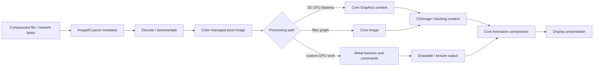
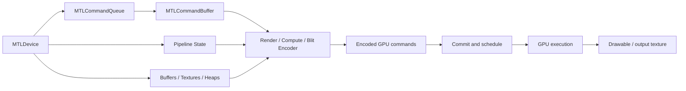
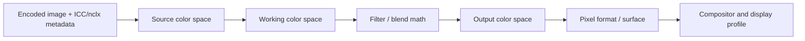
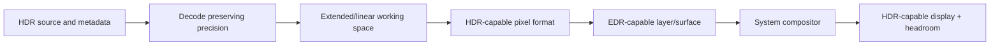
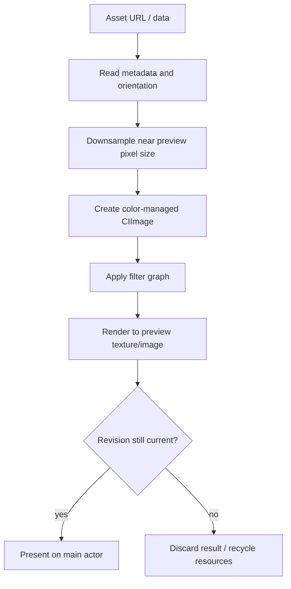

# iOS 图形与媒体：从 ImageIO、Core Image 到 Metal 显示管线

> iOS 图形工程不是在 Core Graphics、Core Image 和 Metal 中“选一个最快的框架”。ImageIO 负责读取、识别、增量解析与缩略图生成；Core Graphics 提供 CPU 侧二维绘制和像素上下文；Core Image 以延迟执行的图像处理图组织滤镜；Metal 显式管理纹理、命令编码和 GPU 执行；Core Animation 再把结果纳入系统合成。像素尺寸、颜色空间、动态范围和显示节奏贯穿整条链路，任何一个环节丢失元数据、过早光栅化或重复搬运，都可能造成模糊、偏色、内存峰值或掉帧。

---

## 一、本文解决什么问题

真实 App 中的图形与媒体需求通常不是“画一个矩形”，而是完整的数据管线：

- 相册中的 48 MP 照片只显示在 390 pt 宽的预览区，为什么不能直接完整解码？
- `UIImage.size`、`CGImage.width` 和文件大小为什么完全不是一回事？
- 图片方向存在 EXIF Orientation 时，直接按像素宽高下采样为何可能得到错误目标尺寸？
- Core Graphics、Core Image、Metal 分别适合什么任务，能否在后台线程使用？
- `CIImage` 为什么创建很快，但真正显示时才卡顿？
- Metal Texture 的 Pixel Format、Usage、Storage Mode 和尺寸如何影响带宽与正确性？
- Command Buffer 提交后何时才真正完成，能否立即复用其中的 Buffer/Texture？
- `CADisplayLink` 是否永远以 60 Hz 回调，如何适配 ProMotion 和掉帧？
- Display P3、Extended Linear Color、HDR/EDR 分别解决什么问题？
- 截图、导出、分享和屏幕显示为什么可能出现不同亮度与颜色？
- GPU Capture 能看到什么，又不能证明什么？
- 图像请求取消后，已经开始的 Decode/Filter/GPU Work 如何收尾并防止旧结果覆盖？

这些问题的共同主线是：**从压缩资源到屏幕像素，中间经过元数据解析、解码、颜色转换、图像处理、GPU 资源、命令提交和显示合成；每个阶段都有自己的数据表示、所有权和成本。**

本文以 UIKit、Core Graphics、Core Image、ImageIO 和 Metal 为主，示例按 Xcode 26.1.1、Apple Swift 6.2.1 与 iOS Simulator SDK 编写，以 iOS 17+ 为主要验证基线。大部分基础 API 支持更早系统，但 Wide Color、Extended Dynamic Range（EDR）、Metal Pixel Format、Display Refresh 与 Capture 工具能力会随系统、设备、屏幕和 Xcode 版本变化。HDR Pipeline、Core Image Kernel Fusion、Metal Driver Scheduling、Texture Compression 与 Core Animation 合成策略不属于稳定业务契约，必须使用当前官方文档和目标硬件验证。

### 核心结论

1. ImageIO 处理压缩图像容器与元数据，并可按目标像素尺寸生成 Thumbnail。显示小图时先下采样再解码，通常比先完整解码再缩放更能控制内存峰值。
2. Core Graphics 是 CPU 侧二维绘制与像素上下文 API，适合 Path、文本/图片组合、PDF、离线位图生成和精确坐标绘制；它不是自动并行的 GPU Scene Graph。
3. Core Image 用 `CIImage`、Filter 和 `CIContext` 表达延迟执行的图像处理图。创建/串联 Filter 不等于已经渲染，成本通常在请求输出到 CGImage、Texture 或 Drawable 时发生。
4. Metal 提供显式 GPU 资源与命令模型。开发者要管理 Device、Queue、Buffer/Texture、Pipeline、Encoder、Command Buffer 与同步；它能力最强，但工程复杂度也最高。
5. Texture 是带维度、Pixel Format、Mip Level、Usage 和 Storage Mode 的 GPU 图像资源，不只是“GPU 上的 UIImage”。格式与颜色语义不匹配会造成偏色、精度损失或不可用 Pipeline。
6. Command Buffer 是一批有序 GPU 命令的提交单元。`commit()` 只表示提交，不表示 GPU 已完成；资源复用、读回和 CPU/GPU 同步必须依据完成时机设计。
7. `CADisplayLink` 是与显示更新机会关联的回调源，不是精确 Timer。回调频率可变化，也可能因主线程阻塞而丢失；动画应根据时间推进，而不是假设“一次回调等于固定一帧”。
8. Pixel Size 表示实际采样网格，Point Size 是逻辑布局尺寸，Scale 连接二者。文件字节数、解码内存、Texture Memory 和屏幕占用是四个不同量。
9. Color Space 描述数值如何映射到颜色。忽略 ICC Profile、把 Display P3 当 sRGB、在线性与 Gamma 空间错误混合，都会改变视觉结果。
10. Wide Color 扩展可表示色域，HDR/EDR 扩展亮度范围与信号表达，两者不是同义词。P3 图片不一定是 HDR，HDR 内容也必须通过支持的格式、Surface、合成和显示链路才能保留高亮。
11. GPU Capture 用于检查某一帧的 Command、Encoder、Resource、Pipeline 和 Shader，但不能单独解释网络、解码、主线程布局、跨帧 Hitch 或真实用户分布；需与 Instruments 和 Signpost 联合使用。
12. 图形优化应优先减少无意义的像素：避免超尺寸解码、重复颜色转换、CPU/GPU 往返、每帧资源分配和不可复用中间纹理，再讨论更底层的 Shader 优化。
13. 媒体异步链路必须治理取消、请求 Identity、资源释放、内存压力和旧结果。任务被取消不保证底层 Decode/GPU Work 立即停止，但结果提交必须校验仍属于当前请求。

---

## 二、从文件到屏幕的完整管线



每条路径并非都要经过所有框架。例如静态缩略图可能由 ImageIO 直接生成 `CGImage` 后交给 UIImageView；实时相机滤镜可能从 Pixel Buffer 进入 Core Image/Metal，再写入 Drawable；PDF 海报导出可能主要使用 Core Graphics。

决定方案前要回答：

- Source 是压缩文件、Camera Pixel Buffer、CVPixelBuffer、CGImage 还是 Metal Texture？
- Output 是屏幕预览、离线文件、分享图、视频帧还是打印/PDF？
- 是否要求实时、可编辑、HDR、Wide Color 或精确色彩？
- 图像多大、每秒多少帧、允许多少内存和延迟？
- 中间结果能否缓存，何时失效？

---

## 三、ImageIO：在完整解码前控制像素规模

### 3.1 压缩大小不等于解码内存

一张 JPEG 文件可能只有数 MB，但解码为 12000 × 9000、每像素 4 Byte 的常见 8-bit RGBA/BGRA Buffer，单份理论像素数据约为：

```text
12000 × 9000 × 4 ≈ 412 MiB
```

这还未包含：

- Decoder Working Buffer；
- Color Conversion Buffer；
- Orientation/Resize Output；
- UIImage/Core Animation Backing；
- GPU Texture；
- Cache 和并发请求。

因此图片内存不能由文件大小推断。实际 Bytes Per Row 还可能有 Alignment，Pixel Format 也可能是 8/10/16-bit、Planar 或压缩纹理。

### 3.2 用 ImageIO 下采样

```swift
import ImageIO
import UIKit

enum ImageDownsampler {
    static func makeThumbnail(
        at url: URL,
        pointSize: CGSize,
        scale: CGFloat
    ) -> UIImage? {
        let sourceOptions: CFDictionary = [
            kCGImageSourceShouldCache: false
        ] as CFDictionary

        guard let source = CGImageSourceCreateWithURL(
            url as CFURL,
            sourceOptions
        ) else {
            return nil
        }

        let maxPixelDimension = max(pointSize.width, pointSize.height) * scale
        let thumbnailOptions: CFDictionary = [
            kCGImageSourceCreateThumbnailFromImageAlways: true,
            kCGImageSourceCreateThumbnailWithTransform: true,
            kCGImageSourceThumbnailMaxPixelSize: maxPixelDimension,
            kCGImageSourceShouldCacheImmediately: true
        ] as CFDictionary

        guard let image = CGImageSourceCreateThumbnailAtIndex(
            source,
            0,
            thumbnailOptions
        ) else {
            return nil
        }

        return UIImage(cgImage: image, scale: scale, orientation: .up)
    }
}
```

关键点：

- `pointSize × scale` 转成目标 Pixel Dimension；
- `CreateThumbnailWithTransform` 应用 EXIF Orientation；
- `ShouldCache: false` 避免 Source 创建阶段急于完整解码；
- `ShouldCacheImmediately: true` 让 Thumbnail 在当前受控阶段完成 Decode，减少首次显示时突发工作。

这些选项影响的是解码时机与目标像素，并不代表所有格式/Source 都采用完全相同的内部路径。

### 3.3 Orientation 与尺寸

JPEG/HEIF 可能用 Orientation Metadata 表示旋转，而不是重排 Pixel Data。原始 `PixelWidth/PixelHeight` 与视觉方向下的宽高可能交换。若先读取原始尺寸计算 Fill/Fit，再忽略 Orientation，下采样目标和布局会错误。

工程上应区分：

- Encoded Pixel Dimensions；
- Orientation-adjusted Display Dimensions；
- UI Target Point Size；
- Target Scale；
- Crop Policy（Aspect Fit/Fill/Center Crop）。

### 3.4 增量与多帧图像

ImageIO 支持 Incremental Source 和多 Image Index，可用于渐进下载、Animated Image 或 Container 内多帧读取。但“数据增加就每次完整重建所有帧”会造成重复解码。需要明确：

- Progressive Preview 的更新频率；
- Frame Duration、Loop Count 和 Disposal；
- Memory Cache 只保留多少帧；
- 网络取消后 Source 如何释放；
- 是否应使用系统/成熟图片库处理复杂 Animated Format。

---

## 四、像素尺寸、逻辑尺寸与内存

### 4.1 Point、Pixel 与 Scale

```text
pixelWidth  = pointWidth  × scale
pixelHeight = pointHeight × scale
```

例如 100 pt × 100 pt 的图在 `scale = 3` 的目标上需要约 300 × 300 Pixel 才能一一匹配采样网格。这里的 Scale 是资源/绘制与逻辑尺寸的换算，不等于 Metal 中任意 Texture 都自动随 UIScreen Scale 配置。

### 4.2 UIImage.size 不是 CGImage 像素尺寸

```swift
let pointSize = image.size
let imageScale = image.scale
let pixelWidth = image.cgImage?.width
let pixelHeight = image.cgImage?.height
```

`UIImage.size` 以 Point 表示；Backing `CGImage.width/height` 是 Pixel。`UIImage` 还可能由 `CIImage` 支撑，不能总是假设 `cgImage` 非空。

### 4.3 估算只是下界

常见未压缩 8-bit BGRA 可先估算：

```text
bytes ≈ width × height × 4
```

但实际还要考虑：

- Bytes Per Row Alignment；
- Extended/Float Pixel Format；
- YCbCr/Biplanar Video Format；
- Mipmaps 额外级别；
- Multisample Texture；
- IOSurface/Driver Allocation；
- CPU 与 GPU 各有一份副本；
- Heap/Alias 是否复用。

性能调查应查看实际 Allocation/VM/GPU Resource，而不是把公式当最终数据。

### 4.4 先裁剪还是先缩放

显示 Aspect Fill 小窗口时，理想流程通常是尽早减少到“足以覆盖目标 Crop 的 Pixel Size”，再处理滤镜与上传。若先把原图完整解码、做全尺寸 Blur、最后裁出 300 pt 区域，绝大多数像素工作都被浪费。

但离线导出需要保留目标输出分辨率，不能拿屏幕预览 Thumbnail 当最终素材。Preview Pipeline 与 Export Pipeline 应共享参数模型，而不是共享低清像素结果。

---

## 五、Core Graphics：CPU 侧二维绘制与像素上下文

### 5.1 适用场景

Core Graphics（Quartz 2D）适合：

- Path、Stroke、Fill、Gradient；
- 图片合成、Crop、坐标变换；
- PDF 创建与渲染；
- 离线海报、水印、分享图；
- 自定义 UIView/CALayer 内容；
- 需要确定性 CPU Bitmap Output 的任务。

它是 Immediate-mode API：向 `CGContext` 发出绘制命令，修改当前 Graphics State，最终写入目标 Surface/Bitmap/PDF。它不维护类似 UIView 的可交互对象树。

### 5.2 坐标与 Graphics State

```swift
func drawBadge(in context: CGContext, rect: CGRect) {
    context.saveGState()
    defer { context.restoreGState() }

    context.setFillColor(UIColor.systemRed.cgColor)
    context.fillEllipse(in: rect)

    context.setStrokeColor(UIColor.white.cgColor)
    context.setLineWidth(2)
    context.strokeEllipse(in: rect.insetBy(dx: 1, dy: 1))
}
```

Clip、Transform、Alpha、Blend Mode、Color 和 Line Style 都属于 Graphics State。复杂绘制中必须成对 `saveGState`/`restoreGState`，避免局部配置泄漏到后续命令。

UIKit Drawing Context 的坐标约定与直接创建 Bitmap/PDF Context 可能不同。遇到上下翻转时应明确 Current Transformation Matrix（CTM），不要到处试验负 Scale 直到“看起来正确”。

### 5.3 UIGraphicsImageRenderer

```swift
func makeShareCard(
    size: CGSize,
    scale: CGFloat,
    drawContent: (CGContext) -> Void
) -> UIImage {
    let format = UIGraphicsImageRendererFormat()
    format.scale = scale
    format.opaque = true

    let renderer = UIGraphicsImageRenderer(size: size, format: format)
    return renderer.image { rendererContext in
        UIColor.systemBackground.setFill()
        rendererContext.fill(CGRect(origin: .zero, size: size))
        drawContent(rendererContext.cgContext)
    }
}
```

`UIGraphicsImageRenderer` 比手工创建 Bitmap Context 更容易遵循 UIKit Scale/Format 约定，但仍会分配目标像素 Buffer。生成 10000 pt、3x 的图片会产生极大内存，不会因为 API 更现代而自动安全。

### 5.4 线程与资源

独立创建的 CGContext、CGImage 等对象通常可以在后台任务使用，但 UIKit View Hierarchy 操作仍应遵循 Main Actor/Main Thread 规则。还要避免多个线程并发修改同一个可变 Context/对象。

后台生成结果后回到 Main Actor 提交 UI，并校验请求 Identity：

```swift
let requestID = UUID()
currentRequestID = requestID

Task.detached(priority: .userInitiated) {
    let image = renderShareCard()

    await MainActor.run {
        guard currentRequestID == requestID else { return }
        imageView.image = image
    }
}
```

示例只展示结果防旧；生产代码还要处理 Cancellation、错误和跨 Actor Capture 的 Sendability。不是所有 UIKit/Image Object 都适合无约束跨 Actor 传递，应以当前 SDK 的 Concurrency Annotation 和编译器诊断为准。

---

## 六、Core Image：延迟执行的图像处理图

### 6.1 CIImage 不是已渲染 Bitmap

`CIImage` 更接近一张带有 Extent、Color Space 和 Recipe 的不可变图像描述。串联 Filter 通常建立处理图：

```swift
import CoreImage

func filteredImage(input: CIImage, intensity: Float) -> CIImage? {
    let filter = CIFilter(name: "CIColorControls")
    filter?.setValue(input, forKey: kCIInputImageKey)
    filter?.setValue(intensity, forKey: kCIInputSaturationKey)
    return filter?.outputImage
}
```

真正计算可能推迟到 `CIContext` 创建 CGImage、渲染到 Texture/Pixel Buffer 或显示输出时。于是“Filter 配置只耗时 0.1 ms”不能说明整条滤镜只需 0.1 ms。

### 6.2 复用 CIContext

`CIContext` 管理 Render Resource、Kernel、Cache 与 Working Color Space 等，创建成本和资源占用不应忽略。通常按渲染后端与配置复用，而不是每张图片创建一次：

```swift
final class ImageFilterRenderer {
    private let context = CIContext(options: [
        .cacheIntermediates: false
    ])

    func makeCGImage(from image: CIImage) -> CGImage? {
        context.createCGImage(image, from: image.extent)
    }
}
```

是否关闭 Intermediate Cache 取决于 Pipeline 是否复用中间结果。实时视频与重复编辑同一图像的最佳配置可能不同，必须测量。

### 6.3 Extent 与无限图像

部分 Generator/Blur/Tile Filter 会产生无限或扩大的 Extent。若直接渲染 `outputImage.extent`，可能得到异常大区域或错误 Crop。应明确最终 Output Rect：

```swift
let output = filtered.cropped(to: input.extent)
```

Blur 边缘还涉及 Clamp/Crop 策略。简单 Crop 可能产生透明边，常见做法是先 Clamp Input，再 Blur，最后 Crop 到目标，但具体 Filter Graph 应根据视觉需求验证。

### 6.4 CPU、GPU 与 Metal 后端

Core Image 可以根据 Context、设备、格式和 Filter 选择执行路径，也可与 Metal Device/Command Buffer/Texture 集成。不要把 Core Image 简化为“永远走 GPU”，也不要假设自写 Metal Kernel 必然更快。Core Image 的优势包括：

- Lazy Graph；
- Filter Fusion/Optimization 的机会；
- Color Management；
- 内置 Filter；
- 多种输入输出适配。

自定义 Metal 更适合 Core Image 无法表达、需要精确 Memory/Layout、复杂多 Pass 或与现有 Metal Renderer 深度集成的任务。

---

## 七、Metal：显式 GPU 资源与执行模型



### 7.1 Device 与 Command Queue

```swift
import Metal

guard let device = MTLCreateSystemDefaultDevice(),
      let commandQueue = device.makeCommandQueue() else {
    fatalError("Metal is unavailable")
}
```

`MTLDevice` 代表 GPU 接口，通常长期复用；`MTLCommandQueue` 用于创建 Command Buffer，也应复用。每帧重建 Device、Queue 或 Pipeline State 会制造不必要成本。

### 7.2 Pipeline State 是预编译执行配置

Render/Compute Pipeline State 汇总 Shader Function、Pixel Format、Blend/Depth 等固定配置。应在加载或配置变化时创建并缓存，而不是每帧编译。

Pipeline Creation 可能失败，错误应在开发/启动阶段明确暴露；不能在 Draw Loop 中悄悄回退成空画面。

### 7.3 Encoder 按任务分工

- Render Command Encoder：Vertex/Fragment Rasterization；
- Compute Command Encoder：通用并行计算；
- Blit Command Encoder：Copy、Mipmap、Synchronize 等数据操作；
- Acceleration Structure 等 Encoder：取决于具体 Metal 能力与系统版本。

Encoder 结束后要调用 `endEncoding()`。一个 Command Buffer 可依序包含多个 Encoder，但资源依赖、Pass 边界和中间纹理会影响性能。

---

## 八、Texture：格式、用途与存储决定成本

### 8.1 Texture Descriptor

```swift
let descriptor = MTLTextureDescriptor.texture2DDescriptor(
    pixelFormat: .bgra8Unorm_srgb,
    width: pixelWidth,
    height: pixelHeight,
    mipmapped: false
)
descriptor.usage = [.shaderRead, .renderTarget]
descriptor.storageMode = .private

guard let texture = device.makeTexture(descriptor: descriptor) else {
    throw RendererError.textureAllocationFailed
}
```

关键字段：

- `pixelFormat`：通道布局、Bit Depth、Normalized/Float、sRGB Transfer；
- `width/height/depth`：像素维度；
- `mipmapLevelCount`：缩小时的多级采样；
- `usage`：Shader Read/Write、Render Target、Pixel Format View；
- `storageMode`：CPU/GPU 可见性和存储位置；
- `sampleCount`：MSAA；
- Texture Type/Array Length。

Usage 声明过宽可能限制优化，声明不足则无法用于对应操作。Storage Mode 选择还随 Apple Silicon Unified Memory、平台和资源更新方式变化，不能套用离散 GPU 的简单结论。

### 8.2 sRGB Pixel Format 的含义

`.bgra8Unorm_srgb` 不只是名字里多了 sRGB。GPU 在 Texture Sample/Render Target 写入时会按格式执行相应 Transfer Conversion，使 Shader 更容易在线性空间处理光照与混合。若 Source Bytes 已被错误预转换，或 Shader 又手工重复 Gamma Conversion，就会偏色。

Color Space Metadata、Pixel Format Transfer Function 与 Shader Math 必须整体设计。

### 8.3 Mipmap

大 Texture 经常缩小显示时，Mipmap 可改善采样质量和 Cache Behavior，但会增加约约三分之一的完整 Mip Chain 像素存储，并需要生成/更新。动态视频帧若每帧生成全 Mipmap 可能不划算；固定素材重复缩小则可能有收益。

### 8.4 资源复用

实时 Renderer 应避免每帧创建 Texture/Buffer。常见方法：

- Ring Buffer / Frames in Flight；
- Texture Pool；
- `MTLHeap` 或可别名资源；
- 根据 Resolution/Format 建 Cache Key；
- Memory Warning/Background 时缩减缓存；
- 用 Command Buffer Completion/Shared Event 确认资源已不再被 GPU 使用。

资源复用不能只按 Swift 引用计数判断：CPU 不再持有某个临时变量时，GPU 可能仍在执行引用该 Resource 的命令。

---

## 九、Command Buffer：提交、执行与完成是三个时刻

### 9.1 基本生命周期

```swift
guard let commandBuffer = commandQueue.makeCommandBuffer() else {
    throw RendererError.commandBufferCreationFailed
}

commandBuffer.label = "Photo Filter Frame"

guard let encoder = commandBuffer.makeComputeCommandEncoder() else {
    throw RendererError.encoderCreationFailed
}

encoder.label = "Color Adjustment"
encoder.setComputePipelineState(pipelineState)
encoder.setTexture(inputTexture, index: 0)
encoder.setTexture(outputTexture, index: 1)
encoder.dispatchThreads(
    gridSize,
    threadsPerThreadgroup: threadgroupSize
)
encoder.endEncoding()

commandBuffer.addCompletedHandler { buffer in
    if let error = buffer.error {
        logger.error("GPU work failed: \(error.localizedDescription)")
    }
}

commandBuffer.commit()
```

状态概念上经历：Created → Enqueued/Scheduled → Completed/Error。`commit()` 后 CPU 可继续编码后续 Frame；若立刻 `waitUntilCompleted()`，会把异步 GPU Pipeline 变成同步等待，容易产生 Stall。

### 9.2 Present Drawable

渲染到 `CAMetalDrawable.texture` 后，通常在同一 Command Buffer 上安排 Present：

```swift
commandBuffer.present(drawable)
commandBuffer.commit()
```

Drawable 数量有限。获取后长时间不提交/持有会阻塞后续 Frame。应尽量晚获取 Drawable、尽快编码并提交，同时正确处理 `nextDrawable()` 可能失败或暂时不可用的情况。

### 9.3 Frames in Flight

允许 CPU 编码第 N+1 帧时 GPU 执行第 N 帧可提高吞吐，但同时在飞资源必须隔离。常见使用 Semaphore 限制最大 Frames in Flight，并在 Command Buffer Completion 中释放 Slot。

边界：

- Semaphore Wait 不应无界阻塞 Main Thread；
- Completion 必须保证所有错误路径都归还 Slot；
- Buffer Offset 按 Frame Index 隔离；
- 延迟与吞吐存在权衡，更多 In-flight Frame 可能增加 Input-to-Display Latency。

### 9.4 GPU 错误处理

Development 中应给 Command Buffer、Encoder、Pipeline、Texture 设置 Label，捕获：

- Pipeline/Function Creation Error；
- Command Buffer Error；
- Resource Allocation Failure；
- Drawable Unavailable；
- Device Removal/Reset 等平台相关状态。

Release 中也要有降级路径，例如关闭某滤镜、降低分辨率或显示原图，而不是持续提交失败命令。

---

## 十、Display Link：跟随显示机会，而不是猜固定帧率

### 10.1 CADisplayLink 基本用法

```swift
@MainActor
final class FrameDriver {
    private var displayLink: CADisplayLink?
    private var previousTimestamp: CFTimeInterval?

    func start() {
        guard displayLink == nil else { return }

        let link = CADisplayLink(
            target: self,
            selector: #selector(step(_:))
        )
        link.preferredFrameRateRange = CAFrameRateRange(
            minimum: 30,
            maximum: 120,
            preferred: 120
        )
        link.add(to: .main, forMode: .common)
        displayLink = link
    }

    func stop() {
        displayLink?.invalidate()
        displayLink = nil
        previousTimestamp = nil
    }

    @objc private func step(_ link: CADisplayLink) {
        defer { previousTimestamp = link.timestamp }
        guard let previousTimestamp else { return }

        let deltaTime = link.timestamp - previousTimestamp
        updateSimulation(deltaTime: deltaTime)
        render(targetTimestamp: link.targetTimestamp)
    }

    private func updateSimulation(deltaTime: CFTimeInterval) {}
    private func render(targetTimestamp: CFTimeInterval) {}

    deinit {
        displayLink?.invalidate()
    }
}
```

`preferredFrameRateRange` 是偏好，不是强制保证。系统会根据 Hardware、Low Power Mode、Thermal、Content 和调度选择实际 Refresh Rate。

### 10.2 不要按回调次数推进状态

错误：

```swift
position += 2 // 假设每秒正好 60 次
```

在 120 Hz 会变快，掉帧时会变慢。应按 Timestamp Delta 推进，且对超大 Delta 设计：

- Clamp，避免后台恢复后一步穿透；
- Fixed Time Step + Accumulator，适合 Physics；
- Variable Step，适合简单视觉插值；
- Drop/Skip Strategy，适合 Video Frame。

### 10.3 生命周期与 Run Loop Mode

Display Link 强持有 Target 的关系需要注意 Retain Cycle；停止时必须 `invalidate()`。加入 `.common` Modes 可以让常见滚动场景继续回调，但这也意味着滚动期间会争用 Main Thread Budget，是否需要应按业务决定。

App 进入后台或 View 不可见时应暂停无意义渲染，恢复时重置 Timestamp。不能只靠 `deinit`，因为 Owner 可能仍被持有。

### 10.4 Display Link 与 Metal Drawable

Display Link 回调是开始准备一帧的机会，不是“现在屏幕刚刚完成显示”的精确通知。Renderer 还要考虑：

- CPU Encoding Time；
- GPU Queue Depth；
- Drawable Availability；
- Present Timing；
- Variable Refresh Rate；
- Frame Pacing 与 In-flight Latency。

下一篇帧性能会进一步讨论 Deadline/Hitch。

---

## 十一、Color Space：像素数值必须有颜色语义

### 11.1 Color Space 解决什么

同样的 RGB 数值，在不同 Primaries、White Point 和 Transfer Function 下可能代表不同颜色。常见概念：

- sRGB：常见标准色域和 Transfer；
- Display P3：更宽的 RGB Primaries，常用于 Apple Wide Color Display；
- Linear sRGB/P3：适合正确的光照、模糊和混合计算；
- Extended Range：允许分量超出传统 0...1 表达；
- Device-dependent Space：依赖设备，不适合跨设备精确交换。

### 11.2 颜色管理链路



任何一段把“有 Profile 的像素”误当成“无 Profile 的 sRGB 数值”，都可能引入偏色。常见错误包括：

- 解码后丢弃 ICC Profile；
- P3 Pixel 用 sRGB CGColorSpace 标注；
- 在 Gamma-encoded Space 直接做应在线性空间进行的混合；
- Core Image Working/Output Color Space 不明确；
- Metal Texture 用 `_srgb` Format 后 Shader 又重复 Gamma 转换；
- 导出 JPEG/HEIF 时未写正确 Color Metadata。

### 11.3 UIColor 也有颜色空间

`UIColor(red:green:blue:alpha:)` 的具体便利初始化和 Dynamic Color 解析不能取代明确 Color Management。设计资产要求 Display P3 时，可使用具备对应 Color Space 的 Asset Catalog 或显式 Color，并在 sRGB 设备/导出目标上验证 Gamut Mapping。

截图取色数值、设计工具数值和 Shader 常量只有在 Color Space/Transfer 一致时才能直接比较。

---

## 十二、Wide Color 与 HDR/EDR：色域和亮度是两条轴

### 12.1 Wide Color 不等于 HDR

| 概念 | 主要扩展 | 例子 |
|---|---|---|
| Wide Color | 可表示颜色范围/色域 | Display P3 相对 sRGB |
| High Bit Depth | 数值精度、减少 Banding | 10-bit、16-bit Float |
| HDR/EDR | 可表示与显示更高亮度/动态范围 | HDR 照片、视频高光 |
| Extended Linear | 允许线性分量超过传统范围 | 图像处理工作空间 |

一张 Display P3 8-bit SDR 图片可以是 Wide Color 但不是 HDR；一条 HDR Pipeline 往往还需要更高精度格式、Transfer/Metadata、支持 EDR 的 Surface 与 Display。

### 12.2 HDR 链路必须端到端成立



任何环节过早转为 8-bit sRGB SDR 都会 Clamp/Tone-map/丢失高光。与此同时，HDR Output 不能假设永远可用：

- 设备或外接屏不支持；
- 当前 EDR Headroom 受系统状态影响；
- App Window 不在目标屏幕；
- Screenshot/Screen Recording/Remote Display 改变输出；
- Low Power/Thermal/用户设置影响能力；
- 分享目标只支持 SDR。

因此需要 SDR Fallback 和明确 Tone Mapping，而不是仅打开一个 Boolean。

### 12.3 UIScreen EDR 信息

系统提供当前/潜在 EDR Headroom 等能力信息，但它描述的是显示环境能力，不会自动把普通 sRGB 内容变成 HDR。具体 API 可用性与语义应按部署版本查阅当前 SDK，并监听 Screen/Scene 环境变化，避免把启动时读取值缓存为永久事实。

### 12.4 导出与显示是两套目标

屏幕预览可根据设备做 Tone Mapping；导出文件则要明确：

- Container/Codec 是否支持 HDR；
- Bit Depth、Transfer、Primaries；
- Metadata 是否完整；
- 接收端是否正确解释；
- SDR Thumbnail/Compatibility Representation；
- 社交平台是否重新编码。

“本机看起来正确”不能证明文件跨设备正确。

---

## 十三、框架如何组合，而不是互相替换

### 13.1 常见路径比较

| 路径 | 优势 | 成本与边界 | 适用场景 |
|---|---|---|---|
| ImageIO → UIImageView | 简单、系统集成好 | 复杂滤镜能力有限 | 缩略图、普通图片 |
| ImageIO → Core Graphics | 精确 CPU 合成与导出 | 大图内存、CPU Cost | 海报、PDF、水印 |
| ImageIO/CIImage → Core Image | Lazy Filter Graph、Color Management | Render 时才付成本 | 照片滤镜、视频处理 |
| ImageIO → Metal Texture | 自定义 GPU Pipeline | 上传、同步、Shader 复杂度 | 实时特效、渲染器 |
| Core Image → Metal Texture/Drawable | 复用 CI Filter 并接入 Metal | Context/Format/Command 协调 | 混合图像处理管线 |
| Metal → Core Animation | 高性能自定义帧输出 | Drawable/Pacing/合成边界 | 游戏、可视化、相机预览 |

### 13.2 避免 CPU/GPU 往返

反模式：

```text
Metal Texture → CPU CGImage → Core Graphics → CPU Bitmap
→ upload Metal Texture → filter → read back UIImage → display
```

如果最终仍在 GPU 显示，尽量让中间结果保持 Texture/Pixel Buffer/CIImage 表达。只有业务确实需要 CPU Access、文件编码或系统 API 输入时再读回。

GPU → CPU Readback 往往需要 Synchronization，并可能打断流水线；不是“取个像素值”那么轻量。

### 13.3 Preview 与 Export 分离

预览关注：

- Low Latency；
- 目标屏幕尺寸；
- 可取消和丢帧；
- 交互参数实时更新。

导出关注：

- 完整目标分辨率；
- 确定性结果；
- Color/HDR Metadata；
- Progress、错误和后台生命周期；
- 磁盘空间与临时文件清理。

两者应共享 Non-destructive Edit Parameters/Filter Graph，但使用不同 Resolution、Scheduling 和 Cache。

---

## 十四、工程案例：大图预览、实时滤镜与全分辨率导出

### 14.1 需求与状态模型

用户选择一张高分辨率 P3/HEIF 图片，编辑 Saturation 和 Exposure，预览随 Slider 更新，点击导出后生成保留正确颜色信息的文件。

```swift
struct PhotoEditParameters: Equatable, Sendable {
    var saturation: Float
    var exposureEV: Float
}

struct PhotoEditRequest: Equatable, Sendable {
    let assetID: String
    let revision: Int
    let parameters: PhotoEditParameters
}
```

`revision` 用于区分高频参数请求。旧任务即使无法立即取消，也不能覆盖最新 Preview。

### 14.2 预览链路



Slider 高频变化时：

- UI State 每次更新，但 Render Request 可 Debounce/Coalesce；
- 正在执行的 CPU Task 响应 Cancellation；
- GPU Command 已提交时通常让其完成并丢弃旧 Result；
- CIContext、Command Queue、Pipeline 和 Texture Pool 复用；
- Preview Resolution 跟随 View Pixel Size，而非原图尺寸。

### 14.3 导出链路

导出不能复用低分辨率 Preview Bitmap：

1. 重新读取原始资源与 Metadata；
2. 按最终输出尺寸解码；
3. 使用同一参数图在适合的 Working Color Space 处理；
4. 大图超过 Memory Budget 时评估 Tiling，但注意 Filter 邻域和 Seam；
5. 编码到目标 Format，并写入 Color/HDR/Orientation Metadata；
6. 使用临时文件原子替换，失败/取消时清理；
7. 导出完成后再更新 UI 和分享状态。

### 14.4 Memory Budget

若原图、输入 Working Buffer、两份 Intermediate、Output 和编码缓冲同时存在，峰值远高于单图估算。工程上应记录每阶段像素格式与寿命：

| 资源 | Pixel Format | 尺寸 | Owner | 释放时机 |
|---|---|---|---|---|
| Source Decode | 8/10-bit/Float | Full/Tile | Decoder | Filter 输入不再使用 |
| Preview Texture | BGRA8/Extended | View Pixels | Preview Renderer | Revision 替换/Cache Evict |
| Filter Intermediate | Backend-dependent | Pipeline | CI/Metal Context | Command 完成/Cache Policy |
| Export Output | Target Format | Export Pixels | Export Task | Encoder 完成 |

没有这张资源生命周期表，很容易只优化单次耗时却制造峰值 OOM。

### 14.5 错误与降级

- Source Decode 失败：显示可恢复错误，不进入滤镜；
- Wide Color Context 不可用：明确转换到 sRGB，而非丢 Profile；
- HDR Output 不支持：执行设计好的 Tone Mapping；
- Metal Resource Allocation 失败：降低 Preview Resolution 或退回 Core Image/静态预览；
- App 进入后台：按任务类型申请有限后台时间或暂停，不承诺无限执行；
- 用户换图：取消旧 CPU Task、递增 Revision、丢弃旧 GPU Completion。

---

## 十五、GPU Capture：从某一帧还原 GPU 工作

### 15.1 Capture 能回答什么

Xcode Metal Debugger/GPU Capture 通常可帮助检查：

- 一帧有哪些 Command Buffer 与 Encoder；
- Render/Compute Pass 顺序；
- Pipeline State 与 Shader；
- Bound Buffer/Texture/Sampler；
- Texture Format、尺寸、Mip Level；
- Draw/Dispatch 参数；
- 中间 Render Target 内容；
- Validation Error 与部分性能统计。

给对象设置清晰 Label 会显著降低分析成本：

```swift
commandBuffer.label = "Editor Preview r42"
inputTexture.label = "Original P3 Input"
outputTexture.label = "Filtered Preview"
```

### 15.2 Capture 流程

1. 在真机复现稳定场景；
2. 用 Signpost/界面操作定位目标 Frame；
3. Capture 单帧或相关 Workload；
4. 检查 Pass、Resources、Formats 和 Shader Inputs；
5. 确认是否存在重复 Clear、冗余 Copy、过大 Render Target、错误 Load/Store Action；
6. 修改一个因素后重新 Capture；
7. 回到 Instruments 验证跨帧 Hitch 和整体收益。

### 15.3 Capture 不能单独回答什么

- 网络为什么慢；
- ImageIO Decode 在 CPU 上花多久；
- Main Thread 为什么阻塞；
- 1000 帧中偶发一次 Hitch 的分布；
- 用户设备整体 Thermal/Memory 情况；
- Core Animation 私有合成实现的所有细节。

GPU Capture 是一帧的显微镜，不是端到端性能结论。

### 15.4 Frame Capture 与 Production

GPU Validation/Capture 会改变执行成本，不应用其绝对耗时代表 Release。最终性能仍要在关闭 Debug Validation 的 Profile/Release 真机环境测量。

---

## 十六、常见误区与修复

### 16.1 错误：UIImage 文件只有 3 MB，内存也只占 3 MB

**问题：** 混淆压缩字节与解码像素。

**修复：** 按 Pixel Format、Dimensions 和并发中间资源估算，并用 Allocations/VM 验证峰值。

### 16.2 错误：先完整解码，再缩成 Cell Thumbnail

**问题：** 为最终不可见的大量像素支付解码、内存和上传成本。

**修复：** 使用 ImageIO 根据目标 Point Size × Scale 下采样，并处理 Orientation。

### 16.3 错误：CIImage 创建成功表示滤镜已经完成

**问题：** 忽略 Lazy Evaluation，真正成本在 Render Output 时出现。

**修复：** 测量从输入准备到最终 Texture/CGImage/Present 的完整范围。

### 16.4 错误：每张图片创建一个 CIContext 或 Metal Command Queue

**问题：** 重复创建缓存、编译和驱动资源。

**修复：** 按 Device/Backend/Color Configuration 复用长期 Context、Queue 和 Pipeline。

### 16.5 错误：Metal Texture 就是一张 UIImage

**问题：** 忽略 Pixel Format、Usage、Storage、Mipmap、同步和颜色语义。

**修复：** 把 Texture 当显式 GPU Resource，设计其完整 Descriptor 与生命周期。

### 16.6 错误：Command Buffer commit 后资源可立即覆盖

**问题：** GPU 可能仍在读取，造成数据竞争或画面损坏。

**修复：** 使用 Frames-in-flight 分区和 Completion/同步原语确认资源可复用。

### 16.7 错误：CADisplayLink 每次回调都代表固定 1/60 秒

**问题：** ProMotion、系统调度和主线程阻塞会改变间隔。

**修复：** 使用 Timestamp Delta，处理大 Delta、丢帧和生命周期暂停。

### 16.8 错误：Display P3 就是 HDR

**问题：** 混淆 Color Gamut、Bit Depth 与 Dynamic Range。

**修复：** 分别设计 Primaries/Transfer、精度、EDR Surface、Display Capability 和 SDR Tone Mapping。

### 16.9 错误：给 Texture 用 sRGB Format 后颜色一定正确

**问题：** Source Metadata、Shader Conversion 和 Output Space 仍可能不匹配或重复转换。

**修复：** 端到端记录 Source、Working、Texture Transfer 和 Output Color Space。

### 16.10 错误：GPU Capture 中某个 Pass 最慢，所以它就是用户卡顿根因

**问题：** 单帧 Capture 不能覆盖 CPU、网络、跨帧分布和 Capture Overhead。

**修复：** 先用 Instruments 找 Hitch 区间，再用 Capture 深挖目标 GPU Frame，并回到 Release 环境复测。

---

## 十七、测试与性能验证

### 17.1 正确性测试矩阵

至少覆盖：

- JPEG、PNG、HEIF、带 Orientation 的图片；
- sRGB、Display P3、带/不带 Profile；
- 8-bit、High Bit Depth/HDR Source（产品支持时）；
- 极宽、极高、超大像素和损坏文件；
- @2x/@3x、External Display、iPad Split View；
- Dark Mode 不同背景下 Alpha/Blend；
- Preview 与 Export 颜色/裁剪一致性；
- SDR 设备与 HDR-capable Device；
- Cancellation、快速换图、Memory Warning、Background/Foreground。

图片解析必须把输入视为不可信数据：限制 Pixel Count、Frame Count、Metadata Size 和并发解码数，防止 Decompression Bomb 或 OOM。

### 17.2 测量指标

| 阶段 | 指标 |
|---|---|
| ImageIO | Metadata Parse、Downsample/Decode Duration、Peak Memory |
| Core Graphics | Bitmap Allocation、Draw Time、Bytes Per Row |
| Core Image | Graph Render Duration、Intermediate Cache、Output Format |
| Metal | CPU Encode、GPU Duration、Command Queue Stall、Drawable Wait |
| Display | Frame Interval、Missed Frame、Present Latency |
| Export | Total Duration、Peak Memory、File Size、Color Metadata |

### 17.3 工具组合

- Time Profiler：CPU Decode、Drawing、Command Encoding；
- Allocations/VM Tracker：Decoded Bitmap、IOSurface、Cache；
- Core Animation/Animation Hitches：Frame 与合成问题；
- Metal System Trace：CPU/GPU Timeline、Queue 与 Stall；
- GPU Capture：单帧 Pass、Resource 和 Shader；
- os_signpost：标记 Request Revision、Decode、Filter、Present、Export。

### 17.4 验证环境

必须记录目标真机、iOS、Screen、Refresh Rate、Build Configuration、Thermal State、Low Power Mode、Source Resolution/Format 和 Cache 状态。Simulator 适合 API/布局调试，不适合代表目标 GPU、HDR、Memory Bandwidth 与 Decode 性能。

---

## 十八、方案选择清单

| 需求 | 首选起点 | 何时升级 |
|---|---|---|
| 列表缩略图 | ImageIO Downsampling + Cache | Animated/特殊格式使用成熟图片管线 |
| 分享图/PDF | Core Graphics/UIGraphicsImageRenderer | 超大图需 Tile/Streaming 策略 |
| 标准照片滤镜 | Core Image | 无法表达或性能不满足时自定义 Metal |
| 实时自定义特效 | Metal Compute/Render | 先证明 Core Image 不满足 |
| 自定义 GPU UI | MetalKit/CAMetalLayer | 确认维护成本和帧节奏需求 |
| 显示同步更新 | CADisplayLink | 视频使用媒体时钟/系统视频管线 |
| Wide Color | 保留 Profile + Color-managed Pipeline | 验证输出端和 Gamut Mapping |
| HDR/EDR | 端到端 HDR Pipeline + SDR Fallback | 不能只改单个 Pixel Format |

---

## 十九、总结

iOS 图形与媒体系统是一条数据表示不断变化的管线。ImageIO 面向压缩文件和元数据，Core Graphics 面向 CPU 二维绘制与 Bitmap，Core Image 面向延迟图像处理图，Metal 面向显式 GPU Resource 和 Command，Core Animation 面向最终合成。选择框架的依据应是输入、输出、实时性、颜色精度、像素规模和生命周期，而不是笼统比较“谁更快”。

工程优化首先要减少没有价值的像素与搬运：按显示目标下采样、区分预览与导出、复用 Context/Pipeline/Texture、避免 CPU/GPU Readback、让 GPU 资源活到 Command 完成。Display Link 只提供显示节奏机会，不能替代时间模型和 Frame Pacing。

色彩和动态范围必须端到端设计。Pixel Values 只有结合 Color Space、Transfer Function、Bit Depth 和 Output Capability 才有意义；Wide Color 与 HDR 是不同维度。任何一段默默转为 sRGB/8-bit 都可能让前面保留的能力失效。

最后，所有结论都要回到目标真机验证：用 Instruments 找到端到端瓶颈，用 GPU Capture 检查具体 Frame，用正确性矩阵验证 Orientation、Color、HDR 和 Cancellation。只有同时守住画质、内存、延迟与状态一致性，图形优化才真正成立。

## 问答复盘

### Q1：为什么 3 MB JPEG 解码后可能占用数百 MB？

**答：** 3 MB 是压缩文件大小，显示前要解码为按 Pixel Dimensions 和 Pixel Format 存储的 Buffer，还可能同时存在转换、中间结果与 GPU Texture。

### Q2：列表缩略图为何应使用 ImageIO 下采样，而不是先创建完整 UIImage？

**答：** 下采样可以在解码阶段把像素限制到目标 Point Size × Scale 附近，避免为不可见的原图像素支付内存、解码和上传成本。

### Q3：Core Graphics、Core Image 和 Metal 最容易混淆的职责是什么？

**答：** Core Graphics 是 CPU Immediate-mode 2D Drawing；Core Image 是 Lazy Filter Graph；Metal 是显式 GPU Resource/Command API。它们可以组合，并非同层替代品。

### Q4：创建 `CIImage` 或设置 Filter 后，处理是否已经执行？

**答：** 通常没有。Core Image 延迟构建处理图，真正成本多在 CIContext 请求 CGImage、Texture、Pixel Buffer 或其他输出时发生。

### Q5：调用 `commandBuffer.commit()` 是否表示 GPU 已完成？

**答：** 不表示。Commit 只提交命令；完成应通过 Command Buffer Status/Completion 等机制确认，资源不能在 GPU 仍使用时被覆盖。

### Q6：CADisplayLink 是否能保证 60 Hz 或请求的 120 Hz？

**答：** 不能。它受设备、系统策略、主线程、Thermal 和可变刷新率影响。动画应使用 Timestamp Delta，并容忍回调缺失和间隔变化。

### Q7：`UIImage.size` 与 `CGImage.width` 为什么不同？

**答：** `UIImage.size` 是 Point Size，`CGImage.width/height` 是 Pixel Dimensions，二者通过 UIImage Scale 和具体 Backing Representation 关联。

### Q8：Display P3 图片是否就是 HDR 图片？

**答：** 不是。Display P3 描述更宽色域；HDR/EDR 描述更高动态范围/亮度表达，通常还涉及更高精度、Transfer、Surface 和显示能力。

### Q9：实时预览任务取消后，已提交的 GPU Command 应如何处理？

**答：** 不应假设能立即撤销。让命令安全完成并回收资源，在 Completion/呈现前校验 Request Revision，丢弃旧结果；同时取消尚未提交的 CPU/编码工作。

### Q10：GPU Capture 中看到多余 Pass 后是否可直接断言它导致用户掉帧？

**答：** 不可以。Capture 解释某一帧 GPU 工作；还要用 Instruments 证明该 Pass 与真实 Hitch 重合，并排除 Decode、Main Thread、Drawable Wait 和 Capture Overhead。

## 延伸知识

- AVFoundation：CVPixelBuffer、Video Color Metadata、Video Composition 与同步；
- Core Video：Pixel Buffer Pool、IOSurface 与 Zero-copy Boundary；
- Metal Performance Shaders：常用 GPU Image/Compute Primitive；
- Core ML：模型输入像素、颜色归一化和 GPU/Neural Engine 协作；
- Image Codec：HEIF、JPEG XL、PNG、Alpha、HDR Gain Map 与兼容性；
- 帧性能：Refresh Rate、Render Loop、CPU/GPU Bound 与 Animation Hitch；
- 色彩科学：Chromaticity、White Point、Transfer Function、Tone Mapping；
- 资源治理：Texture Heap、Transient Resource、Memory Pressure 与 Cache Eviction。
