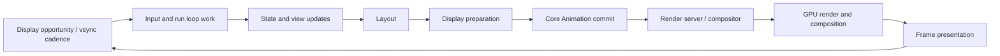
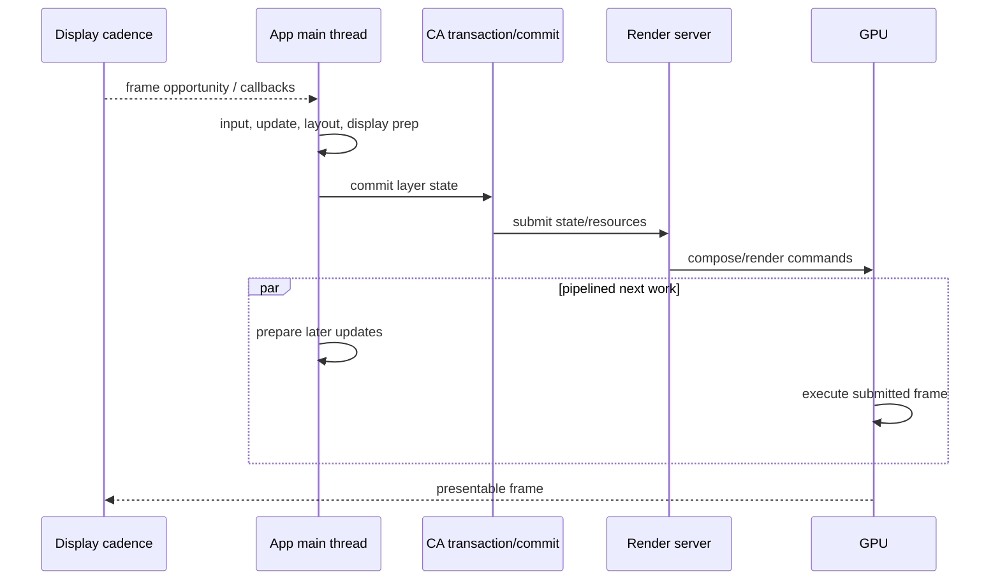
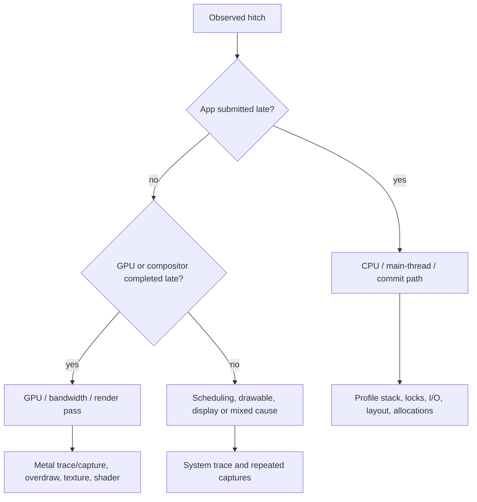
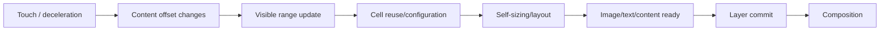
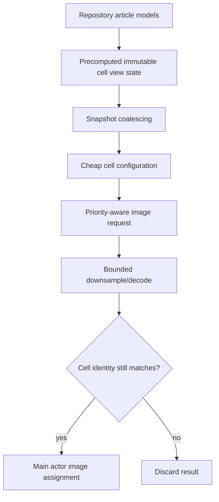
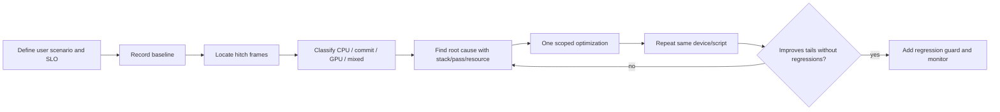

# iOS 帧性能：从刷新率、Render Loop 到 Hitch 诊断

> 帧性能的目标不是让某段代码“平均执行得很快”，而是让每个需要更新的画面在对应显示截止时间前完成。60 Hz 的理论刷新间隔约为 16.67 ms，120 Hz 约为 8.33 ms，但这不是 App 主线程可以独占的固定预算：输入处理、状态更新、布局、显示、Core Animation Commit、Render Server、GPU 和 Display Pipeline 需要协作，CPU 与 GPU 还可能跨帧并行。任何关键阶段延迟都可能形成 Hitch。正确优化方式是先把卡顿帧放回时间线，判断它受 CPU、GPU、Commit、资源等待还是调度限制，再针对根因验证。

---

## 一、本文解决什么问题

iOS 工程中常见这些错误判断：

- “单次函数只执行 5 ms，所以 60 Hz 和 120 Hz 都不会卡”；
- “平均 FPS 是 59.8，说明用户没有感知卡顿”；
- “CPU 占用不高，卡顿一定来自 GPU”；
- “主线程没有长任务，Commit 就不会延迟”；
- “滚动卡顿只要把图片下载放到后台即可”；
- “Core Animation 动画由 Render Server 执行，主线程阻塞不影响动画”；
- “Simulator 流畅，真机肯定也流畅”；
- “Debug 中优化前后耗时下降，Release 一定同样收益”；
- “把所有屏幕请求为 120 Hz，就得到了 120 FPS”；
- “看到一帧 Offscreen Rendering，就找到了卡顿根因”。

真实帧性能要回答的是：

- 当前设备和系统此刻采用什么刷新节奏？
- 某次视觉更新从输入到呈现经过哪些阶段？
- 哪个阶段错过了哪个 Deadline？
- 是偶发 Hitch、持续吞吐不足，还是输入到显示延迟过高？
- CPU 是 Main Thread 忙、后台竞争、锁等待，还是系统调度不足？
- GPU 是 Shader/Pass 过重、带宽过高、纹理上传，还是 Drawable/同步等待？
- 优化后是否在目标真机、真实数据和相同热状态下改善了尾部帧分布？

本文以 UIKit、SwiftUI、Core Animation 和 Metal 共用的系统帧管线为工程模型。示例按 Xcode 26.1.1、Apple Swift 6.2.1 与 iOS Simulator SDK 编写，以 iOS 17+ 为主要 API 基线。ProMotion 调度、Render Server 内部阶段、缓冲策略、Frame Deadline、SwiftUI 更新合并与 GPU Driver Scheduling 都可能随设备、iOS 和 Xcode 改变。文中的阶段图用于定位，不是私有实现调用顺序；具体结论必须以当前 Instruments 和目标设备证据为准。

### 核心结论

1. 刷新率表示显示系统每秒可提供的更新机会，不等于 App 实际生成帧率。系统可根据硬件、内容、低电量、热状态和调度动态选择刷新节奏。
2. 60 Hz/120 Hz 的 16.67/8.33 ms 只是理论显示间隔，不是单个函数或主线程的完整可用预算。Frame Pipeline 包含 CPU、Commit、Render Server、GPU 与 Presentation，且存在并行和排队。
3. 帧性能是 Deadline 问题。某帧即使只晚少量时间，也可能等到下一个显示机会；平均耗时无法反映这种离散的用户体验损失。
4. Main Thread 负责大多数 UIKit/SwiftUI Update、Input、Layout、Display Preparation 和 Core Animation Commit 相关工作。同步 I/O、图片解码、文本测量、Auto Layout、对象分配和锁等待都可能占用关键路径。
5. Render Loop 不是 App 中一条固定 `while` 循环，而是输入、Run Loop、框架更新、Transaction Commit、Render Server 和 Display 节奏的协作模型。不同框架可以跳过或合并阶段。
6. CPU Bound 与 GPU Bound 要通过时间线区分。CPU 迟迟不提交、GPU 执行过久、CPU 等 GPU、资源上传或两者同时拥塞，优化方向完全不同。
7. Hitch 是视觉更新错过及时呈现的现象。应观察 Hitch Frequency/Duration/Time Ratio 与发生上下文，而不只看 Average FPS。
8. Commit 延迟可能来自 Main Thread 在提交前被占用、Layer/View Tree 变化过多、Layout/Display 工作、资源准备或系统合成压力。Commit 完成也不代表 Frame 已显示。
9. 滚动卡顿是持续高频压力测试，常见根因包括 Cell 配置、Self-sizing、图片解码与旧图错配、Prefetch 失控、Diffable Snapshot、文本/日期格式化、透明合成和资源分配。
10. Animation Hitch 不等于 Animation API 错误。动画开始前的首次资源准备、动画期间每帧 Layout/Draw、GPU Overdraw、Main Thread 阻塞和交互中断都可能导致卡顿。
11. 提升到 120 Hz 会缩短 Deadline，同时可能增加 CPU/GPU/带宽/能耗压力。应允许系统调度合适刷新范围，并验证 60/120 Hz 下的效果、功耗和降级。
12. Instruments 需要组合使用：Animation Hitches/Core Animation 定位帧，Time Profiler 找 CPU Stack，Metal System Trace/GPU Capture 找 GPU，Allocations 找内存抖动，Signpost 关联业务阶段。
13. 性能优化必须在真机 Profile/Release、固定操作脚本、真实数据、记录 Thermal/Low Power/Refresh 环境下做前后对比；Debug、Simulator 和单次主观感受不构成结论。
14. 优化的最终标准不是“某方法快了”，而是目标场景的 Hitch、尾延迟、输入响应、内存与能耗在无正确性回归的前提下改善。

---

## 二、一帧从输入到呈现经历什么



这条管线并不是所有帧都完整执行：

- 画面未变化时可以复用已有内容；
- 纯 Layer Transform/Opacity Animation 可在合成侧采样，不要求 App 每帧重做 Layout；
- 多次 State Mutation 可以合并到一次更新；
- CPU 编码下一帧时，GPU 可能仍在执行上一帧；
- 系统可能改变刷新率或让某一帧重复显示。

性能分析必须保留阶段边界。把“状态修改完成”“Transaction Commit”“GPU 完成”“屏幕显示”当成同一时刻，会误判延迟来源。

### 2.1 三种不同体验指标

| 指标 | 问题 | 例子 |
|---|---|---|
| Throughput | 持续每秒能完成多少 Frame | 长列表持续滚动 |
| Frame Pacing | 相邻呈现是否均匀 | 动画偶发停顿后追赶 |
| Input-to-display Latency | 用户输入到可见响应多快 | 拖动、绘图、游戏控制 |

更多 Frames in Flight 可能提高吞吐，却增加输入延迟；降低分辨率可能减少 GPU Time，却损失画质。不能用单一 FPS 覆盖所有目标。

---

## 三、屏幕刷新率：机会、请求与实际呈现

### 3.1 刷新率不等于应用帧率

显示以某种 Refresh Cadence 更新，但 App 可能：

- 没有新内容，重复上一帧；
- 只以较低节奏产生内容；
- 请求较高帧率但未能按时交付；
- 因视频素材以 24/30 FPS 呈现；
- 因系统策略动态切换刷新率。

因此“设备支持 120 Hz”不代表每个页面恒定运行在 120 FPS。

### 3.2 ProMotion 与可变刷新

支持 ProMotion 的设备可由系统根据交互、动画和内容选择刷新节奏。App 可通过 `CADisplayLink.preferredFrameRateRange` 等 API 表达偏好，但它是 Hint/Range，不是强制保证。

```swift
displayLink.preferredFrameRateRange = CAFrameRateRange(
    minimum: 30,
    maximum: 120,
    preferred: 120
)
```

实际值还受：

- Device Capability；
- Low Power Mode；
- Thermal State；
- Window/Screen；
- 系统 Frame Rate Policy；
- App 配置与内容类型；
- 其他系统负载。

不要用一次启动时读取的 Maximum FPS 作为永久时间步长。

### 3.3 Display Link 是节奏信号，不是精确 Timer

```swift
@objc private func displayLinkDidFire(_ link: CADisplayLink) {
    let delta = link.timestamp - previousTimestamp
    previousTimestamp = link.timestamp
    simulation.advance(by: min(delta, maximumStep))
    renderer.draw(targetTimestamp: link.targetTimestamp)
}
```

按 Timestamp 推进状态，避免：

```swift
// 错误：在 60/120 Hz 或掉帧时速度不同。
position += 2
```

后台恢复后 Delta 可能很大；物理模拟可使用 Fixed Step + Accumulator，简单动画可 Clamp Variable Step，视频播放通常应以 Media Clock 选择 Frame，而不是每次 Link 回调机械播放下一帧。

---

## 四、60 Hz、120 Hz 与帧预算

### 4.1 理论显示间隔

```text
60 Hz  → 1000 / 60  ≈ 16.67 ms
120 Hz → 1000 / 120 ≈  8.33 ms
```

这是相邻显示机会的理论间隔。以下推论是错误的：

- “Main Thread 有完整 16.67 ms”；
- “所有函数相加低于 16.67 ms 就一定流畅”；
- “CPU 8 ms + GPU 8 ms = 16 ms，所以 60 Hz 一定安全”；
- “某任务 10 ms，在 60 Hz 一定不影响下一帧”。

CPU/GPU 会 Pipeline 并行，但也受数据依赖、Commit Deadline、Queue Depth、System Scheduling 和 Frame Presentation 约束。应从 Timeline 看目标 Frame 何时需要输入、何时提交、何时完成，而不是只做算术相加。

### 4.2 高刷新率为什么更难

同样一段 7 ms Main Thread Work：

- 在 60 Hz 理论间隔中可能有机会按时；
- 在 120 Hz 下已接近全部理论间隔；
- 若还包含 Input、Layout、Commit 或调度等待，就容易错过机会。

高刷新率还意味着每秒更多 Layout/Command Encoding/Composition 机会，可能提高：

- CPU/GPU Utilization；
- Memory Bandwidth；
- Texture/Drawable Pressure；
- Energy 与 Thermal Pressure。

对不需要高更新率的静态、阅读或低频可视化页面，盲目请求最大刷新率没有价值。

### 4.3 帧预算应按阶段和场景管理

团队可以建立场景 Budget，但必须来自目标设备测量。例如记录：

| 阶段 | 观察值 | 预算目的 |
|---|---|---|
| Input → State | P50/P95 | 交互响应 |
| Cell Configuration | 每个/每批耗时 | 滚动 CPU |
| Layout/Display | 每帧耗时 | Main Thread Deadline |
| Commit | Duration/Delay | App → compositor |
| GPU | Frame GPU Time | Render Deadline |
| End-to-end | Hitch/Latency | 用户体验 |

不要从其他 App、其他机型或网络文章复制固定毫秒阈值当作本项目 SLO。

---

## 五、Main Thread：帧关键路径上的共享资源

### 5.1 Main Thread 常见工作

- Touch/Event Delivery；
- UIKit/SwiftUI 状态应用；
- View Creation/Configuration；
- Auto Layout、SwiftUI Layout；
- Text Measurement；
- Core Graphics Display Preparation；
- Core Animation Layer Tree Update/Commit；
- 主线程 Completion、Notification、Timer；
- 业务代码和第三方 SDK 回调。

只要这些工作集中在同一帧前，就可能造成 Deadline Pressure。

### 5.2 最常见的隐藏阻塞

```swift
// 错误：主线程同步读取、解码并配置。
let data = try Data(contentsOf: imageURL)
imageView.image = UIImage(data: data)
```

问题不只网络/磁盘 I/O：`UIImage(data:)` 可能推迟部分 Decode，到真正显示时才在关键帧付费。正确图片管线应：

1. 异步读取并响应取消；
2. 按目标 Pixel Size 下采样；
3. 在受控后台阶段 Decode；
4. 缓存带 Size/Scale/Transform Key 的结果；
5. Main Actor 只校验 Identity 并赋值；
6. Cell 复用时取消请求，旧结果不得覆盖新 Item。

### 5.3 “放后台”不是完整答案

后台任务仍可能通过以下方式影响帧：

- 占满 CPU Core，与 Main Thread 竞争；
- 高 QoS 任务造成 Priority Competition；
- 持锁阻塞 Main Thread；
- 大量分配/释放造成 Memory Pressure；
- 同时 Decode 多张大图耗尽带宽；
- 完成回调在同一帧集中涌入 Main Queue。

需要限制并发、匹配 QoS、消除共享锁、分批交付，并用 System Trace/Time Profiler 验证调度。

### 5.4 Run Loop Observer 与私有阶段

可以用公开 Signpost、`CADisplayLink` 和 Instruments 观察业务工作，不建议依赖私有 Run Loop Observer 顺序或内部 Core Animation Symbol 构建业务逻辑。系统内部 Commit Hook 与 SwiftUI Update Scheduling 可能变化。

---

## 六、Render Loop：跨进程、跨处理器的流水线



### 6.1 为什么不能只看 Main Thread

Main Thread 及时 Commit 后，仍可能因以下原因 Hitch：

- GPU Pass 太多或 Shader 太重；
- 大面积 Alpha Blend/Overdraw；
- 高分辨率纹理或 HDR Format 增加带宽；
- 纹理首次上传/解压；
- Render Target/Drawable 等资源等待；
- 上一帧 GPU 尚未完成，队列积压。

反过来，GPU 很空也可能卡，因为 App 没有及时提交新帧。

### 6.2 Buffering 的收益和代价

多缓冲允许 CPU/GPU 并行，提高吞吐并减少单次抖动，但会：

- 增加 Frames-in-flight Resource；
- 可能提高 Input Latency；
- 在持续超载时形成 Queue Backlog；
- 让平均 FPS 看似稳定，交互响应却变迟。

系统和框架具体采用何种缓冲策略不是 App 应依赖的固定常量。自定义 Metal Renderer 则需要明确限制 In-flight Frame。

### 6.3 不更新也是优化

没有视觉变化时停止 Display Link、暂停 Metal Draw Loop、避免无意义 State Tick，可以同时降低 CPU/GPU、能耗和 Thermal。静态页面持续以 120 Hz 提交相同内容是反优化。

---

## 七、CPU Bound 与 GPU Bound 如何区分

### 7.1 典型时间线



### 7.2 CPU Bound 信号

- Main Thread Long Running Slice；
- Layout/Body/Cell Configuration 集中；
- 图片 Decode、JSON/格式化或同步 I/O；
- Lock/IPC Wait；
- Commit 前大量 Layer Update；
- GPU 空闲等待新工作。

优化方向可能是减少工作、缓存、下采样、移出关键路径、分批、降低对象抖动或治理锁，而不是改 Shader。

### 7.3 GPU Bound 信号

- App 及时提交，但 GPU Frame 超过 Deadline；
- Render/Compute Encoder Duration 高；
- Overdraw、Blend、Mask、Shadow、中间 Pass；
- 大 Render Target/Texture 带宽；
- 复杂 Shader、Thread Occupancy 或 Sampling Cost；
- Drawable/Queue 因 GPU 积压阻塞。

优化方向可能是减少 Pixel Count/Pass/Overdraw、简化 Shader、复用资源、选择适当 Format、避免 Readback，而不是把更多逻辑搬到 Main Thread。

### 7.4 Mixed Bound 与移动瓶颈

常见现象：先优化 Main Thread 后，GPU 成为新瓶颈；降低 Resolution 后，图片 Decode 成为主成本。性能优化是迭代过程，每次修改后都要重新找 Top Constraint，不能沿用旧结论。

---

## 八、Hitch：平均 FPS 看不见的停顿

### 8.1 什么是 Hitch

工程上可把 Hitch 理解为某次期望视觉更新未能在适当显示机会及时呈现，导致画面停留、间隔异常或后续跳变。具体工具如何定义/归因 Hitch、Hitch Duration 和 Hitch Time Ratio，应以当前 Xcode Instruments 文档为准，不要手工用单一阈值冒充系统指标。

### 8.2 相同平均 FPS，不同体验

```text
序列 A：16, 17, 16, 17, 16, 17 ms  → 较均匀
序列 B：8, 8, 8, 65, 8, 8 ms      → 明显停顿
```

平均值可能相近，但 B 的尾部停顿更容易被感知。需要关注：

- Hitch Count/Time Ratio；
- Frame Time Distribution（P50/P90/P95/P99）；
- Longest Hitch；
- 连续 Hitch/Burst；
- Hitch 发生在 Touch、Scroll、Transition 还是首次资源显示；
- Input-to-display Latency。

### 8.3 Hitch 不是掉到 59 FPS 的同义词

短时间 Refresh Policy 调整、静态内容降帧和视频以 30 FPS 播放不一定是性能故障。Hitch 要结合“是否期望更新”“是否错过及时呈现”和用户场景判断。

### 8.4 首次 Hitch 与稳定态 Hitch

- **Cold Hitch**：首次 Shader/Pipeline、图片 Decode、字体、Cache Miss、页面构造；
- **Steady-state Hitch**：每帧工作持续过重、内存抖动、滚动复用、GPU Overdraw；
- **Periodic Hitch**：Timer、日志批量、GC-like Cache Eviction、数据库 Checkpoint、Analytics Flush；
- **Interaction Hitch**：手势回调做同步业务、主线程锁、Transition 每帧 Layout。

复现脚本必须明确 Cold/Warm，否则优化前后对比没有意义。

---

## 九、Commit 延迟：App 状态为何未及时交给合成系统

### 9.1 Commit 前发生什么

一次需要更新的 UI 可能在提交前完成：

- 状态与 View Tree 协调；
- Auto Layout/SwiftUI Layout；
- `layoutSubviews`/`layoutSublayers`；
- Display/Backing Content 更新；
- Layer Property/Hierarchy Changes；
- Transaction Encoding。

其中任何工作过重，都会让新 Layer State 晚于合适的提交机会。

### 9.2 常见 Commit Path 问题

- 一帧创建/销毁大量 View/Layer；
- 大范围 Constraint Invalidations；
- `layoutSubviews` 中反复 `setNeedsLayout` 形成反馈；
- `draw(_:)` 生成大 Bitmap；
- 首次图片 Decode/Texture Upload；
- 大量 Shadow/Mask/Path 更新；
- 在 Animation Block 中触发整页 Layout；
- Transaction Completion/Observer 执行额外主线程任务。

### 9.3 Commit Duration 与 Commit Delay

不要把两个概念混为一谈：

- **Commit Work Duration**：提交相关 CPU 工作本身耗时；
- **Commit Timing/Delay**：App 因前序工作或调度太晚，错过目标提交窗口。

即使 Commit 函数自身很短，Main Thread 前面被同步 I/O 占用，也会出现“提交太晚”。反之 Layer Tree 极复杂可能让 Commit 本身变重。

### 9.4 `CATransaction.flush()` 不是通用优化

强制 Flush/手动切 Transaction 可能改变提交时机，却不能减少 Layout/Display/GPU 工作，还可能增加提交次数。除非具体 API/生命周期确实要求，不应把 Flush 当作“让画面立即显示”的性能修复。

---

## 十、滚动卡顿：最常见的持续帧压力

### 10.1 滚动链路



每次滚动都可能触发可见范围变化、Cell 复用、图片请求、布局和合成。单项工作不大，但同一帧出现多个新 Cell 就会形成 Burst。

### 10.2 Cell 配置必须可重复且便宜

错误示例：

```swift
func configure(with article: Article) {
    titleLabel.text = article.title
    dateLabel.text = DateFormatter.localizedString(
        from: article.publishDate,
        dateStyle: .medium,
        timeStyle: .none
    )
    imageView.image = UIImage(data: try! Data(contentsOf: article.imageURL))
}
```

问题包含同步 I/O/Decode、重复格式化、强制错误处理和无取消。修复原则：

- View State 在 ViewModel/Presenter 层预计算；
- Formatter 复用；
- 图片按目标尺寸异步下采样；
- 请求绑定 Item ID；
- `prepareForReuse` 取消并清空临时内容；
- Main Actor 赋值前再次校验 Identity；
- Error/Placeholder/Retry 状态明确。

### 10.3 Self-sizing 与估算

Self-sizing 本身不是错误。卡顿通常来自：

- 约束不完整或冲突导致重复求解；
- Text Width 不稳定，反复测量；
- Cell 内嵌复杂 Stack/Collection；
- Estimated Size 与实际差异巨大，引发布局修正；
- 业务状态变化触发全列表 Invalidations。

应测量 Sizing 次数和耗时，再决定缓存高度、简化布局或固定某些尺寸。

### 10.4 Prefetch 的目标不是“越多越好”

Prefetch 太激进会：

- 同时 Decode 多图；
- 抢占当前可见 Cell 的 CPU/网络；
- 产生马上被取消的工作；
- 扩大缓存与内存峰值；
- 完成回调集中冲击 Main Queue。

需要基于滚动方向/速度、资源大小和 Cache Hit 动态限制，并在 `cancelPrefetchingFor...` 时协作取消。

### 10.5 Diffable Snapshot

构造 Snapshot、计算业务 Diff、应用大量 Section/Item 变化和 Cell Reconfiguration 都有成本。避免每个 WebSocket Event 立即全量生成/Apply；可以合并事件、缩小 Reconfigure 范围，并测量 Apply 与后续 Layout/Animation，而不是只测 Snapshot 创建。

---

## 十一、Animation Hitches：动画为什么在中途顿一下

### 11.1 合成动画也可能卡

Transform/Opacity 动画通常可复用 Layer Content 并由合成系统采样，但仍可能因：

- 动画开始前未完成首次 Decode/Display；
- 同期 Main Thread 有后续 State/Layout Commit；
- GPU Overdraw/Blend/Offscreen Pass；
- 大 Texture 首次上传；
- 其他页面/后台任务争用资源；
- 动画中断后重建层级。

“Core Animation 驱动”不等于零成本。

### 11.2 Layout 动画与合成动画

| 类型 | 例子 | 主要风险 |
|---|---|---|
| 合成属性 | Transform、Opacity | GPU Blend、Texture、首次资源 |
| Layout-driven | Constraint、Frame、SwiftUI Layout | 每帧/多帧 Layout、Text、Commit |
| Content-driven | Path、Blur、Bitmap、Gradient Update | CPU Draw/GPU Pass、Allocation |

能用 Transform 表达的视觉移动不必每帧改 Constraint，但不能为了性能破坏 Hit Test、Accessibility 或最终 Layout。动画完成后真实布局必须与视觉状态一致。

### 11.3 Animation 启动前预热什么

可在有证据时预先：

- Decode/Downsample 即将显示的图片；
- 创建/缓存 Metal Pipeline；
- 计算静态 Path/Shadow Path；
- 准备 Text/Layout State；
- 复用 CIContext/Texture。

不要无边界预热所有页面。预热会增加启动时间、内存和能耗，应根据下一步概率与时机治理。

### 11.4 交互式动画

手势回调中的每次变化必须轻量：更新 Fraction/Transform，业务网络、数据库与大对象构建移出关键路径。结束时根据 Position/Velocity 决定 Target，并处理 Cancel/Reversal；不要让 Presentation Layer、Model Layer 和业务状态长期不一致。

### 11.5 Reduce Motion

遵循 `UIAccessibility.isReduceMotionEnabled`。降级不仅是去掉动画，也可改为 Fade、缩短 Travel 或直接呈现终态。性能测试也要覆盖该模式，确保禁用动画不会触发不同的同步重任务。

---

## 十二、Instruments：建立跨阶段证据链

### 12.1 工具职责

| 工具 | 主要回答 |
|---|---|
| Animation Hitches / Core Animation | 哪些帧发生 Hitch、App/Render 相关阶段 |
| Time Profiler | CPU 时间花在哪些调用栈 |
| System Trace | Thread Scheduling、Run Queue、锁与系统活动 |
| Points of Interest | 业务阶段与帧时间如何对齐 |
| Allocations / VM Tracker | 对象、Bitmap、IOSurface、内存峰值 |
| Metal System Trace | CPU Encode、GPU Queue、Command Buffer Timeline |
| GPU Capture | 某帧 Pass、Texture、Pipeline、Shader 与资源 |
| Network/File Activity | I/O 是否进入关键区间 |

工具模板和字段随 Xcode 版本变化，应以当前版本帮助文档为准。

### 12.2 用 Signpost 标记业务工作

```swift
import os

private let performanceLog = OSLog(
    subsystem: "com.example.reader",
    category: .pointsOfInterest
)

@MainActor
func configureVisibleCells() {
    let signpostID = OSSignpostID(log: performanceLog)
    os_signpost(
        .begin,
        log: performanceLog,
        name: "Visible Cell Batch",
        signpostID: signpostID
    )
    defer {
        os_signpost(
            .end,
            log: performanceLog,
            name: "Visible Cell Batch",
            signpostID: signpostID
        )
    }

    collectionView.layoutIfNeeded()
}
```

生产中不要用 Signpost 包围一个与名称不符的空泛大区间。应标记可操作的阶段：Snapshot Apply、Cell Batch、Image Decode、First Content Ready、Transition Begin/End，并避免记录用户敏感数据。

### 12.3 采样分析步骤

1. 在 Animation Hitches 找到具体 Hitch；
2. 对齐 Signpost，确定用户操作和业务阶段；
3. 查看 App 是否及时 Commit；
4. 若 Main Thread 忙，进入 Time Profiler Call Tree；
5. 若线程在等待，查看 System Trace/Lock Owner；
6. 若 GPU Late，查看 Metal System Trace；
7. 对目标 GPU Frame 做 Capture；
8. 检查 Allocation/Memory Pressure 是否同时发生；
9. 形成“现象 → 时间线 → 调用栈/Pass → 根因”的证据链。

### 12.4 Time Profiler 常见误读

- Self Time 低但 Child Time 高，不代表函数便宜；
- Sampling 可能漏掉很短但高频工作；
- Symbolication 不完整会隐藏业务调用栈；
- Wall Time 与 CPU Time 不同，Lock/I/O Wait 要看线程状态；
- Debug Instrumentation 会改变执行；
- 一次 Capture 不代表尾部场景。

---

## 十三、工程案例：信息流首屏与高速滚动优化

### 13.1 问题现象

信息流在较老真机首次进入和快速滑动时出现间歇停顿。初始猜测是“圆角图片离屏渲染”，但测量得到：

- Hitch 主要出现在一批新 Cell 进入可见区；
- Main Thread 同时执行日期/价格格式化和 Auto Layout；
- 后台并发解码 8 张原图，CPU/Memory Bandwidth 高；
- Main Queue 同一帧收到多个图片 Completion；
- GPU 时间虽有 Blend，但未在目标 Hitch 帧成为最长阶段。

这说明先删除圆角不会解决主因。

### 13.2 分阶段改造



改造点：

1. 价格、日期和 Attributed Text 在数据变化时生成 View State，不在每次 Cell 配置重算；
2. WebSocket 更新按短窗口合并 Snapshot，只 Reconfigure 变化 Item；
3. 图片 Cache Key 包含 URL、Target Pixel Size、Scale 和 Content Mode；
4. Decode Queue 限制并发，可见请求优先于 Prefetch；
5. ImageIO 直接下采样到 Cell 目标；
6. Cell 复用取消订阅，并以 Item ID/Request ID 防旧结果；
7. Completion 分散/合并，避免同一 Run Loop 集中更新大量 Cell；
8. 保留圆角，随后在 GPU 证据需要时再评估具体实现。

### 13.3 验证方式

不是记录“感觉更顺”，而是比较：

- 首屏 First Meaningful Content；
- 滚动阶段 Hitch Count/Time Ratio；
- Frame Time P50/P95/P99；
- Main Thread Cell Batch 和 Layout Duration；
- Decode 并发与 CPU Utilization；
- Peak Memory 与 Memory Warning；
- GPU Frame Time；
- 图片清晰度、错图率和取消正确性；
- 能耗与 Thermal 降频后的持续表现。

### 13.4 防止性能修复引入正确性问题

- Height Cache Key 包含 Width、Content Revision、Dynamic Type、Locale；
- 图片缓存区分 Scale/Transform/Color Space；
- Snapshot 合并不能丢业务事件或破坏顺序；
- UI 节流不改变业务数据最新值；
- 降低 Preview Resolution 不影响导出；
- 异步结果只提交给当前 Identity。

---

## 十四、常见误区与修复

### 14.1 错误：平均 FPS 接近 60 就没有卡顿

**问题：** 平均值隐藏单个长帧和连续 Hitch。

**修复：** 查看 Hitch、Frame Time Distribution、最长停顿和用户操作上下文。

### 14.2 错误：16.67 ms 是 Main Thread 独占预算

**问题：** 忽略输入、Commit、Render Server、GPU、调度和 Pipeline Deadline。

**修复：** 在 Frame Timeline 中判断各阶段何时完成，而不是把单函数耗时与理论刷新间隔直接比较。

### 14.3 错误：设备支持 120 Hz 就每页请求 120 Hz

**问题：** 增加能耗与热压力，静态内容没有收益，系统也不保证请求值。

**修复：** 表达适合内容的 Range，停止无变化渲染，并验证系统实际节奏。

### 14.4 错误：CPU 总占用不高说明不是 CPU 问题

**问题：** 单个 Main Thread Core 被阻塞时，总 CPU 百分比仍可能不高。

**修复：** 看 Thread Timeline、Main Thread Call Stack、Wait State 和 Run Queue。

### 14.5 错误：把工作放后台就不会卡

**问题：** 后台任务仍竞争 CPU、Memory Bandwidth、Lock，并集中回调主线程。

**修复：** 限制并发、匹配 QoS、减少共享锁、批量提交并用 System Trace 验证。

### 14.6 错误：Commit 很短，所以不存在 Commit 延迟

**问题：** 前序 Main Thread Work 可能让提交时机已经过晚。

**修复：** 同时看 Commit 本身 Duration 与相对 Frame Deadline 的 Timing。

### 14.7 错误：滚动卡顿就关闭 Self-sizing

**问题：** 根因可能是图片 Decode、格式化、Snapshot、错误约束或 GPU Blend。

**修复：** 测量 Sizing 次数/成本和同帧其他工作，只在证据支持时缓存或简化布局。

### 14.8 错误：Transform 动画全部免费

**问题：** 仍有合成、Blend、Texture、资源上传和同期提交成本。

**修复：** Transform 是通常更适合合成的属性，不是零成本保证；用 Animation Hitches/GPU 工具验证。

### 14.9 错误：Instruments 开着 Debug 测到的绝对数值就是上线性能

**问题：** Debug 优化级别、诊断工具和 Capture 会改变执行。

**修复：** 用工具定位，在 Profile/Release 真机关闭不必要诊断后做最终前后对比。

### 14.10 错误：一次优化后 P50 变好就完成了

**问题：** P99、内存、能耗或低端设备可能恶化。

**修复：** 同时比较尾延迟、Hitch、正确性、Memory、Energy、Thermal 和设备分层。

---

## 十五、真机 Release 配置验证

### 15.1 为什么必须真机

Simulator 与真机在以下方面不同：

- CPU/GPU Architecture 与 Driver；
- Screen Refresh/Scale/HDR；
- Unified Memory/带宽；
- Thermal、Low Power；
- 图片/视频硬件 Codec；
- Render Server 和系统调度；
- Touch/Display Latency。

Simulator 可验证功能和粗粒度主线程错误，不能证明帧性能。

### 15.2 Profile 与 Release

建议使用接近 Release 的 Profile Scheme：

- Compiler Optimization 与上线一致；
- 保留必要 Symbol 供分析；
- 关闭额外 Debug Overlay/Validation；
- 使用同样 Asset、Feature Flag 和后端配置；
- 不把日志级别提升造成的 I/O 当产品成本。

### 15.3 设备矩阵

至少包含：

- 支持范围内的较老/低性能设备；
- 主流 60 Hz 设备；
- ProMotion 设备；
- 不同屏幕尺寸/Scale；
- Low Power Mode；
- Warm/Thermally Constrained 状态；
- 真实数据量和弱网/Cold Cache。

性能门槛应按产品支持设备与场景设定，而不是只在最新旗舰机通过。

### 15.4 可重复操作脚本

记录：

1. 安装/数据准备和 Cache 状态；
2. 启动后等待条件；
3. 固定滚动距离、速度和时长；
4. 固定 Transition/Animation 次数；
5. 重复轮数；
6. Thermal/Low Power/Refresh 环境；
7. 每轮丢弃或保留哪些 Warm-up；
8. 输出 Signpost、Trace 和汇总指标。

手工滑动可以探索问题，不能作为最终可重复回归基线。

### 15.5 CI 与线上观测

实验室测试可用 XCTest Performance/自动化手势和 `XCTMetric`（具体可用 Metric 以当前 SDK 为准）建立回归门槛。线上可使用 MetricKit 提供的聚合性能指标和自有 Signpost/Telemetry，但必须：

- 遵守隐私和数据最小化；
- 区分设备、系统、页面和版本；
- 处理 Aggregation/Sampling Bias；
- 不上传用户敏感内容；
- 将线上异常回到可复现 Trace，而不是仅靠一个比率猜根因。

---

## 十六、性能治理流程



### 16.1 明确场景

“首页要流畅”不可测。改成：

- Cold Start 后首次信息流滚动；
- 50 个混合图文 Item，固定快速滑动 5 秒；
- 图片 Cache Cold/Warm 各一组；
- 60 Hz 与 ProMotion 目标设备；
- 记录 Hitch、P95/P99、Memory 和 Energy。

### 16.2 一次只验证一个假设

同时改图片库、布局、缓存和动画后，即使变快也不知道因果。小步修改并保留 Trace 对照，才能判断：

- 改动解决了哪一段；
- 是否只是把成本移动到其他阶段；
- 是否存在画质/内存/一致性代价；
- 是否只对 Warm Cache 有效。

### 16.3 建立回归防线

- 核心页面自动滚动测试；
- Signpost Duration Threshold；
- 图片 Decode 并发和目标尺寸单测；
- Cell Configuration Benchmark；
- Snapshot/Golden Correctness；
- MetricKit 版本趋势；
- Release Checklist 中记录设备与环境。

---

## 十七、总结

帧性能本质上是一个跨线程、跨进程、跨 CPU/GPU 的 Deadline 协作问题。刷新率只定义显示机会，App 是否及时交付取决于输入、状态更新、布局、显示准备、Core Animation Commit、Render Server、GPU 和呈现管线。16.67 ms 与 8.33 ms 是理论间隔，不是可以简单分配给单个函数的主线程预算。

诊断时要从 Hitch Frame 出发：App 是否晚提交，Main Thread 在执行还是等待，Commit 本身是否重，GPU 是否积压，资源上传或内存压力是否重合。平均 FPS、总 CPU 和单个 Debug 耗时都不足以回答这些问题。

滚动和动画优化尤其要治理工作突发：Cell 配置、Self-sizing、图片下采样、Prefetch、Snapshot、首次资源和 Completion 批次。把任务移到后台只是开始，还需限制并发、隔离 Identity、响应取消并控制回主线程的节奏。

最后，性能结论只能来自可复现的真机 Profile/Release 对比。记录刷新率、设备、Thermal、Low Power、数据量与 Cache；同时比较 Hitch 尾部、输入延迟、内存、能耗和正确性。优化不是让某个函数更快，而是让用户需要的画面稳定、及时地出现。

## 问答复盘

### Q1：60 Hz 的 16.67 ms 是否全部属于 Main Thread？

**答：** 不是。它是理论显示间隔，输入、主线程更新、Commit、Render Server、GPU 与 Presentation 共同受 Deadline 约束，并且存在并行、排队和系统调度。

### Q2：设备支持 120 Hz 是否代表 App 会持续输出 120 FPS？

**答：** 不代表。系统会根据设备、内容、低电量、热状态和策略选择实际刷新节奏，App 的 Frame Rate Range 只是偏好，而且 App 仍可能无法按时交付。

### Q3：为什么平均 FPS 很高，用户仍能感到明显卡顿？

**答：** 平均值会稀释少量长帧。用户对单次或连续 Hitch 很敏感，应查看 Frame Time 尾部、Hitch Duration/Ratio 和发生场景。

### Q4：CPU 总占用不高，是否可以排除 CPU 瓶颈？

**答：** 不可以。Main Thread 单核被占用或等待锁时，总 CPU 仍可能不高；应查看线程时间线、调用栈、Wait State 和 GPU 是否在等待提交。

### Q5：Commit 很快是否代表提交没有导致 Hitch？

**答：** 不代表。Commit 自身虽短，前序 Main Thread Work 仍可能让它错过目标窗口；要同时看 Commit Duration 和相对 Frame Deadline 的 Timing。

### Q6：CPU Bound 与 GPU Bound 应如何区分？

**答：** 看时间线：App 是否及时提交、Main Thread 在做什么、GPU 何时开始和完成。晚提交多指向 CPU/Commit Path；及时提交但 GPU 晚完成多指向 GPU/带宽，二者也可能混合。

### Q7：滚动卡顿是否应首先关闭 Self-sizing？

**答：** 不应。先测量 Sizing 次数与耗时，并排查 Cell 配置、图片解码、Snapshot、主线程回调和 GPU 合成；只有布局是主因时才缓存或简化。

### Q8：把图片解码放到后台为什么仍可能卡？

**答：** 高并发后台解码会竞争 CPU 和内存带宽，产生内存峰值，并可能在同一帧集中回调主线程。还需下采样、限并发、设优先级、取消和分批交付。

### Q9：Transform/Opacity 动画是否一定不会 Hitch？

**答：** 不一定。它们通常更适合合成，但仍有 Texture、Blend、GPU、首次资源准备和同期 Main Thread Commit 成本，必须用 Animation Hitches 与 GPU 工具验证。

### Q10：性能优化完成的判断标准是什么？

**答：** 在相同真机、Release/Profile、数据和环境下，目标场景的 Hitch、尾延迟、输入响应得到改善，同时没有引入正确性、画质、内存、能耗或低端设备回归。

## 延伸知识

- Run Loop 与 Main Queue：Input Source、Timer、Observer 和 Mode；
- Swift Concurrency：MainActor Hop、Task Priority、Cancellation 和 Executor Scheduling；
- Core Animation：Transaction、Commit、Render Server 与 Presentation Layer；
- Metal：Frames in Flight、Drawable、GPU Timeline 与 Resource Hazard；
- MetricKit：线上聚合 Animation/Responsiveness 指标；
- 图像管线：ImageIO Downsampling、Decode、Texture Upload 与缓存；
- 功耗与 Thermal：持续高刷新、CPU/GPU DVFS 和降频；
- 响应性：Hang、Main Thread Stall、Input Latency 与 Watchdog。
