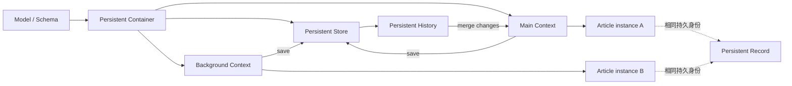
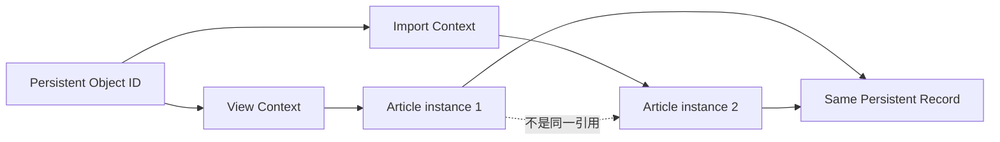
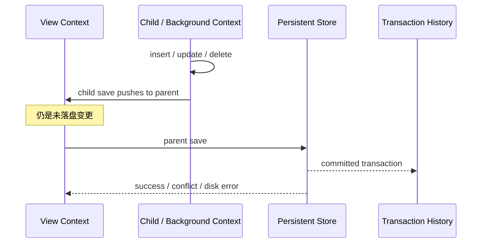
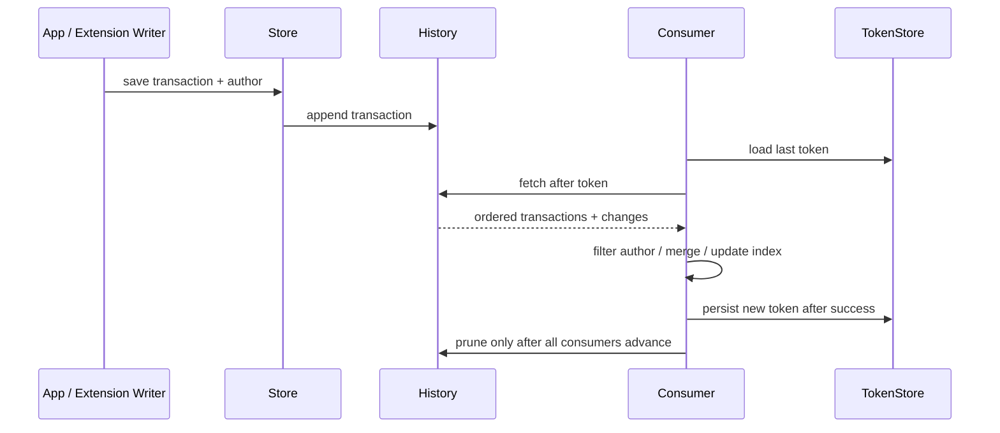

# iOS Core Data 与 SwiftData：对象图、上下文、并发与历史追踪

> Core Data 和 SwiftData 的核心都不是“把 Swift 对象自动写进 SQLite”，而是用模型、身份、关系和上下文管理一张可持久化对象图。Context/ModelContext 是对象注册、变更追踪与保存边界，不是线程安全容器；同一条持久记录可以在不同上下文中对应不同内存实例。理解身份、Fault、Save、Merge 和并发后，框架才会从“偶尔保存成功的黑盒”变成可验证的数据系统。

---

## 一、问题背景：为什么 CRUD 会演变成一致性问题

以离线文章 App 为例：主界面正在分页浏览文章，后台任务同时拉取增量更新，编辑页修改收藏状态，Widget 读取共享快照，服务器又删除了一部分数据。

看似普通的 CRUD 很快出现这些问题：

- 同一篇文章为什么在两个 Context 中不是同一个 Swift 对象？
- 新建对象为什么只有 Temporary Object ID，何时才能跨 Context 引用？
- Fetch 返回对象后，访问属性为何又触发 I/O？
- Relationship 的 Inverse 和 Delete Rule 配错会发生什么？
- `save()` 成功是否代表数据已经持久化到最终 Store？
- Background Context 保存后，Main Context 为什么仍显示旧数据？
- Merge Policy 能否自动解决业务冲突？
- `NSManagedObject` 或 SwiftData `@Model` 能否直接跨 Actor 传递？
- Batch Delete 为什么执行成功后，界面仍持有已删除对象？
- App、Extension 或 Cloud Import 的变化如何增量消费而不是全量刷新？

本文以 Swift 6、iOS 17+ 为基础示例环境。Core Data 支持更早系统；SwiftData 从 iOS 17 开始提供公开 API。SwiftData History、批处理、迁移与 Cloud 能力在不同 OS/SDK 上存在可用性和行为差异，生产代码必须按 Deployment Target 查阅当前 SDK，而不能把最新工具链能力假设为所有设备可用。

### 核心结论

1. Model 是长期 Schema 契约，包含属性、类型、Optional、Relationship、Uniqueness、Delete Rule 和版本演进，不只是 Swift 类型声明。
2. Persistent Store 是持久化后端，SQLite 只是常见 Store 类型。不能依赖 Core Data/SwiftData 的内部 SQLite 表结构作为公开接口。
3. Context 是 Scratch Pad、Identity Map、Change Tracker 和 Unit of Work。对象只能在所属 Context/Executor 规则内访问。
4. Object Identity 与内存引用身份不同。同一记录在不同 Context 中通常是不同实例，应通过稳定 Persistent Identifier/Object ID 或领域 ID 协调。
5. Faulting 延迟物化对象或关系以控制内存，不等于“Fetch 没有成本”。不当访问会形成 N+1 I/O 和主线程卡顿。
6. Fetch 性能由 Predicate、Sort、Index、Batch、Result Type、关系预取和实际数据分布共同决定，不能用框架名称推断快慢。
7. Relationship 必须定义 Inverse、Optionality、Cardinality 和 Delete Rule；它们影响对象图一致性、删除传播和同步冲突。
8. Save 是 Context 变更提交。Child Context 保存只推到 Parent；Parent 仍需保存到 Persistent Store。SwiftData Autosave 不能替代关键业务的显式错误处理。
9. Merge Policy 解决持久层乐观锁冲突的取舍，不理解业务语义。余额、版本、离线编辑等冲突仍需要领域规则。
10. 并发代码应传递 Sendable DTO、领域 ID 或可安全解析的 Persistent Identifier，而不是跨域共享受 Context 管理的 Model 实例。
11. Batch Operation 通常绕过已注册对象和逐对象生命周期逻辑，执行后必须合并变更、刷新 Context 或重新 Fetch。
12. Persistent History 把 Store Transaction 变成可增量消费的日志，但 Token 持久化、作者过滤、清理和崩溃恢复必须完整设计。

---

## 二、共同心智模型：对象图与持久化边界



关键路径是：Schema 定义对象图，Container 连接 Store 并创建 Context；两个 Context 可加载同一 Persistent Record，却各自维护对象实例和未保存变更。Background Save 不会把另一个 Context 的内存对象自动变成最新值，必须通过自动合并、保存通知、Persistent History 或重新 Fetch 建立可解释的合并路径。

### 2.1 Core Data 与 SwiftData 的概念映射

| 责任 | Core Data | SwiftData |
| --- | --- | --- |
| 模型声明 | `.xcdatamodeld` / `NSManagedObjectModel` | `@Model` / `Schema` |
| 容器 | `NSPersistentContainer` | `ModelContainer` |
| 工作上下文 | `NSManagedObjectContext` | `ModelContext` |
| 模型对象 | `NSManagedObject` Subclass | `@Model` Class |
| 查询 | `NSFetchRequest` | `FetchDescriptor` / `@Query` |
| 身份 | `NSManagedObjectID` | `PersistentIdentifier` |
| 后台隔离 | Private Queue Context | 自建 Context / `@ModelActor` |
| 模型迁移 | Model Version + Migration | Versioned Schema + Migration Plan |

这张表是概念映射，不表示 API、能力和行为逐项完全等价。特别是 Merge、批处理、历史追踪、Cloud 与迁移的成熟度和可控粒度，需要按目标版本逐项验证。

---

## 三、Model：Schema 比 Swift 类型更长寿

模型不只是字段列表。每个属性需要决定：

- 类型、Optional、Default Value；
- 是否 Transient、Derived 或 External Storage；
- 是否建立 Index/Uniqueness；
- Relationship 的 To-one/To-many、Inverse、Optional 与 Delete Rule；
- Validation 和领域不变量放在哪一层；
- Schema 如何从已发布版本迁移。

### 3.1 Core Data 模型

Core Data 通常在 `.xcdatamodeld` 中声明 Entity、Attribute、Relationship 和 Configuration，再生成或维护 `NSManagedObject` Subclass。模型文件是持久数据兼容契约，不应因 Swift 属性重命名就随意覆盖线上版本。

```swift
@objc(ArticleMO)
final class ArticleMO: NSManagedObject {
    @NSManaged var id: UUID
    @NSManaged var title: String
    @NSManaged var updatedAt: Date
    @NSManaged var isFavorite: Bool
    @NSManaged var author: AuthorMO?
}
```

Swift 类型声明必须与 Model Metadata 一致。真正的必填性还要考虑旧数据、Migration、Import 和服务端字段缺失；把属性改为非 Optional 前必须先证明所有 Existing Row 都可回填。

### 3.2 SwiftData 模型

```swift
import SwiftData

@Model
final class ArticleRecord {
    @Attribute(.unique) var id: UUID
    var title: String
    var updatedAt: Date
    var isFavorite: Bool

    @Relationship(deleteRule: .nullify, inverse: \AuthorRecord.articles)
    var author: AuthorRecord?

    init(
        id: UUID,
        title: String,
        updatedAt: Date,
        isFavorite: Bool = false
    ) {
        self.id = id
        self.title = title
        self.updatedAt = updatedAt
    }
}
```

`@Model` 宏减少样板代码，但生成内容不是业务领域模型的全部契约。`@Attribute(.unique)` 的冲突行为、Relationship、Migration 和 Cloud 后端约束必须在真实 Store 上验证。若领域层需要不可变 Value、跨 Actor Sendable 和独立测试，通常应将 Persistence Model 与 Domain DTO 分开。

---

## 四、Persistent Store：不是“数据库文件路径”这么简单

Persistent Store Coordinator/Container 把模型和具体 Store 连接起来。Core Data 常见 Store 包括 SQLite、Binary、In-memory；SwiftData 通过 Model Configuration 定义持久或 In-memory 配置。In-memory Store 适合测试，但无法覆盖真实 SQLite、Migration、磁盘不足、Data Protection 和损坏行为。

```swift
final class CoreDataStack {
    let container: NSPersistentContainer

    init(name: String, inMemory: Bool = false) {
        container = NSPersistentContainer(name: name)

        if inMemory {
            let description = NSPersistentStoreDescription()
            description.type = NSInMemoryStoreType
            container.persistentStoreDescriptions = [description]
        }

        container.loadPersistentStores { _, error in
            if let error {
                // 生产代码应进入受控恢复流程，而不是无条件 fatalError 或删库。
                assertionFailure("Persistent store failed: \(error)")
            }
        }
    }
}
```

这段代码仅展示构成关系。生产初始化要处理异步 Store Load 的完成状态、Migration 进度、File Protection、磁盘空间、Cloud 配置和错误分类。不能在 Store 尚未成功加载时对外暴露 Repository。

### 4.1 多 Store 与 Configuration

一个 Model/Container 可按 Configuration 连接多个 Store，例如把可同步业务数据与仅本地缓存分开。但跨 Store Relationship 受到约束，保存、迁移和删除也更复杂。多账号方案还需决定“一账号一 Store”还是共享 Store 加 Account ID；前者隔离清晰但切换和数量管理复杂，后者查询方便但必须保证所有 Predicate、Unique Constraint 和 Cache Key 都带账号作用域。

### 4.2 不要直接修改底层 SQLite

Core Data/SwiftData 管理 Metadata、Object ID、Version、Relationship 和 Transaction。绕过框架直接写其 SQLite 会破坏不变量和已注册对象状态。若需要 SQL 级控制，应使用自己拥有 Schema 的 SQLite Store，而不是把框架 Store 当公共数据库。

---

## 五、Context：Identity Map 与 Unit of Work

Context 的主要职责包括：

- 注册与唯一化当前 Context 内的对象；
- 跟踪 Insert/Update/Delete；
- 维护 Undo、Validation 和 Changed Values；
- 执行 Fetch；
- 作为 Save、Rollback、Reset 和 Merge 边界；
- 约束受管理对象的并发访问。

### 5.1 Core Data Context

`viewContext` 通常绑定 Main Queue，适合 UI 读取和轻量编辑。导入、解析后的批量写入、清理和维护应使用 Background Context：

```swift
func importArticles(
    _ snapshots: [ArticleSnapshot],
    container: NSPersistentContainer
) async throws {
    try await container.performBackgroundTask { context in
        context.name = "article-import"
        context.transactionAuthor = "remote-import"
        context.mergePolicy = NSMergeByPropertyObjectTrumpMergePolicy

        for snapshot in snapshots {
            try upsert(snapshot, in: context)
        }

        if context.hasChanges {
            try context.save()
        }
    }
}
```

在 Background Closure 外不要继续使用其中 Fetch/Insert 的 `NSManagedObject`。`context.perform`/`performAndWait` 是 Queue Confinement API；给 Context 加 Lock 或放进任意 Actor，不能自动使所属对象可跨域访问。

### 5.2 SwiftData ModelContext 与 ModelActor

SwiftUI 的 `modelContext` 常用于界面隔离域。后台数据操作应创建独立 Context，并用 `@ModelActor` 等机制把 Context 与 Serial Model Executor 封装在明确隔离域内。

```swift
@ModelActor
actor ArticleStore {
    func upsert(_ snapshot: ArticleSnapshot) throws {
        let id = snapshot.id
        let descriptor = FetchDescriptor<ArticleRecord>(
            predicate: #Predicate { $0.id == id }
        )
        let record = try modelContext.fetch(descriptor).first
            ?? ArticleRecord(
                id: snapshot.id,
                title: snapshot.title,
                updatedAt: snapshot.updatedAt
            )

        if record.modelContext == nil {
            modelContext.insert(record)
        }
        record.title = snapshot.title
        record.updatedAt = snapshot.updatedAt
        try modelContext.save()
    }
}
```

示例强调 Actor 内创建、Fetch、修改和 Save。调用方传入 `ArticleSnapshot: Sendable`，而不是把 `ArticleRecord` 跨 Actor 传入。宏生成与严格并发诊断会随 Swift/SDK 版本演进，应在项目实际 Language Mode 下编译验证。

---

## 六、Object Identity：同一记录不等于同一对象实例

Core Data 保证同一 Context 内，同一个 `NSManagedObjectID` 对应唯一注册对象；不同 Context 加载同一 ID，得到的是不同实例，各自拥有 Snapshot 和 Pending Changes。



新插入 `NSManagedObject` 初始可能拥有 Temporary Object ID。需要在 Save 前传递稳定 ID 时，可调用 `obtainPermanentIDs(for:)`，但跨 Context 获取对象仍要在目标 Context 内使用 `existingObject(with:)` 或适合的 API，并处理对象已删除的错误。

SwiftData 使用 `PersistentIdentifier` 表达持久身份。无论哪套框架，对外 API 更稳妥的是传递业务 ID（如 Server UUID）或 Sendable DTO。Persistent Identifier 适合框架内部定位，但不应未经验证作为跨安装、迁移、导出或服务端协议的永久业务主键。

### 6.1 Equality 的三个层次

- Swift Reference Identity：是否同一内存对象；
- Persistence Identity：是否表示同一 Store Record；
- Domain Identity：是否表示同一业务实体，例如 Server Article ID。

UI Diff、Cache Key 和同步去重通常需要 Domain Identity；Context 内对象管理依赖 Persistence Identity。混用会导致重复对象、更新错误或跨账号冲突。

---

## 七、Faulting：用延迟物化换取内存边界

Core Data Fault 是只有身份和最少状态的占位对象。Fetch 可以返回 Fault；访问持久属性时，Context 可能从 Store 填充数据。Relationship 也可用 Fault 延迟加载目标集合。

Faulting 的价值：

- 不必一次把整个对象图装入内存；
- Context 可保留身份而释放属性值；
- 关系按需要物化。

代价：

- 在循环中逐个访问 Relationship 可能形成 N+1 Fetch；
- 主线程第一次访问属性可能触发 I/O；
- Context 已 Reset、Store 不可用或对象已删除时，错误会在访问时暴露；
- 将 Managed Object 当作跨线程 DTO 会让隐式加载更难控制。

可通过 Fetch Batch、`relationshipKeyPathsForPrefetching`、Dictionary/ID Result、Background Fetch 和 DTO Snapshot 控制。不要为了“避免 Fault”无条件预取所有关系，过度预取会增大内存和 Fetch 成本。

SwiftData 同样会管理模型物化和 Relationship 访问，但不要依赖某个 OS 版本的精确内部 Fault 表现作为业务契约。工程上仍应假设模型属性访问可能关联持久层工作，并通过 Instruments/SQL Debug（仅开发诊断）和真实数据测量。

---

## 八、Fetch：查询的是 Store 与 Context 的组合视图

Fetch 需要同时考虑：

- Predicate 能否映射到持久层执行；
- Sort 是否有合适 Index；
- Fetch Limit、Offset、Batch Size；
- Result Type 是 Object、Object ID、Dictionary 还是 Count；
- 是否包含 Pending Changes；
- 是否预取 Relationship；
- 数据账号/租户和软删除过滤；
- 查询后是否又在 Swift 内二次扫描。

### 8.1 Core Data Fetch

```swift
func fetchRecentFavorites(
    in context: NSManagedObjectContext,
    accountID: UUID,
    limit: Int
) throws -> [ArticleMO] {
    let request = NSFetchRequest<ArticleMO>(entityName: "Article")
    request.predicate = NSPredicate(
        format: "accountID == %@ AND isFavorite == YES AND deletedAt == nil",
        accountID as CVarArg
    )
    request.sortDescriptors = [
        NSSortDescriptor(key: "updatedAt", ascending: false)
    ]
    request.fetchLimit = limit
    request.fetchBatchSize = min(limit, 50)
    return try context.fetch(request)
}
```

String-based Key Path 容易在重命名时失效，可使用生成的 Fetch Request、`#keyPath` 或 Typed Predicate 能力降低风险。Index 应匹配实际 Predicate/Sort，但每个 Index 都增加写入与空间成本。

### 8.2 SwiftData Fetch

```swift
func fetchRecentFavorites(
    accountID: UUID,
    limit: Int,
    context: ModelContext
) throws -> [ArticleRecord] {
    let descriptor = FetchDescriptor<ArticleRecord>(
        predicate: #Predicate {
            $0.accountID == accountID &&
            $0.isFavorite &&
            $0.deletedAt == nil
        },
        sortBy: [SortDescriptor(\.updatedAt, order: .reverse)]
    )
    var limited = descriptor
    limited.fetchLimit = limit
    return try context.fetch(limited)
}
```

示例假设模型包含相应字段。`#Predicate` 受支持表达式集合约束；复杂 Swift Closure 不一定能转换为 Store Query。编译通过也不代表 Query Plan 最优，应使用真实数据测量 Fetch、Fault Fire 和内存。

### 8.3 分页边界

大列表只使用 Offset Pagination，Offset 越大可能成本越高且数据变化时产生重复/遗漏。可使用稳定 Sort Key + Unique ID 的 Keyset/Cursor Predicate，例如 `(updatedAt < cursorTime) OR (updatedAt == cursorTime AND id < cursorID)`，同时为组合查询设计 Index。

---

## 九、Relationship：对象图不变量的核心

Relationship 至少需要明确：

- To-one 还是 To-many；
- Optional 与 Min/Max Count；
- Inverse；
- Ordered/Unordered；
- Delete Rule；
- 是否跨账号、跨 Store 或参与 Cloud Sync。

### 9.1 Delete Rule

| Delete Rule | 语义 | 常见风险 |
| --- | --- | --- |
| Nullify | 清空反向引用 | 目标属性必须允许空或有修复策略 |
| Cascade | 连带删除目标 | 错误配置会大范围丢数据 |
| Deny | 存在关系时拒绝删除 | 需要先处理依赖对象 |
| No Action | 框架不维护对端 | 容易留下悬空对象图，需自行保证 |

例如删除 Author 时是否删除全部 Article，取决于文章是否由作者记录拥有。通常 Article 是独立业务实体，Nullify 更合理；把 To-many 一律设 Cascade 是危险默认值。

Inverse 让框架维护对象图双向一致性，也影响 Cloud 和 Merge。Import 时应通过唯一业务 ID Fetch/Upsert，而不是每次 Decode 都创建新对象再期待 Unique 自动去重。

### 9.2 大型 To-many

一个 Folder 包含数十万 Item 时，不应为了计数或首屏展示把整个集合物化。应从 Item 侧按 `folderID`/Relationship Predicate Fetch、Count 或分页。对象图表达方便不代表所有访问模式都应遍历 Relationship Collection。

---

## 十、Save：提交 Unit of Work，而不是同步按钮

Context 中的修改先存在内存。Core Data `save()` 会验证并把 Insert/Update/Delete 提交到 Parent Context 或 Persistent Store；SwiftData `ModelContext.save()` 提交该 Context 的 Pending Changes。



若 Background Context 直接连接 Persistent Store，则其 Save 直接形成 Store Transaction，而不是经过 View Context。需要根据 Stack 拓扑准确判断。

### 10.1 关键业务显式保存

SwiftData 的 Autosave 适合界面编辑便利性，但触发时机不应被当作关键业务 Durable Commit 契约。创建离线操作、收藏确认或导入完成时，应显式 `save()`、捕获错误，并在 UI/状态机中只在成功后标记为已持久化。

```swift
func markFavorite(
    _ article: ArticleRecord,
    context: ModelContext
) throws {
    let oldValue = article.isFavorite
    article.isFavorite = true

    do {
        try context.save()
    } catch {
        article.isFavorite = oldValue
        context.rollback()
        throw StorageError.saveFailed(underlying: error)
    }
}
```

示例用 Rollback 表达失败恢复，但一个 Context 可能同时包含其他 Pending Changes，`rollback()` 会影响整个 Unit of Work。生产代码应缩小 Context/Transaction 边界，或在失败时根据业务状态重新 Fetch，不要盲目回滚不相关编辑。

### 10.2 Save 失败不能默认删库

Validation、Unique Conflict、磁盘不足、Data Protection、Migration、Cloud、Store 损坏等错误需要分类。先保留原始 `NSError` Domain/Code 和关联 Metadata（脱敏），再决定重试、提示用户释放空间、重新认证、恢复备份或进入只读模式。对权威本地数据，“Save 失败就删除 Store”会造成不可逆损失。

---

## 十一、Merge Policy：持久层冲突不是业务冲突

两个 Context 基于旧 Snapshot 修改同一对象时，保存可能出现乐观锁冲突。Core Data 提供多种 Merge Policy：

| Merge Policy | 倾向 | 适用边界 |
| --- | --- | --- |
| Error | 暴露冲突，由调用方处理 | 高价值数据、需显式合并 |
| Store Trump | Store 值覆盖冲突内存值 | 本地改动可丢弃的刷新场景 |
| Object Trump | 内存值覆盖 Store 冲突值 | 当前编辑明确优先且业务允许 |
| Property Store/Object Trump | 按属性 Snapshot 合并 | 不同字段并发修改且不变量允许 |
| Overwrite/Rollback | 更强覆盖或回滚 | 需清楚丢失更新风险 |

`NSMergeByPropertyObjectTrumpMergePolicy` 不等于“用户修改永远正确”，也无法理解两个字段组合不变量。例如 `balance`、`version`、`status` 必须一起演进时，逐属性合并可能产生从未存在过的状态。

SwiftData 的冲突与合并控制 API 和 Core Data 不完全相同，且随 OS 版本演进。不能假设某个 Core Data Merge Policy 名称在 SwiftData 有一一对应的公开设置。复杂离线协作应使用领域 Revision、ETag、Operation Log 或服务端合并协议，而不是依赖最后写入获胜。

### 11.1 自动合并仍需要冲突语义

`viewContext.automaticallyMergesChangesFromParent = true` 可帮助 View Context 接收 Persistent Store Coordinator 保存变化，但自动合并只是传播机制。谁覆盖谁仍受 Merge Policy、Pending Changes 和 Transaction 顺序影响。UI 编辑页可能需要冻结基线、显示冲突或延迟后台刷新，而不是无条件实时覆盖。

---

## 十二、Concurrency：Context 隔离，不是 Managed Object Sendable

Core Data Queue Confinement 规则：

- Main Queue Context 只在 Main Queue 使用；
- Private Queue Context 的工作放入 `perform`/`performAndWait`；
- Managed Object 只在所属 Context 的 Queue 上访问；
- 跨 Queue 传 Object ID 或 DTO，在目标 Context 重新获取；
- 不把 Context/Managed Object 捕获到任意 `Task.detached`。

SwiftData 同样要求 Model 与 ModelContext 在正确隔离域使用。`@MainActor` ViewModel 可使用 UI ModelContext；后台 Store 用 `@ModelActor` 封装。不要仅因 Model Class 语法像普通 Swift Class 就声明 `@unchecked Sendable`。


### 12.1 解析和持久化分离

网络 JSON 解码可在非 MainActor 上得到 `Sendable` Snapshot；Storage Actor 再 Fetch/Upsert。不要在 Context Queue 内做长时间图片解码、压缩或复杂纯计算。先在独立 Task 计算不可变结果，再进入 Context 做短而清晰的状态变更；每个 `await` 后仍要验证 Session Generation 和 Import Revision。

### 12.2 Actor 与 Context 双重隔离

Actor 串行化调用，不会修复错误的 Context 所属 Queue。Core Data 应优先使用其 `perform` API；SwiftData 的 `@ModelActor` 则把 Actor Executor 与 Model Executor 建立框架支持的组合。自制 Actor 包装 Core Data 时，内部仍通过 Context `perform`，并避免 Actor Reentrancy 破坏两阶段业务不变量。

---

## 十三、Batch Operation：高吞吐与对象生命周期的交换

逐个创建/更新/删除 Managed Object 会触发注册、Change Tracking、Validation 和通知。Core Data Batch Insert/Update/Delete 可以更接近 Persistent Store 执行，减少对象物化成本，适合大规模导入与清理。

代价是 Batch Operation 通常绕过：

- 当前 Context 中已注册对象的即时更新；
- 逐对象 Validation/Custom Logic；
- Managed Object Lifecycle Callback 的常规路径；
- Undo 与部分通知语义。

执行 Batch Delete 后，如果 View Context 仍持有对象，界面可能显示 Ghost Data。应请求返回受影响 Object ID，再用 `NSManagedObjectContext.mergeChanges(fromRemoteContextSave:into:)` 合并，或 Reset/Refresh 并重新 Fetch。具体 Result Type 与合并方式应按 Operation API 配置。

### 13.1 批量导入的替代路径

数据量中等时，可在 Background Context 分批 Upsert，每批使用 `autoreleasepool`、Save 与 `reset()` 控制内存；但 Reset 后旧 Managed Object 引用失效，不能跨 Batch 持有。数据量很大时评估 Batch Insert，并把唯一约束、Relationship 修复和错误记录纳入流程。

SwiftData 的批量能力与可用版本不应从 Core Data 直接类推。若目标 OS 上缺少所需 Batch API，可以分批 Fetch/Mutate/Save，或在架构阶段选择 Core Data/自有 SQLite。不要用未验证的隐藏 Store SQL 绕过框架。

---

## 十四、Persistent History：增量消费 Store Transaction

Persistent History Tracking 记录 Persistent Store 中已提交 Transaction 及其 Changes，可用于：

- Background Import 后让 UI 增量合并；
- App 与 Extension 共享 Store 时识别外部写入；
- Cloud Import 与本地 Context 协调；
- 同步引擎按 Transaction Author 过滤自己的写入；
- Crash 后从上次 Token 继续消费，而非全量 Fetch。



### 14.1 Core Data History 配置

Core Data SQLite Store 可通过 Persistent Store Description 选项开启 History Tracking 和 Remote Change Notification。消费者 Fetch 上次 Token 之后的 `NSPersistentHistoryTransaction`，按 `transactionAuthor` 过滤，并把变化合并进目标 Context。

关键不变量：

- Token 只有在 Change 被成功处理后才能持久化；
- Token Store 与业务处理不是天然同一 Transaction，崩溃后必须允许幂等重放；
- 多消费者各有进度，清理历史只能早于所有活跃消费者的最小 Token；
- History 可能增长，需要容量、保留期与离线消费者策略；
- Store 重建、Migration 或 Token 失效时要能 Full Reconcile；
- Transaction Author 防止自己消费自己形成同步循环。

SwiftData 在较新系统提供 History 相关 API，但 Availability、Predicate 能力与 Token 类型应以项目 SDK 为准。若 Deployment Target 包含不支持版本，需要 Core Data 桥接、其他 Change Log 或 Full Reconcile 降级方案，不要静默漏同步。

### 14.2 History 不是业务事件日志

Persistent History 记录持久层变化，不一定包含完整业务意图。一次“订单取消”可能映射为多条属性修改，仅从 Row Change 无法还原领域命令。需要跨系统审计、消息发布或业务补偿时，应在同一 Transaction 中维护显式 Outbox/Event Record。

---

## 十五、Core Data 与 SwiftData 如何选择

| 维度 | Core Data | SwiftData |
| --- | --- | --- |
| 最低系统版本 | 支持更早 iOS | iOS 17+ |
| 模型声明 | Model Editor / Managed Object | Swift 宏与 Schema |
| SwiftUI 集成 | Fetch Request 等成熟方案 | `@Query`、Environment 集成更直接 |
| 高级持久化控制 | Merge、Batch、History 等成熟 | 能力持续演进，按目标 OS 核对 |
| 历史项目 | 迁移成本低、经验可复用 | 不应仅为语法简洁仓促迁移 |
| Swift Concurrency | Queue Confinement + `perform` | ModelContext / `@ModelActor` |
| SQL 级控制 | 都不应依赖内部 Store Schema | 都不应依赖内部 Store Schema |

选择建议：

- 支持 iOS 16 或更早：Core Data 或自有 SQLite；
- 已有稳定 Core Data Stack：除非有明确收益，不为减少样板大迁移；
- iOS 17+ 新模块、能力匹配：可评估 SwiftData，并做真实 Migration/Concurrency 测试；
- 需要成熟 Batch、History、精细 Merge 或复杂迁移：逐项验证 SwiftData 目标版本，能力不足时选择 Core Data；
- 需要精确 SQL、FTS、特殊 Query Plan 或跨平台数据库格式：评估自有 SQLite，而不是穿透框架 Store。

不要把 Persistence Framework 暴露到整个 App。Repository 边界返回 Domain DTO/Value，UI 可以在小范围利用 SwiftData/Core Data 观察能力，但业务规则、同步协议和 Idempotency 不应绑死在 Model Subclass 中。

---

## 十六、性能与内存验证

### 16.1 测量指标

- Store Load 与 Migration 时间；
- Fetch P50/P95/P99、Fault Fire 数和 SQL 次数；
- Save 延迟、Transaction 大小和 Conflict 数；
- Main Thread I/O 与 UI Hitch；
- Context Registered Object 数与峰值内存；
- Batch Import/Delete 吞吐和合并时间；
- WAL/Store/History 磁盘增长；
- History Consumer Lag 与 Full Reconcile 次数。

在目标真机、Profile/Release 配置、接近生产的数据规模下测量。使用 Instruments 的 Core Data Fetches、Faults、Saves 等工具和 OS Signpost；SQL Debug 仅用于开发诊断，不应依赖其私有输出格式或在生产开启。

### 16.2 优化顺序

1. 证明慢在 Fetch、Fault、Save、Merge、Migration 还是 UI 计算；
2. 检查 Predicate、Sort 和 Index；
3. 限制 Fetch Result、Batch 和预取范围；
4. 把重 I/O 和导入移出 Main Context；
5. 使用 DTO 避免 View 无意遍历大型关系；
6. 对大规模写入评估 Batch API；
7. 测量调整后的内存、写放大和一致性副作用。

不要把“关闭 Undo”“Reset Context”或“Batch Delete”当通用性能开关。每项都会改变对象生命周期和业务能力，必须结合场景验证。

---

## 十七、测试与故障注入

### 17.1 单元与集成测试

- Model 的 Optional、Default、Relationship、Inverse 和 Delete Rule；
- Temporary/Permanent ID 与跨 Context Re-fetch；
- Fetch Predicate、Sort、Pagination 和账号隔离；
- Child/Parent 与 Direct-to-Store Save 拓扑；
- 两 Context 同时修改时各 Merge Policy 的结果；
- Background Import 后 Main Context 合并；
- Batch Delete 后已注册对象是否被刷新；
- History Token 保存、崩溃重放、Author 过滤与清理；
- SwiftData 在所有支持 OS 上的 Schema 与 ModelActor 行为。

In-memory Store 适合快速逻辑测试，但发布前必须用真实临时 SQLite Store 覆盖 Unique Constraint、Migration、WAL、History、磁盘错误和 Store Metadata。测试目录用独立临时容器，完成后安全清理，不能指向用户真实 Store。

### 17.2 故障注入

- Save 前后终止进程；
- 磁盘不足、Data Protection 不可用和 Store Load 失败；
- Migration 中断与旧版本 App 数据；
- Cloud/Extension 写入与 UI 编辑并发；
- History 消费一半崩溃；
- 大批量导入期间取消或账号切换；
- Store 损坏后的备份、只读和重建路径。

数据损坏不能统一“删库重试”。可重建 Cache Store 可以清空，离线草稿和 Outbox 必须优先隔离、备份、恢复或让用户导出。下一模块会专门展开迁移与一致性恢复。

---

## 十八、常见误区与修复

### 18.1 把 Managed Object 直接传给后台 Task

**问题：** 对象属于原 Context，后台访问违反 Queue/Isolation 规则，还可能触发 Fault I/O。

**修复：** 传 Sendable DTO、业务 ID 或 Object ID，在目标 Context 内重新 Fetch。

### 18.2 Background Save 后认为 UI 自动最新

**问题：** View Context 有自己的 Registered Objects 和 Pending Changes，不会凭空理解另一个 Context 的变化。

**修复：** 配置自动合并、处理保存/远程变化或消费 Persistent History，并定义冲突策略。

### 18.3 为避免 N+1 预取所有 Relationship

**问题：** 可能一次物化巨大对象图，增加内存和 Fetch 时间。

**修复：** 根据页面需要选择有限预取、独立 Fetch、Count、Batch 和 DTO Projection。

### 18.4 使用 Object Trump 解决所有冲突

**问题：** 会静默覆盖 Store 新值，逐属性合并还可能破坏跨字段不变量。

**修复：** 高价值业务显式比较 Version/Revision，使用领域冲突解决和服务端权威状态。

### 18.5 Batch Delete 后不合并变更

**问题：** Store 已删除，Context 仍持有旧对象，界面与后续 Save 产生不一致。

**修复：** 获取受影响 Object ID 并合并，或 Reset/Refetch，验证所有 Context 和消费者。

---

## 十九、工程落地清单

### 19.1 Model 与 Store

- Entity/Model 是否有稳定 Domain ID 和账号作用域；
- Relationship Inverse、Optional 与 Delete Rule 是否符合所有权；
- Index 是否由真实 Query 验证；
- Store Location、File Protection、Backup 与 Multi-store 是否明确；
- Model Version/Migration 是否用真实旧数据测试。

### 19.2 Context 与并发

- 每个 Context/ModelContext 的 Owner、Queue/Actor 和生命周期；
- 跨域只传 DTO/ID，不传 Managed Model；
- UI、Import、Sync 和 Maintenance 的 Save/Merge 路径；
- Autosave、Rollback、Reset 的业务后果；
- Actor Reentrancy 后是否重新验证账号和 Revision。

### 19.3 高级操作

- Batch Operation 是否处理已注册对象与 Lifecycle Bypass；
- History Token 是否在处理成功后持久化；
- Transaction Author、Consumer Lag 与 History Prune；
- Conflict 是否由业务规则处理，而非只靠 Merge Policy；
- Store Load/Save/Migration/Corruption 是否有受控恢复。

---

## 二十、总结

Core Data 与 SwiftData 都围绕可持久化对象图构建：Model 定义 Schema，Persistent Store 保存 Transaction，Context 管身份与变更，Faulting 控制物化，Fetch 和 Relationship 决定访问成本，Save 与 Merge 连接不同工作区。真正重要的不是 API 长短，而是对象在哪个隔离域、变化何时提交、冲突由谁解释。

Core Data 提供成熟的 Queue Confinement、Merge、Batch 和 Persistent History 能力；SwiftData 用更 Swift 化的 Schema、ModelContext 和 ModelActor 改善开发体验，但能力与 Availability 必须按目标 OS 验证。无论选择哪套框架，都应传递 DTO/ID 而非跨域共享模型对象，用真实 Store 测试迁移、并发、批处理和故障恢复，并把 Persistent History 与业务 Outbox 的职责区分清楚。

---

## 问答复盘

### Q1：同一条数据库记录在两个 Context 中是否是同一个 Swift 对象？

**答：** 通常不是。它们具有相同持久身份，但属于不同 Identity Map，是不同内存实例和变更快照。跨 Context 应用 ID 重新获取。

### Q2：为什么新建 Core Data 对象的 Object ID 可能不能立即跨 Context 使用？

**答：** 新对象初始可能是 Temporary ID。保存或调用 `obtainPermanentIDs(for:)` 后才能获得 Permanent ID；目标 Context 仍需处理对象未保存或已删除的情况。

### Q3：Fetch 已经返回对象，访问属性为什么还可能发生 I/O？

**答：** 返回的可能是 Fault，属性或关系在首次访问时才物化。Faulting 控制内存，但循环访问可能造成 N+1，需要预取或独立查询。

### Q4：Child Context 调用 `save()` 是否代表数据已经进入磁盘 Store？

**答：** 不一定。Child Save 通常只把变更推入 Parent Context，Parent 还要 Save。直接连接 Store 的 Background Context 则是另一种拓扑。

### Q5：`automaticallyMergesChangesFromParent` 能否解决所有业务冲突？

**答：** 不能。它负责传播变化，冲突取舍仍受 Merge Policy 和 Pending Changes 影响；领域版本、余额和离线编辑需要业务规则。

### Q6：能否给 `NSManagedObject` 或 SwiftData Model 添加 `@unchecked Sendable` 后跨 Actor 使用？

**答：** 不应。它们受 Context/Model Executor 管理，人工声明不会改变隔离规则。应传 Sendable Snapshot 或 ID，在目标隔离域重新 Fetch。

### Q7：Batch Delete 为什么可能让 UI 显示已经删除的数据？

**答：** Batch Operation 可直接修改 Store，绕过 Context 中已注册对象。必须合并受影响 Object ID、Reset 或重新 Fetch。

### Q8：Persistent History 是否可以直接作为业务审计日志？

**答：** 通常不能。它记录持久层 Transaction 和属性变化，不一定表达业务意图。跨系统事件和补偿应维护显式 Outbox/Event Record。

### Q9：SwiftData 是否在所有场景都应替代 Core Data？

**答：** 不应。它要求 iOS 17+，高级 Merge、Batch、History 和迁移能力需按目标版本核对；成熟 Core Data 项目不应只为语法简洁迁移。

### Q10：如何判断 Fetch 优化真正有效？

**答：** 在目标真机和真实数据上测 Fetch 时间、SQL/Store 工作、Fault Fire、峰值内存和 UI Hitch，再比较 Index、Batch、预取或 Projection 调整前后结果。

---

## 延伸知识

- **数据迁移与一致性**：Schema Version、Lightweight/Custom Migration、Atomic Write、Conflict Resolution 与损坏恢复；
- **本地存储选择**：UserDefaults、File System、Keychain、SQLite、Cache 与生命周期；
- **Swift Concurrency**：Actor Isolation、Sendable、Task Cancellation 与 Reentrancy；
- **离线同步**：Persistent History、Transactional Outbox、Optimistic Update 与 Sync State Machine；
- **性能诊断**：Core Data Instruments、Fetch/Fault/Save、Signpost、SQL Query Plan 与磁盘容量。
