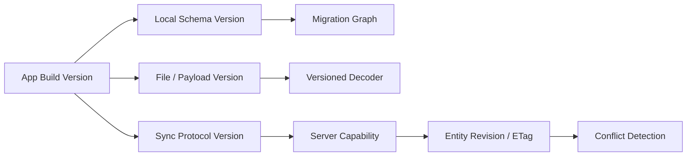
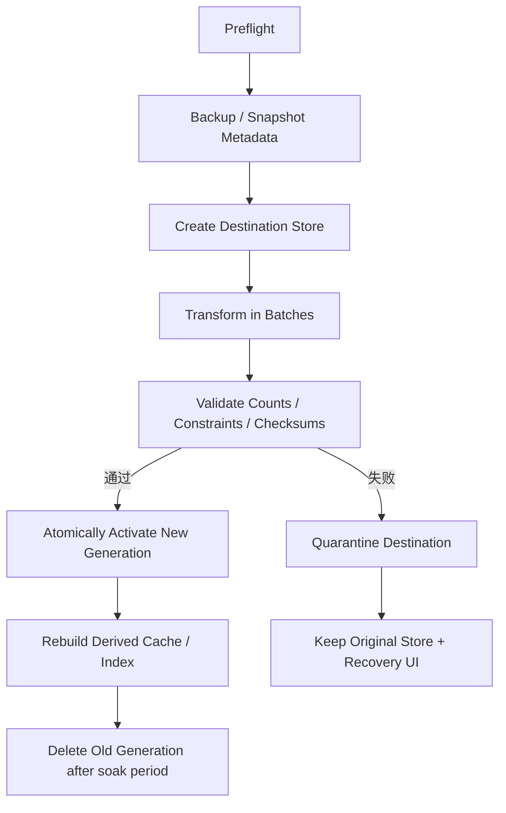
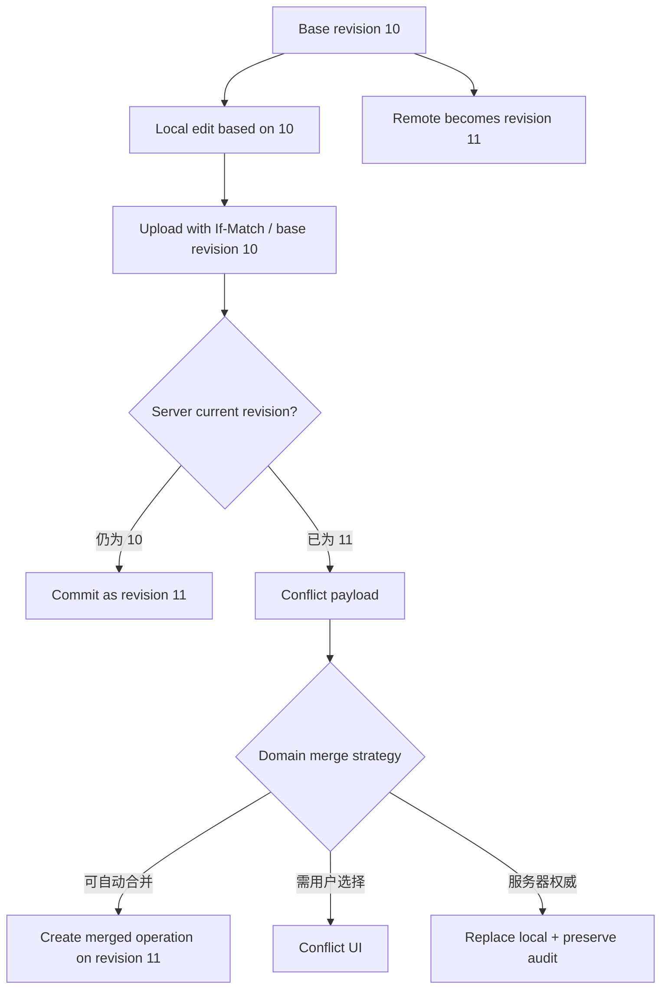
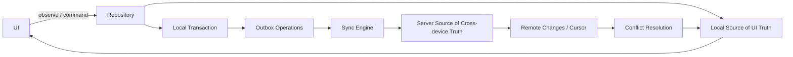
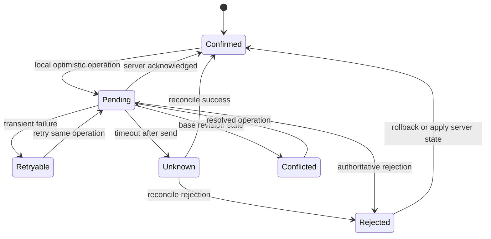
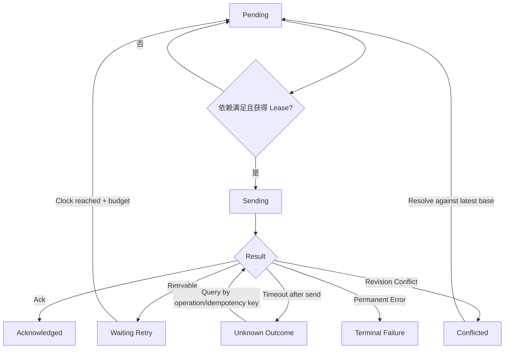

# iOS 数据迁移与一致性：从 Schema 演进到离线同步与损坏恢复

> 数据一致性不是“最终调用一次 `save()`”。本地 Schema 升级需要可重复、可中断恢复的迁移；单文件原子替换只保护一个文件版本，数据库事务只保证一个事务边界；Offline-first 还要协调本地事实、待同步操作、服务器版本和冲突策略。可靠方案必须为每个阶段保存可恢复状态，并区分空间不足、受保护数据不可用、迁移失败与真正的数据损坏。

---

## 一、问题背景：升级与同步为何会互相放大风险

考虑一个支持离线编辑的文章 App：

1. 旧版 App 把草稿正文保存在单个 JSON 字段；
2. 新版把正文拆成段落表，并新增待同步 Outbox；
3. 用户升级时设备空间紧张，迁移执行一半被系统终止；
4. 恢复后本地草稿和服务器版本都发生了变化；
5. UI 为了流畅已乐观显示“保存成功”；
6. 图片缓存仍以旧 Schema 的 Key 命中；
7. 数据库打开失败，但原因可能只是设备重启后尚未首次解锁。

如果没有明确协议，最容易出现三种危险处理：迁移失败直接删库、网络成功直接覆盖本地、缓存清空后触发请求风暴。它们看似让代码恢复运行，却可能永久丢失用户事实或放大故障。

本文重点回答：

- Schema Version 与 App Version 为什么必须分离？
- 哪些变化可用 Lightweight Migration，何时必须 Custom Migration？
- `.atomic`、数据库 Transaction 和分布式业务一致性分别保证什么？
- 多设备离线编辑如何检测并解决冲突？
- Cache Invalidation 为什么必须依赖版本和业务事件？
- Offline-first 应以本地还是服务器为 UI 事实源？
- Optimistic Update 失败后如何回滚或对账？
- Sync State Machine 如何处理取消、重试、账号切换和 App 崩溃？
- 如何区分 Data Protection、磁盘不足、Migration Error 和 Corruption？

本文以 Swift 6、iOS 17+ 为主要示例环境。Core Data、SwiftData 与文件格式的迁移 API 存在平台和 SDK 差异；文中强调的是公开语义与工程流程。具体支持哪些自动迁移、Staged Migration 和 History API，必须按实际 Deployment Target 与当前 SDK 验证。

### 核心结论

1. App Version、Local Schema Version、Payload Version、Sync Protocol Version 和 Server Revision 是不同版本轴，不能共用一个整数替代。
2. Lightweight Migration 只适合框架可推导且语义安全的模型变化；“能够自动迁移”不代表数据回填和业务含义正确。
3. Custom Migration 应分阶段、可重入，并记录阶段和校验结果；大数据迁移还要预算时间、临时空间、锁屏和进程终止。
4. Atomic File Write 防止读到部分替换的单文件内容，不保证多文件事务，也不能承诺任意断电场景下数据绝不丢失。
5. Database Transaction 提供数据库边界内的 ACID 语义，不会把网络请求、文件上传和服务端事务自动纳入同一原子操作。
6. Conflict Resolution 必须建立在稳定 Identity、Base Revision 和领域规则上；Last-write-wins 简单，但会静默丢失并发修改。
7. Cache 是派生数据。失效依赖 Key、Version、TTL、ETag 和业务写事件；清空全部缓存可能引发 Stampede。
8. Offline-first 通常让本地持久层成为 UI 的直接读取源，服务器仍是跨设备权威；Outbox/Inbox 与同步器负责协调两者。
9. Optimistic Update 必须关联 Operation ID、Pending State 和原值/补偿信息；Timeout 后不能把未知结果直接回滚为失败。
10. Sync State Machine 要持久化 Operation、Attempt、Next Eligible Time、Dependency 和 Idempotency Key，内存 Task 只是执行器。
11. 数据恢复先分类错误并保护原始证据。只有可重建 Cache 才适合直接删除；用户草稿与 Outbox 应优先隔离、备份、只读或导出。

---

## 二、版本不是一个数字：建立兼容矩阵



版本轴的职责不同：

| 版本 | 解决的问题 | 示例 |
| --- | --- | --- |
| App Version | 发布与功能集合 | `3.4.0` / Build 820 |
| Local Schema Version | 本地 Store 结构 | `ArticleSchemaV3` |
| Payload Version | 单文件/队列载荷解码 | JSON Envelope `schema: 2` |
| Sync Protocol Version | 客户端与服务器消息兼容 | Header/Capability `v4` |
| Entity Revision | 单实体并发修改检测 | ETag、整数 Revision |
| Cache Generation | 派生数据失效 | `thumbnail-v5` |

App 版本升级不一定修改数据库，数据库也可能需要 Hotfix Migration 而不改变同步协议。把它们绑在一起会让回滚、灰度和兼容性难以推理。

### 2.1 迁移应是一张有向图

不要只测试“上一版 -> 当前版”。真实用户可能从多年前版本直接升级，因此要维护所有受支持起点到当前版本的路径：

```text
V1 -> V2 -> V3 -> V4
      \------> V4 staged path
```

每条 Edge 都要有输入前置条件、输出不变量、预计时间/空间和失败恢复。若不支持降级，应明确阻止旧版 App 打开新版 Store；不能假设 TestFlight/企业回滚会自动反向迁移数据。

---

## 三、Schema Version：模型演进是数据契约

Schema 变化不仅包括新增字段，还包括：

- 属性 Rename、Type Change、Optional -> Required；
- Relationship Cardinality、Inverse 和 Delete Rule；
- Unique Constraint、Index 和排序语义；
- Entity Split/Merge；
- Encryption/Compression/Encoding Format；
- 账号分区、软删除和同步 Metadata；
- Derived Data 是否需要重算。

### 3.1 Versioned File Envelope

文件存储同样需要 Schema：

```swift
struct DocumentEnvelope<Payload: Codable>: Codable {
    let schemaVersion: Int
    let documentID: UUID
    let accountID: UUID
    let updatedAt: Date
    let payload: Payload
}
```

Decoder 应先限制文件大小，再读取 Envelope Version，并路由到对应 Migrator。不要直接用当前 Model Decode 所有历史文件，也不要在 Decode 失败后立即覆盖原文件。未知未来版本应 Fail Closed 或只读，而不是按旧结构猜测。

### 3.2 Version Metadata 必须与数据提交一致

若先把 `schemaVersion = 4` 写入 Metadata，再开始转换数据，进程中止后会留下“标记已升级、内容仍旧”的 Store。版本标记应与转换结果在同一 Transaction 提交，或使用独立 Manifest State：

```text
idle(v3) -> preparing(v3 -> v4) -> validating(v4) -> committed(v4)
```

恢复时根据 Durable State 判断继续、回滚还是重新开始，不依赖内存布尔值。

---

## 四、Lightweight Migration：结构可推导不等于语义正确

Core Data 可对部分兼容变化推断 Mapping，例如某些新增 Optional 属性、带默认值的属性、Entity/Property Rename（需正确 Renaming Identifier）和简单关系变化。SwiftData 也能处理部分自动 Schema Migration，但能力和限制需按目标 OS 验证。

适合 Lightweight Migration 的前提：

- 源与目标模型之间映射清楚；
- 不需要根据多字段或外部数据计算新值；
- 不需要拆分/合并实体的复杂业务逻辑；
- 旧数据对新约束全部有效；
- 在真实旧 Store 上完成兼容测试。

### 4.1 常见误判

- 新增 Non-optional 字段但没有可靠回填值；
- 把 String 改成 Enum/Number，却假设所有历史字符串合法；
- 修改 Unique Constraint，历史数据已有重复；
- Rename 时只改显示名称，未保留 Renaming Identifier；
- Delete Rule 变化导致旧关系在首次删除时产生新行为；
- 自动迁移成功，但新业务需要的 Derived Field 尚未重算。

因此 Migration 验证不能只看 Store 是否打开成功，还要检查记录数、唯一性、关系完整性、必填字段、抽样内容和领域不变量。

---

## 五、Custom Migration：把大改动拆成可恢复阶段

Entity Split、数据清洗、加密格式变化、去重和复杂 Relationship 重建通常需要 Custom Migration。Core Data 可使用 Mapping Model/Migration Policy，较新系统也提供 Staged Migration 能力；SwiftData 使用 Versioned Schema 与 Migration Plan。具体 API Availability 必须以项目 SDK 为准。



### 5.1 Preflight

- 识别真实源版本，拒绝未知/未来版本；
- 检查可用空间，考虑新旧 Store、WAL、临时文件和备份同时存在；
- 确认 Protected Data 可用；
- 暂停同步 Writer、Extension 与后台导入；
- 记录 Migration ID、阶段和开始时间；
- 不在 MainActor 上执行重迁移。

### 5.2 Transform

- 按稳定 Cursor/Primary Key 分批处理；
- 每批可重入，避免重复创建；
- 对非法记录进入 Quarantine/Report，不静默丢弃；
- 保留旧 Domain ID 和同步 Revision；
- 取消与进程终止后能够从 Durable Checkpoint 恢复；
- 不把完整用户内容写入迁移日志。

### 5.3 Validate 与 Commit

- 比较 Entity Count 和关键聚合；
- 验证 Required、Unique、Foreign Key/Relationship；
- 抽样或全量计算内容摘要；
- 用新代码打开 Destination 并执行代表性 Query；
- 只有验证通过才切换 Active Generation；
- 旧 Store 延迟清理，先观察 Crash、Open Error 和业务指标。

对于框架管理的 Store，应使用官方 Migration API，不要自己替换 Core Data/SwiftData 内部 SQLite/WAL/SHM 文件组合。

---

## 六、Atomic Write：保护一个版本的可见性

Foundation 的原子文件写通常先写临时文件，再在同一文件系统内替换目标，使 Reader 更可能看到旧完整版本或新完整版本，而不是半个文件。

```swift
struct AtomicDocumentStore {
    let directory: URL
    let encoder: JSONEncoder

    func save<Value: Encodable>(_ value: Value, as name: String) throws {
        let data = try encoder.encode(value)
        let destination = directory.appending(path: name)
        try data.write(to: destination, options: [.atomic, .completeFileProtection])
    }
}
```

它不保证：

- 多个文件同时切换；
- 文件与数据库 Row 同时提交；
- 两个 Writer 不会 Last-writer-wins；
- 所有断电/硬件故障下绝不丢最近一次写入；
- 目标目录、Metadata 与备份策略自动正确。

### 6.1 多文件 Generation + Manifest

对“正文 + 附件索引 + Metadata”可写入新 Generation 目录，验证所有文件后，最后原子替换一个很小的 Active Manifest。Reader 只读取 Manifest 指向的完整 Generation。旧 Generation 延迟清理，崩溃恢复时扫描并丢弃未提交临时目录。

多个进程/Extension 写共享容器时仍需单 Writer、文件协调或数据库锁协议。原子 Rename 不能解决业务层并发覆盖。

---

## 七、Transaction：先画清楚原子边界

SQLite/Core Data/SwiftData Transaction 可以让本地 Store 内的一组变化共同 Commit 或 Rollback。例如创建离线草稿和 Outbox Operation 必须在同一事务中：

```sql
BEGIN IMMEDIATE;

UPDATE draft
SET body = ?, local_revision = local_revision + 1, sync_state = 'pending'
WHERE draft_id = ? AND account_id = ?;

INSERT INTO outbox_operation (
    operation_id,
    account_id,
    entity_id,
    base_revision,
    idempotency_key,
    payload,
    state
) VALUES (?, ?, ?, ?, ?, ?, 'pending');

COMMIT;
```

这样不会出现“草稿已改但 Outbox 未创建”或相反。框架层也应在同一 Context Save 中维护业务记录和 Outbox Entity。

### 7.1 本地事务不包含网络

下面流程不是一个跨端原子事务：

```text
local save -> HTTP request -> server transaction -> local ack
```

任意相邻步骤之间都可能崩溃。正确做法是：

1. 本地 Transaction 保存业务变更和 Outbox；
2. Worker 读取 Pending Operation 并用稳定 Idempotency Key 发送；
3. 服务端在自身 Transaction 中处理 Idempotency 与领域写入；
4. 客户端收到或查询到权威结果后，本地 Transaction 标记 Ack 并合并 Server Revision；
5. Crash 后按 Operation State 和原 Key 重放/对账。

这提供 At-least-once Delivery + Idempotent Effect，而不是宣称跨网络 Exactly-once。

---

## 八、Conflict Resolution：检测、分类、解决

冲突需要至少三个版本：Base（编辑起点）、Local（本地结果）、Remote（服务器当前结果）。没有 Base Revision，就很难区分“远端没变”与“并发修改”。



### 8.1 常见策略

| 策略 | 收益 | 风险与适用边界 |
| --- | --- | --- |
| Last-write-wins | 简单、无需交互 | 时钟偏差和静默丢更新 |
| Server-wins | 权威清晰 | 本地离线修改可能丢失 |
| Client-wins | 保留当前编辑 | 可覆盖其他设备新值 |
| Field-level Merge | 独立字段可合并 | 跨字段不变量可能被破坏 |
| Three-way Merge | 能识别双方相对 Base 的变化 | 文本/结构合并复杂 |
| User Resolution | 语义最准确 | 交互和待处理状态成本高 |
| CRDT/Operation Merge | 特定数据可自动收敛 | 模型、元数据与团队复杂度高 |

余额、订单状态和权限不能用普通 Last-write-wins。收藏开关可按服务端定义 Set/Unset Operation；文本草稿可 Three-way Merge；协同列表可使用稳定 Element ID 与 Operation，但是否需要 CRDT 应由真实并发编辑需求决定。

### 8.2 Delete 也是一种版本

同步系统不能在本地删除 Row 后忘记它曾存在，否则其他设备可能把旧实体重新上传。通常需要 Tombstone（ID、Deletion Revision、Retention），直到所有消费者越过删除版本后再清理。账号删除和隐私请求的服务端保留规则要单独遵守，不能仅依赖普通 Tombstone TTL。

---

## 九、Cache Invalidation：派生数据必须携带依赖版本

缓存错误通常来自 Key 不完整或失效事件遗漏。Cache Entry 应描述：

```text
key = accountScope + resourceID + variant + schemaGeneration
metadata = createdAt + expiresAt + sourceRevision + validator
value = derived bytes/model
```

### 9.1 失效触发

- TTL 到期；
- HTTP ETag/Last-Modified 再验证；
- Source Entity Revision 改变；
- 写操作成功或乐观状态变化；
- Schema/Decoder/Rendering Algorithm 更新；
- 登录权限、Locale、Theme 或图片尺寸变化；
- 注销与账号切换；
- 服务端 Push/History 通知。

缓存一致性策略要匹配错误后果：头像短暂旧可以用 Stale-while-revalidate；余额和权限不能仅凭长 TTL；本地搜索索引可异步重建但要标记 Index Generation。

### 9.2 防止 Cache Stampede

全量清 Cache 后，所有页面可能同时回源。应按 Generation 切换、分批淘汰、同 Key Single-flight、限制后台 Rebuild 并加入 Jitter。可保留 Stale Value，在权威数据不可用时明确标记陈旧，而不是返回它冒充最新。

> Cache Invalidation 不等于删除事实源。若删除后无法重建用户数据，它不是 Cache，应进入 Migration 与 Recovery 流程。

---

## 十、Offline-first：本地读取，双向同步

Offline-first 的常见架构是 UI 只观察本地持久层，网络结果也先写本地，再由本地变化驱动 UI。服务器仍是跨设备权威来源，同步层负责收敛。



### 10.1 本地 Store 要保存同步 Metadata

- Stable Domain ID；
- Server Revision/ETag；
- Local Revision；
- Sync State；
- Last Synced At；
- Tombstone/Deleted At；
- Pending Operation Count；
- Conflict Payload/Resolution State；
- Account/Tenant Scope。

不要让 `isSynced: Bool` 承担所有状态。`pending`、`sending`、`unknownOutcome`、`conflicted`、`retryableFailure`、`terminalFailure` 的用户体验和恢复策略不同。

### 10.2 Pull 与 Push 都需要 Cursor

增量拉取使用服务器 Cursor/Revision，不以客户端墙上时钟作为唯一顺序，因为设备时钟可偏差。Cursor 只有在一批 Remote Change 完整应用并提交后才能前移。Crash 后重放同一批必须幂等。

Push Notification/Remote Change 只是“有变化”的提示，不是完整数据载荷和可靠队列；收到后仍按 Cursor 拉取。长期离线导致历史过期时，应触发 Full Reconcile，而不是静默从当前 Cursor 跳过。

---

## 十一、Optimistic Update：先改 UI，但不能假装已确认

乐观更新适合成功率高、可补偿、用户需要即时反馈的操作，例如收藏和点赞。它不适合不可逆支付、权限提升或无法对账的写入。



### 11.1 乐观操作记录

每次操作至少保存：

- Operation ID 与 Idempotency Key；
- Entity ID、Account ID；
- Base Revision；
- Intent/Patch，而非只保存最终快照；
- 原值或可生成补偿的信息；
- Created At、Attempt、Next Retry；
- 当前 State 和 Stable Error Code。

如果用户快速执行“收藏 -> 取消收藏”，简单保存两个绝对值请求可能乱序覆盖。可在本地合并尚未发送 Operation，或用服务器支持的 Set-to-state + Revision/Idempotency 协议。已发送操作不能凭内存删除，必须根据服务器结果对账。

### 11.2 Rollback 不总是正确

- 明确业务拒绝：可回到服务器状态并解释原因；
- 可重试网络错误：保留 Pending/Retry 状态，不必立即闪回；
- Timeout：结果未知，应查询 Operation，不可直接回滚后生成新操作；
- Conflict：展示合并结果或用户选择；
- 账号切换：暂停旧账号 Worker，不能把结果提交到新账号 UI。

---

## 十二、Sync State Machine：状态持久化，Task 可重建

```swift
enum SyncOperationState: Codable, Sendable, Equatable {
    case pending
    case sending(attempt: Int)
    case waitingRetry(attempt: Int, nextAttemptAt: Date)
    case unknownOutcome(operationID: UUID)
    case conflicted(remoteRevision: String)
    case acknowledged(remoteRevision: String)
    case terminalFailure(code: String)
}
```

内存 Task 只执行当前步骤；Durable Record 才是崩溃恢复来源。Worker 启动时扫描 Eligible Operation，而不是假设上次 Task 会恢复。

### 12.1 状态转移规则



每次转移应在本地 Transaction 中更新 State、Attempt、Lease 和错误信息。发送前把状态改为 `sending` 后崩溃，恢复时不能直接假定未发送；应进入对账或用同一 Idempotency Key 安全重放。

### 12.2 并发与租约

多个 Scene、Extension 或进程可能启动 Worker。需要单 Writer，或在数据库中原子 Claim Operation 并设置有期限 Lease。Lease 过期允许其他 Worker 接管，但接管仍使用原 Idempotency Key。内存 Actor 只能协调本进程，不能替代跨进程数据库约束。

### 12.3 取消与生命周期

- 页面取消只停止等待 UI 结果，不一定删除 Durable Operation；
- 用户显式撤销需要创建可同步的 Cancel/Compensation Intent；
- App 进入后台时保存 Checkpoint，使用系统允许的后台机制继续有限工作；
- 注销时停止 Worker、撤销凭证，并按产品规则隔离或清理旧账号队列；
- 重试使用 Backoff + Jitter、Retry Budget 和服务器 `Retry-After`。

---

## 十三、数据损坏恢复：先分类，不要误删

“Store 打不开”不等于 Corruption。常见类别：

| 类别 | 证据 | 处理方向 |
| --- | --- | --- |
| Protected Data 不可用 | 锁屏/首次解锁、对应系统错误 | 等待解锁后重试 |
| 磁盘空间不足 | POSIX/Cocoa Error、容量指标 | 停写、清 Cache、提示用户 |
| Schema/Migration 不兼容 | Model/Store Metadata Error | 执行正确迁移或回退 Recovery |
| 权限/路径错误 | Container、Entitlement、File Error | 修正配置，不删数据 |
| 临时协调/锁错误 | Busy、进程竞争 | 退避、协调 Writer |
| 真正损坏 | Integrity/Open Error 与诊断证据 | 隔离、备份、恢复/重建 |

### 13.1 恢复分级

1. **Retry Safely**：等待 Protected Data、解除临时锁、释放空间后重试；
2. **Read-only Mode**：阻止新写入，允许导出仍可读的数据；
3. **Quarantine**：复制/移动损坏 Store 与 Sidecar，保留脱敏诊断 Metadata；
4. **Restore**：从经过验证的本地备份、服务器权威状态或同步日志恢复；
5. **Rebuild Derived Data**：仅对 Cache、Search Index 等可重建数据删除重建；
6. **User-mediated Recovery**：草稿无法自动恢复时提供导出、联系支持或明确选择；
7. **Last Resort Reset**：只有确认无不可恢复用户事实，或获得用户明确同意后重置。

### 13.2 数据库验证边界

对自有 SQLite Schema，可在数据库副本上运行适合的 Integrity Check、备份与恢复工具，避免直接在唯一原件上试验。Core Data/SwiftData Store 应优先使用框架支持的迁移和恢复方式，不要直接编辑内部表、WAL 或 Metadata。

### 13.3 备份也要验证

未验证的备份只是一份希望。需要定义：

- 何时创建、是否包含一致的 WAL/Sidecar；
- 加密、File Protection、Retention 和隐私；
- 恢复到哪个 Schema Version；
- 如何验证 Count、Constraint、Checksum 和代表性 Query；
- 恢复后如何与服务器 Cursor/Revision 重新对账；
- 备份失败是否阻止高风险 Migration。

---

## 十四、端到端迁移与同步流程

推荐启动流程：

1. 检查 Protected Data、磁盘预算和 Store Metadata；
2. 若需迁移，暂停所有 Writer 与 Sync Worker；
3. 创建可恢复 Snapshot/Generation 并记录 Migration State；
4. 分阶段转换、校验并原子激活新 Store；
5. 使用新 Schema 打开并执行 Smoke Query；
6. 迁移 Outbox Payload 和 Sync Cursor，不能只迁移业务表；
7. 重建可派生 Cache/Index，使用限流避免风暴；
8. 启动 Sync Engine，从 Durable Cursor 拉取 Remote Changes；
9. 合并冲突并继续发送 Pending Operations；
10. 指标稳定后再清理旧 Generation/Backup。

迁移期间收到 Push 或 Background Wake 时，只记录“需要同步”信号，不并发打开旧 Store 写入。App/Extension 共享容器时，所有 Target 必须理解新 Schema；若无法同时更新，需要协议版本握手或阶段性双读/双写，且双写本身必须有一致性与退出计划。

---

## 十五、测试策略：真实旧数据、故障注入与模型验证

### 15.1 Migration Fixture

每个已发布 Schema 保留匿名化/合成 Fixture：

- 空 Store、最小 Store、最大规模 Store；
- Optional 缺失、旧枚举值、重复数据、断裂关系等边界；
- 各账号、软删除、Pending Outbox 和历史 Cursor；
- 接近生产的附件数量与数据库大小。

测试所有支持起点到当前版本，不只测试最新版。迁移后用领域 Invariant 校验，而不是只断言“Store 打开成功”。

### 15.2 故障注入矩阵

- Preflight、Transform、Validate、Activate 各阶段杀进程；
- 磁盘不足、Protected Data 不可用、文件权限错误；
- 同步发送前/后和 Ack 落库前杀进程；
- `409/412` 冲突、`429`、Timeout、重复 Ack 和乱序 Remote Changes；
- Cursor 批次应用一半崩溃；
- 多 Worker 同时 Claim、Lease 过期接管；
- Cache 全量失效和大量同 Key Miss；
- 损坏 Store、损坏备份与恢复失败。

### 15.3 Property 与状态机测试

可对 Sync Reducer 做纯函数测试，验证任何 Event 只产生允许的 State Transition；对 Operation Sequence 做 Property-based/Fuzz 测试，例如重复 Delivery、任意崩溃点和乱序仍不产生双重业务 Effect。服务端集成测试必须证明 Idempotency Key 的原子语义。

---

## 十六、性能与可观测性

### 16.1 Migration 指标

- 源/目标 Schema、阶段、耗时与峰值磁盘；
- Batch Throughput、Invalid Record Count；
- Validation/Activation/Recovery Result；
- 启动阻塞时间、后台完成率与终止恢复次数。

### 16.2 Sync 指标

- Outbox Depth、Oldest Pending Age；
- Attempt/Retry Amplification、Unknown Outcome；
- Conflict Rate、自动/人工解决率；
- Pull Cursor Lag、Full Reconcile 次数；
- Ack Latency、Duplicate Delivery 与 Idempotency Hit；
- Cache Hit/Miss、Generation Rebuild 与 Stampede 合并率。

指标使用稳定 Schema/Endpoint/State 名称，不记录用户正文、Token、完整 Payload 或高基数 Entity ID。迁移性能必须在目标真机和接近生产规模数据上测量；Debug、模拟器和启用 Sanitizer 时的绝对耗时不能作为发布预算。

---

## 十七、常见误区与修复

### 17.1 App Version 等于 Database Version

**问题：** 发布、Schema、Payload 和同步协议演进节奏不同，回滚与兼容无法表达。

**修复：** 为每个版本轴建立独立标识和兼容矩阵。

### 17.2 自动迁移成功就认为数据正确

**问题：** Store 能打开不代表新约束、默认值和领域语义正确。

**修复：** 在真实旧数据上校验 Count、关系、唯一性、必填和领域 Invariant。

### 17.3 用 Atomic Write 代替数据库事务

**问题：** 单文件替换不保证多个文件或文件与数据库共同提交。

**修复：** 多文件使用 Generation/Manifest；结构化多记录更新使用数据库 Transaction。

### 17.4 Optimistic Update 失败立即回滚

**问题：** Timeout 后服务器可能已成功，回滚并生成新请求会造成重复或界面跳变。

**修复：** 保存 Operation ID/Idempotency Key，进入 Unknown Outcome 并查询权威状态。

### 17.5 Store 打不开就删除

**问题：** 可能只是锁屏、空间不足或迁移配置错误，删除会永久丢失草稿和 Outbox。

**修复：** 分类错误，优先 Retry、只读、隔离、备份和恢复；仅重建可派生数据。

---

## 十八、工程落地清单

### 18.1 迁移

- 所有 Version Axis 是否独立且有兼容矩阵；
- 每个已发布 Schema 是否有 Fixture 和迁移路径；
- Preflight 是否检查空间、Protected Data 和并发 Writer；
- Migration 是否可重入、可中断恢复并有 Durable State；
- Commit 前是否验证领域不变量，旧 Generation 是否延迟清理。

### 18.2 一致性

- 本地业务变更与 Outbox 是否同 Transaction；
- 操作是否有 Stable ID、Base Revision 和 Idempotency Key；
- 冲突与删除是否有领域策略和 Tombstone；
- Cursor 是否只在完整应用后推进；
- Cache Key 是否包含账号、变体和 Generation。

### 18.3 恢复与观测

- Protected Data、空间、权限、Migration 和 Corruption 是否分类；
- 用户数据是否有只读、导出、备份和恢复路径；
- State Machine 是否覆盖 Timeout、Cancel、Conflict 和账号切换；
- 是否测试任意崩溃点、重复/乱序 Delivery 与多 Worker；
- 日志和指标是否脱敏并能定位 Migration/Sync 阶段。

---

## 十九、总结

数据迁移与一致性的核心是显式边界：Schema Version 描述格式，Migration Graph 描述升级路径，Atomic Write 保护单文件可见版本，Transaction 保护本地原子变更，Idempotency 和 Outbox 协调跨网络重试，Revision 与冲突策略协调多设备编辑。任何一个机制都不能替代其他层。

Offline-first 让 UI 从本地可靠读取，但也要求 Durable Operation、增量 Cursor、Tombstone、乐观状态和同步状态机。出现异常时，先区分设备锁定、磁盘不足、迁移不兼容和真正损坏，再选择重试、只读、隔离、恢复或重建。成熟系统不靠“永远不失败”，而靠每个失败点都有证据、状态和恢复路径。

---

## 问答复盘

### Q1：为什么不能直接使用 App Build Number 作为数据库 Schema Version？

**答：** 两者演进节奏不同。一次 App 发布可能不改 Schema，多次 Hotfix 也可能共享 Schema；Payload、同步协议和实体 Revision 更是独立版本轴。

### Q2：Lightweight Migration 能执行成功，是否说明不需要数据校验？

**答：** 不是。自动映射只能证明结构迁移可执行，不能证明默认值、唯一性、关系和业务语义正确，仍需真实旧数据与领域 Invariant 校验。

### Q3：Atomic File Write 与 Database Transaction 的核心区别是什么？

**答：** Atomic Write 通常保证单个文件替换的可见性；Database Transaction 让数据库内多项变化共同 Commit/Rollback。两者都不自动覆盖网络和服务端事务。

### Q4：客户端本地 Transaction 能否保证订单在服务端 Exactly-once？

**答：** 不能。本地事务只保存业务状态与 Outbox；跨网络通常依赖 At-least-once Delivery、稳定 Idempotency Key 和服务端原子去重实现一次业务 Effect。

### Q5：为什么冲突检测需要 Base Revision？

**答：** Base 表示本地编辑基于哪个远端版本。没有它就无法判断远端是否在编辑期间变化，也难以进行 Three-way Merge 或条件写入。

### Q6：Cache 设置 TTL 后是否不需要主动失效？

**答：** 不一定。权限、账号、业务写入和 Schema 变化可能要求立即失效；TTL 只提供时间上限，还可能在窗口内返回错误数据。

### Q7：Offline-first 是否意味着服务器不再是 Source of Truth？

**答：** 通常不是。Local Store 是 UI 直接读取源，Server 仍是跨设备权威；同步层通过 Revision、Outbox、Cursor 与冲突规则让两者收敛。

### Q8：乐观请求 Timeout 后为什么不能直接回滚 UI？

**答：** Timeout 只表示客户端没拿到结果，服务器可能已成功。应进入 Unknown Outcome，用原 Operation/Idempotency Key 查询或重放后再决定最终状态。

### Q9：内存 Actor 能否防止 App 与 Extension 同时处理同一 Outbox Operation？

**答：** 不能。Actor 只隔离当前进程。跨进程 Worker 需要数据库原子 Claim、Lease 或明确单 Writer，并继续依赖服务端 Idempotency。

### Q10：什么时候可以在损坏后直接删除本地数据？

**答：** 只有数据可从权威来源安全重建，例如 Cache 或派生 Index。用户草稿、未同步操作等事实数据应优先隔离、备份、只读、恢复或让用户导出。

---

## 延伸知识

- **Core Data 与 SwiftData**：Model、Context、Merge Policy、Batch Operation 与 Persistent History；
- **请求治理**：Retry、Backoff、Idempotency、Timeout、Unknown Outcome 与 Rate Limit；
- **分布式一致性**：Transactional Outbox、Inbox、Saga、Vector Clock 与 CRDT；
- **存储可靠性**：WAL、Checkpoint、Backup、Integrity Check、File Protection 与磁盘预算；
- **状态建模**：Finite State Machine、Reducer、Event Log、Invariant 与 Property-based Testing。
