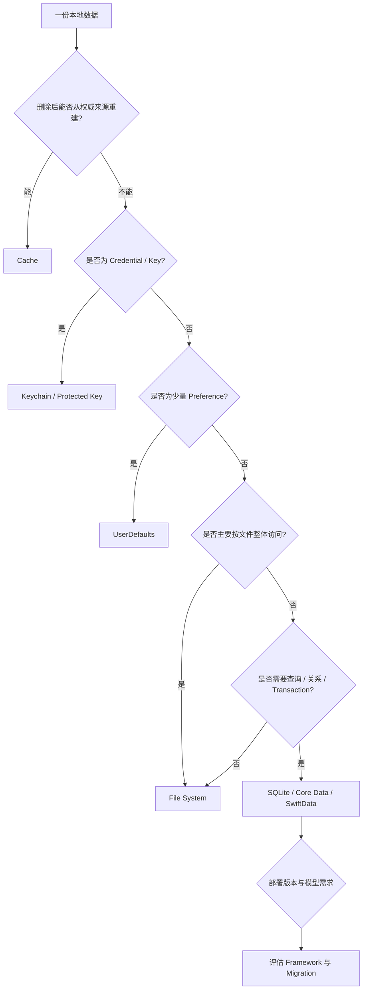
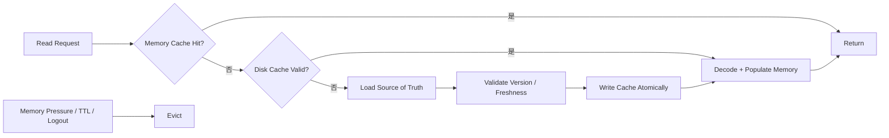
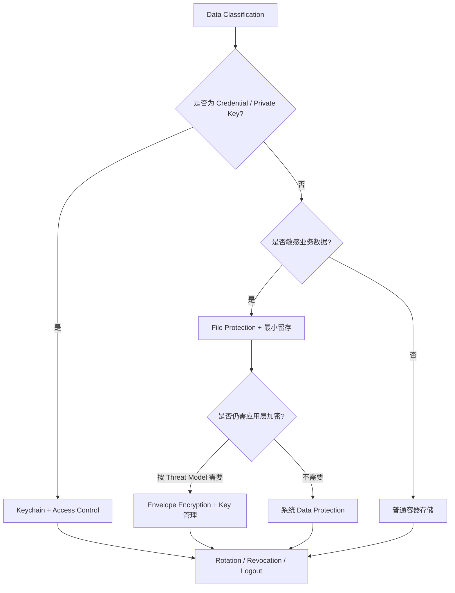
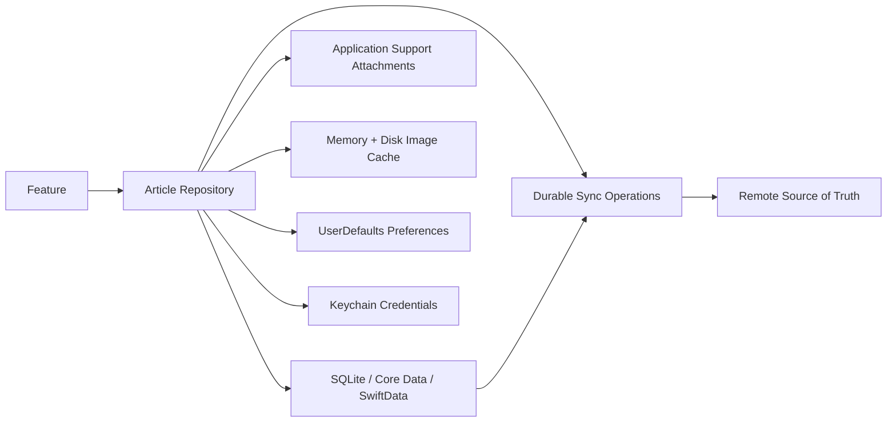

# iOS 本地存储选择：从 UserDefaults、Keychain 到 SQLite 与 SwiftData

> 本地存储选型首先要判断数据的语义，而不是比较 API 是否简单：它是偏好、凭证、文档、结构化业务状态，还是可随时重建的缓存？随后才看数据规模、查询模式、事务一致性、安全等级、跨进程需求、生命周期和迁移成本。把所有小数据塞进 `UserDefaults`、把 Token 写普通文件、把缓存当唯一事实源，都是把“能写进去”误当成“适合长期维护”。

---

## 一、问题背景：同样是 Data，责任完全不同

一个内容 App 可能同时保存：

- 深色模式、排序方式和新手引导是否展示；
- Access Token、Refresh Token 与设备私钥；
- 用户导出的 PDF、草稿附件和下载文件；
- 几十万条离线文章、标签、搜索索引与同步状态；
- 商品列表图片、HTTP Response 和计算结果缓存；
- 待上传操作的 Durable Outbox；
- Widget 与主 App 共享的少量快照。

它们不能共享同一种存储策略。凭证的核心是访问控制与设备状态，业务数据的核心是查询和事务，用户文档的核心是生命周期与备份，缓存的核心是可丢弃和失效。选错方案早期往往仍能工作，问题会在数据增长、App 升级、多账号、锁屏后台任务或崩溃恢复时暴露。

本文解决以下问题：

- `UserDefaults` 适合什么，为什么不应存大对象或敏感凭证？
- 文件应该放到 Documents、Application Support、Caches 还是 Temporary？
- Keychain 的 Accessibility、Access Group 和卸载重装边界如何影响凭证？
- 何时直接使用 SQLite，何时选择 Core Data 或 SwiftData？
- Cache 与持久化事实源的边界是什么？
- 数据量与查询模式如何影响选型，而不是只看当前记录数？
- 安全等级如何映射到 Sandbox、File Protection、Keychain 和应用层加密？
- 生命周期、备份、跨进程、迁移与测试成本如何进入决策？

本文以 Swift 6、iOS 17+ 为主要示例基线。SwiftData 需要 iOS 17+；Core Data 与 SQLite 的具体能力、系统框架实现和迁移行为会随 OS 演进。文章依赖公开 API 语义，不把某个版本的内部存储结构当成稳定契约。

### 核心结论

1. 先按数据语义分类：Preference、Credential、User Document、Structured Domain Data、Durable Operation 或 Rebuildable Cache，再选择技术。
2. `UserDefaults` 适合少量偏好和简单属性列表值，不是数据库、队列、敏感存储或跨进程事务系统。
3. 文件系统适合 Blob、文档和可整体读写的数据；目录、备份、原子写、File Protection、命名和清理策略属于存储协议的一部分。
4. Keychain 适合小型凭证、Key 和证书身份，不适合大型 Blob、频繁批量查询或业务关系数据。Accessibility 必须匹配前后台和锁屏需求。
5. SQLite 适合需要 Schema、Index、复杂查询和 Transaction 的结构化数据，但团队要承担 SQL、Migration、Connection 与并发治理。
6. Core Data 是对象图与持久化框架，不只是 SQLite 包装；SwiftData 提供更 Swift 化的模型 API，但受系统版本和框架能力边界约束。
7. Cache 必须可以删除并重建。若删除后业务事实丢失，它就不是 Cache；缓存新鲜度、Key、容量和失效必须显式设计。
8. 数据规模不能只用文件大小判断。记录数、关系、查询选择性、写放大、峰值内存、并发和未来增长共同决定方案。
9. Sandbox 不等于静态数据加密。敏感数据还需要 Data Protection、Keychain Access Control、最小留存和服务端风险控制。
10. 存储成本包括未来 Schema Migration、账号隔离、备份恢复、损坏恢复、跨版本兼容与可观测性，而不只是首版代码量。

---

## 二、选型流程：先问数据能否丢



关键分支不是数据当前有多小，而是丢失后果和访问方式。比如一条待支付确认记录只有几百字节，却需要 Durable Transaction 与崩溃恢复；一张几十 MB 的缩略图即使很大，若能重建仍只是 Cache。

### 2.1 选型前必须回答的十个问题

1. 数据由谁生产，谁是权威 Source of Truth？
2. 删除后能否重建，重建成本和离线影响是什么？
3. 是整体按 Key 读取，还是需要过滤、排序、聚合、分页和关系？
4. 单条、总量、增长速度和峰值写入是多少？
5. 多字段更新是否必须原子提交？
6. 哪些线程、Actor、进程或 Extension 会访问？
7. 数据是否敏感，锁屏和重启后首次解锁前是否需要读取？
8. 是否需要备份、迁移到新设备、跨账号或跨 App 共享？
9. Schema 如何升级，失败如何恢复或回滚？
10. 如何观测容量、延迟、错误、损坏和清理效果？

---

## 三、UserDefaults：偏好存储，不是小型数据库

`UserDefaults` 面向用户偏好和简单配置，底层支持 Property List 可表达的值，例如 String、Number、Bool、Date、Data、Array 和 Dictionary。它适合读取频繁、写入不密集、总量较小且不需要查询关系的数据。

```swift
struct PreferenceStore {
    private enum Key {
        static let colorScheme = "appearance.colorScheme.v1"
        static let articleSort = "articles.sort.v1"
    }

    private let defaults: UserDefaults

    init(defaults: UserDefaults = .standard) {
        self.defaults = defaults
        defaults.register(defaults: [
            Key.colorScheme: "system",
            Key.articleSort: "latest"
        ])
    }

    var colorScheme: String {
        get { defaults.string(forKey: Key.colorScheme) ?? "system" }
        set { defaults.set(newValue, forKey: Key.colorScheme) }
    }
}
```

`register(defaults:)` 提供未持久化的默认值，不等于把值写入用户域。读取时仍应处理旧版本非法值，而不是对字符串强制转换后崩溃。

### 3.1 适合与不适合

适合：

- 主题、排序、开关和非敏感实验分组快照；
- 是否完成一次性引导；
- 少量可容错的界面状态；
- App Group Suite 中少量跨 Target 偏好或快照。

不适合：

- Token、密码、证书和个人敏感数据；
- 大 JSON、图片、日志与持续增长数组；
- 需要条件查询、唯一约束或多记录 Transaction 的数据；
- Durable Queue、消息总线或高频计数器；
- 依赖跨进程即时一致性的协议。

不要依赖历史上的 `synchronize()` 建立一致性保证。多个进程访问 App Group `UserDefaults` 时，通知与落盘时机不能替代显式版本、原子文件或数据库事务；共享关键状态应设计单 Writer、版本和冲突策略。

### 3.2 Key 本身也是 Schema

重命名 Key、改变值类型或合并设置项都属于 Migration。可通过版本化 Key、读取旧值后写新值并清理旧 Key 完成迁移。不要把 Swift Property 名称直接当永久 Key，否则重构会意外丢失用户设置。

---

## 四、File System：目录语义比写文件 API 更重要

文件适合图片、音视频、导入导出文档、模型文件、大 Blob 和整体编码的快照。选择目录时要表达生命周期：

| 位置 | 典型数据 | 备份与清理语义 |
| --- | --- | --- |
| App Bundle | 随安装发布的只读资源 | 代码签名保护，不可运行时修改 |
| Documents | 用户创建且不可轻易重建的文档 | 通常应保留并考虑备份 |
| Library/Application Support | App 管理的持久业务文件 | 持久保存，是否备份按数据价值决定 |
| Library/Caches | 可重新下载或计算的缓存 | 系统可能清理，不应存唯一副本 |
| Temporary | 单次操作中间文件 | 系统可清理，使用后主动删除 |

数据库文件、内部模型和 Durable Outbox 通常更适合 Application Support，而不是把所有内容放 Documents。可重建的大下载应排除备份，避免浪费用户的 iCloud Backup 配额；具体 Backup Resource Value 应以当前 Foundation 文档为准并在真机验证。

### 4.1 原子写只保护单文件替换

```swift
struct SnapshotStore {
    let directory: URL

    func save(_ data: Data, name: String) throws {
        try FileManager.default.createDirectory(
            at: directory,
            withIntermediateDirectories: true
        )
        let destination = directory.appending(path: name)
        try data.write(to: destination, options: [.atomic, .completeFileProtection])
    }
}
```

`.atomic` 通常通过临时文件再替换目标，降低单文件出现部分写入的风险；它不保证多个文件共同提交，也不解决两个 Writer 的并发覆盖。多文件一致性需要 Manifest/Generation、Journal 或数据库 Transaction。`.completeFileProtection` 是否适合取决于锁屏后台访问需求，不能机械应用于所有文件。

### 4.2 文件存储仍需要 Schema

JSON 或 Protobuf 文件也有 Version。文件头或 Envelope 应包含 Schema Version、创建时间、账号/租户和必要的完整性信息。读取流程要限制文件大小、验证格式，使用临时文件完成转换，并在失败时保留可诊断但不含敏感数据的错误。

文件名不要直接使用用户输入、URL 或未清理的服务器标识。使用稳定 ID/Hash 映射并防止 Path Traversal；写入前验证解析后的 URL 仍位于预期容器内。

---

## 五、Keychain：凭证存储与访问控制

Keychain Item 由 Security Framework 管理，适合 Token、Password、Cryptographic Key、Certificate 和 Identity 等小型安全对象。它不是普通文件目录，也不是大型结构化数据库。

```swift
struct CredentialKey: Sendable {
    let service: String
    let account: String
}

func saveCredential(_ data: Data, key: CredentialKey) throws {
    let query: [CFString: Any] = [
        kSecClass: kSecClassGenericPassword,
        kSecAttrService: key.service,
        kSecAttrAccount: key.account,
        kSecAttrAccessible: kSecAttrAccessibleAfterFirstUnlockThisDeviceOnly,
        kSecValueData: data
    ]

    let status = SecItemAdd(query as CFDictionary, nil)
    guard status == errSecSuccess else {
        throw KeychainError.unexpectedStatus(status)
    }
}
```

示例只展示新增路径。生产实现必须处理 `errSecDuplicateItem`，使用不含 `kSecValueData` 的匹配 Query 调用 `SecItemUpdate`，并分别处理 `errSecItemNotFound`、`errSecInteractionNotAllowed`、Entitlement/Access Group 错误，而不是把所有状态都映射为“没有 Token”。

### 5.1 Accessibility 是业务前置条件

- `WhenUnlocked` 类适合只在设备解锁时访问的敏感值；
- `AfterFirstUnlock` 类可支持设备重启后首次解锁后的后台访问，但暴露窗口更宽；
- `ThisDeviceOnly` 影响备份和迁移，适合不应迁往新设备的凭证；
- Access Control 可要求用户在私钥操作时通过生物识别或设备认证。

选择必须基于“锁屏时后台任务是否需要凭证”“是否允许迁移到新设备”“失败时能否重新登录”。Keychain Item 可能比 App Data Container 生命周期更长，卸载重装后的状态不能靠假设；启动时应校验凭证与本地账号数据库的一致性，并支持服务端撤销。

### 5.2 Keychain 不替代服务端安全

Keychain 降低静态凭证被普通文件读取的风险，却不能防止已授权进程滥用 Token、日志泄露或服务端凭证失效。Token 应短期化、限制 Scope、支持 Rotation 和注销；大型用户数据仍应存文件或数据库，并使用合适的 File Protection。

---

## 六、SQLite：显式关系模型与事务控制

当数据需要过滤、排序、Join、Index、唯一约束、聚合、分页和多记录原子提交时，SQLite 是直接而稳定的关系数据库选择。它适合离线目录、消息、搜索元数据、同步状态和 Durable Outbox。

### 6.1 SQLite 带来的能力

- ACID Transaction 与 Crash Recovery；
- Schema、Primary Key、Foreign Key、Unique Constraint；
- Index 与 Query Planner；
- 单文件数据库便于容器内管理；
- Write-Ahead Logging（WAL）可改善特定读写并发模式；
- 明确的 SQL 和版本 Migration。

这些能力不是零成本。团队要负责 Statement Binding、防 SQL Injection、Connection 生命周期、Busy/Lock、Transaction 边界、Migration、备份一致性和损坏恢复。WAL 也不是“打开后并发无限提升”：SQLite 仍有单 Writer 约束，长读事务、Checkpoint 和磁盘特征都会影响行为，必须基于工作负载测量。

```sql
CREATE TABLE outbox_operation (
    operation_id TEXT PRIMARY KEY,
    account_id TEXT NOT NULL,
    idempotency_key TEXT NOT NULL UNIQUE,
    payload BLOB NOT NULL,
    state INTEGER NOT NULL,
    attempt INTEGER NOT NULL DEFAULT 0,
    next_attempt_at REAL,
    created_at REAL NOT NULL
);

CREATE INDEX outbox_ready_idx
ON outbox_operation(account_id, state, next_attempt_at);
```

这里用数据库约束表达 Operation 与 Idempotency Key 的不变量，比先查询再插入更能抵抗并发竞态。Payload 仍需 Schema Version、大小限制和敏感等级设计。

### 6.2 何时使用封装库

直接调用 SQLite C API 控制力强，但样板代码和资源管理成本高。成熟封装可提供类型映射、Migration、Statement 管理与并发模型；选型时应审计维护状态、事务语义、Swift Concurrency 支持、取消、性能和升级路线，而不是只比较 API 美观程度。

---

## 七、Core Data：对象图管理与持久化框架

Core Data 管理 Model、Object Identity、Relationship、Change Tracking、Validation、Undo、Faulting、Context 与 Persistent Store。SQLite 常作为 Store 类型，但 Core Data 公开语义不是“把 Managed Object 当普通 SQL Row”，也不应依赖其内部表结构直接查询。

适合：

- 关系丰富的对象图与编辑流程；
- 需要 Change Tracking、Faulting、批量操作和多 Context 协作；
- 已有成熟 Core Data 模型、Migration 和团队经验；
- 需要 Persistent History、CloudKit 集成等框架能力并接受其约束。

成本：

- Managed Object 受 Context/Queue 约束，不能随意跨并发域传递；
- Object Identity、Fault、Merge Policy 和 Save 传播需要系统理解；
- Model Version 与 Migration 必须发布前验证；
- 大批量导入若逐对象处理会产生内存和 Change Tracking 成本；
- Debug SQL 只能辅助诊断，不能把内部 Schema 当公开接口。

Core Data 不是“数据多才使用”。几千条具有复杂关系和编辑事务的数据可能很合适；数百万条只做简单 Append/Scan 的遥测数据则可能更适合专用文件或 SQLite Schema。

---

## 八、SwiftData：更 Swift 化，但不是无迁移成本

SwiftData 从 iOS 17 开始提供 `@Model`、`ModelContainer`、`ModelContext`、`FetchDescriptor` 等 Swift 化 API，并能与 SwiftUI Observation 和 Query 集成。它降低部分声明和界面绑定样板代码，但持久化的基本问题仍然存在：Schema、Identity、Relationship、Context、并发、Migration 和错误恢复不会消失。

适合：

- Deployment Target 为 iOS 17+；
- 新项目或独立模块，模型复杂度与框架能力匹配；
- 团队愿意按目标 OS 测试 SwiftData 行为和 Migration；
- SwiftUI 集成为主要场景，但数据层仍保持清晰边界。

需要谨慎：

- 需要支持 iOS 16 或更早版本；
- 已有复杂 Core Data Stack、Custom Migration 或大量历史数据；
- 依赖当前 SwiftData 尚未满足的高级能力或精细 SQL 控制；
- 希望模型能无成本在 Core Data、SwiftData 与纯 Swift 之间切换。

不要仅因为 API 更短就立即迁移生产数据库。应先复制真实数据，在所有支持 OS 上验证 Schema 演进、Relationship、Delete Rule、并发、批量数据、Cloud 同步和失败恢复。下一篇会进一步比较 Core Data 与 SwiftData 的核心机制。

---

## 九、Cache：可丢弃是第一契约

Cache 保存从权威来源派生且可重建的数据，目标是降低延迟、网络、CPU 或 I/O 成本。常见层次包括：

- `NSCache`：进程内对象缓存，可在内存压力下逐出；
- `URLCache`：遵循 HTTP 缓存语义的 Response Cache；
- 磁盘文件缓存：图片、媒体、编译或计算产物；
- 数据库查询缓存：带 Key、Version、Expiry 的派生快照。



### 9.1 Cache Key 与失效

Cache Key 必须包含所有影响结果的维度，例如用户/租户、URL、Query、Locale、Theme、图片尺寸、数据版本和权限范围。遗漏账号是典型串号风险；把 Token 原文放进 Key 又会泄密，应使用稳定且安全的账号作用域 ID。

常见失效策略：

- TTL / Expiry；
- Version/ETag/Last-Modified 再验证；
- 写操作后按实体或 Tag 失效；
- Schema/Decoder 版本变化后清理；
- 注销、账号切换和权限变化时清理对应分区；
- LRU/Cost/Disk Budget 只解决容量，不证明新鲜。

“清空所有 Cache”简单但可能制造启动网络风暴；精细失效更高效，却增加依赖图和一致性成本。选型需根据数据价值和错误后果决定。

### 9.2 Cache Stampede

同一个 Key 同时 Miss 时，多个任务可能重复加载和写入。可用 Actor 内 Single-flight 合并同 Key 请求，并明确等待者取消、失败缓存和清理策略。不要在 Actor 内执行长时间同步解码；I/O 与 CPU 工作完成后，恢复到 Actor 再验证 Generation 并提交。

---

## 十、数据规模与查询模式

### 10.1 不要只看文件大小

需要测量：

- 总记录数、单条大小分布与增长速度；
- 读写比、Burst、Batch Size 和生命周期；
- 查询条件、排序、分页、Join 与聚合；
- Index 数量、选择性和写放大；
- 冷启动加载量与峰值内存；
- 多线程/多 Actor/多进程访问；
- 删除、Vacuum、Checkpoint 与 Backup 成本；
- Schema Migration 的最长停机预算。

例如，把 20 MB JSON 整体解码后只查一个对象，峰值内存和 O(n) 扫描可能远比文件大小本身更重要；同样数据进入 SQLite 并建立正确 Index，可按页读取。但只有几份整体替换的配置文件，引入关系数据库又会增加 Migration 和运维成本。

### 10.2 方案与访问模式

| 访问模式 | 优先候选 | 关键验证 |
| --- | --- | --- |
| 少量 Key-Value Preference | UserDefaults | 大小、写频率、类型迁移 |
| 单个大 Blob / 用户文档 | File System | 流式 I/O、原子替换、备份 |
| 凭证 / 私钥 | Keychain | Accessibility、大小、轮换 |
| 复杂过滤、排序、聚合 | SQLite | Index、Query Plan、Transaction |
| 关系对象图、Change Tracking | Core Data | Context、Faulting、Merge、Migration |
| iOS 17+ Swift 模型持久化 | SwiftData | OS 矩阵、Schema、并发与能力缺口 |
| 可重建热点数据 | Cache | Hit Rate、新鲜度、容量和失效 |

最终选择需要用真实数据集 Benchmark。模拟器文件系统和 CPU 与真机不同，性能结论必须在目标设备的 Profile/Release 环境验证。

---

## 十一、安全等级：从访问隔离到最小留存



Sandbox 主要限制其他 App 访问容器，不代表设备锁定时数据一定不可解密。File Protection Class 决定文件 Key 在何种设备状态可用；Keychain Accessibility 对凭证有相似但独立的访问条件。

应用层加密只有在 Threat Model 需要并具备 Key 管理时才有意义。把 Encryption Key 和 Ciphertext 放在同一普通文件旁边不会增加实质保护；Key Rotation、Version、Nonce 唯一性、认证加密、失败恢复和备份都必须设计。不要自创密码算法，应使用 CryptoKit/Security 等经过验证的 Primitive 与协议。

数据安全还包括：

- 只保存业务必需字段并设置 Retention；
- 日志、Crash、Analytics、Spotlight、Widget 和 Backup 不泄露副本；
- 多账号按 Account ID 分区并在切换时关闭旧句柄；
- 注销清理 Token、Cookie、Cache、数据库行、文件与 Outbox；
- 清理本地数据不等于保证 Flash 介质物理不可恢复，应依赖加密密钥生命周期和平台能力；
- 隐私披露与第三方 SDK 数据实践保持一致。

---

## 十二、生命周期：谁创建、谁升级、谁删除

一份本地数据至少经历：

```text
install/create -> open -> read/write -> migrate -> backup/restore
               -> account switch -> logout -> uninstall/reinstall
               -> corruption/recovery -> delete
```

### 12.1 安装、升级与重装

- App Bundle 每次安装/升级可替换，不能写入；
- Data Container 通常在升级时保留，Schema 必须向前迁移；
- 卸载会移除 App Container，但不能把 Keychain 清理行为当作业务注销协议；
- 恢复备份时，文件、Keychain Item 和服务器会话可能处于不同世代；
- 首次启动应校验安装 ID、账号、数据库和凭证的一致性。

### 12.2 多账号与共享容器

每个记录、文件目录、Cache Key 和 Outbox Operation 都应有明确账号作用域。不要只清 UI 内存而继续复用旧账号 Database Connection。App Group 或 Keychain Access Group 共享数据时，还要定义 Target 身份、单 Writer、Schema Version、原子提交与 Extension 生命周期。

### 12.3 清理策略

- Cache 按容量、时间、账号与磁盘压力清理；
- Temporary 文件使用 `defer` 或 Operation 状态机清理；
- 下载一半的文件使用 Manifest 标记，不与完成文件混放；
- 用户文档删除需要 Undo/Trash 或明确不可恢复提示；
- 数据库软删除必须有最终 Purge 和同步语义；
- 法规或账号删除要求应覆盖 Backup、服务端和第三方，而非只删本地目录。

---

## 十三、迁移成本：今天的格式就是明天的兼容契约

### 13.1 各方案的迁移面

| 方案 | 典型迁移 | 失败影响 |
| --- | --- | --- |
| UserDefaults | Key Rename、Type Change、Default 语义 | 设置丢失或行为变化 |
| File | Envelope Version、目录布局、编码格式 | 文件不可读、空间翻倍 |
| Keychain | Service/Account/Access Group/Accessibility | 登出、重复 Item、后台不可读 |
| SQLite | DDL、数据回填、Index、Constraint | 数据库无法打开或长时间阻塞 |
| Core Data | Model Version、Lightweight/Custom Migration | Persistent Store 加载失败 |
| SwiftData | Versioned Schema、Migration Plan | 特定 OS/模型组合失败 |
| Cache | Key/Decoder Version | 可清空重建，但可能形成流量峰值 |

Migration 应满足：

- 可在旧真实数据副本上重复测试；
- 每一步有版本和成功标记，失败不会把半成品当新版本；
- 预估临时磁盘空间、时间、设备锁定和 App 被终止；
- 关键数据先备份或采用可回滚/可恢复策略；
- 不在 MainActor 上执行长时间 I/O 与转换；
- 记录阶段、耗时和稳定错误码，但不记录敏感内容。

Cache 可以版本化目录后直接重建，业务事实源则不能用“迁移失败就删库”作为默认恢复。下一篇“数据迁移与一致性”会展开 Atomic Write、Transaction、冲突解决和损坏恢复。

---

## 十四、组合方案：真实 App 通常使用多种存储

以离线文章 App 为例：



- UserDefaults 保存排序和阅读偏好；
- Keychain 保存短期认证凭证；
- 数据库保存文章元数据、关系和同步状态；
- 文件系统保存附件与正文 Blob；
- Cache 保存缩略图和可重建结果；
- Outbox 在数据库 Transaction 中保存待同步意图；
- Repository 对上层隐藏组合细节，但不抹掉事务和新鲜度语义。

不要为了“统一接口”把所有存储抽象为 `get(key:)` / `set(value:)`。这种最低公分母会丢失 Transaction、Query、Stream、Security 和 Migration 能力。抽象应围绕领域用例，例如 `saveDraft`、`enqueueOperation`、`loadArticlePage`，并显式返回 Freshness 或 Sync State。

---

## 十五、性能、容量与可靠性验证

### 15.1 先定义工作负载

准备接近生产的数据库、文件数量和对象大小，在目标真机 Profile/Release 配置测量：

- 冷启动 Open/Migration 时间；
- P50/P95/P99 Query 与 Write Latency；
- 批量导入时间和峰值内存；
- 数据库、WAL、缓存和附件磁盘占用；
- Cache Hit Rate、Eviction 与 Rebuild 流量；
- 锁屏、重启后首次解锁前的访问失败；
- 磁盘不足、写入中止和损坏后的恢复时间。

不要在 Debug/模拟器上比较“Core Data 比 SQLite 慢多少”并推广到生产。框架、Schema、Index、Batch Size、Faulting、Journal Mode 和硬件都会影响结果。

### 15.2 故障注入

- 写入中杀进程，验证 Atomic File 或 Transaction；
- Migration 中断并重启，验证幂等恢复；
- 模拟磁盘空间不足、权限和 Protected Data 不可用；
- 注入损坏文件/数据库副本，验证隔离、备份和重建；
- 多账号快速切换，确认无旧数据泄露；
- Cache 清空后验证功能仍正确，只是性能下降；
- App 与 Extension 并发读写共享容器，验证版本与冲突策略。

### 15.3 可观测性

记录 Store 类型、Schema Version、Migration Stage、数据量级、Latency、Stable Error Code 和 Recovery Result，不记录 Token、用户正文或完整 SQL 参数。为磁盘增长、Migration 失败、Outbox 积压和 Cache Rebuild 风暴设置告警。

---

## 十六、常见误区与修复

### 16.1 数据很小，所以放 UserDefaults

**问题：** 数据大小不代表语义适合；一条小型待支付操作仍需要 Transaction 与 Durable State。

**修复：** 先判断查询、事务、安全与生命周期，再看大小。

### 16.2 Token 加密后写普通文件

**问题：** 若解密 Key 也随 App 分发或存同一位置，只增加混淆成本。

**修复：** Token 使用 Keychain，配合短期化、Rotation、Scope 和服务端撤销。

### 16.3 把 Caches 目录当离线事实源

**问题：** 系统可清理 Cache，用户会丢失无法重建的数据。

**修复：** 权威离线数据存 Application Support/数据库，Cache 只保存可重建派生数据。

### 16.4 迁移失败就删除数据库

**问题：** 对业务事实源会造成不可逆数据丢失，还可能丢掉待同步操作。

**修复：** 用真实旧数据测试迁移，设计备份、分阶段提交、恢复与用户可见故障处理。

### 16.5 为所有存储建立统一 Key-Value 接口

**问题：** 抹平数据库 Transaction、文件流、Keychain Access Control 和 Cache Freshness 等关键语义。

**修复：** 围绕领域用例抽象，并保留底层必须暴露的一致性和生命周期契约。

---

## 十七、工程选型清单

### 17.1 数据语义

- 是否可删除重建，谁是 Source of Truth；
- 是 Preference、Credential、Document、Domain Data、Operation 还是 Cache；
- 是否需要关系、查询、唯一约束和 Transaction；
- 是否存在多账号、Extension 或多进程访问。

### 17.2 安全与生命周期

- Data Classification、Retention 和 Backup 策略；
- File Protection / Keychain Accessibility 是否匹配后台需求；
- 注销、设备迁移、卸载重装和服务端撤销行为；
- Schema Version、Migration、损坏与磁盘不足恢复。

### 17.3 验证

- 使用真实规模数据和目标真机测量；
- 检查 Index、Query Plan、峰值内存与磁盘增长；
- 注入写中断、Migration 中断、锁屏和多账号切换；
- Cache 删除后功能是否仍正确；
- 日志、Backup、Widget 与第三方 SDK 是否产生敏感副本。

---

## 十八、总结

iOS 本地存储没有统一最优解。UserDefaults 管偏好，文件系统管文档和 Blob，Keychain 管小型凭证和密钥，SQLite 提供显式关系与事务，Core Data 管对象图和变更，SwiftData 提供 iOS 17+ 的 Swift 化持久化体验，Cache 则用可丢弃数据换取性能。真实项目通常组合使用，而不是强迫所有数据进入一个容器。

正确选型来自数据语义、访问模式和生命周期：可否重建、如何查询、是否需要事务、何时可访问、是否备份、如何迁移、如何在崩溃和账号切换后恢复。首版写入代码只是成本的一小部分，长期可靠性取决于 Schema、Migration、安全、容量、故障注入和可观测性的完整闭环。

---

## 问答复盘

### Q1：一份数据只有几百字节，是否应优先存入 UserDefaults？

**答：** 不一定。大小只是一个维度；若数据需要事务、唯一约束、安全保护或崩溃恢复，应选择数据库或 Keychain 等匹配其语义的方案。

### Q2：Documents 和 Caches 目录的关键区别是什么？

**答：** Documents 用于用户不可轻易重建的文档；Caches 用于可重新获取的派生数据，系统可能清理。不可恢复的离线事实不能只放 Caches。

### Q3：`Data.write(options: .atomic)` 能否保证多个文件一起提交？

**答：** 不能。它只降低单个目标文件出现部分写入的风险。多文件一致性需要 Generation/Manifest、Journal 或数据库 Transaction。

### Q4：Keychain 是否适合保存完整用户数据库？

**答：** 不适合。Keychain 面向小型凭证、Key、Certificate 和 Identity，不提供复杂查询、关系与批量事务，频繁大数据访问成本和模型也不匹配。

### Q5：SQLite 开启 WAL 后是否不存在写入竞争？

**答：** 不存在这种保证。WAL 可改善特定读写并发，但 SQLite 仍有单 Writer 约束，长事务、Checkpoint 和 Connection 策略仍需测量和治理。

### Q6：Core Data 与 SQLite 的关系是什么？

**答：** Core Data 是对象图和持久化框架，SQLite 可作为其 Persistent Store。不能把 Managed Object 简化为 SQL Row，也不应依赖 Core Data 的内部 SQLite Schema。

### Q7：新项目是否应该无条件使用 SwiftData？

**答：** 不应该。需要考虑 iOS 17+ Deployment Target、模型复杂度、Migration、并发、团队经验和框架能力。API 简洁不等于迁移与恢复成本消失。

### Q8：如何判断一份数据是真正的 Cache？

**答：** 删除后功能仍正确，并能从权威来源重建，只是性能或离线体验下降。若删除会丢失用户事实或待同步操作，它就不是 Cache。

### Q9：Sandbox 是否已足够保护敏感文件？

**答：** 不足以概括。Sandbox 负责访问隔离；锁屏时可否解密由 File Protection 等决定，凭证应使用 Keychain，数据还需要最小留存和日志/备份治理。

### Q10：为什么存储选型必须在真实设备上做故障测试？

**答：** 模拟器不能完整代表 Data Protection、Keychain、磁盘压力、进程终止和真实 I/O。迁移中断、锁屏、空间不足和损坏恢复只有在目标环境验证才可信。

---

## 延伸知识

- **Core Data 与 SwiftData**：Model、Context、Object Identity、Faulting、Merge Policy、Batch Operation 与 Persistent History；
- **数据迁移与一致性**：Schema Version、Atomic Write、Transaction、Conflict Resolution、Offline-first 与损坏恢复；
- **沙盒与系统边界**：App Group、Keychain Access Group、File Protection 和 Extension Process；
- **安全传输与凭证**：Keychain、Secure Enclave、Token Rotation 和日志脱敏；
- **缓存工程**：HTTP Cache、Memory/Disk Cache、Single-flight、Stampede 与 Invalidation。
