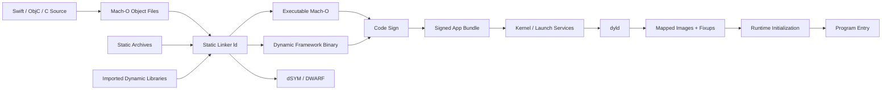
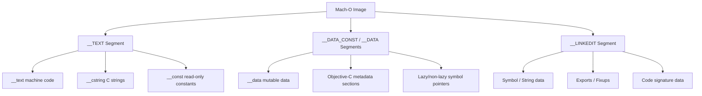
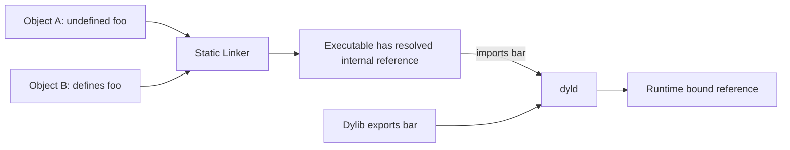
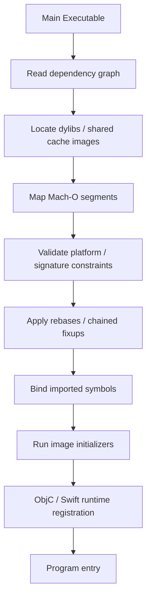
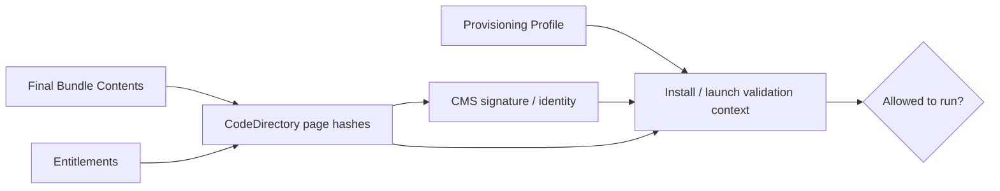
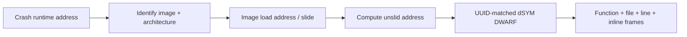

# Mach-O 与动态链接：从 Header、符号绑定到代码签名与崩溃符号化

> Swift、Objective-C 和 C/C++ 源码最终会形成目标文件，再由链接器组织为 Mach-O 可执行文件或动态库。系统启动进程时，dyld 根据 Load Command 映射 Segment、装载依赖、完成 Rebase/Fixup 与 Symbol Binding；内核和安全基础设施验证代码签名，ASLR 改变运行地址；崩溃后只有用 UUID 完全匹配的 dSYM 才能把地址可靠还原到函数和源码。理解这条链路，才能判断启动慢、符号找不到、Framework 无法加载、Archive 体积异常和线上堆栈未符号化的真正原因。

---

## 一、本文解决什么问题

iOS 工程中经常遇到这些问题：

- Mach-O Header 和 Load Command 分别描述什么？
- `__TEXT`、`__DATA`、`__LINKEDIT` 与 `__text`、`__cstring` 有什么区别？
- Static Library 为什么没有运行时装载过程，却仍可能增加 App 体积？
- `.framework` 为什么既可能包含动态库，也可能包含静态库？
- XCFramework 是否会被 dyld 直接装载？
- App 启动时 dyld 需要完成哪些阶段？
- Undefined Symbol、Duplicate Symbol 与 `Library not loaded` 分别发生在哪一层？
- Rebase、Bind、Lazy Binding、Export Trie 和 Chained Fixups 是什么关系？
- Code Signing 验证的是源码、证书还是最终文件页面？
- ASLR 后崩溃地址为什么不能直接拿去查函数？
- dSYM、UUID、DWARF 和 `atos` 如何协作完成符号化？

这些问题都属于从“编译成功”到“二进制能安全装载并可诊断”的同一条工程链路。

本文以 Apple 平台公开 Mach-O ABI、工具链和 dyld 通用模型为主。示例命令在 2026-07-31 使用 Xcode 26.1.1、Apple LLVM 17 工具链验证。dyld3/dyld4 闭包、Chained Fixups、共享缓存、代码签名 Blob、Pointer Authentication 和链接器实现会随 iOS、架构与 Xcode 演进；除公开文件格式和平台契约外，内部结构分析必须标注对应版本。

### 核心结论

1. Mach-O Header 描述文件类型、CPU 架构、Load Command 数量和 Flags；Load Command 才定义 Segment、依赖库、入口、符号/重定位数据和代码签名位置等装载信息。
2. Segment 是虚拟内存映射和权限管理单位，Section 是 Segment 内按用途组织的数据区域。`__TEXT` 与 `__text` 不是同一个层级。
3. `.o` 通常是可重定位 Mach-O；Static Library 常是 `ar` Archive，内部包含多个目标文件，并不是 dyld 直接装载的运行时镜像。
4. Dynamic Library 是独立 Mach-O Image，运行时由 dyld 装载和绑定。它减少某些代码复制、支持独立镜像边界，但会增加装载、签名、依赖和启动治理成本。
5. Framework 是 Bundle 目录规范，可包装静态或动态 Binary；XCFramework 是多个平台/架构 Variant 的分发容器，构建时选择其中一片，运行时不会整体装载。
6. dyld 根据依赖图映射 Image、应用 Fixup、绑定 Symbol、执行初始化，再把控制权交给程序入口；系统库常来自 dyld Shared Cache，不能简单按磁盘独立文件理解。
7. Symbol Binding 将导入引用连接到导出实现。传统 Rebase/Bind/Lazy Bind 与现代 Chained Fixups 是不同格式/策略，具体使用取决于工具链和目标系统。
8. Symbol Table、Export 信息和 DWARF 解决的问题不同。Release 可执行文件可裁剪大量调试符号，但仍需保留运行时链接所需的导出/Fixup 信息。
9. Code Signing 对最终 Code Object 的页面和特殊 Slot 等内容建立 Hash/签名关系，并绑定 Entitlement 等要求；修改已签名嵌套 Framework 或资源会破坏签名完整性。
10. ASLR 为 Image 引入运行时 Slide，崩溃地址必须结合 Image Load Address、UUID 和架构还原。Pointer Authentication 进一步影响部分 Pointer 表示，但不替代 ASLR。
11. dSYM 保存从最终 Binary 提取/关联的 DWARF 调试信息。符号化必须使用与崩溃 Image UUID 完全匹配的 dSYM，只有同名或同 Commit 不够。

---

## 二、从目标文件到运行时映像



链路中每个工具职责不同：

- Compiler 生成目标文件及中间符号/调试信息；
- Static Linker 解析静态符号、布局 Segment/Section、生成 Mach-O；
- `dsymutil` 等工具把 DWARF 关联到 dSYM；
- Code Signing 工具为 Bundle 内 Code Object 签名；
- dyld 在运行时装载 Image 并完成动态链接；
- Objective-C/Swift Runtime 再注册类型、执行初始化并支撑语言运行。

“链接完成”不等于“运行时一定能加载”。签名、架构、最低系统版本、依赖路径和设备环境都可能让启动失败。

---

## 三、Mach-O Header：文件的第一层身份

Mach-O 文件开头是 Header。64-bit 版本概念结构包含：

```c
struct mach_header_64 {
    uint32_t magic;
    cpu_type_t cputype;
    cpu_subtype_t cpusubtype;
    uint32_t filetype;
    uint32_t ncmds;
    uint32_t sizeofcmds;
    uint32_t flags;
    uint32_t reserved;
};
```

### 3.1 关键字段

| 字段 | 作用 |
|---|---|
| `magic` | 文件字节序与 32/64-bit 格式标识 |
| `cputype` / `cpusubtype` | 目标 CPU 架构与子类型 |
| `filetype` | Object、Executable、Dylib、Bundle 等文件种类 |
| `ncmds` | Load Command 数量 |
| `sizeofcmds` | 全部 Load Command 占用字节数 |
| `flags` | PIE、Two-level Namespace 等链接/装载属性 |

常见 `filetype` 包括：

- `MH_OBJECT`：可重定位目标文件；
- `MH_EXECUTE`：可执行文件；
- `MH_DYLIB`：动态库；
- `MH_BUNDLE`：可装载 Bundle 类型 Mach-O；
- `MH_DSYM`：dSYM 中的 DWARF Companion Mach-O。

具体常量值应查当前 SDK Header，不建议在业务工具中复制硬编码数字。

### 3.2 Universal/Fat Binary

一个文件可能是包含多个 Mach-O Slice 的 Universal Binary。外层 Fat Header 描述每个架构 Slice 的 Offset 和大小；选中 Slice 后才进入各自 Mach-O Header。

```bash
file MyFramework.framework/MyFramework
xcrun lipo -info MyFramework.framework/MyFramework
```

现代 XCFramework 通常用目录区分平台/架构 Variant，而不是强行把 iOS Device 与 Simulator 合并为一个 Fat Binary。相同 CPU 架构也可能属于不同平台 ABI，不能只看 `arm64` 就判断可混用。

### 3.3 检查 Header

```bash
xcrun otool -hv MyApp.app/MyApp
xcrun vtool -show-build MyApp.app/MyApp
```

`vtool -show-build` 可观察 Build Version 等 Load Command 信息。工具输出格式可能演进，CI 应解析稳定字段或使用结构化工具，而不是依赖列宽。

---

## 四、Load Command：告诉系统如何解释文件

Header 后是一组可变长度 Load Command。它们是 Mach-O 的装载说明书。

常见类别包括：

- `LC_SEGMENT_64`：Segment 与其中 Section；
- `LC_LOAD_DYLIB` / `LC_LOAD_WEAK_DYLIB`：依赖动态库；
- `LC_ID_DYLIB`：动态库自身 Install Name；
- `LC_RPATH`：运行时搜索路径；
- `LC_SYMTAB` / `LC_DYSYMTAB`：经典符号表信息；
- `LC_DYLD_INFO_ONLY` 或现代 Fixup/Export 相关 Command；
- `LC_DYLD_CHAINED_FIXUPS`：Chained Fixups 数据；
- `LC_DYLD_EXPORTS_TRIE`：导出 Trie；
- `LC_MAIN`：主程序入口信息；
- `LC_LOAD_DYLINKER`：动态链接器路径；
- `LC_UUID`：Image UUID；
- `LC_BUILD_VERSION`：平台、最低 OS 与 SDK；
- `LC_CODE_SIGNATURE`：代码签名数据位置；
- `LC_FUNCTION_STARTS`：压缩函数起始信息；
- `LC_DATA_IN_CODE`：代码区内数据范围描述。

并非每个文件都包含全部 Command，旧系统/工具链也可能使用不同组合。

### 4.1 Load Command 不是被执行的指令

它们是文件 Metadata，不是 CPU Machine Instruction。dyld、内核、调试器和分析工具读取这些描述，决定映射与修复方式。

### 4.2 查看 Load Command

```bash
xcrun otool -l MyApp.app/MyApp
xcrun otool -L MyApp.app/MyApp
```

- `otool -l` 输出全部 Load Command；
- `otool -L` 重点显示动态库 Install Name 与兼容版本；
- 输出中的文件路径和版本必须结合 `@rpath`、`@loader_path`、`@executable_path` 解释。

### 4.3 Install Name 与运行时路径

Dynamic Library 不仅有磁盘位置，还有嵌入 Mach-O 的 Install Name。常见 Token：

- `@executable_path`：相对主可执行文件目录；
- `@loader_path`：相对引用该依赖的 Image 目录；
- `@rpath`：由当前装载上下文的 Runtime Search Path 展开。

错误的 Install Name/RPath 会导致类似：

```text
Library not loaded: @rpath/FeatureKit.framework/FeatureKit
Reason: tried: ...
```

修复应从 Embed、Sign、`LC_RPATH`、Install Name、平台 Slice 和 Bundle 路径整体检查，而不是把 Framework 任意复制到某个目录。

---

## 五、Segment 与 Section：文件如何映射到虚拟内存

Segment 是 dyld/内核映射 Mach-O 到进程虚拟内存的重要单位，具有 Virtual Address、File Offset、大小和内存保护属性。Section 是 Segment 内更细粒度的数据分类。



图只列常见类型。实际 Segment/Section 名称会随链接器、Swift/Objective-C Metadata、架构与部署目标变化。

### 5.1 常见 Segment

#### `__TEXT`

通常包含 Header、Load Command、Machine Code 和只读常量。常见权限是 Read + Execute，文件页面可按需映射并在多个进程间共享未修改页面。

#### `__DATA_CONST` / `__DATA`

包含 Pointer、Global Variable、Runtime Metadata 等。部分页面在 Fixup 后可转为只读，具体划分由工具链和系统决定。

#### `__LINKEDIT`

包含链接器和 dyld 使用的数据，例如符号/字符串、Export、Fixup、Function Starts 和 Code Signature Blob。它不等于普通业务数据 Segment。

### 5.2 Segment 与 Section 的区别

| 维度 | Segment | Section |
|---|---|---|
| 主要用途 | 虚拟内存映射、权限、页面布局 | 按数据语义细分内容 |
| 命名示例 | `__TEXT` | `__text`、`__cstring` |
| 粒度 | 较大 | Segment 内较小区域 |
| 主要消费者 | 内核、dyld、链接器 | 链接器、Runtime、调试器、分析工具 |

### 5.3 查看布局和体积

```bash
xcrun size -m MyApp.app/MyApp
xcrun otool -l MyApp.app/MyApp
```

分析包体时要区分：

- File Size；
- Segment File Size；
- Virtual Memory Size；
- 压缩后的 IPA 下载大小；
- App Thinning 后设备实际安装大小；
- 运行时 Dirty/Resident Memory。

它们不能互相替代。Mach-O 增加 1 MB 不等于下载包、安装包和运行内存都增加 1 MB。

---

## 六、Symbol Table：名称如何关联地址

Symbol 让链接器、dyld、调试器和符号化工具把名称与地址/Section 关联。常见分类包括：

- Defined Symbol：当前 Image 提供实现；
- Undefined Symbol：当前 Image 引用、由其他 Image 提供；
- Local Symbol：仅本 Image 内部使用；
- External/Global Symbol：参与跨 Image 链接；
- Weak Symbol：允许缺失或被强定义覆盖，具体语义依链接场景；
- Debug Symbol：用于源码调试和符号化，通常转移到 dSYM。

### 6.1 Static Link 与 Dynamic Link 的 Symbol 时机



- Static Linker 在构建期解析目标文件和 Archive 内符号；
- 未由当前链接单元提供、但允许从 Dynamic Library 导入的 Symbol 会留下动态绑定信息；
- dyld 在装载期/首次使用时按文件格式和策略完成绑定。

### 6.2 Undefined 与 Duplicate Symbol

#### Undefined Symbol

常见原因：

- 实现文件未加入 Target；
- Static Library 未链接或 Archive 未抽取所需 Member；
- C++/Objective-C++ Name Mangling/语言边界不一致；
- 架构 Slice 缺失；
- `-ObjC` 等 Category 链接条件未满足；
- Swift Module 与 Binary 不匹配；
- Symbol Visibility 或 Link Order 问题。

#### Duplicate Symbol

常见原因：

- 同一 `.o` 或 Static Library 被重复链接；
- Header 错误定义非 `static` Global；
- 两个库打包了同一第三方源码；
- Objective-C Class Name 或 C Global Symbol 冲突。

不要用隐藏全部 Symbol 或随意添加 Linker Flag 掩盖根因。

### 6.3 查看 Symbol

```bash
xcrun nm -m MyApp.app/MyApp
xcrun nm -u MyApp.app/MyApp
xcrun strings MyApp.app/MyApp | rg 'FeatureName'
```

- `nm` 适合查看经典 Symbol 视图；
- `strings` 只能证明某段可打印字节存在，不能证明它是有效 Symbol 或代码路径；
- Stripped Release Binary 中很多名称可能不存在；
- Swift Symbol 需要 Demangle，工具输出应结合 `swift-demangle` 或支持 Swift 的 Symbolicator。

---

## 七、Static Library 与 Dynamic Library

### 7.1 Static Library

`.a` 通常是 `ar` Archive，保存多个 `.o` Member：

```bash
file libFeature.a
ar -t libFeature.a
xcrun lipo -info libFeature.a
```

链接器从 Archive 抽取满足未解析 Symbol 的目标文件，并把需要的 Code/Data 合入最终 Mach-O。

收益：

- 运行时没有独立 Image 装载和依赖路径；
- 部署结构简单；
- Link-time Optimization/Dead Stripping 可能获得更完整视野；
- 适合 App 内部模块与部分第三方依赖。

代价：

- 多个 App/Extension 各自静态链接可能复制代码；
- Archive Member 粒度和 Objective-C Category 可能影响 Dead Stripping；
- 同一依赖多份静态合入可造成 Duplicate Symbol；
- 更新库必须重新链接消费者。

### 7.2 Dynamic Library

Dynamic Library 是独立 `MH_DYLIB` Image，导出 Symbol 并在运行时由 dyld 装载。iOS App 常通过 Dynamic Framework 嵌入第三方/自研动态库。

收益：

- App 与 Extension 在符合平台规则时可能共享同一嵌入 Framework 文件页面；
- 建立明确二进制边界；
- 独立 Image 便于模块化符号和诊断；
- 系统 Framework 可由 Shared Cache 高效提供。

代价：

- 增加 Image 数量、依赖图和 Fixup/初始化工作；
- 必须正确 Embed、RPath 和 Code Sign；
- ABI/API 兼容要求更严格；
- 过多细碎 Dylib 可能损害启动；
- iOS 不允许像桌面系统那样任意下载并执行未签名动态代码。

### 7.3 不是“动态库一定省体积”

选择需要比较：

- 主 App 与 Extension 是否重复使用；
- Dead Stripping 后实际 Mach-O；
- Swift Runtime/第三方依赖是否重复嵌入；
- IPA 压缩与 App Thinning；
- 启动 Image 数与初始化成本；
- ABI 演进、CI 和发布复杂度。

必须用 Archive 产物测量，不能仅比较源代码或未剥离 Framework 文件大小。

---

## 八、Framework 与 XCFramework

### 8.1 Framework 是 Bundle

Framework 通常组织：

```text
FeatureKit.framework/
├── FeatureKit
├── Info.plist
├── Headers/           # 视分发方式而定
├── Modules/
└── Resources/         # 视 Framework 类型和平台规则而定
```

其中 `FeatureKit` Binary 可以是动态 Mach-O，也可以由构建系统以静态方式打包。文件扩展名 `.framework` 不能单独证明链接类型，应使用 `file`、`otool -hv` 或 Build Setting 验证。

### 8.2 Umbrella Framework 的边界

iOS 第三方工程不应模仿系统 Framework 建立复杂 Umbrella Framework/嵌套动态 Framework 结构。嵌套签名、App Store 规则和依赖路径容易出错。依赖应由 App 顶层正确 Embed，实际支持方式以当前 Apple 文档为准。

### 8.3 XCFramework 是分发容器

XCFramework 可同时包含：

- iOS Device Slice；
- iOS Simulator Slice；
- macOS、Mac Catalyst、tvOS、watchOS 等 Variant；
- Static Library + Headers；
- Static/Dynamic Framework；
- 对应 dSYM 等调试符号资源。

构建系统根据目标平台和架构选择一个兼容 Library Identifier。最终 App 不会把整个 `.xcframework` 原样装入进程。

创建示例：

```bash
xcodebuild -create-xcframework \
  -framework archives/ios.xcarchive/Products/Library/Frameworks/FeatureKit.framework \
  -debug-symbols archives/ios.xcarchive/dSYMs/FeatureKit.framework.dSYM \
  -framework archives/simulator.xcarchive/Products/Library/Frameworks/FeatureKit.framework \
  -output FeatureKit.xcframework
```

实际发布应从 `archive` 且设置正确的 `SKIP_INSTALL`、`BUILD_LIBRARY_FOR_DISTRIBUTION` 等参数生成。是否开启 Library Evolution 取决于 Swift 二进制分发承诺，不是创建 XCFramework 的强制同义条件。

### 8.4 常见集成错误

- 把 Device 与 Simulator Slice 手工 `lipo` 合并；
- Dynamic Framework 只 Link 未 Embed；
- Static Framework 被重复 Embed；
- Framework 内含不支持平台或架构；
- `.swiftinterface`、Module Map 或 Header 缺失；
- dSYM 未随 SDK 归档；
- Framework 已签名后又被脚本修改；
- 多个 SDK 含相同 Objective-C Class/C Symbol。

---

## 九、dyld：运行时装载与动态链接

dyld（Dynamic Link Editor）负责把主可执行文件和依赖 Image 准备成可执行进程地址空间。

概念阶段：



真实顺序和并行/缓存策略随 dyld 版本变化。现代系统可能预计算依赖闭包、使用 Chained Fixups，并从 dyld Shared Cache 取得系统 Image。

### 9.1 dyld Shared Cache

大量系统 Framework 被预先组织进 Shared Cache，以减少磁盘、映射和 Fixup 成本。设备上观察到的系统库地址、文件路径和独立 Mach-O 形态可能与 SDK 中 Stub/本地文件不同。

因此：

- 不应修改或依赖 Shared Cache 内部布局；
- 模拟器与真机实现不同；
- 系统库“有多少个文件”不等于运行时装载 Image 的简单文件统计；
- 启动分析应使用对应系统的 Instruments/dyld 诊断能力。

### 9.2 Image Initializer

dyld 准备 Image 后会触发各类初始化，例如 C/C++ Global Constructor，以及后续 Objective-C `+load` 等 Runtime 注册/初始化路径。精确先后关系跨语言和依赖图较复杂，下一模块“应用启动”应单独分析。

工程上应避免在初始化阶段：

- 同步网络或磁盘重 I/O；
- 大量 Class 扫描；
- 无条件初始化所有 SDK；
- 锁等待和跨线程同步；
- 执行可延迟到首屏后的业务逻辑。

### 9.3 诊断动态依赖

```bash
xcrun otool -L MyApp.app/MyApp
xcrun otool -L MyApp.app/Frameworks/FeatureKit.framework/FeatureKit
xcrun codesign --verify --deep --strict --verbose=4 MyApp.app
```

`--deep` 可用于诊断，但签名生产流程不应依赖它替代正确的 Inside-out Signing。具体签名建议以当前 Apple Code Signing 文档和 Xcode 行为为准。

---

## 十、Symbol Binding、Rebase 与 Fixup

Mach-O 被映射到运行地址后，Pointer 和外部 Symbol Reference 需要被修正。

### 10.1 Rebase

Rebase 处理 Image 内部 Pointer 因 ASLR Slide 变化而需要调整的情况。概念上：

```text
runtime pointer = preferred pointer + image slide
```

现代 Chained Fixups 可能以不同编码把 Rebase 与 Bind 信息组织在 Pointer Chain 中，不能只按传统 Opcode 流程理解所有新产物。

### 10.2 Bind

Bind 将 Undefined Import 连接到依赖 Image 的 Export：

```text
FeatureKit imports _AnalyticsTrack
Analytics.framework exports _AnalyticsTrack
dyld writes resolved address into fixup location
```

Two-level Namespace 通常同时记录 Library Ordinal/来源范围，减少同名 Symbol 的全局歧义。Flat Namespace、Weak Import 和 Interposing 存在不同规则，不能用单一“全局搜索第一个同名符号”概括现代 iOS。

### 10.3 Lazy 与 Non-lazy Binding

传统模型中：

- Non-lazy Symbol 在装载阶段绑定；
- Lazy Symbol 在首次调用时通过 Stub/Helper 解析，之后更新 Pointer；
- 现代工具链和 Chained Fixups 可能改变具体实现与时机。

业务代码不应依赖某个 Symbol 必然在首次调用才解析。性能结论需针对实际 Binary/OS 验证。

### 10.4 Export Trie

动态库导出 Symbol 可用紧凑 Trie 结构编码，dyld 据此查找外部可见定义。Classic Symbol Table 与 Export Trie 的用途有重叠但不等价；Stripped Binary 仍需保留动态链接所需导出信息。

### 10.5 Chained Fixups

Chained Fixups 把需要修正的 Pointer 按页面/链组织，支持更紧凑和高效的装载处理，并可与 Pointer Authentication 等架构能力结合。其 Import Format、Pointer Format 和 Chain 编码受平台版本影响。

检查：

```bash
xcrun dyld_info -fixups MyApp.app/MyApp
xcrun dyld_info -exports MyApp.app/MyApp
xcrun dyld_info -imports MyApp.app/MyApp
```

若当前 Xcode 未提供或参数变化，可先无参数运行 `xcrun dyld_info` 查看当前 Usage。分析脚本必须记录工具版本。

---

## 十一、Code Signing：系统如何验证代码完整性

iOS Code Signing 不是“给源码盖章”，而是对最终 Code Object 的可执行页面、资源规则/特殊 Slot、Entitlement 和 Requirement 等建立可验证关系。

### 11.1 签名链路



示意图省略 Apple 平台复杂的 Certificate Chain、Designated Requirement、Team ID、Hardened Runtime/macOS 差异和系统 Trust Policy。

### 11.2 CodeDirectory 与 Code Signature

Mach-O 的 `LC_CODE_SIGNATURE` 指向签名 SuperBlob 所在文件范围。CodeDirectory 通常包含 Code Page Hash 和特殊 Slot Hash，是系统验证完整性的核心数据之一。

稳定结论：

- 修改已签名 Mach-O 字节会导致 Hash 不匹配；
- 修改受签名覆盖的 Bundle 资源也可能破坏签名；
- App 内嵌 Framework、Extension 等 Nested Code 需要独立正确签名；
- 外层 App 签名还要反映 Nested Code 的签名关系；
- 重签必须使用允许的 Identity、Entitlement 和 Provisioning Context。

### 11.3 Entitlement

Entitlement 声明 App 请求的受控能力，例如 App Group、Keychain Access Group、Push、Associated Domains。它不是普通配置文本：签名、Provisioning Profile 和系统授权必须一致。

查看：

```bash
xcrun codesign -d --entitlements :- MyApp.app
xcrun codesign -dvvv MyApp.app/MyApp
xcrun codesign --verify --strict --verbose=4 MyApp.app
```

### 11.4 常见签名失败

- Build Script 在 Code Sign 后修改 Framework/资源；
- 嵌套 Framework 未签或签名身份不一致；
- Entitlement 与 Provisioning Profile 不匹配；
- Bundle Identifier/Team 不一致；
- 拷贝了 macOS/Simulator/错误平台 Binary；
- Framework 中包含禁止的嵌套内容；
- CI 使用过期证书或 Profile；
- 手工 `codesign --deep` 掩盖错误的嵌套签名顺序。

签名问题应从 Archive 的实际 Bundle 自内向外验证，而不是只看 Xcode Build Success。

---

## 十二、ASLR：运行地址为何每次可能不同

Address Space Layout Randomization（ASLR）通过随机化可执行文件、动态库、Heap、Stack 等地址布局，提高攻击者预测地址的难度。

对 Position Independent Executable/Image，可用概念式：

```text
runtimeAddress = unslidAddress + imageSlide
```

### 12.1 Slide 是按 Image 理解的

进程包含主 Executable、嵌入 Framework 和系统 Shared Cache Image。分析地址时必须先确定地址属于哪个 Image，再使用该 Image 的 Load Address/Slide。不能拿主程序 Slide 修正 Framework 地址。

### 12.2 ASLR 与 PIE

主可执行文件是否支持随机化与 Mach-O Flags/平台要求有关。现代 iOS App 按平台安全模型构建为 Position Independent；不要为调试关闭安全机制并把结果推广到生产。

### 12.3 ASLR 不等于加密

ASLR 只增加地址预测难度：

- 不隐藏 Binary 内容；
- 不修复内存安全漏洞；
- 不替代 Code Signing、Sandbox、Pointer Authentication；
- 信息泄漏可能削弱其效果；
- 崩溃符号化仍能通过 Image UUID 和 Load Address 还原。

### 12.4 Pointer Authentication

arm64e 等环境可对部分 Code/Data Pointer 加入 Authentication 信息，帮助检测 Pointer 篡改。它与 ASLR 相互补充，但机制不同。崩溃日志中的 Pointer 可能包含已剥离/未剥离标记，分析应使用 Apple Symbolication 工具和对应架构，不要手工假设最高位含义。

---

## 十三、dSYM、DWARF 与符号化

Release Binary 通常会 Strip 调试信息以减小体积，完整 DWARF 被组织到 `.dSYM` Bundle：

```text
MyApp.app.dSYM/
└── Contents/
    └── Resources/
        └── DWARF/
            └── MyApp
```

dSYM 中的 DWARF Companion 文件通常是 `MH_DSYM` Mach-O，包含函数、源码文件、行号和 Inline Frame 等调试信息。

### 13.1 UUID 是匹配关键

Binary 与 dSYM 通过 `LC_UUID` 对应：

```bash
xcrun dwarfdump --uuid MyApp.app/MyApp
xcrun dwarfdump --uuid MyApp.app.dSYM
```

只有 UUID、架构和 Image 完全匹配，符号化才可靠。

以下都不足以证明匹配：

- 文件名相同；
- Git Commit 相同但重新构建；
- Marketing Version/Build Number 相同；
- dSYM 来自另一台机器的“同配置”构建；
- Framework dSYM 被误当作主 App dSYM。

### 13.2 符号化需要什么



完整崩溃报告通常提供 Binary Images、Load Address、UUID 和 Architecture。缺少这些信息的裸地址很难可靠还原。

### 13.3 使用 `atos`

```bash
xcrun atos \
  -arch arm64 \
  -o MyApp.app.dSYM/Contents/Resources/DWARF/MyApp \
  -l 0x100000000 \
  0x100012340
```

`-l` 应传崩溃时该 Image 的 Load Address，而不是机械使用示例值。对于复杂 Crash、Inline Frame、arm64e 和系统库，优先使用 Xcode Organizer、`symbolicatecrash`（若当前工具链提供）或 Crash 平台的标准符号化链路。

### 13.4 Framework 和 Extension 各有 dSYM

一个 Archive 可能包含：

- 主 App dSYM；
- Dynamic Framework dSYM；
- App Extension dSYM；
- Watch/其他嵌入 Target dSYM；
- 第三方预编译 SDK dSYM。

每个 Image 的崩溃地址必须使用自己的 UUID-matched dSYM。第三方 SDK 未提供 dSYM 时，业务方无法恢复其完整私有源码行号。

### 13.5 符号上传与隐私

发布流水线应：

1. 从最终 Archive 提取 dSYM；
2. 记录 App Version、Build、Commit、Xcode 和 UUID；
3. 上传到 Apple/Crash 平台；
4. 校验上传成功和 UUID 覆盖；
5. 对 dSYM 设置访问控制和保留策略；
6. 不把符号文件公开分发；
7. 保留与发布 Binary 一致的不可变 Artifact。

dSYM 不含完整源码内容，但包含大量函数、类型和路径信息，仍属于敏感构建资产。

---

## 十四、工程实践：构建可审计的二进制发布流水线

### 14.1 Archive 阶段

1. 固定 Xcode、SDK、Deployment Target 和依赖 Lock；
2. 生成 Release Archive，不用 Debug Build 替代；
3. 检查每个 Mach-O 的平台、架构和 Minimum OS；
4. 检查 Dynamic Dependency 和 RPath；
5. 统计 Segment/Section 和最终安装体积；
6. 验证 Duplicate/Undefined Symbol 已在 Link 阶段处理；
7. 收集所有 Image dSYM 与 UUID；
8. 保存 Link Map、Build Log 和 Binary Hash。

### 14.2 Embed 与签名阶段

1. 只 Embed 运行时需要的 Dynamic Framework；
2. 不把 Static Framework 当作动态库重复拷贝；
3. 删除不允许的 Simulator Slice/无关平台 Variant；
4. 确保 Nested Code 在外层 App 前签名；
5. 验证 Entitlement 与 Provisioning Profile；
6. Code Sign 后禁止脚本修改签名覆盖内容；
7. 对最终 `.app` 执行严格验证；
8. 真机安装并完成冷启动 Smoke Test。

### 14.3 启动与依赖治理

- 减少无意义的 Dynamic Image 数量；
- 合并过细 Framework 前先测量构建、包体和团队边界；
- 清理不再使用的依赖和 Objective-C Category；
- 避免 `+load`/Global Constructor 执行重业务；
- 用 Instruments App Launch 和 MetricKit 等工具测量；
- 将 Pre-main、Runtime Initialization、`main` 后业务阶段分开归因；
- 不使用过时环境变量数据作为唯一生产结论。

### 14.4 Crash 符号资产治理

发布清单至少记录：

- App/Extension/Framework UUID；
- Architecture 与 Platform；
- Version、Build、Commit；
- Xcode/Swift/Clang 版本；
- dSYM Storage URI 与 Hash；
- Crash 平台上传状态；
- Bitcode/重编译相关平台历史边界（若维护旧版本）；
- 第三方 SDK dSYM 覆盖情况。

现代新项目不应套用旧时代 Bitcode 上传后由 App Store 重编译的绝对流程；维护历史 App 时需按对应 Xcode/App Store 版本核实符号获取方式。

---

## 十五、常见故障定位

### 15.1 `Library not loaded`

检查顺序：

1. `otool -L` 查看依赖 Install Name；
2. `otool -l` 查看 `LC_RPATH`；
3. 确认 Framework 位于 App `Frameworks` 目录；
4. 检查目标平台和架构；
5. 检查最低系统版本；
6. 验证 Framework 和 App 签名；
7. 确认 Embed Build Phase 与 Copy 设置；
8. 真机读取完整 dyld 错误尝试路径。

### 15.2 Undefined Symbol

检查符号来自哪个 Language/Module，使用 `nm` 对消费者和依赖分别确认定义/引用，再检查 Link Phase、Architecture、Visibility、Name Mangling 和 Static Archive 抽取。

### 15.3 Duplicate Symbol

使用 Linker 输出定位两个定义所属 `.o`/Library。常见修复是移除重复依赖、把 Header 中定义改为 `extern` + 单一实现，或让两个 SDK 不再静态打包同一库。

### 15.4 Code Signature Invalid

从最内层 Framework/Extension 开始验证，再验证外层 App。检查签名时间之后是否有 Strip、`install_name_tool`、资源注入或脚本修改。

### 15.5 Crash 只有地址没有函数名

检查：

- Crash Report 是否完整包含 Binary Images；
- dSYM UUID 是否匹配；
- 架构是否正确；
- 地址是否属于主 App、Framework 或系统 Image；
- Crash 平台是否上传对应所有 dSYM；
- Strip/Debug Information Format 是否符合 Release 配置；
- 第三方 SDK 是否提供符号。

---

## 十六、常见误区与错误案例

### 16.1 Mach-O Header 包含全部代码与符号

错误。Header 只提供顶层身份和 Load Command 范围；代码、数据、符号和签名位于后续 Segment/Linkedit 数据中。

### 16.2 `__TEXT` 与 `__text` 是同一个区域

错误。`__TEXT` 是 Segment，`__text` 是其中通常存放 Machine Code 的 Section。

### 16.3 `.a` 是 dyld 运行时直接装载的 Mach-O

错误。Static Library 通常是 `ar` Archive，链接器从中抽取 `.o` 并合入最终 Image。

### 16.4 `.framework` 一定是动态库

错误。Framework 是 Bundle 形式，内部 Binary 可以静态或动态链接，需检查 Mach-O File Type 和构建设置。

### 16.5 XCFramework 会整体放进 App 并由 dyld 选择

错误。构建系统在编译/链接阶段选择匹配 Variant；最终 App 只包含实际需要的产物。

### 16.6 动态库越多越模块化，启动成本可以忽略

错误。每个 Image 都带来依赖、映射、Fixup、初始化和签名治理成本。模块边界必须结合启动测量和团队维护决策。

### 16.7 Strip Symbol 后 dyld 无法绑定

错误。动态链接所需 Export/Fixup 信息仍会保留；被移除的主要是非必要 Local/Debug Symbol，具体由 Strip 配置决定。

### 16.8 Code Signing 只验证主可执行文件

错误。App Bundle 的 Nested Code、Entitlement 和受保护资源也参与签名链路，修改嵌入 Framework 会破坏完整性。

### 16.9 ASLR Slide 对进程内所有 Image 都相同

错误。符号化必须先识别地址所属 Image，并使用对应 Load Address/Slide。

### 16.10 同一 Commit 生成的 dSYM 一定匹配

错误。重新链接就可能产生不同 UUID 和地址布局。必须用 `dwarfdump --uuid` 精确匹配最终发布 Binary。

### 16.11 `atos` 只需要崩溃地址

错误。还需要正确架构、Image Load Address 和 UUID-matched dSYM；裸地址无法可靠解释 ASLR 后位置。

---

## 十七、测试与验证方法

### 17.1 Mach-O 清单检查

对 App 内每个可执行 Image 自动记录：

- File Type、Architecture、Platform；
- `LC_UUID`；
- Minimum OS/SDK；
- Install Name、Dependency 和 RPath；
- Segment File/VM Size；
- Code Signature 状态；
- dSYM UUID 覆盖。

### 17.2 Dependency 测试

- 删除一个嵌入 Framework，确认 CI 能在发布前发现；
- 模拟错误 RPath/Install Name；
- 检查 Weak Dependency 在低系统版本缺失时路径；
- 检查 App Extension 禁止 API 和依赖；
- 验证 Device/Simulator Variant 不混用；
- 验证 Static/Dynamic 混合依赖不会重复 Symbol。

### 17.3 签名测试

- 修改签名后的 Mach-O/Resource，确认验证失败；
- 校验所有 Nested Code Team/Identifier；
- 对 Development、Ad Hoc、App Store 配置分别验证 Entitlement；
- 在无本地开发缓存的干净设备安装；
- CI 证书/Profile 轮换演练；
- 保证签名私钥不写入日志和 Artifact。

### 17.4 符号化演练

1. 使用 Release Archive 制造可控测试崩溃；
2. 保存原始 `.ips`/Crash Report；
3. 验证主 App 和 Framework UUID；
4. 使用本地工具符号化；
5. 上传 Crash 平台并比较结果；
6. 检查 Inline Frame、Swift Async Frame 和源码行；
7. 删除一个 Framework dSYM，验证监控能发现缺口。

### 17.5 启动性能测试

- 使用 Release/Profile 真机；
- 区分 Cold、Warm 和 Resume Launch；
- 固定设备、OS、温度和后台状态；
- 记录 Dynamic Image 数、Pre-main/Initializer 和首帧指标；
- 比较静态/动态合并方案时同时测量包体与增量构建；
- 多次采样并报告分布，不使用单次最佳值。

---

## 十八、总结

Mach-O 与动态链接需要建立从文件格式到线上诊断的完整链路：

1. Header 描述 Mach-O 顶层身份，Load Command 描述 Segment、依赖、入口、UUID、签名和动态链接数据。
2. Segment 负责虚拟内存映射与权限，Section 按代码、字符串、Metadata 等用途组织内容。
3. Symbol 在静态链接、动态绑定和调试中承担不同职责；Undefined、Duplicate 和 Stripped Symbol 必须分层分析。
4. Static Library 是目标文件归档，代码在构建期合入；Dynamic Library 是独立运行时 Image，由 dyld 装载和绑定。
5. Framework 是 Bundle，不保证链接类型；XCFramework 是多平台分发容器，构建时只选择匹配 Variant。
6. dyld 构建依赖图、映射 Image、应用 Fixup、绑定 Symbol 并执行初始化；系统 Image 常来自 Shared Cache。
7. Rebase 处理 ASLR 后内部 Pointer，Bind 连接外部 Symbol，现代产物可能使用 Export Trie 与 Chained Fixups。
8. Code Signing 保护最终 Code Object 和 Entitlement 等完整性，所有 Nested Code 必须按正确顺序签名。
9. ASLR 让运行地址发生 Slide，符号化必须按 Image 还原，不能只减去一个全局偏移。
10. dSYM 通过 UUID 与具体 Binary 对应，保存 DWARF 调试信息；同名、同版本或同 Commit 都不能替代 UUID 匹配。
11. 发布工程必须归档 Binary、dSYM、UUID、Link Map、签名与构建清单，并持续演练装载失败和符号化流程。

---

## 问答复盘

### Q1：Mach-O Header 与 Load Command 的核心区别是什么？

**答：** Header 描述文件类型、架构和 Load Command 范围；Load Command 具体描述 Segment、动态依赖、入口、UUID、签名及链接数据位置。

### Q2：为什么 `__TEXT` 和 `__text` 不能混用？

**答：** `__TEXT` 是具有映射和权限属性的 Segment，`__text` 是其中通常存放 Machine Code 的 Section，二者粒度和职责不同。

### Q3：Static Library 为什么不是 dyld 的运行时 Image？

**答：** `.a` 通常只是目标文件 Archive。Static Linker 抽取所需 Member 并合入 Executable/Dylib，运行时只看到合并后的 Mach-O Image。

### Q4：Framework 与 XCFramework 最容易混淆的边界是什么？

**答：** Framework 是单个平台产物的 Bundle，可静态或动态；XCFramework 是多个 Variant 的分发容器，构建时选择其中一项，不会整体运行。

### Q5：dyld 的 Rebase 与 Bind 分别解决什么问题？

**答：** Rebase 修正 Image 因 ASLR Slide 变化的内部 Pointer；Bind 把当前 Image 的外部引用连接到依赖 Image 导出的实现。

### Q6：Release Binary Strip 后为什么仍能运行？

**答：** Strip 可移除不需要的 Local/Debug Symbol，但 dyld 所需的导出、导入和 Fixup 信息仍保留。完整源码行信息则放在 dSYM。

### Q7：修改一个已签名 Framework 后重新签主 App 是否一定足够？

**答：** 不足。Framework 本身是 Nested Code，需要先以正确身份和 Entitlement 重新签名，再由外层 App 签名建立完整嵌套关系。

### Q8：为什么崩溃地址不能直接交给 `atos`？

**答：** ASLR 改变了 Image Load Address，还必须知道地址所属 Image、架构和匹配 UUID 的 dSYM，才能恢复正确 Unslid Address 和源码位置。

### Q9：同一 Git Commit 重新 Archive 后的 dSYM 能否用于旧线上版本？

**答：** 不能假定可以。重新链接可能生成不同 UUID 和布局，必须比较线上 Binary Image UUID 与 dSYM UUID。

### Q10：动态 Framework 过多时应直接全部改成静态吗？

**答：** 不应直接改。先测量 Image 装载与初始化成本，再同时评估 App/Extension 代码复制、包体、构建速度、ABI 边界和依赖冲突。

---

## 延伸知识

- **应用启动**：Process Creation、dyld Loading、Runtime Initialization、`main` 与首帧阶段。
- **链接器优化**：Dead Stripping、LTO、Order File、Mergeable Library 与 Link Map。
- **Runtime 注册**：Objective-C Class/Category、Swift Metadata 如何随 Mach-O Image 装载。
- **内存安全**：ASLR、Pointer Authentication、Sandbox、Code Signing 与 Hardened Runtime。
- **线上诊断**：Crash Report、MetricKit、Hang、Watchdog、dSYM 管理与 Swift Async Symbolication。
