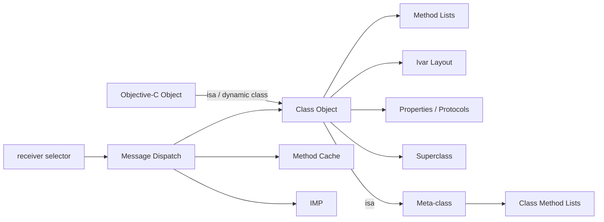
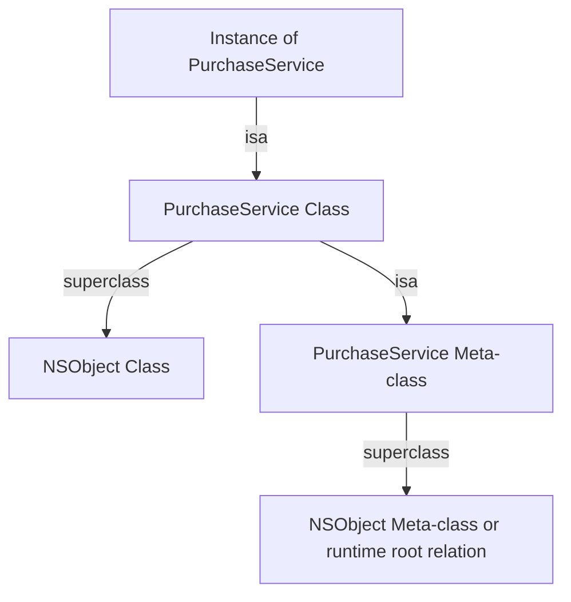
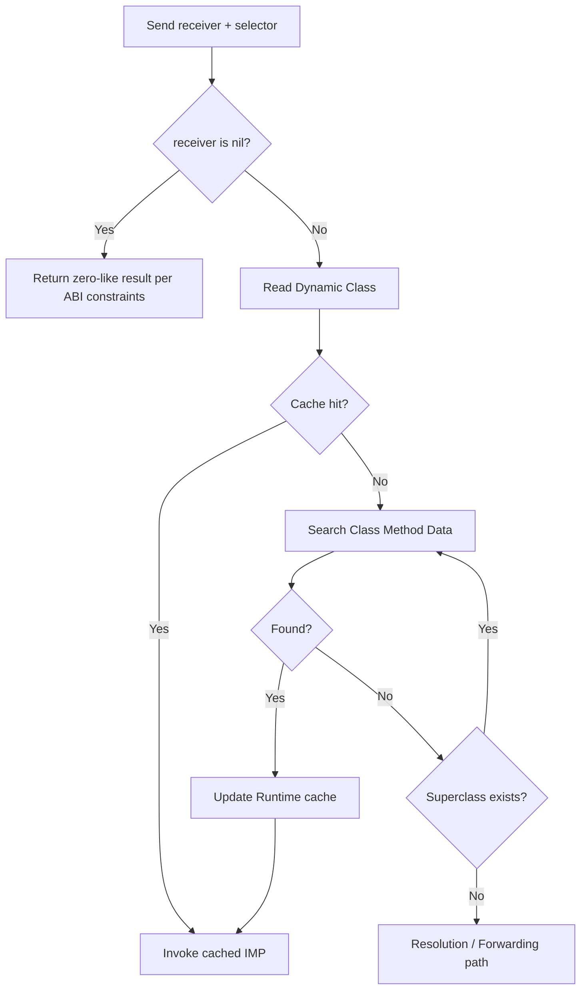
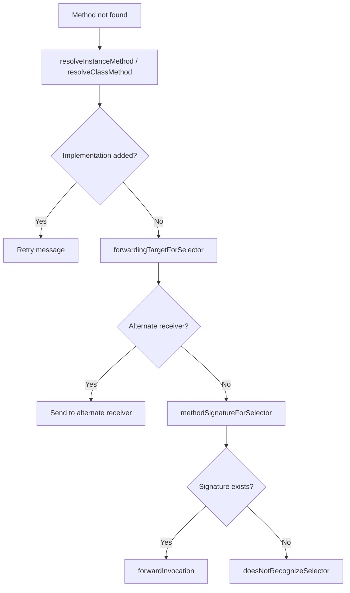
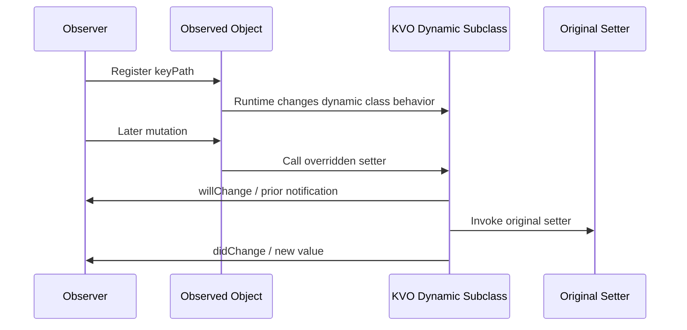
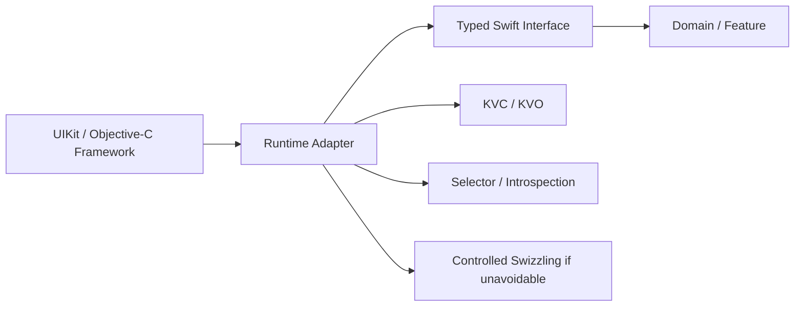

# Objective-C Runtime：从 isa、消息派发到 KVC、KVO 与 Swift 互操作

> Objective-C 方法调用的核心不是“调用一个固定函数”，而是向接收者发送包含 Selector 的消息，由 Runtime 根据对象的动态 Class 查找 IMP。这个动态模型支撑 Category、KVC、KVO、消息转发和大量 Apple Framework 互操作能力，也带来 Swizzling 冲突、字符串 Key 脆弱性、缓存一致性和 Swift 可见性边界。理解 Runtime 的目的不是在业务代码里大量使用黑魔法，而是知道动态能力为何有效、何时失效，以及如何把风险限制在清晰的基础设施边界内。

---

## 一、本文解决什么问题

iOS 开发中经常遇到这些现象：

- Objective-C 的 `[receiver doWork]` 为什么不像 C 函数那样直接绑定地址？
- 每个对象的 `isa` 到底指向什么，Class 自身为什么也是对象？
- Selector、Method 和 IMP 有什么区别？
- Runtime 第一次查找方法与后续调用为什么可能走不同路径？
- Category 为什么能“增加方法”，却不能直接增加普通实例变量？
- Associated Object 是否等同于真正的 Stored Property？
- Method Swizzling 为什么在 Demo 中简单，在大型工程里却容易冲突？
- KVC 如何通过字符串 Key 读写属性，找不到时会发生什么？
- KVO 为什么能观察 Objective-C 属性，Swift `struct` 为什么不行？
- Runtime Introspection 能看到 Swift 的哪些内容？
- Swift 中的 `@objc`、`dynamic`、`NSObject`、Selector 与 Objective-C Runtime 如何协作？

这些问题围绕一条主线：**对象携带动态类型身份，Class 保存方法和布局等运行时信息，消息发送再通过 Selector 找到最终 IMP。**

本文以 Objective-C 公开 Runtime API、Apple 平台行为和 Swift 互操作契约为主。示例在 2026-07-31 使用 Xcode 26.1.1、Apple Clang 17、Apple Swift 6.2.1 验证。Apple 开源 objc4 中的具体函数、Cache 布局、non-pointer `isa` 位分配和锁策略属于版本与架构相关实现；生产代码只能依赖公开 API 与文档保证，源码分析需固定对应 OS/objc4 版本。

### 核心结论

1. Objective-C Object 的首要运行时职责是让 Runtime 能获得 Dynamic Class；教学上常说对象首字段是 `isa`，但现代 Apple Runtime 可能使用经过编码的 non-pointer `isa`，其位布局不是公共 ABI。
2. Class Object 描述实例的类型，Meta-class 描述 Class Object 的类型；实例方法在 Class 侧查找，Class Method 在 Meta-class 侧查找。
3. Selector（`SEL`）标识方法名/调用形状，IMP 是可执行实现入口，Method 是 Runtime 对方法记录的抽象；三者不能混为一谈。
4. Objective-C Message Dispatch 根据接收者动态 Class 与 Selector 找实现，通常先检查 Cache，再查 Method List 和 Superclass；具体汇编与内部函数会随架构和系统版本变化。
5. Method Cache 优化重复查找，但它是 Runtime 内部设施。业务代码不能依赖 Cache 布局，也不能通过直接改内存维护一致性。
6. Category 可在装载过程中把方法、协议等信息附加到既有 Class，但不能像原类声明那样安全增加实例存储布局；同名方法冲突的胜出顺序不应作为业务契约。
7. Associated Object 是由 Runtime 维护的外部关联存储，具有指定关联策略，但不等价于真正 Ivar；生命周期、线程安全、复制语义和清理仍需单独设计。
8. Swizzling 修改 Class 的 Selector 到 IMP 映射，会影响全局调用行为。初始化时机、继承、重复交换、签名兼容和多库冲突都必须治理。
9. KVC 是基于 Key/KeyPath 的间接访问协议，遵循特定查找规则并可能直接访问 Ivar；字符串错误通常在运行时暴露。
10. KVO 是观察变更通知机制。在经典 Objective-C 自动 KVO 中，Runtime 常通过动态子类和 Setter 覆写实现通知；具体内部 Class 名称与实现不是公共契约。
11. Runtime Introspection 可以枚举公开 Runtime 可见的 Class、Method、Property、Ivar 和 Protocol 信息，但不等于能完整还原源码、泛型或纯 Swift 类型系统。
12. Swift 只有进入 Objective-C 互操作边界的声明才能使用 Selector、KVC/KVO 或消息派发；纯 Swift Value Type、Actor、Generic 和多数 Swift-only 声明不能被 Objective-C Runtime 等价表达。

---

## 二、对象、Class 与消息：先建立全景



需要区分四种东西：

- **Object Instance**：保存实例状态，并能让 Runtime 确定动态 Class；
- **Class Object**：描述实例布局、实例方法、协议等类型信息；
- **Meta-class**：描述 Class Object，承载 Class Method 派发；
- **Runtime**：管理类型注册、消息查找、动态修改、关联对象和反射 API。

Class 在 Objective-C 中既是类型描述，也是可以接收消息的对象。向实例发送消息从 Class Object 查实例方法；向 Class 发送消息则沿 Meta-class 体系查 Class Method。

---

## 三、`isa` 与 Class Object

Objective-C 对象必须让 Runtime 知道“我实际是什么类型”。教学模型通常写成：

```objc
struct objc_object {
    Class isa;
};
```

这个模型适合理解动态类型入口，但不应直接等同于现代 Runtime 的真实内存实现。

### 3.1 Pointer `isa` 与 non-pointer `isa`

早期或概念模型中，`isa` 可直接视为 Class Pointer。现代 Apple Runtime 在受支持架构上可能使用 non-pointer `isa`：一个 Machine Word 除编码 Class 信息外，还可能携带引用计数或对象状态相关位。

稳定结论只有：

- Runtime 能从对象取得 Dynamic Class；
- `object_getClass` 等公开 API 应优先于手工读取内存；
- 位宽、Mask、Shift 和附加 Flag 取决于 objc4、架构与 OS 版本；
- Pointer Authentication 等平台安全机制也可能影响底层 Pointer 表示。

错误做法：

```objc
// 错误：把对象首个机器字直接当成可移植 Class Pointer。
Class cls = *(Class *)(__bridge void *)object;
```

正确做法：

```objc
Class cls = object_getClass(object);
```

### 3.2 实例、Class 与 Meta-class 链



图用于解释职责，不表示所有 Root Meta-class Pointer 关系的精确内存图。Meta-class 根关系属于 Runtime ABI 实现细节，应针对具体 objc4 版本查证。

### 3.3 Class Object 保存什么

从公开 Runtime 能力看，Class 关联的信息包括：

- Class Name 与 Superclass；
- Instance Size 和 Ivar 描述；
- Instance Method 与 Class Method；
- Property Metadata；
- Adopted Protocol；
- Dynamic Method Resolution 和消息转发能力；
- Runtime 内部 Cache、Flags 与已附加 Category 数据。

公开 API 暴露的是可查询或修改的抽象，不保证与内部 `class_ro_t`、`class_rw_t` 等具体结构一一对应。引用这些 objc4 类型时必须标注版本。

---

## 四、Method List：Class 如何描述方法

方法记录至少需要把 Selector 与实现入口关联起来，并保存 Objective-C Type Encoding 等调用信息。

```objc
@interface PurchaseService : NSObject
- (BOOL)submitOrder:(NSString *)orderID error:(NSError **)error;
@end
```

Runtime 可查询方法：

```objc
Method method = class_getInstanceMethod(
    PurchaseService.class,
    @selector(submitOrder:error:)
);

SEL selector = method_getName(method);
IMP implementation = method_getImplementation(method);
const char *encoding = method_getTypeEncoding(method);
```

### 4.1 Method、SEL 与 IMP

| 概念 | 含义 | 是否可直接执行 |
|---|---|---|
| `SEL` | Selector，Runtime 中的方法标识 | 否 |
| `IMP` | Method Implementation，函数入口 | 可以，但必须使用兼容函数签名 |
| `Method` | Runtime 方法记录抽象 | 通过 API 读取/修改 |

Selector 不包含某个 Class 的实现。多个 Class 可以对同一 Selector 提供不同 IMP，这正是动态多态的基础。

### 4.2 Objective-C Type Encoding

Runtime Method Metadata 会记录返回值和参数的编码。编码用于反射、消息转发和调用适配，但不是完整源码类型系统：Nullability、泛型参数、Swift Ownership/Concurrency 等信息不能都由经典 Objective-C Encoding 表达。

### 4.3 Method List 不是业务有序集合

Runtime API 可以复制方法列表：

```objc
unsigned int count = 0;
Method *methods = class_copyMethodList(PurchaseService.class, &count);

for (unsigned int index = 0; index < count; index++) {
    NSLog(@"%@", NSStringFromSelector(method_getName(methods[index])));
}

free(methods);
```

必须释放带 `copy` 语义的返回缓冲区。不要依赖枚举顺序代表源码声明顺序，也不要认为它包含所有继承方法；`class_copyMethodList` 返回该 Class 自身暴露的列表，继承查找需另行沿 Superclass 处理。

---

## 五、Selector 与 IMP：消息名称如何映射到代码

Selector 通常由方法名及其冒号结构标识：

```objc
SEL noArgument = @selector(refresh);
SEL twoArguments = @selector(moveFrom:to:);
```

`moveFrom:to:` 中的两个冒号反映两个显式参数位置。Selector 本身不包含静态参数类型重载，因此 Objective-C 不能像 Swift 那样仅凭参数类型区分同名方法。

### 5.1 IMP 的调用约定

概念上，Objective-C 方法实现包含两个隐藏参数：接收者和 Selector。

```objc
id implementation(id self, SEL _cmd, id argument);
```

如果从 Runtime 取得 IMP 并直接调用，必须转换为与真实方法 ABI 完全兼容的函数指针：

```objc
typedef BOOL (*SubmitOrderIMP)(id, SEL, NSString *, NSError **);

IMP raw = method_getImplementation(method);
SubmitOrderIMP call = (SubmitOrderIMP)raw;
BOOL success = call(service, @selector(submitOrder:error:), orderID, &error);
```

错误的返回值、参数、Struct ABI 或 Calling Convention 会造成未定义行为。现代业务代码通常不应手写 IMP 调用；确需使用时必须固定签名并覆盖目标架构测试。

### 5.2 `methodForSelector:` 的边界

`methodForSelector:` 可以获取对象对 Selector 的 IMP，用于高频已知签名调用，但会绕过后续动态替换/转发语义，并要求严格函数签名。优化前应先 Profile；普通调用应优先保持消息语义。

---

## 六、Message Sending：一条消息如何找到实现

Objective-C 源码：

```objc
[service submitOrder:orderID error:&error];
```

编译后概念上类似：

```objc
objc_msgSend(service, @selector(submitOrder:error:), orderID, &error);
```

这只是解释模型。实际编译器会根据返回类型、架构 ABI、`super` 调用、优化和 Pointer Authentication 选择适当入口或直接优化，不能机械改写生产代码。

### 6.1 消息查找主路径



关键路径：

1. 判断接收者并取得 Dynamic Class；
2. 尝试 Method Cache；
3. 查找当前 Class 的方法数据；
4. 沿 Superclass 继续；
5. 未找到时进入 Dynamic Resolution 与 Forwarding；
6. 找到 IMP 后执行并可能更新 Cache。

Runtime 内部可能将多个步骤合并在汇编和 C/C++ 实现中。图表达语义阶段，不对应固定函数调用栈。

### 6.2 向 `nil` 发送消息

Objective-C 允许向 `nil` 发送消息，通常得到零值/空结果而不执行实现：

```objc
PurchaseService *service = nil;
BOOL success = [service submitOrder:@"A-100" error:nil]; // NO
```

但不能把“任何返回类型都安全”绝对化。返回 ABI、较大 Struct、浮点或平台规则存在边界，现代代码应避免依赖复杂返回值的 `nil` 消息行为。

更重要的是，静默返回可能掩盖初始化和依赖注入错误。对于必须存在的服务，应使用 Nullability、断言、显式错误或 Swift Optional 处理。

### 6.3 `super` 不是给另一个对象发消息

`[super doWork]` 的 Receiver 仍是当前 `self`，只是方法查找从当前 Class 的 Superclass 开始。它不会创建或替换接收者。

---

## 七、方法未找到：Resolution 与 Forwarding

当普通查找失败时，Runtime 提供动态补救链路。常见阶段包括：

1. Dynamic Method Resolution；
2. Fast Forwarding；
3. Full Message Forwarding；
4. 最终无法处理时抛出 Unrecognized Selector 异常。



### 7.1 Dynamic Method Resolution

```objc
+ (BOOL)resolveInstanceMethod:(SEL)selector {
    if (selector == @selector(dynamicAction)) {
        class_addMethod(self, selector, (IMP)dynamicAction, "v@:");
        return YES;
    }
    return [super resolveInstanceMethod:selector];
}
```

实现函数必须符合 Encoding，注册过程需要幂等并考虑并发。大多数业务需求使用普通方法、组合或 Dependency Injection 更清晰。

### 7.2 Fast Forwarding

`forwardingTargetForSelector:` 可把消息交给另一个对象，适合简单代理，但不能返回 `self` 形成循环。

### 7.3 Full Forwarding

`methodSignatureForSelector:` 提供调用签名，Runtime 构造 `NSInvocation`，再由 `forwardInvocation:` 检查、修改或转发。它功能更强，也更慢、更动态且更难静态检查。

代理、埋点和兼容层使用转发时，必须明确未知 Selector、返回值初始化、异常路径和线程安全。

---

## 八、Method Cache：为什么重复消息更快

如果每次消息都扫描 Method List 和 Superclass，动态派发成本会更高。Runtime 为 Class 维护方法查找缓存，将常用 Selector 映射到 IMP。

概念上：

```text
Class Cache {
  selector -> implementation
}
```

实际 objc4 Cache 常使用高度优化的 Hash Table/Mask/Probe 策略，并针对不同架构实现快速汇编路径。Bucket 布局、扩容、回收和并发算法不是公开契约。

### 8.1 Cache 的作用边界

- Cache 通常属于 Class，而不是每个对象；
- 命中后避免完整 Method List/Superclass 查找；
- 首次发送、Class 动态修改或 Cache 失效时可能进入慢路径；
- Runtime 修改 Method Mapping 时需要维护缓存一致性；
- 业务代码不能保存内部 Bucket Pointer 或假设固定容量。

### 8.2 Cache 不等于业务 Memoization

Method Cache 只缓存“Selector 对应哪个 IMP”，不缓存方法返回值，也不跳过方法执行。它与图片缓存、网络缓存或函数结果缓存完全不同。

### 8.3 派发性能应如何验证

不要用“有 Cache 所以与 C 一样快”或“动态查找所以很慢”下结论。优化器可能直接调用/内联，Runtime Cache 可能命中，真实热点还可能由 ARC、锁和业务逻辑主导。

验证需要：

- Release/Profile 配置；
- 目标真机与固定 OS；
- 等价实现与足够迭代；
- 消费返回值，防止 Dead Code Elimination；
- Instruments 和汇编/SIL 共同确认调用形态；
- 同时观察 Code Size 与可维护性。

---

## 九、Category：在不改原类源码时增加行为

Category 可以为既有 Class 添加方法、Protocol Conformance 和 Property Declaration：

```objc
@interface UIViewController (Analytics)
- (void)app_trackScreenView;
@end

@implementation UIViewController (Analytics)
- (void)app_trackScreenView {
    // ...
}
@end
```

### 9.1 Category 如何生效

Category Metadata 随 Mach-O Image 装载。Runtime 在 Class Realization/加载过程中把 Category 的方法、属性和协议信息附加到目标 Class 的运行时数据。

“附加”不意味着修改了原始源码，也不保证内部总是复制成一张新表。具体组织方式属于 objc4 版本实现。

### 9.2 为什么 Category 不能直接增加普通 Ivar

既有 Class 的 Instance Layout 已被编译进对象分配、Subclass Layout 和客户端代码。Category 若任意扩大实例内存，会破坏已存在对象和 ABI，因此不支持像原 Class 声明那样增加 Ivar。

Category 中声明 Property 不会自动获得 Stored Property：

```objc
@interface UIViewController (Analytics)
@property (nonatomic, copy) NSString *app_screenName;
@end
```

仍需手工实现 Getter/Setter，常见方案是 Associated Object。

### 9.3 同名方法冲突

Category 可以提供与原类或其他 Category 同 Selector 的方法。最终哪一个实现可见会受到链接、镜像加载和 Runtime 附加顺序影响，不应作为可靠 Override 机制。

工程规则：

- Category 方法加组织/模块 Prefix；
- 不覆盖系统私有或公共方法；
- 不依赖多个 Category 同名方法顺序；
- Framework 发布前扫描 Selector 冲突；
- 扩展行为优先使用组合和显式 Adapter。

---

## 十、Associated Object：外部关联存储

Associated Object 允许把额外对象与某个 Objective-C Object 关联：

```objc
static const void *ScreenNameKey = &ScreenNameKey;

- (void)setApp_screenName:(NSString *)screenName {
    objc_setAssociatedObject(
        self,
        ScreenNameKey,
        screenName,
        OBJC_ASSOCIATION_COPY_NONATOMIC
    );
}

- (NSString *)app_screenName {
    return objc_getAssociatedObject(self, ScreenNameKey);
}
```

### 10.1 Key 必须稳定且唯一

常见 Key 方案包括静态变量地址或私有 Selector。不要用可能冲突的普通字符串地址，也不要使用生命周期不稳定的临时 Pointer。

### 10.2 Association Policy

常见策略表达 `assign`、`retain`、`copy` 以及 Atomic/Nonatomic 语义。需要注意：

- Policy 只描述关联存储层如何持有值；
- `atomic` 不让被关联对象内部状态线程安全；
- `nonatomic` 不等于整个复合读改写操作安全；
- `assign` 不提供 Swift `weak` 等价的自动清零语义；
- `copy` 是否正确取决于值是否实现所需复制行为。

### 10.3 生命周期与清理

关联值通常随 Host Object 销毁而释放，也可通过传入 `nil` 移除单个关联。`objc_removeAssociatedObjects` 会清除该对象所有关联，可能破坏其他 Framework 的数据，不应作为普通清理手段。

Associated Object 可能造成 Retain Cycle：

```text
host -> associated closure -> host
```

Closure 捕获 `self` 时仍需 Weak/Unowned 或显式解除，不能因为存储来自 Runtime 就忽略 ARC。

### 10.4 与 Stored Property 的差异

Associated Object：

- 不属于实例固定 Layout；
- 需要 Runtime Side Table/Map 类机制管理；
- 访问成本和可发现性不同；
- 不自动参与 Swift Codable、Memberwise Initialization 或 Value Semantics；
- 在不支持 Objective-C 关联对象的平台/类型上不可用。

高频核心状态应放在明确的类型存储中，Associated Object 更适合兼容层、UI Adapter 和无法修改原类的窄场景。

---

## 十一、Method Swizzling：全局修改派发映射

Swizzling 通常交换两个 Selector 对应的 IMP：

```objc
Method original = class_getInstanceMethod(
    UIViewController.class,
    @selector(viewDidAppear:)
);
Method replacement = class_getInstanceMethod(
    UIViewController.class,
    @selector(app_viewDidAppear:)
);

method_exchangeImplementations(original, replacement);
```

交换后，向 `viewDidAppear:` 发送的消息会进入替换实现。替换方法内调用 `app_viewDidAppear:`，在正确交换后通常会回到原实现。

### 11.1 为什么直接交换并不稳健

如果目标 Class 没有自己的方法，而是继承自 Superclass，直接交换取得的 Method 可能修改或依赖继承层行为。常见稳健模式会先尝试 `class_addMethod`，成功时再用 `class_replaceMethod` 安装原实现；失败才交换当前 Class 已有实现。

但即使使用标准模板，也不能消除所有冲突。

### 11.2 Swizzling 的主要风险

1. **全局影响**：一个交换会改变该 Class 所有实例；
2. **初始化时机**：调用发生在交换前后会产生不同结果；
3. **重复执行**：交换两次可能恢复原状或形成错误链；
4. **继承边界**：误改 Superclass 或影响 Subclass；
5. **签名不兼容**：参数、返回值、ABI 不一致会导致未定义行为；
6. **多库冲突**：多个 SDK 交换同一 Selector，调用链取决于安装顺序；
7. **系统演进**：被交换方法的内部语义和调用方式可能随 iOS 改变；
8. **绕过路径**：直接 IMP、Swift 静态派发或已内联调用不会经过预期 Selector；
9. **调试困难**：Stack Trace 与源码方法名不直观；
10. **审核与隐私**：全局 Hook 系统行为可能造成数据采集和合规风险。

### 11.3 可接受的治理条件

只有在无法使用公开扩展点时才评估 Swizzling，并满足：

- 只交换 Public、文档化且 Objective-C 动态派发的方法；
- 使用唯一 Prefix 的替换 Selector；
- 在明确、线程安全、幂等的初始化点执行一次；
- 验证 Method 存在和 Type Encoding 兼容；
- 正确处理继承方法；
- 多 SDK 共存测试；
- 覆盖各最低/最高支持 iOS；
- 提供关闭开关、日志和回滚方案；
- 不吞掉原实现；
- 在 Release 真机验证行为与性能。

### 11.4 优先替代方案

- Delegate、Notification、Subclass 和 Composition；
- Method Override + `super`；
- Explicit Wrapper/Decorator；
- Dependency Injection；
- URLProtocol、Network Interceptor 等文档化扩展点；
- MetricKit、OSLog、Signpost 等系统观测 API。

Swizzling 应是受控基础设施能力，不应成为普通业务模块的默认扩展方式。

---

## 十二、KVC：通过 Key 间接访问对象状态

Key-Value Coding（KVC）让代码通过字符串 Key 或 KeyPath 访问 Objective-C 对象属性：

```objc
[user setValue:@"Alice" forKey:@"name"];
NSString *name = [user valueForKey:@"name"];
```

### 12.1 Getter 查找概念

对 `valueForKey:@"name"`，KVC 会按文档规定的 Accessor 和 Ivar 规则查找。典型候选包含 Getter 形式以及在允许直接 Ivar 访问时的若干命名变体。

具体完整顺序应以当前 Foundation KVC 文档为准。工程上应记住：

- 优先通过 Accessor；
- `+accessInstanceVariablesDirectly` 允许时可能直接访问 Ivar；
- 找不到时调用 `valueForUndefinedKey:`，默认抛出异常；
- Setter 找不到时调用 `setValue:forUndefinedKey:`；
- 给非对象标量设置 `nil` 会进入 `setNilValueForKey:`。

### 12.2 KVC Collection Operators

KVC 还支持 Collection Operators，例如聚合或数组映射。但字符串 KeyPath 缺少编译期安全，值类型和 `nil` 处理有特定规则。生产代码应覆盖空集合、`NSNull`、数字精度与异常路径。

### 12.3 KVC 的风险

- Key 拼写错误只在运行时暴露；
- 重命名工具可能无法更新字符串；
- 可能绕过类型系统与访问封装；
- Undefined Key 默认是 Objective-C Exception，Swift `do/catch` 不能直接捕获；
- 直接 Ivar 访问可能绕过 Setter 中验证和副作用；
- 外部输入不能未经白名单直接变成 KVC KeyPath，避免越权读取/写入对象状态。

对 Swift 代码优先使用编译期 KeyPath：

```swift
func read<Value>(
    _ keyPath: KeyPath<User, Value>,
    from user: User
) -> Value {
    user[keyPath: keyPath]
}
```

Swift KeyPath 与 Foundation 字符串 KVC 可在部分 `NSObject` 属性上桥接，但不是同一个机制，也不是所有 Swift KeyPath 都可转换为 KVC String。

---

## 十三、KVO：对象变化如何被观察

Key-Value Observing（KVO）建立在 KVC-compatible Property 和 Objective-C 动态派发能力上。

Swift 示例：

```swift
import Foundation

final class DownloadState: NSObject {
    @objc dynamic var progress: Double = 0
}

final class DownloadController {
    private var observation: NSKeyValueObservation?

    func observe(_ state: DownloadState) {
        observation = state.observe(
            \.progress,
            options: [.initial, .new]
        ) { state, change in
            print(change.newValue ?? state.progress)
        }
    }

    deinit {
        observation?.invalidate()
    }
}
```

Block-based Observation Token 的生命周期必须被持有；释放或 `invalidate()` 后停止观察。具体线程回调语义取决于属性在哪里被修改，不能假设自动切到 Main Thread。

### 13.1 自动 KVO 的概念实现

经典 Objective-C 自动 KVO 常可概念化为：

1. 首次观察对象某 Key；
2. Runtime 创建/复用动态 Subclass；
3. 覆写被观察 Property 的 Setter；
4. 调整对象的动态 Class Identity；
5. Setter 前后发送 Change Notification；
6. Observer 收到 Old/New/Prior 等信息。



动态 Subclass 名称、`isa` 处理、Notification 细节和优化属于 Foundation/Runtime 实现，不是公共 API。不要通过检测私有 Class Name 实现业务逻辑。

### 13.2 自动通知与手动通知

依赖属性的标准 Setter 通常可自动产生通知。非 Setter 修改、To-many Relationship 或聚合状态可能需要：

- 定义 Dependent Key；
- 使用 KVC Mutable Collection Proxy；
- 手动调用 `willChangeValue`/`didChangeValue`；
- 或改用显式状态流。

手动通知必须严格成对，即使异常/提前返回也不能失衡。

### 13.3 KVO 的生命周期风险

旧式 `addObserver:forKeyPath:...` API 需要严格配对移除，重复移除或遗漏可能造成崩溃。现代 Swift 优先使用 `NSKeyValueObservation` Token，并明确：

- Observer 和 Observed Object 谁持有 Token；
- Token 何时失效；
- Closure 是否强捕获 Owner；
- 回调线程如何切换；
- 对象销毁与并发修改是否竞态；
- `.initial` 回调是否会在初始化阶段触发业务副作用。

### 13.4 KVO 与现代 Swift 状态观察

KVO 适合 `NSObject`/Objective-C Framework 互操作，例如 `NSOperation`、`Progress` 或历史 Cocoa API。纯 Swift/SwiftUI 状态可优先考虑 Observation、Combine、AsyncSequence 或显式 Store，但需按部署版本和生命周期选型。

不要为了统一技术栈把所有 Objective-C API 强行包装成 KVO，也不要让 KVO 字符串路径渗透业务核心。

---

## 十四、Runtime Introspection：运行时能看到什么

公开 Runtime API 可查询：

- 已注册 Class；
- Class Name、Superclass、Instance Size；
- Method、Property、Ivar 和 Protocol；
- 对象动态 Class；
- Selector 是否响应；
- Protocol Conformance；
- Method Implementation 和 Type Encoding。

```objc
Class cls = PurchaseService.class;

NSLog(@"class: %s", class_getName(cls));
NSLog(@"super: %s", class_getName(class_getSuperclass(cls)));
NSLog(@"size: %zu", class_getInstanceSize(cls));

BOOL responds = class_respondsToSelector(
    cls,
    @selector(submitOrder:error:)
);
```

### 14.1 `isKindOfClass:` 与 `isMemberOfClass:`

- `isKindOfClass:` 检查自身或 Superclass 链；
- `isMemberOfClass:` 只检查精确动态 Class；
- KVO 等 Runtime 动态 Subclass 会让精确 Class 判断更脆弱；
- 业务能力判断通常优先 Protocol/`respondsToSelector:`，而不是硬编码 Class Name。

### 14.2 `respondsToSelector:` 的边界

它适合 Optional Objective-C Protocol Method 和动态能力探测，但存在时间与转发边界：Class 可能在 Resolution 阶段动态添加方法，Proxy 也可能通过 Forwarding 处理消息。能力探测与实际调用应尽量靠近，避免并发修改。

### 14.3 枚举 Runtime 数据的内存管理

许多 `class_copy...List` API 返回由调用者 `free` 的 C Buffer。需要检查 `count`、空 Pointer，并避免在热路径反复全量枚举。结果可按应用需求缓存，但若运行中动态注册/修改 Class，缓存需要失效策略。

### 14.4 反射不是完整源码恢复

Runtime Metadata 通常不包含：

- 原始实现源码；
- 全部 Local Variable 和注释；
- Swift Generic Constraint 的完整高层语义；
- 被优化消除或纯 Swift、未暴露 Objective-C 的所有成员；
- 编译器内部类型信息的稳定公共布局。

Runtime Introspection 适合 Adapter、Debug Tool、Serialization Compatibility 和 Framework Integration，不应替代明确 Schema 与静态类型。

---

## 十五、Swift 与 Objective-C 互操作边界

Swift 可以与 Objective-C 深度互操作，但不是所有 Swift 能力都能进入 Objective-C Runtime。

### 15.1 什么可以暴露给 Objective-C

常见可互操作声明包括：

- 继承 `NSObject` 的 Swift Class；
- Objective-C 可表示的方法参数和返回类型；
- 标记 `@objc` 的 Method/Property；
- `@objc protocol`；
- `@objc` Enum（受 Raw Type 等规则限制）；
- Objective-C Compatible Block/Closure；
- 可桥接 Foundation 类型。

实际导出规则受 Access Control、Generic、Throws、Async、Actor Isolation、Tuple、Struct/Enum 和 Swift 版本影响，应以生成的 `ModuleName-Swift.h` 与编译器诊断验证。

### 15.2 常见不可直接表达的 Swift 能力

- 普通 Swift `struct` Stored Property 与 Value Semantics；
- 带 Associated Type 的 Swift Protocol；
- 一般 Generic Function/Generic Type 的完整模型；
- `some`/`any` 的全部类型语义；
- Swift-only Enum Associated Value；
- Actor Isolation 与 `Sendable` 契约；
- Swift Error、Typed Throws、Async 的全部原生语义；
- Ownership、Borrowing、Consuming 等调用约束。

编译器可能为部分 `async`/`throws` API 生成 Objective-C Bridge，但桥接后的 Completion Handler/NSError 形状与 Swift 原始语义不同，必须检查生成 Header。

### 15.3 `@objc`、`dynamic` 与 `NSObject`

```swift
final class PlayerController: NSObject {
    @objc dynamic private(set) var state: PlayerState = .idle

    @objc func pause() {
        // Selector 可见，但是否需要 dynamic 取决于调用需求
    }
}
```

- `NSObject` 提供 Objective-C Object/Runtime 基础；
- `@objc` 让兼容声明具有 Objective-C Entry/Selector；
- `dynamic` 保留动态消息派发语义，常用于 KVO 或 Runtime Replacement；
- 继承 `NSObject` 不意味着每个 Swift Method 自动对 Objective-C 可见或走 `objc_msgSend`；
- `final` 与 `dynamic` 解决不同问题，不能只凭 `final` 推断调用一定被静态化。

### 15.4 Selector 的编译期安全

Swift 应优先使用 `#selector`：

```swift
button.addTarget(
    self,
    action: #selector(handleTap(_:)),
    for: .touchUpInside
)

@objc private func handleTap(_ sender: UIButton) {
    // ...
}
```

`#selector` 让编译器校验声明是否可暴露和签名是否匹配，比手写字符串更安全，但目标对象是否在运行时响应仍需满足 Framework 契约。

### 15.5 Swift Extension 与 Objective-C Category

Swift Extension 可为类型增加 Method、Computed Property 和 Conformance，但不能增加 Stored Property。为 Objective-C Class 编写 Swift Extension 时，符合互操作条件的方法可能暴露给 Runtime；具体推断规则取决于 Swift 版本和 Attribute。

不要把 Swift Extension 的静态派发规则、Protocol Extension 行为和 Objective-C Category 的 Runtime 附加机制混为一谈。

### 15.6 跨语言错误与异常

- Objective-C `NSError **` 可桥接为 Swift `throws`；
- Swift `Error` 可桥接为 `NSError`，但具体 Domain/Code/UserInfo 要设计稳定；
- Objective-C Exception 用于程序员错误/Runtime 异常，不会被 Swift `do/catch` 普通捕获；
- 不应让 KVC Undefined Key 或 Unrecognized Selector 穿越业务边界；
- Completion Handler、Cancellation 和 Actor/Main Thread 语义需要适配层显式处理。

---

## 十六、工程实践：把 Runtime 能力限制在边界层

### 16.1 推荐分层



Runtime Adapter 负责：

- Selector 和 Objective-C Protocol；
- KVC/KVO 生命周期；
- `NSError` 与 Swift `Error` 转换；
- Thread/Queue/Actor 切换；
- Associated Object Key 和清理；
- Runtime 版本兼容与 Feature Flag；
- 将动态失败转成 Typed Result。

业务层只依赖明确的 Swift Protocol/Value，不直接散布字符串 Key、IMP Cast 和 Swizzling。

### 16.2 Runtime Hook 发布检查

1. 确认没有公开替代 API；
2. 固定被 Hook 的 Class、Selector 和方法签名；
3. 检查实例方法与 Class Method 是否选对 Class/Meta-class；
4. 处理继承、重复安装和并发；
5. 验证多个监控 SDK 共存；
6. 保留原实现和错误回退；
7. 添加启停开关与版本白名单；
8. 在最低与最新支持 iOS 真机测试；
9. 检查隐私采集与 App Store 合规；
10. 记录安装日志和崩溃诊断信息。

### 16.3 KVO 生命周期模板

```swift
@MainActor
final class ProgressViewModel {
    private var observation: NSKeyValueObservation?

    func bind(to progress: Progress) {
        observation?.invalidate()
        observation = progress.observe(
            \.fractionCompleted,
            options: [.initial, .new]
        ) { [weak self] progress, change in
            let value = change.newValue ?? progress.fractionCompleted
            Task { @MainActor [weak self] in
                self?.render(value)
            }
        }
    }

    private func render(_ value: Double) {
        // 更新可观察状态
    }

    deinit {
        observation?.invalidate()
    }
}
```

示例显式处理旧 Token、Weak Capture、回调线程与释放。真实代码还要处理绑定对象切换时的过期回调和业务取消。

### 16.4 动态能力的安全边界

- 不将外部 JSON Field 直接用作任意 KVC KeyPath；
- 不允许服务端下发 Selector 并任意执行；
- Runtime 枚举结果不得视为授权依据；
- Associated Object 不存放明文密钥或 Token；
- Swizzling 采集参数前进行数据最小化和用户授权；
- Debug Introspection 功能不得无控制进入 Release。

---

## 十七、常见误区与错误案例

### 17.1 `isa` 永远是一个裸 Class Pointer

错误。现代 Runtime 可能编码 non-pointer `isa`，具体位布局随架构和系统演进。使用公开 API 获取 Class。

### 17.2 Class Method 存在普通 Class 的实例方法列表中

错误。向 Class Object 发送消息时由 Meta-class 体系承载 Class Method 派发。

### 17.3 Selector 就是函数地址

错误。Selector 标识消息名称；不同 Class 可为同一 Selector 提供不同 IMP。

### 17.4 Method Cache 会缓存返回结果

错误。它缓存 Selector 到 IMP 的查找，不缓存业务执行结果。

### 17.5 Category 可以安全覆写原类方法

错误。同名方法会形成全局冲突，结果受加载与附加顺序影响，不是可靠 Override 契约。

### 17.6 Associated Object 等于新增 Stored Property

错误。它是外部关联存储，不改变实例固定 Layout，也不自动获得类型系统、初始化和线程安全保证。

### 17.7 Swizzling 模板正确就没有风险

错误。模板只能处理部分继承和交换问题，无法消除多 SDK 冲突、系统版本变化、签名错误和全局副作用。

### 17.8 KVC 找不到 Key 会返回 `nil`

错误。默认会进入 Undefined Key 处理并抛出 Objective-C Exception，不是 Swift Optional 的普通 `nil` 路径。

### 17.9 KVO 回调一定在 Main Thread

错误。通知通常与变更发生线程相关；UI 更新应显式切换到 Main Actor/主线程。

### 17.10 继承 `NSObject` 后所有 Swift 成员都可被 Runtime 枚举

错误。只有满足 Objective-C 互操作和暴露规则的声明进入相应 Runtime Metadata；纯 Swift Generic、Value Type 和语言特性不能完整表达。

### 17.11 Swift `do/catch` 可以捕获 KVC Exception

错误。Swift Error 与 Objective-C Exception 是不同机制。应通过 Key 白名单、能力检查和 Objective-C Adapter 避免异常，而不是依赖 `do/catch`。

---

## 十八、测试与验证方法

### 18.1 消息派发验证

- 为基类/子类覆写、`super` 调用和 Class Method 分别写测试；
- 用 `class_getInstanceMethod`、`method_getImplementation` 记录交换前后 IMP；
- 验证不存在 Selector、Dynamic Resolution 和 Forwarding 路径；
- 在 arm64 真机 Release 下查看汇编，确认是否保留 `objc_msgSend`。

### 18.2 Category 与 Swizzling 冲突测试

- 随机化或改变 Framework Link/Load 组合；
- 同时启用多个 APM/Analytics SDK；
- 重复调用安装函数验证幂等；
- 构造 Subclass 未覆写/已覆写两种情况；
- 检查原实现恰好执行一次；
- 对异步、抛错式回调和 Reentrant Call 建立测试；
- 在 Feature Flag 关闭后确认行为恢复。

### 18.3 Associated Object 测试

- 验证 `retain`/`copy`/`assign` 语义；
- Host 释放后检查关联值释放；
- 构造 Closure Retain Cycle 并用 Memory Graph 验证修复；
- 并发读写用 Thread Sanitizer 检查，但不要把 TSan 无报告视为线程安全证明；
- 验证不同 Framework Key 不冲突。

### 18.4 KVC/KVO 测试

- 正确 Key、错误 Key、`nil` 到 Scalar；
- Setter 与直接 Ivar 访问差异；
- `.initial`、`.old`、`.new`、`.prior` Options；
- Token 提前释放、重复绑定和对象销毁；
- Background Mutation 与 Main Actor UI 更新；
- Manual Notification 成对性；
- To-many Relationship 变化；
- Swift/Objective-C 双向调用和生成 Header。

### 18.5 版本矩阵

Runtime 与 Foundation 行为应至少覆盖：

- 最低支持 iOS 与最新 iOS；
- 当前发布 Xcode/Swift；
- arm64 真机，不能只测模拟器；
- Debug 与 Release；
- 开启/关闭优化和 Link-time Optimization 的发布配置；
- 动态 Framework/静态链接等实际集成方式。

---

## 十九、总结

Objective-C Runtime 真正需要记住的是对象、类型和消息之间的协作：

1. 对象通过 `isa` 语义关联 Dynamic Class；现代 non-pointer `isa` 的具体位布局不是公共契约。
2. Class Object 承载实例方法等信息，Meta-class 承载 Class Method 派发；Method List 把 Selector、IMP 和 Type Encoding 关联起来。
3. 消息发送通常先查 Cache，再查当前 Class 与 Superclass，未找到时进入 Resolution 和 Forwarding。
4. Selector 是消息标识，IMP 是实现入口，Method 是 Runtime 记录；直接调用 IMP 必须严格匹配 ABI。
5. Category 增加行为但不能扩展实例固定 Layout，同名方法冲突不可依赖。
6. Associated Object 提供外部关联存储，不等价于真正 Stored Property，仍需处理 ARC、线程安全和清理。
7. Swizzling 修改全局方法映射，只有在没有公开扩展点且具备完整治理、测试和回滚时才应使用。
8. KVC 通过 Key 间接访问对象，KVO 观察 KVC-compatible 变化；字符串错误、异常、线程和生命周期必须显式管理。
9. Runtime Introspection 只能看到 Runtime 可见 Metadata，不能完整还原 Swift 类型系统和源码。
10. Swift 通过 `NSObject`、`@objc`、`dynamic`、Selector 与 Bridge 进入 Objective-C 世界，纯 Swift 类型和并发/泛型语义存在明确边界。
11. 最稳健的工程方式是把动态能力集中在 Adapter/Infrastructure 层，为业务提供 Typed Swift Interface。

---

## 问答复盘

### Q1：Objective-C Object 的 `isa` 解决什么问题？

**答：** 它让 Runtime 能确定对象的 Dynamic Class，从而查找方法、布局和类型信息。现代实现可能编码 non-pointer `isa`，不能手工假设其位布局。

### Q2：Class 与 Meta-class 的核心区别是什么？

**答：** Class Object 描述实例并承载实例方法派发；Meta-class 描述 Class Object，并承载 Class Method 派发。

### Q3：Selector、Method 和 IMP 有什么区别？

**答：** Selector 标识消息名称，IMP 是可执行函数入口，Method 是关联 Selector、IMP 和 Type Encoding 的 Runtime 方法记录。

### Q4：消息第一次找不到方法时是否立即崩溃？

**答：** 不一定。Runtime 还可能经过 Dynamic Resolution、Fast Forwarding 和 Full Forwarding；全部无法处理后才进入 Unrecognized Selector 路径。

### Q5：Method Cache 为什么不会改变方法语义？

**答：** Cache 只加速 Selector 到 IMP 的定位，仍执行同一实现。Runtime 在方法映射变化时负责维护缓存一致性。

### Q6：为什么 Category Property 没有自动存储？

**答：** Category 不能改变既有 Class 的 Instance Layout。Property Declaration 只声明 Accessor，需要手工实现，常用 Associated Object 提供外部存储。

### Q7：Swizzling 最容易被忽略的工程风险是什么？

**答：** 多个 Framework 可能交换同一 Selector，最终调用链依赖安装顺序；即使单个 Swizzling 模板正确，组合后仍可能重复、漏调或递归。

### Q8：KVC 的错误 Key 为什么不能用 Swift `do/catch` 处理？

**答：** Undefined Key 默认触发 Objective-C Exception，而 Swift `do/catch` 处理的是 Swift Error。应在边界层验证 Key 并避免异常发生。

### Q9：KVO 回调更新 UI 时应注意什么？

**答：** 回调不保证自动位于 Main Thread，应显式切换 Main Actor；同时持有并释放 Observation Token，避免过期回调和 Closure Retain Cycle。

### Q10：继承 `NSObject` 是否足以让 Swift Property 支持 KVO？

**答：** 不足。Property 还需满足 Objective-C/KVC 兼容并采用动态派发，常见写法是 `@objc dynamic`；具体限制以当前编译器诊断为准。

---

## 延伸知识

- **Mach-O 与 dyld**：Category、Class 和 Selector Metadata 如何随 Image 装载并被 Runtime 注册。
- **Swift 调用派发**：Class vtable、Witness Table、Existential、Devirtualization 与 `@objc dynamic`。
- **ARC 与对象生命周期**：Side Table、Weak Reference、Associated Object 和 `dealloc` 协作。
- **Apple 平台观察机制**：KVO、Combine、Observation、NotificationCenter 与 AsyncSequence。
- **运行时安全**：Pointer Authentication、Code Signing、Private API 风险与 Runtime Hook 检测。
