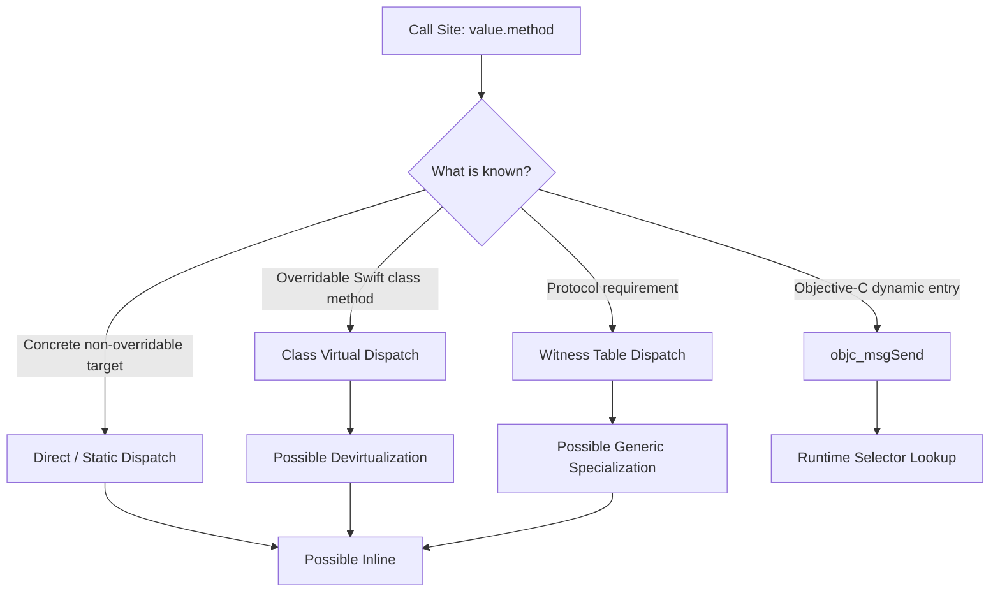
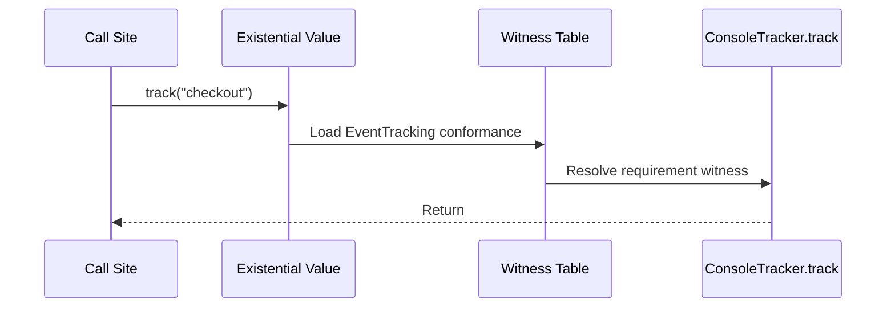
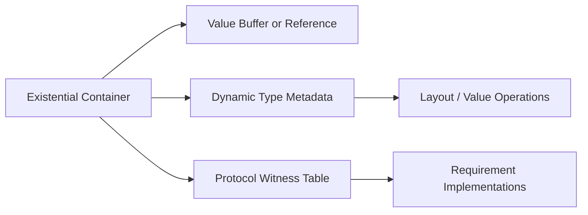
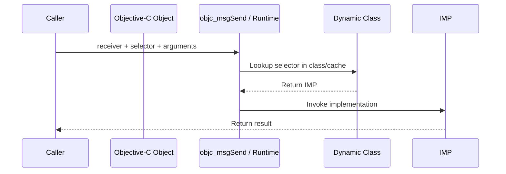
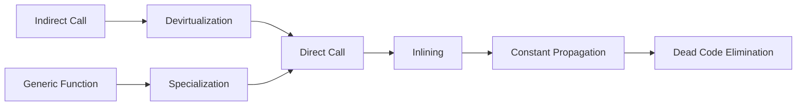

# Swift 类型与调用派发：从静态调用、Witness Table 到 Existential

> Swift 中写下 `service.fetch()`，并不能仅凭这一行判断最终如何调用。编译器可能直接调用已知函数，也可能经过 Class vtable、Protocol Witness Table 或 Objective-C Runtime 查找实现；优化后，间接调用还可能被去虚拟化、内联或泛型特化。派发方式由类型信息、声明位置、互操作要求、可见性和优化上下文共同决定，而不是简单由 `struct`、`class` 或 `protocol` 单独决定。

---

## 一、本文解决什么问题

iOS 工程中经常出现这些困惑：

- `struct` 方法是否一定是静态派发？
- `final` 为什么可能提升优化机会，却不等于“必然更快”？
- Protocol Extension 中的同名方法为什么没有表现出多态？
- Generic Constraint 与 `any Protocol` 都能接收协议类型，底层成本为什么不同？
- Witness Table、Protocol Witness 与 Existential Container 分别是什么？
- Swift Class 方法何时走 vtable，何时走 Objective-C `objc_msgSend`？
- `@objc`、`dynamic`、`final` 和 `NSObject` 继承之间是什么关系？
- 编译器为什么有时能把间接调用优化成直接调用？
- Metadata 是否只是“类型名称和大小”？
- ABI Stability 与 Module Stability 如何限制跨模块优化和库演进？

这些问题的共同主线是：**调用点掌握多少静态类型信息，运行时又需要通过什么数据结构找到正确实现。**

本文以 Swift 公开语言语义、ABI 文档和编译器通用架构为依据。示例与命令在 2026-07-31 使用 Xcode 26.1.1、Apple Swift 6.2.1 验证。SIL 指令、Metadata 布局、优化 Pass 和 Objective-C 互操作细节可能随工具链、平台与部署目标变化；除公开 ABI/语言契约外，不应把某个版本的观察结果当作永久实现保证。

### 核心结论

1. Dispatch（派发）解决的是调用点如何定位实现。直接调用、Class vtable、Protocol Witness Table 和 Objective-C Message Dispatch 是不同机制。
2. Static Dispatch 在编译期可确定目标，通常具有较强的内联和消除机会；但“语法上可直接调用”不保证最终机器码一定保留独立函数调用。
3. Swift Class 的可覆写方法通常需要 Virtual Dispatch；`final`、可见性和 Whole-module Optimization 可能让编译器证明唯一目标并去虚拟化。
4. Protocol Requirement 的具体实现由 Conformance 记录关联，调用可通过 Witness Table 找到 Protocol Witness；协议扩展中未声明为 Requirement 的方法不获得同样的动态派发语义。
5. 泛型 `T: Protocol` 保留具体类型参数，编译器可能生成共享实现并传入 Metadata/Witness Table，也可能特化为具体类型；不能把所有泛型调用都描述为“零成本静态派发”。
6. `any Protocol` 是 Existential Type。其值需要保存负载以及解释负载所需的类型信息和 Conformance 信息；小值是否内联、引用类型如何表示属于布局与 ABI 边界。
7. Objective-C Message Dispatch 通过 Selector 和接收者的动态 Class 查找 IMP，支持 Objective-C Runtime 的动态能力，但优化边界与纯 Swift 调用不同。
8. `@objc` 表示暴露 Objective-C 入口，`dynamic` 强制采用动态派发语义；二者相关但不应视为同义词，实际可用性受声明种类和平台互操作规则约束。
9. Inlining、Specialization 和 Devirtualization 是优化结果，不是源码 API 契约。必须在 Release 配置检查 SIL/机器码并用真实负载测量。
10. Type Metadata 支撑泛型、反射、内存布局和值操作等运行时需求；Witness Table 描述某个类型如何满足某个协议，两者职责不同。
11. ABI Stability 解决已编译二进制间的兼容，Module Stability 解决不同编译器版本导入模块；Library Evolution 会为未来演进保留间接层，并影响跨模块优化边界。

---

## 二、调用派发的全景

同一个方法调用语法可能落入不同路径：



需要区分三个层次：

- **语言语义**：哪个实现应该被调用；
- **中间表示**：SIL 如何表达直接引用、Class 方法、Witness Method 或 Objective-C 方法；
- **最终机器码**：优化后是否仍存在间接调用、函数调用甚至完整方法体。

因此“这段 Swift 是哪种派发”通常需要补充条件：静态类型是什么、声明是否可覆写、是否跨 Module、是否启用 Library Evolution、优化配置是什么。

---

## 三、Static Dispatch：编译期已知调用目标

当编译器能在调用点确定唯一实现时，可以采用直接或静态派发。

```swift
struct PriceCalculator {
    func total(subtotal: Decimal, discount: Decimal) -> Decimal {
        subtotal * (1 - discount)
    }
}

let calculator = PriceCalculator()
let price = calculator.total(subtotal: 100, discount: 0.2)
```

`PriceCalculator` 是 Value Type，方法不能被子类覆写。编译器通常能直接引用 `total` 的实现，并进一步判断是否内联。

### 3.1 常见静态派发场景

- `struct`、`enum` 的具体类型方法；
- `final class` 的实例方法；
- Class 中标记为 `final` 的方法；
- `static` Type Method；
- File-private/Private 且能证明不会被覆写或替换的实现；
- 已被优化器去虚拟化的调用；
- 泛型特化后目标已知的 Protocol Requirement 调用。

这里的“常见”不是对机器码形态的保证。编译器也可能出于代码体积、调试、动态替换或跨模块边界保留函数调用。

### 3.2 `static` 与 `class` 方法不是一回事

```swift
class BaseFormatter {
    class func format(_ value: Int) -> String {
        "Base: \(value)"
    }

    static func identifier() -> String {
        "base"
    }
}
```

- `class func` 可被子类覆写，需要保留多态语义；
- `static func` 在 Class 中等价于不可覆写的 Type Method；
- 在 Value Type 中只有 `static`，不存在继承覆写。

### 3.3 `final` 的真正价值

`final` 首先是设计约束：禁止继承或覆写。它也让编译器更容易证明调用目标唯一，从而获得去虚拟化和内联机会。

```swift
final class AnalyticsEncoder {
    func encode(_ event: Event) -> Data {
        // ...
    }
}
```

但不能据此宣称 `final` 一定提升某个百分比性能：

- 优化器可能本来就能证明没有子类覆写；
- 方法可能不在热点路径；
- 内联会增加 Code Size，编译器可能主动拒绝；
- 跨模块可见性和 Library Evolution 会限制分析；
- 真正成本可能来自 I/O、锁、ARC 或分配。

应把 `final` 用于表达正确的继承边界，再通过 Profile 判断是否存在性能收益。

---

## 四、Virtual Dispatch：Class 多态如何找到覆写实现

Class Reference 的动态类型可能是静态类型的子类，因此调用可覆写方法时，不能总在编译期固定为基类实现。

```swift
class PaymentProcessor {
    func authorize(amount: Decimal) async throws {
        fatalError("Subclass must implement")
    }
}

final class ApplePayProcessor: PaymentProcessor {
    override func authorize(amount: Decimal) async throws {
        // 调用支付 SDK
    }
}

func checkout(using processor: PaymentProcessor) async throws {
    try await processor.authorize(amount: 99)
}
```

`checkout` 只知道静态类型是 `PaymentProcessor`，实际对象可能是 `ApplePayProcessor`。Swift 需要根据动态类型定位正确覆写实现。

### 4.1 vtable 的概念模型

可以把 Swift Class 的虚方法表理解为按方法槽位组织的函数入口集合：


真实 Metadata 和 vtable 布局受 ABI、平台、泛型、弹性规则与编译器版本影响，不能依赖示意图推算内存偏移。

### 4.2 Devirtualization：虚调用不一定留到运行时

如果优化器能证明接收者的具体类型或唯一实现，就可能把虚调用转换为直接调用：

```swift
func submit() async throws {
    let processor = ApplePayProcessor()
    try await processor.authorize(amount: 99)
}
```

可能帮助去虚拟化的信息包括：

- 具体构造类型在调用点可见；
- Class 或方法是 `final`；
- 可见范围内没有其他覆写；
- WMO 提供整个 Module 的分析视野；
- 跨模块实现通过 `@inlinable` 等机制向客户端暴露，但这会引入 API/ABI 维护成本。

“可能”非常重要。去虚拟化属于优化器决策，而非源码承诺。

### 4.3 Class 不等于一定使用 vtable

以下情况可能不是普通 Swift vtable 路径：

- 方法不可覆写并可直接调用；
- 优化器已经去虚拟化；
- 声明使用 Objective-C 动态派发；
- 调用被内联，机器码中不再保留派发；
- Dynamic Replacement 或调试/注入机制改变优化条件。

---

## 五、Protocol Requirement、Witness 与 Witness Table

Protocol 定义行为契约，具体类型通过 Conformance（协议一致性）提供实现。

```swift
protocol EventTracking {
    func track(name: String)
}

struct ConsoleTracker: EventTracking {
    func track(name: String) {
        print(name)
    }
}
```

这里至少有三个不同对象：

- **Protocol Requirement**：`EventTracking.track(name:)` 这项要求；
- **Protocol Witness**：`ConsoleTracker.track(name:)` 作为满足要求的具体实现；
- **Witness Table**：描述 `ConsoleTracker: EventTracking` Conformance，并将 Requirement 关联到 Witness 的表/记录。

### 5.1 Witness Table Dispatch

当调用点只通过 Protocol 抽象使用值时，需要从对应 Conformance 找到实现：

```swift
func sendEvent(using tracker: any EventTracking) {
    tracker.track(name: "checkout")
}
```

概念调用链：



实际代码可能被编译器打开 Existential、去虚拟化或内联，因此机器码未必保留完整间接链。

### 5.2 Witness 可能是 Thunk

Protocol Requirement 的抽象调用约定与具体方法实现未必完全一致。Witness Table 中的入口可能不是业务方法本身，而是一个 Thunk（适配函数），负责调整参数、返回值、所有权或调用约定后再进入具体实现。

Thunk 是编译器生成适配层的统称，具体生成条件和命名不属于稳定源码契约。

### 5.3 Conformance 通常在声明后确定

一个 Type 对某 Protocol 的 Conformance 会选择相应 Witness。不能把 Witness Table 想象成每个实例各自持有的一张业务方法表；它描述的是类型与协议之间的一致性关系，可被多个值共享。

---

## 六、最容易踩坑：协议要求与协议扩展方法

下面两种写法看起来相近，派发语义却不同。

### 6.1 方法是 Protocol Requirement

```swift
protocol DataSource {
    func load() -> String
}

extension DataSource {
    func load() -> String { "default" }
}

struct RemoteDataSource: DataSource {
    func load() -> String { "remote" }
}

let source: any DataSource = RemoteDataSource()
print(source.load()) // remote
```

`load` 是 Requirement，`RemoteDataSource.load` 被选为 Witness。通过 `any DataSource` 调用时仍能获得 Conformance 对应实现。

### 6.2 方法只存在于 Protocol Extension

```swift
protocol Cacheable {}

extension Cacheable {
    func cacheKey() -> String { "default" }
}

struct UserProfile: Cacheable {
    func cacheKey() -> String { "user-profile" }
}

let concrete = UserProfile()
let abstract: any Cacheable = concrete

print(concrete.cacheKey()) // user-profile
print(abstract.cacheKey()) // default
```

`cacheKey` 不是 `Cacheable` Requirement，因此 `UserProfile.cacheKey` 不是该协议要求的 Witness。通过静态类型 `any Cacheable` 解析时，只能选择协议扩展中可见的实现。

### 6.3 工程规则

如果希望 Conforming Type 自定义行为并在 Protocol 抽象下保持多态，应先把方法声明为 Protocol Requirement，再在 Extension 中提供 Default Implementation：

```swift
protocol Cacheable {
    func cacheKey() -> String
}

extension Cacheable {
    func cacheKey() -> String { "default" }
}
```

这是 API 语义问题，不应依赖强制转换回具体类型补救。

---

## 七、泛型派发：共享实现与 Specialization

泛型函数保留具体类型参数：

```swift
func record<T: EventTracking>(_ tracker: T, event: String) {
    tracker.track(name: event)
}
```

调用 `record(ConsoleTracker(), event: "checkout")` 时，`T` 是 `ConsoleTracker`。但“知道类型参数”不等于编译器总为每种 `T` 复制一份机器码。

### 7.1 共享泛型实现

编译器可以生成一份共享 Generic Implementation，并在调用时传入必要的 Type Metadata 和 Witness Table。函数通过这些运行时参数操作未知的 `T`。

概念模型：

```text
record<T>(
  tracker,
  event,
  T metadata,
  T: EventTracking witness table
)
```

这不是稳定源码调用签名，而是理解泛型运行机制的模型。

### 7.2 Generic Specialization

当具体类型和实现对优化器可见时，编译器可能生成专门版本：

```text
record<ConsoleTracker>(tracker, event)
```

特化后可以：

- 消除部分 Metadata/Witness Table 间接访问；
- 将 Protocol Requirement 调用变为直接调用；
- 继续内联具体实现；
- 常量传播并删除不可达分支。

但特化也会增加代码体积。编译器会在运行成本、编译时间和 Code Size 之间取舍。

### 7.3 跨模块边界

客户端默认看不到库内函数体时，跨模块特化和内联机会会受限。`@inlinable` 可以把实现序列化到 Module Interface 供客户端优化，但意味着函数体中引用的声明需要满足可见性约束，并把更多实现细节纳入兼容责任。

`@usableFromInline` 可让 Internal Declaration 被 `@inlinable` 代码引用，但这些符号由此承担额外 ABI 约束。不能为了“也许更快”大面积添加这两个 Attribute。

---

## 八、Existential Type 与 Existential Container

从 Swift 5.7 起，`any Protocol` 显式表示 Existential Type，`some Protocol` 表示 Opaque Result Type。二者都使用协议描述能力，但语义不同。

```swift
func makeTracker() -> some EventTracking {
    ConsoleTracker()
}

func storeTracker(_ tracker: any EventTracking) {
    tracker.track(name: "stored")
}
```

- `some EventTracking`：调用者不知道具体类型，但定义方为该声明选择一个固定底层类型；
- `any EventTracking`：值可以在运行时装入任意符合协议的具体类型。

### 8.1 Existential Container 保存什么

概念上，Existential Value 需要保存：

- 具体值或指向具体值的引用；
- Dynamic Type Metadata；
- 相关 Protocol Conformance 的 Witness Table。



经典 Swift ABI 讲解常用“3 个机器字 Inline Buffer + Metadata + Witness Table”的普通单协议 Existential 模型。但实际表示会因平台 ABI、Class-bound Protocol、Protocol Composition、Move-only/所有权特性和编译器演进而变化。业务代码不得依赖字数和偏移。

### 8.2 Inline 与 Box

较小且满足布局条件的 Value 可能直接存入 Container 的 Inline Buffer；较大或布局不合适的值可能需要 Box/间接存储。Reference Type 的表示路径又不同。

因此 `any Protocol` 的潜在成本可能包括：

- 间接调用；
- Container 复制和销毁；
- 对较大值的分配或引用管理；
- 动态打开 Existential；
- 阻碍部分跨调用点优化。

这些都是可能成本，不是每次调用固定发生。优化器可能消除 Container、打开 Existential 或直接内联。

### 8.3 泛型、`some` 与 `any` 如何选择

| 表达方式 | 类型关系 | 适合场景 | 主要代价/限制 |
|---|---|---|---|
| `T: P` | 调用者决定具体 `T` | 算法、强类型组合、潜在特化 | 泛型传播、Code Size、API 复杂度 |
| `some P` | 定义方选择固定隐藏类型 | 返回值封装实现且保留类型同一性 | 单个声明需保持同一底层类型 |
| `any P` | 运行时可装入不同符合类型 | 异构存储、运行时替换、边界解耦 | Container、间接派发与能力限制 |

不要仅以“哪种最快”选择 API。还要比较生命周期、异构需求、可测试性、二进制边界和调用者复杂度。

---

## 九、Type Metadata：运行时如何理解未知类型

泛型代码和 Existential 在编译时可能不知道具体类型的完整布局，因此需要 Type Metadata 提供运行时信息或访问入口。

Metadata 可能支持这些工作：

- 类型种类与标识；
- Size、Alignment、Stride 等布局信息或相关访问；
- Value Witness Table，用于初始化、复制、移动和销毁值；
- Generic Argument 与相关类型信息；
- Class 继承、方法与运行时交互所需数据；
- 反射和 Dynamic Cast；
- 枚举、Tuple、Function 等类型的运行时描述。

### 9.1 Value Witness Table 与 Protocol Witness Table 不同

这两个名称容易混淆：

| 结构 | 回答的问题 |
|---|---|
| Value Witness Table | 一个未知布局的值如何分配、复制、移动、销毁，大小和对齐是什么 |
| Protocol Witness Table | 某个具体类型如何满足某个 Protocol Requirement |

前者服务值的通用内存操作，后者服务协议一致性和行为调用。

### 9.2 Metadata 不等于 Swift Reflection API

`Mirror` 等公开 API 可以提供受支持的反射能力，但 Metadata 的内部字段和 Pointer Layout 不是普通 App 可依赖的公共反射接口。直接解析内部 Metadata 容易随 Swift/Xcode 变化而失效，并可能违反内存安全假设。

---

## 十、Objective-C Message Dispatch

Swift 与 Objective-C 互操作时，部分调用使用 Objective-C Runtime 的消息发送模型。调用点向接收者发送 Selector，Runtime 根据对象的动态 Class 查找对应 IMP（函数实现）。

```swift
import Foundation

class PurchaseObserver: NSObject {
    @objc dynamic func handlePurchase(_ notification: Notification) {
        // ...
    }
}
```

概念调用链：



方法缓存、`isa`、Method List、消息转发和 Swizzling 属于下一篇 Objective-C Runtime 模块。这里关注派发边界。

### 10.1 `@objc` 与 `dynamic`

- `@objc`：让声明拥有 Objective-C Runtime 可识别的入口/Selector，用于 Target-Action、Selector、KVC/KVO 或 Objective-C 调用等互操作场景；
- `dynamic`：要求调用保留动态派发语义，避免编译器将其按普通静态/虚调用提前固定；在 Apple 平台的 Objective-C 互操作场景中通常与 Objective-C Dispatch 相关；
- `NSObject` 子类：提供 Objective-C 对象模型基础，但不是所有 Swift 方法都因此自动采用消息派发；
- `final`：禁止覆写，但若声明明确要求动态能力，不能简单用“final 等于直接调用”推断最终路径。

不同 Swift 版本对 `@objc` 推断和可标注声明有限制，应以当前编译器诊断为准。

### 10.2 什么时候确实需要 Objective-C 动态能力

- UIKit/AppKit 传统 Target-Action；
- 需要 Selector 的 Timer、Notification 或 Runtime API；
- KVC/KVO 兼容路径；
- Objective-C Framework 暴露/调用 Swift API；
- 明确依赖消息转发、Method Swizzling 或 Runtime Introspection 的基础设施。

不应仅为“保险”给大量方法添加 `@objc dynamic`。这会扩大 Objective-C 可见面、限制优化，并把代码耦合到 Runtime 行为。

---

## 十一、Dynamic Replacement：在运行时替换 Swift 实现

Swift 编译器支持 Dynamic Replacement 机制，可让一个函数实现替换另一个被标记为可动态替换的实现。它可被开发工具、预览、注入或特定运行时机制使用。

部分相关语法使用以下形式：

```swift
dynamic func message() -> String {
    "original"
}

@_dynamicReplacement(for: message())
func replacementMessage() -> String {
    "replacement"
}
```

> `@_dynamicReplacement` 带有下划线，表示它不是面向普通应用代码承诺稳定的正式公共 Attribute。示例只用于解释机制；生产代码不应把 underscored Attribute 当作长期兼容 API。

### 11.1 与 Objective-C Swizzling 的区别

- Dynamic Replacement 是 Swift 编译器和运行时协作的替换模型；
- Swizzling 修改 Objective-C Class 的 Method Mapping；
- 二者作用的派发体系不同；
- 都会降低调用目标的静态确定性，影响优化与调试；
- 是否支持跨 Module、泛型、Accessor 或特定声明，属于工具链版本边界。

业务层热更新、线上补丁或 A/B 逻辑不应建立在未稳定的 Dynamic Replacement Attribute 上。应使用明确的 Dependency Injection、Feature Flag 和可回滚发布机制。

---

## 十二、Inlining、Specialization 与 Devirtualization

派发机制描述“如果保留调用，如何找到实现”；优化器则可能改变调用形态。



### 12.1 Inlining

Inlining 将 Callee Body 合入 Caller，可能消除调用开销并暴露更多优化机会。但它会增加 Caller 大小，可能导致 Instruction Cache 压力和编译时间上升。

`@inline(__always)` 和 `@inline(never)` 属于强编译器提示，不能替代 Profile。尤其 `__always` 可能造成代码膨胀，应仅在有测量证据且理解版本边界时使用。

### 12.2 Specialization

Specialization 为具体 Generic Argument 生成专门实现，可能消除 Metadata/Witness Table 间接层，但增加机器码副本。

### 12.3 Devirtualization

Devirtualization 把 Class 或 Protocol 的间接调用转换为已知直接目标。它可能依赖：

- 接收者具体类型；
- `final` 与访问控制；
- WMO；
- Library Evolution 边界；
- `@inlinable` 暴露的实现；
- 优化器的 Whole-program 分析能力。

### 12.4 优化后不能只看源码推断

下面的 Protocol 调用在源码层有 Witness Table 语义，但编译器知道具体类型后，Release SIL 中可能已经是直接调用甚至被完全内联：

```swift
let tracker = ConsoleTracker()
record(tracker, event: "checkout")
```

因此性能文章应表述为“该抽象可能引入某种间接层，当前优化配置下是否保留需检查产物”，而不是把源码结构直接等同于纳秒级成本。

---

## 十三、如何用 SIL 验证派发

准备以下最小样例：

```swift
protocol Worker {
    func run() -> Int
}

struct FastWorker: Worker {
    func run() -> Int { 42 }
}

func existentialCall(_ worker: any Worker) -> Int {
    worker.run()
}

func genericCall<T: Worker>(_ worker: T) -> Int {
    worker.run()
}

final class FinalWorker {
    func run() -> Int { 42 }
}
```

生成 SIL：

```bash
xcrun swiftc -emit-silgen Dispatch.swift > Dispatch.silgen
xcrun swiftc -emit-sil -Onone Dispatch.swift > Dispatch.onone.sil
xcrun swiftc -emit-sil -O Dispatch.swift > Dispatch.optimized.sil
```

可以搜索这些 SIL 术语作为观察入口：

```bash
rg 'function_ref|class_method|witness_method|objc_method|apply' Dispatch.*sil*
```

一般可这样理解：

- `function_ref`：引用已知函数；
- `class_method`：从 Class Dispatch 机制取得方法；
- `witness_method`：通过 Protocol Conformance 取得 Requirement 实现；
- `objc_method`：Objective-C 方法引用相关表示；
- `apply`：执行函数值。

SIL 格式和优化结果不是稳定 API。验证时必须固定：

- Xcode/Swift 版本；
- `-Onone`、`-O` 或 `-Osize`；
- Target Triple 与 SDK；
- 单文件、WMO 与跨 Module 条件；
- Library Evolution 和 Resilience 配置。

不要只看 SILGen 就下结论。SILGen 表示优化前语义，最终优化 SIL 和机器码可能已经消除派发。

---

## 十四、ABI Stability、Module Stability 与 Resilience

类型布局和调用派发不仅影响单个 App，也决定二进制 Framework 能否独立演进。

### 14.1 ABI Stability

ABI（Application Binary Interface）定义已编译代码如何交互，包括但不限于：

- 调用约定与 Name Mangling；
- Runtime Metadata 访问方式；
- Class、Protocol Conformance 与 Witness Table 相关规则；
- Value Layout 和间接访问规则；
- Swift Runtime 的兼容边界。

Apple 平台的 Swift ABI Stability 从 Swift 5 时代建立，但“ABI 稳定”不表示所有 Swift 类型的具体布局都可以被业务代码硬编码，也不表示任意二进制库升级天然兼容。

### 14.2 Module Stability

Module Stability 解决的是：由旧编译器发布的 Swift Module，如何被新编译器导入。Library 可通过稳定文本 `.swiftinterface` 让客户端工具链重建模块。

它不保证：

- 库的新版本与旧版本 API 完全兼容；
- 所有实现细节都能跨模块内联；
- 第三方依赖或部署目标兼容；
- Runtime 行为没有改变。

### 14.3 Resilience 与调用间接层

Library Evolution 允许 Public Type 在兼容规则内演进，例如为非 `@frozen` Public Struct 增加 Stored Property。客户端因此不能总把布局、Enum Case 集合或方法实现永久写死，需要通过 Metadata、Accessor、Thunk 或其他弹性入口获取信息。

这种间接层是二进制演进能力的成本，不应简单称为“编译器没优化好”。发布库时需要在两类目标间取舍：

- App 内部 Module：同一次构建，可追求更充分的跨模块优化；
- 长期分发的二进制 SDK：需要兼容未来工具链和库版本，接受必要弹性边界。

### 14.4 `@frozen` 的边界

对 Public Struct/Enum 使用 `@frozen`，意味着客户端可依赖其布局或 Case 集合进行更积极优化，也意味着未来不能以二进制兼容方式随意增加 Stored Property 或 Enum Case。

它是 API 演进承诺，不是普通性能开关。

---

## 十五、工程实践：如何选择抽象与派发方式

### 15.1 先按语义选择类型

- 值语义、独立复制、无继承需求：优先考虑 `struct`/`enum`；
- 需要 Identity、共享可变生命周期或继承互操作：考虑 `class`；
- 表达多种类型共同能力：使用 `protocol`；
- 需要异构存储或运行时替换：考虑 `any Protocol`；
- 算法保留具体类型关系：考虑 Generic；
- 隐藏返回实现但保持固定底层类型：考虑 `some Protocol`。

不要为了“静态派发更快”把具有共享 Identity 的对象强行改成 Value Type，也不要为了 Mock 给所有对象增加不必要的 Protocol 层。

### 15.2 热点路径的判断顺序

1. 在 Release/Profile 真机上确认热点；
2. 区分算法、I/O、分配、ARC、锁和派发成本；
3. 使用 Instruments Time Profiler 等工具观察调用栈；
4. 构造可重复 Benchmark，控制输入和设备状态；
5. 检查优化 SIL/汇编确认间接调用是否真实存在；
6. 比较 Concrete/Generic/Existential 方案的中位数与波动；
7. 同时评估 Code Size、编译时间和 API 维护成本。

没有证据时，派发通常不是业务请求、数据库访问、图像处理或网络流程的首要瓶颈。

### 15.3 Protocol API 设计检查

- 需要动态多态的方法是否明确写成 Requirement；
- Default Implementation 是否只提供合理默认值；
- Associated Type 是否真的表达模型关系；
- 是否为了集合存储才需要 Type Erasure/Existential；
- `any` 是否跨越高频内层循环；
- Protocol 是否过大，导致 Mock 和 Conformance 成本过高；
- Class-only 约束和 Sendable/Actor Isolation 是否符合生命周期；
- Public Protocol 增加 Requirement 是否影响外部 Conformance 的兼容性。

### 15.4 Objective-C 边界要窄

将 `@objc dynamic`、Selector、KVO 和 Swizzling 集中在 Adapter/Infrastructure 层。业务核心保持显式 Swift API，可以减少 Runtime 隐式行为、测试干扰和优化限制。

### 15.5 二进制 SDK 的发布策略

- 明确最低 Xcode/Swift 与 iOS 版本；
- 决定是否启用 Library Evolution；
- 保存 `.swiftinterface` 并执行多工具链 Consumer Build；
- 对 Public API、ABI 和 Symbol 做 Diff；
- 谨慎使用 `@inlinable`、`@usableFromInline`、`@frozen`；
- 验证新增 Protocol Requirement、Enum Case 和 Stored Property 的兼容性；
- 使用 XCFramework 表达平台与架构 Variant；
- 保留 dSYM 和构建清单。

---

## 十六、常见误区与错误案例

### 16.1 `struct` 方法一定没有任何动态成本

错误。具体方法通常可直接派发，但若 Value 被装入 Existential、通过 Generic Shared Code 使用或涉及动态替换，仍可能存在 Metadata、Witness 或 Container 成本；最终应检查优化产物。

### 16.2 Protocol 调用一定比 Class 慢

错误。具体成本取决于是否使用 Existential、是否发生泛型特化、Class 调用能否去虚拟化，以及热点中的分配和 ARC。不能只按抽象类型排序。

### 16.3 Protocol Extension 同名方法会自动覆写默认实现

错误。只有 Protocol Requirement 才通过 Conformance 选择 Witness。Extension-only 方法按静态可见类型解析，不具备相同动态多态语义。

### 16.4 Generic 永远是编译期静态派发

错误。泛型可能使用共享实现并传入 Metadata/Witness Table，也可能被特化。是否消除间接层取决于优化上下文。

### 16.5 `any Protocol` 一定发生 Heap Allocation

错误。小值可能内联，引用类型和优化消除也会改变表示。较大 Value 可能需要 Box，但不能把分配描述成每次必然发生。

### 16.6 `final` 一定提升运行性能

错误。它提供更强语义约束并可能帮助优化；若调用不在热点或优化器已能证明目标，性能可能没有可测变化。

### 16.7 继承 `NSObject` 后所有方法都走 `objc_msgSend`

错误。是否暴露 Objective-C 入口和采用动态消息派发取决于声明、Attribute、Override/互操作需求与优化条件。

### 16.8 `@objc` 与 `dynamic` 完全等价

错误。`@objc` 解决 Objective-C 可见性/入口，`dynamic` 要求动态派发语义。它们经常组合出现，但职责不同。

### 16.9 `@inlinable` 只是性能提示

错误。它把实现暴露给客户端优化，并扩大兼容性责任。实现引用、ABI 和未来重构都会受到约束。

### 16.10 ABI Stable 等于所有 Swift 二进制库永久兼容

错误。ABI Stability 只是基础平台能力。库仍需遵守 API/ABI 演进规则、Module Stability、Deployment Target 与依赖兼容要求。

---

## 十七、测试与验证方法

### 17.1 语义测试

为 Protocol Requirement、Default Implementation 和 Extension-only 方法分别建立测试，使用 Concrete、Generic 和 `any` 三类调用点验证结果，避免派发认知错误演变为业务 Bug。

### 17.2 SIL 对比

在 `-Onone` 与 `-O` 下生成 SIL，记录 `function_ref`、`class_method`、`witness_method` 是否在优化后改变。再将声明拆到独立 Module，比较跨模块边界。

### 17.3 性能 Benchmark

如果派发确实位于高频内层循环：

- 使用 Release 优化；
- 在目标真机运行；
- 避免把对象构造、随机数和日志混入测量区；
- 设置足够迭代次数，但避免编译器把结果完全消除；
- 消费并校验输出；
- 比较 Concrete、Generic、Existential、Class 等价实现；
- 同时记录 Binary Size 和 Compile Time；
- 多次采样，报告中位数和分布，不只报告最佳值。

### 17.4 二进制兼容测试

对 Library Evolution 场景：

1. 用旧版本库编译 Consumer；
2. 不重新编译 Consumer，仅替换兼容的新库运行；
3. 用新 Xcode 从 `.swiftinterface` 编译 Consumer；
4. 检查 Public Struct/Enum/Protocol 演进；
5. 验证 Objective-C Header、Symbol、Crash Symbolication 和 Deployment Target。

Module Compatibility 与 Runtime Binary Compatibility 是两项测试，不能只做其中一项。

---

## 十八、总结

Swift 类型与调用派发需要建立一套分层认识：

1. Static Dispatch 在调用点已知唯一实现，Virtual Dispatch 为 Class 覆写保留动态选择，Objective-C Dispatch 通过 Selector 和 Runtime 找 IMP。
2. Protocol Requirement 通过 Conformance 关联到 Protocol Witness，Witness Table 是 Requirement 到实现的关键桥梁。
3. Protocol Extension 中未声明为 Requirement 的方法不具备同样的多态语义，这是最常见的协议派发陷阱。
4. Generic 可使用共享实现加 Metadata/Witness Table，也可被 Specialize；`any Protocol` 通过 Existential Container 保存动态值与类型/一致性信息。
5. Type Metadata 支撑未知类型的布局、值操作、泛型和反射；Value Witness Table 与 Protocol Witness Table 职责不同。
6. `@objc`、`dynamic`、Class vtable 和 Dynamic Replacement 属于不同动态机制，不能只凭一个关键字推断全部调用路径。
7. Devirtualization、Inlining 和 Specialization 可消除间接层，但它们是优化结果，不是源码承诺。
8. ABI Stability、Module Stability 与 Library Evolution 共同决定二进制库能否跨运行时、工具链和版本演进，并会形成必要优化边界。
9. 工程选择应先满足语义、生命周期和 API 演进，再用 Release 真机 Profile 验证派发是否真是瓶颈。

---

## 问答复盘

### Q1：Static Dispatch 与 Virtual Dispatch 的根本区别是什么？

**答：** Static Dispatch 在编译期能确定唯一实现；Virtual Dispatch 需要根据对象动态类型选择覆写实现。优化器若证明目标唯一，可把后者去虚拟化。

### Q2：Protocol Witness 是什么？

**答：** 它是具体类型用于满足某项 Protocol Requirement 的实现，必要时可能通过编译器生成的 Thunk 适配调用约定。

### Q3：为什么 Protocol Extension 的同名方法有时没有多态效果？

**答：** 如果方法没有声明为 Protocol Requirement，就不会进入该 Conformance 的 Witness 选择；通过协议静态类型调用时会解析到 Extension Implementation。

### Q4：Generic `T: P` 是否总比 `any P` 快？

**答：** 不一定。Generic 可能被特化，也可能使用共享实现和 Witness Table；Existential 也可能被优化器打开和消除。应结合 API 语义和真实 Benchmark 选择。

### Q5：Existential Container 为什么需要 Type Metadata？

**答：** Container 需要在运行时知道其中具体类型，并据此解释布局、复制/销毁值、执行 Dynamic Cast 或取得相关 Conformance。

### Q6：Value Witness Table 与 Protocol Witness Table 有什么区别？

**答：** Value Witness Table 描述未知布局值如何复制、移动、销毁及其布局；Protocol Witness Table 描述具体类型如何实现协议要求。

### Q7：`final` 能否保证机器码是直接调用？

**答：** 不能保证。它禁止覆写并提高直接调用/内联机会，但动态替换、跨模块边界、优化配置和 Code Size 决策仍会影响最终产物。

### Q8：`@objc dynamic` 的工程代价是什么？

**答：** 它把调用放入 Objective-C 动态能力边界，扩大 Runtime 可见面并限制部分静态优化。只应在 Selector、KVO、Objective-C 互操作等真实需求处使用。

### Q9：为什么 `@inlinable` 会成为兼容性承诺？

**答：** 因为客户端编译器可以看到并嵌入函数体，函数所引用的实现细节和 ABI 入口需要在未来版本继续满足已编译客户端。

### Q10：如何验证某次 Protocol 调用最终是否仍经过 Witness Table？

**答：** 固定工具链、Target 和优化配置，比较 SILGen、优化 SIL 与必要时的汇编；只看源码或 `-Onone` 结果不能代表 Release 机器码。

---

## 延伸知识

- **Objective-C Runtime**：`isa`、Class Object、Method Cache、Selector、IMP、消息转发与 Swizzling。
- **Swift 所有权**：Borrowing、Consuming、Copyable、Value Witness 与 ARC 优化。
- **泛型系统**：Associated Type、Generic Signature、Same-type Requirement 与特化策略。
- **二进制库演进**：Resilience、`@frozen`、`@inlinable`、XCFramework 与 ABI Diff。
- **性能验证**：SIL、LLVM IR、Mach-O、Instruments Time Profiler 与 Code Size 分析。
