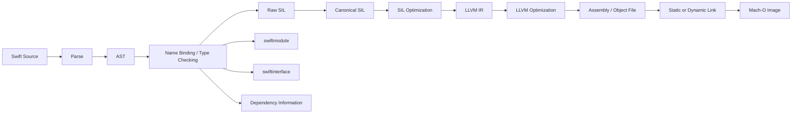
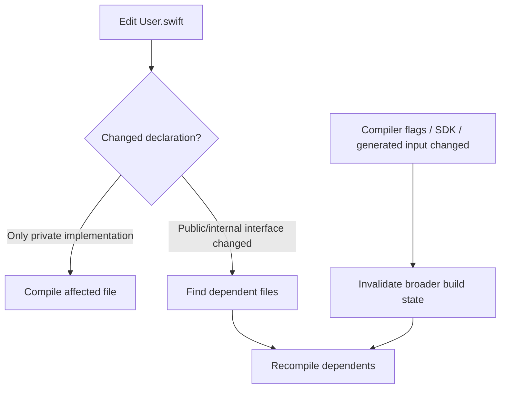

# Swift 编译管线：从 Source、SIL 到机器码与增量构建

> Swift 代码并不是从 `.swift` 文件直接变成 App。编译器需要解析和类型检查源码，生成 Swift Intermediate Language（SIL），再降级为 LLVM IR 与目标机器码；模块产物、链接策略和 Build Settings 又共同决定编译速度、可优化范围、调试体验与最终二进制。理解这条管线，才能正确处理“为什么改一行却重编很多文件”“为什么 Debug 正常而 Release 出错”“为什么二进制 Framework 无法被新编译器导入”等工程问题。

---

## 一、本文解决什么问题

iOS 工程中常见这些现象：

- 修改一个 Swift 文件后，多个文件被重新编译；
- Debug 构建很快，Archive 明显更慢；
- 某段代码在 Debug 可断点调试，Release 中却被内联或直接消除；
- 打开 Whole-module Optimization（WMO）后运行性能可能改善，但增量构建收益下降；
- Framework 明明包含 `.swiftmodule`，换一版工具链后仍可能无法导入；
- 同样的源码因 Swift 版本、优化级别、目标架构或编译条件不同而产生不同二进制；
- Release 才出现未定义行为、竞态或依赖断言副作用的问题。

这些问题都指向同一个事实：**Swift 构建不是单一编译动作，而是由前端语义分析、中间表示优化、后端代码生成、模块序列化和链接共同组成的管线。**

本文以 Swift 编译器的公开架构和命令行能力为主。命令在 2026-07-31 使用 Xcode 26.1.1、Apple Swift 6.2.1 验证；具体参数、输出格式、默认优化策略和内部 Pass 会随 Swift/Xcode 版本变化，生产工程应以当前工具链的 `swiftc -help`、构建日志和 Swift 官方文档为准。

### 核心结论

1. Swift Source 会先被解析为语法结构并完成名称解析、约束求解和类型检查，之后才进入 SIL；AST 不是最终可执行代码。
2. SIL 保留 Swift 语义，是 ARC 优化、泛型特化、去虚拟化、内联和所有权分析等优化的重要承载层；Canonical SIL 与 Raw SIL 的约束不同。
3. LLVM IR 已更接近目标无关的底层代码，Swift 高层类型语义大多已经降低；LLVM 继续完成通用优化、指令选择和机器码生成。
4. `.swiftmodule` 是面向特定编译器/目标的序列化模块产物；启用 Library Evolution 时生成的 `.swiftinterface` 是文本模块接口，用于支持跨编译器版本的 Module Stability，不等于 ABI Stability 本身。
5. 增量编译依赖文件间声明与使用关系。改动公共声明、编译参数或宏/生成代码输入，可能扩大失效范围；“只改一行”不保证只编译一个文件。
6. WMO 让编译器看到整个 Swift Module，扩大跨文件优化机会，但通常削弱按文件增量编译的收益。它是优化范围选择，不是无条件更快的开关。
7. LTO 发生在更靠后的链接阶段，面向 LLVM 层跨目标文件优化；WMO 与 LTO 所处层次、可见语义和成本不同，不能互相替代。
8. Debug 与 Release 的差异不只是是否包含调试符号，还包括优化级别、断言、代码布局、生命周期可观察性和编译条件；Release 问题必须在真实优化配置下复现。
9. Build Settings 是编译输入的一部分。Swift 版本、优化模式、架构、部署目标、条件编译、Library Evolution 和链接选项都会影响模块或二进制产物。

---

## 二、从源码到 App：先建立全景

下面是概念管线，不承诺某个 Swift 版本内部每个 Pass 的精确顺序：



关键路径可以分为四层：

- **Swift 前端**：理解 Swift 语法、类型、泛型、协议、所有权和并发语义；
- **SIL 层**：保留足够的 Swift 语义，执行语言特有分析与优化；
- **LLVM 后端**：执行通用优化，将 LLVM IR 降低为目标架构指令；
- **链接与装载产物**：合并目标文件和库，生成 Mach-O；代码签名、dyld 装载属于后续阶段。

编译管线与构建系统也不是同一概念。`swiftc`/Swift Driver 负责规划和调用编译任务，Xcode Build System 还负责资源、Clang/Objective-C、Asset Catalog、代码签名、脚本阶段和依赖 Target 的调度。

---

## 三、Swift Source 与 AST：先证明程序“有意义”

考虑一个订单折扣函数：

```swift
struct Order {
    let subtotal: Double
}

func finalPrice(for order: Order, discountRate: Double) -> Double {
    precondition((0...1).contains(discountRate))
    return order.subtotal * (1 - discountRate)
}
```

源码首先经过词法分析和语法解析，形成 Abstract Syntax Tree（AST，抽象语法树）。AST 表达声明、表达式、语句和类型语法之间的结构关系，而不是简单保存源码文本。

### 3.1 解析成功不等于类型检查成功

下面代码的语法结构可以成立，但类型不合法：

```swift
let quantity = 3
let message = "count: " + quantity // Binary operator '+' cannot combine String and Int
```

Swift 前端还需要完成：

- 名称查找与作用域解析；
- 重载解析；
- 泛型约束求解；
- 类型推断与类型检查；
- 访问控制和可用性诊断；
- 并发隔离等语义检查；
- 生成后续阶段需要的已类型化表示。

复杂表达式可能让约束求解成本上升。因此“编译慢”不一定发生在代码生成阶段，也可能是单个表达式给类型检查器带来过大的搜索空间。工程上应先用编译器诊断或构建时间报告定位，不能仅凭文件大小猜测。

### 3.2 检查 AST

可以在独立样例上查看编译器输出：

```bash
xcrun swiftc -dump-ast Price.swift
```

AST Dump 属于诊断和学习工具，文本格式不是稳定 API，不应让生产脚本依赖其具体排版。

---

## 四、SIL：保留 Swift 语义的中间层

SIL（Swift Intermediate Language）位于类型检查后的 Swift 前端与 LLVM 后端之间。它比 AST 更接近控制流和数据流，又比 LLVM IR 保留更多 Swift 语言语义。

SIL 能显式表达或支持分析这些概念：

- 值与地址的操作；
- 函数应用、方法引用和协议调用；
- 引用计数相关操作；
- 泛型与类型元数据；
- 所有权和借用关系；
- 错误处理控制流；
- 闭包捕获；
- `async` 等语言结构降低后的表示。

### 4.1 Raw SIL 与 Canonical SIL

教学上可以这样区分：

- **Raw SIL**：SILGen 从已类型检查 AST 生成，仍允许一些更接近源语言的非规范形式；
- **Canonical SIL**：经过强制性转换后满足更严格规范，便于后续分析和优化。

具体阶段、所有权形式和 Pass 安排属于版本相关实现。稳定结论是：SIL 为 Swift 特有语义提供了 LLVM IR 之前的分析与变换空间。

### 4.2 为什么 ARC 优化适合在 SIL 层完成

Swift 的 ARC（Automatic Reference Counting）操作不是简单地为每次赋值机械插入一次 retain/release。编译器需要结合所有权、控制流和对象生命周期消除冗余操作、缩短生命周期或移动释放位置。

SIL 仍理解 Swift 的引用和值语义，因此比已经降低到通用底层表示的阶段更适合执行相关分析。不过最终产物中的具体 retain/release 数量不是源码级稳定契约，不能通过 Debug 观察推断 Release 行为。

### 4.3 查看 SIL

```bash
# 生成 SILGen 阶段附近的 SIL
xcrun swiftc -emit-silgen Price.swift > Price.silgen

# 生成 SIL；是否优化由所给优化参数决定
xcrun swiftc -emit-sil -Onone Price.swift > Price.onone.sil
xcrun swiftc -emit-sil -O Price.swift > Price.optimized.sil
```

比较时应固定 Swift 版本、Target Triple、SDK、优化参数和条件编译标志。SIL 语法与内部实现会演进，适合诊断和源码研究，不应作为应用层长期兼容接口。

---

## 五、从 SIL 到 LLVM IR 与机器码

SIL 完成必要变换后，会降低为 LLVM IR。到这一层时，许多 Swift 高层结构已经转换为更底层的函数、内存、控制流和运行时调用。

LLVM 后端负责的典型工作包括：

- 通用数据流和控制流优化；
- Dead Code Elimination（死代码消除）；
- 循环与向量化相关优化；
- 目标架构相关指令选择；
- 寄存器分配；
- 汇编和目标文件生成。

这些只是能力分类，不代表所有优化在每个构建中都会触发。是否生效取决于优化级别、代码形态、目标架构和编译器版本。

### 5.1 检查 LLVM IR、汇编和目标文件

```bash
xcrun swiftc -emit-ir -O Price.swift -o Price.ll
xcrun swiftc -emit-assembly -O Price.swift -o Price.s
xcrun swiftc -c -O Price.swift -o Price.o
```

生成 iOS 目标产物时还必须指定匹配的 SDK、目标架构和部署版本。不要把默认 macOS Target 生成的结果当作 iOS 设备结果。

### 5.2 Machine Code 不等于最终 App

目标文件通常还包含符号、重定位和调试信息。链接器需要解析符号与库依赖，合并 Section，执行 Dead Stripping 或 LTO 等工作，最终生成 Mach-O 可执行文件或动态库。

Mach-O、静态库、动态库、dyld、代码签名和 dSYM 属于相邻但独立的知识模块。本文只强调边界：**编译生成目标文件，链接把目标文件和依赖组织成可装载映像。**

---

## 六、模块产物：`.swiftmodule` 与 `.swiftinterface`

源码文件通常组成一个 Swift Module。其他 Module 要导入它，需要模块对外暴露的声明信息，而不应重新解析全部实现源码。

### 6.1 `.swiftmodule`

`.swiftmodule` 是序列化的二进制模块表示，读取速度快，但通常与编译器版本、目标平台和架构等条件相关。它适合由同一受控工具链构建的 App 内部 Module，却不能单独保证二进制 Framework 被未来 Swift 编译器导入。

### 6.2 `.swiftinterface`

当库开启 Library Evolution（Xcode 中通常对应 `BUILD_LIBRARY_FOR_DISTRIBUTION=YES`）时，工具链可以生成文本形式的 `.swiftinterface`。未来编译器可从接口重新构建适合自身的模块缓存，从而提供 Module Stability。

需要区分：

| 概念 | 解决的问题 | 关键边界 |
|---|---|---|
| ABI Stability | 已编译 Swift 二进制如何与 Swift Runtime/其他二进制交互 | 是二进制调用约定层面的兼容性 |
| Module Stability | 新编译器如何导入旧工具链发布的 Swift Module | 依赖稳定文本接口和重新编译接口 |
| Library Evolution | 库如何为未来二进制兼容演进保留空间 | 可能限制部分跨模块优化并增加间接访问成本 |

`BUILD_LIBRARY_FOR_DISTRIBUTION` 不应为普通 App Target 机械开启。它主要服务需要跨工具链分发的二进制库；团队应评估 API 设计、弹性（resilience）、编译时间、优化机会和发布兼容要求。

### 6.3 接口不是实现，也不是源码保护

`.swiftinterface` 暴露可导入模块所需的公开 API 信息，并可能包含编译属性。它不是完整实现源码，但也不能被视为隐藏 API 形状的安全边界。客户端二进制仍可被分析，敏感信息不能依赖编译产物保密。

---

## 七、增量编译：为什么改一行会重编多个文件

增量编译的目标是复用未受影响的工作，而不是承诺“一次只编译改动文件”。Swift Driver 与构建系统会根据此前记录的依赖信息、输入时间戳/内容和编译参数规划任务。



假设 `CheckoutViewModel.swift` 使用了 `PricingService`：

```swift
// PricingService.swift
struct PricingService {
    func total(for items: [CartItem]) -> Decimal { /* ... */ }
}
```

如果只修改 `total` 的私有实现，依赖文件可能无需重新类型检查；如果修改方法签名、可见成员、泛型约束或协议一致性，使用这些声明的文件就可能失效。

### 7.1 常见失效来源

- 对其他文件可见的声明发生变化；
- `extension`、Operator、Protocol Conformance 改变名称查找结果；
- 编译条件、Swift Language Version、SDK 或 Deployment Target 改变；
- Build Phase 生成的源码或宏实现变化；
- Bridging Header 或 Clang Module 依赖变化；
- Clean Build、Derived Data 被删除或缓存不可复用；
- 构建脚本缺少准确 Input/Output 声明，导致重复执行。

### 7.2 如何观察，而不是猜测

1. 固定 Xcode、SDK、构建配置与机器环境；
2. 保留完整 Build Log，检查实际执行的 Swift Driver/Frontend Job；
3. 分别测量 Clean Build、No-op Build 和典型单文件修改；
4. 用 Xcode Build Timing Summary 或 CI 日志比较 Target、脚本和编译阶段；
5. 对类型检查热点使用当前 Swift 版本支持的诊断选项，并先通过 `swiftc -help` 核实；
6. 修改公共声明前后比较被调度文件数量，不只比较总耗时。

构建时间高度依赖 CPU、内存、并发度、缓存、项目图和代码形态。没有固定环境与样本次数的单次结果不能支撑优化结论。

---

## 八、WMO：扩大 Swift Module 内的优化视野

Whole-module Optimization 让编译器以整个 Swift Module 为优化单元，能看到更多跨文件信息。潜在收益包括跨文件内联、泛型特化、去虚拟化和不可达代码消除机会。

代价同样明确：

- 单次优化需要处理更大的程序范围；
- 按源文件跳过工作的空间通常变小；
- 峰值内存和编译时间可能上升；
- 诊断与调试体验受优化影响；
- 实际收益取决于代码结构，不能保证所有应用更快或更小。

现代 Swift Driver 的批处理、增量与 WMO 具体调度方式会演进，因此不要把“WMO 必然只有一个前端进程”当作稳定结论。工程上应观察构建日志和产物，而不是依据旧版本经验判断。

### 8.1 典型配置选择

- 日常 Debug：优先低优化和可调试性，保留快速迭代；
- Release/Archive：通常启用面向性能的优化，并按工程需求选择 WMO；
- 性能敏感 Framework：通过 Benchmark、包体和编译时间共同验证；
- 大型模块：先考虑拆分职责和稳定依赖边界，不能只靠切换优化开关解决构建问题。

---

## 九、LTO：在 LLVM 与链接层跨目标文件优化

Link-time Optimization（LTO，链接时优化）把部分 LLVM 中间表示保留到链接阶段，使链接器/LLVM 能跨目标文件或库边界进行分析和优化。

WMO 与 LTO 的区别：

| 维度 | WMO | LTO |
|---|---|---|
| 主要层次 | Swift/SIL 优化范围 | LLVM/链接阶段 |
| 典型边界 | 一个 Swift Module | 参与 LTO 的多个目标文件 |
| 可见语义 | 保留更多 Swift 高层语义 | 更底层的 LLVM IR |
| 典型机会 | 泛型特化、去虚拟化、Swift 语义内联 | 跨目标文件内联、全局消除等通用优化 |
| 主要成本 | Module 编译与增量性 | 链接时间、内存与产物处理复杂度 |

LTO 不能恢复已经在前面阶段丢失的 Swift 高层语义，也不一定穿透未参与 LTO、预编译或动态链接的边界。是否使用应以 Archive 耗时、启动/运行 Benchmark、Mach-O 大小、符号化和崩溃回溯质量为验证维度。

---

## 十、Debug 与 Release：差异远不止调试符号

Xcode 模板通常让 Debug 倾向 `-Onone`，Release 倾向 `-O`；实际值应以项目 Build Settings 和展开后的构建日志为准。

### 10.1 优化改变可观察行为

优化构建中可能发生：

- 函数内联，调用栈不再与源码结构一一对应；
- 局部变量被消除、合并或放入寄存器，LLDB 无法完整读取；
- 对象生命周期被缩短或释放位置移动；
- 不可达分支与未使用代码被删除；
- 泛型产生特化版本；
- 调用被去虚拟化；
- 指令重新排列，但必须保持语言允许的可观察语义。

因此调试器中“看不到变量”不等于变量从未存在；Debug 下观察到的析构时机也不能当作 Release 契约。

### 10.2 不要依赖断言副作用

错误示例：

```swift
// 错误：业务状态变化不应藏在只用于调试检查的表达式中。
assert(cache.prepareForReading())
```

正确做法是先执行必要业务逻辑，再独立验证结果：

```swift
let isReady = cache.prepareForReading()
assert(isReady)

guard isReady else {
    throw CacheError.notReady
}
```

不同断言 API 在不同优化配置下的行为并不相同，具体语义应查阅当前 Swift 标准库文档。稳定原则是：`assert`、`precondition` 和 `fatalError` 用于表达程序约束，不应承载必须发生的业务副作用。

### 10.3 为什么问题可能只在 Release 出现

- 数据竞态或未定义行为被不同调度与代码布局放大；
- 生命周期假设错误，优化后对象更早释放；
- `#if DEBUG` 导致逻辑、依赖或配置不一致；
- 只在 Release 开启的 Dead Stripping、WMO/LTO 改变产物；
- 优化暴露编译器 Bug，但应先排除应用自身违反语言/并发约束；
- 测试只覆盖 Debug，没有对 Archive 配置运行关键流程。

正确策略不是关闭优化掩盖问题，而是在相同优化、架构、SDK 和配置下缩小复现样例，检查 SIL/IR 或汇编，并在必要时用当前工具链与最小工程向 Swift/Apple 反馈。

---

## 十一、Build Settings 如何改变产物

Build Setting 不是外围配置，而是编译输入。下面列出常见设置的影响方向；具体 `swiftc` 参数映射应以当次 Xcode Build Log 为准。

| Build Setting | 主要影响 | 工程风险 |
|---|---|---|
| `SWIFT_VERSION` | Swift 语言模式与诊断 | 改变语义检查，不等同于切换编译器二进制 |
| `SWIFT_OPTIMIZATION_LEVEL` | SIL/LLVM 优化策略 | 影响性能、包体、编译时间和调试性 |
| `SWIFT_COMPILATION_MODE` | 增量或 Whole Module 等编译模式 | 影响任务粒度和跨文件优化范围 |
| `BUILD_LIBRARY_FOR_DISTRIBUTION` | Library Evolution 与稳定接口产物 | 不应无差别用于 App Target |
| `IPHONEOS_DEPLOYMENT_TARGET` | 最低系统版本、可用 API 与代码生成约束 | 与实际发布范围不一致会造成兼容问题 |
| `ARCHS` / Target Triple | 指令集与 ABI 目标 | 模拟器与真机产物不能混用 |
| `SWIFT_ACTIVE_COMPILATION_CONDITIONS` | `#if` 条件分支 | Debug/Release 可能编译成不同程序 |
| `OTHER_SWIFT_FLAGS` | 额外前端/驱动参数 | 隐藏参数难审计，升级易失效 |
| Dead Code Stripping / LTO 相关设置 | 链接优化与产物裁剪 | 影响链接耗时、符号和二进制结构 |

### 11.1 `SWIFT_VERSION` 的常见误区

`SWIFT_VERSION` 选择语言兼容模式，不会让 Xcode 内置 Swift 6.2 编译器变成旧版 Swift 编译器。若要验证编译器回归或二进制兼容，必须记录实际 Xcode/Swift Toolchain 版本。

### 11.2 条件编译会生成不同程序

```swift
#if DEBUG
let apiClient: APIClient = DebugAPIClient()
#else
let apiClient: APIClient = ProductionAPIClient()
#endif
```

这不只是“打开日志”，而是两套不同依赖。更稳妥的做法通常是让配置通过注入进入同一代码路径，并在 Release 配置的测试环境执行集成测试。确需条件编译时，应把分支控制在窄边界内。

### 11.3 构建清单必须记录什么

可复现和可审计构建至少应记录：

- Xcode Build 与 Swift Compiler Version；
- SDK、Deployment Target、Target Triple 和架构；
- Build Configuration 与关键 Swift/Linker Flags；
- Source Commit、Dependency Lockfile 和二进制依赖 Hash；
- 代码生成器、Macro Plugin 与 Build Tool Plugin 版本；
- Entitlements、签名身份和 Provisioning Profile 的可追溯标识；
- Archive、dSYM、BCSymbolMap（若当前工具链/平台产生）等发布产物。

---

## 十二、工程实践：建立可诊断的编译流水线

### 12.1 分离开发反馈与发布验证

开发配置追求快速反馈，发布配置追求真实产物质量，两者都必须进入 CI：

1. PR 阶段运行 Debug 或专用测试配置，关注增量构建和单元测试反馈；
2. 主干定期执行 Clean Release/Archive，防止问题只在最终优化配置暴露；
3. 性能测试使用接近 Release 的优化配置和目标真机；
4. 发布候选使用与 App Store 构建一致的 Xcode、SDK、依赖和签名流程；
5. 保存 dSYM、构建日志和版本清单，确保崩溃可以符号化。

### 12.2 优化编译时间的顺序

1. 测量 Clean、Incremental、No-op 三类构建；
2. 区分 Swift 编译、Clang、链接、资源和脚本耗时；
3. 定位类型检查热点与高扇出公共声明；
4. 修复每次运行或缺少 Input/Output 的 Build Script；
5. 收窄生成代码与 Bridging Header 的失效范围；
6. 再评估模块拆分、编译模式、缓存和硬件并发度；
7. 每次只改变一个变量，比较中位数与波动范围。

模块拆分不是免费的：更多 Module 会增加接口设计、依赖管理和潜在链接成本。合理边界应同时服务团队 ownership、可测试性、增量构建和运行时架构，而不是仅为缩短一次构建。

### 12.3 二进制库发布检查

- 使用 XCFramework 表达不同平台/架构 Variant；
- 明确是否承诺 Library Evolution；
- 检查 `.swiftinterface` 能否由目标支持范围内的工具链导入；
- 避免把非公开实现类型泄漏到 Public API；
- 对 API/ABI 变化执行兼容性检查；
- 记录最小部署版本、Swift/Xcode 支持矩阵和依赖；
- 用消费者样例工程执行真机与模拟器构建。

---

## 十三、常见误区与错误案例

### 13.1 Swift 源码直接编译成机器码

错误。源码需要经历解析、类型检查、SIL 和 LLVM 等阶段；模块生成、目标文件和链接也各有职责。

### 13.2 AST 只是格式化后的源码

错误。AST 表达语法与语义结构，类型检查后还关联解析出的声明和类型信息；其内部形态不是稳定公共数据格式。

### 13.3 SIL 就是 Swift 版汇编

不准确。SIL 是为 Swift 语义分析和优化设计的中间表示，仍包含泛型、所有权、ARC 和派发相关信息；它与目标 CPU 汇编处于不同抽象层。

### 13.4 打开 WMO 一定让 App 更快

错误。WMO 只扩大优化视野，是否产生收益取决于代码形态和已有边界；必须在 Release 真机上测量运行性能、包体和构建成本。

### 13.5 LTO 可以替代 WMO

错误。LTO 位于更底层，通常看不到完整 Swift 高层语义；二者可互补，但优化范围和代价不同。

### 13.6 有 `.swiftmodule` 就能跨 Xcode 版本分发

错误。二进制模块通常与工具链和目标相关。跨编译器导入需要评估 Module Stability、`.swiftinterface` 和 Library Evolution。

### 13.7 Release 只是移除调试符号

错误。优化、断言、条件编译、链接裁剪和代码布局都可能变化。Release 必须作为独立行为配置测试。

### 13.8 Clean Build 更快就说明优化有效

错误。开发效率常由增量和 No-op 构建决定；需要分别测量三类场景，并控制缓存、机器负载和构建配置。

### 13.9 Swift 编译慢就应该拆 Module

错误。瓶颈可能是类型检查、脚本、Bridging Header、链接或依赖下载。模块化有维护成本，必须在定位根因后决策。

---

## 十四、验证实验：亲手观察每个阶段

准备 `Price.swift` 后，可以执行：

```bash
set -euo pipefail

xcrun swiftc --version
xcrun swiftc -dump-ast Price.swift > Price.ast.txt
xcrun swiftc -emit-silgen Price.swift > Price.silgen
xcrun swiftc -emit-sil -Onone Price.swift > Price.onone.sil
xcrun swiftc -emit-sil -O Price.swift > Price.optimized.sil
xcrun swiftc -emit-ir -O Price.swift -o Price.ll
xcrun swiftc -emit-assembly -O Price.swift -o Price.s
xcrun swiftc -c -O Price.swift -o Price.o
```

观察重点不是记住文本格式，而是验证抽象如何逐层降低：

- AST 中能否找到声明、参数和已解析类型；
- SIL 中调用、所有权和控制流如何表达；
- `-Onone` 与 `-O` 的 SIL 是否出现内联或代码消除差异；
- LLVM IR 中 Swift 高层结构如何变成底层函数和内存操作；
- 汇编是否针对当前 Target 生成，不能把 macOS arm64 结果推广到所有 iPhone；
- 目标文件仍需链接，不能直接等同最终 App。

对真实 iOS 工程，应增加以下实验矩阵：

| 实验 | 固定项 | 观察指标 |
|---|---|---|
| 私有实现修改 | Xcode、配置、缓存状态 | 重编文件数、增量耗时 |
| 公共签名修改 | 同上 | 依赖扩散范围 |
| `-Onone` 与 `-O` | 设备、测试输入 | 编译耗时、运行指标、包体、回溯 |
| Incremental 与 WMO | 同一 Commit | Clean/Incremental 耗时、峰值内存、运行指标 |
| LTO 开关 | 同一 Archive 条件 | 链接耗时、Mach-O 大小、性能与符号化 |
| Library Evolution 开关 | 同一公共 API | 接口产物、客户端兼容、大小与性能 |

性能验证应在 Profile/Release 类配置、目标真机和明确刷新率/负载条件下进行。编译时间实验则应记录机器型号、CPU/内存、并发度、缓存冷热状态和至少多次样本。

---

## 十五、总结

Swift 编译管线真正需要记住的是层次和边界：

1. Source 经解析、名称解析和类型检查形成有语义的 AST，语法正确不代表类型正确。
2. SIL 承载 Swift 特有语义，是 ARC、所有权、泛型特化、内联和派发优化的重要层次。
3. LLVM IR 面向更通用的底层优化，随后生成目标架构汇编与目标文件；链接再产生 Mach-O。
4. `.swiftmodule` 服务受控工具链下的模块导入，`.swiftinterface` 与 Library Evolution 服务跨编译器版本的 Module Stability。
5. 增量编译根据依赖关系决定失效范围，公共声明和构建输入变化可能触发广泛重编。
6. WMO 扩大 Swift Module 内的优化视野，LTO 扩大 LLVM/链接层的优化视野，二者不能互相替代。
7. Debug 与 Release 可能是行为和产物均不同的程序，关键流程必须在真实发布配置验证。
8. Build Settings、工具链、SDK、架构、依赖和生成器共同构成编译输入，必须被记录和审计。
9. 优化决策必须同时测量编译时间、运行性能、包体、内存、调试性和团队维护成本。

---

## 问答复盘

### Q1：为什么 Swift 需要 SIL，不能从 AST 直接生成 LLVM IR？

**答：** SIL 为 Swift 特有的类型、泛型、所有权、ARC 和派发语义提供统一分析与优化层。直接过早降低到 LLVM IR，会丢失一部分适合做语言级优化的信息。

### Q2：语法解析成功是否代表 Swift 文件可以编译？

**答：** 不代表。解析只确认语法结构；编译器还需完成名称查找、重载解析、泛型约束求解、类型检查、访问控制和其他语义诊断。

### Q3：`.swiftmodule` 与 `.swiftinterface` 最关键的区别是什么？

**答：** `.swiftmodule` 是通常与具体工具链和目标相关的序列化模块；`.swiftinterface` 是稳定文本接口，新编译器可据此重建模块，用于支持 Module Stability。

### Q4：ABI Stability、Module Stability 与 Library Evolution 是同一件事吗？

**答：** 不是。ABI Stability 解决已编译二进制的调用兼容；Module Stability 解决不同编译器版本导入模块；Library Evolution 为二进制库未来演进保留弹性规则。

### Q5：为什么修改一个函数实现仍可能触发其他文件编译？

**答：** 增量编译依据声明依赖和构建输入判断。若改动影响可见接口、协议一致性、名称查找、编译条件或依赖状态，使用者需要重新检查；具体范围应以构建日志验证。

### Q6：WMO 和 LTO 应该优先开启哪一个？

**答：** 没有通用答案。WMO 利用 Swift/SIL 语义做 Module 内优化，LTO 在 LLVM/链接层跨目标文件优化；应分别测量运行收益、包体、编译/链接成本和调试影响。

### Q7：为什么不能用 Debug 下的对象释放时机判断 Release 生命周期？

**答：** 优化器可缩短或移动生命周期、消除临时值和内联函数，只要保持语言保证的可观察语义。调试构建的具体释放位置不是稳定契约。

### Q8：工程出现“仅 Release 崩溃”时，第一步应该关闭优化吗？

**答：** 不应把关闭优化当作修复。先用相同 Release 配置、架构和输入稳定复现，再排查竞态、越界、生命周期、条件编译和断言副作用；必要时逐级比较 SIL/IR 缩小问题。

### Q9：如何判断一次编译时间优化真的有效？

**答：** 在固定工具链和机器条件下，分别多次测量 Clean、No-op 和典型增量修改，比较中位数、波动与被调度任务；同时确认运行产物和测试结果没有退化。

---

## 延伸知识

- **类型与调用派发**：Static/Virtual Dispatch、Witness Table、Existential Container、Inlining 与 Specialization。
- **Mach-O 与动态链接**：Section、Symbol、Relocation、dyld、Dead Stripping、dSYM 与符号化。
- **Swift 所有权**：Borrowing、Consuming、Exclusivity 与 SIL Ownership。
- **二进制库工程**：ABI Stability、Library Evolution、XCFramework 与 API 兼容检查。
- **构建性能**：Swift Driver Job、依赖图、类型检查热点、Build Script 和远程缓存。
