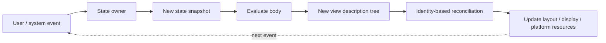
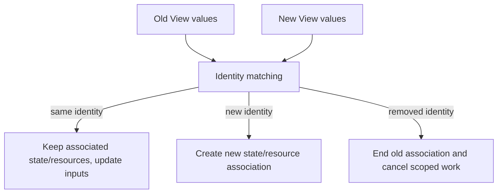
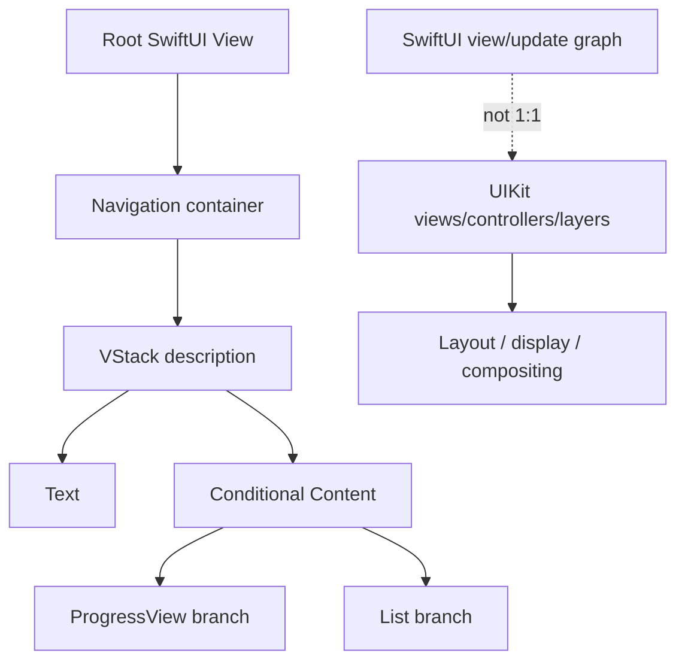
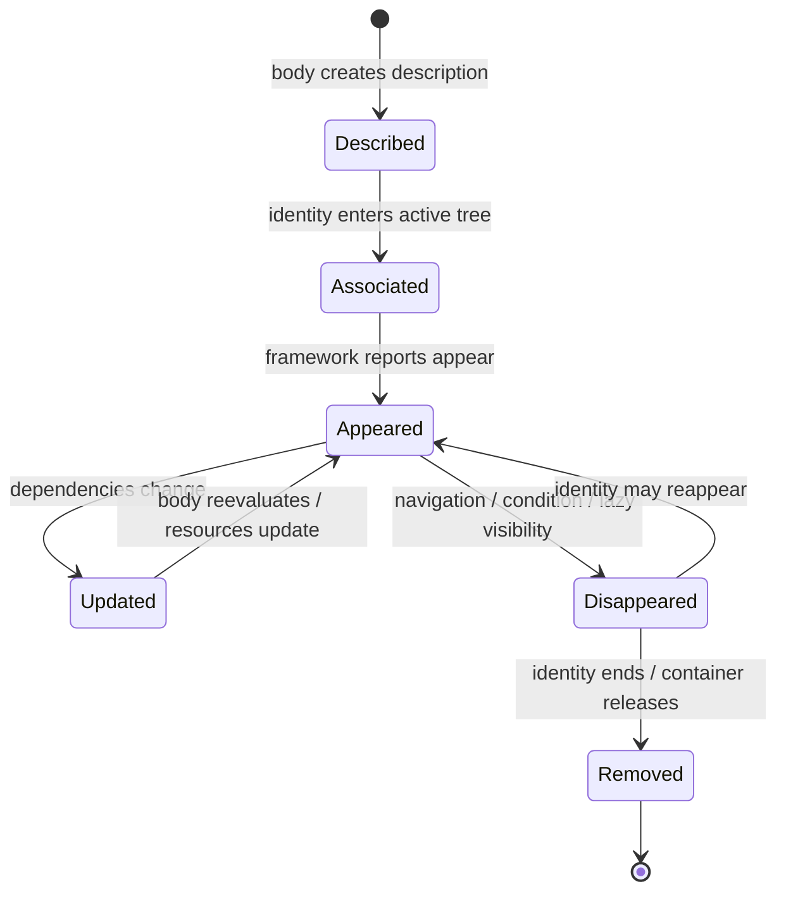
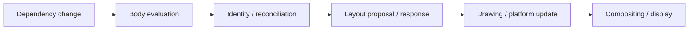

# SwiftUI 声明式模型：从 View 值、Identity 到环境与生命周期边界

> SwiftUI 的 `View` 通常是轻量值描述，不是屏幕上长期存活的控件对象。状态变化后，框架重新求值 `body`，依据结构位置和显式 ID 判断哪些描述仍代表同一界面身份，再把状态存储、任务、焦点和平台渲染资源关联到这份身份。理解声明式模型的关键不是背诵 Modifier，而是分清“值被重新创建”和“界面身份被替换”。

---

## 一、本文解决什么问题

SwiftUI 工程中经常遇到这些问题：

- `struct View` 每次重建，为什么 `@State` 没有自动丢失？
- View 是值类型，是否意味着整个原生 View Hierarchy 每次都重建？
- Structural Identity 与 Explicit Identity 有什么区别？
- 为什么修改 `.id(...)` 可以重置状态，也可能让滚动和动画失效？
- `if/else` 两个外观相近的分支为什么可能拥有不同状态生命周期？
- `AnyView` 是否只是语法简化，为什么不能到处使用？
- Environment 是全局单例吗，为什么 Sheet 或新 Window 中的值可能不同？
- Modifier 的顺序为什么会改变布局、背景、点击区域和动画？
- `@ViewBuilder` 如何把控制流转换为静态 View 类型？
- `onAppear`/`onDisappear` 是否等价于 UIKit 的 `viewDidAppear`/`viewDidDisappear`？
- `task` 何时启动和取消，列表滚动离屏时是否保证立即释放所有资源？
- 怎样避免把网络请求、埋点和状态初始化绑定到不稳定的 View 求值次数？

这些问题的共同主线是：**SwiftUI 会频繁创建 View 描述值，但通过稳定 Identity 延续与界面位置相关的持久状态和副作用。**

本文以现代 iOS SwiftUI 为主，说明自 iOS 13 起稳定的声明式原理，并在涉及 `task(id:)`、Navigation/Observation 等后续 API 时标明版本边界。示例在 2026-07-31 使用 Xcode 26.1.1、Apple Swift 6.2.1 与 iOS Simulator SDK 验证。SwiftUI 的内部 Graph、Diffing、Attribute 存储、Backing View/Layer 数量和优化策略不是公开契约；文中只把公开 API 语义和可重复观察行为作为工程依据。

### 核心结论

1. `View` 协议描述“给定当前输入，界面应是什么”，常见 View 是短生命周期 Value。不要在 View 实例自身保存需要跨更新持续存在的普通 Stored Property 状态。
2. `body` 可被多次求值，次数和时机不是业务契约。它必须近似纯函数：不发请求、不写数据库、不修改外部状态，也不依赖执行一次的假设。
3. View Value 重建不等于所有平台 View/Layer 和状态存储重建。SwiftUI 会基于 Identity 复用或更新已关联的持久资源，具体内部对象结构由框架决定。
4. Structural Identity 主要来自 View 的静态类型、声明位置和容器结构。`if/else` 的不同泛型分支通常形成不同结构身份，即使视觉结果相似。
5. Explicit Identity 由 `ForEach` 的稳定 ID、`.id(_:)` 等提供。它帮助框架跨位置/数据更新识别同一实体；ID 改变通常表示旧身份结束、新身份开始。
6. ID 必须稳定、唯一且只表达实体身份。每次计算生成 UUID、使用可变标题或数组下标，会导致状态、任务、焦点、动画和滚动关联反复重置。
7. View Tree 是当前声明结构及其动态展开，不等同于 UIKit View Hierarchy、Core Animation Layer Tree 或最终 Render Pass。一个 SwiftUI View 可能没有一一对应的 UIKit View。
8. Environment 是沿 View Tree 传播的作用域值和依赖读取机制，不是无边界全局变量。后代可覆盖值，Presentation、Scene 和 Container 边界需要按实际层级验证。
9. Modifier 通过包装/变换 View 构造新类型，顺序属于语义：先 Padding 再 Background 与先 Background 再 Padding 得到不同结构和绘制范围。
10. Result Builder 在编译期把多个表达式和条件控制流组合成具体 View 类型。它不是运行时 DSL 解释器，也不会让任意 Swift 语句自动成为 View。
11. Conditional Content 会参与 Identity。若只是同一实体的属性变化，优先保持共同结构并条件化 Modifier/数据；若两个分支本来就是不同语义，应接受状态重建而不是强行保身份。
12. `onAppear`/`onDisappear` 表示 SwiftUI 认为内容进入/离开展示生命周期的机会，不是对象构造析构，也不保证与物理像素可见或 UIKit Callback 一一对应。
13. `.task` 与 View Identity/展示生命周期关联并支持协作式取消，但底层 API 必须响应 Cancellation；一次性业务初始化仍应由稳定 State Owner 做幂等治理。

---

## 二、声明式模型：从命令序列到状态映射

命令式 UI 常写成：

```swift
if isLoading {
    spinner.startAnimating()
    retryButton.isHidden = true
    errorLabel.isHidden = true
} else if let error {
    spinner.stopAnimating()
    retryButton.isHidden = false
    errorLabel.isHidden = false
    errorLabel.text = error.localizedDescription
} else {
    spinner.stopAnimating()
    retryButton.isHidden = true
    errorLabel.isHidden = true
}
```

它要求开发者维护从旧状态到新状态的全部差异。遗漏一次 `isHidden` 重置就产生残留 UI。

SwiftUI 更倾向于声明当前状态对应的界面：

```swift
struct ArticleScreen: View {
    let state: ArticleScreenState
    let retry: () -> Void

    var body: some View {
        Group {
            switch state {
            case .loading:
                ProgressView()
            case .failed(let message):
                VStack(spacing: 12) {
                    Label("Load failed", systemImage: "exclamationmark.triangle")
                    Text(message)
                    Button("Retry", action: retry)
                }
            case .loaded(let article):
                ArticleContent(article: article)
            }
        }
    }
}
```



声明式并不意味着没有状态变化，而是把变化集中到 State Owner，让 View 负责把当前状态映射为描述。网络竞态、取消、缓存和错误仍要由业务层处理。

---

## 三、View 是值描述

`View` 协议的核心要求是：

```swift
public protocol View {
    associatedtype Body: View
    @ViewBuilder var body: Self.Body { get }
}
```

实际 SDK 声明还包含框架实现细节，以上只用于理解公开形态。常见自定义 View 是 `struct`：

```swift
struct PriceView: View {
    let amount: Decimal
    let currencyCode: String

    var body: some View {
        Text(amount, format: .currency(code: currencyCode))
            .monospacedDigit()
    }
}
```

`PriceView` 值包含生成描述所需输入。它不是必须被长期持有的 `UILabel` 等对象，也不提供手动更新文本的方法。Parent 输入变化时可以产生新的 `PriceView` 值。

### 3.1 View 初始化不是生命周期入口

```swift
struct ProductRow: View {
    let product: Product

    init(product: Product) {
        self.product = product
        analytics.trackRowCreated(product.id) // 错误
    }

    var body: some View { /* ... */ }
}
```

SwiftUI 可以频繁创建 View Value，即使它最终没有显示。把请求、埋点或订阅放进 `init` 会产生重复副作用，也无法获得可靠的取消时机。

修复方式是：

- 纯输入规范化可在 Init 中完成，但应便宜且无副作用；
- 可见性相关任务使用 `.task`/`onAppear`，仍需幂等；
- 页面级业务加载交给稳定 Model/Store；
- 用户行为埋点放在明确 Action；
- 展示埋点定义去重规则，而不是假设 `onAppear` 只调用一次。

### 3.2 `body` 必须近似纯函数

错误示例：

```swift
var body: some View {
    repository.refresh() // 错误：求值次数不可依赖。
    return Text("Articles")
}
```

`body` 可以读取依赖并构造 View，但不应修改依赖。否则一次状态变更可能形成更新循环，Preview/Test 和不同 OS 优化下调用次数也不同。

### 3.3 值重建不等于界面资源全重建



这是概念模型。SwiftUI 如何存储 Graph Node、何时创建 UIKit/AppKit 对象、是否合并 View，是版本相关实现，不能通过 View Value 的内存地址推断。

---

## 四、View Identity：状态延续的锚点

Identity 回答：“新描述中的这个 View，是否仍是上一次那个逻辑位置？”它影响：

- `@State` 等 Dynamic Property 的存储关联；
- `.task` 生命周期；
- Animation/Transition 的插入、删除和移动；
- Focus、Scroll Position、Selection；
- Platform View/Controller Bridge 的更新或重建；
- Lazy Container 中内容的缓存和复用机会。

Identity 不等于 `View` Value 的 `==`，大多数 View 也不要求 `Equatable`。

### 4.1 Identity 改变的代价

当 Identity 改变时，框架通常把它视为旧内容移除、新内容插入。局部状态会重置，相关任务可能取消并重启，Transition 可以运行，Focus/Scroll 锚点可能丢失。

因此 `.id(refreshToken)` 能作为有意重置工具，但不应成为“修复界面不刷新”的常规手段。它往往绕过了真实的状态所有权或依赖声明问题。

---

## 五、Structural Identity：类型与声明位置

SwiftUI 可以从静态泛型结构识别 View。例如：

```swift
struct UserHeader: View {
    let isLoggedIn: Bool

    @ViewBuilder
    var body: some View {
        if isLoggedIn {
            LoggedInHeader()
        } else {
            GuestHeader()
        }
    }
}
```

Builder 生成的概念类型类似条件内容：

```text
_ConditionalContent<LoggedInHeader, GuestHeader>
```

下划线内部类型不是应用应直接依赖的 API，但它说明两个 Branch 在结构上不同。条件翻转时，一个身份结束，另一个身份出现，各自局部状态通常不会互相延续。

### 5.1 相同类型、不同位置仍可能是不同身份

```swift
VStack {
    CounterView(label: "A")
    CounterView(label: "B")
}
```

两个 `CounterView` 类型相同，但位于不同声明位置，拥有不同结构身份。交换输入不等于移动两个实体：

```swift
VStack {
    CounterView(label: isSwapped ? "B" : "A")
    CounterView(label: isSwapped ? "A" : "B")
}
```

这里结构位置没有交换，只是每个位置的 Input 改变；与 `ForEach` 中按稳定 ID 移动 Item 的语义不同。

### 5.2 保持共同结构

如果只是同一按钮的 Enabled/Color 变化，不必拆成两个 Button：

```swift
Button("Submit", action: submit)
    .disabled(!canSubmit)
    .tint(canSubmit ? .accentColor : .secondary)
```

相较：

```swift
if canSubmit {
    Button("Submit", action: submit).tint(.accentColor)
} else {
    Button("Submit", action: submit).tint(.secondary).disabled(true)
}
```

共同结构通常更容易保留状态和动画连续性，也减少重复。但若两个分支代表完全不同语义和 Accessibility 行为，分开更准确，不能为了 Identity 强行合并。

---

## 六、Explicit Identity：用稳定 ID 表达实体

列表最常见：

```swift
struct Article: Identifiable {
    let id: UUID
    var title: String
}

ForEach(articles) { article in
    ArticleRow(article: article)
}
```

同一 `Article.ID` 从位置 2 移动到位置 8，SwiftUI 可以把它理解为同一实体移动，而不是旧行删除和新行创建。

### 6.1 错误：每次计算新 UUID

```swift
struct Article: Identifiable {
    var id: UUID { UUID() } // 错误：每次读取身份都变。
    let title: String
}
```

这会导致：

- Row `@State` 反复重置；
- Image/Task 重启；
- Animation 被解释为 Insert/Delete；
- Selection/Scroll Position 不稳定；
- Diff 成本与 View 更新扩大。

ID 应在实体创建时生成并持久化，或来自稳定业务主键。

### 6.2 数组下标不是实体 ID

```swift
ForEach(Array(items.enumerated()), id: \.offset) { _, item in
    ItemRow(item: item)
}
```

Insert/Delete/Sort 后 Offset 改变，原状态会附着到错误实体或被重建。下标只适用于内容和顺序真正固定、且位置本身就是身份的少数场景。

### 6.3 `.id(_:)` 的边界

```swift
EditorView(document: document)
    .id(document.id)
```

当 `document.id` 改变时，Editor 局部状态应属于新文档，重置是合理的。反之：

```swift
EditorView(document: document)
    .id(UUID()) // 错误：每次更新都创建新身份。
```

会持续破坏状态。`.id` 还可帮助 Scroll/Namespace 等 API 定位内容，但它不是普通 Metadata，而是身份语义。

### 6.4 `\.self` 需要稳定且唯一的值

`ForEach(values, id: \.self)` 只有在元素自身 Hashable、稳定且列表内唯一时才安全。重复 String、可变 Model 或浮点值通常不适合作实体身份。

---

## 七、View Tree：描述树不等于平台对象树



不同层次回答不同问题：

| 层次 | 回答的问题 |
|---|---|
| View Description | 当前状态希望声明什么内容 |
| Identity/Dependency Graph | 哪些位置延续、依赖什么状态 |
| Layout Tree | Proposal 如何传递、Size 如何返回 |
| Platform Hierarchy | 哪些 UIKit/AppKit 对象参与互操作 |
| Layer/Render Pipeline | 最终如何绘制、合成和显示 |

一个 `Group` 主要组织 View Builder 结果，未必产生可检查的容器 View；Modifier 也可能只改变环境、布局或绘制，而不是增加一个 UIKit View。不要通过 SwiftUI 代码中的 View 数量估算 UIKit Subview 数量或渲染成本。

### 7.1 Lazy Container 的“树”是动态的

`LazyVStack`、`List` 等可以按需要创建/保留内容，但精确预创建距离、缓存和销毁策略不是契约。业务不能依赖“离屏第 N 行一定已经初始化”或“滚出屏幕后立即 Deinit”。

---

## 八、Environment：作用域依赖传播

Environment 允许祖先写入值，后代按 Key 读取：

```swift
struct ReadingSettings: Sendable {
    var showsImages = true
}

private struct ReadingSettingsKey: EnvironmentKey {
    static let defaultValue = ReadingSettings()
}

extension EnvironmentValues {
    var readingSettings: ReadingSettings {
        get { self[ReadingSettingsKey.self] }
        set { self[ReadingSettingsKey.self] = newValue }
    }
}
```

```swift
struct ArticleBody: View {
    @Environment(\.readingSettings) private var settings

    var body: some View {
        ArticleContent(showsImages: settings.showsImages)
    }
}
```

祖先注入：

```swift
ArticleBody()
    .environment(\.readingSettings, ReadingSettings(showsImages: false))
```

### 8.1 Environment 不是全局单例

- 值沿当前 View Tree Scope 传播；
- 子树可以覆盖同一个 Key；
- 不同 Scene 可有不同值；
- Preview/Test 可注入不同依赖；
- 未注入时使用 Default Value；
- Presentation 是否继承某值取决于 API 与层级语义，应在目标 OS 验证，不能用“全局”推断。

### 8.2 哪些依赖适合 Environment

适合：

- Theme、Locale、Calendar、Dynamic Type 等环境语义；
- 多层组件共同需要的只读/作用域依赖；
- 系统提供的 Dismiss、OpenURL 等 Action；
- 可在 Preview/Test 中替换的 Feature Dependency。

不适合：

- 任意局部 View 的所有输入；
- 隐藏数据流和写入所有权；
- 用一个巨型 AppEnvironment 替代明确参数；
- 高频大对象复制且没有依赖边界设计。

Environment 读取会成为更新依赖。把无关字段塞进同一粗粒度值可能扩大更新范围，是否成为性能问题仍需用 SwiftUI Instruments 和 Body Update 证据判断。

---

## 九、Modifier：顺序就是结构

Modifier 通常接收一个 View 并返回新的 View 描述：

```swift
Text("Inbox")
    .padding(12)
    .background(.blue)
```

概念类型类似：

```text
ModifiedContent<ModifiedContent<Text, Padding>, Background>
```

内部具体类型不应直接依赖，但顺序会影响结果。

### 9.1 Background 与 Padding 顺序

```swift
Text("Inbox")
    .padding(12)
    .background(.blue)
```

Background 覆盖 Padding 后的区域。

```swift
Text("Inbox")
    .background(.blue)
    .padding(12)
```

Background 只覆盖 Text 自身区域，外层再增加 Padding。

同样，`.frame`、`.fixedSize`、`.contentShape`、`.clipShape`、`.overlay`、Gesture 与 Animation 的顺序都可能改变 Proposal、绘制、Hit Testing 或 Transaction。

### 9.2 自定义 `ViewModifier`

```swift
struct CardSurface: ViewModifier {
    let isHighlighted: Bool

    func body(content: Content) -> some View {
        content
            .padding(16)
            .background(
                RoundedRectangle(cornerRadius: 8)
                    .fill(isHighlighted ? Color.accentColor.opacity(0.12) : Color.secondary.opacity(0.08))
            )
    }
}

extension View {
    func cardSurface(isHighlighted: Bool = false) -> some View {
        modifier(CardSurface(isHighlighted: isHighlighted))
    }
}
```

Modifier 适合封装跨组件一致的 View Transformation。若它需要拥有复杂业务状态、网络请求和导航，通常说明职责应上移到独立 View/Feature，而不是继续膨胀 Modifier。

### 9.3 条件 Modifier

尽量使用稳定结构：

```swift
Text(title)
    .foregroundStyle(isWarning ? Color.red : Color.primary)
    .font(isEmphasized ? .headline : .body)
```

泛型扩展式的任意 `.if` Helper 往往让不同分支产生不同结构类型。它并非一定错误，但应意识到 Identity 和 State 生命周期可能变化，不能只看调用语法像“修改属性”。

---

## 十、Result Builder：把声明组合成 View 类型

`@ViewBuilder` 是 Result Builder。它在编译期转换：

```swift
@ViewBuilder
var toolbarContent: some View {
    Button("Refresh", action: refresh)

    if canEdit {
        Button("Edit", action: edit)
    }
}
```

概念上组合为 Tuple/Conditional Content 等具体类型。它让多个 View Expression 看起来像顺序语句，但不是把它们放入普通 `[View]` 数组。

### 10.1 Builder 支持与限制

Builder 可支持：

- 多个 View Expression；
- `if`、`if/else`；
- `switch`；
- Availability 分支；
- 当前 Swift/SDK 支持的部分局部声明和控制结构。

不应假设任何 Statement 都可返回 View。复杂计算先提取为普通 Function/Property，Builder 只保留清晰的界面结构。

### 10.2 `some View` 与类型擦除

`some View` 隐藏具体返回类型，但编译器仍知道每个声明的唯一 Concrete Type，保留静态结构信息。`AnyView` 则做运行时类型擦除：

```swift
func destination(for route: Route) -> AnyView {
    switch route {
    case .profile:
        AnyView(ProfileView())
    case .settings:
        AnyView(SettingsView())
    }
}
```

`AnyView` 在需要异构存储或 API 边界时有价值，但会隐藏部分静态类型结构，并可能改变 Identity/Diff 优化机会。不能无测量地断言它一定造成严重性能问题，也不应仅为解决 Builder 编译错误到处擦除类型；优先使用 `@ViewBuilder`、Enum Route 或泛型组合。

---

## 十一、Conditional Content：条件是身份的一部分

### 11.1 状态为何重置

```swift
struct AccountArea: View {
    let isAuthenticated: Bool

    var body: some View {
        if isAuthenticated {
            DashboardView()
        } else {
            LoginView()
        }
    }
}
```

登录状态改变时，Login 和 Dashboard 本来就是不同界面身份，局部状态终止/创建是正确语义。

### 11.2 看似相同的 View 也可能是两个分支

```swift
if isPremium {
    ProductView(product: product)
        .badge("Premium")
} else {
    ProductView(product: product)
}
```

这两个 `ProductView` 位于不同 Conditional Branch。若 ProductView 内有编辑状态，切换 Premium 可能重建该身份。若 Premium 只是外观，保持共同结构：

```swift
ProductView(product: product)
    .overlay(alignment: .topTrailing) {
        if isPremium {
            Text("Premium")
                .font(.caption)
        }
    }
```

这里 ProductView 主结构稳定，Overlay 内部 Badge 自己条件出现。是否需要保留状态取决于业务语义，不是“条件越少越好”。

### 11.3 `opacity(0)` 与移除不是一回事

为了保留 Identity 而把 View 设为透明，会让它可能继续参与布局、Hit Testing、Accessibility 和任务生命周期。需要隐藏但保留空间时应明确处理 `allowsHitTesting`、Accessibility；需要真正结束生命周期时应从条件结构移除。

---

## 十二、生命周期与可见性边界

SwiftUI 没有等价于“View Object Init → Appear 一次 → Deinit”的简单生命周期。



这是工程概念图，不是 SwiftUI 公开状态机。实际 Container 的预加载、缓存和 Appearance 时机会变化。

### 12.1 `onAppear` 与 `onDisappear`

```swift
ArticleDetail(articleID: id)
    .onAppear {
        analytics.recordVisible(id)
    }
    .onDisappear {
        analytics.recordHidden(id)
    }
```

注意：

- 可能多次调用；
- 不等于 View Value Init/Deinit；
- Container 预加载时机不应视作物理像素已被用户看到；
- Interactive Navigation/Tab/Split View 会产生复杂展示路径；
- App 进入后台不一定让所有内容触发 `onDisappear`；
- 进程被终止时不保证清理 Callback。

埋点若要求“用户实际看见超过某时长”，还需 Scene Phase、几何可见比例、时间阈值和去重 Session，不能只记录 `onAppear`。

### 12.2 `.task`

```swift
struct SearchResultsView: View {
    let query: String
    @State private var state: LoadState = .idle

    var body: some View {
        ResultsContent(state: state)
            .task(id: query) {
                do {
                    state = .loading
                    let results = try await repository.search(query: query)
                    try Task.checkCancellation()
                    state = .loaded(results)
                } catch is CancellationError {
                    return
                } catch {
                    state = .failed(error.localizedDescription)
                }
            }
    }
}
```

`.task(id:)` 在 ID 改变时取消旧任务并启动新任务，适合 Query 驱动加载。仍需注意：

- Cancellation 是协作式的，Repository 必须传播/检查取消；
- Cancellation 和 Completion 可能接近发生，必要时再校验请求 Revision；
- View 重现可能重新加载，Cache/Store 应幂等；
- 把 Repository 直接放在示例中的作用域仅为突出机制，实际依赖应通过 Init/Environment 注入；
- `@State`/状态所有权和异步竞态将在后续模块展开。

### 12.3 Lazy 列表中的可见性

Row `onAppear` 常用于分页触发，但它可能在用户真正看到前被调用，且同一 Row 可多次出现。可靠分页应：

- 以稳定 Item ID/Cursor 判定接近尾部；
- Store 中防止同一 Cursor 重复请求；
- 支持 Cancel、Retry 和乱序响应；
- 列表缩短、Filter 改变时重置分页 Scope；
- 不假设最后一行 `onAppear` 只触发一次。

### 12.4 资源清理

优先使用结构化生命周期：

- `.task` 管异步任务；
- `AsyncSequence` 响应 Cancellation；
- Model/Store 持有需要跨 View 重建持续的订阅；
- UIKit Bridge 在 `dismantleUIView`/对应 API 清理平台资源；
- 不依赖 View Struct `deinit`，因为 Struct 没有这种对象生命周期。

---

## 十三、常见误区与修复

### 13.1 错误：在 `body` 中发起网络请求

**问题：** Body Evaluation 次数不稳定，可能重复请求或形成更新循环。

**修复：** 使用与稳定 Identity 关联的 `.task(id:)`，或由 Feature Store 幂等加载并管理竞态。

### 13.2 错误：用随机 `.id(UUID())` 强制刷新

**问题：** 每次更新都产生新身份，局部状态、Focus、Task、Animation 和 Scroll 关联全部重置。

**修复：** 找出真正缺失的状态依赖；只有业务实体确实更换或需要有意重置时改变 ID。

### 13.3 错误：`ForEach(items.indices, id: \.self)` 渲染可变列表

**问题：** Insert/Delete 后下标对应的实体变化，状态可能错位。

**修复：** Item 使用稳定业务 ID，并让 Action 携带 ID 而非捕获旧 Index。

### 13.4 错误：所有条件 View 都用 `AnyView` 包装

**问题：** 隐藏静态结构，降低类型检查和 Identity 推理清晰度，也可能影响更新优化。

**修复：** 优先 `@ViewBuilder`、`Group`、Enum/Switch 和共同结构；只在确有异构类型擦除边界时使用 `AnyView`。

### 13.5 错误：把 Environment 当 Service Locator

**问题：** 依赖来源和写入所有权不透明，测试需要构造巨大环境，局部组件更新范围扩大。

**修复：** 局部必要输入走 Init/Binding，真正的作用域环境依赖才进入 Environment，并提供明确测试 Default/Override。

### 13.6 错误：`onAppear` 当一次性初始化

**问题：** Navigation、Tab、Lazy Container 和身份变化都可能重复触发。

**修复：** 一次性语义存入稳定 State Owner，操作本身幂等；展示 Callback 只表达展示事件机会。

### 13.7 错误：通过 `opacity(0)` 模拟移除

**问题：** View 仍可能占布局、接收点击、出现在 Accessibility Tree 并继续任务。

**修复：** 根据需求选择条件移除、`hidden` 风格布局、`allowsHitTesting(false)` 和 `accessibilityHidden(true)`，不要混淆视觉透明与生命周期结束。

---

## 十四、工程实践：稳定身份驱动的 Feature

以可切换账号的订单详情为例：

```swift
struct OrderFeatureView: View {
    let accountID: AccountID
    let orderID: OrderID

    var body: some View {
        OrderScreen(orderID: orderID)
            .id(FeatureIdentity(accountID: accountID, orderID: orderID))
    }
}
```

这里显式 ID 表达：同一账号同一订单应延续局部界面身份；账号或订单改变时，编辑草稿、Scroll、Task 等 Feature-local 状态应重置。若草稿需要跨订单切换保留，它就不应属于 View-local State，而应提升到 Draft Store。

### 14.1 Identity 设计检查表

- 这个 ID 表达实体、位置还是内容版本？
- 列表排序后是否保持不变？
- 数据刷新后是否能与同一实体对齐？
- ID 改变时，哪些 State/Task/Focus 应重置？
- ID 不变时，哪些内容更新应延续？
- 是否在不同 Account/Scene/Document Scope 下需要复合 ID？
- 是否有重复 ID 或 Hash 字段可变风险？

### 14.2 副作用归属

| 副作用 | 推荐归属 |
|---|---|
| 用户点击提交 | Button Action → Domain Command |
| Query 改变重新搜索 | `.task(id:)` 或 Store Effect |
| 页面可见统计 | `onAppear` + 去重/时长规则 |
| 跨页面持续下载 | App/Feature Store，不依赖 Row 可见性 |
| View-local 动画任务 | 与稳定 View Identity 关联的 Task |
| 进程终止前保存 | 持续持久化，不依赖 `onDisappear` |

### 14.3 测试什么

- 同 ID 内容更新时 `@State` 是否应保留；
- ID 改变时局部状态是否重置；
- Insert/Move/Delete 后 Row 状态是否跟随实体；
- Conditional Branch 切换是否符合业务生命周期；
- Environment Override 是否只影响目标子树；
- `.task(id:)` 是否取消旧请求并拒绝过期结果；
- Tab/Navigation/Lazy Scroll 下 Appear 是否幂等；
- Dynamic Type、Locale、Scene 变化是否通过 Environment 正确传播；
- Accessibility 与 Hit Testing 不因透明/Overlay Modifier 失真。

---

## 十五、性能与诊断

不要用“View Struct 创建太多”直接解释卡顿。值构造、Body Evaluation、Diff/Reconciliation、Layout、Text/Image、Platform Bridge 和 Render 都可能是成本来源。



测量方法：

1. 使用 Release/Profile、目标真机和固定 OS；
2. 用 SwiftUI Instruments 观察 View Body、Update Cause 和 Long Update；
3. 用 Time Profiler 关联 Formatter、Image Decode、Layout 与业务计算；
4. 用 Animation Hitches/Core Animation 观察帧问题；
5. 添加 Signpost 标记 State Update、网络结果和用户 Action；
6. 对比稳定 ID 与错误随机 ID 场景的更新范围、任务次数和滚动状态；
7. 在真实列表规模、Navigation、Dynamic Type 和动画下验证。

常见治理方向：

- 保持 ID 稳定，避免无意义子树替换；
- Body 中只做轻量派生，昂贵格式化移到可缓存层；
- Environment/Observable State 按 Feature Scope 拆分；
- 避免大范围 `AnyView` 和随机 `.id`，但优化前先测量；
- 图片解码、网络和数据库不占用 Main Actor；
- Modifier/Geometry/Preference 循环问题放在更新与布局模块深入分析。

---

## 十六、总结

SwiftUI 的声明式模型把 UI 视为当前状态的值描述。View Value 可以频繁重建，`body` 也可多次求值；真正让局部状态、任务和平台资源延续的是稳定 Identity，而不是某个 Struct 实例的地址。Structural Identity 来自静态类型和声明位置，Explicit Identity 用稳定 ID 表达跨位置的业务实体。

View Tree 是声明与更新结构，不等于 UIKit View/Layer Tree。Environment 沿子树传播作用域依赖，Modifier 按顺序包装和变换结构，Result Builder 在编译期把多表达式与条件组合为具体类型。Conditional Content 的分支本身参与身份，需要根据业务决定保留共同结构还是明确重建。

生命周期方面，`onAppear`/`onDisappear` 是展示机会而非对象生灭契约，`.task` 提供与身份相关的协作式取消，但副作用仍需幂等、处理竞态，并由正确 State Owner 管理。

真正需要记住的是：**View 是描述，Identity 是连续性，State Owner 是事实来源，Modifier 和 Builder 决定结构。不要把 View 初始化当生命周期，不要把随机 ID 当刷新按钮，也不要把可见性 Callback 当唯一资源管理保证。**

## 问答复盘

### Q1：SwiftUI View 是值类型，为什么 `@State` 能跨 View 重建保留？

**答：** 状态存储不依赖某个短生命周期 View Struct 实例，而由 SwiftUI 与稳定 View Identity 关联。新描述匹配到同一身份时，框架继续提供对应状态。

### Q2：View Value 重建是否意味着 UIKit View Hierarchy 全部重建？

**答：** 不意味着。SwiftUI 会基于 Identity 和依赖更新关联资源，且 View Description 与平台对象不一一对应。具体复用和 Backing 对象是版本相关内部实现。

### Q3：Structural Identity 与 Explicit Identity 的核心区别是什么？

**答：** Structural Identity 来自类型、声明位置和条件结构；Explicit Identity 由稳定业务 ID、`ForEach` 或 `.id` 提供，用于表达跨数据/位置更新仍是同一实体。

### Q4：为什么 `ForEach(items.indices, id: \.self)` 在可变列表中危险？

**答：** 下标是位置，不是实体。插入或排序后，同一下标会代表不同 Item，局部状态、任务和动画可能附着到错误内容。

### Q5：`.id(UUID())` 为什么能“刷新”，却不应作为常规修复？

**答：** 它每次都创建新身份，迫使旧子树结束并重建，因此同时清除了状态、焦点、任务和滚动关联。真正问题通常是依赖或状态所有权不正确。

### Q6：Modifier 顺序为什么会改变结果？

**答：** 每个 Modifier 都包装前一个 View，形成新的布局、绘制或事件结构。Padding 后 Background 与 Background 后 Padding 作用于不同范围，不是可交换的属性赋值。

### Q7：`some View` 和 `AnyView` 是否都是类型擦除？

**答：** 不是。`some View` 对调用方隐藏类型，但编译器仍知道唯一具体类型；`AnyView` 在运行时擦除底层类型。后者适合必要的异构边界，不应为方便而全局使用。

### Q8：`onAppear` 能否用于只执行一次的页面初始化？

**答：** 不能直接假设只执行一次。Navigation、Tab、Lazy Container 和 Identity 变化都可能重复触发；一次性语义应由稳定 State Owner 记录，并让加载操作幂等。

### Q9：`.task(id: query)` 如何处理快速连续搜索？

**答：** Query 改变时 SwiftUI 会取消旧 Task 并启动新 Task，但取消是协作式的。Repository 必须传播 Cancellation，必要时还要校验 Revision，防止旧结果晚到覆盖新状态。

### Q10：两个条件分支都显示 `ProductView`，状态是否一定延续？

**答：** 不一定。它们位于不同 Conditional Branch，通常具有不同结构身份。若只是外观变化，应保持共同 ProductView 结构并条件化局部 Modifier；若语义不同，重建可能正是正确行为。

## 延伸知识

- `@State`、`@Binding`、Observation 与 State Ownership
- Body Dependency Tracking、Diffing 与 Transaction
- SwiftUI Layout Proposal、Size Response 与 Alignment
- Preference、Geometry 与 Anchor
- `NavigationStack` Identity、Path 与 State Restoration
- `UIViewRepresentable`/`UIViewControllerRepresentable` 生命周期
- SwiftUI Animation Transaction 与 Transition
- SwiftUI Instruments、更新原因与无效刷新定位
