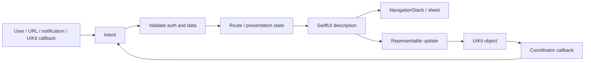
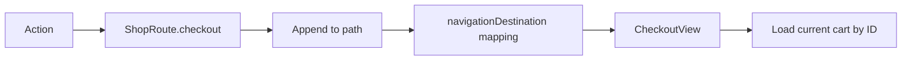
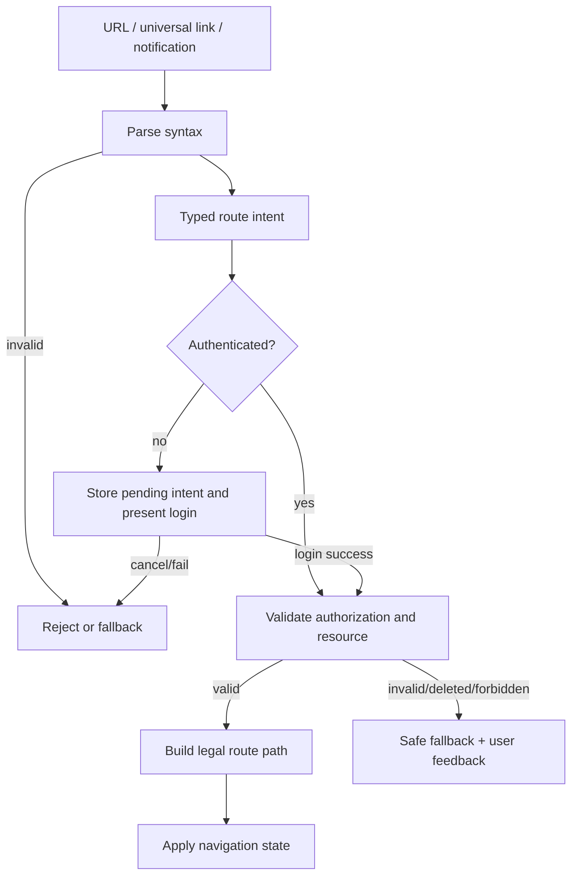
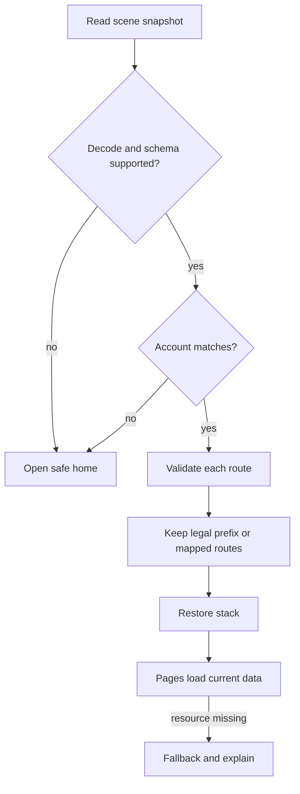
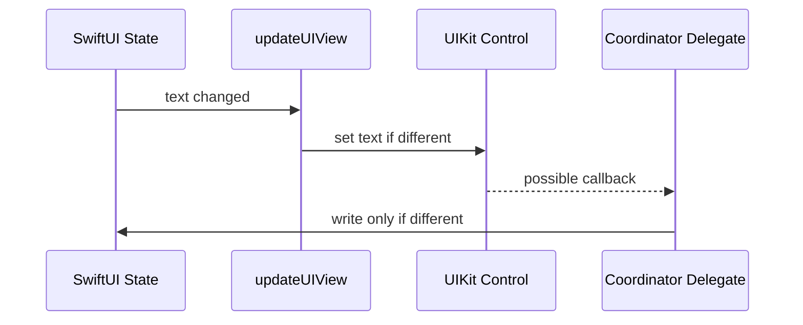
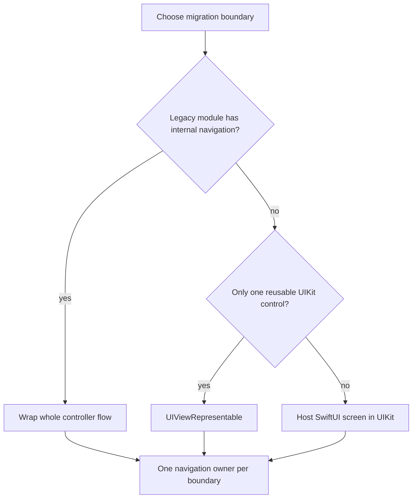

# SwiftUI 导航与 UIKit 互操作：从路由状态、深链恢复到 Representable 生命周期

> SwiftUI 导航的核心不是“调用一次 push”，而是让当前页面层级成为可观察、可修改、可恢复的状态；UIKit 互操作的核心也不是“把 UIView 塞进 SwiftUI”，而是建立一条双向适配边界：SwiftUI 负责描述、身份和更新，UIKit 对象负责命令式行为，Coordinator 负责委托回调，并通过幂等同步避免反馈循环。路由、模态和原生控件只有共享同一套所有权与生命周期设计，深链、状态恢复和渐进迁移才不会互相冲突。

---

## 一、本文解决什么问题

真实工程中的导航与混编往往同时包含这些要求：

- Tab 内有独立的多级页面栈；
- 推送、Universal Link 或通知可以直达订单详情；
- 未登录时先进入登录流程，成功后继续原目标；
- App 被系统终止后，条件允许时恢复页面层级；
- 编辑页使用 `sheet`，扫码或支付流程使用全屏控制器；
- 地图、富文本编辑器、相机或旧业务页仍由 UIKit 实现；
- UIKit Delegate 回调需要更新 SwiftUI State；
- 迁移期间 UIKit 与 SwiftUI 都可能是 Navigation Owner。

如果只把导航理解为若干 Modifier 和 API，常见结果是：重复 Push、路径无法编码、恢复出已失效页面、Sheet 与 Path 互相抢状态、`updateUIView` 高频重复执行命令、Delegate 回写后形成更新环，或 SwiftUI/UIKit 两套 Coordinator 同时控制同一个栈。

本文以现代 SwiftUI 为主：

- `NavigationStack`、`NavigationPath` 和 `navigationDestination` 以 iOS 16+/macOS 13+ 为基线；
- Observation 示例以 iOS 17+ 为基线；更早系统可用 `ObservableObject` 表达同样的路由所有权；
- `UIViewRepresentable` 与 `UIViewControllerRepresentable` 自 iOS 13 起可用，但具体控件能力和 Swift Concurrency 标注随 SDK 演进；
- UIKit 示例聚焦 iOS。macOS/AppKit 对应 `NSViewRepresentable` 与 `NSViewControllerRepresentable`，生命周期和控件能力并不完全相同。

示例按 Xcode 26.1.1、Apple Swift 6.2.1 与 iOS Simulator SDK 的公开 API 编写。SwiftUI 内部如何桥接 Hosting、协调 Navigation Controller、缓存 Representable 或安排更新调用不是公开契约；业务代码不能依赖固定调用次数、私有 View 层级或内部类名。

### 核心结论

1. `NavigationStack` 是由当前 Root 与 Path 描述的导航容器。绑定 Path 后，程序化导航本质是修改状态，而不是直接获得并调用一个公开的 Navigation Controller。
2. 优先使用可穷举的 Typed Route 作为业务路由模型。`NavigationPath` 适合异构值栈，但 Type Erasure 会降低编译期约束，编码恢复还要求每个元素可编码。
3. `navigationDestination(for:)` 声明“某种数据如何构造页面”，不等于立即导航；触发导航的是向 Path 追加值或使用具有匹配 Value 的 `NavigationLink`。
4. Deep Link 应先解析为受信任的 Route Intent，再经过鉴权、数据有效性和当前流程检查，最后原子地更新导航状态。URL 不能直接成为内部导航指令。
5. Sheet 与 Full-screen Cover 也是状态驱动的 Presentation。用可选 Item/枚举表达“当前呈现什么”，通常比多组 Boolean 更能保证互斥与参数完整。
6. State Restoration 恢复的是可重建状态，不是 UIKit/SwiftUI 对象本身。Route 必须稳定、可编码且可校验；恢复失败应降级到合法 Root，而不是强行复现过期 UI。
7. `makeUIView`/`makeUIViewController` 用于创建长期存在的 UIKit 对象；`update...` 用于把最新 SwiftUI 输入幂等同步到对象。不能假设更新只调用一次。
8. `dismantleUIView`/`dismantleUIViewController` 是清理 Delegate、Observer、Timer 和其他外部资源的显式机会，但正常任务取消还应绑定到实际 Owner，不能只押注销毁回调。
9. Coordinator 适合承接 UIKit Delegate/Target-Action，再通过 Binding 或 Closure 输出事件。它不是第二份业务状态源，也不应强持有造成循环引用。
10. 双向桥接必须区分“SwiftUI 输入导致的 UIKit 变化”和“用户操作产生的 UIKit 输出”，比较当前值并控制回写时机，避免反馈循环与重入警告。
11. 生命周期同步应分别处理身份、可见性、任务、资源和系统回调。SwiftUI View Value 的创建不等于页面出现，Representable 的 Update 也不等于 UIKit Controller 的 `viewDidAppear`。
12. 渐进式迁移必须明确每个 Flow 的唯一 Navigation Owner。可以 UIKit Host SwiftUI，也可以 SwiftUI Wrap UIKit；同一层级同时由双方 Push/Pop 是最难维护的中间态。

---

## 二、统一心智模型：导航和桥接都是状态适配



这条链路有两个关键约束：

- **单向输入**：状态生成 SwiftUI 描述，再把必要配置同步到 UIKit；
- **事件输出**：UIKit 不直接修改另一套隐藏状态，而是输出 Intent，交回 Owner 决策。

若 Delegate 回调直接 Push UIKit 页面，同时又修改 SwiftUI Path，或者 `updateUIView` 每次都触发会再次回调的命令，就会形成双写和环路。

---

## 三、NavigationStack：导航层级是一份状态

### 3.1 最小的类型化导航

```swift
enum ShopRoute: Hashable {
    case product(id: UUID)
    case reviews(productID: UUID)
    case checkout(cartID: UUID)
}

struct ShopRootView: View {
    @State private var routes: [ShopRoute] = []

    var body: some View {
        NavigationStack(path: $routes) {
            ProductListView { productID in
                routes.append(.product(id: productID))
            }
            .navigationDestination(for: ShopRoute.self) { route in
                switch route {
                case .product(let id):
                    ProductDetailView(productID: id)
                case .reviews(let productID):
                    ReviewListView(productID: productID)
                case .checkout(let cartID):
                    CheckoutView(cartID: cartID)
                }
            }
        }
    }
}
```

这里的 `routes` 表示 Root 之后的页面序列。追加、删除最后一个元素或替换整个数组，分别表达 Push、Pop 和重建层级。系统 Back 手势或按钮完成返回时，绑定 Path 也会反映新的层级。

`ShopRoute` 应保存重建页面所需的稳定标识，而不是页面对象、网络响应全文或 View Model 实例。页面根据 ID 向 Repository 获取当前数据，才能处理数据更新、恢复和深链。

### 3.2 NavigationLink 与程序化导航

值驱动 Link：

```swift
NavigationLink(value: ShopRoute.product(id: product.id)) {
    ProductRow(product: product)
}
```

它把用户点击转换为向当前 Stack Path 追加 Value。程序化导航则由业务 Action 修改 Path。两者最终应进入同一 Destination Mapping，避免点击路径和深链路径构建出不同页面。

### 3.3 Path 的 Owner 放在哪里

Path Owner 取决于恢复和共享范围：

| 场景 | 合理 Owner | 说明 |
|---|---|---|
| 单个临时 Stack | Root View 的 `@State` | View Identity 结束时路径结束 |
| Feature 内多处触发导航 | Feature Router/Model | Action 集中，便于测试 |
| 每个 Tab 独立历史 | 每个 Tab 各自一份 Path | 切 Tab 不应互相覆盖 |
| Window/Scene 恢复 | Scene Scope Store | 多窗口不能默认共享一条路径 |
| 登录态全局切换 | App Coordinator 管 Root，Feature 管内部 Path | 注销时显式清空受保护路径 |

把所有页面都塞进一个全局 Router 虽然方便调用，却容易让 Feature 互相知道内部 Route，并把 Window、Tab、Account 等生命周期混成一个 Scope。

---

## 四、NavigationPath 与 Typed Route 如何选择

`NavigationPath` 可以容纳不同 `Hashable` 类型：

```swift
@State private var path = NavigationPath()

path.append(ProductRoute(id: productID))
path.append(CheckoutRoute(cartID: cartID))
```

对应地，可以为不同类型注册 Destination：

```swift
.navigationDestination(for: ProductRoute.self) { route in
    ProductDetailView(productID: route.id)
}
.navigationDestination(for: CheckoutRoute.self) { route in
    CheckoutView(cartID: route.cartID)
}
```

### 4.1 Typed Array 的优势

`[ShopRoute]` 通常更适合一个边界清晰的 Feature：

- 编译器可以穷举 Route；
- 替换、过滤和测试路径更直接；
- `Codable` 恢复格式由团队控制；
- 非法跨 Feature 组合更容易被约束。

### 4.2 NavigationPath 的优势与代价

它适合一个 Stack 确实需要承载多个模块的异构 Route，或基础设施无法提前统一枚举的场景。代价是：

- 元素类型关系被擦除，错误更晚暴露；
- 路径内容不如 Typed Array 直观；
- Restoration 依赖其中所有元素满足编码条件；
- 重构类型名、字段和 Destination Registration 时需要更谨慎的兼容策略。

不要仅因为 API 名称看起来“更通用”就默认使用 `NavigationPath`。

### 4.3 Destination Registration 的边界

同一类型在不同层级重复注册时，实际采用哪个声明与 View Hierarchy Scope 有关。工程上应让 Route Type 在一个清晰的 Stack Boundary 内有唯一 Mapping，避免靠 Modifier 放置顺序制造隐式覆盖。

---

## 五、Typed Destination：数据决定页面构造

Typed Destination 将“路由是什么”与“页面如何构造”分开：



### 5.1 Route 不应持有 View

错误示例：

```swift
// 错误：Route 变成 View 容器，难以 Hash、编码和测试。
enum BadRoute {
    case next(AnyView)
}
```

修复方式是保存语义数据：

```swift
enum AccountRoute: Hashable, Codable {
    case profile(userID: UUID)
    case security
}
```

Route 是导航领域状态，不是 View Factory 的类型擦除容器。

### 5.2 Route 参数要最小且稳定

传 `productID` 通常优于传整个 `Product`：

- 深链只需要稳定 ID；
- 恢复时可获取最新数据；
- 避免 Path 保存大对象；
- 数据删除时可以显式降级。

但页面进入后若必须展示当时快照，例如订单提交确认，可保存一个小型、明确版本的 Snapshot。选择取决于业务一致性，而不是机械规定“只能传 ID”。

---

## 六、Deep Link：URL 先变成 Intent，再改变 Path

### 6.1 不要直接把 URL Segment 追加进 Path

深链至少包含四个阶段：



URL 是不受信任输入。解析成功只说明语法匹配，不说明：

- 当前用户有权限访问资源；
- 对应 ID 仍存在；
- 当前账号、Window 或 Scene 正确；
- App 当前支付/编辑流程允许切换；
- URL 来源可信或参数未被篡改。

### 6.2 Typed Intent 示例

```swift
enum AppLink: Equatable {
    case product(id: UUID)
    case order(id: UUID)
}

struct AppLinkParser {
    func parse(_ url: URL) -> AppLink? {
        guard url.scheme == "myshop" else { return nil }

        let parts = url.pathComponents.filter { $0 != "/" }
        guard parts.count == 1, let id = UUID(uuidString: parts[0]) else {
            return nil
        }

        switch url.host {
        case "product": return .product(id: id)
        case "order": return .order(id: id)
        default: return nil
        }
    }
}
```

Parser 只负责语法到 Intent；鉴权、资源查询和导航决策由 Coordinator/Model 完成。这样 Parser 可以纯单元测试，也不会因解析 URL 偷偷改变 UI。

### 6.3 原子替换还是增量 Push

深链进入详情时，可以：

- **替换 Path**：构造 `[.orders, .order(id)]`，结果确定，适合外部入口；
- **在当前 Path 追加**：保留用户上下文，但可能得到重复或不合法层级；
- **切换 Tab 后设置该 Tab Path**：适合多 Tab App，需要等待 Owner 就绪但不应靠固定延时猜时机。

规则应由产品导航语义决定，并通过 Reducer/Coordinator 测试。不要在多个 `onOpenURL` 中各自修改半套状态。

### 6.4 重复投递与并发

同一链接可能经由 Scene、通知点击或业务 SDK 重复投递。处理器应具备：

- Intent ID 或短期去重策略；
- 对正在进行的解析/鉴权任务进行取消或版本校验；
- 登录前只保留明确的一条 Pending Intent，或定义队列策略；
- 新账号登录后重新校验资源，不能沿用旧账号验证结果。

---

## 七、Sheet 与 Full-screen Cover：模态也是路由状态

### 7.1 用枚举表达互斥 Presentation

多组 Boolean 容易出现同时为 `true`：

```swift
@State private var showsEditor = false
@State private var showsScanner = false
```

更稳妥的建模是：

```swift
enum ModalRoute: Identifiable {
    case editAddress(id: UUID)
    case scanner

    var id: String {
        switch self {
        case .editAddress(let id): "edit-address-\(id)"
        case .scanner: "scanner"
        }
    }
}

@State private var modal: ModalRoute?
```

```swift
.sheet(item: $modal) { route in
    switch route {
    case .editAddress(let id):
        AddressEditor(addressID: id)
    case .scanner:
        ScannerView()
    }
}
```

一个 Optional Enum 同时保证互斥和参数完整。`Identifiable.id` 必须代表 Presentation Identity；若 ID 无故变化，系统可能把同一业务弹层视为新内容。

### 7.2 Sheet 与 Full-screen Cover 的选择

选择应依据交互与平台语义：

- `sheet` 适合辅助编辑、选择和可取消任务；其尺寸和交互会随设备与平台变化；
- `fullScreenCover` 适合沉浸式、相机、独立登录或必须占满屏幕的流程；
- 普通层级钻取仍应使用 Navigation，而不是把每级页面都做成 Sheet。

两者都不是资源生命周期保证。用户手势关闭、Binding 置空、Parent Identity 变化或 Flow 切换都可能结束 Presentation。未保存编辑必须设计确认、草稿或回滚策略。

### 7.3 Dismiss 是环境 Action，不是全局路由器

```swift
struct AddressEditor: View {
    @Environment(\.dismiss) private var dismiss

    var body: some View {
        Button("Done") {
            // 先提交并确认成功，再结束当前 Presentation。
            dismiss()
        }
    }
}
```

`dismiss` 作用于当前 Presentation Context。它适合 Child 表达“结束我所在的呈现”，但复杂流程仍应让 Owner 处理保存结果、错误和后续导航，不能把它当作任意层级 Pop API。

---

## 八、State Restoration：恢复可重建状态，而不是对象快照

### 8.1 Codable Typed Route

```swift
enum RestorableRoute: Hashable, Codable {
    case product(id: UUID)
    case reviews(productID: UUID)
}

struct NavigationSnapshot: Codable {
    var schemaVersion: Int
    var routes: [RestorableRoute]
    var selectedTab: String
}
```

持久化前应把临时或敏感页面过滤掉。例如支付授权中间页、一次性验证码、已提交表单、包含敏感查询参数的 Web 页面通常不适合原样恢复。

### 8.2 NavigationPath 的 CodableRepresentation

当 Path 内所有元素均可编码时，可以取得 `NavigationPath.CodableRepresentation`，之后通过 Decoder 编码；恢复时解码 Representation 并构造 `NavigationPath`。如果任一元素不可编码，可编码表示可能不可用。因此每次写入任意 `Hashable` 并不自动获得可靠恢复能力。

对于需要长期兼容的业务恢复，团队自有的 Versioned Typed Snapshot 往往更容易迁移和校验。

### 8.3 SceneStorage 不是无限数据库

`@SceneStorage` 适合 Scene 级、体积较小且可序列化的数据。复杂路径可以编码成 `Data`，但仍需考虑：

- 编码失败；
- Schema 升级；
- 资源已删除或权限变化；
- 用户已注销或切换账号；
- 多窗口各自恢复不同路径；
- 敏感数据不应明文长期保存。

真正的业务数据应由数据库/Repository 管理，Navigation Snapshot 只保存定位信息。

### 8.4 恢复流程



恢复应是容错流程，而非“Decode 成功就百分百重放”。最安全的策略通常是保留合法前缀：第三层详情失效时退回第二层列表，而不是让整个 App 卡在空白页。

---

## 九、UIViewRepresentable：把 UIView 适配成声明式节点

以一个 UIKit Search Bar 为例：

```swift
struct SearchBar: UIViewRepresentable {
    @Binding var text: String
    var onSubmit: () -> Void

    func makeCoordinator() -> Coordinator {
        Coordinator(parent: self)
    }

    func makeUIView(context: Context) -> UISearchBar {
        let searchBar = UISearchBar(frame: .zero)
        searchBar.delegate = context.coordinator
        searchBar.autocapitalizationType = .none
        return searchBar
    }

    func updateUIView(_ searchBar: UISearchBar, context: Context) {
        context.coordinator.parent = self

        if searchBar.text != text {
            searchBar.text = text
        }
    }

    static func dismantleUIView(
        _ searchBar: UISearchBar,
        coordinator: Coordinator
    ) {
        searchBar.delegate = nil
    }

    final class Coordinator: NSObject, UISearchBarDelegate {
        var parent: SearchBar

        init(parent: SearchBar) {
            self.parent = parent
        }

        func searchBar(_ searchBar: UISearchBar, textDidChange searchText: String) {
            guard parent.text != searchText else { return }
            parent.text = searchText
        }

        func searchBarSearchButtonClicked(_ searchBar: UISearchBar) {
            parent.onSubmit()
        }
    }
}
```

### 9.1 `makeUIView`：一次性构造，不放动态业务状态

适合在这里完成：

- 创建 UIKit 对象；
- 安装不会随 SwiftUI 输入变化的子结构；
- 设置 Delegate/Target；
- 配置对象级别的固定能力。

不要依赖“只调用一次直到 App 退出”。当 Representable Identity 消失并重新建立时会创建新对象。

### 9.2 `updateUIView`：最新输入的幂等投影

SwiftUI 可在多种原因下调用 Update，调用次数不是契约。Update 应满足：

- 同样输入重复执行不会产生额外副作用；
- 只在值确实变化时设置昂贵属性；
- 不启动无管理的网络请求或 Timer；
- 不无条件调用会触发 Delegate 回调的方法；
- 使用最新的 `context.environment`、`context.transaction` 和输入同步 UI。

### 9.3 `dismantleUIView`：释放桥接资源

适合清理：

- Delegate/DataSource；
- Notification/KVO；
- Display Link、Timer；
- 外部 Session 或手动注册的 Callback。

若资源由独立 Model 拥有，应由 Model 的生命周期显式取消；不要只依赖 View 拆除时机管理关键业务任务。

---

## 十、UIViewControllerRepresentable：桥接控制器级能力

控制器桥接适合：

- 系统 Picker、Document/Share 等 Controller API；
- 相机、地图、支付或媒体 SDK 提供的 Controller；
- 尚未迁移的完整 UIKit Feature；
- 必须使用 Controller 生命周期或 Child Containment 的组件。

```swift
struct LegacyProfileScreen: UIViewControllerRepresentable {
    let userID: UUID
    let onClose: () -> Void

    func makeCoordinator() -> Coordinator {
        Coordinator(onClose: onClose)
    }

    func makeUIViewController(context: Context) -> ProfileViewController {
        let controller = ProfileViewController(userID: userID)
        controller.delegate = context.coordinator
        return controller
    }

    func updateUIViewController(
        _ controller: ProfileViewController,
        context: Context
    ) {
        context.coordinator.onClose = onClose
        if controller.userID != userID {
            controller.loadUser(id: userID)
        }
    }

    static func dismantleUIViewController(
        _ controller: ProfileViewController,
        coordinator: Coordinator
    ) {
        controller.delegate = nil
        controller.cancelLoading()
    }

    final class Coordinator: NSObject, ProfileViewControllerDelegate {
        var onClose: () -> Void

        init(onClose: @escaping () -> Void) {
            self.onClose = onClose
        }

        func profileViewControllerDidRequestClose(
            _ controller: ProfileViewController
        ) {
            onClose()
        }
    }
}
```

### 10.1 不要手动重复做容器生命周期

Representable 负责把 Controller 交给 SwiftUI 管理。除非包装的是你自己在 Controller 内部建立的 Child Controller，否则不要在 Wrapper 中擅自调用 `addChild`、`didMove` 或 Appearance Transition 来模拟系统容器行为。

### 10.2 Controller 内部导航的边界

若 Legacy Feature 自带一个完整 `UINavigationController`，可以把它作为一个 SwiftUI Destination/Sheet 整体桥接。但必须定义边界：

- 外层 SwiftUI 只知道 Feature 的进入、完成和取消；
- 内部 UIKit 自己管理子页面；
- 完成事件通过 Coordinator 输出；
- 不让内部 Controller 同时修改外层 SwiftUI Path。

这比每个 UIKit 页面都在两套路由系统之间互相 Push 更容易迁移和测试。

---

## 十一、Coordinator：事件适配器，不是第二个 Store

Coordinator 的典型职责：

- 实现 Delegate/DataSource；
- 接收 Target-Action；
- 保存 UIKit 要求的 Objective-C 对象身份；
- 把 UIKit Event 转成 Binding 更新或语义 Closure；
- 协调异步 Controller Callback 的取消和去重。

不适合放入 Coordinator 的内容：

- 整个 Feature 的长期业务状态；
- 与 SwiftUI Model 重复的一份表单数据；
- 无法释放的 Global Singleton；
- 绕过 Owner 直接 Push/Present 任意页面的 Service Locator。

### 11.1 为什么示例中更新 `coordinator.parent`

Representable 是 Value。SwiftUI 产生新值后，既有 Coordinator 可能继续存在。如果 Coordinator 永远保存创建时的旧 Wrapper，它持有的 Binding/Closure 可能过期。Update 阶段把最新 Wrapper 或回调同步给 Coordinator，是常见做法。

更大的结构体可以只同步必要 Closure/Binding，减少 Coordinator 对 Wrapper 的耦合。

### 11.2 内存所有权

需要检查：

- UIKit Object 是否强持有 Delegate；
- Coordinator Closure 是否强捕获外部 Controller/Model；
- 外部对象是否又持有 Representable 所在 Hosting Controller；
- Notification Token、Async Task 是否在结束时释放。

Delegate 的强弱语义取决于具体 API，不能一概假设都是 `weak`。

---

## 十二、双向同步与反馈循环

桥接最容易出错的地方是同一个值既是输入又是输出：



### 12.1 错误：每次 Update 都执行命令

```swift
func updateUIView(_ mapView: MKMapView, context: Context) {
    mapView.setRegion(region, animated: true)
}
```

如果 Region Change Delegate 又写回 State，可能产生抖动、重复动画和更新环。修复需要区分：

- 外部选中地点变化，需要一次 Camera Command；
- 用户拖动地图，只输出新的可见区域；
- 细微浮点误差不应反复互写；
- 动画进行中是否接受新的外部命令。

可在 Coordinator 中记录上次已应用的 Command ID，或比较带容差的 Region。不要简单用一个永不复位的 `isUpdating` Boolean 掩盖竞态。

### 12.2 修改状态的时机

某些 UIKit Delegate 会在 SwiftUI 正进行 Update 时同步回调。此时立即修改绑定可能触发“在更新期间修改状态”的诊断或重入。优先做法是避免 Update 触发回调；若 API 无法避免，再把事件排到合适的 Main Actor 后续时机，并确认延迟不会改变顺序语义。

`DispatchQueue.main.async` 不是通用修复。它可能隐藏根因、打乱多个事件顺序，或在 View 已结束后写入旧状态。

### 12.3 命令与状态分开

像“滚动到顶部”“开始扫描”“聚焦输入框”是一次性命令，不适合只用长期 Boolean 表示。可以使用带唯一 ID 的 Command、显式 Action Channel，或让 Owner 消费后清除；同时处理重复、取消和新旧命令覆盖规则。

---

## 十三、生命周期同步：区分五种生命周期

| 生命周期 | 例子 | 不能混淆为 |
|---|---|---|
| View Identity | `@State` Storage 是否延续 | Struct 实例寿命 |
| Presentation | Stack/Sheet 中是否存在 | 屏幕像素是否可见 |
| UIKit Object | `make` 到 `dismantle` | `body` 调用区间 |
| Appearance | `viewWillAppear`/`viewDidDisappear` | Representable Update |
| Business Task | 请求、扫码 Session、播放器 | 任意单个 UI Hook |

### 13.1 `onAppear` 与 Controller Appearance 不完全等价

SwiftUI 的 `onAppear` 表达 View 进入相应呈现环境，但调用时机和次数不能当作 UIKit `viewDidAppear` 的机械替代。Representable 内部若依赖 Controller Appearance，应让 Controller 自身处理其公开生命周期回调，再把业务事件输出。

### 13.2 异步任务与取消

页面级数据请求适合由 SwiftUI `.task(id:)` 或 Feature Model 管理：

```swift
.task(id: productID) {
    await model.load(productID: productID)
}
```

桥接控件自身的 Session 则由 UIKit Object/Controller Owner 管理，并在停止呈现或 Dismantle 时取消。无论哪种方式，都要处理：

- Cancellation 不一定立即终止底层 SDK；
- 旧结果可能晚到；
- 页面重新出现可能重复启动；
- App 进入后台时相机、音频等资源可能需要暂停；
- 权限变化和系统中断必须由对应 API 回调处理。

### 13.3 Identity 决定是否重建 UIKit 对象

不要用随机 `.id(UUID())` 强迫 Representable 刷新。这会销毁并重建 UIKit 对象，导致 First Responder、滚动位置、相机 Session 或内部缓存丢失。正常属性同步放进 Update；只有业务身份真正变化且对象不可重配时才改变 Identity。

---

## 十四、渐进式迁移的三种边界

### 14.1 UIKit App 中嵌入 SwiftUI 页面

使用 `UIHostingController(rootView:)` 把一个 SwiftUI Feature 当作 UIKit Controller。适合现有 UIKit App 从叶子页面开始迁移。

边界设计：

- UIKit Coordinator 决定何时 Push/Present Hosting Controller；
- SwiftUI Root 接收输入和 `onFinish` 等语义回调；
- Feature 内部状态由 SwiftUI Model 管理；
- 不把 UIKit Navigation Controller 作为 Environment Global 随处调用。

### 14.2 SwiftUI App 中包装 UIKit Feature

用 `UIViewControllerRepresentable` 把完整旧模块作为一个 Destination 或 Sheet。适合 App Shell 已迁移，但地图、编辑器或复杂业务仍在 UIKit 的阶段。

### 14.3 同屏嵌入 UIKit View

用 `UIViewRepresentable` 包装单个控件。适合 UIKit 提供 SwiftUI 尚无等价能力、第三方 SDK 只提供 View，或需要复用成熟组件。

### 14.4 选择迁移单元



优先以完整 Feature/Flow 为迁移单元，而不是按文件类型一半 SwiftUI、一半 UIKit。清晰边界通常只暴露：

- Input DTO/ID；
- Completion/Cancel Event；
- 少量共享 Service Protocol；
- 明确的错误传播。

### 14.5 渐进迁移的成本

混编不是免费抽象，代价包括：

- 两套生命周期和导航语义；
- Accessibility、Keyboard、Safe Area、Status Bar 的桥接差异；
- Snapshot/UI Test 需要覆盖两种容器；
- Debug View Hierarchy 更复杂；
- SDK/OS 版本差异增加验证矩阵。

因此目标不是“所有旧代码立即改写”，而是让边界稳定、Owner 唯一，并逐步缩小桥接面。

---

## 十五、工程案例：可深链、可恢复的订单流程

需求：用户从通知进入订单详情；未登录则先登录；详情可打开 UIKit 发票预览；Scene 恢复时只恢复仍有权限的订单页面。

### 15.1 路由状态

```swift
enum OrderRoute: Hashable, Codable {
    case list
    case detail(id: UUID)
}

enum OrderModal: Identifiable {
    case invoice(orderID: UUID)

    var id: UUID {
        switch self {
        case .invoice(let orderID): orderID
        }
    }
}

@Observable
@MainActor
final class OrderRouter {
    var path: [OrderRoute] = []
    var modal: OrderModal?
    private(set) var pendingLink: AppLink?

    func receive(_ link: AppLink, isAuthenticated: Bool) {
        guard isAuthenticated else {
            pendingLink = link
            return
        }
        apply(link)
    }

    func resumePendingLink() {
        guard let pendingLink else { return }
        self.pendingLink = nil
        apply(pendingLink)
    }

    private func apply(_ link: AppLink) {
        guard case .order(let id) = link else { return }
        path = [.list, .detail(id: id)]
    }
}
```

真实工程中 `apply` 前还要异步校验订单权限。若校验可取消，应以 Task/Revision 防止用户切换账号后旧结果仍更新 Path。

### 15.2 SwiftUI 容器与 UIKit 发票页

```swift
struct OrderFlowView: View {
    @Bindable var router: OrderRouter

    var body: some View {
        NavigationStack(path: $router.path) {
            OrderHomeView()
                .navigationDestination(for: OrderRoute.self) { route in
                    switch route {
                    case .list:
                        OrderListView()
                    case .detail(let id):
                        OrderDetailView(orderID: id) {
                            router.modal = .invoice(orderID: id)
                        }
                    }
                }
        }
        .sheet(item: $router.modal) { modal in
            switch modal {
            case .invoice(let orderID):
                InvoiceControllerAdapter(orderID: orderID) {
                    router.modal = nil
                }
            }
        }
    }
}
```

这个结构中：

- Notification/URL 只生成 `AppLink`；
- Router 决定合法 Path；
- Stack 只消费 Path；
- UIKit 发票页只输出 Close Event；
- Modal Owner 统一置空，不由 UIKit 自己再 Present 外层页面。

### 15.3 恢复策略

1. Scene 进入后台时编码 `path`，过滤不可恢复 Route；
2. 冷启动读取 Snapshot，验证 Schema 和 Account ID；
3. Repository 批量验证订单存在性与权限；
4. 保留合法路径前缀；
5. 页面按 ID 加载最新订单；
6. 若数据加载后发现已删除，返回列表并显示可理解的提示。

---

## 十六、常见误区与修复

### 16.1 错误：把 NavigationStack 当 UINavigationController 使用

**问题：** 到处寻找公开的 `pushViewController` 等价调用。

**修复：** 把 Route/Path 放在明确 Owner 中，Action 修改 Path，Destination Mapping 构造页面。

### 16.2 错误：所有路由都使用 NavigationPath

**问题：** 异构 Path 看似灵活，却丢失 Feature 的编译期约束和可读性。

**修复：** 单一 Feature 优先 Typed Enum Array；确实跨模块异构时再使用 `NavigationPath`。

### 16.3 错误：Deep Link 解析成功就直接进入详情

**问题：** 忽略登录态、权限、资源存在性和当前不可中断流程。

**修复：** URL → Typed Intent → Policy Validation → Atomic Route State。

### 16.4 错误：用多个 Boolean 管理互斥 Sheet

**问题：** 同时为真、参数与开关不同步、关闭回调难以确定目标。

**修复：** 使用 Optional Identifiable Enum 表达当前唯一 Presentation。

### 16.5 错误：恢复整个 View Model/Object Graph

**问题：** 对象包含 Task、Service、旧缓存或不可编码引用，恢复后状态已过期。

**修复：** 只保存 Versioned Route Snapshot 和稳定 ID，服务与当前数据重新注入/加载。

### 16.6 错误：在 `makeUIView` 中配置所有动态属性

**问题：** SwiftUI 输入变化后 UIKit 不更新。

**修复：** Make 负责构造；Update 把最新输入幂等投影到既有对象。

### 16.7 错误：`updateUIView` 每次启动请求或动画

**问题：** Update 次数不固定，会重复副作用并触发 Delegate 回写。

**修复：** 请求由明确 Model/Task Owner 管理；命令带 ID 并去重；普通属性先比较再设置。

### 16.8 错误：Coordinator 保存一份独立业务状态

**问题：** SwiftUI Model 与 Coordinator 双事实源，最终互相覆盖。

**修复：** Coordinator 只适配 UIKit Event 与对象身份，业务状态回到唯一 Owner。

### 16.9 错误：用随机 `.id` 修复 UIKit 控件不刷新

**问题：** 每次重建对象，内部状态、焦点和资源被丢弃。

**修复：** 先修正 Update 同步；仅在业务身份确实变化时改变 ID。

### 16.10 错误：UIKit 和 SwiftUI 同时控制同一导航层级

**问题：** Back 行为、Deep Link、恢复和 Analytics 出现双记录或顺序冲突。

**修复：** 以完整 Flow 划边界，每一层只保留一个 Navigation Owner，通过语义事件跨边界。

---

## 十七、测试与验证方法

### 17.1 Route Reducer/Router 单元测试

至少覆盖：

- 从 Root 打开不同 Route；
- Pop 后 Path 是否正确；
- 相同 Deep Link 重复投递；
- 未登录 → 登录成功 → 继续 Pending Intent；
- 登录取消或切换账号；
- 非法、无权限和已删除资源；
- Restoration Schema 旧版本与损坏数据；
- 多 Scene/多 Tab 路径隔离。

Router 测试不需要启动真实 View，正是状态驱动导航的主要收益。

### 17.2 Representable 集成测试

构造一个 Hosting Controller 承载 Wrapper，验证：

- SwiftUI Binding 改变后 UIKit Property 更新；
- 用户操作 UIKit 后 Binding/Closure 只触发一次；
- 同输入重复 Update 不重复启动命令；
- Identity 不变时 UIKit Object 保持；
- 拆除后 Delegate、Observer 和 Task 释放；
- Dynamic Type、Dark Mode、RTL、VoiceOver 和 Keyboard 行为。

仅测试 Coordinator 方法不足以验证真实 Delegate 顺序和容器生命周期。

### 17.3 导航 UI 测试

在目标设备与系统版本验证：

- Back Button 与 Edge Swipe；
- Sheet 手势关闭与未保存确认；
- 冷启动 Deep Link、前台 Deep Link；
- Background/Foreground 与 Memory Pressure；
- iPhone/iPad 不同 Presentation；
- Rotation、Split View 和多窗口；
- UIKit Controller 的 Status Bar、Safe Area 与 Keyboard。

### 17.4 性能测量

导航性能不能凭“SwiftUI 比 UIKit 快/慢”判断。应在 Profile/Release、目标设备上分别测量：

- 点击到首个可见内容的 Signpost Duration；
- Main Thread Long Stall 和 Hang；
- Destination 初始化与 Body Cost；
- 首屏网络/数据库读取；
- Representable Update 次数及单次耗时；
- UIKit 控件创建、图片解码和 Layout Cost；
- Pop/Dismiss 后对象、Task、Session 是否释放。

可用 Instruments 的 SwiftUI、Time Profiler、Points of Interest、Allocations 和 Leaks 组合定位。先区分是路由状态计算、页面加载、布局渲染还是桥接对象副作用，再优化对应层。

---

## 十八、方案选择清单

| 问题 | 优先方案 | 警惕信号 |
|---|---|---|
| Feature 内同类型路由 | `[Route]` + Typed Destination | 用 `AnyHashable`/`AnyView` 隐藏模型 |
| 跨模块异构栈 | `NavigationPath` | 无恢复/注册边界设计 |
| 外部链接 | Typed Intent + Policy Validation | URL 直接改 Path |
| 互斥模态 | Optional Identifiable Enum | 多 Boolean 同时为真 |
| 恢复 | Versioned Codable Snapshot | 序列化整个对象图 |
| 单个 UIKit 控件 | `UIViewRepresentable` | Update 中重复副作用 |
| 完整 UIKit 页面/流程 | `UIViewControllerRepresentable` | 双方同时控制内部导航 |
| UIKit App 引入 SwiftUI | `UIHostingController` | SwiftUI 到处反查 UIKit Controller |
| Delegate 回调 | Coordinator → Binding/Closure | Coordinator 成为第二 Store |

---

## 十九、总结

SwiftUI 导航首先是一项状态建模工作。`NavigationStack` 把 Path 投影成页面层级，Typed Destination 把 Route Data 映射成 View；Deep Link、Sheet 和 State Restoration 都应汇入同一个、可验证的路由所有权体系。路径中保存稳定语义和 ID，外部输入先解析与校验，恢复时接受数据过期并提供降级路径，才能让导航在真实生命周期中可靠运行。

UIKit 互操作则是一项生命周期与双向数据适配工作。Make 创建对象，Update 幂等同步输入，Coordinator 输出事件，Dismantle 清理桥接资源。任何同时充当 State 和 Command 的值，都要处理去重、反馈循环、异步顺序与取消。

渐进迁移最重要的不是 SwiftUI/UIKit 代码占比，而是边界内只有一个 Navigation Owner、一个业务事实源和一套明确的资源生命周期。做到这一点，混编可以是可控的过渡架构；否则两套框架会把同一个流程变成双写系统。

## 问答复盘

### Q1：`NavigationStack` 中程序化 Push 的本质是什么？

**答：** 修改绑定的 Path。Path 增加 Route Value 后，SwiftUI 根据对应的 Typed Destination 构造页面；不应把它理解为获取 Navigation Controller 后直接执行命令。

### Q2：`[Route]` 和 `NavigationPath` 应如何选择？

**答：** 边界清晰的 Feature 优先 `[Route]`，它有更强的类型约束和可恢复性；确实需要多个 Route Type 共存的异构栈再用 `NavigationPath`，并承担类型擦除和编码约束。

### Q3：注册 `navigationDestination(for:)` 是否会立即导航？

**答：** 不会。它只声明该类型如何映射为 Destination；只有 `NavigationLink(value:)` 激活或 Path 追加匹配值时才发生导航状态变化。

### Q4：收到合法格式的订单 Deep Link 后可以直接打开详情吗？

**答：** 不可以仅凭格式合法就进入。还要检查登录态、账号、授权、资源存在性和当前流程，失败时降级到安全页面并给出反馈。

### Q5：为什么多个 Sheet 更适合用 Optional Enum，而不是多个 Boolean？

**答：** Optional Enum 同时表达互斥关系、具体类型和必需参数；多个 Boolean 可能产生非法组合，并让参数与呈现状态不同步。

### Q6：State Restoration 应保存 View Model 吗？

**答：** 通常不应。保存版本化 Route、稳定 ID 和必要轻量状态；恢复后重新注入 Service 并加载当前数据，同时校验账号、权限和资源有效性。

### Q7：`makeUIView` 与 `updateUIView` 最容易混淆的职责是什么？

**答：** Make 负责创建和一次性结构配置，Update 负责把最新 SwiftUI 输入幂等同步到既有对象。动态属性只放在 Make 中会失去后续更新，只放在 Update 中反复构造又会重复副作用。

### Q8：Coordinator 是否适合保存整个表单状态？

**答：** 不适合。Coordinator 应适配 Delegate/Target-Action 并输出事件；业务状态应由 SwiftUI State/Model 的唯一 Owner 持有，否则形成两份事实源。

### Q9：地图 `updateUIView` 无条件设置 Region，Delegate 又回写 Binding，会发生什么？

**答：** 可能形成重复动画、浮点抖动和反馈循环。应区分外部命令与用户操作，比较当前值、设置容差或 Command ID，并避免 Update 期间同步回写。

### Q10：渐进迁移中，SwiftUI 外层 Stack 与 UIKit 内层 Navigation Controller 可以同时控制同一页面序列吗？

**答：** 技术上可能拼接出来，但工程上不应让双方共同拥有同一层级。应按完整 Flow 划边界：外层只管理模块进入/退出，内层管理自身子页面，并通过语义事件通信。

## 延伸知识

- `NavigationSplitView`：多栏选择状态、Compact/Regular Size Class 与路径协作；
- Universal Links：Associated Domains、AASA 校验与安全降级；
- Scene 生命周期：多窗口导航状态隔离和恢复；
- `UIHostingController` 与 `UIHostingConfiguration`：SwiftUI 嵌入 UIKit Controller/Cell；
- Observation 与 Router：Actor Isolation、可测试 Action 和异步 Intent；
- Accessibility 与 Focus：跨 SwiftUI/UIKit 的焦点、键盘和 VoiceOver 顺序；
- Core Animation Transaction：UIKit 动画与 SwiftUI Transaction 的边界；
- 模块化路由：Feature Route、App Intent 和跨模块依赖反转。
