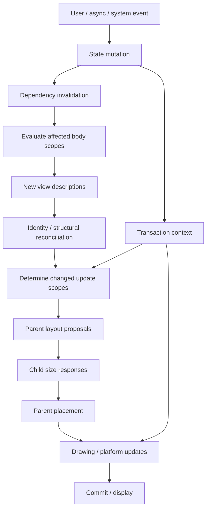
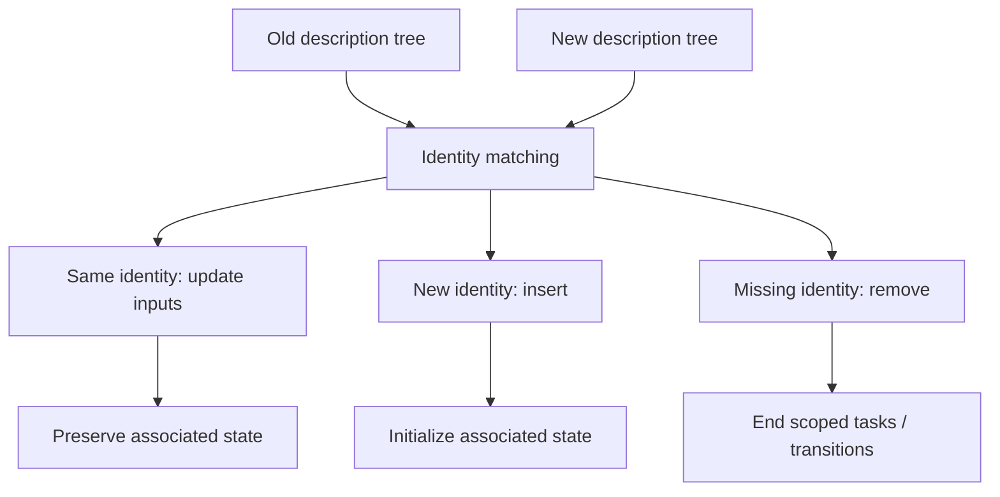
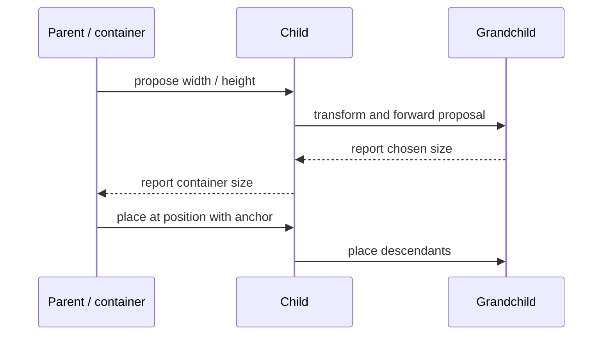
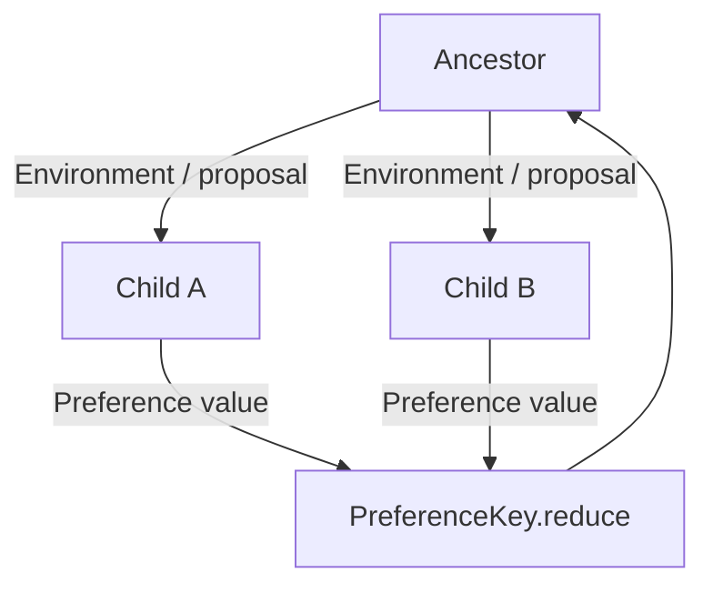
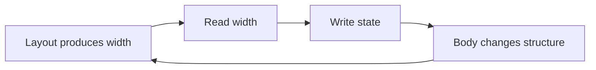

# SwiftUI 更新与布局：从依赖跟踪、Transaction 到 Proposal-Response 协议

> SwiftUI 更新不是“状态一变就重画整个页面”，布局也不是 Auto Layout 的约束求解。框架先根据状态读取关系失效相关描述，重新求值必要的 `body`，再用 Identity 协调新旧结构；布局阶段由 Parent 向 Child 提出尺寸建议，Child 返回自己选择的尺寸，Parent 最终放置。Transaction 携带本轮更新的动画语义，Environment、Preference 和 Geometry 则分别处理向下输入、向上汇总与空间读取。理解这些方向，才能定位无效刷新、布局反馈循环和动画范围失控。

---

## 一、本文解决什么问题

SwiftUI 工程中经常遇到这些问题：

- 某个 `@Observable` 属性变化后，哪些 View 会重新求值？
- `body` 重新执行是否等于子树全部重建、重新布局和重绘？
- SwiftUI Diffing 是否就是对 View Value 做 `Equatable` 比较？
- Transaction 与 Animation 有什么关系，一次 Action 中的多个状态修改如何合并？
- Parent 提出的 Layout Proposal 是强制尺寸吗，Child 可以拒绝吗？
- `frame(width:)`、`fixedSize()`、`layoutPriority` 分别改变哪一段布局协商？
- 自定义 `Layout` 的 `sizeThatFits` 与 `placeSubviews` 应如何设计？
- Alignment Guide 为什么能让不同尺寸的 Child 对齐？
- Environment 与 Preference 的传播方向有什么不同？
- `GeometryReader` 为什么经常撑满空间或导致布局跳动？
- Geometry/Preference 写回 State 为什么可能形成反馈循环？
- `.animation(_:value:)`、`withAnimation`、`transaction` 如何影响动画范围？
- 如何用 Instruments 找到真正的无效更新，而不是盲目拆 View？

这些问题的共同主线是：**更新决定“哪些描述需要重新计算”，布局决定“这些描述最终占多大、放在哪里”，动画事务决定“几何和可动画值如何从旧状态过渡到新状态”。**

本文以现代 SwiftUI 为主。自定义 `Layout` 协议以 iOS 16+/macOS 13+ 为基线；Observation 精确属性跟踪以 iOS 17+/macOS 14+ 为主；早期 `ObservableObject` 模型仍会说明其失效粒度。示例在 2026-07-31 使用 Xcode 26.1.1、Apple Swift 6.2.1 与 iOS Simulator SDK 验证。SwiftUI 内部 Graph、Diff Algorithm、Update Coalescing、Layout Cache 和 Render Backend 不是公开契约，不能依赖私有类型名或观察到的固定调用次数。

### 核心结论

1. Dependency Tracking 来自 View 求值期间读取的 Dynamic Property、Environment 和 Observable State。某个依赖变化会使相关 View Scope 需要更新，不代表整个 App 无条件重建。
2. Body Evaluation 只生成新的 View Description。`body` 被调用不等于对应平台 View 重建，也不必然导致所有 Descendant 重新布局或绘制；后续还要经过 Identity 协调和属性变化判断。
3. `body` 调用次数、顺序和合并批次不是业务契约。Body 必须轻量、无副作用，昂贵计算应移到可缓存的 Model/Derived State 层。
4. SwiftUI 使用 View 类型、结构位置、显式 ID 和输入等信息协调新旧树，但具体 Diffing 算法不公开。`Equatable`/`.equatable()` 只是特定边界工具，不是框架更新机制的完整描述。
5. Transaction 是一次状态更新传播携带的上下文，可包含 Animation、是否禁用 Animation 等信息。`withAnimation` 创建带动画的更新事务，`.animation(_:value:)` 为指定 Value 变化注入动画语义。
6. SwiftUI Layout 是 Parent-to-Child Proposal、Child-to-Parent Size Response、Parent Placement 的协商协议。Proposal 是建议，不一定是硬约束；不同 View 对同一 Proposal 可返回不同尺寸。
7. `frame` 通常增加一个布局包装层，既向 Child 提出建议，又向 Parent 报告自身尺寸；它不是直接修改底层 View Frame 的命令式赋值。
8. `fixedSize` 让 View 在指定 Axis 更倾向于使用 Ideal Size，可能超出 Parent 可用空间；`layoutPriority` 影响 Container 在空间竞争时的分配策略，不等同于 Auto Layout Priority。
9. Alignment 通过 Child 的 Alignment Guide 和 Container 选择的 Alignment 协调放置。自定义 Alignment 适合跨兄弟对齐，不应靠 Geometry 全局测坐标后手动 Offset。
10. Environment 主要从祖先向后代传播输入，Preference 从后代向祖先汇总信息。PreferenceKey 的 Reduce 必须可重复、顺序假设谨慎且避免副作用。
11. Geometry 是特定 Coordinate Space 下的布局结果读取。读取 Geometry 后立刻写 State 会启动下一轮更新，若值持续抖动或改变原布局，就可能形成反馈循环。
12. Animation Transaction 决定可动画变化是否和如何过渡，但 Transition 还依赖 Identity 的插入/移除。随机 `.id`、过宽动画 Scope 和多个 Modifier Transaction 可能让动画不可预测。
13. 无效更新定位必须从 State Mutation、Dependency、Body Evaluation、Layout、Display 分阶段测量。View Body 多并不自动等于性能问题，昂贵 Body 少量执行也可能卡顿。

---

## 二、完整更新与布局管线



这是一张工程心智模型图，不表示 SwiftUI 每次都以固定同步顺序调用公开 Hook。框架可以跳过无变化阶段、合并多个 Mutation、缓存 Layout Result 或延迟 Display。

需要区分四种成本：

- **Invalidation**：哪些 Scope 被标记需要更新；
- **Evaluation/Reconciliation**：重新生成描述并协调身份；
- **Layout**：协商尺寸与位置；
- **Render/Platform Update**：文本、图片、Shape、Layer 和原生控件更新。

优化必须先确定成本发生在哪一层。

---

## 三、Dependency Tracking：谁读取，谁建立依赖

### 3.1 Observation 模型

```swift
@Observable
@MainActor
final class DashboardModel {
    var title = "Overview"
    var unreadCount = 0
    var chartPoints: [Double] = []
}
```

两个 Child 分别读取不同属性：

```swift
struct DashboardHeader: View {
    let model: DashboardModel

    var body: some View {
        Text(model.title)
    }
}

struct UnreadBadge: View {
    let model: DashboardModel

    var body: some View {
        Text("\(model.unreadCount)")
    }
}
```

在 iOS 17+ Observation 语义下，实际求值路径中读取的属性构成依赖。只修改 `chartPoints` 时，这两个 Child 没有直接读取它；框架可避免因该属性对它们做不必要更新。

### 3.2 间接读取同样算依赖

```swift
extension DashboardModel {
    var accessibilitySummary: String {
        "\(title), \(unreadCount) unread"
    }
}
```

View 读取 `accessibilitySummary` 时，Getter 内部读取的 `title` 和 `unreadCount` 都属于实际依赖路径。不要只看 View Source 中出现了哪个 Property Name。

### 3.3 旧版 `ObservableObject` 粒度

Combine-based `ObservableObject` 通常通过 `objectWillChange` 通知观察者“对象将变化”，`@Published` Property 会触发该通知。它不等同于 Observation 的逐属性访问跟踪。一个较大的 Object 被许多 View 观察时，任一 Published 字段变化可能让更广 Scope 重新评估。

是否需要拆分 Model，应基于：

- Feature Ownership 是否独立；
- 更新频率是否差异显著；
- Instruments 中 Update Cause 与 Body Cost；
- 拆分后依赖和一致性成本。

不要为了追求“零刷新”把每个字段拆成一个对象。

### 3.4 Environment 依赖

读取 `colorScheme`、`dynamicTypeSize`、Locale 或自定义 Environment Key 会建立相应依赖。系统设置、Scene 或祖先 Override 变化时，相关 View 需要重新求值/布局。把巨大可变结构塞进一个 Environment Value，可能让无关字段变化也替换整个值并扩大失效范围。

---

## 四、Body Evaluation：重新求值不是重建一切

```swift
struct ProductCard: View {
    let product: ProductViewState

    var body: some View {
        VStack(alignment: .leading) {
            Text(product.title)
                .font(.headline)
            Text(product.priceText)
                .monospacedDigit()
        }
    }
}
```

Parent 更新后，`ProductCard.body` 可能重新求值，生成新的 `VStack/Text` 描述。随后 SwiftUI 根据 Identity、类型和输入协调已有内容。不能从一次 Body Call 推断：

- 两个 Text 的 Platform Object 被销毁重建；
- 一定执行完整 Layout；
- 一定重绘所有像素；
- `onAppear` 必定重新调用；
- 子 View State 必定重置。

### 4.1 Body 中什么算昂贵

错误示例：

```swift
var body: some View {
    let rows = rawRecords
        .map(expensiveNormalize)
        .sorted(by: expensiveComparator)

    List(rows) { row in
        RowView(row: row)
    }
}
```

如果 Source/Sort Input 未变化，这类工作不应每次求值重做。可以在 Repository 查询、Model Derived Cache 或 State Revision 变化时计算。移动后还要测量，因为 List Layout、图片或文本可能才是主瓶颈。

### 4.2 拆小 View 的真实作用

拆出 Child View 可以：

- 形成更清晰的依赖读取边界；
- 隔离昂贵 Body；
- 改善测试和 Ownership；
- 让静态类型与 Identity 更清晰。

但拆分并不保证每个 Child 都不会求值，也可能增加泛型结构和维护成本。边界应围绕独立输入、状态和布局职责，而不是机械追求代码行数。

### 4.3 Body 无副作用

Body 中不能发请求、写 State 或记录“只执行一次”埋点。求值次数由框架决定，Preview、Accessibility、Layout 和不同 OS 优化都会改变时机。副作用应放到 Action、`.task`、`onChange` 或 Model Effect，并具备幂等和取消。

---

## 五、Diffing 与 Identity 协调

SwiftUI 会比较新旧描述并确定保留、更新、插入和移除哪些逻辑节点，但其算法不是公开 ABI。稳定可依赖的输入包括：

- View Static Type；
- Structural Position；
- `ForEach`/`.id` Explicit Identity；
- Modifier/Conditional Structure；
- State/Environment Dependencies。



### 5.1 `Equatable` 不是完整 Diff 模型

某些 View 可以使用 `Equatable`/`.equatable()` 提供额外的相等性短路边界，但必须满足：

- Equality 覆盖所有影响输出的输入；
- 不遗漏 Environment、Closure 捕获或外部依赖；
- 比较成本小于跳过工作的收益；
- 用 Instruments 验证确实减少昂贵更新。

错误 Equality 会让 UI 停留在旧状态。也不能据此推断 SwiftUI 默认对所有 View 做逐字段反射比较；内部策略会演进。

### 5.2 Identity 比视觉相似更重要

两个分支即使都显示相同 Text，只要 Structural Identity 不同，仍可能是移除和插入。动画、State 和 Task 生命周期依据身份，不依据截图像不像。

---

## 六、Transaction：一次更新携带的上下文

Transaction 随状态变化传播，可包含 Animation 和控制标志。它不是数据库事务，也不保证业务 Mutation 的 ACID 原子性。

### 6.1 `withAnimation`

```swift
Button("Toggle details") {
    withAnimation(.easeInOut(duration: 0.25)) {
        isExpanded.toggle()
    }
}
```

闭包中的状态变化被放入带指定 Animation 的 Transaction。受影响子树中可动画的值可以从旧状态过渡到新状态。Duration 是产品示例值，不是系统性能结论。

### 6.2 `.animation(_:value:)`

```swift
DetailPanel(isExpanded: isExpanded)
    .animation(.easeInOut, value: isExpanded)
```

只有 `isExpanded` 变化时，该 Modifier 才为相关更新注入动画语义。相较旧式无 Value 的隐式动画，它更容易限制触发条件，但 Scope 仍由 Modifier 所在子树决定。

### 6.3 修改 Transaction

```swift
ProgressView(value: progress)
    .transaction { transaction in
        if reduceMotion {
            transaction.animation = nil
        }
    }
```

也可以使用 `withTransaction` 为特定 Mutation 提供 Transaction。子树 Modifier 可以继续修改传入 Transaction，因此最终动画是作用域组合结果，不应简单理解为“最近一个 Animation 永远覆盖所有内容”。

### 6.4 多次 State Mutation 的批次

同一同步 Action 中多个 State 写入通常会被 SwiftUI 协调到更新流程中，但确切合并策略和 Body 次数不是契约。业务一致性应在 Model/Reducer 中一次提交合法 State，而不是依赖框架“恰好只渲染最后一次”。

---

## 七、Layout Proposal 与 Size Response

SwiftUI Layout 的核心方向：



Proposal 的某个 Dimension 可以是具体值、未指定或特殊建议。Child 根据自身语义返回 Size：

- `Text` 会根据 Proposed Width 换行并报告高度；
- `Image` 的 Resizable/Aspect Ratio 会改变响应；
- `Spacer` 倾向于占用可用弹性空间；
- Shape 通常适应 Container 提议；
- Fixed-size View 可能报告 Ideal Size 并超出建议。

### 7.1 Proposal 不是 Auto Layout Constraint

Auto Layout 同时求解关系方程；SwiftUI Container 更像逐层询问 Child。Parent 可以接受 Child 报告的尺寸，再按 Container 规则放置。Proposal 并非绝对上限，Clip 也不是默认发生。

### 7.2 `frame` 是包装层

```swift
Text("Status")
    .frame(width: 120, alignment: .leading)
    .background(.yellow)
```

概念上，Frame Modifier 向 Child 提出适当建议，然后自身向 Parent 报告 120 宽，并在内部按 Leading 放置 Text。Text 自身的自然尺寸未必变成 120。

这解释了 Modifier 顺序：

```swift
Text("Status")
    .background(.yellow)
    .frame(width: 120)
```

Yellow 只围绕 Text；如果 Background 放在 Frame 后，Yellow 覆盖 Frame 区域。

### 7.3 `fixedSize`

```swift
Text(message)
    .fixedSize(horizontal: false, vertical: true)
```

常用于让多行 Text 在 Vertical Axis 使用理想高度，避免被某些 Parent Proposal 压扁。但它可能让内容超出可用空间，不能作为所有截断问题的万能修复。先检查 Parent Frame、Line Limit、Layout Priority 和 Scroll Container。

### 7.4 `layoutPriority`

```swift
HStack {
    Text(title)
        .layoutPriority(1)
    Text(timestamp)
        .foregroundStyle(.secondary)
}
```

Container 空间不足时，Priority 更高的 Child 通常获得更优先的尺寸机会。它不是 Auto Layout 的 1–1000 Priority，也不能保证任意自定义 Layout 都采用相同分配算法；自定义 Container 应自己定义如何使用 Subview Priority。

---

## 八、Size Response 与自定义 `Layout`

iOS 16+ 可以实现 `Layout`：

```swift
struct EqualWidthRow: Layout {
    var spacing: CGFloat = 8

    func sizeThatFits(
        proposal: ProposedViewSize,
        subviews: Subviews,
        cache: inout Void
    ) -> CGSize {
        guard !subviews.isEmpty else { return .zero }

        let proposedWidth = proposal.width ?? 0
        let totalSpacing = spacing * CGFloat(max(0, subviews.count - 1))
        let itemWidth = max(0, (proposedWidth - totalSpacing) / CGFloat(subviews.count))

        let heights = subviews.map {
            $0.sizeThatFits(ProposedViewSize(width: itemWidth, height: proposal.height))
                .height
        }

        return CGSize(
            width: proposedWidth,
            height: heights.max() ?? 0
        )
    }

    func placeSubviews(
        in bounds: CGRect,
        proposal: ProposedViewSize,
        subviews: Subviews,
        cache: inout Void
    ) {
        guard !subviews.isEmpty else { return }

        let totalSpacing = spacing * CGFloat(max(0, subviews.count - 1))
        let itemWidth = max(0, (bounds.width - totalSpacing) / CGFloat(subviews.count))

        for (index, subview) in subviews.enumerated() {
            let x = bounds.minX + CGFloat(index) * (itemWidth + spacing)
            subview.place(
                at: CGPoint(x: x, y: bounds.minY),
                anchor: .topLeading,
                proposal: ProposedViewSize(width: itemWidth, height: bounds.height)
            )
        }
    }
}
```

### 8.1 示例边界

这个最小示例假设 Parent 提供有限 Width。`proposal.width == nil` 时直接使用 0 并不适合生产组件；更完整实现应询问 Subview Ideal Size，决定 Unspecified/Infinity Proposal 策略，并考虑：

- Layout Direction/RTL；
- Baseline Alignment；
- Spacing Preference；
- Empty/Subview Count 变化；
- Child 返回非有限尺寸；
- Cache 和失效输入；
- Accessibility Dynamic Type；
- Animatable Layout Data。

代码保留这个限制是为了突出 Proposal/Response/Placement 三步，不能直接作为通用 Grid。

### 8.2 `sizeThatFits` 应尽量纯粹

它可能被多次、以不同 Proposal 调用。不要在其中：

- 写外部 State；
- 发请求或记录一次性埋点；
- 假设先调用某个固定 Proposal；
- 修改 Child 数据；
- 依赖上一次 Frame 而没有正确 Cache Key。

### 8.3 Cache

`makeCache`/`updateCache` 可缓存与 Subview 集合相关的测量数据，但 Cache 必须在 Proposal、Subview Content、Environment 或 Count 变化时仍正确。缓存是否有收益需要 Instruments 证明；错误 Cache 会产生尺寸过期和布局跳动。

---

## 九、Alignment：不是简单的 Center/Leading

Container 按 Alignment Guide 对齐 Child。每个 Child 可根据自己的 Dimensions 提供 Guide 值。

### 9.1 Baseline 对齐

```swift
HStack(alignment: .firstTextBaseline) {
    Text("Total")
        .font(.body)
    Text("$199")
        .font(.largeTitle.bold())
}
```

相比 `.center`，First Text Baseline 更符合不同 Font Size 的排版语义。

### 9.2 自定义 Alignment

```swift
private enum PriceColumnAlignment: AlignmentID {
    static func defaultValue(in context: ViewDimensions) -> CGFloat {
        context[HorizontalAlignment.trailing]
    }
}

extension HorizontalAlignment {
    fileprivate static let priceColumn = HorizontalAlignment(PriceColumnAlignment.self)
}
```

Child 提供 Guide：

```swift
VStack(alignment: .priceColumn) {
    PriceRow(name: "Subtotal", value: "$180")
    PriceRow(name: "Tax", value: "$19")
}
```

在 `PriceRow` 内让 Price Text 的 `.alignmentGuide(.priceColumn)` 返回相应 Dimensions，即可跨兄弟对齐。Guide Closure 应是轻量几何计算，不写 State。

### 9.3 Offset 与 Alignment 的区别

`offset` 通常改变绘制/放置效果，但原布局占位语义可能仍基于未偏移位置；Alignment 则参与 Container Placement。需要兄弟间结构对齐时优先 Alignment，需要纯视觉位移/动画时才考虑 Offset，并验证 Hit Testing/Accessibility。

---

## 十、Preference：从 Child 向 Ancestor 汇总

Environment 主要向下，Preference 向上：



### 10.1 PreferenceKey

```swift
private struct MaxTitleWidthKey: PreferenceKey {
    static var defaultValue: CGFloat = 0

    static func reduce(value: inout CGFloat, nextValue: () -> CGFloat) {
        value = max(value, nextValue())
    }
}
```

Child 可以通过 Geometry 在 Background 中报告 Width，Ancestor 使用 `onPreferenceChange` 接收最大值。

### 10.2 Reduce 必须符合汇总语义

- `max`、`min`、`sum`、`append` 各有不同语义；
- 不要依赖未公开的 Child Traversal 顺序来选“最后一个”；
- Value 应轻量、可比较；
- Reduce 不执行副作用；
- 没有 Child 提供值时使用 Default；
- Child Identity 变化后旧 Preference 不应被业务永久缓存。

### 10.3 Preference 不是通用数据总线

它适合布局/展示元数据：尺寸、Anchor、标题、滚动可见信息等。业务事件、网络状态和双向表单数据应走 Action/Binding/Model。滥用 Preference 会把数据流绑定到布局 Pass，难以测试并形成反馈循环。

---

## 十一、Geometry：读取空间，而不是命令式布局

`GeometryReader` 给出当前 Container 提供的 Geometry Proxy：

```swift
GeometryReader { proxy in
    let columns = proxy.size.width >= 700 ? 3 : 2
    GridContent(columns: columns)
}
```

它本身是 Container，并倾向于采用 Parent 提供的可用空间。因此直接放进 `VStack` 可能比预期占据更多空间。这不是 Reader “返回了错误尺寸”，而是其布局行为与只想测量 Child 的需求不匹配。

### 11.1 在 Background 中测量 Child

```swift
Text(title)
    .background {
        GeometryReader { proxy in
            Color.clear
                .preference(
                    key: MaxTitleWidthKey.self,
                    value: proxy.size.width
                )
        }
    }
```

Background 接收主 View 的尺寸 Proposal/结果，Reader 不会像顶层 Container 那样独立撑开 Stack。仍应注意测量写回可能触发下一轮布局。

### 11.2 Coordinate Space

Geometry Frame 取决于 Coordinate Space：

- `.local`：当前 View 本地空间；
- `.global`：全局空间，受 Window/Scene/平台影响；
- `.named(...)`：自定义祖先空间。

滚动 Offset、Sticky Header 和 Drag Target 应选稳定的 Named Coordinate Space，不要把 Global Frame 当跨 Window 永久坐标。

### 11.3 避免 Geometry-State 反馈循环



治理方式：

- 只在新值与旧值有意义地不同时写入；
- 尺寸取整/容差要符合业务，不编造统一阈值；
- 不让测量值反过来连续改变被测 View 的同一 Dimension；
- 能用 Container、Alignment、Layout、ViewThatFits 表达时不写 State；
- 高频 Scroll Geometry 使用系统针对版本提供的滚动 API，并测量 Update Frequency；
- 将 Preference Value 限制为最小必要信息。

---

## 十二、Animation Transaction：变化如何过渡

### 12.1 Animatable Value 与 Identity Transition

两类动画要区分：

- 同一 Identity 的可动画属性变化：Opacity、Scale、Offset、Shape Data 等插值；
- Identity 插入/删除：通过 `transition` 描述进入/退出。

```swift
if isPresented {
    BannerView()
        .transition(.move(edge: .top).combined(with: .opacity))
}
```

需要在带 Animation 的 Transaction 中改变 `isPresented`，Transition 才有动画机会。若 Identity 不稳定，每次都可能被解释为替换；若 View 只是 `.opacity(0)`，它并未被移除，也不会运行 Removal Transition。

### 12.2 动画 Scope 过宽

```swift
RootContent(state: state)
    .animation(.default, value: state)
```

若 `state` 是大型 Struct，任何字段变化都可能让整个子树获得 Animation Transaction，包括本不该动画的 Error、Scroll 或 Layout 变化。更合理的是绑定到具体语义值并缩小 Modifier Scope。

### 12.3 禁用特定子树动画

```swift
CounterText(value: count)
    .transaction { transaction in
        transaction.animation = nil
    }
```

这修改的是进入该子树的 Transaction。父级、兄弟和后续 Modifier 仍可能有不同事务语义，调试时应按 Modifier 顺序和 Scope 分析。

### 12.4 Reduce Motion

```swift
@Environment(\.accessibilityReduceMotion) private var reduceMotion
```

减少动态效果不一定意味着取消所有反馈，可替换大幅 Move/Scale 为短促 Opacity 或无动画状态切换。产品行为要在真机和 Accessibility 设置下验证。

### 12.5 动画中断与业务状态

SwiftUI Animation 表达视觉过渡，业务 State 通常会立即切换到目标值。不要把“动画完成”误当成业务事务提交；需要完成回调、取消或交互式状态时，应使用明确 API/State Machine，并核对目标 OS 支持的 Animation Completion 语义。

---

## 十三、无效更新定位

“View 一直刷新”可能指：

- Body Evaluation 频繁；
- Layout Pass 频繁；
- Draw/Platform Update 昂贵；
- Animation 连续驱动帧；
- State Feedback Loop；
- List Row Identity 不稳定；
- Timer/Progress 高频写入；
- Parent 传入每次都变化的 Closure/Value。

必须先定义现象。

### 13.1 SwiftUI Instruments

在目标 OS/Xcode 支持下，使用 SwiftUI Instrument 查看：

- View Body / Update Activity；
- Update Cause/依赖来源；
- Long Body/Long Update；
- Identity 或 View 生命周期相关事件；
- 与 Time Profiler、Animation Hitch 的时间关联。

工具名称和字段会随 Xcode 变化，应以当前版本 Instrument 模板为准。

### 13.2 调试变更原因

SwiftUI 提供过以下划线命名的 Debug Diagnostics（例如在 Body 中输出变化原因）。这类接口适合本地诊断，但名称和输出不是稳定生产契约；使用前检查当前 SDK，不能把输出解析成线上逻辑。

更稳定的工程方法是：

- 为状态 Mutation 添加 Signpost；
- Model 记录匿名 Revision、Action 和 Commit；
- 把 View 输入收敛为可检查的 View State；
- 使用 Instruments 关联 Mutation 与 Body/Layout；
- 避免在 Body 打大量 Log 改变时序和性能。

### 13.3 常见根因

| 症状 | 常见根因 | 修复方向 |
|---|---|---|
| 全屏随进度刷新 | 大 Model/Environment 粗粒度读取 | 拆 Feature Scope、只读取所需属性 |
| Row 状态重置 | ID 使用 Index/随机 UUID | 稳定业务 ID |
| Body 循环 | Body/Geometry/Preference 写 State | 移除副作用、值去重、改用 Layout |
| 滚动卡顿 | Body 内排序、图片解码、Text 格式化 | 移到 Model/后台/缓存并测量 |
| 动画波及无关区域 | Animation Modifier Scope 太高、Value 太粗 | 缩小 Scope 和触发 Value |
| Geometry 抖动 | 测量值改变被测布局 | 断开反馈、使用 Alignment/Layout |
| 自定义 Layout 很慢 | 重复测量、Cache 失效、复杂算法 | Signpost、Cache 正确性、降低复杂度 |

### 13.4 不要过度使用 `EquatableView`

当 Body 本身便宜，比较大型 Value 可能比重新描述更贵；Equality 还容易遗漏 Environment 和隐式依赖。先测量 Long Body，再决定是否建立相等性边界。多数问题优先从稳定 Identity、正确 Ownership 和移除 Body 昂贵工作解决。

---

## 十四、常见误区与修复

### 14.1 错误：Body 执行等于整个子树重绘

**问题：** 混淆描述生成、协调、布局和渲染阶段。

**修复：** 用 SwiftUI Instruments + Time Profiler 区分 Body、Layout 和 Draw 成本，不从 Log 次数直接下结论。

### 14.2 错误：Proposal 是 Parent 强制的最终 Frame

**问题：** Child 可以按语义返回不同 Size，Fixed-size 内容甚至可能超过建议。

**修复：** 沿 Parent Proposal → Child Response → Placement 分析 Modifier 和 Container。

### 14.3 错误：`frame(width:)` 直接改了 Text 本身尺寸

**问题：** Frame 通常是包装层，Text 仍按自身 Proposal 和 Ideal Size 布局。

**修复：** 结合 Background/Border 观察每层 Bounds，并检查 Modifier 顺序。

### 14.4 错误：GeometryReader 只测量、不参与布局

**问题：** 它是 Container，会采用 Parent 提议空间并影响 Stack。

**修复：** 仅测 Child 时放在 Background/Overlay，或用 Layout/Preference/新版本专用 API。

### 14.5 错误：Preference 是 Child-to-Parent Binding

**问题：** Preference 是布局树中的汇总值，不提供稳定双向写入所有权。

**修复：** 业务数据用 Binding/Model，Preference 只传展示和布局元数据。

### 14.6 错误：全 Root 加 `.animation(.default, value: appState)`

**问题：** 大状态任意变化都可能让广泛子树获得动画事务。

**修复：** 动画绑定具体语义值，放在最小需要 Scope；关键子树可按事务禁用。

### 14.7 错误：Geometry 变化每次无条件写 State

**问题：** 每次 Layout 触发新 State，State 又改变 Layout，形成循环或抖动。

**修复：** 去重、避免自影响，优先用 Alignment/Custom Layout 直接解决空间关系。

---

## 十五、工程案例：可展开且等宽的指标面板

需求：

- 多个指标 Card 等宽；
- Dynamic Type 下高度自适应；
- 展开详情时只动画目标 Card；
- Card 数变化时保持稳定 ID；
- 不用 Geometry-State 循环计算宽度。

```swift
struct Metric: Identifiable {
    let id: UUID
    let title: String
    let value: String
    let detail: String
}

struct MetricsPanel: View {
    let metrics: [Metric]
    @State private var expandedID: Metric.ID?

    var body: some View {
        EqualWidthRow(spacing: 12) {
            ForEach(metrics) { metric in
                MetricCard(
                    metric: metric,
                    isExpanded: expandedID == metric.id
                )
                .contentShape(Rectangle())
                .onTapGesture {
                    withAnimation(.easeInOut) {
                        expandedID = expandedID == metric.id ? nil : metric.id
                    }
                }
            }
        }
    }
}
```

该设计中：

- `Metric.ID` 保证 Identity；
- `expandedID` 是唯一状态源；
- `isExpanded` 是 Derived State；
- EqualWidthRow 直接在 Layout 协议中分配宽度；
- 不需要先 Geometry 测宽再写 State；
- Animation 只包围展开状态 Mutation；
- Dynamic Type 高度由 Child Size Response 决定。

生产实现还要补充窄屏下 Column 数/换行策略、RTL、VoiceOver Button 语义、Reduce Motion 和 EqualWidthRow 未指定 Width 的处理。

### 15.1 验证矩阵

- Metric Insert/Delete/Move 时展开状态跟随 ID；
- Dynamic Type 最大档无裁切；
- Split View/旋转后重新 Proposal，无宽度缓存过期；
- 快速连续点击时动画可中断且最终状态正确；
- Reduce Motion 下替代动画符合设计；
- Body 中无排序、格式化和 I/O；
- Layout `sizeThatFits` 调用次数与耗时可接受；
- VoiceOver 能表达展开/收起 Action 和状态。

---

## 十六、性能测量方法

### 16.1 环境

- Release/Profile Build；
- 目标真机和固定 OS；
- 固定数据规模、Dynamic Type、窗口宽度；
- 分别测试静止更新、滚动、旋转和动画；
- 冷/热图片与缓存条件分开。

### 16.2 指标

- State Mutation 到下一帧显示的时延；
- Body Evaluation 次数和 Long Body；
- Layout Pass/Custom Layout 测量次数；
- Main Thread CPU 与锁等待；
- Animation Hitch/Frame Time 分布；
- Allocation 和 View/Task 生命周期；
- Geometry/Preference State 写入频率。

### 16.3 验证优化

1. 建立可重复基线；
2. 找到主耗时调用栈/更新原因；
3. 一次只改变一个结构或依赖边界；
4. 比较 P50/P95 与 Hitch，而不只看一次平均值；
5. 检查 Identity、动画和 Accessibility 行为未回归；
6. 删除没有证据收益的 Cache/Equatable/AnyView Workaround。

不能宣称“拆 View”“加 Equatable”“避免 GeometryReader”必然更快。它们只有在对应瓶颈存在且实现正确时才有收益。

---

## 十七、总结

SwiftUI 更新从依赖变化开始：相关 Scope 失效、`body` 重新求值、Identity 协调新旧描述，再决定是否需要布局和渲染。Body Call 只是描述生成，不等于平台对象全重建。Diffing 的内部算法不公开，工程上应依赖稳定类型结构和 Identity，而不是猜测反射比较规则。

布局采用 Proposal-Response-Placement 协议：Parent 提议，Child 选择并返回尺寸，Parent 放置。`frame`、`fixedSize`、`layoutPriority` 都在这条协商链上改变行为；Alignment 处理兄弟对齐，Environment 向下传输入，Preference 向上汇总元数据，Geometry 读取特定坐标空间结果。

Transaction 携带更新动画语义，`withAnimation`、`.animation(_:value:)` 和 `.transaction` 作用域不同。Transition 还依赖 Identity 插入/移除。无效更新和布局循环必须通过 Instruments、Signpost 和阶段拆分定位，而不是只看 Body Log。

真正需要记住的是：**依赖决定谁需要更新，Identity 决定谁仍是同一个，Proposal/Response 决定尺寸，Transaction 决定变化如何过渡。Geometry 读到的是布局结果，把它写回状态就意味着主动开始下一轮。**

## 问答复盘

### Q1：`body` 重新执行是否意味着整棵子树重建和重绘？

**答：** 不意味着。Body 只生成新描述，SwiftUI 还会按 Identity 协调，并可跳过无变化的布局、平台更新或绘制。应使用 Instruments 分阶段确认成本。

### Q2：Observation 下某属性变化，哪些 View 会受影响？

**答：** 主要是求值期间实际读取该属性的相关 View Scope。Computed Property 内的间接读取也会建立依赖；旧版 ObservableObject 通知粒度通常更粗。

### Q3：SwiftUI Diffing 是否就是比较两个 View 的 `Equatable`？

**答：** 不是。框架结合类型、结构位置、显式 ID 和依赖协调新旧描述，具体算法不公开。Equatable 只是可选短路工具，且必须完整覆盖输出输入。

### Q4：Transaction 与 Animation 的区别是什么？

**答：** Transaction 是一次更新传播的上下文，Animation 是其中可携带的一项语义。Transaction 还可禁用或修改子树动画，并随 Modifier Scope 继续传播。

### Q5：Layout Proposal 是否是 Child 必须服从的最大尺寸？

**答：** 不一定。Proposal 是建议，Child 根据自身语义返回 Size；Fixed-size 内容可能超过建议。最终由 Parent 按 Container 规则放置，是否 Clip 由额外 Modifier 决定。

### Q6：`frame(width: 120)` 是否把 Text 的自然宽度改成 120？

**答：** 通常不是。Frame 是包装布局层，向 Parent 报告 120 宽，并在内部按 Alignment 放置 Text；Text 自身仍按收到的 Proposal 计算内容尺寸。

### Q7：Environment 与 Preference 最容易混淆的方向是什么？

**答：** Environment 主要从 Ancestor 向 Descendant 传播输入，Preference 从 Descendant 向 Ancestor 汇总布局/展示元数据。Preference 不是业务 Binding。

### Q8：为什么 GeometryReader 放进 VStack 后经常占满剩余空间？

**答：** 因为它是 Layout Container，会接受 Parent 的可用空间，而不只是旁路测量工具。只测 Child 时可放在 Background/Overlay，或改用 Custom Layout/Preference。

### Q9：Geometry 写回 State 为什么可能无限更新？

**答：** Layout 产生 Geometry，State 写入触发 Body，Body 又改变 Layout。如果新 Geometry 持续变化，就形成反馈。应去重、断开自影响，优先用 Layout/Alignment 直接表达关系。

### Q10：发现 Body 调用很多，第一步是否应给所有 View 加 `.equatable()`？

**答：** 不应。先用 SwiftUI Instruments 确认哪些 Body 昂贵以及更新原因。Equality 比较本身有成本和正确性风险，稳定 Identity、缩小依赖、移除 Body 重计算通常更优先。

## 延伸知识

- SwiftUI `Layout` Cache、LayoutValueKey 与 Custom Spacing
- `ViewThatFits`、Container Relative Frame 与响应式布局
- Anchor Preference、Scroll Geometry 与 Sticky Header
- Animatable、VectorArithmetic 与 Custom Shape Animation
- Matched Geometry Effect 与 Identity
- Navigation Transaction、Interactive Transition 和动画中断
- Core Animation Transaction、Layer Commit 与 SwiftUI Render Pipeline
- SwiftUI Instruments、Time Profiler 与 Animation Hitches 联合分析
