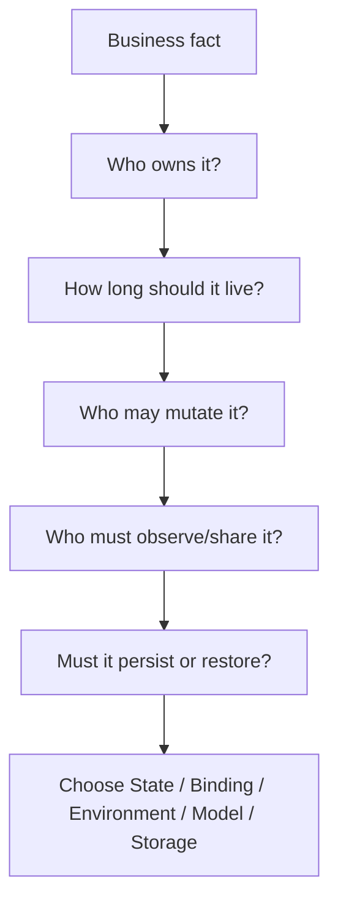
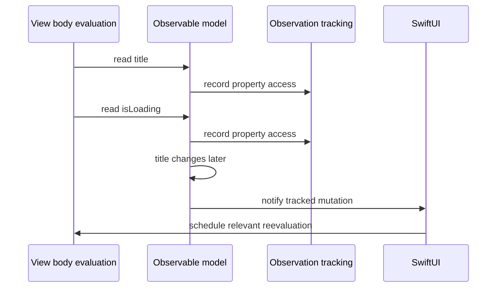
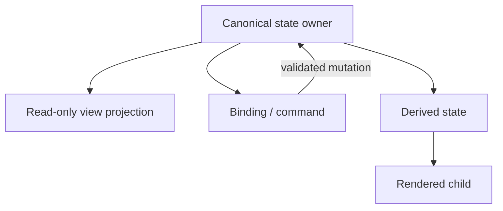
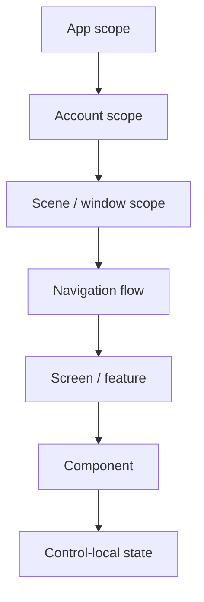
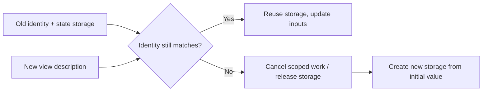
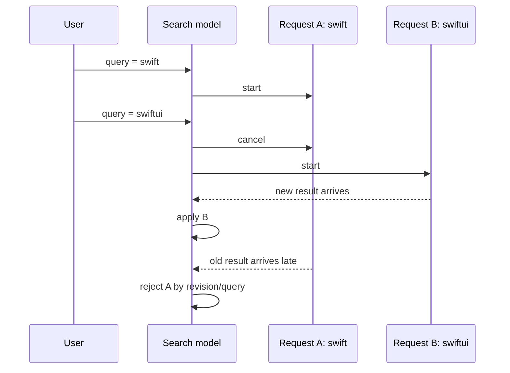
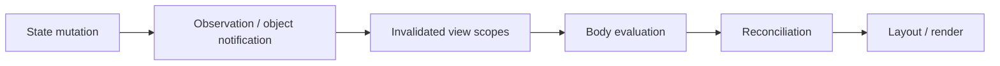

# SwiftUI 状态与数据流：从所有权、Observation 到异步竞态治理

> SwiftUI 状态 API 的差异不只是语法，而是所有权契约：谁创建状态、谁决定生命周期、谁可以写入、哪些读取会建立更新依赖。`@State` 保存 View Identity 关联的局部状态，`@Binding` 借用外部读写通道，Environment 沿子树注入作用域依赖；Observation 与旧版 `ObservableObject` 又有不同的跟踪和所有权工具。选错包装器的后果通常不是立即编译失败，而是状态重置、重复实例、更新范围失控或异步旧结果覆盖新状态。

---

## 一、本文解决什么问题

SwiftUI 工程中经常遇到这些问题：

- `@State` 的值究竟存在哪里，为什么 View Struct 重建后仍能保留？
- `@Binding` 是否复制状态，Child 能否长期持有它？
- `@Environment` 适合传 Theme，是否也适合传 Feature Model？
- Observation 如何知道某个 View 读取了哪些属性？
- `@Observable` 与 `ObservableObject`/`@Published` 有什么版本和机制差异？
- iOS 17+ 中为什么 `@State` 可以持有 `@Observable` Reference？
- `@StateObject` 与 `@ObservedObject` 谁负责创建对象？
- Parent 更新时，Child 内 `@State(initialValue:)` 为什么不会跟着重置？
- 什么是 Single Source of Truth，缓存一份派生数组是否算重复状态？
- Derived State 应在 `body` 计算、Model 中计算，还是另行存储？
- Sheet、Navigation、`ForEach` Identity 变化时 State 为什么重建？
- 搜索词快速变化、页面退出、刷新重试时，如何防止旧请求覆盖新结果？

这些问题的共同主线是：**先确定状态的业务生命周期和唯一 Owner，再选择与该生命周期匹配的存储、借用和观察机制。**

本文同时覆盖两代主流模型：

- iOS 17+/macOS 14+：Observation Framework、`@Observable`、`@Bindable` 与 `@Environment(Type.self)`；
- iOS 13+：Combine-based `ObservableObject`、`@Published`、`@StateObject`（iOS 14+）、`@ObservedObject` 和 `@EnvironmentObject`。

示例在 2026-07-31 使用 Xcode 26.1.1、Apple Swift 6.2.1 与 iOS Simulator SDK 验证。SwiftUI/Observation 内部 Graph、Registrar 和失效调度是实现细节；文章只依赖公开 API 语义。部署目标、Swift Language Mode、Actor Isolation 和跨平台行为应以当前 SDK 文档及编译器诊断为准。

### 核心结论

1. 状态选择应先回答 Owner、Lifetime、Mutation Authority、Persistence 和 Sharing Scope，再选择 Property Wrapper；不能从“页面要刷新”反推随便加一个可观察对象。
2. `@State` 是与 View Identity 关联的局部持久存储。它适合 View 自己拥有的小型 Value State；iOS 17+ 也可拥有 `@Observable` Reference，但对象仍应服务于该 View Identity 的生命周期。
3. `@State` 的初始值只在该身份首次建立存储时生效。Parent 后续传入新初值不会覆盖已有 State；需要同步必须明确来源和重置语义。
4. `@Binding` 不拥有数据，而是外部状态的读写投影。Child 应把它用于编辑 Owner 的状态，不能把 Binding 当独立缓存或事实来源。
5. `@Environment` 从当前 View Tree Scope 读取值。它适合系统环境和跨层级作用域依赖，但过度使用会隐藏依赖、扩大更新范围并让 Preview/Test 难以构造。
6. Observation 以可观察属性访问建立依赖：View 在求值期间读取的属性变化时，相关内容才需要更新。精确边界取决于实际读取路径，不能理解为“对象任意字段改变就整棵 App 重建”。
7. `@Observable` 是 Observation Macro，不要求每个属性加 `@Published`。它不自动决定对象 Owner、Actor、持久化或线程安全；这些仍需显式设计。
8. 旧模型中 `@StateObject` 表示 View 创建并拥有 `ObservableObject`，`@ObservedObject` 表示 View 观察外部传入对象。两者不能仅按“哪个更不容易刷新”选择。
9. Single Source of Truth 要求同一业务事实有一个规范 Owner。Binding、Environment、View Projection 和 Derived State 都应从它派生，而不是各自双向同步副本。
10. Derived State 能从当前源状态确定地计算时，优先不存储。昂贵派生可以缓存，但缓存 Key、失效条件和 Owner 必须明确。
11. State Ownership 应与业务生命周期一致：Control-local、Screen、Navigation Flow、Scene、Account、Document 和 App Scope 不同。把 App Scope 数据放进 Row `@State` 必然过短，把临时输入放进 Global Store 又会过长。
12. Identity 改变会结束旧 State Storage。条件分支、`.id`、不稳定 `ForEach` ID 和 Navigation Replacement 都可能触发有意或意外重建。
13. 异步任务必须同时治理取消、旧结果、重复触发、错误和 Owner 生命周期。`.task(id:)` 提供取消信号，但 Repository/Model 必须协作响应，并用 Revision/Request ID 防止不可取消工作晚到覆盖。

---

## 二、状态设计的五个问题

在写 Property Wrapper 前先回答：



| 状态示例 | 典型 Owner | 生命周期 | 建议表达 |
|---|---|---|---|
| Toggle 是否展开 | 当前组件 | View Identity | `@State` |
| Text Field 编辑订单备注 | Order Screen/Editor | Screen/Document | `@Binding` 或 Feature Model |
| Locale、Dismiss Action | Environment Scope | Container/Scene | `@Environment` |
| 搜索结果加载状态 | Search Feature | Screen/Query Scope | `@Observable` Model / `ObservableObject` |
| 登录 Session | Account/App Coordinator | Account/App Scope | 上层 Store + Environment Injection |
| 服务端订单状态 | Repository/Store | 业务与持久化 Scope | Domain Store，不是 Cell `@State` |

状态不是离 UI 越近越好，也不是越集中越好。Owner 应位于所有读写者的最小共同生命周期边界。

---

## 三、`@State`：View Identity 关联的局部所有权

```swift
struct ExpandableSection: View {
    @State private var isExpanded = false

    var body: some View {
        VStack(alignment: .leading) {
            Button(isExpanded ? "Collapse" : "Expand") {
                isExpanded.toggle()
            }

            if isExpanded {
                DetailContent()
            }
        }
    }
}
```

`ExpandableSection` Value 可以重建，但同一 View Identity 会重新连接到对应 State Storage。`private` 表达该状态由组件拥有，外部不能把它当输入修改。

### 3.1 适合 `@State` 的内容

- 展开/折叠、选中 Tab、局部动画阶段；
- 未提交的 Control-local 输入；
- 与 View Identity 同生命周期的临时 Sheet/Alert Route；
- iOS 17+ 中由该 View 创建并拥有的 `@Observable` Model；
- 可丢失且不需要跨进程/长期恢复的 UI 状态。

不适合：

- 服务端或数据库的规范事实副本；
- 多页面共享 Session；
- 必须跨 View Identity 变化持续的上传任务；
- 需要 App 重启恢复但未持久化的数据；
- 从其他状态直接可计算出的重复派生值。

### 3.2 State 初始化只发生在身份建立时

```swift
struct CounterEditor: View {
    let initialCount: Int
    @State private var count: Int

    init(initialCount: Int) {
        self.initialCount = initialCount
        _count = State(initialValue: initialCount)
    }

    var body: some View {
        Stepper("Count: \(count)", value: $count)
    }
}
```

Parent 把 `initialCount` 从 1 改为 5 时，如果 `CounterEditor` Identity 不变，已有 `count` 通常继续保留用户编辑值，不会重新用 5 覆盖。这正是“Initial”语义。

若需求是外部值永远为事实来源，应使用 Binding：

```swift
struct CounterEditor: View {
    @Binding var count: Int

    var body: some View {
        Stepper("Count: \(count)", value: $count)
    }
}
```

若需求是“切换文档时重置草稿”，应让 Identity 与 Document ID 对齐，或显式设计 Draft State Machine，而不是在 `onChange` 中无条件双向覆盖。

### 3.3 不要从 State Getter 触发副作用

`@State` 修改应来自 Action、Task Result 或明确 Event。`body` 中读取/写入同一 State 会形成更新循环。State 变化也应在正确 Actor 上发生；UIKit/SwiftUI 界面 Model 通常采用 Main Actor Isolation，后台工作返回后再提交结果。

---

## 四、`@Binding`：借用外部状态的读写能力

Parent 拥有状态：

```swift
struct ProfileEditor: View {
    @State private var displayName = ""

    var body: some View {
        DisplayNameField(name: $displayName)
    }
}

struct DisplayNameField: View {
    @Binding var name: String

    var body: some View {
        TextField("Display name", text: $name)
    }
}
```

`$displayName` 是 `Binding<String>` 投影。Child 读写的是 Parent State，不创建副本。

### 4.1 Binding 不等于所有权

Binding 不能保证数据永久存在；Owner Identity 结束后，状态和 Binding 的有效业务上下文也结束。不要把临时 Binding 逃逸到 Long-lived Singleton、异步回调或跨 Feature 存储中。

### 4.2 自定义 Binding 的边界

```swift
let trimmedName = Binding(
    get: { model.name },
    set: { model.name = $0.trimmingCharacters(in: .whitespacesAndNewlines) }
)
```

自定义 Binding 可做格式适配，但 Setter 应同步、轻量并保持可预测。不要在 Setter 中直接发网络请求或启动不可控 Task：Text Field 每次编辑都会触发写入。副作用应由提交 Action 或 Model Effect 处理。

### 4.3 不要制造双向同步环

错误模式：Child 同时持有外部 Binding 和本地 State，再用两个 `onChange` 相互同步。它会带来：

- 更新循环；
- 哪一方最后获胜不清楚；
- Sheet Cancel 时草稿/原值边界模糊；
- 异步校验结果覆盖用户新输入。

如果需要可取消草稿，建立单向协议：打开时从 Source 创建 Draft，编辑只改 Draft，Save 时一次提交，Cancel 丢弃 Draft。

---

## 五、`@Environment`：作用域读取，而非无边界全局状态

系统 Environment 示例：

```swift
struct CloseButton: View {
    @Environment(\.dismiss) private var dismiss

    var body: some View {
        Button("Close") {
            dismiss()
        }
    }
}
```

自定义 Value Environment 已在声明式模型模块介绍。Environment 的关键仍是 Scope：最近祖先的 Override 生效，不同 Scene/Presentation 可以拥有不同值。

### 5.1 iOS 17+ 注入 Observable Model

```swift
@Observable
@MainActor
final class SessionModel {
    var user: User?
}

@main
struct ExampleApp: App {
    @State private var session = SessionModel()

    var body: some Scene {
        WindowGroup {
            RootView()
                .environment(session)
        }
    }
}

struct AccountBadge: View {
    @Environment(SessionModel.self) private var session

    var body: some View {
        Text(session.user?.displayName ?? "Guest")
    }
}
```

这是 iOS 17+ Observation API。`@Environment(SessionModel.self)` 没有提供 Default 时，目标树必须注入实例，否则运行时会失败。Preview/Test 要显式注入 Test Model。

需要 Binding 到 Observable 属性时，可在局部建立 `@Bindable` Projection：

```swift
struct AccountEditor: View {
    @Environment(SessionModel.self) private var session

    var body: some View {
        @Bindable var session = session
        TextField("Display name", text: $session.draftDisplayName)
    }
}
```

示例假设 Model 声明了 `draftDisplayName`。`@Bindable` 提供 Bindable Projection，不取得 Model 所有权。

### 5.2 Environment 使用原则

适合放入：

- 系统环境值和 Action；
- Theme、Locale、Feature Flags 等树状 Scope；
- 多层 Feature 共同需要且 Owner 位于更高层的 Model；
- Preview/Test 可明确替换的 Dependency。

不应放入：

- 仅一个 Child 需要的普通参数；
- 任意 Repository/Service 形成隐藏 Service Locator；
- 没有 Scope 的全 App 可变“杂物箱”；
- 需要明确返回值/错误协议的业务 Command。

---

## 六、Observation：按属性访问建立依赖

iOS 17+ Observation 的工程心智模型：



这不是内部实现调用栈，而是公开语义的概念表达：SwiftUI 根据 View 求值期间读取的 Observable 属性建立更新依赖。

### 6.1 `@Observable`

```swift
import Observation

@Observable
@MainActor
final class SearchModel {
    var query = ""
    private(set) var results: [SearchResult] = []
    private(set) var phase: LoadPhase = .idle

    private let service: SearchService

    init(service: SearchService) {
        self.service = service
    }
}
```

Macro 为存储属性生成 Observation 支持，通常不需要 `@Published`。但它不自动提供：

- Main Actor Isolation；
- `Sendable`；
- 网络请求取消；
- 数据持久化；
- 权限控制；
- Single Source of Truth；
- 跨进程同步。

这些仍由类型设计决定。UI Model 常用 `@MainActor` 让状态提交串行化，但耗时网络、图片、数据库工作不应因此在 Main Actor 同步执行。

### 6.2 读取范围决定依赖

```swift
struct ResultCountView: View {
    let model: SearchModel

    var body: some View {
        Text("\(model.results.count) results")
    }
}
```

该 View 读取 `results`，不直接读取 `query`/`phase`。当未读取属性变化时，是否需要更新取决于依赖图，而不是简单的“同一个对象变了”。

如果 Helper 在 Body 求值路径中读取多个属性，这些读取也会建立依赖。排查无效更新应查看真实读取路径，而不是只看 Property Wrapper 声明。

### 6.3 `@ObservationIgnored`

不应参与观察的内部字段可使用公开忽略机制，例如 Cache/Task Handle。但忽略后其变化不会自动驱动 UI；若 UI 依赖它，应通过另一个可观察语义属性表达结果。不要为“性能”随意忽略业务状态。

---

## 七、`@Observable` 的所有权组合

iOS 17+ 常见三种角色：

### 7.1 当前 View 创建并拥有

```swift
struct SearchScreen: View {
    @State private var model: SearchModel

    init(service: SearchService) {
        _model = State(initialValue: SearchModel(service: service))
    }

    var body: some View {
        SearchContent(model: model)
    }
}
```

Model 与 `SearchScreen` Identity 关联。该 Identity 重建时 Model 也重建。初始化规则与普通 `@State` 相同：后续 View Value 重建不会用新 Service 自动替换已有 Model。

### 7.2 Parent 拥有，Child 读取

```swift
struct SearchContent: View {
    let model: SearchModel

    var body: some View {
        Text("\(model.results.count) results")
    }
}
```

Observation 能跟踪属性读取，Child 不需要为了“观察”再包一层 `@ObservedObject`。普通 `let` 不表示复制 Reference Object，也不表示拥有生命周期。

### 7.3 Child 需要 Binding Projection

```swift
struct SearchField: View {
    @Bindable var model: SearchModel

    var body: some View {
        TextField("Search", text: $model.query)
    }
}
```

`@Bindable` 让 Observable Model 属性可产生 Binding，不负责创建/保留 Model。

---

## 八、`@StateObject` 与 `@ObservedObject` 的版本背景

在 iOS 13+ Combine-based 模型中：

```swift
import Combine

@MainActor
final class LegacySearchModel: ObservableObject {
    @Published var query = ""
    @Published private(set) var results: [SearchResult] = []
}
```

### 8.1 `@StateObject`：View 拥有 Reference Model

`@StateObject` 自 iOS 14 起可用：

```swift
struct LegacySearchScreen: View {
    @StateObject private var model: LegacySearchModel

    init(service: SearchService) {
        _model = StateObject(
            wrappedValue: LegacySearchModel(service: service)
        )
    }

    var body: some View {
        LegacySearchContent(model: model)
    }
}
```

它把 Object 生命周期与 View Identity 关联，避免 Parent 每次重建 View Value 就创建新对象作为当前 Owner。

但要注意：

- 初始创建表达式只服务于首次建立该 State Object；
- Identity 不变时，新 Init 参数不会替换已有 Object；
- 若 Object 必须响应 Service/Document 输入变化，应显式方法更新或改变 Feature Identity；
- 不要在 Init 外先构造昂贵 Object 再传给 `StateObject`，否则仍可能重复做无用构造；
- `@StateObject` 不等于 Singleton，对不同 View Identity 会创建不同实例。

### 8.2 `@ObservedObject`：观察外部 Owner

```swift
struct LegacySearchContent: View {
    @ObservedObject var model: LegacySearchModel

    var body: some View {
        Text("\(model.results.count) results")
    }
}
```

Parent/Coordinator 必须强持有 Model。Child `@ObservedObject` 只订阅 `objectWillChange`，不承诺跨 Child Identity 创建和保留实例。

错误示例：

```swift
struct BrokenView: View {
    @ObservedObject var model = LegacySearchModel() // 通常错误的所有权表达
    // Parent 重建时可能构造新 Model。
}
```

若 View 创建并拥有它，使用 `@StateObject`；若外部拥有，要求 Init 注入。

### 8.3 Observation 与 Combine 模型如何选

| 条件 | 建议 |
|---|---|
| iOS 17+ 新 Feature | 优先评估 `@Observable` + `@State`/`@Bindable` |
| 部署到 iOS 13–16 | `ObservableObject` + Published/Object Wrappers |
| 已有 Combine Pipeline | 可继续 `ObservableObject`，不必为语法立即迁移 |
| Framework 跨版本发布 | 以最低部署版本和 Public API 稳定性设计 |
| 渐进迁移 | 在 Feature Boundary 适配，避免同一事实双写两套 Model |

迁移收益和性能要用实际更新范围、代码复杂度与工具测量判断，不能宣称 `@Observable` 在所有场景必然更快。

---

## 九、Single Source of Truth：一个事实，一个规范 Owner



例如 Cart Items 是事实来源：

```swift
@Observable
@MainActor
final class CartModel {
    var items: [CartItem] = []

    var total: Decimal {
        items.reduce(0) { $0 + $1.price * Decimal($1.quantity) }
    }
}
```

不应再长期存一份可独立修改的 `total`，否则增删 Item 时容易漏同步。

### 9.1 单一事实源不等于单一巨大 Store

每个 Scope 可以有自己的 Source：

- Session Store 拥有认证事实；
- Document Store 拥有文档内容；
- Screen Model 拥有分页/加载状态；
- Control `@State` 拥有临时展开状态。

关键是同一事实不要有多个可写副本，不是把整个 App 放进一个类型。

### 9.2 Server State 与 UI Draft

编辑表单可以同时存在：

- Server/Database Canonical Record；
- 当前 Editor Draft；
- Validation Result；
- Save Phase。

它们是不同状态，不是重复。Draft 打开时从 Canonical 初始化，编辑期间独立，Save 成功后提交 Canonical，Cancel 丢弃。必须定义远端同时更新时的 Conflict Strategy，而不是用两个 `onChange` 保持实时双向镜像。

---

## 十、Derived State：可计算就不要重复存储

### 10.1 轻量派生

```swift
var filteredResults: [SearchResult] {
    guard !query.isEmpty else { return results }
    return results.filter { $0.title.localizedCaseInsensitiveContains(query) }
}
```

若数据规模小、计算便宜，直接派生最清晰。

### 10.2 昂贵派生

不能因“不要存 Derived State”就在每次 Body Evaluation 中对数万条数据排序、格式化或解析。可选择：

- 在 Repository/Database 做查询和排序；
- Model 按 Source Revision + Query 缓存；
- 后台计算后提交不可变结果；
- Incremental Update；
- UI 层只读取已经准备好的 View State。

缓存仍不是新的事实源，它必须能从 Source 重建，并有完整 Cache Key/Invalidation。

### 10.3 不要把 Layout 结果反写业务事实

Geometry/Preference 测量值若持续写回驱动同一 Layout，可能形成反馈循环。布局派生状态应最小化、去重更新，并与真正业务状态分开；具体机制在“更新与布局”模块展开。

---

## 十一、State Ownership：生命周期要匹配



状态应放在需要它的最小公共 Owner：

- Row 展开：Row/列表状态，取决于滚动复用后是否要保留；
- 多页面 Checkout Draft：Navigation Flow Owner；
- 每个 Window 独立 Filter：Scene Owner；
- 当前 Account Session：Account/App Owner；
- 后台下载：Process-level Service，不属于可见 Row；
- 深链路导航 Path：Scene/Flow Owner，并考虑 Restoration。

### 11.1 状态过低

症状：页面切换丢失、列表滚动后重置、多个 Child 不一致、任务随可见性意外取消。

### 11.2 状态过高

症状：临时状态跨账号泄漏、多个 Scene 相互覆盖、Store 巨大、无关 View 更新、测试必须构建整套 App Context。

### 11.3 Ownership 与 Dependency Injection

Owner 创建实例，后代通过 Init、Binding 或 Environment 借用。Dependency Injection 解决“如何获得”，不自动解决“谁拥有”。即使 Environment 能取到 Model，也必须有更高层稳定对象真正创建并保留它。

---

## 十二、状态初始化与重建

状态重建通常来自 Identity 结束：



常见触发源：

- `.id` 值改变；
- `ForEach` ID 不稳定/实体被替换；
- Conditional Branch 切换；
- Navigation Destination 被 Pop/Replace；
- Parent 结构位置改变；
- Scene/Window 销毁。

### 12.1 用 Identity 表达正确重置

```swift
DocumentEditor(documentID: selectedDocumentID)
    .id(selectedDocumentID)
```

如果 Editor-local Draft 必须在切换文档时重新初始化，这是合理的显式重置。若只是文档标题变化，不应改变 ID。

### 12.2 `onChange` 同步初值要谨慎

```swift
.onChange(of: incomingValue) { _, newValue in
    draft = newValue
}
```

这可能覆盖用户尚未保存的编辑。使用前必须定义：

- 用户是否 Dirty；
- 外部更新是否比本地草稿优先；
- 是否提示 Conflict；
- Save/Cancel 后如何合并；
- Callback 在最低 OS 的签名差异。

若整个 Feature 在 Source ID 改变时都应重建，Identity 通常比逐字段同步更清晰。

---

## 十三、异步状态竞态

典型搜索竞态：



只有 Cancel 不够：某些底层工作不可立即取消，Completion 仍可能到达。需要取消加请求身份校验。

### 13.1 Model 中统一治理

```swift
@Observable
@MainActor
final class SearchModel {
    var query = ""
    private(set) var phase: LoadPhase = .idle

    private let service: SearchService
    @ObservationIgnored private var searchTask: Task<Void, Never>?
    @ObservationIgnored private var revision = 0

    init(service: SearchService) {
        self.service = service
    }

    func search() {
        revision += 1
        let requestRevision = revision
        let requestQuery = query

        searchTask?.cancel()
        phase = .loading

        searchTask = Task { [weak self, service] in
            do {
                let results = try await service.search(requestQuery)
                try Task.checkCancellation()

                guard let self,
                      self.revision == requestRevision,
                      self.query == requestQuery else {
                    return
                }
                self.phase = .loaded(results)
            } catch is CancellationError {
                return
            } catch {
                guard let self, self.revision == requestRevision else { return }
                self.phase = .failed(error.localizedDescription)
            }
        }
    }

    func cancel() {
        revision += 1
        searchTask?.cancel()
        searchTask = nil
    }
}
```

示例以 Main Actor UI Model 为边界。`SearchService.search` 必须是真正异步且不会同步占用 Main Actor；跨 Actor 的 `SearchResult`/Error 数据还要满足当前 Swift Concurrency 的 Sendability 约束。

### 13.2 `.task(id:)` 与 Model Task 不要双重拥有

两种常见方式：

1. View `.task(id: query)` 直接 Await Model 的 `load(query:)`；Task 由 View Identity 管理。
2. Model 自己持有 Task，适合需要显式 Retry/Cancel、跨短暂 View 展示持续或合并多个 Trigger。

不要两边都创建独立请求又互不知情。必须明确唯一 Effect Owner。

### 13.3 错误、取消和空状态要区分

- `.idle`：尚未请求；
- `.loading(previous:)`：加载中，可能保留旧内容；
- `.loaded([])`：成功但为空；
- `.failed(error, previous:)`：失败，可决定保留旧内容；
- Cancellation：通常不展示错误；
- Stale Result：静默丢弃并记录诊断指标。

把所有情况压成 `isLoading + items + errorMessage` 三个可独立写字段，很容易出现 Loading 与 Error 同时为真等非法组合。Enum State Machine 更能约束状态空间。

### 13.4 页面消失与长期任务

- 页面可见性相关加载可随 `.task` Cancel；
- 上传/下载若必须离开页面后继续，应由更高层 Service/Background Transfer Owner 管理；
- 进程终止不保证 Deinit/Disappear，重要进度必须持续持久化；
- 重试需要 Idempotency、一致性和 Network Policy，不只是重新调用方法。

---

## 十四、常见误区与修复

### 14.1 错误：所有可变值都放 `@State`

**问题：** Server State、Session 和多页面共享数据被复制到局部生命周期，产生多个事实源。

**修复：** 先确定 Owner；`@State` 只保存该 View Identity 真正拥有的状态。

### 14.2 错误：Child 把 Binding 再复制成 State

**问题：** 外部更新和本地编辑产生双写同步，Save/Cancel 边界不清楚。

**修复：** 直接编辑 Binding；若需要 Draft，建立显式 Draft Owner 和提交协议。

### 14.3 错误：`@ObservedObject var model = Model()`

**问题：** View Value 重建可能重复创建对象，Owner 语义错误。

**修复：** 旧模型中 View Owns 使用 `@StateObject`；外部 Owns 通过 Init 注入 `@ObservedObject`。iOS 17+ 对 `@Observable` 使用 `@State`/普通引用/`@Bindable` 表达角色。

### 14.4 错误：传入参数变化会重置 `@State`

**问题：** State Initial Value 只在 Identity 首次建立时使用。

**修复：** 外部是事实来源则用 Binding；实体切换需重置则改变稳定 Identity 或显式状态机处理。

### 14.5 错误：存储所有 Derived State

**问题：** Source 更新后容易漏同步，形成不一致组合。

**修复：** 轻量值即时计算；昂贵派生在明确 Owner 按 Source Revision 缓存，并可重建。

### 14.6 错误：Environment 放入所有 Service

**问题：** 依赖隐式、Scope 模糊、测试困难，并可能成为全局 Service Locator。

**修复：** 局部依赖走 Init；跨层级、作用域明确且可替换的依赖才放 Environment。

### 14.7 错误：取消 Task 后直接相信旧结果不会到达

**问题：** Cancel 是协作式，底层 Callback/不可取消工作可能晚到。

**修复：** 同时使用 Cancellation、Revision/Request ID 和当前 Query/Entity ID 校验。

---

## 十五、工程实践：一个可测试的 Feature 状态模型

```swift
enum LoadPhase<Value> {
    case idle
    case loading(previous: Value?)
    case loaded(Value)
    case failed(message: String, previous: Value?)
}

@Observable
@MainActor
final class ArticleListModel {
    private(set) var phase: LoadPhase<[Article]> = .idle
    var filter: ArticleFilter = .all

    private let repository: ArticleRepository
    @ObservationIgnored private var loadTask: Task<Void, Never>?
    @ObservationIgnored private var revision = 0

    var visibleArticles: [Article] {
        let articles: [Article]
        switch phase {
        case .loaded(let value), .loading(let value?), .failed(_, let value?):
            articles = value
        default:
            articles = []
        }
        return articles.filter(filter.includes)
    }

    init(repository: ArticleRepository) {
        self.repository = repository
    }

    func reload() {
        revision += 1
        let currentRevision = revision
        let previous = visibleArticles
        phase = .loading(previous: previous)
        loadTask?.cancel()

        loadTask = Task { [weak self, repository] in
            do {
                let articles = try await repository.fetchArticles()
                try Task.checkCancellation()
                guard let self, self.revision == currentRevision else { return }
                self.phase = .loaded(articles)
            } catch is CancellationError {
                return
            } catch {
                guard let self, self.revision == currentRevision else { return }
                self.phase = .failed(
                    message: error.localizedDescription,
                    previous: previous
                )
            }
        }
    }

    func cancel() {
        revision += 1
        loadTask?.cancel()
        loadTask = nil
    }
}
```

此设计中：

- Repository 是 Server/Data Source Owner；
- Model 是 Screen State 与 Effect Owner；
- `phase` 是合法状态机；
- `visibleArticles` 是 Derived State；
- View 通过 Observable Read 自动建立依赖；
- Revision 阻止旧结果；
- Task Handle 不参与 Observation；
- 是否在页面消失时 Cancel 由 Feature Lifecycle 决定。

### 15.1 测试矩阵

- 首次加载成功、空结果、失败；
- Refresh 保留 Previous Content；
- 连续两次 Reload，第一次晚到不覆盖；
- Cancel 不展示 Error；
- Filter 变化只改变 Derived Results，不发重复网络请求；
- Model Identity 不变时 State 保留；
- 切换 Account/Document ID 时创建正确新 Owner；
- Preview/Test Environment 缺失依赖能尽早暴露；
- Main Actor 状态提交与 Repository 并发边界符合 Swift 6 诊断；
- Model/Task/Repository 无 Retain Cycle。

---

## 十六、性能与更新范围验证

不要用包装器名称推断性能。需要观察：



验证方法：

1. 使用 SwiftUI Instruments 查看 View Body 和 Update Cause；
2. 用 Time Profiler 区分派生计算、Formatter、Diff、Layout 和图片；
3. Signpost 标记 State Mutation、Request Revision 与 Result Commit；
4. 在 Release/Profile、目标真机、真实数据规模上测量；
5. 比较拆分 Model/Environment 前后的 Body Evaluation 与帧表现；
6. 确认优化没有引入重复事实源和缓存失效 Bug。

常见治理方向：

- View 只读取真正需要的 Observable 属性；
- 粗粒度 Environment Model 按 Feature Scope 拆分；
- 昂贵 Derived State 移出热 Body Path 并按 Revision 缓存；
- 高频进度更新按展示预算 Coalesce，但不编造统一时间窗口；
- Background Work 不同步占用 Main Actor；
- 无效更新定位将在下一篇“更新与布局”继续展开。

---

## 十七、总结

SwiftUI 状态 API 首先表达所有权。`@State` 属于当前 View Identity，`@Binding` 借用外部写入能力，`@Environment` 从当前子树 Scope 读取依赖。iOS 17+ Observation 通过属性访问建立依赖，`@Observable` 负责可观察性，`@State`、普通引用和 `@Bindable` 分别表达拥有、读取和绑定投影；旧版 `ObservableObject` 路线中，`@StateObject` 拥有、`@ObservedObject` 借用观察。

Single Source of Truth 不是一个全局巨大 Store，而是每项业务事实只有一个规范 Owner。能够从 Source 计算的值优先作为 Derived State；需要缓存时，Cache Key 和失效条件必须完整。状态生命周期应匹配 Component、Screen、Flow、Scene、Account 或 App Scope，Identity 改变则意味着旧存储结束并按初值重建。

异步数据流必须处理取消、晚到、重复触发、错误和生命周期。`.task(id:)` 或 Model-owned Task 都可以成立，但 Effect Owner 必须唯一；Cancellation 之外还需 Revision/Request ID 校验。

真正需要记住的是：**先决定谁拥有事实，再决定谁借用和观察；初值不是持续同步，Binding 不是副本，Observation 不是线程安全，Cancel 也不是结果绝不会到达。**

## 问答复盘

### Q1：`@State` 为什么不会随 View Struct 重建而自动丢失？

**答：** State Storage 与 SwiftUI View Identity 关联，而不是存放在短生命周期 Struct 实例里。Identity 延续时，新 View Value 会重新连接到已有存储。

### Q2：Parent 修改 `initialCount` 后，Child 的 `@State` 为什么不更新？

**答：** `State(initialValue:)` 只在该 Identity 首次建立存储时使用。外部值若应持续作为事实来源，应改用 Binding；若切换实体需要重置，应改变正确的 Identity。

### Q3：`@Binding` 是否拥有被绑定的值？

**答：** 不拥有。它是对外部状态的读写投影，生命周期和正确性依赖真正 Owner。Child 不应把 Binding 当长期存储或跨 Feature 逃逸。

### Q4：`@Observable` 是否自动让 Model 线程安全？

**答：** 不会。Macro 提供 Observation 支持，不决定 Actor Isolation、Sendability 或并发同步。UI Model 通常显式使用 Main Actor，后台工作通过异步边界返回结果。

### Q5：iOS 17+ 的 `@State` Reference Model 与旧版 `@StateObject` 有何关系？

**答：** 前者用于拥有 `@Observable` Model，后者用于拥有 Combine-based `ObservableObject`。它们服务于不同 Observation 世代，不能脱离部署版本和 Model 协议互换。

### Q6：`@StateObject` 与 `@ObservedObject` 的边界是什么？

**答：** `@StateObject` 表示当前 View Identity 创建并拥有对象；`@ObservedObject` 观察外部 Owner 传入对象。选择依据是所有权，而不是哪个“刷新更少”。

### Q7：Single Source of Truth 是否意味着整个 App 只能有一个 Store？

**答：** 不是。Session、Document、Screen 和 Control 可各有符合 Scope 的 Owner；要求只是同一业务事实不要存在多个可独立写入的副本。

### Q8：Derived State 绝对不能缓存吗？

**答：** 可以缓存昂贵派生，但缓存必须由 Source Revision、Query、Locale 等完整输入决定，能失效且能重建。缓存不能变成第二个可独立修改的事实来源。

### Q9：调用 `Task.cancel()` 后为什么还要检查 Revision？

**答：** Cancellation 是协作式，底层不可取消工作或竞态 Completion 仍可能晚到。Revision/Request ID 确保只有当前请求可以提交状态。

### Q10：搜索功能应使用 `.task(id: query)` 还是 Model 持有 Task？

**答：** 两者都可。任务只服务当前 View Identity 时可用 `.task(id:)`；需要显式 Retry、合并 Trigger 或跨短暂展示持续时可由 Model 持有。关键是只有一个 Effect Owner，并处理取消和旧结果。

## 延伸知识

- SwiftUI Dependency Tracking、Body Evaluation 与 Transaction
- Observation `withObservationTracking` 和非 SwiftUI 场景
- `@Bindable`、Bindable Projection 与表单架构
- `@EnvironmentObject` 缺失注入和多实例 Scope
- Swift Concurrency Main Actor、Sendable 与 UI Model
- Navigation State、Scene State 与 State Restoration
- Repository、Cache、Offline-first 与 Server State 一致性
- Reducer/State Machine 架构在 SwiftUI 中的适用边界
