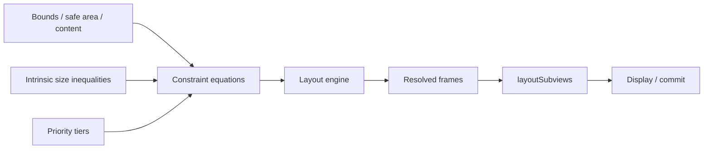
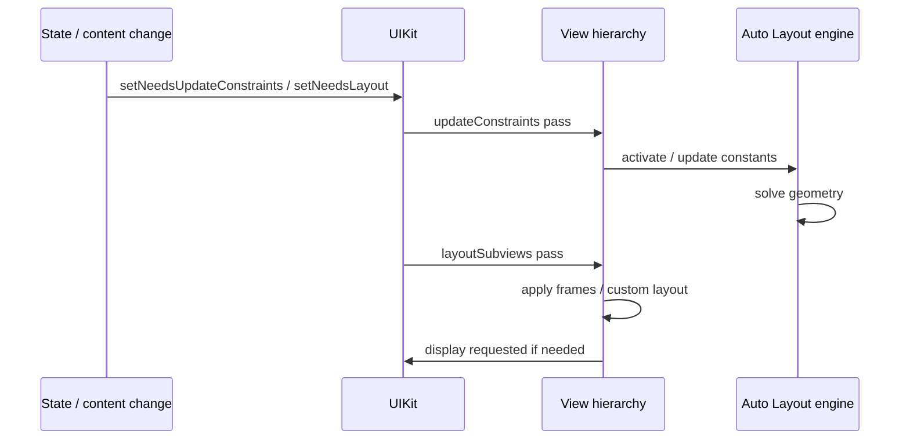
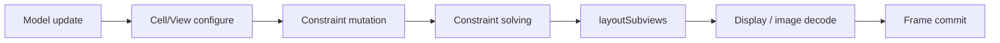

# UIKit Auto Layout：从约束方程、优先级到 Self-sizing 与性能诊断

> Auto Layout 不是“把 View 的上下左右都约束住”这么简单。它把 View 几何关系转换为线性等式与不等式，再按 Priority 选择必须满足和可以牺牲的约束；Intrinsic Content Size、Content Hugging 和 Compression Resistance 只是向这套求解系统提供尺寸偏好。工程中的布局冲突、尺寸歧义、动态高度跳动和滚动卡顿，本质上都是模型、时机或测量方法出了问题。

---

## 一、本文解决什么问题

UIKit 工程中常见这些问题：

- 一条 `NSLayoutConstraint` 对应什么数学方程？
- 为什么只约束 Leading/Top 还不能确定 View 尺寸？
- Intrinsic Content Size 是固定尺寸吗，哪些 View 没有它？
- Content Hugging 与 Compression Resistance 分别抵抗什么？
- Priority 为 999 与 1000 的差异为什么很大？
- Ambiguous Layout 与 Unsatisfiable Constraint 有什么区别？
- `updateConstraints`、`layoutSubviews` 和 `layoutIfNeeded` 应分别做什么？
- 为什么在 `layoutSubviews` 里反复创建约束会越来越慢？
- Self-sizing Table/Collection Cell 如何从内容推导高度？
- 为什么动态 Cell 首次滚动跳动，复用后高度又错误？
- 如何定位控制台中的 “Unable to simultaneously satisfy constraints”？
- Auto Layout 性能应该测量什么，而不是简单归因于“约束太多”？

这些问题的共同主线是：**先建立足以唯一确定几何的约束模型，再用优先级表达允许退让的策略，最后在正确的布局阶段更新输入并测量求解与布局成本。**

本文以 Programmatic UIKit、Layout Anchor 和现代 Table/Collection View 为主。示例在 2026-07-31 使用 Xcode 26.1.1、Apple Swift 6.2.1 与 iOS Simulator SDK 验证。Auto Layout Solver 的具体算法和内部优化属于系统实现细节；公开契约是约束关系、Priority、布局 Callback 与 API 行为，性能结论必须针对目标 OS、设备、View Hierarchy 和数据规模测量。

### 核心结论

1. Auto Layout 把 View 的位置和尺寸属性表示为线性关系：`item1.attribute relation multiplier × item2.attribute + constant`。Anchor API 提供类型安全语法，但没有改变方程本质。
2. 每个 View 在水平和垂直方向都必须有足够信息确定位置与尺寸。约束数量多不代表模型完整，也不代表模型无冲突。
3. Intrinsic Content Size 是 View 根据当前内容计算的自然尺寸建议，不是 Required Constraint；没有自然宽高的 View 会返回 `UIView.noIntrinsicMetric`。
4. Content Hugging 抵抗“比自然尺寸更大”，Compression Resistance 抵抗“比自然尺寸更小”。它们会转换为不同方向的不等式与 Priority。
5. Priority 表达约束冲突时的舍弃顺序。Required `1000` 必须同时满足；Optional Constraint 按优先级和误差参与选择。不要用大量随机 Priority 掩盖错误模型。
6. Ambiguous Layout 表示存在多个合法解；Unsatisfiable Constraint 表示 Required 约束不能同时成立。前者可能静默产生不稳定 Frame，后者通常会记录冲突并打破一条约束以继续运行。
7. Constraint Update Pass 决定约束，Layout Pass 根据约束结果设置 Frame。`updateConstraints` 适合批量更新已有约束，`layoutSubviews` 适合依赖最终 Bounds 排列非约束内容，不应在两者中无条件重复创建约束。
8. `setNeedsUpdateConstraints`、`setNeedsLayout` 是延迟请求；`layoutIfNeeded` 强制当前布局树立即完成待处理布局。后者应谨慎用于动画、测量或必须同步读取 Frame 的场景。
9. Self-sizing Cell 的核心是 Content View 在测量宽度下拥有从 Top 到 Bottom 的连续垂直约束链，并让内容提供可求解高度；估算尺寸只影响滚动预估，不是最终尺寸。
10. Cell 复用时必须重置会影响 Intrinsic Size/约束的状态，取消异步任务，并在内容变化后让正确层级失效；不能缓存只以 IndexPath 为 Key 的永久高度。
11. Auto Layout 性能问题应拆成 Constraint Mutation、Solver、Layout Callback、自适应测量和 View 配置成本。约束总数只是信号之一，不能单独得出结论。

---

## 二、Constraint Equation：约束就是线性关系

一条通用约束可写成：

```text
item1.attribute relation multiplier × item2.attribute + constant
```

其中 `relation` 可以是 `equal`、`lessThanOrEqual` 或 `greaterThanOrEqual`。

例如：

```swift
cardView.widthAnchor.constraint(
    equalTo: containerView.widthAnchor,
    multiplier: 0.5,
    constant: -12
)
```

对应：

```text
card.width = 0.5 × container.width - 12
```

而：

```swift
titleLabel.leadingAnchor.constraint(
    greaterThanOrEqualTo: avatarView.trailingAnchor,
    constant: 12
)
```

对应：

```text
title.leading >= avatar.trailing + 12
```

### 2.1 Anchor API 为什么更安全

`NSLayoutAnchor` 在编译期区分 X Axis、Y Axis 和 Dimension：

```swift
titleLabel.leadingAnchor.constraint(equalTo: contentView.leadingAnchor)
titleLabel.heightAnchor.constraint(greaterThanOrEqualToConstant: 20)
```

它能阻止把 `leadingAnchor` 错连到 `topAnchor`。底层仍生成 `NSLayoutConstraint`，复杂的 Multiplier、Identifier、Priority 和调试仍可访问约束对象。

### 2.2 `translatesAutoresizingMaskIntoConstraints`

Programmatic View 使用 Auto Layout 时通常关闭 Autoresizing Mask 转换：

```swift
let titleLabel = UILabel()
titleLabel.translatesAutoresizingMaskIntoConstraints = false
```

否则 UIKit 会把 Autoresizing Mask 转换成约束，与手写约束共同参与求解，可能产生意外冲突。由某些系统容器或 Cell 管理的 Root/Content View 不应不加判断地修改该属性；只对自己添加并约束的 View 负责。

### 2.3 完整约束不是“每边一条”

一个矩形有 X、Y、Width、Height 四个自由度。常见完整组合包括：

- Leading + Top + Width + Height；
- Leading + Trailing + Top + Bottom；
- CenterX + CenterY + Width + Height；
- Leading + Top + Intrinsic Width + Intrinsic Height；
- Aspect Ratio + Width + CenterX + Top。

但约束能否唯一求解还取决于相邻 View、Intrinsic Size 和 Priority，不可只数约束条数。



---

## 三、Intrinsic Content Size：内容提供的自然尺寸

`intrinsicContentSize` 表示 View 在当前内容、Font、Insets 等条件下的自然尺寸。例如 Label 的 Text 和 Font 会影响它，Image View 的 Image 尺寸可能影响它；普通空 `UIView` 通常没有自然尺寸。

```swift
final class BadgeView: UIView {
    private let label = UILabel()
    var contentInsets = UIEdgeInsets(top: 4, left: 8, bottom: 4, right: 8) {
        didSet { invalidateIntrinsicContentSize() }
    }

    override var intrinsicContentSize: CGSize {
        let labelSize = label.intrinsicContentSize
        return CGSize(
            width: labelSize.width + contentInsets.left + contentInsets.right,
            height: labelSize.height + contentInsets.top + contentInsets.bottom
        )
    }

    func setText(_ text: String) {
        label.text = text
        invalidateIntrinsicContentSize()
    }
}
```

自定义 View 的内容改变后应调用 `invalidateIntrinsicContentSize()`，通知布局系统自然尺寸已失效。不要在 Getter 中修改 View Hierarchy、激活约束或触发网络请求；它可能被多次查询。

### 3.1 多行 Label 的宽高依赖

多行文本的高度依赖可用宽度，而宽度又由外部约束决定。现代 Auto Layout 通常能通过约束和 `preferredMaxLayoutWidth` 的系统管理完成测量，但自定义复杂布局仍要确保：

- Label 有明确可用宽度；
- `numberOfLines = 0`；
- 从 Cell/Container 顶到底有完整约束链；
- 不在宽度尚未确定时永久缓存高度；
- Dynamic Type 后让旧尺寸缓存失效。

### 3.2 `sizeThatFits` 与 Intrinsic Size

二者相关但不同：

- Intrinsic Size 是 Auto Layout 方程的自然尺寸输入；
- `sizeThatFits(_:)` 是询问 View 在给定建议尺寸下的合适尺寸；
- `systemLayoutSizeFitting` 使用 Auto Layout 对某个 View Hierarchy 做拟合测量。

不能把一次 `sizeThatFits` 结果当成所有宽度和 Trait 下永久有效的 Intrinsic Size。

---

## 四、Hugging 与 Compression Resistance

假设一个 Label 的自然宽度为 `W`：

- Hugging 倾向于 `actualWidth <= W`，抵抗被拉大；
- Compression Resistance 倾向于 `actualWidth >= W`，抵抗被压小。

它们相当于带 Priority 的软约束。默认值因 View/Axis/SDK 行为而异，工程决策不应依赖记忆中的某个默认数字；应在冲突场景显式设置并检查当前值。

### 4.1 两个 Label 谁拉伸

```swift
nameLabel.setContentHuggingPriority(.defaultHigh, for: .horizontal)
valueLabel.setContentHuggingPriority(.defaultLow, for: .horizontal)
```

若水平空间比两者自然宽度之和更大，Hugging 较低者更愿意扩张。

### 4.2 空间不足时谁压缩

```swift
nameLabel.setContentCompressionResistancePriority(.defaultLow, for: .horizontal)
valueLabel.setContentCompressionResistancePriority(.required, for: .horizontal)
```

空间不足时 `nameLabel` 更愿意被压缩，`valueLabel` 尽量保持自然宽度。这里是否合理取决于业务：订单金额通常比描述文本更需要完整显示，但 Accessibility Text Size 下也可能必须换行，而不是无限提高 Priority。

### 4.3 Hugging 不能代替 Max Width

Hugging 只是可破坏偏好。如果业务要求 View 绝不能超过某个宽度，应使用明确约束：

```swift
titleLabel.widthAnchor.constraint(
    lessThanOrEqualTo: container.widthAnchor,
    multiplier: 0.7
).isActive = true
```

同理，Compression Resistance 也不能代替 Minimum Touch Target、设计规范或文本截断策略。

---

## 五、Priority：Required 与可退让策略

`UILayoutPriority` 通常位于 1 到 1000，`1000` 是 Required。Optional Constraint 不等于“随便忽略”，而是当所有关系无法同时满足时按优先级层次选择更重要的目标。

### 5.1 999 是设计工具，不是消音按钮

例如一个浮层希望高度为 320，但不能超过 Safe Area：

```swift
let preferredHeight = panel.heightAnchor.constraint(equalToConstant: 320)
preferredHeight.priority = UILayoutPriority(999)

NSLayoutConstraint.activate([
    preferredHeight,
    panel.heightAnchor.constraint(lessThanOrEqualTo: view.safeAreaLayoutGuide.heightAnchor),
    panel.topAnchor.constraint(greaterThanOrEqualTo: view.safeAreaLayoutGuide.topAnchor),
    panel.bottomAnchor.constraint(lessThanOrEqualTo: view.safeAreaLayoutGuide.bottomAnchor)
])
```

这里 999 表达“正常尺寸优先，但小窗口可压缩”的真实产品策略。若把任意冲突的 Required Constraint 改成 999 只是为了清除日志，布局可能在不同设备随机牺牲错误目标。

### 5.2 使用少量语义层级

团队可以定义紧凑的 Priority 语义：

```swift
extension UILayoutPriority {
    static let contentPreference = UILayoutPriority(750)
    static let adaptiveContainer = UILayoutPriority(999)
}
```

避免 751、752、753 形成难以解释的竞价系统。每个非默认 Priority 都应能回答：“发生空间冲突时，为什么是它先退让？”

### 5.3 Priority 不是执行顺序

Priority 不表示先算 1000 再按代码顺序算 999，也不保证同 Priority 中“后添加的约束获胜”。当同级目标竞争时，不要依赖约束创建顺序或日志中当前被打破的那一条作为稳定行为。

---

## 六、Ambiguous Layout：存在多个合法解

Ambiguous Layout 意味着约束系统有两个或更多满足所有 Required 关系的几何解。

例如只约束一个 View 的 Top 和 Leading，却没有 Width/Height 或 Intrinsic Size：

```swift
NSLayoutConstraint.activate([
    card.topAnchor.constraint(equalTo: view.safeAreaLayoutGuide.topAnchor),
    card.leadingAnchor.constraint(equalTo: view.leadingAnchor)
])
```

若 `card` 没有 Intrinsic Size，它的宽高不确定。

### 6.1 检测歧义

Debug 构建可以检查：

```swift
assert(!card.hasAmbiguousLayout)
```

也可在调试器中调用 `exerciseAmbiguityInLayout()` 观察不同合法解，但它只适用于诊断，不应进入生产逻辑。

歧义有时不产生控制台警告，因为系统确实能找到合法解，只是解不唯一。症状可能是不同运行时 Frame 变化、View 跑到意外位置或 Self-sizing 返回异常。

### 6.2 修复方法

按 Axis 分析自由度：

- 水平位置是否确定？
- 水平尺寸是否确定？
- 垂直位置是否确定？
- 垂直尺寸是否确定？
- Intrinsic Size 是否在该 Axis 有效？
- Optional Constraint 被打破后是否仍有唯一解？

不要靠增加任意 Width/Height 常量“补齐”，应让约束表达真实布局关系。

---

## 七、Unsatisfiable Constraint：Required 关系互相矛盾

下面三条 Required Constraint 在 Container Width 为 320 时无法同时成立：

```swift
NSLayoutConstraint.activate([
    card.leadingAnchor.constraint(equalTo: container.leadingAnchor, constant: 20),
    card.trailingAnchor.constraint(equalTo: container.trailingAnchor, constant: -20),
    card.widthAnchor.constraint(equalToConstant: 300)
])
```

Leading/Trailing 推导宽度为 280，却又要求 300。UIKit 通常记录 “Unable to simultaneously satisfy constraints”，并打破某条约束继续布局。被打破的选择不应被当作产品契约。

### 7.1 添加 Identifier

```swift
let minimumWidth = card.widthAnchor.constraint(greaterThanOrEqualToConstant: 240)
minimumWidth.identifier = "Card.minimumReadableWidth"
```

Identifier 会出现在约束描述中，比 `_UITemporaryLayoutWidth` 或内存地址更容易定位。为边界约束、动态切换约束和公共组件约束命名尤其有价值。

### 7.2 Symbolic Breakpoint

在 Xcode 添加 Symbolic Breakpoint：

```text
UIViewAlertForUnsatisfiableConstraints
```

断点停下后检查 Call Stack、View Hierarchy、约束 Identifier 和当前 Bounds。不要只从控制台复制最后一条约束就删除；日志列出的是冲突集合，根因可能是更早添加的错误关系或临时测量宽度。

### 7.3 临时宽高约束不一定是根因

Self-sizing 测量期间 UIKit 可能加入封装/临时尺寸约束。它出现在日志中不代表系统有 Bug，通常说明内部 Content Constraints 无法在给定测量宽度/高度下自洽。应检查：

- Content View Edges 是否完整连接；
- Required Height 与 Dynamic Content 是否矛盾；
- Image Aspect Ratio 与固定宽高是否过度约束；
- Hidden View 是否仍保留固定间距；
- Separator/Accessory 与系统 Cell Layout 是否冲突。

---

## 八、Layout Pass：约束更新与 Frame 布局

UIKit 会延迟合并布局请求。概念上包含两个相关阶段：



真实系统可能合并、跳过或多次执行某些 Callback，不能把每次状态变化与一次固定 Callback 序列一一对应。

### 8.1 `updateConstraints`

适合在一次 Update Pass 中批量反映约束状态：

```swift
final class MessageBannerView: UIView {
    private var compactConstraint: NSLayoutConstraint!
    private var expandedConstraint: NSLayoutConstraint!
    private var isExpanded = false

    func setExpanded(_ expanded: Bool) {
        guard isExpanded != expanded else { return }
        isExpanded = expanded
        setNeedsUpdateConstraints()
    }

    override func updateConstraints() {
        compactConstraint.isActive = !isExpanded
        expandedConstraint.isActive = isExpanded
        super.updateConstraints()
    }
}
```

注意：

- 约束应在初始化时创建并持有，Pass 中只切换必要状态；
- 不要每次 Deactivate 全部约束再重新创建；
- 不要在 `updateConstraints` 内调用 `setNeedsUpdateConstraints()` 形成反馈循环；
- UIKit 文档对调用 `super.updateConstraints()` 的建议应遵循当前 SDK 契约，通常在自定义更新完成后调用。

简单常量变化也可以直接更新 Constraint Constant，并调用 `setNeedsLayout()`，不必为了形式全部放进 Override。

### 8.2 `layoutSubviews`

`layoutSubviews` 在 Bounds 已知后执行，适合：

- 设置不能由 Auto Layout 表达的子 Layer Path；
- 更新 Gradient/Mask Frame；
- 执行轻量 Custom Layout；
- 读取最终 Bounds 计算与几何有关的绘制输入。

```swift
override func layoutSubviews() {
    super.layoutSubviews()
    gradientLayer.frame = bounds
    maskLayer.path = UIBezierPath(
        roundedRect: bounds,
        cornerRadius: cornerRadius
    ).cgPath
}
```

不要在这里无条件新增/激活约束、调用自身 `setNeedsLayout()` 或执行同步图片解码。它可能在一帧内或一次交互中多次发生。

### 8.3 `layoutIfNeeded` 与动画

约束动画的典型流程：

```swift
view.layoutIfNeeded()
panelBottomConstraint.constant = 0

UIView.animate(withDuration: 0.25) {
    self.view.layoutIfNeeded()
}
```

动画前先提交旧布局，修改 Constraint Constant 后在动画 Block 内让公共祖先 View Layout，UIKit 才能从旧 Frame 插值到新 Frame。调用错误层级可能没有动画或只更新部分子树。

`layoutIfNeeded` 是同步工作；在循环、Cell 配置或滚动 Callback 中频繁调用可能放大成本，应先测量是否确实需要立即 Frame。

---

## 九、Safe Area、Readable Content 与 Keyboard

Auto Layout 的 Reference Guide 也决定布局语义：

- `safeAreaLayoutGuide`：避开 Bars、Cutout 和 Container Insets；
- `layoutMarginsGuide`：组件内部 Margin；
- `readableContentGuide`：限制长文本可读宽度；
- `contentLayoutGuide` / `frameLayoutGuide`：Scroll View 内容与可视 Frame。

### 9.1 Scroll View 的两套 Guide

```swift
NSLayoutConstraint.activate([
    contentView.leadingAnchor.constraint(equalTo: scrollView.contentLayoutGuide.leadingAnchor),
    contentView.trailingAnchor.constraint(equalTo: scrollView.contentLayoutGuide.trailingAnchor),
    contentView.topAnchor.constraint(equalTo: scrollView.contentLayoutGuide.topAnchor),
    contentView.bottomAnchor.constraint(equalTo: scrollView.contentLayoutGuide.bottomAnchor),

    contentView.widthAnchor.constraint(equalTo: scrollView.frameLayoutGuide.widthAnchor)
])
```

前四条定义 Content Size，等宽约束禁止水平滚动。若缺少从 Content Top 到 Bottom 的完整链，Vertical Content Size 可能无法推导。

### 9.2 Keyboard Layout Guide

支持的系统版本上，可把输入区域约束到 `keyboardLayoutGuide`，让系统处理键盘 Frame、Undocked/Floating Keyboard 等变化。不要只订阅 Keyboard Notification 后硬编码键盘高度；多 Scene、旋转、Interactive Dismiss 和 Floating Keyboard 都会让这种假设失效。

---

## 十、Self-sizing Cell：由内容反推尺寸

Self-sizing 的核心不是 `automaticDimension` 一个开关，而是 Cell 内部约束能在给定宽度下唯一推导高度。

### 10.1 Table View Cell

```swift
tableView.rowHeight = UITableView.automaticDimension
tableView.estimatedRowHeight = 88
```

Cell Content View 内建立连续垂直链：

```swift
NSLayoutConstraint.activate([
    avatarView.leadingAnchor.constraint(equalTo: contentView.leadingAnchor, constant: 16),
    avatarView.topAnchor.constraint(equalTo: contentView.topAnchor, constant: 12),
    avatarView.widthAnchor.constraint(equalToConstant: 40),
    avatarView.heightAnchor.constraint(equalTo: avatarView.widthAnchor),

    titleLabel.leadingAnchor.constraint(equalTo: avatarView.trailingAnchor, constant: 12),
    titleLabel.trailingAnchor.constraint(equalTo: contentView.trailingAnchor, constant: -16),
    titleLabel.topAnchor.constraint(equalTo: contentView.topAnchor, constant: 12),

    bodyLabel.leadingAnchor.constraint(equalTo: titleLabel.leadingAnchor),
    bodyLabel.trailingAnchor.constraint(equalTo: titleLabel.trailingAnchor),
    bodyLabel.topAnchor.constraint(equalTo: titleLabel.bottomAnchor, constant: 6),
    bodyLabel.bottomAnchor.constraint(equalTo: contentView.bottomAnchor, constant: -12)
])
```

`bodyLabel.numberOfLines = 0` 后，给定 Cell Width 即可推导文本高度，再由 Bottom Constraint 推导 Cell Height。

### 10.2 Estimated Size 的作用

Estimated Height/Size 用于尚未测量所有 Item 时估计 Content Size、Scroll Indicator 和可见范围。估算不准可能造成：

- 首次滚动 Content Offset/Indicator 跳动；
- 系统测量更多 Cell；
- Insert/Reload 时视觉不稳定。

应使用真实数据分布选择估算值，或按内容类别提供估算。估算值不是最终高度，也不是越精确越值得预计算全部内容。

### 10.3 Collection View Self-sizing

Flow Layout 可使用 Estimated Item Size，Compositional Layout 可使用 Estimated Dimension。无论入口如何，Cell 仍需在外部给定的拟合宽度/高度下返回稳定尺寸。

自定义 Cell 有时会覆盖：

```swift
override func preferredLayoutAttributesFitting(
    _ layoutAttributes: UICollectionViewLayoutAttributes
) -> UICollectionViewLayoutAttributes {
    let attributes = super.preferredLayoutAttributesFitting(layoutAttributes)
    return attributes
}
```

默认实现常已能满足标准约束布局。只有通过测量证明默认结果不正确、并明确 Layout 的拟合 Axis 后才自定义；错误地同时强制 Width 和 Height 会产生递归失效、跳动或冲突。

### 10.4 异步内容与 Cell 复用

图片到达后 Aspect Ratio 或文本变化可能改变尺寸。正确流程包括：

1. Cell 配置时重置旧 Image、Text、Constraint State；
2. 取消旧图片请求；
3. 用稳定 Item ID 校验异步结果仍属于当前 Cell；
4. 更新影响 Intrinsic Size 的内容；
5. 必要时通知 List Layout 重新测量，并保持 Batch 一致；
6. 高度缓存 Key 包含 Item ID、可用宽度、Content Size Category、内容版本等输入。

只以 `IndexPath` 缓存高度是不可靠的，因为 Snapshot Insert/Move 后同一路径可能代表另一 Item。

---

## 十一、常见错误与修复

### 11.1 错误：在 `layoutSubviews` 重建全部约束

```swift
override func layoutSubviews() {
    super.layoutSubviews()
    NSLayoutConstraint.activate(makeConstraints()) // 错误：重复累积。
}
```

**修复：** 初始化时创建一次约束；状态变化时更新 Constant 或切换有限的 Constraint Set。

### 11.2 错误：给动态 Label 同时设置 Required Height

Dynamic Type 或多行文本需要更高空间时，Required Height 会与自然尺寸/上下边界冲突。

**修复：** 删除不必要固定高度，改用 `>=` Minimum、合理 Priority 或让内容链推导高度。

### 11.3 错误：隐藏 View 后期待间距自动消失

`isHidden = true` 不会自动移除普通约束。View 虽不绘制，宽高和间距仍可能参与布局。

**修复：** 使用 `UIStackView` 的 Arranged Subview 语义，或显式切换 Width/Height/Spacing Constraint，并保持状态集中。

### 11.4 错误：把所有 Priority 都设成 Required

内容在小屏、Split View、本地化长文本和 Accessibility Size 下没有退让空间，最终产生冲突或截断。

**修复：** 明确谁可拉伸、压缩、换行或隐藏，用 Hugging/Resistance 和少量 Optional Constraint 表达策略。

### 11.5 错误：控制台没冲突就认为布局正确

Ambiguous Layout 可以没有冲突日志；过低 Priority 也可能让系统合法地选择错误视觉结果。

**修复：** 检查 `hasAmbiguousLayout`，覆盖极端内容和 Trait，并用 Snapshot/UI Test 验证视觉不变量。

### 11.6 错误：每次 Cell 展示都调用多次 `layoutIfNeeded`

这会把本可合并的延迟布局变为同步重复工作。

**修复：** 只有在立即测量或动画需要旧/新 Frame 时调用；用 Instruments 确认调用栈和频率后再优化。

---

## 十二、性能：先拆阶段，再测量

“Auto Layout 慢”可能对应完全不同的根因：



若图片解码或富文本排版占主耗时，减少几条约束不会解决问题。

### 12.1 测量方法

1. 使用 Release/Profile 和目标真机；
2. 固定数据集、屏幕宽度、Dynamic Type、系统版本和滚动手势；
3. 用 Time Profiler 查看 `layoutSubviews`、Constraint Activation、Sizing 和文本测量调用栈；
4. 用 Animation Hitches/Core Animation 观察掉帧区间；
5. 用 Signpost 包围 Cell Configure、自定义 Size Calculation 和 Batch Update；
6. 记录 P50/P95 Frame Time、Hitch、Sizing 次数和 Cell Reconfiguration 次数；
7. 改动后用同一场景验证，而不是只比较 Debug 体感。

### 12.2 常见优化方向

- 约束一次创建，更新 Constant，不在热路径反复 Activate/Deactivate 大集合；
- 减少无意义 Wrapper View 和重复布局层级，但不要为少量节点牺牲可维护性；
- 避免在 `layoutSubviews` 做 I/O、同步图片解码和复杂富文本生成；
- Self-sizing 缓存必须覆盖全部尺寸输入并有明确失效策略；
- Estimated Size 贴近真实分布，减少滚动修正；
- 列表数据未变化时避免全量 Reload 和重复配置；
- 对完全固定、极高频的简单组件，可在测量证明收益后考虑 Manual Layout。

Manual Layout 不是天然更快：它把 Safe Area、RTL、Dynamic Type、Readable Width 和状态组合的正确性成本转移给业务代码。只有性能瓶颈已被证实、布局规则稳定且测试充分时才值得选择。

---

## 十三、调试与验证清单

### 13.1 冲突定位

- 为关键 Constraint 添加 `identifier`；
- 设置 `UIViewAlertForUnsatisfiableConstraints` 断点；
- 在 View Debugger 检查实际层级、Frame 和 Constraint；
- 使用 `constraintsAffectingLayout(for:)` 分 Axis 查看约束；
- 检查最终激活约束，不只看创建代码；
- 搜索重复 Activate、复用状态和 System-added Measurement Constraint。

### 13.2 覆盖极端环境

至少测试：

- 最窄支持宽度与 iPad Split View；
- Portrait/Landscape 和多 Window Resize；
- 最长本地化文本、RTL；
- Accessibility Content Size Category；
- Bold Text、Button Shapes 等辅助设置；
- Empty、Loading、Error、Partial Content；
- 图片缺失、超宽高比和异步替换；
- Keyboard Docked/Undocked 与 Interactive Dismiss；
- Cell Insert/Delete/Move/Reload 和快速滚动。

### 13.3 布局不变量测试

比断言固定 Pixel 更稳健的是验证业务不变量：

- Amount Label 不与 Currency Icon 重叠；
- Button Hit Area 不小于设计要求；
- Body Text 在 Accessibility Size 下可换行且不截断；
- Loading/Error 状态切换后没有残留空白；
- Cell Content Bottom 不越过 Content View；
- RTL 时 Leading/Trailing 语义正确。

Snapshot Test 可以补充视觉回归，但需要固定 Font、Scale、Locale、OS 渲染环境并管理合理容差；它不能替代冲突断点和性能测量。

---

## 十四、方案选择：Auto Layout、Stack View 与 Manual Layout

| 方案 | 优点 | 成本 | 适合场景 |
|---|---|---|---|
| Layout Anchor | 关系明确、类型安全、适应环境 | 动态状态多时需管理 Constraint Set | 大多数 UIKit 页面与组件 |
| `UIStackView` | 内容增删、隐藏和间距表达简洁 | 复杂嵌套可能难调试，仍依赖 Auto Layout | 线性表单、信息组、动态行 |
| Manual Layout | 规则完全可控、固定热路径可减少求解 | 自行处理尺寸、RTL、Trait、可访问性 | 已测出瓶颈的稳定高频组件 |
| Hybrid | 外部 Auto Layout、内部固定 Manual Layout | 边界设计和测试要求更高 | 复杂 Cell、图表、媒体组件 |

选择标准不是团队偏好，而是：布局变化维度、内容动态性、可访问性、性能证据、测试能力和维护成本。

---

## 十五、总结

Auto Layout 的核心是约束方程与优先级，而不是 Anchor 语法。Intrinsic Content Size 提供自然尺寸，Hugging 抵抗拉伸，Compression Resistance 抵抗压缩；它们共同形成可退让的布局策略。约束必须在每个 Axis 上既完整又一致：缺少信息产生 Ambiguous Layout，Required 关系矛盾产生 Unsatisfiable Constraint。

布局更新是延迟、可合并的过程。`updateConstraints` 负责更新约束输入，Solver 计算几何，`layoutSubviews` 应用或补充最终布局；`layoutIfNeeded` 会把工作同步提前。Self-sizing Cell 则是在外部给定宽度下，用完整内容约束链反推高度，必须结合估算、复用、异步内容和缓存失效共同设计。

真正需要记住的是：**约束描述几何事实，Priority 描述冲突时的产品取舍，Layout Pass 描述何时更新，性能工具描述成本实际发生在哪里。不要用更多约束、更多 999 或更多 `layoutIfNeeded` 掩盖模型问题。**

## 问答复盘

### Q1：一条 Auto Layout Constraint 的数学本质是什么？

**答：** 是两个布局属性之间的线性等式或不等式：`item1.attribute relation multiplier × item2.attribute + constant`，再附带 Priority。Anchor API 只是更类型安全的构建方式。

### Q2：一个 View 有 Top、Leading 两条约束，为什么仍可能 Ambiguous？

**答：** 它只确定了位置，没有确定 Width/Height。若 View 也没有对应 Axis 的 Intrinsic Size，系统存在多个合法尺寸解，因此布局不唯一。

### Q3：Hugging 与 Compression Resistance 最容易混淆的区别是什么？

**答：** Hugging 抵抗比自然尺寸更大，Compression Resistance 抵抗比自然尺寸更小。额外空间看 Hugging，空间不足看 Compression Resistance。

### Q4：Priority 999 和 1000 为什么不是“只差一点”？

**答：** 1000 是 Required，必须与所有 Required 关系同时满足；999 是可以在必要时被打破的偏好。这是约束类别差异，不是简单的一百分之一强度差。

### Q5：Ambiguous Layout 与 Unsatisfiable Constraint 有何区别？

**答：** Ambiguous 是合法解不唯一，可能没有控制台警告；Unsatisfiable 是 Required 约束互相矛盾，UIKit 通常记录冲突并临时打破一条约束继续运行。

### Q6：什么时候应该重写 `updateConstraints`，什么时候直接改 Constant？

**答：** 多个约束需要随统一状态批量切换时适合 `updateConstraints`；简单常量变化可直接更新并请求 Layout。无论哪种方式，都应复用约束对象而非每个 Pass 重建。

### Q7：为什么不应在 `layoutSubviews` 中反复调用 `NSLayoutConstraint.activate`？

**答：** `layoutSubviews` 可被频繁调用，重复创建/激活会累积约束、触发新一轮求解甚至形成反馈循环。约束应一次创建，布局阶段只做轻量几何更新。

### Q8：Self-sizing Cell 能自动计算高度的必要条件是什么？

**答：** 在外部给定测量宽度后，Cell Content View 内必须有从 Top 到 Bottom 的连续、无歧义约束链，动态内容还要提供有效 Intrinsic Size 或其他高度关系。

### Q9：为什么不能只按 IndexPath 缓存 Cell 高度？

**答：** Diffable Snapshot 插入、删除、移动后 IndexPath 会指向不同 Item；高度还受宽度、内容版本、Dynamic Type 和 Locale 影响。缓存应使用稳定 Item ID 加完整尺寸输入，并可失效。

### Q10：发现列表掉帧后，第一步是否应该删除 Auto Layout？

**答：** 不应该。先用 Time Profiler、Hitch 工具和 Signpost 区分约束求解、Cell 配置、文本测量、图片解码或同步 I/O。只有证据表明布局求解是主瓶颈时，才评估简化约束或局部 Manual Layout。

## 延伸知识

- `UILayoutGuide`、Safe Area 与 Scroll View Layout Guide
- `UIStackView` 的 Arranged Subview、Custom Spacing 与隐藏语义
- Compositional Layout Estimated Dimension 与布局失效
- TextKit、Dynamic Type 与多行文本测量
- Diffable Data Source 更新和 Self-sizing 动画协调
- Core Animation Transaction 与布局到显示提交
- SwiftUI Layout Protocol 与 UIKit Auto Layout 桥接
- Accessibility、RTL 和本地化驱动的自适应布局
