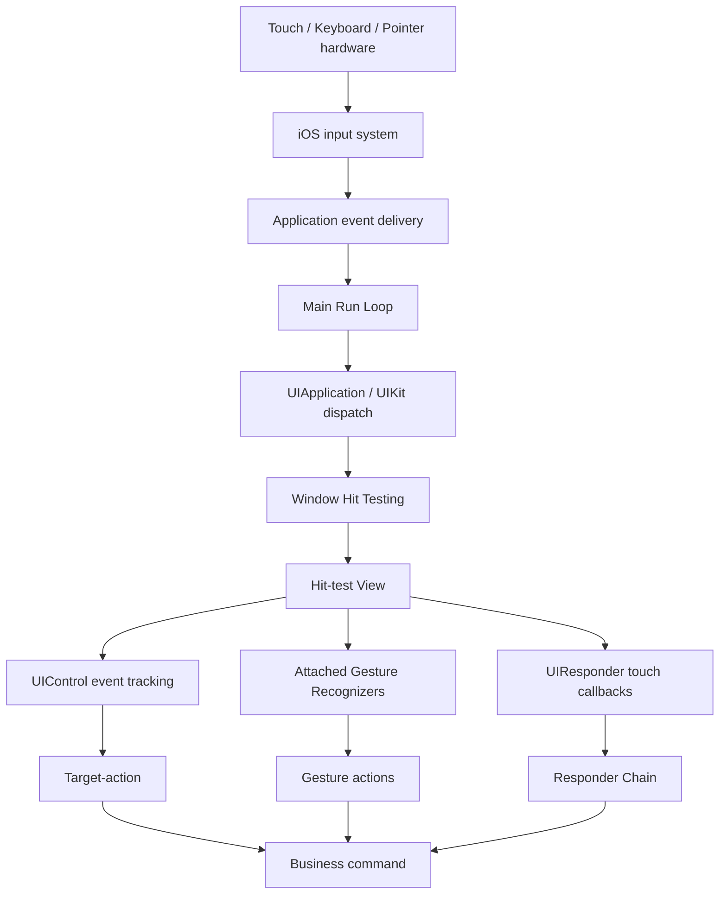
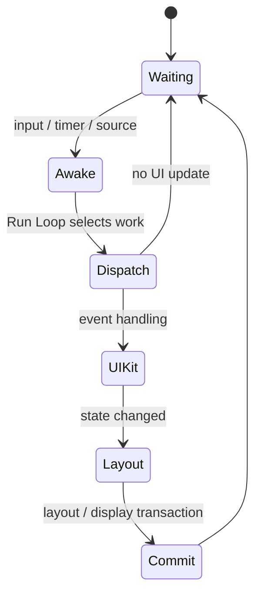
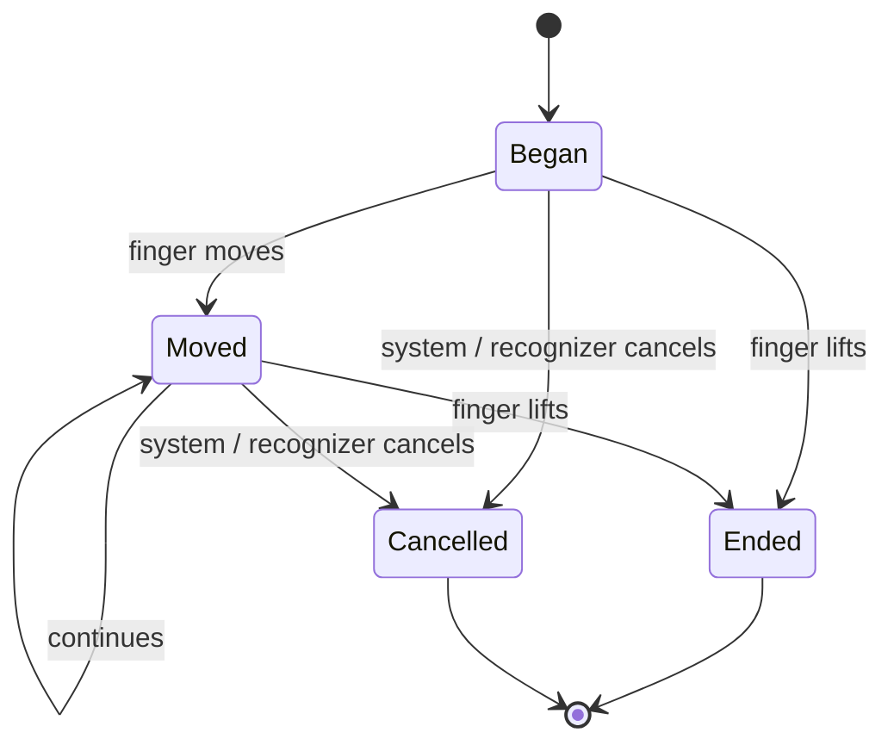
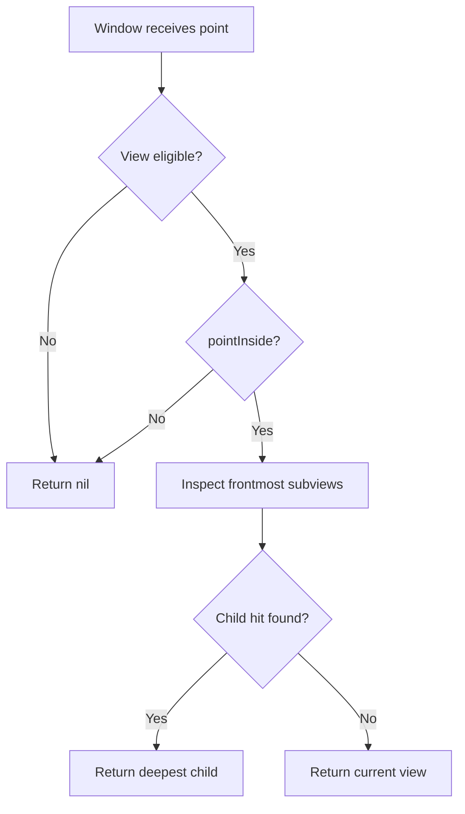
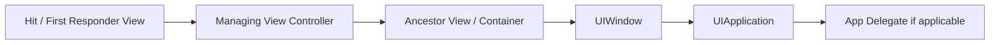
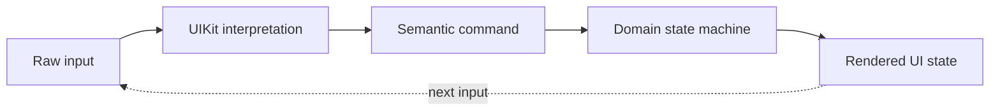

# UIKit 事件与响应链：从 Hit Testing、手势识别到键盘与焦点协调

> UIKit 事件处理不是“点击后直接调用按钮方法”。系统先把输入送到应用主事件循环，UIKit 为触摸确定目标 View，再让 Touch、Gesture Recognizer、Responder Chain 和 Control Target-action 按各自规则协作。键盘依赖 First Responder，Pointer 与 Focus 又是不同输入模型。工程中的点击失效、父子手势冲突、列表滚动卡住、键盘命令无响应，通常都来自混淆了这些层次。

---

## 一、本文解决什么问题

UIKit 开发中经常遇到这些问题：

- Run Loop 与触摸事件是什么关系，为什么主线程阻塞后点击“延迟触发”？
- `hitTest(_:with:)` 与 `point(inside:with:)` 分别做什么？
- 为什么超出父 View Bounds 的按钮看得见却点不到？
- 一个 Touch 能否在移动过程中改投另一个 View？
- Gesture Recognizer 会不会让 View 收不到 `touchesBegan`？
- Tap、Pan、Long Press 和 Scroll View 如何声明失败、同时识别和方向约束？
- Responder Chain 是 View Tree 吗，View Controller 在链中什么位置？
- `UIControl` 的 Target-action 与 Responder Chain 是什么关系？
- First Responder 为什么决定键盘输入，却不一定决定触摸命中？
- Hardware Keyboard、Pointer 和 Focus 应如何支持？
- 怎样修复透明遮罩截获点击、Cell 内横滑与列表纵滚冲突、重复提交等问题？

这些问题的共同主线是：**先确定输入属于谁，再决定由哪套协议解释输入，最后把业务命令交给正确的生命周期所有者。**

本文以现代 iOS/iPadOS UIKit 为主，覆盖触摸、手势、键盘、Pointer 和 Focus 的公开 API 契约。示例在 2026-07-31 使用 Xcode 26.1.1、Apple Swift 6.2.1 与 iOS Simulator SDK 验证。系统内部 Event Queue、HID 管线、Run Loop Source、手势识别器私有状态和默认依赖关系可能随版本变化；不能把逆向观察到的内部顺序当作公开契约。

### 核心结论

1. 系统输入最终由应用主线程事件循环消费并交给 UIKit 分发。Run Loop 提供调度基础，但 UIKit 的内部 Event Source 和队列实现不是第三方可依赖的接口。
2. 主线程忙时，事件通常不是由另一个线程并发执行 UI Callback，而是等待主线程处理；因此耗时布局、同步 I/O 和锁等待会直接恶化输入延迟。
3. 触摸序列开始时，UIKit 通过 Hit Testing 从 Window 沿 View Hierarchy 寻找最深的合格目标 View。目标通常在该 Touch 生命周期内保持不变，不会因手指移出 Bounds 自动改投兄弟 View。
4. `point(inside:with:)` 判断当前 View 是否包含点，`hitTest(_:with:)` 负责递归选择目标。重写时必须正确转换坐标、遵守隐藏/透明/交互状态并限制扩大范围。
5. Gesture Recognizer 与 View Touch Callback 观察同一输入序列，并通过状态机、取消/延迟策略和 Delegate 协调。添加 Recognizer 不等于无条件吞掉所有 Touch。
6. `cancelsTouchesInView`、`delaysTouchesBegan`、`delaysTouchesEnded` 会影响底层 View 收到 Touch 的时机和取消语义；应按交互需求设置，不能用它们代替手势依赖设计。
7. Responder Chain 是动态的事件/Action 转发链，不等于单纯的 `superview` 链。View、View Controller、Window、Application 等会按 UIKit 规则参与。
8. Target-action 是 `UIControl` 将特定 Control Event 转为 Action 的机制。Target 为 `nil` 时，UIKit 可沿 Responder Chain 查找能处理 Selector 的对象；显式 Target 则直接指定接收者。
9. First Responder 是当前优先接收非触摸事件和 Action 的 Responder，例如 Text Input、Key Command。它与触摸的 Hit-test View 是两个维度。
10. Keyboard Event 既包括文本输入，也包括 Physical Key Press 与 Command。文本编辑优先使用 `UITextInput`/系统控件，快捷键使用公开 Key Command/Press API，并考虑焦点、修饰键和冲突。
11. Pointer Interaction 改变指针样式与悬停反馈；Focus Engine 维护离散焦点移动。二者相关但不等价，也不能替代 Touch Accessibility。
12. 事件冲突应通过职责分层、Failure Requirement、Simultaneous Recognition、方向判定和状态机解决，而不是在 Callback 中随意开关多个 Recognizer。

---

## 二、从系统输入到业务动作的完整链路



这张图不是说每次输入都完整经过所有节点：

- Touch 通常先做 Hit Testing，随后 View、Recognizer 和 Control 根据类型参与；
- Hardware Keyboard 主要从 First Responder、Press/Key Command 路径进入，不需要 Touch Hit Testing；
- Pointer Hover 可由 Pointer Interaction 处理，点击仍可能转换成常规 Control/Touch 行为；
- Recognizer 一旦识别，可能取消底层 View 的 Touch；也可能按配置允许二者继续；
- 业务代码不应依赖 UIKit 私有分发方法或内部 Event 子类。

---

## 三、Run Loop 输入源与输入延迟

UIKit 应用的主线程持续运行事件循环，处理输入、Timer、Block、系统 Port 消息以及布局、显示提交等工作。可以把它理解为“等待工作、唤醒处理、进入休眠”的调度骨架，但不要简化成“每个触摸对应一个公开 Run Loop Source Callback”。



### 3.1 为什么主线程阻塞会让点击延迟

下面做法会把同步工作放在 Target-action 中，期间后续输入、布局和动画都不能及时处理：

```swift
@objc
private func didTapExport() {
    // 错误：主线程同步编码和写入大型文件。
    let archive = reportStore.buildArchiveSynchronously()
    try? archive.write(to: exportURL)
    presentShareSheet(for: exportURL)
}
```

更合理的边界是：主线程只完成 UI 状态切换和任务发起，耗时工作进入可取消的异步层，完成后再回到 Main Actor 更新 UI：

```swift
private var exportTask: Task<Void, Never>?

@objc
private func didTapExport() {
    exportTask?.cancel()
    exportButton.isEnabled = false

    exportTask = Task { [weak self] in
        guard let self else { return }
        defer { self.exportButton.isEnabled = true }

        do {
            let url = try await reportExporter.export()
            try Task.checkCancellation()
            self.presentShareSheet(for: url)
        } catch is CancellationError {
            return
        } catch {
            self.presentExportError(error)
        }
    }
}

deinit {
    exportTask?.cancel()
}
```

这段代码假设 Controller 和方法位于 Main Actor 隔离上下文，`reportExporter.export()` 自己不会同步占用 Main Actor。仅仅加上 `async` 不保证工作离开主线程，仍应使用 Instruments 验证。

### 3.2 测量输入延迟

不能用“按钮感觉慢”直接定位 Run Loop：

1. 在 Touch/Action 入口和业务结果处添加 Signpost；
2. 用 Time Profiler、Hangs/Thread State 观察主线程同步工作与锁等待；
3. 用 Animation Hitches/Core Animation 检查同一时段的帧延迟；
4. 在 Release/Profile、目标真机和真实数据规模下重复；
5. 区分 Input 到 Action、Action 到状态提交、状态提交到下一帧显示。

---

## 四、Touch Delivery：一次触摸是一段序列

`UITouch` 不只是一个坐标，而是跨多个 Event 的输入对象。典型序列为：



对应 `UIResponder` Callback：

```swift
final class DrawingView: UIView {
    private var activeStroke: Stroke?

    override func touchesBegan(_ touches: Set<UITouch>, with event: UIEvent?) {
        guard let touch = touches.first else { return }
        activeStroke = Stroke(start: touch.location(in: self))
    }

    override func touchesMoved(_ touches: Set<UITouch>, with event: UIEvent?) {
        guard let touch = touches.first, var stroke = activeStroke else { return }
        stroke.append(touch.location(in: self))
        activeStroke = stroke
        setNeedsDisplay()
    }

    override func touchesEnded(_ touches: Set<UITouch>, with event: UIEvent?) {
        commitActiveStrokeIfNeeded()
        activeStroke = nil
    }

    override func touchesCancelled(_ touches: Set<UITouch>, with event: UIEvent?) {
        activeStroke = nil
        setNeedsDisplay()
    }
}
```

工程上必须实现 Cancel Path。系统中断、Window 变化、手势识别成功或其他事件都可能让 Touch 取消。如果只在 `touchesEnded` 清理高亮、临时模型或资源，界面会卡在中间态。

### 4.1 目标 View 通常不会中途改变

Touch Began 时命中的 View 通常会继续接收同一 Touch 的 Moved/Ended/Cancelled，即使手指移出它的 Bounds。UIKit 不会为每个移动点重新选择兄弟 View。需要“拖过多个格子”的画板、键盘或排序控件，应由当前接收者根据位置主动计算业务目标。

### 4.2 多点触控与坐标系

- `isMultipleTouchEnabled` 决定 View 是否接收多个同时 Touch；
- `location(in:)` 返回指定 View 坐标系位置；
- View 有 Transform、Scroll Offset 或不同 Window 时必须做坐标转换；
- 不要把 `frame` 坐标与 `bounds` 坐标混用；
- Pencil、Indirect Pointer 等输入应检查公开的 Touch Type/属性，而不是按设备型号猜测。

---

## 五、Hit Testing：目标 View 如何被选中

概念上，Hit Testing 从 Window/Root View 开始：

1. 当前 View 必须可参与交互；
2. 用 `point(inside:with:)` 判断点是否位于可命中区域；
3. 按前后层级检查 Subview，并把点转换到子 View 坐标系；
4. 返回最深的合格 View；
5. 若没有子 View 命中，返回当前 View。



UIKit 的具体内部实现和优化不属于契约，但这个公开语义足以指导工程代码。

### 5.1 哪些状态会让 View 不可命中

常见因素包括：

- `isUserInteractionEnabled == false`；
- `isHidden == true`；
- Alpha 足够低而被 UIKit 排除；
- 点不在当前 View 的可命中区域；
- Ancestor 已经不允许命中；
- 另一个更靠前且可交互的 View 截获事件。

不要依赖具体 Alpha 阈值编写业务逻辑。需要禁用交互时显式设置 `isUserInteractionEnabled` 或控件状态。

### 5.2 扩大按钮点击区域

小图标按钮可以只扩大自己的命中区域：

```swift
final class ExpandedHitButton: UIButton {
    var hitInsets = UIEdgeInsets(top: -10, left: -10, bottom: -10, right: -10)

    override func point(inside point: CGPoint, with event: UIEvent?) -> Bool {
        guard !isHidden, isUserInteractionEnabled, alpha > 0 else {
            return false
        }
        return bounds.inset(by: hitInsets).contains(point)
    }
}
```

负 Insets 会扩大 Rect。实际工程还应确保扩大区域不会覆盖邻近控件、符合 Accessibility Target Size，并确认父 View 自己能覆盖该区域；如果点已在父 View 命中范围之外，子 View 的扩大逻辑根本不会被访问。

### 5.3 超出父 View 的内容为何点不到

`clipsToBounds == false` 允许子 View 绘制到父 View 外，但不自动扩大父 View 的 Hit-test Area。解决方案应优先调整布局，使交互区域位于合理父容器内；确有需求时再由父 View 精确转发，而不是全局覆盖 Window 的 `hitTest`。

### 5.4 透明遮罩截获点击

一个 Background Color 为 `.clear` 的 View 仍可交互。纯装饰 View 应设置：

```swift
decorationView.isUserInteractionEnabled = false
```

如果遮罩只允许某些区域穿透，可在其 `point(inside:with:)` 中根据明确几何规则返回结果。不要返回固定 `false` 后又期待遮罩上的按钮能点击。

---

## 六、Gesture Recognizer：把 Touch 序列解释为语义

Gesture Recognizer 观察 Touch 序列并运行状态机。离散手势如 Tap 通常从 `.possible` 到 `.recognized`；连续手势如 Pan 通常经历 `.began`、`.changed`、`.ended` 或 `.cancelled`/`.failed`。

```swift
final class CardViewController: UIViewController {
    private lazy var panRecognizer = UIPanGestureRecognizer(
        target: self,
        action: #selector(handlePan(_:))
    )

    override func viewDidLoad() {
        super.viewDidLoad()
        panRecognizer.delegate = self
        cardView.addGestureRecognizer(panRecognizer)
    }

    @objc
    private func handlePan(_ recognizer: UIPanGestureRecognizer) {
        switch recognizer.state {
        case .began:
            interaction.start()
        case .changed:
            interaction.update(translation: recognizer.translation(in: view))
        case .ended:
            interaction.finish(velocity: recognizer.velocity(in: view))
        case .cancelled, .failed:
            interaction.cancel()
        default:
            break
        }
    }
}
```

连续手势同样必须处理取消。把 Model Commit 放在 `.changed` 中且没有 Rollback，会让 Interactive Transition 或冲突失败后留下半完成状态。

### 6.1 Recognizer 与 View Touch 的关系

关键属性：

| 属性 | 作用 | 风险 |
|---|---|---|
| `cancelsTouchesInView` | Recognizer 成功后是否取消传给 View 的 Touch | Control 可能收到 Cancel 而非 Touch Up |
| `delaysTouchesBegan` | 是否等待识别结果再把 Began 给 View | 高亮反馈可能变迟 |
| `delaysTouchesEnded` | 是否等待识别结果再把 Ended 给 View | Action 响应可能变迟 |

这些属性解决的是 Delivery Timing，不是 Recognizer 之间的优先级。优先级和竞争应使用 Failure Requirement 与 Delegate。

### 6.2 Failure Requirement

单击和双击共享区域时，通常让单击等待双击失败：

```swift
singleTapRecognizer.require(toFail: doubleTapRecognizer)
```

代价是单击必须等待双击判定窗口结束，因此会增加单击确认延迟。应只在确有语义冲突的区域建立依赖，不要给页面所有 Tap 建全局依赖网。

### 6.3 同时识别

两个手势可以通过 Delegate 允许同时识别：

```swift
extension CardViewController: UIGestureRecognizerDelegate {
    func gestureRecognizer(
        _ gestureRecognizer: UIGestureRecognizer,
        shouldRecognizeSimultaneouslyWith otherGestureRecognizer: UIGestureRecognizer
    ) -> Bool {
        let pair = Set([ObjectIdentifier(gestureRecognizer), ObjectIdentifier(otherGestureRecognizer)])
        let expected = Set([ObjectIdentifier(panRecognizer), ObjectIdentifier(pinchRecognizer)])
        return pair == expected
    }
}
```

同时识别应基于明确 Pair/类型/业务场景，不宜无条件返回 `true`。Delegate 是参与协调的一方，最终行为还受另一 Recognizer、系统控件和 UIKit 规则影响。

### 6.4 方向门控

Cell 横滑与 List 纵滚冲突时，可在开始前根据 Velocity 拒绝错误方向：

```swift
func gestureRecognizerShouldBegin(_ gestureRecognizer: UIGestureRecognizer) -> Bool {
    guard gestureRecognizer === panRecognizer,
          let pan = gestureRecognizer as? UIPanGestureRecognizer else {
        return true
    }

    let velocity = pan.velocity(in: view)
    return abs(velocity.x) > abs(velocity.y)
}
```

这比手势已 `.began` 后再禁用 Recognizer 稳定，因为后者会触发 Cancel，并可能破坏 Scroll View 内部状态。还应考虑 RTL、边缘返回手势、可访问性和速度接近对角线时的阈值。

---

## 七、Responder Chain：未处理事件继续交给谁

`UIResponder` 定义 Touch、Press、Motion、Remote Control、Action 等响应能力。Responder Chain 是 UIKit 根据当前对象关系建立的动态链：



这是概念示意，不应把每一种场景都硬编码成同一固定数组。View Controller、Presentation、Window/Scene 和自定义 `next` 都会影响实际链路。排查时可沿公开的 `next` 属性观察当前对象，而不是根据 View Tree 猜测。

### 7.1 不处理就调用 `super`

自定义 Responder 覆盖事件方法时，如果没有完整消费事件，应调用 `super` 让默认处理或链上传递继续：

```swift
override func pressesBegan(_ presses: Set<UIPress>, with event: UIPressesEvent?) {
    guard let key = presses.first?.key, key.keyCode == .keyboardEscape else {
        super.pressesBegan(presses, with: event)
        return
    }
    dismissInspector()
}
```

盲目吞掉 `super` 可能破坏 Text Input、系统快捷键、Controller 或 Accessibility 行为。若使用更高层的 `UIKeyCommand` 能表达意图，应优先使用高层 API。

### 7.2 Responder Chain 适合语义 Action

Cut/Copy/Paste、Undo、Save、Delete 等命令可以由当前上下文中最合适的 Responder 处理。发送方不需要知道具体 Controller：

```swift
UIApplication.shared.sendAction(
    #selector(DocumentActions.saveCurrentDocument(_:)),
    to: nil,
    from: sender,
    for: nil
)
```

Target 为 `nil` 表示沿当前 Action Target 查找规则定位能响应 Selector 的对象。Action 是否可用还可通过菜单/Command 验证机制控制。不要把任意业务事件都塞进 Responder Chain；需要返回值、异步错误和稳定依赖的业务调用，更适合显式 Protocol/Closure/Coordinator。

---

## 八、Target-action 与 Control Event

`UIControl` 在 Touch Tracking 基础上生成更高层的 Control Event，例如：

- `.touchDown`；
- `.touchUpInside`；
- `.touchUpOutside`；
- `.valueChanged`；
- `.primaryActionTriggered`；
- `.editingChanged`。

Button 业务通常监听 `.primaryActionTriggered` 或系统提供的 Primary Action，而不是自己解析 `touchesEnded`：

```swift
private lazy var retryButton = UIButton(
    configuration: .filled(),
    primaryAction: UIAction { [weak self] _ in
        self?.retryLoading()
    }
)
```

Primary Action 能更自然地覆盖触摸、键盘、遥控器或辅助输入所表达的“激活控件”。具体支持取决于 Control 类型和平台版本。

### 8.1 Control Event 不是 Notification

Target-action 通常是局部、同步的 UI 命令分发；Notification 是一对多观察机制。按钮点击用全局 Notification 会隐藏所有权、难以测试并造成重复订阅。更合理的选择：

| 场景 | 建议机制 |
|---|---|
| Control 激活 | `UIAction` / Target-action |
| Child View 向 Owner 报告 | Closure、Delegate |
| 当前上下文命令 | Responder Chain Action |
| 跨模块状态广播 | 明确的 State Store/Notification，带生命周期管理 |

### 8.2 防止重复提交

防抖不是唯一方案。提交动作应同时处理 UI 与业务幂等：

```swift
@MainActor
private func submitOrder() {
    guard submitTask == nil else { return }
    submitButton.isEnabled = false

    submitTask = Task { [weak self] in
        guard let self else { return }
        defer {
            self.submitTask = nil
            self.submitButton.isEnabled = true
        }

        do {
            try await checkout.submit(idempotencyKey: order.id)
            showSuccess()
        } catch is CancellationError {
            return
        } catch {
            showError(error)
        }
    }
}
```

禁用按钮改善前端体验，服务端/Domain 层的 Idempotency Key 才能处理重试、网络重复和跨端提交。

---

## 九、First Responder 与键盘事件

First Responder 是 Responder Chain 中当前优先处理某类非触摸输入和 Action 的对象。常见 Text Field 成为 First Responder 后显示键盘，但“能成为 First Responder”与“已经成为”不同：

```swift
final class ScannerView: UIView {
    override var canBecomeFirstResponder: Bool { true }

    override func didMoveToWindow() {
        super.didMoveToWindow()
        if window != nil {
            becomeFirstResponder()
        }
    }
}
```

`becomeFirstResponder()` 返回是否成功。View 尚未进入有效 Window、其他 Responder 拒绝让出或系统状态不允许时可能失败。不要在初始化阶段假设必然成功。

### 9.1 First Responder 与触摸目标不同

用户正在 Text Field 输入时，Text Field 是 First Responder；随后点击 Save Button，按钮通过 Hit Testing 成为当前 Touch 目标，但 Text Field 可能仍保持 First Responder，直到明确 Resign 或焦点转移。

因此“点击空白关闭键盘”通常由 Container Gesture/Action 调用：

```swift
view.endEditing(true)
```

但要避免让 Dismiss Tap 阻塞 Button、Cell Selection 或 Scroll。可以通过 Recognizer Delegate 排除 `UIControl`，并根据场景设置 `cancelsTouchesInView = false`。

### 9.2 文本输入、Press 与 Key Command

- 文本编辑：使用 `UITextField`、`UITextView` 或完整实现 `UIKeyInput`/`UITextInput`；
- Physical Key：可通过 `UIPress`/`UIKey` 观察底层按键；
- 应用快捷键：优先使用 `UIKeyCommand` 或现代 Menu/Command API；
- Command 可用性：随 Selection、Document State 和 First Responder 更新；
- 不应记录用户所有按键，尤其不要把敏感输入写入日志。

```swift
override var keyCommands: [UIKeyCommand]? {
    [
        UIKeyCommand(
            title: "Save",
            action: #selector(saveDocument),
            input: "s",
            modifierFlags: .command
        )
    ]
}

@objc
private func saveDocument() {
    documentCoordinator.save()
}
```

快捷键应有本地化标题，避免覆盖系统或文本编辑惯例，并在 iPad Hardware Keyboard 与不同键盘布局上验证。字符输入和 Physical Key Code 不是同一层语义。

---

## 十、Pointer 与 Focus：相关但不同的输入模型

### 10.1 Pointer Interaction

iPadOS Pointer 可提供 Hover Region、Shape、Lift/Highlight 等反馈。`UIPointerInteraction` 的职责是描述指针体验，不应承载唯一业务 Action：

```swift
final class PreviewView: UIView, UIPointerInteractionDelegate {
    override init(frame: CGRect) {
        super.init(frame: frame)
        addInteraction(UIPointerInteraction(delegate: self))
    }

    required init?(coder: NSCoder) {
        super.init(coder: coder)
        addInteraction(UIPointerInteraction(delegate: self))
    }

    func pointerInteraction(
        _ interaction: UIPointerInteraction,
        styleFor region: UIPointerRegion
    ) -> UIPointerStyle? {
        UIPointerStyle(effect: .highlight(UITargetedPreview(view: self)))
    }
}
```

Pointer Hover 不是 Touch Down，也不代表控件已激活。核心功能仍应由 Button/Control Primary Action 提供，从而兼容 Touch、Keyboard 和 Accessibility。

### 10.2 Focus Engine

Focus 用于 Keyboard、Remote、Game Controller 等离散方向导航，在 tvOS 尤其核心，在 iPadOS 等平台也可参与。Focus Engine 根据可聚焦对象、几何、Focus Environment 和 Focus Guide 选择下一个对象。

常用职责包括：

- `canBecomeFocused`：对象是否可聚焦；
- `preferredFocusEnvironments`：容器期望的初始/恢复焦点；
- `didUpdateFocus(in:with:)`：响应焦点变化并更新视觉状态；
- `UIFocusGuide`：弥合几何导航不自然的区域；
- `setNeedsFocusUpdate()` / `updateFocusIfNeeded()`：请求重新计算，不是强制把焦点设给任意对象。

Focus 与 First Responder 也不完全相同：Focus 表示导航选择，First Responder 表示事件/Action 优先接收者；某些控件激活后会建立联系，但不能把二者当同一个全局变量。

### 10.3 输入方式矩阵

| 输入 | 目标选择 | 语义激活 | 视觉反馈 |
|---|---|---|---|
| Touch | Hit Testing | Touch/Recognizer/Control Event | Highlight、Animation |
| Hardware Keyboard | First Responder/Command | Key Command、Primary Action | Focus、Selection |
| Pointer | Pointer Region + Hit Testing | Click 后的 Control/Touch Action | Hover、Pointer Style |
| Focus Navigation | Focus Engine | Primary Action/Press | Focus Appearance |
| VoiceOver/Switch Control | Accessibility System | Accessibility Activation/Custom Action | 系统辅助反馈 |

只实现 Tap Recognizer 往往无法覆盖所有输入。语义上是“按钮”的元素应优先使用 `UIButton` 或合适的 `UIControl`，并配置 Accessibility。

---

## 十一、事件冲突与协调

### 11.1 Scroll View 内嵌横滑卡片

典型参与者有：

- `UIScrollView.panGestureRecognizer`：纵向滚动；
- Card Pan：横向操作；
- Navigation Controller Edge Pan：系统返回；
- Cell/Button：Tap/Primary Action。

推荐处理顺序：

1. 明确每个 Recognizer 的语义和方向；
2. 用 `gestureRecognizerShouldBegin` 尽早拒绝错误方向；
3. 保留系统 Edge Gesture 优先级，不覆盖屏幕边缘；
4. 只有确实可并存时才允许 Simultaneous Recognition；
5. 用 Failure Requirement 表达必要先后；
6. 为 `.cancelled`/`.failed` 恢复 Transform 和 Model；
7. 在快速对角滑、慢速拖动、手势取消和 RTL 下测试。

### 11.2 Tap 与 Scroll

Scroll View 自己通过 Pan Recognizer 判断用户是点击还是拖动。Cell 中额外添加 Tap Recognizer 时，常见错误是让它延迟或取消 Control Touch。优先使用 Cell Selection、Button Primary Action；必须添加 Recognizer 时，检查：

- 是否需要 `cancelsTouchesInView = false`；
- 是否排除 `UIControl` 子树；
- 是否与 Scroll Pan 建立了不必要的依赖；
- 滚动开始后 Tap 是否正确 Failed；
- VoiceOver 是否仍能表达同一动作。

### 11.3 Interactive Transition 的状态回滚

手势驱动 Pop/Presentation 时，手势 `.ended` 不一定代表转场最终完成，系统 Transition Coordinator 可能报告取消。业务状态应在转场结果确认后提交，临时 UI 状态要能 Rollback。不要只在 `viewWillDisappear` 就删除草稿或上报“页面已离开”。

### 11.4 自定义 Gesture Recognizer 的边界

只有标准 Recognizer 无法表达领域手势时才自定义。实现必须：

- 正确管理 `.possible`、`.began`/`.recognized`、`.changed`、`.ended`、`.failed`、`.cancelled`；
- 在 `reset()` 清理每轮状态；
- 处理 Touch 数量变化和系统取消；
- 不在识别器内部直接提交不可回滚业务数据；
- 用单元测试或可重复 UI 测试覆盖状态迁移。

---

## 十二、常见误区与修复

### 12.1 误区：`clipsToBounds = false` 就能点击父 View 外的子 View

**错误原因：** 绘制裁剪与 Hit Testing 是两套规则。父 View 不包含该点时，遍历不会进入子 View。

**修复：** 调整布局/父容器命中区域，或由父 View 在明确范围内做定向 Hit-test 扩展。

### 12.2 误区：Gesture Recognizer 一定吞掉 View Touch

**错误原因：** 结果取决于识别状态、取消/延迟属性以及 Recognizer 之间的协调。

**修复：** 先定义希望的语义，再配置 `cancelsTouchesInView`、Failure 和 Simultaneous；用事件日志验证实际状态序列。

### 12.3 误区：Responder Chain 就是 `superview` 链

**错误原因：** Managing View Controller、Window、Application 等也会参与，实际 `next` 由 UIKit 对象关系决定。

**修复：** 使用公开的 `next` 检查运行时链路，并让自定义容器正确建立 Controller Hierarchy。

### 12.4 误区：触摸时第一响应者就是被点中的 View

**错误原因：** Hit-test View 和 First Responder 是独立概念。Button 可收到 Touch，而 Text Field 仍掌握键盘输入。

**修复：** 明确何时需要 `becomeFirstResponder`、`resignFirstResponder` 或 `endEditing`，不要靠 Touch 命中隐式推断。

### 12.5 误区：所有点击都加 Tap Recognizer

**错误原因：** 会丢失 Control State、Primary Action、Keyboard、Focus 和 Accessibility 语义，并增加手势竞争。

**修复：** 操作控件使用 `UIButton`/`UIControl`；Recognizer 用于 Pan、Pinch、Custom Tap Area 等真正的手势语义。

### 12.6 误区：在识别过程中反复切换 `isEnabled`

**错误原因：** 禁用 Recognizer 会取消当前识别，可能导致 UI 和 Model 留在中间状态。

**修复：** 在 `gestureRecognizerShouldBegin` 门控，或建立清晰的 Failure/Simultaneous 规则；所有 Cancel Path 必须回滚。

---

## 十三、工程实践：可测试的输入架构

将输入分成四层：



- Raw Input：Touch、Key、Pointer、Focus Movement；
- UIKit Interpretation：Control、Gesture Recognizer、Responder Action；
- Semantic Command：Retry、Save、Dismiss、Move Card；
- Domain State Machine：校验幂等、并发、取消和错误；
- Rendered State：Loading、Success、Failure、Interactive Progress。

View/Controller 负责把输入翻译成命令，不在每个 Callback 复制业务规则。这样可以：

- 单元测试 Domain State，而无需伪造 `UITouch`；
- UI 测试只验证输入映射和可访问性；
- Gesture Cancel 时统一 Rollback；
- Touch、Keyboard 和 Accessibility 复用同一个 Primary Action；
- 防止多个输入通道绕过提交幂等检查。

### 13.1 调试清单

点击无响应时，按顺序检查：

1. 主线程是否卡住；
2. View 是否在正确 Window/Hierarchy 中；
3. `isHidden`、Alpha、Interaction Enabled 和 Bounds；
4. 前方是否有透明 View；
5. `hitTest` 实际返回谁；
6. Recognizer State、Delegate、Failure 和取消属性；
7. Control 是否注册正确 Event/Action；
8. First Responder 和 Key Command 是否在当前 Scene；
9. Controller/Responder Chain 是否建立正确；
10. 业务 Guard、Task 状态或幂等层是否拒绝了命令。

调试日志应记录对象类型、事件阶段、Recognizer State 和匿名 Request ID，不要记录键盘文本、密码、Touch 精确轨迹等隐私数据。

### 13.2 自动化测试重点

- Hit-test 扩大区域边界和相邻控件重叠；
- Touch Ended 与 Cancelled 都能恢复高亮/临时状态；
- 横纵 Pan、边缘返回与 Scroll View 的方向组合；
- 单击/双击 Failure Requirement 的延迟和正确性；
- Button 可由 Touch、Hardware Keyboard 与 VoiceOver 激活；
- First Responder 在 Present/Dismiss、Scene 切换后正确恢复；
- Pointer/Focus 状态不会改变核心 Action 语义；
- 快速重复输入只产生一次业务提交；
- Controller 释放时 Task、Closure、Recognizer Delegate 不产生泄漏。

---

## 十四、总结

UIKit 输入系统由多个互相协作但职责不同的层次组成：Run Loop 让主线程获得处理机会，Hit Testing 为 Touch 选择目标 View，Touch Delivery 维护完整序列，Gesture Recognizer 将序列解释成手势，Responder Chain 转发未指定目标的事件和 Action，`UIControl` 再把交互转换成 Control Event 与 Target-action。

First Responder 决定键盘和上下文 Action 的优先接收者，并不等同于当前触摸目标。Pointer 负责悬停体验，Focus 负责离散导航，它们也不应替代 Control Primary Action 和 Accessibility 语义。遇到冲突时，优先在识别开始前做方向和职责判断，再用 Failure Requirement、Simultaneous Recognition 和完整 Cancel/Rollback 协调。

真正需要记住的是：**命中测试回答“Touch 属于谁”，手势识别回答“这段 Touch 表示什么”，响应链回答“谁能处理这个事件或命令”，业务状态机回答“这个命令现在是否允许执行”。把四个问题分开，事件代码才可预测、可测试、可扩展。**

## 问答复盘

### Q1：主线程阻塞时，为什么按钮经常在卡顿结束后才触发？

**答：** UIKit UI 事件通常由主线程事件循环处理。主线程执行同步 I/O、重计算或等待锁时，输入处理和下一帧提交都会排队；应先测量阻塞区间，再把可并发工作移出 Main Actor。

### Q2：`point(inside:with:)` 与 `hitTest(_:with:)` 有什么区别？

**答：** 前者判断一个点是否属于当前 View 的可命中区域；后者沿 View Hierarchy 递归选择最终目标。扩大自身点击区域通常重写前者，定向改变子树路由才考虑后者。

### Q3：手指移出 Button 后，Touch 会自动转给旁边的 View 吗？

**答：** 通常不会。同一 Touch 序列保持最初命中的目标；Control 会依据结束点产生 Inside/Outside 语义。拖拽跨区域需要当前接收者主动计算位置和业务目标。

### Q4：添加 Tap Recognizer 后，Button 是否必然不再响应？

**答：** 不必然。要看 Recognizer 是否识别成功、是否取消/延迟底层 Touch，以及 Delegate/Fallback 关系。工程上应避免给 Control 子树添加无差别 Tap，并通过实际状态序列验证。

### Q5：单击等待双击失败有什么工程代价？

**答：** 单击 Action 会增加确认延迟，因为必须等双击识别窗口结束。只有两种语义确实冲突时才建立 `require(toFail:)`，不要全页面套用。

### Q6：Responder Chain 与 View Hierarchy 是否相同？

**答：** 不同。View 的 `next` 可能进入 Managing View Controller，之后再到容器、Window 和 Application。错误的 Controller Containment 也可能让预期 Action 路由失效。

### Q7：First Responder 是否就是用户最后点击的 View？

**答：** 不是。First Responder 表示键盘、文本或上下文 Action 的优先接收者；Touch 目标由 Hit Testing 决定。点击 Button 时 Text Field 仍可能保持 First Responder。

### Q8：为什么按钮操作优先使用 Primary Action，而不是 Tap Recognizer？

**答：** Primary Action 保留 `UIControl` 的 Enabled/Highlighted 状态和语义，并能更好支持键盘、Pointer、Focus 与 Accessibility；Tap Recognizer 只表达触摸手势识别。

### Q9：Cell 横滑和列表纵滚冲突时，第一步应做什么？

**答：** 先在 `gestureRecognizerShouldBegin` 根据初始 Velocity/位移明确方向，让错误方向尽早 Failed；之后再评估 Simultaneous 或 Failure Requirement，并处理 Cancel Rollback 和系统边缘返回。

### Q10：怎样测试一次点击没有触发重复下单？

**答：** UI 层验证 Task 进行中禁用/拒绝重复命令，Domain/网络层使用稳定 Idempotency Key；测试快速连点、重试、超时、页面退出和回调重入，而不是只测正常单击。

## 延伸知识

- Auto Layout 的 Layout Pass 与事件后 UI 更新时机
- `UIScrollView` Touch Delay、Pan Recognizer 与嵌套滚动
- Interactive Transition、Transition Coordinator 与取消回滚
- `UIMenu`、`UICommand`、Command Validation 与 Undo Manager
- TextKit、`UITextInput` 与输入法组合文本
- Pencil Interaction、Hover 与预测/合并 Touch
- Accessibility Activation、Custom Action 与 Switch Control
- Main Run Loop、Core Animation Transaction 与卡顿诊断
