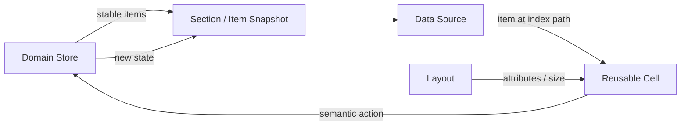
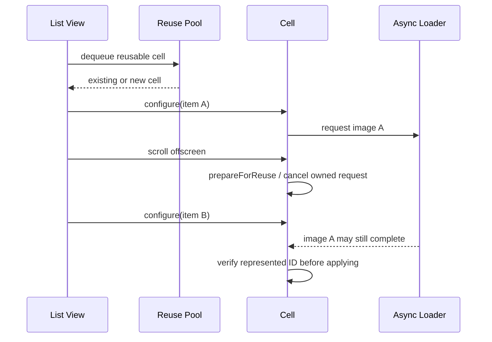
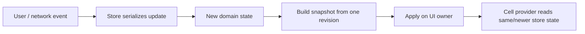
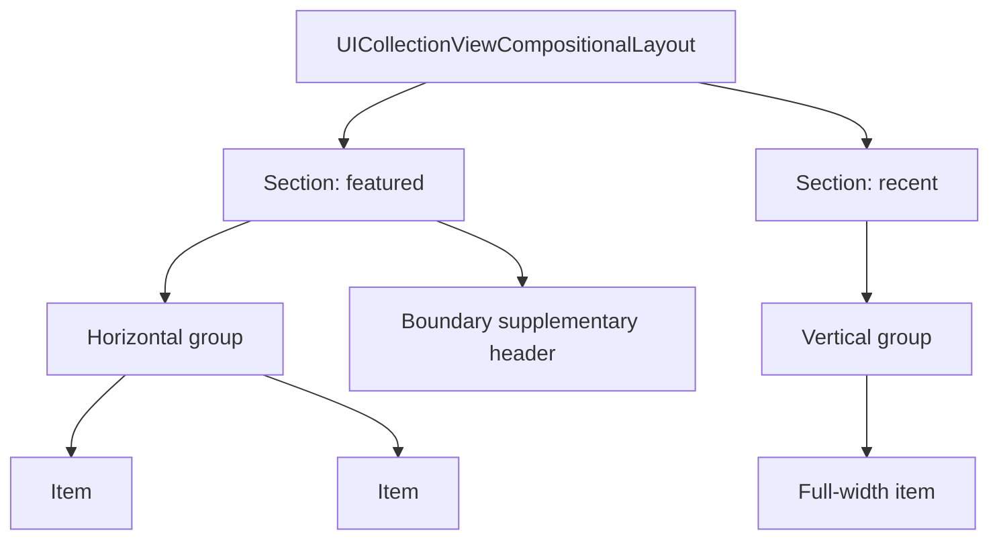
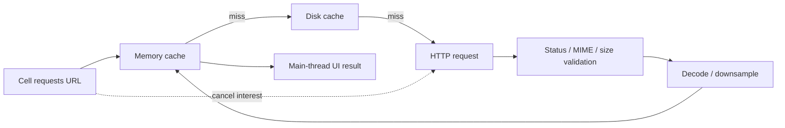
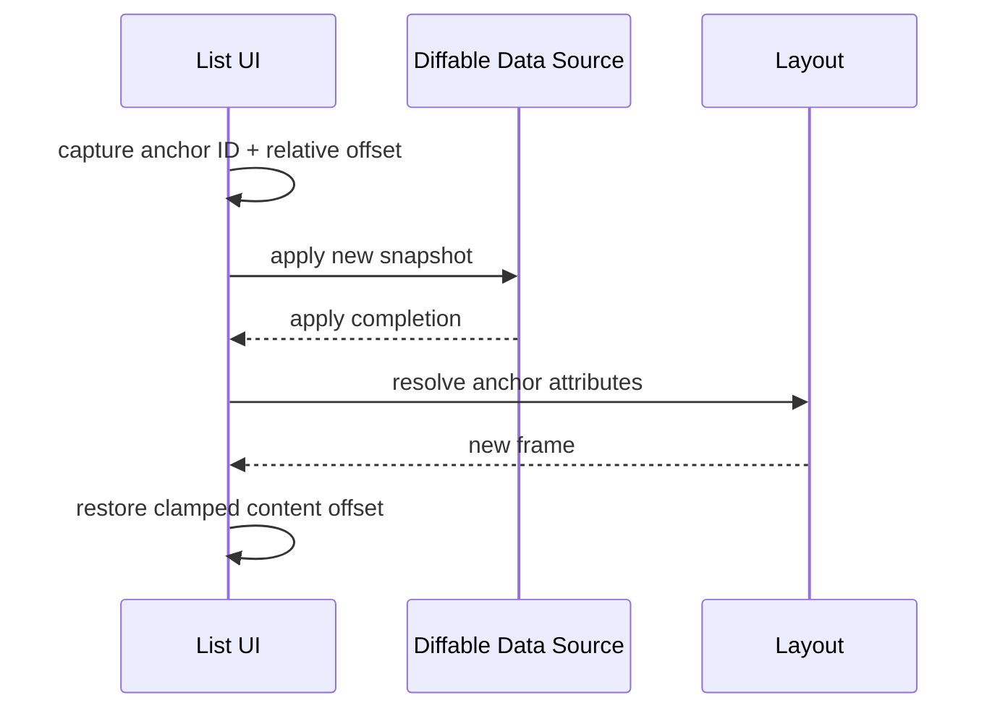

# UIKit 列表与数据源：从 Cell 复用、Diffable Snapshot 到大数据集性能

> UIKit 列表不是“用数组返回 Cell”这么简单。`UITableView` 与 `UICollectionView` 只为可见区域维护有限 View，Cell 会不断复用；数据源必须用稳定 Identity 把业务实体映射到当前 Snapshot，异步图片、预取和自适应尺寸又必须跟随 Item 生命周期取消或失效。真正可靠的列表架构要同时维护数据一致性、复用正确性、滚动连续性和主线程预算。

---

## 一、本文解决什么问题

UIKit 列表开发中经常遇到这些问题：

- `UITableView` 与 `UICollectionView` 应如何选择？
- Cell Reuse 为什么能节省资源，又为什么容易显示错图、错状态？
- `prepareForReuse()` 应清理什么，什么不能只在那里清理？
- Prefetch 回调是否保证任务会被使用，取消回调是否一定到达？
- Diffable Data Source 解决了什么，是否意味着数据自动线程安全？
- Snapshot Item Identifier 为什么不能使用当前 `IndexPath`？
- Item 内容变化但 ID 不变时，应 Reload、Reconfigure 还是替换 ID？
- Compositional Layout 的 Item、Group、Section 如何协作？
- 为什么混用 `performBatchUpdates`、旧数组和 Diffable Snapshot 容易崩溃？
- Self-sizing Cell 如何避免测量循环和滚动跳动？
- 图片请求如何处理复用、取消、缓存、竞态和失败？
- 插入顶部消息、刷新 Snapshot 或旋转后如何保留滚动位置？
- 大数据集性能应测量 Cell 数、Snapshot、布局、图片还是渲染？

这些问题的共同主线是：**业务 Item 有稳定身份，Snapshot 描述当前顺序，IndexPath 只是某一时刻的位置，Cell 只是可复用的临时投影。**

本文以现代 UIKit 列表 API 为主，兼顾传统 Data Source 的边界。示例在 2026-07-31 使用 Xcode 26.1.1、Apple Swift 6.2.1 与 iOS Simulator SDK 验证。Diffable、Cell Registration、Reconfigure、Compositional Layout 等 API 有明确最低系统版本；文章示例以 iOS 15+ 为主要基线，较早版本应按部署目标查阅当前 SDK 文档并选择兼容 API。UIKit 内部复用池、预取窗口和 Diff 算法细节不是稳定契约。

### 核心结论

1. `UITableView` 专注纵向行式列表；`UICollectionView` 通过 Layout 抽象支持网格、横滑、分区和复杂组合。现代简单列表也可以使用 Collection View List，但选型应考虑布局变化、交互和团队复杂度。
2. 列表只创建可见区域附近所需的 Cell，并通过 Reuse Identifier 重用实例。Cell 不拥有业务 Item，配置必须完整覆盖所有可见状态。
3. `prepareForReuse()` 用于取消 Cell-owned 临时工作和恢复中性视觉状态，但不能作为唯一正确性保障；每次 Configuration 仍必须覆盖 Image、Text、Hidden、Constraint、Accessibility 等状态。
4. 异步结果必须同时校验稳定 Item ID 和请求 Token/URL。只校验 IndexPath 会在 Insert、Move、Snapshot Apply 或复用后把结果写给错误 Item。
5. Prefetch 是机会性提示，不保证顺序、执行、命中或 Cancel Callback 完整对称。预取层必须去重、可取消、可共享，并允许正常可见加载兜底。
6. Diffable Data Source 用唯一 Section/Item Identifier 描述列表状态并计算 UI 差异，但业务 Store 的线程安全、网络一致性和 Snapshot 构建竞态仍由应用负责。
7. Snapshot Identity 表示实体身份，不表示内容版本或位置。IndexPath 是派生位置，不能作为 Item ID；同一个 Snapshot 内 Identifier 必须唯一且 Hash/Equality 稳定。
8. 内容变化而身份不变时，应更新 Store 后 Reconfigure/Reload 对应 Item；只有实体被替换时才使用新 ID。把可变标题、下载进度等字段纳入 Hash 会破坏身份稳定性。
9. Compositional Layout 由 Item、Group、Section 和 Environment 组合尺寸与行为。Estimated Dimension 需要 Cell 内部 Self-sizing 约束闭合，不能只在 Layout 中写 `.estimated`。
10. Diffable 模式下应让 Snapshot 成为结构更新入口；传统 Batch Update 必须保证 Data Source 状态与 Insert/Delete/Move 数量严格一致。不要让两套更新系统同时拥有列表结构。
11. Self-sizing、估算尺寸、图片宽高比和 Dynamic Type 会共同影响滚动几何。尺寸缓存必须包含稳定 Item ID、宽度、Trait 与内容版本，并有明确失效策略。
12. 滚动状态应以稳定 Anchor Item 和相对 Offset 表达，而不是只保存绝对 `contentOffset` 或旧 IndexPath；恢复时还要处理 Item 已删除、Insets 和布局变化。
13. 大数据集优化必须测量 Snapshot 构建/Apply、Cell 配置、Sizing、布局失效、图片解码、主线程 I/O 和渲染。不能仅凭 Item 数量断言瓶颈。

---

## 二、列表系统中的四类对象



职责必须分开：

| 对象 | 身份与生命周期 | 核心职责 |
|---|---|---|
| Domain Item | 稳定业务 ID，独立于 UI | 业务数据和状态 |
| Snapshot | 某一时刻的 Section/Item 顺序 | 列表结构与可见状态声明 |
| IndexPath | Snapshot 中的临时坐标 | 当前 Section/Row/Item 位置 |
| Cell | Viewport 附近的复用 View | 把一个 Item State 渲染出来 |

Item 从第 2 行移动到第 20 行时，ID 不变、IndexPath 改变；屏幕滚动后，原 Cell 实例又可能渲染另一个 Item。把这三者混成同一个概念，是列表竞态的主要来源。

---

## 三、`UITableView` 与 `UICollectionView`

### 3.1 `UITableView`

适合：

- 单列、纵向、行语义稳定；
- Setting、Message、Form、简单 Feed；
- Header/Footer 与 Row Editing 满足需求；
- 团队希望使用更窄的 API Surface。

它同样支持 Self-sizing、Prefetch、Diffable Data Source 和 Cell Registration，不等于“旧 API”。

### 3.2 `UICollectionView`

适合：

- Grid、横向 Carousel、多列或响应式列数；
- 同一页面存在多种 Section Layout；
- Supplementary/Decoration View；
- Orthogonal Scrolling、复杂分组；
- 未来布局变化较大。

iOS 14+ 的 List Configuration 可以让 Collection View 表达传统列表，同时复用 Compositional Layout、Cell/Supplementary Registration 等统一能力。

### 3.3 选型不是性能排名

不能笼统断言 Table View 比 Collection View 快，或 Collection View 一定更现代。相同业务下的性能取决于：

- Cell Hierarchy 与配置成本；
- Layout Complexity 与失效范围；
- Self-sizing 次数；
- 图片加载、解码与缩放；
- Snapshot/Batch Update 规模；
- Supplementary/Decoration 数量；
- 目标设备和系统版本。

优先选择能自然表达产品布局、降低状态组合复杂度的组件，再在真实实现上测量。

---

## 四、Cell Reuse：Cell 是临时渲染载体

复用流程可概括为：



取消请求能减少浪费，但不能单独消除竞态：Cancel 可能与 Completion 同时发生，底层共享请求也可能继续。结果应用前仍需验证当前代表的 Item。

### 4.1 完整配置原则

```swift
struct ArticleRowState {
    let id: ArticleID
    let title: String
    let subtitle: String?
    let isRead: Bool
    let thumbnailURL: URL?
}

final class ArticleCell: UICollectionViewCell {
    private(set) var representedID: ArticleID?
    private var imageTask: Task<Void, Never>?

    func configure(with state: ArticleRowState, imageLoader: ImageLoading) {
        representedID = state.id
        titleLabel.text = state.title
        subtitleLabel.text = state.subtitle
        subtitleLabel.isHidden = state.subtitle == nil
        unreadIndicator.isHidden = state.isRead
        thumbnailView.image = placeholderImage
        accessibilityLabel = [state.title, state.subtitle].compactMap { $0 }.joined(separator: ", ")

        imageTask?.cancel()
        guard let url = state.thumbnailURL else { return }

        let expectedID = state.id
        imageTask = Task { [weak self] in
            guard let self else { return }
            do {
                let image = try await imageLoader.image(for: url)
                try Task.checkCancellation()
                guard representedID == expectedID else { return }
                thumbnailView.image = image
            } catch is CancellationError {
                return
            } catch {
                guard representedID == expectedID else { return }
                thumbnailView.image = failedImage
            }
        }
    }

    override func prepareForReuse() {
        super.prepareForReuse()
        representedID = nil
        imageTask?.cancel()
        imageTask = nil
        titleLabel.text = nil
        subtitleLabel.text = nil
        subtitleLabel.isHidden = false
        unreadIndicator.isHidden = true
        thumbnailView.image = placeholderImage
        accessibilityLabel = nil
    }
}
```

示例中的 UI 访问假设 Cell 处于 Main Actor/UIKit 主线程上下文，`ImageLoading` 必须保证不会同步在 Main Actor 解码大图。业务项目还应根据生命周期让 Task 在 Cell/Controller 释放时取消。

### 4.2 为什么不能只在 `prepareForReuse` 重置

UIKit 不保证每次配置前都调用 `prepareForReuse()`，例如同一 Cell 被原地 Reconfigure。每次 `configure` 都必须覆盖所有状态，包括：

- Text、Attributed Text、Image；
- `isHidden`、Alpha、Transform、Selection/Highlight；
- Constraint Constant/Active Set；
- Progress、Accessory、Background；
- Accessibility Label/Value/Traits/Actions；
- Gesture/Closure 中代表的 ID。

`prepareForReuse` 是资源回收和中性化入口，不是配置完整性的替代品。

### 4.3 Cell 不应成为业务数据源

更新 Model 时不要读取当前 Cell Label：离屏 Item 没有 Cell，Cell 文本也可能只是格式化结果。Action 应携带稳定 Item ID，再由 Store 读取并修改真实状态。

---

## 五、Prefetching：机会性准备，不是正确性依赖

Collection View 示例：

```swift
extension ArticleListController: UICollectionViewDataSourcePrefetching {
    func collectionView(
        _ collectionView: UICollectionView,
        prefetchItemsAt indexPaths: [IndexPath]
    ) {
        let ids = indexPaths.compactMap { dataSource.itemIdentifier(for: $0) }
        prefetchCoordinator.prefetch(ids: ids)
    }

    func collectionView(
        _ collectionView: UICollectionView,
        cancelPrefetchingForItemsAt indexPaths: [IndexPath]
    ) {
        let ids = indexPaths.compactMap { dataSource.itemIdentifier(for: $0) }
        prefetchCoordinator.releaseInterest(in: ids)
    }
}
```

注意 Snapshot 可能在 Prefetch 和 Cancel 之间变化，旧 IndexPath 未必仍指向原 Item。更稳健的 Coordinator 会在 Prefetch 时记录 `IndexPath -> ItemID` 的本轮 Token，Cancel 时释放对应 Token，而不是重新用最新 Snapshot 猜测旧请求。

### 5.1 共享请求需要引用计数或订阅模型

同一图片可能同时被：

- Prefetch 请求；
- 可见 Cell 请求；
- Detail 页面请求。

一个 Cell 离屏不应直接取消所有共享消费者需要的底层下载。Loader 可以按 URL 合并 In-flight Task，每个调用方持有独立订阅；只有没有消费者时才决定是否取消网络任务。

### 5.2 Prefetch 的边界

- 回调时机和距离由 UIKit 决定；
- 快速反向滚动会产生大量 Cancel/新请求；
- 系统可能不调用某次 Prefetch，Cell 可见配置必须能正常加载；
- Cancel 是停止兴趣的提示，不代表 Completion 不会到达；
- 不要在 Prefetch 中直接修改可见 Cell；
- 网络流量、缓存大小和 Low Data Mode 需要独立策略。

---

## 六、Diffable Data Source 与 Snapshot

Diffable Data Source 让应用提交“列表现在是什么”，UIKit 计算从旧 Snapshot 到新 Snapshot 的结构差异。

```swift
enum SectionID: Hashable {
    case pinned
    case recent
}

struct ArticleID: Hashable {
    let rawValue: UUID
}

typealias ArticleDataSource = UICollectionViewDiffableDataSource<SectionID, ArticleID>
typealias ArticleSnapshot = NSDiffableDataSourceSnapshot<SectionID, ArticleID>
```

```swift
func makeSnapshot(from state: ArticleListState) -> ArticleSnapshot {
    var snapshot = ArticleSnapshot()

    if !state.pinnedIDs.isEmpty {
        snapshot.appendSections([.pinned])
        snapshot.appendItems(state.pinnedIDs, toSection: .pinned)
    }

    snapshot.appendSections([.recent])
    snapshot.appendItems(state.recentIDs, toSection: .recent)
    return snapshot
}
```

Data Source 通过 ID 从 Store 取最新展示状态：

```swift
dataSource = ArticleDataSource(collectionView: collectionView) {
    [weak self] collectionView, indexPath, articleID in
    guard let self,
          let state = store.rowState(for: articleID) else {
        return nil
    }

    return collectionView.dequeueConfiguredReusableCell(
        using: cellRegistration,
        for: indexPath,
        item: state
    )
}
```

Cell Provider 接收的 `articleID` 比闭包执行时重新用 IndexPath 查询数组更可靠。IndexPath 仍可用于布局位置，但数据身份应以 Identifier 为准。

### 6.1 Snapshot Apply 的所有权

推荐单向链路：



如果多个异步任务各自从旧 State 构建 Snapshot 并乱序 Apply，较早结果可能覆盖较新列表。应在 Main Actor/串行 Store 中统一版本，或在 Apply 前校验 Revision 并丢弃过期结果。

Diffable 不会自动解决：

- Store 并发写入；
- 网络响应乱序；
- Item ID 重复；
- Cell 异步图片竞态；
- 业务分页重复项；
- Snapshot 构建成本。

---

## 七、Snapshot Identity：ID、内容和位置必须分开

### 7.1 稳定 ID

正确的 Item Identifier 通常来自：

- 服务端不可变 Primary Key；
- 本地数据库 Stable ID；
- 草稿创建时一次生成并持久化的 UUID；
- 业务定义的复合唯一键。

错误示例：

```swift
struct RowIdentifier: Hashable {
    let indexPath: IndexPath
    let title: String
    let downloadProgress: Double
}
```

位置、标题、进度都会变化，会让同一实体不断变成“删除旧 Item + 插入新 Item”，导致动画、Selection、Prefetch、图片任务和滚动 Anchor 失效。

### 7.2 Hashable 稳定性

若用 Reference Type 作为 Identifier，参与 `hash(into:)` 和 `==` 的字段在对象存活期间变化，会破坏 Set/Dictionary/Snapshot 的基本假设。优先使用不可变 Value ID，而不是整个 Mutable Model。

### 7.3 内容更新：Reconfigure、Reload 或新 ID

iOS 15+ 可对身份不变、展示内容变化的 Item 使用：

```swift
var snapshot = dataSource.snapshot()
let existing = Set(snapshot.itemIdentifiers)
let changed = changedIDs.filter(existing.contains)
snapshot.reconfigureItems(changed)
dataSource.apply(snapshot, animatingDifferences: true)
```

`reconfigureItems` 适合轻量内容更新并尽量保留现有 Cell；`reloadItems` 具有不同的 Cell 更新语义。具体选择应验证 Cell Registration、Sizing 和平台版本行为。若内容变化会改变尺寸，要确保 Layout 收到正确失效，不能假设 Reconfigure 必然完成所有尺寸更新。

实体真的被替换时才使用新 ID，例如上传失败草稿被服务端正式对象取代，也应显式迁移 Selection、Scroll Anchor 和本地 Task，而不是悄悄更换 ID。

### 7.4 ID 重复应在进入 Snapshot 前失败

分页接口返回重复对象时，先在 Repository/Store 按 Stable ID 合并并定义冲突规则。不要等待 Diffable Apply 报错才处理；重复 ID 是数据一致性问题，不是 UI 动画问题。

---

## 八、Compositional Layout：Item、Group、Section

Compositional Layout 用层级对象描述 Section：



一个响应式 Grid 示例：

```swift
let layout = UICollectionViewCompositionalLayout {
    sectionIndex, environment in

    let availableWidth = environment.container.effectiveContentSize.width
    let columns = availableWidth >= 700 ? 3 : 2

    let itemSize = NSCollectionLayoutSize(
        widthDimension: .fractionalWidth(1.0 / CGFloat(columns)),
        heightDimension: .estimated(220)
    )
    let item = NSCollectionLayoutItem(layoutSize: itemSize)
    item.contentInsets = NSDirectionalEdgeInsets(top: 6, leading: 6, bottom: 6, trailing: 6)

    let groupSize = NSCollectionLayoutSize(
        widthDimension: .fractionalWidth(1.0),
        heightDimension: .estimated(220)
    )
    let group = NSCollectionLayoutGroup.horizontal(
        layoutSize: groupSize,
        subitems: Array(repeating: item, count: columns)
    )

    return NSCollectionLayoutSection(group: group)
}
```

### 8.1 Dimension 语义

- `.absolute`：固定点数；
- `.fractionalWidth` / `.fractionalHeight`：相对 Container/Group；
- `.estimated`：提供初值，允许内容测量修正。

Estimated Dimension 需要 Cell 内部 Auto Layout 闭合。若 Group 高度 Fixed、Item 又希望 Self-size 超出，布局模型可能限制最终结果。

### 8.2 Orthogonal Scrolling

Section 横向滚动能简化 Carousel，但会引入：

- 主列表纵向 Pan 与横向 Pan 协调；
- 每个 Section 的滚动位置保存；
- Prefetch 窗口和可见性判断；
- Nested Content Insets；
- VoiceOver/Focus 导航顺序；
- 大量横向 Section 的布局与内存成本。

不要为视觉效果堆叠多个嵌套 Collection View；Compositional Orthogonal Section 与真正独立子列表各有生命周期代价，应按状态所有权选择。

---

## 九、Batch Update：结构变化必须与数据一致

传统 Data Source 下，Batch Update 要求更新前后的 Section/Item 数量与 Insert/Delete/Move 操作严格匹配：

```swift
collectionView.performBatchUpdates {
    model.remove(at: oldIndex)
    model.insert(item, at: newIndex)
    collectionView.moveItem(
        at: IndexPath(item: oldIndex, section: 0),
        to: IndexPath(item: newIndex, section: 0)
    )
}
```

真实工程必须特别小心 Move 后索引语义、多 Section 和同时 Insert/Delete。若 Model Update 和 UI Operation 不一致，就会出现 Invalid Update Exception。

### 9.1 Diffable 模式下让 Snapshot 拥有结构

使用 Diffable 后，Insert/Delete/Move 通过新 Snapshot 表达：

```swift
var snapshot = dataSource.snapshot()
snapshot.moveItem(movedID, beforeItem: anchorID)
dataSource.apply(snapshot, animatingDifferences: true)
```

不要同时直接调用 `insertItems`/`deleteItems` 修改同一个 Diffable List 的结构。Supplementary 外观、Layout Invalidations 和非结构动画仍可能需要其他 API，但 Item/Section 的事实来源应唯一。

### 9.2 高频流式更新

聊天、行情和下载进度可能每秒产生大量变化。每次事件都全量 Apply 动画 Snapshot 会造成：

- 主线程 Diff/Apply 频繁；
- Cell 重配置和尺寸测量；
- 动画队列堆积；
- 用户滚动时位置跳动。

应按语义合并：结构变化批量提交，纯内容变化按帧/时间窗口 Coalesce，离屏 Item 可延迟刷新，并在用户交互期间选择是否关闭差异动画。具体窗口大小必须通过产品实时性要求与测量确定，不能编造固定毫秒值。

---

## 十、Self-sizing：列表宽度、内容与估算共同决定几何

Self-sizing Cell 的基本条件已在 Auto Layout 模块说明：给定拟合宽度后，Content View 内约束能唯一推导高度。

列表场景还要处理：

- Section Insets、Accessory、Separator 改变可用宽度；
- Compositional Group 给定的拟合 Axis；
- Estimated Size 与最终 Size 差异；
- Dynamic Type、Locale、Trait 与 Window Resize；
- 图片异步到达后 Aspect Ratio 变化；
- Reconfigure 是否触发布局失效；
- Height Cache 是否仍有效。

### 10.1 避免测量反馈循环

典型错误是在 `preferredLayoutAttributesFitting` 中修改约束、调用 List `reloadData()`，又触发新一轮测量。Sizing 方法应尽可能纯粹：给定输入返回尺寸，不产生结构性副作用。

### 10.2 图片比例占位

若服务端能提前返回 Pixel Width/Height，可在图片下载前计算展示比例并建立稳定占位，避免图片到达后 Cell 高度突变。需要校验零值、极端比例和 Metadata 欺骗，并为显示尺寸设上限。原图像素尺寸不等于解码/展示尺寸。

### 10.3 尺寸缓存 Key

一个合理 Key 至少考虑：

```text
Item ID + content revision + available width + content size category + layout mode
```

旋转、Split View、本地化、字体设置、图片比例或内容改变时必须失效。缓存是否值得引入，应先测量 Sizing 是否为主要瓶颈；错误缓存比重新测量更昂贵。

---

## 十一、图片加载、缓存与取消

完整图片管线包含：



### 11.1 Loader 的工程契约

图片 Loader 应明确：

- 相同 URL 是否合并 In-flight Request；
- Cache Key 是否包含 Variant、Scale、Target Pixel Size、Authorization；
- HTTP Cache 与业务 Cache 如何协作；
- 非 2xx、错误 MIME、超大文件和解码失败如何处理；
- 下载和解码在哪个 Executor/Actor；
- Memory Warning 时如何释放；
- Disk Cache 大小、过期、一致性和隐私策略；
- Cancel 是取消订阅还是取消底层共享请求；
- Completion 是否保证回到 Main Actor。

### 11.2 Downsampling

列表只显示 80×80 Point 缩略图时，直接完整解码超大原图会增加 CPU、峰值内存和滚动压力。应按目标 Pixel Size 与 Screen Scale Downsample，并在目标真机测量质量、解码时间和内存。

不能仅用文件字节数估计解码内存；解码后的 Bitmap 成本与像素维度、Pixel Format 等相关。

### 11.3 失败与重试

- 可恢复网络错误可按产品策略重试，并设置 Backoff/Jitter；
- 用户快速滚动导致的 Cancel 不应记录为错误；
- 4xx、无效图片或过大内容不应无限重试；
- Cell 重现时可重新表达加载兴趣；
- 日志记录匿名 Item/Request ID、阶段和错误类别，不记录敏感 URL Query/Token。

---

## 十二、滚动状态保留

只保存 `contentOffset.y` 很脆弱：顶部 Insets、Cell 高度、窗口宽度、Snapshot 内容变化后，相同 Offset 不再指向相同内容。

### 12.1 Anchor Item + 相对 Offset

保存：

- 最靠近 Viewport 顶部的稳定 Item ID；
- 该 Item Frame 相对可视顶部的 Offset；
- Layout Mode/Width/Trait Revision；
- 用户是否在列表尾部等语义状态。

恢复流程：

1. Apply 新 Snapshot；
2. 确认 Anchor ID 仍存在；
3. 请求/等待必要 Layout；
4. 找到 Anchor 当前 IndexPath 和 Layout Attributes；
5. 调整 Content Offset 保持相对位置；
6. Clamp 到合法范围；
7. Anchor 已删除时选择相邻 Item 或业务默认位置。



### 12.2 顶部插入与聊天尾随

Feed 顶部插入新内容时，若用户不在顶部，应保持当前 Anchor，避免内容把阅读位置向下推。聊天列表则常有另一语义：

- 用户已接近底部：新消息后跟随到底部；
- 用户正在查看历史：保留 Anchor，并显示“新消息”提示；
- 用户发送自己的消息：产品可能选择主动滚到底部。

“接近底部”的阈值是产品交互参数，应按实际 Cell/屏幕测试，不写成未经验证的万能常量。

### 12.3 多 Scene 与状态恢复

每个 Scene/Window 可能展示同一列表的不同 Filter 和位置。Scroll State 应按 Scene/Route/Query Scope 保存，不应只有一个全局 `lastContentOffset`。持久化时使用 Item ID 与最小上下文，不保存 Cell 或 Layout Attributes 对象。

---

## 十三、大数据集性能

大数据集不只意味着 Snapshot 中 ID 多，还可能意味着内容更新频繁、Cell 类型多、图片重、布局复杂。

### 13.1 分阶段观察

| 阶段 | 指标/现象 | 常见根因 |
|---|---|---|
| Store/Mapping | 状态归并耗时、重复 ID | 主线程排序、全量映射、分页去重 |
| Snapshot Build | 构建时间、内存峰值 | 每次复制大模型、Hash 成本高 |
| Snapshot Apply | Apply 时间、动画积压 | 高频全量结构更新 |
| Cell Configure | 主线程时间、Allocation | 富文本、Formatter、重复建 View |
| Self-sizing | 测量次数、Layout Pass | 估算差、约束失效、缓存错误 |
| Image | 下载/解码/内存 | 原图解码、无 Downsample、取消失效 |
| Render | Hitch、Offscreen Pass | 阴影、Mask、透明混合、层级复杂 |

### 13.2 测量方法

1. 使用 Release/Profile、目标真机和固定 OS；
2. 准备可重复数据集：冷缓存/热缓存、不同图片比例和文本长度；
3. 用 Time Profiler 观察 Main Thread Call Tree；
4. 用 Animation Hitches/Core Animation 关联掉帧；
5. 用 Allocations/Memory Graph 检查 Cell、Image、Task 是否持续增长；
6. 用 Network/自有指标观察请求去重、取消、缓存命中；
7. Signpost Snapshot Build/Apply、Cell Configure、Sizing、Decode；
8. 比较 P50/P95，而不是只看一次顺滑滚动；
9. 分别测试快速滚动、反向滚动、批量插入、旋转和 Dynamic Type。

### 13.3 常见优化方向

- Snapshot 只携带轻量 ID，不把完整大 Model 作为 Identifier；
- Store 按 ID O(1) 查找 Row State，避免 Cell Provider 每次线性扫描；
- 合并高频内容更新，结构未变时使用适合的 Reconfigure；
- Formatter、Attributed String 和 Derived State 在正确层级缓存；
- Cell Hierarchy 一次构建，配置只更新数据；
- 图片请求合并、Downsample、限制并发和 Cache Budget；
- Estimated Size 接近真实分布；
- 避免滚动 Callback 中同步 I/O、全量 Snapshot 和 `layoutIfNeeded`；
- 对离屏 Item 不做无意义 UI Reconfiguration；
- 数据规模极大时使用分页/窗口化业务数据，但保留稳定 Identity 和去重。

分页不是只追加数组。必须定义 Cursor、重复页、删除/置顶、重试、乱序响应、刷新覆盖和最终一致性。

---

## 十四、常见误区与修复

### 14.1 错误：图片 Completion 按旧 IndexPath 找 Cell

**问题：** Snapshot 更新或滚动后，旧 IndexPath 已对应另一个 Item。

**修复：** 请求绑定稳定 Item ID；Cell 结果应用前校验 `representedID`，Loader 支持取消和请求合并。

### 14.2 错误：Item ID 包含标题和下载进度

**问题：** 内容每次变化都改变 Hash/Equality，让 Diffable 认为是新实体。

**修复：** Identifier 只包含不可变 Stable ID，内容放在 Store；内容变化使用 Reconfigure/Reload。

### 14.3 错误：`prepareForReuse` 是唯一重置入口

**问题：** 原地 Reconfigure 或同一实例再次配置未必先 Reuse，旧 Hidden/Constraint/Image 状态会泄漏。

**修复：** `configure` 完整赋值，`prepareForReuse` 负责取消临时任务和恢复中性状态。

### 14.4 错误：Prefetch Cancel 直接取消 URL 的全局任务

**问题：** 可见 Cell 或其他页面可能仍需要同一 URL。

**修复：** 按消费者管理 Interest/Subscription，底层请求无消费者时再决定取消。

### 14.5 错误：Diffable 与 `insertItems` 混用

**问题：** Snapshot 和 Collection View 内部结构出现两个事实来源，可能导致 Invalid Update 或 UI/Store 不一致。

**修复：** 结构变化统一由 Snapshot 表达；需要特殊动画时在明确边界内设计，而不是旁路修改 Item 数量。

### 14.6 错误：图片到达后每次 `reloadData()`

**问题：** 全列表重配、重测并可能破坏 Selection 和 Scroll 连续性。

**修复：** 更新对应 Item State，按影响范围 Reconfigure/Reload/Invalidate；若尺寸不变只更新当前正确 Cell 或对应 Item。

### 14.7 错误：固定保存 `contentOffset`

**问题：** Snapshot、Insets、宽度和 Self-sizing 高度变化后，绝对 Offset 不再代表同一阅读位置。

**修复：** 保存 Anchor Item ID 与相对 Offset，并在新 Layout 完成后恢复。

---

## 十五、测试策略

### 15.1 单元测试

- 分页合并去重和稳定排序；
- Snapshot 中 Section/Item 唯一性；
- 内容更新不改变 Item ID；
- 过期 Revision 不覆盖新 Snapshot；
- Prefetch Interest 引用计数与 Cancel；
- 图片 Cache Key、错误分类和重试策略；
- Scroll Anchor 在 Item Delete/Move 后的 Fallback；
- Height Cache 在 Width/Trait/Revision 变化后失效。

### 15.2 UI 与集成测试

- 快速上下滚动不串图、不闪旧标题；
- 图片失败、慢请求和取消后状态正确；
- Insert/Delete/Move/Filter 时 Selection 与 Scroll 连续；
- Dynamic Type、RTL、Split View 下 Self-sizing 无冲突；
- 顶部插入不打断阅读，聊天尾随符合语义；
- Cell 内 Button/Swipe/Scroll 手势协调；
- VoiceOver 顺序、Label 和 Custom Action 正确；
- Memory Warning 后图片可重新加载；
- Controller 离开后 Prefetch、Image Task 和 Subscription 释放。

### 15.3 性能回归

建立固定数据规模和设备基线，记录：

- 首屏可见 Cell 就绪时间；
- 快速滚动 Hitch 与 Frame 分布；
- Snapshot Apply P50/P95；
- Cell Configure/Sizing 调用次数和耗时；
- 图片 Cache Hit、Decode Time、Peak Memory；
- 反复进入退出页面后的 Cell/Task 存活数量。

指标阈值应来自产品体验目标、设备矩阵和历史基线，不能在文章中编造通用毫秒值。

---

## 十六、总结

UIKit 列表的核心不是 Cell，而是 Identity 驱动的数据投影。Domain Item 保持稳定 ID，Snapshot 描述当前结构，IndexPath 只是瞬时位置，Cell 是可复用 View。配置必须完整覆盖状态，异步结果必须校验 ID 并支持取消；Prefetch 只是机会性优化，不能成为加载正确性的前置条件。

Diffable Data Source 统一结构更新，Compositional Layout 统一布局表达，但它们不会自动解决 Store 竞态、重复 ID、Self-sizing、图片解码和滚动恢复。内容更新要区分 Reconfigure/Reload 与身份替换，批量更新要坚持单一结构事实来源，Scroll State 要保存 Anchor Item 与相对位置。

真正需要记住的是：**稳定 ID 连接数据与界面，Snapshot 决定顺序，Cell 只负责当前渲染；所有异步工作都可能晚到，所有 IndexPath 都可能变化，所有尺寸缓存都必须可失效。性能优化必须先找到成本发生在哪个阶段。**

## 问答复盘

### Q1：Cell、Item ID 与 IndexPath 的区别是什么？

**答：** Cell 是可复用 View 实例，Item ID 是稳定业务身份，IndexPath 是当前 Snapshot 中的位置。滚动或更新后 Cell 和 IndexPath 都可能变化，Item ID 应保持不变。

### Q2：为什么 `prepareForReuse()` 不能保证 Cell 状态正确？

**答：** Cell 可能原地 Reconfigure，未必每次配置前都进入 Reuse。每次 `configure` 都必须完整覆盖所有视觉、约束和 Accessibility 状态；`prepareForReuse` 主要取消临时工作并中性化。

### Q3：Prefetch 回调后是否可以假设 Item 一定很快可见？

**答：** 不可以。用户可能反向滚动、Snapshot 可能变化，系统也不保证预取时机。Prefetch 必须可取消、去重，正常 Cell 配置仍要能独立加载。

### Q4：为什么不能用 IndexPath 作为 Diffable Item Identifier？

**答：** Insert、Delete、Move 和排序都会改变位置，同一实体的 IndexPath 不稳定。使用它会把移动误判成实体替换，并破坏 Selection、Task 和 Scroll Anchor。

### Q5：标题变化时是否应该生成新的 Item ID？

**答：** 不应该。标题是内容，不是身份。更新 Store 后对原 ID Reconfigure/Reload；只有业务实体真正被替换时才使用新 ID。

### Q6：Diffable Data Source 是否自动解决线程安全和网络乱序？

**答：** 不会。它只根据 Snapshot 更新 UI。Store 修改、分页去重、Snapshot Revision 和异步 Apply 顺序仍需应用串行化或校验。

### Q7：Compositional Layout 写了 `.estimated`，为什么 Cell 仍无法 Self-size？

**答：** Estimated 只是初始尺寸语义。Cell 内部还必须在给定宽度下拥有闭合、无冲突的 Auto Layout 约束链，Group Dimension 也必须允许对应 Axis 调整。

### Q8：图片请求取消后，为什么 Completion 仍要检查 Item ID？

**答：** Cancel 与 Completion 可能竞态，底层共享请求也可能继续。Cell 已复用给其他 Item 时，只有稳定 ID/Token 校验能阻止晚到结果串图。

### Q9：顶部插入数据时如何保持用户阅读位置？

**答：** 更新前记录顶部附近的稳定 Anchor Item 和相对 Viewport Offset，Apply 后在新 Layout 中找到该 Item 并恢复相对位置；只保存绝对 `contentOffset` 不可靠。

### Q10：十万条 Item 的列表卡顿，第一步应该分页还是改手写 Frame？

**答：** 先测量 Store/快照、Apply、Cell 配置、Sizing、图片解码和渲染各阶段。瓶颈可能是高频全量更新或图片，而非 Item 数或 Auto Layout；分页和 Manual Layout 都应由证据驱动。

## 延伸知识

- Diffable Section Snapshot 与层级列表
- Collection View List Configuration、Content Configuration
- Reordering、Drag and Drop 与稳定 Identity
- Supplementary/Decoration View 生命周期
- Compositional Layout Visible Items Invalidation Handler
- Pagination Cursor、离线缓存与数据一致性
- ImageIO Downsampling、HTTP Cache 与磁盘缓存治理
- SwiftUI `List`/`LazyVGrid` 与 UIKit 列表桥接
