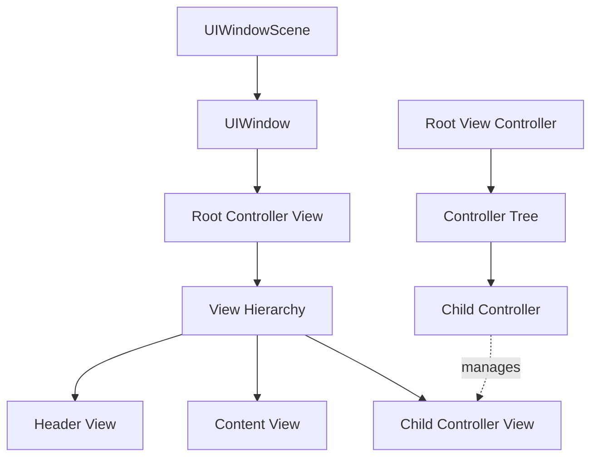
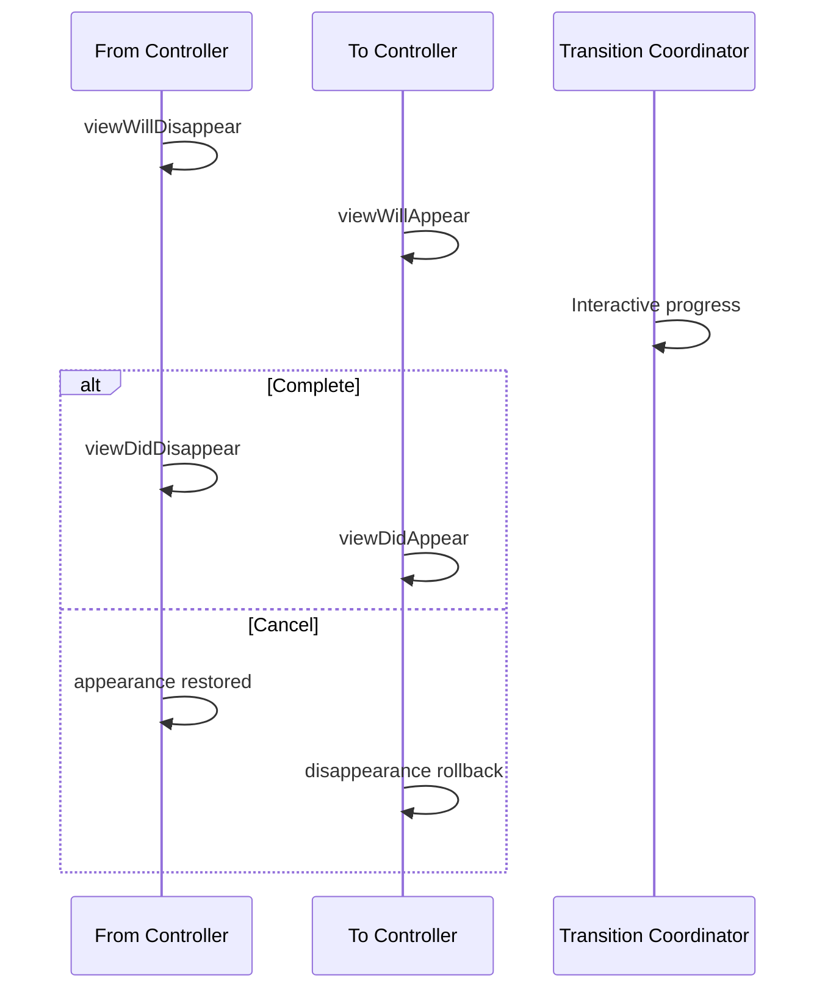
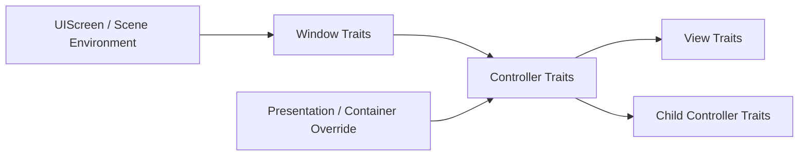
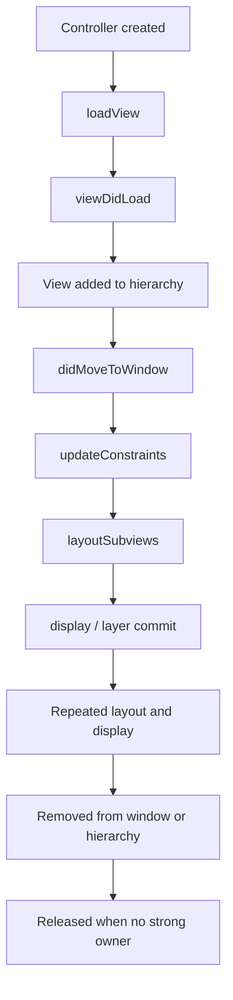

# UIKit 视图与控制器：从 View Hierarchy、Containment 到转场与布局边界

> `UIView` 负责一块可布局、可绘制、可命中测试的界面区域，`UIViewController` 负责管理一组 View、生命周期、导航与系统协作。二者并不是“一一对应的页面对象”：一个 Controller 管理完整 View Hierarchy，Container Controller 又管理其他 Controller；同一个 Controller 可能多次出现和消失，Trait、Safe Area 与 Window 也会在运行中变化。正确的 UIKit 架构必须同时维护 View Tree 与 Controller Tree，并让布局、转场和资源生命周期保持一致。

---

## 一、本文解决什么问题

UIKit 工程中经常遇到这些问题：

- `UIView` 与 `CALayer`、`UIViewController` 分别负责什么？
- `addSubview` 是否会自动建立父子 Controller 关系？
- 为什么 View 已经显示，Child Controller 却收不到 Appearance Callback？
- `present` 与 `pushViewController` 的所有权和返回路径有何差异？
- `viewDidLoad`、`viewWillAppear`、`viewDidAppear` 应分别做什么？
- Tab 切换、Interactive Pop 或取消转场时 Appearance Callback 如何理解？
- Trait Collection 是否只包含 Light/Dark Mode？
- Safe Area 为什么在 `viewDidLoad` 中通常还不是最终值？
- `UILayoutGuide` 与透明占位 View 有什么区别？
- 多 Window/Scene 下如何找到正确 Window，为什么 `keyWindow` 全局写法失效？
- 自定义 Container、Presentation 和 Navigation 如何避免生命周期错乱？

这些问题的主线是：**View Hierarchy 决定视觉、布局和事件承载关系，Controller Hierarchy 决定页面语义、生命周期与系统协调关系。两棵树需要一致，但不是同一棵树。**

本文以 iOS 13+ Scene Architecture 和现代 UIKit 为主。示例在 2026-07-31 使用 Xcode 26.1.1、Apple Swift 6.2.1、iOS Simulator SDK 验证。UIKit 内部 View/Layer 创建、转场协调和 Appearance Forwarding 细节会随系统演进；文章只把公开 API 行为作为稳定契约。

### 核心结论

1. `UIView` 管理 Frame/Bounds、Subview、布局、绘制、交互和 Backing Layer；`UIViewController` 管理 View Hierarchy、生命周期、系统呈现和 Child Controller，不应把业务模型长期塞入 View。
2. View Hierarchy 与 Controller Hierarchy 是两套关系。`addSubview` 不会自动调用 `addChild`，只建立其中一棵树会导致 Appearance、Rotation、Trait 和系统行为不完整。
3. Programmatic Controller 可在 `loadView` 创建 Root View，通常不调用 `super.loadView()`；`viewDidLoad` 适合一次 View-load 周期内的绑定，不适合依赖最终尺寸或每次展示刷新。
4. Controller Containment 需要按公开顺序通知父子关系，并为 Child Root View 建立层级和约束；移除时也要完成对称流程。
5. Presentation 创建 Presented/Presenting 关系，具体可见范围由 Presentation Style 和 Adaptive Behavior 决定；Dismiss 应由拥有流程语义的一方协调，而不是任意 View 自行寻找全局 Controller。
6. Navigation Controller 维护 Controller Stack。Push/Pop 表达层级式深入和返回，不等价于 Modal；Interactive Transition 可能取消，因此状态提交不能只依赖 `viewWillDisappear`。
7. Trait Collection 不仅包含 User Interface Style，还描述 Size Class、Display Scale、Content Size Category、Accessibility Contrast 等环境。Trait 可在 Window、Split View、多任务和设置变化时更新。
8. Safe Area 描述内容应避开的系统/容器遮挡区域，但它依赖 Window、Bars、Presentation 和 Insets；`viewSafeAreaInsetsDidChange` 比只在 `viewDidLoad` 读取可靠。
9. `UILayoutGuide` 是无绘制、无事件的布局锚点，适合 Content/Frame/Safe Area 等几何关系；不应为了占位增加无意义 View Hierarchy。
10. View 生命周期包含加载、加入/移出 Window、布局、显示与释放等多个维度；`isViewLoaded`、`view.window` 和 Appearance 状态回答的是不同问题。
11. Appearance Callback 可能多次发生、交错或因转场取消产生回滚。初始化、数据刷新、动画和埋点必须分别放到正确阶段并具备幂等性。

---

## 二、两棵树与一个 Window



三类关系：

- Window/Scene 关系：UI 属于哪个窗口和系统 Scene；
- View Hierarchy：`superview`/`subviews`，决定布局、绘制、命中和坐标转换；
- Controller Hierarchy：`parent`/`children`、Presentation、Navigation，决定页面生命周期和系统协调。

一个正确自定义容器通常同时建立 View 和 Controller 两棵树。仅把 Child View 加到界面上，UIKit 不会自动知道它属于哪个 Child Controller。

---

## 三、`UIView`：界面区域与层级节点

`UIView` 是 UIKit 视图树的基本节点。主要职责包括：

- 几何：`frame`、`bounds`、`center`、Transform；
- 层级：`superview`、`subviews`、Window；
- 布局：Auto Layout、Intrinsic Content Size、`layoutSubviews`；
- 绘制：`draw(_:)`、Backing `CALayer`；
- 外观：Background、Alpha、Hidden、Clipping、Tint；
- 交互：Hit Testing、Gesture、Responder Chain；
- Trait/Safe Area/Layout Margin 传播；
- Animation 与 Core Animation Transaction 协作。

### 3.1 `frame` 与 `bounds`

- `bounds`：View 自身坐标空间中的矩形；
- `center`：在 Superview 坐标空间中的中心；
- `frame`：View 在 Superview 坐标空间的外接矩形，是结合 Bounds、Center 和 Transform 的派生表达。

应用非 Identity Transform 后，直接修改 `frame` 的语义容易混乱。动画/几何应明确操作哪个坐标空间。

### 3.2 `UIView` 与 `CALayer`

每个 `UIView` 通常由 Core Animation Layer 支撑。View 管理 UIKit 语义、布局和事件，Layer 管理可提交给合成系统的视觉属性与内容。

```swift
final class BadgeView: UIView {
    override class var layerClass: AnyClass {
        CAShapeLayer.self
    }

    private var shapeLayer: CAShapeLayer {
        guard let layer = layer as? CAShapeLayer else {
            preconditionFailure("Unexpected backing layer")
        }
        return layer
    }

    override func layoutSubviews() {
        super.layoutSubviews()
        shapeLayer.path = UIBezierPath(ovalIn: bounds).cgPath
    }
}
```

不要在 `draw(_:)`、`layoutSubviews` 或 Property Setter 中无条件重复创建 Subview/Layer，否则每次布局都会增加节点。

### 3.3 View 不应承担页面编排

View 适合：

- 展示输入状态；
- 发出用户意图；
- 管理局部视觉状态；
- 维护可复用组件内部约束。

View 不适合自行：

- 查询全局 Window 后导航；
- 直接创建业务 Service；
- 持久化账户状态；
- 决定跨页面流程；
- 监听全部 App 生命周期且不释放；
- 强持有 Controller 形成循环。

推荐通过 Delegate、Closure、Target-action 或 Typed Event 把意图交给 Controller/Coordinator。

### 3.4 Main Thread/Actor 边界

UIKit View 操作应在 Main Thread/Main Actor：

```swift
@MainActor
final class ProfileHeaderView: UIView {
    func render(_ model: ProfileHeaderModel) {
        nameLabel.text = model.name
        avatarView.image = model.avatar
    }

    private let nameLabel = UILabel()
    private let avatarView = UIImageView()
}
```

网络、解码和数据库工作不应在主线程执行；结果提交 UI 时还需确认 View/Controller 是否仍代表原请求上下文。

---

## 四、`UIViewController`：管理 View 与页面语义

`UIViewController` 的职责不是简单“持有一个 View”，而是协调：

- Root View 的加载与释放；
- Child Controller；
- Presentation/Navigation；
- Appearance Transition；
- Trait、Safe Area、Rotation 和 Status Bar 等系统行为；
- 页面级状态和资源生命周期；
- 与 Scene/Window/Coordinator 的协作。

### 4.1 Root View 是惰性加载

访问 `controller.view` 可能触发加载。判断是否已经加载应使用：

```swift
if controller.isViewLoaded {
    // 不会为了检查状态主动触发 View 创建。
}
```

错误：

```swift
if controller.view != nil {
    // 访问 view 本身就可能触发加载，这个判断没有预期意义。
}
```

### 4.2 Programmatic `loadView`

```swift
@MainActor
final class ProfileViewController: UIViewController {
    private let contentView = ProfileView()

    override func loadView() {
        view = contentView
    }

    override func viewDidLoad() {
        super.viewDidLoad()
        title = "Profile"
        bindActions()
    }

    private func bindActions() {
        contentView.onRetry = { [weak self] in
            self?.reload()
        }
    }

    private func reload() {
        // ...
    }
}
```

完全 Programmatic 创建 Root View 时，通常直接赋值 `view`，不调用 `super.loadView()`。若使用 Storyboard/Nib，应让系统加载或正确调用对应初始化路径，不能混用两套所有权。

### 4.3 `viewDidLoad` 应做什么

- 建立静态 Subview/Constraint；
- 绑定 Target/Delegate；
- 配置不会依赖最终几何的外观；
- 连接 View Model/Store；
- 发起可取消的初始加载（按架构）；
- 配置 Navigation Item。

不应依赖：

- 最终 `view.bounds`；
- 最终 Safe Area Insets；
- 当前一定在 Window；
- 每次显示都会再次调用；
- 页面从未加载过其他 Trait。

### 4.4 Controller 不应变成 Massive View Controller

Controller 可把职责拆给：

- View：纯展示与局部交互；
- View Model/Presenter：状态转换；
- Coordinator/Router：导航；
- Data Source：列表数据适配；
- Child Controller：独立页面区域；
- Service/Repository：业务和数据访问。

拆分目标是形成真实生命周期和测试边界，不是把方法机械搬进无语义 Helper。

---

## 五、View Hierarchy：布局、绘制与坐标传播

### 5.1 添加与移除

```swift
containerView.addSubview(contentView)
contentView.translatesAutoresizingMaskIntoConstraints = false

NSLayoutConstraint.activate([
    contentView.leadingAnchor.constraint(equalTo: containerView.leadingAnchor),
    contentView.trailingAnchor.constraint(equalTo: containerView.trailingAnchor),
    contentView.topAnchor.constraint(equalTo: containerView.topAnchor),
    contentView.bottomAnchor.constraint(equalTo: containerView.bottomAnchor)
])
```

移除：

```swift
contentView.removeFromSuperview()
```

Superview 强持有 Subview；移除后若没有其他强引用，Subview 可释放。Constraint 的拥有位置和引用关系需分别分析，不能仅凭 View 被移除就假设所有对象释放。

### 5.2 Z-order

同一 Superview 中，`subviews` 后面的 View 通常绘制在前面。可用：

- `bringSubviewToFront`；
- `sendSubviewToBack`；
- `insertSubview(_:aboveSubview:)`；
- `insertSubview(_:belowSubview:)`。

不要在每次 Layout 中反复调整层级来修补结构问题。Overlay、Background、Content 应有明确容器。

### 5.3 坐标转换

```swift
let frameInWindow = view.convert(view.bounds, to: view.window)
```

坐标转换必须明确 Source/Target View。不同 Window/Screen/Scene 的坐标关系有额外边界，不能使用 `frame` 直接比较任意层级。

### 5.4 加入 Window

`view.window != nil` 表示 View 当前连接到某个 Window，但不保证：

- 完全可见；
- 未被其他 View 遮挡；
- Alpha 大于零；
- Scene Active；
- 用户可以点击；
- 首帧已显示。

可见性是 View、Window、Scene、遮挡和呈现状态的组合，UIKit 没有一个万能 Boolean。

### 5.5 View Hierarchy 性能

深层 View Tree 并非按固定层数突然变慢。成本来自：

- Auto Layout Variable/Constraint；
- `layoutSubviews` 重复工作；
- Offscreen Rendering；
- 大量透明混合；
- 图片解码和缩放；
- Cell 重用失效；
- 重复添加 Gesture/Subview；
- Main Thread I/O。

应使用 Instruments、View Debugger、Core Animation 和 Time Profiler 定位，不凭层级数量单独下结论。

---

## 六、Controller Containment：自定义容器的正确协议

UIKit 内置 `UINavigationController`、`UITabBarController`、`UISplitViewController` 都是 Container Controller。自定义容器必须维护 Parent/Child 关系。

### 6.1 添加 Child

```swift
@MainActor
func install(
    child: UIViewController,
    in containerView: UIView,
    parent: UIViewController
) {
    parent.addChild(child)

    containerView.addSubview(child.view)
    child.view.translatesAutoresizingMaskIntoConstraints = false
    NSLayoutConstraint.activate([
        child.view.leadingAnchor.constraint(equalTo: containerView.leadingAnchor),
        child.view.trailingAnchor.constraint(equalTo: containerView.trailingAnchor),
        child.view.topAnchor.constraint(equalTo: containerView.topAnchor),
        child.view.bottomAnchor.constraint(equalTo: containerView.bottomAnchor)
    ])

    child.didMove(toParent: parent)
}
```

顺序含义：

1. `addChild` 建立 Controller 关系，并由 UIKit 发送必要 Parent Transition 通知；
2. 把 Child Root View 加入正确容器；
3. 建立布局；
4. `didMove(toParent:)` 告知迁移完成。

### 6.2 移除 Child

```swift
@MainActor
func uninstall(child: UIViewController) {
    child.willMove(toParent: nil)
    child.view.removeFromSuperview()
    child.removeFromParent()
}
```

`removeFromParent()` 会完成对应 Parent Removal 通知。若有动画，应在转场完成点移除并处理取消。

### 6.3 仅 `addSubview` 的后果

可能出现：

- `parent`/`children` 不正确；
- Appearance Callback 不自动转发；
- Rotation/Status Bar/Home Indicator 协调异常；
- Trait/Presentation Context 行为不符合预期；
- Child 生命周期和资源释放困难；
- 测试/调试器无法理解页面结构。

### 6.4 Appearance Forwarding

默认 Container 通常自动转发 Appearance Transition。自定义容器若有特殊切换，可覆盖：

```swift
override var shouldAutomaticallyForwardAppearanceMethods: Bool {
    false
}
```

然后在正确时机配对调用 `beginAppearanceTransition(_:animated:)` 与 `endAppearanceTransition()`。

这是高风险能力：

- Begin/End 必须配对；
- 交互取消要回滚；
- 不应重复给已可见 Child 发送 Appearing；
- 多 Child 同时可见要分别维护状态；
- Rotation/Transition Coordinator 需一致。

优先使用系统 Container，只有 UI 模型确实不适合时才自定义。

### 6.5 Child Size 与 Preferred Content Size

Container 应明确：

- Child View 占满还是自适应；
- Safe Area 由谁注入；
- `preferredContentSize` 如何参与；
- Status Bar Style/Hidden 由哪个 Child 决定；
- Home Indicator/Screen Edge Gesture 由谁协调；
- Trait 是否覆盖。

这些是 Controller 容器职责，不应散落在 Child View 的全局 Window 查询中。

---

## 七、Presentation：模态呈现不是简单盖一层 View

`present(_:animated:)` 建立 Presenting/Presented Controller 关系，并由 UIKit 创建 Transition/Presentation 基础设施。

```swift
let editor = EditorViewController()
let navigation = UINavigationController(rootViewController: editor)
navigation.modalPresentationStyle = .formSheet

present(navigation, animated: true)
```

### 7.1 常见 Presentation Style

- `.fullScreen`；
- `.overFullScreen`；
- `.pageSheet`；
- `.formSheet`；
- `.popover`；
- `.custom`；
- `.automatic`。

实际行为会根据 Device、Size Class 和系统版本 Adaptive。iPhone 上的 Sheet 与 iPad Form/Popover 行为不能仅凭 Enum 名称推断。

### 7.2 Presenting Context

UIKit 会寻找适合执行 Presentation 的 Controller。错误地从一个不在 Window、正在转场或已呈现其他页面的 Controller 调用，会产生 Warning 或无效行为。

应由 Coordinator/当前 Scene Router 维护 Presenting Context，并串行化转场：

- 当前 Controller 是否已在 Window；
- 是否有 Transition 正在进行；
- 是否已有 Presented Controller；
- 目标 Scene 是否 Active；
- Deep Link 是否重复；
- Dismiss 与下一次 Present 是否需要等待 Completion。

### 7.3 Dismiss 所有权

Presented Controller 可请求关闭，但流程完成、数据提交和路由决策通常由 Presenter/Coordinator 管理。

```swift
protocol EditorViewControllerDelegate: AnyObject {
    func editorDidCancel(_ controller: EditorViewController)
    func editor(_ controller: EditorViewController, didSave draft: Draft)
}
```

Child View 不应遍历 Responder/Window 寻找“最上层 Controller”并直接 Dismiss。

### 7.4 Sheet 交互式关闭

用户下拉 Sheet 可触发 Adaptive Presentation Delegate。若有未保存编辑：

- 用 `isModalInPresentation` 控制交互关闭；
- 实现 `UIAdaptivePresentationControllerDelegate`；
- 区分 Attempt、Will/DDid Dismiss；
- 不只依赖按钮回调保存；
- 转场取消时不提交“已关闭”状态。

### 7.5 Custom Presentation

自定义 `UIPresentationController` 和 Transitioning Delegate 可以控制 Frame、Dimming、Adaptive 与动画。必须处理：

- Rotation/Size Change；
- Safe Area；
- Keyboard；
- Interactive Cancellation；
- Accessibility Focus；
- Background/Foreground；
- Multiple Scenes。

---

## 八、Navigation：Controller Stack 与层级流程

`UINavigationController` 管理一组 Controller Stack：

```swift
navigationController?.pushViewController(detail, animated: true)
navigationController?.popViewController(animated: true)
```

### 8.1 Push/Pop 语义

适合：

- 从集合进入详情；
- 层级式浏览；
- 可沿 Back 返回前一上下文；
- 同一任务中的深入路径。

Modal 更适合独立任务、必须完成/取消的流程或跨当前层级的临时界面。不能只凭视觉动画选择。

### 8.2 Stack 是事实源

```swift
let stack = navigationController.viewControllers
```

不要另维护一份无法对账的字符串路由栈。Coordinator 可持有 Route State，但必须与 UIKit Stack 通过单向更新或一致性检查同步。

### 8.3 Interactive Pop

侧滑返回可能开始后取消：



因此：

- `viewWillDisappear` 不代表页面必然离开 Stack；
- 不要在 Will 阶段销毁无法恢复的状态；
- 可使用 `transitionCoordinator` 的 Completion 查看是否取消；
- Navigation Delegate 可观察实际 Show；
- 数据提交应绑定用户操作/事务，而不是视觉转场猜测。

### 8.4 设置整个 Stack

登录切换、Deep Link 或恢复可能调用 `setViewControllers`。需要验证：

- Controller Identity；
- 重复实例；
- 正在进行的转场；
- Modal 是否先关闭；
- Scene 对应的 Navigation Controller；
- 状态恢复后的 Route 合法性。

### 8.5 Navigation Bar 与 Safe Area

Bar 的显示、透明度、Large Title、Scroll Edge Appearance 会改变内容可见区域和视觉 Insets。使用 `UINavigationBarAppearance` 统一配置，避免在每页生命周期里互相覆盖全局 Bar 状态。

---

## 九、Trait Collection：动态界面环境

Trait Collection 描述当前 UI 环境。常见维度包括：

- Horizontal/Vertical Size Class；
- User Interface Idiom；
- User Interface Style；
- Display Scale/Gamut；
- Preferred Content Size Category；
- Accessibility Contrast；
- Layout Direction/Legibility 等相关环境。

具体 Trait API 会随 iOS 演进，使用时应以当前 SDK 为准。

### 9.1 Trait 来源与传播

Trait 从 Screen/Window/Presentation/Container 向 Controller/View Hierarchy 传播，Container 也可为 Child 提供 Override。



### 9.2 Trait 会在运行中变化

- iPad Split View 尺寸变化；
- Window Resize；
- Light/Dark Mode；
- Dynamic Type；
- External Display；
- Presentation Adaptation；
- Accessibility Setting。

不能只在 `viewDidLoad` 读取并缓存一次。

### 9.3 响应 Trait 变化

不同 iOS 版本提供 `traitCollectionDidChange` 或更精确的 Trait Change Registration API。采用何者取决于最低部署版本。

工程原则：

- 只响应关心的 Trait；
- 比较前后值，避免无意义重建；
- 使用 Dynamic Color/Image；
- Dynamic Type 优先由字体和 Auto Layout 自适应；
- 不在 Trait Callback 同步重载全部网络数据；
- Snapshot/UI Test 覆盖关键组合。

### 9.4 Size Class 不是具体尺寸

`.compact`/`.regular` 是粗粒度语义，不等于固定点数。精细布局仍应使用 Container Bounds、Readable Content Guide 和 Constraint，而不是维护“Compact 等于 375pt”的假设。

---

## 十、Safe Area：系统与容器定义的可用区域

Safe Area 帮助内容避开：

- Status/Dynamic Island 等系统区域；
- Home Indicator；
- Navigation/Tab/Toolbar；
- Split/Presentation Container；
- 自定义附加 Insets；
- 部分系统 Overlay。

### 10.1 Safe Area Anchors

```swift
NSLayoutConstraint.activate([
    contentView.leadingAnchor.constraint(
        equalTo: view.safeAreaLayoutGuide.leadingAnchor
    ),
    contentView.trailingAnchor.constraint(
        equalTo: view.safeAreaLayoutGuide.trailingAnchor
    ),
    contentView.topAnchor.constraint(
        equalTo: view.safeAreaLayoutGuide.topAnchor
    ),
    contentView.bottomAnchor.constraint(
        equalTo: view.safeAreaLayoutGuide.bottomAnchor
    )
])
```

Background 可延伸到 View Bounds，核心可交互内容约束到 Safe Area。不要把所有视觉内容都机械限制在 Safe Area。

### 10.2 Safe Area 何时可用

在 `viewDidLoad` 时，View 可能尚未加入 Window，Insets 不一定是最终值。它还会因 Rotation、Bar、Sheet、Keyboard/Container 和 Window Resize 变化。

```swift
override func viewSafeAreaInsetsDidChange() {
    super.viewSafeAreaInsetsDidChange()
    updateContentInsets(view.safeAreaInsets)
}
```

Handler 应幂等，避免每次变化重复添加 Constraint。

### 10.3 `additionalSafeAreaInsets`

Container 可为覆盖内容增加 Insets：

```swift
additionalSafeAreaInsets.bottom = floatingToolbarHeight
```

注意：

- 不要把系统已有 Insets 再加一遍；
- Floating View 高度变化时更新；
- Child Container 的 Insets 传播需测试；
- Keyboard 通常应使用 Keyboard Layout Guide/专门处理，不机械混入永久 Safe Area；
- 避免形成 Insets Feedback Loop。

### 10.4 Scroll View Insets

`UIScrollView` 可根据 Safe Area/Bar 自动调整 Content Insets。`contentInsetAdjustmentBehavior` 需要结合 Controller、Bar Appearance 和嵌套 Scroll View 选择。手工再加一遍 Top Inset 是常见“双倍空白”来源。

---

## 十一、Layout Guide：没有绘制成本的几何锚点

`UILayoutGuide` 参与 Auto Layout，但不是 View：

- 不绘制；
- 不接收 Touch；
- 不进入 View Hierarchy；
- 没有 Backing Layer；
- 提供 Anchors 和 Layout Frame。

### 11.1 自定义间隔 Guide

```swift
let contentGuide = UILayoutGuide()
view.addLayoutGuide(contentGuide)

NSLayoutConstraint.activate([
    contentGuide.leadingAnchor.constraint(
        equalTo: view.readableContentGuide.leadingAnchor
    ),
    contentGuide.trailingAnchor.constraint(
        equalTo: view.readableContentGuide.trailingAnchor
    ),
    contentGuide.topAnchor.constraint(
        equalTo: view.safeAreaLayoutGuide.topAnchor,
        constant: 16
    ),
    contentGuide.bottomAnchor.constraint(
        equalTo: view.safeAreaLayoutGuide.bottomAnchor,
        constant: -16
    )
])
```

### 11.2 常用系统 Guide

- `safeAreaLayoutGuide`；
- `layoutMarginsGuide`；
- `readableContentGuide`；
- Scroll View 的 `contentLayoutGuide`；
- Scroll View 的 `frameLayoutGuide`；
- Keyboard Layout Guide（按部署版本）。

### 11.3 Scroll View 两个 Guide

- `contentLayoutGuide`：描述可滚动内容区域；
- `frameLayoutGuide`：描述 Scroll View 可视 Frame。

垂直滚动页面通常让 Content View 四边绑定 Content Guide，并让宽度等于 Frame Guide。缺少宽度/高度约束会产生 Ambiguous Content Size。

### 11.4 Guide 与占位 View 的选择

需要背景、点击、Accessibility Element 或绘制时使用 View；只需要几何关系时使用 Layout Guide。不要为了每段间距创建透明 View。

---

## 十二、View 生命周期：加载、层级、布局与释放

“View 生命周期”至少包含四条轴：

1. Controller Root View 是否加载；
2. View 是否进入/离开 Superview；
3. View 是否进入/离开 Window；
4. View 是否经历 Layout/Display。



顺序是概念主路径，Constraint/Layout/Display 可因系统与代码多次触发，不能当作每个节点只执行一次。

### 12.1 `willMove` / `didMove`

自定义 View 可观察：

- `willMove(toSuperview:)`；
- `didMoveToSuperview()`；
- `willMove(toWindow:)`；
- `didMoveToWindow()`。

适合绑定/解绑 Display Link、观察 Window Trait 或可见性相关资源，但 Callback 会多次发生，必须避免重复注册。

### 12.2 Layout Callback

- `updateConstraints()`：更新/创建 Constraint 的必要变化；
- `layoutSubviews()`：根据最终 Bounds 布局非 Auto Layout 内容或更新 Layer Path；
- `setNeedsLayout()`：标记未来布局；
- `layoutIfNeeded()`：在需要时同步完成待处理 Layout。

Auto Layout 细节属于后续专篇。这里的边界是：不要在 `layoutSubviews` 中做网络、数据库、无条件 `setNeedsLayout` 或不断改回触发布局的 Constraint。

### 12.3 View 释放

现代 iOS 不再提供旧时代的 `viewDidUnload` 生命周期。Controller 的 View 何时释放由引用和应用设计决定；系统不会承诺在 Memory Warning 时自动卸载 Controller View。

若主动释放可重建 View，必须：

- Controller 当前不在显示层级；
- 没有 Constraint/Closure/Observer 强引用；
- 下次加载能完整重建；
- View State 已持久化在模型而不是仅在控件；
- Child Controller 关系仍一致。

通常更应优先释放大缓存和不可见媒体资源，而不是手工把 `view = nil` 当作通用内存优化。

---

## 十三、Appearance Callback：出现与消失不是构造与析构

常见 Controller Callback：

```swift
override func viewWillAppear(_ animated: Bool) {
    super.viewWillAppear(animated)
}

override func viewDidAppear(_ animated: Bool) {
    super.viewDidAppear(animated)
}

override func viewWillDisappear(_ animated: Bool) {
    super.viewWillDisappear(animated)
}

override func viewDidDisappear(_ animated: Bool) {
    super.viewDidDisappear(animated)
}
```

### 13.1 推荐职责

#### `viewWillAppear`

- 刷新可能被其他页面修改的轻量状态；
- 配置页面专属 Navigation Appearance；
- 恢复即将可见的订阅/任务；
- 准备动画初始状态。

#### `viewDidAppear`

- 启动需要页面真正出现后的动画；
- 请求 First Responder；
- 呈现依赖可见层级的系统 UI；
- 记录经去重的 Page Impression；
- 执行 Accessibility Focus。

#### `viewWillDisappear`

- 暂停输入和过渡动画；
- 保存轻量 Draft；
- 准备转场，但不假设一定完成。

#### `viewDidDisappear`

- 停止仅可见时需要的资源；
- 取消页面可见性 Task；
- 完成已确认离开的清理。

### 13.2 Callback 会多次发生

Push、Pop、Tab、Modal、覆盖式 Presentation、Split View、Scene 和 Interactive Transition 都可能触发不同 Appearance 组合。`viewDidLoad` 与 `viewDidAppear` 不是一对“一次创建、一次销毁”。

### 13.3 判断真正离开原因

```swift
override func viewWillDisappear(_ animated: Bool) {
    super.viewWillDisappear(animated)

    if isMovingFromParent {
        // 正在从 Navigation/Parent 移除。
    } else if isBeingDismissed {
        // 当前 Controller 自身被 Dismiss。
    } else if navigationController?.isBeingDismissed == true {
        // 容器被 Dismiss。
    }
}
```

这些属性帮助判断，但在复杂 Container/Interactive Transition 中仍需结合 Coordinator Completion 和 Router 状态。

### 13.4 Interactive Cancellation

```swift
transitionCoordinator?.animate(
    alongsideTransition: nil
) { context in
    if context.isCancelled {
        // 恢复被转场临时暂停的状态。
    } else {
        // 转场真实完成。
    }
}
```

不要在 Will Callback 执行不可逆业务提交。页面视觉离开与业务事务完成是两件事。

### 13.5 Appearance 埋点

Page Impression 应定义：

- 是 `viewDidAppear` 还是内容真正可见；
- Interactive Cancel 是否计入；
- Tab 快速切换如何去重；
- 多 Scene 是否按 Scene Session 计；
- Overlay/Partial Sheet 是否算离开；
- 同一页面刷新是否新 Impression。

单纯在每次 `viewDidAppear` 上报会产生重复和语义漂移。

---

## 十四、Window 与 Scene：找到正确展示上下文

多 Scene 下不应使用“全局唯一 Key Window”假设：

```swift
@MainActor
func window(for scene: UIScene?) -> UIWindow? {
    guard let windowScene = scene as? UIWindowScene else { return nil }
    return windowScene.windows.first(where: \.isKeyWindow)
        ?? windowScene.windows.first
}
```

更好的做法是从当前 Controller 的 `view.window?.windowScene` 或 Scene-scope Coordinator 传递上下文，而不是扫描所有 Connected Scene 随机取第一个 Active。

### 14.1 Root Controller 所有权

Window 强持有 `rootViewController`，Root Controller 管理其 Child/Presented 树。替换 Root 时应：

- 在 Main Actor；
- 处理正在进行的 Presentation；
- 保留/迁移需要的业务状态；
- 避免新旧树互相强持有；
- 根据需求做 Transition；
- 更新 Scene Router 引用；
- 支持多个 Window 分别替换。

### 14.2 “Top View Controller” Helper 的风险

递归查 Navigation Visible、Tab Selected、Presented 的 Helper 只能描述某种视觉近似：

- Split View 可同时显示多个 Child；
- Custom Container 未被识别；
- Sheet 可能只覆盖部分；
- Alert/系统 Controller 不应成为业务路由根；
- 多 Scene 可能选择错 Window；
- 转场中层级不稳定。

可靠导航应由 Router/Coordinator 保存语义上下文，而不是每次从 View Tree 猜测。

---

## 十五、工程实践：页面职责与资源生命周期

### 15.1 页面加载模板

```swift
@MainActor
final class OrdersViewController: UIViewController {
    private let store: OrdersStore
    private let contentView = OrdersView()
    private var loadTask: Task<Void, Never>?

    init(store: OrdersStore) {
        self.store = store
        super.init(nibName: nil, bundle: nil)
    }

    @available(*, unavailable)
    required init?(coder: NSCoder) {
        fatalError("Use init(store:)")
    }

    override func loadView() {
        view = contentView
    }

    override func viewDidLoad() {
        super.viewDidLoad()
        bindView()
        render(store.snapshot)
    }

    override func viewWillAppear(_ animated: Bool) {
        super.viewWillAppear(animated)
        startLoadingIfNeeded()
    }

    override func viewDidDisappear(_ animated: Bool) {
        super.viewDidDisappear(animated)
        loadTask?.cancel()
        loadTask = nil
    }

    private func startLoadingIfNeeded() {
        guard loadTask == nil else { return }
        loadTask = Task { [weak self, store] in
            defer { self?.loadTask = nil }
            let state = await store.refresh()
            guard !Task.isCancelled else { return }
            self?.render(state)
        }
    }

    private func bindView() {
        contentView.onRetry = { [weak self] in
            self?.startLoadingIfNeeded()
        }
    }

    private func render(_ state: OrdersState) {
        contentView.render(state)
    }
}
```

模板强调：

- Constructor Injection；
- Programmatic Root View；
- View Event Weak Capture；
- Task 去重与取消；
- `viewDidLoad` 配置、Appearance 管可见任务；
- 结果提交前检查 Cancellation。

真实 Store 应处理竞态、缓存和错误；页面消失是否取消网络取决于请求复用和业务语义。

### 15.2 资源放在哪个阶段

| 资源/工作 | 建议阶段 | 原因 |
|---|---|---|
| 静态 Subview/Constraint | `loadView`/`viewDidLoad` | 一次 View-load 周期构建 |
| 依赖注入 | `init` | 明确不变量和可测试性 |
| 最终 Bounds 相关 Layer Path | `viewDidLayoutSubviews`/View Layout | 尺寸已更新，但需幂等 |
| 每次可见刷新 | `viewWillAppear` | 可能被其他页面修改 |
| First Responder/系统呈现 | `viewDidAppear` | 已在可见 Window 层级 |
| 可见性 Task | Will/Did Appear 到 Disappear | 与页面展示 Scope 对齐 |
| Navigation Flow | Coordinator | 避免 View/Controller 猜全局层级 |
| 长期业务状态 | Store/Repository | 不依赖 View 生命周期 |

### 15.3 释放与循环引用

常见 Cycle：

- Controller → View → Closure → Controller；
- Controller → Child → Delegate → Parent；
- Controller → Task → Closure → Controller；
- Transitioning Delegate/Presentation Controller 互相持有；
- Notification/Timer/DisplayLink 未解除。

页面 Pop/Dismiss 后用 Memory Graph 和 `deinit` 诊断，但不要把 `deinit` 日志当作产品逻辑。

---

## 十六、常见误区与错误案例

### 16.1 一个 Controller 只管理一个 View

错误。它有一个 Root View，但通常管理完整 View Hierarchy，也可能包含多个 Child Controller 的 View。

### 16.2 `addSubview(child.view)` 等于添加 Child Controller

错误。还需 `addChild`、`didMove` 等 Containment 流程，Controller Tree 与 View Tree 才一致。

### 16.3 `viewDidLoad` 在 Controller 一生中保证只调用一次

不应依赖这种绝对说法。它在每次 Root View 加载完成后调用；现代系统通常不自动卸载，但代码若释放并重建 View，仍会再次发生。

### 16.4 `viewWillDisappear` 表示 Pop 已完成

错误。Interactive Pop 可能取消，覆盖式 Presentation 也可能触发 Appearance 变化。不可逆操作应绑定真实事务/转场完成。

### 16.5 `present` 总是全屏覆盖

错误。Presentation Style 会 Adaptive，Sheet/Popover/Form Sheet 可能只覆盖部分界面。

### 16.6 Size Class 可以替代具体尺寸判断

错误。它是粗粒度环境语义，同一 Size Class 下仍有多种 Window 大小。布局需要 Constraint 和 Container Bounds。

### 16.7 Safe Area 在 `viewDidLoad` 已经最终确定

错误。View 可能尚未进入 Window，Bar、Presentation、Rotation 和 Window Resize 都会改变 Insets。

### 16.8 所有内容都必须约束到 Safe Area

错误。背景和沉浸式媒体可延伸到 Bounds，关键文本与控件通常避开 Safe Area，需按设计选择。

### 16.9 透明占位 View 与 Layout Guide 没区别

错误。占位 View 增加 View/Layer/事件节点；仅表达几何关系时应使用 `UILayoutGuide`。

### 16.10 `view.window != nil` 就表示用户能看到并交互

错误。还可能 Hidden、透明、遮挡、Scene Inactive 或未显示首帧。可见性需要组合判断。

### 16.11 从所有 Connected Scene 找第一个 Window 即可导航

错误。多窗口下可能选错用户上下文。应使用当前 Controller/Scene-scope Router 的 Window。

---

## 十七、测试与验证方法

### 17.1 生命周期顺序

- 首次 Push/Pop；
- 重复 Push 同类页面；
- Interactive Pop 完成与取消；
- Present/Dismiss；
- Sheet 下拉关闭与禁止关闭；
- Tab 切换；
- Split View 展开/折叠；
- Scene Background/Foreground；
- Root Controller 替换。

记录 Callback 时带 Controller Identity、Scene ID 和 Transition Cancellation，不只打印 Class Name。

### 17.2 Containment

- Child `parent`/`children` 正确；
- View Tree 与 Controller Tree 对齐；
- 添加/移除后 Appearance 次数正确；
- Child Safe Area/Trait 正确；
- Rotation、Status Bar 和 Home Indicator；
- 动画取消后 Parent/Child 状态恢复；
- Container 释放后 Child 无泄漏。

### 17.3 Trait 与布局矩阵

- Light/Dark；
- Dynamic Type 最小/最大 Accessibility Size；
- iPhone Portrait/Landscape；
- iPad Split View 多尺寸；
- Sheet/Popover；
- Increased Contrast；
- RTL；
- External Display/不同 Scale（业务支持时）。

### 17.4 Safe Area

- Navigation/Tab Bar 显示隐藏；
- Large Title/Scroll Edge；
- Home Indicator 设备；
- Call/Hotspot/System UI 变化（按当前设备）；
- Keyboard Layout Guide；
- Custom Container Additional Insets；
- Rotation、Window Resize 和 Multi-window。

### 17.5 内存和任务

- 页面 Pop/Dismiss 后 Controller `deinit`；
- Task/Timer/Observer 取消；
- Child/Delegate Cycle；
- 大图/视频资源在不可见时释放；
- View 重建后 Event 不重复绑定；
- 慢请求返回时页面已离开；
- 多 Scene 同类页面不共享错误 UI State。

### 17.6 UI 自动化

- Deep Link 进入正确 Scene/Stack；
- 快速连续 Present 不产生 Warning；
- 交互取消后按钮/状态恢复；
- State Restoration 重建导航；
- Dynamic Type 无截断；
- VoiceOver Focus 与 Modal 语义；
- Snapshot 只作为视觉回归，配合行为断言。

---

## 十八、总结

UIKit 视图与控制器需要同时理解视觉树和生命周期树：

1. `UIView` 管理几何、层级、布局、绘制和交互，`UIViewController` 管理 Root View、Child、转场和系统生命周期。
2. View Hierarchy 与 Controller Hierarchy 不同；自定义 Container 必须同时建立并对称移除两种关系。
3. Root View 惰性加载。`loadView` 创建 View，`viewDidLoad` 绑定一次 View-load 周期内容，最终尺寸和 Safe Area 应在后续阶段处理。
4. Presentation 表达独立模态任务，Navigation 表达 Stack 层级；两者的所有权、返回语义和转场取消不同。
5. Interactive Transition 可能取消，Appearance Will Callback 不代表最终离开，业务事务不能依赖视觉猜测。
6. Trait Collection 是动态环境，不只是 Dark Mode；Size Class 也不能替代具体窗口尺寸。
7. Safe Area 随 Window、Bar、Presentation 和 Container 变化，关键内容与背景应按设计分别约束。
8. Layout Guide 适合表达无绘制的几何关系，能避免无意义的占位 View。
9. View 生命周期包含加载、层级、Window、布局和释放多条轴；`isViewLoaded`、`view.window` 与 Appearance 含义不同。
10. Appearance Callback 会重复和回滚。配置、刷新、动画、订阅、埋点与资源释放必须放在正确阶段并幂等。
11. 多 Scene 下导航必须使用正确 Window/Scene Context，不能依赖全局 Top Controller 或第一个 Key Window。

---

## 问答复盘

### Q1：View Hierarchy 与 Controller Hierarchy 的根本区别是什么？

**答：** View Hierarchy 管布局、绘制和事件承载；Controller Hierarchy 管页面语义、Appearance、Trait 和系统协作。自定义容器需要同时维护两者。

### Q2：Programmatic Controller 为什么通常不在 `loadView` 调用 `super`？

**答：** 因为它要自行创建并赋值 Root View。调用 `super` 会先走 UIKit 默认加载路径，可能产生不需要的 View 或混淆所有权。

### Q3：`viewDidLoad` 与 `viewWillAppear` 应如何分工？

**答：** `viewDidLoad` 建立当前 View-load 周期的静态结构和绑定；`viewWillAppear` 处理每次可见前需要刷新的轻量状态。

### Q4：为什么只调用 `addSubview(child.view)` 是错误的 Containment？

**答：** 它只建立 View Tree，没有 Parent/Child Controller 关系，Appearance、Rotation、Trait 和系统行为可能无法正确转发。

### Q5：Interactive Pop 时为什么不能在 `viewWillDisappear` 删除草稿？

**答：** 手势可能取消，页面会恢复可见。删除是不可逆业务操作，应绑定明确用户确认或转场真实完成。

### Q6：Presentation 与 Navigation 的主要语义差异是什么？

**答：** Navigation 表达 Stack 内层级式深入和 Back；Presentation 表达独立或临时任务，并通过 Dismiss 返回。选择应基于流程语义而非动画样式。

### Q7：Safe Area 为什么会在页面显示后继续变化？

**答：** Bar、Rotation、Sheet、Window Resize、自定义 Container 和 Additional Insets 都可改变可用区域，应响应 Insets Change。

### Q8：`UILayoutGuide` 什么时候优于透明 View？

**答：** 只需要 Auto Layout 几何锚点、不需要绘制、事件或 Accessibility 时，Guide 更符合语义并减少 View/Layer 节点。

### Q9：`view.window != nil` 能否作为页面曝光埋点条件？

**答：** 单独不能。View 可能被遮挡、透明、Scene Inactive 或处于转场。曝光需要结合 Appearance、内容可见性、Scene 和业务定义。

### Q10：多窗口 App 应如何选择 Presenting Controller？

**答：** 从触发事件所属 Scene 的 Router/当前 Controller 获取上下文，不能扫描全局 Scene 并随机选择第一个 Window。

---

## 延伸知识

- **事件与响应链**：Hit Testing、Gesture Recognizer、Responder Chain、Target-action 与 First Responder。
- **Auto Layout**：Constraint Equation、Intrinsic Content Size、Priority、Layout Pass 与 Self-sizing。
- **列表体系**：Cell Reuse、Diffable Data Source、Compositional Layout 与滚动状态。
- **转场系统**：Transition Coordinator、Animator、Interactive Controller 和 Presentation Controller。
- **渲染性能**：View/Layer Tree、Core Animation Commit、Offscreen Rendering 与首帧。
