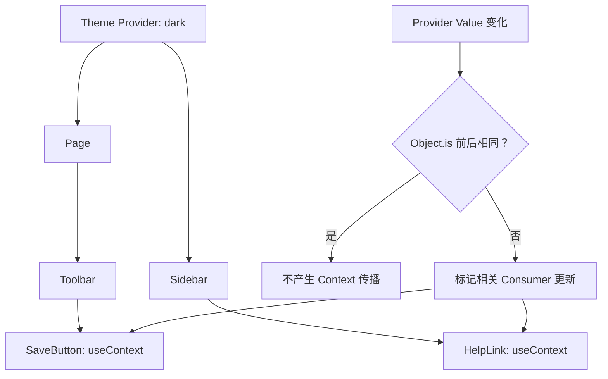

# React Context：传播机制、Value 稳定性与模块边界

> Context 是 React 树内的依赖传递机制，不是一个完整的状态管理器。它解决“远处组件如何读取同一份依赖”，但不负责状态建模、缓存、持久化、异步竞态、Selector 或 DevTools。

---

## 一、Context 解决什么问题

主题、语言、当前账号、权限策略和表单实例等依赖，常常需要被组件树中多个层级读取。如果逐层透传 Props，中间组件即使不关心该值，也必须接收并继续传递：

```tsx
function App() {
  return <Page theme="dark" />;
}

function Page({ theme }: { theme: Theme }) {
  return <Toolbar theme={theme} />;
}

function Toolbar({ theme }: { theme: Theme }) {
  return <SaveButton theme={theme} />;
}
```

这类 Prop Drilling 本身并非错误。Props 具有显式、易追踪和易复用的优点；只有当同一依赖跨越较多层级、消费者分散，并且中间层不应知道它时，Context 才开始体现价值。

本文重点回答：

- Provider 和 Consumer 如何建立依赖关系；
- Provider Value 变化后，更新如何传播；
- 为什么内联对象和函数会扩大 Render 范围；
- 为什么 `useMemo` 不能实现 Context Selector；
- Context 应按领域、更新频率还是页面拆分；
- `defaultValue` 为什么容易掩盖缺失 Provider；
- Monorepo 中重复模块为什么会让 Context 失效；
- Provider 放置位置如何决定 State 生命周期；
- 如何在测试中替换 Context，而不依赖全局单例；
- 什么时候应该改用 Props、组合、外部 Store 或 Server State 工具。

本文以 React 19.2 稳定公开 API 为基准。React 19 可以直接使用 `<SomeContext value={...}>` 提供值；React 18 及更早版本使用 `<SomeContext.Provider value={...}>`。传播依赖和内部 Fiber 字段属于实现细节，不能作为业务 API。

### 核心结论

1. Context 传递 Value，Value 的 State 仍由 `useState`、`useReducer`、外部 Store 或框架拥有。
2. Consumer 读取调用位置上方最近 Provider 的值；Provider 必须位于消费者的祖先路径中。
3. React 使用 `Object.is` 比较 Provider 的前后 Value；不同引用会触发相关 Consumer 获取新值。
4. `memo` 不能阻止 Consumer 接收新的 Context Value。
5. 稳定 Value 只能减少 Context 导致的传播，不能阻止普通父子 Render。
6. Context 粒度应同时考虑语义所有权、更新频率、消费者分布和生命周期。
7. `defaultValue` 是没有匹配 Provider 时的静态兜底，不会因 Provider 传入 `undefined` 而重新生效。
8. Provider 和 Consumer 必须引用同一个 Context 对象；重复打包的模块副本会破坏匹配。
9. Provider 的位置和 `key` 决定其内部 State 是保留还是重置。
10. 高频、细粒度订阅场景通常需要外部 Store 协议，而不是无限拆分 Context。

---

## 二、基本模型：创建、提供与读取

```tsx
import { createContext, useContext } from 'react';

type Theme = 'light' | 'dark';

const ThemeContext = createContext<Theme>('light');

function App() {
  return (
    <ThemeContext value="dark">
      <SettingsPage />
    </ThemeContext>
  );
}

function SaveButton() {
  const theme = useContext(ThemeContext);
  return <button className={`button-${theme}`}>保存</button>;
}
```

这里有三个角色：

- `createContext` 创建一个具有稳定身份的 Context 对象；
- Provider 为其后代子树提供当前 Value；
- `useContext` 让函数组件成为该 Context 的 Consumer。

### 2.1 React 18 与 React 19 的 Provider 语法

React 19：

```tsx
<ThemeContext value={theme}>
  <App />
</ThemeContext>
```

React 18 及更早版本：

```tsx
<ThemeContext.Provider value={theme}>
  <App />
</ThemeContext.Provider>
```

两种写法表达同一 Provider 关系。组件库如果仍支持 React 18，源码和文档不能只给出 React 19 简写。

### 2.2 Consumer 不只有 `useContext`

现代函数组件优先使用 `useContext`。`SomeContext.Consumer` Render Prop 仍可用于旧代码，Class Component 还可能使用 `static contextType`，但它们都受同一“最近 Provider”规则约束。

```tsx
<ThemeContext.Consumer>
  {(theme) => <SaveButton theme={theme} />}
</ThemeContext.Consumer>
```

新代码不应仅为读取 Context 而引入 Class Component 或 Render Prop 嵌套。

---

## 三、Context 传播如何工作

组件调用 `useContext(ThemeContext)` 时，React 从该组件在 React 树中的位置向上寻找最近的匹配 Provider，并把这次读取记录为 Render 依赖。



当 Provider 获得新 Value 时，React 用 `Object.is(previousValue, nextValue)` 判断是否发生变化。若不同，读取过该 Context 的后代会在相应更新中获得新值。

### 3.1 最近 Provider 获胜

嵌套 Provider 可以覆盖外层值：

```tsx
<ThemeContext value="light">
  <Header />

  <ThemeContext value="dark">
    <AdminPanel />
  </ThemeContext>
</ThemeContext>
```

`Header` 读取 `light`，`AdminPanel` 内部 Consumer 读取 `dark`。这不是全局变量覆盖，而是由 React 树位置决定的词法式作用域。

### 3.2 Provider 必须在调用组件上方

组件不能在同一次 Render 中先调用 `useContext`，再通过自己的返回值给自己提供值：

```tsx
function Profile() {
  const theme = useContext(ThemeContext); // 读取 Profile 上方的 Provider

  return (
    <ThemeContext value="dark">
      <ProfileContent theme={theme} />
    </ThemeContext>
  );
}
```

这里的 Provider 只影响 `ProfileContent` 等后代，不影响 `Profile` 自己已经发生的读取。

### 3.3 `memo` 不会屏蔽新 Context

即使 Consumer 使用 `memo` 包装，只要它读取的 Context Value 改变，仍需要以新值 Render。否则界面会停留在旧依赖上。

```tsx
const UserAvatar = memo(function UserAvatar() {
  const session = useContext(SessionContext);
  return ;
});
```

`memo` 只比较 Props，不能把 Context 更新变成不可见。若组件不需要整个 Context，应在外层读取并把更小的派生值作为 Props 传给 Memoized Child。

### 3.4 Context 更新与普通父子 Render 是两条原因

Value 引用稳定意味着“不会因为 Context Value 改变而传播”，不意味着所有后代永远不 Render。父组件自身更新、Props 改变、本地 State 更新仍可使组件 Render。性能分析必须在 Profiler 中确认 Render 原因，不能把所有 Render 都归咎于 Context。

---

## 四、Provider Value 稳定性

最常见的性能问题是每次 Render 都创建新对象：

```tsx
function SessionProvider({ children }: PropsWithChildren) {
  const [user, setUser] = useState<User | null>(null);

  return (
    <SessionContext value={{ user, signOut: () => setUser(null) }}>
      {children}
    </SessionContext>
  );
}
```

即使 `user` 没变，对象和 `signOut` 函数也是新引用，`Object.is` 比较失败，相关 Consumer 会看到新的 Value。

### 4.1 稳定对象和函数

```tsx
function SessionProvider({ children }: PropsWithChildren) {
  const [user, setUser] = useState<User | null>(null);

  const signOut = useCallback(() => {
    setUser(null);
  }, []);

  const value = useMemo(
    () => ({ user, signOut }),
    [user, signOut],
  );

  return (
    <SessionContext value={value}>
      {children}
    </SessionContext>
  );
}
```

这能避免 Provider 因无关 State Render 时创建新的 Context Value。但需要明确三点：

- `user` 真正变化时，Value 就应该变化；
- `useMemo` 是性能优化，不是语义保证，依赖必须完整；
- 如果 Provider 很少 Render 或 Consumer 很少，Memoization 的收益可能小于复杂度。

### 4.2 不要原地修改 Context Value

```tsx
settings.locale = 'en-US';
setSettings(settings); // 同一引用，Context 可能无法感知语义变化
```

Context 的变化检测依赖引用。原地修改既破坏 React State 的不可变更新约束，也可能让并发 Render 读取到难以推理的共享可变对象。应创建新对象：

```tsx
setSettings((current) => ({ ...current, locale: 'en-US' }));
```

### 4.3 `useMemo` 不是 Context Selector

```tsx
function CartBadge() {
  const cart = useContext(CartContext);
  const itemCount = useMemo(() => cart.items.length, [cart.items]);
  return <span>{itemCount}</span>;
}
```

当 `CartContext` Value 改变时，`CartBadge` 已经成为 Consumer，需要进入 Render 才能计算 `useMemo`。它可能跳过派生计算，却不能跳过这次 Consumer Render。

---

## 五、Context 粒度：按变化和所有权拆分

把所有应用状态放进一个 Context，通常会形成“大对象一处变化、广泛 Consumer 更新”的结构：

```tsx
<AppContext value={{ session, theme, locale, cart, notifications }}>
  <App />
</AppContext>
```

更合理的边界通常来自四个维度：

| 维度 | 需要回答的问题 |
|---|---|
| 语义所有权 | 这些值是否属于同一业务能力 |
| 更新频率 | 秒级变化和会话级变化是否混在一起 |
| 消费者分布 | 读取者是否位于相同页面或功能子树 |
| 生命周期 | 路由切换、账号切换时是否一起重置 |

### 5.1 拆分 State 与 Dispatch

`useReducer` 返回的 `dispatch` 身份稳定，适合把读和写拆成两个 Context：

```tsx
type CartAction =
  | { type: 'itemAdded'; productId: string }
  | { type: 'itemRemoved'; productId: string };

const CartStateContext = createContext<CartState | undefined>(undefined);
const CartDispatchContext = createContext<Dispatch<CartAction> | undefined>(
  undefined,
);

function CartProvider({ children }: PropsWithChildren) {
  const [state, dispatch] = useReducer(cartReducer, initialCartState);

  return (
    <CartStateContext value={state}>
      <CartDispatchContext value={dispatch}>
        {children}
      </CartDispatchContext>
    </CartStateContext>
  );
}
```

只负责提交 Action 的组件读取 `CartDispatchContext`，不会因购物车 State 每次变化而收到新的 Dispatch Value。读取 State 的组件仍会随 State 更新。

### 5.2 不要机械拆成每个字段一个 Context

过细拆分会增加 Provider 嵌套、模块数量和组合成本。如果多个字段总是一起变化、一起消费，拆开不会产生实际收益。先用 React DevTools Profiler 测量更新范围，再决定是否拆分。

### 5.3 高频细粒度状态

拖拽坐标、实时行情、大型编辑器 Selection 等高频状态，如果大量组件只读取其中一小部分，Context 往往缺少所需的 Selector 与订阅粒度。此时应评估 `useSyncExternalStore` 协议或提供 Selector 的状态库，而不是不断叠加 Context 和 Memoization。

---

## 六、默认值陷阱

`createContext(defaultValue)` 的默认值只在当前组件上方没有匹配 Provider 时使用，而且是静态兜底：

```tsx
const ThemeContext = createContext<Theme>('light');
```

这适合“Provider 可选，缺失时确实应该使用 light”的场景。但对于账号、权限、订单等必须由 Provider 提供的依赖，伪造默认对象会隐藏配置错误。

### 6.1 Provider 传 `undefined` 不会回退到默认值

```tsx
const LocaleContext = createContext<string | undefined>('zh-CN');

<LocaleContext value={undefined}>
  <Page />
</LocaleContext>
```

`Page` 读取到的是 `undefined`，不是 `zh-CN`。只要存在匹配 Provider，它提供的值就会生效。

### 6.2 必需 Provider 应快速失败

```tsx
type SessionContextValue = {
  user: User | null;
  signOut(): void;
};

const SessionContext = createContext<SessionContextValue | undefined>(
  undefined,
);

function useSession(): SessionContextValue {
  const value = useContext(SessionContext);

  if (value === undefined) {
    throw new Error('useSession must be used within SessionProvider');
  }

  return value;
}
```

不要提供 `signOut() {}` 这样的 No-op 默认实现。它会让测试表面通过、生产交互却静默失效。

### 6.3 `null` 可能是合法业务状态

“尚未登录”的 `user: null` 与“缺少 Provider”不是同一状态。应让 Context Value 是包含 `user` 的对象，并用外层 `undefined` 表达 Provider 缺失，避免语义混淆。

---

## 七、模块边界与 Context 身份

Provider 和 Consumer 是否匹配，取决于它们引用的 Context 对象是否严格相同：

```tsx
ProviderContext === ConsumerContext
```

如果构建系统产生同一模块的两份副本，Provider 使用副本 A，Consumer 使用副本 B，即使两者源码完全相同，也无法建立关系。Consumer 会继续读取自己的默认值。

### 7.1 常见诱因

- Monorepo 包被同时通过源码路径和构建产物路径引入；
- `npm link`、符号链接或别名配置造成重复模块；
- 微前端各自打包共享组件，却没有约定共享实例；
- 包同时暴露多个会生成独立模块实例的深层入口；
- 组件库把 React 错误打进自己的 Bundle，而非声明为 Peer Dependency。

### 7.2 工程约束

- Context 从一个明确的公共模块导出；
- Provider、Hook 和相关类型从同一入口导入；
- 组件库将兼容的 React 版本声明为 `peerDependencies`；
- Monorepo 统一解析别名和包入口；
- 排查时直接比较两个 Context 引用是否 `===`；
- 不在组件函数内部调用 `createContext`。

在函数内部创建 Context 会让每次 Render 得到新身份，也无法让其他模块稳定导入同一个对象。

### 7.3 React 树边界

Context 沿 React 树传播。Portal 虽把 DOM 渲染到另一容器，仍属于原 React 树并继承 Context；两个独立 `createRoot` 则没有共同 Provider 祖先，不能靠 Context 自动共享状态。

---

## 八、Provider 位置决定 State 生命周期

Context 不保存 State，但 Provider 组件常在内部持有 State。它在组件树中的位置决定 State 的作用域和生命周期。

```tsx
function WorkspaceRoute({ workspaceId }: { workspaceId: string }) {
  return (
    <WorkspaceProvider key={workspaceId} workspaceId={workspaceId}>
      <WorkspacePage />
    </WorkspaceProvider>
  );
}
```

当 `workspaceId` 改变时，`key` 使旧 Provider 子树卸载并创建新树，内部 Reducer State、订阅和缓存都会重置。这适合不同工作区之间必须隔离草稿和权限的场景。

如果希望路由切换后继续保留状态，应把 Provider 放到更稳定的共同祖先，并避免无意改变其 Type、位置或 Key。不要为了“全局可用”把所有 Provider 都放到应用根部；根部 Provider 的状态通常会存活得更久，也更容易跨账号或租户泄漏旧状态。

### 8.1 Provider 中的异步资源也要治理生命周期

如果 Provider 负责加载权限，仍需处理错误、取消和响应乱序：

```tsx
function PermissionProvider({
  workspaceId,
  children,
}: PropsWithChildren<{ workspaceId: string }>) {
  const [state, setState] = useState<PermissionState>({ status: 'loading' });

  useEffect(() => {
    const controller = new AbortController();
    let ignore = false;

    setState({ status: 'loading' });

    loadPermissions(workspaceId, { signal: controller.signal })
      .then((permissions) => {
        if (!ignore) {
          setState({ status: 'success', permissions });
        }
      })
      .catch((error: unknown) => {
        if (!ignore && !controller.signal.aborted) {
          setState({ status: 'error', error });
        }
      });

    return () => {
      ignore = true;
      controller.abort();
    };
  }, [workspaceId]);

  return (
    <PermissionContext value={state}>
      {children}
    </PermissionContext>
  );
}
```

`AbortController` 尝试取消底层请求，`ignore` 还防止不支持取消的数据源回写旧结果。真实项目还要定义 Retry、Cache、鉴权刷新和错误展示；复杂 Server State 更适合交给路由 Loader 或专门的数据请求层，Context 只负责暴露结果。

### 8.2 SSR 不是跨请求全局单例

服务端渲染时应为每个请求构造独立 Provider Value，不能把当前用户写进进程级可变对象。服务端与客户端的初始 Value 还应生成一致 UI，避免 Hydration Mismatch。

采用 React Server Components 的框架时，Context 的可用边界和 Provider 放置还受框架的 Server/Client Component 规则约束，应以目标框架版本文档为准。

---

## 九、测试替换：显式注入依赖

Context 的测试价值之一，是可以为被测子树提供可控实现，而不修改全局变量。

```tsx
import { render, screen } from '@testing-library/react';

function renderWithSession(
  ui: ReactNode,
  session: SessionContextValue,
) {
  return render(
    <SessionContext value={session}>
      {ui}
    </SessionContext>,
  );
}

test('管理员可以看到审计入口', () => {
  renderWithSession(<AccountMenu />, {
    user: adminUser,
    signOut: vi.fn(),
  });

  expect(screen.getByRole('link', { name: '审计日志' })).toBeVisible();
});
```

### 9.1 测试原则

- 每个测试创建自己的 Provider Value，避免跨测试泄漏；
- 测试用户可观察行为，不断言内部 Context 层数；
- 对必需 Provider 增加“缺失时快速失败”的测试；
- 对权限、语言等关键分支使用代表性 Value；
- Mock Action 使用可验证函数，避免 No-op 掩盖调用；
- 集成测试保留真实 Provider，单元测试才替换依赖；
- 测试工具不要偷偷提供过度宽松的默认值。

### 9.2 Provider API 本身也是契约

如果大量测试都必须构造几十个字段，说明 Context Value 可能过大或同时承担多个领域职责。测试摩擦常常是粒度设计问题的信号，不应只靠更复杂的 Fixture 隐藏。

---

## 十、常见错误与修复

### 10.1 把 Context 当作状态管理器

错误：认为用了 Context 就自动拥有 Reducer、持久化、异步请求、调试和性能优化。

修复：先决定 State 所有者和更新协议，再决定是否通过 Context 暴露。

### 10.2 一个 Context 放入全部应用状态

错误：任意字段变化都创建新的大 Value，消费者边界难以控制。

修复：按领域、更新频率和生命周期拆分，并用 Profiler 验证。

### 10.3 为了避免 Prop Drilling 无条件使用 Context

错误：局部组件关系也改为隐式依赖，组件难以单独复用。

修复：短距离优先 Props；布局插槽优先组件组合；真正的跨层共享依赖再使用 Context。

### 10.4 用 `useMemo` 假装实现 Selector

错误：Consumer 已因 Context 变化 Render，Memo 只能缓存派生计算。

修复：缩小 Context、外层读取后传递小 Props，或使用支持细粒度订阅的 Store。

### 10.5 使用伪默认对象

错误：缺少 Provider 时得到 No-op Action，问题延迟到生产环境才暴露。

修复：必需依赖以 `undefined` 为缺失标记，并由自定义 Hook 抛出清晰错误。

### 10.6 忽略模块副本

错误：Provider 和 Consumer 从不同构建入口导入“同名 Context”。

修复：统一公共入口、依赖解析和 Peer Dependency，并检查对象身份。

### 10.7 Provider 放得过高

错误：页面级草稿或租户权限在退出页面、切换账号后仍保留。

修复：把 Provider 放到与业务 State 生命周期一致的最低共同祖先。

---

## 十一、方案选择

| 需求 | 优先方案 | 原因与边界 |
|---|---|---|
| 父子或少量层级传值 | Props | 依赖显式、复用简单 |
| Layout 注入内容 | Component Composition | 避免中间层了解数据协议 |
| 低频跨层依赖 | Context | 适合主题、语言、会话能力 |
| 中等复杂本地领域状态 | Context + Reducer | 更新协议集中，但仍无 Selector |
| 高频细粒度客户端状态 | External Store | 需要 Snapshot、Subscribe、Selector |
| 服务端缓存数据 | Server State 工具或框架 Loader | 处理缓存、去重、重试和 Hydration |
| URL 可分享状态 | Router / URL | 刷新、前进后退和分享语义正确 |

Context 是否合适，取决于依赖的作用域和变化模型，而不是项目大小。大型应用可以正确使用小 Context，小型页面也可能因高频状态而需要外部 Store。

---

## 十二、性能分析与验证

Context 优化应先测量：

1. 使用 React DevTools Profiler 记录真实交互；
2. 找出哪个 Provider Value 发生变化；
3. 区分 Context 传播、父组件 Render 和组件自身 State 更新；
4. 检查 Value 是否因内联对象或函数产生无意义新引用；
5. 观察 Consumer 数量、Commit 时间和慢组件；
6. 分别尝试稳定 Value、拆分 Context 或下移 Provider；
7. 在生产构建、目标设备和代表性数据量下复测。

不要通过人为增加 `memo` 数量来证明“优化有效”。需要比较优化前后的 Commit 时间、Render 次数和交互延迟，并确认代码复杂度没有超过收益。

### 12.1 可复现的性能场景

例如主题 Context 与实时行情 Context 混在同一对象中，可以录制一次价格更新：

- 记录价格推送前后的 Commit；
- 检查只读取主题的组件是否也被 Context 更新触发；
- 拆分两个 Context 后重复同一数据和交互；
- 比较受影响组件数量与 Commit Duration；
- 确认拆分没有改变业务行为。

这比笼统声称“Context 性能差”更有工程价值。

---

## 十三、工程检查清单

- Context 传递的是稳定依赖，还是被当成完整状态方案；
- Props 或组件组合是否已经足够；
- Provider 是否位于所有 Consumer 的正确祖先路径；
- Value 是否存在无意义的新对象、新数组或新函数；
- Memoization 依赖是否完整，收益是否经过测量；
- Context 是否混合了不同领域或不同更新频率；
- State 与 Dispatch 是否值得拆分；
- 默认值是合法兜底，还是掩盖缺失 Provider；
- `null` 业务状态与 Provider 缺失是否明确区分；
- Provider 和 Consumer 是否导入同一个 Context 实例；
- Monorepo、组件库和微前端是否可能重复打包模块；
- Provider 位置、Type 和 Key 是否符合 State 生命周期；
- 异步 Provider 是否处理错误、取消、竞态和 Cleanup；
- SSR 是否按请求隔离 Value，并保持 Hydration 一致；
- 测试是否能显式替换 Value，且不会跨用例泄漏；
- 高频细粒度状态是否应改用外部 Store。

---

## 十四、总结

1. Context 解决 React 树内的跨层依赖传递，不自动解决状态管理。
2. Consumer 读取上方最近 Provider，Context 对象身份必须完全一致。
3. Provider Value 通过 `Object.is` 比较；引用变化会让相关 Consumer 获取新值。
4. `useMemo` 和 `useCallback` 可减少无意义传播，但不是 Selector，也不能阻止普通父子 Render。
5. Context 应按领域、更新频率、消费者分布和生命周期共同划分。
6. 必需 Provider 应使用明确的缺失标记和 Fail-fast Hook，不应依赖 No-op 默认值。
7. 模块重复、Provider 位置错误和不稳定 Key 都会造成难以发现的工程问题。
8. Provider 内部拥有异步资源时，仍需处理取消、错误、竞态和释放。
9. 测试应通过 Provider 显式注入可控依赖，而不是修改全局单例。
10. 高频细粒度订阅、Server State 和 URL State 应交给更匹配的协议。

真正可靠的 Context 设计，不在于消灭所有 Props，而在于让共享依赖拥有清晰的所有者、作用域、更新频率和生命周期。

---

## 问答复盘

### Q1：使用 Context 是否等于引入了状态管理？

**答：** 不等于。Context 只负责传递 Value；状态仍由 State、Reducer、外部 Store 或框架数据层管理。

### Q2：为什么 `memo` 包装的组件在 Context 更新后仍会 Render？

**答：** `memo` 比较 Props，不能阻止 Consumer 接收新的 Context Value，否则组件会显示旧依赖。

### Q3：Provider Value 已经使用 `useMemo`，为什么后代仍可能 Render？

**答：** 稳定 Value 只避免 Context 变化导致的传播。父组件更新、Props、本地 State 等普通 Render 原因仍然存在。

### Q4：Provider 传入 `undefined` 时会使用 `createContext` 的默认值吗？

**答：** 不会。只要存在匹配 Provider，Consumer 就读取它提供的值；默认值仅用于完全没有 Provider 的情况。

### Q5：State Context 与 Dispatch Context 拆分有什么收益？

**答：** `dispatch` 通常身份稳定，只提交 Action 的组件可以避免随 State Value 变化而接收 Context 更新；读取 State 的组件仍正常更新。

### Q6：同一个 Context 源码为什么在 Monorepo 中可能失效？

**答：** 构建系统可能生成两个模块实例。Provider 和 Consumer 引用不同对象时，即使源码相同也无法匹配。

### Q7：切换工作区时，如何确保 Provider 内部草稿和订阅被重置？

**答：** 把 Provider 放在工作区边界，并使用稳定的 `workspaceId` 作为 `key` 表达实体身份；同时确保 Effect Cleanup 取消订阅和请求。

### Q8：大量组件只读取大对象中的一个字段，应继续使用 Context 吗？

**答：** 先测量。若更新高频且需要细粒度订阅，Context 缺少原生 Selector，通常应拆分边界或改用外部 Store 协议。

### Q9：测试 Context Consumer 时，应该 Mock `useContext` 吗？

**答：** 通常不应该。用真实 Provider 注入测试 Value 更接近公开契约，也能验证缺失 Provider、权限分支和 Action 调用。

---

## 延伸知识

- **外部 Store 协议**：`useSyncExternalStore`、Snapshot、Subscribe 与 Tear 防护。
- **状态管理选型**：Local State、Context + Reducer、Redux Toolkit、Zustand、MobX 与 XState。
- **组件 API 设计**：Props、Composition、Headless Component 与隐式依赖边界。
- **Memoization**：`memo`、`useMemo`、`useCallback` 的成本模型与测量方法。
- **状态分类**：Local、Server、URL、Form 与 Derived State 的所有权。
- **Server State**：Cache、Deduplication、Retry、Mutation 和 Hydration。
