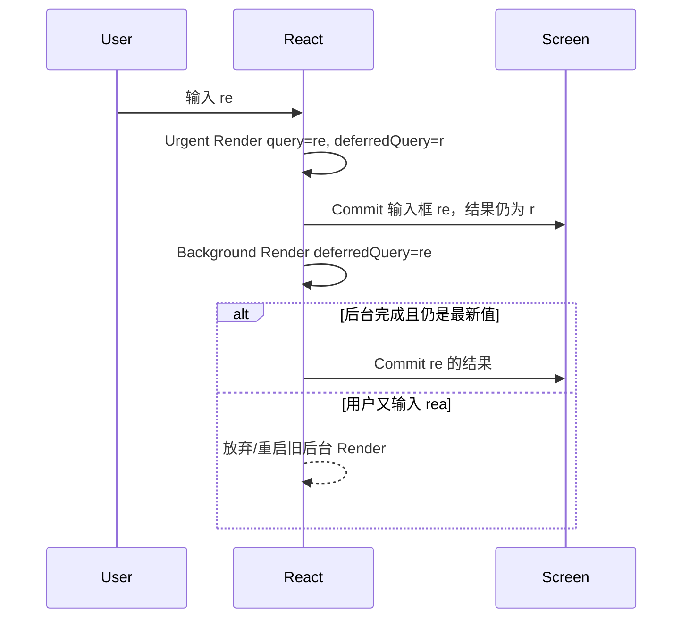
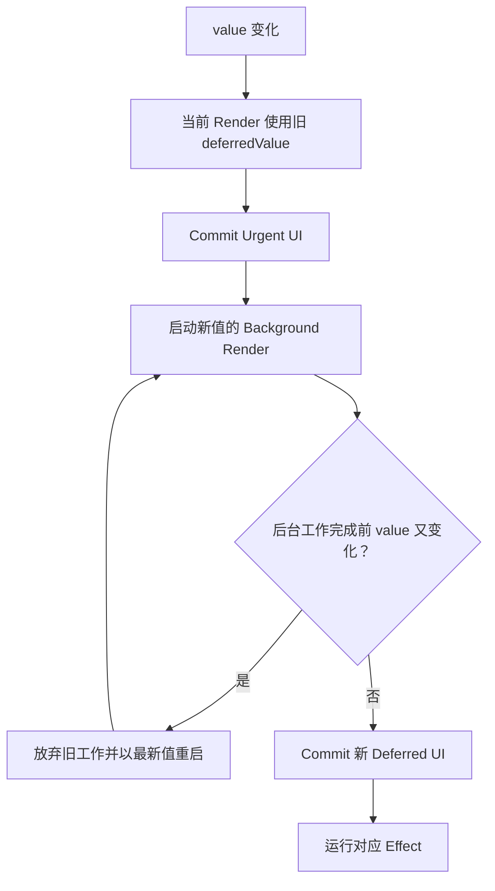

# React Deferred Value：陈旧内容、后台渲染与输入响应性

> `useDeferredValue` 不会延迟 State 本身，而是让某个消费方暂时继续使用旧值，在后台准备新值对应的 UI。它用“短暂展示陈旧内容”换取紧急输入响应，且没有固定时间延迟。

---

## 一、本文解决什么问题

搜索框的值必须跟随键盘立即更新，但下方图表或大型列表可能 Render 很慢。`useTransition` 适合能控制 Setter 的场景；如果值来自 Props、路由器、外部 Hook，当前组件无法把上游 Setter 包进 `startTransition`，就需要在消费端延迟使用这个值。

本文回答以下问题：

- `useDeferredValue` 返回值为什么会暂时落后；
- 当前 Render 与 Background Render 如何协作；
- Stale Content 应如何视觉和语义提示；
- Deferred Value 与 Suspense Fallback 如何配合；
- 为什么 CPU 密集筛选还需要 `memo` 或 `useMemo`；
- 新对象作为 Deferred Value 为什么会造成重复后台工作；
- `initialValue` 参数适合什么场景；
- Deferred Value 是否能减少网络请求；
- 它与 Transition、Debounce、Throttle 有何区别；
- 如何测试后台 Render、Effect 和最终结果；
- 如何在生产环境验证输入响应与最终完成时间。

本文依据 2026 年 7 月 React 官方 `useDeferredValue` 文档描述当前公开行为。`useDeferredValue(value, initialValue?)` 中的可选 `initialValue` 是否可用，应以项目 React 和 TypeScript 类型版本为准；较旧项目升级前需验证。Lane、Deferred Lane 和内部调度字段属于版本相关实现，本文不依赖具体常量。

### 核心结论

1. `useDeferredValue(value)` 在更新时可以先返回上一次值，让当前紧急 Render 快速完成，再用新值启动后台 Render。
2. Background Render 可被新的更新打断并从最新值重启，不会把半成品提交给用户。
3. Deferred Value 没有固定毫秒延迟，React 会在当前 Render 后尽快尝试后台工作。
4. `value !== deferredValue` 可用于判断原始值与展示内容是否暂时不同，但对象值需特别注意引用语义。
5. Suspense-aware 子树在后台 Suspend 时通常继续显示旧 Deferred Content，而不是立即展示 Fallback。
6. 后台 Render 未 Commit 前不会运行对应 Effect；被放弃的后台结果也不会执行 Effect Setup。
7. CPU 密集 UI 只有在旧 Deferred Value 能让昂贵子树跳过紧急 Render 时才有收益，通常需要合理组件边界与 Memoization。
8. `useDeferredValue` 不提供请求去重、固定等待、取消或响应乱序治理，不能替代 Debounce 和数据请求层。
9. 用户操作陈旧内容时，应以屏幕上实际展示的 Snapshot 为准，避免把新查询与旧结果混用。
10. 性能评估必须同时关注输入响应、后台重启成本和最终内容完成时间。

---

## 二、基本模型：值更新，消费方暂时落后

```tsx
function SearchPage() {
  const [query, setQuery] = useState('');
  const deferredQuery = useDeferredValue(query);

  return (
    <>
      <input
        value={query}
        onChange={event => setQuery(event.target.value)}
      />
      <SearchResults query={deferredQuery} />
    </>
  );
}
```

当 `query` 从 `r` 变为 `re` 时，可以概念化为两个 Render：



第一遍 Render 让输入框立即显示 `re`，结果区域继续消费旧值 `r`。React 随后尝试以 `re` 为 Deferred Value 准备新结果。

### 2.1 没有固定 Delay

`useDeferredValue` 不等价于“延迟 300 ms”。当前紧急 Render 完成后，React 会尽快开始后台 Render：

- 快设备和轻量子树可能几乎立即完成；
- 慢设备或重子树会更明显地显示旧内容；
- 新输入到来会优先处理，并重启后台工作；
- 浏览器主线程被其他长任务占用时，React 同样无法执行。

这是一种自适应调度，不是 Timer。

---

## 三、`useDeferredValue` 的参数与相等性

当前公开签名为：

```tsx
const deferredValue = useDeferredValue(value, initialValue?);
```

### 3.1 `value`

可以是任意类型。React 使用 `Object.is` 判断新旧值是否不同：

- 字符串、数字等原始值通常自然稳定；
- 对象、数组和函数按引用比较；
- Render 中新建对象会被视为每次都变化。

```tsx
// 错误方向：每次 Render 都创建新对象。
const deferredFilters = useDeferredValue({ query, category });
```

即使 `query` 和 `category` 没变化，对象引用也不同，可能产生不必要的后台 Render。优先传递原始值，或在确有引用消费者时稳定对象：

```tsx
const filters = useMemo(
  () => ({ query, category }),
  [query, category],
);

const deferredFilters = useDeferredValue(filters);
```

更简单的方案通常是分别传递：

```tsx
const deferredQuery = useDeferredValue(query);
const deferredCategory = useDeferredValue(category);
```

是否将多个字段作为同一延迟 Snapshot，取决于它们是否必须一起更新。

### 3.2 `initialValue`

当前官方 API 支持可选初始值：

```tsx
const deferredReport = useDeferredValue(report, EMPTY_REPORT);
```

首次 Render 返回 `initialValue`，并在后台尝试新 `value`。适用于首屏可以先显示稳定占位、非关键摘要或预先准备数据的场景。

边界包括：

- `initialValue` 必须满足子组件类型与不变量；
- 服务端 HTML 与客户端初始 Render 必须可 Hydrate；
- 不要用空对象伪装已加载业务数据；
- 占位应保留尺寸，避免 Cumulative Layout Shift；
- 较旧 React/类型版本可能不支持第二参数，应验证依赖版本。

若不提供 `initialValue`，首次 Render 没有“上一份值”可用，因此通常直接返回当前 `value`，不会凭空延迟首屏。

---

## 四、Stale Content：明确告诉用户内容暂时落后

可以比较原始值与 Deferred Value：

```tsx
const deferredQuery = useDeferredValue(query);
const isStale = query !== deferredQuery;
```

然后弱化旧内容：

```tsx
<div
  aria-busy={isStale}
  style={{
    opacity: isStale ? 0.6 : 1,
    transition: 'opacity 120ms ease',
  }}
>
  <SearchResults query={deferredQuery} />
</div>
```

### 4.1 为什么需要 Stale 提示

输入框已经显示 `react`，结果仍对应 `rea`。若界面没有任何提示，用户可能误以为搜索失效或把旧结果当成新查询结果。

Stale 表达可以是：

- 结果区域轻微降低透明度；
- 局部进度条；
- “正在更新结果”的文本；
- `aria-busy="true"`；
- 保留旧内容但暂停某些高风险命令。

避免：

- 每个字符都用 `aria-live` 高频播报；
- 用极低透明度让内容不可读；
- 无理由禁用输入框；
- 将旧内容完全清空，失去 Deferred 的主要价值；
- 只用颜色表达状态。

### 4.2 陈旧内容的交互语义

旧结果仍可能可点击。点击时必须以屏幕正在展示的 Snapshot 为准：

```tsx
<SearchResults
  query={deferredQuery}
  onOpenProduct={productId => {
    analytics.track('search_result_opened', {
      productId,
      displayedQuery: deferredQuery,
    });
    navigateToProduct(productId);
  }}
/>
```

不要记录最新 `query` 却操作旧结果，否则 Analytics、缓存键和业务判断会属于不同 Snapshot。

对于转账、删除等高风险操作，如果陈旧内容可能改变决策，应在 Stale 期间禁用特定命令或要求重新确认，而不是默认所有旧内容都可安全交互。

### 4.3 对象值的 Stale 判断

`filters !== deferredFilters` 是引用判断。若上游每次重建对象，界面会长期被视为 Stale。应先保证值的身份语义正确，再使用引用比较作为状态信号。

---

## 五、Background Render：可中断、可放弃、无副作用

当 `value` 变化时，React 在当前 Render 之后安排使用新 Deferred Value 的后台 Render。公开语义包括：

- 后台 Render 是可中断的；
- 新值到来时会从最新值重启；
- 只有完成且仍有效的结果会 Commit；
- 被放弃结果不会局部修改 DOM；
- 对应 Effect 只有在结果 Commit 后才运行。



### 5.1 Render 仍必须纯净

```tsx
function Results({ query }: { query: string }) {
  analytics.track('results_rendered', { query }); // 错误
  return <ResultList query={query} />;
}
```

后台 Render 可能执行多次却从未 Commit。请求、Analytics、订阅和 DOM 操作不能放在普通 Render 中。Suspense 数据读取必须由支持缓存与 Promise 协议的数据源负责，不能每次 Render 裸调用无缓存 Fetch。

### 5.2 Effect 只属于已 Commit 的 Deferred UI

```tsx
useEffect(() => {
  const subscription = subscribeToQuery(deferredQuery);
  return () => subscription.unsubscribe();
}, [deferredQuery]);
```

如果某次后台 Render 被新输入放弃，它的 Effect Setup 不会执行。只有 `deferredQuery` 真正 Commit 后，React 才运行对应 Effect。

这并不等价于网络 Debounce。若数据读取在 Render/Suspense Cache 中启动，请求仍可能为每个值发出；如果 Effect 才发请求，被放弃背景结果可能不启动该 Effect，但这不是可配置的固定静默窗口，也不是请求数量保证。

---

## 六、Suspense 协作：保留旧内容而不是立即 Fallback

```tsx
function SearchPage() {
  const [query, setQuery] = useState('');
  const deferredQuery = useDeferredValue(query);
  const isStale = query !== deferredQuery;

  return (
    <>
      <input
        value={query}
        onChange={event => setQuery(event.target.value)}
      />

      <Suspense fallback={<SearchResultsSkeleton />}>
        <div aria-busy={isStale} className={isStale ? 'stale' : undefined}>
          <SearchResults query={deferredQuery} />
        </div>
      </Suspense>
    </>
  );
}
```

在已有结果之后输入新查询时，如果新 Deferred Render Suspend，React 可以继续展示旧结果，直到新数据准备完成，而不是立即用 Skeleton 替换已有内容。

### 6.1 首次加载仍需要 Fallback

首次 Render 没有旧 Deferred Content 可保留，Suspense Boundary 仍可能展示 Fallback。除非使用合适的 `initialValue` 或服务端预取数据，否则 Deferred Value 不能消除首次加载状态。

### 6.2 Boundary 位置决定体验

如果 Boundary 包住整个页面，新查询 Suspend 时可能影响过大区域。应把 Boundary 放在允许独立等待的结果区，并考虑：

- 搜索框始终可交互；
- 旧结果是否继续显示；
- 错误由哪个 Error Boundary 处理；
- Nested Boundary 的 Reveal 顺序；
- SSR Streaming 与 Hydration；
- 数据源是否真正支持 Suspense。

下一篇 Suspense 专题会展开这些边界。

### 6.3 Suspense 不等于任意 Effect Fetch

普通 `useEffect` 请求不会因为组件返回 Loading State 就自动激活 Suspense。数据源必须使用 React/框架支持的 Suspense 协议。不要在 Render 中随意 `throw fetch(...)`，每次 Render 新建 Promise 会造成重复请求和不稳定缓存。

---

## 七、CPU 密集筛选：需要正确组件边界

```tsx
function SearchPage({ products }: { products: Product[] }) {
  const [query, setQuery] = useState('');
  const deferredQuery = useDeferredValue(query);

  return (
    <>
      <input
        value={query}
        onChange={event => setQuery(event.target.value)}
      />
      <SlowProductList products={products} query={deferredQuery} />
    </>
  );
}
```

仅使用 Deferred Value 不一定足够。如果 `SlowProductList` 在紧急 Render 中即使 Props 相同仍重新执行，输入仍会卡顿。应让昂贵子树能基于稳定 Props 跳过：

```tsx
const SlowProductList = memo(function SlowProductList({
  products,
  query,
}: {
  products: Product[];
  query: string;
}) {
  const visibleProducts = filterProducts(products, query);

  return visibleProducts.map(product => (
    <ProductRow key={product.id} product={product} />
  ));
});
```

紧急 Render 时 `deferredQuery` 仍是旧值，若 `products` 引用也稳定，`memo` 可让列表跳过。后台 Render 采用新 Deferred Value 后，列表才执行昂贵筛选。

### 7.1 `useMemo` 方案

如果计算适合留在当前组件：

```tsx
const visibleProducts = useMemo(
  () => filterProducts(products, deferredQuery),
  [products, deferredQuery],
);
```

紧急 Render 中依赖未变，可以复用结果；后台 Render 中 Deferred Value 更新，才重新计算。

### 7.2 仍然无法切开单个长函数

`filterProducts()` 如果一次调用就占用主线程很久，React 不能在函数内部暂停。Deferred Value 让该计算以后台优先级触发，但长函数开始后仍会形成 Long Task。应进一步考虑：

- 索引和更优算法；
- 预归一化小写文本；
- 分页或虚拟化；
- Web Worker；
- 服务端搜索；
- Debounce 减少计算次数。

### 7.3 Memoization 必须有稳定输入

父组件若每次都深拷贝 `products`，`memo` 和 `useMemo` 都会失效。不可变更新应只为变化分支创建新引用，并让未变化集合保持稳定。

---

## 八、不替代网络防抖

React 官方文档明确指出，`useDeferredValue` 本身不阻止额外网络请求。在 Suspense Cache 场景中，每次输入都可能启动对应查询，只是旧结果会显示到新结果准备完成。

### 8.1 Deferred Value 控制显示时序

```text
输入 a  -> 可能请求 a  -> 仍展示旧内容
输入 ab -> 可能请求 ab -> 放弃 a 的后台 UI
输入 abc -> 可能请求 abc -> 最终展示 abc
```

被放弃的是 React 后台 Render，不代表底层请求自动取消。数据层可能缓存 `a` 和 `ab`，也可能继续消耗网络。

### 8.2 Debounce 控制发起时机

```tsx
function useDebouncedValue<T>(value: T, delayMs: number) {
  const [debouncedValue, setDebouncedValue] = useState(value);

  useEffect(() => {
    const timerId = window.setTimeout(() => {
      setDebouncedValue(value);
    }, delayMs);

    return () => window.clearTimeout(timerId);
  }, [value, delayMs]);

  return debouncedValue;
}
```

Debounce 明确等待静默窗口，减少请求或计算次数，但增加固定等待。

### 8.3 组合使用

```tsx
const debouncedQuery = useDebouncedValue(query, 250);
const deferredQuery = useDeferredValue(debouncedQuery);
```

组合含义是：

- Debounce 减少查询启动次数；
- Deferred Value 让采用新查询的结果区以后台优先级渲染；
- 数据层仍负责 Cache、Abort、Retry 和 Race Condition；
- 输入 State 始终立即更新。

不要默认双重延迟。先测量问题来自网络请求过多、CPU Render 卡顿，还是两者都有，再选择对应工具。

---

## 九、与 Transition 的区别

| 维度 | `useDeferredValue` | Transition |
|---|---|---|
| 控制位置 | 值的消费端 | State 更新发起端 |
| 主要 API | `useDeferredValue(value)` | `startTransition` / `useTransition` |
| 是否需要控制 Setter | 不需要 | 需要包裹相关 Setter/Action |
| Pending 信号 | 可由原值与 Deferred Value 比较 | `useTransition` 提供 `isPending` |
| 典型场景 | Props、外部 Hook 值、慢子树 | Tab、路由、提交 Action、状态切换 |
| 受控输入 | 输入使用原值，慢子树用 Deferred Value | 输入 Setter 留在外部，结果 Setter 进入 Transition |
| 网络治理 | 不负责 | 不负责 |

### 9.1 何时优先 Deferred Value

- 当前组件只能接收 `query` Prop，无法修改父级 Setter；
- 同一个值需要一部分 UI 立即消费、一部分 UI 延迟消费；
- 希望直接表达旧值与新值的 Stale 关系；
- 慢子树可以通过 Memoization 在旧值不变时跳过。

### 9.2 何时优先 Transition

- 当前代码拥有触发更新的 Setter；
- 一次 Action 包含多个需要共同降级的更新；
- 需要 `isPending` 覆盖异步 Action；
- 框架路由或提交 API 已围绕 Action 设计。

两者底层都利用并发调度，但 API 表达不同所有权，不应为了风格统一强行替换。

---

## 十、数据请求库与缓存协作

数据层应负责：

- Query Key；
- 请求去重和 Cache；
- Abort、超时与重试；
- Stale Time 与失效；
- 响应乱序；
- SSR、预取与 Hydration；
- Error 和 Mutation 一致性。

Deferred Value 只负责传给结果子树的消费版本：

```tsx
function SearchPage() {
  const [query, setQuery] = useState('');
  const deferredQuery = useDeferredValue(query);
  const isStale = query !== deferredQuery;

  return (
    <SearchLayout
      query={query}
      onQueryChange={setQuery}
      stale={isStale}
    >
      <Suspense fallback={<SearchSkeleton />}>
        <CachedSearchResults query={deferredQuery} />
      </Suspense>
    </SearchLayout>
  );
}
```

`CachedSearchResults` 必须由框架或数据层保证同一 Query Key 复用 Promise/结果。否则后台 Render 重启会反复创建请求。

### 10.1 Cache 命中的价值

虽然每次键入可能发起请求，缓存可以让用户退格回旧查询时立即展示已有结果。是否值得为每个字符请求取决于接口成本、数据新鲜度和产品体验；高成本搜索仍应 Debounce。

### 10.2 过期响应不能覆盖新结果

Deferred Value 不提供 Latest-wins 语义。非 Suspense Effect 请求仍应使用 `AbortController` 或请求序号；写请求还需要服务端幂等与版本控制。

---

## 十一、SSR、Hydration 与初始值

服务端渲染需要确定的 HTML。注意：

- 不提供 `initialValue` 时，首次 Render 通常使用当前值；
- 提供 `initialValue` 时，服务端与客户端初始输出必须一致；
- 占位内容应有稳定尺寸，减少 CLS；
- 核心 SEO 内容不应无理由只在后台 Render 出现；
- Suspense Streaming 的 Reveal 由框架和 Boundary 决定；
- 客户端缓存必须与服务端 Snapshot 协调。

Deferred Value 不会自动把客户端慢组件变成服务端 Streaming Boundary。两者都涉及异步 UI，但生命周期不同。

---

## 十二、常见误区

### 12.1 “Deferred Value 固定延迟 300 ms”

错误。它没有固定 Delay，React 在紧急 Render 后尽快尝试可中断的后台 Render。

### 12.2 “它会延迟原始 State 更新”

错误。原始值立即更新；只有消费方拿到的 Deferred Value 暂时保留旧值。

### 12.3 “使用后慢列表一定不会阻塞输入”

错误。慢子树还需能在旧 Deferred Props 下跳过紧急 Render，通常依赖 `memo`、`useMemo` 和稳定引用。

### 12.4 “后台 Render 会逐块显示半成品”

错误。被中断的工作不 Commit，用户看到旧完成内容，直到新树完成。

### 12.5 “Deferred Value 可以减少每个字符的请求”

错误。它不提供请求次数保证。需要减少请求时使用 Debounce/Throttle，并由数据层取消和去重。

### 12.6 “新建对象传入也没有问题”

错误。对象按引用比较，每次新引用会造成不必要的后台 Render 和长期 Stale。

### 12.7 “旧内容可以无条件继续执行所有命令”

错误。高风险操作需评估 Stale Snapshot，Analytics 和业务命令也应绑定实际展示值。

---

## 十三、测试与验证

### 13.1 行为测试

应验证：

- 输入框立即显示最新值；
- 结果区可暂时显示旧查询；
- Stale 标识在新内容 Commit 后消失；
- 快速输入最终只展示最新查询；
- 陈旧结果点击使用 `deferredQuery` Snapshot；
- 错误 Boundary 和重试正常；
- 被放弃后台 Render 不运行 Effect；
- Debounce、Abort 和请求 Cache 分别生效。

不要断言固定延迟或固定 Render 次数。

### 13.2 可控 Suspense 测试

使用按 Query Key 缓存的可控 Promise：

1. 完成查询 `a` 并展示结果；
2. 输入 `ab`，让其 Promise Pending；
3. 断言输入显示 `ab`，结果仍为 `a` 且标记 Stale；
4. Resolve `ab`；
5. 断言结果切换为 `ab`，Stale 状态消失；
6. Reject 时验证 Error Boundary 与重试。

### 13.3 Effect 测试

给结果组件添加测试订阅，快速输入使中间后台 Render 被放弃，断言中间值没有 Setup；最终值 Commit 后才订阅，卸载后 Cleanup。

### 13.4 性能测量

在生产构建或 Profiling 构建、目标浏览器和代表性设备记录：

- 输入事件到输入框 Paint 的时间；
- Interaction to Next Paint（INP）；
- 慢子树 Render 耗时；
- 后台 Render 被重启的次数与 CPU 成本；
- 最终结果完成时间；
- 网络请求数量和 Cache 命中；
- Long Task、Layout 与 Paint；
- 内存中保留旧值和缓存的成本。

Deferred Value 可能改善输入响应，却增加后台重算或让最终内容更晚完成。两者必须一起报告。

---

## 十四、工程检查清单

- 原始值是否必须立即驱动某部分 UI；
- 哪个子树允许短暂展示 Stale Content；
- 是否无法控制上游 Setter，因此适合消费端延迟；
- Deferred Value 是否为稳定原始值或稳定对象；
- Stale 判断是否符合对象引用语义；
- 慢子树是否通过 `memo`/`useMemo` 跳过紧急 Render；
- 单个长同步函数是否仍需算法或 Worker 优化；
- Stale 内容是否有视觉与可访问性提示；
- 用户点击旧内容时是否使用实际展示 Snapshot；
- Suspense Boundary 是否只包裹允许等待的区域；
- 数据源是否缓存 Promise 并支持 Suspense；
- 是否错误期待减少网络请求；
- Debounce、Abort、Cache 和竞态是否由独立层处理；
- `initialValue` 是否与目标 React 版本和 Hydration 一致；
- 是否同时测量输入响应、后台 CPU 和最终完成时间。

---

## 十五、总结

1. `useDeferredValue` 延迟的是消费版本，不是原始 State 更新。
2. 更新时当前 Render 可继续使用旧值，随后 React 以新值启动可中断 Background Render。
3. Deferred Value 没有固定时间延迟，会根据当前工作和设备能力调度。
4. `value !== deferredValue` 可表示 Stale，但对象值必须有稳定身份。
5. Suspense 中新后台结果未就绪时，可以继续展示旧内容而不是立即 Fallback。
6. 被放弃后台 Render 不 Commit，也不会运行对应 Effect。
7. CPU 密集子树需要合理边界、Memoization 和稳定 Props，Deferred Value 才能避开紧急路径。
8. 它不减少网络请求、不取消 Fetch，也不处理响应乱序，不能替代 Debounce 和数据层。
9. Transition 控制更新发起端，Deferred Value 控制值消费端，应根据所有权选择。
10. Stale Content 是明确产品状态，交互、Analytics 和可访问性都应绑定实际展示 Snapshot。

Deferred Value 的本质不是“慢一点显示”，而是允许界面同时承认两个事实：用户已经输入了新值，而昂贵区域暂时仍展示上一份完成且可用的结果。

---

## 问答复盘

### Q1：`useDeferredValue` 是否会延迟输入框 State？

**答：** 不会。原始 State 立即更新；慢子树使用的 Deferred Value 暂时保留旧值。

### Q2：Deferred Value 与 Debounce 最关键的区别是什么？

**答：** Deferred Value 没有固定等待，主要调整后台 Render 优先级；Debounce 等待静默窗口并减少工作或请求发起次数。

### Q3：为什么慢列表通常还要配合 `memo`？

**答：** 紧急 Render 中 Deferred Value 没变，但父组件仍会执行。`memo` 让慢子树在 Props 相同的情况下跳过这次紧急 Render。

### Q4：新 Deferred Render Suspend 时，用户一定看到 Fallback 吗？

**答：** 不一定。已有旧内容时，React 可以继续展示旧 Deferred Content，直到后台数据与 UI 准备完成。

### Q5：后台 Render 被新输入放弃后，其 Effect 会执行吗？

**答：** 不会。Effect 只属于已 Commit 的树，被放弃 Render 没有 Effect Setup，也不需要对应 Cleanup。

### Q6：每次键入都发请求时，加入 Deferred Value 能减少请求吗？

**答：** 没有保证。它可能放弃 UI Render，但数据层仍可能为每个 Query 发请求；应使用 Debounce、Abort、去重和 Cache。

### Q7：为什么不应直接传 `{ query, category }`？

**答：** Render 中新建对象每次引用都不同，会触发不必要的后台 Render。应传原始值或稳定对象。

### Q8：用户点击陈旧结果时应使用哪个查询值记录 Analytics？

**答：** 使用实际展示结果对应的 `deferredQuery`，否则事件会把旧结果错误归因到最新输入。

### Q9：如何证明 Deferred Value 优化有效？

**答：** 在生产构建和目标设备比较输入 Paint、INP、Long Task、后台 CPU、请求数量和最终完成时间，并确认 Stale 交互正确。

---

## 延伸知识

- **Suspense**：Boundary、Fallback、Reveal Strategy、Data Suspense 与 Streaming SSR。
- **Transition**：Action、Pending State、异步边界与请求乱序。
- **Memoization**：`memo`、`useMemo`、引用稳定与缓存成本。
- **网络治理**：Debounce、Abort、Cache、Deduplication 与 Race Condition。
- **列表性能**：虚拟化、分页、索引、Web Worker 与服务端搜索。
- **可访问性**：`aria-busy`、Live Region、Stale Content 与焦点稳定性。
