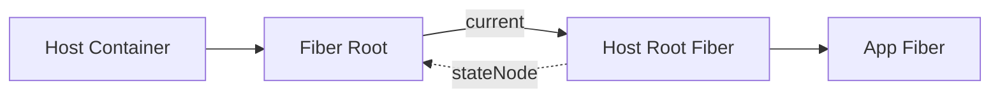
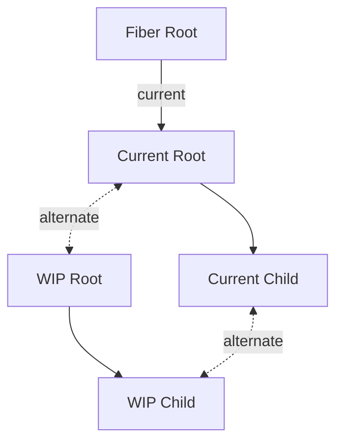
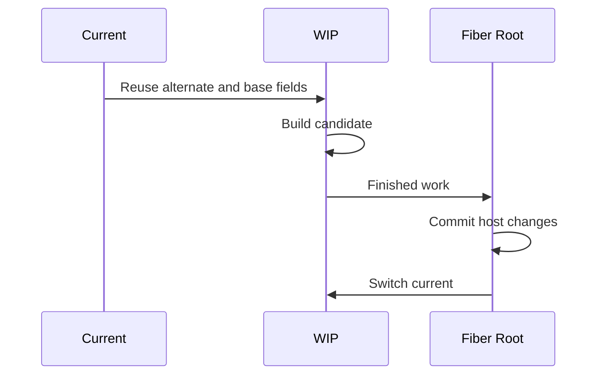
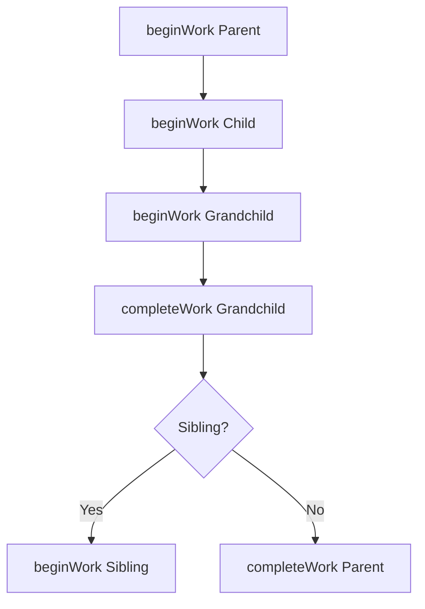
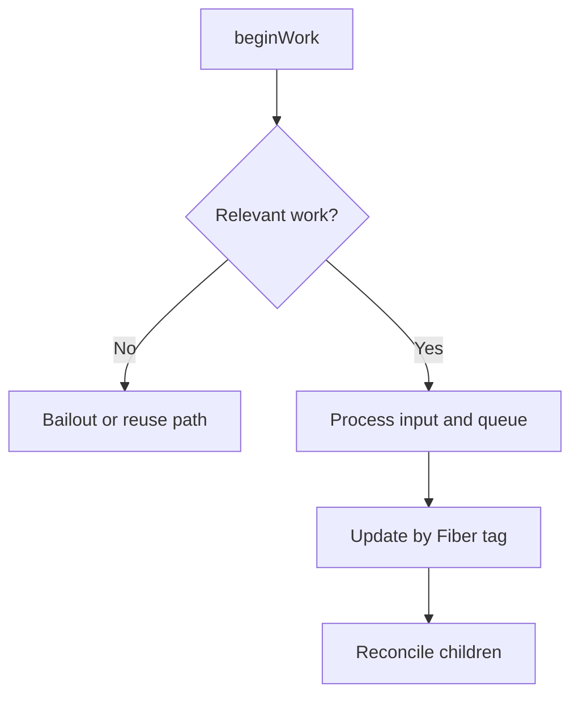
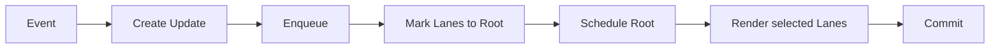
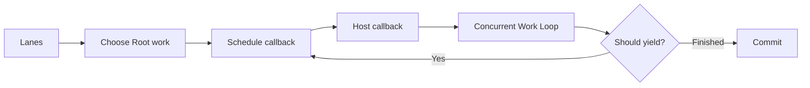
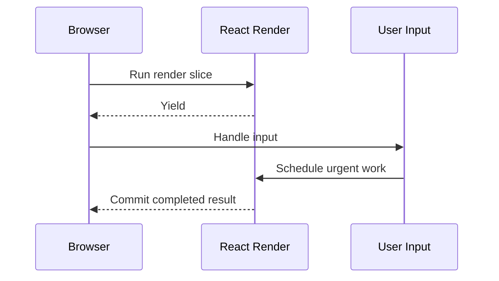
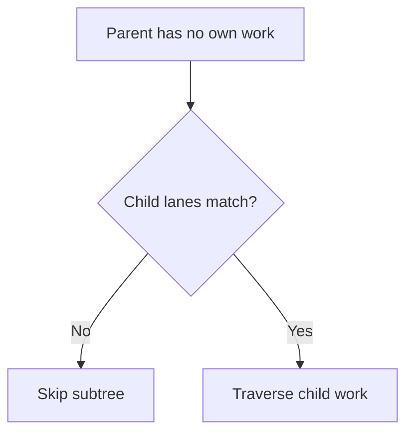
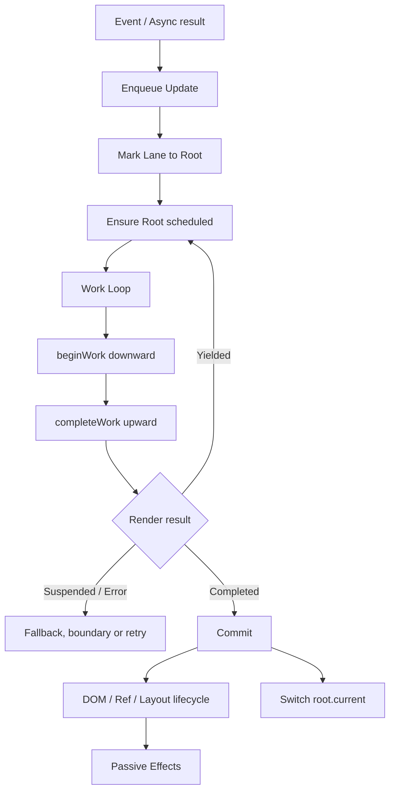

# React Fiber：从双缓冲树、工作循环到 Lanes 与 Bailout

> Fiber 不是“更快的 Virtual DOM”，而是把不可保存的递归渲染改造成可恢复、可按优先级选择的节点工作。React 在 Render 中构建候选树，完成后再 Commit，从而兼顾响应性与 UI 一致性。

---

## 一、本文解决什么问题

- Fiber Node 如何记录组件、State、子树与待处理工作；
- Fiber Root 与 Host Root Fiber 是否是同一对象；
- Current Tree 与 Work-in-progress Tree 如何协作；
- `beginWork` 与 `completeWork` 分别做什么；
- Double Buffering 为什么支持暂停、失败与重启；
- Update 如何进入 Queue 并按优先级参与 Render；
- Lane 与 Scheduler Priority、线程有何区别；
- Time Slicing 为什么不能打断任意长函数；
- Bailout 是否必然跳过整棵子树；
- 哪些结论是公开契约，哪些只是版本实现。

本文讨论 React 18/19 开源实现中长期稳定的架构概念。Fiber 字段、Flag、Lane 分组、Scheduler 宿主机制和函数调用链不是公共 API，可能随版本、Feature Flag 与 Renderer 改变。源码分析必须记录 React Tag 或 Commit SHA，业务代码只能依赖公开 API。

### 核心结论

1. Fiber Node 是组件实例的内部记录，也是可调度工作单元。
2. Fiber Tree 保存 State、Update、依赖、优先级与副作用标记，不只是 UI 结构。
3. Fiber Root 管理 Root；Host Root Fiber 是工作树根节点，两者不是同一对象。
4. Current 指向最近提交的树，Work-in-progress（WIP）是本轮候选树。
5. `alternate` 连接同一逻辑位置的两个 Fiber 版本，形成 Double Buffering。
6. `beginWork` 处理输入并协调子节点，`completeWork` 完成宿主工作并向上汇总。
7. 不同 Fiber 与 Hook 使用的 Update Queue 结构不同。
8. Lanes 是更新集合与优先级的位模型，不是线程，也不与 Scheduler Priority 一一等同。
9. Time Slicing 主要切分 Concurrent Render，不能切分组件内长函数和大型 Commit。
10. Bailout 跳过可证明无用的工作，但 Child Lanes、Context 等仍可能要求进入子树。

---

## 二、为什么需要 Fiber

普通递归会持续到整棵树处理完成：

```typescript
function walk(node: TreeNode): void {
  process(node);
  for (const child of node.children) walk(child);
}
```

返回关系隐藏在 JavaScript 调用栈中，无法自然保存进度。Fiber 把关系显式放入节点：

```text
FiberNode {
  return   -> parent
  child    -> first child
  sibling  -> next sibling
}
```

React 因而能记住下一个工作单元，在合适边界让出主线程，之后继续或重启。

### 2.1 Fiber 不是线程

Fiber 不是操作系统线程、Worker 或 Isolate。组件 Render 默认仍在主线程执行，组件内部 CPU 长任务仍会阻塞当前时间片。

### 2.2 Element、Fiber 与 DOM

| 对象 | 主要职责 | 生命周期 |
|---|---|---|
| React Element | 描述类型、Props、Key | JSX 产生的描述值 |
| Fiber Node | 保存组件状态与工作 | 跨 Render 复用 |
| DOM Node | 浏览器宿主实例 | Commit 后由宿主管理 |

Element 表达“想要什么”，Fiber 记录“当前位置是什么、下一步做什么”，DOM 是已提交宿主结果。

---

## 三、Fiber Node 的职责

以下为教学分类，并非真实可导入类型：

```typescript
type FiberConcept = {
  tag: unknown;
  key: string | null;
  elementType: unknown;
  type: unknown;
  stateNode: unknown;
  return: FiberConcept | null;
  child: FiberConcept | null;
  sibling: FiberConcept | null;
  pendingProps: unknown;
  memoizedProps: unknown;
  memoizedState: unknown;
  updateQueue: unknown;
  flags: unknown;
  subtreeFlags: unknown;
  lanes: unknown;
  childLanes: unknown;
  alternate: FiberConcept | null;
};
```

`tag` 区分 Function、Host、Fragment、Suspense 等内部类别；`key` 参与身份匹配。`stateNode` 的含义取决于 Tag，不“永远是 DOM”。

`pendingProps` 是本轮输入，`memoizedProps`/`memoizedState` 是最近完成结果，`updateQueue` 保存与节点类型相关的 Update 或 Effect 信息。这里的 `memoized` 不表示使用了 `useMemo`。

Flags 描述 Commit 工作，`subtreeFlags` 汇总后代工作；`lanes` 与 `childLanes` 记录节点和子树的优先级工作。具体 Bit 位属于版本实现。

---

## 四、Fiber Root 与 Host Root Fiber



Fiber Root 管理宿主容器、当前树、Pending Lanes、完成工作、调度、错误与 Hydration 状态。Host Root Fiber 是 Fiber Tree 顶端工作节点，`App` 是其后代。

多个 Root 有各自的调度与 Commit 边界，React 不承诺跨 Root 原子提交。

---

## 五、Current 与 Work-in-progress Tree



Current 是最近成功 Commit 的 React 视图。WIP 是候选结果，可能完成、暂停、重启、因 Error/Suspense 改道或被废弃。因此 WIP 计算不能产生不可撤销副作用。

候选树 Commit 后，`root.current` 指向完成树；旧 Current 可在下一轮作为 `alternate` 复用。这是内部模型，不是业务事件。

---

## 六、Double Buffering



双缓冲让 Current 在 Render 中稳定，候选结果可安全放弃，并通过 `alternate` 减少重复创建节点。

它不表示始终存在两棵等大完整树：首次挂载、新增节点可能没有 `alternate`；也不表示保存两份 DOM 或业务 State。实际内存必须用 Heap Snapshot 测量。

---

## 七、工作循环

```typescript
let nextUnitOfWork: Fiber | null = rootWorkInProgress;

while (nextUnitOfWork !== null && !shouldYield()) {
  nextUnitOfWork = performUnitOfWork(nextUnitOfWork);
}
```

这是概念代码，真实实现还区分同步/并发循环、Suspense 和错误路径。



Fiber 将“返回到哪里”保存在节点链接中，React 可在 Unit 边界保存下一节点。Time Slicing 切分 Render，不代表 Commit 可以暴露中间 DOM。

---

## 八、`beginWork`

概念职责：

1. 判断是否 Bailout；
2. 处理 Props、State、Context 与 Update Queue；
3. 按 Fiber Tag 执行更新逻辑；
4. 得到下一层 Children；
5. 协调 Current Children 与 Next Children；
6. 返回待处理 Child 或 `null`。



Function Component 会运行函数与 Hooks；Host Component 主要协调 `children`；Fragment、Suspense、Offscreen 与 Class Component 有各自路径。因此 `beginWork` 不等于“执行函数组件”。

---

## 九、`completeWork`

子树没有未处理 Child 时进入完成路径。`completeWork` 概念上会：

- 对 Host Fiber 创建宿主实例或准备属性更新；
- 处理文本、Ref 等 Renderer 工作；
- 汇总 `subtreeFlags` 与 Child Lanes；
- 完成当前节点，再访问 Sibling 或 Parent。

```text
beginWork:    Parent -> Child -> Grandchild
completeWork: Grandchild -> Child -> Parent
```

Render 中准备宿主结果不表示用户已看到它，可观察 DOM 切换属于 Commit。旧资料常说线性 Effect List，现代实现大量使用 `flags` 与 `subtreeFlags`，必须核对版本。

---

## 十、Update Queue



Host Root/Class Queue、`useState`/`useReducer` Hook Queue 与 Effect 信息有不同结构和语义，不能混成一个公开链表模型。

```tsx
setCount((count) => count + 1);
setCount((count) => count + 1);
setCount((count) => count + 1);
```

函数式 Updater 基于队列前一个结果转换，可按顺序重放；直接读取 `count + 1` 固定在某次 Render Snapshot。

本轮只处理所选 Lanes，低优先级 Update 可保留在 Base Queue 以后重放。具体克隆算法会变化，稳定要求是 Updater 与 Reducer 必须纯净。

---

## 十一、Lanes

Lane 通常以 Bitmask 表达更新集合：

```text
pendingLanes = 0010 | 1000 = 1010
renderLanes  = 0010
remaining    = 1000
```

位值仅作示意。Lanes 用于标记 Update、汇总 Root Pending Work、选择本轮 Render、判断子树工作，并表达 Suspension、Ping、Entanglement 等内部关系。

Lane 不是线程，也不是业务优先级。开发者通过事件、Transition 等公开 API 表达意图，由 React 选择内部 Lane。Lane 分组和过期策略随版本变化，不应写死数字或毫秒值。

---

## 十二、Scheduler



Lanes 属于 Reconciler，描述待处理更新；Scheduler 安排 JavaScript Callback 何时执行、何时让步。二者会映射协作，却不是公开的一对一枚举。

Scheduler 建立在 Event Loop 上，不能抢占任意正在执行的 JavaScript。只有 React 到达检查点并归还控制权，宿主才能处理其他任务。具体宿主原语也不是业务契约。

---

## 十三、Time Slicing



Time Slicing 能切分 React 控制的 Concurrent Render Unit，不能切分组件内部长函数、单次大型数组转换、Commit、Layout Effect、浏览器 Layout/Paint 或第三方长任务。

```tsx
function Report({ rows }: { rows: readonly Row[] }) {
  const result = expensiveTransform(rows);
  return <ReportView result={result} />;
}
```

React 不能从 `expensiveTransform` 中间抢占。应优化算法，再考虑缓存、分块、虚拟化或 Worker。时间片也不是固定帧预算，不能声称所有版本每 N ms 必定让步。

---

## 十四、Bailout

Bailout 在确认输入与相关 Lanes 无变化时复用结果。判断可能涉及 Props、State、Context、Lanes、`childLanes` 与 `memo`，不是一个统一条件。



父 Fiber Bailout 不代表整棵子树必然跳过。`memo` 也只是增加 Props 比较机会；Context 与自身 State 仍可触发工作。

不可变更新让引用比较更可信。原地修改可能导致错误跳过，无意义创建新对象又会破坏比较机会。是否 Memoize 应以 Profiler 为依据。

---

## 十五、完整调用链



更高优先级 Update 可令当前 Render 暂停或重启；Suspense 与 Error Boundary 会改变路径。业务不能根据内部 Render 或重试次数计费、发消息或记录唯一曝光。

---

## 十六、常见误区与错误案例

### 16.1 Fiber 是 Virtual DOM 的新名字

不准确。Element 常被称为 Virtual DOM 描述；Fiber 还保存 State、Queue、Lane、树链接与副作用标记。

### 16.2 始终有两棵完整 Fiber Tree

不准确。首次挂载和新增节点可能没有 `alternate`。

### 16.3 Lane 是线程

错误。Lane 是内部位集合，通常仍在主线程执行。

### 16.4 Time Slicing 能打断任意长函数

错误。它是协作式让步，只发生在 React 控制的边界。

### 16.5 Bailout 一定跳过所有后代

错误。`childLanes` 或 Context 可能要求继续进入子树。

### 16.6 读取 Fiber 私有字段

```typescript
// 错误：字段名、结构与存在性均非公共契约。
const key = Object.keys(node).find((name) => name.startsWith('__reactFiber$'));
```

应使用 Props、State、Ref、Profiler 和官方 DevTools，不能将内部字段嵌入生产逻辑。

### 16.7 用 Render 次数上报业务事件

Concurrent Render、Strict Mode 与 Bailout 会让调用次数和用户可见结果脱钩。业务事件应绑定明确用户操作或可观察提交语义，并去重。

---

## 十七、源码阅读与版本边界

```bash
git clone https://github.com/facebook/react.git
cd react
git checkout <project-react-tag-or-commit>
```

记录 React/`react-dom` 版本、Commit SHA、Renderer 与 Feature Flag。按 Root 创建 → Dispatch Update → 标记 Root → 安排工作 → Work Loop → `beginWork` → `completeWork` → Commit → Passive Effect 追踪。

| 层次 | 示例 | 业务可否依赖 |
|---|---|---|
| 公开契约 | Render 纯净、Key 表达身份 | 可以 |
| 架构模型 | Current/WIP、Begin/Complete | 仅用于理解 |
| 版本实现 | Flag 位、Lane 常量、字段名 | 不可以 |

文件和函数签名会变化，应在固定 Tag 中用 `rg` 搜索，不依赖博客行号。DevTools 协议也不是业务 API。

---

## 十八、性能、测试与验证

观察 React Profiler 的 Render/Commit Duration、参与组件、Long Task、INP、Layout/Paint，以及 Heap 中 Fiber、Element、Closure 与缓存。Fiber 数量不能单独代表性能。

验证 Bailout 时，在相同生产构建和交互下比较参与组件、Render Duration、Props 比较成本与行为正确性，不用 `console.log` 次数替代 Profile。

验证 Time Slicing 时，在目标设备录制 Performance Trace，检查是否存在单组件长计算和大型同步 Commit。Transition 可能改善响应优先级，但不会降低计算总量。

测试最终 UI、Key 对 State 保留的影响与 Effect 释放，不断言 Fiber 字段、Lane 数值、`beginWork` 次数或 Scheduler 宿主 API。

---

## 十九、工程检查清单

- Render、Updater 与 Reducer 是否纯净；
- 长计算是否被误认为能被 Time Slicing 自动切分；
- State 是否不可变更新；
- Key 是否稳定表达业务身份；
- `memo` 是否有 Profiler 证据；
- Transition 是否只标记非紧急更新；
- 大型 Commit 与 Layout Effect 是否测量；
- 业务是否读取 Fiber、Lane 或 DevTools 私有字段；
- 源码结论是否标注 Tag/Commit 与 Renderer；
- 测试是否围绕公开行为。

---

## 二十、总结

1. Fiber Node 表达组件实例、树链接、State、Update 与待提交工作。
2. Fiber Root 管理 Root，Host Root Fiber 是工作树根节点。
3. Current 保存已提交结果，WIP 构建候选结果，二者用 `alternate` 复用。
4. Double Buffering 让 React 能暂停或放弃 Render，再切换完成结果。
5. `beginWork` 下行处理输入与 Children，`completeWork` 上行完成宿主工作并汇总。
6. Update Queue 支持按 Lane 跳过与重放，不同 Queue 结构并不统一。
7. Lanes 表达更新集合，Scheduler 安排执行，两者相关但不等同。
8. Time Slicing 不能抢占组件内长函数，也不能切分 Commit。
9. Bailout 跳过可证明无用的工作，但后代 Lane 仍可能要求遍历。
10. Fiber 是内部架构，源码结论必须标注版本，业务不得直接依赖。

真正的工程价值不是背字段，而是理解 Render 为什么必须纯净、更新为什么可重放、Key 与引用为何影响工作量，以及并发为什么不能代替性能测量。

---

## 问答复盘

### Q1：Fiber Node 与 React Element 有什么区别？

**答：** Element 是 JSX 产生的 UI 描述；Fiber 是跨 Render 复用的内部记录，保存 State、Queue、Lane 与树链接。

### Q2：Fiber Root 与 Host Root Fiber 是同一对象吗？

**答：** 不是。前者管理容器与 Root 调度，后者是 Fiber Tree 顶端工作节点。

### Q3：Current 与 WIP 为什么不能只保留一棵？

**答：** Current 必须稳定代表已提交 UI，WIP 可暂停、失败或废弃，分离后才不会污染当前界面。

### Q4：`beginWork` 与 `completeWork` 如何分工？

**答：** 前者处理输入、组件与子节点并向下；后者在子树完成后准备宿主结果、汇总标记并向上。

### Q5：Lane 等同于 Scheduler Priority 或线程吗？

**答：** 都不等同。Lane 是 Reconciler 的更新位集合；Scheduler 安排 Callback；Lane 不提供线程。

### Q6：Time Slicing 为什么不能解决组件内长计算？

**答：** React 只能在 Fiber Unit 之间让步，不能从普通 JavaScript 函数中间抢占。

### Q7：父组件 Bailout 后，子组件一定不 Render 吗？

**答：** 不一定。若 `childLanes` 包含本轮工作，React 仍会进入相应后代。

### Q8：函数式 Updater 为什么适合批处理？

**答：** 它基于队列前一个结果转换，可按顺序重放；直接读取 State 固定在某次 Render Snapshot。

### Q9：能通过 `__reactFiber$...` 做生产监控吗？

**答：** 不能。它是私有实现，字段名与结构可变化，应使用公开 Profiler、DevTools 与业务埋点。

---

## 延伸知识

- **Reconciliation**：Element Type、Key、列表移动与 State 保留。
- **Hooks 运行机制**：Hook 链、Dispatcher、Hook Queue 与 Effect。
- **并发 React**：Transition、Deferred Value、Suspense 与一致性。
- **Scheduler 与浏览器**：Event Loop、Task、Rendering Opportunity 与 Long Task。
- **React 性能**：Profiler、Memoization、React Compiler 与虚拟化。
- **Renderer**：Host Config、React DOM、React Native 与自定义 Renderer。
