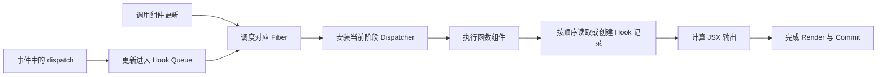
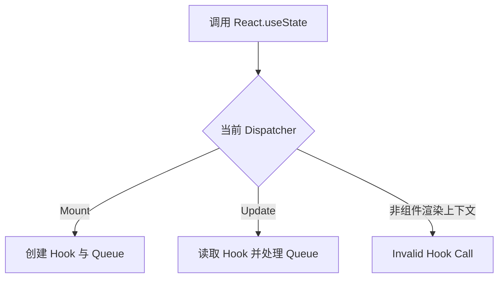

# React Hooks 运行机制：调用顺序、Hook List、Dispatcher 与闭包快照

> Hook 不是脱离组件存在的全局变量，也不是依靠函数名识别状态。React 在渲染函数组件时，以当前 Fiber 为作用域，按照稳定的调用顺序访问一组 Hook 记录；每次渲染得到自己的 Props、State 和闭包快照。

---

## 一、本文解决什么问题

函数组件每次渲染都会重新执行，局部变量也会重新创建，但 `useState` 为什么能记住上一次的状态？React 又如何知道某次 `useState` 对应哪一份数据？

本文回答以下问题：

- Hook 状态保存在哪里；
- React 为什么要求 Hook 调用顺序稳定；
- Mount 与 Update 阶段为什么会使用不同 Dispatcher；
- 一次状态更新如何进入 Update Queue 并触发重新渲染；
- 为什么事件处理函数和异步回调会读到旧 State；
- Rules of Hooks 解决的底层问题是什么；
- Strict Mode 为什么可能额外调用组件、Initializer 与 Effect；
- Custom Hook 复用的究竟是状态还是状态逻辑。

本文以现代 React 函数组件为背景。Hook 的公开规则属于稳定契约；`memoizedState`、Dispatcher 函数、链表字段和队列结构属于 React 客户端渲染器的内部实现，可能随版本变化。理解原理时可以借助这些结构，但业务代码不能直接依赖它们。涉及精确源码时，应以项目锁定的 React 版本和对应源码为准。

### 核心结论

1. Hook 状态与组件实例对应的 Fiber 关联，不保存在函数局部变量中。
2. React 主要依靠 Hook 的调用位置匹配前后两次渲染，因此调用数量和顺序必须稳定。
3. Dispatcher 根据当前阶段把同一个 `useState` 调用路由到 Mount、Update 或非法调用处理逻辑。
4. 状态更新先进入对应 Hook 的 Update Queue，再调度 Fiber；更新通常不会同步改写当前渲染的变量。
5. 每次渲染都会创建新的闭包快照，旧回调看到旧 State 是 JavaScript 闭包语义，不是 React 随机缓存。
6. Rules of Hooks 是状态槽位正确性的约束，而不只是代码风格。
7. Strict Mode 的开发期额外调用用于暴露不纯渲染和缺失清理；生产环境不能假设存在这些调用。
8. Custom Hook 复用有状态逻辑，每次调用仍拥有独立的 Hook 记录和生命周期。

---

## 二、先建立整体模型



关键路径分为两类：

- **Render 路径**：React 设置当前 Fiber 和 Dispatcher，执行组件，并按顺序遍历 Hook 记录；
- **Update 路径**：事件或异步回调调用 Dispatch，更新进入队列，React 调度对应 Fiber，再在后续 Render 中计算新状态。

Render 可能被中断、重试或放弃，只有 Commit 才把完成的结果提交到宿主环境。因此组件函数和状态计算必须保持纯净，不能把“执行过 Render”误当成“界面已提交”。

---

## 三、Hook 状态保存在哪里

概念上，每个函数组件 Fiber 关联一条按调用顺序组织的 Hook 记录链：

```text
FunctionComponent Fiber
  memoizedState
       |
       v
  Hook #1 -> Hook #2 -> Hook #3 -> null
  useState   useRef     useEffect
```

在常见 React 源码版本中，Fiber 的 `memoizedState` 指向第一个 Hook，Hook 记录再通过类似 `next` 的字段串联。不同 Hook 会使用记录中的不同字段，例如当前状态、待处理更新、依赖或 Effect 信息。

可以用一个简化模型理解，但不要把它当成公共类型：

```typescript
type InternalHook = {
  memoizedState: unknown;
  baseState: unknown;
  queue: unknown;
  next: InternalHook | null;
};
```

两个概念需要分清：

- Fiber Hook List 描述“这个组件按顺序调用了哪些 Hook”；
- 某个状态 Hook 的 Update Queue 描述“这一个 Hook 收到了哪些更新”。

它们不是同一条链，也不解决同一个问题。

### 3.1 Mount：创建 Hook 记录

首次渲染时，每调用一次 Hook，React 就创建一条对应记录，并把它追加到当前 Fiber 的 Hook List。Initializer 在这个阶段用于产生初始值。

```tsx
function SearchPanel() {
  const [query, setQuery] = useState('');       // Hook #1
  const inputRef = useRef<HTMLInputElement>(null); // Hook #2
  useEffect(() => inputRef.current?.focus(), []);  // Hook #3

  return <input ref={inputRef} value={query} onChange={e => setQuery(e.target.value)} />;
}
```

### 3.2 Update：复用并推进 Hook 记录

后续渲染时，React 不会根据变量名 `query` 或 Setter 名称查找状态，而是让“当前 Hook 指针”依次前进：第一次 Hook 调用匹配第一条记录，第二次匹配第二条记录，以此类推。

这正是条件调用会破坏状态对应关系的原因。

---

## 四、调用顺序为什么必须稳定

下面的代码在 `enabled` 改变时会改变 Hook 数量：

```tsx
function Profile({ enabled }: { enabled: boolean }) {
  if (enabled) {
    const [name, setName] = useState(''); // 错误：条件调用 Hook
  }

  const [age, setAge] = useState(0);
  return <div>{age}</div>;
}
```

假设首次渲染 `enabled=true`：

```text
位置 1 -> name
位置 2 -> age
```

下一次渲染 `enabled=false`：

```text
位置 1 -> age  // React 原本在此位置保存的是 name
```

React 开发构建通常会检测并报告 Hook 数量或顺序变化，但不能依赖报错来保证正确性。修复方式是让 Hook 始终被调用，把条件放进 Hook 的回调或结果使用处：

```tsx
function Profile({ enabled }: { enabled: boolean }) {
  const [name, setName] = useState('');
  const [age, setAge] = useState(0);

  return enabled ? (
    <input value={name} onChange={event => setName(event.target.value)} />
  ) : (
    <div>{age}</div>
  );
}
```

> “顶层调用”不是要求 Hook 必须写在文件最外层，而是要求它位于函数组件或 Custom Hook 的顶层控制流中，使每次渲染的调用顺序一致。

---

## 五、Dispatcher：同一个 API 的阶段路由

业务代码从 `react` 导入 `useState`，但它在不同上下文需要不同处理：

- 首次渲染要创建 Hook 并初始化状态；
- 更新渲染要读取既有 Hook 并处理队列；
- 非渲染阶段调用要报告 Invalid Hook Call；
- 开发构建还需要检查 Hook 顺序和依赖等问题。

React 通过当前 Dispatcher 把公开 API 路由到与当前阶段匹配的内部实现。概念上可理解为：

```typescript
type Dispatcher = {
  useState: typeof useState;
  useEffect: typeof useEffect;
  useRef: typeof useRef;
  // 其他 Hook
};
```



Dispatcher 解释了两个现象：

1. Hook 能感知自己正处于 Mount 还是 Update，而调用方使用相同 API；
2. 普通函数随意调用 Hook 会失败，因为它没有由 React 建立合法渲染上下文。

不要在应用中读取 React 私有 Internals 或替换 Dispatcher。其字段名称和边界不属于兼容性承诺。

---

## 六、Update Queue：更新如何回到对应组件

首次创建状态 Hook 时，React 会创建一个与该 Hook/Fiber 关联的 Dispatch 函数。事件处理函数保存的 `setCount` 因而能够把更新送回正确队列。

```tsx
function Counter() {
  const [count, setCount] = useState(0);

  function incrementTwice() {
    setCount(current => current + 1);
    setCount(current => current + 1);
  }

  return <button onClick={incrementTwice}>{count}</button>;
}
```

简化流程如下：

1. `setCount` 创建一条 Update；
2. Update 被加入该状态 Hook 的 Queue；
3. React 为对应 Fiber 标记待处理工作并参与调度；
4. 后续 Render 按优先级处理适用的更新；
5. 两个函数式更新依次以队列中的前一个结果为输入；
6. 完成的树进入 Commit 后，用户才看到新结果。

React 的内部队列还要支持优先级、跳过与重放更新，以维持并发渲染下的状态一致性。具体 Lane、Base Queue 和 Eager State 字段属于版本相关实现；稳定结论是：Setter 提交的是更新请求，React 决定何时渲染和提交。

### 6.1 为什么直接写两次 `count + 1` 可能只增加一次

```tsx
function incrementTwice() {
  setCount(count + 1);
  setCount(count + 1);
}
```

两次表达式读取的是同一次渲染快照中的同一个 `count`。若 `count` 为 `0`，它们都请求把状态设为 `1`。当下一个值依赖前一个排队结果时，应使用函数式更新。

批处理的具体边界会受 React 版本、Root 类型和同步逃生 API 影响，不应把“Setter 后立即读取变量”当作验证更新完成的方式。

---

## 七、闭包快照：为什么回调会看到旧状态

每次执行函数组件都会创建一组新的局部变量和函数。一次渲染创建的事件处理函数会闭包捕获该次渲染中的 Props 与 State：

```tsx
function DelayedAlert() {
  const [count, setCount] = useState(0);

  function showLater() {
    window.setTimeout(() => {
      window.alert(`提交时的计数：${count}`);
    }, 1000);
  }

  return (
    <>
      <button onClick={() => setCount(value => value + 1)}>增加</button>
      <button onClick={showLater}>稍后显示</button>
    </>
  );
}
```

点击“稍后显示”后再增加计数，定时器仍读取创建 `showLater` 那次渲染的 `count`。这是 JavaScript 闭包的确定行为。

不同需求对应不同方案：

- 需要“发起操作时的值”：保留闭包快照，这是正确语义；
- 需要基于最新状态更新：使用函数式更新；
- 需要异步回调读取最新值但不触发渲染：谨慎用 Ref，并显式同步；
- 需要与外部系统同步：使用 Effect，声明依赖并实现 Cleanup。

```tsx
function useLatest<T>(value: T) {
  const ref = useRef(value);

  useEffect(() => {
    ref.current = value;
  }, [value]);

  return ref;
}
```

`useLatest` 不是消除所有依赖的捷径。它改变了语义：回调不再观察创建时的快照，而是读取最近一次已同步的值。业务必须先决定需要哪一种时间语义。

---

## 八、Rules of Hooks 的工程含义

React 的公开规则可归纳为两点：

1. 只在顶层调用 Hook；
2. 只在 React 函数组件或 Custom Hook 中调用 Hook。

以下位置都不应调用 Hook：

- `if`、`switch` 或条件表达式内部；
- 循环内部；
- 可能提前返回之后；
- 事件处理函数、普通工具函数和类方法；
- `useMemo`、`useEffect` 等 Hook 的回调内部；
- `try/catch/finally` 等会改变控制路径的位置。

```tsx
// 错误：items 数量变化会改变 Hook 数量
const rows = items.map(item => {
  const [selected, setSelected] = useState(false);
  return { item, selected, setSelected };
});
```

应把每个可变实例拆成有独立 Fiber 的组件：

```tsx
function Row({ item }: { item: Item }) {
  const [selected, setSelected] = useState(false);
  return (
    <button onClick={() => setSelected(value => !value)}>
      {selected ? '已选择' : '未选择'}：{item.name}
    </button>
  );
}

function List({ items }: { items: Item[] }) {
  return items.map(item => <Row key={item.id} item={item} />);
}
```

Lint 规则应进入 CI。静态检查不仅减少运行时报错，也能检查依赖遗漏等闭包问题；但规则版本应与项目 React 能力匹配，不能用关闭规则代替澄清数据流。

---

## 九、Strict Mode 双重调用到底是什么

Strict Mode 在开发环境中会启用额外检查。现代 React 中，某些纯函数相关逻辑可能被额外调用，Effect 也可能经历额外的 Setup/Cleanup 周期，以暴露：

- Render 阶段修改外部数据；
- Lazy Initializer 或 Updater 不纯；
- Effect 没有对称 Cleanup；
- 代码错误依赖“只执行一次”。

具体检查行为受 React 版本、开发构建以及 Strict Mode 在树中的位置影响。不能把它简化成“所有代码永远执行两次”，也不能把开发环境观察到的精确次数当成公共 API。

### 9.1 错误：在 Render 中产生副作用

```tsx
function ProductList({ products }: { products: Product[] }) {
  analytics.track('product_list_rendered'); // 错误：Render 可能重试或放弃
  return products.map(product => <div key={product.id}>{product.name}</div>);
}
```

分析事件应由明确用户行为触发，或在确实需要与外部系统同步时由 Effect 管理，并保证语义能够承受重新同步。

### 9.2 正确：订阅与清理对称

```tsx
function OnlineIndicator() {
  const [online, setOnline] = useState(navigator.onLine);

  useEffect(() => {
    const handleOnline = () => setOnline(true);
    const handleOffline = () => setOnline(false);

    window.addEventListener('online', handleOnline);
    window.addEventListener('offline', handleOffline);

    return () => {
      window.removeEventListener('online', handleOnline);
      window.removeEventListener('offline', handleOffline);
    };
  }, []);

  return <span>{online ? '在线' : '离线'}</span>;
}
```

不要通过移除 `<StrictMode>`、模块级 Boolean 或“只运行一次”的 Ref 掩盖资源泄漏。先让 Setup 与 Cleanup 可重复、对称；只有外部协议确实不支持重复连接时，才在资源管理层设计共享、引用计数或幂等机制。

---

## 十、自定义 Hook 复用什么

Custom Hook 是调用其他 Hook 的普通函数，名称以 `use` 开头，使 React 工具和 Lint 能识别其 Hook 语义。

它复用的是：

- 状态与派生逻辑；
- Effect、订阅和 Cleanup 协议；
- 异步竞态与取消策略；
- 对调用方公开的状态、命令和错误模型。

它不自动共享 State。两个组件分别调用同一个 Custom Hook，会在各自 Fiber 上创建独立 Hook 记录。

### 10.1 一个包含取消和竞态处理的查询 Hook

```tsx
type LoadState<T> =
  | { status: 'idle' }
  | { status: 'loading' }
  | { status: 'success'; data: T }
  | { status: 'error'; error: Error };

function useUser(userId: string | null) {
  const [state, setState] = useState<LoadState<User>>({ status: 'idle' });

  useEffect(() => {
    if (!userId) {
      setState({ status: 'idle' });
      return;
    }

    const controller = new AbortController();
    setState({ status: 'loading' });

    void fetch(`/api/users/${encodeURIComponent(userId)}`, {
      signal: controller.signal,
    })
      .then(response => {
        if (!response.ok) {
          throw new Error(`Request failed: ${response.status}`);
        }
        return response.json() as Promise<User>;
      })
      .then(data => setState({ status: 'success', data }))
      .catch(error => {
        if (error instanceof DOMException && error.name === 'AbortError') return;
        setState({
          status: 'error',
          error: error instanceof Error ? error : new Error('Unknown error'),
        });
      });

    return () => controller.abort();
  }, [userId]);

  return state;
}
```

当 `userId` 变化或组件卸载时，Cleanup 取消旧请求，避免旧响应覆盖新查询。真实项目还要根据业务补充缓存、去重、重试、鉴权失效和服务端渲染策略；复杂服务端状态通常更适合使用成熟的数据获取层。

### 10.2 Custom Hook 的 API 边界

好的 Hook 应：

- 用参数显式表达依赖，不读取隐蔽全局变量；
- 返回稳定、最小且能表达状态机的接口；
- 把资源 Cleanup 和竞态处理封装在内部；
- 不把内部 Setter 全量暴露给调用方破坏不变量；
- 仅在确有语义时稳定函数或对象引用，而不是默认堆叠 `useMemo`。

当多个调用方必须共享同一事实源时，应把状态提升到共同所有者、Context 或外部 Store，而不是期待调用同一个 Custom Hook 自动共享状态。

---

## 十一、组件身份、Key 与 Hook 状态重置

Hook 状态依附于 React 树中组件的位置和身份，而不是组件函数的某次调用。相同类型在相同位置通常复用 Fiber 与 Hook State；类型或 `key` 改变时，React 会把它视为不同身份，旧状态随卸载被丢弃。

```tsx
function Editor({ documentId }: { documentId: string }) {
  return <DocumentForm key={documentId} documentId={documentId} />;
}
```

这里的 `key` 明确要求切换文档时创建新的 `DocumentForm` 身份，因此其 Hook 状态重置。它适合“整个表单属于另一实体”的语义，但代价是：

- 所有局部状态丢失；
- Effect Cleanup 后重新 Setup；
- DOM、焦点和未提交输入可能重建。

不要用随机 Key 修复状态问题。先确认状态应保留、提升、派生还是重置。

---

## 十二、常见误区

### 12.1 “React 根据 Hook 名称保存状态”

错误。变量名会被编译、压缩和重命名。状态匹配依靠组件身份与稳定调用顺序。

### 12.2 “Setter 会立即修改当前变量”

错误。当前事件处理函数读取的是本次渲染快照；Setter 排队更新并请求后续渲染。

### 12.3 “闭包旧值说明 React 没更新”

错误。旧回调读取旧快照可能正是所需语义。应先判断需要快照、最新值还是函数式更新。

### 12.4 “Custom Hook 调用一次就能在全局共享状态”

错误。每个调用点会在自己的 Fiber/Hook List 中创建独立状态。

### 12.5 “Strict Mode 导致线上请求必然发两次”

不准确。额外检查主要是开发期行为，精确表现取决于版本和树位置；但它暴露出的缺少清理、非幂等副作用和竞态是真实缺陷。

### 12.6 “使用 Ref 就能解决所有 Stale Closure”

错误。Ref 绕开渲染快照，也不会触发渲染。滥用会隐藏依赖、产生撕裂式读取，并使数据流难以推理。

### 12.7 “只要 Hook 顺序不变，普通函数里也能调用”

错误。Hook 还要求合法的 React 渲染上下文；普通函数只有作为 Custom Hook 被组件渲染路径调用时才成立。

---

## 十三、测试与验证

### 13.1 行为测试优先于内部结构测试

不要断言 Fiber 私有字段或 Hook 链表形状。测试公开行为：

- 用户操作后界面状态是否正确；
- 连续函数式更新是否按顺序计算；
- Props 变化后订阅是否切换；
- 卸载后 Listener、Timer、Observer 和请求是否清理；
- 旧请求是否会覆盖新结果；
- 错误、空态、加载态与重试是否可达。

测试工具中的状态更新应放入其推荐的 `act` 流程，通过用户可观察结果等待异步完成，不要用任意延时掩盖调度问题。

### 13.2 在 Strict Mode 下测试资源生命周期

测试环境可包裹 Strict Mode，记录 Setup 与 Cleanup 的资源计数。目标不是断言一个固定调用次数，而是验证任意时刻没有重复订阅，最终卸载后资源归零。

### 13.3 性能必须测量

Hook 本身不是主要性能结论。性能问题通常来自昂贵 Render、过宽 Context 更新、频繁外部订阅或 Effect 循环。验证时应：

1. 使用生产构建；
2. 在目标浏览器和目标设备复现场景；
3. 用 React Profiler 观察 Commit、组件渲染原因和耗时；
4. 用浏览器 Performance 面板确认脚本、布局、绘制和网络代价；
5. 优化后用同一输入重新测量。

开发 Strict Mode 的额外调用会影响日志和耗时观察，不能直接代表生产性能。

---

## 十四、工程检查清单

- Hook 是否始终位于组件或 Custom Hook 的顶层控制流；
- 提前返回是否出现在所有 Hook 调用之后；
- 下一状态依赖旧状态时是否使用函数式更新；
- 回调需要的是创建时快照还是最新值；
- Effect 依赖是否完整，Setup/Cleanup 是否对称；
- Timer、Listener、Observer、连接和请求是否释放或取消；
- Custom Hook 是否封装竞态、错误和生命周期；
- 共享状态是否放在真正的共同所有者中；
- `key` 重置是否符合业务身份语义；
- 是否用 Lint、Strict Mode 和行为测试验证，而非依赖私有实现；
- 性能判断是否来自生产构建和目标设备测量。

---

## 十五、总结

1. React 以 Fiber 表示组件工作单元，并在其上关联按顺序组织的 Hook 状态。
2. Dispatcher 为公开 Hook API 选择 Mount、Update 或错误处理路径。
3. Hook List 负责调用位置匹配，Update Queue 负责保存某个状态 Hook 的待处理更新。
4. Rules of Hooks 保证前后渲染能够稳定匹配状态槽位。
5. Setter 提交更新请求，不会改写当前渲染中的 State 变量。
6. 闭包属于某次渲染快照；函数式更新、Ref 和 Effect 分别解决不同时间语义。
7. Strict Mode 用开发期额外检查暴露不纯逻辑与缺失清理，代码不能依赖精确调用次数。
8. Custom Hook 复用状态逻辑与生命周期协议，不自动共享状态。
9. 组件身份和 `key` 决定 Hook 状态保留或重置。
10. 工程验证应面向可观察行为、资源生命周期和真实生产性能。

真正理解 Hooks，不是记住一组 `useXxx` API，而是能解释一次调用如何匹配状态、一次更新如何进入队列，以及一个闭包为何只属于创建它的那次渲染。

---

## 问答复盘

### Q1：函数组件重新执行后，`useState` 的状态为什么不会成为初始值？

**答：** 状态与当前组件 Fiber 上的 Hook 记录关联；更新渲染按调用顺序读取既有记录，而不是重新把函数局部变量当作状态存储。

### Q2：Fiber Hook List 与 Update Queue 有什么区别？

**答：** Hook List 组织一个组件的多个 Hook；Update Queue 保存某个状态 Hook 收到的更新。前者解决位置匹配，后者解决状态演进。

### Q3：为什么 Hook 不能写在 `if` 中，即使当前条件看起来永远为真？

**答：** 公开契约要求每次渲染调用顺序稳定。未来 Props、功能开关或重构都可能改变分支，使后续 Hook 错位；静态规则也无法可靠证明任意运行路径。

### Q4：连续执行两次 `setCount(count + 1)` 为什么可能只增加一次？

**答：** 两次调用捕获同一个渲染快照，都请求相同结果。需要累加队列结果时，应使用两次 `setCount(current => current + 1)`。

### Q5：闭包读到旧值时，应该总是改成 Ref 吗？

**答：** 不应该。先判断业务需要操作发起时的快照、最新值还是基于旧值更新；它们分别可能对应闭包、Ref 或函数式更新。

### Q6：Strict Mode 是否保证组件在生产环境执行两次？

**答：** 不保证。额外调用属于开发检查，具体行为受版本和树位置影响；生产逻辑不得依赖其次数。

### Q7：两个组件调用同一个 `useUser`，是否自动共享请求状态？

**答：** 不会。每个调用在自己的 Fiber 上拥有独立 Hook 状态；共享需要共同所有者、Context、外部 Store 或具备缓存去重的数据层。

### Q8：为什么请求型 Custom Hook 必须考虑 Cleanup？

**答：** 参数可能变化、组件可能卸载，旧请求若继续完成，可能浪费资源或用旧结果覆盖新状态。应取消请求或使用请求标识忽略过期结果。

### Q9：能否通过读取 Fiber 私有字段测试 Hook 顺序？

**答：** 不应。私有结构没有兼容性保证；应依靠 Hook Lint，并测试状态更新、清理、竞态和用户可观察结果。

---

## 延伸知识

- **`useState` 与 `useReducer`**：Lazy Initializer、Functional Update、Batching、Reducer Purity 与状态重置。
- **`useEffect`**：同步外部系统、依赖数组、Cleanup、竞态与 Effect Event。
- **`useRef`**：可变容器、DOM Ref、命令式 Handle 与渲染一致性边界。
- **并发渲染**：Lane、可中断 Render、更新重放与 Transition。
- **外部 Store**：订阅一致性、Snapshot 与 `useSyncExternalStore`。
- **React Compiler**：静态分析、纯度约束与自动记忆化的版本边界。
