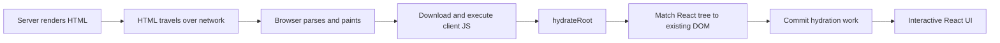
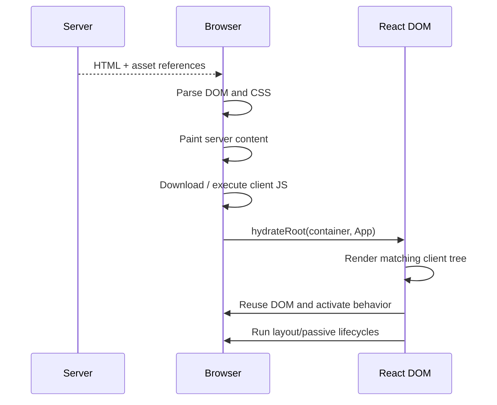
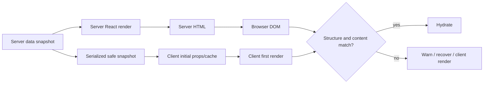
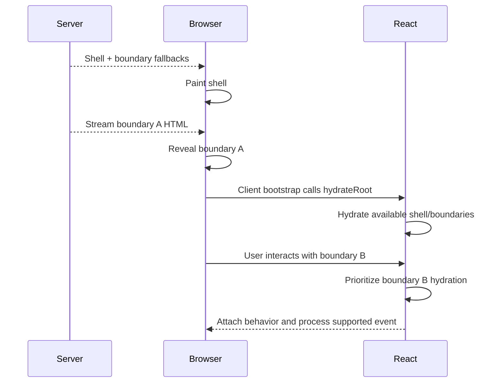
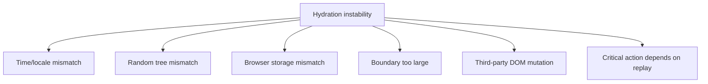

# React Hydration：从 Server HTML、Mismatch 到 Selective Hydration

> Hydration 不是把 Server HTML 再渲染一遍，也不是给现有 DOM 批量绑定几个事件。它要求客户端用同一棵 React Tree 接管服务端已生成的 DOM，在保持首屏结构一致的前提下恢复组件状态、事件系统和后续更新能力。

---

## 一、为什么“页面已经显示”仍可能点不动

服务端渲染、静态生成或 Streaming SSR 可以让浏览器较早收到有意义的 HTML。用户可能已经看到商品标题、按钮和表单，但此时浏览器仍需：

1. 下载对应 Client JavaScript；
2. Parse、Compile 并执行模块；
3. 调用 `hydrateRoot`；
4. 在客户端重新计算初始 React Tree；
5. 将 React 组件身份与现有 DOM 对齐；
6. 激活事件、Ref、Effect 和后续更新；
7. Hydrate 尚未完成的 Suspense Boundary。



这解释了一个常见现象：LCP 已经很好，用户却在首屏点击时遇到高 Input Delay。Server HTML 改善了内容可见时间，但 Hydration JavaScript 仍可能形成主线程 Long Task。

本文以 React 19.2 稳定公开 API 为基准，重点讨论 React DOM Hydration。Framework 可能在其上实现 Streaming、RSC、Route Data、Partial Prerendering 或自定义恢复协议；具体 Payload、Marker、缓存和调度细节属于版本相关实现，应以项目锁定版本文档和源码验证。

### 核心结论

1. Server HTML 是已存在的 DOM 输入，`hydrateRoot` 让客户端 React 接管它；`createRoot` 则用于没有服务端 React Markup 的容器。
2. 服务端输出与客户端第一次 Render 必须一致。Hydration Mismatch 是正确性问题，不只是开发环境的一条无害警告。
3. React 不保证修补所有不一致属性或文本；Mismatch 严重时可能放弃局部或整个 Root 的 Hydration，转为 Client Render。
4. 时间、随机数、Locale、Browser API、外部 Store、数据缓存和无效 HTML 都可能制造不确定首屏。
5. 正确做法是传输同一 Snapshot 或设计稳定的首屏 Fallback，再在 Hydration 后更新，而不是普遍使用 `suppressHydrationWarning`。
6. Selective Hydration 允许 Suspense Boundary 按代码、数据和交互优先级逐步激活，不要求整页同时完成。
7. Selective Hydration 不等于“只 Hydrate 一部分且其他部分永不 Hydrate”；后者通常需要 RSC、Islands 或 Framework 级 Client Boundary。
8. React 可以对部分 Hydration 前事件进行阻塞、优先 Hydration 或 Replay，但它不是所有事件和默认浏览器行为的可靠持久队列。
9. `hydrateRoot` 没有返回“整页 Hydration 完成”的 Promise；Shell、Boundary 和业务 Ready 必须用不同观测信号描述。
10. Hydration 优化应同时减少 Client JavaScript、保持 Snapshot 一致、合理放置 Suspense Boundary，并在生产构建和低端设备上测试首次交互。

---

## 二、Server HTML 到 Client Hydration 的执行模型

### 2.1 服务端只生成静态表示

服务端 Render 会执行组件以生成 HTML，但浏览器收到的 HTML 本身不携带 JavaScript Closure、Hook Queue 或事件处理函数：

```tsx
function AddToCartButton({ productId }: { productId: string }) {
  return (
    <button type="button" onClick={() => addToCart(productId)}>
      加入购物车
    </button>
  );
}
```

Server HTML 中会出现 `<button>` 和文本，不会把 `onClick` 函数序列化进 HTML Attribute。Client Bundle 执行后，React 才恢复这棵组件树与事件语义。

### 2.2 浏览器可能先 Paint，再 Hydrate



Hydration 仍包含 Render 与 Commit 心智模型：客户端需要执行组件来计算预期树，再将结果与现有 DOM 对应。它与普通 Mount 的差异在于，Commit 尽量复用服务端节点，而不是从空容器创建整棵 DOM。

“复用”不代表零工作。组件函数、Hook、Context、外部 Store Snapshot、事件系统和必要的 DOM 检查仍有成本。

### 2.3 Hydration 的正确性契约

React 官方要求服务端生成内容与客户端初始输出相同。这里的“相同”应理解为客户端 React 期望看到同样的元素类型、层级、顺序、文本和关键属性。

React 不会为了性能对每个 Attribute 做完整、昂贵的通用校验。开发环境会报告许多常见 Mismatch，但生产环境不能依赖 React 自动发现并修复所有差异。

---

## 三、`hydrateRoot`：入口、选项与生命周期

### 3.1 基本入口

```tsx
import { StrictMode } from 'react';
import { hydrateRoot } from 'react-dom/client';

const container = document.getElementById('root');

if (container === null) {
  throw new Error('Hydration root container not found');
}

const root = hydrateRoot(
  container,
  <StrictMode>
    <App />
  </StrictMode>,
);

window.addEventListener('app:dispose', () => {
  root.unmount();
}, { once: true });
```

服务端 React Markup 应使用 `hydrateRoot`。如果对同一容器调用 `createRoot(...).render(...)`，React 会把它当作普通 Client Mount，而不是接管 Server HTML。

`hydrateRoot` 会立即返回 Root Handle，不会返回等待 Hydration 完成的 Promise。调用方不能用 `await hydrateRoot(...)` 判断整页已经可交互。

### 3.2 生产错误观测

React 19 的 Hydration Root 支持错误回调：

```tsx
import { hydrateRoot } from 'react-dom/client';

hydrateRoot(document.getElementById('root')!, <App />, {
  onCaughtError(error, errorInfo) {
    reportClientError(error, {
      kind: 'caught',
      componentStack: errorInfo.componentStack,
    });
  },
  onUncaughtError(error, errorInfo) {
    reportClientError(error, {
      kind: 'uncaught',
      componentStack: errorInfo.componentStack,
    });
  },
  onRecoverableError(error, errorInfo) {
    reportClientError(error, {
      kind: 'recoverable',
      componentStack: errorInfo.componentStack,
    });
  },
});
```

- `onCaughtError` 观察被 Error Boundary 捕获的错误；
- `onUncaughtError` 观察逃出所有 Error Boundary 的错误；
- `onRecoverableError` 观察 React 能自动恢复的错误，其中可能包含部分 Hydration 问题。

这些回调不是 Hydration 成功通知，也不能保证每条开发警告都会成为同一种生产回调。日志需包含 App Version、Route、Release、Browser 和匿名化错误指纹，避免把 Server HTML、用户输入、Token 或个人数据直接上传。

### 3.3 不要在初始 Hydration 完成前抢先 `root.render`

`hydrateRoot` 返回后可以通过 `root.render` 更新应用，但 React 官方说明：如果在 Root 完成初始 Hydration 前调用它，React 会清除现有 Server HTML，并切换为完整 Client Render。

初始数据应作为 `hydrateRoot` 的同一棵 `<App initialState={...} />` 输入，而不是先 Hydrate 空状态，再立刻 `root.render` 注入数据。

---

## 四、同一 Snapshot：Hydration 最重要的数据约束

客户端第一次 Render 需要消费服务端生成 HTML 时使用的同一份逻辑输入：



### 4.1 安全传输初始数据

常见 Framework 会提供经过转义的 Data Payload 和 Hydration Bridge。自建协议时必须同时考虑：

- 运行时 Schema Validation；
- `</script>`、`<` 等字符的安全转义；
- CSP Nonce/Hash；
- 不序列化 Secret、内部权限对象或无关 PII；
- Date、BigInt、Map、Set、自定义 Class 等非 JSON 类型；
- App Version 和 Schema Version；
- 每个 SSR Request 使用独立数据与 Store 实例。

不要直接将未转义的 `JSON.stringify(userData)` 拼进 Inline Script。即使数据来自数据库，也可能包含攻击者控制字符串并提前闭合 `<script>`。

### 4.2 数据新鲜不等于 Hydration 时立即重取

SSR 已经使用 Snapshot A 生成 HTML。若 Client 首次 Render 直接读取刚请求到的 Snapshot B，就可能在 Hydration 尚未完成时产生不同内容。

Server State Library 通常通过 Dehydrate/Hydrate 协议传输 Query Data、Key、Timestamp 和 Error/Status。客户端应先恢复同一 Snapshot，再依据 Stale Time、Focus 或明确策略重新验证。

还要避免在服务端模块级创建共享 Query Client 或 Store，否则并发请求可能互相泄漏用户数据。

---

## 五、Hydration Mismatch：分类、后果与定位

Mismatch 的表象可能是文本警告，也可能是属性错误、节点替换、局部 Boundary Client Render，甚至整个 Root 放弃 Hydration。

### 5.1 常见根因表

| 根因 | Server 输出 | Client 首次输出 | 风险 |
|---|---|---|---|
| 当前时间 | 10:00:00 | 10:00:01 | 文本不一致 |
| `Math.random()` | `0.42` | `0.87` | ID、顺序或内容不一致 |
| Browser Locale | Server 默认语言 | 用户浏览器语言 | 文本、数字、日期不一致 |
| Browser API | 不存在 `window` | 读取宽度/存储 | 分支结构不一致或服务端崩溃 |
| 外部 Store | 默认 Snapshot | 真实客户端 Snapshot | UI 状态不一致 |
| 数据重取 | Cache A | 请求结果 B | 列表、价格、状态不一致 |
| 无效 HTML | 原字符串结构 | 浏览器修复后的 DOM | Element 层级不一致 |
| CSS-in-JS 配置 | Server Class Hash | Client Class Hash | 样式与属性不一致 |
| CDN/Extension 改写 | 原始 HTML | 已插入/删除节点 | DOM 不再由 React 单独拥有 |

### 5.2 无效 HTML 会在 React 运行前被浏览器修复

```tsx
// 错误：p 中不能嵌套 div
function InvalidMarkup() {
  return (
    <p>
      商品说明
      <div>促销信息</div>
    </p>
  );
}
```

浏览器 HTML Parser 可能自动关闭 `<p>` 并重排节点。客户端 React 看到的真实 DOM 已不同于服务端字符串，因此必须使用 HTML Validator、浏览器 Integration Test 和 React Warning 检查结构。

### 5.3 Mismatch 不是“React 最后会修好”

可能出现的恢复路径包括：

- 报告可恢复错误并继续；
- 保留某些不一致 Attribute，直到后续更新；
- 放弃某个 Suspense Boundary 的 Hydration，并在客户端重新 Render；
- Root 外发生严重错误时，切换整个 Root 为 Client Render；
- 用户在恢复期间看到内容跳变、输入丢失或事件目标变化。

具体恢复粒度属于 React 版本和错误位置相关行为。工程上应修复根因，而不是依赖某种内部恢复路径恒定不变。

---

## 六、时间、随机数与 Locale：让首次输出可重复

### 6.1 时间：传输事实，不在 Render 中读取“现在”

```tsx
// 错误：服务端和客户端调用时间不同
function LastUpdated() {
  return <time>{new Date().toLocaleTimeString()}</time>;
}
```

更稳定的方案是传输时间事实和显式格式化上下文：

```tsx
type PublishedAtProps = {
  iso: string;
  locale: string;
  timeZone: string;
};

function PublishedAt({ iso, locale, timeZone }: PublishedAtProps) {
  const label = new Intl.DateTimeFormat(locale, {
    dateStyle: 'medium',
    timeStyle: 'short',
    timeZone,
  }).format(new Date(iso));

  return <time dateTime={iso}>{label}</time>;
}
```

只要 `iso`、`locale`、`timeZone` 在服务端与客户端首次 Render 相同，输出就可重复。服务端还应固定 ICU/Locale 支持范围，并在目标 Node/Edge Runtime 与浏览器中测试格式结果。

### 6.2 浏览器时区只能在客户端确定时

先输出服务端已知的稳定 Label，Hydration 后再更新：

```tsx
import { useEffect, useState } from 'react';

function LocalTime({
  iso,
  serverLabel,
}: {
  iso: string;
  serverLabel: string;
}) {
  const [label, setLabel] = useState(serverLabel);

  useEffect(() => {
    const localLabel = new Intl.DateTimeFormat(undefined, {
      dateStyle: 'medium',
      timeStyle: 'short',
    }).format(new Date(iso));

    setLabel(localLabel);
  }, [iso]);

  return <time dateTime={iso}>{label}</time>;
}
```

客户端第一次 Render 仍使用 `serverLabel`，所以不会 Mismatch。Effect 更新可能改变文本宽度或换行，应预留空间，或由产品选择统一时区。

### 6.3 随机数：不要在 Render 中决定结构和身份

```tsx
// 错误：每端得到不同促销项和 Key
function Promotion({ offers }: { offers: Offer[] }) {
  const index = Math.floor(Math.random() * offers.length);
  return <OfferCard key={Math.random()} offer={offers[index]} />;
}
```

随机选择应在服务端/业务层完成，并将选中 ID 作为 Snapshot 传到客户端。需要可重复实验时，应使用稳定 Assignment Key 和经审计的确定性算法。

`useId` 适合生成服务端与客户端一致的 Accessibility/Form DOM ID，不适合列表 Key、数据库 ID、随机 Token 或安全 Nonce。

### 6.4 Locale：把选择结果当作请求状态

Locale 可能来自 URL、Cookie、`Accept-Language` 或用户设置。服务端应确定本次响应使用的 Locale，并把同一值传给客户端 Provider。

不要让服务端使用默认 `en-US`，客户端第一次 Render 又直接读取 `navigator.language`。如果产品需要切换到浏览器偏好，应 Redirect 到明确 Locale URL，或在 Hydration 后执行可见、可追踪的语言切换。

---

## 七、Browser-only API：稳定 Fallback 与 Client Boundary

### 7.1 `typeof window` 不会自动保证一致

```tsx
// 错误：服务端和客户端首次 Render 走不同分支
function ViewportMessage() {
  const isBrowser = typeof window !== 'undefined';
  return <p>{isBrowser ? window.innerWidth : 'unknown'}</p>;
}
```

服务端显示 `unknown`，客户端第一次 Render 显示宽度，仍然 Mismatch。更好的优先级是：

1. 布局差异使用 CSS Media Query；
2. 请求可知的状态通过 Props/Context 传输；
3. 外部浏览器状态用 `useSyncExternalStore` 和稳定 `getServerSnapshot`；
4. 只有无法服务端表达的局部能力才使用 Client-only Fallback。

### 7.2 一个最小 Client-only Boundary

```tsx
import type { ReactNode } from 'react';
import { useEffect, useState } from 'react';

function ClientOnly({
  fallback,
  children,
}: {
  fallback: ReactNode;
  children: ReactNode;
}) {
  const [mounted, setMounted] = useState(false);

  useEffect(() => {
    setMounted(true);
  }, []);

  return mounted ? children : fallback;
}
```

Server Render 与客户端第一次 Render 都返回 `fallback`，Effect 后才显示 Browser-only 内容。代价是额外同步 Render 和可能的 Layout Shift，因此应限制在地图、媒体设备、浏览器扩展状态等小区域。

这个 Wrapper 只延后子组件 Render，不能阻止已静态导入模块的顶层代码执行。如果第三方模块在 Import 时就读取 `window`，仍需使用 Framework 支持的 Client-only Dynamic Import，并处理加载与错误状态。

Framework 的“关闭 SSR”或 Client-only Dynamic Import 属于 Framework 能力，不是 React 核心 API。它通常会牺牲这部分 Server HTML，并需要明确 Loading、SEO、布局和错误体验。

### 7.3 `localStorage` 初值

不要在 State Initializer 中无条件读取 `localStorage`：

```tsx
// 错误：服务端不可用，客户端值也可能与 Server HTML 不同
const [theme] = useState(() => localStorage.getItem('theme') ?? 'light');
```

可选策略包括：

- 将主题写入 Cookie，让服务端与客户端读取同一值；
- 使用 CSS `prefers-color-scheme`；
- 在 React 启动前运行经过 CSP 管理的小型 Theme Script，并确保 DOM/Class 与 Hydration 输入一致；
- 先 Hydrate 稳定主题，再在 Effect 中切换，同时接受并治理 Flash。

---

## 八、`useId` 与多 Root：稳定身份不是随机身份

`useId` 会根据组件树位置生成可用于 Server/Client 的稳定 ID：

```tsx
import { useId } from 'react';

function EmailField() {
  const id = useId();

  return (
    <div>
      <label htmlFor={id}>邮箱</label>
      <input id={id} name="email" type="email" />
    </div>
  );
}
```

前提是服务端与客户端树结构和 `useId` 调用顺序一致。

页面包含多个 React Root 时，应在服务端 Render 与客户端 Hydration 使用相同 `identifierPrefix`，避免不同 Root 生成冲突 ID：

```tsx
// Server
renderToPipeableStream(<CheckoutApp />, {
  identifierPrefix: 'checkout-',
  onShellReady() {
    // pipe response
  },
});

// Client
hydrateRoot(document.getElementById('checkout-root')!, <CheckoutApp />, {
  identifierPrefix: 'checkout-',
});
```

Prefix 不一致本身就会造成 Hydration ID Mismatch。实际 Framework 通常代为管理，不应在业务组件中拼接不稳定前缀。

---

## 九、Selective Hydration：按 Boundary 和优先级逐步激活

没有 Suspense Boundary 的巨大 Root 容易让 Hydration 成为单个沉重任务。React 并发 Hydration 与 Suspense 集成后，可以让不同 Boundary 在资源就绪时逐步 Hydrate，并优先处理用户正在交互的区域。

### 9.1 与 Streaming SSR 的协作



Server Streaming 决定 HTML 何时到达，Selective Hydration 决定客户端区域何时激活。两者互补但不是同一阶段。

### 9.2 Boundary 粒度

适合独立 Boundary 的区域通常具备：

- 独立的 Loading/Error 语义；
- 独立 Code Chunk 或数据依赖；
- 用户可能先与它交互；
- Fallback 能保持稳定布局；
- Hydration 失败时可以局部恢复。

Boundary 太大时慢资源阻塞大片交互；太碎时增加 Fallback 噪声、协议标记、调度和测试组合。Boundary 应对应产品 Reveal 与故障隔离边界，而不是机械包裹每个组件。

### 9.3 Selective Hydration 不等于 Partial Hydration

- Selective Hydration：同一 Client React Tree 的区域以不同顺序和时间 Hydrate，通常最终都会激活；
- RSC Client Boundary：只有需要客户端状态/事件的模块进入 Client Graph，可减少需要 Hydrate 的代码；
- Islands Architecture：多个独立交互岛按 Framework 协议 Hydrate；
- Resumability：恢复已序列化执行状态，属于另一类框架模型。

不能因为使用 Suspense 就宣称“未交互组件完全没有发送 JavaScript”。应检查真实 Client Manifest、Chunk 和执行 Trace。

---

## 十、Event Replay：不是无限可靠的事件队列

当用户在某个尚未 Hydrate 的 React 区域上交互时，React 可能拦截受支持事件、提高目标 Boundary 的 Hydration 优先级，并在能够安全处理后 Replay。

### 10.1 Replay 的必要条件

- Client Bootstrap 已下载并执行，`hydrateRoot` 已建立 React Root Event System；
- 事件类型受当前 React DOM 事件系统支持；
- 目标 DOM 与 Server/Client Tree 仍能匹配；
- 目标 Boundary 的代码和数据最终能够准备好；
- Hydration 没有因错误或 Mismatch 替换目标节点。

如果用户在 JavaScript 尚未加载时点击，React 根本没有运行，不能捕获该事件。浏览器默认行为、Native Listener、第三方脚本和不同事件类型也不受同一 Replay 保证。

### 10.2 不要把业务正确性押在 Replay 上

关键交互应尽可能具备 Progressive Enhancement：

- 导航使用真实 `<a href>`，没有 JavaScript 时仍可跳转；
- 表单提供有效 `action` 或 Framework Server Action/Fallback；
- 不把 `<div onClick>` 伪装成按钮或链接；
- 防止 Hydration 前后重复提交，服务端 Mutation 使用幂等键；
- 购买、支付、权限操作最终以服务端验证为准；
- 测试 JavaScript 慢加载、加载失败和用户快速重复点击。

Event Replay 改善了过渡窗口体验，不是 Durable Queue、Exactly-once Delivery 或事务协议。

### 10.3 输入控件的特殊风险

用户可能在 Hydration 前向 Input 输入内容。若发生 Mismatch、Root Client Render 或代码在 Effect 中重置 State，真实 DOM Value 可能被覆盖。

表单应避免 Hydration 后无条件从旧 Server Snapshot 重置用户输入，并测试 Autofill、Password Manager、IME、快速提交和 Back/Forward Cache。

---

## 十一、外部 Store 与请求缓存的 Hydration 协议

### 11.1 `useSyncExternalStore` 的 Server Snapshot

```tsx
const online = useSyncExternalStore(
  subscribeToOnlineStatus,
  getOnlineSnapshot,
  getServerOnlineSnapshot,
);
```

`getServerSnapshot` 不只在 Server Render 时调用，也用于客户端 Hydration 的初始 Snapshot。它必须与生成 Server HTML 时使用的值一致；Hydration 后 React 再读取 `getSnapshot` 并更新真实客户端状态。

例如服务端以“Online”输出，客户端第一次 Hydration 也应使用同一 Server Snapshot，而不是立刻读取 `navigator.onLine` 生成不同文本。

### 11.2 Query Cache

SSR Query Hydration 应保证：

- Server 与 Client Query Key 完全一致；
- Dehydrated Data 经过安全序列化和 Schema Validation；
- 每个请求创建隔离 Query Client；
- 时间戳与 Stale Time 语义明确；
- Hydration 后不会无条件重复 Fetch 并覆盖更新数据；
- Error、Infinite Query、Pagination 和 Mutation State 有明确边界；
- 用户私有 Cache 不进入共享 HTML 或跨请求内存。

React Hydration、TanStack Query 的 `HydrationBoundary` 和状态库 Persistence 都使用“Hydration”一词，但它们分别接管 DOM、Query Cache 和 Store Snapshot，不能混为同一过程。

---

## 十二、`suppressHydrationWarning`：有限逃生口，不是修复方案

React 允许对确实不可避免的单层文本或属性差异抑制警告：

```tsx
<time suppressHydrationWarning>{currentTimeLabel}</time>
```

它的边界是：

- 只影响当前 Element 的一层，不是整棵子树；
- 只抑制 Warning，不证明 Server/Client 语义一致；
- React 文档明确不会尝试修补这类不匹配文本；
- 不能修复无效 HTML、节点数量、组件树或事件目标差异；
- 可能掩盖真正的数据泄漏、时区错误或缓存版本问题。

更优先的方案是：传同一 Snapshot、传明确 Locale/TimeZone、Hydration 后更新，或把无法服务端表达的功能隔离为稳定 Client Boundary。

适合使用的少数场景包括受外部系统控制、确实无法同步且允许短暂不同的时间戳。即使使用，也应添加注释、测试和监控，避免范围扩散。

---

## 十三、Hydration 错误与恢复边界

### 13.1 Suspense Boundary 可以限制部分恢复范围

Streaming/Selective Hydration 中，某个 Boundary 的代码或数据失败时，Framework 和 React 可以在边界内展示 Fallback/Error UI，其他已完成区域继续工作。

但 Suspense 只处理等待，不捕获最终 Reject Error；仍需要 Error Boundary 或 Framework Route Error Boundary。

### 13.2 Root 外错误代价更大

若错误发生在可隔离 Boundary 之外，React 可能需要放弃整个 Root 的 Server Markup 并 Client Render。结果包括：

- 已显示内容闪烁或重建；
- 用户输入和 Selection 丢失；
- DOM/Scroll/Focus 变化；
- Client CPU 突增；
- LCP/CLS/INP 与错误率恶化。

Shell 中的 Provider、Router、Locale 和全局 Store 初始化必须尽量纯净、可重复、可观测。

### 13.3 第三方 DOM 修改

翻译插件、密码管理器、A/B SDK、浏览器扩展和广告脚本可能在 Hydration 前修改 DOM。应：

- 延后非关键第三方脚本到 Hydration 或 Consent 后；
- 避免第三方修改 React Root 内受控节点；
- 为必须托管外部 DOM 的区域使用明确 Portal/Container Ownership；
- 在错误日志中记录 DOM Mutation 线索，但不要收集敏感内容；
- 用干净浏览器 Profile 与真实用户环境分别复现。

---

## 十四、Hydration 性能：测量“看到”到“能用”的间隙

### 14.1 Hydration 成本来源

- Client JavaScript Transfer、Parse、Compile、Execute；
- 组件函数和 Hook 的初始 Render；
- Context、外部 Store 和 Query Cache 恢复；
- Event System、Ref 与 Effect Setup；
- DOM Match、必要 Mutation 与 Layout；
- 第三方脚本竞争主线程；
- 立即在 Effect 中触发的第二次同步/异步更新；
- Suspense Boundary Code/Data Waterfall。

### 14.2 没有单一通用的“Hydration 完成时间”

`hydrateRoot` 返回不代表完成；Root `useEffect` 运行只说明该已提交子树进入 Passive Effect，并不证明所有延迟 Suspense Boundary 都已 Hydrate。

应根据产品定义多个里程碑：

| Marker | 含义 |
|---|---|
| Shell Hydrated | 导航和基础布局事件可用 |
| Critical Form Ready | 首屏核心表单可输入和提交 |
| Boundary Ready | 某个延迟区域完成 Hydration |
| Route Interactive | 目标 Journey 可及时完成 |

这些 Marker 应通过 Framework Instrumentation、业务 Effect、User Timing 和真实交互验证组合实现，并清楚说明覆盖范围。

### 14.3 优化顺序

1. 删除不需要到客户端的代码，或在后续 RSC/Framework 边界中留在服务端；
2. 按 Route/Feature 拆分 Client JavaScript；
3. 让关键 Client Chunk 和数据更早发现，避免 Waterfall；
4. 将独立慢区域放入合理 Suspense Boundary；
5. 避免 Root 级 Provider 变化让大树重复 Render；
6. 避免 Hydration Effect 立即重建整页 State；
7. 延迟非关键第三方脚本；
8. 在目标低端设备和生产构建上验证 LCP、Long Task 与 INP。

不能通过隐藏 Server HTML 直到 Hydration 完成来“解决闪烁”。这通常会牺牲 SSR 的内容可见收益，并掩盖真正的 Mismatch。

---

## 十五、工程案例：商品页首屏可见但交互不稳定

假设商品页出现以下问题：

- Server 使用 UTC 输出促销结束时间，Client 使用浏览器时区；
- 推荐卡片在 Render 中 `Math.random()` 排序；
- 购物车角标从 `localStorage` 初始化；
- 评论区代码很大，与购买按钮共用一个 Suspense Boundary；
- A/B SDK 在 Hydration 前修改 CTA 文本；
- 用户快速点击购买时偶发无响应或重复提交。

### 15.1 根因图



### 15.2 修复顺序

1. 服务端传 `iso + locale + timeZone`，Client 首次使用同一值；
2. 推荐排序由服务端生成稳定 ID 顺序并随 Snapshot 传输；
3. 购物车状态优先由 Cookie/Server Session 提供，或先 Hydrate 稳定角标再同步 Storage；
4. 购买区域进入关键 Shell，评论使用独立 Boundary 与 Chunk；
5. A/B Assignment 在服务端完成，或让 SDK 在 Hydration 后通过 React State 更新；
6. 购买表单提供 Server Mutation/Progressive Fallback 和 Idempotency Key；
7. 接入 `onRecoverableError` 并按 Route、Release、Browser 聚合；
8. 在慢 JavaScript、6x CPU Throttling 和快速重复点击下回归。

### 15.3 验证护栏

- Server 与 Client 商品 ID、价格、实验版本一致；
- Hydration Error 率下降；
- 用户输入、Focus、Scroll 不被恢复流程重置；
- LCP、CLS、INP 和购买成功率不恶化；
- 评论延迟不会阻塞购买区域；
- JavaScript 失败时仍可导航、查看商品和提交可降级表单。

---

## 十六、常见误区与错误案例

### 16.1 Hydration 只是添加事件监听器

错误。客户端仍需执行组件和 Hook、重建 React Tree、匹配现有 DOM，并恢复 Context、State、Ref、Effect 和后续更新语义。

### 16.2 Server HTML 与 Client 不同也没关系，React 会修复

错误。React 不保证修复所有 Mismatch，严重时会转为局部或整 Root Client Render，并可能产生输入丢失和性能回退。

### 16.3 `typeof window !== 'undefined'` 就能解决 SSR 问题

错误。它能避免服务端访问 `window`，但若两端第一次 Render 走不同分支，仍会 Mismatch。

### 16.4 `suppressHydrationWarning` 可以包住整个动态组件

错误。它是单层、有限逃生口，只抑制部分警告，不修复树结构、状态和事件语义。

### 16.5 Selective Hydration 表示未点击区域不会下载 JavaScript

错误。Selective Hydration 主要调度激活顺序。是否发送 Client JavaScript 由 Client Boundary、Code Splitting、RSC 或 Framework 架构决定。

### 16.6 Event Replay 保证点击绝不丢失

错误。JavaScript 未启动、事件不受支持、DOM 被替换、默认行为或 Hydration 失败都可能超出 Replay 边界。关键 Mutation 仍需幂等和 Progressive Enhancement。

### 16.7 `useEffect` 执行就代表整页 Hydration 完成

错误。某个 Effect 只说明对应已提交子树进入 Effect 生命周期；其他 Suspense Boundary 可能仍未加载或 Hydrate。

### 16.8 Mismatch 只在开发环境有影响

错误。开发环境通常提供更多 Warning，但生产环境仍需恢复不一致 DOM，并可能产生 Client Render、视觉跳变和事件问题。

### 16.9 SSR Store 可以使用模块级用户单例

危险。并发 Request 会共享数据并可能泄漏用户状态。Server Store、Query Client 和缓存上下文应按请求隔离。

### 16.10 Hydration 越快，LCP 就一定越好

不一定。LCP 可能在 Hydration 前完成；减少 Hydration 更常改善主线程和交互，但具体影响需看 LCP Element、资源、Render Delay 与竞争关系。

---

## 十七、测试与验证方法

### 17.1 开发环境根因检查

- 保留 React Hydration Warning，不使用全局 Console Filter 隐藏；
- 检查 Warning 中的 Component Stack 和 Diff；
- 固定 Time、Locale、TimeZone、Random Seed 和测试数据复现；
- 使用 HTML Validator 检查嵌套；
- 对比干净浏览器与安装扩展环境；
- 检查 Server/Client Build 是否来自同一 Release。

Strict Mode 的开发检查可能让 Render/Effect 更容易暴露不纯逻辑，但生产执行次数不能按开发现象推断。

### 17.2 浏览器 Integration Test

1. 拦截 Client JavaScript，先断言 Server HTML 关键内容；
2. 延迟 JavaScript，观察未 Hydrate 状态和 Progressive Enhancement；
3. 在脚本到达前点击链接、输入表单、提交关键动作；
4. 恢复脚本，确认输入、Focus、Selection 和 Scroll；
5. 监听 `onRecoverableError` 测试出口；
6. 模拟 Chunk 404、数据 Reject 和 Boundary Error；
7. 验证 Hydration 后 Client Navigation 与 Back/Forward Cache。

JSDOM 可以覆盖部分结构测试，但不能替代真实 HTML Parser、浏览器事件、Streaming、Layout 和性能行为。

### 17.3 性能测试

至少记录：

- HTML TTFB、FCP、LCP；
- Client JS Transfer、Parse/Execute；
- Long Task 与主线程占用；
- Shell/Critical Boundary Ready Marker；
- 用户首次交互的 Event Timing 与 INP；
- Hydration 前后的 CLS；
- Recoverable/Uncaught Error Rate；
- 低端设备、弱网和 Cold Cache 分位数。

React Profiler 可帮助观察组件 Render/Commit，但不能单独证明浏览器何时 Paint、事件等待多久或所有 Boundary 何时 Hydrate。应与 Browser Performance Trace、Network、User Timing 和 RUM 联合分析。

### 17.4 不要机械比较整页 `innerHTML`

浏览器会规范化 Attribute、解析 HTML，Streaming 会逐步插入内容，Hydration 后合法 Effect 也可能更新 DOM。测试应断言稳定业务结构、文本、属性、Error Callback 和用户行为，而不是把整页字符串差异当作唯一证据。

---

## 十八、发布前检查清单

### Server 与 Client 输入

- Server HTML 与 Client 首次 Props/Context 是否来自同一 Snapshot；
- Locale、TimeZone、Feature Flag 和 Experiment 是否一致；
- Query Cache/Store 是否按 Request 隔离；
- Payload 是否安全转义、校验并移除敏感字段；
- 多 Root `identifierPrefix` 是否一致。

### 组件输出

- Render 中是否读取当前时间、随机数或 Browser-only API；
- HTML 嵌套是否有效；
- `useId` 是否只用于正确 DOM Identity 场景；
- Client-only 区域是否提供稳定 Fallback；
- `suppressHydrationWarning` 是否最小范围且有原因说明。

### Suspense 与交互

- Boundary 是否对应独立 Reveal、代码和错误边界；
- 关键导航和表单是否支持 Progressive Enhancement；
- Hydration 前快速交互是否测试；
- Chunk/Data 失败是否局部恢复；
- 用户输入、Focus 和 Selection 是否不会被重置。

### 可观测性与性能

- `onRecoverableError`、Caught 和 Uncaught Error 是否接入；
- 日志是否包含 Release/Route 且不泄漏 PII；
- 是否区分 Shell Ready、Boundary Ready 和业务 Interactive；
- 是否在生产构建、目标设备、Cold Cache 下测试；
- LCP、CLS、INP、错误率与业务转化是否共同验证。

---

## 十九、总结

Hydration 的核心不是“让静态 HTML 动起来”，而是让两次独立执行在同一 Snapshot 上达成一致：

1. 服务端先根据组件树和数据生成 HTML，浏览器可在 JavaScript 完成前显示内容。
2. 客户端通过 `hydrateRoot` 重新计算同一初始树，并复用已存在 DOM。
3. 时间、随机数、Locale、Browser API、外部 Store 和数据重取都必须服从确定性首次输出。
4. Mismatch 是数据与渲染契约被破坏的信号，不能靠 Warning Suppression 普遍掩盖。
5. Selective Hydration 通过 Suspense Boundary 调整激活顺序，但不会自动减少 Client JavaScript。
6. Event Replay 只改善部分 Hydration 过渡事件，关键业务仍需真实链接、可降级表单、服务端授权和幂等协议。
7. `useId`、`getServerSnapshot`、Query Dehydration 和 `identifierPrefix` 都是在维持 Server/Client 身份与 Snapshot 一致。
8. Hydration 性能需要同时控制 JavaScript、组件 Render、Effect、第三方脚本和 Boundary Waterfall。
9. “Hydration 完成”应按 Shell、关键区域和业务 Journey 分层定义，而不是寻找不存在的全局 Promise。
10. 最终验证必须覆盖内容可见、首次交互、错误恢复、用户输入保留和真实 Field 指标。

真正稳定的 SSR 页面不是从不变化，而是让 Server HTML 与 Client 首次 Render 完全可解释地一致，再把浏览器差异和实时更新放到明确的 Hydration 后阶段。

---

## 问答复盘

### Q1：`hydrateRoot` 与 `createRoot` 的核心区别是什么？

**答：** `hydrateRoot` 接管服务端已生成的 React DOM，并要求客户端初始树匹配；`createRoot` 从普通或空容器进行 Client Mount，不承担 Server Markup Hydration 契约。

### Q2：为什么 Server HTML 已经显示，按钮仍可能暂时不能可靠响应？

**答：** HTML 可先被浏览器 Paint，但按钮对应的 Client JavaScript、Boundary 和事件处理可能尚未 Hydrate。可见与可交互是不同里程碑。

### Q3：`typeof window !== 'undefined'` 为什么仍会导致 Mismatch？

**答：** 它只阻止服务端访问 `window`。若服务端输出 Fallback，而客户端第一次 Render 立刻输出 Browser Value，两端结构或文本仍不同。

### Q4：`suppressHydrationWarning` 是否会让 React 自动修复动态时间文本？

**答：** 不会。它只抑制有限单层警告；React 文档说明不会尝试修补该不匹配文本。应优先传输同一时间 Snapshot，或在 Hydration 后更新。

### Q5：Selective Hydration 与 React Server Components 的核心差异是什么？

**答：** Selective Hydration 调整 Client Tree 各 Boundary 的激活时间和优先级；RSC Boundary 决定哪些组件代码留在服务端、哪些进入 Client Graph。前者不自动减少需要发送的客户端代码。

### Q6：React Event Replay 能否替代提交接口的幂等设计？

**答：** 不能。Replay 不是 Exactly-once Queue，JavaScript 未启动、Hydration 失败或默认浏览器行为都可能超出其边界。Mutation 必须在服务端使用幂等键和权限校验。

### Q7：使用 `useSyncExternalStore` 时，`getServerSnapshot` 为什么也影响客户端？

**答：** 客户端 Hydration 的首次读取会使用 Server Snapshot，以匹配 Server HTML；Hydration 后才通过 `getSnapshot` 读取真实客户端状态。

### Q8：Root 组件的 `useEffect` 已执行，是否可以上报整页 Hydration 完成？

**答：** 不可以直接这样定义。它只说明 Root 已提交部分进入 Passive Effect；延迟 Suspense Boundary 可能仍未 Hydrate。应分别定义 Shell、关键 Boundary 和业务 Interactive Marker。

### Q9：Hydration Mismatch 最危险的工程后果是什么？

**答：** 不只是 Console Warning。React 可能放弃局部或整个 Root 的 Hydration，并改用 Client Render，导致内容闪烁、输入丢失、事件异常和主线程成本增加。

### Q10：如何验证 Hydration 优化真正改善了用户体验？

**答：** 在生产构建和目标设备上同时比较 Client JS、Long Task、Shell/Boundary Ready、首次交互 Event Timing、INP、Mismatch Error、输入保留和业务结果，并通过 Field 分群确认改善。

---

## 延伸知识

- React Server Components：Server/Client Boundary、Flight Payload 与 Client Graph；
- Streaming SSR：Shell、Suspense Segment、状态码与断连；
- Next.js App Router：Hydration、RSC Cache、Dynamic Rendering 与 Client Component；
- External Store：`useSyncExternalStore`、`getServerSnapshot` 与 Tearing；
- Server State：Query Dehydrate/Hydrate、Stale Time 与请求隔离；
- 浏览器表单：Autofill、Password Manager、IME 与 Progressive Enhancement；
- 安全：Safe Serialization、CSP、Trusted Types 与日志脱敏；
- 性能：Long Task、INP Attribution、Server-Timing 与 Hydration RUM。
