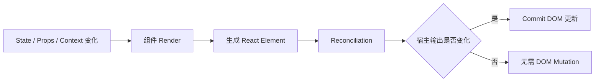
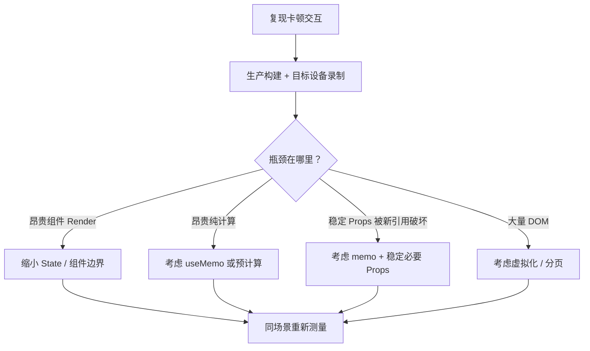

# React Memoization：memo、useMemo、useCallback 与缓存成本模型

> Memoization 不是让值“更正确”，而是用依赖比较、缓存占用和代码复杂度，换取跳过一部分重复计算或子组件 Render 的机会。只有被跳过的工作足够昂贵、依赖足够稳定且性能问题已经测量时，这笔交易才可能划算。

---

## 一、本文解决什么问题

React 项目中常见两种极端：一种从不使用 Memoization，导致大型列表在无关交互中重复计算；另一种给所有组件套 `memo`，给所有函数套 `useCallback`，最后依赖数组和自定义比较器比业务逻辑更难维护。

本文回答以下问题：

- `memo` 跳过的是什么，为什么仍可能重新 Render；
- `useMemo` 缓存的是计算结果还是整个组件；
- `useCallback` 与 `useMemo` 有什么关系；
- 引用稳定为什么会影响 Props、Effect 和 Context；
- 依赖比较、闭包、缓存与垃圾回收有什么成本；
- React 在什么情况下可能丢弃缓存；
- 自定义 Props 比较器为什么容易产生 Stale Closure；
- React Compiler 能减少哪些手工 Memoization，又不能替代什么；
- 如何识别过度 Memoization；
- 如何在生产构建和目标设备上证明优化有效。

本文以现代 React 函数组件为背景。`memo`、`useMemo`、`useCallback` 是公开 API，但都属于性能优化提示，而不是语义正确性的基础。React 的 Bailout、Fiber 复用和 Compiler 生成代码属于实现或工具链行为，具体细节可能随版本变化。业务逻辑必须在缓存丢失或组件重新 Render 时仍然正确。

### 核心结论

1. `memo` 允许父组件重新 Render 时，在 Props 未变化的情况下跳过子组件 Render；它不阻止组件自身 State 或所读 Context 引发更新。
2. 默认 Props 比较逐项使用 `Object.is`，不会深比较对象、数组和函数内部内容。
3. `useMemo` 缓存计算结果，`useCallback` 缓存函数引用；两者都根据依赖数组决定是否复用。
4. 引用稳定只有被引用相等性消费时才有价值，例如 Memoized Child、Effect Dependency 或 Context Value。
5. Memoization 本身有依赖比较、缓存内存、闭包保留、代码维护和分析成本。
6. 缓存可能因开发编辑、首次挂载 Suspense 等情况被丢弃，不能用于保存必须持久存在的业务数据。
7. 自定义比较器必须比较所有影响输出的 Props，包括函数，否则子组件可能长期调用旧闭包。
8. React Compiler 可以在其覆盖范围内自动应用部分等价优化，但不能替代纯度、正确依赖、状态设计和性能测量。
9. 默认先写清晰、纯净的组件，再通过 Profiler 定位热点，只对证据充分的边界 Memoize。

---

## 二、Memoization 优化的究竟是什么

React 组件重新 Render 不等于 DOM 一定变化：



Memoization 主要尝试跳过图中的某些 Render 或计算工作，并不等同于“避免 DOM 更新”。如果组件 Render 本来很便宜，Reconciliation 也没有产生 DOM Mutation，增加缓存可能得不偿失。

完整成本模型至少包含：

```text
优化收益 = 被跳过工作的成本 × 实际命中次数
优化代价 = 依赖/Props 比较 + 缓存管理 + 内存保留 + 代码复杂度
```

只有在目标交互中，收益稳定大于代价，优化才成立。

---

## 三、`memo`：在组件边界复用最近结果

```tsx
const ProductRow = memo(function ProductRow({
  product,
  selected,
  onSelect,
}: ProductRowProps) {
  return (
    <button
      className={selected ? 'selected' : undefined}
      onClick={() => onSelect(product.id)}
    >
      {product.name}：{formatPrice(product.price)}
    </button>
  );
});
```

当父组件重新 Render 时，React 会比较 `ProductRow` 新旧 Props。默认情况下，每个 Prop 使用 `Object.is`：

- 原始值按值语义比较；
- 对象、数组和函数按引用比较；
- 任一 Prop 不同，组件通常重新 Render；
- 全部相同，React 可以复用最近结果并跳过该组件 Render。

`memo` 是优化提示，不是绝对禁止 Render 的契约。组件必须在任何重新 Render 时保持正确。

### 3.1 `memo` 不能拦截组件自己的 State

```tsx
const ExpandableRow = memo(function ExpandableRow({ product }: Props) {
  const [expanded, setExpanded] = useState(false);

  return (
    <article>
      <button onClick={() => setExpanded(value => !value)}>
        {product.name}
      </button>
      {expanded && <ProductDetails product={product} />}
    </article>
  );
});
```

`expanded` 改变时，`ExpandableRow` 仍会更新。`memo` 只处理父组件传入 Props 相同的路径。

### 3.2 `memo` 不能隔离已读取的 Context

```tsx
const Price = memo(function Price({ amount }: { amount: number }) {
  const currency = useContext(CurrencyContext);
  return <span>{formatMoney(amount, currency)}</span>;
});
```

当 `CurrencyContext` 的 Value 变化时，读取它的组件仍需重新 Render。若只有一小部分数据需要 Context，可拆分 Context、缩小消费者，或让外层读取后把稳定的最小 Prop 传给 Memoized Child。

### 3.3 `children` 也可能破坏命中

```tsx
<MemoizedPanel>
  <Chart data={data} />
</MemoizedPanel>
```

父组件每次 Render 都会创建新的 React Element 对象作为 `children`。如果 `MemoizedPanel` 依赖默认浅比较，`children` 引用变化会使缓存不命中。不要据此机械缓存所有 JSX；先确认 Panel Render 是否真是热点，并调整组件边界或让不相关状态靠近其消费者。

---

## 四、不可变更新是 `memo` 的前提

Memoization 依赖引用相等判断。原地修改对象会让 React 无法从引用变化中识别新值：

```tsx
function renameProduct(product: Product) {
  product.name = 'New name';
  setProduct(product); // 同一引用
}
```

即使子组件被 `memo` 包裹，它接收到的仍是同一对象引用，可能错误复用旧输出。应创建新对象：

```tsx
setProduct(current => ({ ...current, name: 'New name' }));
```

结构共享还能让未变化分支保持引用稳定，使 Memoization 有机会精准跳过工作：

```tsx
setCatalog(current => ({
  ...current,
  products: current.products.map(product =>
    product.id === productId
      ? { ...product, price: nextPrice }
      : product,
  ),
}));
```

未修改的 Product 对象沿用旧引用，对应 Memoized Row 才可能命中。深拷贝整个状态虽然“不修改旧值”，却会破坏所有引用稳定性并增加分配成本。

---

## 五、`useMemo`：缓存计算结果

```tsx
const visibleProducts = useMemo(
  () => filterAndSortProducts(products, query, sortBy),
  [products, query, sortBy],
);
```

首次 Render 时执行计算并保存结果。后续 Render 中，React 使用 `Object.is` 比较依赖：

- 依赖全部相同：返回之前缓存的结果；
- 任一依赖变化：重新执行计算并保存新结果。

### 5.1 适合 `useMemo` 的两类理由

第一类是跳过已测量为昂贵的纯计算：

```tsx
const chartSeries = useMemo(
  () => aggregateOrders(orders, timeRange),
  [orders, timeRange],
);
```

第二类是为下游引用比较提供稳定结果：

```tsx
const visibleProducts = useMemo(
  () => products.filter(product => product.visible),
  [products],
);

return <MemoizedProductList products={visibleProducts} />;
```

如果 `ProductList` 没有 Memoize，也没有 Effect/Hook 依赖该数组引用，稳定引用可能没有实际消费者。

### 5.2 不要用 `useMemo` 保存语义状态

```tsx
const socket = useMemo(() => createSocket(url), [url]); // 高风险
```

Socket 是需要明确连接、断开和错误处理的外部资源，不应把 `useMemo` 当资源生命周期管理器。应在 Effect 中 Setup/Cleanup，或交给专门连接层。

以下数据也不应依靠 `useMemo` 保持：

- 表单草稿；
- 用户选择；
- 请求结果的事实源；
- 必须跨 Render 持久存在的命令式实例；
- 资源订阅状态。

它们分别属于 State、Server State、Ref 或资源管理层。React 可以在特定情况下丢弃 Memo 缓存，业务正确性不能依赖其永远存在。

### 5.3 计算必须纯净

开发 Strict Mode 可能额外调用计算函数以检查纯度：

```tsx
const sorted = useMemo(() => {
  products.sort(compareProduct); // 错误：修改 Props
  analytics.track('products_sorted'); // 错误：副作用
  return products;
}, [products]);
```

正确做法：

```tsx
const sorted = useMemo(
  () => [...products].sort(compareProduct),
  [products],
);
```

Analytics 应由明确事件或外部同步协议负责，不能藏在可能重算的 Memo 回调中。

---

## 六、`useCallback`：缓存函数引用

```tsx
const handleSelect = useCallback((productId: string) => {
  setSelectedId(productId);
}, []);
```

`useCallback(fn, deps)` 返回缓存的函数引用。概念上可理解为：

```tsx
useMemo(() => fn, deps);
```

它不会跳过函数定义表达式的创建，也不会让函数调用更快；价值在于 React 可在依赖未变时返回上一次函数引用。

### 6.1 作为 Memoized Child 的 Prop

```tsx
function ProductPage({ products }: { products: Product[] }) {
  const [theme, setTheme] = useState<'light' | 'dark'>('light');
  const [selectedId, setSelectedId] = useState<string | null>(null);

  const handleSelect = useCallback((productId: string) => {
    setSelectedId(productId);
  }, []);

  return (
    <main data-theme={theme}>
      <ThemeToggle value={theme} onChange={setTheme} />
      <MemoizedProductList
        products={products}
        selectedId={selectedId}
        onSelect={handleSelect}
      />
    </main>
  );
}
```

主题变化时，稳定的 `onSelect` 可以避免它单独破坏列表的 Props 相等性。但 `selectedId` 变化仍应重新 Render 列表，这是正确更新。

### 6.2 作为其他 Hook 的依赖

Custom Hook 需要订阅回调时，稳定引用可能减少重新订阅：

```tsx
const handleMessage = useCallback((message: Message) => {
  setMessages(current => [...current, message]);
}, []);

useChatSubscription(roomId, handleMessage);
```

更好的 Custom Hook API 可能把回调稳定性细节封装在内部。不要让每个调用方都必须 `useCallback` 才能正确使用；正确性应由完整依赖与 Cleanup 保证，稳定引用只优化重新同步。

### 6.3 普通事件函数通常不需要缓存

```tsx
function SaveButton() {
  function handleClick() {
    saveDraft();
  }

  return <button onClick={handleClick}>保存</button>;
}
```

原生 `<button>` 不因函数引用变化产生昂贵 React Render 边界，缓存这个函数通常没有收益。函数创建本身通常很便宜，不能凭“每次都会创建”就认定是性能问题。

---

## 七、Reference Stability：稳定引用何时有价值

引用稳定只有在某处进行引用相等判断时才可观察。常见消费者如下：

| 消费位置 | 引用变化的影响 |
|---|---|
| `memo` Props | 可能使子组件无法跳过 Render |
| Hook Dependency | 可能触发重新计算或重新同步 |
| Context Provider Value | 可能通知消费者重新 Render |
| 第三方订阅 API | 可能要求重新注册 Listener |
| 缓存键或 Map Key | 可能产生新缓存条目 |

如果值只在当前 Render 内使用，没有任何引用比较消费者，稳定引用通常无意义。

### 7.1 优先移除依赖，而不是稳定依赖

```tsx
const options = useMemo(
  () => ({ serverUrl, roomId }),
  [serverUrl, roomId],
);

useEffect(() => {
  const connection = createConnection(options);
  connection.connect();
  return () => connection.disconnect();
}, [options]);
```

如果对象只供 Effect 使用，直接在 Effect 内创建更清晰：

```tsx
useEffect(() => {
  const connection = createConnection({ serverUrl, roomId });
  connection.connect();
  return () => connection.disconnect();
}, [serverUrl, roomId]);
```

这不需要额外缓存，也准确表达同步依赖。

### 7.2 Context Value 的稳定性

```tsx
const value = useMemo(
  () => ({ currentUser, signOut }),
  [currentUser, signOut],
);

return <AuthContext.Provider value={value}>{children}</AuthContext.Provider>;
```

稳定 Provider Value 可以避免父组件无关 Render 时仅因对象重建而通知消费者，但它不能阻止 `currentUser` 真正变化时更新。更重要的优化往往是拆分高频与低频 Context，或使用更细粒度订阅，而不是只包装一个巨大 Value。

### 7.3 稳定引用不等于最新闭包

```tsx
const handleSubmit = useCallback(() => {
  submitOrder(order); // order 被读取
}, []); // 错误：缺少 order
```

空依赖让引用稳定，却让函数永久捕获首次 Render 的 `order`。正确依赖优先于稳定引用：

```tsx
const handleSubmit = useCallback(() => {
  submitOrder(order);
}, [order]);
```

如果下一状态只依赖先前 State，可用函数式更新减少依赖；但不能为追求稳定性而隐瞒真实业务输入。

---

## 八、Dependency 成本：缓存不是免费的

每次 Render，React 仍需：

1. 执行 Hook 调用；
2. 取得当前依赖数组；
3. 按顺序用 `Object.is` 比较依赖；
4. 维护缓存值与闭包；
5. 在依赖变化时重新计算或返回新函数；
6. 让开发者维护完整依赖和正确语义。

依赖较少时比较通常很便宜，但被缓存计算也可能更便宜。例如：

```tsx
const fullName = useMemo(
  () => `${firstName} ${lastName}`,
  [firstName, lastName],
);
```

字符串拼接的成本通常低于 Memoization 带来的认知与运行时开销，直接计算更合理：

```tsx
const fullName = `${firstName} ${lastName}`;
```

### 8.1 闭包可能延长对象生命周期

缓存函数会闭包捕获依赖和作用域值，使相关对象至少在该缓存仍被引用期间无法回收。大对象、历史快照或第三方实例被无意捕获时，会增加内存压力。

```tsx
const handleExport = useCallback(() => {
  exportReport(largeReport);
}, [largeReport]);
```

这不一定错误，但应意识到稳定函数与 `largeReport` 的生命周期相关。不要在没有消费者的情况下缓存它。

### 8.2 Memoization 不能抵消高频根状态

如果顶层组件保存输入框、Hover、Pointer Move 等高频 State，大量子树会进入比较路径。比起在每层加 `memo`，把 State 下沉到最小所有者通常更有效：

```tsx
function SearchBox() {
  const [query, setQuery] = useState('');
  return <input value={query} onChange={event => setQuery(event.target.value)} />;
}

function App() {
  return (
    <>
      <SearchBox />
      <ExpensiveDashboard />
    </>
  );
}
```

状态边界优化减少了需要比较的组件数量，也降低了 Memoization 维护成本。

---

## 九、缓存失效：为什么不能依赖永久保存

`useMemo` 和 `useCallback` 的缓存服务于性能。React 文档明确列举了可能丢弃缓存的情况，例如：

- 开发环境编辑组件文件；
- 组件首次挂载期间 Suspense；
- React 未来为特定功能引入新的缓存失效策略。

这些例子不是要求应用针对内部细节编程，而是说明缓存没有业务持久性保证。

### 9.1 错误：用 Memo 生成必须稳定的身份

```tsx
const requestId = useMemo(() => crypto.randomUUID(), []);
```

如果 `requestId` 必须在组件该次生命周期中作为业务身份，缓存失效可能改变它。根据语义选择：

- 属于组件 State：Lazy `useState`；
- 可变但不参与渲染：`useRef`；
- 属于服务端实体：由服务端或业务模型提供；
- 只为一次事件命令：在事件发生时生成。

```tsx
const [requestId] = useState(() => crypto.randomUUID());
```

即使如此，组件身份因 `key` 变化或卸载重挂时仍会重新初始化。真正跨组件生命周期的身份必须提升到更持久的所有者。

### 9.2 Cache Miss 是正常路径

所有 Memoized 计算都必须能安全重算：

- 不执行副作用；
- 不修改 Props/State；
- 不依赖隐藏全局可变状态；
- 不把重算视为错误；
- 结果只由声明依赖决定。

---

## 十、自定义 Props 比较器的风险

`memo` 接受第二个比较函数：

```tsx
const Chart = memo(ChartImpl, (previous, next) => {
  return previous.points === next.points && previous.theme === next.theme;
});
```

比较器返回 `true` 表示 Props 相等、可跳过 Render。它必须覆盖所有影响输出和行为的 Props。

### 10.1 忽略函数 Prop 会产生旧闭包

```tsx
const ProductRow = memo(
  ProductRowImpl,
  (previous, next) => previous.product.id === next.product.id,
);
```

如果 `onSelect` 变化却被比较器忽略，子组件会保留旧 Render 的事件处理函数，继续调用旧闭包中的 Props/State。视觉可能正常，但交互使用过期数据，定位非常困难。

### 10.2 深比较可能比 Render 更昂贵

```tsx
const equal = deepEqual(previous.largeTree, next.largeTree);
```

未经边界约束的深比较可能冻结主线程，并在数据结构增长后急剧恶化。只有当数据深度有严格上限、Render 确实昂贵且 Profiler 证明比较更便宜时才考虑。

优先方案通常是：

- 不可变更新与结构共享；
- 传递更小、更稳定的 Props；
- 拆分组件边界；
- 状态下沉；
- 预先规范化数据；
- 使用具备明确相等语义的数据结构。

---

## 十一、React Compiler 边界

React Compiler 是构建期优化工具，可在其支持和成功编译的代码范围内，根据 React 语义自动应用部分 Memoization，减少手工 `memo`、`useMemo` 和 `useCallback` 的需要。

项目能否使用、默认配置、库发布方式、诊断规则和具体生成结果取决于所采用的 React Compiler 版本与工具链。启用前必须查阅当前版本官方文档，并在 CI、生产构建和目标浏览器验证。本文不把某个具体编译输出当作长期 API。

### 11.1 Compiler 不替代的内容

即使启用 Compiler，仍然必须：

- 保持组件和 Hook 纯净；
- 遵守 Rules of Hooks；
- 正确声明 Effect 依赖；
- 使用不可变更新；
- 设计合理 State 所有权和组件边界；
- 正确管理订阅、请求和资源 Cleanup；
- 测量真实交互性能。

Compiler 不能把错误的旧闭包变成正确逻辑，也不能替你决定网络缓存、列表虚拟化或服务端数据架构。

### 11.2 迁移策略

启用 Compiler 时，不应先批量删除所有手工 Memoization。更稳妥的流程是：

1. 固定 React、Compiler、Lint 和构建工具版本；
2. 处理纯度与不受支持模式诊断；
3. 保留具有明确语义或性能证据的现有优化；
4. 通过 Compiler 分析工具确认目标代码被覆盖；
5. 逐步删除已冗余的手工缓存；
6. 对相同生产场景做前后 Profiler 与浏览器 Trace 对比；
7. 对发布库验证未编译消费者和不同 React 版本边界。

手工 Memoization 与 Compiler 的保留、覆盖和指令行为可能随工具版本变化，应以项目锁定版本文档为准。

---

## 十二、过度 Memoization 的典型信号

### 12.1 缓存廉价原始计算

```tsx
const disabled = useMemo(
  () => loading || items.length === 0,
  [loading, items.length],
);
```

直接计算更清晰：

```tsx
const disabled = loading || items.length === 0;
```

### 12.2 `useCallback` 没有引用消费者

```tsx
const handleClose = useCallback(() => setOpen(false), []);
return <button onClick={handleClose}>关闭</button>;
```

原生按钮不需要稳定回调来跳过 React Render；除非该函数还进入依赖或昂贵 Memoized Child，否则缓存无收益。

### 12.3 所有组件无差别 `memo`

叶子文本组件 Render 很便宜，Props 又频繁变化，`memo` 每次比较后仍 Render，只增加成本和噪声。

### 12.4 用 Memo 修复 Effect 无限循环

如果对象只供 Effect 使用，应移入 Effect；如果 Effect 本身不需要，应删除 Effect。`useMemo` 可以稳定依赖，但不应掩盖同步模型错误。

### 12.5 缺少依赖换取命中率

缓存命中但结果过期不是优化，而是 Bug。依赖必须完整，缓存失效频繁时应接受重算或重构数据流，而不是删除依赖。

### 12.6 优化开发模式日志

Strict Mode 的额外 Render 用于开发检查。不能通过缓存调用次数判断生产收益，也不应为了让控制台“只打印一次”加入 Memoization。

---

## 十三、从真实问题出发的优化流程

假设后台订单表格在输入侧边栏备注时明显卡顿：



具体步骤：

1. 用 React Profiler 找出耗时 Commit 和重复 Render 的组件；
2. 打开“为什么 Render”相关诊断，确认是 State、Context 还是哪个 Prop；
3. 先把备注 State 下沉到侧边栏，避免整个页面进入更新路径；
4. 若订单过滤确实昂贵，再对过滤结果使用 `useMemo`；
5. 若 Row Render 昂贵且多数订单对象引用稳定，再对 Row 使用 `memo`；
6. 保持 `onSelect` 等函数 Prop 稳定，但只缓存真正跨 Memo 边界的函数；
7. 若瓶颈来自上万 DOM 节点，Memoization 不够，应使用虚拟化或分页；
8. 以相同数据量、相同操作脚本重新录制并比较。

优化必须落到可测指标，例如交互延迟、Commit Duration、Long Task 数量和内存变化，而不是“Profiler 颜色看起来更绿”。

---

## 十四、测试与验证

### 14.1 功能测试不应依赖 Render 次数

组件可能因 Strict Mode、调度策略或缓存失效重新 Render。功能测试应断言：

- 用户操作结果正确；
- Props/State 更新后界面没有过期；
- 回调读取最新业务数据；
- 缓存丢失后重新计算仍正确；
- Custom Comparator 没有跳过必要更新。

只有专门的性能基准才记录 Render 次数，而且也应同时测量耗时。

### 14.2 性能测试环境

- 使用生产构建；
- 使用目标浏览器和具有代表性的设备；
- 固定数据规模、操作路径和网络条件；
- 分别记录 React Profiler 与浏览器 Performance Trace；
- 预热后多次运行，关注分布而不是单次最优值；
- 同时观察 CPU、内存与垃圾回收；
- 避免浏览器扩展和开发日志干扰。

### 14.3 自定义比较器基准

同时测量：

```text
比较器耗时 + 缓存未命中时的 Render 耗时
```

不要只统计“跳过了多少次”。若比较器每次遍历大数组，可能比直接 Render 更慢。

### 14.4 React Compiler 验证

Compiler 项目还应验证：

- 目标文件是否成功编译，而非静默跳过；
- 生产 Bundle 是否使用预期编译结果；
- 启用前后功能测试完全一致；
- 热点交互在相同环境下是否真正改善；
- 手工 Memoization 删除后是否出现回归；
- 库消费者的构建兼容性是否符合发布声明。

---

## 十五、工程检查清单

- 是否先用 Profiler 证明存在昂贵重复工作；
- 是否先优化 State 所有权、组件边界和数据结构；
- `memo` 组件的 Props 是否大部分时间稳定；
- 对象更新是否遵守不可变与结构共享；
- `useMemo` 计算是否纯净且足够昂贵；
- `useCallback` 是否有真实引用相等消费者；
- 依赖是否完整，没有为命中率保留旧闭包；
- 是否能把对象/函数移入 Effect，直接移除依赖；
- Custom Comparator 是否比较所有 Props，包括函数；
- 比较器是否确实比被跳过 Render 更便宜；
- Memo 是否被错误当作 State、Ref 或资源生命周期；
- 缓存失效后业务是否仍正确；
- React Compiler 版本、覆盖范围和构建链是否明确；
- 是否在生产构建、目标设备和相同场景复测 CPU 与内存。

---

## 十六、总结

1. Memoization 用缓存维护成本换取跳过重复工作的机会，不是默认性能开关。
2. `memo` 比较 Props，但不阻止组件自身 State 和 Context 更新。
3. `useMemo` 缓存纯计算结果，`useCallback` 缓存函数引用。
4. 默认比较使用 `Object.is`，不可变更新与结构共享决定缓存能否准确命中。
5. 引用稳定只在 Memoized Child、Hook Dependency、Context 等引用消费者处有价值。
6. 依赖比较、闭包保留、缓存内存和维护复杂度都属于优化成本。
7. Cache Miss 与缓存失效必须是安全路径，业务语义不能依赖缓存永久存在。
8. 自定义比较器可能比 Render 更贵，也可能因忽略函数 Prop 保留旧闭包。
9. React Compiler 能减少其覆盖范围内的手工 Memoization，但不替代纯度、状态设计和测量。
10. 最有效的优化通常从 State 下沉、组件拆分、数据结构和虚拟化开始，再考虑局部缓存。

判断是否 Memoize 时，不要问“这个值会不会重新创建”，而要问“谁在比较它、被跳过的工作有多贵、缓存能命中多少次，以及这些结论是否已经在真实环境得到证据”。

---

## 问答复盘

### Q1：被 `memo` 包裹的组件是否保证不会重新 Render？

**答：** 不保证。自身 State、读取的 Context、变化的 Props 或 React 的其他需要仍可触发 Render；`memo` 只是 Props 相同时的优化提示。

### Q2：`useMemo` 和 `useCallback` 的核心区别是什么？

**答：** `useMemo` 缓存计算结果，`useCallback` 缓存函数本身的引用；两者都依据完整依赖决定复用。

### Q3：为什么不可变更新会影响 Memoization？

**答：** React 使用引用相等判断对象变化。结构共享让未变化数据保留引用、变化数据获得新引用，Memo 才能准确识别边界。

### Q4：一个函数每次 Render 都重新创建，是否应该立刻使用 `useCallback`？

**答：** 不应该。只有函数进入 Memoized Child、Hook 依赖或其他引用比较边界，且该稳定性有可测收益时才值得缓存。

### Q5：稳定回调使用空依赖数组，却读取了变化的 Props，会发生什么？

**答：** 回调会保留首次 Render 的旧闭包。正确性优先，应声明 Props 依赖，或在语义允许时用函数式更新减少 State 依赖。

### Q6：为什么不能用 `useMemo` 保存 Socket 或业务 ID？

**答：** Memo 缓存可能失效，也没有资源 Cleanup 语义。Socket 应由 Effect/资源层管理，业务身份应由 State、Ref 或更持久所有者保存。

### Q7：自定义 Props 比较器只比较数据、不比较回调可以吗？

**答：** 通常不可以。函数也可能捕获变化的 Props/State；忽略它会让子组件继续调用旧闭包。除非能严格证明行为等价，并有完整测试。

### Q8：启用 React Compiler 后，是否可以删除所有手工 Memoization？

**答：** 不能直接假设。应确认当前 Compiler 版本、覆盖范围和诊断，逐步删除冗余缓存，并用相同生产场景验证功能与性能。

### Q9：如何证明一次 Memoization 是有效优化？

**答：** 在生产构建和目标设备上，固定数据与交互，对比优化前后的 Commit、交互延迟、Long Task、比较成本和内存，并确认功能没有旧值问题。

---

## 延伸知识

- **Ref**：`useRef`、DOM Ref、Callback Ref、Imperative Handle 与可变逃生口。
- **Reconciliation**：组件身份、Bailout、Key 与子树复用。
- **不可变更新**：结构共享、引用相等与规范化 State。
- **并发渲染**：可中断 Render、Transition 与更新优先级。
- **列表性能**：窗口化、分页、Cell Measurement 与稳定 Key。
- **React Compiler**：纯度分析、构建集成、诊断和库发布边界。
