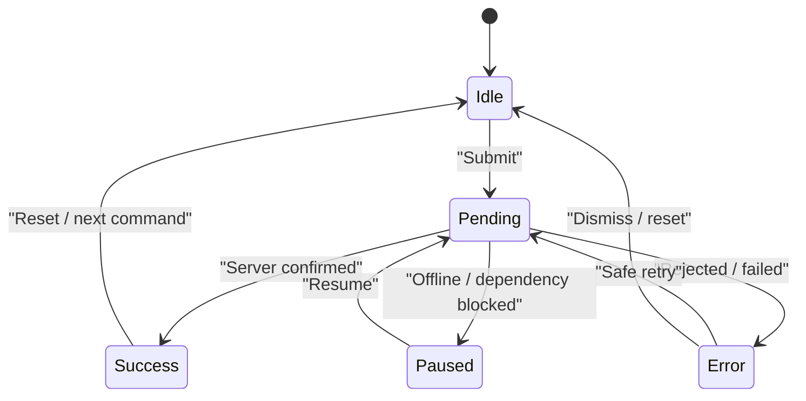
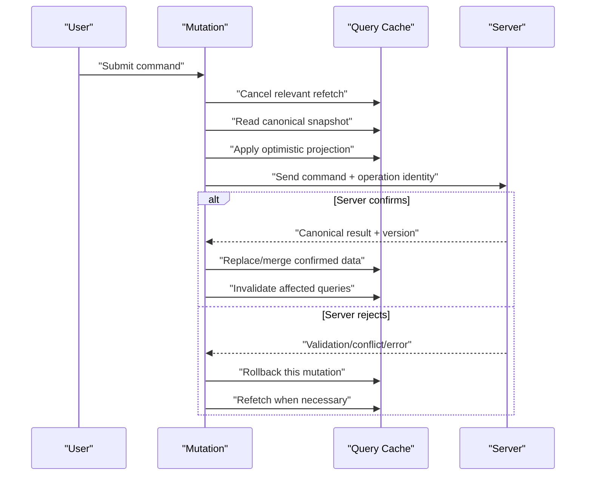
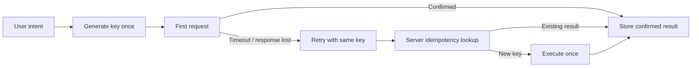
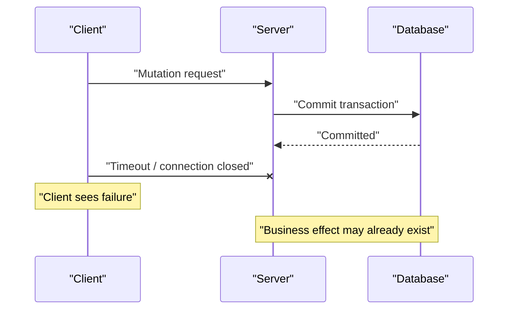
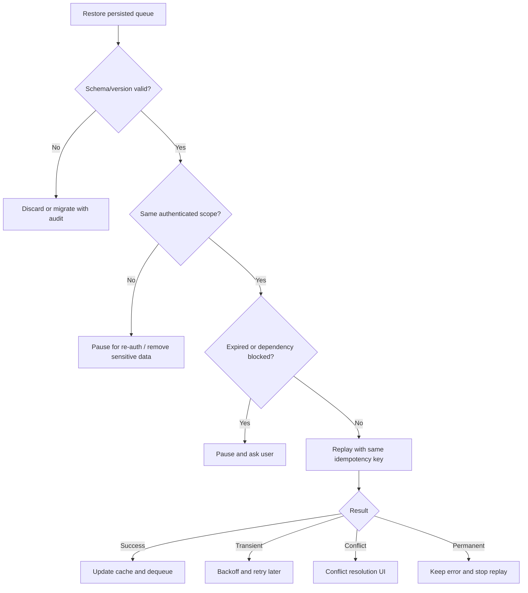
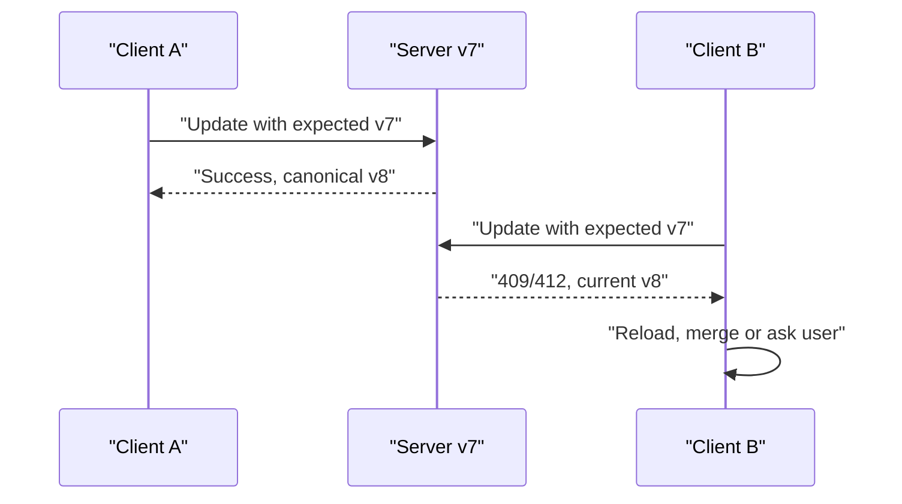

# React Mutation：乐观更新、幂等提交与冲突治理

> Mutation 不是“带 `POST` 的 Query”。Query 描述如何读取服务端快照，Mutation 表达一次有业务含义的写命令。可靠的写操作必须同时定义提交状态、缓存同步、失败恢复、重复请求语义、离线重放和版本冲突处理。

---

## 一、为什么写操作比读取更危险

用户点击“确认付款”，前端执行：

```tsx
await fetch(`/api/orders/${orderId}/pay`, {
  method: 'POST',
});
```

即使代码没有抛错，仍有一组关键问题没有回答：

- 用户双击时会不会创建两次业务操作；
- 请求超时后，服务端究竟有没有完成扣款；
- 自动 Retry 是否会重复执行副作用；
- Mutation 成功后，Detail、List、统计数据如何同步；
- 乐观更新失败时，如何只撤销本次变更；
- 两次并发编辑乱序返回时，哪个结果应成为最终状态；
- 离线操作恢复后是否仍合法、仍有权限；
- 其他终端已修改数据时，是否覆盖、合并还是提示冲突。

读取失败通常意味着暂时拿不到数据；写入失败则可能处于“客户端不知道，服务端可能已经执行”的不确定状态。Mutation 治理的核心不是展示一个 Loading，而是让一次业务命令拥有可追踪身份和明确的一致性协议。

本文讨论库无关的 Mutation 模型。示例采用 TanStack Query v5 常见的 `useMutation`、`setQueryData` 和 `invalidateQueries` 形式帮助理解；具体回调参数、默认 Retry、Network Mode 和持久化 API 应以项目锁定版本的官方文档为准。

### 核心结论

1. 每次 `mutate` 调用都是独立命令，不能因为参数相同就默认去重。
2. Mutation State 至少要表达 Idle、Pending、Success、Error；离线队列还需要 Paused/Queued。
3. 禁用按钮只能改善交互，真正的重复执行保护必须由服务端幂等协议保证。
4. Idempotency Key 应按“逻辑操作”生成一次，并在超时重试时复用，而不是每次网络请求重新生成。
5. Optimistic Update 是服务器确认前的暂定投影，不是已经成功的事实。
6. Rollback 必须只撤销对应 Mutation；并发写入时整体恢复旧 Snapshot 可能覆盖其他成功结果。
7. Mutation 成功后应根据响应完整度选择 Direct Cache Update、Targeted Invalidation 或二者组合。
8. Abort 客户端请求不等于撤销服务端事务，响应丢失时仍要通过幂等查询或操作状态接口确认结果。
9. Offline Mutation 是持久化命令队列，需要顺序、身份、权限、过期和冲突策略，不能只等 `online` 事件后重发。
10. Conflict Resolution 必须基于服务端 Version、ETag 或领域规则，不能用“最后返回的响应”推断最新状态。

---

## 二、Query 与 Mutation 的职责边界

| 维度 | Query | Mutation |
|---|---|---|
| 语义 | 读取资源快照 | 执行业务命令 |
| 重复调用 | 通常可共享请求或缓存结果 | 可能产生多次副作用 |
| 身份 | Query Key 标识资源 | Mutation ID / Idempotency Key 标识操作 |
| 生命周期 | Fresh、Stale、Inactive、GC | Idle、Pending、Success、Error、Paused |
| 重试 | `GET` 等安全读取通常可重试 | 需先证明操作可安全重放 |
| 一致性 | 后台刷新服务端快照 | 更新、失效或重建相关快照 |
| 取消 | 可停止不再需要的读取 | 只能停止等待，不保证撤销服务端执行 |

Mutation 不是 HTTP Method 的简单分类。例如：

- `POST /search` 可能是只读搜索，但无法被通用 HTTP Cache 当作普通 `GET`；
- `PUT` 在 HTTP 语义上设计为幂等，不代表业务实现一定正确支持重放；
- `POST /payments` 通常非幂等，但可以借助 Idempotency Key 建立幂等效果；
- `DELETE` 重复执行是否返回相同 Status，不影响目标资源最终不存在的幂等语义。

前端不能只根据 Method 决定 Retry。是否能重试取决于服务端契约、业务副作用和幂等实现。

---

## 三、Mutation State：状态与数据是两个维度

一个最小 Mutation 状态可以建模为：

```ts
type MutationState<TVariables, TData> =
  | { status: 'idle' }
  | {
      status: 'pending';
      mutationId: string;
      variables: TVariables;
      submittedAt: number;
    }
  | {
      status: 'success';
      mutationId: string;
      data: TData;
    }
  | {
      status: 'error';
      mutationId: string;
      variables: TVariables;
      error: unknown;
      canRetry: boolean;
    }
  | {
      status: 'paused';
      mutationId: string;
      variables: TVariables;
      reason: 'offline' | 'auth-required' | 'dependency';
    };
```

`variables` 是提交命令，`data` 是服务端确认结果，两者不能混为一谈。创建评论时，客户端 Variables 可能只有正文，而服务端 Data 还包含 ID、审核状态、时间戳和规范化内容。

### 3.1 基本状态迁移



Paused 不等于 Error。它表示操作尚未获得最终结果，但当前不应继续发送。是否暴露 Paused 以及如何恢复属于具体库和离线策略。

### 3.2 Mutation 状态不应成为永久业务事实

`isSuccess` 只表示某次客户端调用成功，不代表业务对象永久处于成功阶段。页面刷新后，真正的订单状态仍应来自 Query 或路由数据，而不是保存在 Mutation Hook 中。

Mutation Result 适合驱动短生命周期反馈：

- 按钮 Pending；
- 当前提交错误；
- 成功 Toast；
- 重试入口；
- 表单字段错误映射。

资源的长期 Canonical Snapshot 应回到 Query Cache。

### 3.3 同一个 Hook 可以执行多次命令

不要假设一个 `useMutation` 实例只对应一次调用。用户可能连续创建多条评论，Mutation State 往往只暴露当前或最近一次调用的汇总状态。需要逐条展示状态时，应为每次调用建立 `mutationId`，或使用库提供的 Mutation Cache 查询能力。

---

## 四、一个可靠的基础 Mutation

以修改订单备注为例，Transport 先明确 HTTP 和 Runtime Validation：

```ts
type UpdateOrderNoteInput = {
  orderId: string;
  note: string;
  expectedVersion: number;
  idempotencyKey: string;
};

type Order = {
  id: string;
  note: string;
  status: 'draft' | 'confirmed' | 'cancelled';
  version: number;
  updatedAt: string;
};

async function updateOrderNote(input: UpdateOrderNoteInput): Promise<Order> {
  const response = await fetch(`/api/orders/${input.orderId}/note`, {
    method: 'PUT',
    headers: {
      'Content-Type': 'application/json',
      'Idempotency-Key': input.idempotencyKey,
      'If-Match': `"order-${input.expectedVersion}"`,
    },
    body: JSON.stringify({ note: input.note }),
  });

  if (response.status === 409 || response.status === 412) {
    throw new OrderConflictError(await response.json());
  }

  if (!response.ok) {
    throw await HttpError.fromResponse(response);
  }

  return parseOrder(await response.json());
}
```

`parseOrder` 必须进行运行时校验；TypeScript 的返回类型不会验证网络 JSON。`OrderConflictError` 和 `HttpError` 代表项目中的领域错误实现，不是浏览器内置类型。

组件只负责把一次用户意图转换为命令：

```tsx
function OrderNoteForm({ order }: { order: Order }) {
  const queryClient = useQueryClient();
  const mutation = useMutation({
    mutationFn: updateOrderNote,
    onSuccess: async (confirmedOrder) => {
      queryClient.setQueryData(
        ['orders', 'detail', confirmedOrder.id],
        confirmedOrder,
      );

      await queryClient.invalidateQueries({
        queryKey: ['orders', 'list'],
      });
    },
  });

  function handleSubmit(event: React.FormEvent<HTMLFormElement>) {
    event.preventDefault();
    if (mutation.isPending) return;

    const form = new FormData(event.currentTarget);
    mutation.mutate({
      orderId: order.id,
      note: String(form.get('note') ?? ''),
      expectedVersion: order.version,
      idempotencyKey: crypto.randomUUID(),
    });
  }

  return (
    <form onSubmit={handleSubmit}>
      <textarea name="note" defaultValue={order.note} />
      <button type="submit" disabled={mutation.isPending}>
        {mutation.isPending ? '保存中' : '保存'}
      </button>
      {mutation.isError && <p role="alert">保存失败，请检查后重试。</p>}
    </form>
  );
}
```

这里的 `isPending` 防止当前组件内的快速重复点击，但它不是分布式幂等保证。另一个 Tab、刷新后的重试或代理层重放仍可能提交相同业务操作。

如果错误后允许重试同一逻辑操作，必须保存并复用原 `idempotencyKey`。上例在每次新的表单提交时创建新 Key 是正确的；重试函数不能重新执行整个 Key 生成步骤。

---

## 五、Optimistic Update：先展示暂定结果

乐观更新在服务端确认前先更新 UI，适合：

- 成功概率高；
- 反馈应立即出现；
- 本地结果容易预测；
- 失败可明确恢复；
- 不涉及不可逆或高风险决策。

点赞、收藏、排序和低冲突文本编辑常可考虑。付款、库存最终扣减、权限授予和不可逆删除通常不应把乐观 UI 表述为“已完成”。

### 5.1 完整执行时序



提交前取消相关 Refetch，是为了避免一个更早发起的读取在乐观 Patch 后返回并覆盖它。这个取消只针对相关 Query，不代表取消 Mutation。

### 5.2 UI Overlay 与 Cache Patch

乐观更新有两种常见位置：

1. **UI Overlay**：根据 Pending Variables 临时渲染一项，不直接修改共享 Cache；
2. **Cache Patch**：直接修改 Query Cache，让多个页面或组件同时看到乐观结果。

UI Overlay 更局部、回滚简单，适合提交表单后只在当前列表展示临时项。Cache Patch 适合多个消费者必须同步看到变化，但需要处理 Query Key、排序、分页、并发和回滚。

不要为了“更快”默认修改所有 Cache。先选择最小的一致性范围。

### 5.3 使用 Cache Patch 的示例

```tsx
const mutation = useMutation({
  mutationFn: updateOrderNote,

  onMutate: async (variables) => {
    const detailKey = ['orders', 'detail', variables.orderId] as const;

    await queryClient.cancelQueries({ queryKey: detailKey });

    const previous = queryClient.getQueryData<Order>(detailKey);

    queryClient.setQueryData<Order>(detailKey, (current) => {
      if (!current) return current;

      return {
        ...current,
        note: variables.note,
      };
    });

    return { detailKey, previous };
  },

  onError: (_error, _variables, rollback) => {
    if (rollback?.previous) {
      queryClient.setQueryData(rollback.detailKey, rollback.previous);
    }
  },

  onSuccess: (confirmedOrder, _variables, rollback) => {
    queryClient.setQueryData(
      rollback?.detailKey ?? ['orders', 'detail', confirmedOrder.id],
      confirmedOrder,
    );
  },

  onSettled: (_data, _error, variables) => {
    return queryClient.invalidateQueries({
      queryKey: ['orders', 'detail', variables.orderId],
    });
  },
});
```

这段代码适合解释单个在途 Mutation。若同一订单允许并发编辑，保存整个 `previous` Snapshot 再恢复并不安全，后文会给出更稳健的模型。

---

## 六、Rollback：撤销的是本次投影

最常见的错误回滚是：

```ts
const previousOrders = queryClient.getQueryData(['orders']);

// 乐观修改整个列表

// 任意失败时恢复整个旧列表
queryClient.setQueryData(['orders'], previousOrders);
```

如果 Snapshot 保存后另一个 Mutation 已成功，整体恢复会把它一起撤销。Rollback 的正确粒度应与 Mutation 的影响粒度一致。

### 6.1 三种回滚策略

| 策略 | 适用情况 | 主要代价 |
|---|---|---|
| 恢复旧 Snapshot | 单写入、无并发、影响范围小 | 并发时容易覆盖其他结果 |
| 逆 Patch | 可精确描述本次字段或列表变化 | Patch 设计和边界处理更复杂 |
| Canonical + Overlay 重算 | 多个并发乐观操作 | 需要维护操作序列和重放逻辑 |

### 6.2 Canonical + Overlay

把服务端确认数据与尚未确认的操作分开：

```ts
type PendingNoteMutation = {
  mutationId: string;
  orderId: string;
  note: string;
  submittedAt: number;
};

function projectOrder(
  canonical: Order,
  pending: readonly PendingNoteMutation[],
): Order {
  return pending
    .filter((item) => item.orderId === canonical.id)
    .sort((a, b) => a.submittedAt - b.submittedAt)
    .reduce(
      (current, item) => ({ ...current, note: item.note }),
      canonical,
    );
}
```

某次失败时只移除对应 `mutationId`，然后基于最新 Canonical Data 重算 UI；某次成功时先用服务器响应更新 Canonical，再移除对应 Pending Operation。这样不会因恢复旧 Snapshot 撤销其他已确认变更。

### 6.3 无法可靠回滚时 Refetch

如果服务端执行了复杂规则，本地无法构造准确逆操作，应：

1. 移除不可靠的乐观投影；
2. 标记受影响 Query 为 Stale；
3. Refetch Canonical Snapshot；
4. 保留错误提示和用户输入，避免静默丢失。

Refetch 是重新建立事实，不是对服务端事务的补偿。真正的业务撤销需要单独的补偿命令和授权审计。

---

## 七、Mutation 后如何同步 Query Cache

成功响应到达后，通常有三种策略。

### 7.1 Direct Cache Update

响应返回完整、可信的 Canonical Entity 时，直接写 Detail：

```ts
onSuccess: (order) => {
  queryClient.setQueryData(
    ['orders', 'detail', order.id],
    order,
  );
}
```

优点是无需立即再请求；限制是列表可能有排序、过滤、权限裁剪和聚合字段，仅替换 Detail 不足以更新全部派生结果。

### 7.2 Targeted Invalidation

无法准确推导受影响数据时，让 Cache 重新验证：

```ts
onSuccess: async (order) => {
  await Promise.all([
    queryClient.invalidateQueries({
      queryKey: ['orders', 'detail', order.id],
    }),
    queryClient.invalidateQueries({
      queryKey: ['orders', 'list'],
    }),
    queryClient.invalidateQueries({
      queryKey: ['orders', 'summary'],
    }),
  ]);
}
```

Invalidation 通常表示标记为 Stale，并按活跃状态和库策略 Refetch，不等于立即删除数据。

返回或 `await` Invalidation Promise 可以让 Mutation Pending 生命周期覆盖重新验证；是否需要这样做取决于 UI 契约。若用户只需知道写入已被服务器接受，可以先结束 Pending，把后台同步作为独立状态。

### 7.3 Direct Update + Invalidation

常见组合是：

- 立即用响应更新当前 Detail；
- 精确 Patch 确定可推导的列表项；
- Invalidate 统计、复杂 Filter 和聚合 Query；
- 避免全局 `invalidateQueries()` 造成 Request Storm。

### 7.4 失效关系应集中管理

不要把字符串 Key 和影响范围散落在每个组件：

```ts
const orderKeys = {
  all: ['orders'] as const,
  lists: () => [...orderKeys.all, 'list'] as const,
  list: (filters: OrderFilters) =>
    [...orderKeys.lists(), filters] as const,
  details: () => [...orderKeys.all, 'detail'] as const,
  detail: (orderId: string) =>
    [...orderKeys.details(), orderId] as const,
  summary: () => [...orderKeys.all, 'summary'] as const,
};
```

Key Factory 不是为了抽象本身，而是让资源身份、Prefix Invalidation 和测试使用同一协议。

---

## 八、Idempotency Key：标识一次逻辑操作

幂等意味着同一逻辑请求执行一次或多次，系统的最终业务效果一致。对创建支付、提交订单等非幂等命令，常用协议是：

```http
POST /api/payments
Idempotency-Key: 018f6f52-...
Content-Type: application/json
```

### 8.1 Key 的生命周期



必须区分：

- 用户再次点击“再买一件”是新逻辑操作，应使用新 Key；
- 同一次购买因 Timeout 重试是同逻辑操作，应复用原 Key。

### 8.2 服务端需要做什么

可靠实现通常要在服务端原子地：

1. 按 User/Tenant、Operation Type 和 Idempotency Key 查找记录；
2. 校验同一 Key 的 Request Fingerprint 是否一致；
3. Key 未出现时占位并执行业务事务；
4. 保存确定的成功响应，必要时保存可重放的失败结果；
5. 重复请求返回原结果或明确的“仍在处理”；
6. 设置与业务重试窗口匹配的保留期。

概念模型如下：

```ts
type IdempotencyRecord = {
  scope: string;
  key: string;
  requestHash: string;
  status: 'processing' | 'succeeded' | 'failed';
  responseStatus?: number;
  responseBody?: unknown;
  expiresAt: string;
};
```

仅把 Key 存进普通 Cache，再与业务写入分两步执行，可能在进程崩溃时留下不一致。实现应结合数据库唯一约束、事务、业务唯一键或等价的原子机制设计。

### 8.3 安全边界

- Key 应不可预测且有足够熵，通常可使用 UUID；
- 不在 Key 中放 Token、邮箱和订单明文；
- Key 必须按用户、租户和操作类型隔离；
- 同 Key 不同 Payload 应拒绝，而不是返回旧结果；
- Idempotency 不能替代 Authentication、Authorization 和业务校验；
- Key 过期后再次发送的行为必须形成公开契约。

---

## 九、Duplicate Submission：前端防抖不是最终防线

重复提交可能来自：

- 双击或触屏重复事件；
- 用户在 Pending 时再次按 Enter；
- 页面刷新后的重新发送；
- 浏览器、代理或 SDK Retry；
- 两个 Tab 同时操作；
- 响应丢失后用户手动重试；
- 离线队列恢复时重复 Replay。

### 9.1 客户端的三层保护

1. **交互层**：按钮 Pending 时禁用，并提供明确反馈；
2. **进程层**：相同 Operation ID 使用 Single-flight，避免本地并发发送；
3. **协议层**：服务端使用 Idempotency Key 或业务唯一约束。

Debounce 只把短时间内事件合并，不能覆盖刷新、跨 Tab 和网络重试。按钮禁用也可能因组件重新挂载而丢失。

### 9.2 不要盲目 Retry Mutation

读取请求的指数退避不能直接复制到写请求。Mutation 自动重试前至少确认：

- 服务端支持同一 Idempotency Key；
- Retry 会复用同一 Payload 和 Key；
- 错误属于暂时性故障，而非 Validation、Authorization 或 Conflict；
- 有最大次数、总时间预算、退避和抖动；
- 用户能看到 Pending 或 Unknown 状态；
- 监控不会把一次逻辑操作统计为多笔业务成功。

对无法证明可安全重放的支付请求，超时后应查询 Payment Status，而不是直接创建新支付。

---

## 十、取消、超时与未知结果



`AbortController.abort()` 可以停止客户端继续等待和读取响应，但请求可能已经到达服务端，事务也可能已经提交。因此：

- 不把 Abort 显示为“操作已撤销”；
- 组件卸载时可以停止 UI 回写，但不应假设业务命令消失；
- 超时后使用相同 Idempotency Key 重试，或查询 Operation Status；
- 真正撤销已成功操作需要服务端提供 Cancel/Compensate Command；
- 对不可逆命令显示“结果确认中”，不要误报失败并诱导重复提交。

Mutation 的 Cancellation 语义必须由业务 API 定义，不能仅依赖浏览器连接状态。

---

## 十一、Offline Mutation：持久化的是命令队列

离线读取可以展示旧 Cache；离线写入则要回答“稍后是否仍应执行”。一个离线 Mutation 至少需要：

```ts
type QueuedMutation<TVariables> = {
  mutationId: string;
  idempotencyKey: string;
  operationType: string;
  variables: TVariables;
  createdAt: number;
  expiresAt: number;
  userScope: string;
  dependencyIds: string[];
  attempt: number;
  expectedVersion?: number;
};
```

函数、Closure、DOM Node 和 `AbortSignal` 不能可靠持久化。恢复时应通过 `operationType` 找到已注册的 Mutation Handler，并重新进行身份、版本和 Schema 校验。

### 11.1 恢复流程



监听到 `navigator.onLine === true` 只表示浏览器认为存在网络连接，不保证 API、DNS、VPN、认证和目标服务可用。恢复仍应依据真实请求结果。

### 11.2 顺序与依赖

离线创建临时订单后再添加商品，第二个操作依赖第一个操作产生的真实 ID。队列需要：

- Client-generated ID 与 Server ID 映射；
- Dependency Graph 或明确串行 Scope；
- 同实体操作的顺序保证；
- 不同实体间可控并行；
- 某个永久失败后的后续操作处理策略。

不能只按恢复时刻并发发送全部队列。

### 11.3 持久化与安全

- 队列需要 Schema Version 和 Migration；
- 敏感 Payload 应最小化并按平台能力加密；
- Logout 时清除或隔离用户队列；
- Token 不应直接持久化在 Mutation Variables；
- 队列必须有限额、TTL 和清理策略；
- 高风险操作可禁止离线提交，只允许保存本地 Draft。

TanStack Query 等库可以暂停和持久化 Mutation，但持久化状态不等于自动持久化 `mutationFn`。页面重载后能否恢复、是否需要注册默认函数，应按所用版本官方文档实现并测试。

---

## 十二、Conflict Resolution：不是谁最后返回谁赢

两个客户端读取 Version 7，并分别修改订单备注：



如果服务端不检查 Version，B 可能静默覆盖 A。前端响应先后不能代表服务端业务版本。

### 12.1 ETag 与 If-Match

HTTP 条件请求可以表达“只在我看到的版本仍有效时更新”：

```http
PUT /api/orders/42
If-Match: "order-7"
```

资源已变化时，服务端可以返回 `412 Precondition Failed`。部分业务 API 使用 `409 Conflict` 表达领域冲突。具体 Status 和错误结构应在 API Contract 中统一，前端不能假设所有服务都相同。

### 12.2 冲突处理策略

| 策略 | 适用场景 | 风险 |
|---|---|---|
| 拒绝并刷新 | 库存、状态转换、权限等强约束 | 用户需要重新操作 |
| 字段级自动合并 | 修改互不重叠字段 | 必须能证明合并合法 |
| 用户选择 | 文档、长表单和人工编辑 | UI 与草稿管理成本高 |
| Last-write-wins | 明确允许覆盖的低价值字段 | 可能静默丢失更新 |
| CRDT/OT 等协作算法 | 实时多人编辑 | 系统复杂度显著增加 |

Last-write-wins 是业务策略，不是默认正确答案。服务端时间、客户端时间和响应到达时间都可能不同，必须明确比较依据。

### 12.3 冲突 UI

冲突发生后，前端应保留：

- 用户提交的 Local Draft；
- 最新 Server Snapshot；
- Base Version；
- 可合并字段差异；
- 再次提交所需的新 Version 和新逻辑操作身份。

不要在 Refetch 后直接丢弃用户输入。对于重要表单，应提供 Diff、复制或重新应用入口。

---

## 十三、错误分类决定恢复动作

| 错误类型 | 示例 | 通常处理 |
|---|---|---|
| Validation | 400/422、字段非法 | 映射到字段，不自动重试 |
| Authentication | 401 | 刷新会话或重新登录，防止循环 |
| Authorization | 403 | 停止重试，撤销敏感乐观数据 |
| Not Found | 404 | 资源可能已删除，刷新相关 Query |
| Conflict | 409/412 | 获取新版本并进入冲突流程 |
| Rate Limit | 429 | 尊重 `Retry-After`，限制提交 |
| Transient Server | 502/503/504 | 仅在幂等保证下退避重试 |
| Network/Timeout | 无法确认 | 查询状态或同 Key 重试 |
| Schema Error | 响应结构不合法 | 不写 Cache，记录兼容性故障 |

`onError` 不应统一 Toast “网络错误”。错误类型决定是否回滚、保留 Draft、重新认证、延迟重试或请求人工决策。

乐观更新后的 403 还涉及安全边界：如果用户无权看到目标状态，应立即撤销投影并清理可能泄漏的 Cache，而不是继续展示旧敏感数据。

---

## 十四、并发 Mutation 的排序策略

同一实体的多个写入可能：

- 允许并行，以 Version 冲突裁决；
- 按 Entity ID 串行；
- 新命令取代尚未发送的旧命令；
- 合并为一个批量命令；
- 每个操作独立提交并用 Overlay 投影。

### 14.1 Autosave

文本自动保存不应让每次按键都产生无界并发请求。常见策略是：

1. 本地立即更新 Draft；
2. Debounce 只减少发送频率；
3. 同一文档最多一个在途 Save；
4. 在途期间的新 Draft 标记为 Dirty；
5. 当前请求结束后提交最新 Dirty Snapshot；
6. 每次携带 Expected Version；
7. 冲突时停止自动覆盖并提示合并。

Debounce 解决频率，串行队列解决乱序，Version 解决跨客户端冲突，三者职责不同。

### 14.2 Toggle 的奇偶陷阱

用户快速点击两次收藏，发送 `toggle` 两次可能因 Retry 或乱序得到错误结果。更稳定的命令是表达目标状态：

```http
PUT /api/articles/42/favorite
{ "favorite": true }
```

而不是只发送“切换一次”。目标状态更容易幂等、合并和恢复，但仍需要服务端授权和版本规则。

---

## 十五、测试 Mutation 协议

测试重点不是 Hook 是否变成 `isSuccess`，而是业务协议在失败和并发下是否正确。

### 15.1 Mutation State

- 初始为 Idle；
- 提交后进入 Pending，并记录正确 Variables；
- 成功后展示确认结果；
- Validation Error 映射到字段；
- Reset 后错误和短期反馈清理；
- 多次调用不会串用旧 Error/Data。

### 15.2 Optimistic Update 与 Rollback

使用可控 Promise 验证：

1. 请求未完成时 UI 已出现暂定结果；
2. 成功响应用 Canonical Data 替换临时字段；
3. 失败只撤销对应 Mutation；
4. 后提交的成功变更不被旧 Mutation 回滚；
5. 进行中的 Refetch 不会覆盖乐观投影；
6. 最终 Invalidation 获取服务端事实。

### 15.3 Idempotency

集成测试至少覆盖：

- 同 Key、同 Payload 发送两次，只产生一次业务效果；
- 第一次已提交但响应中断，第二次返回原结果；
- 同 Key、不同 Payload 被拒绝；
- 不同用户使用相同 Key 不会串用结果；
- Processing 状态下并发重复请求行为明确；
- Key 过期后的行为符合契约。

### 15.4 Offline 与冲突

- 页面重载后队列能恢复已注册 Handler；
- Logout 后不会以新用户身份重放旧队列；
- 依赖 Mutation 保持正确顺序；
- 永久错误停止自动 Replay；
- Version 冲突保留 Local Draft；
- 恢复网络时不会形成无界 Request Storm。

测试环境应使用 Mock Service Worker、测试服务器或等价网络边界模拟响应丢失、延迟、409/412、429 和 503，而不是只 Mock `mutate()` 返回值。

---

## 十六、性能与可观测性

Mutation 的目标不是“尽快结束 Loading”，而是以可接受延迟得到正确且可确认的业务结果。

### 16.1 建议指标

- Logical Mutation Count 与 Network Attempt Count；
- 成功、永久失败、暂时失败、冲突和未知结果比例；
- P50/P95/P99 Confirmation Latency；
- Duplicate Suppression 命中数；
- Idempotency Replay 命中数和 Processing 时长；
- Optimistic Rollback Rate；
- Invalidation 触发的 Query 数与请求流量；
- Offline Queue 长度、最老操作年龄和恢复成功率；
- Conflict Rate 与人工解决耗时。

Network Attempt 不能直接当作业务提交次数，否则 Retry 会污染转化率。日志应关联：

- `mutationId`：客户端一次逻辑命令；
- `idempotencyKey` 的脱敏 Hash：跨 Retry 关联；
- Trace ID：一次网络尝试；
- Entity ID 与 Version；
- Attempt、Result Class 和耗时。

不要记录 Token、完整表单、支付信息和未经脱敏的 Idempotency Key。

### 16.2 测量缓存同步成本

在生产构建、目标浏览器、真实数据量和代表性网络环境中观察：

- 一次 Mutation 触发多少 Query Refetch；
- 大列表 Cache Patch 是否造成长任务；
- 乐观更新是否扩大 React Render 范围；
- Infinite Query 是否复制全部 Pages；
- 批量 Invalidation 是否造成带宽峰值；
- Pending Overlay 是否无限累积。

先测量，再选择结构共享、Key 粒度、批量更新或后端聚合；不能仅凭“缓存更新慢”进行全局 Memoization。

---

## 十七、常见误区

### 17.1 `isPending` 已经解决重复提交

错误。它只覆盖当前客户端实例中的一部分交互，不能处理跨 Tab、刷新、代理重试和响应丢失。

### 17.2 Mutation 失败说明服务端没有执行

错误。Timeout、Abort 和连接中断都可能发生在服务端提交之后，应查询状态或用同一幂等键重试。

### 17.3 所有 Mutation 都应该乐观更新

错误。失败代价高、结果不可预测、冲突频繁或不可逆的操作更适合等待确认，并展示明确 Pending。

### 17.4 失败时恢复整个 Cache Snapshot 最可靠

错误。并发 Mutation 下会撤销其他成功变更，应使用逆 Patch、Mutation Overlay 或重新获取 Canonical Data。

### 17.5 成功后一律清空全部 Query Cache

错误。全局清空会造成 Loading Flicker 和 Request Storm。应按依赖图精确更新与失效。

### 17.6 `POST` 不能重试，`PUT` 一定能重试

错误。Method 提供协议语义，但安全重放还取决于服务端实现、幂等键和具体副作用。

### 17.7 浏览器恢复 Online 就能重放全部队列

错误。还需检查身份、权限、TTL、依赖、Schema、服务可达性和版本冲突。

### 17.8 最后完成的响应就是最新数据

错误。完成顺序不是业务版本，应使用服务端 Version、ETag 或领域序列号裁决。

---

## 十八、工程方案选择

| 场景 | 建议策略 |
|---|---|
| 创建普通评论 | Pending UI；成功后插入响应并失效列表 |
| 点赞/收藏 | 目标状态命令；乐观 Overlay；失败精确回滚 |
| 编辑长表单 | 本地 Draft；版本校验；冲突时保留双方内容 |
| 支付/下单 | 服务端幂等键；未知结果查询状态；避免误报失败 |
| 删除可恢复内容 | 乐观隐藏；服务器确认；提供独立 Undo/Restore 命令 |
| 库存扣减 | 以服务端确认为准；冲突后刷新库存 |
| Autosave | Debounce + 单实体串行 + Expected Version |
| 离线采集 | 持久队列、TTL、依赖顺序、身份隔离和重放观测 |
| 批量操作 | 服务端批量 API；逐项结果；部分失败可恢复 |

Undo 与 Rollback 也要区分：Rollback 是未确认 Mutation 失败后撤销本地投影；Undo 通常是在成功后发起新的补偿 Mutation。

---

## 十九、工程检查清单

- Mutation 是否表达业务命令，而不是散落的 HTTP 调用；
- 是否区分 Mutation Variables、确认 Data 和 Query Snapshot；
- Pending、Success、Error、Paused 是否有明确 UI；
- 重复点击保护是否只被当作 UX，而非最终幂等保证；
- Retry 是否复用同一 Idempotency Key；
- 服务端是否原子处理 Key、Payload Fingerprint 和业务写入；
- Timeout/Abort 后是否进入 Unknown Result 处理；
- Optimistic Update 是否适合该风险等级；
- Rollback 是否只撤销对应 Mutation；
- 并发写入是否有 Overlay、串行或 Version 策略；
- 成功后是 Direct Update、Targeted Invalidation 还是组合；
- 是否避免无边界全局 Invalidation；
- Offline Queue 是否有身份、TTL、依赖、Schema 和容量限制；
- Conflict 是否保留 Local Draft 和 Server Snapshot；
- 测试是否覆盖重复、乱序、响应丢失、离线和版本冲突；
- 日志是否区分逻辑操作与网络尝试并完成脱敏。

---

## 二十、总结

1. Mutation 是有业务语义的写命令，每次调用都应拥有独立操作身份。
2. Mutation State 驱动当前提交反馈，长期资源事实仍属于 Query Cache。
3. Optimistic Update 是暂定投影，只适用于结果可预测、失败可恢复的场景。
4. Rollback 应精确到 Mutation；并发场景优先使用逆 Patch 或 Canonical + Overlay。
5. Mutation 成功后按响应完整度组合 Direct Update 与 Targeted Invalidation。
6. 客户端禁用按钮和 Debounce 不能替代服务端幂等。
7. Idempotency Key 应按逻辑操作生成一次，并在网络重试时复用。
8. Abort 与 Timeout 不能证明服务端未执行，未知结果必须确认或补偿。
9. Offline Mutation 是持久化命令系统，需要顺序、权限、过期和冲突治理。
10. 最终一致性应由服务端 Version、ETag 和领域规则决定，而不是响应到达顺序。

可靠 Mutation 的判断标准，不是 Happy Path 中按钮能否变绿，而是在双击、超时、重试、离线、并发编辑和服务端冲突发生时，系统仍能说明“这次操作是谁、执行了几次、当前事实是什么、下一步如何恢复”。

---

## 问答复盘

### Q1：为什么参数相同的两个 Mutation 不能像 Query 一样自动去重？

**答：** 因为 Mutation 表达两次业务命令，相同参数也可能代表“再购买一次”。只有共享同一逻辑 Operation ID 或 Idempotency Key 时，才能按业务契约视为同一次操作。

### Q2：按钮已经在 Pending 时禁用，还需要 Idempotency Key 吗？

**答：** 需要。禁用按钮只能减少当前页面重复事件，无法覆盖跨 Tab、刷新、代理重试、响应丢失和离线 Replay。

### Q3：请求 Timeout 后可以直接提示“提交失败”吗？

**答：** 通常不能。服务端可能已经提交事务，只是响应未到达；应显示结果待确认，并查询 Operation Status 或用同一 Idempotency Key 重试。

### Q4：乐观更新失败后为什么不能总是恢复旧 Snapshot？

**答：** Snapshot 之后可能有其他 Mutation 成功，整体恢复会错误撤销它们。并发场景应精确撤销本次 Patch，或基于 Canonical Data 和剩余 Overlay 重算。

### Q5：Mutation 成功后应该 `setQueryData` 还是 `invalidateQueries`？

**答：** 响应包含完整 Canonical Entity 时可直接更新；列表排序、聚合和服务端规则无法可靠推导时应定向失效。真实项目常组合使用。

### Q6：`AbortController` 能撤销已经发送的 Mutation 吗？

**答：** 不能保证。它主要停止客户端等待和支持取消的传输工作；服务端可能已收到请求并提交。业务撤销需要独立 Cancel 或 Compensate API。

### Q7：`PUT` 是否一定可以自动 Retry？

**答：** 不一定。HTTP 语义期望 `PUT` 幂等，但服务端实现、关联副作用或下游调用可能破坏安全重放；必须根据实际 API 契约验证。

### Q8：离线队列恢复时为什么不能并发发送全部操作？

**答：** 操作之间可能有实体顺序、临时 ID、认证、版本和业务依赖。无约束并发会造成乱序、冲突和 Request Storm。

### Q9：两个编辑请求乱序返回，应采用最后完成的结果吗？

**答：** 不应。网络完成顺序没有业务权威性，应根据服务端 Version、ETag、序列号或明确的合并规则决定最终状态。

### Q10：如何验证幂等实现真的有效？

**答：** 在集成环境模拟第一次事务已提交但响应中断，再用相同 Key 和 Payload 重试，确认只产生一次业务效果并返回一致结果；还要测试同 Key 不同 Payload、并发请求和身份隔离。

---

## 延伸知识

- **Query Cache**：Query Key、Stale Time、Invalidation、Pagination 和 Prefetch。
- **数据请求治理**：Fetch、HTTP Error、Abort、Timeout、Retry 和 Race Condition。
- **UI 状态机**：Pending、Optimistic、Rollback、Request ID 与合法状态迁移。
- **分布式系统**：At-least-once Delivery、Idempotency、Saga、Outbox 和最终一致性。
- **HTTP 条件请求**：ETag、`If-Match`、`412 Precondition Failed` 与 Cache Validator。
- **协同编辑**：Operational Transformation、CRDT、Version Vector 与 Merge Policy。
