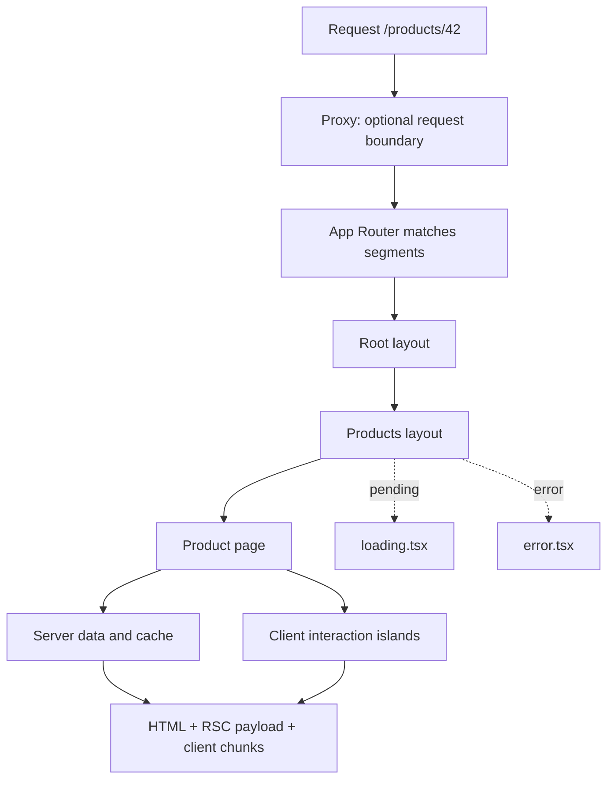
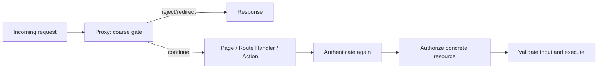
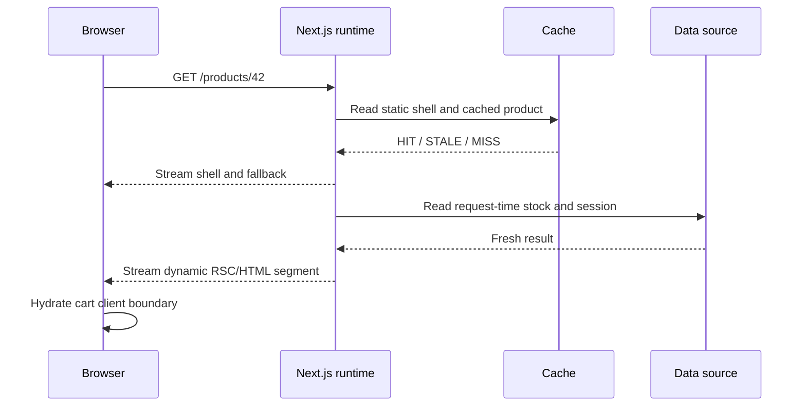
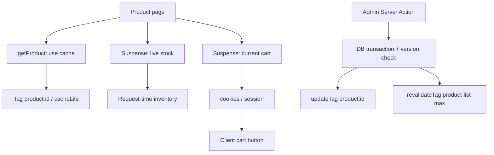

# Next.js App Router 工程实践：路由、缓存、边界与部署运行时

> Next.js 工程设计的难点不在于记住 `page.tsx`、`layout.tsx` 等文件名，而在于同时管理路由树、Server/Client Boundary、渲染时机、缓存新鲜度、错误隔离和部署运行时，并让这些决策在生产环境中可验证。

---

## 一、App Router 解决的不是“文件夹路由”一个问题

React 提供组件、Server Components、Suspense、Streaming 和 Hydration 等能力，但不会替应用决定：

- URL 如何映射到组件树；
- 哪些 Layout 在导航间保留；
- 数据在 Build Time、Request Time 还是 Revalidation 时读取；
- HTML、RSC Payload 和数据结果如何缓存；
- 请求写入口如何认证、授权和失效缓存；
- Loading、Not Found 和异常如何按路由段隔离；
- Node.js、容器、Serverless、Edge 或静态导出如何部署。

Next.js App Router 把这些问题组织在同一棵 Route Segment Tree 中：



这棵树不只是目录结构。它同时决定 UI 嵌套、Streaming Boundary、错误恢复范围、Metadata 合并、缓存行为和部署入口。

本文以 **Next.js 16.2.12、App Router 和 React Server Components** 为版本基线。以下能力属于 Next.js Framework 契约，不应写成 React 通用事实：

- Next.js 16 将 `middleware.ts` 弃用并重命名为 `proxy.ts`；
- Cache Components 需要配置 `cacheComponents: true`；
- `revalidateTag(tag, 'max')` 使用 Stale-While-Revalidate 语义；
- `updateTag()` 只能在 Server Action 中调用；
- `params`、`cookies()` 和 `headers()` 等 API 的同步/异步签名经历过版本变化；
- Route Handler、`fetch` 缓存默认值和 Route Segment Config 在 Next.js 14、15、16 间存在差异。

升级现有项目时，应以锁定版本的官方 Upgrade Guide 和构建输出为准，不能直接把本文的 Next.js 16 示例机械复制到旧版项目。

### 核心结论

1. App Router 的基本单位是 Route Segment；`layout.tsx`、`page.tsx`、`loading.tsx`、`error.tsx` 等特殊文件共同构成一棵服务端路由 UI 树。
2. Layout 在客户端导航间复用，适合稳定外壳和 Provider；需要每次导航重新挂载的边界应使用 `template.tsx` 或把状态下沉。
3. Route Handler 是 HTTP Endpoint，不是“给 Server Component 用的内部数据层”；同进程 Server Component 通常应直接调用共享业务函数，避免不必要的 HTTP 回环。
4. Next.js 16 使用 `proxy.ts` 表达应用前方的请求边界。Proxy 适合 Rewrite、Redirect、粗粒度门禁和 Header 处理，不应承载完整业务授权与重型数据访问。
5. Metadata 应使用静态 `metadata` 或 `generateMetadata()`，并与页面数据共享受控的数据函数，避免重复请求和不一致标题。
6. Static、Dynamic、Streaming、RSC 和 Hydration 是不同维度。动态内容可以在 Suspense 下流式返回，静态 Shell 也可以包含独立缓存的组件。
7. React `cache()`、Next Cache Components、旧版 Data Cache、Route/RSC 输出缓存、CDN Cache 和浏览器 Router Cache 生命周期不同，不能用“清缓存”概括。
8. `revalidatePath` 面向路由路径，`revalidateTag` 面向可接受短暂陈旧的数据，`updateTag` 面向 Server Action 的 Read-Your-Own-Writes。
9. `loading.tsx` 和 `error.tsx` 是路由边界，不会替代领域状态建模、Expected Error 返回值、日志和重试策略。
10. 部署选型必须同时验证 Runtime API、Streaming、共享缓存、失效传播、镜像/资产原子性和版本回滚，不能只看“能否启动”。

---

## 二、先区分 React 能力与 Next.js 能力

| 问题 | React 主要提供 | Next.js 主要提供 |
|---|---|---|
| UI 声明与更新 | Component、Hooks、Render/Commit | Route Segment 组织与构建集成 |
| Server Components | Server/Client Boundary、RSC Model | App Router、Bundler、Transport、Manifest |
| 服务端输出 | SSR、Streaming API | Route Rendering、Static Shell、Platform Cache |
| 异步 UI | Suspense、Error Boundary | `loading.tsx`、`error.tsx`、导航 Prefetch |
| 数据读取 | `fetch`、`cache()` 等基础能力 | Cache Components、Tag、Path Revalidation |
| 写操作 | Server Function 概念 | Server Action Transport、路由刷新与缓存 API |
| URL | 不提供 Router | File-system Routing、Link、Redirect、Rewrite |
| HTTP Endpoint | 不提供应用路由协议 | Route Handler、Proxy |
| 部署 | 不规定 | Node Server、Docker、Export、Adapter/Platform |

这一区分能避免两个常见错误：

- 把 Next.js 当前缓存默认值描述成 React 的固定语义；
- 看到 RSC、SSR 和 Streaming 同时出现，就认为它们是同一个过程。

一次首屏请求可能同时生成：

1. Server Components 的 RSC Payload；
2. 用于尽早显示的 HTML；
3. Client Components 对应的 JavaScript Chunk；
4. Metadata、Preload 和资源引用；
5. 后续 Hydration 所需的边界信息。

后续 Client Navigation 通常请求新的 RSC Payload，并复用已有 Layout 和 Client State。具体请求头、Payload 编码、Manifest 与 Router Cache 属于 Framework 版本实现，不应作为业务代码依赖。

---

## 三、App Router：目录是 URL 与 UI 的共同结构

下面是一个账户与商品系统的简化结构：

```text
app/
├── layout.tsx
├── global-error.tsx
├── not-found.tsx
├── (marketing)/
│   ├── layout.tsx
│   └── page.tsx
├── (shop)/
│   ├── layout.tsx
│   ├── loading.tsx
│   ├── error.tsx
│   └── products/
│       ├── page.tsx
│       └── [productId]/
│           ├── page.tsx
│           └── opengraph-image.tsx
├── account/
│   ├── layout.tsx
│   └── orders/[orderId]/page.tsx
└── api/
    └── webhooks/catalog/route.ts
proxy.ts
```

### 3.1 Segment、URL 与特殊文件

- 普通目录创建 URL Segment；
- `[productId]` 创建动态 Segment；
- `[...slug]` 创建 Catch-all Segment；
- `[[...slug]]` 创建 Optional Catch-all Segment；
- `(shop)` 是 Route Group，只参与组织和 Layout 划分，不进入 URL；
- `page.tsx` 让该 Segment 成为可访问页面；
- `route.ts` 创建 HTTP Handler；
- `layout.tsx`、`loading.tsx`、`error.tsx` 等为子树增加边界。

Next.js 16 中动态参数是 Promise：

```tsx
type ProductPageProps = {
  params: Promise<{ productId: string }>;
  searchParams: Promise<Record<string, string | string[] | undefined>>;
};

export default async function ProductPage({ params }: ProductPageProps) {
  const { productId } = await params;
  const product = await getPublicProduct(productId);

  if (product === null) {
    notFound();
  }

  return <ProductDetails product={product} />;
}
```

旧版 Next.js 中 `params` 曾是同步对象。升级时应运行官方 Codemod、重新生成类型并执行 `next build`，不要用宽泛的 `any` 掩盖迁移错误。

### 3.2 Route Group 不是安全边界

`(admin)`、`(authenticated)` 只改变目录组织或 Layout 选择，不会自动鉴权。用户仍可直接请求对应 URL、Route Handler 或 Server Action。

授权必须在读取/写入资源的位置完成：

```ts
export async function getOrderForViewer(orderId: string, viewerId: string) {
  return db.order.findFirst({
    where: {
      id: orderId,
      customerId: viewerId,
    },
    select: {
      id: true,
      status: true,
      totalAmount: true,
    },
  });
}
```

把 `viewerId` 与资源条件放进查询，可避免先读取其他用户订单，再在应用层判断所带来的越权暴露风险。

### 3.3 不要让 URL 语义依赖目录偶然结构

路由设计应先定义：

- 资源身份：`/products/[productId]`；
- 筛选状态：`/products?category=book&sort=price`；
- 可分享步骤：`/checkout/payment`；
- 私有状态：Session/Cookie，不放在可复制 URL 中；
- 重定向与 Canonical URL；
- Locale、Tenant 和实验参数是否进入 Cache Key。

文件系统只是实现方式，URL 仍是公开契约。修改 Route Group 通常不影响 URL，修改 Segment 名称则可能需要 Redirect、Sitemap 和 Canonical Metadata 迁移。

---

## 四、Layout、Template 与状态所有权

### 4.1 Root Layout 与 Nested Layout

Root Layout 必须输出 `<html>` 和 `<body>`：

```tsx
import type { Metadata } from 'next';

export const metadata: Metadata = {
  title: {
    default: 'Acme Store',
    template: '%s | Acme Store',
  },
  description: '可靠的商品目录与账户服务',
};

export default function RootLayout({
  children,
}: Readonly<{ children: React.ReactNode }>) {
  return (
    <html lang="zh-CN">
      <body>{children}</body>
    </html>
  );
}
```

Nested Layout 适合承载：

- 跨子页面稳定存在的导航和侧栏；
- 共享的 Server Component 外壳；
- 生命周期应覆盖整个子路由的 Client Provider；
- Segment 级 Metadata、Loading 和 Error Boundary。

客户端导航时，共享 Layout 通常被复用而不重新挂载，因此其中的 Client State 可以保留。这是能力也是约束：

- 不要假设每次切换子页面都会重新执行 Layout Client Effect；
- Layout 不应通过读取 `searchParams` 或当前 Pathname 来维护容易陈旧的派生状态；
- 需要 URL 感知的交互组件，可在叶子 Client Component 中使用 Router Hook；
- 需要每次导航重建状态时，使用 `template.tsx` 或将 `key`/状态边界放到更低层。

### 4.2 `layout.tsx` 与 `template.tsx` 的边界

| 文件 | 客户端导航时的典型行为 | 适用场景 |
|---|---|---|
| `layout.tsx` | 共享实例被复用，Client State 保留 | 导航、Shell、长生命周期 Provider |
| `template.tsx` | 为子 Segment 创建新实例，Effect 重新运行 | 页面切换动画、需要重置的表单/埋点边界 |

不要为了“确保刷新”而把所有 Layout 改成 Template。重新挂载会丢失状态、重跑 Effect，并可能增加客户端工作。

### 4.3 Provider 应放多高

把顶层 Layout 整体标记为 `'use client'`，会把其静态 Import 的大量模块拉入 Client Graph。更合理的方式是保留 Server Layout，只把 Provider 做成较小 Client Boundary：

```tsx
// app/providers.tsx
'use client';

import { QueryClientProvider } from '@tanstack/react-query';

export function Providers({ children }: { children: React.ReactNode }) {
  return (
    <QueryClientProvider client={getBrowserQueryClient()}>
      {children}
    </QueryClientProvider>
  );
}
```

Provider 的高度由状态生命周期决定，而不是由“全局方便”决定。账户草稿状态不应默认覆盖营销站点，商品筛选状态优先放 URL，Server State 则由服务端缓存或 Query Cache 管理。

---

## 五、Route Handler：先把它当成真正的 HTTP API

`route.ts` 使用 Web `Request`/`Response` API，可实现 `GET`、`POST`、`PUT`、`PATCH`、`DELETE`、`HEAD` 和 `OPTIONS`。

```ts
// app/api/webhooks/catalog/route.ts
import { revalidateTag } from 'next/cache';
import { timingSafeEqual } from 'node:crypto';

export async function POST(request: Request) {
  const rawBody = await request.text();
  const signature = request.headers.get('x-catalog-signature');

  if (!signature || !verifySignature(rawBody, signature, timingSafeEqual)) {
    return Response.json({ error: 'invalid signature' }, { status: 401 });
  }

  let event: CatalogEvent;
  try {
    event = parseCatalogEvent(JSON.parse(rawBody));
  } catch {
    return Response.json({ error: 'invalid payload' }, { status: 400 });
  }

  await applyCatalogEvent(event);
  revalidateTag(`product:${event.productId}`, { expire: 0 });
  revalidateTag('product-list', 'max');

  return new Response(null, { status: 204 });
}
```

这个入口至少处理了：

- 对原始 Body 验签，避免 JSON 重序列化破坏签名；
- 明确的认证失败与输入错误；
- Schema 校验，而不是类型断言；
- 写入后的精确缓存失效；
- 可重试 Webhook 所需的幂等事件处理。

生产实现还应限制 Body Size、Content-Type、执行时间和请求频率，并记录不含 Secret/PII 的 Audit Event。

### 5.1 Server Component 不必绕 HTTP 调自己

错误做法：

```tsx
// 不必要的同应用 HTTP 回环
const response = await fetch('https://example.com/api/products');
```

如果数据只供同一 Next.js 应用的 Server Component 使用，应抽取共享业务函数：

```ts
// lib/products.server.ts
export async function listProducts(filter: ProductFilter) {
  return productRepository.list(filter);
}
```

然后由 Page 和 Route Handler 分别调用。这样减少 DNS/TLS/HTTP 开销，也不会把认证 Header、错误映射和缓存语义隐藏在内部回环中。

只有当 Endpoint 本身是跨客户端公共契约、需要独立网关治理，或必须穿过真实网络边界时，才值得让服务端通过 HTTP 调用它。

### 5.2 Route Handler 与 Page 不能占用同一 Segment

`app/products/page.tsx` 与 `app/products/route.ts` 会竞争同一 URL，不能作为同一 Segment 的两种表示随意共存。通常把 HTTP API 放到 `/api/...`、Webhook 专用路径或独立资源 URL。

### 5.3 GET 是否缓存必须看版本和配置

不要记忆“GET 一定缓存”或“Route Handler 永不缓存”这类口号：

- Next.js 15 起，旧模型下 `GET` Route Handler 不再默认缓存；
- Next.js 16 启用 Cache Components 后，`GET` Route Handler 与 Page 采用相同的 Prerendering 模型；
- Cookie、Header、动态参数、`use cache`、`connection()` 与平台 Cache Header 会继续影响实际行为。

应通过 `next build` 输出、响应 Header、访问日志和数据源调用次数验证，而不是根据 HTTP Method 猜测。

---

## 六、Middleware 到 Next.js 16 Proxy

### 6.1 为什么改名

Next.js 16 将 `middleware.ts` 弃用并重命名为 `proxy.ts`，导出函数也从 `middleware` 改为 `proxy`。官方意图是强调它位于应用前方的网络边界，而不是 Express 风格、可无限堆叠的应用中间件。

```ts
// proxy.ts
import { NextResponse, type NextRequest } from 'next/server';

export function proxy(request: NextRequest) {
  const requestId = request.headers.get('x-request-id') ?? crypto.randomUUID();
  const requestHeaders = new Headers(request.headers);
  requestHeaders.set('x-request-id', requestId);

  if (request.nextUrl.pathname === '/legacy-products') {
    return NextResponse.redirect(new URL('/products', request.url));
  }

  return NextResponse.next({
    request: { headers: requestHeaders },
  });
}

export const config = {
  matcher: ['/((?!api/health|_next/static|_next/image|favicon.ico).*)'],
};
```

迁移可使用官方 Codemod：

```bash
npx @next/codemod@canary middleware-to-proxy .
```

Next.js 16 的 Proxy 默认使用 Node.js Runtime，且不能通过 Route Segment 的 `runtime` 配置切换。旧版 Middleware 的 Runtime 能力不同，升级前要核对依赖兼容性和平台部署方式。

### 6.2 Proxy 适合做什么

- 基于 URL/Header/Cookie 的 Redirect 或 Rewrite；
- Locale、Tenant、A/B 测试的请求路由；
- 粗粒度认证门禁；
- 安全 Header、Request ID 和简单观测信息；
- 在请求进入 Route Tree 前执行的轻量规则。

### 6.3 Proxy 不应做什么

- 每个请求都执行慢数据库查询；
- 代替 Route Handler/Server Action 的最终授权；
- 承载复杂业务事务；
- 假设用户无法绕过 Client Navigation；
- 把大对象塞入 Header，导致 `431 Request Header Fields Too Large`；
- 在 Proxy 中调用只允许 Server Action/Route Handler 的缓存 API。

Proxy 的“已登录”判断最多是早期门禁。真正读取订单时仍要校验 Session、Tenant 和资源所有权；真正写入时仍要验证输入、CSRF/Origin、幂等与权限。



---

## 七、Metadata：它是路由数据的一部分

Metadata 可以静态声明，也可以通过 `generateMetadata()` 动态生成。两者只能在 Server Component 中使用，同一 Segment 不能同时导出静态 `metadata` 和 `generateMetadata`。

```tsx
import type { Metadata } from 'next';

type ProductPageProps = {
  params: Promise<{ productId: string }>;
};

export async function generateMetadata({
  params,
}: ProductPageProps): Promise<Metadata> {
  const { productId } = await params;
  const product = await getPublicProduct(productId);

  if (product === null) {
    return { title: '商品不存在', robots: { index: false } };
  }

  return {
    title: product.name,
    description: product.summary,
    alternates: { canonical: `/products/${product.id}` },
    openGraph: {
      title: product.name,
      description: product.summary,
      images: [product.ogImageUrl],
    },
  };
}
```

工程上需要注意：

1. Metadata 与 Page 应调用同一个受控数据函数，避免标题与正文读取不同 Snapshot；
2. 数据函数要去重或缓存，不能因为生成标题就稳定增加一次数据库查询；
3. 用户私有数据、内部字段、访问令牌不能进入 Title、Open Graph、Structured Data 或错误描述；
4. Canonical URL、Locale Alternate、Sitemap 和 Redirect 必须保持一致；
5. 动态 Metadata 的 Streaming/阻塞行为会受 Bot 类型和 Next.js 版本影响，应使用目标爬虫实测；
6. `notFound()`、`redirect()` 可以影响 Metadata 流程，但不要把业务授权失败伪装成公共 SEO 内容。

图片、`robots.txt`、`sitemap.xml`、Manifest 和 Favicon 也可使用 Metadata File Convention。它们是部署产物和公开协议，应该进入构建测试，而不是只在浏览器标签页中目测。

---

## 八、Static、Dynamic、Streaming 与 Hydration 不要混为一谈

### 8.1 四个维度

| 维度 | 关键问题 |
|---|---|
| Static / Dynamic | 内容在 Build/Revalidation 还是 Request 时计算 |
| Cached / Uncached | 计算结果是否跨请求复用，何时过期 |
| Streaming / Blocking | 响应是逐步发送还是等待全部完成 |
| Server / Client Component | 组件实现属于哪张 Module Graph，是否进入客户端 |

一个页面可以同时具备：

- 静态生成的导航 Shell；
- 每小时重验证的商品列表；
- 每次请求读取 Cookie 的用户问候；
- 通过 Suspense 流式返回的库存；
- 需要 Hydration 的“加入购物车”按钮。



### 8.2 Dynamic API 不等于 CSR

读取 `cookies()`、`headers()`、请求参数或调用 `connection()`，表示该工作需要请求上下文。它仍可在服务器执行并输出 HTML/RSC，不会自动变成浏览器 CSR。

同样，使用 `'use client'` 的组件也可能先在服务器预渲染 HTML，再在浏览器 Hydrate。它表达 Client Module Boundary，不是渲染时机开关。

### 8.3 Suspense 不会自动让同步内容动态化

`<Suspense>` 的职责是为会 Suspend 的子树提供 Fallback 和 Streaming Boundary。一个只做同步计算的组件即使包在 Suspense 中，也可能在 Prerender 阶段直接完成。

启用 Cache Components 后，无法在预渲染期间完成的请求时数据，应放在 Suspense 下；可共享结果则用 `use cache` 明确缓存。缺少边界时，开发或构建阶段会报告阻塞路由问题。

---

## 九、缓存模型：先给每一层命名

“页面还是旧的，清一下缓存”不是可执行的诊断。至少要区分：

| 层次 | 典型内容 | 生命周期/失效方式 |
|---|---|---|
| React `cache()` | 一次 Server Render 中的数据函数结果 | 主要用于 Request 内 Memoization |
| Cache Components | `use cache` 函数、组件或 Route 输出 | `cacheLife`、`cacheTag`、构建 ID、平台 Handler |
| 旧 Next Data Cache | Cached `fetch`、`unstable_cache` | TTL、Tag、Path、平台 Incremental Cache |
| Route/RSC 输出 | HTML 与 RSC Payload | Prerender、ISR、Path/Tag Revalidation |
| CDN/Reverse Proxy | HTTP Response | Cache-Control、Surrogate Key、平台 Purge |
| Client Router Cache | Prefetch/已访问 Segment 的 RSC 数据 | 导航、刷新、失效消息、会话生命周期 |
| 浏览器 HTTP Cache | JS、CSS、图片、HTTP Response | URL、Header、重新验证、资产 Hash |

它们可能联动，但不是同一个 Map。尤其要避免：

- 用 React `cache()` 期待跨部署长期持久化；
- 只失效数据库 Query，却忘记 Route/RSC 或 CDN 输出；
- 把用户私有 HTML 放进共享 CDN；
- Mutation 成功后只更新 Client State，Back/Refresh 又读到旧 Server Snapshot；
- 多实例各自使用内存缓存，却假设 Tag 失效瞬间全局传播。

### 9.1 Next.js 16 Cache Components

需要显式启用：

```ts
// next.config.ts
import type { NextConfig } from 'next';

const nextConfig: NextConfig = {
  cacheComponents: true,
};

export default nextConfig;
```

然后在函数或组件中使用 `'use cache'`：

```ts
import { cacheLife, cacheTag } from 'next/cache';

export async function getProduct(productId: string) {
  'use cache';
  cacheLife('minutes');
  cacheTag(`product:${productId}`);

  const product = await productRepository.findPublicById(productId);
  return product === null ? null : toPublicProduct(product);
}
```

Cache Key 会考虑 Build ID、函数身份、可序列化参数和闭包捕获值。工程含义是：

- 不要把无关的高基数字段传入缓存函数；
- 不要把 Class Instance、函数、URL Instance 等不可支持值作为参数；
- Tenant、Locale、权限范围若影响结果，必须进入 Key 或禁止共享缓存；
- `cookies()`、`headers()` 等 Runtime API 优先在缓存边界外读取，再传入必要值；
- 返回值进入 RSC 序列化边界时，仍应是最小公开 View Model。

`use cache` 默认运行时存储与平台相关。单进程内存能工作，不代表 Serverless 实例间持久共享；需要跨实例耐久缓存时，要评估平台提供的 `use cache: remote`/Cache Handler、延迟、费用和一致性。

> Next.js 16 中 Cache Components 不支持 `runtime: 'edge'`。如果某 Route 依赖 Cache Components，应使用默认 Node.js Runtime，或重新设计缓存与部署边界。

### 9.2 旧缓存模型仍然存在于大量项目

未启用 Cache Components 的项目可能使用：

```ts
await fetch(url, {
  cache: 'force-cache',
  next: {
    revalidate: 300,
    tags: ['product-list'],
  },
});
```

也可能使用 `unstable_cache`、`dynamic`、`revalidate` 等 Route Segment Config。Next.js 15 改变了若干默认缓存行为，Next.js 16 又提供 Cache Components 迁移路径。

迁移策略应是：

1. 先列出每个数据源的 Freshness 和共享范围；
2. 记录现有 `fetch`、`unstable_cache`、Route Config 和 CDN Header；
3. 用真实流量路径验证 HIT/MISS/STALE；
4. 分 Route 引入 Cache Components；
5. 验证 HTML 与 RSC Payload 同步失效；
6. 删除已被替代的旧配置，避免双重 TTL 难以推理。

不要同时依赖多层隐式默认值。Cache Policy 应能从代码、配置和平台控制台中明确追踪。

---

## 十、Revalidation：Path、Tag 与 Read-Your-Own-Writes

### 10.1 三类失效语义

| API | 目标 | 主要场景 | 用户可见语义 |
|---|---|---|---|
| `revalidatePath(path)` | Page/Layout Path | 某路由输出应重算 | 与路径关联内容重新验证 |
| `revalidateTag(tag, 'max')` | 共享数据 Tag | 目录、文章等允许短暂旧值 | 先返回 Stale，再后台刷新 |
| `updateTag(tag)` | 共享数据 Tag | Server Action 写后立刻读 | 立即过期，下次读取等待 Fresh |

Next.js 16 推荐 `revalidateTag(tag, 'max')`。单参数 `revalidateTag(tag)` 的立即过期形式已弃用；需要 Server Action 中的立即一致性时用 `updateTag`，需要外部 Webhook 立即过期时可在 Route Handler 中使用 `revalidateTag(tag, { expire: 0 })`。

### 10.2 Server Action 的立即可见更新

```ts
'use server';

import { revalidateTag, updateTag } from 'next/cache';
import { redirect } from 'next/navigation';

export async function updateProduct(input: UpdateProductInput) {
  const viewer = await requireUser();
  const command = parseUpdateProduct(input);

  await productService.update({
    actorId: viewer.id,
    tenantId: viewer.tenantId,
    productId: command.productId,
    expectedVersion: command.expectedVersion,
    patch: command.patch,
  });

  updateTag(`product:${command.productId}`);
  revalidateTag('product-list', 'max');
  redirect(`/products/${command.productId}`);
}
```

`updateTag` 只能在 Server Action 中调用，适合用户完成写入后立即看到自己的修改。它不替代：

- 数据库事务和唯一约束；
- Optimistic Concurrency Control；
- Idempotency Key；
- Client Optimistic UI 的回滚；
- 外部搜索索引、消息队列和 CDN 的一致性治理。

### 10.3 Tag 设计不是越细越好

可以使用：

- `product-list`：所有目录页共享；
- `product:42`：商品详情；
- `category:book`：某分类列表；
- `tenant:acme:catalog`：租户级目录。

但要控制：

- Tag 长度和大小写一致性；
- 单次写入的 Fan-out；
- 高基数 Tag 的存储成本；
- 用户 ID/敏感信息是否泄露到平台日志；
- 多实例失效传播延迟；
- 相关 Path、RSC、CDN 是否也需要同步失效。

缓存失效是数据一致性协议，应为每个 Mutation 写出“写了什么、失效什么、允许旧多久、失败如何补偿”。

---

## 十一、Loading、Error、Not Found 与恢复边界

### 11.1 `loading.tsx`：Segment 级即时反馈

`loading.tsx` 基于 Suspense 为对应 Segment 提供 Fallback，可让共享 Layout 保持可交互，并在 Page 内容等待时尽早显示稳定骨架。

```tsx
// app/(shop)/products/loading.tsx
export default function ProductsLoading() {
  return (
    <section aria-busy="true" aria-label="正在加载商品">
      <h1>商品</h1>
      <ProductGridSkeleton count={8} />
    </section>
  );
}
```

好的 Loading UI 应：

- 与最终布局尺寸接近，减少 CLS；
- 保留真实页面的标题与导航语义；
- 不伪造不可用按钮；
- 对长请求提供取消、返回或重试路径；
- 不把多个独立慢数据绑在一个巨大边界中。

### 11.2 `error.tsx`：Unexpected Error Boundary

`error.tsx` 必须是 Client Component，因为它需要接收错误并提供 `reset()`：

```tsx
'use client';

import { useEffect } from 'react';

export default function ProductsError({
  error,
  reset,
}: {
  error: Error & { digest?: string };
  reset: () => void;
}) {
  useEffect(() => {
    reportRouteError({
      digest: error.digest,
      message: error.message,
    });
  }, [error]);

  return (
    <section role="alert">
      <h2>商品暂时无法加载</h2>
      <button type="button" onClick={reset}>
        重试
      </button>
    </section>
  );
}
```

边界注意事项：

- `error.tsx` 捕获其子 Segment 中未处理异常，不会捕获同层 `layout.tsx` 自身抛出的错误；
- `global-error.tsx` 处理 Root Layout 级灾难性错误，并需自己输出 `<html>`、`<body>`；
- `reset()` 会尝试重新渲染边界，不保证修复数据库宕机、错误代码或已损坏 Session；
- 生产环境不要把 Stack、SQL、Token 或内部错误对象返回浏览器；
- Error Boundary 不能捕获所有事件回调、后台任务或独立 Route Handler 错误，入口自身仍要处理。

### 11.3 Expected Error 不要一律 Throw

“库存不足”“优惠券已失效”“版本冲突”是业务可预期结果，应使用显式返回值：

```ts
type UpdatePriceResult =
  | { ok: true }
  | { ok: false; code: 'FORBIDDEN' | 'VERSION_CONFLICT'; message: string };
```

数据库连接失败、代码不变量破坏等 Unexpected Error 才交给 Error Boundary 和日志系统。这样 UI 可以给出准确恢复操作，也避免错误监控被业务分支淹没。

### 11.4 `not-found.tsx` 与授权失败不同

`notFound()` 可终止当前 Segment Render 并显示最近的 `not-found.tsx`。出于防枚举策略，私有资源不存在与无权限有时都可表现为 404，但服务端日志、审计和内部错误码仍应区分。

不要把 401、403、404 和 500 全部映射成“页面不存在”，否则会破坏登录恢复、监控分级和运维诊断。

---

## 十二、一个完整商品页如何组合这些能力

需求：商品基础信息允许 10 分钟旧值；库存必须按请求读取；用户购物车来自 Session；管理员改价后必须立即看到新价格；目录用户可短暂看到旧列表。

```tsx
// app/(shop)/products/[productId]/page.tsx
import { Suspense } from 'react';

export default async function ProductPage({
  params,
}: {
  params: Promise<{ productId: string }>;
}) {
  const { productId } = await params;
  const product = await getProduct(productId);

  if (product === null) notFound();

  return (
    <main>
      <ProductSummary product={product} />

      <Suspense fallback={<StockSkeleton />}>
        <LiveStock productId={productId} />
      </Suspense>

      <Suspense fallback={<CartButtonSkeleton />}>
        <CartButtonForCurrentUser productId={productId} />
      </Suspense>
    </main>
  );
}
```

数据流如下：



这里的边界分别表达：

- 商品公开信息可跨用户共享缓存；
- 库存是请求时 Fresh Data，不因为商品详情缓存而缓存；
- Session 在动态边界读取，不能混入公共 Cache Key；
- Client Button 只接收最小 `productId` 与可交互状态；
- 管理员自己的详情读取使用 `updateTag` 保证下一次获取 Fresh；
- 普通目录通过 `revalidateTag(..., 'max')` 平滑后台刷新。

这是比“整页 SSR”或“整页静态化”更准确的工程模型：按数据新鲜度、安全边界和交互所有权拆分，而不是给整个页面贴一个标签。

---

## 十三、Deployment Runtime：能运行不等于行为等价

### 13.1 Node.js Runtime

App Router 的默认 Runtime 是 Node.js，兼容多数数据库驱动、文件系统、原生扩展和 Server SDK。Next.js 16 的 Cache Components 也要求 Node.js Runtime。

适合：

- 直接数据库访问；
- 长连接池与成熟 APM；
- 自托管容器或 Node Server；
- 依赖 Node API 的图片、文件与加密库；
- 需要完整 Next.js Feature Fidelity 的基准部署。

### 13.2 Edge Runtime

Route Segment 可声明：

```ts
export const runtime = 'edge';
```

但 Edge Runtime 使用受限 Web API 集合，并非完整 Node.js。它可能降低用户到计算节点的 RTT，也可能因为数据库仍位于单一区域而增加跨区域查询延迟。

选 Edge 前需要验证：

- ORM/Database Driver 是否支持；
- TCP、文件系统、原生模块和 Node API 是否可用；
- Region 与数据源、身份服务的拓扑；
- Cold Start、CPU/Memory/Execution Limit；
- 日志、Tracing 和 Error Source Map；
- Cache Components 不支持 Edge Runtime 这一版本限制。

“离用户近”不等于“离数据近”，Edge 也不保证绝对更快。

### 13.3 Node Server、Docker、Serverless 与 Static Export

| 方式 | 优势 | 主要代价/限制 |
|---|---|---|
| Node Server | Next.js 功能完整、行为直接 | 进程扩缩容、缓存与运维自理 |
| Docker | 环境可复制、适合容器平台 | 镜像、冷启动、共享状态与滚动发布 |
| Serverless/Adapter | 自动扩缩容、平台集成 | 冷启动、执行限制、缓存与兼容性依平台 |
| Static Export | 只需静态 Web Server/CDN | 不支持需要服务器的动态能力 |

当前官方文档将 Node Server 与 Docker 视为支持全部 Next.js 功能的部署方式；Adapter 和第三方平台的功能覆盖不同，应查看兼容测试和平台文档。Static Export 不能承载 Server Action、Request-time Rendering、Proxy、运行时 Revalidation 等服务器能力。

### 13.4 多实例部署的隐藏协议

单实例工作正常，不代表多实例正确：

- 实例 A 的 `revalidateTag` 是否通知实例 B；
- HTML 与 RSC Payload 是否来自同一版本和 Snapshot；
- ISR/Cache Components 是否使用共享 Cache Handler；
- Rolling Deploy 期间旧页面是否引用已删除的 Client Chunk；
- Build ID、Server Action、Manifest 和静态资产是否原子发布；
- Streaming 是否被 Ingress、CDN 或压缩代理缓冲；
- `after()` 等后台工作是否有 Graceful Shutdown 时间。

平台可“功能正确”但没有最佳性能。例如没有 Edge Stitching 时 PPR 仍可在 Origin 正确工作，只是静态 Shell 不一定以 CDN 延迟送达。部署评估要区分 Functional Fidelity 与 Performance Fidelity。

---

## 十四、常见误区与修复

### 14.1 “用了 App Router 就自动获得最佳性能”

错误原因：Client Boundary 过高、数据串行、缓存 Key 错误、Streaming 被缓冲、图片和字体过大，都会抵消 Framework 能力。

修复：测量 HTML/RSC/JS、TTFB/LCP/INP、Server CPU、Cache Hit 和数据 Waterfall，再决定优化点。

### 14.2 “Layout 每次导航都会重新执行并拿到最新 URL”

错误原因：共享 Layout 在客户端导航间复用，读取易变状态会陈旧。

修复：URL 状态放 Page/Search Params 或叶子 Client Router Hook；需重挂载时选择 Template，并明确状态丢失代价。

### 14.3 “Proxy 已鉴权，Server Action 不需要再检查”

错误原因：攻击者可直接构造 Action/Handler 请求，粗粒度 Cookie 存在不代表拥有目标资源权限。

修复：每个读写入口重新认证，并在数据库查询/事务中验证 Tenant、Owner、Role 和资源版本。

### 14.4 “Server Component 调 `/api` 更符合分层”

错误原因：在同应用内部增加 HTTP 回环、序列化和错误映射，并可能形成错误缓存层。

修复：抽取 Server-only Domain Function；Page、Action 和 Route Handler 复用业务层，不复用 Transport。

### 14.5 “`revalidateTag` 后所有用户立刻看到新内容”

错误原因：`revalidateTag(tag, 'max')` 是 Stale-While-Revalidate，下一次访问可能先得到 Stale；多实例、CDN 和 Router Cache 还有传播边界。

修复：对写入者 Read-Your-Own-Writes 使用 `updateTag`；Webhook 要立即过期时使用 `{ expire: 0 }`；对外说明允许的 Stale Window。

### 14.6 “Edge Runtime 一定降低 TTFB”

错误原因：计算接近用户，但数据库/内部 API 可能远离 Edge，且依赖不兼容会增加替代成本。

修复：按区域测 Server Timing、数据库 RTT、Cold Start 和错误率，比较 Node Region 与 Edge 的真实分位数。

### 14.7 “Error Boundary 会捕获所有错误”

错误原因：同层 Layout、Route Handler、Event Handler、后台任务和部分异步工作不在同一 Boundary 范围。

修复：为每类入口提供自己的错误协议、日志和恢复策略；用 Boundary 隔离 Render Failure，而不是代替全链路异常治理。

### 14.8 “`use cache` 可以缓存任何用户结果”

错误原因：Cookie、Tenant、Locale 或权限未进入 Key 时可能发生跨用户数据泄露；高基数用户缓存也可能失控。

修复：公共数据才优先共享缓存；私有值读取放在 Runtime Boundary，必须缓存时显式设计 Key、生命周期、合规和清除协议。

---

## 十五、测试、性能与发布验证

### 15.1 构建与类型

至少执行：

```bash
pnpm lint
pnpm test
pnpm next build
```

检查：

- Route 是否被 Prerender、Dynamic Render 或混合处理；
- `params`、Route Handler Context 和 Metadata 类型是否正确；
- Server-only Module 是否误入 Client Graph；
- 未缓存异步数据是否缺少 Suspense；
- Edge Route 是否引用 Node-only API；
- Static Export 是否误用服务器特性。

### 15.2 路由与导航矩阵

- Hard Navigation、Client Navigation、Refresh；
- Back/Forward 和 Prefetch；
- Dynamic Params、Search Params、Route Group；
- 登录前后、Session 过期、权限撤销；
- `notFound()`、Redirect、Rewrite；
- Chunk 404、旧标签页跨版本导航；
- JavaScript 慢加载时的 Loading 和可访问性。

### 15.3 Cache/Revalidation 矩阵

1. Cold Cache 首次请求；
2. Warm Cache 命中；
3. TTL 进入 Stale；
4. `revalidateTag(..., 'max')` 后首次和第二次访问；
5. Server Action `updateTag` 后立即 Redirect；
6. `revalidatePath` 对 Page/Layout 的影响；
7. 多实例间失效传播；
8. CDN HIT 与 Origin HIT 的区分；
9. 不同 User/Tenant/Locale 是否串缓存；
10. 数据源失败时是否保留可接受的 Stale 值。

验证不应只看 UI。还要观察数据库 Query Count、Cache Handler 日志、响应 Header、RSC 请求、Server Timing 和平台 Invalidation Event。

### 15.4 安全验证

- 绕过 UI 直接调用 Route Handler/Server Action；
- 篡改 Product ID、Tenant ID、价格和 Hidden Field；
- 重复提交与并发版本冲突；
- Webhook 签名、时间窗与重放攻击；
- CSRF/Origin、CORS、Rate Limit；
- HTML、RSC Payload、Metadata、日志中是否泄露 Secret/PII；
- Public Cache 是否错误缓存带 Cookie/Authorization 的响应；
- Proxy Matcher 是否遗漏数据请求或特殊路径。

### 15.5 性能观测

| 层次 | 主要指标 |
|---|---|
| Server | Route Match、Data Fetch、Render、Serialization、CPU/Memory |
| Cache | HIT/MISS/STALE、Revalidation Duration、Propagation Delay |
| Network | HTML、RSC Payload、Client JS、Chunk Waterfall、Streaming Flush |
| Browser | Parse/Execute、Hydration、Long Task、Memory |
| User | TTFB、FCP、LCP、CLS、INP、Navigation Ready、Error Rate |

性能实验必须使用生产构建、目标设备/区域、相同 Cache 状态和足够样本。比较 P50/P75/P95，而不是用一次本地刷新证明方案更快。

### 15.6 部署与回滚

- 对 Next.js、React、React DOM 和 Adapter 锁版本；
- Build ID、Server Bundle、RSC Manifest、Client Assets 原子发布；
- 保留旧 Hash Asset，覆盖长会话与滚动发布窗口；
- 预热关键 Route 但不要制造回源风暴；
- 验证 Streaming 未被代理缓冲；
- 多实例使用共享缓存或接受并记录不一致窗口；
- Canary 同时覆盖 Hard/Soft Navigation、Action 和 Revalidation；
- 回滚时确认数据库 Schema、Cache Key 和 Server Action 协议兼容。

---

## 十六、Next.js 工程检查清单

### 路由与边界

- URL 是否表达稳定资源与可分享状态；
- Layout、Template、Page 的生命周期是否匹配状态所有权；
- Route Group 是否只用于组织，而没有被误当作授权；
- Client Boundary 是否足够小；
- Loading/Error/Not Found 是否位于正确 Segment。

### 数据与缓存

- 每个数据源的 Freshness、Scope、Key、TTL、Tag 是否明确；
- Public、Tenant、User Private Cache 是否隔离；
- Metadata 与 Page 是否读取同一受控 Snapshot；
- Mutation 是否定义 Tag/Path/Client State 的同步策略；
- 多实例与 CDN 是否有可观测的失效传播。

### API 与安全

- Route Handler/Action 是否重新认证、授权和校验；
- Proxy 是否只承担轻量早期规则；
- Webhook 是否验签、防重放和幂等；
- Expected Error 与 Unexpected Error 是否区分；
- 响应、RSC、Metadata 和日志是否移除 Secret/PII。

### Runtime 与部署

- Node/Edge API、数据库驱动和原生依赖是否兼容；
- Cache Components Route 是否避免 Edge Runtime；
- Platform 是否支持 Streaming 与所需 Cache Handler；
- 资产、Manifest 和 Server 是否版本一致；
- Canary、Rollback 和旧标签页是否回归。

---

## 十七、总结

Next.js App Router 把 React 的组件模型扩展成一套完整的 Web 应用执行模型：

1. Route Segment Tree 同时组织 URL、Layout、Loading、Error、Metadata 与服务端数据边界。
2. Layout 适合稳定外壳和长生命周期 Provider；Template 用于需要随导航重建的子树。
3. Route Handler 是完整 HTTP Endpoint，必须处理认证、授权、校验、错误、幂等和缓存，而不是内部数据函数的默认包装。
4. Next.js 16 的 Proxy 是应用前方的轻量请求边界，不能替代资源级授权和业务事务。
5. Static/Dynamic、Cached/Uncached、Streaming/Blocking 与 Server/Client Component 是四组独立决策。
6. Cache Components 使用 `use cache`、`cacheLife` 和 `cacheTag` 明确函数/组件级缓存，但需要正确的 Key、Runtime 和平台存储。
7. `revalidatePath`、`revalidateTag` 与 `updateTag` 分别解决路径重算、允许 Stale 的共享刷新和写后立即可见。
8. Loading/Error Boundary 提供路由级隔离，仍需领域错误、日志、重试和安全响应协议。
9. Node、Edge、Serverless、Docker 和 Static Export 的 API、缓存、Streaming 与运维成本不同，不能只比较部署名称。
10. 最终正确性要通过 Build、路由矩阵、缓存失效、安全攻击面、生产性能和滚动发布共同证明。

真正需要记住的是：Next.js 的价值不是替工程团队消除边界，而是让路由、执行、缓存和恢复边界可以被明确表达。只有当这些边界拥有清晰的数据契约、生命周期、失效策略和部署验证时，App Router 才会从“目录约定”变成可靠的生产架构。

---

## 问答复盘

### Q1：App Router 与 React Server Components 是同一个能力吗？

**答：** 不是。RSC 是 React 的 Server/Client Component 模型；App Router 是 Next.js 对路由、构建、传输、缓存、Metadata 和部署的 Framework 集成。只使用 React 指令不会自动获得 App Router。

### Q2：为什么 Layout 中的 Client State 会在子页面导航后保留？

**答：** 共享 Layout 在 Client Navigation 中通常被复用而不重新挂载。需要每次导航重置的状态应下沉到 Page/子组件，或使用 `template.tsx`，并接受重新运行 Effect 和丢失状态的代价。

### Q3：Server Component 获取数据时，应该调用本应用的 Route Handler 吗？

**答：** 通常不应该。同进程代码应直接调用共享的 Server-only 业务函数，避免 HTTP 回环。Route Handler 适合真实 HTTP 客户端和跨系统契约，业务层可以被两者复用。

### Q4：Next.js 16 的 Proxy 与旧 Middleware 有什么关键差异？

**答：** `middleware.ts` 已弃用并重命名为 `proxy.ts`，导出改为 `proxy`，默认使用 Node.js Runtime。它被定位为应用前方的轻量网络边界，仍不应承担最终授权和复杂业务逻辑。

### Q5：动态渲染是否意味着页面退化为 CSR？

**答：** 不意味着。动态工作可以在请求时由服务器执行并流式返回 HTML/RSC；CSR 描述主要 UI 在浏览器创建。动态 API、Streaming、Client Component 和 Hydration 是不同维度。

### Q6：React `cache()` 与 Next.js `use cache` 的核心区别是什么？

**答：** React `cache()` 主要用于 Server Render Request 内的计算复用；Next.js `use cache` 属于 Cache Components，可跨请求复用并结合 `cacheLife`、`cacheTag` 和平台 Handler。二者的生命周期和失效协议不同。

### Q7：`revalidateTag(tag, 'max')` 与 `updateTag(tag)` 如何选择？

**答：** 目录、文章等允许短暂陈旧时使用前者，它先返回 Stale 再后台刷新；Server Action 写入后必须立即看到新值时使用后者，它立即过期并让下一次读取等待 Fresh。`updateTag` 不能在 Route Handler 中调用。

### Q8：为什么通过 Proxy 检查 Session 后，Page/Action 还要再次授权？

**答：** Session 存在只证明可能已登录，不证明拥有具体订单、商品或租户权限。攻击者也可直接构造请求。资源读取和写入入口必须重新验证身份、权限、输入与资源版本。

### Q9：使用 Edge Runtime 一定比 Node.js 更快吗？

**答：** 不一定。Edge 可能更靠近用户，却更远离数据库和内部 API，还存在 Node API、驱动和执行限制。应测量目标区域的 TTFB、数据源 RTT、Cold Start 和错误率；Next.js 16 Cache Components 也不支持 Edge Runtime。

### Q10：如何验证一次商品改价在所有页面都正确生效？

**答：** 先验证数据库事务和版本冲突，再检查详情 Tag、列表 Tag/Path、RSC Payload、CDN 与多实例传播；分别测试管理员写后立即读取、普通用户 Stale-While-Revalidate、Refresh、Client Navigation 和旧标签页，不能只观察提交后的当前组件状态。

---

## 延伸知识

- React Server Components：Server/Client Boundary、Flight Payload 与 Server Action；
- React Hydration：Server HTML、Selective Hydration 与 Mismatch；
- React 渲染策略：SSR、SSG、ISR、Streaming SSR 与 Edge Runtime；
- Next.js Cache Components：`use cache`、`use cache: private`、`use cache: remote`；
- Next.js Revalidation：`cacheLife`、`cacheTag`、`revalidatePath`、`revalidateTag`、`updateTag`；
- Web 安全：CSRF、IDOR、Webhook Signature、Safe Serialization 与 Public Cache；
- 部署工程：Shared Cache、Streaming Proxy、Adapter、Version Skew 与 Atomic Release；
- 性能观测：Server-Timing、RSC Payload、Cache Hit、LCP、INP 与 Navigation Ready。
