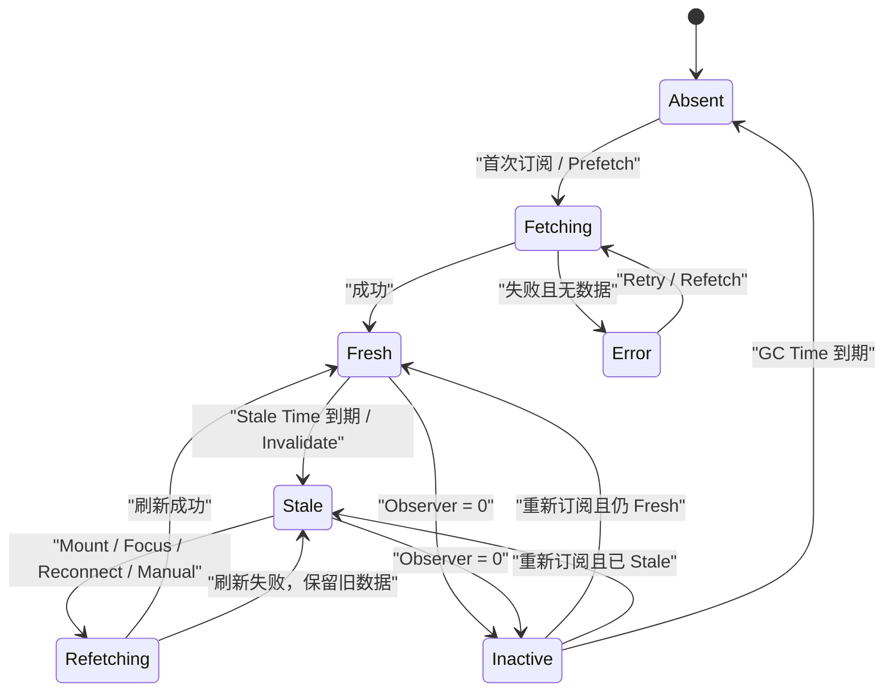
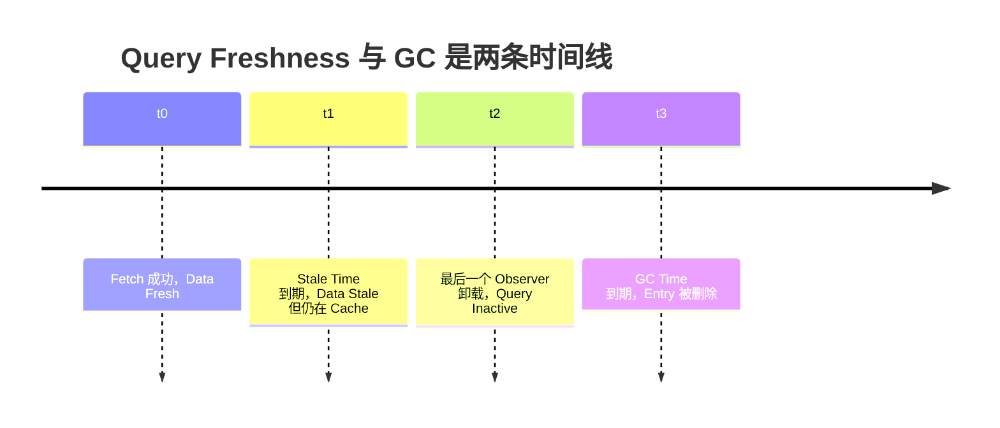
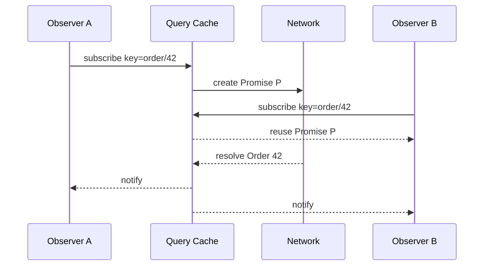

# React Query Cache：Query Key、Freshness、失效与分页生命周期

> Query Cache 不是把 Fetch Result 放进一个 Map。它需要用 Query Key 定义身份，用 Stale Time 表达可信时间，用 Observer 和 GC 管理生命周期，用 In-flight Promise 协调并发，并在后台刷新、失效、分页与预取之间保持同一份 Server State 语义。

---

## 一、Query Cache 解决什么问题

多个组件读取同一订单时，如果每个组件各自 `useEffect + fetch`，通常会出现：

- 相同请求重复发送；
- 页面切换回来再次显示空 Loading；
- 一个组件刷新后，另一个组件仍展示旧副本；
- 请求完成顺序造成旧数据覆盖；
- 组件卸载后不知道数据应立即删除还是继续保留；
- Mutation 完成后不知道哪些读取需要失效；
- 分页、Infinite Scroll 和 Prefetch 各自维护独立缓存。

Query Cache 把 Server State 从“某个组件的异步结果”提升为按 Query Identity 管理的共享资源。组件成为 Observer，Cache Entry 承担数据、错误、更新时间、进行中的 Promise 和订阅生命周期。

本文讨论库无关的 Query Cache 模型。代码示例会采用 TanStack Query 等库常见的 `useQuery`、`useInfiniteQuery` 与 Query Client 形态帮助理解，但具体 Option Name、默认值和行为必须以项目锁定版本为准。TanStack Query v5 使用 `gcTime`，较旧资料常称 `cacheTime`；两者都不等于 `staleTime`。

### 核心结论

1. Query Key 是 Server State 的逻辑主键，必须包含所有影响结果的输入。
2. Stale Time 决定数据何时需要重新验证，不决定数据何时从内存删除。
3. Garbage Collection Time 通常从 Query 无 Observer、进入 Inactive 后开始计算。
4. In-flight Deduplication 让相同 Key 共享进行中的 Promise，不等于完成结果 Cache。
5. Background Refetch 应保留已有数据，并单独表达 Fetching 状态和后台错误。
6. Invalidation 通常把 Query 标记为 Stale，并按活跃状态决定是否立即 Refetch，而不是简单清空全部 Cache。
7. Dependent Query 容易形成 Waterfall，应先评估 API 聚合、服务端并行和 Prefetch。
8. Parallel Query 需要控制并发、部分失败和动态 Query 数量。
9. Pagination 的每页结果必须进入不同 Key；Infinite Query 则通常由一个 Entry 管理 Pages 和 Page Params。
10. Prefetch 只提前填充 Cache，不保证用户一定消费，也受 Stale 和 GC 生命周期约束。

---

## 二、Query Cache 的核心对象

一个 Cache Entry 至少包含：

```ts
type QueryEntry<T> = {
  queryHash: string;
  queryKey: readonly unknown[];
  hasData: boolean;
  data: T | undefined;
  error: unknown;
  dataUpdatedAt: number;
  promise: Promise<T> | undefined;
  observers: Set<() => void>;
  gcTimer: ReturnType<typeof setTimeout> | undefined;
};
```

这些字段分别回答：

- 我是谁；
- 是否已有可展示数据；
- 数据和错误是什么；
- 数据何时成功更新；
- 当前是否已有请求进行；
- 有多少组件正在观察；
- 无人使用后何时回收。

成熟库还会管理 Retry、Abort Signal、Fetch Status、结构共享、Hydration、Network Mode 和 Observer Option 合并等细节。本文的精简模型用于解释协议，不应直接替代成熟实现。

---

## 三、Query Key：Cache 身份而不只是 URL

```tsx
useQuery({
  queryKey: ['order', orderId],
  queryFn: ({ signal }) => fetchOrder(orderId, { signal }),
});
```

Key 中应包含所有影响结果的变量：

```tsx
const queryKey = [
  'orders',
  'list',
  {
    tenantId,
    status,
    page,
    pageSize,
    sort,
    locale,
  },
] as const;
```

如果 `status` 变化但 Key 不变，Cache 会把两个不同结果视为同一资源。此时 Query Function 即使闭包读到新变量，也可能写入错误 Entry。

### 3.1 好的 Query Key

- 使用稳定、可序列化的 Primitive、Array 和 Plain Object；
- 从通用到具体形成层级，例如 `['orders', 'detail', id]`；
- 区分 List、Detail、Finite Page 和 Infinite Query；
- 包含 Tenant、Locale、Feature Variant 等响应维度；
- 与 Invalidation Prefix 设计一致；
- 不包含随机值、函数、DOM Node 和临时对象身份。

### 3.2 Hash 必须确定

不同库对 Plain Object Key 的属性顺序可能进行规范化，也可能要求调用方提供稳定 Hash。不能只看 `JSON.stringify` 的偶然结果就假设跨库行为一致。Key Hash 必须满足：逻辑相同的 Key 得到相同 Hash，逻辑不同的请求不会碰撞。

### 3.3 Authentication Scope

不要把原始 Access Token 写入 Query Key、DevTools 或日志。更安全的方式是：

- 每个登录 Session 使用独立 Query Client；
- Key 使用不敏感的 User/Tenant ID 或 Session Generation；
- 登出时取消并清除用户 Query；
- SSR 每请求创建 Query Cache；
- 权限变化后显式 Invalidate/Remove。

同一个 URL 在不同用户下可能返回不同数据，因此 Cache Scope 不能忽略身份。

---

## 四、Cache 生命周期状态机



这里有两组容易混淆的维度：

- **Data Status**：Pending、Success、Error；
- **Fetch Status**：Idle、Fetching、Paused。

已有 Data 时再次 Fetch，Data Status 仍可保持 Success，而 Fetch Status 变为 Fetching。UI 因此可以继续展示旧数据，并用小型刷新指示器表达后台工作，而不是退回整页 Skeleton。

---

## 五、Stale Time：数据何时需要重新验证

```ts
const isStale = now - entry.dataUpdatedAt >= staleTime;
```

Stale 表示“再次使用时应考虑重新验证”，不表示数据立即删除，也不表示当前数据必然错误。

### 5.1 Fresh 数据

Fresh 期间，Query Cache 通常可以直接返回已有结果，并根据库策略跳过 Mount/Focus Refetch。它仍可能因手动 Refetch、明确 Invalidation 或其他策略发起请求。

### 5.2 Stale 数据

Stale 数据仍可同步展示。常见 Stale-while-revalidate 流程：

1. 立即返回 Cache Data；
2. 后台发起 Refetch；
3. 成功后更新 Data 与 `dataUpdatedAt`；
4. 失败时保留旧 Data，并记录后台错误。

### 5.3 如何选择 Stale Time

| 数据 | 变化特征 | Stale Time 思路 |
|---|---|---|
| 实时库存、交易状态 | 高频且影响操作 | 短，并结合推送/轮询 |
| 商品详情 | 中频变化 | 根据业务容忍度设置 |
| 国家、省份等字典 | 极少变化 | 长，配合版本或失效 |
| 当前权限 | 安全敏感 | 不能只靠长缓存，服务端仍鉴权 |
| 用户主动刷新页面 | 明确要求最新 | Manual Refetch 可覆盖 Freshness |

不要按“接口平均多久变化”机械设置。还要考虑错误代价、读取频率、服务端负载和是否存在主动 Invalidation。

### 5.4 `Infinity` 的边界

将 Stale Time 设为无限通常意味着只依赖显式 Invalidation 或手动刷新。一旦 Mutation、权限变化或跨 Tab 更新漏发失效，数据可能长期不再验证。它适合版本化静态数据，不适合作为减少请求的通用手段。

---

## 六、Garbage Collection Time：无人观察后保留多久

Query 从有 Observer 变为无 Observer 后通常进入 Inactive。GC Time 决定该 Inactive Entry 在内存中保留多久：



### 6.1 GC Time 不控制什么

- 不控制 Data 何时 Stale；
- 不控制轮询间隔；
- 不保证多久 Refetch；
- Active Query 通常不会因为 GC Timer 被删除；
- 不是 HTTP Cache 的 `max-age`。

### 6.2 Stale Time 与 GC Time 的组合

- **短 Stale + 长 GC**：回到页面立即显示旧数据，同时后台刷新；
- **长 Stale + 长 GC**：返回页面大概率直接复用 Fresh Data；
- **长 Stale + 短 GC**：无人观察时可能在 Fresh 到期前就被删除，重新进入仍要 Fetch；
- **短 Stale + 短 GC**：节省内存，但页面往返更容易重新 Loading。

组合没有绝对正确值。移动端内存、页面往返频率和数据体积都应纳入测量。

### 6.3 SSR 与 GC

SSR Query Client 应按请求创建并在请求结束后释放，不能依赖长 GC Timer 作为用户隔离。服务端默认 GC 行为可能与浏览器不同，具体以框架和 Query Library 版本为准。

---

## 七、In-flight Deduplication：同一个 Key 共享 Promise

当两个 Observer 几乎同时订阅 `['order', '42']`：

1. 第一个 Observer 创建 Fetch Promise；
2. Promise 保存到对应 Entry；
3. 第二个 Observer 发现已有 Promise；
4. 两者共享同一请求结果；
5. Promise Settled 后从 In-flight 字段移除；
6. 成功 Data 继续由 Cache 保存。



### 7.1 去重成立的前提

- Query Hash 相同；
- Query Function 语义相同；
- Authentication 和 Tenant Scope 相同；
- 请求仍处于 In-flight；
- 底层 Fetch 没有被不正确地绑定到单个 Observer 生命周期。

同一个 Key 配置两个不同 Query Function 是设计错误。Cache 无法知道哪一个才是该 Key 的真实定义。

### 7.2 取消语义

一个 Observer 卸载时，不应无条件 Abort 其他 Observer 仍在使用的共享请求。成熟 Query Cache 会根据 Observer、Retry 和 Request Lifecycle 决定是否取消。Query Function 应接收并向 Fetch 传递 Cache 提供的 Signal，而不是自行绑定某个组件的 Controller。

### 7.3 Deduplication 不等于 Retry 合并

同一 Promise 内的 Retry 属于一次 Query Execution。Promise 完成后再次 Refetch 是新的执行，是否复用 Data 由 Freshness 决定。

---

## 八、Background Refetch：保留数据再验证

```tsx
function OrderPanel({ orderId }: { orderId: string }) {
  const query = useQuery({
    queryKey: ['order', orderId],
    queryFn: ({ signal }) => fetchOrder(orderId, { signal }),
  });

  if (!query.data && query.isPending) return <OrderSkeleton />;
  if (!query.data && query.isError) return <OrderError error={query.error} />;

  return (
    <section aria-busy={query.isFetching}>
      <OrderDetails order={query.data} />
      {query.isFetching && <InlineRefreshIndicator />}
      {query.isError && <BackgroundRefreshWarning />}
    </section>
  );
}
```

Option 和 Status Name 依赖具体库版本，但 UI 原则稳定：

- 首次无 Data 的 Pending 可以展示 Skeleton；
- 有 Data 的 Refetch 不应默认清空内容；
- Background Error 应保留最后一次成功 Data；
- 用户仍需知道数据可能过期或刷新失败；
- 权限撤销、404 等语义变化可能需要移除旧 Data，而非无限保留。

### 8.1 常见 Refetch 触发器

- Stale Query 重新 Mount；
- Window Focus；
- 网络恢复；
- Polling Interval；
- Manual Refetch；
- Invalidation；
- 服务端 Push 后的事件驱动更新。

每种触发器都应可配置。高频 Focus/Online 事件若叠加短 Stale Time，可能形成不必要流量。

### 8.2 Background Refetch 与 Race

Cache 应只把结果写回对应 Query Key，并处理旧 Fetch 与新 Fetch 的并发策略。若 Query Key 已改变，旧结果仍属于旧 Entry，不应覆盖当前页面的新 Key。

---

## 九、Invalidation：声明数据可能失效

Invalidation 的语义通常是：

1. 将匹配 Query 标记为 Stale；
2. Active Query 根据策略立即 Background Refetch；
3. Inactive Query 等到下次使用时 Refetch；
4. 现有 Data 可以继续保留，除非明确 Remove/Reset。

```tsx
queryClient.invalidateQueries({
  queryKey: ['orders'],
});
```

这类 API 常支持 Prefix Match。`['orders']` 可能同时匹配 List、Detail 和 Statistics，因此 Key 层级必须提前设计。

### 9.1 精确失效与范围失效

```tsx
queryClient.invalidateQueries({
  queryKey: ['orders', 'detail', orderId],
  exact: true,
});
```

- **精确失效**：更新一个 Detail；
- **Prefix 失效**：订单 Mutation 可能影响多个 List Filter；
- **Predicate/Tag 失效**：按实体关系匹配；
- **Remove**：登出、权限撤销或数据不可再展示；
- **Set Data**：响应已返回完整新实体时直接更新 Cache。

### 9.2 不要每次 Mutation 清空全部 Cache

全局清空会造成 Request Storm、Loading Flicker 和失去离线可用数据。应根据 Mutation 影响范围选择 Direct Update、Targeted Invalidation 或两者组合。Optimistic Update 与 Rollback 会在后续 Mutation 文章中单独展开。

---

## 十、Dependent Query：有依赖的请求链

```tsx
const userQuery = useQuery({
  queryKey: ['user', email],
  queryFn: ({ signal }) => fetchUserByEmail(email, { signal }),
});

const projectsQuery = useQuery({
  queryKey: ['projects', { userId: userQuery.data?.id }],
  queryFn: ({ signal }) =>
    fetchProjects(userQuery.data!.id, { signal }),
  enabled: Boolean(userQuery.data?.id),
});
```

Dependent Query 不应通过 Effect 手动复制 Data 和触发第二次 Fetch。依赖条件、Key 和 Query Function 应共同表达。

### 10.1 Waterfall 代价

第二个请求必须等待第一个完成：

```text
User Request ─────────┐
                     └─ Projects Request ─────────┐
```

优化方案：

- 服务端提供聚合 Endpoint；
- 第一请求直接返回后续所需数据；
- Route Loader 在服务端并行；
- 已知 ID 时提前 Prefetch；
- 调整页面边界，让独立区域不互相阻塞。

`enabled` 只避免错误发起，并不会消除网络 Waterfall。

### 10.2 依赖失效

上游 User ID、Tenant 或权限变化后，下游 Key 必须变化或被清除。不能继续展示旧用户 Projects，同时只把新 User 写入上游 Entry。

---

## 十一、Parallel Query：并行但不失控

独立资源应尽量并行：

```tsx
const profileQuery = useQuery(profileOptions(userId));
const notificationsQuery = useQuery(notificationOptions(userId));
const permissionsQuery = useQuery(permissionOptions(userId));
```

动态数量可由 Query Coordinator 提供的批量 Hook 管理：

```tsx
const productQueries = useQueries({
  queries: productIds.map((productId) => ({
    queryKey: ['product', productId],
    queryFn: ({ signal }) => fetchProduct(productId, { signal }),
  })),
});
```

### 11.1 并行查询需要考虑

- 浏览器连接和服务端并发上限；
- 数百个 ID 产生的 Request Fan-out；
- 部分成功与部分失败；
- Query 顺序与结果映射；
- 重试同时发生导致的流量放大；
- 组件卸载后的取消；
- 是否应由服务端 Batch Endpoint 替代。

并行不是越多越快。大量细碎请求可能被 Header、TLS、序列化和服务端调度成本主导。

### 11.2 Partial Failure

每个 Query 应保留自己的 Error 和 Retry 状态。除非产品要求“全部成功才展示”，不要因为一个次要资源失败就清空已成功的其他区域。

---

## 十二、Pagination：每一页都是可寻址数据

Offset Pagination：

```tsx
const ordersQuery = useQuery({
  queryKey: ['orders', 'page', { page, pageSize, filters }],
  queryFn: ({ signal }) =>
    fetchOrdersPage({ page, pageSize, filters, signal }),
  placeholderData: (previousData) => previousData,
});
```

Key 必须包含 Page、Page Size、Filter 和 Sort。否则不同页会互相覆盖。

### 12.1 保留上一页数据

切换 Page 时立即清空内容会产生 Flicker。Placeholder/Previous Data 可以在新页 Fetch 时保持旧布局，但 UI 必须：

- 标记正在切换；
- 禁止用户把旧页误认为新页；
- 新页失败时保留明确的重试入口；
- 对 Screen Reader 提供 Loading 语义。

Placeholder Data 不一定等于已经写入新 Query Entry 的真实 Cache Data，具体语义取决于库。

### 12.2 Offset 与 Cursor

- **Offset/Page**：实现简单，但数据插入删除时可能重复或漏项；
- **Cursor**：更适合持续变化的数据集，但 Cursor 必须由服务端定义稳定顺序；
- **Snapshot Token**：需要跨页一致视图时，可由服务端固定查询版本。

客户端不能只靠去重 ID 修复所有分页一致性问题，排序和快照语义必须由服务端参与。

### 12.3 Prefetch 下一页

当前页 Fresh 后，可在用户接近底部或 Next Button Hover 时 Prefetch 下一页。需要避免快速翻页时预取大量永不访问的数据。

---

## 十三、Infinite Query：一个 Entry 管理多页序列

```tsx
const feedQuery = useInfiniteQuery({
  queryKey: ['orders', 'infinite', filters],
  initialPageParam: null as string | null,
  queryFn: ({ pageParam, signal }) =>
    fetchOrderFeed({ cursor: pageParam, filters, signal }),
  getNextPageParam: (lastPage) => lastPage.nextCursor,
});
```

Infinite Query 通常保存：

```ts
type InfiniteData<TPage, TPageParam> = {
  pages: TPage[];
  pageParams: TPageParam[];
};
```

### 13.1 Key 不能与普通 Query 共用

普通 List 和 Infinite List 的 Data Shape 不同：

```tsx
['orders', 'list', filters]
['orders', 'infinite', filters]
```

如果两者使用同一 Key，Observer 会把同一个 Entry 解释成不兼容结构。

### 13.2 加载下一页

- 使用 `hasNextPage` 判断是否存在 Cursor；
- 防止 `fetchNextPage` 重复触发；
- IntersectionObserver 必须 Cleanup；
- 下一页 Error 不应清空已加载 Pages；
- Filters 变化应切换到新 Key；
- Abort 后不能把旧 Cursor 结果附加到新 Filter。

### 13.3 内存治理

无限滚动并不代表无限保留：

- 限制最大 Pages，库支持时使用 `maxPages` 等能力；
- 对长列表使用 Virtualization；
- 页面离开后依赖 GC 回收；
- 大型媒体只缓存 Metadata；
- 合并重复实体时保持稳定 ID；
- 返回上方时定义 Scroll Restoration。

裁剪首页或尾页后，前后翻页的 Cursor 和 UI 位置必须仍然可恢复。

---

## 十四、Prefetch：用概率换延迟

```tsx
function prefetchOrder(orderId: string) {
  return queryClient.prefetchQuery({
    queryKey: ['orders', 'detail', orderId],
    queryFn: ({ signal }) => fetchOrder(orderId, { signal }),
    staleTime: 60_000,
  });
}
```

常见触发：

- Link Hover/Focus；
- 元素进入 Viewport；
- 当前页完成后的下一页；
- Route Loader；
- 服务端 Render；
- 用户行为预测。

### 14.1 Prefetch 的边界

- Prefetch 不代表存在长期 Observer；
- 若无人使用，Entry 仍会进入 GC；
- 用户真正进入时是否 Refetch 由 Stale Time 决定；
- 权限数据只能在确认身份后 Prefetch；
- Save-Data、慢网和移动流量需要降级；
- 过多 Prefetch 会与首屏关键资源竞争。

### 14.2 Prefetch 与请求优先级

浏览器、框架和 Fetch Priority 支持存在差异。不要仅因为在事件中稍后调用，就假设网络会自动低优先级调度。应通过 Network 面板和真实设备验证关键资源是否被抢占。

---

## 十五、一个精简 Cache 内核

下面的代码展示 Freshness 和 In-flight Promise Sharing：

```ts
type QueryKey = readonly unknown[];

type InternalEntry<T> = {
  hasData: boolean;
  data: T | undefined;
  error: unknown;
  updatedAt: number;
  promise: Promise<T> | undefined;
};

const cache = new Map<string, InternalEntry<unknown>>();

async function fetchQuery<T>({
  queryKey,
  queryFn,
  staleTime,
}: {
  queryKey: QueryKey;
  queryFn(): Promise<T>;
  staleTime: number;
}): Promise<T> {
  const queryHash = hashQueryKey(queryKey);
  let entry = cache.get(queryHash) as InternalEntry<T> | undefined;

  if (!entry) {
    entry = {
      hasData: false,
      data: undefined,
      error: null,
      updatedAt: 0,
      promise: undefined,
    };
    cache.set(queryHash, entry);
  }

  const isFresh =
    entry.hasData && Date.now() - entry.updatedAt < staleTime;

  if (isFresh) return entry.data as T;
  if (entry.promise) return entry.promise;

  let promise: Promise<T>;

  promise = queryFn()
    .then((data) => {
      entry.hasData = true;
      entry.data = data;
      entry.error = null;
      entry.updatedAt = Date.now();
      return data;
    })
    .catch((error: unknown) => {
      entry.error = error;
      throw error;
    })
    .finally(() => {
      if (entry.promise === promise) {
        entry.promise = undefined;
      }
    });

  entry.promise = promise;
  return promise;
}
```

`hashQueryKey` 必须使用确定且抗碰撞的实现。生产 Cache 还缺少 Observer Notification、Abort、Retry、GC、Invalidation、结构共享和并发更新保护，因此不应直接复制为应用数据层。

### 15.1 Observer 与 GC 示意

```ts
function unsubscribe(entry: QueryEntry<unknown>, gcTime: number) {
  if (entry.observers.size > 0 || entry.gcTimer) return;

  entry.gcTimer = setTimeout(() => {
    if (entry.observers.size === 0) {
      queryCache.delete(entry.queryHash);
    }
    entry.gcTimer = undefined;
  }, gcTime);
}
```

真实实现还要在新 Observer 加入时取消 GC Timer，并处理 Query 正在 Fetch、Retry 或 Hydrate 的状态。

---

## 十六、错误、竞态与一致性

### 16.1 Initial Error 与 Background Error

- 无 Data + Error：展示完整错误状态；
- 有 Data + Background Error：保留数据，显示刷新失败；
- 401/403：可能需要移除敏感旧数据；
- 404：Detail Query 可能转为 Not Found；
- Schema Error：不能把旧结构数据当新结果写入 Cache。

### 16.2 同 Key 多次 Refetch

Cache 必须定义是否：

- 复用当前 Promise；
- Abort 旧请求并启动新请求；
- 允许并发但只接受最新 Generation；
- 按服务端 Version 决定最终结果。

调用方不能假设“最后完成的请求一定最新”。

### 16.3 Mutation 后的一致性

Query Cache 是服务端快照，不是服务端数据库。Mutation 后可以：

- 使用响应直接更新 Detail；
- Invalidate 相关 List；
- Optimistic Patch 后失败 Rollback；
- 使用 Version/ETag 处理冲突。

具体策略将在 Mutation 模块展开。

---

## 十七、Cache Scope、SSR 与安全

### 17.1 客户端 Session

登录身份变化时应取消请求并清理用户 Cache。仅在 Key 中加入 User ID 仍可能让旧敏感 Entry 留在内存、DevTools 或 Persistence 中。

### 17.2 SSR

- 每请求创建 Query Client；
- Prefetch 后只 Dehydrate 可安全下发的数据；
- Client Hydration 使用相同 Query Key 和数据结构；
- Timestamp、Clock Skew 和 Stale Time 会影响 Hydration 后是否立即 Refetch；
- 请求完成后释放服务端 Cache；
- HTML Cache 必须按用户/租户隔离。

### 17.3 Persistence 与 Cross-tab

持久化 Cache 需要 Schema Version、Max Age、身份隔离、敏感字段过滤和恢复失败策略。Cross-tab Broadcast 也应携带 Query Version/Scope，不能让另一个账号的 Tab 失效或覆盖当前数据。

---

## 十八、测试 Query Cache

### 18.1 Query Key

- 同逻辑参数 Hash 相同；
- Filter、Page、Tenant 变化产生不同 Key；
- List 与 Infinite Query 不共用 Key；
- Key 不包含 Token 和随机值。

### 18.2 Freshness 与 GC

使用 Fake Timer：

1. Fetch 成功；
2. Stale Time 内重新订阅，不应无条件重复请求；
3. Stale 后重新订阅，展示旧 Data 并 Background Refetch；
4. Observer 清零后开始 GC；
5. GC Time 前重新订阅应取消回收；
6. GC Time 后 Entry 被删除。

### 18.3 Deduplication

- 两个 Observer 同时订阅只调用一次 Query Function；
- 两者收到同一结果；
- 一个 Observer 卸载不影响另一个；
- Promise Settled 后 In-flight 字段被清理；
- Error 不形成永久锁死 Promise。

### 18.4 查询组合

- Dependent Query 在依赖缺失时不执行；
- 上游 Key 变化后下游切换；
- Parallel Query 部分失败仍保留成功项；
- Pagination 切页不会覆盖其他页；
- Infinite Query 追加顺序、Next Cursor 和重复触发正确；
- Prefetch Freshness 和 GC 符合策略。

### 18.5 网络与生命周期

使用可控 Promise 或 MSW 覆盖 Abort、Retry、Focus Refetch、Offline/Online、后台 Error 和 Logout Cache Clear。不要只断言 Hook Boolean，应验证用户最终看到的数据与请求数量。

---

## 十九、性能与容量治理

需要测量：

- Cache Entry 数量和总 Data Size；
- Active/Inactive Query 比例；
- Fresh Hit、Stale Hit、Miss；
- In-flight Deduplication Hit Rate；
- Background Refetch 和 Retry 流量；
- GC 删除数量与重新 Fetch 数量；
- Pagination/Infinite Pages 数量；
- Query Function、JSON Parse、Schema Validation 耗时；
- Observer Render 与结构共享效果；
- SSR Dehydrated Payload 和 Hydration 时间。

### 19.1 常见优化顺序

1. 修正 Query Key，避免错误 Miss/Collision；
2. 根据业务调整 Stale Time；
3. 缩小 Invalidation 范围；
4. 消除 Dependent Waterfall；
5. 合并过度 Fan-out 请求；
6. 限制 Infinite Pages 和大对象；
7. 再评估 GC Time 与 Persistence。

不要为了提高 Cache Hit 无限延长 Freshness，也不要为了省内存把 GC Time 调到使页面往返持续重新 Loading。

---

## 二十、常见误区

### 20.1 “Stale 就表示数据已被删除”

错误。Stale 只表示需要重新验证，Data 通常仍可展示。

### 20.2 “GC Time 到期会删除正在使用的 Query”

错误。GC 通常针对无 Observer 的 Inactive Query，Active Query 不应被普通 GC Timer 回收。

### 20.3 “相同 URL 一定是相同 Query”

错误。Tenant、Locale、Filter、Auth Scope 和 Body/Variables 都可能改变结果。

### 20.4 “Invalidation 等于清空 Cache”

错误。常见语义是标记 Stale，并按 Active/Inactive 状态决定 Refetch。

### 20.5 “Dependent Query 使用 `enabled` 后就没有 Waterfall”

错误。它只控制执行条件，第二个请求仍等待第一个完成。

### 20.6 “Parallel Query 越多，页面越快”

错误。过度 Fan-out 会增加网络、Header、服务端和 Retry 成本。

### 20.7 “Infinite Query 可以无限保存 Pages”

错误。长期滚动会占用内存和 DOM，需要 Page Limit、Virtualization 和 GC。

### 20.8 “Prefetch 一定提升性能”

错误。低命中预取会浪费流量，并与首屏资源竞争，必须测量命中率和网络影响。

---

## 二十一、工程检查清单

- Query Key 是否包含所有影响响应的参数；
- Key 是否稳定、可序列化并具有层级；
- List、Detail、Page 和 Infinite Query 是否区分；
- Authentication/Tenant Scope 是否隔离；
- Stale Time 是否基于业务新鲜度和错误代价；
- 是否误把 Stale Time 当作删除时间；
- GC Time 是否符合内存和页面往返需求；
- Observer 重新加入时是否取消 GC；
- 同 Key In-flight Request 是否真正去重；
- 单个 Observer 卸载是否会错误取消共享请求；
- Background Refetch 是否保留已有 Data；
- Background Error 是否有独立 UI；
- Invalidation 是否足够精确；
- Dependent Query 是否产生可消除 Waterfall；
- Parallel Query 是否需要 Batch 或并发限制；
- Pagination Key 是否包含 Page/Cursor、Filter 和 Sort；
- Infinite Query 是否正确管理 Pages、Page Params 和 Next Cursor；
- 是否限制 Infinite Pages 和 DOM 数量；
- Prefetch 是否考虑命中率、权限、流量和 GC；
- Logout/租户切换是否清理敏感 Cache；
- SSR 是否每请求创建 Query Client；
- Persistence 是否有版本、过期和安全策略；
- 测试是否覆盖 Fresh/Stale、GC、去重、失效和乱序；
- 性能结论是否来自真实网络、数据量和设备。

---

## 二十二、总结

1. Query Key 定义 Cache Identity，错误 Key 会造成 Collision、重复请求或数据串用。
2. Stale Time 管理 Freshness，GC Time 管理 Inactive Entry 的内存生命周期。
3. In-flight Deduplication 通过共享 Promise 合并同 Key 并发请求。
4. Background Refetch 应保留已有 Data，并区分 Initial Loading 与 Fetching。
5. Invalidation 通常标记 Stale，而不是无差别删除全部 Cache。
6. Dependent Query 要警惕 Waterfall，Parallel Query 要控制 Fan-out 和部分失败。
7. Pagination 每页拥有独立 Key，Infinite Query 用 Pages/Page Params 管理连续序列。
8. Prefetch 受 Freshness、GC、权限和网络竞争约束，收益依赖命中率。
9. Cache 仍需处理 Error、Abort、Race、Mutation、SSR 和 Session 隔离。
10. Stale、GC、Refetch 和 Invalidation 参数必须通过真实业务指标校准。

Query Cache 的核心不是“少发几次请求”，而是让每份 Server State 都拥有稳定身份、明确可信时间、可观察生命周期和可验证的一致性策略。

---

## 问答复盘

### Q1：Stale Time 到期后，Cache Data 会立即删除吗？

**答：** 不会。Data 只是变为 Stale，通常仍可立即展示，并在合适触发器下后台刷新。

### Q2：GC Time 从 Fetch 成功时开始计算吗？

**答：** 通常不是。它一般在 Query 没有 Observer、进入 Inactive 后开始；具体细节以所用库版本为准。

### Q3：两个组件使用相同 Query Key 会发生什么？

**答：** 若请求同时进行，成熟 Cache 通常共享同一 In-flight Promise，并让两个 Observer 读取同一 Entry。

### Q4：为什么 Query Key 不能只使用 URL？

**答：** Locale、Tenant、Filter、Auth Scope 和 Variables 也可能影响结果；缺失变量会让不同资源发生 Cache Collision。

### Q5：Invalidation 与 Remove Query 有什么区别？

**答：** Invalidation 通常保留 Data、标记 Stale 并触发或等待 Refetch；Remove 会直接删除 Entry，适合登出或数据不可继续展示。

### Q6：Dependent Query 的主要性能风险是什么？

**答：** 网络 Waterfall。第二个请求等待第一个完成，`enabled` 只能控制条件，不能让两者并行。

### Q7：分页切换时为什么要把 Page 放进 Query Key？

**答：** 每页是不同 Server Snapshot；若 Key 相同，新页会覆盖旧页，也无法分别缓存和预取。

### Q8：普通 Query 与 Infinite Query 可以共用 Key 吗？

**答：** 不应共用。两者 Data Shape 不同，Infinite Query 需要 `pages` 和 `pageParams`，共用会造成结构冲突。

### Q9：Prefetch 完成后为什么用户进入页面仍可能 Refetch？

**答：** 用户进入时 Prefetched Data 可能已经 Stale，或被 Invalidation；是否刷新由 Freshness 和具体库策略决定。

### Q10：如何判断 Query Cache 参数配置合理？

**答：** 测量 Fresh/Stale Hit、重复请求、Refetch 流量、GC 后重载、内存、页面延迟和数据错误代价，而不是照抄统一时间值。

---

## 延伸知识

- **Mutation**：Optimistic Update、Rollback、Invalidation、Idempotency 与 Conflict Resolution。
- **React Query / SWR**：具体库的 Cache 生命周期、Stale-while-revalidate、Suspense 和 SSR Hydration。
- **数据请求**：Fetch、Abort、Timeout、Retry、Authentication 和 Runtime Validation。
- **Suspense**：Data Boundary、Fallback、Error Boundary 与 Streaming SSR。
- **外部 Store 协议**：Snapshot、Subscribe、并发一致性与 Tear 防护。
- **Web 性能**：Waterfall、Prefetch、Resource Timing、LCP 和 INP。
