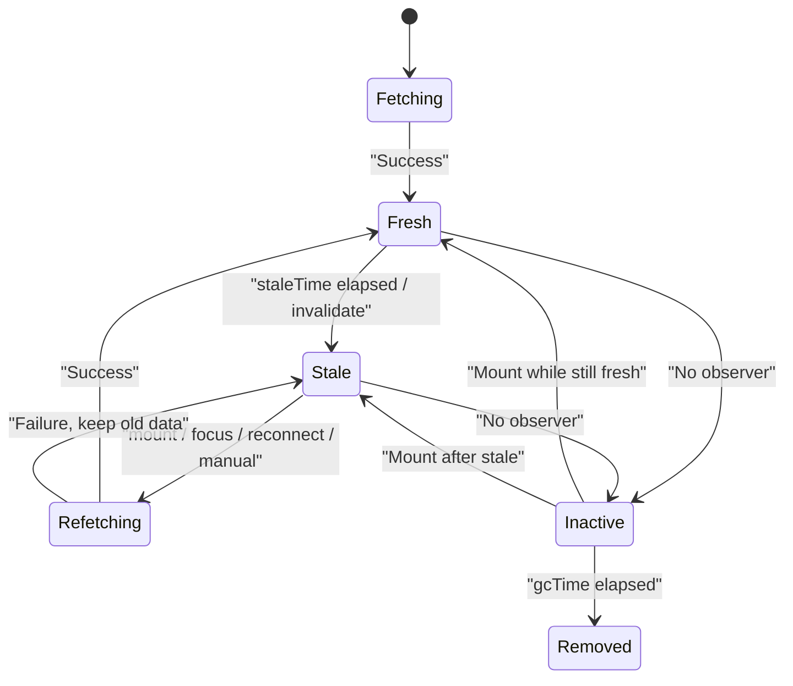
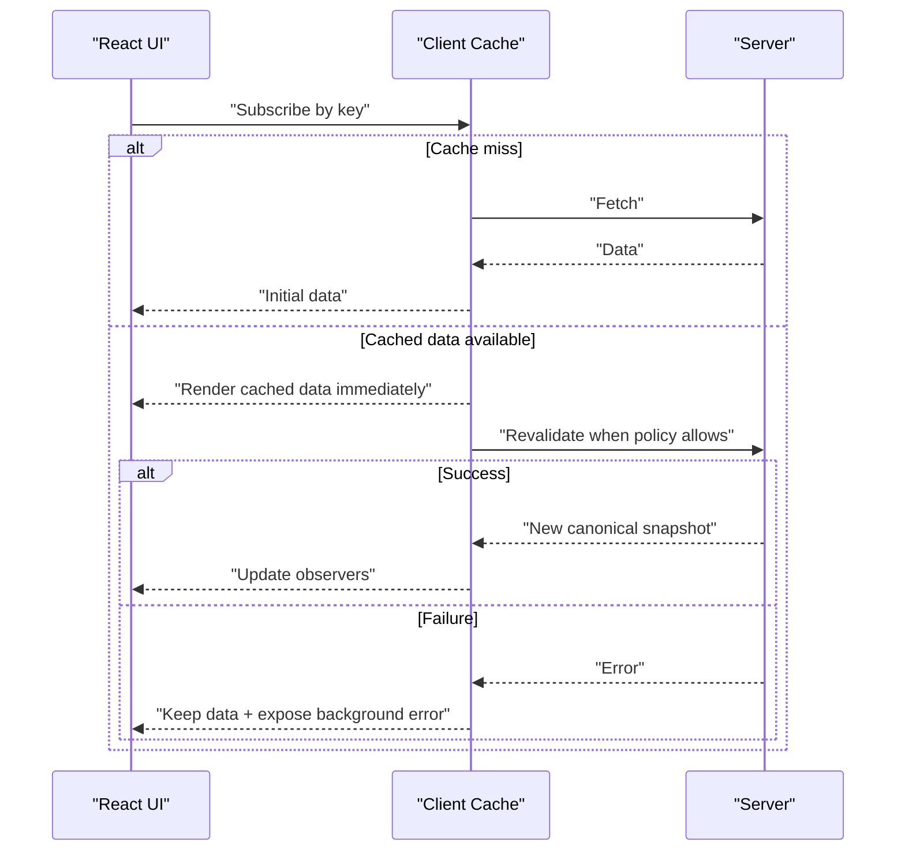
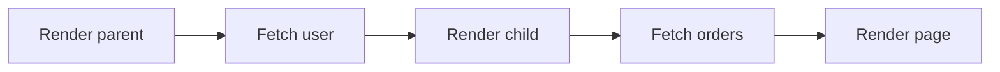
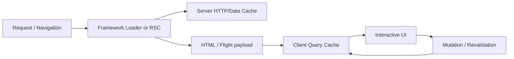

# React Query 与 SWR：Server State 缓存、重新验证与 SSR

> TanStack Query 和 SWR 都不是“更方便的 `useEffect + fetch`”。它们在 React 与远端数据源之间建立资源身份、缓存订阅和重新验证协议，但不会替你定义 HTTP 错误、运行时校验、权限边界与业务一致性。

---

## 一、为什么需要 Server State 工具

一个订单详情可能同时出现在详情页、侧边栏、搜索结果和操作弹窗。如果每个组件独立请求，工程上很快会遇到：

- 相同资源重复 Fetch；
- 页面返回时重新出现整页 Loading；
- 旧数据可展示，却被空 Skeleton 替换；
- 窗口重新聚焦后数据长期不更新；
- Mutation 成功后，不知道哪些读取需要刷新；
- 请求失败后，每个组件实现不同 Retry；
- SSR 已经取到数据，客户端 Hydration 后又立即重复请求；
- 页面卸载后，缓存保留时间和内存边界不明确。

TanStack Query 与 SWR 都把组件从“请求所有者”变为“资源观察者”：组件声明 Key 和 Fetcher/Query Function，库负责共享缓存、协调并发、重新验证并通知订阅者。

本文以 TanStack Query v5 和当前 SWR 官方公开 API 为基准。两套库仍会演进，默认值、框架适配和实验能力必须以项目锁定版本为准。文中“React Query”指 TanStack Query 的 React Adapter，即 `@tanstack/react-query`。

### 核心结论

1. 两套库解决的是 Server State 协调，不替代 Local UI State、Form State、URL State 和领域工作流状态机。
2. Key 是资源身份；所有影响响应的变量都必须进入 Key，认证数据还要有正确 Cache Scope。
3. TanStack Query 用 `staleTime` 管 Freshness、用 `gcTime` 管 Inactive Query 回收，两者是不同时间线。
4. SWR 的 `dedupingInterval` 控制一定时间窗口内的同 Key 请求去重，不等于 `staleTime` 或 Cache GC。
5. Stale-while-revalidate 的核心是先展示可用旧数据，再后台验证，而不是每次刷新都退回 Initial Loading。
6. Suspense 负责声明异步 UI 边界，不会自动消除 Waterfall，也不替代 Error Boundary。
7. SSR Hydration 必须保证服务端和客户端使用相同 Key、数据结构与隔离范围，并避免跨请求共享用户缓存。
8. Retry 只能处理暂时性故障；401、403、404、Schema Error 和大多数 4xx 不应无差别重试。
9. Focus 与 Reconnect 是重新验证触发器，不是真实数据变更通知，也不代表网络服务一定可用。
10. 选型应依据缓存模型、写操作复杂度、SSR 框架、团队心智和可测试性，而不是只比较 Hook 名称。

---

## 二、Server State 的边界

Server State 通常具有以下特征：

- 数据的权威来源在远端；
- 客户端持有的是某个时间点的 Snapshot；
- 可能被其他用户、设备、任务或服务修改；
- 读取存在延迟、错误、权限和缓存；
- 写入后需要重新建立客户端与服务器的一致性；
- 生命周期通常跨越单个组件，但不一定跨越登录 Session。

### 2.1 适合交给 Query/SWR 的状态

- 用户资料、订单、商品和权限查询；
- 分页列表、搜索结果和 Infinite Feed；
- Dashboard 统计和后台轮询数据；
- 路由 Loader 或 SSR 预取后的客户端缓存；
- Mutation 后需要失效或更新的服务端快照。

### 2.2 不应无差别放入 Query Cache

| 状态 | 更合适的所有者 | 原因 |
|---|---|---|
| 弹窗是否打开 | Local State | 只属于当前交互生命周期 |
| 未提交表单 Draft | Form State | 不是服务器事实，需脏字段和校验协议 |
| 当前 Tab | Local/URL State | 取决于是否需要分享和恢复 |
| 主题、语言 | Context/Client Store | 通常是客户端配置或会话能力 |
| 多步骤审批流程 | Reducer/State Machine | 需要合法状态迁移和命令协议 |
| 乐观写入 | Mutation Overlay + Query Cache | 是暂定投影，不是确认事实 |

不要把 `useQuery` 当作通用异步 Hook。读取 IndexedDB、本地 Worker 或原生 Bridge 也能返回 Promise，但是否应进入 Server State 工具，要看它是否需要资源 Key、共享订阅、失效和重新验证语义。

### 2.3 工具不会替代请求治理

以下职责仍属于 Fetcher/Transport 层：

- 检查 `response.ok`；
- 读取和分类错误体；
- Runtime Validation；
- Authentication、CSRF、CORS 和 Token Refresh；
- Timeout 与 Abort；
- 日志脱敏和 Trace；
- 服务端授权与数据隔离。

如果 Fetcher 对 500 仍返回一个普通对象，Query 库不会自动知道这是失败。

---

## 三、最小使用模型

两套库都需要稳定资源身份和会抛出错误的 Fetcher。

### 3.1 共享 Transport

```ts
type Order = {
  id: string;
  status: 'draft' | 'confirmed' | 'cancelled';
  total: number;
  version: number;
};

async function fetchOrder(orderId: string, signal?: AbortSignal): Promise<Order> {
  const response = await fetch(`/api/orders/${orderId}`, { signal });

  if (!response.ok) {
    throw await HttpError.fromResponse(response);
  }

  return parseOrder(await response.json());
}
```

`HttpError` 与 `parseOrder` 代表项目自定义的错误和运行时 Schema 校验，不是浏览器内置 API。

### 3.2 TanStack Query

```tsx
function OrderPanel({ orderId }: { orderId: string }) {
  const query = useQuery({
    queryKey: ['orders', 'detail', orderId],
    queryFn: ({ signal }) => fetchOrder(orderId, signal),
    staleTime: 30_000,
  });

  if (query.isPending) return <OrderSkeleton />;
  if (query.isError) return <OrderError error={query.error} />;

  return (
    <section>
      <OrderView order={query.data} />
      {query.isFetching && <small>正在同步最新数据</small>}
    </section>
  );
}
```

`isPending` 表示还没有可展示的成功数据；`isFetching` 表示 Query Function 正在执行。已有 Data 时后台刷新，二者可以不同。

### 3.3 SWR

```tsx
function OrderPanel({ orderId }: { orderId: string }) {
  const { data, error, isLoading, isValidating } = useSWR(
    ['orders', 'detail', orderId],
    ([, , id]) => fetchOrder(id),
  );

  if (isLoading) return <OrderSkeleton />;
  if (!data) return <OrderError error={error} />;

  return (
    <section>
      <OrderView order={data} />
      {isValidating && <small>正在同步最新数据</small>}
      {error && <small role="status">刷新失败，当前展示缓存数据</small>}
    </section>
  );
}
```

SWR 允许 `data` 和 `error` 同时存在：后台重新验证失败时，可以继续展示缓存数据并表达刷新错误。实际 Fetcher 若需 Abort，应建立与组件订阅或请求协调器相匹配的取消协议，不能临时创建无法清理的 Controller。

---

## 四、概念映射：相似但不等价

| 能力 | TanStack Query v5 | SWR | 关键区别 |
|---|---|---|---|
| 资源身份 | `queryKey` | `key` | 都必须包含全部响应变量 |
| 请求函数 | `queryFn` | `fetcher` | 都应抛出可分类错误 |
| 新鲜度 | `staleTime` | 由重新验证配置表达 | 不应把 `dedupingInterval` 当 `staleTime` |
| 未观察缓存回收 | `gcTime` | Cache Provider 生命周期 | SWR 无直接同名等价配置 |
| 请求去重 | 同 Key In-flight Promise | 同 Key + `dedupingInterval` | 具体窗口与触发行为不同 |
| 后台刷新状态 | `isFetching` | `isValidating` | 都应与 Initial Loading 分开 |
| 手动更新/失效 | `setQueryData`、`invalidateQueries` | `mutate` | 匹配、回滚和重验 API 不同 |
| Suspense | `useSuspenseQuery` | `{ suspense: true }` | Conditional Query 边界不同 |
| SSR 数据注入 | `dehydrate` + `HydrationBoundary` | `SWRConfig.fallback` / `fallbackData` | 时间戳和重新验证语义不同 |
| Focus 刷新 | `refetchOnWindowFocus` | `revalidateOnFocus` | 触发与节流实现不同 |
| Reconnect 刷新 | `refetchOnReconnect` | `revalidateOnReconnect` | TanStack 还区分 Paused Continue |

API 名称相近不代表配置可以逐项翻译。迁移时应先写出资源身份、Freshness、回收、触发器和错误策略，再映射到目标库。

---

## 五、Cache 生命周期

### 5.1 TanStack Query：Freshness 与 GC 分离



- `staleTime`：成功数据在多久内被视为 Fresh；
- `gcTime`：Query 无 Observer、进入 Inactive 后，最多保留多久再回收；
- Inactive 不等于 Stale；
- Stale 不等于删除；
- Invalidation 通常把 Query 标为 Stale，而不是直接 Remove。

TanStack Query 当前文档的默认值偏向积极重新验证，但项目不能依赖记忆中的默认值。应在 Query Client 中显式表达关键业务策略，并在升级时检查 Release Note。

### 5.2 SWR：Key、Cache Provider 与重新验证

SWR 默认使用共享 Cache，公开 Cache Provider 是 Map-like 接口：

```ts
interface Cache<Data> {
  get(key: string): Data | undefined;
  set(key: string, value: Data): void;
  delete(key: string): void;
  keys(): IterableIterator<string>;
}
```

组件卸载不应被理解为对应 Key 立即删除。Entry 的保存范围取决于 `SWRConfig` 边界、Provider 实例生命周期以及显式 `mutate`/删除策略。

SWR 没有可以直接等同 TanStack Query `gcTime` 的公开核心选项。自定义持久化或淘汰 Provider 时，还要保证订阅、序列化、容量和身份隔离正确；不要在业务代码中随意直接写底层 Cache，优先使用 SWR 的 `mutate` API。

### 5.3 `dedupingInterval` 不是 Freshness TTL

`dedupingInterval` 用于一定时间窗口内对同 Key 请求去重。它不能回答：

- 数据何时业务上过期；
- 组件卸载后何时清理 Entry；
- Focus 时是否允许重新验证；
- Mutation 后是否应该失效；
- 持久化 Cache 多久后不能再用。

把它机械映射成 `staleTime` 会造成错误请求频率和错误新鲜度预期。

---

## 六、Stale-while-revalidate 的真实流程

Stale-while-revalidate（SWR）源自“先返回旧值，同时后台验证”的思路。SWR 库以此命名；TanStack Query 也能实现相似用户体验，但配置模型不同。



### 6.1 三种 UI 状态不能混用

1. **Initial Loading**：没有 Data，正在首次读取；
2. **Background Revalidation**：有 Data，正在验证新版本；
3. **Background Error**：有 Data，但最近一次验证失败。

如果每次 `isFetching` 或 `isValidating` 都渲染全屏 Skeleton，就失去了缓存与 SWR 模型的主要体验收益。

### 6.2 它不是 HTTP Cache-Control 的自动替代

客户端 Query Cache 与浏览器/CDN HTTP Cache 是不同层：

- HTTP Cache 按 URL、Method、Header 和 Cache Directive 工作；
- Query Cache 按业务 Key、Observer 与应用策略工作；
- Service Worker 可能再形成一层；
- 服务端仍可能使用 CDN、Redis 或数据库 Cache。

多个缓存层必须明确谁负责 Freshness、Validation Token、权限和 Purge。库名中的 SWR 不表示它会自动读取或生成 `Cache-Control: stale-while-revalidate`。

---

## 七、配置 Freshness，而不是关闭所有刷新

### 7.1 TanStack Query

```ts
const queryClient = new QueryClient({
  defaultOptions: {
    queries: {
      staleTime: 30_000,
      gcTime: 10 * 60_000,
      refetchOnWindowFocus: true,
      refetchOnReconnect: true,
    },
  },
});
```

全局值只是基线。国家字典、库存、权限和订单状态的变化频率与错误代价不同，应按 Query Domain 覆盖。

当前 TanStack Query v5 还支持更严格的静态 Freshness 配置；这类选项的具体失效行为与版本相关。只有数据在应用生命周期内确实不可变化时才使用，不能为了少请求把动态数据永久标记为静态。

### 7.2 SWR

```tsx
<SWRConfig
  value={{
    revalidateIfStale: true,
    revalidateOnFocus: true,
    revalidateOnReconnect: true,
    dedupingInterval: 2_000,
  }}
>
  <App />
</SWRConfig>
```

不可变资源可以使用 `useSWRImmutable`，它会关闭相关自动重新验证行为：

```tsx
const { data } = useSWRImmutable(
  ['countries', locale],
  ([, language]) => fetchCountries(language),
);
```

“Immutable” 应来自业务事实，例如带内容 Hash 的静态版本资源。权限、Feature Flag 和配置即使变化不频繁，也常需要登录切换或显式 Mutation 后重新验证。

---

## 八、Suspense 集成

Suspense 将“没有可提交 UI 的异步等待”交给最近的 Boundary。Error Boundary 处理抛出的错误，两者职责不同。

### 8.1 TanStack Query v5

```tsx
function OrderContent({ orderId }: { orderId: string }) {
  const { data } = useSuspenseQuery({
    queryKey: ['orders', 'detail', orderId],
    queryFn: ({ signal }) => fetchOrder(orderId, signal),
  });

  return <OrderView order={data} />;
}

function OrderPage({ orderId }: { orderId: string }) {
  return (
    <ErrorBoundary fallback={<OrderErrorPage />}>
      <Suspense fallback={<OrderSkeleton />}>
        <OrderContent orderId={orderId} />
      </Suspense>
    </ErrorBoundary>
  );
}
```

`useSuspenseQuery` 的 `data` 在正常返回路径中有定义，但有几个重要边界：

- 它没有普通 `useQuery` 的条件启停模型；
- 同一组件内多个 Suspense Query 可能串行执行，应预取或使用并行组合 API；
- `placeholderData` 不适用于该 Hook；
- Query Key 更新时若不希望重新显示 Fallback，可结合 Transition 与预取；
- 后台刷新已有 Data 时，错误是否抛给 Boundary 有具体默认策略，应按所用版本确认并设计刷新错误 UI。

错误恢复还需要 Query Error Reset Boundary 或项目等价机制，不能只让 React Error Boundary 重渲染同一个已失败 Query。

### 8.2 SWR

```tsx
function OrderContent({ orderId }: { orderId: string }) {
  const { data } = useSWR(
    ['orders', 'detail', orderId],
    ([, , id]) => fetchOrder(id),
    { suspense: true },
  );

  return <OrderView order={data} />;
}
```

SWR 的 `suspense` Option 在组件生命周期内不应动态改变。普通情况下 Data 在成功 Render 路径可用，但结合 Conditional Key（例如 Key 为 `null`）时，Data 仍可能是 `undefined`。

SWR 官方文档还明确指出：传统服务端预渲染中不能指望 Suspense 自行在服务端 Fetch，必须通过框架数据层提供 `fallback` 或 `fallbackData`。具体 RSC Promise Prefetch 和 Streaming 能力随框架与版本演进，应单独按官方集成文档验证。

### 8.3 避免 Suspense Waterfall



如果 Child 只有在 Parent Data 返回后才挂载，请求会形成 Waterfall。优化顺序通常是：

1. 在 Router/Loader 中提前发现依赖；
2. 独立请求并行 Prefetch；
3. 服务端聚合真正有依赖的数据；
4. 调整 Boundary，让非关键区域分段 Reveal；
5. 再考虑客户端 Hover/Intent Prefetch。

Suspense 改变 Loading 的组织方式，不会让串行网络自动并行。

---

## 九、SSR Hydration

SSR 的目标不是把服务器进程中的 Cache 直接搬到浏览器，而是：

1. 为当前请求创建隔离的数据协调器；
2. Prefetch 本次页面需要的资源；
3. 生成一致 HTML；
4. 序列化允许下发的数据；
5. 客户端恢复相同资源身份；
6. 按 Freshness 策略决定何时重新验证。

### 9.1 TanStack Query：Dehydrate 与 HydrationBoundary

```tsx
async function ServerOrderPage({ orderId }: { orderId: string }) {
  const queryClient = new QueryClient();

  await queryClient.prefetchQuery({
    queryKey: ['orders', 'detail', orderId],
    queryFn: () => fetchOrderOnServer(orderId),
  });

  return (
    <HydrationBoundary state={dehydrate(queryClient)}>
      <OrderPage orderId={orderId} />
    </HydrationBoundary>
  );
}
```

完整应用还需要在客户端用稳定的 `QueryClientProvider` 包裹组件树。关键约束：

- 服务端每个 Request 创建独立 Query Client；
- 不能把当前用户数据放入进程级全局 Query Client；
- Server Prefetch 与 Client Hook 使用完全相同 Query Key；
- Dehydrated Payload 必须可序列化并经过敏感数据审查；
- Hydration 后是否立即 Refetch 受 `staleTime`、服务端更新时间与时钟影响；
- Prefetch 失败、错误序列化和框架 Streaming 行为应按当前版本处理。

### 9.2 SWR：Fallback

```tsx
function ServerRenderedPage({
  order,
}: {
  order: Order;
}) {
  return (
    <SWRConfig
      value={{
        fallback: {
          [unstable_serialize(['orders', 'detail', order.id])]: order,
        },
      }}
    >
      <OrderPanel orderId={order.id} />
    </SWRConfig>
  );
}
```

复杂 Key 需要使用 SWR 提供的稳定序列化能力，不能手写一个与 Hook Key 不一致的 JSON String。`fallback` 是边界内多个 Key 的预填数据，`fallbackData` 通常是单 Hook Option，两者作用域不同。

SWR 在客户端接管后仍可能按配置重新验证。这是保持数据动态更新的设计，不应简单认定为 Hydration 失败。若不希望立即请求，应根据资源语义设置 Mount Revalidation，而不是依赖偶然的 Deduping Window。

### 9.3 Hydration 安全边界

- HTML 中的数据对浏览器用户可见，不能 Dehydrate Secret；
- 用户和租户 Cache 必须按请求隔离；
- 静态页面不能嵌入请求级私有数据；
- Date、Map、BigInt、Class Instance 等需要明确序列化；
- 服务端与客户端 Locale、Time Zone 和 Feature Flag 不同可能造成 Markup Mismatch；
- CSP、XSS Escaping 和框架序列化器必须纳入评审；
- Logout 后应清理用户 Cache 与持久化数据。

---

## 十、错误重试

### 10.1 先让 Fetcher 正确抛错

```ts
async function fetchJson<T>(url: string, signal?: AbortSignal): Promise<T> {
  const response = await fetch(url, { signal });

  if (!response.ok) {
    throw await HttpError.fromResponse(response);
  }

  return parseResponse<T>(await response.json());
}
```

Fetch 对 HTTP 404/500 默认仍 Resolve。若不检查 `response.ok`，库会把错误页当成功 Data 缓存。

### 10.2 哪些错误可以重试

| 错误 | 默认思路 |
|---|---|
| 网络瞬断、502/503/504 | 在预算内退避重试 |
| 429 | 尊重 `Retry-After`，限制并发 |
| 401 | 进入受控 Token Refresh，避免每个 Query 独立刷新 |
| 403 | 通常不重试，权限没有因等待自动改变 |
| 404 | 取决于资源是否可能尚未传播，默认不盲目重试 |
| 400/422 | 修正输入，不重试相同请求 |
| Schema Error | 记录兼容性故障，不把非法数据写 Cache |
| Abort | 视为取消，不显示普通网络错误 |

### 10.3 TanStack Query Retry

```ts
useQuery({
  queryKey: ['orders', 'detail', orderId],
  queryFn: ({ signal }) => fetchOrder(orderId, signal),
  retry: (failureCount, error) => {
    if (
      error instanceof HttpError &&
      error.status < 500 &&
      error.status !== 429
    ) {
      return false;
    }
    return failureCount < 2;
  },
  retryDelay: (attempt) =>
    Math.min(1_000 * 2 ** attempt, 30_000),
});
```

生产实现还应加入 Jitter，并把总 Deadline 纳入预算。TanStack Query 的 Query Retry 默认行为与服务端渲染环境可能不同，应在 Query Client 中显式配置关键策略。

### 10.4 SWR Retry

```tsx
useSWR(key, fetcher, {
  shouldRetryOnError: true,
  onErrorRetry: (error, _key, _config, revalidate, context) => {
    if (
      error instanceof HttpError &&
      error.status < 500 &&
      error.status !== 429
    ) {
      return;
    }
    if (context.retryCount >= 2) return;

    const delay = Math.min(
      1_000 * 2 ** context.retryCount,
      30_000,
    );

    window.setTimeout(
      () => revalidate({ retryCount: context.retryCount }),
      delay,
    );
  },
});
```

SWR 默认采用指数退避思想并允许通过 `shouldRetryOnError`、`onErrorRetry` 等 Option 定制。自定义 Timer 时要确保测试可控制时间，并避免组件或 Session 已失效后继续无边界重试。

以上示例聚焦错误分类。生产代码处理 `429` 时应优先解析合法的 `Retry-After`，再应用上限和 Jitter；不能无条件使用示例中的通用 Delay。

### 10.5 Query Retry 与 Mutation Retry 不同

读取通常可以安全重复；写入可能产生副作用。Mutation 自动 Retry 前必须有服务端 Idempotency Key、Payload Fingerprint 和未知结果确认协议，不能复制 Query Retry 配置。

---

## 十一、Window Focus Refetch

用户切换到其他 Tab、电脑休眠或长时间停留后返回页面，当前 Cache 可能已过时。Focus Refetch 提供一个低成本重新同步时机。

### 11.1 TanStack Query

```ts
useQuery({
  queryKey: ['orders', 'detail', orderId],
  queryFn: ({ signal }) => fetchOrder(orderId, signal),
  staleTime: 60_000,
  refetchOnWindowFocus: true,
});
```

TanStack Query 通常只在 Query Stale 时因 Focus 自动 Refetch。当前 v5 官方实现通过 Focus Manager 监听页面可见性，具体浏览器事件属于版本实现细节；React Native 需要用 `AppState` 等平台生命周期接入，而不是读取 `window`。

### 11.2 SWR

```tsx
useSWR(key, fetcher, {
  revalidateOnFocus: true,
  focusThrottleInterval: 10_000,
});
```

SWR 支持 Focus Revalidation，并提供节流等配置。它仍受请求去重、暂停和其他 Option 影响，不能把每次浏览器事件简单等同为一次网络请求。

### 11.3 什么时候关闭或调整

- 大屏看板已有 WebSocket/轮询权威通道；
- 编辑长表单时，后台数据覆盖会干扰用户；
- 请求成本高且数据变化极少；
- 嵌入式 WebView 的可见性事件不可靠；
- 多个 Tab 同时恢复可能触发流量峰值。

关闭 Focus Refetch 前必须提供其他 Freshness 机制，例如 Push、Manual Refresh、Route Revalidation 或合理 Polling。

---

## 十二、网络恢复刷新

浏览器从 Offline 变为 Online 时，本地数据可能在断网期间过期。两套库都可以在恢复后重新验证，但“在线”只是环境信号，不是服务健康证明。

### 12.1 TanStack Query 的两个动作

TanStack Query 需要区分：

- **Continue Paused Fetch/Retry**：原请求因离线暂停，恢复后继续；
- **Refetch on Reconnect**：已有 Stale Query 因重新连接触发新 Refetch。

两者不是同一件事。`networkMode` 还会影响 Query 在离线时是否先执行、是否暂停 Retry，以及 `fetchStatus` 是否为 `paused`。

```ts
useQuery({
  queryKey: ['orders', 'detail', orderId],
  queryFn: ({ signal }) => fetchOrder(orderId, signal),
  networkMode: 'online',
  refetchOnReconnect: true,
});
```

`pending + paused` 不表示请求正在网络中执行。UI 应区分“正在加载”和“等待网络”。

### 12.2 SWR Reconnect Revalidation

```tsx
useSWR(key, fetcher, {
  revalidateOnReconnect: true,
});
```

SWR 在网络恢复时重新验证。若启用 Interval Refresh，还应核对 `refreshWhenOffline`、页面可见性和请求并发，避免恢复瞬间同时触发 Focus、Reconnect、Interval 和手动刷新。

### 12.3 网络信号的边界

`navigator.onLine` 或平台网络状态只能提供提示：

- Wi-Fi 可连接但没有互联网；
- VPN、DNS 或目标 API 仍不可达；
- 用户 Session 已过期；
- 后端正在维护；
- Captive Portal 拦截请求。

最终状态必须以真实 Fetch 结果为准。恢复后应进行并发限制、指数退避和 Request Coalescing，防止大量 Stale Query 同时形成 Request Storm。

---

## 十三、Mutation 后的缓存同步

虽然本文重点是读取，两套库的工程价值都取决于 Mutation 后能否恢复一致性。

### 13.1 TanStack Query

```ts
onSuccess: async (confirmedOrder) => {
  queryClient.setQueryData(
    ['orders', 'detail', confirmedOrder.id],
    confirmedOrder,
  );

  await queryClient.invalidateQueries({
    queryKey: ['orders', 'list'],
  });
}
```

### 13.2 SWR

```ts
await mutate(
  ['orders', 'detail', confirmedOrder.id],
  confirmedOrder,
  { revalidate: false },
);

await mutate(
  (key) => Array.isArray(key) && key[0] === 'orders' && key[1] === 'list',
);
```

使用自定义 SWR Cache Provider 时，应从同一 `SWRConfig` 边界内通过 `useSWRConfig()` 获取 `mutate`，避免全局 `mutate` 操作到另一份 Cache。

Key Filter、Optimistic Update、Rollback 和 Race Handling 的具体 API 不同，但共同原则是：

- 响应完整时直接写 Canonical Entity；
- 无法准确推导的列表与聚合定向 Revalidate；
- 不因一次 Mutation 清空全部 Cache；
- 并发乐观操作按 Mutation ID 精确回滚；
- 服务端 Version 才是冲突权威。

---

## 十四、SSR、RSC 与框架数据层如何分工

现代 React 框架常同时提供 Route Loader、Server Component、Action、HTTP Cache 和客户端 Query Cache。职责应按数据生命周期划分：



- 首屏关键数据优先由 Router/Server Layer 提前发现，减少 Waterfall；
- 客户端 Query Cache 负责导航后共享、后台刷新和交互期 Mutation；
- 不需要客户端持续订阅的数据，不必强行 Hydrate；
- Server Component 能直接完成的只读展示，不一定需要再进入客户端 Cache；
- 同一资源跨 Server/Client 两套 Cache 时，要定义 Invalidation 和 Freshness 关系。

不要为了使用库而把已经在服务端完成的数据请求再复制到客户端。

---

## 十五、TanStack Query 与 SWR 如何选

| 评估维度 | 更偏向 TanStack Query | 更偏向 SWR |
|---|---|---|
| 缓存生命周期 | 需要明确 Active/Inactive、Stale 和 GC | 接受 Key + Provider + Revalidation 模型 |
| Mutation | 大量写入、失效、乐观更新与离线队列 | 写入较轻，围绕 `mutate` 组织即可 |
| 查询组合 | 依赖、并行、分页、Infinite Query 较复杂 | 需求围绕轻量 Key/Fetcher 组合 |
| Suspense | 希望使用专用 Suspense Query Hook | 接受每个 Hook 的 Suspense Option |
| SSR | 需要完整 Dehydrate/Hydrate Query 状态 | 框架适合 Fallback/Promise Prefetch 模型 |
| DevTools/观测 | 需要查看 Query、Observer、Freshness 与 Mutation | 团队已有自己的日志和轻量诊断方式 |
| 团队心智 | 接受更显式的 Query Client 和策略对象 | 偏好以 Key、Fetcher、Config 为中心 |

这不是能力上限判定。两套库都能覆盖比表格更复杂的场景，生态也会变化。选型时应做一个真实业务 Spike，至少验证：

- SSR 首屏和客户端导航；
- 一个列表 + 详情 + Mutation；
- Focus/Reconnect；
- 错误重试与认证刷新；
- 分页或 Infinite Query；
- 测试隔离；
- 目标构建中的 Bundle、性能与 DevTools。

不要引用脱离版本、构建器和 Tree Shaking 条件的 Bundle Size 结论；应在项目锁定版本的生产构建中测量。

### 15.1 不要在同一资源上叠两套客户端 Cache

渐进迁移时，同一个订单如果同时由 TanStack Query 与 SWR 管理，会出现：

- 两份 Key 和两份 Snapshot；
- Mutation 只更新其中一份；
- Focus 时重复请求；
- DevTools 与日志难以判断权威来源；
- SSR Fallback/Hydration 重复。

迁移应按资源域切分 Ownership，并为边界期建立单向适配，而不是让一个组件同时订阅两套 Cache。

---

## 十六、测试策略

### 16.1 每个测试使用隔离 Cache

TanStack Query 测试应创建新的 Query Client，并关闭或缩短不相关 Retry/GC；SWR 测试应使用新的 Cache Provider：

```tsx
function TestSWRProvider({ children }: { children: React.ReactNode }) {
  return (
    <SWRConfig value={{ provider: () => new Map(), shouldRetryOnError: false }}>
      {children}
    </SWRConfig>
  );
}
```

不要让全局 Cache 把前一个 Test Case 的 Data 带入后一个。

### 16.2 必测行为

- 同 Key 多组件只产生预期数量的请求；
- Key 参数变化读取不同资源；
- Initial Loading 与 Background Revalidation UI 不同；
- 后台错误保留已有 Data；
- Fresh/Stale 或 Revalidation 配置符合预期；
- Focus 只在策略允许时触发；
- Reconnect 后 Paused/Refetch 行为正确；
- Retry 跳过 4xx，并遵守次数和延迟；
- SSR 数据 Hydrate 后首屏一致；
- 用户 Session 切换会清理敏感 Cache；
- Mutation 只更新或失效目标资源。

使用 Mock Service Worker、测试服务器或等价网络边界模拟延迟、响应乱序、429、503、断网与恢复。不要只 Mock Hook 返回对象，否则无法验证去重、Retry 和 Cache 生命周期。

### 16.3 时间和浏览器事件

使用 Fake Timer 验证 Stale、GC、Retry Backoff、Focus Throttle 和 Polling；测试结束必须恢复 Timer、清理 Listener、卸载 Provider 并清空 Cache，避免资源泄漏。

---

## 十七、性能与可观测性

### 17.1 建议指标

- Query/SWR Key 数量和估算 Data Size；
- Cache Hit、Stale Hit、Miss；
- In-flight Deduplication 命中率；
- Focus、Reconnect、Interval 和 Manual Revalidation 次数；
- Retry Attempt 与最终失败率；
- Mutation 后触发的 Refetch 数；
- SSR Prefetch 耗时和 Dehydrated/Fallback Payload；
- Hydration 后立即重复请求比例；
- Background Error 期间旧数据年龄；
- Observer Render 与大对象结构共享成本。

### 17.2 测量环境

必须在生产构建、目标浏览器、目标设备、代表性数据量和网络条件下测量。开发模式的 Strict Mode、DevTools、Source Map 和本地网络延迟都可能扭曲结论。

### 17.3 常见优化顺序

1. 修正 Key Collision 和错误 Cache Scope；
2. 根据业务容忍度设置 Freshness；
3. 缩小 Mutation Invalidation 范围；
4. 消除 Suspense/Dependent Waterfall；
5. 合并 Focus/Reconnect/Interval 重复触发；
6. 限制 Infinite Pages 和大型 Payload；
7. 再评估 GC、Persistence 和结构共享。

---

## 十八、常见误区

### 18.1 使用 Query 库后不需要检查 HTTP Status

错误。Fetch 对 404/500 默认不 Reject，Fetcher 仍需显式检查并抛出错误。

### 18.2 SWR 的 `dedupingInterval` 等于 TanStack Query 的 `staleTime`

错误。前者主要控制请求去重窗口，后者表达成功数据的 Freshness。

### 18.3 TanStack Query 的 `gcTime` 到期会让 Active Query 消失

错误。GC 面向无 Observer 的 Inactive Query；Active Query 仍被组件观察。

### 18.4 Stale Data 不能继续展示

错误。Stale 表示应该考虑重新验证，不表示数据被删除或必然错误。

### 18.5 Suspense 会自动并行所有请求

错误。子组件挂载后才发现请求时仍会形成 Waterfall，应通过 Loader、Prefetch 或并行组合提前发现。

### 18.6 SSR 有数据就不会在客户端 Refetch

错误。Hydration 后是否重新验证取决于 Key、Freshness、时间戳和 Mount 策略。

### 18.7 Focus Refetch 可以替代实时推送

错误。它只在用户返回页面时触发验证，不能提供持续实时性或事件顺序保证。

### 18.8 Online 事件说明后端已经恢复

错误。它只提供网络环境提示，DNS、VPN、认证和目标服务仍可能失败。

### 18.9 默认 Retry 适合所有 API

错误。应按错误分类、请求成本和业务时效配置；Mutation 还必须满足幂等条件。

### 18.10 Query/SWR 可以替代所有全局状态管理

错误。它们擅长 Server State，不应吞并未提交表单、UI 交互、URL 和复杂客户端工作流。

---

## 十九、工程检查清单

- 是否先确认数据属于 Server State；
- Key 是否包含 Tenant、Locale、Filter、Page 和所有响应变量；
- Fetcher 是否处理 HTTP Error、Schema、Abort 和认证；
- Initial Loading 与 Background Revalidation 是否分开；
- TanStack Query 是否区分 `staleTime` 与 `gcTime`；
- SWR 是否避免把 `dedupingInterval` 当作 Freshness TTL；
- Focus/Reconnect 是否有业务必要性和流量预算；
- Retry 是否按错误分类并设置总预算；
- Suspense 是否配套 Error Boundary 和 Reset；
- 是否提前发现请求以避免 Waterfall；
- SSR 是否每请求隔离 Cache；
- Hydrated/Fallback Key 是否与客户端完全一致；
- 序列化数据是否通过隐私与 XSS 审查；
- Mutation 是否定向更新或重新验证；
- Logout/租户切换是否清理敏感缓存；
- 测试是否隔离 Provider 并覆盖浏览器事件；
- 性能结论是否来自生产构建和目标环境。

---

## 二十、总结

1. TanStack Query 与 SWR 都以 Key 为中心协调 Server State，但缓存模型并不相同。
2. Query 工具负责共享、重新验证和订阅，Fetcher 仍负责 HTTP、校验、认证与取消。
3. TanStack Query 明确区分 Freshness 与 Inactive GC；SWR 更强调 Cache Provider 和 Revalidation Policy。
4. `dedupingInterval`、`staleTime` 和 `gcTime` 解决三个不同问题，不能互相替换。
5. Stale-while-revalidate 应保留可用 Data，并独立表达后台刷新与后台错误。
6. Suspense 组织异步 Boundary，但 Waterfall 仍需 Prefetch、Router 或服务端聚合解决。
7. SSR Hydration 的关键是请求隔离、Key 一致、序列化安全和客户端 Freshness。
8. Focus 与 Reconnect 是低成本同步机会，不是真实数据变更或服务健康证明。
9. Retry 必须基于错误分类和预算，写操作还需要服务端幂等。
10. 选型要看真实业务协议和团队维护成本，不应按 API 名称或未经测量的性能印象决定。

真正成熟的 Server State 层，不是“页面永远不出现 Loading”，而是系统能明确回答：当前数据来自哪里、可信到什么时候、何时重新验证、失败后保留什么、无人使用后何时回收，以及服务端与客户端如何重新建立一致事实。

---

## 问答复盘

### Q1：TanStack Query 的 `staleTime` 到期后，Data 会被删除吗？

**答：** 不会。Data 只是变为 Stale，仍可展示；无 Observer 后的删除由 `gcTime` 生命周期决定。

### Q2：SWR 的 `dedupingInterval` 能否作为“数据两分钟内新鲜”的配置？

**答：** 不能直接这样理解。它主要控制同 Key 请求去重窗口，不是业务 Freshness TTL，也不定义 Cache 回收时间。

### Q3：已有缓存数据时后台刷新失败，UI 应退回全屏错误吗？

**答：** 通常不应。保留已有 Data，并单独提示刷新失败；权限撤销或数据不再允许展示时才需要清理敏感旧数据。

### Q4：使用 Suspense 后还需要 Error Boundary 吗？

**答：** 需要。Suspense 处理等待，Error Boundary 处理抛出的失败；还要提供 Reset/Retry 机制，避免持续渲染同一错误状态。

### Q5：为什么 Suspense 页面仍可能出现请求 Waterfall？

**答：** 请求可能只有在父级完成、子组件挂载后才被发现。Suspense 只组织 Fallback，不自动提前发现或并行请求。

### Q6：SSR 已 Prefetch 数据，客户端为何仍立即请求？

**答：** 可能是 Key 不一致、数据在 Hydration 时已被判定 Stale，或 Mount Revalidation 策略允许刷新；应检查时间戳、Freshness 和框架注入方式。

### Q7：Window Focus Refetch 是否每次都应该开启？

**答：** 不一定。它适合用户离开后数据可能变化的页面；高成本查询、编辑场景或已有实时通道时，应调整 Freshness、节流或关闭并提供替代同步机制。

### Q8：网络恢复后 `pending` 是否表示请求正在执行？

**答：** 不一定。TanStack Query 等工具还可能表达 `paused` Fetch Status；离线等待与真实 In-flight 请求需要分开显示。

### Q9：Query 的 Retry 配置可以直接复制给 Mutation 吗？

**答：** 不可以。读取通常可安全重放，Mutation 可能重复副作用，必须先有 Idempotency Key 和未知结果确认协议。

### Q10：如何在 TanStack Query 与 SWR 之间做可靠选型？

**答：** 用真实资源完成 SSR、列表详情、Mutation、Focus/Reconnect、错误重试和测试隔离 Spike，再比较模型复杂度、维护成本与生产测量结果。

---

## 延伸知识

- **Query Cache**：Query Key、Stale Time、GC Time、分页、Infinite Query 和 Prefetch。
- **Mutation**：Optimistic Update、Rollback、Invalidation、Idempotency 和 Conflict Resolution。
- **Suspense**：Boundary、Reveal Order、Error Boundary、Transition 和 Streaming SSR。
- **HTTP Cache**：Cache-Control、ETag、Conditional Request、CDN 和浏览器缓存。
- **框架数据层**：Router Loader、React Server Components、Action 和 Cache Invalidation。
- **官方文档**：[TanStack Query](https://tanstack.com/query/latest/docs/framework/react/overview)、[SWR](https://swr.vercel.app/docs/getting-started)。
