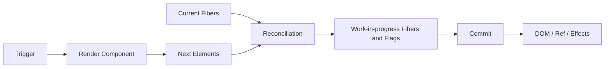
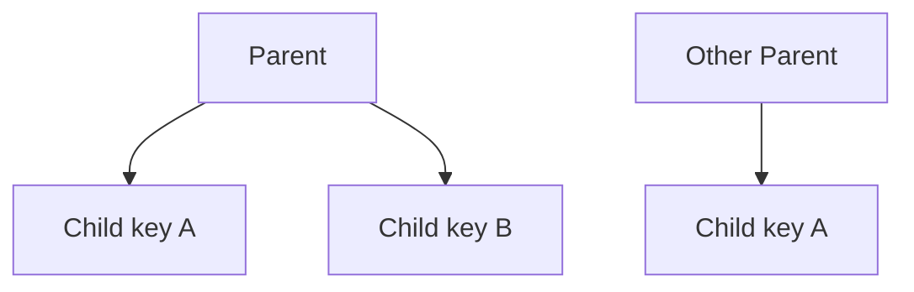
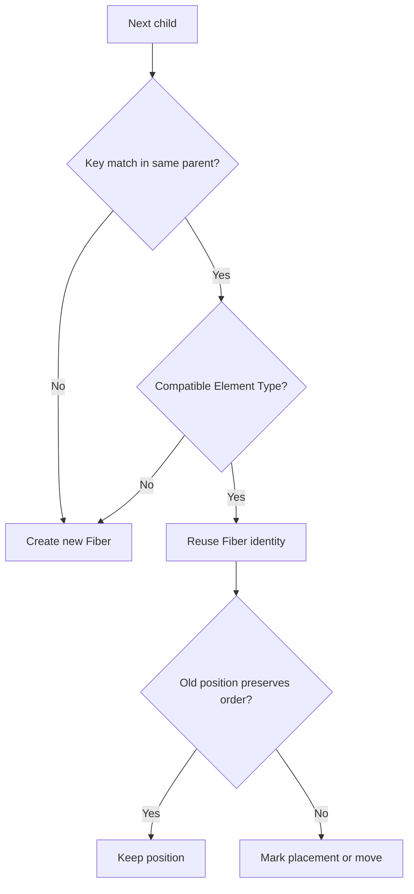
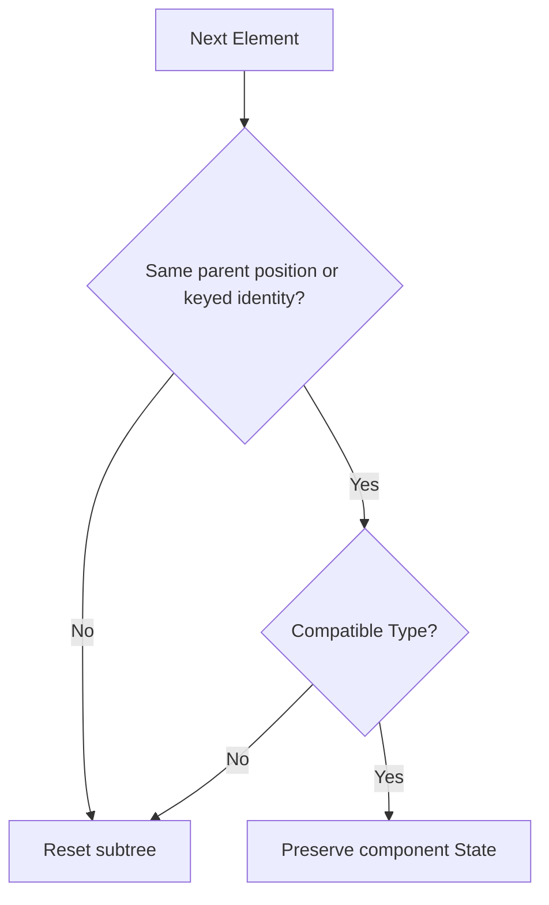

# React Reconciliation：从 Element Type、Key 到状态保留与列表移动

> Reconciliation 的核心不是寻找两棵任意树之间数学意义上的最小编辑距离，而是在父级边界内使用 Element Type、位置与 Key 建立稳定身份。身份连续，State、DOM 和 Effect 才可能复用；身份改变，React 就会重建对应子树。

---

## 一、本文解决什么问题

- Reconciliation 发生在 Render 还是 Commit；
- Element Type 相同到底指什么；
- `key` 是全局 ID、业务 Props，还是同级身份提示；
- 为什么 React 主要做同层比较，不跨父级搜索最优匹配；
- 在列表头部插入元素时，稳定 Key 与索引 Key 有何差别；
- 元素移动是否必然卸载组件、重建 DOM；
- 条件分支为什么有时保留 State，有时重置；
- `Fragment` 什么时候需要 Key，短语法为什么不能写 Key；
- 随机 Key、重复 Key 和对象 Key 会造成什么问题；
- 使用 Key 强制重置表单是否合理；
- Re-render、Reconcile、Remount 和 DOM Mutation 有何区别；
- 如何测试列表身份、焦点、草稿和订阅没有串位。

本文讨论现代 React 的公开身份规则，并用 React 18/19 常见实现解释列表协调。顺序扫描、Map、Placement Flag 等属于版本实现，不是公共 API；业务只能依赖 React 对 Element Type、Key、父级位置和 State 身份的公开行为。

### 核心结论

1. Reconciliation 位于 Render Phase，负责把 Current Children 与 Next Children 对应起来，并为 Commit 准备工作。
2. React 采用启发式同层协调，而不是计算任意树的全局最小差异。
3. Element Type 决定组件或宿主节点的种类；同一位置类型改变会重置对应子树。
4. `key` 只在直接兄弟集合中表达身份，不要求全局唯一，也不会作为普通 Props 传给组件。
5. 无 Key 的同类节点主要按父级中的逻辑位置匹配；位置变化可能让 State 关联到错误业务实体。
6. 稳定 Key 让同一父级下的列表项在插入、删除和移动后保持身份，但不保证跨父级移动时保留 State。
7. State 属于树中的身份位置，不属于 JSX 行号、函数名文本或业务对象本身。
8. Key 改变是显式创建新身份的工具，可重置表单、Effect、Ref 和宿主子树。
9. 随机 Key、重复 Key 和可变化 Key 会导致错误复用、重复挂载、焦点丢失或不可预测结果。
10. 重建成本不仅是 DOM 创建，还包括 State 丢失、Effect Cleanup/Setup、Ref、布局、资源和用户输入。

---

## 二、Reconciliation 在更新链路中的位置



Reconciliation 在 Render 中计算哪些身份可以复用、哪些节点需要插入、移动、更新或删除。Commit 才把完成结果应用到宿主环境。

因此：

- Reconciliation 可以运行后被废弃；
- Reconcile 到“需要更新”不代表 DOM 已更新；
- 组件 Re-render 也不保证对应 DOM Mutation；
- Render 必须纯净，因为候选结果可能不 Commit。

### 2.1 为什么不求全局最优 Diff

一般树编辑距离计算成本较高，也未必符合 UI 语义。React 使用两个重要假设缩小问题：

1. 不同 Element Type 通常代表不同子树；
2. 开发者通过 `key` 标识同级中可跨位置保持身份的 Child。

这让协调在常见 UI 场景中可预测且足够高效，但要求开发者正确表达身份。

---

## 三、Element Type：第一层身份边界

Element Type 可以是宿主类型字符串、组件函数、Class、Fragment、Suspense 等 React 能识别的类型。

```tsx
<button>保存</button> // Host Type: 'button'
<SaveButton />       // Component Type: SaveButton 函数引用
```

### 3.1 相同类型可能复用身份

```tsx
function Page({ compact }: { compact: boolean }) {
  return <Counter compact={compact} />;
}
```

Props 改变时 Element Type 仍是同一个 `Counter` 函数。若父级位置和 Key 也匹配，React 通常保留组件 State，并用新 Props 继续 Render。

### 3.2 类型改变会替换子树

```tsx
function Result({ success }: { success: boolean }) {
  return success ? <SuccessPanel /> : <ErrorPanel />;
}
```

同一父级位置从 `SuccessPanel` 变为 `ErrorPanel`，旧身份结束，新身份创建。旧子树 State、Ref 和 Effect 生命周期随之结束。

宿主类型改变同样会替换：

```tsx
return emphasized ? <strong>{text}</strong> : <span>{text}</span>;
```

### 3.3 函数名称相同不代表 Type 相同

```tsx
function Page() {
  function Editor() {
    const [text, setText] = useState('');
    return <input value={text} onChange={(e) => setText(e.currentTarget.value)} />;
  }

  return <Editor />;
}
```

每次 `Page` Render 都创建新的函数对象，即使名称仍是 `Editor`，Type 引用也变了，State 可能不断重置。组件应定义在模块顶层。

### 3.4 包装组件的类型边界

`memo(Component)`、`forwardRef` 或 Lazy Component 会产生 React 可识别的包装类型。具体内部 `elementType`/`type` 解析属于版本实现；不要通过比较私有 Fiber 字段推导业务身份。

---

## 四、`key`：同级集合中的身份

```tsx
function UserList({ users }: { users: readonly User[] }) {
  return (
    <ul>
      {users.map((user) => (
        <UserRow key={user.id} user={user} />
      ))}
    </ul>
  );
}
```

`key` 告诉 React：在这个直接兄弟集合中，哪个 Next Child 对应哪个 Current Child。

### 4.1 Key 的作用域

Key 只需在同一父级的兄弟中唯一：

```tsx
<ActiveUsers users={users} />
<ArchivedUsers users={users} />
```

两个独立列表可重复使用同一批 `user.id`，因为它们不在同一个兄弟集合中。

### 4.2 Key 不是普通 Props

```tsx
<UserRow key={user.id} userId={user.id} user={user} />
```

组件不能通过 `props.key` 读取 Key。业务需要 ID 时必须显式传入。

### 4.3 Key 应来自业务身份

优先选择：

- 数据库或服务端稳定 ID；
- 创建实体时生成并持久保存的客户端 ID；
- 在该兄弟集合内稳定且唯一的业务复合键。

不应选择：

- `Math.random()`；
- 每次 Render 重新生成的 UUID；
- 会随展示内容变化的字段；
- 默认对象字符串化结果；
- 会发生插入、删除或重排列表中的数组索引。

### 4.4 Key 不是安全边界

Key 仅供 React 协调使用，不证明用户有权访问该实体，也不会防止数据重复或篡改。权限与数据一致性必须在业务和服务端验证。

---

## 五、同层比较：父级边界决定匹配范围

React 主要在同一个 Parent Fiber 的 Children 集合内协调：



两个 `key="A"` 属于不同父级，不是同一身份。把节点从 Parent P 移到 Parent Q，通常意味着旧位置卸载、新位置挂载，即使 Key 相同。

### 5.1 Key 不是全树搜索指令

React 不会拿一个 Key 在整棵应用树中搜索“是否有同一个组件可以搬过来”。这种全局匹配既昂贵，也会让状态所有权难以预测。

### 5.2 无 Key 时按位置推断

```tsx
return (
  <>
    <Counter label="A" />
    <Counter label="B" />
  </>
);
```

这两个同类型组件主要由第一个、第二个逻辑位置区分。若交换 Props 而不提供 Key，State 仍跟着位置，可能看起来“数据换了，但计数没有跟着实体走”。

### 5.3 JSX 位置是逻辑树位置

身份不取决于源文件行号、缩进或视觉坐标，而取决于 React Children 结构。条件表达式写在不同代码行，也可能产生同一父级位置的同类型 Element。

---

## 六、列表协调的概念流程

以 Current 列表和 Next 列表为例：

```text
Current: A B C D
Next:    A C B E
```

常见 React 实现可概念化为：

1. 从头顺序比较可直接复用的 Child；
2. 出现不匹配后，为剩余旧 Child 建立按 Key/位置查找的结构；
3. 遍历剩余新 Child，复用匹配节点或创建新节点；
4. 标记需要插入或移动的节点；
5. 标记未被复用的旧节点为删除；
6. Commit 时执行必要宿主操作。



顺序扫描、Map 和位置索引属于常见版本实现，不能当作永久 API。可依赖的结果是：同父级下稳定 Key 与兼容 Type 支持身份复用。

---

## 七、列表插入、删除与移动

### 7.1 在头部插入

稳定 Key：

```text
Current: A B C
Next:    X A B C
```

React 可把 X 识别为新节点，同时让 A/B/C 继续关联原身份。

索引 Key：

```tsx
items.map((item, index) => <Row key={index} item={item} />)
```

插入 X 后，旧 `key=0` 从 A 对应到 X、`key=1` 从 B 对应到 A。State、输入草稿和非受控 DOM 值可能串到错误实体。

### 7.2 删除

稳定 Key 能让 React 精确结束被删除实体的身份，其他项保持。删除子树通常会触发 Effect Cleanup、Ref 断开与 DOM 移除。

### 7.3 移动

```text
Current: A B C
Next:    C A B
```

同父级、同 Key、兼容 Type 的 C 可以保留组件 State，Commit 时根据需要移动或重新插入宿主节点。移动不等于组件必然 Remount。

### 7.4 跨父级移动

```tsx
return side === 'left'
  ? <LeftPanel><Editor key={id} /></LeftPanel>
  : <RightPanel><Editor key={id} /></RightPanel>;
```

`Editor` 改变了父级位置，普通协调语义下会结束旧身份并创建新身份。相同 Key 不能跨 Parent 保证 State 保留。

### 7.5 索引 Key 何时可接受

只有当列表满足成员、顺序和身份不会变化，例如完全静态的展示列表，索引 Key 才较安全。一旦未来加入排序、筛选、插入、删除或本地 State，风险就会出现。工程上优先从数据模型解决稳定 ID。

---

## 八、State 保留与重置

State 关联到树中由 Parent、位置、Type 和 Key 描述的身份。



这是公开行为的简化模型，不是内部源码条件的逐行翻译。

### 8.1 Props 改变不会自动重置 State

```tsx
<ProfileForm user={selectedUser} />
```

若同一位置始终是 `ProfileForm` 且无 Key 变化，切换 `selectedUser` 后本地草稿通常保留。若业务要开启新的编辑会话，应显式表达：

```tsx
<ProfileForm key={selectedUser.id} user={selectedUser} />
```

### 8.2 Key 改变会重建子树

Key 改变通常意味着：

- 组件 State 重新初始化；
- 旧 Effect Cleanup，新 Effect Setup；
- Ref 断开再连接；
- 对应宿主节点可能重建；
- 焦点、选择区、滚动和非受控输入值可能丢失。

这可以用于重置表单，但不应作为普通“刷新组件”的默认手段。

### 8.3 State 不属于业务对象

同一个 `user` 对象出现在两个位置，会产生两个组件身份和两份局部 State。反过来，一个位置切换到另一个用户但身份不变，旧局部 State 可能继续存在。

---

## 九、条件渲染位置

### 9.1 同一位置、同一类型通常保留

```tsx
return isAdmin
  ? <Counter label="管理员" />
  : <Counter label="访客" />;
```

两条分支在同一父级返回位置产生同类型、同 Key 的 `Counter`，State 通常保留。Props 的语义变了，不代表身份自动改变。

### 9.2 使用 Key 表达不同会话

```tsx
return isAdmin
  ? <Counter key="admin" label="管理员" />
  : <Counter key="guest" label="访客" />;
```

Key 不同，身份重置。Key 应表达真实会话边界，而不是随 Render 随机变化。

### 9.3 包装结构改变

```tsx
return compact
  ? <Editor />
  : <section><Editor /></section>;
```

`Editor` 的父级路径改变，旧身份通常无法直接复用。仅增加视觉包装也可能重置深层 State，应在设计 DOM 结构时考虑身份影响。

### 9.4 `null` 与位置

某个 Child 消失为 `null` 后，其身份通常结束；之后重新出现会重新挂载。若需要隐藏但保留状态，应根据场景考虑 CSS、上层状态所有权或 React 提供的相应能力，并评估可访问性和性能，而不是假设 `null` 会缓存组件。

---

## 十、Fragment Key

短 Fragment 语法不能携带 Key：

```tsx
<>
  <dt>{term}</dt>
  <dd>{description}</dd>
</>
```

在列表中每个条目需要返回多个兄弟节点时，应使用显式 Fragment：

```tsx
import { Fragment } from 'react';

function Glossary({ entries }: { entries: readonly Entry[] }) {
  return (
    <dl>
      {entries.map((entry) => (
        <Fragment key={entry.id}>
          <dt>{entry.term}</dt>
          <dd>{entry.description}</dd>
        </Fragment>
      ))}
    </dl>
  );
}
```

Key 应放在列表回调直接返回的最外层 Element/Fragment 上，而不是只放在 Fragment 内部某个 `<dt>`。

### 10.1 Fragment 不增加宿主节点

Fragment 提供 React Children 分组，不创建额外 DOM Wrapper。其身份仍参与协调；改变 Fragment Key 可重置该组子树。

### 10.2 嵌套数组的 Key 作用域

每一层数组或可迭代兄弟集合都需要在该层提供稳定 Key。内层 Key 不能替代外层分组 Key。

---

## 十一、不稳定与错误 Key

### 11.1 随机 Key

```tsx
<Editor key={Math.random()} />
```

每次 Render 都产生新身份，导致 State、DOM、Effect 和焦点反复重建，也会让 Memoization 失去意义。

### 11.2 重复 Key

```tsx
users.map((user) => <UserRow key={user.name} user={user} />)
```

姓名可能重复。React 会警告兄弟 Key 不唯一，匹配结果不再可靠。不能依赖“看起来还能显示”的偶然结果。

### 11.3 可变化 Key

```tsx
<UserRow key={`${user.id}-${theme}`} user={user} />
```

主题变化不应改变用户身份。把展示状态放入 Key 会导致无意义 Remount。

### 11.4 对象 Key

```tsx
<UserRow key={user as unknown as string} user={user} />
```

Key 应使用 React 支持的稳定标量身份。强行断言对象既不能建立稳定业务键，也会隐藏类型问题。

### 11.5 Key 生成时机

需要客户端 ID 时，应在创建实体时生成并存入数据模型：

```typescript
type DraftItem = { id: string; text: string };

function createDraft(text: string): DraftItem {
  return { id: crypto.randomUUID(), text };
}
```

不要在 `map` Render 过程中重新生成。

---

## 十二、重建成本

Remount 或子树替换可能产生：

- 函数组件与 Hooks 重新初始化；
- Effect Cleanup 和 Setup；
- 订阅、Observer、Timer、Worker 或连接重建；
- DOM 创建、插入、删除与事件关联；
- Style、Layout、Paint；
- 焦点、选区、滚动位置和表单草稿丢失；
- 图片、Canvas、编辑器或第三方组件重新初始化。

### 12.1 移动与重建不是一回事

稳定 Key 的同父级移动可保留组件身份和 State，但宿主移动仍可能产生 DOM/Layout 成本。反之，组件 Re-render 即使没有 Remount，也可能更新大量 DOM。

### 12.2 不要只数 DOM 节点

某个子树 DOM 很少，却可能有昂贵 Effect、图表实例或网络订阅。另一个大静态 DOM 子树也可能因 Bailout 几乎没有更新。成本必须用 React Profiler、Performance Trace 和 Heap 工具测量。

### 12.3 Key 重置的合理场景

- 切换业务实体时创建全新编辑会话；
- 游戏关卡或问卷实例重新开始；
- 第三方组件没有可靠的受控重置 API；
- Error Recovery 明确要求丢弃损坏局部状态。

即使合理，也应评估焦点恢复、未保存数据提示和资源 Cleanup。

---

## 十三、Reconciliation 与 Memoization

`memo`、`useMemo` 和 `useCallback` 不决定 Key 身份，但会影响某些 Render 工作能否跳过。

- Key/Type 不匹配时，旧组件身份已结束，`memo` 无法挽救；
- Key/Type 匹配时，React 才有机会复用 Fiber，再判断是否 Bailout；
- 每次创建新对象或函数可能让 Props 比较失败；
- Context 与组件自身 State 仍可触发 Memoized Component；
- 自定义比较函数错误可能产生 Stale Props/Closure。

正确顺序是先保证身份语义，再用 Profiler 证明是否需要 Memoization。

---

## 十四、常见误区与错误案例

### 14.1 Key 必须全局唯一

错误。Key 只需在直接兄弟集合内唯一，但必须在该集合的生命周期中稳定。

### 14.2 相同 Key 就能跨父级保留 State

错误。React 主要在同一 Parent 的 Children 中协调，Key 不是全树迁移标识。

### 14.3 数组索引 Key 只影响性能

错误。它首先是正确性风险，可能让输入、展开状态、动画和订阅对应到错误实体。

### 14.4 Element 移动必然 Remount

错误。同父级下稳定 Key 与兼容 Type 可以保留身份；Commit 可能只移动宿主节点。

### 14.5 Props 改变会重置 State

错误。Props 是新输入，身份不变时 State 通常保留。需要重置应重新设计所有权或显式改变 Key。

### 14.6 用随机 Key 修复“组件不更新”

这会掩盖 State 建模、不可变更新或 Effect 依赖问题，并引入完整重建。应先找到真实根因。

### 14.7 在子组件内部设置 Key

```tsx
// 错误：List 返回的直接兄弟仍没有 Key。
function Row({ item }: { item: Item }) {
  return <li key={item.id}>{item.label}</li>;
}

items.map((item) => <Row item={item} />);
```

应把 Key 放在 `map` 直接产生的 `<Row>` 上。

---

## 十五、性能、测试与验证

### 15.1 身份回归测试

列表不能只测试文本，应验证：

1. 在 B 行输入草稿或展开详情；
2. 在头部插入 X；
3. 重排为 C、B、A；
4. 删除 A；
5. 断言草稿、焦点和展开状态仍属于 B。

这能直接捕获索引 Key 和不稳定 Key。

### 15.2 Effect 生命周期测试

为 Row 注入可观察订阅，重排时断言稳定 Key 没有无意义 Disconnect/Connect；删除时对应 Cleanup 执行；更换实体 Key 时旧资源释放。

### 15.3 Profiler 与浏览器证据

观察：

- 哪些组件 Mount、Update 或 Unmount；
- Commit Duration；
- DOM Mutation 与 Layout；
- 输入焦点和 Layout Shift；
- Heap 中旧子树是否被订阅或闭包保留。

开发 Strict Mode 会增加部分生命周期检查，不能只凭日志次数判断生产 Remount。

### 15.4 数据规模

稳定 Key 不会自动解决万级列表渲染。大列表仍需分页、虚拟化、增量加载和稳定数据结构，并在生产构建、目标设备和真实数据下测量。

---

## 十六、工程方案选择

| 场景 | 推荐身份策略 | 说明 |
|---|---|---|
| 服务端实体列表 | 稳定实体 ID | 同父级重排可保留状态 |
| 客户端新建草稿 | 创建时生成并持久化 ID | 不在 Render 中生成 |
| 静态无状态文本列表 | 索引可接受 | 确认未来不会重排 |
| 切换用户编辑表单 | `key={user.id}` | 明确重置编辑会话 |
| 多节点列表项 | `<Fragment key={id}>` | 短 Fragment 不能写 Key |
| 展示主题变化 | Key 不包含主题 | 主题不是实体身份 |
| 跨容器显示同一数据 | 提升 State 或外部 Store | 相同 Key 不跨父级迁移 State |
| 大型列表 | 稳定 Key + 虚拟化 | Key 不降低节点总量 |

---

## 十七、源码与版本边界

源码阅读可从目标版本的 Child Reconciler 入口，跟踪单节点、数组、Iterator、Text 与 Fragment 的协调路径，再观察生成的 Placement/Deletion 等 Flags 如何在 Commit 消费。

必须区分：

| 层次 | 结论 | 依赖方式 |
|---|---|---|
| 公开契约 | Key 在兄弟中表达稳定身份 | 业务可依赖 |
| 架构模型 | 同层启发式协调 | 用于理解 |
| 版本实现 | 顺序扫描、Map、位置变量、Flag 名 | 不可写入业务逻辑 |

不要依赖源码行号、Fiber 私有字段或某版本的复杂度微结论。若要比较性能，应固定 React Commit、Renderer、数据模式和硬件，通过 Profile 验证。

---

## 十八、工程检查清单

- 每个动态列表项是否有稳定业务 Key；
- Key 是否只在必要的兄弟作用域唯一；
- Key 是否因主题、筛选状态或 Render 次数变化；
- 是否在 Render 中生成 UUID；
- 是否误用索引 Key 处理可重排列表；
- 多节点列表项是否使用 Keyed Fragment；
- 切换 Props 时 State 应保留还是重置；
- Key 重置是否会丢失草稿、焦点或连接；
- 跨父级移动是否已重新设计 State 所有权；
- 性能结论是否来自生产 Profile；
- 测试是否覆盖插入、删除、移动和身份串位。

---

## 十九、总结

1. Reconciliation 在 Render 中协调 Current 与 Next Children，Commit 才修改宿主环境。
2. React 使用 Type、父级位置和 Key 进行同层启发式身份匹配。
3. 相同 Type 与身份位置允许 State 复用，Type 或 Key 改变会重置子树。
4. Key 只在直接兄弟中唯一，不是全局 ID，也不是普通 Props。
5. 稳定 Key 能在同父级列表插入、删除和移动时保持业务实体身份。
6. 索引 Key 在重排列表中会把 State 绑定到位置，而不是实体。
7. 条件分支是否保留 State 取决于产生的树结构，不取决于 JSX 行号。
8. 多节点列表项应使用显式 Keyed Fragment。
9. 重建成本包括 DOM、State、Effect、Ref、焦点、布局和外部资源。
10. 算法细节属于版本实现，工程代码只依赖公开身份规则并通过测试验证。

正确的 Key 不是性能装饰，而是状态所有权和组件身份的一部分。先把业务实体身份建模清楚，React 才能在更新中做出正确复用。

---

## 问答复盘

### Q1：Reconciliation 与 Commit 有什么区别？

**答：** Reconciliation 在 Render 中计算身份复用和待处理变更；Commit 才把完成结果应用到 DOM、Ref 和 Effect 生命周期。

### Q2：Key 是否必须在整个应用中唯一？

**答：** 不需要，只需在直接兄弟集合中唯一；但在该集合的生命周期中必须稳定。

### Q3：相同 Key 的组件移动到另一个父级，State 会保留吗？

**答：** 通常不会。React 主要在同一 Parent 的 Children 中匹配，Key 不是跨树迁移标识。

### Q4：为什么索引 Key 在头部插入时会串 State？

**答：** 插入后相同索引对应了不同业务实体，React 会按位置复用旧身份，导致局部 State、输入或订阅跟错数据。

### Q5：Element 在列表中移动是否等于 Remount？

**答：** 不等于。同父级、稳定 Key、兼容 Type 时可保留组件身份，Commit 只处理必要的宿主移动。

### Q6：Props 从用户 A 改为用户 B，表单为何仍保留 A 的草稿？

**答：** Props 改变不等于身份改变。若要创建新编辑会话，应提升草稿所有权或使用 `key={user.id}` 明确重置。

### Q7：列表项返回多个节点时，Key 应放在哪里？

**答：** 放在 `map` 直接返回的显式 `<Fragment key={id}>` 上；短 Fragment 语法不能携带 Key。

### Q8：随机 Key 为什么不仅是性能问题？

**答：** 它让每次 Render 都创建新身份，会丢失 State、焦点、非受控输入，并反复执行 Effect Cleanup/Setup。

### Q9：稳定 Key 是否足以让万级列表流畅？

**答：** 不足。Key 解决身份正确性，大列表还需要分页、虚拟化、数据结构和实际性能测量。

---

## 延伸知识

- **状态分类**：局部 State、Server State、URL State 与 Form State 的所有权。
- **不可变更新**：引用相等、Structural Sharing 与 Bailout。
- **组件 API 设计**：Controlled State、Slot、Compound Components 与 Ref。
- **Hooks 生命周期**：State Queue、Effect Cleanup 与 Strict Mode。
- **列表性能**：虚拟化、分页、增量加载与 React Profiler。
- **动画与布局**：FLIP、View Transition、Layout Effect 与焦点管理。
