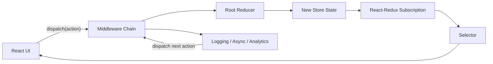

# React Redux 工程实践：Store、Middleware、Selector 与 RTK Query

> 现代 Redux 工程应以 Redux Toolkit 为默认入口：Store 集中组合能力，Action 描述事件，Reducer 纯粹计算 State，Middleware 承接副作用，Selector 隔离读取结构，RTK Query 管理可缓存的 Server State。Redux 的价值不只是“全局变量”，而是可观察、可测试、可约束的状态变化协议。

---

## 一、Redux 解决的不是组件传值问题

当多个页面共享 Client State、更新来源分散、业务要求审计事件或团队需要统一调试路径时，仅靠提升 State 和 Context 容易出现以下问题：

- 任意组件都能以不同方式修改同一领域状态；
- 异步任务、日志、权限提示和 Analytics 混入组件；
- 大型对象缺少规范化，更新一个实体需要遍历多处副本；
- 读取方直接依赖 Store 内部结构，重构成本高；
- 测试只能通过复杂 UI 才能覆盖状态迁移；
- 线上无法回答“哪个事件把 State 改成了这样”。

Redux 用单向数据流建立约束：组件 Dispatch Action，Reducer 根据旧 State 和 Action 计算新 State，订阅者通过 Selector 读取结果，Middleware 在 Dispatch 流程中承接副作用和扩展能力。

本文依据当前 Redux、Redux Toolkit 与 React-Redux 稳定官方文档。Redux 官方推荐使用 Redux Toolkit 编写 Redux 逻辑；旧式手写 Action Type、Action Creator、Switch Reducer 和 Store 配置只在维护遗留项目时需要理解，不应作为新项目默认模板。

### 核心结论

1. Store 保存当前 State Tree，并协调 Reducer、Dispatch、Middleware 和订阅。
2. Action 是已发生事件的数据描述，Reducer 必须同步、纯净且无副作用。
3. Plain Action 的 Dispatch 默认同步完成 Reducer 与 Store 更新；异步能力来自 Middleware。
4. `configureStore` 是现代 Store 配置入口，集成 Thunk、DevTools 和开发期检查。
5. `createSlice` 通过 Immer Draft 简化不可变更新，但 Reducer 外仍禁止修改 State。
6. Selector 是读取契约；组件不应直接散落依赖深层 State Shape。
7. Normalization 用 `ids + entities` 减少重复实体和嵌套更新，`createEntityAdapter` 提供标准实现。
8. `createAsyncThunk` 适合命令式异步流程，但不自动提供 Query Cache、去重和失效。
9. RTK Query 适合可缓存 Server State，负责请求生命周期、缓存键、订阅和失效标签。
10. Redux 工程必须同时处理 SSR 隔离、取消、竞态、错误、敏感数据、测试和性能测量。

---

## 二、Redux 数据流



一次 Plain Action 的基本过程：

1. UI、Thunk 或外部系统调用 `dispatch(action)`；
2. Action 按顺序经过 Middleware；
3. Middleware 调用 `next(action)` 后进入 Reducer；
4. Root Reducer 调用各 Slice Reducer；
5. Store 保存新的 Root State；
6. React-Redux 检查相关 Selector 结果；
7. 结果变化的组件进入 React 更新流程。

Redux Reducer 的执行是同步的。网络请求不能“在 Reducer 中等待”，异步流程必须在 Middleware、Thunk、RTK Query 或其他明确副作用层中完成。

### 2.1 Redux 与 React 的边界

Redux Store 位于 React 之外，React-Redux 负责把 Store Snapshot 安全地接入组件。业务组件应使用 `useSelector` 和 `useDispatch`，不要自行调用 `store.subscribe` 再用 Effect 同步 State。

Redux 更新不等于 React 立即修改 DOM。Dispatch 更新 Store 后，React-Redux 安排受影响组件 Render，最终仍由 React Commit 保证界面提交。

---

## 三、Store：组合状态能力的入口

推荐用 Store Factory 配置 Store，便于测试、SSR 和多实例隔离：

```tsx
import { configureStore } from '@reduxjs/toolkit';

export function makeStore() {
  return configureStore({
    reducer: {
      cart: cartReducer,
      session: sessionReducer,
    },
  });
}

export type AppStore = ReturnType<typeof makeStore>;
export type RootState = ReturnType<AppStore['getState']>;
export type AppDispatch = AppStore['dispatch'];
```

`configureStore` 负责：

- 组合 Slice Reducer；
- 安装合理的默认 Middleware；
- 默认支持 Redux DevTools；
- 在开发环境检查常见不可变和可序列化问题；
- 推导准确的 `RootState` 与 `AppDispatch` 类型。

### 3.1 Provider 与 Typed Hooks

纯客户端 SPA 可以在入口创建一个 Store：

```tsx
const store = makeStore();

root.render(
  <Provider store={store}>
    <App />
  </Provider>,
);
```

集中导出 Typed Hooks，避免每个组件重复写类型：

```tsx
export const useAppDispatch = useDispatch.withTypes<AppDispatch>();
export const useAppSelector = useSelector.withTypes<RootState>();
export const useAppStore = useStore.withTypes<AppStore>();
```

`.withTypes` 需要支持该能力的 React-Redux 版本。维护较旧版本时可使用 `TypedUseSelectorHook<RootState>` 和显式 Dispatch Wrapper，但不要在业务组件中到处使用未类型化的 Hooks。

### 3.2 Store 中应该保存什么

适合保存：

- 跨组件共享的 Client State；
- 可序列化的领域实体与状态；
- 明确需要 DevTools、Middleware 或持久化的状态；
- RTK Query 管理的请求 Cache Slice。

通常不应保存：

- React Element、DOM Node、Ref；
- Promise、AbortController、WebSocket 实例；
- 可以由其他 State 直接计算的 Derived Value；
- 已由 URL 或 Server State Cache 拥有的重复副本；
- 仅在一个组件内部使用的临时 UI State。

可序列化是工程建议，不是 Redux Core 的运行时硬限制。确需存储非序列化值时，要明确 DevTools、Persistence、SSR 和调试代价，并精准配置检查例外，不能全局关闭保护来隐藏设计问题。

---

## 四、Reducer 与 Action：事件驱动的状态迁移

Redux Toolkit 用 `createSlice` 同时定义 Slice Name、Initial State、Reducer 和 Action Creator：

```tsx
type CartState = {
  items: CartItem[];
  couponCode: string | null;
};

const initialState: CartState = {
  items: [],
  couponCode: null,
};

const cartSlice = createSlice({
  name: 'cart',
  initialState,
  reducers: {
    itemAdded(state, action: PayloadAction<CartItem>) {
      state.items.push(action.payload);
    },
    itemRemoved(state, action: PayloadAction<string>) {
      state.items = state.items.filter(
        (item) => item.productId !== action.payload,
      );
    },
    couponApplied(state, action: PayloadAction<string>) {
      state.couponCode = action.payload;
    },
  },
});

export const { itemAdded, itemRemoved, couponApplied } = cartSlice.actions;
export const cartReducer = cartSlice.reducer;
```

Action Type 会带有 Slice Prefix，例如 `cart/itemAdded`。Action 名优先表达领域事件，而不是暴露任意 Setter：`orderCancelled` 通常比 `setOrderStatus` 更能约束业务意图。

### 4.1 Reducer 的公开契约

Reducer 必须：

- 对相同 State 与 Action 给出相同结果；
- 不发请求、不写日志、不操作 DOM；
- 不读取当前时间、随机数或全局可变对象决定结果；
- 不 Dispatch 其他 Action；
- 不修改传入的真实 State 对象。

时间戳、随机 ID 等值应在 Action 创建前、Thunk 或 `prepare` Callback 中生成，再作为 Payload 传入 Reducer。

### 4.2 `extraReducers` 与跨 Slice 事件

Slice 可以响应自己未创建的 Action：

```tsx
const preferencesSlice = createSlice({
  name: 'preferences',
  initialState: preferencesInitialState,
  reducers: {},
  extraReducers: (builder) => {
    builder.addCase(sessionLoggedOut, () => preferencesInitialState);
  },
});
```

这允许多个 Slice 对同一个领域事件独立更新，而不让一个 Reducer 直接修改另一个 Slice。共享事件可使用 `createAction` 定义在领域模块中。

---

## 五、不可变更新与 Immer Draft

Redux Toolkit 的 Slice Reducer 由 Immer 包装，因此可以写类似 Mutation 的代码：

```tsx
quantityIncremented(state, action: PayloadAction<string>) {
  const item = state.items.find(
    (candidate) => candidate.productId === action.payload,
  );

  if (item) {
    item.quantity += 1;
  }
}
```

这里修改的是 Immer Draft。Immer 根据 Draft 操作生成结构共享的新 State，未变化分支尽量保留旧引用。

### 5.1 常见陷阱

给局部参数重新赋值不会替换 State：

```tsx
cartReplaced(state, action: PayloadAction<CartState>) {
  state = action.payload; // 错误：只改变局部变量
}
```

需要返回新值：

```tsx
cartReplaced(_state, action: PayloadAction<CartState>) {
  return action.payload;
}
```

一个 Case Reducer 不应既修改 Draft 又返回另一个新对象。Reducer 外部也不能修改从 `getState()` 或 Selector 得到的对象。

### 5.2 引用稳定性仍然重要

Immer 简化更新语法，不会自动修复错误 State Shape。如果每次 Action 都重建整个大型数组，依赖这些引用的 Selector 和组件仍会重新计算。不可变更新需要与 Normalization、Selector 和更新粒度共同设计。

---

## 六、Dispatch 与 Middleware

Plain Action Dispatch 默认是同步的：Reducer 执行、Store 保存新 State、订阅者收到通知，然后 `dispatch` 返回。Middleware 可以包裹这条调用链：

```tsx
const metricsMiddleware: Middleware<{}, RootState> =
  (storeApi) => (next) => (action) => {
    const startedAt = performance.now();
    const result = next(action);

    if (isAction(action) && action.type.startsWith('checkout/')) {
      recordReduxMetric({
        actionType: action.type,
        durationMs: performance.now() - startedAt,
        signedIn: selectIsSignedIn(storeApi.getState()),
      });
    }

    return result;
  };
```

Middleware 适合：

- Thunk 等异步控制流；
- Analytics、日志和性能埋点；
- 监听特定 Action 触发工作流；
- 崩溃上报和协议适配；
- RTK Query 请求生命周期。

### 6.1 Middleware 的边界

- 必须按预期调用并返回 `next(action)`，除非明确要截断；
- 顺序会影响 Action 如何被解释；
- 不应记录 Token、密码或完整敏感 State；
- 客户端 Middleware 不能代替服务端鉴权；
- 不要在多个 Middleware 中隐式修改同一业务 Payload；
- 长耗时同步逻辑会阻塞 Dispatch 和主线程。

添加自定义 Middleware：

```tsx
configureStore({
  reducer: rootReducer,
  middleware: (getDefaultMiddleware) =>
    getDefaultMiddleware().concat(metricsMiddleware),
});
```

不要随意用自定义数组覆盖默认 Middleware，否则可能同时丢失 Thunk 与开发期检查。

---

## 七、Selector：隔离读取结构

Selector 把 Root State 映射为组件需要的数据：

```tsx
const selectCartItems = (state: RootState) => state.cart.items;

export const selectCartTotal = createSelector(
  [selectCartItems],
  (items) =>
    items.reduce(
      (total, item) => total + item.price * item.quantity,
      0,
    ),
);

function CartTotal() {
  const total = useAppSelector(selectCartTotal);
  return <strong>{formatCurrency(total)}</strong>;
}
```

### 7.1 为什么不应散落深层读取

```tsx
const total = useAppSelector((state) =>
  state.checkout.cart.current.items.reduce(/* ... */),
);
```

大量组件直接依赖内部路径，会让 State Shape 变成公共 API。集中 Selector 可以：

- 隐藏 Slice 结构；
- 复用派生逻辑；
- 独立测试；
- 使用 Memoization；
- 为 Normalization 和重构提供迁移层。

### 7.2 `useSelector` 与引用

`useSelector` 默认使用严格引用比较判断结果是否变化。以下 Selector 每次都创建对象：

```tsx
const summary = useAppSelector((state) => ({
  count: state.cart.items.length,
  couponCode: state.cart.couponCode,
}));
```

即使字段没变，新对象也会使比较失败。可选择：

- 分别订阅 Primitive；
- 使用 `createSelector` 返回缓存对象；
- 在明确适合时使用 `shallowEqual`；
- 下移组件订阅边界。

Memoization 只有在输入引用稳定时才有效。Selector 中每次先执行 `filter()` 再作为输入，会提前制造新引用并破坏缓存。

---

## 八、Normalization：一个实体只保留一份

深层嵌套和重复实体会放大更新成本：

```ts
type OrdersState = {
  orders: Array<{
    id: string;
    customer: Customer;
    items: Array<{ product: Product; quantity: number }>;
  }>;
};
```

同一个 Product 可能出现在多个 Order 中。更新名称时必须找到所有副本，也容易漏掉。

Normalized State 通常使用：

```ts
type NormalizedOrders = {
  ids: string[];
  entities: Record<string, Order>;
};
```

关系通过 ID 表达，Selector 再组合视图。

### 8.1 `createEntityAdapter`

```tsx
const ordersAdapter = createEntityAdapter<Order>({
  sortComparer: (a, b) => b.updatedAt.localeCompare(a.updatedAt),
});

const ordersSlice = createSlice({
  name: 'orders',
  initialState: ordersAdapter.getInitialState({
    status: 'idle' as 'idle' | 'loading' | 'failed',
  }),
  reducers: {
    ordersReceived: ordersAdapter.setAll,
    orderUpserted: ordersAdapter.upsertOne,
    orderRemoved: ordersAdapter.removeOne,
  },
});

export const ordersSelectors = ordersAdapter.getSelectors<RootState>(
  (state) => state.orders,
);
```

该排序示例假定 `updatedAt` 是统一 UTC、固定格式的 ISO 8601 字符串，可以按字典序比较；如果数据格式不满足该前提，应在入库时转换为明确的数值时间戳。

Entity Adapter 提供标准 CRUD Reducer 和 Selector，但不会替你决定领域边界。不是每个小数组都需要 Normalize；数据会按 ID 更新、跨页面复用或存在关系时收益更明显。

### 8.2 Normalization 与 RTK Query

RTK Query 默认按 Endpoint + Argument 缓存 Query Result，不会自动把所有 Query 中的实体合并成一个全局规范化数据库。可以在单个 Query Result 内用 Entity Adapter Transform，也可以依赖 Tag Invalidation 重新获取；不要同时维护手写 Entity Slice 和 RTK Query Cache 的可修改副本而没有同步协议。

---

## 九、Async Thunk：命令式异步流程

`createAsyncThunk` 根据一个异步 Payload Creator 自动生成 Pending、Fulfilled 和 Rejected Action：

```tsx
type OrderRequestError =
  | { kind: 'http'; status: number; message: string }
  | { kind: 'invalid-response'; message: string }
  | { kind: 'network'; message: string };

export const fetchOrder = createAsyncThunk<
  Order,
  string,
  { rejectValue: OrderRequestError }
>(
  'orders/fetchById',
  async (orderId, { signal, rejectWithValue }) => {
    try {
      const response = await fetch(`/api/orders/${orderId}`, { signal });

      if (!response.ok) {
        return rejectWithValue({
          kind: 'http',
          status: response.status,
          message: `Request failed with ${response.status}`,
        });
      }

      let json: unknown;

      try {
        json = await response.json();
      } catch (error) {
        if (signal.aborted) throw error;

        return rejectWithValue({
          kind: 'invalid-response',
          message: 'Order response was not valid JSON',
        });
      }

      const parsed = orderSchema.safeParse(json);

      if (!parsed.success) {
        return rejectWithValue({
          kind: 'invalid-response',
          message: 'Order response did not match the expected schema',
        });
      }

      return parsed.data;
    } catch (error) {
      if (signal.aborted) throw error;

      return rejectWithValue({
        kind: 'network',
        message: error instanceof Error ? error.message : 'Unknown network error',
      });
    }
  },
);
```

TypeScript 类型不会验证网络 JSON，因此示例使用项目中的 Runtime Schema 校验 `unknown`。HTTP 非 2xx 也必须显式处理，因为原生 `fetch` 不会自动 Reject。

### 9.1 在 Slice 中处理生命周期

```tsx
extraReducers: (builder) => {
  builder
    .addCase(fetchOrder.pending, (state, action) => {
      state.status = 'loading';
      state.currentRequestId = action.meta.requestId;
      state.error = null;
    })
    .addCase(fetchOrder.fulfilled, (state, action) => {
      if (state.currentRequestId !== action.meta.requestId) return;

      state.status = 'succeeded';
      state.currentRequestId = null;
      ordersAdapter.upsertOne(state, action.payload);
    })
    .addCase(fetchOrder.rejected, (state, action) => {
      if (state.currentRequestId !== action.meta.requestId) return;

      state.status = action.meta.aborted ? 'idle' : 'failed';
      state.currentRequestId = null;
      state.error = action.payload ?? { kind: 'network', message: action.error.message ?? 'Request failed' };
    });
}
```

`requestId` Guard 防止旧请求晚到后覆盖新结果。具体 State Shape 应根据“按实体并发”还是“整个页面单请求”设计；一个全局 `currentRequestId` 不适合同时加载多个 Order。

### 9.2 取消与错误传播

```tsx
useEffect(() => {
  const promise = dispatch(fetchOrder(orderId));

  return () => {
    promise.abort();
  };
}, [dispatch, orderId]);
```

组件需要等待业务结果时使用 `.unwrap()`：

```tsx
try {
  const order = await dispatch(fetchOrder(orderId)).unwrap();
  navigate(`/orders/${order.id}`);
} catch (error) {
  showOrderError(error);
}
```

Dispatch Async Thunk 返回的 Promise 默认解析为最终 Action；`.unwrap()` 才会返回 Fulfilled Payload，或对 Rejected 情况抛出错误/Payload。

### 9.3 Async Thunk 不提供什么

`createAsyncThunk` 不自动提供：

- Query Cache；
- 相同参数的 In-flight Deduplication；
- Stale Time；
- Subscription Reference Count；
- Tag Invalidation；
- 自动 Refetch。

可以用 `condition` 跳过已在执行的请求，但大量 CRUD Fetch 仍优先评估 RTK Query。

---

## 十、RTK Query：Server State Cache

RTK Query 是 Redux Toolkit 中的数据获取与缓存方案：

```tsx
export const ordersApi = createApi({
  reducerPath: 'ordersApi',
  baseQuery: fetchBaseQuery({ baseUrl: '/api' }),
  tagTypes: ['Order'],
  endpoints: (build) => ({
    getOrder: build.query<Order, string>({
      query: (orderId) => `/orders/${orderId}`,
      transformResponse: (response: unknown) => orderSchema.parse(response),
      providesTags: (_result, _error, orderId) => [
        { type: 'Order', id: orderId },
      ],
    }),

    updateOrder: build.mutation<Order, UpdateOrderInput>({
      query: ({ orderId, ...patch }) => ({
        url: `/orders/${orderId}`,
        method: 'PATCH',
        body: patch,
      }),
      invalidatesTags: (_result, _error, { orderId }) => [
        { type: 'Order', id: orderId },
      ],
    }),
  }),
});

export const { useGetOrderQuery, useUpdateOrderMutation } = ordersApi;
```

接入 Store：

```tsx
configureStore({
  reducer: {
    [ordersApi.reducerPath]: ordersApi.reducer,
    session: sessionReducer,
  },
  middleware: (getDefaultMiddleware) =>
    getDefaultMiddleware().concat(ordersApi.middleware),
});
```

### 10.1 RTK Query 负责的能力

- Endpoint + Argument 序列化形成 Cache Key；
- 相同 Query 的请求与订阅协调；
- Loading、Success、Error 和 Refetch 状态；
- Cache 生命周期和无订阅后的保留时间；
- Tag-based Invalidation；
- Polling、Prefetch、Lazy Query 等扩展；
- Mutation 与乐观更新基础设施；
- 自动生成 React Hooks。

### 10.2 Error、Authentication 与 Retry

生产项目通常需要自定义 `baseQuery` Wrapper：

- 统一附加认证信息；
- 处理 Token Refresh 的并发互斥；
- 区分 HTTP、Network、Parsing 和业务错误；
- 只对幂等请求进行有限退避重试；
- 将 Trace ID 和可观察字段传给日志系统；
- 避免把敏感响应写入不受控日志。

不要在每个 Endpoint 各写一次刷新 Token。多个请求同时 401 时，需要 Single-flight 刷新和失败后的统一登出协议。

### 10.3 乐观更新

RTK Query 可在 `onQueryStarted` 中使用 `updateQueryData` 修改 Cache，并在请求失败时调用 Patch Result 的 `undo()`。工程上仍需考虑：

- 多个 Mutation 并发时回滚顺序；
- 服务端最终版本和 ETag/Version；
- 写请求是否幂等；
- 回滚失败后是否直接 Invalidate 并 Refetch；
- 用户离线和页面关闭后的状态。

乐观更新不是“先改 UI 就结束”，而是一套临时版本、确认与回滚协议。

---

## 十一、Async Thunk 与 RTK Query 如何选择

| 场景 | Async Thunk | RTK Query |
|---|---|---|
| 命令式业务流程 | 合适 | 通常不是第一选择 |
| CRUD 数据读取 | 需要自建 Cache | 适合 |
| 请求去重与复用 | 自行实现 | 内置 Query 协调 |
| Cache 失效 | 自行设计 | Tag Invalidation |
| 多步骤编排 | 灵活 | 可在 Mutation/Lifecycle 扩展 |
| 文件处理或复杂 SDK | 常更直接 | 视 Base Query 适配成本 |
| 组件订阅 Server State | 手写 Slice/Selector | 自动生成 Hook |

常见组合是：

- RTK Query 管理订单、用户、商品等可缓存 Server State；
- Async Thunk 或 Listener Middleware 编排登录完成后的多步骤 Client Workflow；
- Local State 管理 Dialog、Input 和临时交互；
- URL 管理分页、筛选与实体身份。

不要为了“所有异步都统一”而把每个命令包装成 Query，也不要用 Thunk 重建一套 Query Cache。

---

## 十二、DevTools 与可观察性

Redux DevTools 可以查看 Action 序列、State Diff，并在开发环境进行回放或跳转。这要求 Action 和 State 尽量可序列化、Reducer 保持确定性。

### 12.1 DevTools 不是生产日志仓库

- Action Payload 可能包含 PII；
- State 可能包含 Token、订单地址和权限信息；
- 大型 State 快照会增加开发工具成本；
- Time Travel 不会回滚已经发生的网络请求和外部副作用；
- Middleware 日志必须脱敏和采样。

生产环境是否启用 DevTools、Action Trace 和远程日志，应由安全和性能策略决定。客户端 State 永远不能作为服务端授权依据。

### 12.2 事件命名决定诊断质量

`checkout/paymentAuthorized` 比 `checkout/setStatus` 更能解释发生了什么。Action 是调试时间线中的业务事件，命名应稳定、可理解，避免把组件实现细节暴露为全局协议。

---

## 十三、Store 生命周期、SSR 与持久化

### 13.1 SSR 必须按请求创建 Store

Node 进程会同时处理多个用户请求。包含用户数据的 Module Singleton Store 可能跨请求泄漏：

```tsx
export function createRequestStore(preloadedState: RootState) {
  return configureStore({
    reducer: rootReducer,
    preloadedState,
  });
}
```

服务端为每个请求创建实例，客户端使用安全序列化的 Initial State Hydrate。还要处理：

- Initial State 与服务端 HTML 一致；
- 序列化防 XSS；
- 不下发服务端 Secret；
- HTML Cache 按用户、租户和语言隔离；
- 框架对 RTK Query Prefetch 和 Hydration 的集成要求。

具体 SSR API 取决于 Next.js、Remix 或其他框架版本，应遵循对应官方集成方案。

### 13.2 退出登录与租户切换

退出登录后应清理：

- 用户相关 Slice；
- RTK Query Cache；
- Persisted State；
- WebSocket 和 Listener；
- 进行中的 Thunk 或上传任务；
- 跨 Tab Session 信息。

不要只把 `session.user` 设为 `null`，却继续保留上一账号的订单和权限数据。

### 13.3 Persistence

持久化 Redux State 需要：

- Slice Allowlist；
- Schema Version 和 Migration；
- 账号隔离和过期时间；
- 损坏数据回退；
- 多 Tab 冲突策略；
- 敏感字段排除；
- Hydration 前后的 UI 策略。

浏览器应用通常不应长期持久化完整 RTK Query Cache；重新获取和服务端失效机制往往更可靠。确需持久化时必须明确陈旧数据与重连策略。

---

## 十四、性能：从 Selector 和 State Shape 入手

Redux 不是“整个 Store 一变，所有组件都 Render”。React-Redux 会让每个 `useSelector` 订阅并比较自己的结果。常见性能问题包括：

- 组件订阅整个 Slice；
- Selector 每次返回新对象或数组；
- 实体未 Normalize，更新一项重建大列表；
- 一个组件同时渲染大量无关数据；
- 高频输入每个字符都 Dispatch 全局 Action；
- Reducer 或 Middleware 执行大规模同步计算；
- DevTools 处理过大的 Action Payload。

### 14.1 列表按 ID 订阅

父组件只选择 ID：

```tsx
function OrderList() {
  const orderIds = useAppSelector(ordersSelectors.selectIds);

  return orderIds.map((orderId) => (
    <OrderRow key={orderId} orderId={orderId} />
  ));
}
```

子项按 ID 选择实体：

```tsx
function OrderRow({ orderId }: { orderId: string }) {
  const order = useAppSelector((state) =>
    ordersSelectors.selectById(state, orderId),
  );

  if (!order) return null;
  return <OrderRowView order={order} />;
}
```

单个实体引用不变时，无关 Order 更新不需要让所有 Row 获得新对象。

### 14.2 一次业务原子更新使用一个 Action

React 可能批处理多个 Dispatch 引发的界面更新，但 Store 和 Middleware 仍会依次处理每个 Action，也可能观察到中间 State。若账号和权限必须同时切换，应设计一个领域 Action 原子更新相关 Slice，而不是依赖 UI Batching 隐藏中间版本。

### 14.3 测量方法

在生产构建和目标设备中：

1. 用 Redux DevTools 确认 Action 频率和 Payload；
2. 用 React DevTools Profiler 查看 Consumer Render；
3. 测量 Selector、Reducer 和 Middleware 耗时；
4. 检查 Normalization 与引用稳定性；
5. 观察 INP、Long Task、内存和 Hydration；
6. 优化后重复相同交互与数据规模。

不要用 Store 大小或 Action 数量单独判断性能。慢 Selector、巨型 JSON Parse 和组件本身的昂贵 Render 往往比 Redux Dispatch 更关键。

---

## 十五、测试策略

Redux 官方推荐更偏向集成行为测试：使用真实 Store 和 Provider，Mock 网络边界，不 Mock React-Redux Hooks。

### 15.1 每个测试创建 Store

```tsx
function renderWithStore(
  ui: ReactNode,
  { store = makeStore() }: { store?: AppStore } = {},
) {
  return {
    store,
    ...render(<Provider store={store}>{ui}</Provider>),
  };
}
```

避免复用生产 Module Singleton，否则 State、RTK Query Cache 和订阅会跨用例泄漏。

### 15.2 分层测试

- **Reducer**：给定 State + Action，断言 Invariant 和不可变结果；
- **Selector**：断言派生结果、缺失实体和引用缓存；
- **Middleware**：断言调用顺序、过滤和副作用边界；
- **Async Thunk**：覆盖 Fulfilled、HTTP Error、Invalid JSON、Abort 和旧请求；
- **RTK Query**：使用 MSW 等网络层 Mock，覆盖 Cache、Invalidation 和 Refetch；
- **组件**：通过用户交互 Dispatch，断言最终可见行为。

不要只断言某个 Action 被 Dispatch。用户最终看到什么、错误能否恢复、请求能否取消，才是更稳定的行为契约。

---

## 十六、目录与模块边界

推荐按 Feature 组织，而不是按技术类型把全项目拆成 Actions、Reducers、Selectors：

```text
features/
  orders/
    ordersApi.ts
    ordersSlice.ts
    ordersSelectors.ts
    OrdersPage.tsx
  checkout/
    checkoutSlice.ts
    checkoutListeners.ts
    CheckoutPage.tsx
app/
  store.ts
  hooks.ts
```

工程规则可以包括：

- 业务组件只导入 Typed Hooks、Action 和公开 Selector；
- Slice 内部 State Shape 不跨 Feature 暴露；
- Server State 优先由 API Slice 拥有；
- Shared Action 使用业务语言；
- 跨 Feature 副作用使用 Listener Middleware 或明确 Orchestrator；
- 避免循环导入 RootState 与 Store Runtime Value。

类型可以从 Store 推导，但 Runtime Module 依赖必须保持单向。

---

## 十七、常见误区

### 17.1 “Redux State 必须包含所有应用状态”

错误。Local、URL、Form 和 Server State 应按所有权选择工具，Redux 只保存适合它的部分。

### 17.2 “用了 Immer 就可以随处 Mutation”

错误。只有被 Immer 包装的 Reducer Draft 可以使用 Mutating Syntax，Selector 和组件读取结果仍视为不可变。

### 17.3 “Async Thunk 自动缓存和去重”

错误。它生成异步生命周期 Action，不是 Query Cache；CRUD 读取优先评估 RTK Query。

### 17.4 “RTK Query 会全局 Normalize 所有实体”

错误。它默认按 Query Cache Entry 保存结果，Tag 负责失效，不是自动规范化实体数据库。

### 17.5 “一个 `useSelector` 返回整个 Slice 更方便”

错误。任何 Slice 引用变化都会使组件获得新结果，应选择实际需要的数据。

### 17.6 “客户端 Middleware 可以保护权限”

错误。客户端校验只能改善体验，服务端必须独立执行认证、授权和输入验证。

### 17.7 “多个 Dispatch 会自动成为一个原子业务事务”

错误。每个 Action 都会依次通过 Middleware 和 Reducer。业务不可见中间状态时，应设计单一领域 Action。

### 17.8 “DevTools 能安全记录全部 State”

错误。敏感数据、巨大 Payload 和生产环境 Trace 都需要脱敏、限制和安全评审。

---

## 十八、工程检查清单

- Redux State 是否只包含合适的 Shared Client State；
- 是否使用 Redux Toolkit 而非新写旧式样板；
- Store 是否通过 Factory 支持测试和 SSR；
- Typed Hooks 是否集中导出；
- Action 是否表达业务事件；
- Reducer 是否纯净、同步且无副作用；
- Immer Mutating Syntax 是否只出现在 Draft 内；
- Selector 是否隐藏内部 State Shape；
- Selector 返回对象时是否保持引用稳定；
- 重复实体是否需要 Normalize；
- `createEntityAdapter` 的 ID 和 Sort 语义是否正确；
- Async Thunk 是否处理 HTTP Error、Runtime Validation 和 Abort；
- 是否使用 Request ID 或其他协议防止响应乱序；
- CRUD Server State 是否更适合 RTK Query；
- RTK Query Tag 是否能准确表达失效范围；
- Token Refresh 是否 Single-flight；
- Retry 是否仅用于安全、幂等场景；
- Middleware 是否返回 `next(action)` 结果并避免敏感日志；
- SSR Store 是否按请求隔离；
- 登出和租户切换是否清空旧数据与请求；
- Persistence 是否有 Version、Migration 和安全策略；
- 测试是否使用真实隔离 Store 与网络层 Mock；
- 性能是否在生产构建和目标设备中测量。

---

## 十九、总结

1. Redux 用 Action、Reducer、Store 和 Middleware 建立可预测的单向数据流。
2. Redux Toolkit 是现代 Redux 的默认写法，减少样板并提供正确配置。
3. Reducer 只负责纯 State Transition，所有副作用必须放到外部边界。
4. Immer 允许 Draft Mutation Syntax，但最终结果和组件读取仍遵守不可变约束。
5. Selector 是读取 API，应隔离 State Shape 并保证派生引用稳定。
6. Normalization 和 Entity Adapter 适合按 ID 复用、更新和关联的实体。
7. Async Thunk 适合命令式异步流程，必须处理取消、错误和响应竞态。
8. RTK Query 适合 Server State Cache，但不会自动成为全局规范化数据库。
9. DevTools、Middleware 和统一事件流带来治理能力，也要求隐私和命名规范。
10. SSR 请求隔离、Persistence Migration、真实 Store 测试和性能测量是生产 Redux 的必要部分。

Redux 工程质量不取决于 Slice 数量，而取决于状态所有权是否清晰、事件是否表达业务、异步是否可取消和恢复、读取是否通过稳定 Selector，以及团队能否沿 Action 时间线解释每一次变化。

---

## 问答复盘

### Q1：Redux Store 与 React Context 的核心区别是什么？

**答：** Context 主要传递 Value，Redux Store 提供独立更新协议、Selector 订阅、Middleware 和 DevTools；React-Redux 通常用 Context 传递 Store 实例。

### Q2：Plain Action Dispatch 是异步的吗？

**答：** 默认不是。Reducer 与 Store 更新同步完成；Thunk、RTK Query 等 Middleware 才引入异步控制流。

### Q3：为什么 Reducer 不能调用 API 或生成随机 ID？

**答：** Reducer 必须保持确定和可重放。副作用与非确定值应在 Thunk、Middleware 或 Action `prepare` 阶段完成。

### Q4：`createSlice` 中可以修改 `state`，是否违反不可变更新？

**答：** 不违反，因为修改的是 Immer Draft；Immer 最终生成结构共享的新 State。Reducer 外仍不能修改读取结果。

### Q5：为什么 Selector 返回 `{ count, total }` 可能导致额外 Render？

**答：** 对象字面量每次产生新引用，`useSelector` 默认严格比较会认为结果变化；应使用 Memoized Selector、拆分 Primitive 或合适 Equality。

### Q6：Normalization 解决什么问题？

**答：** 它让同一实体只保留一份，通过 ID 建立关系，从而降低重复数据、深层更新和多副本不一致风险。

### Q7：Async Thunk 与 RTK Query 如何选择？

**答：** 命令式多步骤流程优先 Async Thunk；需要 Cache、去重、订阅、失效和 Refetch 的 Server State 优先 RTK Query。

### Q8：组件卸载后，已 Dispatch 的 Async Thunk 会自动取消吗？

**答：** 不能一概假设。组件应保留 Dispatch 返回的 Promise 并按生命周期调用 `abort()`，Payload Creator 还必须把 `signal` 传给底层 API。

### Q9：为什么 SSR 必须每请求创建 Redux Store？

**答：** 服务进程同时处理多个用户，Module Singleton 可能跨请求共享 State，造成 Hydration 错误甚至用户数据泄漏。

### Q10：多个 Dispatch 在 React 18+ 中被批处理，是否等于 Redux 事务？

**答：** 不等于。每个 Action 仍依次经过 Middleware 和 Reducer，并产生中间 Store State；业务原子更新应使用一个领域 Action。

---

## 延伸知识

- **Server State**：Query Key、Stale Time、Request Deduplication、Mutation 与乐观更新。
- **外部 Store 协议**：`useSyncExternalStore`、Snapshot 与并发一致性。
- **不可变更新**：Immer、结构共享、引用相等与 Normalized State。
- **状态管理选型**：Redux Toolkit、Zustand、MobX、XState 和原子化状态的适用边界。
- **Context**：React-Redux Provider、Store 实例作用域与 SSR 模块边界。
- **测试**：MSW、真实 Store、Reducer Invariant 与异步取消验证。
