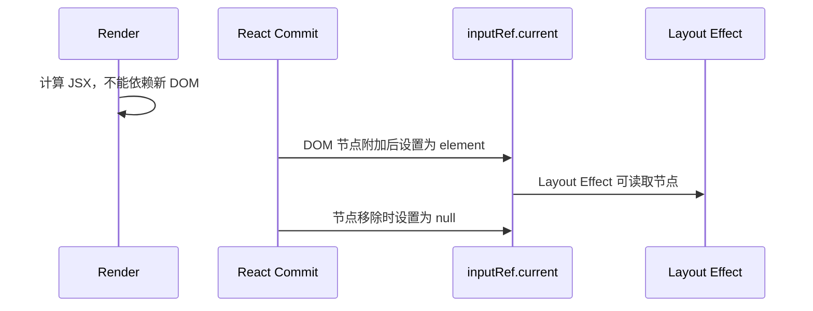

# React Ref：DOM 引用、可变逃生口与命令式 API 边界

> Ref 用于保存不参与渲染的数据，或在 Commit 后访问 DOM、播放器、编辑器等命令式对象。它是连接声明式 React 与命令式世界的窄桥梁，不是绕过 State 和数据流的通用容器。

---

## 一、本文解决什么问题

真实项目中，Ref 常被用于聚焦输入框、测量布局、保存 Timer、接入图表和暴露组件命令。它也很容易被滥用：业务状态被藏进 `ref.current`，界面不更新；Render 阶段读取或修改 Ref，并发渲染下出现不一致；组件直接向外暴露内部 DOM，调用方与实现结构深度耦合。

本文回答以下问题：

- `useRef` 保存的数据为什么跨 Render 保持；
- 修改 `ref.current` 为什么不会触发重新渲染；
- DOM Ref 在 Render、Commit、Layout Effect 和卸载时分别是什么状态；
- Ref 作为 Mutable Escape Hatch 应用于哪些场景；
- Callback Ref 与对象 Ref 有何区别；
- Callback Ref 和外部资源如何正确 Cleanup；
- React 18 的 `forwardRef` 与 React 19 的 Ref Prop 有何边界；
- 如何使用 `useImperativeHandle` 暴露最小命令接口；
- 什么数据应该放 Ref，什么数据必须放 State；
- SSR、Strict Mode、测试和第三方集成需要注意什么。

本文以现代 React 函数组件为背景。`useRef` 的稳定对象语义和 DOM Ref 的 Commit 生命周期是公开模型；Fiber 内部如何存储 Ref、Commit 函数名称等属于版本相关实现。React 19 支持函数组件直接接收 `ref` Prop，并支持 Callback Ref 返回 Cleanup；React 18 及更早版本的函数组件通常需要 `forwardRef`，Callback Ref 使用 `node/null` 生命周期。组件库必须根据 Peer Dependency 范围选择 API，并在目标 React 版本验证类型与运行行为。

### 核心结论

1. `useRef(initialValue)` 在组件该次挂载期间返回同一个 Ref 对象，初始值只用于首次初始化。
2. 修改 `ref.current` 不会触发 Render，因此只适合不影响当前可见输出的数据。
3. DOM Ref 在 Commit 中由 React 设置；Render 阶段不能依赖本次更新后的 `ref.current`。
4. Ref 是可变逃生口，适合 Timer ID、第三方实例、最新回调和 DOM Handle，不适合替代业务 State。
5. Callback Ref 能在节点附加、替换和移除时收到通知，适合动态节点和精确资源绑定。
6. React 19 Callback Ref 可以返回 Cleanup；兼容 React 18 时应使用节点与 `null` 的回调协议或 Effect Cleanup。
7. `forwardRef` 是 React 18 组件接收 Ref 的标准方式；React 19 可把 `ref` 作为 Prop，库需按支持版本设计。
8. `useImperativeHandle` 应暴露最小、稳定的命令集合，而不是泄漏整个内部 DOM 或复制一套 State API。
9. 任何影响 JSX 的数据都应进入 State/Props/Store；Ref 变化不会驱动声明式 UI。

---

## 二、`useRef` 的基本模型

```tsx
const renderCountRef = useRef(0);
```

`useRef` 返回一个可变对象：

```typescript
type MutableRefObject<T> = {
  current: T;
};
```

这是帮助理解的简化结构，不代表 React 当前类型声明的全部重载。关键特性是：

- 同一个组件身份的后续 Render 得到同一个 Ref 对象；
- `initialValue` 只用于初始化，后续参数不会覆盖 `current`；
- 可以在事件和 Effect 中修改 `current`；
- 修改后 React 不会安排 Render；
- 组件卸载后，普通 Ref 对象仍可能被外部引用，但 React 不再管理其中的自定义值。


Ref 对象稳定不代表 `current` 不变；恰恰相反，`current` 是命令式可变字段。

### 2.1 初始参数不会在后续 Render 生效

```tsx
function Player({ source }: { source: string }) {
  const sourceRef = useRef(source);
  // source 变化时，sourceRef.current 不会自动变化。
}
```

若需要始终读取最新 `source`，必须在事件或 Effect 中显式同步；若 UI 应随 `source` 更新，直接使用 Prop，不要复制进 Ref。

### 2.2 Ref 与局部变量的区别

```tsx
function Counter() {
  let localCount = 0;
  const refCount = useRef(0);

  function increment() {
    localCount += 1;
    refCount.current += 1;
  }
}
```

下一次 Render 会重新创建 `localCount`，而 Ref 对象仍属于该组件身份。模块级变量虽然也能跨 Render，但会被所有组件实例共享，不具备组件级隔离和卸载边界。

---

## 三、DOM Ref 的 Commit 生命周期

```tsx
function SearchBox() {
  const inputRef = useRef<HTMLInputElement>(null);

  function focusInput() {
    inputRef.current?.focus();
  }

  return (
    <>
      <input ref={inputRef} type="search" />
      <button onClick={focusInput}>聚焦搜索框</button>
    </>
  );
}
```

简化时序如下：



关键边界：

- 首次 Render 时 DOM 尚不存在，`current` 通常为 `null`；
- React 在 Commit 中把 DOM 节点写入对象 Ref；
- Layout Effect 可以访问本次 Commit 后的节点；
- 节点从 DOM 移除时，React 清空对应 Ref；
- SSR 不创建 DOM，服务端 Render 中 Ref 不会指向浏览器节点。

### 3.1 不要在 Render 中读取 DOM Ref 决定 JSX

```tsx
function ResponsiveLabel() {
  const labelRef = useRef<HTMLSpanElement>(null);

  // 错误：Render 期间可能是 null、旧节点或与当前工作不一致。
  const compact = (labelRef.current?.offsetWidth ?? 0) < 120;

  return <span ref={labelRef}>{compact ? '短标题' : '完整标题'}</span>;
}
```

能由 CSS Container Query、Flex 或 Grid 处理时优先 CSS。确实需要布局测量时，在 `useLayoutEffect` 中读取，并用 State 驱动下一次 JSX。

### 3.2 聚焦与可访问性

命令式 `focus()` 适合：

- 对话框打开后把焦点移入；
- 表单校验失败后聚焦首个错误字段；
- 用户明确点击“跳到搜索框”；
- 恢复菜单或弹层关闭前的触发元素焦点。

不要在每次 Render 或无明确原因的 Effect 中抢夺焦点。焦点管理必须考虑键盘顺序、可见焦点、Portal、卸载节点和辅助技术语义。

---

## 四、Mutable Escape Hatch：何时保存可变值

### 4.1 Timer ID

```tsx
function AutosaveStatus() {
  const timeoutRef = useRef<ReturnType<typeof setTimeout> | null>(null);

  function scheduleSavedMessage() {
    if (timeoutRef.current !== null) {
      clearTimeout(timeoutRef.current);
    }

    timeoutRef.current = setTimeout(() => {
      timeoutRef.current = null;
      showSavedMessage();
    }, 800);
  }

  useEffect(() => {
    return () => {
      if (timeoutRef.current !== null) {
        clearTimeout(timeoutRef.current);
      }
    };
  }, []);

  return <button onClick={scheduleSavedMessage}>保存</button>;
}
```

Timer ID 不参与 JSX，适合 Ref。Cleanup 避免组件卸载后继续执行过期工作。

### 4.2 保存前一次已提交值

```tsx
function PriceChange({ price }: { price: number }) {
  const previousPriceRef = useRef<number | null>(null);

  useEffect(() => {
    previousPriceRef.current = price;
  }, [price]);

  const previousPrice = previousPriceRef.current;
  const direction =
    previousPrice === null
      ? 'unchanged'
      : price > previousPrice
        ? 'up'
        : price < previousPrice
          ? 'down'
          : 'unchanged';

  return <Price value={price} direction={direction} />;
}
```

当前 Render 读取的是前一次 Effect 写入的值，因此可表示“前一次已提交快照”。如果历史值本身影响复杂 UI 或需要撤销，应使用 State/Reducer，而不是不断扩展 Ref 历史。

### 4.3 让长期订阅读取最新回调

```tsx
type ChatChannel = {
  subscribe: (handler: (message: Message) => void) => () => void;
};

function useMessageChannel(
  channel: ChatChannel,
  onMessage: (message: Message) => void,
) {
  const latestHandlerRef = useRef(onMessage);

  useEffect(() => {
    latestHandlerRef.current = onMessage;
  }, [onMessage]);

  useEffect(() => {
    const unsubscribe = channel.subscribe(message => {
      latestHandlerRef.current(message);
    });

    return unsubscribe;
  }, [channel]);
}
```

这里订阅生命周期只依赖 `channel`，回调则读取最近已提交的 Handler。这个模式改变了闭包语义：订阅不会因 Handler 变化重新建立。只有业务确实要求这种行为时使用，不能把所有 Effect 依赖都复制到 Ref 里以绕过 Lint。

### 4.4 不要在 Render 中随意修改 Ref

```tsx
function Component({ value }: { value: number }) {
  ref.current = value; // 不推荐：Render 可能重试或被放弃
  return <span>{value}</span>;
}
```

Ref 对象会跨 Render 共享。Render 阶段写入可能把未提交工作的值暴露给事件或另一条渲染路径，破坏纯度和并发推理。通常只在事件、Effect 或 Commit 相关回调中修改。

React 文档允许一种受限的惰性初始化模式：写入只发生在 `current === null`，结果完全可预测，并且不产生外部副作用。外部连接、DOM、播放器等资源仍应在 Effect 中创建与释放。

---

## 五、Callback Ref：在节点变化时收到通知

对象 Ref 适合“需要时读取当前节点”。Callback Ref 则在节点附加、替换或移除时由 React 调用，适合：

- 动态列表节点注册；
- 节点一出现就测量或订阅；
- 同一位置可能切换不同 DOM 节点；
- 需要把一个节点转发到多个 Ref；
- 资源生命周期直接绑定节点身份。

```tsx
function MeasuredInput() {
  const [width, setWidth] = useState(0);

  const inputRef = useCallback((node: HTMLInputElement | null) => {
    if (node === null) return;
    setWidth(node.getBoundingClientRect().width);
  }, []);

  return (
    <label>
      宽度：{width}px
      <input ref={inputRef} />
    </label>
  );
}
```

测量会触发 State 更新，应避免无条件产生相同值更新。持续尺寸变化应使用 `ResizeObserver` 并清理，而不是只在节点附加时测量一次。

### 5.1 Inline Callback 的重新附加

```tsx
<input ref={node => { inputNode = node; }} />
```

每次 Render 创建新回调时，React 可能需要清理旧 Callback Ref 并调用新 Callback Ref。若回调包含昂贵资源绑定，应通过 `useCallback` 稳定函数，或把资源协议放入 Effect。是否需要优化应以实际调用成本为依据。

### 5.2 动态列表 Ref

单个 `useRef` 不能直接对应任意数量的列表项。可以维护 ID 到节点的 Map：

```tsx
function ProductList({ products }: { products: Product[] }) {
  const nodesRef = useRef(new Map<string, HTMLLIElement>());

  return (
    <ul>
      {products.map(product => (
        <li
          key={product.id}
          ref={node => {
            if (node) {
              nodesRef.current.set(product.id, node);
            } else {
              nodesRef.current.delete(product.id);
            }
          }}
        >
          {product.name}
        </li>
      ))}
    </ul>
  );
}
```

这个 `node/null` 写法适用于 React 18/19，但 Inline Callback 每次 Render 会重新执行附加流程。大型列表应把 Item 拆成组件并稳定 Callback，或使用 React 19 Cleanup 形式；同时列表仍需稳定 `key`。

> Callback Ref 使用箭头函数时应加花括号。`ref={node => map.set(id, node)}` 会隐式返回 `Map`，而 Ref Callback 只应返回 `void`，或在 React 19 中返回 Cleanup 函数。

---

## 六、Ref Cleanup：释放的不只是引用

React 会管理 DOM Ref 自身的附加和清空，但以下资源仍由应用负责释放：

- `ResizeObserver`、`IntersectionObserver`；
- 原生事件 Listener；
- 第三方 Widget、Chart、Editor；
- Animation Frame 与 Timer；
- 与节点绑定的订阅或 Drag Controller。

### 6.1 Effect 中管理节点资源

```tsx
function ResizablePanel() {
  const panelRef = useRef<HTMLDivElement>(null);
  const [size, setSize] = useState({ width: 0, height: 0 });

  useLayoutEffect(() => {
    const panel = panelRef.current;
    if (!panel) return;

    const observer = new ResizeObserver(entries => {
      const entry = entries[0];
      if (!entry) return;

      const { width, height } = entry.contentRect;
      setSize(current =>
        current.width === width && current.height === height
          ? current
          : { width, height },
      );
    });

    observer.observe(panel);
    return () => observer.disconnect();
  }, []);

  return <div ref={panelRef}>{size.width} × {size.height}</div>;
}
```

适用于节点在该组件生命周期中稳定存在的场景。如果同一 Ref 位置会在不同 DOM 节点间切换，而 Effect 依赖不变化，Effect 不会因为 `ref.current` 改变自动重跑，此时 Callback Ref 更准确。

### 6.2 React 19 Callback Ref Cleanup

React 19 允许 Callback Ref 返回 Cleanup：

```tsx
function ObservedPanel({
  onResize,
}: {
  onResize: (rect: DOMRectReadOnly) => void;
}) {
  const panelRef = useCallback((node: HTMLDivElement | null) => {
    if (!node) return;

    const observer = new ResizeObserver(entries => {
      const entry = entries[0];
      if (entry) onResize(entry.contentRect);
    });
    observer.observe(node);

    return () => observer.disconnect();
  }, [onResize]);

  return <div ref={panelRef} />;
}
```

节点移除、替换或 Callback 变化时，React 调用返回的 Cleanup。React 18 不支持把返回函数作为 Ref Cleanup，需使用 `node/null` 协议或 Effect。发布兼容 React 18 的库不能无条件依赖该能力。

开发 Strict Mode 可能额外执行 Ref 的 Setup/Cleanup 检查，以暴露缺少清理的问题。正确目标是任意时刻只有一份资源，并在最终移除后归零，而不是依赖固定调用次数。

### 6.3 合并 Ref 的 Cleanup 风险

组件库常需同时写入内部 Ref 和调用方 Ref。简单工具可能只调用 Callback Ref，却丢弃 React 19 返回的 Cleanup，导致资源泄漏。合并工具必须：

- 支持对象 Ref 和 Callback Ref；
- 在节点变化时正确清空所有 Ref；
- 聚合 Callback Ref 返回的 Cleanup；
- 定义多个 Cleanup 的异常处理顺序；
- 在 React 18/19 目标版本分别测试。

优先使用经过目标 React 版本验证的组件基础库工具，不要随意复制几行 `mergeRefs` 代码后假设生命周期完整。

---

## 七、`forwardRef` 与 React 18/19 版本边界

### 7.1 React 18：通过 `forwardRef` 接收 Ref

普通函数组件不会像宿主 DOM 元素那样接收特殊 `ref`。React 18 中应使用 `forwardRef`：

```tsx
type SearchInputProps = ComponentPropsWithoutRef<'input'> & {
  label: string;
};

const SearchInput = forwardRef<HTMLInputElement, SearchInputProps>(
  function SearchInput({ label, ...inputProps }, ref) {
    return (
      <label>
        <span>{label}</span>
        <input {...inputProps} ref={ref} type="search" />
      </label>
    );
  },
);
```

调用方可以：

```tsx
const inputRef = useRef<HTMLInputElement>(null);
<SearchInput ref={inputRef} label="搜索" />;
```

### 7.2 React 19：`ref` 可以作为 Prop

React 19 中，函数组件可以直接接收 `ref` Prop：

```tsx
function SearchInput({
  ref,
  label,
  ...inputProps
}: ComponentPropsWithRef<'input'> & { label: string }) {
  return (
    <label>
      <span>{label}</span>
      <input {...inputProps} ref={ref} type="search" />
    </label>
  );
}
```

React 官方说明在 React 19 中 `forwardRef` 已不再是必需方式，并计划在未来版本弃用；但 React 18 消费者仍需要它。组件库不能只看自身源码版本，还要明确：

- `peerDependencies` 支持范围；
- TypeScript React 类型版本；
- 是否发布不同入口；
- 构建产物是否需兼容 React 18；
- 文档示例对应哪个版本。

不要通过把 Prop 改名为 `inputRef` 来伪装 Ref 转发，除非它本来就是显式普通 Prop API。标准 `ref` 能与 React 和生态工具正确协作。

---

## 八、Imperative Handle：暴露最小命令接口

直接转发 DOM 会让调用方依赖内部元素类型和结构。更稳定的组件 API 是暴露业务需要的最小命令：

```tsx
export type SearchInputHandle = {
  focus: () => void;
  selectAll: () => void;
};

type SearchInputProps = {
  value: string;
  onChange: (value: string) => void;
};

const SearchInput = forwardRef<SearchInputHandle, SearchInputProps>(
  function SearchInput({ value, onChange }, ref) {
    const inputRef = useRef<HTMLInputElement>(null);

    useImperativeHandle(
      ref,
      () => ({
        focus() {
          inputRef.current?.focus();
        },
        selectAll() {
          inputRef.current?.select();
        },
      }),
      [],
    );

    return (
      <input
        ref={inputRef}
        type="search"
        value={value}
        onChange={event => onChange(event.target.value)}
      />
    );
  },
);
```

React 19 可把 `ref` 作为组件 Prop，再传给 `useImperativeHandle`；核心设计原则不变。

### 8.1 Dependency Array

Handle 创建函数中读取的响应式值必须进入依赖数组：

```tsx
useImperativeHandle(ref, () => ({
  reset() {
    onReset(documentId);
  },
}), [documentId, onReset]);
```

依赖变化时 Handle 身份可能变化。调用方不应把 Handle 当作持久业务实体，而应在事件或 Effect 中从 Ref 读取当前 Handle。

### 8.2 不要暴露第二套 State API

```typescript
type DialogHandle = {
  open: () => void;
  close: () => void;
  toggle: () => void;
  setTitle: (title: string) => void;
};
```

如果 Dialog 的打开状态和标题影响 JSX，应优先使用 Props：

```tsx
<Dialog open={open} title={title} onOpenChange={setOpen} />
```

Imperative Handle 更适合无法自然声明的瞬时命令，如 `focus()`、`scrollIntoView()`、`selectAll()`、播放器 `play()`。即使命令式 API 合理，也必须处理命令调用时节点尚未挂载、已经卸载或浏览器拒绝操作的情况。

---

## 九、Ref 与 State 的边界

| 问题 | State / Props | Ref |
|---|---|---|
| 变化是否触发 Render | 是 | 否 |
| 是否决定 JSX | 应该 | 不应该直接决定 |
| 是否属于声明式快照 | 是 | 是共享的可变对象 |
| 适合表单值、选中项、加载态 | 是 | 否 |
| 适合 DOM、Timer ID、SDK 实例 | 否 | 是 |
| Render 中读取是否可靠 | 是 | 通常不应读取可变 `current` |
| 并发 Render 推理 | 由 React 管理 | 需调用方谨慎维护 |

### 9.1 错误：用 Ref 保存可见计数

```tsx
function Counter() {
  const countRef = useRef(0);

  return (
    <button onClick={() => { countRef.current += 1; }}>
      {countRef.current}
    </button>
  );
}
```

点击后没有 Render，界面不会可靠更新。应使用 State：

```tsx
const [count, setCount] = useState(0);
```

### 9.2 正确：Ref 保存不影响 UI 的请求序号

```tsx
const requestSequenceRef = useRef(0);

async function refresh() {
  const sequence = ++requestSequenceRef.current;
  const result = await loadData();

  if (sequence !== requestSequenceRef.current) return;
  setData(result);
}
```

序号用于判断异步结果是否过期，本身不需要展示。真实请求还应处理错误、取消、卸载和服务端一致性；能使用 `AbortController` 时应同步取消旧请求。

### 9.3 外部 Store 不是一个 Ref

把全局可变对象放进 Ref 再在 Render 中读取，无法通知 React 更新，也无法保证并发 Snapshot 一致性。外部 Store 应提供订阅协议，并通过 `useSyncExternalStore` 或成熟状态库接入。

---

## 十、第三方命令式实例

图表、地图、编辑器等通常需要 DOM 容器与实例 Cleanup：

```tsx
function SalesChart({ data }: { data: SalesPoint[] }) {
  const containerRef = useRef<HTMLDivElement>(null);
  const chartRef = useRef<Chart | null>(null);

  useEffect(() => {
    const container = containerRef.current;
    if (!container) return;

    const chart = new Chart(container);
    chartRef.current = chart;

    return () => {
      chart.destroy();
      chartRef.current = null;
    };
  }, []);

  useEffect(() => {
    chartRef.current?.setData(data);
  }, [data]);

  return <div ref={containerRef} />;
}
```

这里职责分为：

- Mount/Unmount Effect 创建和销毁实例；
- 数据 Effect 把 React Props 同步给实例；
- DOM Ref 提供容器；
- Instance Ref 保存不参与 JSX 的命令式对象。

还应考虑：

- Constructor 失败时的错误处理；
- 动态 Import 取消与组件卸载；
- ResizeObserver 清理；
- 数据更新是否需要批处理；
- 实例方法是否会修改 React 管理的 DOM；
- SSR 是否需要 Client-only 边界；
- Strict Mode Setup/Cleanup 后能否重新创建。

不要在 Render 或 `useMemo` 中创建外部实例，它们都没有可靠的资源 Commit/Cleanup 语义。

---

## 十一、SSR、Hydration 与并发边界

### 11.1 SSR

服务端没有浏览器 DOM：

- DOM Ref 始终不可用于服务端布局；
- 不能根据 `ref.current` 决定服务端 JSX；
- 依赖 DOM 的 SDK 应在客户端 Effect 中创建；
- 首屏 HTML 必须有不依赖 Ref 的正确结构；
- Hydration 前不要假设用户已经可调用 Handle。

### 11.2 并发 Render

Render 可能中断、重试或放弃，而 Ref 是共享可变对象。Render 中读取/写入 `current` 会绕开 React Snapshot，可能观察到与当前 UI 不一致的值。影响渲染的数据必须使用 State、Props 或符合一致性协议的外部 Store。

### 11.3 Offscreen、Suspense 与节点可用性

节点是否当前存在、可见或已 Commit，不能只凭“组件函数执行过”判断。命令调用应容忍 `ref.current === null`，布局代码还需验证节点是否连接、是否有尺寸以及是否被隐藏。具体 Offscreen 行为取决于所用 React 能力和版本，不应依赖私有实现。

---

## 十二、常见误区

### 12.1 “Ref 变化后 React 会自动更新 UI”

错误。修改 `current` 不触发 Render；影响 JSX 的数据应使用 State。

### 12.2 “Ref 在 Render 中总是指向最新 DOM”

错误。DOM 在 Commit 中更新，Render 期间 Ref 可能是 `null` 或上一次提交的节点。

### 12.3 “Ref 比 State 性能好，所以应尽量使用 Ref”

错误。Ref 不更新 UI只是绕过 React，不是免费优化。错误选择会产生状态不同步和并发问题。

### 12.4 “对象 Ref 被清空就等于资源已释放”

错误。Observer、Listener、Timer 和第三方实例仍需显式 Cleanup。

### 12.5 “React 19 后组件库可以立即删除 `forwardRef`”

错误。若仍支持 React 18 消费者，发布 API 和类型必须兼容其 Ref 模型。迁移取决于 Peer Dependency 和构建策略。

### 12.6 “Imperative Handle 应暴露组件全部能力”

错误。它应是最小命令接口；可声明的状态和内容继续通过 Props 表达。

### 12.7 “Callback Ref 只会在卸载时收到 `null`”

错误。节点替换或 Callback 身份变化也会触发清理与重新附加；React 19 返回 Cleanup 时则按新协议处理。

---

## 十三、测试与验证

### 13.1 面向行为测试

应验证：

- 点击命令后输入框确实获得焦点；
- 表单错误聚焦到正确且可见的字段；
- 节点切换后旧 Observer/Listener 被清理；
- Timer 和 rAF 在卸载后被取消；
- 第三方实例只存在一份并最终 `destroy`；
- Handle 在节点不存在时安全返回；
- React 18 与 React 19 支持矩阵中的类型和运行行为均通过。

不要测试 Fiber 私有字段，也不要以 `ref.current` 的内部形状替代用户可观察结果。

### 13.2 Strict Mode 资源计数

开发测试可在 Strict Mode 下记录 Setup/Cleanup：

```text
activeObservers = setupCount - cleanupCount
```

挂载稳定后资源数量应符合预期，最终卸载后归零。不要断言固定调用次数，因为具体开发检查会随版本与树位置变化。

### 13.3 浏览器与 JSDOM 边界

JSDOM 可测试 Ref 附加、事件和 Cleanup 调用，但没有真实布局、焦点滚动、媒体播放或 Observer 行为。以下场景应在真实浏览器测试：

- `getBoundingClientRect()` 与布局；
- Focus Trap 和滚动；
- Selection、媒体播放与权限；
- Resize/Intersection Observer；
- Portal 与 Shadow DOM；
- 移动端键盘和触摸行为。

### 13.4 性能验证

Ref 通常不是性能优化目标。若命令式集成卡顿，应在生产构建、目标设备上用 React Profiler 与浏览器 Performance 面板分别检查：

- React Commit 和 Effect 耗时；
- SDK 初始化与更新耗时；
- Forced Layout 与 Paint；
- Observer 回调频率；
- 内存中是否残留已销毁实例；
- Strict Mode 之外的真实生产表现。

---

## 十四、工程检查清单

- 数据变化是否影响 JSX；若影响，是否应使用 State；
- Ref 是否只保存 DOM、命令式实例或非渲染数据；
- 是否避免在 Render 中读取或修改可变 `current`；
- DOM 命令是否只在事件、Effect 或 Commit 后调用；
- `null`、卸载、节点替换和隐藏状态是否处理；
- Timer、rAF、Observer、Listener 和 SDK 是否全部 Cleanup；
- Callback Ref 是否稳定，是否处理节点替换；
- React 19 Ref Cleanup 是否与 React 18 支持范围冲突；
- 合并 Ref 工具是否保留所有 Cleanup；
- `forwardRef`/Ref Prop 是否与 Peer Dependency 一致；
- Imperative Handle 是否只暴露最小命令；
- 是否避免用 Handle 复制 Controlled State API；
- SSR 初始 UI 是否不依赖 DOM Ref；
- 是否在 Strict Mode、真实浏览器和目标 React 版本验证。

---

## 十五、总结

1. `useRef` 返回组件生命周期内稳定的可变对象，修改 `current` 不触发 Render。
2. DOM Ref 由 React 在 Commit 中附加和清空，Render 不能依赖本次更新后的节点。
3. Ref 适合 DOM、Timer、第三方实例和不参与 UI 的命令式数据。
4. 影响 JSX 的事实必须使用 State、Props 或一致性外部 Store，不能藏在 Ref 中。
5. Callback Ref 能精确感知节点附加、替换与移除，但必须处理回调身份和 Cleanup。
6. React 19 支持 Callback Ref 返回 Cleanup；React 18 需要 `node/null` 或 Effect 协议。
7. DOM Ref 自动清空不等于 Observer、Listener 和 SDK 自动释放。
8. React 18 使用 `forwardRef` 接收 Ref；React 19 可使用 Ref Prop，库应按兼容范围选择。
9. `useImperativeHandle` 应暴露最小瞬时命令，而不是整个 DOM 或第二套 State API。
10. SSR、并发 Render 与 Strict Mode 都要求 Ref 使用保持可空、可清理和不依赖私有时序。

Ref 的正确定位是“声明式模型无法直接表达时的受控出口”。出口越窄，组件的数据流、生命周期和实现替换空间就越清晰。

---

## 问答复盘

### Q1：修改 `ref.current` 后为什么界面不更新？

**答：** Ref 是 React 不追踪的可变容器，修改不会安排 Render。任何影响 JSX 的数据都应使用 State 或其他响应式事实源。

### Q2：DOM Ref 在组件 Render 时是否一定可用？

**答：** 不一定。DOM Ref 在 Commit 中设置，Render 时可能是 `null` 或上次提交的节点；应在事件或 Effect 中访问。

### Q3：Callback Ref 相比对象 Ref 的主要价值是什么？

**答：** 它会在节点附加、替换和移除时收到通知，适合动态节点注册、立即测量和与节点身份绑定的资源。

### Q4：React 19 Callback Ref 返回 Cleanup 后，还需要处理 `null` 吗？

**答：** 使用返回 Cleanup 的 React 19 协议时由 Cleanup 释放资源；兼容 React 18 时不能依赖该能力，应使用 `node/null` 或 Effect，并按目标版本分别测试。

### Q5：为什么清空 DOM Ref 不能代替 `ResizeObserver.disconnect()`？

**答：** Ref 只保存节点引用，Observer 是独立外部资源。必须调用其 Cleanup API，否则仍可能保留订阅和对象引用。

### Q6：React 19 项目是否还需要了解 `forwardRef`？

**答：** 需要。已有组件和支持 React 18 的库仍使用它；是否迁移取决于 Peer Dependency、类型与构建发布范围。

### Q7：什么时候应使用 `useImperativeHandle` 而不是直接转发 DOM？

**答：** 当调用方只需要 `focus`、`selectAll` 等有限命令时。最小 Handle 能隐藏内部 DOM 结构并保持组件可重构。

### Q8：请求序号适合放 Ref，加载状态为什么不适合？

**答：** 请求序号只用于异步过期判断，不影响 JSX；加载状态需要驱动界面展示，必须放入 State 或请求状态模型。

### Q9：如何验证 Ref 没有造成资源泄漏？

**答：** 在 Strict Mode 和真实卸载流程中统计 Observer、Listener、Timer、rAF 与第三方实例，确保节点替换时旧资源释放、最终数量归零。

---

## 延伸知识

- **并发渲染**：Interruptible Render、State Snapshot、Commit 原子性与 Ref 可变边界。
- **`useLayoutEffect`**：DOM 测量、Browser Paint、Flicker 与同步阻塞。
- **外部 Store**：`useSyncExternalStore`、Snapshot 与 Tear-free UI。
- **组件 API**：Controlled State、Ref Handle、Slot 与可访问性契约。
- **浏览器资源**：Observer、Timer、Animation Frame 与事件 Listener 生命周期。
- **React 版本迁移**：Ref Prop、Callback Ref Cleanup、类型声明与库兼容策略。
