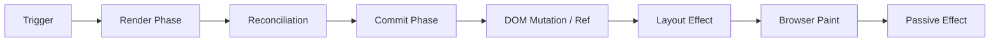
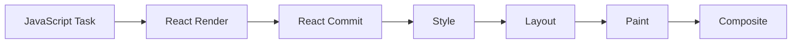
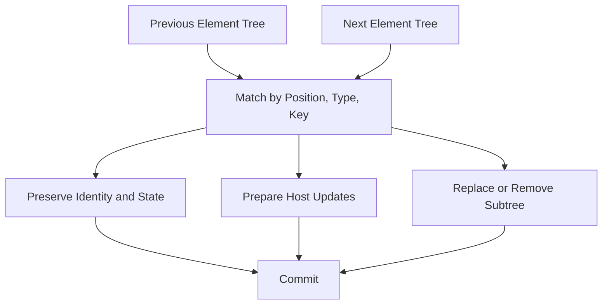
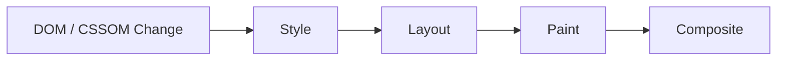
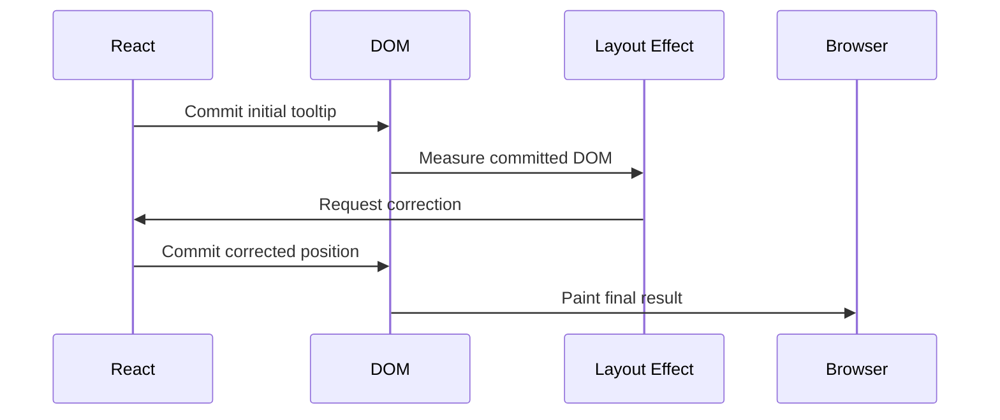
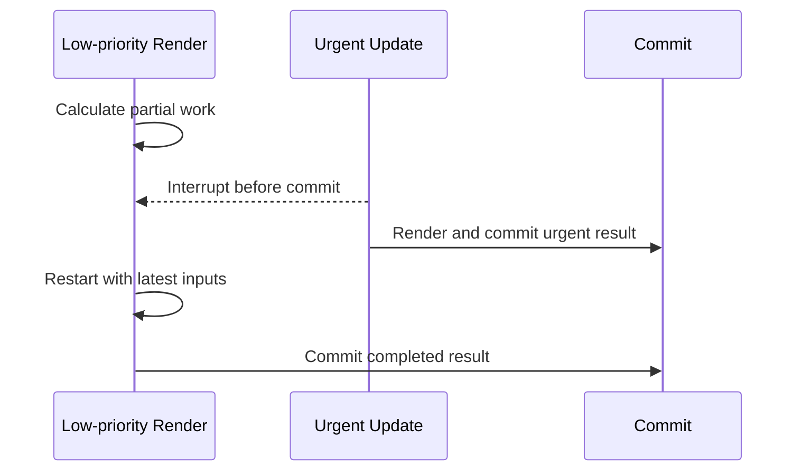
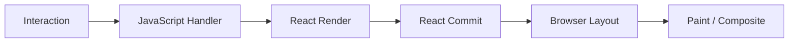

# React Render 与 Commit：从更新触发到 DOM、Effect 与浏览器绘制

> Render 是计算下一棵 UI 描述，Commit 是把已完成结果应用到宿主环境。Render 可能重复、暂停或废弃，因此必须纯净；Commit 才能修改 DOM、连接 Ref，并运行依赖已提交 UI 的生命周期逻辑。

---

## 一、本文解决什么问题

React 项目常把“组件函数执行”“DOM 更新”和“浏览器绘制”统称为渲染，结果很容易误判生命周期与性能：

- 什么会 Trigger 更新，Setter 是否立刻修改 DOM；
- Render Phase 计算什么，为什么不能在其中执行副作用；
- Reconciliation 是否只是比较两棵 DOM 树；
- 父组件 Re-render 是否意味着所有子组件 DOM 都更新；
- Commit 何时执行 DOM Mutation、Ref 和 Effect；
- `useLayoutEffect` 与 `useEffect` 分别看到什么；
- `useEffect` 是否永远晚于 Browser Paint；
- Render 为什么可能执行多次却一次也没提交；
- 并发 Render 会不会让用户看到半成品 UI；
- Strict Mode 为什么在开发环境重复调用部分逻辑；
- SSR、Hydration 与客户端 Commit 有什么差异；
- 如何区分 React 慢、DOM 慢、Layout 慢和 Paint 慢。

本文以现代 React 函数组件、React DOM 和浏览器为主。Render/Commit 是稳定的公开心智模型；Fiber 字段、Commit 内部子阶段、Lane 和具体函数名属于版本实现，应以项目锁定的 React、`react-dom`、浏览器与官方文档为准。

### 核心结论

1. 一次更新可概括为 Trigger、Render、Commit；Browser Paint 是 React 之外的浏览器阶段。
2. Trigger 只表示更新进入 React，不保证立即 Render、单独 Render 或最终 Commit。
3. Render 调用组件并执行 Reconciliation，计算下一结果；它不能包含必须恰好执行一次的副作用。
4. Re-render 不等于 DOM Update。组件可以重新计算，最终没有任何宿主节点变化。
5. Commit 应用已完成结果，包括必要的 DOM Mutation、Ref 和布局生命周期；用户不会看到未完成 Render 的中间树。
6. `useLayoutEffect` 在 DOM 提交后、浏览器通常 Paint 前执行，适合布局测量，但会阻塞 Paint。
7. `useEffect` 通常允许浏览器先 Paint；交互触发和同步刷新等场景存在例外，不能把它当作精确 Paint 通知。
8. 并发 Render 可以暂停、重启或废弃；Commit 通常不能以相同方式切片并暴露半成品。
9. Strict Mode 的额外开发检查用于暴露不纯 Render 和不对称 Cleanup，不代表生产固定执行两次。
10. 性能诊断必须分别测量 React Render/Commit 与浏览器 Style/Layout/Paint。

---

## 二、一次更新的全景



这是常见主路径，不是所有浏览器任务中固定不变的时间轴：Render 可能被合并、跳过、暂停或废弃；没有宿主差异时 Commit 不一定产生 DOM Mutation；Passive Effect 通常在 Paint 后执行，但 React 文档明确存在与交互和调度有关的例外。

### 2.1 React 阶段与浏览器阶段



React Commit 完成不等于像素已经显示。浏览器还要根据 DOM 与 CSSOM 完成自己的渲染管线，也可能合并、推迟或提前刷新其中部分工作。

---

## 三、Trigger：更新从哪里开始

常见 Trigger 包括：

- Root 初次 `render`；
- State Setter 或 Reducer Dispatch；
- 父组件提供新的子 Element/Props；
- 组件读取的 Context Value 改变；
- 外部 Store 的订阅快照改变；
- Suspense 依赖就绪、Error Boundary 恢复或框架发起更新。

### 3.1 初次挂载

```tsx
import { createRoot } from 'react-dom/client';

const container = document.getElementById('root');
if (container === null) throw new Error('Root container not found');

createRoot(container).render(<App />);
```

Root 获得初始 Element 后，React 计算组件树，并在 Commit 中创建或插入必要 DOM。

### 3.2 State 更新

```tsx
function Counter() {
  const [count, setCount] = useState(0);

  return (
    <button type="button" onClick={() => setCount((value) => value + 1)}>
      {count}
    </button>
  );
}
```

Setter 请求后续更新，不会改写当前 Render 的 `count`，也不承诺调用返回前 DOM 已改变。

### 3.3 Trigger 不等于一对一 Render

```tsx
function completeOrder() {
  setStatus('success');
  setDialogOpen(false);
}
```

React 可以批处理更新，也可能因为相同值、Bailout 或优先级减少工作。不要通过 Setter 调用次数推断 Render 次数，更不能依赖“每个 Setter 恰好单独 Commit 一次”。

---

## 四、Render Phase：计算下一棵 UI

Render Phase 根据当前 Props、State 与 Context 计算下一棵 React Element 描述，并确定需要继续处理的子树。

```tsx
type Order = Readonly<{
  id: string;
  total: number;
  status: 'pending' | 'paid';
}>;

function OrderSummary({ order }: { order: Order }) {
  const label = order.status === 'paid' ? '已支付' : '待支付';

  return (
    <article>
      <h2>订单 {order.id}</h2>
      <p>{label}</p>
      <p>{order.total}</p>
    </article>
  );
}
```

调用组件、执行表达式并返回 Element 都是 Render 工作。此时不能假设对应 DOM 已存在或已改变。

### 4.1 Render 读取快照

每次组件调用都获得该次 Render 对应的 Props/State 快照，回调闭包会捕获该次绑定：

```tsx
function DelayedAlert() {
  const [message, setMessage] = useState('A');

  function showLater() {
    window.setTimeout(() => window.alert(message), 1000);
  }

  return (
    <>
      <input value={message} onChange={(e) => setMessage(e.currentTarget.value)} />
      <button type="button" onClick={showLater}>稍后显示</button>
    </>
  );
}
```

Timer 读取点击发生时那个 Render 的 `message`。这是 JavaScript 闭包与 Render Snapshot 共同作用，而不是变量被 React 延迟修改。

### 4.2 Render 可以没有 DOM 变化

父级更新可能让子组件再次执行，但若最终宿主描述不变，Commit 可以不修改 DOM。必须区分：

| 术语 | 含义 |
|---|---|
| Trigger | 更新进入 React |
| Render | React 计算组件描述 |
| Commit | React 应用完成结果 |
| DOM Mutation | DOM 实际增删改 |
| Paint | 浏览器把结果绘制出来 |

### 4.3 Render 中不能读取“下一棵 DOM”

下一结果可能永远不 Commit。Render 中通过 Ref、`querySelector` 或布局属性推导 JSX，会读取上一次已提交 DOM，还会破坏 SSR 与可中断工作。DOM 测量应放在提交后的布局边界。

---

## 五、Render Purity：为什么必须纯净

React 必须能够安全地重做 Render。组件和 Hook 在 Render 中应做到：

- 相同输入产生相同描述；
- 不修改 Props、State 与共享对象；
- 不发送网络写请求、注册订阅或 Timer；
- 不直接修改 DOM；
- 不依赖必须恰好执行一次的行为。

### 5.1 错误：Render 中发送写请求

```tsx
function PurchaseConfirmation({ orderId }: { orderId: string }) {
  fetch('/api/confirm', {
    method: 'POST',
    body: JSON.stringify({ orderId }),
  });

  return <p>确认中</p>;
}
```

Render 可能重复或废弃，这会产生重复写入风险。购买确认应由明确用户事件触发，服务端还要使用幂等键治理重试与网络不确定性。

### 5.2 错误：修改 Props

```tsx
function ProductList({ products }: { products: Product[] }) {
  products.sort(compareByPrice);
  return <List products={products} />;
}
```

应复制后排序，或由数据所有者输出已排序集合：

```tsx
function ProductList({ products }: { products: readonly Product[] }) {
  const sortedProducts = [...products].sort(compareByPrice);
  return <List products={sortedProducts} />;
}
```

### 5.3 局部突变并不违规

```tsx
function Rows({ items }: { items: readonly Item[] }) {
  const rows: React.ReactNode[] = [];
  for (const item of items) {
    rows.push(<Row key={item.id} item={item} />);
  }
  return <>{rows}</>;
}
```

`rows` 只属于本次调用，没有污染外部。纯净约束针对可观察副作用，不禁止所有局部赋值。

### 5.4 时间、随机数与 ID

在 Render 中直接调用 `Math.random()` 或 `Date.now()` 会让相同输入得到不同输出，还可能造成 Hydration 不一致。业务值应在事件或初始化边界生成；稳定无障碍 ID 应使用 `useId`，不要用随机数模拟。

---

## 六、Reconciliation：协调前后描述

Reconciliation 发生在 Render 工作中。React 根据前后 Element 描述，判断哪些组件身份延续、哪些子树新增或删除，并为 Commit 准备宿主更新。



### 6.1 类型与 Key

```tsx
function Results({ items }: { items: readonly Result[] }) {
  return (
    <ul>
      {items.map((item) => <ResultRow key={item.id} item={item} />)}
    </ul>
  );
}
```

稳定业务 ID 能让移动后的行继续关联正确 State；随机 Key 会令每次 Render 都像全新子树。

### 6.2 不只是 DOM Diff

协调还涉及自定义组件身份、State 保留、Context、Hooks、Fragment、Portal、Suspense、Ref 与 Effect。宿主也不一定是 DOM，因此“比较 Virtual DOM 后修改 DOM”只是一种简化说明。

### 6.3 公开规则与内部实现

工程代码可以依赖类型、父级位置和 `key` 参与身份匹配的公开行为，不能依赖 Fiber 遍历顺序、Flags、Lane 或内部函数名。这些内容属于后续 Fiber 专题。

---

## 七、Commit Phase：让完成结果生效

Render 完成且结果仍有效后，React 进入 Commit。对 React DOM，Commit 可能包含：

- 插入、删除或更新 DOM 节点与属性；
- 断开旧 Ref、连接新 Ref；
- 执行布局相关生命周期与 `useLayoutEffect`；
- 安排 Passive Effect；
- 处理删除子树的 Cleanup。

React 内部可把 Commit 划分为多个子阶段，但精确名称和顺序属于版本实现。业务代码应依赖公开 Hook 契约。

### 7.1 首次挂载与更新

```tsx
function Clock({ time }: { time: string }) {
  return (
    <section>
      <h1>当前时间</h1>
      <time>{time}</time>
    </section>
  );
}
```

首次挂载创建并插入宿主节点；只有 `time` 变化时，React 可只更新相应文本，而不是重建整个 `<section>`。

### 7.2 Commit 与一致性

并发能力允许 Render 工作被切片，但 React 不应让用户看到一棵只提交一半的树。完成结果的宿主修改与布局生命周期需要形成一致的可观察切换。

这不表示 Commit 没有性能成本。大量 DOM 插入、Ref 工作和同步 Layout Effect 仍会阻塞主线程。

### 7.3 Commit 后 DOM 才可信

只有 Commit 后，Ref 与 Layout Effect 才能读取对应已提交 DOM。Render 期间形成的下一棵描述可能被废弃，不能作为 DOM 已存在的证据。

---

## 八、DOM Mutation 与浏览器渲染管线



- Style 计算匹配规则与最终样式；
- Layout 计算几何尺寸与位置；
- Paint 生成绘制工作；
- Composite 组合图层形成画面。

不同属性影响的阶段不同，浏览器也会合并或延迟工作。`className` 改变不等于必然进行完整 Layout 与 Paint。

### 8.1 强制同步布局

```typescript
element.style.width = '400px';
const width = element.getBoundingClientRect().width;
```

DOM 写入后立即读取布局，浏览器可能必须提前刷新 Style/Layout。循环交替读写会形成 Layout Thrashing，应批量读取、批量写入，并用 Performance Trace 验证。

### 8.2 Commit 不等于 Paint

State Setter、Effect 或 Promise 都不是“像素已经显示”的通用通知。动画帧协调应使用相应浏览器 API；端到端测试应等待目标可观察状态，而不是硬编码 Timer。

---

## 九、`useLayoutEffect`：Paint 前的布局边界

`useLayoutEffect` Setup 在 DOM 提交后执行，浏览器通常还没有 Paint 本次结果，适合测量并同步修正布局。

```tsx
function Tooltip({ anchorRect }: { anchorRect: DOMRect }) {
  const ref = useRef<HTMLDivElement>(null);
  const [height, setHeight] = useState(0);

  useLayoutEffect(() => {
    const node = ref.current;
    if (node !== null) setHeight(node.getBoundingClientRect().height);
  }, []);

  return (
    <div
      ref={ref}
      style={{ position: 'fixed', top: anchorRect.top - height, left: anchorRect.left }}
    >
      操作成功
    </div>
  );
}
```



### 9.1 为什么它会阻塞 Paint

Layout Effect 及其中触发的同步更新要在浏览器继续 Paint 前完成。昂贵计算、大量测量或网络等待会直接增加首屏和交互延迟。

选择顺序：优先 CSS；非首帧关键同步用 `useEffect`；只有必须避免可见跳动时才用 `useLayoutEffect`，并测量节点数量、Layout 与 Commit 时间。

### 9.2 Cleanup 与 SSR

依赖变化或移除时，旧 Layout Effect 必须清理 Observer、Listener 或第三方实例。服务端没有浏览器 Layout，Effect 也不会在服务端 Render 中执行；客户端专属测量应放在明确边界。

---

## 十、`useEffect`：提交后的外部同步

`useEffect` 适合订阅、连接、第三方实例、非布局关键的浏览器 API 等外部同步：

```tsx
function OnlineStatus() {
  const [online, setOnline] = useState(navigator.onLine);

  useEffect(() => {
    const update = () => setOnline(navigator.onLine);
    window.addEventListener('online', update);
    window.addEventListener('offline', update);

    return () => {
      window.removeEventListener('online', update);
      window.removeEventListener('offline', update);
    };
  }, []);

  return <p>{online ? '在线' : '离线'}</p>;
}
```

### 10.1 与 Paint 的关系不是绝对规则

非交互更新中，React 通常允许浏览器 Paint 后再运行 Passive Effect。但交互触发的 Effect 可能在 Paint 前运行，React 也可能让浏览器先 Paint 再处理 Effect 内更新；Layout Effect 中的同步更新还会影响 Effect 刷新时机。

因此 `useEffect` 不是精确 Paint API。视觉测量使用 Layout Effect，动画帧协调使用浏览器 API。

### 10.2 Setup 与 Cleanup 必须对称

```tsx
useEffect(() => {
  const connection = createConnection(roomId);
  connection.connect();
  return () => connection.disconnect();
}, [roomId]);
```

`roomId` 改变时应解除旧连接再建立新连接；卸载时也要解除。请求还要处理 Abort、结果新鲜度、错误分类与服务端幂等，Cleanup 不能撤销已经发生的远端副作用。

### 10.3 不需要 Effect 的场景

从 Props/State 计算派生值、同步筛选排序、处理明确用户事件、向父级报告同一事件，通常都不需要 Effect。Effect 是外部同步工具，不是“Render 后执行代码”的通用容器。

---

## 十一、Layout Effect 与 Passive Effect 对比

| 维度 | `useLayoutEffect` | `useEffect` |
|---|---|---|
| DOM 状态 | 已提交 | 已提交 |
| 常见 Paint 关系 | Paint 前 | 通常 Paint 后 |
| 是否阻塞 Paint | 是 | 通常不阻塞当前 Paint |
| 典型用途 | 布局测量、同步定位 | 订阅、连接、非视觉同步 |
| 服务端执行 | 不执行 | 不执行 |
| 主要风险 | 长任务、同步布局、首帧延迟 | 竞态、过期闭包、视觉闪烁 |

两者都必须正确声明依赖并实现对称 Cleanup。差异是与 Paint 的协调需求，不是“一个同步、一个异步”这么简单。

---

## 十二、Browser Paint：React 之外的边界

以下代码不能证明 Loading 曾显示：

```tsx
setPending(true);
runCpuHeavyWork();
setPending(false);
```

同一个长 JavaScript Task 占用主线程时，浏览器没有 Paint 机会，最终可能只显示结束状态。

### 12.1 `await` 不一定让出 Paint

```typescript
setPending(true);
await Promise.resolve();
runCpuHeavyWork();
```

Promise Continuation 是 Microtask，浏览器通常在 Microtask Checkpoint 后才获得渲染机会。插入已解决 Promise 不是可靠的“画一帧”；CPU 重任务应优化、分片或移到 Worker。

### 12.2 `requestAnimationFrame`

RAF 回调通常在下一次 Paint 前执行，适合动画读取和写入，但回调执行后也不代表像素已经显示。它不能代替 React 生命周期和状态建模。

---

## 十三、可中断 Render 的边界

Concurrent Rendering 不是让同一个 Root 的组件在多个 JavaScript 线程并行执行，而是 React 可按优先级暂停、恢复、重启或丢弃尚未提交的 Render。



### 13.1 Render 可以废弃

低优先级结果过期时可以不 Commit。因此 Render 中的日志、计数、请求与 DOM 操作都不能代表用户实际见过该 UI。曝光统计应绑定真实可观察语义并处理重复与页面可见性。

### 13.2 Commit 不以相同方式中断

Commit 要一致地应用一个完成结果，通常是同步主线程工作。这也是大型 Commit、Layout Effect 和 Ref 回调仍会造成卡顿的原因。

### 13.3 Transition 不提供什么

Transition 能让紧急更新优先，却不会把 CPU 工作移到 Worker、让 Commit 免费、自动取消请求、修复不纯 Render，或保证固定时间内完成。

---

## 十四、Strict Mode：开发期压力测试

Strict Mode 在开发环境可能：

- 额外调用组件 Render，发现不纯逻辑；
- 对 Effect 执行额外 Setup → Cleanup → Setup，验证清理；
- 对部分 Ref Callback 执行额外检查；
- 提示废弃或不安全 API。

具体检查项随 React 版本与 Strict Mode 所在树位置演进，应查阅当前官方文档。

### 14.1 不要用 Ref 隐藏第二次 Setup

```tsx
// 错误：绕过检查，没有证明资源会释放。
const didRun = useRef(false);

useEffect(() => {
  if (didRun.current) return;
  didRun.current = true;
  connect();
}, []);
```

应建立对称生命周期：

```tsx
useEffect(() => {
  const connection = connect();
  return () => connection.disconnect();
}, []);
```

### 14.2 Render 日志两次不等于 Commit 两次

额外组件调用可能只用于检查，未必产生两次 DOM Mutation。应使用 React DevTools Profiler、Effect 日志和浏览器 Performance 证据区分阶段。

### 14.3 生产环境

额外开发检查不会以相同方式运行在生产构建中，但真实应用仍会挂载、卸载、重连、重试与废弃 Render。生产“不双调”不是省略 Cleanup 的理由。

---

## 十五、SSR 与 Hydration

### 15.1 服务端没有浏览器 Commit

服务端会执行组件 Render 生成 HTML 或流式输出，但没有 DOM Mutation、Browser Paint、Layout Effect 或 Passive Effect Setup。Render 不能访问 `window`、`document` 与客户端存储。

### 15.2 Hydration

浏览器收到服务端 HTML 后，Hydration 将客户端 React 树与已有 DOM 建立关系并连接交互。首个客户端输出应与服务端兼容。

常见不一致来源：Render 中读取当前时间或随机数、服务端与客户端 Locale 不同、直接读取 `localStorage` 或窗口尺寸、不稳定 Key、无效 HTML 嵌套。

框架可能采用 Streaming 或 Selective Hydration，错误恢复策略也随版本演进，应按目标框架验证。

---

## 十六、常见误区与错误案例

### 16.1 误区：Render 就是更新 DOM

Render 计算描述，Commit 才可能修改 DOM。一次 Render 可以没有 Mutation，未完成 Render 也可以完全不 Commit。

### 16.2 误区：`useEffect` 永远在 Paint 后

通常如此，但交互和调度存在例外。它不是 Paint 通知；布局测量用 Layout Effect，动画时序用浏览器 API。

### 16.3 误区：`useLayoutEffect` 更可靠

它只是在 Paint 前同步执行，代价是阻塞 Paint。非布局同步使用它会无谓增加首帧与输入延迟。

### 16.4 误区：并发 React 会提交半成品

Render 中间工作可以暂停或废弃，React 只 Commit 完成且有效的结果。多个独立 Root 与外部脚本仍有各自的一致性边界。

### 16.5 错误：Effect 维护派生 State

```tsx
function FullName({ firstName, lastName }: NameProps) {
  const [fullName, setFullName] = useState('');

  useEffect(() => {
    setFullName(`${firstName} ${lastName}`);
  }, [firstName, lastName]);

  return <p>{fullName}</p>;
}
```

这会先用旧值 Commit，再由 Effect 触发第二次更新。应在 Render 直接计算：

```tsx
function FullName({ firstName, lastName }: NameProps) {
  return <p>{`${firstName} ${lastName}`}</p>;
}
```

### 16.6 错误：Effect 请求缺少竞态治理

```tsx
useEffect(() => {
  fetchUser(userId).then(setUser);
}, [userId]);
```

旧请求可能晚于新请求并覆盖 State。应使用框架数据层，或组合 AbortController、请求代次校验、错误分类与缓存策略；取消本地等待不等于撤销远端副作用。

---

## 十七、性能诊断：先定位阶段



| 症状 | 主要证据 | 常见方向 |
|---|---|---|
| Render 慢 | React Profiler Render Duration | 缩小状态传播、优化昂贵计算 |
| Commit 慢 | Profiler Commit、DOM 数量 | 减少宿主变更、虚拟化 |
| Layout 慢 | Performance Layout 事件 | 减少读写交错、优化 DOM/CSS |
| Paint 慢 | Paint、Layer 工具 | 降低绘制区域与效果成本 |
| 主线程长任务 | Long Task、Bottom-up | 优化算法、分片或 Worker |
| Effect 重连 | Network、日志、Profiler | 修正依赖、Cleanup 和所有权 |

### 17.1 Profiler 的边界

React Profiler 能说明参与某次 Commit 的组件与 Render 成本，不能替代浏览器 Style/Layout/Paint 证据。开发模式、Strict Mode 和扩展会影响结果，最终要用生产构建在目标设备复测。

### 17.2 看到 Re-render 不等于需要 `memo`

廉价且无 DOM 变化的 Render 可能不是瓶颈。`memo`、`useMemo`、`useCallback` 也有比较、失效与维护成本。先证明用户指标变差，再定位主耗时并验证优化前后。

### 17.3 测量条件

- 使用生产构建与目标浏览器、设备、刷新率；
- 固定数据规模、CPU Throttling 和网络条件；
- 分开冷启动、更新与连续交互；
- 用业务 Trace 连接用户事件与 Commit；
- 比较多次样本，避免把单次噪声当结论。

---

## 十八、测试与验证

### 18.1 测行为，不测内部调用次数

优先验证点击后的最终 UI、请求错误和取消、Props 改变后的订阅重连、卸载后的资源释放、布局修正是否闪烁、SSR/Hydration 是否有不一致。组件函数“恰好调用一次”不是业务契约。

### 18.2 Effect 生命周期测试

```tsx
type Connection = { connect: () => void; disconnect: () => void };

type RoomProps = {
  roomId: string;
  createConnection: (roomId: string) => Connection;
};

function Room({ roomId, createConnection }: RoomProps) {
  useEffect(() => {
    const connection = createConnection(roomId);
    connection.connect();
    return () => connection.disconnect();
  }, [roomId, createConnection]);

  return <p>房间：{roomId}</p>;
}
```

测试切换 `roomId` 时旧连接已释放、新连接已建立；卸载后最后连接释放。断言最终资源关系比绑定开发模式调用总数更稳健。

### 18.3 视觉与性能验证

Tooltip、Popover 与虚拟列表应在真实浏览器做截图或视频对比并检查 Layout Shift。性能回归应保存 Trace/Profiler 证据，在相同硬件与交互脚本下比较 Commit、Long Task、INP 等指标。

---

## 十九、工程检查清单

- Render 是否只做纯计算；
- 是否用 Effect + State 重复维护派生值；
- DOM 读取是否真的必须在 Paint 前；
- Layout Effect 是否足够短且有 Cleanup；
- Passive Effect 是否完整声明依赖；
- 请求、订阅、Timer 和 Observer 是否可取消与释放；
- Setup/Cleanup 能否经受 Strict Mode 检查；
- Key 是否稳定并表达业务身份；
- SSR Render 是否访问客户端 API；
- 性能结论是否区分 Render、Commit、Layout 与 Paint；
- 是否在生产构建、目标设备验证。

---

## 二十、总结

1. Trigger 把更新交给 React，但不承诺立即、独立或最终提交。
2. Render 调用组件并协调前后描述，只能执行可重复、可废弃的纯计算。
3. Reconciliation 处理组件身份、State 保留和宿主更新准备，不只是 DOM Diff。
4. Commit 应用完成结果，执行必要 DOM Mutation、Ref 与布局生命周期。
5. Browser Style、Layout、Paint 和 Composite 位于 React 之外。
6. Layout Effect 适合 Paint 前测量与修正，但会阻塞视觉输出。
7. Passive Effect 适合提交后的外部同步，通常晚于 Paint，却不是精确 Paint 信号。
8. 并发 Render 可以暂停或丢弃，Commit 仍需保持结果一致。
9. Strict Mode 用额外开发检查暴露不纯 Render 与不对称 Cleanup。
10. 优化必须分别定位 JavaScript、Render、Commit、Layout 与 Paint 成本。

当 Render 可以安全重做、Commit 足够短、Effect 生命周期完整时，React 才能在同步与并发更新中都保持正确和响应性。

---

## 问答复盘

### Q1：组件函数执行一次，DOM 一定变化一次吗？

**答：** 不一定。组件执行属于 Render；React 可能发现宿主描述未变化，也可能废弃整次 Render 而不 Commit。

### Q2：为什么 Render 中不能发送只允许一次的请求？

**答：** Render 可能重复、暂停或废弃，不提供“恰好一次”语义。写请求应由明确事件触发，并使用服务端幂等策略。

### Q3：Reconciliation 是否就是比较两棵 DOM 树？

**答：** 不是。它协调 React Element 与组件身份，决定 State 保留、子树增删及宿主更新；DOM 只是 React DOM 的宿主。

### Q4：`useLayoutEffect` 与 `useEffect` 如何选择？

**答：** 看是否必须在用户看到画面前完成 DOM 测量或修正。必须避免视觉跳动时用 Layout Effect；其他外部同步优先 Passive Effect。

### Q5：`useEffect` 是否保证在 Paint 后执行？

**答：** 不保证绝对顺序。它通常允许先 Paint，但交互与调度存在例外，不能作为像素已显示的通知。

### Q6：并发 Render 被中断时会显示半棵新 UI 吗？

**答：** 不会显示未提交的中间结果。React 只 Commit 完成且有效的结果，但大型 Commit 本身仍可能阻塞主线程。

### Q7：Strict Mode 中出现 Setup、Cleanup、Setup，应使用 Ref 阻止第二次吗？

**答：** 不应。额外周期用于验证 Cleanup，正确做法是让 Setup 可重复、Cleanup 对称。

### Q8：设置 Loading 后立刻长计算，为什么 Loading 可能不显示？

**答：** 主线程仍被同一个 Task 占用，浏览器没有 Paint 机会。应优化或迁移 CPU 工作，并用 Performance Trace 验证。

### Q9：Profiler 显示 Re-render，是否应立刻加 `memo`？

**答：** 不应。先确认用户指标和主要成本；廉价 Render 可能不是瓶颈，缓存也有比较、失效与维护成本。

---

## 延伸知识

- **Fiber**：Current/Work-in-progress Tree、`beginWork`、`completeWork`、Lanes 与 Update Queue。
- **Reconciliation**：Element Type、Key、列表移动、Fragment 与 State 保留规则。
- **Hooks 运行机制**：Dispatcher、Hook List、闭包快照与 Effect 链接方式。
- **并发 React**：Transition、Deferred Value、Suspense 与更新优先级。
- **浏览器渲染管线**：Style、Layout、Paint、Composite、Long Animation Frame 与 INP。
- **SSR 与 Hydration**：Streaming、Selective Hydration、Server Components 与客户端边界。
