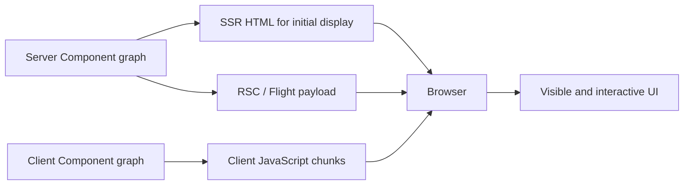
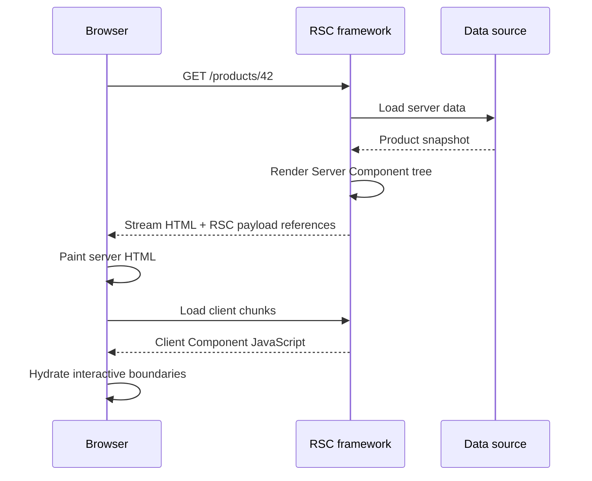
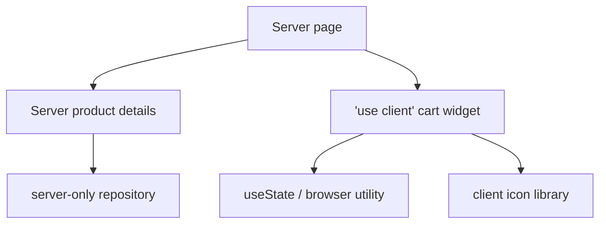
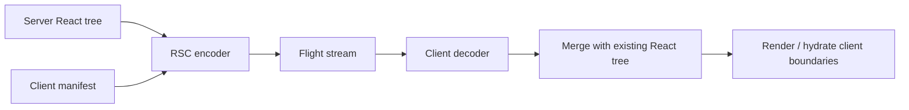
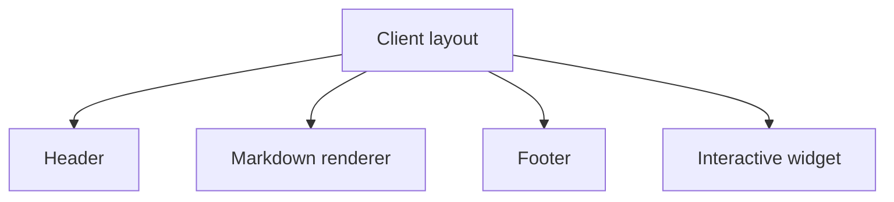
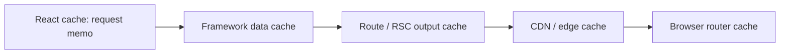
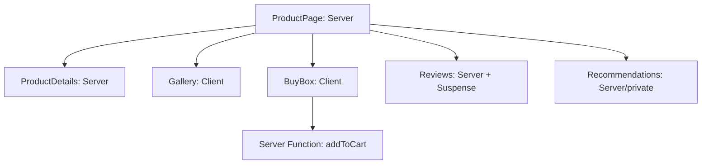

# React Server Components：边界、Flight、数据获取与 Server Action

> React Server Components 的核心不是“把所有组件搬到服务器”，而是建立两张受约束的模块图：Server Graph 负责数据访问与生成 UI 描述，Client Graph 只承载状态、事件和浏览器能力，两者通过可序列化的 RSC Payload 协作。

---

## 一、为什么 RSC 不是 SSR 的新名字

传统 SSR 在服务器执行 React，生成 HTML；浏览器仍需下载相应组件 JavaScript，再通过 Hydration 恢复同一 Client Tree。即使一个组件只读取数据库并输出静态文本，它的实现代码也可能进入 Client Bundle。

React Server Components（RSC）改变的是组件模块的执行和传输边界：

- Server Component 只在服务器环境执行，不把组件实现 JavaScript 放入 Client Graph；
- Client Component 承载 State、Effect、Event Handler 和 Browser API；
- Server Component 可以读取服务端数据并把渲染结果传给客户端；
- Framework 使用 RSC Payload 描述 Server Tree、Client Module Reference 和 Suspense Segment；
- 初次加载通常仍结合 SSR 生成 HTML，并对 Client Component 执行 Hydration；
- 后续导航可只传输新的 RSC Payload，再与客户端已有树合并。



因此：

- SSR 回答“初始 HTML 在哪里生成”；
- RSC 回答“哪些组件代码留在服务器，Server Tree 如何传给客户端”；
- Hydration 回答“Client Component 如何接管已存在 DOM”；
- Streaming 回答“HTML/RSC Segment 何时逐步到达”。

本文以 React 19.2 的稳定 RSC 组件模型和公开指令为基准。RSC 必须由兼容 Framework、Bundler 和 Runtime 集成；实现 RSC 的底层打包 API 与协议细节不等同于应用级稳定 API，React 官方要求 Framework 实现者谨慎锁定兼容版本。具体 Manifest、Payload、Cache 与 Server Action Transport 应以项目 Framework 版本为准。

### 核心结论

1. RSC 与 SSR 可以同时存在：Server Components 生成 RSC Tree，Framework 再用它产生初始 HTML；Client Components 仍需 Hydration。
2. Server Component 默认只在服务器执行，可直接访问服务端资源，但其返回到客户端的数据和 UI 仍对用户可见，不能包含 Secret。
3. `'use client'` 声明 Client Module Boundary，该模块及其静态依赖进入 Client Graph；它不表示组件只在浏览器 Render。
4. Server Component 可以 Import/Render Client Component；Client Component 不能静态 Import Server Component，但可以通过 `children` 或其他 React Node Prop 接收服务端已生成的 UI。
5. Server 到 Client 的 Props 必须满足 RSC 序列化协议。它不只支持 JSON，但普通函数、Class Instance、DOM Node 和任意 Closure 不能跨边界。
6. Flight 是结构化 React Tree Payload 的概念称呼，不是面向业务手写、长期稳定的公共 JSON API。
7. Server Component 可使用 `async/await` 读取数据，但仍需并行、去重、超时、授权、请求隔离与错误边界。
8. React `cache()` 主要解决 Server Render Request 内的重复计算，不等同于跨请求持久 Data Cache、Route Cache 或 CDN Cache。
9. React 公开术语是 Server Function；Framework 常把用于 Form/Mutation 的 Server Function 称为 Server Action。它本质上是可远程调用的服务端入口。
10. Server Function 必须重新验证身份、权限和输入，并处理 CSRF、幂等、冲突与缓存失效，不能因为调用语法像本地函数就信任客户端。
11. Bundle Reduction 取决于边界位置和 Client Graph，不能只统计 Server Bundle；还要测 RSC Payload、Client JS、Hydration 与服务器成本。
12. Bare React 应用不能只添加 `'use client'`/`'use server'` 就获得完整 RSC，必须采用支持该协议的 Framework 或自建完整集成。

---

## 二、一次 RSC 页面请求到底返回什么

RSC 应用常同时涉及三类产物：

| 产物 | 主要内容 | 浏览器用途 |
|---|---|---|
| HTML | 初始可见 DOM、Fallback、资源引用 | Parse、Paint、SEO/抓取 |
| RSC Payload | Server Tree、值、Client Module Reference、Segment | 重建/更新 React Tree |
| Client JavaScript | Client Component 实现和 Runtime | Hydration、State、Event、导航 |

### 2.1 初次 Hard Navigation



具体 Framework 可能把 HTML 与 RSC Payload 交错在同一响应、分成不同请求，或使用自定义 Router Cache。图中只表达职责，不代表固定 Wire Format。

### 2.2 Client Navigation

后续导航通常不需要重新下载完整 Document 和所有 Client JavaScript。Router 请求新 Route 的 RSC Payload，React 将新 Server Tree 与当前 Client Tree 合并，并尽量保留未变化 Layout 与 Client State。

这种合并能力依赖 Framework Router、Module Manifest、Cache 与部署版本协议。它不是浏览器原生能力，也不是任意 `fetch('/page')` 自动获得的行为。

### 2.3 RSC Payload 不是保密通道

Payload 可能包含：

- Server Component 已生成的文本和 React Element；
- 传给 Client Component 的 Props；
- Client Module 的引用标识；
- Suspense Segment 和错误摘要；
- Server Function Reference。

用户可以在自己的浏览器和网络工具中查看收到的内容。Server Source Code 与数据库凭据可以留在服务器，但任何进入 Payload/HTML 的字段都已越过信任边界。

---

## 三、Server / Client Component Boundary

### 3.1 Server Component：数据和非交互 UI

在支持 RSC 的 Framework 中，没有 `'use client'` 标记的组件模块通常属于 Server Graph：

```tsx
import { AddToCartButton } from './AddToCartButton';
import { productRepository } from './product-repository.server';

export default async function ProductPage({
  productId,
}: {
  productId: string;
}) {
  const product = await productRepository.findPublicProduct(productId);

  if (product === null) {
    return <p>商品不存在</p>;
  }

  return (
    <article>
      <h1>{product.name}</h1>
      <p>{product.description}</p>
      <AddToCartButton
        productId={product.id}
        productName={product.name}
      />
    </article>
  );
}
```

Server Component 可以：

- 直接调用数据库和内部服务，并在目标 Runtime 支持时使用服务端文件系统等 API；
- 使用服务端凭据发起请求；
- 使用 `async/await`；
- Import 只适用于服务器的依赖；
- Render Server Component 或 Client Component；
- 在 Build Time、Request Time 或 Revalidation 时执行，取决于 Framework 策略。

Server Component 不适合：

- `useState`、`useReducer` 等客户端交互状态；
- `useEffect`、`useLayoutEffect`；
- DOM Event Handler；
- `window`、`document`、`localStorage`；
- 需要长期驻留在浏览器中的订阅与动画。

Server Component 不是一个持续运行的服务端 UI 实例。它在 Framework 发起 Server Render 时执行，返回 Tree/Payload 后结束本次工作，不在浏览器中保持 Hook State。

### 3.2 Client Component：交互边界

```tsx
'use client';

import { useState } from 'react';

export function AddToCartButton({
  productId,
  productName,
}: {
  productId: string;
  productName: string;
}) {
  const [quantity, setQuantity] = useState(1);

  return (
    <div>
      <label>
        数量
        <input
          min={1}
          type="number"
          value={quantity}
          onChange={(event) => setQuantity(Number(event.target.value))}
        />
      </label>
      <button
        type="button"
        onClick={() => addToCart({ productId, quantity })}
      >
        将 {productName} 加入购物车
      </button>
    </div>
  );
}
```

`'use client'` 必须位于模块顶部、Import 之前。它标记的是模块边界，不需要在该 Client Module 的每个子组件文件中重复添加，只要这些模块通过 Client Graph 被静态 Import。

> Client Component 仍可能在服务器上预渲染为初始 HTML，然后在浏览器 Hydrate。`'use client'` 表示它的实现代码和交互语义需要进入客户端，不等于“只执行 CSR”。

### 3.3 Boundary 的依赖传播



一旦某模块成为 Client Entry，它静态 Import 的组件、工具和依赖通常也进入 Client Graph。把 `'use client'` 放在巨大 Layout 顶部，可能让本来只输出静态内容的大量模块都进入客户端。

应把 Boundary 下沉到真正需要交互的叶子附近，同时避免为了极端最小化制造过多 Client Entry、Chunk 和跨边界 Props。

---

## 四、跨边界组合：Server 可以包 Client，Client 不能 Import Server

### 4.1 Server Component Render Client Component

这是最常见方向：Server 读取数据，把必要的可序列化 Props 传给 Client Widget。

需要避免把整个数据库 Row、ORM Entity 或权限对象都传给 Client。先映射成最小 View Model：

```ts
type ProductButtonModel = Readonly<{
  productId: string;
  productName: string;
  canPurchase: boolean;
}>;
```

### 4.2 Client Component 不能静态 Import Server Component

下面的依赖方向会把 `ProductDetails` 拉入 Client Graph，而它可能包含数据库依赖，Framework 通常会拒绝：

```tsx
'use client';

// 错误边界：Client Module 静态导入 Server Component
import { ProductDetails } from './ProductDetails.server';
```

正确组合方式是让共同的 Server Parent 生成 Server UI，再作为 `children` 或 React Node Prop 传入 Client Component：

```tsx
// ProductPage.tsx - Server Component
export default function ProductPage() {
  return (
    <InteractivePanel>
      <ProductDetails />
    </InteractivePanel>
  );
}
```

```tsx
// InteractivePanel.tsx - Client Component
'use client';

import type { ReactNode } from 'react';
import { useState } from 'react';

export function InteractivePanel({ children }: { children: ReactNode }) {
  const [expanded, setExpanded] = useState(false);

  return (
    <section>
      <button type="button" onClick={() => setExpanded((value) => !value)}>
        {expanded ? '收起' : '展开'}
      </button>
      {expanded ? children : null}
    </section>
  );
}
```

`InteractivePanel` 不知道 `children` 的 Server Module 实现，只接收 Framework 已编码的 React Node。这样 Client Interaction 与 Server Content 仍保持正确依赖方向。

### 4.3 Provider 放置

需要浏览器 State 的 Context Provider 必须位于 Client Component 中。Provider 应尽量靠近真实消费者，而不是为了方便包住整个 Document，否则更大的子树会进入 Client Graph 或参与 Client Re-render。

Server Component 不能读取 Client Context 的动态值。服务端可用 Route Param、Cookie、Header 或数据层得到请求状态，再通过 Props 把必要值传到 Client Provider。

---

## 五、Flight Protocol：传输 React Tree，不是传输 HTML

“Flight”常用于描述 RSC 的流式传输协议。它表达的不是最终 DOM 字符串，而是 React Model：

- 已渲染的 Server Component Tree；
- Host Element 与 Props；
- Client Component Module Reference；
- Server Function Reference；
- Suspense/Promise Segment；
- 可序列化值和错误占位。



### 5.1 Client Manifest 的作用

Server Payload 不会直接发送 Client Component 函数，而是发送模块引用。Framework 构建阶段生成 Manifest，把 Server 看到的 Client Module ID 映射到浏览器可加载的 Chunk。

因此，HTML、RSC Payload、Server Bundle、Client Manifest 和 Client Chunk 必须来自兼容 Release。部署只更新一半产物，可能导致找不到模块、Chunk 404 或解码失败。

### 5.2 Flight 不是业务 API

不应：

- 手写字符串解析 Flight；
- 假设当前字段和 Marker 是长期稳定 Wire Contract；
- 让外部非 React Client 直接依赖内部 Payload；
- 在 CDN 中按普通 JSON 随意合并、改写或裁剪；
- 忽略 Content Type、Version、Cache Key 与权限。

业务需要公开 API 时，应提供有版本、可验证的 HTTP/GraphQL/RPC Contract，而不是把 RSC Payload 当作通用后端接口。

---

## 六、Serialization Boundary：不只是 JSON，但仍有硬边界

Server Component 传给 Client Component 的 Props 必须被当前 RSC 实现序列化。

### 6.1 常见支持与不支持类型

React 当前公开模型支持范围比 JSON 更广，具体仍需以锁定版本文档为准：

| 类型 | 一般边界 |
|---|---|
| String、Number、Boolean、Null、Undefined、BigInt | 可序列化基础值 |
| Plain Object、Array、受支持 Iterable | 成员必须继续可序列化 |
| Date、Map、Set、Typed Array、ArrayBuffer、FormData | 当前协议支持的内建值 |
| Promise / React Node | 用于流式 Server Model 与 UI 组合 |
| Server Function | 以受控远程引用跨边界 |
| 普通 Function / Event Handler | 不可从 Server 直接传给 Client |
| Class Instance、ORM Entity | 不应跨边界，映射为 Plain View Model |
| DOM Node、Browser Object | 只存在客户端环境 |
| 任意 Closure、Module Singleton | 不可作为普通 Props 序列化 |

不能简单说“RSC Props 只能是 JSON”，也不能因为协议支持某个内建类型就无约束传输大型对象。Payload Size、兼容性和数据最小化仍需治理。

### 6.2 错误示例

```tsx
// Server Component
export default function Page() {
  return (
    <ClientButton
      onConfirm={() => {
        console.log('server closure');
      }}
    />
  );
}
```

普通 Closure 不能传到浏览器。若逻辑是纯客户端交互，应在 Client Component 内定义；若要执行服务端 Mutation，应传 Server Function Reference，并按远程接口治理。

### 6.3 最小化 Payload

只传 Client 真正需要的数据：

```ts
// 不要把 ORM User Entity 整体传给 Client
type UserMenuModel = Readonly<{
  displayName: string;
  avatarUrl: string | null;
  canOpenAdmin: boolean;
}>;
```

字段最小化同时改善安全、Payload、缓存稳定性和前后端解耦。TypeScript 只能约束编译期，服务端仍需显式映射，不能用类型断言掩盖多余字段。

---

## 七、Data Fetching：靠近数据，不代表自动没有 Waterfall

Server Component 可以直接读取数据库或内部 API，减少浏览器到多个后端的往返，也避免把服务端凭据交给客户端。但 Data Fetching 仍需完整工程协议。

### 7.1 并行启动独立请求

```tsx
import { Suspense } from 'react';

type Product = { id: string; name: string };
type Review = { id: string; body: string };

export default function ProductPage({ productId }: { productId: string }) {
  const productPromise = getProduct(productId);
  const reviewsPromise = getReviews(productId);

  return (
    <>
      <ProductSummary productPromise={productPromise} />
      <Suspense fallback={<ReviewsSkeleton />}>
        <ProductReviews reviewsPromise={reviewsPromise} />
      </Suspense>
    </>
  );
}

async function ProductSummary({
  productPromise,
}: {
  productPromise: Promise<Product>;
}) {
  const product = await productPromise;
  return <h1>{product.name}</h1>;
}

async function ProductReviews({
  reviewsPromise,
}: {
  reviewsPromise: Promise<Review[]>;
}) {
  const reviews = await reviewsPromise;
  return <ReviewsList reviews={reviews} />;
}
```

两个 Promise 在父组件中同时创建，评论可通过 Suspense 独立 Streaming。若父组件先 `await getProduct()`，再 Render 会发起 `getReviews()` 的子组件，就可能形成串行 Waterfall。

### 7.2 Request Deduplication

React `cache()` 可记忆普通服务端数据函数的结果：

```tsx
import { cache } from 'react';

export const getProduct = cache(async (productId: string) => {
  const product = await productRepository.findPublicProduct(productId);

  if (product === null) {
    throw new Error('Product not found');
  }

  return product;
});
```

同一次 Server Render Request 中，多处用相同参数调用缓存函数可复用结果。React 会按 Server Request 生命周期处理这类 Cache；它不是跨请求持久缓存，也不能替代 Framework Data Cache、Redis 或 CDN。

若参数是 Object，只有相同引用才能自然表达“相同参数”；需要稳定去重时优先传 Product ID 等 Primitive Key，避免每次创建新的临时对象。

不要在组件内部创建 `cache(async () => ...)`，否则每次 Render 都得到新的 Memoized Function，无法复用预期 Cache。

### 7.3 数据治理仍不可缺失

- Authentication 与 Authorization；
- Tenant/User Request Isolation；
- Timeout、Abort 与 Client Disconnect；
- Retry Budget 和只读请求安全重放；
- Runtime Schema Validation；
- N+1 Query 与数据库连接池；
- Error、Not Found、Redirect 和 Partial Failure；
- Trace、Server-Timing 和慢查询定位。

Server Component 可以隐藏 Credential，但不能跳过授权。公开页面和登录页面还应使用不同 Data Access API，避免一个“万能 Repository”无意返回敏感字段。

---

## 八、Bundle Reduction：减少的是 Client Graph，不是所有成本

### 8.1 Server-only Dependency 不进入 Client Bundle

Markdown Parser、SQL Driver、CMS SDK 和大型格式化库如果只被 Server Component Import，通常不会进入 Client JavaScript。浏览器只接收它们产生的 UI/Data Model。

这可以减少：

- Client Transfer Size；
- Parse/Compile/Execute；
- Hydration 组件数量；
- 浏览器内存与依赖攻击面。

### 8.2 `'use client'` 放置过高会扩大 Client Graph



若 Layout 顶部被标记为 Client Module，并静态 Import 其所有子模块，Markdown、Header 和 Footer 依赖可能进入 Client Graph。更合理的做法通常是保持 Layout 为 Server Component，只把 `InteractiveWidget` 设为 Client Boundary。

但 Client Boundary 也不是越碎越好。过多 Entry 会增加 Chunk、Manifest、Props Serialization 和管理成本。应用 Bundle Analyzer 应分别查看 Server Graph、Client Graph 和 Route Chunk。

### 8.3 仍需支付的成本

RSC 不会自动消除：

- HTML 与 RSC Payload 字节；
- Client Component JavaScript；
- Client Component Hydration；
- 服务器 Render、Data Fetch 与 Serialization；
- Router Cache 和 Payload Decode；
- Suspense Waterfall；
- 第三方脚本与浏览器 Layout/Paint。

性能结论应同时比较 Client JS、RSC Payload、HTML、TTFB、LCP、Hydration/INP、服务器 CPU 和 Cache Hit，而不是只展示一个 Bundle 下降比例。

---

## 九、Server Function 与 Server Action：远程调用，不是本地函数

React 使用 Server Function 表示可由 Client 引用并在服务器执行的异步函数。Framework 常将用于 Mutation 或 Form `action` 的 Server Function 称为 Server Action。

### 9.1 `'use server'` 模块

```tsx
'use server';

type AddressActionState = Readonly<{
  status: 'idle' | 'success' | 'error';
  message: string;
}>;

export async function updateAddress(
  _previousState: AddressActionState,
  formData: FormData,
): Promise<AddressActionState> {
  const user = await requireAuthenticatedUser();
  const addressId = formData.get('addressId');
  const city = formData.get('city');
  const idempotencyKey = formData.get('idempotencyKey');

  if (
    typeof addressId !== 'string' ||
    addressId.trim().length === 0 ||
    typeof city !== 'string' ||
    city.trim().length === 0 ||
    city.trim().length > 100 ||
    typeof idempotencyKey !== 'string' ||
    idempotencyKey.length < 16 ||
    idempotencyKey.length > 128
  ) {
    return { status: 'error', message: '地址参数无效' };
  }

  const updated = await addressRepository.updateOwnedAddressOnce({
    addressId,
    city: city.trim(),
    idempotencyKey,
    userId: user.id,
  });

  if (!updated) {
    return { status: 'error', message: '地址不存在或无权修改' };
  }

  await invalidateAddressViews(user.id);
  return { status: 'success', message: '地址已保存' };
}
```

`requireAuthenticatedUser`、Owner 条件更新、幂等写入和 `invalidateAddressViews` 是应用服务职责。Framework 负责把 Client Reference 转成网络请求，但不会替业务自动完成这些安全与一致性规则。

### 9.2 Client Form 调用

```tsx
'use client';

import { useActionState } from 'react';
import { updateAddress } from './address-actions';

const initialState = {
  status: 'idle',
  message: '',
} as const;

export function AddressForm({
  addressId,
  idempotencyKey,
}: {
  addressId: string;
  idempotencyKey: string;
}) {
  const [state, formAction, isPending] = useActionState(
    updateAddress,
    initialState,
  );

  return (
    <form action={formAction}>
      <input type="hidden" name="addressId" value={addressId} />
      <input
        type="hidden"
        name="idempotencyKey"
        value={idempotencyKey}
      />
      <label>
        城市
        <input name="city" required />
      </label>
      <button type="submit" disabled={isPending}>
        {isPending ? '保存中' : '保存'}
      </button>
      <p aria-live="polite">{state.message}</p>
    </form>
  );
}
```

Client Import 得到的是 Framework 生成的 Server Reference/Proxy，不是把函数实现和数据库依赖打进浏览器。`idempotencyKey` 应由服务端页面或操作协调层为一次逻辑操作创建，并在同一次重试中复用；Hidden Input 仍可被篡改，服务端必须校验格式，并把 Key 绑定到当前 User、Operation Type 和目标资源。

### 9.3 Server Function 安全清单

每个 Server Function 都应被视为公开可调用 Endpoint：

- 每次执行重新认证，不能信任页面初始登录态；
- 在数据写入条件中验证 Resource Owner/Tenant；
- 所有参数按不可信输入做 Runtime Validation；
- 不信任 Hidden Input、Client Props 和 Closure 中的 ID；
- 根据 Framework 协议配置 CSRF/Origin 防护；
- 对支付、创建和关键写入实现 Idempotency；
- 使用 Version/ETag 或领域规则处理并发冲突；
- 限流并限制 Payload/File Size；
- Expected Error 返回安全结构，Unexpected Error 记录脱敏日志；
- 成功后精确更新或失效相关 Cache。

`'use server'` 不是访问控制标记，也不是“只有 UI 中出现按钮才能调用”的保证。

---

## 十、Cache：至少分清五个层次

RSC Framework 常同时存在多层 Cache：



| 层次 | 常见作用 | 主要风险 |
|---|---|---|
| React `cache()` | 单次 Server Request 去重 | 被误认为跨请求持久缓存 |
| Data Cache | 缓存 Fetch/Repository 结果 | Tag/Key、权限、新鲜度错误 |
| Route/RSC Cache | 缓存页面或 Payload | 个性化内容被共享 |
| CDN Cache | 跨用户/地区共享响应 | Cache Key、Cookie、Authorization 泄漏 |
| Router Cache | 浏览器保存已访问 Segment | Mutation 后继续显示旧 Tree |

### 10.1 Cache Key 与用户边界

公开商品与用户订单不能复用同一 Cache Policy。用户、租户、权限或实验影响输出时，应选择 Private/Dynamic 路径，或构造经过安全评审的有限 Cache Key。

不要把整个 Cookie/Authorization 加入 `Vary` 后就认为共享缓存安全；这可能产生每用户 Cache Variant，同时仍遗漏其他权限维度。

### 10.2 Mutation 后失效

Server Action 成功后可能需要同步：

- 当前 RSC Tree；
- 相关 Route/Segment；
- Framework Data Cache Tag；
- Client Query Cache；
- CDN 对象；
- 其他页面的计数和列表。

失效 API 与传播时间是 Framework/Platform 契约。应使用最小资源或 Tag 范围，并验证并发请求、失败重试、区域传播和旧 Router Cache。

### 10.3 Cache 不等于授权

授权必须在数据访问和 Mutation 时执行。Cache Hit 不能跳过权限验证，Cache Miss 也不能把用户数据写进公共对象。对权限变更、注销和租户切换，应测试已缓存 RSC Payload 是否仍可访问。

---

## 十一、安全边界：Server-only 不等于用户不可见

### 11.1 Secret 只应参与计算，不应进入输出

```tsx
// 错误：Secret 被传给 Client Component
<ClientAnalytics apiSecret={process.env.ANALYTICS_SECRET} />
```

环境变量、数据库凭据和内部 Token 可以被 Server Component 使用，但不能出现在 Client Props、HTML、RSC Payload、Error Message 或日志响应中。

### 11.2 服务端读取也要做授权

```tsx
export default async function OrderPage({ orderId }: { orderId: string }) {
  const user = await requireAuthenticatedUser();
  const order = await orderRepository.findOwnedOrder(orderId, user.id);

  if (order === null) {
    return <p>订单不存在</p>;
  }

  return <OrderSummary order={toPublicOrderModel(order)} />;
}
```

不能先按 `orderId` 查询完整订单，再只在 UI 中隐藏无权限字段。Data Access Query 本身就应包含 Owner/Tenant 条件，返回 Client 前再映射最小模型。

### 11.3 错误与 Debug 信息

生产 RSC 错误通常只向客户端发送安全摘要或 Digest，详细 Stack 留在 Server Log。不要把 SQL、内部 URL、Token、用户对象或原始 Validation Context 放进 Error Message。

错误监控应关联 Request ID、Route、Release、RSC/Action Phase 和脱敏 User/Tenant Hash，并为 Server Component Render、Payload Decode、Client Module Load 和 Server Function 分别分类。

### 11.4 Server-only Module Guard

Repository、Secret Loader 和管理端 SDK 应位于明确的 Server-only Module，并使用 Framework 提供的 Import Guard 或构建检查，防止未来重构把它们拉入 Client Graph。

仅靠文件名 `.server.ts` 是团队约定，不一定是所有 Bundler 的强制安全机制。必须确认目标 Framework 的实际行为。

---

## 十二、Framework 相关实现：指令不是完整 Runtime

### 12.1 RSC 需要哪些集成

完整 RSC Framework 至少要处理：

- Server/Client Module Graph 分割；
- Client Reference Manifest；
- RSC Encode/Decode；
- SSR HTML 与 Hydration Bootstrap；
- Suspense Streaming；
- Router 与 Client Navigation；
- Server Function Transport；
- Cache、Revalidation 与 Invalidation；
- Error、Not Found、Redirect 与 Status；
- Node/Serverless/Edge Runtime；
- Asset Version、Canary 和 Rollback。

在普通 Vite SPA 中写 `'use client'`，如果没有对应 RSC Plugin/Framework，Directive 不会自动建立两张模块图或 Flight Transport。

### 12.2 版本锁定

应用团队应遵循 Framework 声明的 React/React DOM 兼容矩阵。自研 Bundler/Framework 的团队还要注意：RSC 实现层 API、协议与打包集成可能在 React Minor 间变化，不应使用宽松版本范围后无验证升级。

升级时至少验证：

- Server/Client Manifest 一致；
- Hard/Soft Navigation；
- Streaming 与 Hydration；
- Server Function 调用；
- Cache/Revalidation；
- Old Asset Retention 与 Rollback；
- Node/Edge Runtime 兼容；
- Payload 与 Client Bundle 回归。

### 12.3 不要把 Framework 默认行为写成 React 事实

以下行为通常由 Framework 决定，而非 React 统一保证：

- 某个 Route 默认 Static 还是 Dynamic；
- `fetch` 是否跨请求缓存；
- Cookie/Header 是否触发动态渲染；
- Cache Tag 与 Revalidation API；
- Server Action Endpoint、加密和 CSRF 策略；
- RSC Payload 是否进入 CDN/Router Cache；
- Edge Runtime 的 Node API 支持。

技术文档必须标注 Framework 名称、版本和部署平台，不能把某个版本的默认配置推广为所有 RSC 应用规则。

---

## 十三、工程案例：商品详情页的 RSC 边界设计

假设商品页包含：

- 商品标题、描述与规格；
- 图片 Gallery；
- 价格、库存和购买按钮；
- 评论列表；
- 个性化推荐；
- 收藏与购物车 Mutation。

### 13.1 组件边界



- 商品描述由 Server Component 读取公共 Cache；
- Gallery 只把当前索引、手势和 Zoom 留在 Client；
- BuyBox 接收最小 Product View Model，Mutation 在服务端重新校验价格与库存；
- Reviews 独立 Suspense，避免慢评论阻塞商品 Summary；
- 推荐包含用户身份，走 Private Data/Output，不进入公共 Route Cache；
- 收藏和加购使用独立 Idempotency Key，并精确失效 Cart Count。

### 13.2 错误设计

将整个 `ProductPage` 标记 `'use client'`，再在 `useEffect` 请求全部数据，会：

- 把 Markdown、格式化和页面组件拉进 Client Graph；
- 恢复浏览器数据 Waterfall；
- 失去 Server-only Data Access；
- 增加 Hydration 与低端设备 CPU；
- 让公共与私有 Cache 边界更难判断。

相反，把 Gallery 每个小按钮都拆成独立 Client Entry，也会增加 Boundary 和 Chunk 复杂度。更合理的 Client Boundary 是一个具有完整交互所有权的 Gallery Widget。

### 13.3 发布验证

- Client Bundle 是否只包含 Gallery/BuyBox 等交互模块；
- RSC Payload 是否未包含成本价、供应商字段和权限对象；
- 匿名与登录用户 Cache 是否隔离；
- 评论失败是否局部降级；
- 加购是否重新认证、校验库存并支持幂等；
- Hard Navigation、Client Navigation 与 Refresh 结果一致；
- Canary/Rollback 时旧 Manifest 和 Client Chunk 可用；
- LCP、INP、Server CPU、Data Query 和 Cache Hit 同时达标。

---

## 十四、常见误区与错误案例

### 14.1 RSC 替代了 SSR

错误。RSC 生成组件树 Payload，SSR 生成初始 HTML。现代 Framework 常同时使用二者，并对 Client Component Hydrate。

### 14.2 `'use client'` 表示组件只在浏览器执行

错误。Client Component 可以被服务器预渲染为 HTML，但其代码必须发送到浏览器以恢复交互。

### 14.3 RSC Props 只能是 JSON

不准确。当前协议支持 Date、Map、Set、Promise 等更多类型，但仍有明确序列化边界。普通函数、Class Instance 和 DOM Node 不能作为普通 Props 跨越。

### 14.4 Server Component 可以直接使用 `useState`

错误。Server Component 不在浏览器维持交互 State；需要 State、Effect 或 Event Handler 的最小区域应成为 Client Component。

### 14.5 Client Component 可以 Import Server Component

错误依赖方向。应由 Server Parent Render Server Child，并将其作为 `children`/React Node 交给 Client Component。

### 14.6 `cache()` 会永久缓存数据库结果

错误。React `cache()` 主要提供 Server Request 内 Memoization。跨请求 Data Cache、TTL 和 Invalidation 由 Framework/应用层实现。

### 14.7 Server Action 参数来自 React，所以可信

危险。浏览器可构造请求并篡改 ID、价格和 Hidden Input。Server Function 必须像公开 API 一样认证、授权和校验。

### 14.8 使用 RSC 后不再需要 API

错误。移动端、第三方集成、Webhook、公开平台与独立服务仍需要稳定 API。RSC Payload 不应成为通用外部接口。

### 14.9 Server-only 组件输出用户看不到

错误。Source Code 不进入 Client Bundle，但 HTML、文本、Props 和 Payload 会到达浏览器。Secret 不能进入输出。

### 14.10 RSC 会自动实现零 JavaScript

错误。只要页面有 Client Component、Router Runtime、Event、State 或第三方 SDK，就仍有 Client JavaScript。实际结果必须从 Client Manifest 和 Network/Trace 测量。

---

## 十五、测试、性能与验证方法

### 15.1 Module Graph 验证

- Client Bundle 中是否出现数据库驱动、Server SDK 或 Markdown Parser；
- `'use client'` Entry 是否过高；
- Server-only Import Guard 是否能在 CI 阻止错误依赖；
- 同一大型库是否同时进入 Server/Client Graph；
- Client Chunk 是否按 Route/Feature 合理拆分；
- 构建 Manifest 是否与部署 Asset 一致。

### 15.2 Payload 验证

在授权测试环境检查 RSC Response：

- 是否包含多余字段、Secret、内部 ID 或 PII；
- Public/Private Response Cache Header 是否正确；
- Payload Size 与 Segment Waterfall；
- Error 是否只返回安全摘要；
- 不同 Tenant/User 是否可能命中同一 Cache；
- Mutation 后 Router/RSC Payload 是否及时刷新。

不要把生产用户 Payload 原样记录到日志或性能平台。

### 15.3 Server Function 安全测试

1. 不通过 UI，直接构造 Action Request；
2. 修改 Resource ID、Tenant ID、价格和 Hidden Field；
3. 未登录、Session 过期和权限刚撤销时调用；
4. 重复发送同一 Idempotency Key；
5. 并发发送不同版本更新；
6. 构造超大 Payload、错误 MIME 和无效字段；
7. 验证 CSRF/Origin、Rate Limit 与 Audit Log；
8. 模拟 Action 成功但响应丢失后的重试。

### 15.4 性能指标

至少比较：

| 层次 | 指标 |
|---|---|
| Server | Data Fetch、RSC Render、Serialization、CPU/Memory |
| Network | HTML、RSC Payload、Client JS、Chunk Waterfall |
| Browser | Parse/Execute、Hydration、Long Task、Memory |
| User | TTFB、LCP、INP、Navigation Ready、Error Rate |
| Cache | Data/Route/CDN/Router HIT、STALE、Invalidation Delay |

RSC 改造前后应使用同一 Route、数据集、设备、网络、Cache 条件和分位数。Client JS 下降但 TTFB、Payload 或服务器成本大幅上升，仍需评估端到端收益。

### 15.5 导航与故障矩阵

- Hard Navigation、Client Navigation、Refresh、Back/Forward；
- Cold/Warm Cache、Public/Private User；
- Slow Data、Timeout、Partial Error、Chunk 404；
- Streaming 被 CDN 缓冲；
- Server Function 超时、重复提交、冲突；
- Canary、Rollback 和长会话旧版本；
- Node/Serverless/Edge Runtime；
- JavaScript 慢加载和禁用后的 Progressive Enhancement。

---

## 十六、工程选型清单

### 边界设计

- 哪些组件只有数据和展示，哪些真正需要 State/Event/Browser API；
- `'use client'` 是否位于最小但有完整交互所有权的边界；
- Client Component 是否错误 Import Server Module；
- Server UI 是否可通过 `children` 组合；
- Provider 是否放得足够深。

### 数据与序列化

- Server Fetch 是否并行、去重、超时和可取消；
- 所有数据读取是否按用户/租户授权；
- Props 是否为最小可序列化 View Model；
- Payload 是否移除 Secret、内部字段和无关 PII；
- Query/Data/Route Cache 的 Key 与 Freshness 是否明确。

### Mutation

- Server Function 是否被当作公开 Endpoint；
- Input、Auth、Owner、CSRF、Rate Limit 是否验证；
- 写入是否具备 Idempotency 与 Conflict Policy；
- Expected/Unexpected Error 是否区分；
- Cache、Router Tree 和 Client State 是否精确同步。

### 构建与部署

- React、React DOM、Framework 和 RSC Adapter 是否版本兼容；
- Server/Client Manifest 与 Asset 是否原子发布；
- 旧 Chunk 是否覆盖长会话；
- Node/Edge API 与 Server-only Dependency 是否兼容；
- Hard/Soft Navigation、Canary、Rollback 是否回归。

### 性能与观测

- 是否分别记录 HTML、RSC Payload、Client JS；
- Server Render/Data/Serialization 是否可 Trace；
- Client Hydration/INP 是否改善；
- Cache Hit 与 Invalidation Delay 是否可见；
- Error 是否按 Server Render、Decode、Chunk、Action 分类。

---

## 十七、总结

React Server Components 建立了一条新的全栈组件边界，但没有取消 Web 工程原有的网络、缓存、安全和一致性责任：

1. Server Component 在服务器读取数据并生成 React Model，组件实现不进入 Client Graph。
2. Client Component 承载交互，`'use client'` 会建立模块依赖边界，但组件仍可参与 SSR 与 Hydration。
3. Server Parent 可以组合 Client Component，Client Component 通过 React Node 接收 Server UI，而不能反向 Import Server Module。
4. Flight Payload 传输结构化 React Tree 和模块引用，不是 HTML，也不是面向业务的稳定公共 API。
5. Serialization 支持范围比 JSON 更广，但仍应传最小 Plain View Model，并把所有到达浏览器的数据视为公开。
6. Server Data Fetching 仍需并行、去重、超时、授权、验证、隔离和观测。
7. React `cache()`、Framework Data Cache、Route/RSC Cache、CDN 与 Router Cache 是不同层次，必须分别定义生命周期。
8. Server Function/Action 是远程写入口，必须执行认证、授权、校验、幂等、冲突和缓存失效。
9. Bundle Reduction 只在边界正确时成立，收益要与 RSC Payload、服务器成本、Hydration 和用户指标一起验证。
10. RSC 依赖 Framework/Bundler/Runtime 协作，指令本身不会给普通 SPA 自动增加 Server Graph 和 Flight Transport。

真正需要记住的是：`'use client'` 决定哪些代码必须越过网络，Server/Client Props 决定哪些数据越过信任边界，Server Function 决定哪些操作暴露为远程入口。三条边界都必须可审计、可测试、可观测。

---

## 问答复盘

### Q1：React Server Components 是否取代了 SSR 和 Hydration？

**答：** 没有。RSC 负责 Server/Client Module Graph 和 React Tree Payload；SSR 生成初始 HTML；Client Component 仍需 Hydration 恢复事件与状态。Framework 常同时使用三者。

### Q2：`'use client'` 组件是否完全不会在服务器执行？

**答：** 不一定。它可以在服务器预渲染为 HTML，但其实现代码会进入 Client Graph，并在浏览器 Hydrate。该指令表达客户端能力边界，不等于纯 CSR。

### Q3：为什么 Client Component 不能直接 Import Server Component，却能接收它作为 `children`？

**答：** 静态 Import 会把 Server Module 拉进 Client Graph；`children` 由 Server Parent 先生成并通过 RSC Model 传递，Client 只接收 React Node，不依赖 Server 实现模块。

### Q4：RSC Props 是否只能使用 JSON 类型？

**答：** 不是。当前协议还支持 Date、Map、Set、Promise 等受控类型，但普通函数、Class Instance、DOM Node 和任意 Closure 不能作为普通 Props。具体范围应核对锁定 React 版本。

### Q5：React `cache()` 与 Framework Data Cache 的核心区别是什么？

**答：** React `cache()` 主要在单次 Server Request 中复用计算；Framework Data Cache 可以跨请求持久化并提供 TTL/Tag/Invalidation。两者生命周期和安全边界不同。

### Q6：Server Component 中可以直接查询数据库，为什么仍要做授权？

**答：** 代码在服务器运行只保护凭据，不证明当前用户有权读取目标数据。Query 本身应包含 User/Tenant 条件，并在传给客户端前映射最小公开模型。

### Q7：Server Action 为什么必须按公开 API 防护？

**答：** 客户端可以绕过 UI 直接构造调用并篡改参数。每次执行都必须重新认证、授权、校验，并处理 CSRF、限流、幂等和冲突。

### Q8：使用 RSC 后，Client Bundle 一定会显著下降吗？

**答：** 不一定。若 `'use client'` 放在高层、交互组件和第三方库很多，Client Graph 仍可能很大。必须分析真实 Manifest、Chunk、Payload 和 Hydration Trace。

### Q9：RSC Payload 中能否放服务端 Secret，因为它不是普通 JSON？

**答：** 不能。Payload 会发送到用户浏览器，可以被查看。Secret 只能在服务端参与计算，不得进入 HTML、Client Props、RSC Payload、Error 或响应日志。

### Q10：如何证明一次 RSC 改造是成功的？

**答：** 在相同场景下同时验证 Client JS/Hydration 下降、RSC Payload 和 TTFB 可控、服务器成本与 Cache 正常、授权和 Action 安全，并在 Field LCP/INP、错误率和业务指标中确认收益。

---

## 延伸知识

- Next.js App Router：Layout、Dynamic Rendering、Cache/Revalidation 与 Runtime；
- React Hydration：Selective Hydration、Event Replay 与 Mismatch；
- Streaming SSR：Shell、Segment、Status Code 与 Proxy Buffering；
- Server State：Request Memoization、Data Cache、Query Hydration 与 Mutation；
- Web 安全：CSRF、IDOR、Safe Serialization、CSP 与 Server-only Import；
- 部署工程：Client Manifest、Asset Fingerprint、Canary、Rollback 与旧 Chunk；
- 性能观测：RSC Payload、Server-Timing、Long Task、LCP 与 INP；
- API 架构：RSC Payload 与 REST/GraphQL/RPC 公共契约的职责边界。
