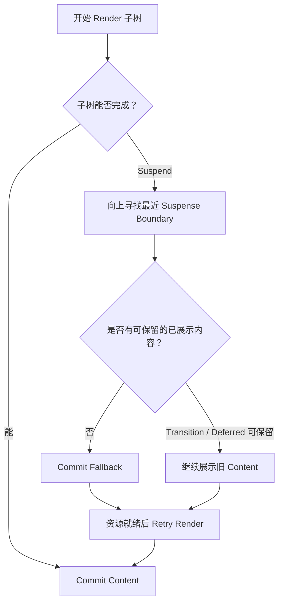
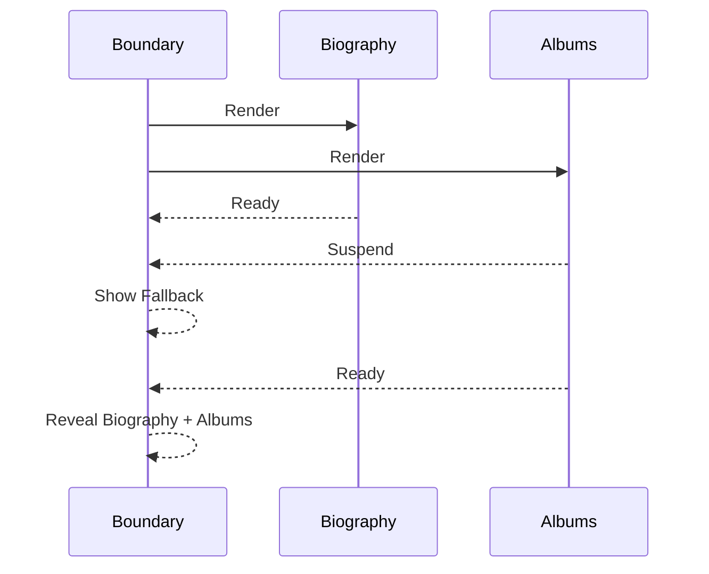
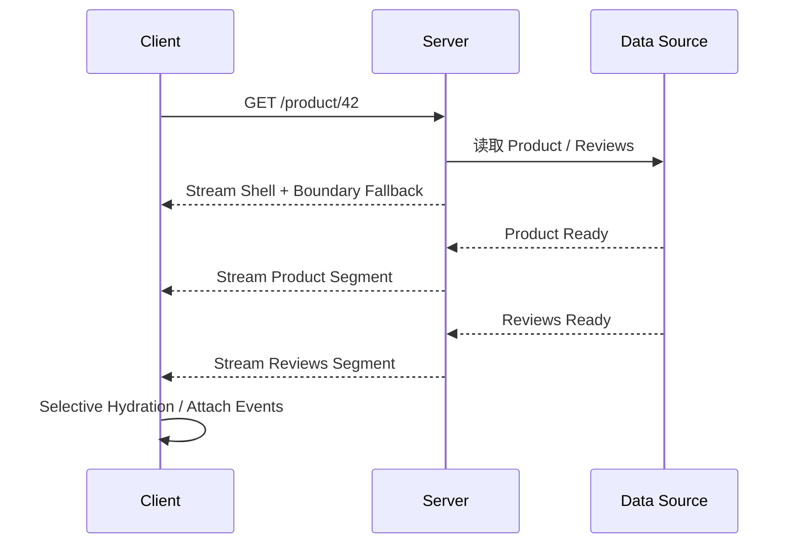

# React Suspense：异步边界、Reveal 策略与 Streaming SSR

> Suspense 不是通用请求组件，也不负责缓存和错误处理。它是一条异步 UI 边界：当子树暂时无法完成 Render 时，React 根据边界和更新优先级选择显示 Fallback、保留旧内容，或在服务端先流式发送可用 Shell。

---

## 一、本文解决什么问题

现代页面的异步来源不只网络请求，还包括路由代码分包、服务端组件、图片之外的模块资源和并发数据读取。如果每个组件各自维护 `loading` Boolean，页面容易出现多个 Spinner 竞争、布局跳动、错误无处接管和服务端必须等待所有数据后才能返回 HTML。

Suspense 提供的是“哪些内容应一起等待、先展示什么、后展示什么”的边界模型。

本文回答以下问题：

- Suspense Boundary 捕获的究竟是什么；
- Fallback 何时显示，已展示内容何时会被隐藏；
- 同一 Boundary 内的内容为什么一起 Reveal；
- Nested Boundary 如何表达分阶段展示；
- `SuspenseList` 能否作为稳定生产 API；
- `lazy` 如何与 Suspense 完成 Code Splitting；
- 哪些数据源真正支持 Data Suspense；
- 普通 `useEffect` Fetch 为什么不会触发 Suspense；
- Promise Reject 为什么需要 Error Boundary；
- Transition 与 Deferred Value 如何避免隐藏已展示内容；
- Streaming SSR 和 Selective Hydration 解决什么问题；
- 如何测试加载、错误、重试、流式输出与性能。

本文依据 2026 年 7 月 React 19.2 稳定官方文档。Suspense 的 Boundary、`lazy`、与并发更新及服务端流式渲染的集成属于公开能力；自定义 Suspense 数据源的底层要求仍由 React 官方标注为不稳定且未文档化，应使用支持 Suspense 的框架或成熟数据层。

React 19.2 稳定文档没有 `SuspenseList` API 页面。若在实验渠道、旧示例或第三方类型中看到它，必须核对确切 React Channel 和发布支持，不能作为通用稳定生产契约。

### 核心结论

1. `<Suspense fallback={...}>` 在子树 Render 暂时无法完成时提供最近的等待边界。
2. 同一 Boundary 下多个 Suspend 子项通常作为一个 Reveal 单元，全部准备好后再共同显示。
3. Nested Boundary 用于按产品语义分阶段展示，Boundary 粒度不应机械等同于组件粒度。
4. 已展示内容再次 Suspend 时，普通紧急更新可能显示 Fallback；Transition 或 Deferred Value 可帮助保留旧内容。
5. Suspense 不捕获 Promise Reject 形成的错误，错误需要最近的 Error Boundary 或框架错误边界处理。
6. `lazy` 支持模块级 Code Splitting，动态导入失败会进入 Error Boundary。
7. Data Suspense 只适用于支持该协议的数据源；Effect Fetch、事件 Fetch 不会自动激活 Boundary。
8. Suspense 不提供 Cache、Abort、Retry、去重和一致性，这些属于框架或 Server State 层。
9. Streaming SSR 可以先发送 Shell/Fallback，再流式补齐边界内容；Selective Hydration 让客户端不必等待整页同时 Hydrate。
10. Suspense 设计应同时验证 Loading、Error、Retry、SEO、Hydration、可访问性和真实 Web 性能。

---

## 二、Suspense Boundary 的基本模型

```tsx
function ProductPage() {
  return (
    <Suspense fallback={<ProductPageSkeleton />}>
      <ProductDetails />
    </Suspense>
  );
}
```

当 `ProductDetails` 或其后代在 Render 中触发 React 支持的 Suspension，React 向上寻找最近的 Suspense Boundary。边界决定这一片子树暂时显示什么。



Suspension 可以理解为“本次 Render 暂时缺少完成所需资源，请稍后重试”，而不是组件进入一个永久 Loading State。

### 2.1 React 不保留首次挂载前 Suspend 的 State

如果一棵树在首次成功 Mount 前 Suspend，React 不会保留那次未 Commit Render 的 State。资源就绪后会重新尝试 Render。组件初始化、Memo 计算和 Render 都必须纯净，不能依赖“首次只执行一次”。

### 2.2 Boundary 不等于请求边界

一个 Boundary 可以同时协调代码模块和数据，也可以覆盖多个请求。反过来，一个请求结果可能被多个边界消费。Boundary 设计依据是用户希望哪些 UI 一起 Reveal，而不是后端 API 数量。

---

## 三、Fallback：临时内容也是正式产品界面

Fallback 可以是任意 React Node：

```tsx
<Suspense fallback={<OrdersSkeleton rows={8} />}>
  <OrdersTable />
</Suspense>
```

好的 Fallback 应：

- 与最终布局尺寸接近，减少 Cumulative Layout Shift；
- 保留页面导航和关键操作；
- 反映等待区域，而不是让整页空白；
- 提供适当的 `aria-busy` 或状态文本；
- 不伪装成真实可交互数据；
- 在慢网和错误场景中仍有明确出口。

### 3.1 Skeleton、Spinner 与旧内容

| 情况 | 优先选择 |
|---|---|
| 首次进入且没有任何旧数据 | Skeleton 或有尺寸的占位 |
| 小型局部动作 | 按钮内 Spinner 或进度文本 |
| 已有内容刷新 | 保留旧内容 + Pending/Stale 提示 |
| 整体路由 Shell 未就绪 | 页面级 Shell，但保留可用导航 |
| 时间较长且可量化 | Progress，而非无限 Spinner |

### 3.2 Fallback Prop 的身份

Fallback 中也可以包含组件，但不应在 Render 中创建请求、Timer 或外部资源。Boundary 频繁切换时，Fallback 自身会 Mount/Unmount，其 Effect 同样必须 Cleanup。

### 3.3 已展示内容再次 Suspend

如果已展示子树因一次普通更新再次 Suspend，React 可能隐藏它并展示 Fallback。隐藏已显示内容会造成视觉跳变，因此路由切换、Tab 切换等通常应放进 Transition，搜索结果可以使用 Deferred Value。

React 官方文档还说明：如果 React 需要隐藏已显示内容，会清理该子树的 Layout Effect；内容重新显示时再运行 Layout Effect，以避免隐藏 DOM 的布局测量残留。订阅和布局逻辑必须支持重复 Setup/Cleanup。

---

## 四、Reveal Strategy：哪些内容一起出现

同一个 Suspense Boundary 内的子项作为一个可见单元：

```tsx
<Suspense fallback={<ProfileSkeleton />}>
  <Biography />
  <Albums />
</Suspense>
```

即使 `Biography` 先准备好，若 `Albums` 仍 Suspend，Boundary 通常继续显示 `ProfileSkeleton`，直到两者都能完成。



### 4.1 一起 Reveal 的收益

- 避免内容零散跳入；
- 保持布局关系完整；
- 让一个 Skeleton 对应一个产品区域；
- 简化用户对“这一块是否就绪”的理解。

### 4.2 一起 Reveal 的代价

- 快内容被最慢内容拖住；
- Boundary 过大会延迟可用信息；
- 一个低价值模块可能阻挡核心任务；
- 错误与重试范围也可能过大。

Boundary 应围绕设计稿中的 Loading Sequence，而不是围绕每个 Fetch。

---

## 五、Nested Boundary：分阶段展示

如果 Biography 应先显示，Albums 可以随后加载，应嵌套边界：

```tsx
<Suspense fallback={<ProfileHeaderSkeleton />}>
  <Biography />

  <Suspense fallback={<AlbumsSkeleton />}>
    <Albums />
  </Suspense>
</Suspense>
```

外层准备好后可以 Reveal Biography，内层仍显示 Albums Skeleton；Albums 就绪后只替换内层。

### 5.1 Boundary 粒度原则

- 用户是否认为这些内容属于同一加载单元；
- 快内容是否能独立完成真实任务；
- Fallback 是否有稳定布局；
- 错误是否能局部恢复；
- 请求是否共享缓存和权限；
- SSR 时是否值得单独流式发送；
- Hydration 时交互区域是否应更早可用。

### 5.2 过度嵌套的问题

给每个卡片包 Boundary 会产生 Loading Noise、DOM 复杂度和大量 Reveal 时序，用户看到页面不断跳动。Boundary 应由设计与业务恢复策略决定，不是“异步组件必包一个”的规则。

### 5.3 Transition 与新 Boundary

Transition 会尽量避免隐藏已 Reveal 的内容，但不会等待所有新嵌套 Boundary。已经显示的外层 Layout 可以保持，首次出现的内层 Boundary 仍可展示自己的 Fallback。这样导航既保留稳定 Shell，又不会无限等待所有次要数据。

---

## 六、SuspenseList 适用性

`SuspenseList` 常出现在早期实验文档或讨论中，用于协调多个同级 Boundary 的 Reveal 顺序。然而截至 React 19.2 稳定官方文档，它没有稳定 API 页面。

工程结论：

- 不把 `SuspenseList` 当成跨 React 版本的稳定生产 API；
- 不在公共组件库无条件导出依赖它的组件；
- 如果实验渠道提供类似能力，固定精确 React Channel 并单独验证；
- 框架若内部协调 Reveal，应使用框架公开契约，而不是依赖其 React 私有实现；
- 稳定项目优先使用 Nested Boundary、布局占位和数据预取控制体验。

不要仅因为大纲或旧文章出现该名称，就编造当前稳定用法。升级后若官方重新提供稳定文档，应以当时版本重新评估。

---

## 七、Code Splitting：`lazy` 与模块加载

```tsx
const OrderAnalytics = lazy(() => import('./OrderAnalytics'));

function OrderPage() {
  return (
    <Suspense fallback={<AnalyticsSkeleton />}>
      <OrderAnalytics />
    </Suspense>
  );
}
```

首次需要该组件时，动态 Import 返回 Promise。模块尚未加载时，组件 Suspend，最近 Boundary 显示 Fallback；模块加载成功后 React 重试 Render。

### 7.1 `lazy` 必须在模块顶层声明

```tsx
function OrderPage() {
  const OrderAnalytics = lazy(() => import('./OrderAnalytics')); // 错误
  return <OrderAnalytics />;
}
```

Render 中重复创建 Lazy Component 会破坏组件身份并可能重置 State。应在模块顶层声明，使 React 缓存加载 Promise 和解析后的模块。

### 7.2 Export 约束

传统 `lazy` 用法期望动态导入模块提供 `default` Component Export。若项目构建工具支持其他映射方式，也应以当前 React 与 Bundler 文档为准，不要让示例依赖未经验证的魔法转换。

### 7.3 Chunk Load Error

部署新版本后，旧 HTML 可能引用已删除 Chunk；网络或 CDN 也可能失败。动态 Import Reject 会进入 Error Boundary，而不是永远显示 Suspense Fallback。

处理策略包括：

- Error Boundary 提供刷新或重试；
- 静态资源使用内容 Hash 与长期缓存；
- HTML 使用合适缓存策略；
- 灰度发布期间兼容旧 Chunk；
- 监控 Chunk Load Error 版本、URL 和网络环境；
- 避免无上限自动刷新循环。

### 7.4 预加载

对高概率下一步操作，可由路由器、框架或 Bundler 在 Hover、Viewport 或空闲时预加载代码和数据。预加载策略应测量网络竞争，不能让次要 Chunk 抢占首屏关键资源。

---

## 八、Data Suspense：只使用受支持的数据源

React 官方列出的 Suspense 激活来源包括：

- 支持 Suspense 的框架/数据源，例如框架级路由和缓存；
- `lazy` 加载组件代码；
- 使用 React 支持的 API 读取缓存 Promise，例如当前 React 中的 `use`。

普通 Effect Fetch 不会触发 Suspense：

```tsx
function ProductDetails({ productId }: { productId: string }) {
  const [state, setState] = useState({ status: 'loading' });

  useEffect(() => {
    // 这是 Effect 请求，需要组件自己渲染 Loading；不会自动触发外层 Suspense。
  }, [productId]);

  return <ProductStateView state={state} />;
}
```

### 8.1 使用 `use` 读取稳定 Promise

React 19 支持通过 `use` 读取 Promise。Promise Pending 时组件 Suspend，Fulfilled 时返回值，Rejected 时向 Error Boundary 抛错：

```tsx
function ProductDetails({
  productPromise,
}: {
  productPromise: Promise<Product>;
}) {
  const product = use(productPromise);
  return <ProductView product={product} />;
}

function ProductPage({ productPromise }: Props) {
  return (
    <Suspense fallback={<ProductSkeleton />}>
      <ProductDetails productPromise={productPromise} />
    </Suspense>
  );
}
```

关键要求是 Promise 身份稳定并由框架、服务端或缓存层管理。不要在客户端组件 Render 中每次创建新 Promise：

```tsx
const product = use(fetch(`/api/products/${id}`).then(r => r.json())); // 错误方向
```

这会在重试 Render 时创建新请求，无法收敛。React 官方明确说明，实现 Suspense 数据源所需的底层协议不稳定且未文档化，因此应用不应手写一套通用 Promise Cache 后宣称兼容所有 React 版本。

### 8.2 React 18 边界

React 18 稳定客户端应用不能假设拥有 React 19 的 `use(Promise)` 能力。应使用目标框架提供的 Loader、Relay 等正式集成，或继续使用 Effect/Server State 库的显式 Loading State。

### 8.3 Suspense 不负责数据治理

数据层仍必须处理：

- Cache Key 与去重；
- Abort、超时和重试；
- Stale Time 与失效；
- 权限和鉴权刷新；
- 响应乱序；
- Mutation、乐观更新与回滚；
- SSR 序列化和 Hydration；
- 数据安全与敏感信息边界。

Suspense 只消费“Pending/Fulfilled/Rejected”结果来决定 UI Boundary。

---

## 九、Error Boundary：Pending 与 Failed 是两条路径

Suspense Fallback 处理“尚未准备好”，Error Boundary 处理“已经失败”。两者应组合：

```tsx
<ProductErrorBoundary fallback={<ProductErrorState />}>
  <Suspense fallback={<ProductSkeleton />}>
    <ProductDetails />
  </Suspense>
</ProductErrorBoundary>
```

`ProductErrorBoundary` 不是 React 内置同名组件，可以由项目类组件、框架或成熟库提供。

### 9.1 边界顺序

Error Boundary 在外层时，可以接管 Lazy Import 或数据 Promise 的 Reject。大型页面可以为关键区域设置局部 Error Boundary，让侧栏失败不摧毁整个路由 Shell。

### 9.2 Retry 必须重置失败原因

只重新 Render Error Fallback 不一定会重新发请求。Retry 通常需要：

- 让数据层清除错误并重新获取；
- 重置 Error Boundary；
- 保持或改变 Query Key；
- 限制重试次数并使用退避；
- 区分离线、权限、404 和服务故障；
- 写操作避免盲目重试。

可以用稳定实体 ID 或 Retry Token 改变边界 `key` 以重建子树，但这会丢失其全部局部 State，应确认重置语义。

### 9.3 Error Boundary 的能力边界

传统 Error Boundary 主要捕获后代 Render/生命周期错误，不会自动捕获所有事件处理函数、任意异步回调或服务端外部错误。框架可能扩展错误路由协议，应按其文档实现。

---

## 十、Transition、Deferred Value 与 Suspense

### 10.1 Transition 避免隐藏已显示 Layout

```tsx
const [isPending, startTransition] = useTransition();

function navigate(nextPage: Page) {
  startTransition(() => {
    setPage(nextPage);
  });
}
```

如果新页面 Suspend，React 可以继续显示已经 Reveal 的旧页面，而不是立刻退回外层 Fallback。导航仍应通过 `isPending` 提供反馈。

### 10.2 Deferred Value 保留旧结果

```tsx
const deferredQuery = useDeferredValue(query);

<Suspense fallback={<SearchSkeleton />}>
  <SearchResults query={deferredQuery} />
</Suspense>
```

已有结果后，新 Deferred Query Suspend 时继续展示旧结果，并用 `query !== deferredQuery` 标记 Stale。

### 10.3 Key 表达内容身份

从用户 A 切换到用户 B 时，如果产品语义认为是完全不同内容，可给子树或 Boundary 使用稳定实体 Key：

```tsx
<Suspense fallback={<ProfileSkeleton />} key={userId}>
  <UserProfile userId={userId} />
</Suspense>
```

改变 Key 会重建边界并允许展示新实体的 Fallback，同时丢弃旧局部 State。不要用随机 Key，也不要在应保留旧内容的搜索更新中无意改变 Key。

---

## 十一、SSR Streaming：先发送 Shell，再补齐边界

传统同步 SSR 需要整棵树完成后才发送完整 HTML。Streaming SSR 可以把页面拆成多个 Suspense Segment：

1. 服务器 Render 可立即完成的 Shell；
2. Suspend 区域先输出 Fallback；
3. 数据或代码准备后，继续向同一响应流发送边界内容；
4. 客户端按 React 协议把内容接入对应位置；
5. JavaScript 到达后逐步 Hydrate。



### 11.1 Node 流式入口

React DOM Server 在 Node 环境提供 `renderToPipeableStream`：

```tsx
import type { IncomingMessage, ServerResponse } from 'node:http';
import { renderToPipeableStream } from 'react-dom/server';

function handleRequest(
  request: IncomingMessage,
  response: ServerResponse,
) {
  let didError = false;

  const { pipe, abort } = renderToPipeableStream(<App url={request.url} />, {
    bootstrapScripts: ['/client.js'],

    onShellReady() {
      response.statusCode = didError ? 500 : 200;
      response.setHeader('Content-Type', 'text/html; charset=utf-8');
      pipe(response);
    },

    onShellError(error) {
      logger.error('SSR shell failed', error);
      response.statusCode = 500;
      response.end('<!doctype html><p>页面暂时不可用</p>');
    },

    onError(error) {
      didError = true;
      logger.error('SSR render error', error);
    },
  });

  const timeoutId = setTimeout(abort, 10_000);

  response.on('close', () => {
    clearTimeout(timeoutId);
    abort();
  });
}
```

这是机制示意。生产项目还需处理 CSP Nonce、Bootstrap Module、压缩、代理缓冲、Bot、静态生成、Trace、Abort 原因和框架约束。Web Streams 环境通常使用 `renderToReadableStream`。

### 11.2 HTTP Status 边界

Shell 一旦开始发送，HTTP Status 和 Header 通常不能再修改。后续某个边界失败可由 Error Boundary/客户端处理，但响应可能已经是 200。404、鉴权和重定向等关键路由决策应尽量在 Shell Flush 前确定，或使用框架支持的协议。

### 11.3 代理缓冲

CDN、反向代理或压缩中间件可能缓冲小 Chunk，让服务端虽然流式 Render，客户端却一次性收到。必须在真实部署链路用 Network Timing 验证，不能只看本地开发服务器。

---

## 十二、Selective Hydration：交互优先于整页就绪

Streaming HTML 让内容更早到达，但 HTML 出现不等于事件已经可交互。Hydration 仍需下载并执行客户端 JavaScript。

Suspense Boundary 为 Selective Hydration 提供分段边界，使 React 可以逐步 Hydrate，而不必等待整页所有代码和数据。用户与尚未 Hydrate 的区域交互时，React 可以提高相关边界的 Hydration 优先级；具体事件重放和调度细节属于实现，不应作为业务时序 API。

工程上仍要控制：

- Client Bundle 大小；
- 第三方脚本长任务；
- Boundary 对应 Chunk；
- 服务端和客户端输出一致；
- Hydration Error 监控；
- 交互前的禁用/占位语义；
- React Server Components 的 Client Boundary 数量。

Streaming SSR 不会自动消除 Hydration CPU。

---

## 十三、常见误区

### 13.1 “任何 Promise 都会被 Suspense 自动捕获”

错误。只有 React 支持的 Suspense 数据源、`lazy` 和相应读取协议会激活 Boundary。

### 13.2 “Effect Fetch 设置 Loading 就等于 Data Suspense”

错误。Effect 在 Commit 后运行，不能让当前 Render Suspend；这是显式异步状态模式。

### 13.3 “Suspense 会处理请求错误”

错误。Promise Reject 或 Lazy Import Error 需要 Error Boundary；Fallback 处理 Pending。

### 13.4 “Boundary 越多，页面越快”

错误。过多 Boundary 会造成 Loading Noise、布局跳动和复杂 Reveal，应按用户感知分组。

### 13.5 “Transition 会等待所有嵌套内容后一次显示”

错误。它主要避免隐藏已 Reveal 内容，新出现的 Nested Boundary 仍可先显示自己的 Fallback。

### 13.6 “Streaming SSR 保证线上逐块到达”

错误。代理、CDN、压缩和浏览器缓冲可能改变传输效果，必须在真实链路验证。

### 13.7 “`SuspenseList` 是 React 19.2 稳定 API”

错误。当前稳定官方文档没有该 API 页面，不应作为通用生产依赖。

---

## 十四、测试与验证

### 14.1 可控 Promise 测试 Boundary

通过框架测试工具或稳定测试资源控制 Promise：

1. Render 页面并让资源 Pending；
2. 断言最近 Boundary 显示正确 Fallback；
3. Resolve 后断言 Content Reveal；
4. Reject 后断言 Error Boundary；
5. Retry 时重置资源和错误边界；
6. 快速切换 Key 时断言旧结果不会覆盖新实体。

不要在测试中每次 Render 新建 Promise，否则会形成永不完成的 Suspension。

### 14.2 Code Splitting 测试

- Chunk 成功加载后组件显示；
- Chunk Reject 时错误 UI 可恢复；
- 重试不会无限刷新；
- 部署旧版本页面仍能加载所需资源；
- Lazy Component 声明在模块顶层，State 不被意外重置。

### 14.3 Transition 与旧内容

先完成旧页面，再启动会 Suspend 的 Transition：

- 已 Reveal Layout 应保持；
- Pending 指示出现；
- 新 Nested Boundary 可显示局部 Fallback；
- 资源完成后切换到新内容；
- 失败时进入目标 Error Boundary。

### 14.4 Streaming SSR 集成测试

在真实 Node/Web Stream 和代理链路验证：

- Shell 首字节时间；
- Fallback 是否先到达；
- 后续 Segment 是否逐步到达；
- Client Disconnect 是否 Abort；
- Shell Error 与边界 Error 的状态码策略；
- CSP、压缩和代理是否破坏流；
- Hydration 是否无 Mismatch；
- 禁用 JavaScript 时核心 HTML 是否仍有意义。

### 14.5 性能指标

在生产构建和目标设备测量：

- Time to First Byte（TTFB）；
- First Contentful Paint（FCP）；
- Largest Contentful Paint（LCP）；
- Cumulative Layout Shift（CLS）；
- Interaction to Next Paint（INP）；
- 各 Boundary Reveal 时间；
- Client JavaScript 下载与 Hydration CPU；
- Chunk 数量、命中率和 Chunk Load Error；
- 请求瀑布与 Cache 命中。

增加 Boundary 可能改善 TTFB/FCP，却因 Skeleton 尺寸错误恶化 CLS，或因 Chunk 过碎增加请求成本。必须整体衡量。

---

## 十五、工程检查清单

- 当前异步来源是否真正支持 Suspense；
- Boundary 是否对应用户感知的 Loading Unit；
- Fallback 是否有稳定尺寸和可访问性语义；
- 已展示内容刷新时是否应使用 Transition/Deferred Value；
- Nested Boundary 是否表达合理 Reveal 顺序；
- 是否错误依赖非稳定 `SuspenseList`；
- Lazy Component 是否在模块顶层声明；
- Chunk Reject 是否由 Error Boundary 处理；
- Data Source 是否缓存 Promise、去重、Abort 和处理错误；
- 是否避免在 Render 中裸创建 Fetch Promise；
- React 18/19 与框架数据协议是否明确；
- Retry 是否真正重置数据错误，并限制写请求重试；
- SSR Shell、Status Code 和 Abort 策略是否定义；
- CDN/代理是否保留 Streaming；
- Hydration、CSP、SEO 和无 JavaScript 输出是否验证；
- 是否在生产链路测量 Web Vitals、Reveal 和 Chunk 指标。

---

## 十六、总结

1. Suspense Boundary 为暂时无法完成的 Render 子树定义 Fallback 和 Reveal 范围。
2. 同一 Boundary 的内容通常一起显示，Nested Boundary 用于分阶段 Reveal。
3. Fallback 是正式产品状态，必须考虑布局、可访问性和交互连续性。
4. Transition 与 Deferred Value 可以避免新异步工作立即隐藏已显示内容。
5. React 19.2 稳定文档没有 `SuspenseList` API，生产代码不应无条件依赖。
6. `lazy` 负责模块 Code Splitting，Import Reject 由 Error Boundary 处理。
7. Data Suspense 只适用于受支持的数据源；Effect Fetch 不会自动激活 Boundary。
8. Suspense 处理 Pending，Error Boundary 处理 Failed，数据层处理 Cache、Retry 和一致性。
9. Streaming SSR 先发送 Shell/Fallback，再补齐 Segment；Selective Hydration 分阶段恢复交互。
10. Boundary 设计必须通过真实网络、代理、Hydration 和 Web Vitals 验证。

Suspense 的核心不是“把 Spinner 写得更少”，而是把异步等待提升为 UI 架构：哪些内容必须一起出现，哪些可以随后 Reveal，失败由谁接管，以及服务端和客户端如何共同完成这条路径。

---

## 问答复盘

### Q1：Suspense Boundary 捕获的是所有异步 Promise 吗？

**答：** 不是。只有 React 支持的 Suspense 数据源、`lazy` 和相应 Promise 读取协议会激活 Boundary。

### Q2：为什么同一 Boundary 中的 Biography 就绪后仍可能不显示？

**答：** 若同边界的 Albums 仍 Suspend，这一组内容作为共同 Reveal 单元继续显示 Fallback；需要分阶段时使用 Nested Boundary。

### Q3：已显示内容再次 Suspend 时一定会出现 Fallback 吗？

**答：** 不一定。Transition 或 Deferred Value 可以保留已 Reveal 内容；普通紧急更新则可能隐藏子树并显示 Fallback。

### Q4：Suspense 与 Error Boundary 如何分工？

**答：** Suspense 处理 Pending，Error Boundary 处理 Reject/Throw 的失败；生产页面通常需要组合二者。

### Q5：为什么不能在 Render 中直接 `use(fetch(...))`？

**答：** 每次重试会创建新 Promise 和新请求，无法收敛。Promise 必须由服务端、框架或稳定缓存层提供。

### Q6：`SuspenseList` 是否可以直接用于 React 19.2 项目？

**答：** 不应作为稳定通用 API。当前稳定官方文档没有该页面，实验使用必须固定精确 Channel 并评估发布风险。

### Q7：Streaming SSR 为什么可能在线上看不到流式效果？

**答：** CDN、代理、压缩或浏览器可能缓冲响应。必须在完整部署链路检查 Chunk 到达时间。

### Q8：Shell 发送后某个边界失败，为什么 HTTP Status 可能仍是 200？

**答：** Header 已经发送，后续无法修改状态码。关键 404/鉴权判断应在 Flush 前完成，边界错误由页面协议处理。

### Q9：如何判断 Suspense Boundary 划分合理？

**答：** 检查它是否对应真实 Loading Unit、能独立完成用户任务、Fallback 稳定，并用 Reveal 时间、CLS、LCP 和错误恢复验证。

---

## 延伸知识

- **Context**：Provider、传播、粒度、默认值与模块边界。
- **Transition**：保留已 Reveal 内容、Pending State 与异步 Action。
- **Deferred Value**：Stale Content、后台查询与 Suspense 协作。
- **Server Components**：Client Boundary、Promise 传递、Streaming 与序列化。
- **Server State**：Cache、Deduplication、Retry、Mutation 与 Hydration。
- **Web 性能**：TTFB、LCP、CLS、INP、Chunk Strategy 与 Hydration CPU。
