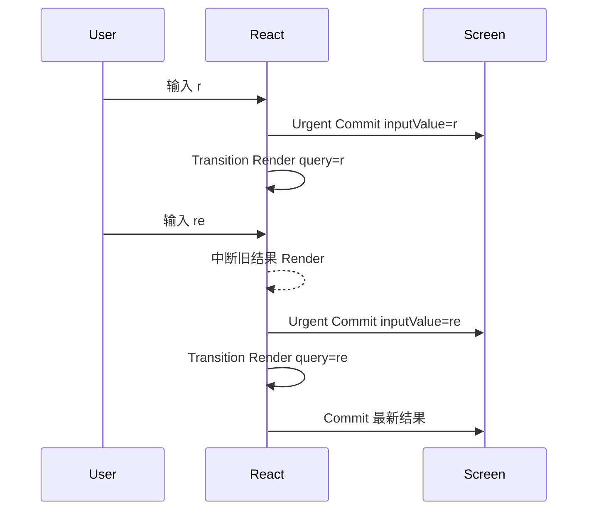

# React Transition：非阻塞更新、Pending 状态与异步 Action

> Transition 不会延迟执行事件处理函数，也不会让网络或计算变快。它标记的是一组“可以在后台准备”的 State 更新，使更紧急的输入能够打断对应 Render，并让界面在新结果完成前保留上一份可用内容。

---

## 一、本文解决什么问题

搜索、切换 Tab、路由跳转和提交表单都有类似冲突：用户希望点击或输入立即得到反馈，但目标区域可能需要昂贵 Render、数据请求或 Suspense 等待。如果所有更新都使用相同紧急程度，主线程容易先忙于结果区，输入与按钮反馈反而滞后。

本文回答以下问题：

- `startTransition` 实际标记什么；
- `useTransition` 比独立 `startTransition` 多提供什么；
- `isPending` 的开始和结束意味着什么；
- 为什么受控输入值不能作为 Transition 更新；
- Action 函数是否延迟执行；
- 当前 React 中异步 Action 与 `await` 后 Setter 有什么限制；
- 请求返回乱序为什么不会被 Transition 自动解决；
- Transition、Debounce 和 Throttle 分别控制什么；
- 数据请求库、路由器和 Suspense 如何与 Transition 分工；
- 如何测试 Pending、竞态、错误与真实交互性能。

本文以 React 18 及之后的并发能力为背景，并以 2026 年 7 月 React 官方文档描述的当前 API 为准。React 19 文档把传给 `startTransition` 的函数称为 Action，并支持异步 Action 参与 Pending；但 `await` 之后的 State 更新目前仍需额外 `startTransition` 才会被标记为 Transition。React 18 项目应保守地把 Transition 回调视为同步标记边界，并自行管理异步 Pending。具体行为必须在项目锁定的 React/React DOM 版本验证。

Lane、Transition Entanglement 和调度常量属于 React 内部实现，不是业务 API。本文只依赖“Transition 更新非阻塞、可被更紧急更新打断”等公开语义。

### 核心结论

1. `startTransition(action)` 立即调用 Action，并把符合条件的 State 更新标记为 Non-blocking Transition。
2. `useTransition()` 返回 `isPending` 和组件可用的 `startTransition`；独立 `startTransition` 无法直接提供 Pending 状态。
3. Transition 更新可被紧急更新打断和重启，不会控制正在输入的受控文本值。
4. Action 中的长同步代码仍立即阻塞主线程；Transition 只改变 State 更新优先级。
5. `isPending` 应表达目标区域正在切换，而不是无差别锁住整个页面。
6. 当前异步 Action 中，`await` 之后的 Setter 需再次包裹 `startTransition`；这是官方文档标注的已知限制。
7. Transition 不保证异步请求按发起顺序完成，必须使用取消、序号、队列或数据层解决竞态。
8. Debounce 减少工作发起次数，Transition 调整已发起 UI 更新的优先级，两者可以组合但不能互相替代。
9. 数据请求库负责缓存、去重、取消、重试和一致性；Transition 负责 React 展示切换的优先级和 Pending 体验。
10. 优化必须同时测量输入响应、Pending 时长与最终完成时间。

---

## 二、`startTransition`：标记更新，不延迟 Action

```tsx
import { startTransition } from 'react';

function selectTab(tabId: string) {
  startTransition(() => {
    setSelectedTab(tabId);
  });
}
```

React 会立即调用传入函数。函数调用过程中同步安排的相关 State 更新被标记为 Transition，后续 Render 可以在后台准备并被更紧急更新打断。

### 2.1 错误理解：Action 会稍后执行

```tsx
startTransition(() => {
  const result = runVeryExpensiveSynchronousTask(); // 现在就执行，仍阻塞
  setResult(result);
});
```

`runVeryExpensiveSynchronousTask()` 不会自动延期，也不会被 React 切开。只有由 Setter 触发的 React Render 工作获得 Transition 语义。

如果计算发生在一个组件函数内部，React 只能在 Fiber 工作单元之间让出，不能在任意函数内部抢占。大块 CPU 工作仍需算法优化、分块、虚拟化或 Web Worker。

### 2.2 `startTransition` 的适用位置

独立 API 适用于不能调用 Hook 的位置，例如：

- 状态管理模块的 Action；
- 路由器或数据层适配器；
- 普通工具函数中的 React 更新边界；
- 框架集成代码。

它不提供 `isPending`。组件需要展示 Pending UI 时，优先使用 `useTransition`。

### 2.3 只标记 State 更新

```tsx
startTransition(() => {
  analytics.track('tab_selected', { tabId });
  setSelectedTab(tabId);
});
```

Analytics 调用不会因 Transition 获得取消、重试或后台调度能力。它仍在当前调用栈执行。副作用应根据业务因果和幂等要求单独设计，不能把 `startTransition` 当通用异步调度器。

---

## 三、`useTransition`：Pending 与 Action 边界

```tsx
const [isPending, startTransition] = useTransition();
```

- `startTransition` 用于启动 Action；
- `isPending` 表示至少有该 Transition 相关工作尚未完成并展示最终状态。

```tsx
function TabContainer({ tabs }: { tabs: Tab[] }) {
  const [activeTab, setActiveTab] = useState(tabs[0].id);
  const [isPending, startTransition] = useTransition();

  function handleSelect(tabId: string) {
    startTransition(() => {
      setActiveTab(tabId);
    });
  }

  return (
    <section aria-busy={isPending}>
      <TabList
        tabs={tabs}
        activeTab={activeTab}
        pending={isPending}
        onSelect={handleSelect}
      />
      <TabPanel tabId={activeTab} />
    </section>
  );
}
```

### 3.1 Pending 不是网络请求专属状态

即使没有请求，只要 Transition Render 尚未完成，`isPending` 也可能为 `true`。反过来，一个不在当前 Action 中被等待或不与 Transition 集成的后台请求，未必会反映在 `isPending` 中。

因此要区分：

- **Transition Pending**：React 正在完成这次非阻塞 UI 切换；
- **Network Fetching**：数据层正在请求或刷新；
- **Mutation Pending**：写操作尚未确认；
- **Optimistic State**：界面先展示预测结果；
- **Suspense Fallback**：某个边界当前无法渲染内容。

这些状态可以重叠，但含义不同，不应只用一个 `loading` Boolean 混在一起。

### 3.2 `startTransition` 的引用稳定性

React 官方文档说明 `useTransition` 返回的 `startTransition` 具有稳定身份。作为 Effect 依赖时可以包含它，也可在 Lint 允许时省略；为了代码清晰，通常保留完整依赖没有问题。

---

## 四、Input Responsiveness：输入值必须保持 Urgent

搜索页面应把“输入框当前值”和“结果区使用的查询”分开：

```tsx
function ProductSearch({ products }: { products: Product[] }) {
  const [inputValue, setInputValue] = useState('');
  const [query, setQuery] = useState('');
  const [isPending, startTransition] = useTransition();

  function handleChange(event: ChangeEvent<HTMLInputElement>) {
    const nextValue = event.target.value;

    setInputValue(nextValue);

    startTransition(() => {
      setQuery(nextValue);
    });
  }

  return (
    <section>
      <input
        type="search"
        value={inputValue}
        onChange={handleChange}
        aria-label="搜索商品"
      />
      <div aria-busy={isPending}>
        {isPending && <span>正在更新结果</span>}
        <ProductResults products={products} query={query} />
      </div>
    </section>
  );
}
```

输入值是 Urgent Update，用户每次键入都应立即看到；结果查询是 Non-urgent Update，可以被下一次输入打断。



### 4.1 错误：把受控输入更新放进 Transition

```tsx
startTransition(() => {
  setInputValue(nextValue);
});
```

Transition 更新不能用于控制文本输入。输入回显可能滞后于浏览器原生输入事件，破坏受控组件契约。

### 4.2 不一定需要复制 State

`inputValue` 与 `query` 分离表示两种时间语义：用户已经输入的新值与结果区已经采用的值。如果只是希望子树延迟消费同一个值，`useDeferredValue` 往往更直接，下一篇会单独讨论。

### 4.3 Pending UI 不应反向阻塞输入

```tsx
<input disabled={isPending} />
```

通常是错误设计：Transition 的目的就是让用户能继续交互。可以对结果区域设置 `aria-busy`、显示细进度条或降低旧内容视觉权重，但不要无理由锁定输入和全页面。

---

## 五、Pending State 的产品设计

Transition 允许保留上一份已完成 UI，因此 Pending 反馈不一定是全屏 Spinner。

| 场景 | 推荐 Pending 表达 | 避免 |
|---|---|---|
| Tab 切换 | Tab 标题进度、旧内容保持可见 | 整页清空后闪烁 Spinner |
| 搜索筛选 | 结果区 `aria-busy`、轻量进度 | 禁用输入框 |
| 路由跳转 | 导航条进度、目标链接 Pending | 重复点击触发多次写请求 |
| 表单提交 | 提交按钮 Pending、防重复提交 | 把所有输入永久禁用且不解释 |
| 后台刷新 | 保留数据并显示刷新标识 | 把已有内容替换为空白 |

### 5.1 可访问性

- `aria-busy="true"` 可标记正在更新的区域；
- 状态文本可使用适度的 `aria-live="polite"`；
- 高频输入不要每个字符都播报“正在更新”；
- Pending 样式不能只依赖颜色；
- 焦点不应因后台 Commit 无故丢失；
- 提交型 Action 需防重复，但仍要允许取消或导航时给出明确反馈。

### 5.2 避免快速闪烁

极快的 Transition 可能让 Pending 指示一闪而过。是否设置最短展示时间是产品决策，不应在 React 状态层盲目延迟所有完成结果。若需要平滑视觉，可在独立显示层设计延迟出现或最短持续时间，并在卸载时清理 Timer；不要延长真实业务锁定时间。

---

## 六、Transition 中的异步边界

当前 React 官方文档允许 Action 为异步函数：

```tsx
const [isPending, startTransition] = useTransition();

function handleSave(nextQuantity: number) {
  startTransition(async () => {
    const savedQuantity = await updateQuantity(nextQuantity);

    startTransition(() => {
      setQuantity(savedQuantity);
    });
  });
}
```

需要理解两个层次：

1. 被 `await` 的异步工作可以纳入当前 Action 的 Pending 生命周期；
2. JavaScript 恢复到 `await` 之后时，React 当前无法自动保持所有 Setter 的 Transition 标记，因此 Setter 需再次包裹 `startTransition`。

这是当前官方文档明确标注的已知限制，未来版本可能变化。升级 React 后应重新核对文档，而不是永久复制嵌套写法。

### 6.1 React 18 兼容边界

React 18 时代的 Transition 主要围绕同步回调内安排的更新设计。若组件库或应用同时支持 React 18，不应假设异步 Action 会让 `isPending` 一直覆盖整个 Promise。更稳妥的方案是：

- 数据层维护 Mutation Pending；
- `startTransition` 只包裹响应完成后的非紧急 UI 更新；
- 错误、取消和请求顺序由请求状态机处理；
- 在 React 18/19 测试矩阵分别验证。

### 6.2 异步 Action 必须处理错误

```tsx
type SaveState =
  | { status: 'idle' }
  | { status: 'error'; message: string };

function QuantityEditor() {
  const [quantity, setQuantity] = useState(1);
  const [saveState, setSaveState] = useState<SaveState>({ status: 'idle' });
  const [isPending, startTransition] = useTransition();

  function saveQuantity(nextQuantity: number) {
    setSaveState({ status: 'idle' });

    startTransition(async () => {
      try {
        const savedQuantity = await quantityApi.update(nextQuantity);

        startTransition(() => {
          setQuantity(savedQuantity);
        });
      } catch (error) {
        setSaveState({
          status: 'error',
          message: toErrorMessage(error),
        });
      }
    });
  }

  return (
    <QuantityView
      quantity={quantity}
      pending={isPending}
      error={saveState.status === 'error' ? saveState.message : null}
      onSave={saveQuantity}
    />
  );
}
```

错误更新是否应是 Urgent 取决于产品语义。通常用户需要尽快看到提交失败，因此不必把错误提示降级。请求失败不能只写 Console，也不能让 Promise 形成未处理拒绝。

---

## 七、异步乱序：Transition 不替你决定“最后一次”

用户先提交数量 `2`，紧接着提交 `3`：

```text
Request(2) 发出 -> Request(3) 发出 -> Response(3) -> Response(2)
```

如果每个响应都更新 State，最终可能错误回到 `2`。React 官方文档明确提醒，普通 Transition 中的异步请求可能乱序完成；React 无法仅根据 Promise 完成顺序推断业务意图。

### 7.1 Latest-wins：请求序号与取消

```tsx
function QuantityEditor() {
  const requestIdRef = useRef(0);
  const controllerRef = useRef<AbortController | null>(null);
  const [quantity, setQuantity] = useState(1);
  const [error, setError] = useState<string | null>(null);
  const [isPending, startTransition] = useTransition();

  function saveQuantity(nextQuantity: number) {
    const requestId = ++requestIdRef.current;

    controllerRef.current?.abort();
    const controller = new AbortController();
    controllerRef.current = controller;
    setError(null);

    startTransition(async () => {
      try {
        const savedQuantity = await quantityApi.update(nextQuantity, {
          signal: controller.signal,
        });

        if (requestId !== requestIdRef.current) return;

        startTransition(() => {
          setQuantity(savedQuantity);
        });
      } catch (cause) {
        if (controller.signal.aborted) return;
        if (requestId !== requestIdRef.current) return;
        setError(toErrorMessage(cause));
      }
    });
  }

  useEffect(() => {
    return () => controllerRef.current?.abort();
  }, []);

  return (
    <QuantityView
      quantity={quantity}
      pending={isPending}
      error={error}
      onSave={saveQuantity}
    />
  );
}
```

这个方案适合“最后一次意图覆盖之前意图”的语义。需要注意：

- Abort 不保证服务端事务回滚；
- 写接口必须有幂等键或版本检查；
- 对增量命令 `+1`，Latest-wins 可能不是正确语义；
- 顺序敏感操作应串行队列或交给服务端并发控制；
- 组件卸载必须取消客户端等待。

### 7.2 不同业务需要不同顺序策略

| 业务语义 | 合适策略 |
|---|---|
| 搜索查询 | 取消旧请求或忽略旧结果，Latest-wins |
| 文档保存 | 版本号、ETag、串行队列或合并 Patch |
| 点赞计数 | 幂等操作 ID、服务端合并，不可简单丢旧请求 |
| 支付 | 幂等键、状态查询、禁止盲目重试 |
| 拖动排序 | 客户端序列号 + 服务端版本冲突处理 |

Transition 只控制 React 更新展示，不定义分布式一致性。

### 7.3 Action 工具的版本能力

当前 React 生态中的 `useActionState`、表单 Action、`useOptimistic` 以及部分框架可帮助处理常见 Action Pending、顺序或乐观 UI。它们的适用范围和版本要求不同，应在对应模块或框架文档中验证，不能假设任意自定义 Transition 自动获得相同顺序保证。

---

## 八、Transition 与防抖的区别

Transition 和 Debounce 解决不同问题：

| 维度 | Transition | Debounce |
|---|---|---|
| 工作何时开始 | Action 立即执行，更新进入并发调度 | 等待静默窗口后才执行 |
| 是否减少调用次数 | 不保证 | 是，合并短时间内多次触发 |
| 是否改善紧急输入响应 | 通过降低结果更新优先级 | 通过暂不启动工作 |
| 是否增加固定等待 | 不主动增加 | 会增加 Debounce Delay |
| 旧 Render 如何处理 | 可被打断和丢弃 | 旧任务可能根本未发起 |
| 网络请求治理 | 不负责 | 可减少请求，但仍需取消与竞态处理 |
| 典型场景 | Tab、路由、昂贵结果渲染 | 搜索联想、校验、Autosave |

### 8.1 Debounce 示例

```tsx
function SearchPage() {
  const [inputValue, setInputValue] = useState('');
  const [debouncedQuery, setDebouncedQuery] = useState('');

  useEffect(() => {
    const timerId = window.setTimeout(() => {
      setDebouncedQuery(inputValue);
    }, 250);

    return () => window.clearTimeout(timerId);
  }, [inputValue]);

  return (
    <>
      <input
        value={inputValue}
        onChange={event => setInputValue(event.target.value)}
      />
      <SearchResults query={debouncedQuery} />
    </>
  );
}
```

它减少搜索发起次数，但用户停止输入后至少等待约 250 ms。真实请求仍要 Abort 旧查询，并处理 Cache、Error 和响应乱序。

### 8.2 两者组合

常见组合是：

1. 输入值 Urgent 更新；
2. Debounce 决定何时发起查询；
3. 数据层请求、去重和缓存；
4. Transition 控制新结果或路由内容如何进入 UI；
5. Pending/Fetching 分别表达渲染与网络状态。

不要在没有测量时同时添加 Debounce、Throttle、Transition 和 Memoization。每一层都会改变时序与测试复杂度。

---

## 九、与数据请求库协作

Transition 不是 Server State 库。成熟数据层通常负责：

- Cache Key 与数据归一化；
- 请求去重与共享；
- Stale Time 与失效；
- Abort、超时和重试；
- 错误状态与 Error Boundary；
- 乐观更新和回滚；
- SSR、预取与 Hydration；
- 请求乱序和 Mutation 一致性。

React Transition 负责：

- 标记由查询条件或路由变化引发的 UI 更新为 Non-urgent；
- 在新树准备期间允许紧急输入插入；
- 与 Suspense-aware 数据源协作，尽量保留已展示内容；
- 提供 `isPending` 作为 UI 切换反馈。

### 9.1 非 Suspense 数据库的状态分工

```tsx
function ProductPage() {
  const [query, setQuery] = useState('');
  const [isPending, startTransition] = useTransition();
  const productsQuery = useProductsQuery(query);

  function handleSearch(nextQuery: string) {
    startTransition(() => {
      setQuery(nextQuery);
    });
  }

  return (
    <ProductSearchView
      products={productsQuery.data ?? []}
      transitionPending={isPending}
      fetching={productsQuery.isFetching}
      error={productsQuery.error}
      onSearch={handleSearch}
    />
  );
}
```

这里 `isPending` 与 `isFetching` 不应被视为同一状态：

- `isPending` 说明 React UI 切换仍在进行；
- `isFetching` 说明请求层在取数据；
- Cache 命中时可能 Pending 很短且不发请求；
- 后台刷新时可能 `isFetching=true`，但没有 Transition。

具体 Hook 名称和字段取决于所用库，示例表达的是职责边界，不代表某个库的固定 API。

### 9.2 Suspense-aware 数据源与路由

当框架路由器或数据层支持 Suspense 时，在 Transition 中切换路由/查询可以让 React 保留上一份已显示内容，避免立即替换成大范围 Fallback，并通过 Pending UI 提示导航正在发生。

但是否保留旧内容、Fallback 如何 Reveal、错误由哪个 Boundary 接管，取决于 Suspense Boundary 和框架实现。不能只包一层 `startTransition` 就假设缓存、请求取消与 SSR 全部完成。

### 9.3 Mutation 应优先使用数据层协议

写请求通常比读取更复杂。若库提供 Mutation、Action、Optimistic Update 和 Cache Invalidation，应让它管理服务器事实，再用 Transition 优化本地 UI 切换。不要同时在组件和数据层各维护一套 Pending、Rollback 与请求序号。

---

## 十、多个 Transition 与当前限制

当前 React 官方文档说明，多个同时进行的 Transition 可能会被批在一起。这是现阶段限制，业务不应据此推导每个 Transition 都有独立可观察 Pending 生命周期。

如果页面同时有导航、保存和筛选，应使用领域状态区分：

```typescript
type AsyncState = {
  navigation: 'idle' | 'pending';
  save: 'idle' | 'pending' | 'error';
  refresh: 'idle' | 'fetching';
};
```

不要只凭一个 `isPending` 判断所有按钮是否禁用。`isPending` 适合组件附近的 Transition 反馈；跨领域异步状态仍需明确所有者。

### 10.1 嵌套 Transition

为解决 `await` 后更新标记而嵌套 `startTransition`，与业务上创建一个全新独立事务不是一回事。不要依赖嵌套层数推导内部 Lane 或 Pending 计数。

---

## 十一、常见误区

### 11.1 “`startTransition` 会把函数放到以后执行”

错误。Action 立即运行，只有其中安排的 React State 更新获得 Transition 语义。

### 11.2 “Transition 可以控制受控输入值”

错误。文本输入更新必须同步跟随输入事件；只把昂贵结果区域标记为 Transition。

### 11.3 “`isPending` 就等于正在请求网络”

错误。它表示 Transition 工作尚未完成；网络状态应由数据层单独表达。

### 11.4 “`await` 后直接 Setter 一定仍属于 Transition”

按当前官方文档不成立。Setter 需再次包裹 `startTransition`；未来版本可能修复，应查阅锁定版本文档。

### 11.5 “Transition 会自动取消旧请求”

错误。它可能丢弃旧 Render，但 Fetch/Mutation 需要 `AbortController`、缓存层或请求协议取消。

### 11.6 “Transition 与 Debounce 可以互换”

错误。Transition 调整更新优先级，Debounce 延迟并减少工作发起次数。

### 11.7 “使用 Transition 后无需优化大列表”

错误。它改善响应性，不消除 CPU、DOM、Layout 和 Paint 成本；最终结果仍需完成。

---

## 十二、测试与验证

### 12.1 测试输入响应与最终结果

应验证：

- 输入框每次键入立即显示最新字符；
- 结果最终对应最后一次查询；
- 快速输入不会提交过期结果；
- Pending 只影响目标区域，不阻塞继续输入；
- 请求失败显示可恢复错误；
- 卸载和新请求会取消旧请求；
- 重复提交符合幂等或顺序策略。

不要断言 Transition 固定持续多少毫秒，也不要依赖特定 Render 次数。

### 12.2 用可控 Promise 测试异步 Action

创建两个手工 Resolve 的请求：

1. 启动 Action A；
2. 启动 Action B；
3. 先完成 B，断言 UI 显示 B；
4. 再完成 A，断言 UI 仍保持 B；
5. 检查 A 已 Abort 或被序号拒绝；
6. 最终 Pending 与错误状态恢复正确。

这比依赖真实网络延时或任意 `setTimeout` 更稳定。

### 12.3 测试 Debounce 与 Transition 应分层

- Fake Timer 验证 Debounce 是否减少调用；
- 可控 Promise 验证请求竞态；
- React 行为测试验证 Pending 和最终 UI；
- 浏览器测试验证输入是否真正跟手；
- 服务端测试验证幂等、版本冲突和重试。

### 12.4 性能测量

使用生产构建或 Profiling 构建、目标浏览器和代表性设备，比较：

- 输入事件到输入框 Paint 的时间；
- Interaction to Next Paint（INP）；
- React Commit Duration；
- Long Task 数量；
- Transition Pending 持续时间；
- 网络请求数量；
- 最终结果完成时间；
- 中断重启造成的额外 CPU。

Transition 可能让输入明显更快，但最终结果稍晚。两者都应记录，不能只报告优化后的输入延迟。

---

## 十三、工程检查清单

- 哪个 State 必须 Urgent，哪个区域允许后台更新；
- Action 中是否有仍会立即阻塞的长同步代码；
- 受控输入值是否留在 Transition 外；
- 是否真的需要两份 State，或更适合 `useDeferredValue`；
- `isPending` 是否只表达当前 UI 切换；
- Network、Mutation、Optimistic State 是否由独立状态表示；
- React 18/19 异步 Action 行为是否分别验证；
- `await` 后 Setter 是否按当前版本要求重新包裹；
- 异步请求是否处理 Abort、错误和响应乱序；
- 写操作是否具有幂等、版本或队列协议；
- Debounce 是否用于减少工作，而不是冒充 Transition；
- 数据请求库是否拥有 Cache、Retry、Invalidation 和 Rollback；
- 多个并行 Action 是否被错误合并成一个全局 Pending；
- 是否在生产构建和目标设备同时测量响应性与最终完成时间。

---

## 十四、总结

1. `startTransition` 立即执行 Action，只把其中的 State 更新标记为 Non-blocking Transition。
2. `useTransition` 提供 `isPending`，适合组件展示非阻塞 UI 切换状态。
3. 输入值必须作为 Urgent Update，昂贵结果区才适合 Transition。
4. Action 中的同步重计算仍会阻塞，Transition 不是任务队列或 Worker。
5. Pending State 应保留旧内容并提供局部反馈，而不是锁住整个页面。
6. 当前 React 中异步 Action 可被等待，但 `await` 后 Setter 仍需额外 `startTransition`。
7. Transition 不处理请求取消和响应乱序，必须用 Abort、序号、队列或数据层治理。
8. Debounce 减少发起次数，Transition 调整 UI 更新优先级，两者职责不同。
9. 数据请求库管理 Server State，Transition 管理 React 内容切换和交互响应。
10. 多 Transition、React 18/19 和框架集成都存在版本边界，必须以目标环境验证。

正确使用 Transition 的关键不是把更多 Setter 包起来，而是明确一份 UI 是否允许暂时显示旧内容。如果允许，React 才有空间在不牺牲输入响应的前提下准备下一份界面。

---

## 问答复盘

### Q1：`startTransition` 是否会延迟执行传入函数？

**答：** 不会。Action 立即执行；只有其中安排的 React State 更新被标记为可中断的 Transition。

### Q2：独立 `startTransition` 与 `useTransition` 如何选择？

**答：** 组件需要 Pending UI 时使用 `useTransition`；无法调用 Hook 或无需追踪 Pending 时可使用独立 `startTransition`。

### Q3：为什么不能把受控输入的 Setter 放进 Transition？

**答：** 输入值必须立即跟随键盘事件。Transition 可能延后或重启更新，会破坏输入回显；应只降级结果区域。

### Q4：`isPending=true` 是否证明网络请求正在进行？

**答：** 不证明。它表示 Transition 尚未完成；网络请求可能已缓存、尚未开始或由独立后台刷新产生。

### Q5：异步 Action 在 `await` 后为什么还要再次调用 `startTransition`？

**答：** 当前 React 无法自动把 `await` 后所有 Setter 保持在原 Transition 上下文，这是官方标注的已知限制。

### Q6：两个保存请求返回顺序相反时，Transition 会自动保留最新结果吗？

**答：** 不会。必须使用 Abort、请求序号、串行队列、版本检查或数据层 Mutation 协议定义顺序。

### Q7：Transition 与 Debounce 最关键的区别是什么？

**答：** Transition 立即开始并调整更新优先级；Debounce 等待静默窗口并减少实际调用次数。

### Q8：为什么数据请求库仍然必要？

**答：** Transition 不提供缓存、去重、重试、失效、SSR、乐观回滚和服务端一致性；这些属于 Server State 层。

### Q9：如何证明 Transition 改善了体验？

**答：** 在生产构建和目标设备对比输入 Paint、INP、Long Task、Pending 时长、请求数与最终完成时间，并验证没有旧结果和错误状态回归。

---

## 延伸知识

- **Deferred Value**：Stale Content、Background Render、Suspense 与 CPU 密集筛选。
- **Suspense**：Fallback、Reveal Strategy、Nested Boundary 与 Transition 协作。
- **Server State**：Cache、Deduplication、Invalidation、Mutation 与 Optimistic Update。
- **Action API**：`useActionState`、Form Action、`useOptimistic` 与框架集成。
- **请求一致性**：Abort、幂等键、版本控制、串行队列与补偿。
- **性能指标**：INP、Long Task、React Profiler 与最终完成时间。
